# 1.4 MMU与TLB

> **主题**: 01. CPU硬件层 - 1.4 MMU与TLB
> **覆盖**: 页表层次、地址转换、TLB管理

---

## 📋 目录

- [1.4 MMU与TLB](#14-mmu与tlb)
  - [📋 目录](#-目录)
  - [1 MMU架构](#1-mmu架构)
    - [1.1 功能](#11-功能)
    - [1.2 硬件实现](#12-硬件实现)
  - [2 页表层次](#2-页表层次)
    - [2.1 x86-64五级页表](#21-x86-64五级页表)
    - [2.2 大页支持](#22-大页支持)
  - [3 TLB管理](#3-tlb管理)
    - [3.1 TLB层次的严格分析](#31-tlb层次的严格分析)
    - [3.2 TLB未命中惩罚的严格建模](#32-tlb未命中惩罚的严格建模)
  - [4 地址转换流程](#4-地址转换流程)
    - [4.1 正常流程](#41-正常流程)
    - [4.2 缺页异常](#42-缺页异常)
  - [5 实践案例](#5-实践案例)
    - [5.1 高性能应用TLB优化](#51-高性能应用tlb优化)
    - [5.2 数据库MMU优化](#52-数据库mmu优化)
  - [6 思维导图：MMU/TLB设计决策](#6-思维导图mmutlb设计决策)
  - [7 批判性总结](#7-批判性总结)
    - [5.1 MMU/TLB设计的根本矛盾](#51-mmutlb设计的根本矛盾)
    - [5.2 2025年MMU/TLB技术趋势](#52-2025年mmutlb技术趋势)
  - [8 跨领域洞察](#8-跨领域洞察)
    - [6.1 TLB未命中的性能惩罚](#61-tlb未命中的性能惩罚)
    - [6.2 地址空间vs性能的权衡](#62-地址空间vs性能的权衡)
  - [9 多维度对比](#9-多维度对比)
    - [7.1 MMU架构对比（2025年）](#71-mmu架构对比2025年)
    - [7.2 TLB管理策略对比](#72-tlb管理策略对比)
  - [10 相关主题](#10-相关主题)

---

## 1 MMU架构

### 1.1 功能

**案例1.4.1（MMU功能）**：

MMU（Memory Management Unit）是CPU的重要组件，负责虚拟地址到物理地址的转换。

**地址转换**：

- **虚拟地址（VA）→ 物理地址（PA）**：将程序使用的虚拟地址转换为物理内存地址
- **48-bit VA → 52-bit PA（x86-64）**：x86-64架构支持48位虚拟地址和52位物理地址

**权限检查**：

- **读/写/执行权限**：检查页表项中的权限位
- **用户/内核模式**：区分用户态和内核态访问

**MMU实现**：

```c
// MMU实现（伪代码）
typedef struct {
    // CR3寄存器（页表基址）
    uint64_t cr3;

    // PCID（Process Context ID）
    uint16_t pcid;

    // TLB
    tlb_t *tlb;

    // 页表遍历器
    ptw_t *ptw;
} mmu_t;

// 地址转换
bool mmu_translate(mmu_t *mmu, uint64_t vaddr, uint64_t *paddr,
                   access_type_t access) {
    // 1. 检查TLB
    tlb_entry_t *entry = tlb_lookup(mmu->tlb, vaddr, mmu->pcid);

    if (entry != NULL) {
        // 2. TLB命中，检查权限
        if (check_permission(entry, access)) {
            *paddr = entry->paddr | (vaddr & 0xFFF);  // 页内偏移
            return true;
        } else {
            // 权限不足，触发异常
            raise_page_fault(PERMISSION_FAULT);
            return false;
        }
    }

    // 3. TLB未命中，页表遍历
    return mmu_page_walk(mmu, vaddr, paddr, access);
}

// 权限检查
bool check_permission(tlb_entry_t *entry, access_type_t access) {
    switch (access) {
    case READ:
        return entry->readable;
    case WRITE:
        return entry->writable;
    case EXECUTE:
        return entry->executable;
    default:
        return false;
    }
}
```

### 1.2 硬件实现

**案例1.4.2（硬件页表遍历器）**：

硬件页表遍历器（PTW）是现代CPU的关键优化，自动遍历页表并缓存结果。

**页表遍历器（PTW）功能**：

- **硬件自动遍历页表**：无需软件干预
- **并行查找多级页表**：并行访问多级页表，减少延迟
- **缓存转换结果到TLB**：自动更新TLB

**硬件PTW实现**：

```c
// 硬件页表遍历器实现（伪代码）
typedef struct {
    // 页表遍历状态
    struct {
        uint64_t vaddr;
        uint64_t cr3;
        int level;
        uint64_t pte_addr;
        bool in_progress;
    } walk_state;

    // 并行访问缓冲
    struct {
        uint64_t pte_addr[5];  // 5级页表
        bool valid[5];
    } parallel_buf;

    // 统计信息
    uint64_t walks_completed;
    uint64_t walks_failed;
} ptw_t;

// 页表遍历
bool mmu_page_walk(mmu_t *mmu, uint64_t vaddr, uint64_t *paddr,
                   access_type_t access) {
    ptw_t *ptw = mmu->ptw;

    // 1. 初始化遍历状态
    ptw->walk_state.vaddr = vaddr;
    ptw->walk_state.cr3 = mmu->cr3;
    ptw->walk_state.level = 0;
    ptw->walk_state.in_progress = true;

    // 2. 计算各级页表索引
    uint64_t indices[5];
    indices[0] = (vaddr >> 39) & 0x1FF;  // PML4
    indices[1] = (vaddr >> 30) & 0x1FF;  // PDPT
    indices[2] = (vaddr >> 21) & 0x1FF;  // PD
    indices[3] = (vaddr >> 12) & 0x1FF;  // PT
    indices[4] = vaddr & 0xFFF;          // 页内偏移

    // 3. 并行访问多级页表
    uint64_t base = ptw->walk_state.cr3;

    for (int level = 0; level < 5; level++) {
        // 3.1 计算页表项地址
        uint64_t pte_addr = base + indices[level] * 8;

        // 3.2 并行读取页表项（如果可能）
        if (level < 4) {
            ptw->parallel_buf.pte_addr[level] = pte_addr;
            ptw->parallel_buf.valid[level] = true;
        }

        // 3.3 读取页表项
        uint64_t pte = read_physical_memory(pte_addr);

        // 3.4 检查页表项
        if (!(pte & PTE_PRESENT)) {
            // 页表项不存在，触发缺页异常
            raise_page_fault(NOT_PRESENT);
            ptw->walks_failed++;
            return false;
        }

        // 3.5 检查权限（最后一级）
        if (level == 3) {
            if (!check_pte_permission(pte, access)) {
                raise_page_fault(PERMISSION_FAULT);
                ptw->walks_failed++;
                return false;
            }
        }

        // 3.6 提取下一级基址或物理地址
        if (level < 3) {
            base = pte & 0xFFFFFFFFFF000;  // 下一级基址
        } else {
            // 最后一级，提取物理地址
            *paddr = (pte & 0xFFFFFFFFFF000) | indices[4];

            // 4. 更新TLB
            tlb_update(mmu->tlb, vaddr, *paddr, pte, mmu->pcid);

            ptw->walks_completed++;
            return true;
        }
    }

    return false;
}
```

**深度论证：硬件PTW的性能优势**

**硬件PTW的并行模型**：

硬件PTW可以**并行访问**多级页表：

$$
\text{硬件PTW延迟} = t_{\text{串行部分}} + \max(t_{\text{并行访问}}) \approx 30\text{ns}
$$

而软件遍历需要**串行访问**：

$$
\text{软件遍历延迟} = \sum_{i=1}^{d} t_{\text{内存访问}} = d \times 80\text{ns} = 400\text{ns}
$$

其中$d$是页表深度（5级）。

**量化对比**：硬件PTW vs 软件遍历

| **方式** | **延迟** | **CPU占用** | **复杂度** |
|---------|---------|-----------|-----------|
| **软件遍历** | 400ns | 高 | 低 |
| **硬件PTW** | 30ns | 低 | 高 |

**关键洞察**：硬件PTW将页表遍历延迟降低**13倍**，是现代CPU的关键优化。

---

## 2 页表层次

### 2.1 x86-64五级页表

**案例1.4.3（x86-64页表层次）**：

x86-64使用五级页表结构，支持48位虚拟地址空间。

**页表层次结构**：

```text
CR3 (PML4基址)
  ↓
PML4 (Page Map Level 4) - 9位
  ↓
PDPT (Page Directory Pointer Table) - 9位
  ↓
PD (Page Directory) - 9位
  ↓
PT (Page Table) - 9位
  ↓
4KB页 - 12位
```

**总位数**：9+9+9+9+12 = 48位（虚拟地址）

**页表项结构**：

```c
// 页表项（PTE）结构
typedef struct {
    uint64_t present:1;        // 页是否在内存中
    uint64_t writable:1;       // 可写
    uint64_t user:1;           // 用户可访问
    uint64_t pwt:1;            // Page Write Through
    uint64_t pcd:1;            // Page Cache Disable
    uint64_t accessed:1;       // 已访问
    uint64_t dirty:1;          // 已修改
    uint64_t page_size:1;      // 页大小（0=4KB, 1=大页）
    uint64_t global:1;         // 全局页
    uint64_t available:3;      // 可用位
    uint64_t paddr:40;         // 物理地址（高40位）
    uint64_t available2:11;    // 可用位
    uint64_t nx:1;             // No Execute
} pte_t;

// 页表项访问
pte_t read_pte(uint64_t pte_addr) {
    uint64_t pte_value = read_physical_memory(pte_addr);
    return *(pte_t *)&pte_value;
}
```

### 2.2 大页支持

**案例1.4.4（大页支持）**：

大页（Huge Page）可以减少TLB未命中，提高性能。

**2MB页**：

- **跳过PT级**：在PD级直接映射2MB页
- **减少TLB未命中**：一个TLB条目覆盖2MB地址空间
- **提高TLB覆盖率**：减少TLB条目需求

**1GB页**：

- **跳过PD和PT级**：在PDPT级直接映射1GB页
- **进一步减少TLB压力**：一个TLB条目覆盖1GB地址空间
- **适用于大内存应用**：如数据库、HPC

**大页实现**：

```c
// 大页支持
bool mmu_translate_huge_page(mmu_t *mmu, uint64_t vaddr, uint64_t *paddr,
                             access_type_t access, int page_size) {
    // 1. 根据页大小确定页表级别
    int final_level;
    uint64_t page_mask;

    switch (page_size) {
    case 4 * 1024:      // 4KB
        final_level = 3;
        page_mask = 0xFFF;
        break;
    case 2 * 1024 * 1024:  // 2MB
        final_level = 2;
        page_mask = 0x1FFFFF;
        break;
    case 1024 * 1024 * 1024:  // 1GB
        final_level = 1;
        page_mask = 0x3FFFFFFF;
        break;
    default:
        return false;
    }

    // 2. 遍历到指定级别
    uint64_t base = mmu->cr3;

    for (int level = 0; level <= final_level; level++) {
        // 2.1 计算索引
        uint64_t index;
        switch (level) {
        case 0: index = (vaddr >> 39) & 0x1FF; break;
        case 1: index = (vaddr >> 30) & 0x1FF; break;
        case 2: index = (vaddr >> 21) & 0x1FF; break;
        case 3: index = (vaddr >> 12) & 0x1FF; break;
        }

        // 2.2 读取页表项
        uint64_t pte_addr = base + index * 8;
        uint64_t pte = read_physical_memory(pte_addr);

        // 2.3 检查页表项
        if (!(pte & PTE_PRESENT)) {
            raise_page_fault(NOT_PRESENT);
            return false;
        }

        // 2.4 检查是否是大页（在PD或PDPT级）
        if (level == final_level && (pte & PTE_PAGE_SIZE)) {
            // 大页，直接提取物理地址
            *paddr = (pte & 0xFFFFFFFFFF000) | (vaddr & page_mask);

            // 更新TLB（大页条目）
            tlb_update_huge(mmu->tlb, vaddr, *paddr, pte, mmu->pcid, page_size);
            return true;
        }

        // 2.5 提取下一级基址
        base = pte & 0xFFFFFFFFFF000;
    }

    return false;
}
```

---

## 3 TLB管理

### 3.1 TLB层次的严格分析

**案例1.4.5（TLB层次结构）**：

TLB（Translation Lookaside Buffer）是多级缓存结构，缓存虚拟地址到物理地址的转换。

**Intel Skylake TLB参数**：

- **L1 DTLB**：64条目（4KB页），延迟1周期
- **L2 STLB**：1536条目（统一），延迟5周期
- **L1 ITLB**：128条目（指令），延迟1周期

**ARM64 TLB参数**：

- **L1 TLB**：32-64条目，延迟1周期
- **L2 TLB**：512-1024条目，延迟3周期

**TLB实现**：

```c
// TLB实现（伪代码）
typedef struct {
    // TLB条目
    struct {
        uint64_t vaddr_tag;    // 虚拟地址标记
        uint64_t paddr;        // 物理地址
        uint16_t pcid;         // Process Context ID
        uint8_t page_size;     // 页大小（0=4KB, 1=2MB, 2=1GB）
        bool valid;            // 有效位
        bool global;           // 全局页
        uint8_t lru_bits;      // LRU位
    } entries[TLB_SIZE];

    int size;
    uint64_t hits;
    uint64_t misses;
} tlb_t;

// TLB查找
tlb_entry_t *tlb_lookup(tlb_t *tlb, uint64_t vaddr, uint16_t pcid) {
    // 1. 计算标记（虚拟地址高48位）
    uint64_t tag = vaddr >> 12;

    // 2. 并行查找所有条目
    for (int i = 0; i < tlb->size; i++) {
        if (tlb->entries[i].valid &&
            tlb->entries[i].vaddr_tag == tag &&
            (tlb->entries[i].global || tlb->entries[i].pcid == pcid)) {
            // 3. 命中，更新LRU
            tlb->hits++;
            update_lru(tlb, i);
            return &tlb->entries[i];
        }
    }

    // 4. 未命中
    tlb->misses++;
    return NULL;
}

// TLB更新
void tlb_update(tlb_t *tlb, uint64_t vaddr, uint64_t paddr,
                uint64_t pte, uint16_t pcid) {
    // 1. 计算标记
    uint64_t tag = vaddr >> 12;

    // 2. 查找替换条目（LRU）
    int replace_idx = find_lru_entry(tlb);

    // 3. 更新条目
    tlb->entries[replace_idx].vaddr_tag = tag;
    tlb->entries[replace_idx].paddr = paddr & 0xFFFFFFFFFF000;
    tlb->entries[replace_idx].pcid = pcid;
    tlb->entries[replace_idx].page_size = 0;  // 4KB
    tlb->entries[replace_idx].valid = true;
    tlb->entries[replace_idx].global = (pte & PTE_GLOBAL) != 0;

    // 4. 更新LRU
    update_lru(tlb, replace_idx);
}

// PCID支持（避免TLB刷新）
void tlb_invalidate_pcid(tlb_t *tlb, uint16_t pcid) {
    // 只使能指定PCID的条目失效，保留全局页
    for (int i = 0; i < tlb->size; i++) {
        if (tlb->entries[i].valid &&
            !tlb->entries[i].global &&
            tlb->entries[i].pcid == pcid) {
            tlb->entries[i].valid = false;
        }
    }
}
```

### 3.2 TLB未命中惩罚的严格建模

**定理1.8（TLB未命中延迟的严格分解）**：

对于TLB未命中，延迟满足：

$$
L_{\text{TLB miss}} = L_{\text{PTW}} + L_{\text{mem}} \times (d + 1)
$$

其中：

- $L_{\text{PTW}}$：页表遍历开销（~10周期）
- $L_{\text{mem}}$：单次内存访问延迟（~30ns）
- $d$：页表深度（x86-64为5级）

**证明**：页表遍历需要访问$d$级页表，每级一次内存访问。因此，总延迟为$L_{\text{PTW}} + d \times L_{\text{mem}}$。加上最终页表项访问，总延迟为$L_{\text{PTW}} + (d+1) \times L_{\text{mem}}$。∎

**延迟分解**：

- 页表遍历：8-10周期（硬件PTW）
- 内存访问：~30ns × 5级 = 150ns
- **总计**：~160ns（理论）vs 30-50ns（实际，并行优化）

**优化**：

- **大页减少未命中**：2MB页覆盖更多地址空间
- **PCID避免刷新**：进程切换时保留TLB条目

**批判性分析**：

1. **TLB容量的权衡**：更大TLB提高命中率，但**增加硬件复杂度和功耗**。

2. **页表深度的代价**：更深页表（如5级）**增加遍历延迟**，但支持更大地址空间。

3. **2025年趋势**：**硬件PTW并行优化**使实际延迟远低于理论值，但仍有优化空间。

---

## 4 地址转换流程

### 4.1 正常流程

**案例1.4.6（地址转换流程）**：

地址转换是MMU的核心功能，涉及TLB查找和页表遍历。

**地址转换流程**：

```text
1. CPU发出虚拟地址
2. 检查L1 TLB
   ├─ 命中 → 直接使用物理地址
   └─ 未命中 → 继续
3. 检查L2 TLB
   ├─ 命中 → 更新L1 TLB
   └─ 未命中 → 继续
4. 硬件PTW遍历页表
5. 更新TLB
6. 访问物理内存
```

**地址转换实现**：

```c
// 完整地址转换流程
bool complete_address_translation(mmu_t *mmu, uint64_t vaddr,
                                  uint64_t *paddr, access_type_t access) {
    // 1. 检查L1 TLB
    tlb_entry_t *entry = tlb_lookup(mmu->tlb_l1, vaddr, mmu->pcid);

    if (entry != NULL) {
        // L1 TLB命中
        if (check_permission(entry, access)) {
            *paddr = entry->paddr | (vaddr & 0xFFF);
            return true;
        } else {
            raise_page_fault(PERMISSION_FAULT);
            return false;
        }
    }

    // 2. 检查L2 TLB
    entry = tlb_lookup(mmu->tlb_l2, vaddr, mmu->pcid);

    if (entry != NULL) {
        // L2 TLB命中，更新L1 TLB
        tlb_update(mmu->tlb_l1, vaddr, entry->paddr, entry->pte, mmu->pcid);

        if (check_permission(entry, access)) {
            *paddr = entry->paddr | (vaddr & 0xFFF);
            return true;
        } else {
            raise_page_fault(PERMISSION_FAULT);
            return false;
        }
    }

    // 3. TLB未命中，页表遍历
    uint64_t pte;
    if (mmu_page_walk(mmu, vaddr, paddr, access, &pte)) {
        // 4. 更新TLB（L1和L2）
        tlb_update(mmu->tlb_l1, vaddr, *paddr, pte, mmu->pcid);
        tlb_update(mmu->tlb_l2, vaddr, *paddr, pte, mmu->pcid);
        return true;
    }

    return false;
}
```

### 4.2 缺页异常

**案例1.4.7（缺页异常处理）**：

缺页异常是虚拟内存系统的关键机制，由OS处理。

**缺页异常触发条件**：

- **页表项不存在（Present=0）**：页不在内存中
- **权限不足**：访问权限不匹配
- **写时复制（COW）**：需要复制页

**缺页异常处理流程**：

```c
// 缺页异常处理（OS侧）
void handle_page_fault(page_fault_info_t *info) {
    // 1. 获取虚拟地址和错误类型
    uint64_t vaddr = info->vaddr;
    fault_type_t type = info->type;

    // 2. 查找VMA（Virtual Memory Area）
    vma_t *vma = find_vma(current->mm, vaddr);

    if (vma == NULL) {
        // 无效地址，发送SIGSEGV
        send_signal(current, SIGSEGV);
        return;
    }

    // 3. 检查权限
    if (type == PERMISSION_FAULT) {
        if (!check_vma_permission(vma, info->access)) {
            send_signal(current, SIGSEGV);
            return;
        }
    }

    // 4. 分配物理页
    struct page *page = alloc_page(GFP_KERNEL);

    if (page == NULL) {
        // 内存不足，OOM处理
        handle_oom();
        return;
    }

    // 5. 建立页表项
    pte_t *pte = get_pte(current->mm->pgd, vaddr, true);

    if (pte == NULL) {
        free_page(page);
        return;
    }

    // 6. 设置页表项
    set_pte(pte, page_to_pfn(page), vma->vm_flags);

    // 7. 如果是写时复制，需要复制页内容
    if (vma->vm_flags & VM_COW) {
        copy_page(page, vma->cow_page);
    } else {
        // 清零页
        clear_page(page_address(page));
    }

    // 8. 刷新TLB
    flush_tlb_page(vaddr);
}
```

---

## 5 实践案例

### 5.1 高性能应用TLB优化

**案例1.4.8（高性能应用TLB优化）**：

某高性能计算应用优化TLB使用，提高性能。

**优化策略**：

**1. 使用大页**：

```c
// 分配2MB大页
void *allocate_huge_page(size_t size) {
    void *ptr = mmap(NULL, size, PROT_READ | PROT_WRITE,
                     MAP_PRIVATE | MAP_ANONYMOUS | MAP_HUGETLB,
                     -1, 0);

    if (ptr == MAP_FAILED) {
        // 回退到普通页
        ptr = mmap(NULL, size, PROT_READ | PROT_WRITE,
                   MAP_PRIVATE | MAP_ANONYMOUS, -1, 0);
    }

    return ptr;
}
```

**2. PCID优化**：

```c
// 使用PCID避免TLB刷新
void set_pcid(int pcid) {
    // 设置CR4.PCIDE
    uint64_t cr4 = read_cr4();
    cr4 |= CR4_PCIDE;
    write_cr4(cr4);

    // 设置CR3.PCID
    uint64_t cr3 = read_cr3();
    cr3 = (cr3 & ~0xFFF) | pcid;
    write_cr3(cr3);
}
```

**优化效果**：

| **指标** | **优化前** | **优化后** | **改善** |
|---------|-----------|-----------|---------|
| **TLB未命中率** | 5% | 1% | -80% |
| **页表遍历次数** | 1000/s | 200/s | -80% |
| **性能提升** | 基准 | +15% | 提升 |

### 5.2 数据库MMU优化

**案例1.4.9（数据库MMU优化）**：

某数据库系统优化MMU使用，提高查询性能。

**优化策略**：

**1. 大页优化**：

```c
// 数据库缓冲区使用大页
void *db_buffer_alloc(size_t size) {
    // 使用1GB大页
    void *ptr = mmap(NULL, size, PROT_READ | PROT_WRITE,
                     MAP_PRIVATE | MAP_ANONYMOUS | MAP_HUGETLB | MAP_HUGE_1GB,
                     -1, 0);

    return ptr;
}
```

**2. 页表预加载**：

```c
// 预加载页表项
void preload_page_table(uint64_t vaddr, size_t size) {
    for (uint64_t addr = vaddr; addr < vaddr + size; addr += 4096) {
        // 触发页表遍历，填充TLB
        volatile char c = *(char *)addr;
        (void)c;  // 避免优化
    }
}
```

**优化效果**：

| **指标** | **优化前** | **优化后** | **改善** |
|---------|-----------|-----------|---------|
| **TLB命中率** | 85% | 98% | +15% |
| **查询延迟** | 10ms | 8ms | -20% |
| **吞吐量** | 1000 QPS | 1200 QPS | +20% |

## 6 思维导图：MMU/TLB设计决策

```mermaid
mindmap
  root((MMU/TLB设计))
    页表设计
      页表深度
        更深支持更大地址空间
        但遍历延迟增加
      页大小
        更大页减少TLB压力
        但内存浪费
      页表结构
        层次化简单
        但遍历开销
    TLB设计
      TLB容量
        更大提高命中率
        但硬件复杂
      TLB层次
        L1/L2分离
        但管理复杂
      TLB一致性
        PCID优化
        但硬件支持
    地址转换
      硬件PTW
        自动遍历
        但延迟较高
      软件PTW
        灵活控制
        但延迟更高
      并行优化
        减少延迟
        但硬件复杂
```



---

## 7 批判性总结

### 5.1 MMU/TLB设计的根本矛盾

1. **地址空间vs性能**：更大地址空间需要更深页表，但**增加遍历延迟**。

2. **TLB容量vs功耗**：更大TLB提高命中率，但**增加硬件成本和功耗**。

3. **通用性vs专用性**：通用MMU灵活，但**某些应用（如实时系统）需要专用设计**。

### 5.2 2025年MMU/TLB技术趋势

- **硬件加速PTW**：更快的页表遍历，**挑战软件优化**。
- **可变页大小**：根据工作负载动态调整页大小，**提升效率**。
- **安全增强**：内存加密、完整性保护，**增加MMU复杂度**。

---

## 8 跨领域洞察

### 6.1 TLB未命中的性能惩罚

**核心命题**：TLB未命中导致页表遍历，延迟显著增加。

**延迟分解**：

```text
TLB命中: 1ns (L1 DTLB)
TLB未命中: 30-50ns (页表遍历)
  - L1 DTLB查找: 1ns
  - 页表遍历: 20-30ns (5级页表)
  - 缓存未命中: 10-20ns
  - TLB更新: 1ns
```

**性能影响**：TLB未命中率1%时，平均延迟增加0.3-0.5ns，**性能下降1-2%**。

**批判性分析**：

1. **TLB容量的限制**：TLB容量有限（64-1536条目），**大内存应用未命中率高**。

2. **巨页的优化**：使用2MB/1GB巨页**减少TLB条目数**，但**可能浪费内存**。

3. **2025年趋势**：**硬件加速PTW**（如Intel）减少页表遍历延迟，但**仍有物理限制**。

### 6.2 地址空间vs性能的权衡

**核心矛盾**：更大地址空间需要更深页表，但增加遍历延迟。

**量化分析**：

| **地址空间** | **页表层级** | **遍历延迟** | **TLB容量需求** | **适用场景** |
|------------|------------|------------|---------------|------------|
| **32位** | 2级 | 10ns | 64条目 | 嵌入式 |
| **48位** | 4级 | 30ns | 256条目 | 通用系统 |
| **57位** | 5级 | 50ns | 1536条目 | 大内存系统 |

**批判性分析**：

1. **延迟的层级性**：每增加一级页表，**遍历延迟增加约10ns**。

2. **TLB容量的需求**：更大地址空间需要**更多TLB条目**，但硬件成本增加。

3. **2025年趋势**：**可变页大小**根据工作负载动态调整，挑战传统固定页大小。

---

## 9 多维度对比

### 7.1 MMU架构对比（2025年）

| **架构** | **页表层级** | **TLB容量** | **PTW延迟** | **硬件加速** | **代表厂商** |
|---------|------------|------------|------------|------------|------------|
| **x86-64** | 5级 (PML5) | 1536条目 | 50ns | Intel PTW | Intel/AMD |
| **ARMv9** | 4级 | 1024条目 | 30ns | ARM PTW | ARM |
| **RISC-V** | 2-4级可配 | 64-512条目 | 10-30ns | 可选 | RISC-V |

**批判性分析**：

1. **架构的差异**：x86-64支持更大地址空间，但**延迟更高**；RISC-V灵活，但**生态较弱**。

2. **硬件加速的重要性**：硬件PTW**显著减少延迟**，但增加硬件复杂度。

3. **2025年趋势**：**统一MMU架构**（如CXL）可能挑战传统边界。

### 7.2 TLB管理策略对比

| **策略** | **命中率** | **延迟** | **复杂度** | **适用场景** |
|---------|-----------|---------|-----------|------------|
| **固定大小** | 中 | 低 | ⭐ | 简单系统 |
| **多级TLB** | 高 | 低 | ⭐⭐⭐ | 通用系统 |
| **PCID优化** | 高 | 低 | ⭐⭐⭐ | 多进程系统 |
| **巨页优化** | 高 | 低 | ⭐⭐ | 大内存应用 |

**批判性分析**：

1. **命中率vs复杂度**：多级TLB命中率高，但**实现复杂**；固定大小简单，但**命中率低**。

2. **PCID的必要性**：PCID避免TLB刷新，**性能提升明显**，但需要硬件支持。

3. **2025年趋势**：**自适应TLB管理**根据工作负载动态调整，挑战静态设计。

---

## 10 相关主题

- [1.3 内存子系统](./01.3_内存子系统.md) - 内存与MMU协同
- [3.2 内存管理模型](../03_OS抽象层/03.2_内存管理模型.md) - OS页表管理
- [7.2 延迟穿透分析](../07_性能优化与安全/07.2_延迟穿透分析.md) - TLB延迟优化
- [9.2 硬件-OS映射证明](../09_形式化理论与证明/09.2_硬件-OS映射证明.md) - MMU形式化
- [主文档：TLB分析](../schedule_formal_view.md#知识图谱概念关系链) - 完整分析

---

**最后更新**: 2025-01-XX
