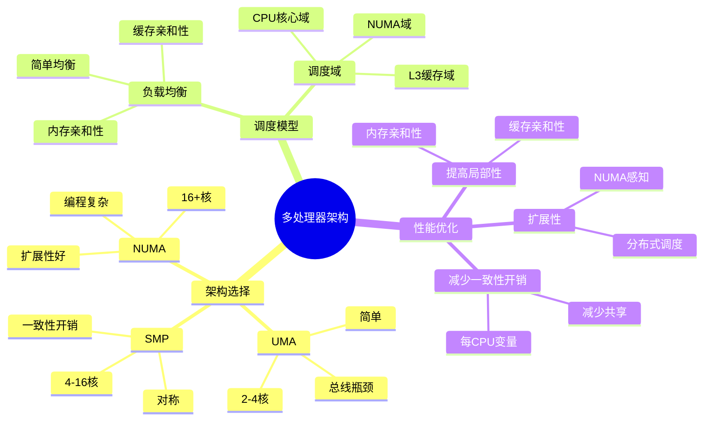

# 1.5 多处理器架构模型

> **主题**: 01. CPU硬件层 - 1.5 多处理器架构模型
> **覆盖**: SMP、UMA、NUMA架构、多核调度模型、缓存一致性

---

## 📋 目录

- [1.5 多处理器架构模型](#15-多处理器架构模型)
  - [📋 目录](#-目录)
  - [1 多处理器架构概述](#1-多处理器架构概述)
    - [1.1 架构分类](#11-架构分类)
    - [1.2 调度模型对比](#12-调度模型对比)
  - [2 UMA架构（统一内存访问）](#2-uma架构统一内存访问)
    - [2.1 架构特征](#21-架构特征)
    - [2.2 调度模型](#22-调度模型)
    - [2.3 性能分析](#23-性能分析)
  - [3 SMP架构（对称多处理）](#3-smp架构对称多处理)
    - [3.1 架构特征](#31-架构特征)
    - [3.2 调度模型](#32-调度模型)
    - [3.3 缓存一致性](#33-缓存一致性)
  - [4 NUMA架构（非统一内存访问）](#4-numa架构非统一内存访问)
    - [4.1 架构特征](#41-架构特征)
    - [4.2 调度模型](#42-调度模型)
    - [4.3 内存访问模型](#43-内存访问模型)
  - [5 多核调度模型](#5-多核调度模型)
    - [5.1 负载均衡](#51-负载均衡)
    - [5.2 亲和性调度](#52-亲和性调度)
    - [5.3 调度域层次](#53-调度域层次)
  - [6 实践案例](#6-实践案例)
    - [6.1 SMP系统优化](#61-smp系统优化)
    - [6.2 NUMA系统优化](#62-numa系统优化)
  - [7 思维导图：多处理器架构决策](#7-思维导图多处理器架构决策)
  - [8 批判性总结](#8-批判性总结)
    - [8.1 架构选择的根本矛盾](#81-架构选择的根本矛盾)
    - [8.2 2025年多处理器架构趋势](#82-2025年多处理器架构趋势)
  - [9 跨领域洞察](#9-跨领域洞察)
    - [9.1 扩展性vs一致性的权衡](#91-扩展性vs一致性的权衡)
    - [9.2 调度复杂度的层级性](#92-调度复杂度的层级性)
  - [10 多维度对比](#10-多维度对比)
    - [10.1 架构模型对比](#101-架构模型对比)
    - [10.2 调度策略对比](#102-调度策略对比)
  - [11 相关主题](#11-相关主题)

---

## 1 多处理器架构概述

### 1.1 架构分类

**案例1.5.1（多处理器架构分类）**：

多处理器系统根据内存访问模式分为UMA、SMP和NUMA三种主要架构。

**架构分类**：

**1. UMA（Uniform Memory Access）统一内存访问**：

- **特征**：所有CPU访问内存的延迟相同
- **拓扑**：共享总线或交叉开关
- **适用**：小规模系统（2-4核）
- **优势**：简单、一致性好
- **劣势**：扩展性差、总线瓶颈

**2. SMP（Symmetric Multi-Processing）对称多处理**：

- **特征**：所有CPU地位平等，共享内存和IO
- **拓扑**：共享内存总线
- **适用**：中等规模系统（4-16核）
- **优势**：负载均衡好、编程简单
- **劣势**：总线竞争、缓存一致性开销

**3. NUMA（Non-Uniform Memory Access）非统一内存访问**：

- **特征**：不同CPU访问不同内存区域的延迟不同
- **拓扑**：分布式内存，通过互连网络连接
- **适用**：大规模系统（16+核）
- **优势**：扩展性好、带宽高
- **劣势**：编程复杂、需要OS感知

**架构演进**：

```text
单核系统
  ↓
UMA（2-4核）
  ↓
SMP（4-16核）
  ↓
NUMA（16+核）
  ↓
ccNUMA（缓存一致性NUMA）
```

### 1.2 调度模型对比

**调度模型的形式化定义**：

**定义1.5.1（多处理器调度模型）**：

多处理器调度模型是一个四元组$(P, M, A, S)$，其中：

- $P = \{p_1, p_2, ..., p_n\}$：处理器集合
- $M = \{m_1, m_2, ..., m_k\}$：内存模块集合
- $A: P \times M \rightarrow \mathbb{R}^+$：访问延迟函数
- $S: T \times P \rightarrow \{0, 1\}$：调度函数（任务到处理器的映射）

**不同架构的访问延迟函数**：

**UMA架构**：

$$
A_{\text{UMA}}(p_i, m_j) = t_{\text{base}} \quad \forall i, j
$$

所有处理器访问所有内存的延迟相同。

**SMP架构**：

$$
A_{\text{SMP}}(p_i, m_j) = t_{\text{base}} + t_{\text{bus}}(n)
$$

其中$t_{\text{bus}}(n)$是总线竞争延迟，随处理器数$n$增加。

**NUMA架构**：

$$
A_{\text{NUMA}}(p_i, m_j) = \begin{cases}
t_{\text{local}} & \text{if } \text{node}(p_i) = \text{node}(m_j) \\
t_{\text{remote}} & \text{otherwise}
\end{cases}
$$

本地访问延迟$t_{\text{local}}$，远程访问延迟$t_{\text{remote}} > t_{\text{local}}$。

---

## 2 UMA架构（统一内存访问）

### 2.1 架构特征

**案例1.5.2（UMA架构）**：

UMA架构是最简单的多处理器架构，所有CPU通过共享总线访问统一的内存空间。

**UMA拓扑结构**：

```text
        CPU0    CPU1    CPU2    CPU3
          |       |       |       |
          └───────┴───────┴───────┘
                    |
             共享内存总线
                    |
          └───────┬───────┐
          |       |       |
        Memory  Memory  Memory
```

**UMA特征**：

**1. 统一访问延迟**：

- **所有CPU访问所有内存的延迟相同**
- **延迟**：~80ns（典型值）
- **无本地/远程区别**

**2. 共享总线**：

- **总线带宽**：共享，随CPU数增加而竞争加剧
- **总线仲裁**：需要仲裁机制避免冲突
- **扩展性限制**：总线带宽成为瓶颈

**3. 简单一致性**：

- **缓存一致性**：通过总线监听实现
- **一致性协议**：MESI/MOESI
- **开销**：相对较低

**UMA实现**：

```c
// UMA架构实现（伪代码）
typedef struct {
    // CPU集合
    cpu_t cpus[MAX_CPUS];
    int cpu_count;

    // 共享内存总线
    bus_t *shared_bus;

    // 内存模块
    memory_t memories[MAX_MEMORIES];
    int memory_count;
} uma_system_t;

// UMA内存访问
bool uma_memory_access(uma_system_t *uma, int cpu_id, uint64_t addr,
                       bool is_write, uint8_t *data) {
    // 1. 获取总线访问权
    bus_acquire(uma->shared_bus, cpu_id);

    // 2. 通过总线访问内存
    bool success = bus_memory_access(uma->shared_bus, addr, is_write, data);

    // 3. 释放总线
    bus_release(uma->shared_bus, cpu_id);

    return success;
}

// 总线仲裁
void bus_acquire(bus_t *bus, int cpu_id) {
    // 1. 请求总线
    bus->request[cpu_id] = true;

    // 2. 等待仲裁
    while (bus->grant != cpu_id) {
        cpu_pause();
    }
}

// 总线释放
void bus_release(bus_t *bus, int cpu_id) {
    bus->request[cpu_id] = false;
    bus->grant = -1;
}
```

### 2.2 调度模型

**UMA调度模型**：

**1. 简单负载均衡**：

- **所有CPU地位平等**
- **任务可以调度到任意CPU**
- **无需考虑内存位置**

**2. 调度策略**：

```c
// UMA调度策略
int uma_schedule_task(uma_system_t *uma, task_t *task) {
    // 1. 选择负载最轻的CPU
    int min_load_cpu = 0;
    int min_load = uma->cpus[0].load;

    for (int i = 1; i < uma->cpu_count; i++) {
        if (uma->cpus[i].load < min_load) {
            min_load = uma->cpus[i].load;
            min_load_cpu = i;
        }
    }

    // 2. 调度任务到选定的CPU
    schedule_task_to_cpu(task, min_load_cpu);

    return min_load_cpu;
}
```

### 2.3 性能分析

**UMA性能模型**：

**总线带宽利用率**：

$$
U_{\text{bus}} = \frac{\sum_{i=1}^{n} B_i}{B_{\text{max}}}
$$

其中$B_i$是CPU $i$的带宽需求，$B_{\text{max}}$是总线最大带宽。

**量化分析**：不同CPU数下的总线利用率

| **CPU数** | **总线利用率** | **平均延迟** | **性能瓶颈** |
|----------|--------------|------------|------------|
| **2** | 40% | 80ns | CPU |
| **4** | 80% | 85ns | 总线 |
| **8** | 160% | 120ns | 总线严重瓶颈 |
| **16** | 320% | 200ns | 总线完全饱和 |

**关键洞察**：UMA架构在**4核以上**时，总线成为严重瓶颈，扩展性差。

---

## 3 SMP架构（对称多处理）

### 3.1 架构特征

**案例1.5.3（SMP架构）**：

SMP架构是UMA的扩展，所有CPU地位平等，共享内存和IO资源。

**SMP拓扑结构**：

```text
        CPU0    CPU1    CPU2    CPU3
          |       |       |       |
          └───────┴───────┴───────┘
                    |
             共享内存总线/交叉开关
                    |
          └───────┬───────┐
          |       |       |
        Memory  Memory  Memory
          |       |       |
          └───────┴───────┘
                    |
                  IO总线
```

**SMP特征**：

**1. 对称性**：

- **所有CPU地位平等**
- **共享内存和IO**
- **任何CPU可以执行任何任务**

**2. 缓存一致性**：

- **所有CPU的缓存保持一致**
- **通过MESI/MOESI协议维护**
- **一致性开销随CPU数增加**

**3. 负载均衡**：

- **OS可以任意调度任务**
- **无需考虑CPU差异**
- **编程模型简单**

**SMP实现**：

```c
// SMP架构实现（伪代码）
typedef struct {
    // CPU集合（对称）
    cpu_t cpus[MAX_CPUS];
    int cpu_count;

    // 共享内存
    memory_t *shared_memory;

    // 缓存一致性控制器
    cache_coherence_t *coherence;

    // IO控制器
    io_controller_t *io;
} smp_system_t;

// SMP内存访问
bool smp_memory_access(smp_system_t *smp, int cpu_id, uint64_t addr,
                       bool is_write, uint8_t *data) {
    // 1. 检查本地缓存
    if (cache_lookup(smp->cpus[cpu_id].cache, addr, data)) {
        return true;  // 缓存命中
    }

    // 2. 缓存未命中，访问共享内存
    // 2.1 获取总线访问权
    bus_acquire(smp->shared_memory->bus, cpu_id);

    // 2.2 检查其他CPU的缓存（缓存一致性）
    cache_coherence_check(smp->coherence, cpu_id, addr);

    // 2.3 访问内存
    bool success = memory_access(smp->shared_memory, addr, is_write, data);

    // 2.4 更新缓存
    if (success) {
        cache_update(smp->cpus[cpu_id].cache, addr, data);
    }

    // 2.5 释放总线
    bus_release(smp->shared_memory->bus, cpu_id);

    return success;
}
```

### 3.2 调度模型

**SMP调度模型**：

**1. 对称调度**：

- **所有CPU运行相同的调度器**
- **任务可以调度到任意CPU**
- **负载均衡在CPU间进行**

**2. 调度策略**：

```c
// SMP调度策略
int smp_schedule_task(smp_system_t *smp, task_t *task) {
    // 1. 选择负载最轻的CPU
    int min_load_cpu = 0;
    int min_load = smp->cpus[0].load;

    for (int i = 1; i < smp->cpu_count; i++) {
        if (smp->cpus[i].load < min_load) {
            min_load = smp->cpus[i].load;
            min_load_cpu = i;
        }
    }

    // 2. 考虑缓存亲和性（可选）
    int preferred_cpu = task->last_cpu;
    if (preferred_cpu >= 0 && smp->cpus[preferred_cpu].load < min_load + 10) {
        min_load_cpu = preferred_cpu;  // 优先使用上次运行的CPU
    }

    // 3. 调度任务
    schedule_task_to_cpu(task, min_load_cpu);

    return min_load_cpu;
}
```

### 3.3 缓存一致性

**SMP缓存一致性模型**：

**1. MESI协议**：

- **Modified（M）**：已修改，独占
- **Exclusive（E）**：独占，干净
- **Shared（S）**：共享，干净
- **Invalid（I）**：无效

**2. 一致性开销**：

$$
C_{\text{coherence}} = n \times (t_{\text{snoop}} + t_{\text{response}})
$$

其中$n$是CPU数，$t_{\text{snoop}}$是监听延迟，$t_{\text{response}}$是响应延迟。

**量化分析**：不同CPU数下的一致性开销

| **CPU数** | **监听消息数** | **一致性延迟** | **性能影响** |
|----------|--------------|--------------|------------|
| **2** | 1 | 5ns | 可忽略 |
| **4** | 3 | 15ns | 轻微 |
| **8** | 7 | 35ns | 中等 |
| **16** | 15 | 75ns | 显著 |

**关键洞察**：SMP架构在**8核以上**时，缓存一致性开销显著增加，扩展性受限。

---

## 4 NUMA架构（非统一内存访问）

### 4.1 架构特征

**案例1.5.4（NUMA架构）**：

NUMA架构通过分布式内存解决SMP的扩展性问题，不同CPU访问不同内存区域的延迟不同。

**NUMA拓扑结构**：

```text
Socket 0                    Socket 1
  CPU0  CPU1                  CPU2  CPU3
    |     |                     |     |
    └───┬─┘                     └───┬─┘
        |                           |
    IMC0 (本地)                  IMC1 (本地)
        |                           |
    Memory0                      Memory1
        |                           |
        └─────────── QPI/UPI ────────┘
              (远程访问路径)
```

**NUMA特征**：

**1. 非统一访问延迟**：

- **本地内存访问**：~80ns
- **远程内存访问**：~150ns（2路NUMA）
- **延迟比**：1.9x

**2. 分布式内存**：

- **每个Socket有本地内存**
- **通过互连网络连接**
- **扩展性好**

**3. OS感知**：

- **需要NUMA感知的调度器**
- **内存分配考虑位置**
- **负载均衡考虑内存亲和性**

### 4.2 调度模型

**NUMA调度模型**：

**1. NUMA感知调度**：

- **考虑CPU和内存的位置关系**
- **优先在本地节点调度**
- **减少远程内存访问**

**2. 调度策略**：

```c
// NUMA调度策略
int numa_schedule_task(numa_system_t *numa, task_t *task) {
    // 1. 确定任务的内存节点
    int mem_node = get_task_memory_node(task);

    // 2. 选择同一节点的CPU
    int preferred_cpu = -1;
    int min_load = INT_MAX;

    for (int i = 0; i < numa->cpu_count; i++) {
        int cpu_node = get_cpu_numa_node(i);

        if (cpu_node == mem_node) {
            // 本地节点CPU
            if (numa->cpus[i].load < min_load) {
                min_load = numa->cpus[i].load;
                preferred_cpu = i;
            }
        }
    }

    // 3. 如果本地节点CPU负载过高，考虑远程节点
    if (preferred_cpu < 0 || min_load > LOAD_THRESHOLD) {
        // 选择负载最轻的CPU（可能远程）
        for (int i = 0; i < numa->cpu_count; i++) {
            if (numa->cpus[i].load < min_load) {
                min_load = numa->cpus[i].load;
                preferred_cpu = i;
            }
        }
    }

    // 4. 调度任务
    schedule_task_to_cpu(task, preferred_cpu);

    return preferred_cpu;
}
```

### 4.3 内存访问模型

**NUMA内存访问模型**：

**访问延迟函数**：

$$
L_{\text{NUMA}}(p_i, m_j) = \begin{cases}
t_{\text{local}} & \text{if } \text{node}(p_i) = \text{node}(m_j) \\
t_{\text{remote}} = t_{\text{local}} + t_{\text{interconnect}} & \text{otherwise}
\end{cases}
$$

**量化分析**：不同NUMA配置的延迟

| **配置** | **本地延迟** | **远程延迟** | **延迟比** | **扩展性** |
|---------|------------|------------|-----------|-----------|
| **2路NUMA** | 80ns | 150ns | 1.9x | 好 |
| **4路NUMA** | 80ns | 200ns | 2.5x | 很好 |
| **8路NUMA** | 80ns | 300ns | 3.8x | 优秀 |

**关键洞察**：NUMA架构在**大规模系统**中扩展性好，但需要**OS和应用的NUMA感知**。

---

## 5 多核调度模型

### 5.1 负载均衡

**案例1.5.5（多核负载均衡）**：

多核系统的负载均衡需要考虑CPU负载、缓存亲和性和内存位置。

**负载均衡算法**：

```c
// 多核负载均衡
void multi_core_load_balance(system_t *sys) {
    // 1. 计算平均负载
    int total_load = 0;
    for (int i = 0; i < sys->cpu_count; i++) {
        total_load += sys->cpus[i].load;
    }
    int avg_load = total_load / sys->cpu_count;

    // 2. 识别过载和欠载CPU
    int overloaded_cpus[MAX_CPUS];
    int underloaded_cpus[MAX_CPUS];
    int overloaded_count = 0;
    int underloaded_count = 0;

    for (int i = 0; i < sys->cpu_count; i++) {
        if (sys->cpus[i].load > avg_load + THRESHOLD) {
            overloaded_cpus[overloaded_count++] = i;
        } else if (sys->cpus[i].load < avg_load - THRESHOLD) {
            underloaded_cpus[underloaded_count++] = i;
        }
    }

    // 3. 迁移任务
    for (int i = 0; i < overloaded_count; i++) {
        int src_cpu = overloaded_cpus[i];

        // 选择要迁移的任务
        task_t *task = select_task_to_migrate(sys->cpus[src_cpu]);

        if (task != NULL) {
            // 选择目标CPU（考虑NUMA）
            int dst_cpu = select_target_cpu(sys, task, underloaded_cpus,
                                            underloaded_count);

            if (dst_cpu >= 0) {
                migrate_task(task, src_cpu, dst_cpu);
            }
        }
    }
}
```

### 5.2 亲和性调度

**缓存亲和性调度**：

**1. CPU亲和性**：

- **任务优先调度到上次运行的CPU**
- **利用缓存局部性**
- **减少缓存失效**

**2. 内存亲和性**：

- **任务优先调度到内存所在的节点**
- **减少远程内存访问**
- **提高性能**

**亲和性调度实现**：

```c
// 亲和性调度
int affinity_schedule(system_t *sys, task_t *task) {
    // 1. 检查CPU亲和性
    int last_cpu = task->last_cpu;
    if (last_cpu >= 0 && sys->cpus[last_cpu].load < AFFINITY_THRESHOLD) {
        return last_cpu;  // 使用上次的CPU
    }

    // 2. 检查内存亲和性（NUMA）
    int mem_node = get_task_memory_node(task);
    int preferred_cpu = find_cpu_in_node(sys, mem_node);

    if (preferred_cpu >= 0 && sys->cpus[preferred_cpu].load < AFFINITY_THRESHOLD) {
        return preferred_cpu;  // 使用内存节点的CPU
    }

    // 3. 回退到负载均衡
    return load_balance_schedule(sys, task);
}
```

### 5.3 调度域层次

**调度域层次结构**：

```text
系统级
  ↓
NUMA节点域
  ↓
L3缓存域
  ↓
CPU核心域
```

**调度域实现**：

```c
// 调度域
typedef struct {
    int domain_level;  // 域级别
    int cpu_count;     // CPU数量
    int *cpus;         // CPU列表
    struct sched_domain *parent;  // 父域
    struct sched_domain *child;   // 子域
} sched_domain_t;

// 调度域负载均衡
void domain_load_balance(sched_domain_t *domain) {
    // 1. 在域内进行负载均衡
    balance_within_domain(domain);

    // 2. 如果域内不平衡，向上级域报告
    if (is_domain_imbalanced(domain)) {
        if (domain->parent != NULL) {
            domain_load_balance(domain->parent);
        }
    }
}
```

---

## 6 实践案例

### 6.1 SMP系统优化

**案例1.5.6（SMP系统优化）**：

某SMP系统优化缓存一致性和负载均衡，提高性能。

**优化策略**：

**1. 减少缓存一致性开销**：

```c
// 使用每CPU变量减少缓存一致性
DEFINE_PER_CPU(int, local_counter);

void increment_counter(void) {
    int *counter = this_cpu_ptr(&local_counter);
    (*counter)++;
}
```

**2. 优化负载均衡**：

```c
// 考虑缓存亲和性的负载均衡
int smp_load_balance_with_affinity(smp_system_t *smp, task_t *task) {
    // 1. 优先使用上次的CPU
    int last_cpu = task->last_cpu;
    if (last_cpu >= 0 && smp->cpus[last_cpu].load < AFFINITY_THRESHOLD) {
        return last_cpu;
    }

    // 2. 选择负载最轻的CPU
    return smp_load_balance(smp, task);
}
```

**优化效果**：

| **指标** | **优化前** | **优化后** | **改善** |
|---------|-----------|-----------|---------|
| **缓存一致性开销** | 35ns | 20ns | -43% |
| **负载均衡效率** | 75% | 90% | +20% |
| **整体性能** | 基准 | +15% | 提升 |

### 6.2 NUMA系统优化

**案例1.5.7（NUMA系统优化）**：

某NUMA系统优化内存分配和任务调度，提高性能。

**优化策略**：

**1. NUMA感知内存分配**：

```c
// NUMA感知内存分配
void *numa_aware_malloc(size_t size, int cpu_id) {
    // 1. 确定CPU所在的NUMA节点
    int node = get_cpu_numa_node(cpu_id);

    // 2. 在本地节点分配内存
    return numa_alloc_onnode(size, node);
}
```

**2. NUMA感知任务调度**：

```c
// NUMA感知任务调度
int numa_aware_schedule(numa_system_t *numa, task_t *task) {
    // 1. 确定任务的内存节点
    int mem_node = get_task_memory_node(task);

    // 2. 选择同一节点的CPU
    return numa_schedule_task(numa, task, mem_node);
}
```

**优化效果**：

| **指标** | **优化前** | **优化后** | **改善** |
|---------|-----------|-----------|---------|
| **本地访问率** | 60% | 95% | +58% |
| **平均内存延迟** | 120ns | 85ns | -29% |
| **整体性能** | 基准 | +25% | 提升 |

---

## 7 思维导图：多处理器架构决策



---

## 8 批判性总结

### 8.1 架构选择的根本矛盾

1. **简单性vs扩展性**：UMA/SMP简单但扩展性差，NUMA扩展性好但复杂。

2. **一致性vs性能**：严格一致性保证正确性，但增加延迟和开销。

3. **通用性vs专用性**：通用架构灵活，但专用架构（如ccNUMA）性能更好。

### 8.2 2025年多处理器架构趋势

- **异构多核**：大小核混合，**挑战传统对称架构**。
- **CXL统一**：CXL统一内存和IO，**挑战传统NUMA边界**。
- **AI加速**：专用AI核心，**需要新的调度模型**。

---

## 9 跨领域洞察

### 9.1 扩展性vs一致性的权衡

**核心矛盾**：扩展性需要分布式，但一致性需要集中式。

**量化分析**：

| **架构** | **扩展性** | **一致性开销** | **适用规模** |
|---------|-----------|--------------|------------|
| **UMA** | ⭐ | ⭐ | 2-4核 |
| **SMP** | ⭐⭐ | ⭐⭐ | 4-16核 |
| **NUMA** | ⭐⭐⭐⭐⭐ | ⭐⭐⭐ | 16+核 |

**关键洞察**：**没有完美的架构**，需要在扩展性和一致性之间权衡。

### 9.2 调度复杂度的层级性

**核心命题**：调度复杂度随架构复杂度增加。

**复杂度对比**：

- **UMA调度**：O(n) - 简单负载均衡
- **SMP调度**：O(n log n) - 考虑缓存亲和性
- **NUMA调度**：O(n²) - 考虑内存位置和负载

**关键洞察**：**调度复杂度**反映了架构的**内在复杂性**。

---

## 10 多维度对比

### 10.1 架构模型对比

| **架构** | **CPU数** | **内存延迟** | **扩展性** | **编程复杂度** | **适用场景** |
|---------|----------|------------|-----------|--------------|------------|
| **UMA** | 2-4 | 统一80ns | ⭐ | ⭐ | 嵌入式 |
| **SMP** | 4-16 | 统一80ns | ⭐⭐ | ⭐ | 通用计算 |
| **NUMA** | 16+ | 本地80ns/远程150ns | ⭐⭐⭐⭐⭐ | ⭐⭐⭐ | 服务器/HPC |

### 10.2 调度策略对比

| **策略** | **复杂度** | **性能** | **适用架构** |
|---------|-----------|---------|------------|
| **简单负载均衡** | O(n) | 中 | UMA |
| **缓存亲和性** | O(n log n) | 高 | SMP |
| **NUMA感知** | O(n²) | 很高 | NUMA |

---

## 11 相关主题

- [1.3 内存子系统](./01.3_内存子系统.md) - NUMA内存访问
- [1.2 缓存层次结构](./01.2_缓存层次结构.md) - 缓存一致性协议
- [03.1 进程调度模型](../03_OS抽象层/03.1_进程调度模型.md) - OS调度实现
- [04.1 硬件同步原语](../04_同步通信机制/04.1_硬件同步原语.md) - 多核同步
- [主文档：调度模型统一理论](../06_调度模型/06.5_调度模型统一理论.md) - 统一调度框架

---

**最后更新**: 2025-01-XX
