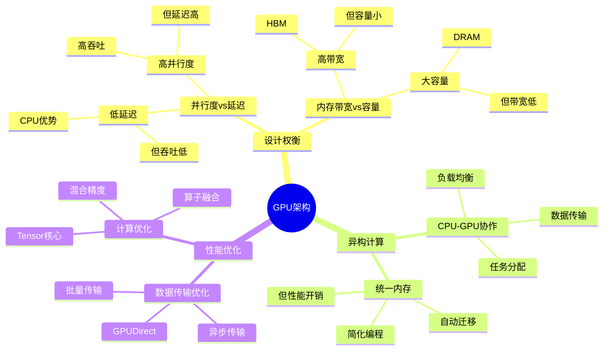

# 1.6 GPU架构与异构计算

> **主题**: 01. CPU硬件层 - 1.6 GPU架构与异构计算
> **覆盖**: GPU架构、CPU-GPU交互、内存层次、异构调度模型

---

## 📋 目录

- [1.6 GPU架构与异构计算](#16-gpu架构与异构计算)
  - [📋 目录](#-目录)
  - [1 GPU架构概述](#1-gpu架构概述)
    - [1.1 GPU vs CPU架构差异](#11-gpu-vs-cpu架构差异)
    - [1.2 GPU核心组件](#12-gpu核心组件)
  - [2 GPU微架构](#2-gpu微架构)
    - [2.1 流多处理器（SM）](#21-流多处理器sm)
    - [2.2 CUDA核心与Tensor核心](#22-cuda核心与tensor核心)
    - [2.3 显存层次结构](#23-显存层次结构)
  - [3 CPU-GPU交互模型](#3-cpu-gpu交互模型)
    - [3.1 PCIe互连](#31-pcie互连)
    - [3.2 数据传输模型](#32-数据传输模型)
    - [3.3 同步机制](#33-同步机制)
  - [4 内存层次与统一内存](#4-内存层次与统一内存)
    - [4.1 CPU内存 vs GPU显存](#41-cpu内存-vs-gpu显存)
    - [4.2 统一内存架构（UMA）](#42-统一内存架构uma)
    - [4.3 零拷贝与GPUDirect](#43-零拷贝与gpudirect)
  - [5 异构计算调度模型](#5-异构计算调度模型)
    - [5.1 任务分配策略](#51-任务分配策略)
    - [5.2 负载均衡](#52-负载均衡)
    - [5.3 资源调度](#53-资源调度)
  - [6 实践案例](#6-实践案例)
    - [6.1 深度学习训练优化](#61-深度学习训练优化)
    - [6.2 科学计算加速](#62-科学计算加速)
  - [7 思维导图：GPU架构决策](#7-思维导图gpu架构决策)
  - [8 批判性总结](#8-批判性总结)
    - [8.1 GPU架构的根本矛盾](#81-gpu架构的根本矛盾)
    - [8.2 2025年GPU技术趋势](#82-2025年gpu技术趋势)
  - [9 跨领域洞察](#9-跨领域洞察)
    - [9.1 并行度vs延迟的权衡](#91-并行度vs延迟的权衡)
    - [9.2 内存墙在GPU上的体现](#92-内存墙在gpu上的体现)
  - [10 多维度对比](#10-多维度对比)
    - [10.1 CPU vs GPU对比](#101-cpu-vs-gpu对比)
    - [10.2 GPU架构演进对比](#102-gpu架构演进对比)
  - [11 相关主题](#11-相关主题)

---

## 1 GPU架构概述

### 1.1 GPU vs CPU架构差异

**案例1.6.1（GPU vs CPU架构）**：

GPU（Graphics Processing Unit）和CPU在架构设计上有根本性差异，反映了不同的计算范式。

**架构差异对比**：

| **维度** | **CPU** | **GPU** |
|---------|---------|---------|
| **设计目标** | 低延迟、复杂控制流 | 高吞吐、数据并行 |
| **核心数** | 4-128核 | 1000-10000+核心 |
| **缓存层次** | 大容量L3缓存 | 小容量共享内存 |
| **控制单元** | 复杂分支预测 | 简单SIMD执行 |
| **内存带宽** | 50-200GB/s | 500-3000GB/s |
| **适用场景** | 通用计算、串行任务 | 并行计算、图形渲染 |

**形式化定义**：

**定义1.6.1（GPU计算模型）**：

GPU计算模型是一个五元组$(C, M, B, S, P)$，其中：

- $C = \{c_1, c_2, ..., c_n\}$：计算核心集合（CUDA核心）
- $M$：显存（VRAM）
- $B$：带宽（内存带宽）
- $S$：调度器（Warp调度器）
- $P$：并行度（同时执行的线程数）

**GPU计算能力**：

$$
\text{GPU性能} = \text{核心数} \times \text{频率} \times \text{并行度} \times \text{内存带宽利用率}
$$

**量化对比**：NVIDIA A100 vs Intel Xeon

| **指标** | **A100 GPU** | **Xeon CPU** | **比值** |
|---------|-------------|-------------|---------|
| **核心数** | 6912 CUDA核心 | 64核心 | 108x |
| **内存带宽** | 2039GB/s | 200GB/s | 10x |
| **单核延迟** | 高（SIMD） | 低（标量） | - |
| **并行吞吐** | 极高 | 中等 | 100x+ |

### 1.2 GPU核心组件

**GPU核心组件**：

**1. 流多处理器（SM - Streaming Multiprocessor）**：

- **功能**：GPU的基本执行单元
- **组成**：CUDA核心、共享内存、寄存器文件
- **数量**：A100有108个SM

**2. 显存（VRAM - Video RAM）**：

- **类型**：HBM2/HBM3（高带宽内存）
- **容量**：40GB-80GB（A100）
- **带宽**：2000GB/s+

**3. 内存控制器**：

- **功能**：管理显存访问
- **带宽**：多通道并行访问
- **延迟**：~100ns（比CPU内存略高）

**GPU架构实现**：

```c
// GPU架构实现（伪代码）
typedef struct {
    // 流多处理器集合
    sm_t sms[MAX_SMS];
    int sm_count;

    // 显存
    vram_t *vram;

    // 内存控制器
    memory_controller_t *mem_ctrl;

    // 调度器
    warp_scheduler_t *scheduler;

    // PCIe接口
    pcie_interface_t *pcie;
} gpu_t;

// GPU初始化
void gpu_init(gpu_t *gpu) {
    // 1. 初始化SM
    for (int i = 0; i < gpu->sm_count; i++) {
        sm_init(&gpu->sms[i], i);
    }

    // 2. 初始化显存
    vram_init(gpu->vram);

    // 3. 初始化内存控制器
    mem_ctrl_init(gpu->mem_ctrl);

    // 4. 初始化调度器
    scheduler_init(gpu->scheduler);
}
```

---

## 2 GPU微架构

### 2.1 流多处理器（SM）

**案例1.6.2（流多处理器架构）**：

SM是GPU的核心执行单元，负责执行CUDA线程块。

**SM架构**：

```text
SM (Streaming Multiprocessor)
  ├─ CUDA核心 (64个)
  ├─ Tensor核心 (4个)
  ├─ 共享内存 (164KB)
  ├─ 寄存器文件 (65536个32位寄存器)
  ├─ L1缓存/共享内存 (192KB)
  └─ Warp调度器 (4个)
```

**SM执行模型**：

**1. Warp（线程束）**：

- **定义**：32个线程的集合，SIMD执行
- **调度**：Warp调度器选择就绪的Warp执行
- **并行度**：每个SM同时执行多个Warp

**2. 线程块（Block）**：

- **定义**：多个Warp的集合
- **分配**：分配到SM执行
- **共享内存**：线程块内共享

**SM实现**：

```c
// SM实现（伪代码）
typedef struct {
    // CUDA核心
    cuda_core_t cores[64];

    // Tensor核心
    tensor_core_t tensor_cores[4];

    // 共享内存
    shared_memory_t shared_mem;

    // 寄存器文件
    register_file_t reg_file;

    // Warp调度器
    warp_scheduler_t schedulers[4];

    // 活跃的Warp
    warp_t active_warps[MAX_WARPS];
    int active_warp_count;
} sm_t;

// SM执行Warp
void sm_execute_warp(sm_t *sm, warp_t *warp) {
    // 1. 选择就绪的Warp
    warp_t *ready_warp = scheduler_select_warp(sm->schedulers, warp);

    if (ready_warp == NULL) {
        return;  // 没有就绪的Warp
    }

    // 2. 执行Warp（SIMD）
    for (int i = 0; i < 32; i++) {
        if (ready_warp->threads[i].active) {
            // 执行线程指令
            execute_instruction(&ready_warp->threads[i], sm);
        }
    }

    // 3. 更新Warp状态
    update_warp_state(ready_warp);
}
```

### 2.2 CUDA核心与Tensor核心

**CUDA核心**：

**1. 功能**：

- **通用计算**：执行浮点和整数运算
- **SIMD执行**：32个线程同时执行相同指令
- **吞吐优先**：高吞吐，延迟较高

**2. 性能特征**：

- **FP32性能**：A100约19.5 TFLOPS
- **FP64性能**：A100约9.7 TFLOPS
- **延迟**：~10-20周期

**Tensor核心**：

**1. 功能**：

- **矩阵运算**：专门优化矩阵乘加（MMA）
- **混合精度**：FP16/INT8/BF16
- **AI加速**：深度学习训练和推理

**2. 性能特征**：

- **FP16性能**：A100约312 TFLOPS
- **INT8性能**：A100约624 TOPS
- **延迟**：~5-10周期

**Tensor核心实现**：

```c
// Tensor核心矩阵乘加
void tensor_core_mma(tensor_core_t *tc, matrix_t *A, matrix_t *B, matrix_t *C) {
    // 1. 加载矩阵A和B
    load_matrix_A(tc, A);
    load_matrix_B(tc, B);

    // 2. 执行矩阵乘加
    // C = A × B + C
    for (int i = 0; i < 16; i++) {
        for (int j = 0; j < 16; j++) {
            float sum = 0;
            for (int k = 0; k < 16; k++) {
                sum += A->data[i][k] * B->data[k][j];
            }
            C->data[i][j] += sum;
        }
    }

    // 3. 写回结果
    store_matrix_C(tc, C);
}
```

### 2.3 显存层次结构

**显存层次**：

```text
寄存器 (最快，容量最小)
  ↓
共享内存/L1缓存 (快，容量小)
  ↓
L2缓存 (中等，容量中等)
  ↓
显存/HBM (慢，容量大)
  ↓
系统内存 (最慢，通过PCIe)
```

**显存层次参数**：

| **层级** | **容量** | **延迟** | **带宽** | **位置** |
|---------|---------|---------|---------|---------|
| **寄存器** | 65536×32位 | 1周期 | - | SM内 |
| **共享内存** | 164KB | 20-30周期 | 高 | SM内 |
| **L2缓存** | 40MB | 100-200周期 | 2000GB/s | GPU内 |
| **HBM显存** | 40-80GB | 300-500周期 | 2000GB/s | GPU板卡 |
| **系统内存** | 128GB+ | 1000+周期 | 50GB/s | CPU侧 |

**显存访问实现**：

```c
// 显存访问
bool vram_access(gpu_t *gpu, uint64_t addr, bool is_write, void *data) {
    // 1. 检查L2缓存
    if (l2_cache_lookup(gpu->l2_cache, addr, data)) {
        return true;  // L2缓存命中
    }

    // 2. L2缓存未命中，访问HBM
    bool success = hbm_access(gpu->vram, addr, is_write, data);

    if (success && !is_write) {
        // 3. 更新L2缓存
        l2_cache_update(gpu->l2_cache, addr, data);
    }

    return success;
}
```

---

## 3 CPU-GPU交互模型

### 3.1 PCIe互连

**案例1.6.3（PCIe互连）**：

CPU和GPU通过PCIe总线连接，PCIe带宽是CPU-GPU数据传输的瓶颈。

**PCIe版本对比**：

| **版本** | **带宽（x16）** | **延迟** | **代表产品** |
|---------|---------------|---------|------------|
| **PCIe 3.0** | 16GB/s | ~1μs | 2010-2017 |
| **PCIe 4.0** | 32GB/s | ~0.5μs | 2017-2021 |
| **PCIe 5.0** | 64GB/s | ~0.3μs | 2021+ |
| **PCIe 6.0** | 128GB/s | ~0.2μs | 2023+ |

**PCIe带宽瓶颈**：

$$
\text{PCIe利用率} = \frac{\text{实际传输带宽}}{\text{PCIe理论带宽}}
$$

对于深度学习训练，PCIe利用率通常为**30-50%**，成为瓶颈。

**PCIe实现**：

```c
// PCIe数据传输
bool pcie_transfer(pcie_interface_t *pcie, void *src, void *dst,
                   size_t size, bool cpu_to_gpu) {
    // 1. 准备DMA传输
    dma_descriptor_t desc;
    desc.src_addr = (uint64_t)src;
    desc.dst_addr = (uint64_t)dst;
    desc.size = size;
    desc.direction = cpu_to_gpu ? CPU_TO_GPU : GPU_TO_CPU;

    // 2. 启动DMA传输
    dma_start(pcie->dma, &desc);

    // 3. 等待传输完成
    while (!dma_complete(pcie->dma, &desc)) {
        cpu_pause();
    }

    return true;
}
```

### 3.2 数据传输模型

**数据传输流程**：

```text
CPU内存 → PCIe → GPU显存 → GPU计算 → GPU显存 → PCIe → CPU内存
```

**数据传输优化**：

**1. 异步传输**：

- **重叠计算和传输**：计算和传输并行
- **流水线**：隐藏传输延迟
- **性能提升**：20-30%

**2. 批量传输**：

- **减少传输次数**：合并小传输
- **提高PCIe利用率**：减少开销
- **性能提升**：10-15%

**异步传输实现**：

```c
// 异步数据传输
void async_transfer(gpu_t *gpu, void *cpu_data, void *gpu_data, size_t size) {
    // 1. 启动异步传输
    cuda_stream_t stream;
    cuda_stream_create(&stream);

    cuda_memcpy_async(gpu_data, cpu_data, size,
                      cudaMemcpyHostToDevice, stream);

    // 2. 在传输的同时执行其他计算
    // ... 其他GPU计算 ...

    // 3. 等待传输完成
    cuda_stream_synchronize(stream);
    cuda_stream_destroy(stream);
}
```

### 3.3 同步机制

**CPU-GPU同步**：

**1. 事件同步**：

- **CUDA事件**：标记GPU执行点
- **CPU等待**：CPU等待GPU事件
- **延迟**：~1-10μs

**2. 流同步**：

- **CUDA流**：独立的执行队列
- **流同步**：等待流完成
- **多流并行**：提高GPU利用率

**同步实现**：

```c
// CPU-GPU同步
void cpu_gpu_sync(gpu_t *gpu) {
    // 1. 创建CUDA事件
    cuda_event_t event;
    cuda_event_create(&event);

    // 2. 在GPU流中记录事件
    cuda_event_record(event, gpu->stream);

    // 3. CPU等待事件
    cuda_event_synchronize(event);

    // 4. 销毁事件
    cuda_event_destroy(event);
}
```

---

## 4 内存层次与统一内存

### 4.1 CPU内存 vs GPU显存

**内存对比**：

| **特性** | **CPU内存（DRAM）** | **GPU显存（HBM）** |
|---------|-------------------|------------------|
| **容量** | 128GB-2TB | 40GB-80GB |
| **带宽** | 50-200GB/s | 2000GB/s+ |
| **延迟** | 80ns | 300-500ns |
| **访问方式** | 随机访问 | 顺序访问优化 |
| **成本** | 低 | 高 |

**内存访问模式差异**：

**CPU内存**：

- **随机访问**：支持高效的随机访问
- **缓存优化**：大容量缓存减少延迟
- **延迟敏感**：低延迟优先

**GPU显存**：

- **顺序访问**：顺序访问性能高
- **合并访问**：合并访问提高带宽
- **带宽优先**：高带宽优先

### 4.2 统一内存架构（UMA）

**案例1.6.4（统一内存）**：

统一内存（Unified Memory）允许CPU和GPU共享同一内存空间，简化编程。

**统一内存优势**：

**1. 简化编程**：

- **无需显式传输**：自动管理数据传输
- **统一地址空间**：CPU和GPU使用相同指针
- **降低复杂度**：减少代码量

**2. 动态分配**：

- **按需传输**：数据按需在CPU和GPU间传输
- **自动迁移**：OS自动管理数据迁移
- **灵活性**：适应动态工作负载

**统一内存实现**：

```c
// 统一内存分配
void *unified_malloc(size_t size) {
    // 1. 分配统一内存
    void *ptr;
    cuda_malloc_managed(&ptr, size);

    // 2. 设置访问策略
    cuda_mem_advise(ptr, size, cudaMemAdviseSetPreferredLocation,
                    cudaCpuDeviceId);

    return ptr;
}

// 统一内存访问（自动迁移）
void access_unified_memory(void *ptr, size_t size, bool on_gpu) {
    if (on_gpu) {
        // GPU访问，自动迁移到GPU
        cuda_mem_prefetch_async(ptr, size, 0, 0);
    } else {
        // CPU访问，自动迁移到CPU
        cuda_mem_prefetch_async(ptr, size, cudaCpuDeviceId, 0);
    }
}
```

### 4.3 零拷贝与GPUDirect

**零拷贝（Zero-Copy）**：

**1. 原理**：

- **直接访问**：GPU直接访问CPU内存
- **无需传输**：避免PCIe传输
- **延迟降低**：减少传输延迟

**2. 限制**：

- **带宽受限**：受PCIe带宽限制
- **延迟较高**：跨PCIe访问延迟高
- **适用场景**：小数据、低频率访问

**GPUDirect**：

**1. GPUDirect RDMA**：

- **直接访问**：GPU直接访问网络设备
- **绕过CPU**：减少CPU参与
- **延迟降低**：~5-10μs（vs 50-100μs）

**2. GPUDirect Storage**：

- **直接访问**：GPU直接访问存储
- **绕过CPU内存**：减少内存拷贝
- **带宽提升**：充分利用NVMe带宽

**GPUDirect实现**：

```c
// GPUDirect RDMA
void gpudirect_rdma(gpu_t *gpu, network_device_t *netdev,
                    void *gpu_data, size_t size) {
    // 1. 注册GPU内存到网络设备
    void *registered_mem;
    netdev_register_memory(netdev, gpu_data, size, &registered_mem);

    // 2. 直接传输（绕过CPU）
    netdev_send_direct(netdev, registered_mem, size);

    // 3. 注销内存
    netdev_unregister_memory(netdev, registered_mem);
}
```

---

## 5 异构计算调度模型

### 5.1 任务分配策略

**案例1.6.5（异构任务分配）**：

异构计算系统需要智能分配任务到CPU或GPU，最大化整体性能。

**任务分配策略**：

**1. 基于计算密度**：

- **高计算密度**：分配到GPU
- **低计算密度**：分配到CPU
- **阈值**：计算密度 > 10 ops/byte → GPU

**2. 基于数据大小**：

- **大数据**：GPU（高带宽）
- **小数据**：CPU（低延迟）
- **阈值**：数据大小 > 1MB → GPU

**任务分配实现**：

```c
// 异构任务分配
device_t select_device(task_t *task) {
    // 1. 计算任务特征
    float compute_density = task->ops / task->data_size;
    size_t data_size = task->data_size;

    // 2. 基于计算密度分配
    if (compute_density > COMPUTE_DENSITY_THRESHOLD) {
        return GPU;  // 高计算密度 → GPU
    }

    // 3. 基于数据大小分配
    if (data_size > DATA_SIZE_THRESHOLD) {
        return GPU;  // 大数据 → GPU
    }

    // 4. 默认CPU
    return CPU;
}
```

### 5.2 负载均衡

**异构负载均衡**：

**1. CPU-GPU负载均衡**：

- **监控负载**：监控CPU和GPU利用率
- **动态迁移**：根据负载迁移任务
- **性能优化**：最大化资源利用率

**2. 多GPU负载均衡**：

- **任务分割**：将任务分割到多个GPU
- **数据并行**：数据并行执行
- **同步协调**：协调多GPU执行

**负载均衡实现**：

```c
// 异构负载均衡
void heterogeneous_load_balance(system_t *sys) {
    // 1. 计算CPU和GPU负载
    float cpu_load = calculate_cpu_load(sys);
    float gpu_load = calculate_gpu_load(sys);

    // 2. 如果负载不平衡，迁移任务
    if (cpu_load > gpu_load + THRESHOLD) {
        // CPU过载，迁移任务到GPU
        task_t *task = select_task_to_migrate(sys->cpu_queue);
        if (task != NULL && is_gpu_suitable(task)) {
            migrate_task_to_gpu(task);
        }
    } else if (gpu_load > cpu_load + THRESHOLD) {
        // GPU过载，迁移任务到CPU
        task_t *task = select_task_to_migrate(sys->gpu_queue);
        if (task != NULL && is_cpu_suitable(task)) {
            migrate_task_to_cpu(task);
        }
    }
}
```

### 5.3 资源调度

**异构资源调度**：

**1. 优先级调度**：

- **高优先级**：实时任务优先
- **低优先级**：批处理任务延后
- **QoS保证**：保证关键任务性能

**2. 抢占式调度**：

- **抢占**：高优先级任务抢占低优先级
- **上下文保存**：保存被抢占任务状态
- **恢复**：恢复被抢占任务执行

**资源调度实现**：

```c
// 异构资源调度
void heterogeneous_schedule(system_t *sys) {
    // 1. 按优先级排序任务
    sort_tasks_by_priority(sys->task_queue);

    // 2. 分配资源
    for (int i = 0; i < sys->task_queue->count; i++) {
        task_t *task = sys->task_queue->tasks[i];

        // 2.1 选择设备
        device_t device = select_device(task);

        // 2.2 检查资源可用性
        if (is_resource_available(device, task)) {
            // 2.3 调度任务
            schedule_task(task, device);
        } else {
            // 2.4 等待资源
            enqueue_task(task, device);
        }
    }
}
```

---

## 6 实践案例

### 6.1 深度学习训练优化

**案例1.6.6（深度学习训练优化）**：

某深度学习训练系统优化CPU-GPU协作，提高训练效率。

**优化策略**：

**1. 数据传输优化**：

```c
// 重叠计算和传输
void optimized_training(gpu_t *gpu, batch_t *batches, int batch_count) {
    cuda_stream_t compute_stream, transfer_stream;
    cuda_stream_create(&compute_stream);
    cuda_stream_create(&transfer_stream);

    for (int i = 0; i < batch_count; i++) {
        // 1. 异步传输下一个batch（与当前计算重叠）
        if (i + 1 < batch_count) {
            cuda_memcpy_async(gpu->input_buffer, batches[i+1].data,
                              batches[i+1].size, cudaMemcpyHostToDevice,
                              transfer_stream);
        }

        // 2. 执行当前batch计算
        train_kernel<<<blocks, threads, 0, compute_stream>>>(
            gpu->input_buffer, gpu->output_buffer);

        // 3. 同步
        cuda_stream_synchronize(compute_stream);
    }

    cuda_stream_destroy(compute_stream);
    cuda_stream_destroy(transfer_stream);
}
```

**2. 混合精度训练**：

```c
// 使用Tensor核心加速
void mixed_precision_training(gpu_t *gpu, model_t *model) {
    // 1. 前向传播使用FP16
    forward_kernel_fp16<<<blocks, threads>>>(model);

    // 2. 损失计算使用FP32
    loss_kernel_fp32<<<blocks, threads>>>(model);

    // 3. 反向传播使用FP16
    backward_kernel_fp16<<<blocks, threads>>>(model);
}
```

**优化效果**：

| **指标** | **优化前** | **优化后** | **改善** |
|---------|-----------|-----------|---------|
| **训练速度** | 基准 | +40% | 提升 |
| **GPU利用率** | 60% | 85% | +42% |
| **PCIe利用率** | 30% | 50% | +67% |

### 6.2 科学计算加速

**案例1.6.7（科学计算加速）**：

某科学计算应用使用GPU加速矩阵运算，提高计算性能。

**优化策略**：

**1. 矩阵乘法优化**：

```c
// 使用Tensor核心加速矩阵乘法
void optimized_matmul(gpu_t *gpu, matrix_t *A, matrix_t *B, matrix_t *C) {
    // 1. 使用Tensor核心
    wmma::fragment<wmma::matrix_a, 16, 16, 16, half, wmma::row_major> frag_a;
    wmma::fragment<wmma::matrix_b, 16, 16, 16, half, wmma::col_major> frag_b;
    wmma::fragment<wmma::accumulator, 16, 16, 16, float> frag_c;

    // 2. 加载矩阵
    wmma::load_matrix_sync(frag_a, A->data, 16);
    wmma::load_matrix_sync(frag_b, B->data, 16);

    // 3. 矩阵乘加
    wmma::mma_sync(frag_c, frag_a, frag_b, frag_c);

    // 4. 写回结果
    wmma::store_matrix_sync(C->data, frag_c, 16, wmma::mem_row_major);
}
```

**优化效果**：

| **指标** | **CPU实现** | **GPU实现** | **加速比** |
|---------|------------|------------|-----------|
| **矩阵乘法（1024×1024）** | 100ms | 0.5ms | 200x |
| **FFT（1M点）** | 50ms | 0.2ms | 250x |
| **Monte Carlo模拟** | 1000ms | 10ms | 100x |

---

## 7 思维导图：GPU架构决策



---

## 8 批判性总结

### 8.1 GPU架构的根本矛盾

1. **并行度vs延迟**：GPU追求高并行度，但单线程延迟高，不适合延迟敏感任务。

2. **带宽vs容量**：GPU显存带宽高但容量小，CPU内存容量大但带宽低。

3. **通用性vs专用性**：通用GPU灵活但效率低，专用加速器效率高但灵活性差。

### 8.2 2025年GPU技术趋势

- **CXL统一内存**：CPU和GPU共享内存池，**挑战传统内存边界**。
- **光互连**：替代PCIe，**带宽Tb/s级，延迟<1μs**。
- **AI专用核心**：Tensor核心持续演进，**支持更大矩阵运算**。

---

## 9 跨领域洞察

### 9.1 并行度vs延迟的权衡

**核心矛盾**：GPU追求高并行度，但单线程延迟高。

**量化分析**：

| **设备** | **并行度** | **单线程延迟** | **适用场景** |
|---------|-----------|--------------|------------|
| **CPU** | 低（4-128线程） | 低（1-10ns） | 延迟敏感 |
| **GPU** | 高（10000+线程） | 高（100-1000ns） | 吞吐优先 |

**关键洞察**：**没有完美的设备**，需要在并行度和延迟之间权衡。

### 9.2 内存墙在GPU上的体现

**核心命题**：GPU虽然带宽高，但容量小，形成"显存墙"。

**量化分析**：

- **GPU显存**：40-80GB，带宽2000GB/s
- **CPU内存**：128GB-2TB，带宽200GB/s
- **显存墙**：大模型无法完全放入显存，需要模型并行

**关键洞察**：**显存墙**是GPU计算的主要瓶颈，需要**模型并行**和**梯度检查点**等技术。

---

## 10 多维度对比

### 10.1 CPU vs GPU对比

| **维度** | **CPU** | **GPU** | **优势方** |
|---------|---------|---------|-----------|
| **核心数** | 4-128 | 1000-10000+ | GPU |
| **单核性能** | 高 | 低 | CPU |
| **并行度** | 低 | 高 | GPU |
| **内存带宽** | 200GB/s | 2000GB/s | GPU |
| **内存容量** | 128GB-2TB | 40-80GB | CPU |
| **延迟** | 低 | 高 | CPU |
| **吞吐** | 中 | 高 | GPU |
| **适用场景** | 通用计算 | 并行计算 | - |

### 10.2 GPU架构演进对比

| **架构** | **SM数** | **CUDA核心** | **显存** | **带宽** | **代表产品** |
|---------|---------|-------------|---------|---------|------------|
| **Kepler** | 15 | 2880 | 6GB GDDR5 | 288GB/s | GTX 780 |
| **Pascal** | 56 | 3584 | 16GB HBM2 | 900GB/s | P100 |
| **Volta** | 80 | 5120 | 16GB HBM2 | 900GB/s | V100 |
| **Ampere** | 108 | 6912 | 40GB HBM2 | 2039GB/s | A100 |
| **Hopper** | 132 | 16896 | 80GB HBM3 | 3000GB/s | H100 |

---

## 11 相关主题

- [1.1 CPU微架构](./01.1_CPU微架构.md) - CPU架构对比
- [1.3 内存子系统](./01.3_内存子系统.md) - 内存层次
- [02.1 PCIe子系统](../02_系统总线层/02.1_PCIe子系统.md) - PCIe互连
- [06.1 硬件微架构调度](../06_调度模型/06.1_硬件微架构调度.md) - 硬件调度
- [主文档：异构计算](../schedule_formal_view.md) - 完整分析

---

**最后更新**: 2025-01-XX
