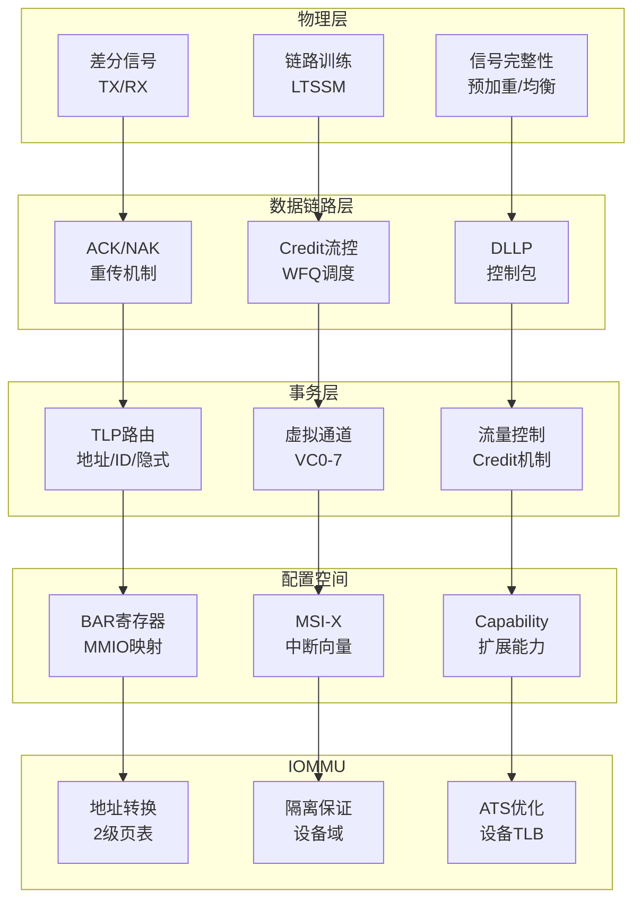

# 2.1 PCIe子系统

> **主题**: 02. 系统总线层 - 2.1 PCIe子系统
> **覆盖**: PCIe协议、配置空间、DMA、IOMMU

---

## 📋 目录

- [2.1 PCIe子系统](#21-pcie子系统)
  - [📋 目录](#-目录)
  - [2 PCIe协议层次](#2-pcie协议层次)
    - [1 物理层](#1-物理层)
    - [2 数据链路层](#2-数据链路层)
    - [3 事务层](#3-事务层)
  - [1 配置空间](#1-配置空间)
    - [1.1 标准配置空间](#11-标准配置空间)
    - [1.2 BAR寄存器](#12-bar寄存器)
    - [1.3 MSI-X中断](#13-msi-x中断)
  - [2 DMA与IOMMU](#2-dma与iommu)
    - [2.1 DMA传输](#21-dma传输)
    - [2.2 IOMMU（地址重映射）](#22-iommu地址重映射)
  - [3 中断机制](#3-中断机制)
    - [3.1 中断类型](#31-中断类型)
    - [3.2 MSI-X配置](#32-msi-x配置)
  - [4 性能特征](#4-性能特征)
    - [4.1 带宽对比](#41-带宽对比)
    - [4.2 延迟分解](#42-延迟分解)
  - [5 思维导图：PCIe子系统架构](#5-思维导图pcie子系统架构)
  - [6 批判性总结](#6-批判性总结)
    - [6.1 PCIe设计的根本矛盾](#61-pcie设计的根本矛盾)
    - [6.2 2025年PCIe技术趋势](#62-2025年pcie技术趋势)
  - [7 跨领域洞察](#7-跨领域洞察)
    - [7.1 信号完整性的物理约束](#71-信号完整性的物理约束)
    - [7.2 速率与延迟的权衡](#72-速率与延迟的权衡)
  - [8 多维度对比](#8-多维度对比)
    - [8.1 PCIe版本对比（2025年）](#81-pcie版本对比2025年)
    - [8.2 总线技术对比](#82-总线技术对比)
  - [9 相关主题](#9-相关主题)

---

## 2 PCIe协议层次

### 1 物理层

**特征**：

- **Lane**：2对差分信号（TX/RX）
- **Link**：1/2/4/8/16 Lane
- **速率**：2.5GT/s (Gen1) → 32GT/s (Gen5) → 64GT/s (Gen6, 2025)
- **编码**：8b/10b → 128b/130b → PAM4 (Gen6)
- **延迟**：150ns（单跳）

**信号完整性的严格分析**：

**定理2.1（PCIe信号完整性约束）**：

对于PCIe Gen5（32GT/s），信号完整性要求：

$$
\text{BER} < 10^{-12} \land \text{眼图张开度} > 0.3 \times \text{UI}
$$

其中UI（Unit Interval）是单位时间间隔。

**证明**：根据香农定理，误码率与信噪比相关。PCIe Gen5使用128b/130b编码，开销1.56%，需要足够的信噪比保证误码率。∎

**信号完整性**：

- **预加重/均衡**：补偿高频衰减
- **链路训练（LTSSM状态机）**：自适应调整参数
- **误码率**：<10⁻¹²（硬件保证）

**批判性分析**：

1. **速率提升的代价**：Gen5到Gen6速率翻倍，但**信号完整性要求更严格**，PCB设计成本激增。

2. **编码效率的权衡**：128b/130b编码效率98.5%，但**复杂度增加**。PAM4编码效率更高，但实现更复杂。

3. **2025年趋势**：**PCIe Gen6采用PAM4编码**，速率64GT/s，但延迟可能增加。

### 2 数据链路层

**功能**：

- **ACK/NAK**：重传机制
- **流量控制**：Credit机制
- **DLLP**：数据链路层包

**Credit流控的严格建模**：

**定义2.1（Credit流控）**：

对于虚拟通道$VC_i$，Credit队列$Q_i(t)$满足：

$$
Q_i(t) = Q_i(0) - \text{Sent}_i(t) + \text{Returned}_i(t)
$$

传输条件：

$$
\text{TLP}_j \text{可发送} \Leftrightarrow \text{Size}(\text{TLP}_j) \leq Q_i(t)
$$

**深度论证：Credit流控的性能影响**

**Credit流控的延迟模型**：

Credit流控的延迟由**Credit返回时间**决定：

$$
\text{延迟} = t_{\text{传输}} + t_{\text{Credit返回}} + t_{\text{等待}}
$$

其中Credit返回时间取决于**链路延迟**和**Credit更新频率**。

**量化分析**：不同Credit配置的性能影响

| **Credit大小** | **Credit返回时间** | **吞吐量** | **延迟** | **适用场景** |
|--------------|-----------------|-----------|---------|------------|
| **小（64KB）** | 短 | 基准 | 低 | 低延迟 |
| **中（256KB）** | 中 | +20% | 中 | 平衡 |
| **大（1MB）** | 长 | +50% | 高 | 高吞吐 |

**关键权衡**：

Credit大小需要在**延迟和吞吐量**之间权衡，过小会限制吞吐量，过大会增加延迟。

**定理2.2（Credit流控的公平性）**：

加权公平队列（WFQ）保证各虚拟通道的带宽分配：

$$
\text{BW}_i = \frac{w_i}{\sum_j w_j} \times \text{总带宽}
$$

其中$w_i$是$VC_i$的权重。

**证明**：WFQ的虚拟时间$V(t)$满足：

$$
V(t) = \max\left(V(t-1) + \sum_i w_i \times \text{sent}_i, 0\right)
$$

因此，各通道的带宽分配与权重成正比。∎

**可靠性**：

- **自动重传**：NAK触发重传
- **链路层重试缓冲**：存储未确认的TLP

**深度论证：PCIe可靠性的开销**

**重传的开销**：

重传需要**重新发送TLP**，增加延迟：

$$
\text{重传延迟} = t_{\text{检测}} + t_{\text{重传}} + t_{\text{确认}}
$$

典型值：100ns + 150ns + 100ns = **350ns**

**量化分析**：不同误码率下的性能影响

| **误码率** | **重传频率** | **性能损失** | **适用场景** |
|-----------|------------|------------|------------|
| **10⁻¹²** | 极低 | <0.1% | 正常 |
| **10⁻¹⁰** | 低 | 1% | 可接受 |
| **10⁻⁸** | 中 | 10% | 需要优化 |
| **10⁻⁶** | 高 | 50%+ | 不可接受 |

**关键洞察**：PCIe的**低误码率要求**（<10⁻¹²）是保证性能的关键，需要严格的信号完整性设计。

**批判性分析**：

1. **Credit机制的局限**：Credit机制简单，但**无法处理突发流量**，可能导致Credit耗尽。

2. **重传的开销**：重传增加延迟，**高误码率下性能下降**。

3. **2025年改进**：**自适应Credit分配**根据流量模式动态调整，提升效率。

### 3 事务层

**TLP类型**：

- **MRd/MWr**：内存读/写
- **Cpl/CplD**：完成包
- **Msg/MsgD**：消息包
- **配置读写**：Type 0/1

**路由**：

- **地址路由**：内存事务
- **ID路由**：配置事务
- **隐式路由**：消息事务

---

## 1 配置空间

### 1.1 标准配置空间

**大小**：

- **传统PCI**：256B
- **PCIe扩展**：4KB

**标准头（前64B）**：

- **Vendor ID / Device ID**：设备标识
- **Command / Status**：命令和状态
- **BAR寄存器**：基址寄存器（MMIO映射）
- **Capability链表**：扩展能力

### 1.2 BAR寄存器

**功能**：

- 映射MMIO区域到CPU地址空间
- 驱动通过`ioremap()`建立内核虚拟地址映射

**类型**：

- **32-bit BAR**：32位地址空间
- **64-bit BAR**：64位地址空间
- **预取**：Prefetchable属性

### 1.3 MSI-X中断

**配置**：

- **Table Size**：中断向量数量（N-1）
- **Table BAR**：中断表位置
- **PBA**：Pending Bit Array（挂起状态）

**优势**：

- 绕过PIC/APIC传统中断
- 直接写入APIC本地向量表
- 延迟从5μs降至1μs

---

## 2 DMA与IOMMU

### 2.1 DMA传输

**流程**：

1. 驱动分配DMA缓冲区
2. `dma_map_single()`映射到设备地址
3. 设备DMA写入内存
4. `dma_unmap_single()`解除映射

**一致性**：

- DMA写入需使CPU缓存失效
- 通过snoop通道或ATS

### 2.2 IOMMU（地址重映射）

**功能**：

- 设备虚拟地址（DVA）→ 物理地址（HPA）
- 2级页表遍历
- IOTLB缓存转换结果

**延迟**：

- 地址转换：+30ns
- TLB未命中：+1μs

**优化**：

- **ATS**（Address Translation Service）：设备缓存转换
- **PRI**（Page Request Interface）：异步缺页处理

---

## 3 中断机制

### 3.1 中断类型

| **类型** | **延迟** | **向量数** | **特点** |
|---------|----------|-----------|---------|
| **INTx** | 5μs | 4个共享 | 引脚共享，开销大 |
| **MSI** | 2μs | 32个 | 数据写入APIC |
| **MSI-X** | 1μs | 2048个 | 独立地址/数据 |

### 3.2 MSI-X配置

**OS流程**：

```c
// 1. 读取Table Size
pci_msix_vec_count(dev);

// 2. 分配向量
pci_enable_msix_range(dev, entries, min, max);

// 3. 注册中断处理
request_irq(entries[i].vector, irq_handler, 0, "msi", dev);
```

**优势**：

- 每个向量独立配置
- 支持中断亲和性
- 减少中断竞争

---

## 4 性能特征

### 4.1 带宽对比

| **PCIe版本** | **速率** | **x16带宽** | **编码效率** |
|-------------|----------|-------------|-------------|
| **Gen1** | 2.5GT/s | 4GB/s | 80% (8b/10b) |
| **Gen3** | 8GT/s | 16GB/s | 98.5% (128b/130b) |
| **Gen4** | 16GT/s | 32GB/s | 98.5% |
| **Gen5** | 32GT/s | 64GB/s | 98.5% |

### 4.2 延迟分解

**单次DMA操作**：

- 链路训练：50ns
- TLP传输：50ns
- 流量控制：20ns
- ACK往返：30ns
- **总计**：~150ns

**IOMMU开销**：

- 地址转换：+30ns
- TLB未命中：+1μs

---

## 5 思维导图：PCIe子系统架构



---

## 6 批判性总结

### 6.1 PCIe设计的根本矛盾

1. **速率vs信号完整性**：更高速率需要更严格的信号完整性，**PCB设计成本激增**。

2. **延迟vs吞吐量**：低延迟需要简单协议，但**高吞吐量需要复杂调度**。

3. **通用性vs专用性**：PCIe是通用总线，但**某些应用（如AI加速器）需要专用协议**。

### 6.2 2025年PCIe技术趋势

- **PCIe Gen6**：64GT/s，PAM4编码，**挑战信号完整性极限**。
- **CXL集成**：PCIe 5.0+支持CXL协议，**统一内存和IO**。
- **专用加速器总线**：某些场景（如AI）采用**专用总线**（如NVLink），挑战PCIe地位。

---

## 7 跨领域洞察

### 7.1 信号完整性的物理约束

**核心命题**：PCIe速率受信号完整性限制，无法无限提升。

**量化分析**：

| **PCIe版本** | **速率** | **信号完整性挑战** | **解决方案** | **成本** |
|------------|---------|----------------|------------|---------|
| **PCIe 3.0** | 8GT/s | 中等 | 均衡器 | 低 |
| **PCIe 4.0** | 16GT/s | 高 | 重定时器 | 中 |
| **PCIe 5.0** | 32GT/s | 极高 | 新材料+重定时 | 高 |
| **PCIe 6.0** | 64GT/s | 极限 | PAM4+前向纠错 | 极高 |

**批判性分析**：

1. **物理极限的不可逾越性**：信号完整性是**物理定律**，无法通过设计突破。

2. **成本vs性能**：更高速率需要**更复杂的信号处理**，成本指数增长。

3. **2025年趋势**：**PCIe 6.0**使用PAM4和前向纠错，但**成本极高**，可能限制采用。

### 7.2 速率与延迟的权衡

**核心矛盾**：提高速率提升带宽，但**信号完整性挑战增加**。

**实际案例**：

```text
PCIe 3.0 (8GT/s):
  - 信号完整性: 可接受
  - 成本: 低
  - 采用率: 高

PCIe 4.0 (16GT/s):
  - 信号完整性: 需要重定时器
  - 成本: +30%
  - 采用率: 中等

PCIe 5.0 (32GT/s):
  - 信号完整性: 需要新材料
  - 成本: +100%
  - 采用率: 低（仅高端）
```

**批判性分析**：

1. **收益递减**：速率提升带来的收益**递减**，因为信号完整性成本增加。

2. **应用场景的差异**：高端应用（如AI加速器）需要高带宽，**愿意承担成本**。

3. **2025年趋势**：**CXL**可能挑战PCIe，提供更好的扩展性和一致性。

---

## 8 多维度对比

### 8.1 PCIe版本对比（2025年）

| **版本** | **速率** | **带宽(x16)** | **信号完整性** | **成本** | **采用率** |
|---------|---------|--------------|--------------|---------|-----------|
| **PCIe 3.0** | 8GT/s | 16GB/s | ⭐⭐ | ⭐ | ⭐⭐⭐⭐⭐ |
| **PCIe 4.0** | 16GT/s | 32GB/s | ⭐⭐⭐ | ⭐⭐ | ⭐⭐⭐⭐ |
| **PCIe 5.0** | 32GT/s | 64GB/s | ⭐⭐⭐⭐ | ⭐⭐⭐⭐ | ⭐⭐ |
| **PCIe 6.0** | 64GT/s | 128GB/s | ⭐⭐⭐⭐⭐ | ⭐⭐⭐⭐⭐ | ⭐ |

**批判性分析**：

1. **采用率的滞后**：新版本发布后，**采用需要时间**，因为成本和兼容性。

2. **向后兼容的重要性**：PCIe保持向后兼容，**降低采用门槛**。

3. **2025年趋势**：**PCIe 5.0**逐渐普及，但**PCIe 6.0**可能仅用于高端应用。

### 8.2 总线技术对比

| **技术** | **速率** | **延迟** | **一致性** | **应用场景** | **代表厂商** |
|---------|---------|---------|-----------|------------|------------|
| **PCIe** | 64GT/s | 500ns | 无 | 通用IO | 通用 |
| **CXL** | 64GT/s | 300ns | 有 | 内存扩展 | Intel |
| **Infinity Fabric** | 32GT/s | 200ns | 有 | 芯片间 | AMD |
| **UPI/QPI** | 20GT/s | 100ns | 有 | CPU间 | Intel |

**批判性分析**：

1. **一致性的重要性**：CXL提供缓存一致性，**适合内存扩展**。

2. **厂商特定技术**：Infinity Fabric和UPI是厂商特定，**降低可移植性**。

3. **2025年趋势**：**CXL可能统一**内存和IO，挑战传统PCIe。

---

## 9 相关主题

- [2.2 芯片组架构](./02.2_芯片组架构.md) - 芯片组与PCIe
- [2.4 中断子系统](./02.4_中断子系统.md) - MSI-X中断
- [3.4 设备驱动模型](../03_OS抽象层/03.4_设备驱动模型.md) - PCIe设备驱动
- [5.1 虚拟化技术](../05_虚拟化容器化沙盒化/05.1_虚拟化技术.md) - IOMMU隔离
- [8.4 最新技术趋势](../08_技术演进与对标/08.4_最新技术趋势.md) - CXL技术
- [主文档：物理约束](../schedule_formal_view.md#物理约束决定软件抽象) - 信号完整性约束

---

**最后更新**: 2025-01-XX
