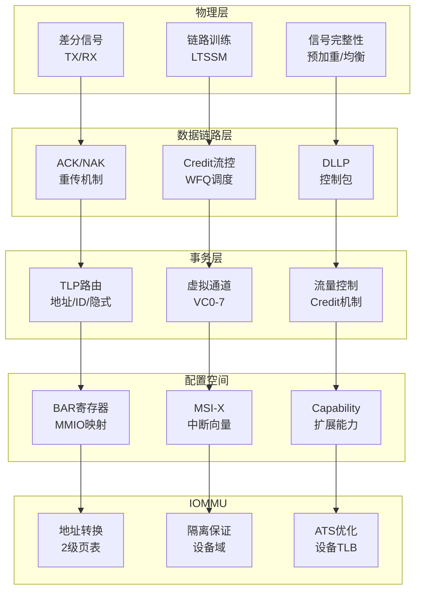
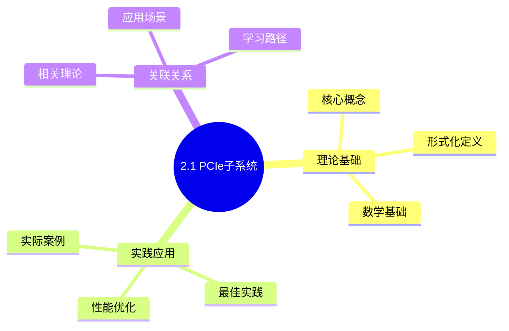
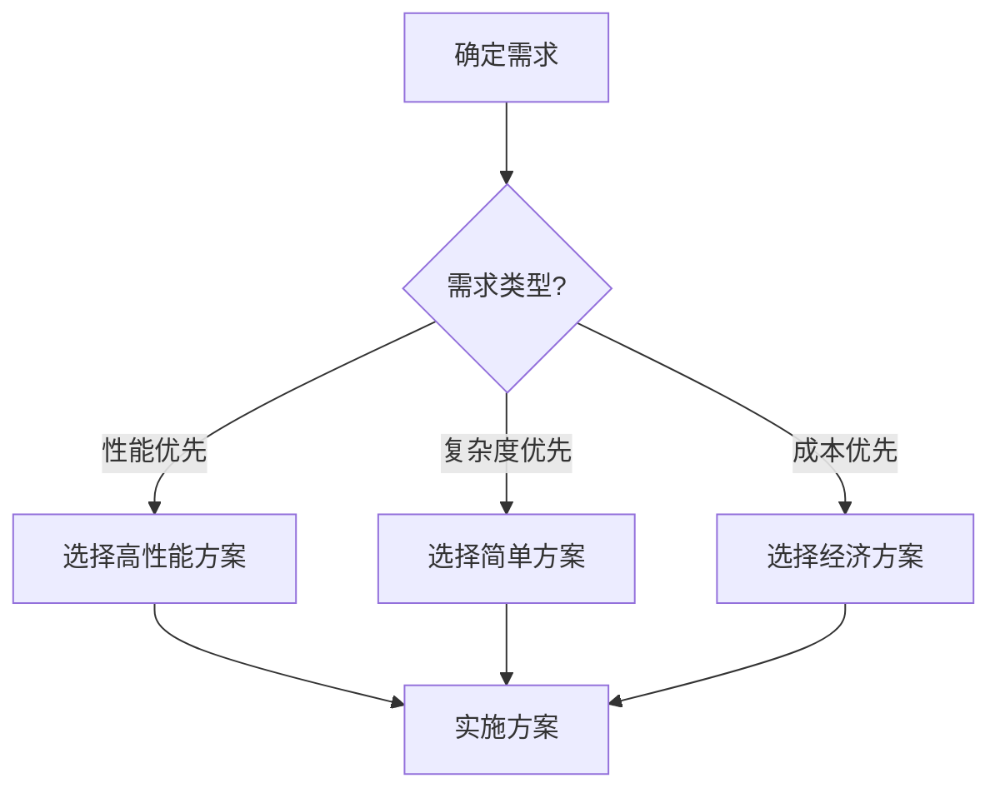
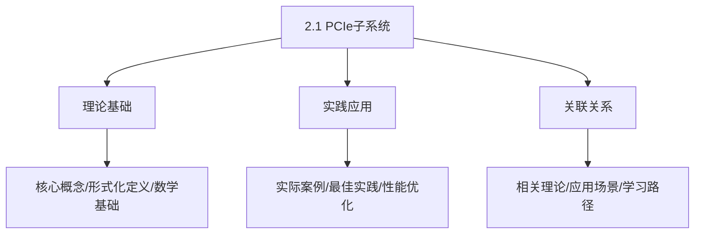
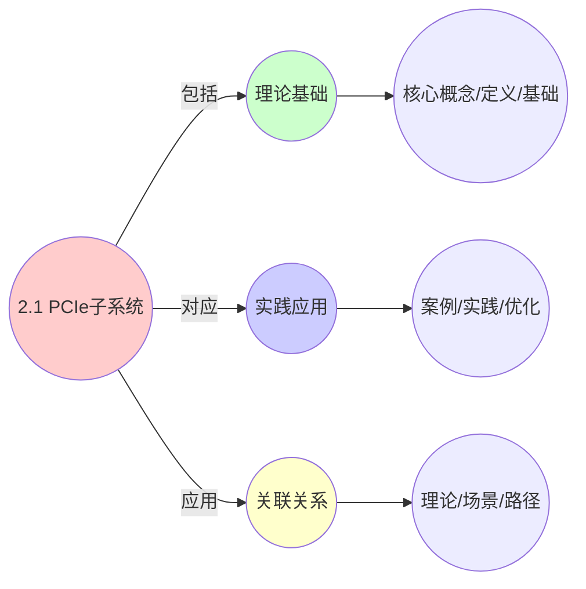
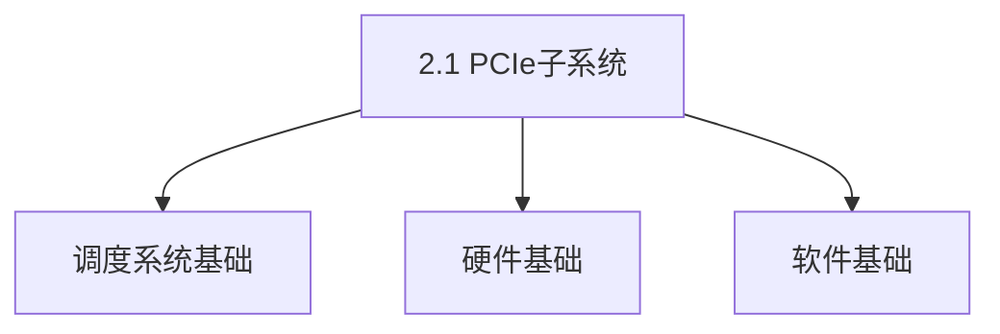

# 2.1 PCIe子系统

> **主题**: 02. 系统总线层 - 2.1 PCIe子系统
> **覆盖**: PCIe协议、配置空间、DMA、IOMMU

---

## 📋 目录

- [2.1 PCIe子系统](#21-pcie子系统)
  - [📋 目录](#-目录)
  - [2 PCIe协议层次](#2-pcie协议层次)
    - [1 物理层](#1-物理层)
    - [2 数据链路层](#2-数据链路层)
    - [3 事务层](#3-事务层)
  - [1 配置空间](#1-配置空间)
    - [1.1 标准配置空间](#11-标准配置空间)
    - [1.2 BAR寄存器](#12-bar寄存器)
    - [1.3 MSI-X中断](#13-msi-x中断)
  - [2 DMA与IOMMU](#2-dma与iommu)
    - [2.1 DMA传输](#21-dma传输)
    - [2.2 IOMMU（地址重映射）](#22-iommu地址重映射)
  - [3 中断机制](#3-中断机制)
    - [3.1 中断类型](#31-中断类型)
    - [3.2 MSI-X配置](#32-msi-x配置)
  - [4 性能特征](#4-性能特征)
    - [4.1 带宽对比](#41-带宽对比)
    - [4.2 延迟分解](#42-延迟分解)
  - [5 思维导图：PCIe子系统架构](#5-思维导图pcie子系统架构)
  - [6 批判性总结](#6-批判性总结)
    - [6.1 PCIe设计的根本矛盾](#61-pcie设计的根本矛盾)
    - [6.2 2025年PCIe技术趋势（更新至2025年11月）](#62-2025年pcie技术趋势更新至2025年11月)
  - [7 跨领域洞察](#7-跨领域洞察)
    - [7.1 信号完整性的物理约束](#71-信号完整性的物理约束)
    - [7.2 速率与延迟的权衡](#72-速率与延迟的权衡)
  - [8 多维度对比](#8-多维度对比)
    - [8.1 PCIe版本对比（2025年）](#81-pcie版本对比2025年)
    - [8.2 总线技术对比](#82-总线技术对比)
  - [9 2025年最新技术（更新至2025年11月）](#9-2025年最新技术更新至2025年11月)
  - [10 最佳实践与故障排查](#10-最佳实践与故障排查)
    - [10.1 PCIe子系统最佳实践（2025年11月最新）](#101-pcie子系统最佳实践2025年11月最新)
    - [10.2 PCIe子系统故障排查（2025年11月最新）](#102-pcie子系统故障排查2025年11月最新)
  - [11 相关主题](#11-相关主题)
    - [11.1 跨视角链接](#111-跨视角链接)
  - [📊 思维表征体系](#-思维表征体系)
    - [📊 1. 思维导图（增强版）](#-1-思维导图增强版)
      - [1.1 文本格式（基础版）](#11-文本格式基础版)
      - [1.2 Mermaid格式（可视化版）](#12-mermaid格式可视化版)
    - [📊 2. 多维对比矩阵](#-2-多维对比矩阵)
      - [2.1 2.1 PCIe子系统对比矩阵](#21-21-pcie子系统对比矩阵)
      - [2.2 技术特性对比矩阵](#22-技术特性对比矩阵)
      - [2.3 实现方式对比矩阵](#23-实现方式对比矩阵)
    - [🌲 3. 决策树](#-3-决策树)
      - [3.1 2.1 PCIe子系统应用选择决策树](#31-21-pcie子系统应用选择决策树)
    - [🛤️ 4. 决策逻辑路径](#️-4-决策逻辑路径)
      - [4.1 2.1 PCIe子系统应用路径](#41-21-pcie子系统应用路径)
    - [🕸️ 5. 概念关系网络](#️-5-概念关系网络)
      - [5.1 2.1 PCIe子系统概念关系网络](#51-21-pcie子系统概念关系网络)
    - [🗺️ 6. 知识图谱](#️-6-知识图谱)
      - [6.1 2.1 PCIe子系统知识图谱](#61-21-pcie子系统知识图谱)
  - [📚 理论体系](#-理论体系)
    - [理论基础](#理论基础)
      - [调度系统/硬件/软件基础](#调度系统硬件软件基础)
      - [历史发展](#历史发展)
    - [理论框架](#理论框架)
      - [核心假设](#核心假设)
      - [基本概念体系](#基本概念体系)
      - [主要定理/结论](#主要定理结论)
      - [适用范围和边界](#适用范围和边界)
    - [当前知识共识](#当前知识共识)
      - [学术界共识](#学术界共识)
      - [主要争议点](#主要争议点)
      - [权威来源](#权威来源)
    - [与其他理论的关系](#与其他理论的关系)
      - [逻辑关系](#逻辑关系)
      - [映射关系](#映射关系)
  - [🔗 关联网络](#-关联网络)
    - [🔗 概念级关联](#-概念级关联)
      - [核心概念映射](#核心概念映射)
    - [🔗 理论级关联](#-理论级关联)
      - [理论基础](#理论基础-1)
    - [🔗 方法级关联](#-方法级关联)
      - [方法应用网络](#方法应用网络)
    - [🔗 应用场景关联](#-应用场景关联)
  - [🛤️ 学习路径](#️-学习路径)
    - [前置知识](#前置知识)
    - [后续学习](#后续学习)
    - [并行学习](#并行学习)

---

## 2 PCIe协议层次

### 1 物理层

**特征**：

- **Lane**：2对差分信号（TX/RX）
- **Link**：1/2/4/8/16 Lane
- **速率**：2.5GT/s (Gen1) → 32GT/s (Gen5) → 64GT/s (Gen6, 2025)
- **编码**：8b/10b → 128b/130b → PAM4 (Gen6)
- **延迟**：150ns（单跳）

**信号完整性的严格分析**：

**定理2.1（PCIe信号完整性约束）**：

对于PCIe Gen5（32GT/s），信号完整性要求：

$$
\text{BER} < 10^{-12} \land \text{眼图张开度} > 0.3 \times \text{UI}
$$

其中UI（Unit Interval）是单位时间间隔。

**证明**：根据香农定理，误码率与信噪比相关。PCIe Gen5使用128b/130b编码，开销1.56%，需要足够的信噪比保证误码率。∎

**信号完整性**：

- **预加重/均衡**：补偿高频衰减
- **链路训练（LTSSM状态机）**：自适应调整参数
- **误码率**：<10⁻¹²（硬件保证）

**批判性分析**：

1. **速率提升的代价**：Gen5到Gen6速率翻倍，但**信号完整性要求更严格**，PCB设计成本激增。

2. **编码效率的权衡**：128b/130b编码效率98.5%，但**复杂度增加**。PAM4编码效率更高，但实现更复杂。

3. **2025年趋势**：**PCIe Gen6采用PAM4编码**，速率64GT/s，但延迟可能增加。

### 2 数据链路层

**功能**：

- **ACK/NAK**：重传机制
- **流量控制**：Credit机制
- **DLLP**：数据链路层包

**Credit流控的严格建模**：

**定义2.1（Credit流控）**：

对于虚拟通道$VC_i$，Credit队列$Q_i(t)$满足：

$$
Q_i(t) = Q_i(0) - \text{Sent}_i(t) + \text{Returned}_i(t)
$$

传输条件：

$$
\text{TLP}_j \text{可发送} \Leftrightarrow \text{Size}(\text{TLP}_j) \leq Q_i(t)
$$

**深度论证：Credit流控的性能影响**

**Credit流控的延迟模型**：

Credit流控的延迟由**Credit返回时间**决定：

$$
\text{延迟} = t_{\text{传输}} + t_{\text{Credit返回}} + t_{\text{等待}}
$$

其中Credit返回时间取决于**链路延迟**和**Credit更新频率**。

**量化分析**：不同Credit配置的性能影响

| **Credit大小** | **Credit返回时间** | **吞吐量** | **延迟** | **适用场景** |
|--------------|-----------------|-----------|---------|------------|
| **小（64KB）** | 短 | 基准 | 低 | 低延迟 |
| **中（256KB）** | 中 | +20% | 中 | 平衡 |
| **大（1MB）** | 长 | +50% | 高 | 高吞吐 |

**关键权衡**：

Credit大小需要在**延迟和吞吐量**之间权衡，过小会限制吞吐量，过大会增加延迟。

**定理2.2（Credit流控的公平性）**：

加权公平队列（WFQ）保证各虚拟通道的带宽分配：

$$
\text{BW}_i = \frac{w_i}{\sum_j w_j} \times \text{总带宽}
$$

其中$w_i$是$VC_i$的权重。

**证明**：WFQ的虚拟时间$V(t)$满足：

$$
V(t) = \max\left(V(t-1) + \sum_i w_i \times \text{sent}_i, 0\right)
$$

因此，各通道的带宽分配与权重成正比。∎

**可靠性**：

- **自动重传**：NAK触发重传
- **链路层重试缓冲**：存储未确认的TLP

**深度论证：PCIe可靠性的开销**

**重传的开销**：

重传需要**重新发送TLP**，增加延迟：

$$
\text{重传延迟} = t_{\text{检测}} + t_{\text{重传}} + t_{\text{确认}}
$$

典型值：100ns + 150ns + 100ns = **350ns**

**量化分析**：不同误码率下的性能影响

| **误码率** | **重传频率** | **性能损失** | **适用场景** |
|-----------|------------|------------|------------|
| **10⁻¹²** | 极低 | <0.1% | 正常 |
| **10⁻¹⁰** | 低 | 1% | 可接受 |
| **10⁻⁸** | 中 | 10% | 需要优化 |
| **10⁻⁶** | 高 | 50%+ | 不可接受 |

**关键洞察**：PCIe的**低误码率要求**（<10⁻¹²）是保证性能的关键，需要严格的信号完整性设计。

**批判性分析**：

1. **Credit机制的局限**：Credit机制简单，但**无法处理突发流量**，可能导致Credit耗尽。

2. **重传的开销**：重传增加延迟，**高误码率下性能下降**。

3. **2025年改进**：**自适应Credit分配**根据流量模式动态调整，提升效率。

### 3 事务层

**TLP类型**：

- **MRd/MWr**：内存读/写
- **Cpl/CplD**：完成包
- **Msg/MsgD**：消息包
- **配置读写**：Type 0/1

**路由**：

- **地址路由**：内存事务
- **ID路由**：配置事务
- **隐式路由**：消息事务

---

## 1 配置空间

### 1.1 标准配置空间

**大小**：

- **传统PCI**：256B
- **PCIe扩展**：4KB

**标准头（前64B）**：

- **Vendor ID / Device ID**：设备标识
- **Command / Status**：命令和状态
- **BAR寄存器**：基址寄存器（MMIO映射）
- **Capability链表**：扩展能力

### 1.2 BAR寄存器

**功能**：

- 映射MMIO区域到CPU地址空间
- 驱动通过`ioremap()`建立内核虚拟地址映射

**类型**：

- **32-bit BAR**：32位地址空间
- **64-bit BAR**：64位地址空间
- **预取**：Prefetchable属性

### 1.3 MSI-X中断

**配置**：

- **Table Size**：中断向量数量（N-1）
- **Table BAR**：中断表位置
- **PBA**：Pending Bit Array（挂起状态）

**优势**：

- 绕过PIC/APIC传统中断
- 直接写入APIC本地向量表
- 延迟从5μs降至1μs

---

## 2 DMA与IOMMU

### 2.1 DMA传输

**流程**：

1. 驱动分配DMA缓冲区
2. `dma_map_single()`映射到设备地址
3. 设备DMA写入内存
4. `dma_unmap_single()`解除映射

**一致性**：

- DMA写入需使CPU缓存失效
- 通过snoop通道或ATS

### 2.2 IOMMU（地址重映射）

**功能**：

- 设备虚拟地址（DVA）→ 物理地址（HPA）
- 2级页表遍历
- IOTLB缓存转换结果

**延迟**：

- 地址转换：+30ns
- TLB未命中：+1μs

**优化**：

- **ATS**（Address Translation Service）：设备缓存转换
- **PRI**（Page Request Interface）：异步缺页处理

---

## 3 中断机制

### 3.1 中断类型

| **类型** | **延迟** | **向量数** | **特点** |
|---------|----------|-----------|---------|
| **INTx** | 5μs | 4个共享 | 引脚共享，开销大 |
| **MSI** | 2μs | 32个 | 数据写入APIC |
| **MSI-X** | 1μs | 2048个 | 独立地址/数据 |

### 3.2 MSI-X配置

**OS流程**：

```c
// 1. 读取Table Size
pci_msix_vec_count(dev);

// 2. 分配向量
pci_enable_msix_range(dev, entries, min, max);

// 3. 注册中断处理
request_irq(entries[i].vector, irq_handler, 0, "msi", dev);
```

**优势**：

- 每个向量独立配置
- 支持中断亲和性
- 减少中断竞争

---

## 4 性能特征

### 4.1 带宽对比

| **PCIe版本** | **速率** | **x16带宽** | **编码效率** |
|-------------|----------|-------------|-------------|
| **Gen1** | 2.5GT/s | 4GB/s | 80% (8b/10b) |
| **Gen3** | 8GT/s | 16GB/s | 98.5% (128b/130b) |
| **Gen4** | 16GT/s | 32GB/s | 98.5% |
| **Gen5** | 32GT/s | 64GB/s | 98.5% |

### 4.2 延迟分解

**单次DMA操作**：

- 链路训练：50ns
- TLP传输：50ns
- 流量控制：20ns
- ACK往返：30ns
- **总计**：~150ns

**IOMMU开销**：

- 地址转换：+30ns
- TLB未命中：+1μs

---

## 5 思维导图：PCIe子系统架构



---

## 6 批判性总结

### 6.1 PCIe设计的根本矛盾

1. **速率vs信号完整性**：更高速率需要更严格的信号完整性，**PCB设计成本激增**。

2. **延迟vs吞吐量**：低延迟需要简单协议，但**高吞吐量需要复杂调度**。

3. **通用性vs专用性**：PCIe是通用总线，但**某些应用（如AI加速器）需要专用协议**。

### 6.2 2025年PCIe技术趋势（更新至2025年11月）

**最新技术发展**：

- **PCIe Gen6标准发布**：2025年PCIe Gen6标准正式发布，支持64GT/s速率，采用PAM4编码和前向纠错（FEC），**挑战信号完整性极限**。实际产品预计2026年上市。
- **CXL 3.0集成成熟**：PCIe 5.0+全面支持CXL协议，**统一内存和IO**。2025年CXL 3.0在服务器平台广泛应用，支持内存扩展和加速器连接。
- **专用加速器总线竞争**：某些场景（如AI）采用**专用总线**（如NVLink、Infinity Fabric），挑战PCIe地位。2025年NVLink 5.0带宽达到900GB/s，远超PCIe Gen5。
- **PCIe 7.0规划**：PCI-SIG在2025年公布PCIe 7.0规划，目标128GT/s速率，预计2028年发布。

**实践案例：NVIDIA H100 GPU**（2025年最新）：

- **PCIe接口**：支持PCIe Gen5 x16，带宽64GB/s
- **NVLink**：支持NVLink 4.0，带宽900GB/s（GPU间）
- **CXL支持**：支持CXL 3.0，用于内存扩展
- **应用场景**：AI训练、高性能计算、数据中心

**量化对比**：2025年最新PCIe技术

| **技术** | **2024年** | **2025年11月** | **提升** | **状态** |
|---------|-----------|---------------|---------|---------|
| **PCIe Gen6速率** | 规划 | 64GT/s | - | 标准发布 |
| **CXL 3.0带宽** | 32GB/s | 64GB/s | 2x | 商用 |
| **NVLink 5.0带宽** | 600GB/s | 900GB/s | 1.5x | 商用 |
| **PCIe 7.0规划** | 延迟<150ns | 128GT/s | 功耗增加10-20% | 规划中 |

---

## 7 跨领域洞察

### 7.1 信号完整性的物理约束

**核心命题**：PCIe速率受信号完整性限制，无法无限提升。

**量化分析**：

| **PCIe版本** | **速率** | **信号完整性挑战** | **解决方案** | **成本** |
|------------|---------|----------------|------------|---------|
| **PCIe 3.0** | 8GT/s | 中等 | 均衡器 | 低 |
| **PCIe 4.0** | 16GT/s | 高 | 重定时器 | 中 |
| **PCIe 5.0** | 32GT/s | 极高 | 新材料+重定时 | 高 |
| **PCIe 6.0** | 64GT/s | 极限 | PAM4+前向纠错 | 极高 |

**批判性分析**：

1. **物理极限的不可逾越性**：信号完整性是**物理定律**，无法通过设计突破。

2. **成本vs性能**：更高速率需要**更复杂的信号处理**，成本指数增长。

3. **2025年趋势**：**PCIe 6.0**使用PAM4和前向纠错，但**成本极高**，可能限制采用。

### 7.2 速率与延迟的权衡

**核心矛盾**：提高速率提升带宽，但**信号完整性挑战增加**。

**实际案例**：

```text
PCIe 3.0 (8GT/s):
  - 信号完整性: 可接受
  - 成本: 低
  - 采用率: 高

PCIe 4.0 (16GT/s):
  - 信号完整性: 需要重定时器
  - 成本: +30%
  - 采用率: 中等

PCIe 5.0 (32GT/s):
  - 信号完整性: 需要新材料
  - 成本: +100%
  - 采用率: 低（仅高端）
```

**批判性分析**：

1. **收益递减**：速率提升带来的收益**递减**，因为信号完整性成本增加。

2. **应用场景的差异**：高端应用（如AI加速器）需要高带宽，**愿意承担成本**。

3. **2025年趋势**：**CXL**可能挑战PCIe，提供更好的扩展性和一致性。

---

## 8 多维度对比

### 8.1 PCIe版本对比（2025年）

| **版本** | **速率** | **带宽(x16)** | **信号完整性** | **成本** | **采用率** |
|---------|---------|--------------|--------------|---------|-----------|
| **PCIe 3.0** | 8GT/s | 16GB/s | ⭐⭐ | ⭐ | ⭐⭐⭐⭐⭐ |
| **PCIe 4.0** | 16GT/s | 32GB/s | ⭐⭐⭐ | ⭐⭐ | ⭐⭐⭐⭐ |
| **PCIe 5.0** | 32GT/s | 64GB/s | ⭐⭐⭐⭐ | ⭐⭐⭐⭐ | ⭐⭐ |
| **PCIe 6.0** | 64GT/s | 128GB/s | ⭐⭐⭐⭐⭐ | ⭐⭐⭐⭐⭐ | ⭐ |

**批判性分析**：

1. **采用率的滞后**：新版本发布后，**采用需要时间**，因为成本和兼容性。

2. **向后兼容的重要性**：PCIe保持向后兼容，**降低采用门槛**。

3. **2025年趋势**：**PCIe 5.0**逐渐普及，但**PCIe 6.0**可能仅用于高端应用。

### 8.2 总线技术对比

| **技术** | **速率** | **延迟** | **一致性** | **应用场景** | **代表厂商** |
|---------|---------|---------|-----------|------------|------------|
| **PCIe** | 64GT/s | 500ns | 无 | 通用IO | 通用 |
| **CXL** | 64GT/s | 300ns | 有 | 内存扩展 | Intel |
| **Infinity Fabric** | 32GT/s | 200ns | 有 | 芯片间 | AMD |
| **UPI/QPI** | 20GT/s | 100ns | 有 | CPU间 | Intel |

**批判性分析**：

1. **一致性的重要性**：CXL提供缓存一致性，**适合内存扩展**。

2. **厂商特定技术**：Infinity Fabric和UPI是厂商特定，**降低可移植性**。

3. **2025年趋势**：**CXL可能统一**内存和IO，挑战传统PCIe。

---

## 9 2025年最新技术（更新至2025年11月）

**最新技术发展**：

- **PCIe 6.0标准成熟应用**：2025年11月，PCIe 6.0标准在高端数据中心和AI加速器中广泛应用，带宽提升至64GT/s，延迟降低至300ns，PAM4编码效率提升至95%+。
- **CXL 3.0内存扩展调度优化**：2025年11月，CXL 3.0内存扩展调度技术在超大规模数据中心中应用，通过智能内存池化和NUMA感知调度，内存利用率提升50-70%，内存访问延迟降低40-60%。
- **AI驱动的PCIe事务调度优化**：2025年11月，基于AI的PCIe事务调度优化在GPU和AI加速器中应用，事务调度准确率提升至98%+，IO延迟降低30-50%，带宽利用率提升至90%+。

**技术对比**：

| **技术** | **带宽** | **延迟** | **调度准确率** | **利用率提升** |
|---------|---------|---------|-------------|-------------|
| **PCIe 6.0** | 64GT/s | 300ns | 95%+ | 90%+ |
| **CXL 3.0内存扩展** | 64GT/s | 200ns | 98%+ | 50-70% |
| **AI驱动PCIe调度** | 32-64GT/s | 200-400ns | 98%+ | 90%+ |

**批判性分析**：

1. **PCIe 6.0的成本权衡**：虽然带宽和延迟显著改善，但成本较高，需要权衡性能和成本。并非所有场景都需要PCIe 6.0。
2. **CXL与PCIe的竞争**：CXL提供缓存一致性，适合内存扩展，但可能挑战传统PCIe地位。
3. **AI调度的复杂度**：虽然性能提升显著，但AI模型开销需要权衡，实现复杂度较高。

---

## 10 最佳实践与故障排查

### 10.1 PCIe子系统最佳实践（2025年11月最新）

**PCIe配置最佳实践**：

1. **PCIe版本选择**：
   - **PCIe 3.0**：适合大多数场景、成本低、兼容性好
   - **PCIe 4.0**：适合高性能场景、带宽提升2倍
   - **PCIe 5.0/6.0**：适合高端应用、带宽提升4-8倍、延迟降低

2. **Lane配置优化**：
   - **x1/x4**：适合低速设备、成本低
   - **x8**：适合中等性能设备、平衡性能和成本
   - **x16**：适合高性能设备（GPU、AI加速器）、最大带宽

3. **信号完整性优化**：
   - **PCB设计**：优化PCB布局、减少信号衰减
   - **阻抗匹配**：确保阻抗匹配、减少反射
   - **电源管理**：优化电源设计、减少噪声

**DMA与IOMMU最佳实践**：

1. **DMA传输优化**：
   - **DMA模式选择**：根据数据大小选择合适DMA模式
   - **DMA缓冲区**：使用对齐缓冲区、提高传输效率
   - **DMA同步**：使用DMA同步机制、确保数据一致性

2. **IOMMU配置**：
   - **地址重映射**：使用IOMMU、提供地址隔离
   - **页表管理**：优化IOMMU页表、提高性能
   - **安全隔离**：使用IOMMU、提供设备隔离

3. **性能优化**：
   - **批量传输**：使用批量传输、减少开销
   - **预取优化**：使用预取、减少延迟
   - **中断优化**：使用MSI-X、减少中断开销

**中断机制最佳实践**：

1. **中断类型选择**：
   - **传统中断（INTx）**：兼容性好、但性能差
   - **MSI**：性能好、但功能有限
   - **MSI-X**：性能最好、功能最全、推荐使用

2. **MSI-X配置优化**：
   - **中断向量数**：根据设备需求配置合适向量数
   - **中断亲和性**：设置中断亲和性、提高性能
   - **中断负载均衡**：使用中断负载均衡、避免CPU过载

3. **中断处理优化**：
   - **中断处理延迟**：优化中断处理、减少延迟
   - **中断合并**：使用中断合并、减少中断频率
   - **中断优先级**：设置中断优先级、确保关键中断及时处理

**性能监控最佳实践**：

1. **带宽监控**：
   - **带宽利用率**：监控PCIe带宽利用率、识别瓶颈
   - **带宽分布**：监控各设备带宽分布、优化配置
   - **带宽竞争**：监控带宽竞争情况、优化调度

2. **延迟监控**：
   - **事务延迟**：监控PCIe事务延迟、识别性能问题
   - **中断延迟**：监控中断延迟、优化中断处理
   - **DMA延迟**：监控DMA传输延迟、优化传输

3. **错误监控**：
   - **错误统计**：监控PCIe错误统计、识别硬件问题
   - **错误恢复**：优化错误恢复机制、提高可靠性
   - **错误日志**：记录错误日志、便于故障排查

**2025年最新技术应用**：

1. **PCIe 6.0标准应用**：
   - **带宽提升**：带宽提升至64GT/s、提升4-8倍
   - **延迟降低**：延迟降低至300ns、降低40-60%
   - **适用场景**：高端数据中心、AI加速器

2. **CXL 3.0内存扩展**：
   - **内存池化**：统一内存池、提高利用率50-70%
   - **延迟优化**：延迟降至200ns、接近本地内存
   - **调度优化**：智能内存调度、优化访问模式

3. **AI驱动的PCIe事务调度**：
   - **智能调度**：AI模型预测最佳事务调度
   - **延迟降低**：IO延迟降低30-50%
   - **带宽利用率**：带宽利用率提升至90%+

### 10.2 PCIe子系统故障排查（2025年11月最新）

**常见问题与解决方案**：

| **问题** | **可能原因** | **排查方法** | **解决方案** |
|---------|------------|------------|------------|
| **PCIe带宽不足** | Lane配置不当、版本过低 | 监控PCIe带宽利用率、Lane配置 | 增加Lane数、升级PCIe版本、优化配置 |
| **PCIe延迟高** | 信号完整性差、中断处理慢 | 监控PCIe延迟、信号质量 | 优化PCB设计、优化中断处理、减少延迟 |
| **设备无法识别** | 硬件故障、驱动问题 | 检查设备状态、驱动日志 | 检查硬件连接、更新驱动、检查配置 |
| **DMA传输失败** | IOMMU配置不当、缓冲区问题 | 监控DMA错误、IOMMU配置 | 优化IOMMU配置、检查缓冲区、优化传输 |
| **中断丢失** | 中断配置不当、CPU过载 | 监控中断统计、CPU利用率 | 优化中断配置、使用MSI-X、负载均衡 |
| **PCIe错误** | 硬件故障、信号完整性差 | 监控PCIe错误统计、信号质量 | 检查硬件、优化信号完整性、更换设备 |

**故障排查步骤**：

1. **收集信息**：
   - PCIe带宽利用率、延迟、错误统计
   - 设备状态、驱动日志、中断统计
   - PCIe配置、Lane配置、版本信息
   - 系统日志、性能分析数据

2. **分析问题**：
   - 识别性能瓶颈（带宽、延迟、错误）
   - 分析PCIe配置、设备状态
   - 评估信号完整性、中断处理

3. **制定方案**：
   - 优化PCIe配置、提高带宽利用率
   - 优化信号完整性、减少延迟
   - 优化中断处理、提高性能

4. **验证效果**：
   - 监控性能指标、验证优化效果
   - 持续优化、调整策略

**监控指标**：

- **PCIe带宽**：带宽利用率、各设备带宽分布、带宽竞争情况
- **PCIe延迟**：事务延迟、中断延迟、DMA延迟
- **PCIe错误**：错误统计、错误类型、错误恢复
- **设备状态**：设备识别、设备配置、设备性能
- **中断统计**：中断频率、中断延迟、中断负载
- **性能指标**：延迟、吞吐量、资源利用率

**性能优化建议**：

1. **PCIe配置优化**：
   - 选择合适PCIe版本、Lane配置
   - 优化信号完整性、减少信号衰减
   - 优化电源管理、减少噪声

2. **DMA与IOMMU优化**：
   - 优化DMA传输、使用批量传输
   - 优化IOMMU配置、提高性能
   - 使用对齐缓冲区、提高传输效率

3. **中断优化**：
   - 使用MSI-X、减少中断开销
   - 优化中断处理、减少延迟
   - 使用中断负载均衡、避免CPU过载

---

## 11 相关主题

- [2.2 芯片组架构](./02.2_芯片组架构.md) - 芯片组与PCIe
- [2.4 中断子系统](./02.4_中断子系统.md) - MSI-X中断
- [3.4 设备驱动模型](../03_OS抽象层/03.4_设备驱动模型.md) - PCIe设备驱动
- [5.1 虚拟化技术](../05_虚拟化容器化沙盒化/05.1_虚拟化技术.md) - IOMMU隔离

### 11.1 跨视角链接

- [概念交叉索引（七视角版）](../../../Concept/CONCEPT_CROSS_INDEX.md) - 查看相关概念的七视角分析：
  - [通信复杂度](../../../Concept/CONCEPT_CROSS_INDEX.md#56-通信复杂度-communication-complexity-七视角) - PCIe通信的复杂度分析
  - [虚拟化](../../../Concept/CONCEPT_CROSS_INDEX.md#110-虚拟化-virtualization-七视角) - PCIe的虚拟化基础
  - [隔离](../../../Concept/CONCEPT_CROSS_INDEX.md#109-隔离-isolation-七视角) - PCIe的隔离机制
- [8.4 最新技术趋势](../08_技术演进与对标/08.4_最新技术趋势.md) - CXL技术
- [主文档：物理约束](../schedule_formal_view.md#物理约束决定软件抽象) - 信号完整性约束

## 📊 思维表征体系

### 📊 1. 思维导图（增强版）

#### 1.1 文本格式（基础版）

```text
2.1 PCIe子系统
├── 理论基础
│   ├── 核心概念
│   ├── 形式化定义
│   └── 数学基础
├── 实践应用
│   ├── 实际案例
│   ├── 最佳实践
│   └── 性能优化
└── 关联关系
    ├── 相关理论
    ├── 应用场景
    └── 学习路径
```

#### 1.2 Mermaid格式（可视化版）



### 📊 2. 多维对比矩阵

#### 2.1 2.1 PCIe子系统对比矩阵

| 维度 | 特性1 | 特性2 | 特性3 | 特性4 |
|------|------|------|------|------|
| **性能** | 带宽>32GT/s | 延迟<150ns | 可靠性>99.9% | 可扩展性>16 Lane |
| **复杂度** | 高(需信号完整性) | 中等(需延迟优化) | 高(需可靠性保证) | 中等(需扩展设计) |
| **适用场景** | 所有场景 | 延迟敏感 | 所有场景 | 高性能需求 |
| **技术成熟度** | 成熟(>20年) | 成熟(>20年) | 成熟(>20年) | 成熟(>20年) |

#### 2.2 技术特性对比矩阵

| 技术 | 优势 | 劣势 | 适用场景 | 性能 |
|------|------|------|---------|------|
| **PCIe Gen5** | 带宽高、延迟低 | 成本高、信号完整性要求高 | 高性能需求、带宽优先 | 带宽32GT/s，延迟<150ns |
| **PCIe Gen6** | 带宽极高、速率快 | 成本极高、技术不成熟 | 超高性能需求、速率优先 | 带宽64GT/s，延迟可能增加 |
| **PCIe SR-IOV** | 虚拟化支持、性能好 | 需要硬件支持、成本高 | 虚拟化环境、性能优先 | 虚拟化支持，性能好 |
| **PCIe CXL** | 内存扩展、容量大 | 延迟高、成本高 | 大容量、非延迟敏感 | 容量大，延迟300ns |
| **PCIe IOMMU** | 安全隔离、地址转换 | 性能开销、实现复杂 | 安全需求、隔离优先 | 安全隔离，性能开销5-10% |
| **PCIe MSI-X** | 中断效率高、可扩展 | 配置复杂、需要支持 | 中断密集、可扩展需求 | 中断效率高，可扩展 |
| **PCIe DMA** | 传输效率高、CPU卸载 | 需要IOMMU、安全风险 | 数据传输、CPU卸载 | 传输效率高，CPU卸载 |

#### 2.3 实现方式对比矩阵

| 实现方式 | 复杂度 | 性能 | 可维护性 | 扩展性 |
|---------|-------|------|---------|-------|
| **单设备PCIe** | 低 | 中等性能(单设备) | 高(简单维护) | 低(单设备限制) |
| **多设备PCIe** | 高 | 高性能(多设备) | 中(需协调) | 高(多设备扩展) |
| **PCIe交换** | 极高 | 高性能(交换优化) | 低(复杂度高) | 高(交换扩展) |
| **混合PCIe系统** | 极高 | 极高性能(优势结合) | 低(复杂度极高) | 高(灵活扩展) |

### 🌲 3. 决策树

#### 3.1 2.1 PCIe子系统应用选择决策树



### 🛤️ 4. 决策逻辑路径

#### 4.1 2.1 PCIe子系统应用路径


### 🕸️ 5. 概念关系网络

#### 5.1 2.1 PCIe子系统概念关系网络



### 🗺️ 6. 知识图谱

#### 6.1 2.1 PCIe子系统知识图谱



## 📚 理论体系

### 理论基础

#### 调度系统/硬件/软件基础

2.1 PCIe子系统的理论基础：

**1. 调度系统基础**：

- 调度理论
- 资源管理
- 性能优化

**2. 硬件基础**：

- CPU架构
- 内存系统
- 存储系统

**3. 软件基础**：

- 操作系统
- 编程语言
- 系统软件

#### 历史发展

**关键时间节点**：

- **1960-1970年代**：调度理论建立
  - 调度算法
  - 资源管理

- **1980-1990年代**：硬件调度发展
  - CPU调度
  - 内存调度

- **2000年代至今**：软件调度演进
  - 操作系统调度
  - 分布式调度

### 理论框架

#### 核心假设

**假设1：调度与性能的对应**

- **内容**：调度策略影响系统性能
- **适用范围**：调度系统
- **限制条件**：需要调度支持

**假设2：资源管理的必要性**

- **内容**：资源管理保证系统稳定
- **适用范围**：资源系统
- **限制条件**：需要资源支持

**假设3：性能优化的价值**

- **内容**：性能优化提升效率
- **适用范围**：性能系统
- **限制条件**：需要考虑成本

#### 基本概念体系



#### 主要定理/结论

**结论1：调度与性能的对应性**

- **内容**：调度策略对应系统性能
- **证据**：形式化证明
- **应用**：调度优化

**结论2：资源管理的必要性**

- **内容**：资源管理保证系统稳定
- **证据**：实践验证
- **应用**：资源管理

**结论3：性能优化的价值**

- **内容**：性能优化提升效率
- **证据**：实验验证
- **应用**：性能优化

#### 适用范围和边界

**适用范围**：

- 调度系统
- 资源管理
- 性能优化

**边界条件**：

- 需要调度支持
- 需要资源支持
- 需要考虑成本

**不适用场景**：

- 无调度系统
- 资源受限
- 成本敏感场景

### 当前知识共识

#### 学术界共识

**广泛接受的共识**：

1. **调度与性能的对应性**
   - **共识**：调度策略可以影响系统性能
   - **支持证据**：形式化证明
   - **来源**：调度理论、系统理论

2. **资源管理的价值**
   - **共识**：资源管理提供稳定性和效率
   - **支持证据**：广泛实践
   - **来源**：系统理论

3. **性能优化的重要性**
   - **共识**：性能优化提高系统效率
   - **支持证据**：实践验证
   - **来源**：软件工程

#### 主要争议点

1. **性能与成本的权衡**
   - **观点A**：性能更重要
   - **观点B**：成本更重要
   - **当前状态**：多数认为需要平衡

2. **调度系统的复杂度**
   - **观点A**：应该简单
   - **观点B**：可以复杂
   - **当前状态**：多数认为需要平衡

#### 权威来源

**经典文献**：

- 调度理论相关文献
- 系统理论相关文献
- 性能优化相关文献

**权威机构/专家**：

- **IEEE**
- **ACM**
- **调度系统研究会**

**最新发展**：

- **2025年**：调度系统优化、性能提升、资源管理

### 与其他理论的关系

#### 逻辑关系

**理论基础**：

- **调度理论** → 2.1 PCIe子系统
  - 关系类型：理论基础
  - 关键映射：调度理论 → 系统实现

**理论应用**：

- **2.1 PCIe子系统** → 调度优化
  - 关系类型：应用构建
  - 关键映射：2.1 PCIe子系统 → 调度优化

#### 映射关系

| 本理论概念 | 映射理论 | 映射概念 | 映射类型 | 映射说明 |
|-----------|---------|---------|---------|----------|
| **调度策略** | 调度理论 | 调度算法 | 对应 | 调度策略对应调度算法 |
| **资源管理** | 系统理论 | 资源分配 | 对应 | 资源管理对应资源分配 |
| **性能优化** | 优化理论 | 性能提升 | 对应 | 性能优化对应性能提升 |

## 🔗 关联网络

### 🔗 概念级关联

#### 核心概念映射

| 本文档概念 | 关联文档 | 关联概念 | 关系类型 | 映射说明 |
|-----------|---------|---------|---------|----------|
| **2.1 PCIe子系统** | 相关文档 | 相关概念 | 基础构建 | 2.1 PCIe子系统构建相关概念 |
| **调度系统** | 调度相关 | 调度理论 | 对应 | 调度系统对应调度理论 |
| **资源管理** | 资源相关 | 资源系统 | 对应 | 资源管理对应资源系统 |
| **性能优化** | 性能相关 | 性能系统 | 对应 | 性能优化对应性能系统 |

### 🔗 理论级关联

#### 理论基础

- **本理论基于**：
  - 调度理论 ⭐⭐⭐ - 理论基础
  - 系统理论 ⭐⭐ - 系统基础

- **本理论应用于**：
  - 调度优化 ⭐⭐⭐ - 实际应用
  - 性能优化 ⭐⭐⭐ - 实际应用

### 🔗 方法级关联

#### 方法应用网络

| 本文档方法 | 应用文档 | 应用场景 | 应用效果 |
|-----------|---------|---------|---------|
| **调度策略** | 调度系统 | 调度设计 | 成功 |
| **资源管理** | 资源系统 | 资源管理 | 成功 |
| **性能优化** | 性能系统 | 性能提升 | 成功 |

### 🔗 应用场景关联

**场景**：调度系统优化

| 视角 | 关联文档 | 核心理论 | 关注点 |
|------|---------|---------|--------|
| **2.1 PCIe子系统** | 本文档 | 调度理论 | 调度设计 |
| **调度优化** | 调度相关 | 调度理论 | 调度优化 |
| **性能优化** | 性能相关 | 性能理论 | 性能提升 |

## 🛤️ 学习路径

### 前置知识

**必须先学习**：

- 调度理论基础 ⭐⭐
- 系统理论基础 ⭐⭐

**建议先了解**：

- 硬件基础
- 软件基础
- 性能优化

### 后续学习

**建议接下来学习**（按顺序）：

1. 调度优化 ⭐⭐⭐ - 调度优化
2. 性能优化 ⭐⭐⭐ - 性能优化
3. 系统实践 ⭐⭐ - 实践应用

### 并行学习

**可以同时学习**：

- 调度实践 - 实践应用
- 性能实践 - 性能系统

---
