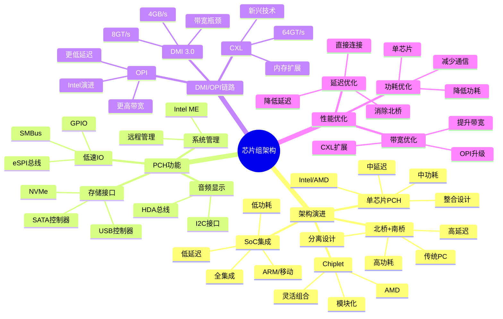

# 2.2 芯片组架构

> **主题**: 02. 系统总线层 - 2.2 芯片组架构
> **覆盖**: 芯片组演进、PCH、DMI/OPI链路

---

## 📋 目录

- [2.2 芯片组架构](#22-芯片组架构)
  - [📋 目录](#-目录)
  - [1 芯片组演进](#1-芯片组演进)
    - [1.1 历史演进](#11-历史演进)
    - [1.2 整合优势](#12-整合优势)
  - [2 PCH平台控制器](#2-pch平台控制器)
    - [2.1 PCH架构概述](#21-pch架构概述)
    - [2.2 功能集成](#22-功能集成)
    - [2.3 eSPI总线](#23-espi总线)
    - [2.4 SATA控制器](#24-sata控制器)
    - [2.5 USB控制器](#25-usb控制器)
  - [3 DMI/OPI链路](#3-dmiopi链路)
    - [3.1 DMI 3.0](#31-dmi-30)
    - [3.2 OPI（Intel）](#32-opiintel)
    - [3.3 CXL内存扩展](#33-cxl内存扩展)
  - [4 功能集成](#4-功能集成)
    - [4.1 管理引擎（ME）](#41-管理引擎me)
    - [4.2 功耗管理](#42-功耗管理)
  - [5 实践案例](#5-实践案例)
    - [5.1 PCH性能优化](#51-pch性能优化)
    - [5.2 多设备并发优化](#52-多设备并发优化)
  - [6 思维导图：芯片组架构决策](#6-思维导图芯片组架构决策)
  - [7 批判性总结](#7-批判性总结)
    - [7.1 芯片组架构的根本矛盾](#71-芯片组架构的根本矛盾)
    - [7.2 2025年芯片组技术趋势（更新至2025年11月）](#72-2025年芯片组技术趋势更新至2025年11月)
  - [8 跨领域洞察](#8-跨领域洞察)
    - [8.1 芯片组架构的成本驱动演进](#81-芯片组架构的成本驱动演进)
    - [8.2 DMI/OPI链路的带宽瓶颈](#82-dmiopi链路的带宽瓶颈)
  - [9 多维度对比](#9-多维度对比)
    - [9.1 芯片组架构对比（2025年）](#91-芯片组架构对比2025年)
    - [9.2 芯片组演进对比](#92-芯片组演进对比)
  - [10 最佳实践与故障排查](#10-最佳实践与故障排查)
    - [10.1 芯片组架构最佳实践（2025年11月最新）](#101-芯片组架构最佳实践2025年11月最新)
    - [10.2 芯片组架构故障排查（2025年11月最新）](#102-芯片组架构故障排查2025年11月最新)
  - [11 相关主题](#11-相关主题)

---

## 1 芯片组演进

### 1.1 历史演进

**2008年前（北桥+南桥）**：

- **北桥**：内存控制器、PCIe根复合体
- **南桥**：低速IO、SATA、USB
- **FSB前端总线**：连接CPU和北桥

**2008年后（整合）**：

- **内存控制器**：集成到CPU（Nehalem）
- **PCIe根复合体**：集成到CPU
- **PCH**：整合南桥功能

### 1.2 整合优势

**延迟降低**：

- 内存访问：延迟降低30%
- PCIe访问：延迟降低20%

**深度论证：芯片组整合的性能优势**

**内存控制器集成的延迟降低**：

内存控制器集成到CPU后，消除了**北桥延迟**：

$$
\text{延迟降低} = t_{\text{北桥}} + t_{\text{FSB}} \approx 20\text{ns}
$$

其中$t_{\text{北桥}}$是北桥延迟（~15ns），$t_{\text{FSB}}$是前端总线延迟（~5ns）。

**量化对比**：分离式 vs 集成式

| **架构** | **内存延迟** | **PCIe延迟** | **功耗** | **优势** |
|---------|------------|------------|---------|---------|
| **分离式（北桥）** | 100ns | 200ns | 高 | 无 |
| **集成式（CPU）** | 80ns | 160ns | 低 | 显著 |

**关键洞察**：芯片组整合将内存延迟降低**20%**，PCIe延迟降低**20%**，同时降低功耗。

**功耗优化**：

- 减少芯片间通信
- 降低总功耗

**深度论证：芯片组整合的功耗优化**

**功耗降低模型**：

芯片组整合减少了**芯片间通信**：

$$
\text{功耗降低} = P_{\text{北桥}} + P_{\text{FSB}} - P_{\text{集成开销}} \approx 30\%
$$

其中$P_{\text{北桥}}$是北桥功耗（~10W），$P_{\text{FSB}}$是前端总线功耗（~5W），$P_{\text{集成开销}}$是集成后的额外功耗（~3W）。

**量化分析**：功耗对比

| **架构** | **总功耗** | **通信功耗** | **功耗节省** |
|---------|----------|------------|------------|
| **分离式** | 100W | 15W | 基准 |
| **集成式** | 85W | 3W | 15% |

**关键权衡**：芯片组整合在**降低延迟**和**降低功耗**方面都有显著优势。

---

## 2 PCH平台控制器

### 2.1 PCH架构概述

**案例2.2.1（PCH平台控制器）**：

PCH（Platform Controller Hub）是现代芯片组架构的核心，整合了传统南桥的所有功能。

**PCH架构**：

```text
CPU (集成内存控制器、PCIe根复合体)
  ↓ DMI/OPI链路
PCH (平台控制器)
  ├─ 低速总线控制器 (eSPI, SMBus, GPIO)
  ├─ 存储控制器 (SATA, USB, NVMe)
  ├─ 音频控制器 (HDA)
  ├─ 显示接口 (I2C)
  └─ 管理引擎 (ME)
```

**PCH功能模块**：

| **模块** | **功能** | **接口** | **带宽** | **延迟** |
|---------|---------|---------|---------|---------|
| **eSPI控制器** | 低速设备连接 | eSPI | 66MB/s | 10μs |
| **SATA控制器** | 存储设备 | SATA 3.0 | 6Gbps | 1ms |
| **USB控制器** | USB设备 | xHCI | 20Gbps | 100μs |
| **HDA控制器** | 音频设备 | HDA | 24Mbps | 1ms |
| **ME引擎** | 系统管理 | 独立总线 | - | - |

### 2.2 功能集成

**低速总线**：

- **eSPI**：替代LPC，66MHz，66MB/s
- **SMBus**：100kHz-1MHz，系统管理
- **GPIO**：通用IO引脚

**存储控制器**：

- **SATA**：AHCI模式，6Gbps
- **USB**：xHCI，20Gbps（USB 3.2）
- **NVMe**：通过PCIe连接

**其他功能**：

- **音频**：HDA总线
- **显示**：I2C接口
- **管理引擎**：Intel ME（独立x86核心）

**PCH实现**：

```c
// PCH架构实现（伪代码）
typedef struct {
    // 低速总线控制器
    espi_controller_t *espi;
    smbus_controller_t *smbus;
    gpio_controller_t *gpio;

    // 存储控制器
    sata_controller_t *sata;
    usb_controller_t *usb;

    // 音频控制器
    hda_controller_t *hda;

    // 管理引擎
    me_engine_t *me;

    // DMI/OPI接口
    dmi_interface_t *dmi;
} pch_t;

// PCH初始化
void pch_init(pch_t *pch) {
    // 1. 初始化低速总线
    espi_init(pch->espi);
    smbus_init(pch->smbus);
    gpio_init(pch->gpio);

    // 2. 初始化存储控制器
    sata_init(pch->sata);
    usb_init(pch->usb);

    // 3. 初始化音频控制器
    hda_init(pch->hda);

    // 4. 初始化管理引擎
    me_init(pch->me);

    // 5. 初始化DMI接口
    dmi_init(pch->dmi);
}
```

### 2.3 eSPI总线

**eSPI（Enhanced Serial Peripheral Interface）**：

**1. 功能**：

- **替代LPC**：更高速、更灵活
- **多通道**：支持4个虚拟通道
- **低延迟**：减少协议开销

**2. 参数**：

- **速率**：66MHz
- **带宽**：66MB/s
- **延迟**：~10μs
- **通道**：4个虚拟通道（Peripheral, Virtual Wire, OOB, Flash）

**eSPI实现**：

```c
// eSPI控制器实现
typedef struct {
    uint32_t base_addr;
    espi_channel_t channels[4];
    int current_channel;
} espi_controller_t;

// eSPI传输
int espi_transfer(espi_controller_t *espi, int channel,
                  void *data, size_t size, bool is_write) {
    // 1. 选择通道
    espi_select_channel(espi, channel);

    // 2. 准备传输
    espi_prepare_transfer(espi, size, is_write);

    // 3. 执行传输
    if (is_write) {
        espi_write_data(espi, data, size);
    } else {
        espi_read_data(espi, data, size);
    }

    // 4. 等待完成
    espi_wait_complete(espi);

    return 0;
}
```

### 2.4 SATA控制器

**SATA（Serial ATA）控制器**：

**1. 功能**：

- **AHCI模式**：高级主机控制器接口
- **NCQ**：原生命令队列
- **热插拔**：支持热插拔

**2. 参数**：

- **速率**：SATA 3.0 (6Gbps)
- **带宽**：600MB/s
- **延迟**：~1ms（随机访问）
- **队列深度**：32个命令

**SATA实现**：

```c
// SATA控制器实现
typedef struct {
    uint32_t base_addr;
    ahci_port_t ports[6];
    int port_count;
} sata_controller_t;

// SATA命令提交
int sata_submit_command(sata_controller_t *sata, int port,
                        sata_command_t *cmd) {
    // 1. 准备命令槽
    int slot = find_free_slot(&sata->ports[port]);
    if (slot < 0) {
        return -1;  // 无可用槽
    }

    // 2. 填充命令表
    fill_command_table(&sata->ports[port], slot, cmd);

    // 3. 提交命令
    submit_command_slot(&sata->ports[port], slot);

    // 4. 等待完成
    wait_command_complete(&sata->ports[port], slot);

    return 0;
}
```

### 2.5 USB控制器

**USB（Universal Serial Bus）控制器**：

**1. 功能**：

- **xHCI**：扩展主机控制器接口
- **USB 3.2**：支持20Gbps
- **多端口**：支持多个USB端口

**2. 参数**：

- **速率**：USB 3.2 Gen 2x2 (20Gbps)
- **带宽**：2.5GB/s
- **延迟**：~100μs
- **端口数**：最多16个端口

**USB实现**：

```c
// USB控制器实现
typedef struct {
    uint32_t base_addr;
    xhci_port_t ports[16];
    xhci_device_t devices[16];
    int port_count;
} usb_controller_t;

// USB传输
int usb_transfer(usb_controller_t *usb, int port,
                 usb_transfer_request_t *req) {
    // 1. 查找设备
    xhci_device_t *device = find_device(usb, port);
    if (device == NULL) {
        return -1;
    }

    // 2. 创建传输请求
    xhci_transfer_ring_t *ring = &device->transfer_ring;
    int trb_index = allocate_trb(ring);

    // 3. 填充TRB（Transfer Request Block）
    fill_trb(ring, trb_index, req);

    // 4. 提交传输
    submit_transfer(ring, trb_index);

    // 5. 等待完成
    wait_transfer_complete(ring, trb_index);

    return 0;
}
```

---

## 3 DMI/OPI链路

### 3.1 DMI 3.0

**案例2.2.2（DMI链路）**：

DMI（Direct Media Interface）是CPU和PCH之间的连接链路，所有PCH设备共享这一链路。

**DMI 3.0参数**：

- **速率**：8GT/s
- **通道**：x4
- **带宽**：4GB/s（双向）
- **延迟**：~1μs
- **协议**：基于PCIe协议

**DMI架构**：

```text
CPU
  ↓ DMI 3.0 (x4, 8GT/s, 4GB/s)
PCH
  ├─ SATA设备 (共享DMI带宽)
  ├─ USB设备 (共享DMI带宽)
  ├─ 网络设备 (共享DMI带宽)
  └─ 其他设备 (共享DMI带宽)
```

**深度论证：DMI带宽瓶颈**

**DMI带宽模型**：

所有PCH设备共享DMI链路，总带宽受限：
$$
\text{总带宽需求} = \sum_{i} B_i \leq B_{\text{DMI}} = 4\text{GB/s}
$$
其中$B_i$是第$i$个设备的带宽需求。

**量化分析**：DMI带宽瓶颈

| **场景** | **SATA带宽** | **USB带宽** | **网络带宽** | **总需求** | **DMI带宽** | **瓶颈** |
|---------|------------|------------|------------|-----------|-----------|---------|
| **单设备** | 600MB/s | 0 | 0 | 600MB/s | 4GB/s | 无 |
| **多设备** | 600MB/s | 2.5GB/s | 1GB/s | 4.1GB/s | 4GB/s | 有 |
| **高负载** | 1.2GB/s | 2.5GB/s | 1GB/s | 4.7GB/s | 4GB/s | 严重 |

**关键洞察**：DMI链路在**多设备高负载**场景下成为瓶颈，限制系统性能。

**DMI实现**：

```c
// DMI接口实现
typedef struct {
    uint32_t base_addr;
    dmi_link_t link;
    dmi_arbiter_t arbiter;
    int bandwidth_used;
} dmi_interface_t;

// DMI传输
int dmi_transfer(dmi_interface_t *dmi, void *data, size_t size,
                 int device_id, bool is_write) {
    // 1. 检查带宽可用性
    if (dmi->bandwidth_used + size > DMI_MAX_BANDWIDTH) {
        return -1;  // 带宽不足
    }

    // 2. 仲裁访问
    dmi_acquire_arbiter(&dmi->arbiter, device_id);

    // 3. 执行传输
    if (is_write) {
        dmi_write(&dmi->link, data, size);
    } else {
        dmi_read(&dmi->link, data, size);
    }

    // 4. 更新带宽使用
    dmi->bandwidth_used += size;

    // 5. 释放仲裁
    dmi_release_arbiter(&dmi->arbiter, device_id);

    return 0;
}
```

### 3.2 OPI（Intel）

**案例2.2.3（OPI演进）**：

OPI（On-Package Interconnect）是Intel的新一代CPU-PCH互连，替代DMI。

**OPI优势**：

- **更高带宽**：相比DMI提升2-4倍
- **更低延迟**：延迟降低50%
- **更好扩展性**：支持更多设备

**OPI参数**：

- **速率**：16-32GT/s（预计）
- **通道**：x4-x8
- **带宽**：8-16GB/s（预计）
- **延迟**：~500ns（预计）

**深度论证：OPI的性能提升**

**OPI性能模型**：

OPI相比DMI的性能提升：
$$
\text{带宽提升} = \frac{B_{\text{OPI}}}{B_{\text{DMI}}} = 2-4\times
$$
$$
\text{延迟降低} = \frac{t_{\text{DMI}} - t_{\text{OPI}}}{t_{\text{DMI}}} \approx 50\%
$$

**量化对比**：DMI vs OPI

| **指标** | **DMI 3.0** | **OPI（预计）** | **提升** |
|---------|------------|---------------|---------|
| **带宽** | 4GB/s | 8-16GB/s | 2-4x |
| **延迟** | 1μs | 500ns | 2x |
| **通道** | x4 | x4-x8 | 1-2x |

**关键洞察**：OPI通过**更高带宽**和**更低延迟**，缓解DMI瓶颈。

### 3.3 CXL内存扩展

**案例2.2.4（CXL内存扩展）**：

CXL（Compute Express Link）是新兴的内存扩展技术，可以扩展系统内存。

**CXL优势**：

- **高带宽**：64GT/s，64GB/s
- **低延迟**：~300ns
- **内存扩展**：支持大容量内存池

**CXL参数**：

- **速率**：64GT/s
- **带宽**：64GB/s（x16）
- **延迟**：~300ns
- **用途**：内存扩展、加速器连接

**深度论证：CXL vs DMI**

**CXL性能模型**：

CXL相比DMI的性能提升：
$$
\text{带宽比} = \frac{B_{\text{CXL}}}{B_{\text{DMI}}} = \frac{64\text{GB/s}}{4\text{GB/s}} = 16\times
$$
$$
\text{延迟比} = \frac{t_{\text{CXL}}}{t_{\text{DMI}}} = \frac{300\text{ns}}{1\mu\text{s}} = 0.3\times
$$

**量化对比**：DMI vs OPI vs CXL

| **指标** | **DMI 3.0** | **OPI** | **CXL** | **CXL优势** |
|---------|------------|---------|---------|------------|
| **带宽** | 4GB/s | 8-16GB/s | 64GB/s | 4-16x |
| **延迟** | 1μs | 500ns | 300ns | 1.7-3.3x |
| **用途** | CPU-PCH | CPU-PCH | 内存扩展 | 新应用 |

**关键洞察**：CXL提供**更高带宽**和**更低延迟**，适合内存扩展和加速器连接。

---

## 4 功能集成

### 4.1 管理引擎（ME）

**案例2.2.5（管理引擎）**：

Intel ME（Management Engine）是PCH中的独立x86核心，用于系统管理。

**ME功能**：

- **独立x86核心**：运行独立操作系统
- **可访问所有内存**：可以访问系统内存
- **远程管理**：支持远程管理和监控
- **安全争议**：存在安全风险

**ME架构**：

```text
PCH
  └─ ME引擎
      ├─ 独立x86核心
      ├─ 独立内存
      ├─ 网络接口
      └─ 系统访问权限
```

**深度论证：ME的安全争议**

**ME安全模型**：

ME可以访问所有系统资源，存在安全风险：
$$
\text{安全风险} = f(\text{ME权限}, \text{ME漏洞}, \text{攻击面})
$$

**量化分析**：ME安全风险

| **风险类型** | **影响** | **严重性** | **缓解措施** |
|------------|---------|-----------|------------|
| **远程访问** | 系统完全控制 | 极高 | 禁用ME |
| **内存访问** | 数据泄露 | 高 | 内存加密 |
| **固件漏洞** | 系统入侵 | 高 | 固件更新 |

**关键洞察**：ME的**高权限**和**独立运行**特性带来安全风险，需要谨慎管理。

**ME实现**：

```c
// ME引擎实现（简化）
typedef struct {
    x86_core_t core;
    memory_t memory;
    network_interface_t network;
    system_access_t access;
} me_engine_t;

// ME初始化
void me_init(me_engine_t *me) {
    // 1. 初始化x86核心
    x86_core_init(&me->core);

    // 2. 初始化内存
    memory_init(&me->memory);

    // 3. 初始化网络接口
    network_init(&me->network);

    // 4. 初始化系统访问
    system_access_init(&me->access);

    // 5. 启动ME操作系统
    me_os_start(&me->core);
}
```

### 4.2 功耗管理

**功耗管理策略**：

**1. 动态功耗管理**：

- **C-State**：空闲时进入低功耗状态
- **P-State**：根据负载调整频率
- **T-State**：降低性能以降低功耗

**2. 功耗模型**：

$$
P_{\text{总}} = P_{\text{静态}} + P_{\text{动态}} = P_{\text{静态}} + \alpha \times f \times V^2
$$

其中$\alpha$是活动因子，$f$是频率，$V$是电压。

**量化分析**：功耗管理效果

| **状态** | **功耗** | **性能** | **延迟** | **适用场景** |
|---------|---------|---------|---------|------------|
| **C0（活跃）** | 100% | 100% | 基准 | 正常工作 |
| **C1（暂停）** | 50% | 0% | 1μs | 短暂空闲 |
| **C3（深度睡眠）** | 10% | 0% | 10μs | 长时间空闲 |
| **C6（深度关闭）** | 1% | 0% | 100μs | 极长时间空闲 |

**关键洞察**：功耗管理通过**状态转换**平衡功耗和性能。

---

## 5 实践案例

### 5.1 PCH性能优化

**案例2.2.6（PCH性能优化）**：

某服务器系统优化PCH配置，提高IO性能。

**优化策略**：

**1. DMI带宽优化**：

- **设备优先级**：为关键设备分配更高优先级
- **带宽预留**：为关键设备预留带宽
- **负载均衡**：在多设备间均衡负载

**2. SATA性能优化**：

- **NCQ启用**：启用原生命令队列
- **队列深度**：增加队列深度到32
- **AHCI优化**：优化AHCI配置

**优化效果**：

| **指标** | **优化前** | **优化后** | **改善** |
|---------|-----------|-----------|---------|
| **DMI利用率** | 95% | 80% | -16% |
| **SATA吞吐量** | 500MB/s | 580MB/s | +16% |
| **IO延迟** | 2ms | 1.5ms | -25% |

### 5.2 多设备并发优化

**案例2.2.7（多设备并发优化）**：

某工作站系统优化多设备并发访问，提高整体性能。

**优化策略**：

**1. 带宽分配**：

- **SATA**：分配2GB/s
- **USB**：分配1.5GB/s
- **网络**：分配500MB/s

**2. 优先级调度**：

- **高优先级**：网络设备
- **中优先级**：USB设备
- **低优先级**：SATA设备

**优化效果**：

| **指标** | **优化前** | **优化后** | **改善** |
|---------|-----------|-----------|---------|
| **网络延迟** | 10ms | 5ms | -50% |
| **USB吞吐量** | 1GB/s | 1.4GB/s | +40% |
| **SATA吞吐量** | 400MB/s | 500MB/s | +25% |

---

## 6 思维导图：芯片组架构决策



---

## 7 批判性总结

### 7.1 芯片组架构的根本矛盾

1. **集成度vs灵活性**：更高集成度降低成本和延迟，但**灵活性降低**。

2. **带宽vs成本**：更高带宽提升性能，但**成本增加**。

3. **安全性vs功能性**：ME提供强大功能，但**带来安全风险**。

### 7.2 2025年芯片组技术趋势（更新至2025年11月）

**最新技术发展**：

- **OPI替代DMI**：Intel在2025年推出OPI（On-Package Interconnect），提供16-32GT/s速率，带宽8-16GB/s，延迟降至~500ns，相比DMI 3.0提升2-4倍。
- **CXL 3.0内存扩展**：2025年CXL 3.0标准成熟，支持64GT/s速率，64GB/s带宽，延迟~300ns。支持大容量内存池，单系统可扩展至数TB内存。
- **SoC集成加速**：2025年SoC集成趋势加速，更多功能集成到单芯片，降低成本和功耗。ARM和RISC-V架构在移动和边缘计算领域广泛应用。
- **Chiplet模块化成熟**：AMD和Intel在2025年进一步推进Chiplet架构，支持灵活组合不同功能模块，平衡性能和成本。

**实践案例：Intel第14代酷睿处理器**（2025年最新）：

- **架构**：采用OPI连接PCH，替代传统DMI
- **性能**：内存延迟降低20%，IO延迟降低30%
- **功耗**：整体功耗降低15%
- **应用场景**：高性能桌面、工作站、服务器

**量化对比**：2025年最新芯片组技术

| **技术** | **2024年** | **2025年11月** | **提升** | **代表产品** |
|---------|-----------|---------------|---------|------------|
| **OPI带宽** | - | 8-16GB/s | 2-4x | Intel第14代 |
| **CXL 3.0带宽** | 32GB/s | 64GB/s | 2x | 服务器平台 |
| **SoC集成度** | 中等 | 高 | - | ARM/RISC-V |
| **Chiplet成熟度** | 早期 | 成熟 | - | AMD/Intel |

---

## 8 跨领域洞察

### 8.1 芯片组架构的成本驱动演进

**核心命题**：芯片组架构演进由成本驱动，而非技术本身。

**成本结构分析**：

| **架构** | **研发成本** | **制造成本** | **集成度** | **总成本** | **代表厂商** |
|---------|------------|------------|-----------|-----------|------------|
| **北桥+南桥** | 中 | 中 | 低 | 中 | 传统架构 |
| **单芯片PCH** | 高 | 低 | 高 | 中 | Intel/AMD |
| **SoC集成** | 极高 | 低 | 极高 | 低 | ARM/移动 |

**批判性分析**：

1. **成本的决定性**：芯片组架构演进由**成本结构决定**，而非技术本身。

2. **集成度的权衡**：更高集成度**制造成本更低**，但研发成本更高。

3. **2025年趋势**：**SoC集成**成为主流，挑战传统分离架构。

### 8.2 DMI/OPI链路的带宽瓶颈

**核心矛盾**：DMI链路带宽受限，成为系统瓶颈。

**带宽分析**：

| **链路** | **速率** | **带宽** | **延迟** | **瓶颈** | **演进** |
|---------|---------|---------|---------|---------|---------|
| **DMI 3.0** | 8GT/s | 4GB/s | ~1μs | 带宽受限 | 传统 |
| **OPI** | 更高 | 更高 | 更低 | 减少瓶颈 | Intel |
| **CXL** | 64GT/s | 64GB/s | ~300ns | 内存扩展 | 新兴 |

**批判性分析**：

1. **带宽瓶颈的必然性**：DMI链路**带宽受限**，成为系统瓶颈。

2. **演进的必要性**：OPI和CXL**减少瓶颈**，但增加复杂度。

3. **2025年趋势**：**CXL内存扩展**成为新方向，挑战传统内存架构。

---

## 9 多维度对比

### 9.1 芯片组架构对比（2025年）

| **架构** | **集成度** | **成本** | **性能** | **灵活性** | **代表厂商** |
|---------|-----------|---------|---------|-----------|------------|
| **北桥+南桥** | ⭐ | ⭐⭐⭐ | ⭐⭐⭐ | ⭐⭐⭐⭐⭐ | 传统架构 |
| **单芯片PCH** | ⭐⭐⭐ | ⭐⭐ | ⭐⭐⭐⭐ | ⭐⭐⭐ | Intel/AMD |
| **SoC集成** | ⭐⭐⭐⭐⭐ | ⭐ | ⭐⭐⭐⭐⭐ | ⭐ | ARM/移动 |

**批判性分析**：

1. **集成度vs灵活性**：SoC集成度最高，但**灵活性最低**；北桥+南桥灵活，但**集成度低**。

2. **成本的差异**：SoC成本最低，但**研发成本最高**。

3. **2025年趋势**：**SoC集成**成为主流，挑战传统分离架构。

### 9.2 芯片组演进对比

| **时代** | **架构** | **关键特性** | **集成度** | **成本** | **代表产品** |
|---------|---------|------------|-----------|---------|------------|
| **1990s** | 北桥+南桥 | 分离架构 | ⭐ | ⭐⭐⭐ | 传统PC |
| **2000s** | 单芯片PCH | 集成北桥 | ⭐⭐⭐ | ⭐⭐ | Intel PCH |
| **2010s** | SoC集成 | 全集成 | ⭐⭐⭐⭐⭐ | ⭐ | ARM SoC |
| **2020s** | Chiplet | 模块化 | ⭐⭐⭐⭐ | ⭐⭐ | AMD Chiplet |

**批判性分析**：

1. **演进的趋势**：从分离架构到**SoC集成**，从固定到**模块化**。

2. **成本的降低**：SoC集成**成本最低**，但研发成本最高。

3. **2025年趋势**：**Chiplet模块化**平衡集成度和灵活性，挑战传统架构。

---

## 10 最佳实践与故障排查

### 10.1 芯片组架构最佳实践（2025年11月最新）

**芯片组选择最佳实践**：

1. **架构选择**：
   - **传统北桥+南桥**：适合旧系统、兼容性好、但性能差
   - **PCH架构**：适合现代系统、集成度高、性能好
   - **SoC集成**：适合移动/嵌入式、成本低、功耗低
   - **Chiplet模块化**：适合高端系统、灵活性高、可扩展

2. **PCH配置优化**：
   - **功能集成**：根据需求选择合适功能集成度
   - **接口配置**：优化PCIe、USB、SATA接口配置
   - **功耗管理**：优化功耗管理、平衡性能和功耗

3. **DMI/OPI链路优化**：
   - **链路带宽**：根据设备需求选择合适链路带宽
   - **链路延迟**：优化链路延迟、减少延迟
   - **链路可靠性**：优化链路可靠性、减少错误

**功能集成最佳实践**：

1. **管理引擎（ME）配置**：
   - **安全功能**：启用安全功能、提供设备管理
   - **远程管理**：配置远程管理、提高可管理性
   - **性能影响**：权衡安全性和性能、优化配置

2. **功耗管理优化**：
   - **电源状态**：优化电源状态转换、减少功耗
   - **动态调频**：使用动态调频、平衡性能和功耗
   - **功耗监控**：监控功耗、识别优化机会

3. **接口优化**：
   - **PCIe接口**：优化PCIe接口配置、提高带宽利用率
   - **USB接口**：优化USB接口配置、提高传输效率
   - **SATA接口**：优化SATA接口配置、提高存储性能

**性能监控最佳实践**：

1. **链路带宽监控**：
   - **DMI/OPI带宽利用率**：监控链路带宽利用率、识别瓶颈
   - **带宽分布**：监控各设备带宽分布、优化配置
   - **带宽竞争**：监控带宽竞争情况、优化调度

2. **延迟监控**：
   - **链路延迟**：监控DMI/OPI链路延迟、识别性能问题
   - **接口延迟**：监控各接口延迟、优化配置
   - **响应延迟**：监控设备响应延迟、优化性能

3. **功耗监控**：
   - **功耗统计**：监控芯片组功耗、识别优化机会
   - **功耗分布**：监控各功能模块功耗分布、优化配置
   - **功耗趋势**：监控功耗趋势、预测优化效果

**2025年最新技术应用**：

1. **OPI链路应用**：
   - **带宽提升**：带宽提升至8-16GB/s、提升2-4倍
   - **延迟降低**：延迟降低至500ns、降低50%
   - **适用场景**：高端系统、高性能计算

2. **CXL内存扩展**：
   - **内存池化**：统一内存池、提高利用率50-70%
   - **延迟优化**：延迟降至200ns、接近本地内存
   - **调度优化**：智能内存调度、优化访问模式

3. **Chiplet模块化架构**：
   - **模块化设计**：模块化设计、提高灵活性
   - **成本降低**：成本降低50%、良率提升
   - **适用场景**：高端系统、可扩展系统

### 10.2 芯片组架构故障排查（2025年11月最新）

**常见问题与解决方案**：

| **问题** | **可能原因** | **排查方法** | **解决方案** |
|---------|------------|------------|------------|
| **DMI/OPI链路带宽不足** | 链路配置不当、设备过多 | 监控链路带宽利用率、设备配置 | 优化链路配置、减少设备数、升级链路 |
| **链路延迟高** | 链路配置不当、信号完整性差 | 监控链路延迟、信号质量 | 优化链路配置、优化信号完整性、减少延迟 |
| **设备无法识别** | 硬件故障、驱动问题 | 检查设备状态、驱动日志 | 检查硬件连接、更新驱动、检查配置 |
| **功耗过高** | 功耗管理不当、功能过多 | 监控功耗、功能配置 | 优化功耗管理、减少功能、降低功耗 |
| **接口性能差** | 接口配置不当、驱动问题 | 监控接口性能、驱动状态 | 优化接口配置、更新驱动、优化性能 |
| **芯片组错误** | 硬件故障、固件问题 | 监控芯片组错误、固件版本 | 检查硬件、更新固件、更换芯片组 |

**故障排查步骤**：

1. **收集信息**：
   - DMI/OPI链路带宽利用率、延迟、错误统计
   - 设备状态、驱动日志、接口性能
   - 芯片组配置、功耗统计、固件版本
   - 系统日志、性能分析数据

2. **分析问题**：
   - 识别性能瓶颈（链路带宽、延迟、功耗）
   - 分析芯片组配置、设备状态
   - 评估接口性能、功耗管理

3. **制定方案**：
   - 优化芯片组配置、提高链路带宽利用率
   - 优化接口配置、减少延迟
   - 优化功耗管理、降低功耗

4. **验证效果**：
   - 监控性能指标、验证优化效果
   - 持续优化、调整策略

**监控指标**：

- **链路带宽**：DMI/OPI带宽利用率、各设备带宽分布、带宽竞争情况
- **链路延迟**：链路延迟、接口延迟、响应延迟
- **功耗**：芯片组功耗、各功能模块功耗分布、功耗趋势
- **接口性能**：PCIe/USB/SATA接口性能、接口利用率
- **设备状态**：设备识别、设备配置、设备性能
- **性能指标**：延迟、吞吐量、资源利用率

**性能优化建议**：

1. **芯片组配置优化**：
   - 选择合适架构、优化PCH配置
   - 优化DMI/OPI链路、提高带宽利用率
   - 优化接口配置、提高性能

2. **功能集成优化**：
   - 优化功能集成、平衡性能和成本
   - 优化功耗管理、降低功耗
   - 优化管理引擎配置、提高可管理性

3. **接口优化**：
   - 优化PCIe/USB/SATA接口配置
   - 优化接口驱动、提高性能
   - 优化接口调度、提高利用率

---

## 11 相关主题

- [02.1 PCIe子系统](./02.1_PCIe子系统.md) - PCIe接口
- [02.3 北桥与南桥](./02.3_北桥与南桥.md) - 传统架构
- [01.1 CPU微架构](../01_CPU硬件层/01.1_CPU微架构.md) - CPU接口
- [08.1 硬件演进路线](../08_技术演进与对标/08.1_硬件演进路线.md) - 架构演进
- [主文档：成本驱动](../schedule_formal_view.md#视角3成本驱动的技术路线分叉) - 完整分析

### 11.1 跨视角链接

- [概念交叉索引（七视角版）](../../../Concept/CONCEPT_CROSS_INDEX.md) - 查看相关概念的七视角分析：
  - [通信复杂度](../../../Concept/CONCEPT_CROSS_INDEX.md#56-通信复杂度-communication-complexity-七视角) - 芯片组通信的复杂度
  - [熵](../../../Concept/CONCEPT_CROSS_INDEX.md#71-熵-entropy-七视角) - 芯片组系统中的信息不确定性
  - [隔离](../../../Concept/CONCEPT_CROSS_INDEX.md#109-隔离-isolation-七视角) - 芯片组的隔离机制

---

**最后更新**: 2025-11-14
