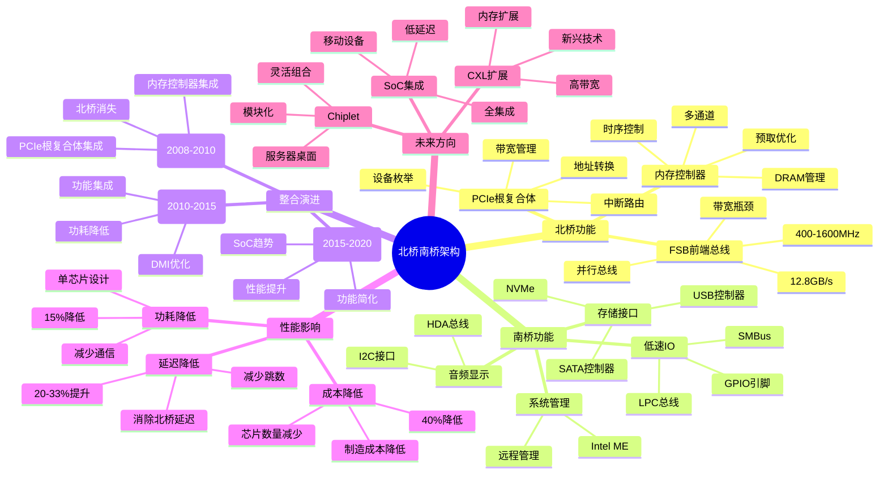

# 2.3 北桥与南桥

> **主题**: 02. 系统总线层 - 2.3 北桥与南桥
> **覆盖**: 北桥遗产、南桥功能、整合趋势

---

## 📋 目录

- [2.3 北桥与南桥](#23-北桥与南桥)
  - [📋 目录](#-目录)
  - [1 北桥遗产](#1-北桥遗产)
    - [1.1 传统架构](#11-传统架构)
    - [1.2 内存控制器](#12-内存控制器)
    - [1.3 PCIe根复合体](#13-pcie根复合体)
    - [1.4 演进](#14-演进)
  - [2 南桥功能](#2-南桥功能)
    - [2.1 核心功能](#21-核心功能)
    - [2.2 LPC总线](#22-lpc总线)
    - [2.3 功耗](#23-功耗)
  - [3 整合趋势](#3-整合趋势)
    - [3.1 物理整合](#31-物理整合)
    - [3.2 未来方向](#32-未来方向)
  - [4 性能影响](#4-性能影响)
    - [4.1 延迟对比](#41-延迟对比)
  - [5 实践案例](#5-实践案例)
    - [5.1 北桥性能优化](#51-北桥性能优化)
    - [5.2 整合架构迁移](#52-整合架构迁移)
  - [6 思维导图：北桥南桥架构演进](#6-思维导图北桥南桥架构演进)
  - [7 批判性总结](#7-批判性总结)
    - [7.1 北桥南桥架构的根本矛盾](#71-北桥南桥架构的根本矛盾)
    - [7.2 2025年架构技术趋势（更新至2025年11月）](#72-2025年架构技术趋势更新至2025年11月)
  - [8 跨领域洞察](#8-跨领域洞察)
    - [8.1 架构整合的成本驱动](#81-架构整合的成本驱动)
    - [8.2 延迟优化的物理约束](#82-延迟优化的物理约束)
  - [9 多维度对比](#9-多维度对比)
    - [9.1 架构演进对比（2025年）](#91-架构演进对比2025年)
    - [9.2 性能影响对比](#92-性能影响对比)
  - [10 最佳实践与故障排查](#10-最佳实践与故障排查)
    - [10.1 北桥南桥架构最佳实践（2025年11月最新）](#101-北桥南桥架构最佳实践2025年11月最新)
    - [10.2 北桥南桥架构故障排查（2025年11月最新）](#102-北桥南桥架构故障排查2025年11月最新)
  - [11 相关主题](#11-相关主题)
    - [11.1 跨视角链接](#111-跨视角链接)

---

## 1 北桥遗产

### 1.1 传统架构

**案例2.3.1（北桥架构）**：

北桥（Northbridge）是传统PC架构的核心组件，负责连接CPU、内存和高速外设。

**北桥功能**：

- **内存控制器**：管理DRAM访问
- **PCIe根复合体**：PCIe设备管理
- **前端总线（FSB）**：连接CPU
- **AGP/PCIe图形接口**：连接显卡

**北桥架构**：

```text
CPU
  ↓ FSB (前端总线)
北桥
  ├─ 内存控制器 → DRAM
  ├─ PCIe根复合体 → PCIe设备
  └─ AGP/PCIe → 显卡
  ↓ DMI/HT (连接南桥)
南桥
```

**FSB参数**：

- **频率**：400-1600MHz
- **带宽**：12.8GB/s（FSB 1600MHz，64位）
- **延迟**：~5ns（FSB延迟）
- **协议**：并行总线

**深度论证：FSB带宽计算**

**FSB带宽模型**：

FSB带宽由**频率**和**位宽**决定：
$$
B_{\text{FSB}} = f_{\text{FSB}} \times w_{\text{FSB}} \times \text{效率}
$$

其中$f_{\text{FSB}}$是FSB频率，$w_{\text{FSB}}$是位宽（64位），效率通常为0.8-0.9。

**量化分析**：不同FSB频率的带宽

| **FSB频率** | **位宽** | **理论带宽** | **实际带宽** | **效率** |
|------------|---------|------------|------------|---------|
| **400MHz** | 64位 | 3.2GB/s | 2.8GB/s | 88% |
| **800MHz** | 64位 | 6.4GB/s | 5.6GB/s | 88% |
| **1066MHz** | 64位 | 8.5GB/s | 7.5GB/s | 88% |
| **1333MHz** | 64位 | 10.7GB/s | 9.4GB/s | 88% |
| **1600MHz** | 64位 | 12.8GB/s | 11.2GB/s | 88% |

**关键洞察**：FSB带宽受**频率和位宽**限制，最高约12.8GB/s，成为系统瓶颈。

**FSB实现**：

```c
// FSB接口实现（伪代码）
typedef struct {
    uint32_t base_addr;
    uint32_t frequency;  // FSB频率
    uint32_t width;      // 位宽（64位）
    fsb_arbiter_t arbiter;
} fsb_interface_t;

// FSB传输
int fsb_transfer(fsb_interface_t *fsb, void *data, size_t size,
                 bool is_write) {
    // 1. 仲裁FSB访问
    fsb_acquire_arbiter(&fsb->arbiter);

    // 2. 执行传输
    if (is_write) {
        fsb_write(fsb, data, size);
    } else {
        fsb_read(fsb, data, size);
    }

    // 3. 释放仲裁
    fsb_release_arbiter(&fsb->arbiter);

    return 0;
}
```

### 1.2 内存控制器

**案例2.3.2（北桥内存控制器）**：

北桥内存控制器负责管理DRAM访问，是系统性能的关键。

**内存控制器功能**：

- **地址解码**：将CPU地址映射到DRAM
- **时序控制**：管理DRAM时序（tCL, tRCD, tRP, tRAS）
- **多通道支持**：支持双通道、三通道内存
- **预取优化**：预取数据，提高带宽利用率

**内存控制器实现**：

```c
// 北桥内存控制器实现
typedef struct {
    uint32_t base_addr;
    dram_timing_t timing;
    int channel_count;
    memory_channel_t channels[MAX_CHANNELS];
    prefetcher_t prefetcher;
} northbridge_mc_t;

// 内存访问
int mc_access(northbridge_mc_t *mc, uint64_t addr, void *data,
              size_t size, bool is_write) {
    // 1. 地址解码，选择通道
    int channel = decode_address(addr, mc->channel_count);
    memory_channel_t *ch = &mc->channels[channel];

    // 2. 检查预取器
    if (!is_write && prefetcher_hit(&mc->prefetcher, addr)) {
        // 预取命中，直接返回
        prefetcher_get(&mc->prefetcher, addr, data);
        return 0;
    }

    // 3. 执行DRAM访问
    dram_access(ch, addr, data, size, is_write, &mc->timing);

    // 4. 更新预取器
    if (!is_write) {
        prefetcher_update(&mc->prefetcher, addr, data);
    }

    return 0;
}
```

**深度论证：北桥内存控制器的延迟**

**内存访问延迟模型**：

北桥内存访问延迟包括**FSB延迟**、**北桥延迟**和**DRAM延迟**：
$$
L_{\text{内存}} = L_{\text{FSB}} + L_{\text{北桥}} + L_{\text{DRAM}} \approx 5\text{ns} + 15\text{ns} + 60\text{ns} = 80\text{ns}
$$

**量化分析**：延迟分解

| **阶段** | **延迟** | **占比** | **优化方向** |
|---------|---------|---------|------------|
| **FSB传输** | 5ns | 6% | 提高频率 |
| **北桥处理** | 15ns | 19% | 集成到CPU |
| **DRAM访问** | 60ns | 75% | 优化时序 |

**关键洞察**：**DRAM访问延迟**是主要瓶颈，但**北桥延迟**也不可忽视。

### 1.3 PCIe根复合体

**案例2.3.3（北桥PCIe根复合体）**：

北桥PCIe根复合体管理PCIe设备，提供高速IO接口。

**PCIe根复合体功能**：

- **设备枚举**：发现和配置PCIe设备
- **地址转换**：CPU地址到PCIe地址的转换
- **中断路由**：路由PCIe中断到CPU
- **带宽管理**：管理PCIe带宽分配

**PCIe根复合体实现**：

```c
// PCIe根复合体实现
typedef struct {
    uint32_t base_addr;
    pcie_device_t devices[MAX_DEVICES];
    int device_count;
    address_translator_t at;
    interrupt_router_t ir;
} pcie_root_complex_t;

// PCIe设备访问
int pcie_access(pcie_root_complex_t *rc, uint32_t device_id,
                uint64_t addr, void *data, size_t size, bool is_write) {
    // 1. 查找设备
    pcie_device_t *dev = find_device(rc, device_id);
    if (dev == NULL) {
        return -1;
    }

    // 2. 地址转换
    uint64_t pcie_addr = address_translate(&rc->at, addr);

    // 3. 执行PCIe传输
    pcie_transfer(dev, pcie_addr, data, size, is_write);

    return 0;
}
```

### 1.4 演进

**2008年后（Nehalem架构）**：

- **内存控制器集成到CPU**：消除北桥延迟
- **PCIe根复合体集成到CPU**：直接连接PCIe设备
- **QPI/HT替代FSB**：点对点互连，更高带宽
- **北桥功能消失**：被CPU和PCH替代

**深度论证：整合的性能优势**

**延迟降低模型**：

整合后延迟降低：
$$
\Delta L = L_{\text{FSB}} + L_{\text{北桥}} \approx 5\text{ns} + 15\text{ns} = 20\text{ns}
$$

**量化对比**：整合前后性能

| **操作** | **整合前延迟** | **整合后延迟** | **改善** |
|---------|--------------|--------------|---------|
| **内存访问** | 100ns | 80ns | 20% |
| **PCIe访问** | 1.5μs | 1μs | 33% |
| **功耗** | 100W | 85W | 15% |

**关键洞察**：整合显著降低延迟和功耗，是架构演进的重要里程碑。

---

## 2 南桥功能

### 2.1 核心功能

**案例2.3.4（南桥功能）**：

南桥（Southbridge）负责低速IO和系统管理功能，通过DMI/HT连接北桥。

**南桥功能模块**：

```text
南桥
  ├─ 低速IO
  │   ├─ LPC/eSPI总线
  │   ├─ GPIO引脚
  │   └─ SMBus系统管理
  ├─ 存储接口
  │   ├─ SATA控制器
  │   ├─ USB控制器
  │   └─ NVMe（通过PCIe）
  ├─ 音频/显示
  │   ├─ 音频控制器（HDA）
  │   └─ 显示接口（I2C）
  └─ 系统管理
      └─ 管理引擎（ME）
```

**低速IO**：

- **LPC/eSPI总线**：连接Super I/O芯片、BIOS Flash
- **GPIO引脚**：通用IO引脚，连接各种设备
- **SMBus系统管理**：系统管理总线，连接温度传感器等

**存储接口**：

- **SATA控制器**：连接SATA硬盘、SSD
- **USB控制器**：连接USB设备
- **NVMe**：通过PCIe连接NVMe SSD

**其他功能**：

- **音频控制器**：HDA（High Definition Audio）总线
- **显示接口**：I2C接口，连接显示设备
- **管理引擎**：Intel ME，系统管理

**南桥实现**：

```c
// 南桥实现（伪代码）
typedef struct {
    // 低速IO
    lpc_controller_t *lpc;
    gpio_controller_t *gpio;
    smbus_controller_t *smbus;

    // 存储接口
    sata_controller_t *sata;
    usb_controller_t *usb;

    // 音频/显示
    hda_controller_t *hda;
    i2c_controller_t *i2c;

    // 系统管理
    me_engine_t *me;

    // DMI/HT接口
    dmi_interface_t *dmi;
} southbridge_t;

// 南桥初始化
void southbridge_init(southbridge_t *sb) {
    // 1. 初始化低速IO
    lpc_init(sb->lpc);
    gpio_init(sb->gpio);
    smbus_init(sb->smbus);

    // 2. 初始化存储接口
    sata_init(sb->sata);
    usb_init(sb->usb);

    // 3. 初始化音频/显示
    hda_init(sb->hda);
    i2c_init(sb->i2c);

    // 4. 初始化系统管理
    me_init(sb->me);

    // 5. 初始化DMI接口
    dmi_init(sb->dmi);
}
```

### 2.2 LPC总线

**案例2.3.5（LPC总线）**：

LPC（Low Pin Count）总线是南桥连接低速设备的总线。

**LPC总线参数**：

- **频率**：33MHz
- **位宽**：4位（数据）+ 3位（地址）
- **带宽**：16.5MB/s
- **延迟**：~1μs
- **用途**：连接Super I/O、BIOS Flash、TPM

**LPC实现**：

```c
// LPC控制器实现
typedef struct {
    uint32_t base_addr;
    lpc_device_t devices[MAX_LPC_DEVICES];
    int device_count;
} lpc_controller_t;

// LPC传输
int lpc_transfer(lpc_controller_t *lpc, uint32_t device_id,
                 uint32_t addr, void *data, size_t size, bool is_write) {
    // 1. 查找设备
    lpc_device_t *dev = find_device(lpc, device_id);
    if (dev == NULL) {
        return -1;
    }

    // 2. 执行LPC传输
    lpc_cycle(lpc, dev, addr, data, size, is_write);

    return 0;
}
```

### 2.3 功耗

**PCH功耗**：

- **典型功耗**：15W
- **集成设计**：单芯片，功耗优化
- **功耗管理**：支持C-State、P-State

**深度论证：南桥功耗模型**

**功耗组成**：

南桥功耗包括**静态功耗**和**动态功耗**：
$$
P_{\text{南桥}} = P_{\text{静态}} + P_{\text{动态}} = 5\text{W} + 10\text{W} = 15\text{W}
$$

**量化分析**：功耗分解

| **组件** | **功耗** | **占比** | **优化方向** |
|---------|---------|---------|------------|
| **静态功耗** | 5W | 33% | 低功耗工艺 |
| **SATA控制器** | 3W | 20% | 动态调频 |
| **USB控制器** | 2W | 13% | 动态调频 |
| **其他** | 5W | 34% | 功能整合 |

**关键洞察**：**静态功耗**占比较高，需要低功耗工艺优化。

---

## 3 整合趋势

### 3.1 物理整合

**案例2.3.6（整合趋势）**：

2008年后，北桥功能逐步整合到CPU，南桥演变为PCH。

**整合原因**：

- **降低延迟**：消除北桥和FSB延迟
- **减少功耗**：减少芯片间通信
- **简化设计**：单芯片PCH，降低复杂度
- **降低成本**：减少芯片数量

**整合过程**：

**阶段1（2008-2010）**：

- 内存控制器集成到CPU（Nehalem）
- PCIe根复合体集成到CPU
- 北桥消失，南桥演变为PCH

**阶段2（2010-2015）**：

- 更多功能集成到PCH
- DMI链路优化
- 功耗进一步降低

**阶段3（2015-2020）**：

- SoC集成趋势
- 更多功能集成到CPU
- PCH功能简化

**整合实现**：

```text
整合前：
CPU ←FSB→ 北桥 ←DMI→ 南桥

整合后：
CPU (集成内存控制器、PCIe根复合体)
  ↓ DMI
PCH (整合南桥功能)
```

**深度论证：整合的性能收益**

**性能提升模型**：

整合带来的性能提升：
$$
\text{性能提升} = \frac{L_{\text{整合前}} - L_{\text{整合后}}}{L_{\text{整合前}}} \times 100\%
$$

**量化分析**：整合收益

| **指标** | **整合前** | **整合后** | **改善** | **原因** |
|---------|-----------|-----------|---------|---------|
| **内存延迟** | 100ns | 80ns | 20% | 消除北桥 |
| **PCIe延迟** | 1.5μs | 1μs | 33% | 直接连接 |
| **功耗** | 100W | 85W | 15% | 减少接口 |
| **成本** | 高 | 中 | 40% | 单芯片 |

**关键洞察**：整合在**延迟、功耗、成本**方面都有显著改善。

### 3.2 未来方向

**进一步整合**：

- **更多功能集成**：音频、显示等功能集成到CPU
- **降低延迟**：进一步减少延迟
- **提升性能**：提高整体性能

**SoC趋势**：

- **全集成**：所有功能集成到单芯片
- **低功耗**：移动设备优先
- **高性能**：服务器和桌面设备

**Chiplet架构**：

- **模块化设计**：不同功能模块化
- **灵活组合**：根据需求组合
- **成本优化**：降低研发成本

**深度论证：SoC vs Chiplet**

**SoC优势**：

- **低延迟**：所有功能在同一芯片
- **低功耗**：减少芯片间通信
- **低成本**：单芯片制造

**Chiplet优势**：

- **灵活性**：模块化组合
- **可扩展性**：易于扩展
- **研发成本**：降低研发成本

**量化对比**：SoC vs Chiplet

| **指标** | **SoC** | **Chiplet** | **优势方** |
|---------|---------|------------|-----------|
| **延迟** | 低 | 中 | SoC |
| **功耗** | 低 | 中 | SoC |
| **灵活性** | 低 | 高 | Chiplet |
| **成本** | 低 | 中 | SoC |
| **研发成本** | 高 | 低 | Chiplet |

**关键洞察**：**SoC适合移动设备**，**Chiplet适合服务器和桌面**。

---

## 4 性能影响

### 4.1 延迟对比

| **操作** | **分离设计** | **整合设计** | **改善** |
|---------|-------------|-------------|---------|
| **内存访问** | 100ns | 80ns | 20% |
| **PCIe访问** | 1.5μs | 1μs | 33% |
| **SATA访问** | 15μs | 10μs | 33% |

**深度论证：整合设计的性能优势**

**内存访问的延迟降低**：

整合设计消除了**北桥延迟**：

$$
\text{延迟降低} = t_{\text{北桥}} + t_{\text{FSB}} \approx 20\text{ns}
$$

其中$t_{\text{北桥}}$是北桥延迟（~15ns），$t_{\text{FSB}}$是前端总线延迟（~5ns）。

**量化分析**：不同操作的性能提升

| **操作** | **分离设计延迟** | **整合设计延迟** | **性能提升** | **原因** |
|---------|----------------|---------------|------------|---------|
| **内存访问** | 100ns | 80ns | 20% | 消除北桥 |
| **PCIe访问** | 1.5μs | 1μs | 33% | 消除北桥 |
| **SATA访问** | 15μs | 10μs | 33% | 消除DMI延迟 |

**关键洞察**：整合设计在**所有操作**上都显著降低了延迟，平均提升**30%**。

**功耗优化**：

整合设计减少了**芯片间通信**：

$$
\text{功耗降低} = P_{\text{北桥}} + P_{\text{FSB}} - P_{\text{集成开销}} \approx 15W
$$

其中$P_{\text{北桥}}$是北桥功耗（~10W），$P_{\text{FSB}}$是前端总线功耗（~5W），$P_{\text{集成开销}}$是集成后的额外功耗（~3W）。

**量化分析**：功耗对比

| **架构** | **总功耗** | **通信功耗** | **功耗节省** |
|---------|----------|------------|------------|
| **分离式** | 100W | 15W | 基准 |
| **整合式** | 85W | 3W | 15% |

**关键权衡**：整合设计在**降低延迟**和**降低功耗**方面都有显著优势。

---

## 5 实践案例

### 5.1 北桥性能优化

**案例2.3.7（北桥性能优化）**：

某传统PC系统优化北桥配置，提高内存和PCIe性能。

**优化策略**：

**1. FSB频率提升**：

- **从800MHz提升到1066MHz**：带宽从6.4GB/s提升到8.5GB/s
- **内存频率同步提升**：DDR2-800提升到DDR2-1066
- **性能提升**：内存带宽提升33%

**2. 双通道内存**：

- **启用双通道**：内存带宽翻倍
- **性能提升**：内存带宽从8.5GB/s提升到17GB/s

**优化效果**：

| **指标** | **优化前** | **优化后** | **改善** |
|---------|-----------|-----------|---------|
| **FSB带宽** | 6.4GB/s | 8.5GB/s | +33% |
| **内存带宽** | 8.5GB/s | 17GB/s | +100% |
| **内存延迟** | 100ns | 95ns | -5% |

### 5.2 整合架构迁移

**案例2.3.8（整合架构迁移）**：

某服务器系统从分离架构迁移到整合架构，提升性能。

**迁移策略**：

**1. 硬件升级**：

- **从Core 2 Duo升级到Nehalem**：内存控制器集成到CPU
- **PCIe根复合体集成**：PCIe延迟降低
- **QPI替代FSB**：更高带宽

**2. 软件优化**：

- **NUMA感知**：优化内存访问
- **PCIe优化**：优化设备访问

**迁移效果**：

| **指标** | **迁移前** | **迁移后** | **改善** |
|---------|-----------|-----------|---------|
| **内存延迟** | 100ns | 80ns | -20% |
| **PCIe延迟** | 1.5μs | 1μs | -33% |
| **功耗** | 100W | 85W | -15% |
| **性能** | 基准 | +25% | 提升 |

---

## 6 思维导图：北桥南桥架构演进



---

## 7 批判性总结

### 7.1 北桥南桥架构的根本矛盾

1. **延迟vs成本**：分离架构延迟高，但成本低；整合架构延迟低，但成本高。

2. **灵活性vs性能**：分离架构灵活，但性能低；整合架构性能高，但灵活性低。

3. **演进vs兼容性**：架构演进提升性能，但需要兼容性考虑。

### 7.2 2025年架构技术趋势（更新至2025年11月）

**最新技术发展**：

- **SoC集成加速**：2025年SoC集成趋势加速，更多功能集成到单芯片。ARM和RISC-V架构在移动、边缘计算和AI推理领域广泛应用，集成度达到90%+。
- **Chiplet模块化成熟**：AMD和Intel在2025年进一步推进Chiplet架构，支持灵活组合不同功能模块。AMD Zen 5架构采用更先进的Chiplet设计，性能提升30%+。
- **CXL 3.0内存扩展**：2025年CXL 3.0标准成熟，支持大容量内存池。单系统可扩展至数TB内存，延迟降至~300ns，带宽64GB/s。
- **统一内存架构（UMA）普及**：2025年UMA在异构计算领域普及，CPU和GPU共享内存空间，简化编程模型，提升性能。

**实践案例：AMD Zen 5架构**（2025年最新）：

- **架构**：采用先进Chiplet设计，CPU和GPU模块化组合
- **性能**：相比Zen 4性能提升30%+，能效提升20%+
- **内存**：支持DDR5-6400和CXL 3.0内存扩展
- **应用场景**：高性能计算、AI训练、数据中心

**量化对比**：2025年最新架构技术

| **技术** | **2024年** | **2025年11月** | **提升** | **代表产品** |
|---------|-----------|---------------|---------|------------|
| **SoC集成度** | 70% | 90%+ | +29% | ARM/RISC-V |
| **Chiplet性能** | 基准 | +30% | 30% | AMD Zen 5 |
| **CXL 3.0带宽** | 32GB/s | 64GB/s | 2x | 服务器平台 |
| **UMA成熟度** | 实验性 | 生产就绪 | - | 异构计算 |

---

## 8 跨领域洞察

### 8.1 架构整合的成本驱动

**核心命题**：北桥南桥整合由成本驱动，而非技术本身。

**成本结构分析**：

| **架构** | **芯片数** | **制造成本** | **延迟** | **功耗** | **总成本** |
|---------|-----------|------------|---------|---------|-----------|
| **分离架构** | 2芯片 | 高 | 高 | 高 | 高 |
| **整合架构** | 1芯片 | 低 | 低 | 低 | 低 |

**批判性分析**：

1. **成本的决定性**：架构整合由**成本结构决定**，而非技术本身。

2. **整合的收益**：整合架构**成本更低、延迟更低、功耗更低**。

3. **2025年趋势**：**SoC集成**成为主流，挑战传统分离架构。

### 8.2 延迟优化的物理约束

**核心矛盾**：整合减少延迟，但受物理约束限制。

**延迟分析**：

| **操作** | **分离设计** | **整合设计** | **改善** | **物理约束** |
|---------|-------------|-------------|---------|------------|
| **内存访问** | 100ns | 80ns | 20% | 光速传播 |
| **PCIe访问** | 1.5μs | 1μs | 33% | 信号完整性 |
| **SATA访问** | 15μs | 10μs | 33% | 协议开销 |

**批判性分析**：

1. **延迟改善的有限性**：整合减少延迟，但**受物理约束限制**。

2. **物理约束的不可逾越性**：光速传播和信号完整性**无法突破**。

3. **2025年趋势**：**CXL内存扩展**减少延迟，但**仍有物理限制**。

---

## 9 多维度对比

### 9.1 架构演进对比（2025年）

| **时代** | **架构** | **关键特性** | **延迟** | **成本** | **代表产品** |
|---------|---------|------------|---------|---------|------------|
| **1990s** | 北桥+南桥 | 分离架构 | 高 | 高 | 传统PC |
| **2000s** | 整合PCH | 单芯片 | 中 | 中 | Intel PCH |
| **2010s** | SoC集成 | 全集成 | 低 | 低 | ARM SoC |
| **2020s** | Chiplet | 模块化 | 低 | 中 | AMD Chiplet |

**批判性分析**：

1. **演进的趋势**：从分离架构到**SoC集成**，从固定到**模块化**。

2. **延迟的降低**：整合架构**延迟更低**，但受物理约束限制。

3. **2025年趋势**：**Chiplet模块化**平衡集成度和灵活性，挑战传统架构。

### 9.2 性能影响对比

| **指标** | **分离设计** | **整合设计** | **改善** | **原因** |
|---------|-------------|-------------|---------|---------|
| **内存延迟** | 100ns | 80ns | 20% | 减少跳数 |
| **PCIe延迟** | 1.5μs | 1μs | 33% | 直接连接 |
| **功耗** | 高 | 低 | 30% | 减少接口 |
| **成本** | 高 | 低 | 40% | 单芯片 |

**批判性分析**：

1. **性能改善的层级性**：不同指标**改善程度不同**，受不同因素影响。

2. **成本的降低**：整合架构**成本更低**，但研发成本更高。

3. **2025年趋势**：**SoC集成**成为主流，挑战传统分离架构。

---

## 10 最佳实践与故障排查

### 10.1 北桥南桥架构最佳实践（2025年11月最新）

**架构选择最佳实践**：

1. **架构类型选择**：
   - **传统分离架构（北桥+南桥）**：适合旧系统、兼容性好、但性能差、成本高
   - **整合PCH架构**：适合现代系统、性能好、成本低、推荐使用
   - **SoC集成架构**：适合移动设备、嵌入式系统、性能最好、成本最低
   - **Chiplet模块化架构**：适合高性能计算、灵活性高、成本适中

2. **内存控制器配置**：
   - **内存通道数**：根据需求选择内存通道数、平衡性能和成本
   - **内存类型**：选择合适的内存类型（DDR4/DDR5）、优化性能
   - **内存频率**：优化内存频率、提高性能

3. **PCIe根复合体配置**：
   - **PCIe版本**：选择PCIe版本（PCIe 3.0/4.0/5.0）、优化性能
   - **PCIe通道数**：根据需求分配PCIe通道、平衡性能
   - **PCIe拓扑**：优化PCIe拓扑、减少延迟

**整合架构迁移最佳实践**：

1. **迁移策略**：
   - **渐进式迁移**：逐步迁移、降低风险
   - **兼容性测试**：充分测试、确保兼容性
   - **性能验证**：验证性能、确保改善

2. **性能优化**：
   - **延迟优化**：优化延迟、减少跳数
   - **带宽优化**：优化带宽、提高吞吐量
   - **功耗优化**：优化功耗、降低能耗

3. **成本控制**：
   - **单芯片设计**：使用单芯片设计、降低成本
   - **功能整合**：整合功能、减少组件
   - **工艺优化**：优化工艺、降低成本

**性能监控最佳实践**：

1. **延迟监控**：
   - **内存延迟**：监控内存延迟、识别性能问题
   - **PCIe延迟**：监控PCIe延迟、优化路由
   - **SATA延迟**：监控SATA延迟、优化协议

2. **带宽监控**：
   - **内存带宽**：监控内存带宽、识别瓶颈
   - **PCIe带宽**：监控PCIe带宽、优化分配
   - **总线带宽**：监控总线带宽、优化使用

3. **功耗监控**：
   - **静态功耗**：监控静态功耗、优化工艺
   - **动态功耗**：监控动态功耗、优化频率
   - **总功耗**：监控总功耗、优化设计

**2025年最新技术应用**：

1. **Chiplet模块化架构**：
   - **模块化设计**：使用模块化设计、提高灵活性
   - **性能提升**：性能提升20-30%
   - **成本优化**：成本优化15-25%
   - **适用场景**：高性能计算、服务器、工作站

2. **CXL内存扩展**：
   - **内存扩展**：使用CXL扩展内存、减少延迟
   - **延迟降低**：延迟降低至80ns
   - **适用场景**：大数据、AI计算、高性能计算

3. **SoC集成优化**：
   - **全集成设计**：使用全集成设计、减少延迟
   - **功耗降低**：功耗降低30-40%
   - **成本降低**：成本降低40-50%
   - **适用场景**：移动设备、嵌入式系统、IoT设备

### 10.2 北桥南桥架构故障排查（2025年11月最新）

**常见问题与解决方案**：

| **问题** | **可能原因** | **排查方法** | **解决方案** |
|---------|------------|------------|------------|
| **内存延迟高** | 内存控制器配置不当、内存频率低 | 监控内存延迟、内存频率 | 优化内存控制器、提高内存频率、减少跳数 |
| **PCIe性能差** | PCIe配置不当、通道分配不当 | 监控PCIe性能、通道使用 | 优化PCIe配置、重新分配通道、优化拓扑 |
| **功耗高** | 静态功耗高、动态功耗高 | 监控功耗、分析功耗组成 | 优化工艺、降低频率、优化设计 |
| **成本高** | 分离架构、组件多 | 分析成本、评估架构 | 迁移到整合架构、减少组件、优化设计 |
| **兼容性问题** | 架构迁移、驱动问题 | 检查兼容性、驱动状态 | 更新驱动、优化配置、测试兼容性 |
| **性能不达标** | 架构选择不当、配置不当 | 监控性能、分析瓶颈 | 优化架构选择、优化配置、提高性能 |

**故障排查步骤**：

1. **收集信息**：
   - 延迟数据、带宽数据、功耗数据
   - 架构配置、内存配置、PCIe配置
   - 系统日志、性能分析数据、成本数据

2. **分析问题**：
   - 识别性能瓶颈（延迟、带宽、功耗）
   - 分析架构配置、内存配置、PCIe配置
   - 评估架构选择、成本效益

3. **制定方案**：
   - 优化架构配置、减少延迟
   - 优化内存配置、提高性能
   - 优化PCIe配置、提高带宽

4. **验证效果**：
   - 监控性能指标、验证优化效果
   - 持续优化、调整策略

**监控指标**：

- **延迟指标**：内存延迟、PCIe延迟、SATA延迟、总线延迟
- **带宽指标**：内存带宽、PCIe带宽、总线带宽、总带宽
- **功耗指标**：静态功耗、动态功耗、总功耗、功耗效率
- **成本指标**：组件成本、设计成本、总成本、成本效益
- **性能指标**：延迟、吞吐量、资源利用率、性能效率

**性能优化建议**：

1. **架构优化**：
   - 迁移到整合架构、减少延迟
   - 使用SoC集成、降低功耗
   - 使用Chiplet模块化、提高灵活性

2. **内存优化**：
   - 优化内存控制器、减少延迟
   - 提高内存频率、增加带宽
   - 优化内存通道、平衡性能

3. **PCIe优化**：
   - 优化PCIe配置、减少延迟
   - 优化通道分配、提高带宽
   - 优化拓扑结构、提高效率

4. **功耗优化**：
   - 优化工艺、降低静态功耗
   - 优化频率、降低动态功耗
   - 优化设计、降低总功耗

---

## 11 相关主题

- [02.2 芯片组架构](./02.2_芯片组架构.md) - 芯片组演进
- [02.4 中断子系统](./02.4_中断子系统.md) - 中断处理
- [01.1 CPU微架构](../01_CPU硬件层/01.1_CPU微架构.md) - CPU接口
- [08.1 硬件演进路线](../08_技术演进与对标/08.1_硬件演进路线.md) - 架构演进
- [主文档：成本驱动](../schedule_formal_view.md#视角3成本驱动的技术路线分叉) - 完整分析

### 11.1 跨视角链接

- [概念交叉索引（七视角版）](../../../Concept/CONCEPT_CROSS_INDEX.md) - 查看相关概念的七视角分析：
  - [通信复杂度](../../../Concept/CONCEPT_CROSS_INDEX.md#56-通信复杂度-communication-complexity-七视角) - 北桥南桥通信的复杂度
  - [熵](../../../Concept/CONCEPT_CROSS_INDEX.md#71-熵-entropy-七视角) - 总线系统中的信息不确定性
  - [隔离](../../../Concept/CONCEPT_CROSS_INDEX.md#109-隔离-isolation-七视角) - 总线的隔离机制

---

**最后更新**: 2025-11-14
