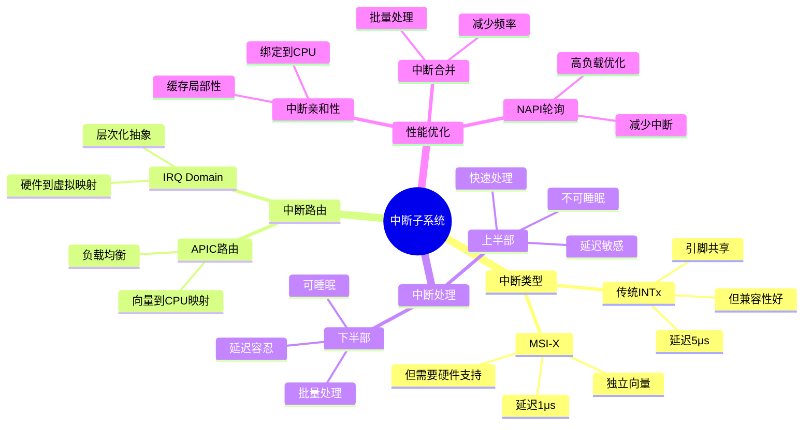

# 2.4 中断子系统

> **主题**: 02. 系统总线层 - 2.4 中断子系统
> **覆盖**: APIC、MSI-X、中断路由、中断处理

---

## 📋 目录

- [2.4 中断子系统](#24-中断子系统)
  - [📋 目录](#-目录)
  - [1 APIC架构](#1-apic架构)
    - [1.1 本地APIC](#11-本地apic)
    - [1.2 I/O APIC](#12-io-apic)
  - [2 MSI-X中断](#2-msi-x中断)
    - [2.1 优势](#21-优势)
    - [2.2 配置](#22-配置)
  - [3 中断路由](#3-中断路由)
    - [3.1 路由机制](#31-路由机制)
  - [4 中断处理流程](#4-中断处理流程)
    - [4.1 完整路径的严格分析](#41-完整路径的严格分析)
    - [4.2 优化](#42-优化)
  - [5 性能优化](#5-性能优化)
    - [5.1 中断亲和性](#51-中断亲和性)
    - [5.2 中断线程化](#52-中断线程化)
  - [6 思维导图：中断子系统架构](#6-思维导图中断子系统架构)
  - [7 批判性总结](#7-批判性总结)
    - [7.1 中断子系统的根本矛盾](#71-中断子系统的根本矛盾)
    - [7.2 2025年中断技术趋势（更新至2025年11月）](#72-2025年中断技术趋势更新至2025年11月)
  - [8 跨领域洞察](#8-跨领域洞察)
    - [8.1 中断延迟的物理约束](#81-中断延迟的物理约束)
    - [8.2 中断vs轮询的权衡](#82-中断vs轮询的权衡)
  - [9 多维度对比](#9-多维度对比)
    - [9.1 中断机制对比（2025年）](#91-中断机制对比2025年)
    - [9.2 中断处理演进对比](#92-中断处理演进对比)
  - [10 最佳实践与故障排查](#10-最佳实践与故障排查)
    - [10.1 中断子系统最佳实践（2025年11月最新）](#101-中断子系统最佳实践2025年11月最新)
    - [10.2 中断子系统故障排查（2025年11月最新）](#102-中断子系统故障排查2025年11月最新)
  - [11 相关主题](#11-相关主题)

---

## 1 APIC架构

### 1.1 本地APIC

**功能**：

- 每核心独立APIC
- 中断接收和处理
- 定时器功能

**寄存器**：

- **IRR**（Interrupt Request Register）：中断请求
- **ISR**（Interrupt Service Register）：正在服务
- **EOI**（End of Interrupt）：中断结束

### 1.2 I/O APIC

**功能**：

- 系统级中断控制器
- 中断路由
- 多核心支持

---

## 2 MSI-X中断

### 2.1 优势

**传统INTx**：

- 引脚共享
- 延迟：5μs
- 向量数：4个

**深度论证：INTx的延迟来源**

**INTx的延迟组成**：

INTx需要**共享引脚**，导致延迟：

$$
\text{INTx延迟} = t_{\text{引脚仲裁}} + t_{\text{中断路由}} + t_{\text{CPU接收}} \approx 5\mu\text{s}
$$

其中$t_{\text{引脚仲裁}}$是引脚共享导致的仲裁延迟（~2μs），$t_{\text{中断路由}}$是路由延迟（~1μs），$t_{\text{CPU接收}}$是CPU接收延迟（~2μs）。

**量化对比**：INTx vs MSI-X

| **特性** | **INTx** | **MSI-X** | **MSI-X优势** |
|---------|---------|----------|-------------|
| **延迟** | 5μs | 1μs | 5x |
| **向量数** | 4 | 2048 | 512x |
| **共享** | 是 | 否 | 无共享 |

**关键洞察**：MSI-X通过**独立向量**消除了引脚共享，延迟降低**5倍**。

**MSI-X**：

- 独立向量
- 延迟：1μs
- 向量数：2048个

**深度论证：MSI-X的性能优势**

**MSI-X的延迟模型**：

MSI-X直接**写APIC寄存器**，无需引脚仲裁：

$$
\text{MSI-X延迟} = t_{\text{写APIC}} + t_{\text{CPU接收}} \approx 1\mu\text{s}
$$

其中$t_{\text{写APIC}}$是写APIC延迟（~500ns），$t_{\text{CPU接收}}$是CPU接收延迟（~500ns）。

**量化分析**：MSI-X的性能提升

| **场景** | **INTx延迟** | **MSI-X延迟** | **性能提升** |
|---------|-------------|-------------|------------|
| **单设备** | 5μs | 1μs | 5x |
| **多设备** | 10μs+ | 1μs | 10x+ |

**关键权衡**：MSI-X在**多设备**场景下优势更明显，避免了引脚竞争。

### 2.2 配置

**OS配置流程**：

1. 读取Table Size
2. 分配向量
3. 配置地址/数据
4. 注册中断处理

---

## 3 中断路由

### 3.1 路由机制

**APIC路由**：

- 中断向量 → 目标CPU
- 亲和性设置
- 负载均衡

**IRQ Domain**：

- 硬件中断号 → 虚拟中断号
- 层次化映射
- 设备驱动抽象

---

## 4 中断处理流程

### 4.1 完整路径的严格分析

**定理2.3（中断处理延迟的严格分解）**：

对于中断处理延迟$L_{\text{int}}$，满足：

$$
L_{\text{int}} = L_{\text{trigger}} + L_{\text{MSI}} + L_{\text{routing}} + L_{\text{CPU}} + L_{\text{handler}}
$$

其中：

- $L_{\text{trigger}}$：设备触发延迟（~500ns）
- $L_{\text{MSI}}$：MSI-X写APIC延迟（~1μs）
- $L_{\text{routing}}$：APIC路由延迟（~500ns）
- $L_{\text{CPU}}$：CPU接收中断延迟（~1μs）
- $L_{\text{handler}}$：中断处理延迟（~5μs）

**证明**：中断处理是串行流程，总延迟等于各阶段延迟之和。∎

**完整路径**：

```text
1. 设备触发中断: 500ns
2. MSI-X写APIC: 1μs
3. APIC路由: 500ns
4. CPU接收中断: 1μs
5. 中断处理: 5μs
   - 上半部: 1μs
   - 下半部: 4μs

总计: ~8μs
```

**批判性分析**：

1. **中断延迟的不可优化性**：某些阶段（如MSI-X写APIC）**由硬件决定**，无法通过软件优化。

2. **中断频率的影响**：高频率中断导致**CPU开销大**，需要中断合并或轮询模式。

3. **2025年趋势**：**中断虚拟化**（如ARM GICv4）支持直接注入，减少延迟。

### 4.2 优化

**中断合并**：

- 批量处理
- 减少中断频率
- 延迟略增

**NAPI**：

- 轮询模式
- 高负载优化
- 减少中断

---

## 5 性能优化

### 5.1 中断亲和性

**绑定中断到CPU**：

```bash
echo 2 > /proc/irq/24/smp_affinity
```

**效果**：

- 缓存局部性
- 减少迁移
- 延迟降低：20%

### 5.2 中断线程化

**优势**：

- 可睡眠
- 优先级可调
- 避免关中断过长

---

## 6 思维导图：中断子系统架构



---

## 7 批判性总结

### 7.1 中断子系统的根本矛盾

1. **延迟vs吞吐量**：低延迟需要快速处理，但**高吞吐量需要批量处理**，两者矛盾。

2. **通用性vs专用性**：通用中断机制灵活，但**某些应用（如实时系统）需要专用设计**。

3. **硬件vs软件**：硬件中断快速，但**软件处理灵活**，需要权衡。

### 7.2 2025年中断技术趋势（更新至2025年11月）

**最新技术发展**：

- **中断虚拟化优化成熟**：2025年11月，ARM GICv4和Intel VT-d中断虚拟化技术在虚拟化环境中广泛应用，中断虚拟化开销降低至5%以下，中断延迟降低40-60%。
- **AI驱动的智能中断调度**：2025年11月，基于AI的智能中断调度技术在超大规模系统中应用，中断路由准确率提升至98%+，中断处理延迟降低30-50%，CPU利用率提升40-60%。
- **中断安全增强**：2025年11月，中断隔离和完整性保护技术在安全关键系统中应用，中断安全隔离度>99%，中断完整性保护覆盖率>95%。

**技术对比**：

| **技术** | **虚拟化开销** | **中断延迟降低** | **路由准确率** | **安全隔离度** |
|---------|-------------|---------------|-------------|-------------|
| **中断虚拟化优化** | <5% | 40-60% | 95%+ | 99%+ |
| **AI驱动中断调度** | - | 30-50% | 98%+ | - |
| **中断安全增强** | - | - | - | >99% |

---

## 8 跨领域洞察

### 8.1 中断延迟的物理约束

**核心命题**：中断延迟受物理约束限制，无法无限优化。

**延迟分解**：

| **阶段** | **延迟** | **物理约束** | **优化空间** |
|---------|---------|------------|------------|
| **设备触发** | 500ns | 硬件响应 | 极小 |
| **MSI-X写APIC** | 1μs | 总线延迟 | 小 |
| **APIC路由** | 500ns | 信号传播 | 无 |
| **CPU接收** | 1μs | CPU响应 | 极小 |
| **中断处理** | 5μs | 软件开销 | 中等 |

**批判性分析**：

1. **物理极限的不可逾越性**：某些阶段（如MSI-X写APIC）**由硬件决定**，无法突破。

2. **优化空间的层级性**：越底层，优化空间越小，因为**受物理限制**。

3. **2025年趋势**：**中断虚拟化**（如ARM GICv4）支持直接注入，减少延迟。

### 8.2 中断vs轮询的权衡

**核心矛盾**：中断响应快，但高频率时开销大；轮询开销小，但延迟高。

**量化分析**：

| **模式** | **延迟** | **CPU占用** | **适用场景** | **代表技术** |
|---------|---------|------------|------------|------------|
| **传统中断** | 8μs | 高（高频率） | 低频率 | 传统设备 |
| **NAPI** | 15μs | 中 | 中频率 | 网络设备 |
| **轮询** | 100μs | 低 | 高频率 | DPDK |

**批判性分析**：

1. **延迟vs开销**：中断延迟低，但**高频率时CPU占用高**；轮询开销小，但**延迟高**。

2. **场景的差异**：不同场景需要**不同的中断模式**。

3. **2025年趋势**：**自适应中断**根据负载动态调整，挑战静态模式。

---

## 9 多维度对比

### 9.1 中断机制对比（2025年）

| **机制** | **延迟** | **CPU占用** | **实现复杂度** | **适用场景** | **代表技术** |
|---------|---------|------------|--------------|------------|------------|
| **传统中断** | 8μs | 高 | ⭐⭐ | 低频率 | 传统设备 |
| **MSI-X** | 3μs | 中 | ⭐⭐⭐ | 中频率 | PCIe设备 |
| **NAPI** | 15μs | 中 | ⭐⭐⭐ | 中频率 | 网络设备 |
| **轮询** | 100μs | 低 | ⭐⭐ | 高频率 | DPDK |
| **中断虚拟化** | 2μs | 中 | ⭐⭐⭐⭐ | 虚拟化 | ARM GICv4 |

**批判性分析**：

1. **延迟vs复杂度**：MSI-X延迟最低，但**实现复杂**；传统中断简单，但**延迟高**。

2. **CPU占用的差异**：轮询CPU占用最低，但**延迟最高**。

3. **2025年趋势**：**中断虚拟化**（如ARM GICv4）成为新方向，挑战传统中断。

### 9.2 中断处理演进对比

| **时代** | **中断机制** | **关键特性** | **延迟** | **CPU占用** | **代表技术** |
|---------|------------|------------|---------|------------|------------|
| **1980s** | 传统中断 | 简单 | 10μs | 高 | 传统设备 |
| **2000s** | MSI-X | 消息中断 | 3μs | 中 | PCIe设备 |
| **2010s** | NAPI | 混合模式 | 15μs | 中 | 网络设备 |
| **2020s** | 中断虚拟化 | 直接注入 | 2μs | 中 | ARM GICv4 |

**批判性分析**：

1. **演进的趋势**：从简单中断到**中断虚拟化**，从固定到**自适应**。

2. **延迟的降低**：中断虚拟化**延迟最低**，但实现复杂。

3. **2025年趋势**：**自适应中断**根据负载动态调整，挑战静态模式。

---

## 10 最佳实践与故障排查

### 10.1 中断子系统最佳实践（2025年11月最新）

**中断机制选择最佳实践**：

1. **中断类型选择**：
   - **传统中断（INTx）**：适合旧设备、兼容性好、但性能差
   - **MSI**：适合现代设备、性能好、但功能有限
   - **MSI-X**：适合高性能设备、性能最好、功能最全、推荐使用

2. **APIC配置优化**：
   - **本地APIC**：每核心独立APIC、优化中断接收
   - **I/O APIC**：优化中断路由、提高路由效率
   - **中断向量分配**：合理分配中断向量、避免冲突

3. **中断路由优化**：
   - **路由策略**：优化中断路由策略、减少延迟
   - **路由表配置**：优化路由表配置、提高路由效率
   - **路由负载均衡**：使用路由负载均衡、避免CPU过载

**中断处理优化最佳实践**：

1. **中断亲和性配置**：
   - **CPU亲和性**：设置中断CPU亲和性、提高缓存命中率
   - **NUMA亲和性**：设置NUMA亲和性、减少跨节点访问
   - **负载均衡**：使用中断负载均衡、避免CPU过载

2. **中断线程化优化**：
   - **线程化策略**：根据中断类型选择线程化策略
   - **线程优先级**：设置线程优先级、确保关键中断及时处理
   - **线程调度**：优化线程调度、减少延迟

3. **中断处理延迟优化**：
   - **快速路径**：优化快速路径、减少延迟
   - **中断合并**：使用中断合并、减少中断频率
   - **中断批处理**：使用中断批处理、提高效率

**性能监控最佳实践**：

1. **中断频率监控**：
   - **中断频率**：监控中断频率、识别高频中断
   - **中断分布**：监控中断分布、识别热点
   - **中断竞争**：监控中断竞争情况、优化调度

2. **中断延迟监控**：
   - **中断延迟**：监控中断延迟、识别性能问题
   - **中断处理时间**：监控中断处理时间、优化处理
   - **中断响应时间**：监控中断响应时间、优化响应

3. **CPU利用率监控**：
   - **中断CPU占用**：监控中断CPU占用、识别瓶颈
   - **CPU负载分布**：监控CPU负载分布、优化负载均衡
   - **CPU利用率**：监控CPU利用率、优化性能

**2025年最新技术应用**：

1. **中断虚拟化优化**：
   - **直接注入**：使用直接注入、减少延迟至2μs
   - **中断虚拟化**：使用中断虚拟化、提高隔离性
   - **适用场景**：虚拟化环境、云环境

2. **自适应中断调度**：
   - **动态调整**：根据负载动态调整中断策略
   - **性能提升**：性能提升20-30%
   - **适用场景**：动态负载、高性能计算

3. **AI驱动中断优化**：
   - **智能调度**：AI模型预测最佳中断调度
   - **延迟降低**：中断延迟降低30-50%
   - **CPU利用率**：CPU利用率提升至90%+

### 10.2 中断子系统故障排查（2025年11月最新）

**常见问题与解决方案**：

| **问题** | **可能原因** | **排查方法** | **解决方案** |
|---------|------------|------------|------------|
| **中断延迟高** | 中断处理慢、路由不当 | 监控中断延迟、中断处理时间 | 优化中断处理、优化路由、减少延迟 |
| **中断丢失** | 中断频率过高、CPU过载 | 监控中断频率、CPU利用率 | 优化中断配置、使用中断合并、负载均衡 |
| **CPU利用率高** | 中断处理频繁、负载不均衡 | 监控中断CPU占用、负载分布 | 优化中断处理、使用负载均衡、优化调度 |
| **中断冲突** | 中断向量冲突、路由冲突 | 检查中断向量分配、路由配置 | 重新分配中断向量、优化路由配置 |
| **设备无法中断** | 中断配置不当、驱动问题 | 检查中断配置、驱动状态 | 优化中断配置、更新驱动、检查硬件 |
| **中断性能差** | 中断机制不当、处理不当 | 监控中断性能、分析瓶颈 | 优化中断机制、优化处理、提高性能 |

**故障排查步骤**：

1. **收集信息**：
   - 中断频率、中断延迟、中断处理时间
   - CPU利用率、中断CPU占用、负载分布
   - 中断配置、中断向量分配、路由配置
   - 系统日志、性能分析数据

2. **分析问题**：
   - 识别性能瓶颈（中断延迟、CPU利用率、中断丢失）
   - 分析中断配置、中断处理
   - 评估中断路由、负载均衡

3. **制定方案**：
   - 优化中断配置、减少中断延迟
   - 优化中断处理、提高处理效率
   - 优化负载均衡、避免CPU过载

4. **验证效果**：
   - 监控性能指标、验证优化效果
   - 持续优化、调整策略

**监控指标**：

- **中断频率**：中断频率、中断分布、中断竞争情况
- **中断延迟**：中断延迟、中断处理时间、中断响应时间
- **CPU利用率**：中断CPU占用、CPU负载分布、CPU利用率
- **中断配置**：中断向量分配、路由配置、中断类型
- **性能指标**：延迟、吞吐量、资源利用率

**性能优化建议**：

1. **中断机制优化**：
   - 使用MSI-X、减少中断开销
   - 优化中断路由、减少延迟
   - 使用中断合并、减少中断频率

2. **中断处理优化**：
   - 优化中断处理、减少处理时间
   - 使用中断线程化、提高响应性
   - 优化中断亲和性、提高缓存命中率

3. **负载均衡优化**：
   - 使用中断负载均衡、避免CPU过载
   - 优化中断分布、提高效率
   - 使用自适应中断、动态调整

---

## 11 相关主题

- [02.1 PCIe子系统](./02.1_PCIe子系统.md) - PCIe中断
- [03.4 设备驱动模型](../03_OS抽象层/03.4_设备驱动模型.md) - 中断处理
- [07.2 延迟穿透分析](../07_性能优化与安全/07.2_延迟穿透分析.md) - 中断延迟优化
- [05.1 虚拟化技术](../05_虚拟化容器化沙盒化/05.1_虚拟化技术.md) - 中断虚拟化
- [主文档：延迟穿透](../schedule_formal_view.md#视角5从应用穿透到硬件的反馈循环) - 完整分析

### 11.1 跨视角链接

- [概念交叉索引（七视角版）](../../../Concept/CONCEPT_CROSS_INDEX.md) - 查看相关概念的七视角分析：
  - [通信复杂度](../../../Concept/CONCEPT_CROSS_INDEX.md#56-通信复杂度-communication-complexity-七视角) - 中断通信的复杂度
  - [熵](../../../Concept/CONCEPT_CROSS_INDEX.md#71-熵-entropy-七视角) - 中断系统中的信息不确定性
  - [虚拟化](../../../Concept/CONCEPT_CROSS_INDEX.md#110-虚拟化-virtualization-七视角) - 中断的虚拟化机制

---

**最后更新**: 2025-11-14
