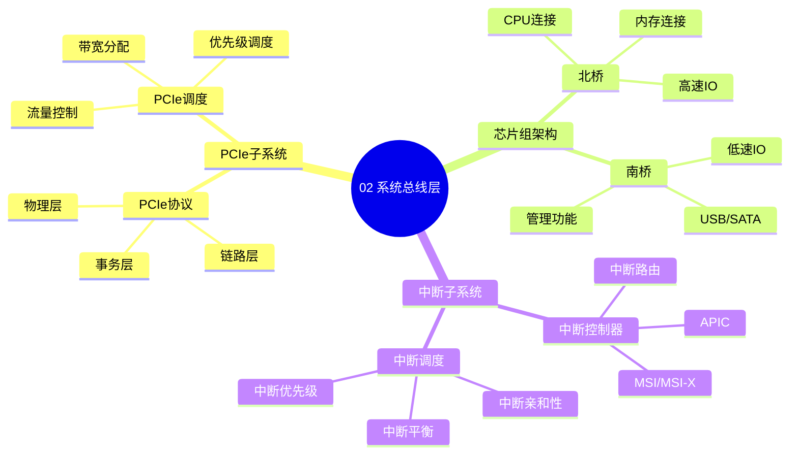

# 02. 系统总线层

> **主题**: 系统总线层技术特征
> **覆盖范围**: PCIe、芯片组、北桥南桥、中断子系统

---

## 📋 目录

- [02. 系统总线层](#02-系统总线层)
  - [📋 目录](#-目录)
  - [1 子主题索引](#1-子主题索引)
  - [2 相关主题](#2-相关主题)
  - [3 核心概念矩阵](#3-核心概念矩阵)
  - [4 深度技术分析](#4-深度技术分析)
    - [4.1 总线带宽层级分析](#41-总线带宽层级分析)
    - [4.2 总线延迟层级分析](#42-总线延迟层级分析)
    - [4.3 PCIe带宽演进分析](#43-pcie带宽演进分析)
    - [4.4 总线协议开销分析](#44-总线协议开销分析)
  - [5 跨总线性能模型](#5-跨总线性能模型)
    - [5.1 全栈IO延迟模型](#51-全栈io延迟模型)
    - [5.2 总线利用率模型](#52-总线利用率模型)
  - [6 性能优化策略](#6-性能优化策略)
    - [6.1 带宽优化](#61-带宽优化)
    - [6.2 延迟优化](#62-延迟优化)
    - [6.3 功耗优化](#63-功耗优化)

---

## 1 子主题索引

### 1.0 系统总线层思维导图

**可视化文档**: 查看 [思维导图与知识矩阵](../思维导图与知识矩阵.md#32-02-系统总线层) 获取更详细的思维导图。

- [2.1 PCIe子系统](./02.1_PCIe子系统.md) - PCIe协议、配置空间、DMA
- [2.2 芯片组架构](./02.2_芯片组架构.md) - 芯片组演进、PCH
- [2.3 北桥与南桥](./02.3_北桥与南桥.md) - 北桥遗产、南桥功能
- [2.4 中断子系统](./02.4_中断子系统.md) - APIC、MSI-X、中断处理

---

## 2 相关主题

- [01. CPU硬件层](../01_CPU硬件层/README.md) - CPU与总线交互
- [03. OS抽象层](../03_OS抽象层/README.md) - 设备驱动模型
- [05. 虚拟化容器化沙盒化](../05_虚拟化容器化沙盒化/README.md) - IOMMU、SR-IOV

---

## 3 核心概念矩阵

| **总线类型** | **带宽** | **延迟** | **用途** | **OS映射** |
|-------------|----------|----------|----------|------------|
| **PCIe Gen5** | 64GB/s (x16) | 150ns | 高速外设 | VFIO、设备驱动 |
| **DMI 3.0** | 4GB/s | 1μs | 南桥连接 | ACPI、平台驱动 |
| **QPI/UPI** | 25.6GB/s | - | CPU互连 | NUMA拓扑 |
| **eSPI** | 66MB/s | 10μs | 低速设备 | 平台驱动 |

---

## 4 深度技术分析

### 4.1 总线带宽层级分析

系统总线层的带宽形成**严格的层级结构**：

$$
\text{带宽层级} = \{64\text{GB/s}, 25.6\text{GB/s}, 4\text{GB/s}, 66\text{MB/s}\}
$$

**量化分析**：总线带宽层级的影响

| **总线类型** | **带宽** | **延迟** | **带宽/延迟比** | **适用场景** | **瓶颈场景** |
|------------|---------|---------|---------------|------------|------------|
| **PCIe Gen5** | 64GB/s | 150ns | 426 | GPU、NVMe | 高带宽IO |
| **QPI/UPI** | 25.6GB/s | 100ns | 256 | CPU互连 | NUMA通信 |
| **DMI 3.0** | 4GB/s | 1μs | 4 | 南桥连接 | 平台IO |
| **eSPI** | 66MB/s | 10μs | 0.0066 | 低速设备 | 管理接口 |

**关键洞察**：**带宽/延迟比**反映了不同总线的**适用场景**，PCIe适合高带宽IO，QPI/UPI适合CPU互连。

### 4.2 总线延迟层级分析

延迟同样形成**层级递增**结构：

$$
\text{延迟层级} = \{100\text{ns}, 150\text{ns}, 1\mu\text{s}, 10\mu\text{s}\}
$$

**量化分析**：总线延迟层级的影响

| **总线类型** | **延迟** | **带宽** | **延迟占比** | **性能影响** |
|------------|---------|---------|------------|------------|
| **QPI/UPI** | 100ns | 25.6GB/s | 基准 | NUMA延迟 |
| **PCIe Gen5** | 150ns | 64GB/s | +50% | IO延迟 |
| **DMI 3.0** | 1μs | 4GB/s | +900% | 平台IO延迟 |
| **eSPI** | 10μs | 66MB/s | +9900% | 管理接口延迟 |

**关键洞察**：延迟层级反映了**距离和协议开销**的影响，距离越远，延迟越高。

### 4.3 PCIe带宽演进分析

**PCIe带宽模型**：

PCIe带宽由**速率**和**Lane数**决定：

$$
\text{带宽} = \text{速率} \times \text{Lane数} \times \text{编码效率}
$$

**量化对比**：PCIe各代带宽演进

| **PCIe版本** | **速率** | **编码效率** | **x16带宽** | **演进速度** | **应用场景** |
|------------|---------|------------|------------|------------|------------|
| **Gen3** | 8GT/s | 98.5% | 15.75GB/s | 基准 | 通用外设 |
| **Gen4** | 16GT/s | 98.5% | 31.5GB/s | 2x | 高速SSD |
| **Gen5** | 32GT/s | 98.5% | 63GB/s | 2x | GPU、AI加速器 |
| **Gen6** | 64GT/s | 98.5% | 126GB/s | 2x | 未来应用 |

**关键洞察**：PCIe带宽**每代翻倍**，但受**信号完整性**限制，Gen6可能需要**PAM4编码**。

### 4.4 总线协议开销分析

**协议开销的组成**：

总线协议开销包括**物理层**、**数据链路层**和**事务层**开销：

$$
\text{协议开销} = t_{\text{物理层}} + t_{\text{数据链路层}} + t_{\text{事务层}}
$$

**量化分析**：不同总线的协议开销

| **总线类型** | **物理层开销** | **数据链路层开销** | **事务层开销** | **总开销** | **有效带宽** |
|------------|--------------|-----------------|--------------|-----------|------------|
| **PCIe Gen5** | 50ns | 50ns | 50ns | 150ns | 98.5% |
| **DMI 3.0** | 200ns | 300ns | 500ns | 1μs | 95% |
| **QPI/UPI** | 30ns | 40ns | 30ns | 100ns | 99% |
| **eSPI** | 2μs | 3μs | 5μs | 10μs | 90% |

**关键洞察**：**协议开销**是总线延迟的主要来源，优化协议可以降低延迟。

---

## 5 跨总线性能模型

### 5.1 全栈IO延迟模型

系统总线层的全栈IO延迟由**各层级延迟**组成：

$$
T_{\text{IO}} = t_{\text{CPU}} + t_{\text{总线}} + t_{\text{设备}}
$$

**量化分析**：典型IO操作的延迟分布

| **IO操作** | **CPU延迟** | **总线延迟** | **设备延迟** | **总延迟** | **瓶颈** |
|-----------|-----------|------------|------------|-----------|---------|
| **NVMe读取** | 100ns | 150ns | 50μs | 50.25μs | 设备 |
| **GPU传输** | 100ns | 150ns | 1μs | 1.25μs | 设备 |
| **网络包** | 100ns | 150ns | 10μs | 10.25μs | 设备 |
| **平台IO** | 100ns | 1μs | 100μs | 101.1μs | 设备 |

**关键洞察**：**设备延迟**是IO延迟的主要来源，总线延迟相对较小。

### 5.2 总线利用率模型

总线利用率受**传输模式**影响：

$$
\text{利用率} = \frac{\text{实际带宽}}{\text{理论带宽}} = f(\text{传输模式}, \text{数据包大小})
$$

**量化分析**：不同传输模式的利用率

| **传输模式** | **PCIe利用率** | **DMI利用率** | **QPI利用率** | **瓶颈** |
|------------|--------------|--------------|-------------|---------|
| **大块传输** | 95% | 90% | 95% | 设备 |
| **小块传输** | 60% | 50% | 70% | 协议开销 |
| **随机访问** | 40% | 30% | 50% | 延迟 |
| **流式传输** | 98% | 95% | 98% | 设备 |

**关键洞察**：**大块传输**和**流式传输**利用率高，**小块传输**和**随机访问**利用率低。

---

## 6 性能优化策略

### 6.1 带宽优化

1. **多Lane配置**：使用更多Lane数，提升带宽
2. **协议优化**：使用最新PCIe版本，提升速率
3. **批处理**：合并小传输，提高利用率

### 6.2 延迟优化

1. **协议优化**：减少协议层数，降低开销
2. **预取优化**：提前传输数据，隐藏延迟
3. **直通模式**：使用SR-IOV，绕过虚拟化开销

### 6.3 功耗优化

1. **L1/L2状态**：空闲时进入低功耗状态
2. **ASPM**：自动进入低功耗模式
3. **动态调频**：根据负载调整速率

---

**最后更新**: 2025-11-14
