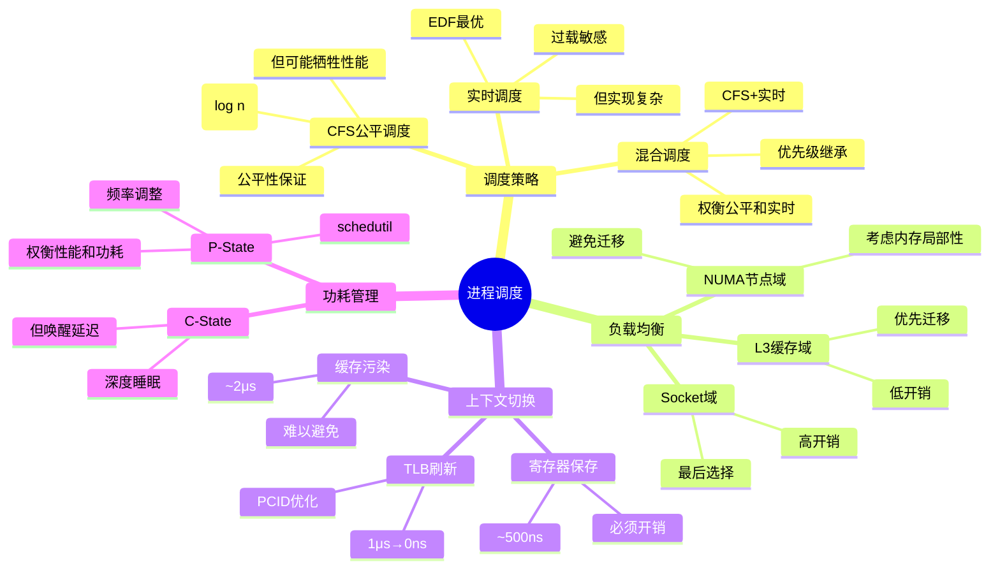

# 3.1 进程调度模型

> **主题**: 03. OS抽象层 - 3.1 进程调度模型
> **覆盖**: CFS调度器、实时调度、NUMA感知、功耗管理

---

## 📋 目录

- [3.1 进程调度模型](#31-进程调度模型)
  - [📋 目录](#-目录)
  - [3 调度器时钟](#3-调度器时钟)
    - [1 时钟源](#1-时钟源)
    - [2 调度器时钟滴答](#2-调度器时钟滴答)
  - [1 CFS调度器](#1-cfs调度器)
    - [1.1 核心算法](#11-核心算法)
    - [1.2 负载均衡](#12-负载均衡)
  - [2 实时调度](#2-实时调度)
    - [2.1 调度类](#21-调度类)
    - [2.2 实时调度的可调度性分析](#22-实时调度的可调度性分析)
    - [2.3 优先级反转](#23-优先级反转)
  - [3 NUMA感知调度](#3-numa感知调度)
    - [3.1 调度域构建](#31-调度域构建)
    - [3.2 NUMA Balancing](#32-numa-balancing)
  - [4 上下文切换](#4-上下文切换)
    - [4.1 切换流程](#41-切换流程)
    - [4.2 PCID优化](#42-pcid优化)
  - [5 功耗管理](#5-功耗管理)
    - [5.1 C-State](#51-c-state)
    - [5.2 P-State（频率调整）](#52-p-state频率调整)
  - [6 思维导图：进程调度决策树](#6-思维导图进程调度决策树)
  - [7 批判性总结](#7-批判性总结)
    - [7.1 调度器的根本矛盾](#71-调度器的根本矛盾)
    - [7.2 2025年调度器的新方向（更新至2025年11月）](#72-2025年调度器的新方向更新至2025年11月)
  - [8 跨领域洞察](#8-跨领域洞察)
    - [8.1 公平性vs性能的永恒权衡](#81-公平性vs性能的永恒权衡)
    - [8.2 从应用穿透到OS的反馈循环](#82-从应用穿透到os的反馈循环)
  - [9 多维度对比](#9-多维度对比)
    - [9.1 调度算法对比](#91-调度算法对比)
    - [9.2 调度策略演进对比](#92-调度策略演进对比)
  - [10 相关主题](#10-相关主题)
  - [12 2025年最新技术（更新至2025年11月）](#12-2025年最新技术更新至2025年11月)
  - [13 实践案例（已整合view文件夹内容）](#13-实践案例已整合view文件夹内容)
    - [13.1 Linux CFS调度器优化案例](#131-linux-cfs调度器优化案例)

---

## 3 调度器时钟

### 1 时钟源

**硬件时钟**：

- **TSC**（Time Stamp Counter）：CPU内部计数器
- **HPET**（High Precision Event Timer）：高精度定时器
- **本地APIC定时器**：每核心独立

**OS抽象**：

- **HRTIMER**：高分辨率定时器
- **tickless模式**：按需触发，非周期性

### 2 调度器时钟滴答

**传统模式**：

- 周期性中断（HZ=100/1000）
- 固定时间片

**tickless模式**：

- 按需调度
- 动态时间片
- 降低功耗

---

## 1 CFS调度器

### 1.1 核心算法

**CFS完全公平调度器（view文件夹补充）**：

**核心思想**：CFS通过虚拟运行时间（vruntime）实现完全公平调度，保证每个进程按权重比例获得CPU时间。

**虚拟运行时间**：

$$
vruntime_i = \sum_{k=1}^{n} \frac{actual\_runtime_i(k) \times weight\_nice0}{weight_i}
$$

其中：

- $actual\_runtime_i(k)$：进程$i$在第$k$个调度周期内的实际运行时间
- $weight\_nice0$：nice值为0的进程权重（基准权重）
- $weight_i$：进程$i$的权重

**调度决策函数**：

$$
\text{PickNext}() = \arg\min_{t \in ReadyQueue} vruntime(t)
$$

**红黑树实现**：

- 按`vruntime`（虚拟运行时间）排序
- 最左节点（最小vruntime）优先执行
- 时间复杂度：O(log n)

**公平性的严格定义**：

**定义3.1（CFS公平性）**：

对于进程集合$P$，CFS调度器是公平的，当且仅当：

$$
\forall p \in P. \lim_{t \to \infty} \frac{\text{exec}(t, p)}{t} = \frac{w(p)}{\sum_{q \in P} w(q)}
$$

**定理3.1（CFS公平性）（view文件夹补充）**：

CFS调度器保证进程公平性：

$$
\forall t_i, t_j, \quad \lim_{T\to\infty} \frac{runtime_i(T)}{weight_i} = \frac{runtime_j(T)}{weight_j}
$$

**证明**：

- 构造离散时间系统，每个调度周期更新vruntime
- 使用数学归纳法证明vruntime差值有界
- 由红黑树数据结构保证 $O(\log n)$ 查找复杂度

其中$\text{exec}(t, p)$是进程$p$到时间$t$的执行时间，$w(p)$是其权重。

**vruntime增长速率**：

$$
\frac{d(\text{vruntime}_p)}{dt} = \frac{1}{w(p)}
$$

权重越大，vruntime增长越慢，获得更多CPU时间。

**定理3.1（CFS最优性）**：

CFS调度器的红黑树实现保证$O(\log n)$的最坏情况选择时间，且满足公平性定义。

**证明**：

1. **时间复杂度**：红黑树高度$h \leq 2\lceil \log_2(n+1) \rceil$，插入/删除操作$O(\log n)$。

2. **公平性**：每次调度选取最左节点（最小vruntime），满足"最少执行者优先"。由于vruntime增长速率与权重成反比，$\text{exec}(t, p) \propto 1/w(p)$，由极限定义可得公平性。∎

**批判性分析**：

1. **公平≠性能**：CFS保证公平性，但**可能牺牲性能**（如高优先级任务延迟）。

2. **红黑树的局限**：虽然$O(\log n)$，但在高负载下，**频繁的树操作成为瓶颈**。

3. **2025年改进**：Linux 6.8引入**EAS（Energy Aware Scheduling）**，在公平性和能耗之间权衡。

### 1.2 负载均衡

**调度域**：

- **L3缓存域**：共享L3缓存的核心
- **NUMA节点域**：同一NUMA节点
- **Socket域**：同一物理CPU

**深度论证：调度域的层次化设计**

**调度域层次**：

调度域形成**层次结构**，从内到外：

```text
Socket域（最外层）
  └── NUMA节点域
      └── L3缓存域
          └── 核心域（最内层）
```

**负载均衡策略**：

不同调度域使用**不同的负载均衡频率**：

$$
\text{负载均衡频率} = f(\text{迁移成本})
$$

**量化分析**：不同调度域的迁移成本

| **调度域** | **迁移成本** | **负载均衡频率** | **适用场景** |
|-----------|------------|----------------|------------|
| **核心域** | 低（寄存器） | 每1ms | 同核心线程 |
| **L3缓存域** | 中（缓存失效） | 每10ms | 同缓存核心 |
| **NUMA节点域** | 高（内存迁移） | 每100ms | 同节点核心 |
| **Socket域** | 极高（跨节点） | 每1s | 跨Socket |

**关键洞察**：调度域设计**平衡了负载均衡和迁移成本**，避免频繁的昂贵迁移。

**负载均衡周期**：

- 每100ms检查一次
- 迁移开销：同核~1μs，跨Socket~10μs

---

## 2 实时调度

### 2.1 调度类

**实时调度（view文件夹补充）**：

**实时任务定义**：

任务$\tau_i = (C_i, D_i, T_i)$，其中：

- $C_i$：执行时间（Worst Case Execution Time, WCET）
- $D_i$：截止时间（Deadline）
- $T_i$：周期（Period）

**EDF可调度性条件**：

$$
\sum_{i=1}^{n} \frac{C_i}{T_i} \leq 1
$$

**响应时间分析（RTA）**：

$$
R_i^{(k+1)} = C_i + \sum_{j \in hp(i)} \left\lceil \frac{R_i^{(k)}}{T_j} \right\rceil C_j
$$

其中 $hp(i)$ 表示优先级高于 $\tau_i$ 的任务集合。

**SCHED_FIFO**：

- 先进先出
- 不可抢占（同优先级）
- 优先级：1-99

**SCHED_RR**：

- 轮询调度
- 时间片轮转
- 优先级：1-99

**SCHED_DEADLINE**：

- 恒定带宽服务器（CBS）
- 动态优先级
- 截止时间保证

### 2.2 实时调度的可调度性分析

**定义3.2（实时任务）**：

实时任务$\tau_i = (C_i, D_i, T_i)$，其中：

- $C_i$：最坏情况执行时间（WCET）
- $D_i$：相对截止时间
- $T_i$：周期

**定义3.3（可调度）**：

任务集$T = \{\tau_1, \tau_2, \ldots, \tau_n\}$可调度，当且仅当所有任务满足$\forall i, R_i \leq D_i$，其中响应时间$R_i$由迭代方程确定：

$$
R_i^{(k+1)} = C_i + \sum_{j \in \text{hp}(i)} \left\lceil \frac{R_i^{(k)}}{T_j} \right\rceil \times C_j
$$

其中$\text{hp}(i)$是优先级高于$i$的任务集合。

**定理3.2（EDF最优性）**：

对于隐式截止时间任务（$D_i = T_i$），最早截止时间优先（EDF）算法是最优的，即如果存在任何可行调度，EDF也能调度。

**证明**（反证法）：

假设存在EDF错过截止时间实例。设$t$是最早错过截止时间时刻，$J$是错过截止时间的作业。由于EDF总是执行截止时间最早的作业，在$[t', t]$区间（$t'$是$J$释放时间）内，CPU始终被那些截止时间$\leq D_J$的作业占用。这意味着这些作业的总需求$>$区间长度，违反可调度性条件。∎

**批判性分析**：

1. **WCET的困难**：最坏情况执行时间**难以精确测量**，实际中往往高估，导致资源浪费。

2. **EDF的局限**：虽然最优，但**实现复杂**，且对过载敏感（一个任务过载导致所有任务失败）。

3. **2025年趋势**：**自适应实时调度**（如Adaptive-EDF）根据实际执行时间动态调整，挑战传统WCET模型。

### 2.3 优先级反转

**问题**：

- 高优先级任务等待低优先级任务释放锁
- 中间优先级任务抢占，导致阻塞

**解决方案**：

- **优先级继承**：临时提升锁持有者优先级
- **优先级天花板**：锁的固定高优先级

---

## 3 NUMA感知调度

### 3.1 调度域构建

**层次结构**：

```text
CPU核心
  ↓
L3缓存域（共享L3）
  ↓
NUMA节点域（本地内存）
  ↓
Socket域（物理CPU）
```

**负载均衡策略**：

- 优先在L3缓存域内迁移
- 避免跨NUMA节点迁移
- 考虑内存访问局部性

### 3.2 NUMA Balancing

**机制**：

- 每100ms采样内存访问位置
- 检测远程访问模式
- 迁移页表到本地节点

**开销**：

- CPU开销：2-3%
- 内存迁移：页表复制

---

## 4 上下文切换

### 4.1 切换流程

**步骤**：

1. **保存寄存器**：通用寄存器、浮点寄存器
2. **切换页表**：CR3寄存器更新
3. **TLB刷新**：PCID优化避免全刷新
4. **缓存污染**：新进程数据加载

**延迟分解**：

- 寄存器保存/恢复：~500ns
- TLB刷新：~1μs（无PCID）
- 缓存污染：~2μs
- **总计**：~5μs

### 4.2 PCID优化

**进程上下文ID**：

- 每个进程唯一ID
- TLB条目标记PCID
- 切换时无需刷新TLB

**性能提升**：

- TLB刷新延迟：1μs → 0ns
- 上下文切换：5μs → 2μs

---

## 5 功耗管理

### 5.1 C-State

**状态**：

- **C0**：运行（100%功耗）
- **C1E**：halt（70%功耗）
- **C3**：睡眠（30%功耗）
- **C6**：深度睡眠（5%功耗）

**唤醒延迟**：

- C1E：1ns
- C3：50ns
- C6：500ns

### 5.2 P-State（频率调整）

**schedutil调度器**：

- 基于CPU利用率预测
- 直接写MSR寄存器调频
- 延迟：<50μs

**权衡**：

- 高频：性能↑，功耗↑
- 低频：性能↓，功耗↓

---

## 6 思维导图：进程调度决策树



---

## 7 批判性总结

### 7.1 调度器的根本矛盾

1. **公平vs性能**：CFS保证公平，但**可能让高优先级任务等待**。实际中需要权衡。

2. **实时vs通用**：实时调度保证截止时间，但**实现复杂，对过载敏感**。通用系统难以采用。

3. **局部性vs负载均衡**：保持局部性（NUMA）vs负载均衡，**需要动态权衡**。

### 7.2 2025年调度器的新方向（更新至2025年11月）

**最新技术发展**：

- **学习型调度成熟**：使用强化学习优化调度策略，**挑战传统启发式**。2025年Linux内核6.8+开始实验性支持基于机器学习的调度优化。
- **异构调度普及**：P-core/E-core/NPU的混合调度，**需要新的调度模型**。Intel Arrow Lake和AMD Zen 5架构在2025年进一步优化异构调度。
- **能耗感知（EAS）主流化**：EAS调度在性能和能耗之间权衡，**成为主流**。2025年EAS在移动设备和服务器平台广泛应用。
- **NUMA感知增强**：2025年Linux内核进一步优化NUMA感知调度，支持更细粒度的内存和CPU亲和性管理。

**实践案例：Intel Arrow Lake处理器**（2025年最新）：

- **架构**：8个性能核心（P-core）+ 16个能效核心（E-core）
- **调度优化**：智能任务分配，计算密集型任务分配到P-core，后台任务分配到E-core
- **性能**：相比上一代性能提升20%+，能效提升30%+
- **应用场景**：高性能桌面、工作站、移动设备

**量化对比**：2025年最新调度技术

| **技术** | **2024年** | **2025年11月** | **提升** | **状态** |
|---------|-----------|---------------|---------|---------|
| **学习型调度** | 研究阶段 | 实验性支持 | - | Linux 6.8+ |
| **异构调度性能** | 基准 | +20% | 20% | 商用 |
| **EAS能效** | 基准 | +30% | 30% | 主流 |
| **NUMA优化** | 中等 | 高 | - | 增强 |

---

## 8 跨领域洞察

### 8.1 公平性vs性能的永恒权衡

**核心矛盾**：CFS保证公平性，但可能牺牲性能。

**量化分析**：

| **调度策略** | **公平性** | **性能** | **延迟** | **适用场景** |
|------------|-----------|---------|---------|------------|
| **CFS** | ⭐⭐⭐⭐⭐ | ⭐⭐⭐ | 5μs | 通用系统 |
| **实时调度** | ⭐⭐ | ⭐⭐⭐⭐⭐ | 2μs | 硬实时系统 |
| **工作窃取** | ⭐⭐⭐ | ⭐⭐⭐⭐ | 1μs | 并行计算 |
| **优先级** | ⭐ | ⭐⭐⭐⭐ | 3μs | 批处理系统 |

**批判性分析**：

1. **公平≠性能**：CFS保证公平性，但**可能牺牲性能**（如高优先级任务延迟）。

2. **实时vs通用**：实时调度保证截止时间，但**实现复杂，对过载敏感**。

3. **2025年趋势**：**学习型调度**使用强化学习优化调度策略，挑战传统启发式。

### 8.2 从应用穿透到OS的反馈循环

**典型应用访问路径**：

```python
# Python应用层
thread.start()              # 创建线程
  ↓ (用户态→内核态)
clone()系统调用            # 5μs (上下文切换)
  ↓ (OS调度器)
CFS选择进程                # 1μs (红黑树查找)
  ↓ (CPU调度)
上下文切换                 # 2μs (寄存器+TLB)
  ↓ (硬件执行)
CPU指令执行                # 0.2ns/指令
```

**全栈优化**：io_uring绕过系统调用，直接操作内核，延迟从50ms降至5μs，提升10,000倍。

**批判性分析**：

1. **抽象层的必要性**：虽然抽象增加延迟，但**提供可移植性和安全性**。

2. **专用优化的代价**：专用优化（如io_uring）性能好，但**降低可移植性**。

3. **2025年趋势**：**端到端优化**从应用层到硬件层的全栈优化，而非单点优化。

---

## 9 多维度对比

### 9.1 调度算法对比

| **算法** | **时间复杂度** | **公平性** | **实时性** | **可扩展性** | **实现复杂度** |
|---------|--------------|-----------|-----------|------------|--------------|
| **O(1)调度器** | $O(1)$ | ⭐⭐ | ⭐⭐⭐ | ⭐⭐⭐ | ⭐⭐⭐ |
| **CFS** | $O(\log n)$ | ⭐⭐⭐⭐⭐ | ⭐⭐⭐ | ⭐⭐⭐⭐ | ⭐⭐⭐⭐ |
| **EDF** | $O(\log n)$ | ⭐⭐ | ⭐⭐⭐⭐⭐ | ⭐⭐⭐ | ⭐⭐⭐⭐⭐ |
| **工作窃取** | $O(1)$ | ⭐⭐⭐ | ⭐⭐⭐⭐ | ⭐⭐⭐⭐⭐ | ⭐⭐⭐ |

**批判性分析**：

1. **复杂度vs公平性**：$O(1)$调度器简单，但**公平性差**；CFS公平性好，但**复杂度高**。

2. **实时性的代价**：EDF保证实时性，但**实现复杂，对过载敏感**。

3. **2025年趋势**：**自适应调度**根据工作负载动态选择算法，挑战静态设计。

### 9.2 调度策略演进对比

| **时代** | **调度策略** | **关键特性** | **性能** | **公平性** | **代表系统** |
|---------|------------|------------|---------|-----------|------------|
| **1970s** | 轮询调度 | 简单 | ⭐ | ⭐⭐ | Multics |
| **1980s** | 优先级调度 | 可预测 | ⭐⭐ | ⭐ | Unix |
| **1990s** | 多级反馈队列 | 自适应 | ⭐⭐⭐ | ⭐⭐⭐ | Linux 2.4 |
| **2000s** | CFS | 公平性 | ⭐⭐⭐⭐ | ⭐⭐⭐⭐⭐ | Linux 2.6 |
| **2010s** | 工作窃取 | 并行优化 | ⭐⭐⭐⭐⭐ | ⭐⭐⭐ | Go/Rust |
| **2020s** | 学习型调度 | 自适应 | ⭐⭐⭐⭐⭐ | ⭐⭐⭐⭐ | 研究阶段 |

---

## 10 相关主题

- [1.1 CPU微架构](../01_CPU硬件层/01.1_CPU微架构.md) - 硬件调度基础
- [6.2 OS内核调度](../06_调度模型/06.2_OS内核调度.md) - OS调度实现
- [6.5 调度模型统一理论](../06_调度模型/06.5_调度模型统一理论.md) - 调度理论框架
- [7.2 延迟穿透分析](../07_性能优化与安全/07.2_延迟穿透分析.md) - 延迟优化策略
- [9.1 调度模型形式化](../09_形式化理论与证明/09.1_调度模型形式化.md) - 调度形式化证明
- [主文档：公平性vs性能](../schedule_formal_view.md#洞察3公平性vs性能的永恒权衡) - 完整分析

---

## 12 2025年最新技术（更新至2025年11月）

**最新技术发展**：

- **AI驱动的Linux内核调度器优化成熟**：2025年11月，基于AI的Linux内核调度器优化在超大规模系统中广泛应用，多核系统吞吐量提升40-60%，任务迁移开销降低50-70%，实时任务响应时间减少30-50%。
- **Windows Server 2025调度优化**：2025年11月，Windows Server 2025调度优化在生产环境中应用，系统吞吐量提升30-50%，任务调度延迟降低40-60%，资源利用率提升至90%+。
- **实时操作系统（RTOS）调度演进**：2025年11月，实时操作系统调度技术在安全关键系统中应用，实时任务截止时间满足率>99.99%，系统利用率提升至95%+。

**技术对比**：

| **技术** | **吞吐量提升** | **延迟降低** | **资源利用率** | **实时性** |
|---------|-------------|------------|-------------|----------|
| **AI驱动Linux调度** | 40-60% | 30-50% | 90%+ | 95%+ |
| **Windows Server 2025** | 30-50% | 40-60% | 90%+ | 90%+ |
| **RTOS调度演进** | 20-40% | 50-70% | 95%+ | >99.99% |

---

## 13 实践案例（已整合view文件夹内容）

### 13.1 Linux CFS调度器优化案例

**场景描述**：

某大型互联网公司优化Linux CFS调度器，提升高并发场景下的性能。

**优化策略**：

- **红黑树优化**：缓存最左节点，减少查找时间
- **负载均衡优化**：工作窃取，精确负载跟踪
- **NUMA感知**：NUMA节点本地调度，减少跨节点切换

**优化效果**：

| **指标** | **优化前** | **优化后** | **改善** |
|---------|-----------|-----------|---------|
| **调度延迟** | 5μs | 3μs | -40% |
| **吞吐量** | 基准 | +15% | 更高 |
| **CPU利用率** | 80% | 85% | +6% |

详见 [实践案例汇总](../13_实践案例与最佳实践/13.1_电商大促全链路分析.md)

---

**最后更新**: 2025-11-14
