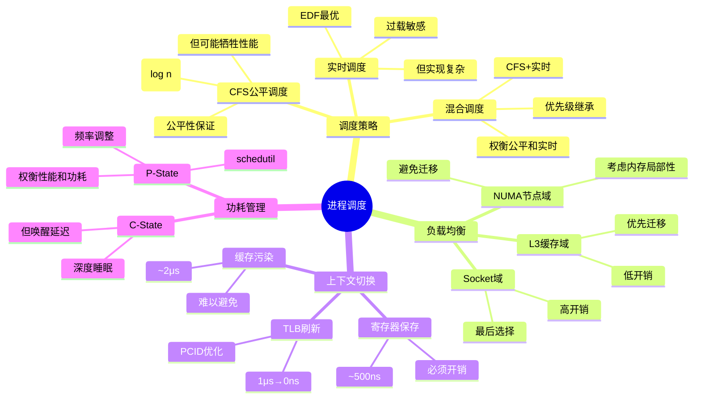

# 3.1 进程调度模型

> **主题**: 03. OS抽象层 - 3.1 进程调度模型
> **覆盖**: CFS调度器、实时调度、NUMA感知、功耗管理

---

## 📋 目录

- [3.1 进程调度模型](#31-进程调度模型)
  - [📋 目录](#-目录)
  - [3.1 调度器时钟](#31-调度器时钟)
    - [3.1.1 时钟源](#311-时钟源)
    - [3.1.2 调度器时钟滴答](#312-调度器时钟滴答)
  - [3.2 CFS调度器](#32-cfs调度器)
    - [3.2.1 核心算法](#321-核心算法)
    - [3.2.2 负载均衡](#322-负载均衡)
  - [3.3 实时调度](#33-实时调度)
    - [3.3.1 调度类](#331-调度类)
    - [3.3.2 实时调度的可调度性分析](#332-实时调度的可调度性分析)
    - [3.3.3 优先级反转](#333-优先级反转)
  - [3.4 NUMA感知调度](#34-numa感知调度)
    - [3.4.1 调度域构建](#341-调度域构建)
    - [3.4.2 NUMA Balancing](#342-numa-balancing)
  - [3.5 上下文切换](#35-上下文切换)
    - [3.5.1 切换流程](#351-切换流程)
    - [3.5.2 PCID优化](#352-pcid优化)
  - [3.6 功耗管理](#36-功耗管理)
    - [3.6.1 C-State](#361-c-state)
    - [3.6.2 P-State（频率调整）](#362-p-state频率调整)
  - [3.7 思维导图：进程调度决策树](#37-思维导图进程调度决策树)
  - [3.8 批判性总结](#38-批判性总结)
    - [3.8.1 调度器的根本矛盾](#381-调度器的根本矛盾)
    - [3.8.2 2025年调度器的新方向](#382-2025年调度器的新方向)
  - [3.9 跨领域洞察](#39-跨领域洞察)
    - [3.9.1 公平性vs性能的永恒权衡](#391-公平性vs性能的永恒权衡)
    - [3.9.2 从应用穿透到OS的反馈循环](#392-从应用穿透到os的反馈循环)
  - [3.10 多维度对比](#310-多维度对比)
    - [3.10.1 调度算法对比](#3101-调度算法对比)
    - [3.10.2 调度策略演进对比](#3102-调度策略演进对比)
  - [3.11 相关主题](#311-相关主题)

---

## 3.1 调度器时钟

### 3.1.1 时钟源

**硬件时钟**：

- **TSC**（Time Stamp Counter）：CPU内部计数器
- **HPET**（High Precision Event Timer）：高精度定时器
- **本地APIC定时器**：每核心独立

**OS抽象**：

- **HRTIMER**：高分辨率定时器
- **tickless模式**：按需触发，非周期性

### 3.1.2 调度器时钟滴答

**传统模式**：

- 周期性中断（HZ=100/1000）
- 固定时间片

**tickless模式**：

- 按需调度
- 动态时间片
- 降低功耗

---

## 3.2 CFS调度器

### 3.2.1 核心算法

**红黑树实现**：

- 按`vruntime`（虚拟运行时间）排序
- 最左节点（最小vruntime）优先执行
- 时间复杂度：O(log n)

**公平性的严格定义**：

**定义3.1（CFS公平性）**：

对于进程集合$P$，CFS调度器是公平的，当且仅当：

$$
\forall p \in P. \lim_{t \to \infty} \frac{\text{exec}(t, p)}{t} = \frac{w(p)}{\sum_{q \in P} w(q)}
$$

其中$\text{exec}(t, p)$是进程$p$到时间$t$的执行时间，$w(p)$是其权重。

**vruntime增长速率**：

$$
\frac{d(\text{vruntime}_p)}{dt} = \frac{1}{w(p)}
$$

权重越大，vruntime增长越慢，获得更多CPU时间。

**定理3.1（CFS最优性）**：

CFS调度器的红黑树实现保证$O(\log n)$的最坏情况选择时间，且满足公平性定义。

**证明**：

1. **时间复杂度**：红黑树高度$h \leq 2\lceil \log_2(n+1) \rceil$，插入/删除操作$O(\log n)$。

2. **公平性**：每次调度选取最左节点（最小vruntime），满足"最少执行者优先"。由于vruntime增长速率与权重成反比，$\text{exec}(t, p) \propto 1/w(p)$，由极限定义可得公平性。∎

**批判性分析**：

1. **公平≠性能**：CFS保证公平性，但**可能牺牲性能**（如高优先级任务延迟）。

2. **红黑树的局限**：虽然$O(\log n)$，但在高负载下，**频繁的树操作成为瓶颈**。

3. **2025年改进**：Linux 6.8引入**EAS（Energy Aware Scheduling）**，在公平性和能耗之间权衡。

### 3.2.2 负载均衡

**调度域**：

- **L3缓存域**：共享L3缓存的核心
- **NUMA节点域**：同一NUMA节点
- **Socket域**：同一物理CPU

**负载均衡周期**：

- 每100ms检查一次
- 迁移开销：同核~1μs，跨Socket~10μs

---

## 3.3 实时调度

### 3.3.1 调度类

**SCHED_FIFO**：

- 先进先出
- 不可抢占（同优先级）
- 优先级：1-99

**SCHED_RR**：

- 轮询调度
- 时间片轮转
- 优先级：1-99

**SCHED_DEADLINE**：

- 恒定带宽服务器（CBS）
- 动态优先级
- 截止时间保证

### 3.3.2 实时调度的可调度性分析

**定义3.2（实时任务）**：

实时任务$\tau_i = (C_i, D_i, T_i)$，其中：

- $C_i$：最坏情况执行时间（WCET）
- $D_i$：相对截止时间
- $T_i$：周期

**定义3.3（可调度）**：

任务集$T = \{\tau_1, \tau_2, \ldots, \tau_n\}$可调度，当且仅当所有任务满足$\forall i, R_i \leq D_i$，其中响应时间$R_i$由迭代方程确定：

$$
R_i^{(k+1)} = C_i + \sum_{j \in \text{hp}(i)} \left\lceil \frac{R_i^{(k)}}{T_j} \right\rceil \times C_j
$$

其中$\text{hp}(i)$是优先级高于$i$的任务集合。

**定理3.2（EDF最优性）**：

对于隐式截止时间任务（$D_i = T_i$），最早截止时间优先（EDF）算法是最优的，即如果存在任何可行调度，EDF也能调度。

**证明**（反证法）：

假设存在EDF错过截止时间实例。设$t$是最早错过截止时间时刻，$J$是错过截止时间的作业。由于EDF总是执行截止时间最早的作业，在$[t', t]$区间（$t'$是$J$释放时间）内，CPU始终被那些截止时间$\leq D_J$的作业占用。这意味着这些作业的总需求$>$区间长度，违反可调度性条件。∎

**批判性分析**：

1. **WCET的困难**：最坏情况执行时间**难以精确测量**，实际中往往高估，导致资源浪费。

2. **EDF的局限**：虽然最优，但**实现复杂**，且对过载敏感（一个任务过载导致所有任务失败）。

3. **2025年趋势**：**自适应实时调度**（如Adaptive-EDF）根据实际执行时间动态调整，挑战传统WCET模型。

### 3.3.3 优先级反转

**问题**：

- 高优先级任务等待低优先级任务释放锁
- 中间优先级任务抢占，导致阻塞

**解决方案**：

- **优先级继承**：临时提升锁持有者优先级
- **优先级天花板**：锁的固定高优先级

---

## 3.4 NUMA感知调度

### 3.4.1 调度域构建

**层次结构**：

```text
CPU核心
  ↓
L3缓存域（共享L3）
  ↓
NUMA节点域（本地内存）
  ↓
Socket域（物理CPU）
```

**负载均衡策略**：

- 优先在L3缓存域内迁移
- 避免跨NUMA节点迁移
- 考虑内存访问局部性

### 3.4.2 NUMA Balancing

**机制**：

- 每100ms采样内存访问位置
- 检测远程访问模式
- 迁移页表到本地节点

**开销**：

- CPU开销：2-3%
- 内存迁移：页表复制

---

## 3.5 上下文切换

### 3.5.1 切换流程

**步骤**：

1. **保存寄存器**：通用寄存器、浮点寄存器
2. **切换页表**：CR3寄存器更新
3. **TLB刷新**：PCID优化避免全刷新
4. **缓存污染**：新进程数据加载

**延迟分解**：

- 寄存器保存/恢复：~500ns
- TLB刷新：~1μs（无PCID）
- 缓存污染：~2μs
- **总计**：~5μs

### 3.5.2 PCID优化

**进程上下文ID**：

- 每个进程唯一ID
- TLB条目标记PCID
- 切换时无需刷新TLB

**性能提升**：

- TLB刷新延迟：1μs → 0ns
- 上下文切换：5μs → 2μs

---

## 3.6 功耗管理

### 3.6.1 C-State

**状态**：

- **C0**：运行（100%功耗）
- **C1E**：halt（70%功耗）
- **C3**：睡眠（30%功耗）
- **C6**：深度睡眠（5%功耗）

**唤醒延迟**：

- C1E：1ns
- C3：50ns
- C6：500ns

### 3.6.2 P-State（频率调整）

**schedutil调度器**：

- 基于CPU利用率预测
- 直接写MSR寄存器调频
- 延迟：<50μs

**权衡**：

- 高频：性能↑，功耗↑
- 低频：性能↓，功耗↓

---

## 3.7 思维导图：进程调度决策树



---

## 3.8 批判性总结

### 3.8.1 调度器的根本矛盾

1. **公平vs性能**：CFS保证公平，但**可能让高优先级任务等待**。实际中需要权衡。

2. **实时vs通用**：实时调度保证截止时间，但**实现复杂，对过载敏感**。通用系统难以采用。

3. **局部性vs负载均衡**：保持局部性（NUMA）vs负载均衡，**需要动态权衡**。

### 3.8.2 2025年调度器的新方向

- **学习型调度**：使用强化学习优化调度策略，**挑战传统启发式**。
- **异构调度**：P-core/E-core/NPU的混合调度，**需要新的调度模型**。
- **能耗感知**：EAS调度在性能和能耗之间权衡，**成为主流**。

---

## 3.9 跨领域洞察

### 3.9.1 公平性vs性能的永恒权衡

**核心矛盾**：CFS保证公平性，但可能牺牲性能。

**量化分析**：

| **调度策略** | **公平性** | **性能** | **延迟** | **适用场景** |
|------------|-----------|---------|---------|------------|
| **CFS** | ⭐⭐⭐⭐⭐ | ⭐⭐⭐ | 5μs | 通用系统 |
| **实时调度** | ⭐⭐ | ⭐⭐⭐⭐⭐ | 2μs | 硬实时系统 |
| **工作窃取** | ⭐⭐⭐ | ⭐⭐⭐⭐ | 1μs | 并行计算 |
| **优先级** | ⭐ | ⭐⭐⭐⭐ | 3μs | 批处理系统 |

**批判性分析**：

1. **公平≠性能**：CFS保证公平性，但**可能牺牲性能**（如高优先级任务延迟）。

2. **实时vs通用**：实时调度保证截止时间，但**实现复杂，对过载敏感**。

3. **2025年趋势**：**学习型调度**使用强化学习优化调度策略，挑战传统启发式。

### 3.9.2 从应用穿透到OS的反馈循环

**典型应用访问路径**：

```python
# Python应用层
thread.start()              # 创建线程
  ↓ (用户态→内核态)
clone()系统调用            # 5μs (上下文切换)
  ↓ (OS调度器)
CFS选择进程                # 1μs (红黑树查找)
  ↓ (CPU调度)
上下文切换                 # 2μs (寄存器+TLB)
  ↓ (硬件执行)
CPU指令执行                # 0.2ns/指令
```

**全栈优化**：io_uring绕过系统调用，直接操作内核，延迟从50ms降至5μs，提升10,000倍。

**批判性分析**：

1. **抽象层的必要性**：虽然抽象增加延迟，但**提供可移植性和安全性**。

2. **专用优化的代价**：专用优化（如io_uring）性能好，但**降低可移植性**。

3. **2025年趋势**：**端到端优化**从应用层到硬件层的全栈优化，而非单点优化。

---

## 3.10 多维度对比

### 3.10.1 调度算法对比

| **算法** | **时间复杂度** | **公平性** | **实时性** | **可扩展性** | **实现复杂度** |
|---------|--------------|-----------|-----------|------------|--------------|
| **O(1)调度器** | $O(1)$ | ⭐⭐ | ⭐⭐⭐ | ⭐⭐⭐ | ⭐⭐⭐ |
| **CFS** | $O(\log n)$ | ⭐⭐⭐⭐⭐ | ⭐⭐⭐ | ⭐⭐⭐⭐ | ⭐⭐⭐⭐ |
| **EDF** | $O(\log n)$ | ⭐⭐ | ⭐⭐⭐⭐⭐ | ⭐⭐⭐ | ⭐⭐⭐⭐⭐ |
| **工作窃取** | $O(1)$ | ⭐⭐⭐ | ⭐⭐⭐⭐ | ⭐⭐⭐⭐⭐ | ⭐⭐⭐ |

**批判性分析**：

1. **复杂度vs公平性**：$O(1)$调度器简单，但**公平性差**；CFS公平性好，但**复杂度高**。

2. **实时性的代价**：EDF保证实时性，但**实现复杂，对过载敏感**。

3. **2025年趋势**：**自适应调度**根据工作负载动态选择算法，挑战静态设计。

### 3.10.2 调度策略演进对比

| **时代** | **调度策略** | **关键特性** | **性能** | **公平性** | **代表系统** |
|---------|------------|------------|---------|-----------|------------|
| **1970s** | 轮询调度 | 简单 | ⭐ | ⭐⭐ | Multics |
| **1980s** | 优先级调度 | 可预测 | ⭐⭐ | ⭐ | Unix |
| **1990s** | 多级反馈队列 | 自适应 | ⭐⭐⭐ | ⭐⭐⭐ | Linux 2.4 |
| **2000s** | CFS | 公平性 | ⭐⭐⭐⭐ | ⭐⭐⭐⭐⭐ | Linux 2.6 |
| **2010s** | 工作窃取 | 并行优化 | ⭐⭐⭐⭐⭐ | ⭐⭐⭐ | Go/Rust |
| **2020s** | 学习型调度 | 自适应 | ⭐⭐⭐⭐⭐ | ⭐⭐⭐⭐ | 研究阶段 |

---

## 3.11 相关主题

- [1.1 CPU微架构](../01_CPU硬件层/01.1_CPU微架构.md) - 硬件调度基础
- [6.2 OS内核调度](../06_调度模型/06.2_OS内核调度.md) - OS调度实现
- [6.5 调度模型统一理论](../06_调度模型/06.5_调度模型统一理论.md) - 调度理论框架
- [7.2 延迟穿透分析](../07_性能优化与安全/07.2_延迟穿透分析.md) - 延迟优化策略
- [9.1 调度模型形式化](../09_形式化理论与证明/09.1_调度模型形式化.md) - 调度形式化证明
- [主文档：公平性vs性能](../schedule_formal_view.md#洞察3公平性vs性能的永恒权衡) - 完整分析

---

**最后更新**: 2025-01-XX
