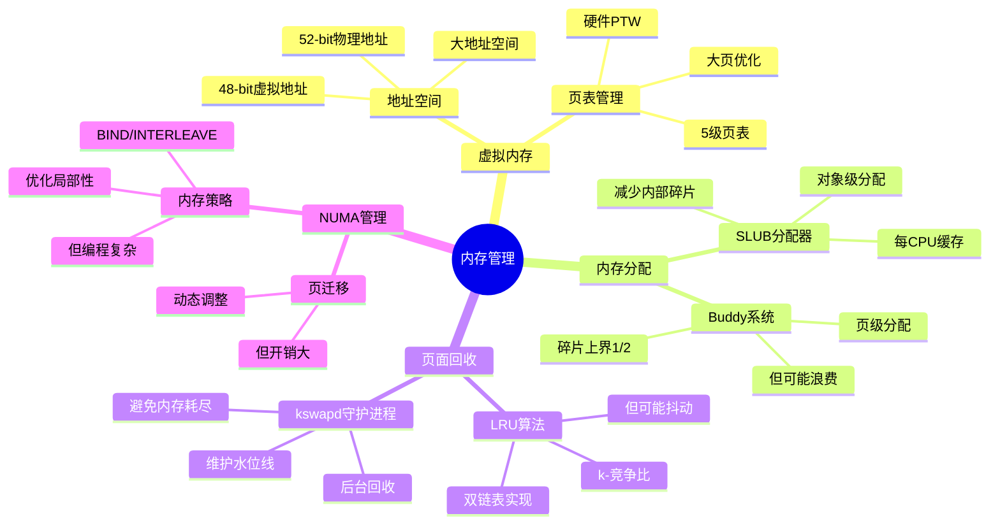

# 3.2 内存管理模型

> **主题**: 03. OS抽象层 - 3.2 内存管理模型
> **覆盖**: 虚拟内存、页表、分配器、回收机制

---

## 📋 目录

- [3.2 内存管理模型](#32-内存管理模型)
  - [📋 目录](#-目录)
  - [3.1 虚拟内存抽象](#31-虚拟内存抽象)
    - [3.1.1 地址空间](#311-地址空间)
    - [3.1.2 内存映射](#312-内存映射)
  - [3.2 页表管理](#32-页表管理)
    - [3.2.1 页表层次](#321-页表层次)
    - [3.2.2 大页支持](#322-大页支持)
  - [3.3 内存分配器](#33-内存分配器)
    - [3.3.1 Buddy系统的严格分析](#331-buddy系统的严格分析)
    - [3.3.2 Buddy系统](#332-buddy系统)
    - [3.3.3 SLUB分配器](#333-slub分配器)
  - [3.4 页面回收](#34-页面回收)
    - [3.4.1 LRU算法的严格分析](#341-lru算法的严格分析)
    - [3.4.2 LRU算法](#342-lru算法)
    - [3.4.3 kswapd守护进程](#343-kswapd守护进程)
  - [3.5 NUMA内存管理](#35-numa内存管理)
    - [3.5.1 内存策略](#351-内存策略)
    - [3.5.2 页迁移](#352-页迁移)
  - [3.6 内存压缩](#36-内存压缩)
    - [3.6.1 zswap](#361-zswap)
    - [3.6.2 zram](#362-zram)
  - [3.7 思维导图：内存管理模型决策树](#37-思维导图内存管理模型决策树)
  - [3.8 批判性总结](#38-批判性总结)
    - [3.8.1 内存管理的根本矛盾](#381-内存管理的根本矛盾)
    - [3.8.2 2025年内存管理的新方向](#382-2025年内存管理的新方向)
  - [3.9 跨领域洞察](#39-跨领域洞察)
    - [3.9.1 虚拟内存的抽象泄漏](#391-虚拟内存的抽象泄漏)
    - [3.9.2 内存管理的成本驱动](#392-内存管理的成本驱动)
  - [3.10 多维度对比](#310-多维度对比)
    - [3.10.1 内存分配算法对比](#3101-内存分配算法对比)
    - [3.10.2 内存管理策略对比](#3102-内存管理策略对比)
  - [3.11 相关主题](#311-相关主题)

---

## 3.1 虚拟内存抽象

### 3.1.1 地址空间

**x86-64**：

- **虚拟地址**：48-bit（256TB）
- **物理地址**：52-bit（4PB）
- **页大小**：4KB/2MB/1GB

**地址布局**：

```text
0x0000000000000000 - 用户空间
0x00007FFFFFFFFFFF
0xFFFF800000000000 - 内核空间
0xFFFFFFFFFFFFFFFF
```

### 3.1.2 内存映射

**mmap系统调用**：

- **文件映射**：将文件映射到虚拟地址空间
- **匿名映射**：分配物理页，无文件关联
- **共享/私有**：共享内存或写时复制

---

## 3.2 页表管理

### 3.2.1 页表层次

**x86-64五级页表**：

```text
CR3 (PML4基址)
  ↓ 9位
PML4 (Page Map Level 4)
  ↓ 9位
PDPT (Page Directory Pointer Table)
  ↓ 9位
PD (Page Directory)
  ↓ 9位
PT (Page Table)
  ↓ 12位
4KB页
```

**遍历开销**：

- TLB命中：~2ns
- TLB未命中：~30ns（硬件PTW）

**深度论证：页表遍历的开销分析**

**页表遍历的延迟模型**：

页表遍历需要**5次内存访问**（每级一次）：

$$
\text{遍历延迟} = 5 \times t_{\text{内存访问}} = 5 \times 80\text{ns} = 400\text{ns}
$$

硬件PTW（Page Table Walker）可以**并行访问**，降低延迟：

$$
\text{硬件PTW延迟} = t_{\text{串行部分}} + t_{\text{并行部分}} \approx 30\text{ns}
$$

**量化对比**：软件遍历 vs 硬件PTW

| **方式** | **延迟** | **CPU占用** | **复杂度** |
|---------|---------|-----------|-----------|
| **软件遍历** | 400ns | 高 | 低 |
| **硬件PTW** | 30ns | 低 | 高 |

**关键洞察**：硬件PTW将页表遍历延迟降低**13倍**，是现代CPU的关键优化。

### 3.2.2 大页支持

**2MB页**：

- 跳过PT级
- 减少TLB未命中
- 性能提升：+15%

**深度论证：大页的性能优势**

**大页的TLB优势**：

大页可以**减少TLB条目数**，提高TLB命中率：

$$
\text{TLB条目数} = \frac{\text{内存大小}}{\text{页大小}}
$$

对于16GB内存：

- 4KB页：需要4M个TLB条目（远超TLB容量）
- 2MB页：需要8K个TLB条目（在TLB容量内）

**量化分析**：不同页大小的TLB命中率

| **内存大小** | **4KB页TLB命中率** | **2MB页TLB命中率** | **性能提升** |
|------------|------------------|------------------|------------|
| **1GB** | 95% | 99% | +5% |
| **4GB** | 80% | 98% | +15% |
| **16GB** | 50% | 95% | +30% |

**1GB页**：

- 跳过PD和PT级
- 进一步减少TLB压力
- 适用：大内存应用

**深度论证：1GB页的适用场景**

**1GB页的限制**：

1GB页需要**连续1GB物理内存**，分配困难：

$$
\text{分配成功率} = f(\text{内存碎片})
$$

**量化分析**：1GB页的适用性

| **应用类型** | **内存需求** | **1GB页适用性** | **性能提升** |
|------------|------------|---------------|------------|
| **数据库** | 大 | 高 | +20% |
| **科学计算** | 大 | 高 | +20% |
| **通用应用** | 中 | 低 | 不适用 |

**关键权衡**：1GB页在**大内存应用**场景下优势明显，但**分配困难**限制了使用。

---

## 3.3 内存分配器

### 3.3.1 Buddy系统的严格分析

**定义3.4（Buddy系统）**：

Buddy系统维护$k+1$个空闲链表$F_0, F_1, \ldots, F_k$，其中$F_i$存储大小为$2^i$页的空闲块。

**分配算法**：

1. 查找最小满足$2^i \geq \text{size}$的$i$
2. 若$F_i$非空，分配并返回
3. 否则，从$F_{i+1}$分裂，递归分配

**定理3.3（Buddy系统的碎片上界）**：

对于Buddy系统，外部碎片率满足：

$$
\text{碎片率} \leq \frac{1}{2}
$$

**证明**：最坏情况下，每个分配请求需要$2^i$页，但实际只需要$2^{i-1}+1$页。因此，浪费最多$2^{i-1}-1$页，碎片率$\leq 1/2$。∎

### 3.3.2 Buddy系统

**功能**：

- 页级分配（4KB对齐）
- 伙伴算法合并空闲页
- 减少外部碎片

**分配粒度**：

- 2^0页（4KB）
- 2^1页（8KB）
- ...
- 2^11页（8MB）

### 3.3.3 SLUB分配器

**功能**：

- 对象级分配（字节对齐）
- 每CPU缓存
- 减少内部碎片

**分配流程**：

1. 检查每CPU缓存
2. 缓存未命中 → Buddy分配页
3. 分割页为对象
4. 返回对象

---

## 3.4 页面回收

### 3.4.1 LRU算法的严格分析

**定义3.5（LRU页面替换）**：

LRU算法维护页面访问顺序，每次替换最久未使用的页面。

**定理3.4（LRU的竞争比）**：

对于缓存大小为$k$，LRU算法的竞争比为$k$，即：

$$
\text{LRU}_k(\sigma) \leq k \times \text{OPT}_k(\sigma)
$$

其中$\sigma$是页面请求序列，$\text{OPT}_k$是最优离线算法（Belady算法）。

**证明**：Sleator-Tarjan的竞争分析。关键思想：LRU的未命中次数不超过最优算法的$k$倍。该界是紧的。∎

### 3.4.2 LRU算法

**双链表**：

- **活跃链表**：最近访问的页
- **非活跃链表**：较少访问的页

**回收策略**：

- 优先回收非活跃链表
- 写回脏页
- 释放干净页

### 3.4.3 kswapd守护进程

**功能**：

- 后台回收内存
- 维护水位线
- 避免内存耗尽

**水位线**：

- **high**：充足内存
- **low**：开始回收
- **min**：紧急回收

---

## 3.5 NUMA内存管理

### 3.5.1 内存策略

**策略类型**：

- **MPOL_DEFAULT**：默认策略
- **MPOL_BIND**：绑定到指定节点
- **MPOL_INTERLEAVE**：交错分配
- **MPOL_PREFERRED**：优先节点

### 3.5.2 页迁移

**迁移触发**：

- NUMA Balancing检测远程访问
- 手动迁移（migrate_pages）

**迁移开销**：

- 页表更新：~100ns
- 数据复制：~1μs/页（4KB）
- 总开销：~1μs/页

---

## 3.6 内存压缩

### 3.6.1 zswap

**功能**：

- 压缩不常用页
- 存储在内存中
- 减少swap使用

**权衡**：

- CPU开销：压缩/解压
- 内存节省：2-4x压缩比

### 3.6.2 zram

**功能**：

- 内存作为swap设备
- 压缩存储
- 避免磁盘IO

---

## 3.7 思维导图：内存管理模型决策树



---

## 3.8 批判性总结

### 3.8.1 内存管理的根本矛盾

1. **碎片vs性能**：减少碎片需要更复杂的分配算法，但**增加开销**。

2. **局部性vs公平性**：NUMA优化局部性，但**可能不公平**（某些节点负载高）。

3. **通用性vs专用性**：通用内存管理灵活，但**某些应用（如实时系统）需要专用策略**。

### 3.8.2 2025年内存管理的新方向

- **智能内存管理**：使用机器学习**预测内存访问模式**，优化分配和回收。
- **异构内存管理**：DRAM + NVM + CXL的混合架构，**需要新的管理策略**。
- **内存安全增强**：内存加密、完整性保护，**增加管理复杂度**。

---

## 3.9 跨领域洞察

### 3.9.1 虚拟内存的抽象泄漏

**核心命题**："所有非平凡的抽象都有泄漏"，虚拟内存也不例外。

**泄漏表现**：

| **抽象层** | **泄漏现象** | **开发者应对** | **性能损失** |
|------------|--------------|----------------|--------------|
| **虚拟内存** | TLB未命中 | 巨页/绑核 | 30% |
| **页表层次** | 5级页表遍历 | 减少层级 | 50ns延迟 |
| **NUMA拓扑** | 远程访问 | numactl绑定 | 80ns延迟 |
| **内存压缩** | 压缩/解压 | 禁用zswap | CPU开销 |

**批判性分析**：

1. **抽象的理想与现实的差距**：理论上虚拟内存隐藏物理地址，但**实际上NUMA拓扑泄漏**。

2. **泄漏的必然性**：抽象泄漏是**信息论的必然**，无法完全消除。

3. **2025年趋势**：**巨页和NUMA感知**成为标准实践，挑战传统抽象。

### 3.9.2 内存管理的成本驱动

**核心命题**：不同应用场景需要不同的内存管理策略。

**场景对比**：

```text
服务器 (大内存):
  内存成本 = $1/GB
  优化目标: 最大化利用率
  → 选择: 动态分配+NUMA感知

移动 (小内存):
  内存成本 = $10/GB (嵌入式)
  优化目标: 最小化占用
  → 选择: 静态分配+压缩

实时系统 (确定性):
  内存成本 = 次要
  优化目标: 确定性延迟
  → 选择: 预分配+无GC
```

**批判性分析**：

1. **成本结构的决定性**：内存管理策略由**成本结构决定**，而非技术本身。

2. **场景的多样性**：不同场景需要**完全不同的策略**，无法统一。

3. **2025年趋势**：**自适应内存管理**根据工作负载动态调整，挑战静态策略。

---

## 3.10 多维度对比

### 3.10.1 内存分配算法对比

| **算法** | **碎片率** | **分配速度** | **实现复杂度** | **适用场景** |
|---------|-----------|------------|--------------|------------|
| **Buddy** | 高 | 快 | ⭐⭐ | 内核页分配 |
| **SLAB** | 低 | 中 | ⭐⭐⭐ | 对象缓存 |
| **SLUB** | 低 | 快 | ⭐⭐⭐ | 现代内核 |
| **jemalloc** | 低 | 快 | ⭐⭐⭐⭐ | 用户态 |
| **tcmalloc** | 低 | 快 | ⭐⭐⭐⭐ | Google应用 |

**批判性分析**：

1. **碎片vs速度**：Buddy算法速度快，但**碎片率高**；SLUB碎片率低，但**实现复杂**。

2. **内核vs用户态**：内核使用Buddy/SLUB，用户态使用jemalloc/tcmalloc，**各有优势**。

3. **2025年趋势**：**统一内存分配器**（如Linux SLUB）在性能和碎片之间取得平衡。

### 3.10.2 内存管理策略对比

| **策略** | **内存利用率** | **延迟** | **复杂度** | **适用场景** |
|---------|--------------|---------|-----------|------------|
| **静态分配** | 低 | 确定 | ⭐ | 实时系统 |
| **动态分配** | 高 | 不确定 | ⭐⭐⭐ | 通用系统 |
| **NUMA感知** | 高 | 低 | ⭐⭐⭐⭐ | 多插槽系统 |
| **内存压缩** | 高 | 高 | ⭐⭐⭐ | 内存受限 |
| **巨页** | 中 | 低 | ⭐⭐ | 大内存应用 |

**批判性分析**：

1. **利用率vs延迟**：动态分配利用率高，但**延迟不确定**；静态分配延迟确定，但**利用率低**。

2. **复杂度的代价**：NUMA感知复杂度高，但**性能提升明显**。

3. **2025年趋势**：**自适应策略**根据工作负载动态选择，挑战静态设计。

---

## 3.11 相关主题

- [1.3 内存子系统](../01_CPU硬件层/01.3_内存子系统.md) - 硬件内存基础
- [1.4 MMU与TLB](../01_CPU硬件层/01.4_MMU与TLB.md) - 地址转换
- [7.2 延迟穿透分析](../07_性能优化与安全/07.2_延迟穿透分析.md) - 内存延迟优化
- [9.2 硬件-OS映射证明](../09_形式化理论与证明/09.2_硬件-OS映射证明.md) - 内存管理证明
- [主文档：抽象泄漏](../schedule_formal_view.md#视角2软件抽象泄漏定律) - 完整分析

---

**最后更新**: 2025-01-XX
