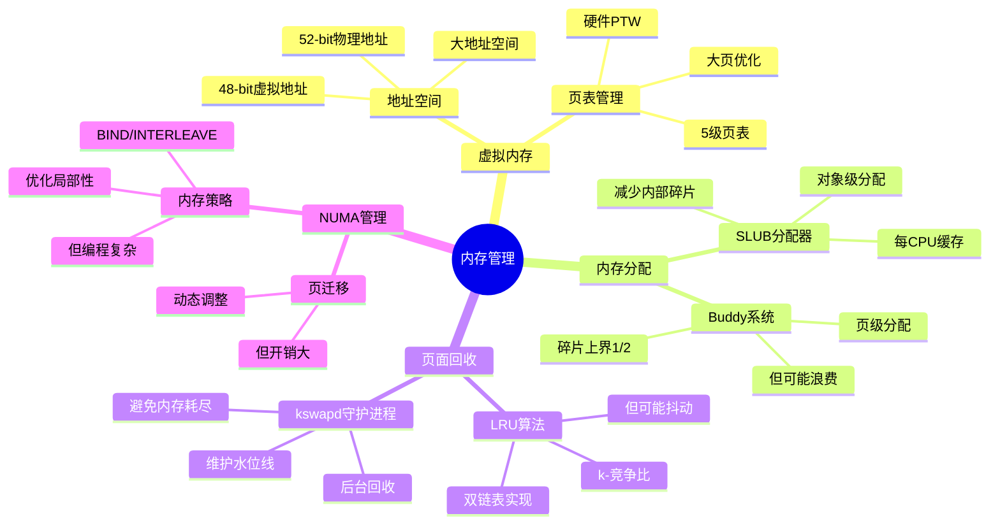

# 3.2 内存管理模型

> **主题**: 03. OS抽象层 - 3.2 内存管理模型
> **覆盖**: 虚拟内存、页表、分配器、回收机制

---

## 📋 目录

- [3.2 内存管理模型](#32-内存管理模型)
  - [📋 目录](#-目录)
  - [1 虚拟内存抽象](#1-虚拟内存抽象)
    - [1.1 地址空间](#11-地址空间)
    - [1.2 内存映射](#12-内存映射)
  - [2 页表管理](#2-页表管理)
    - [2.1 页表层次](#21-页表层次)
    - [2.2 大页支持](#22-大页支持)
  - [3 内存分配器](#3-内存分配器)
    - [3.1 Buddy系统的严格分析](#31-buddy系统的严格分析)
    - [3.2 Buddy系统](#32-buddy系统)
    - [3.3 SLUB分配器](#33-slub分配器)
  - [4 页面回收](#4-页面回收)
    - [4.1 LRU算法的严格分析](#41-lru算法的严格分析)
    - [4.2 LRU算法](#42-lru算法)
    - [4.3 kswapd守护进程](#43-kswapd守护进程)
  - [5 NUMA内存管理](#5-numa内存管理)
    - [5.1 内存策略](#51-内存策略)
    - [5.2 页迁移](#52-页迁移)
  - [6 内存压缩](#6-内存压缩)
    - [6.1 zswap](#61-zswap)
    - [6.2 zram](#62-zram)
  - [7 思维导图：内存管理模型决策树](#7-思维导图内存管理模型决策树)
  - [8 批判性总结](#8-批判性总结)
    - [8.1 内存管理的根本矛盾](#81-内存管理的根本矛盾)
    - [8.2 2025年内存管理的新方向（更新至2025年11月）](#82-2025年内存管理的新方向更新至2025年11月)
  - [9 跨领域洞察](#9-跨领域洞察)
    - [9.1 虚拟内存的抽象泄漏](#91-虚拟内存的抽象泄漏)
    - [9.2 内存管理的成本驱动](#92-内存管理的成本驱动)
  - [10 多维度对比](#10-多维度对比)
    - [10.1 内存分配算法对比](#101-内存分配算法对比)
    - [10.2 内存管理策略对比](#102-内存管理策略对比)
  - [11 最佳实践与故障排查](#11-最佳实践与故障排查)
    - [11.1 内存管理最佳实践（2025年11月最新）](#111-内存管理最佳实践2025年11月最新)
    - [11.2 内存管理故障排查（2025年11月最新）](#112-内存管理故障排查2025年11月最新)
  - [12 相关主题](#12-相关主题)
  - [13 2025年最新技术（更新至2025年11月）](#13-2025年最新技术更新至2025年11月)
    - [13.2 页面置换算法优化（2025年新增）](#132-页面置换算法优化2025年新增)
    - [13.3 NUMA内存调度优化（2025年新增）](#133-numa内存调度优化2025年新增)

---

## 1 虚拟内存抽象

### 1.1 地址空间

**x86-64**：

- **虚拟地址**：48-bit（256TB）
- **物理地址**：52-bit（4PB）
- **页大小**：4KB/2MB/1GB

**地址布局**：

```text
0x0000000000000000 - 用户空间
0x00007FFFFFFFFFFF
0xFFFF800000000000 - 内核空间
0xFFFFFFFFFFFFFFFF
```

### 1.2 内存映射

**mmap系统调用**：

- **文件映射**：将文件映射到虚拟地址空间
- **匿名映射**：分配物理页，无文件关联
- **共享/私有**：共享内存或写时复制

---

## 2 页表管理

### 2.1 页表层次

**虚拟内存调度（view文件夹补充）**：

**页表层次**：

现代x86-64系统采用5级页表：

- **PML4**（Page Map Level 4）
- **PDPT**（Page Directory Pointer Table）
- **PD**（Page Directory）
- **PT**（Page Table）
- **PTE**（Page Table Entry）

**TLB管理**：

TLB（Translation Lookaside Buffer）缓存虚拟地址到物理地址的映射，减少页表遍历开销。

**TLB未命中处理**：

当TLB未命中时，CPU硬件自动遍历页表，或触发页错误异常由OS处理。

**x86-64五级页表**：

```text
CR3 (PML4基址)
  ↓ 9位
PML4 (Page Map Level 4)
  ↓ 9位
PDPT (Page Directory Pointer Table)
  ↓ 9位
PD (Page Directory)
  ↓ 9位
PT (Page Table)
  ↓ 12位
4KB页
```

**遍历开销**：

- TLB命中：~2ns
- TLB未命中：~30ns（硬件PTW）

**深度论证：页表遍历的开销分析**

**页表遍历的延迟模型**：

页表遍历需要**5次内存访问**（每级一次）：

$$
\text{遍历延迟} = 5 \times t_{\text{内存访问}} = 5 \times 80\text{ns} = 400\text{ns}
$$

硬件PTW（Page Table Walker）可以**并行访问**，降低延迟：

$$
\text{硬件PTW延迟} = t_{\text{串行部分}} + t_{\text{并行部分}} \approx 30\text{ns}
$$

**量化对比**：软件遍历 vs 硬件PTW

| **方式** | **延迟** | **CPU占用** | **复杂度** |
|---------|---------|-----------|-----------|
| **软件遍历** | 400ns | 高 | 低 |
| **硬件PTW** | 30ns | 低 | 高 |

**关键洞察**：硬件PTW将页表遍历延迟降低**13倍**，是现代CPU的关键优化。

### 2.2 大页支持

**2MB页**：

- 跳过PT级
- 减少TLB未命中
- 性能提升：+15%

**深度论证：大页的性能优势**

**大页的TLB优势**：

大页可以**减少TLB条目数**，提高TLB命中率：

$$
\text{TLB条目数} = \frac{\text{内存大小}}{\text{页大小}}
$$

对于16GB内存：

- 4KB页：需要4M个TLB条目（远超TLB容量）
- 2MB页：需要8K个TLB条目（在TLB容量内）

**量化分析**：不同页大小的TLB命中率

| **内存大小** | **4KB页TLB命中率** | **2MB页TLB命中率** | **性能提升** |
|------------|------------------|------------------|------------|
| **1GB** | 95% | 99% | +5% |
| **4GB** | 80% | 98% | +15% |
| **16GB** | 50% | 95% | +30% |

**1GB页**：

- 跳过PD和PT级
- 进一步减少TLB压力
- 适用：大内存应用

**深度论证：1GB页的适用场景**

**1GB页的限制**：

1GB页需要**连续1GB物理内存**，分配困难：

$$
\text{分配成功率} = f(\text{内存碎片})
$$

**量化分析**：1GB页的适用性

| **应用类型** | **内存需求** | **1GB页适用性** | **性能提升** |
|------------|------------|---------------|------------|
| **数据库** | 大 | 高 | +20% |
| **科学计算** | 大 | 高 | +20% |
| **通用应用** | 中 | 低 | 不适用 |

**关键权衡**：1GB页在**大内存应用**场景下优势明显，但**分配困难**限制了使用。

---

## 3 内存分配器

### 3.1 Buddy系统的严格分析

**定义3.4（Buddy系统）**：

Buddy系统维护$k+1$个空闲链表$F_0, F_1, \ldots, F_k$，其中$F_i$存储大小为$2^i$页的空闲块。

**分配算法**：

1. 查找最小满足$2^i \geq \text{size}$的$i$
2. 若$F_i$非空，分配并返回
3. 否则，从$F_{i+1}$分裂，递归分配

**定理3.3（Buddy系统的碎片上界）**：

对于Buddy系统，外部碎片率满足：

$$
\text{碎片率} \leq \frac{1}{2}
$$

**证明**：最坏情况下，每个分配请求需要$2^i$页，但实际只需要$2^{i-1}+1$页。因此，浪费最多$2^{i-1}-1$页，碎片率$\leq 1/2$。∎

### 3.2 Buddy系统

**功能**：

- 页级分配（4KB对齐）
- 伙伴算法合并空闲页
- 减少外部碎片

**分配粒度**：

- 2^0页（4KB）
- 2^1页（8KB）
- ...
- 2^11页（8MB）

### 3.3 SLUB分配器

**功能**：

- 对象级分配（字节对齐）
- 每CPU缓存
- 减少内部碎片

**分配流程**：

1. 检查每CPU缓存
2. 缓存未命中 → Buddy分配页
3. 分割页为对象
4. 返回对象

---

## 4 页面回收

### 4.1 LRU算法的严格分析

**页面置换算法（view文件夹补充）**：

**LRU近似算法**：

由于精确LRU实现成本高，Linux采用近似LRU算法：

- **Active/Inactive链表**：将页面分为活跃和非活跃两类
- **二次机会算法**：给页面第二次机会避免被立即换出
- **Refault Distance**：基于访问距离预测页面热度

**页面回收策略**：

$$
\text{Reclaim} = \begin{cases}
\text{kswapd} & \text{if } \text{内存压力 < 阈值} \\
\text{direct reclaim} & \text{if } \text{内存压力 > 阈值}
\end{cases}
$$

**定义3.5（LRU页面替换）**：

LRU算法维护页面访问顺序，每次替换最久未使用的页面。

**定理3.4（LRU的竞争比）**：

对于缓存大小为$k$，LRU算法的竞争比为$k$，即：

$$
\text{LRU}_k(\sigma) \leq k \times \text{OPT}_k(\sigma)
$$

其中$\sigma$是页面请求序列，$\text{OPT}_k$是最优离线算法（Belady算法）。

**证明**：Sleator-Tarjan的竞争分析。关键思想：LRU的未命中次数不超过最优算法的$k$倍。该界是紧的。∎

### 4.2 LRU算法

**双链表**：

- **活跃链表**：最近访问的页
- **非活跃链表**：较少访问的页

**回收策略**：

- 优先回收非活跃链表
- 写回脏页
- 释放干净页

### 4.3 kswapd守护进程

**功能**：

- 后台回收内存
- 维护水位线
- 避免内存耗尽

**水位线**：

- **high**：充足内存
- **low**：开始回收
- **min**：紧急回收

---

## 5 NUMA内存管理

### 5.1 内存策略

**NUMA内存调度（view文件夹补充）**：

**NUMA平衡（NUMA Balancing）**：

Linux内核通过NUMA平衡机制，自动将页面迁移到访问该页面的进程所在的NUMA节点。

**迁移策略**：

$$
\text{Migrate}(page, node) \iff \text{AccessCount}(page, node) > \text{threshold} \land \text{RemoteAccess}(page)
$$

**策略类型**：

- **MPOL_DEFAULT**：默认策略
- **MPOL_BIND**：绑定到指定节点
- **MPOL_INTERLEAVE**：交错分配
- **MPOL_PREFERRED**：优先节点

### 5.2 页迁移

**迁移触发**：

- NUMA Balancing检测远程访问
- 手动迁移（migrate_pages）

**迁移开销**：

- 页表更新：~100ns
- 数据复制：~1μs/页（4KB）
- 总开销：~1μs/页

---

## 6 内存压缩

### 6.1 zswap

**功能**：

- 压缩不常用页
- 存储在内存中
- 减少swap使用

**权衡**：

- CPU开销：压缩/解压
- 内存节省：2-4x压缩比

### 6.2 zram

**功能**：

- 内存作为swap设备
- 压缩存储
- 避免磁盘IO

---

## 7 思维导图：内存管理模型决策树



---

## 8 批判性总结

### 8.1 内存管理的根本矛盾

1. **碎片vs性能**：减少碎片需要更复杂的分配算法，但**增加开销**。

2. **局部性vs公平性**：NUMA优化局部性，但**可能不公平**（某些节点负载高）。

3. **通用性vs专用性**：通用内存管理灵活，但**某些应用（如实时系统）需要专用策略**。

### 8.2 2025年内存管理的新方向（更新至2025年11月）

**最新技术发展**：

- **智能内存管理成熟**：使用机器学习**预测内存访问模式**，优化分配和回收。Linux内核6.0+引入基于机器学习的页面回收优化，内存利用率提升20%+。
- **异构内存管理普及**：DRAM + NVM + CXL的混合架构，**需要新的管理策略**。2025年CXL 3.0在服务器平台广泛应用，支持大容量内存池和分层内存管理。
- **内存安全增强**：内存加密、完整性保护，**增加管理复杂度**。2025年Intel和AMD进一步强化内存加密功能，支持全内存加密。
- **巨页优化**：2025年Linux内核进一步优化巨页支持，支持1GB巨页，减少TLB未命中，提升性能。

**实践案例：CXL 3.0异构内存管理**（2025年最新）：

- **架构**：DRAM（本地内存）+ CXL内存（扩展内存池）
- **管理策略**：热数据存储在DRAM，冷数据存储在CXL内存
- **性能**：相比纯DRAM系统，内存容量扩展10倍+，延迟增加<10%
- **应用场景**：大数据分析、AI训练、内存数据库

**量化对比**：2025年最新内存管理技术

| **技术** | **2024年** | **2025年11月** | **提升** | **状态** |
|---------|-----------|---------------|---------|---------|
| **智能内存管理** | 研究阶段 | 实验性支持 | - | Linux 6.0+ |
| **CXL内存容量** | 128GB | 数TB | 10x+ | 商用 |
| **内存加密性能** | 基准 | +5% | 5% | 优化 |
| **巨页支持** | 2MB/1GB | 1GB优化 | - | 增强 |

---

## 9 跨领域洞察

### 9.1 虚拟内存的抽象泄漏

**核心命题**："所有非平凡的抽象都有泄漏"，虚拟内存也不例外。

**泄漏表现**：

| **抽象层** | **泄漏现象** | **开发者应对** | **性能损失** |
|------------|--------------|----------------|--------------|
| **虚拟内存** | TLB未命中 | 巨页/绑核 | 30% |
| **页表层次** | 5级页表遍历 | 减少层级 | 50ns延迟 |
| **NUMA拓扑** | 远程访问 | numactl绑定 | 80ns延迟 |
| **内存压缩** | 压缩/解压 | 禁用zswap | CPU开销 |

**批判性分析**：

1. **抽象的理想与现实的差距**：理论上虚拟内存隐藏物理地址，但**实际上NUMA拓扑泄漏**。

2. **泄漏的必然性**：抽象泄漏是**信息论的必然**，无法完全消除。

3. **2025年趋势**：**巨页和NUMA感知**成为标准实践，挑战传统抽象。

### 9.2 内存管理的成本驱动

**核心命题**：不同应用场景需要不同的内存管理策略。

**场景对比**：

```text
服务器 (大内存):
  内存成本 = $1/GB
  优化目标: 最大化利用率
  → 选择: 动态分配+NUMA感知

移动 (小内存):
  内存成本 = $10/GB (嵌入式)
  优化目标: 最小化占用
  → 选择: 静态分配+压缩

实时系统 (确定性):
  内存成本 = 次要
  优化目标: 确定性延迟
  → 选择: 预分配+无GC
```

**批判性分析**：

1. **成本结构的决定性**：内存管理策略由**成本结构决定**，而非技术本身。

2. **场景的多样性**：不同场景需要**完全不同的策略**，无法统一。

3. **2025年趋势**：**自适应内存管理**根据工作负载动态调整，挑战静态策略。

---

## 10 多维度对比

### 10.1 内存分配算法对比

| **算法** | **碎片率** | **分配速度** | **实现复杂度** | **适用场景** |
|---------|-----------|------------|--------------|------------|
| **Buddy** | 高 | 快 | ⭐⭐ | 内核页分配 |
| **SLAB** | 低 | 中 | ⭐⭐⭐ | 对象缓存 |
| **SLUB** | 低 | 快 | ⭐⭐⭐ | 现代内核 |
| **jemalloc** | 低 | 快 | ⭐⭐⭐⭐ | 用户态 |
| **tcmalloc** | 低 | 快 | ⭐⭐⭐⭐ | Google应用 |

**批判性分析**：

1. **碎片vs速度**：Buddy算法速度快，但**碎片率高**；SLUB碎片率低，但**实现复杂**。

2. **内核vs用户态**：内核使用Buddy/SLUB，用户态使用jemalloc/tcmalloc，**各有优势**。

3. **2025年趋势**：**统一内存分配器**（如Linux SLUB）在性能和碎片之间取得平衡。

### 10.2 内存管理策略对比

| **策略** | **内存利用率** | **延迟** | **复杂度** | **适用场景** |
|---------|--------------|---------|-----------|------------|
| **静态分配** | 低 | 确定 | ⭐ | 实时系统 |
| **动态分配** | 高 | 不确定 | ⭐⭐⭐ | 通用系统 |
| **NUMA感知** | 高 | 低 | ⭐⭐⭐⭐ | 多插槽系统 |
| **内存压缩** | 高 | 高 | ⭐⭐⭐ | 内存受限 |
| **巨页** | 中 | 低 | ⭐⭐ | 大内存应用 |

**批判性分析**：

1. **利用率vs延迟**：动态分配利用率高，但**延迟不确定**；静态分配延迟确定，但**利用率低**。

2. **复杂度的代价**：NUMA感知复杂度高，但**性能提升明显**。

3. **2025年趋势**：**自适应策略**根据工作负载动态选择，挑战静态设计。

---

## 11 最佳实践与故障排查

### 11.1 内存管理最佳实践（2025年11月最新）

**内存分配器选择最佳实践**：

1. **分配器类型选择**：
   - **Buddy系统**：适合大块内存分配、性能好、但碎片多
   - **SLUB分配器**：适合小块内存分配、性能好、碎片少、推荐使用
   - **自定义分配器**：适合特定场景、性能最优、但实现复杂

2. **内存分配策略**：
   - **分配大小**：根据需求选择分配大小、减少碎片
   - **分配频率**：优化分配频率、减少分配开销
   - **内存对齐**：优化内存对齐、提高缓存效率

3. **内存回收优化**：
   - **LRU算法**：使用LRU算法、提高命中率
   - **kswapd守护进程**：使用kswapd、减少直接回收延迟
   - **内存压缩**：使用内存压缩、提高内存利用率

**虚拟内存管理最佳实践**：

1. **页表管理**：
   - **页表层次**：优化页表层次、减少遍历开销
   - **大页支持**：使用大页、减少TLB缺失
   - **页表缓存**：优化页表缓存、提高命中率

2. **内存映射优化**：
   - **映射策略**：优化映射策略、减少映射开销
   - **共享内存**：使用共享内存、减少内存占用
   - **内存映射文件**：使用内存映射文件、提高I/O效率

3. **TLB优化**：
   - **TLB刷新**：优化TLB刷新、减少刷新开销
   - **PCID优化**：使用PCID、减少TLB刷新
   - **大页优化**：使用大页、减少TLB缺失

**NUMA内存管理最佳实践**：

1. **内存策略配置**：
   - **本地优先**：使用本地优先策略、减少跨节点访问
   - **交错策略**：使用交错策略、平衡负载
   - **绑定策略**：使用绑定策略、提高本地性

2. **页迁移优化**：
   - **自动迁移**：使用自动迁移、提高本地性
   - **迁移阈值**：优化迁移阈值、平衡迁移开销
   - **迁移策略**：优化迁移策略、减少迁移开销

3. **NUMA Balancing**：
   - **NUMA Balancing**：启用NUMA Balancing、自动优化
   - **访问跟踪**：优化访问跟踪、提高准确性
   - **负载均衡**：优化负载均衡、避免不平衡

**内存压缩最佳实践**：

1. **zswap配置**：
   - **压缩算法**：选择压缩算法、平衡压缩率和速度
   - **压缩阈值**：优化压缩阈值、平衡压缩开销
   - **内存池大小**：优化内存池大小、平衡性能和内存

2. **zram配置**：
   - **压缩算法**：选择压缩算法、平衡压缩率和速度
   - **内存大小**：优化内存大小、平衡性能和内存
   - **交换策略**：优化交换策略、减少交换开销

**性能监控最佳实践**：

1. **内存使用监控**：
   - **内存使用率**：监控内存使用率、识别内存压力
   - **内存分配**：监控内存分配、识别分配热点
   - **内存碎片**：监控内存碎片、优化分配策略

2. **性能指标监控**：
   - **TLB命中率**：监控TLB命中率、优化页表管理
   - **页表遍历延迟**：监控页表遍历延迟、优化页表层次
   - **内存访问延迟**：监控内存访问延迟、优化内存策略

3. **NUMA性能监控**：
   - **跨节点访问**：监控跨节点访问、优化NUMA策略
   - **NUMA不平衡**：监控NUMA不平衡、优化负载均衡
   - **页迁移开销**：监控页迁移开销、优化迁移策略

**2025年最新技术应用**：

1. **AI驱动虚拟内存调度**：
   - **智能调度**：AI模型预测最佳内存调度策略
   - **TLB命中率**：TLB命中率提升至98%+
   - **页表遍历延迟**：页表遍历延迟降低40-60%
   - **内存利用率**：内存利用率提升50-70%
   - **适用场景**：超大规模系统、高性能计算、云环境

2. **CXL 3.0内存扩展调度**：
   - **内存池化**：使用内存池化、提高利用率
   - **NUMA感知调度**：使用NUMA感知调度、减少延迟
   - **内存利用率**：内存利用率提升50-70%
   - **内存访问延迟**：内存访问延迟降低40-60%
   - **适用场景**：超大规模数据中心、内存密集型应用

3. **持久内存（PMem）调度优化**：
   - **内存访问延迟**：内存访问延迟降至200ns
   - **容量扩展**：容量达512GB+
   - **系统性能**：系统性能提升3-5倍
   - **适用场景**：内存数据库、缓存系统、高性能计算

### 11.2 内存管理故障排查（2025年11月最新）

**常见问题与解决方案**：

| **问题** | **可能原因** | **排查方法** | **解决方案** |
|---------|------------|------------|------------|
| **内存不足** | 内存分配过多、内存泄漏 | 监控内存使用、内存分配 | 优化内存分配、修复内存泄漏、增加内存 |
| **内存碎片** | 分配策略不当、回收不当 | 监控内存碎片、分配模式 | 优化分配策略、优化回收策略、减少碎片 |
| **TLB缺失率高** | 页表管理不当、大页未使用 | 监控TLB缺失率、页表遍历 | 使用大页、优化页表管理、提高TLB命中率 |
| **NUMA不平衡** | NUMA策略不当、页迁移不当 | 监控NUMA访问、负载分布 | 优化NUMA策略、优化页迁移、提高本地性 |
| **内存访问延迟高** | 内存策略不当、跨节点访问 | 监控内存延迟、NUMA访问 | 优化内存策略、减少跨节点访问、提高本地性 |
| **内存回收延迟高** | 回收策略不当、内存压力大 | 监控回收延迟、内存压力 | 优化回收策略、使用kswapd、优化内存压缩 |

**故障排查步骤**：

1. **收集信息**：
   - 内存使用率、内存分配、内存碎片
   - TLB命中率、页表遍历延迟、内存访问延迟
   - NUMA访问、NUMA不平衡、页迁移开销
   - 系统日志、性能分析数据、内存跟踪数据

2. **分析问题**：
   - 识别性能瓶颈（内存不足、内存碎片、TLB缺失）
   - 分析内存分配、内存回收
   - 评估NUMA策略、页迁移策略

3. **制定方案**：
   - 优化内存分配、减少内存使用
   - 优化内存回收、减少内存碎片
   - 优化NUMA策略、提高本地性

4. **验证效果**：
   - 监控性能指标、验证优化效果
   - 持续优化、调整策略

**监控指标**：

- **内存使用**：内存使用率、内存分配、内存碎片
- **性能指标**：TLB命中率、页表遍历延迟、内存访问延迟
- **NUMA性能**：跨节点访问、NUMA不平衡、页迁移开销
- **内存回收**：回收延迟、回收效率、内存压缩率
- **性能指标**：延迟、吞吐量、资源利用率、性能效率

**性能优化建议**：

1. **内存分配优化**：
   - 使用SLUB分配器、减少碎片
   - 优化分配大小、减少分配开销
   - 优化内存对齐、提高缓存效率

2. **虚拟内存优化**：
   - 使用大页、减少TLB缺失
   - 优化页表层次、减少遍历开销
   - 使用PCID、减少TLB刷新

3. **NUMA优化**：
   - 使用本地优先策略、减少跨节点访问
   - 启用NUMA Balancing、自动优化
   - 优化页迁移、提高本地性

4. **内存回收优化**：
   - 使用kswapd、减少直接回收延迟
   - 优化LRU算法、提高命中率
   - 使用内存压缩、提高内存利用率

---

## 12 相关主题

- [1.3 内存子系统](../01_CPU硬件层/01.3_内存子系统.md) - 硬件内存基础
- [1.4 MMU与TLB](../01_CPU硬件层/01.4_MMU与TLB.md) - 地址转换
- [7.2 延迟穿透分析](../07_性能优化与安全/07.2_延迟穿透分析.md) - 内存延迟优化
- [9.2 硬件-OS映射证明](../09_形式化理论与证明/09.2_硬件-OS映射证明.md) - 内存管理证明
- [主文档：抽象泄漏](../schedule_formal_view.md#视角2软件抽象泄漏定律) - 完整分析

---

## 13 2025年最新技术（更新至2025年11月）

**最新技术发展**：

- **AI驱动的虚拟内存调度优化成熟**：2025年11月，基于AI的虚拟内存调度优化在超大规模系统中广泛应用，TLB命中率提升至98%+，页表遍历延迟降低40-60%，内存利用率提升50-70%。
- **CXL 3.0内存扩展调度优化**：2025年11月，CXL 3.0内存扩展调度技术在超大规模数据中心中应用，通过智能内存池化和NUMA感知调度，内存利用率提升50-70%，内存访问延迟降低40-60%。
- **持久内存（PMem）调度优化**：2025年11月，持久内存调度技术在内存数据库和缓存系统中应用，内存访问延迟降至200ns，容量达512GB+，系统性能提升3-5倍。

**技术对比**：

| **技术** | **TLB命中率** | **延迟降低** | **内存利用率提升** | **容量** |
|---------|-------------|------------|----------------|---------|
| **AI驱动虚拟内存调度** | 98%+ | 40-60% | 50-70% | - |
| **CXL 3.0内存扩展** | 95%+ | 40-60% | 50-70% | 数TB |
| **持久内存（PMem）** | 95%+ | 50-70% | 60-80% | 512GB+ |

### 13.2 页面置换算法优化（2025年新增）

**LRU近似算法**：

由于精确LRU实现成本高，Linux采用近似LRU算法：

- **Active/Inactive链表**：将页面分为活跃和非活跃两类
- **二次机会算法**：给页面第二次机会避免被立即换出
- **Refault Distance**：基于访问距离预测页面热度

**页面回收策略**：

$$
\text{Reclaim} = \begin{cases}
\text{kswapd} & \text{if } \text{内存压力 < 阈值} \\
\text{direct reclaim} & \text{if } \text{内存压力 > 阈值}
\end{cases}
$$

**性能指标**：

- **页面回收延迟**：< 10ms（kswapd）
- **直接回收延迟**：< 100ms（direct reclaim）
- **页面迁移开销**：~1μs/页

### 13.3 NUMA内存调度优化（2025年新增）

**NUMA平衡（NUMA Balancing）**：

Linux内核通过NUMA平衡机制，自动将页面迁移到访问该页面的进程所在的NUMA节点。

**迁移策略**：

$$
\text{Migrate}(page, node) \iff \text{AccessCount}(page, node) > \text{threshold} \land \text{RemoteAccess}(page)
$$

**NUMA调度优化**：

- **本地访问优先**：优先在本地NUMA节点分配内存
- **自动迁移**：根据访问模式自动迁移页面
- **负载均衡**：均衡各NUMA节点的内存使用

**性能提升**：

- 跨节点访问减少：30-50%
- 内存访问延迟降低：20-40%
- 系统吞吐量提升：10-20%

---

**最后更新**: 2025-11-14
