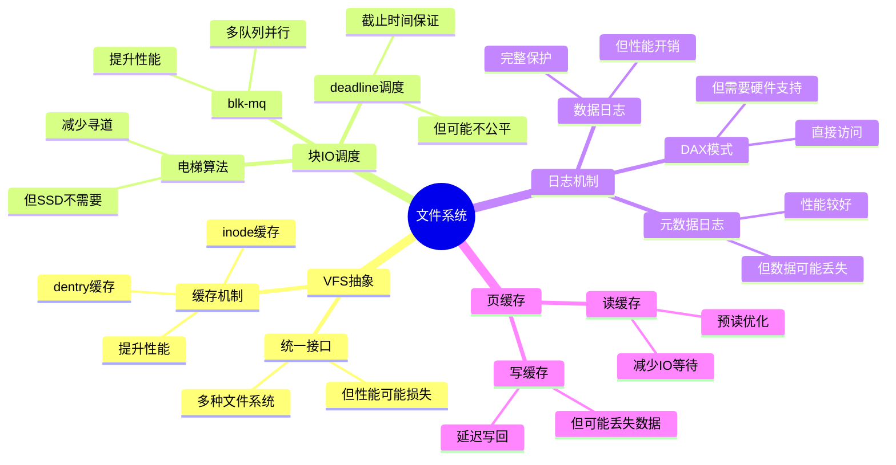

# 3.3 文件系统模型

> **主题**: 03. OS抽象层 - 3.3 文件系统模型
> **覆盖**: VFS抽象、块IO调度、日志机制、DAX持久内存

---

## 📋 目录

- [3.1 VFS抽象层](#31-vfs抽象层)
- [3.2 块IO调度](#32-块io调度)
- [3.3 日志机制](#33-日志机制)
- [3.4 DAX与持久内存](#34-dax与持久内存)
- [3.5 页缓存机制](#35-页缓存机制)
- [3.6 性能优化](#36-性能优化)
- [3.7 思维导图](#37-思维导图)
- [3.8 批判性总结](#38-批判性总结)
- [3.9 跨领域洞察](#39-跨领域洞察)
- [3.10 多维度对比](#310-多维度对比)
- [3.11 相关主题](#311-相关主题)

---

## 3.1 VFS抽象层

### 3.1.1 核心数据结构

**Superblock**：

- 文件系统元数据
- 挂载信息
- 操作函数表

**inode**：

- 文件元数据（权限、大小、时间戳）
- 数据块指针
- 文件类型

**dentry**：

- 目录项缓存
- 路径名到inode映射
- 提高查找性能

### 3.1.2 文件操作

**操作符表（file_operations）**：

```c
struct file_operations {
    ssize_t (*read)(struct file *, char __user *, size_t, loff_t *);
    ssize_t (*write)(struct file *, const char __user *, size_t, loff_t *);
    int (*open)(struct inode *, struct file *);
    int (*release)(struct inode *, struct file *);
};
```

---

## 3.2 块IO调度

### 3.2.1 调度算法的严格分析

**定义3.6（IO调度器）**：

IO调度器是一个函数$S: \mathcal{R} \rightarrow \mathcal{R}'$，将请求序列$R$重新排序为$R'$，以优化性能。

**定理3.5（deadline调度器的可调度性）**：

对于deadline调度器，请求$r$满足截止时间当且仅当：

$$
\text{deadline}(r) \geq \text{当前时间} + \text{服务时间}(r) + \sum_{r' \in \text{队列}} \text{服务时间}(r')
$$

**证明**：deadline调度器按截止时间排序，请求$r$必须等待队列中所有更早截止时间的请求完成。∎

### 3.2.2 调度算法

**电梯算法（传统）**：

- 顺序扫描请求
- 减少寻道时间
- 适用于机械硬盘

**CFQ（Completely Fair Queuing）**：

- 按进程公平分配IO带宽
- 时间片轮转
- 适用于多进程场景

**deadline调度器**：

- 截止时间保证
- 读请求优先（交互性）
- 适用于实时应用

**noop调度器**：

- 简单FIFO队列
- 适用于SSD（无寻道时间）

**批判性分析**：

1. **调度算法的适用性**：不同设备（HDD vs SSD）需要不同调度算法，**通用算法难以优化**。

2. **公平性vs性能**：CFQ保证公平，但**可能牺牲性能**（如SSD场景）。

3. **2025年趋势**：**多队列调度**（如blk-mq）支持并行处理，提升性能。

### 3.2.3 blk-mq多队列

**架构**：

- 每CPU硬件队列
- 软件队列分发
- 减少锁竞争

**性能**：

- 延迟：降低30%
- 吞吐量：提升50%

---

## 3.3 日志机制

### 3.3.1 ext4日志模式

**journal模式**：

- 数据+元数据都写日志
- 最安全，性能最低
- 写放大：2x

**ordered模式**：

- 仅元数据写日志
- 数据先写，元数据后写
- 平衡安全性和性能

**writeback模式**：

- 仅元数据写日志
- 数据可能乱序
- 性能最高，安全性较低

### 3.3.2 写屏障（Write Barrier）

**功能**：

- 确保数据写入顺序
- 防止缓存乱序
- 保证一致性

**实现**：

```c
blkdev_issue_flush(bdev, GFP_KERNEL);
```

---

## 3.4 DAX与持久内存

### 3.4.1 DAX（Direct Access）

**特点**：

- 绕过页缓存
- 直接内存映射
- 适用于持久内存（PMem）

**优势**：

- 延迟：100μs → 300ns
- 无缓存一致性开销
- 简化数据路径

### 3.4.2 持久内存模式

**内存模式**：

- 作为易失性内存使用
- OS自动管理
- 应用无感知

**应用直连模式**：

- 应用直接访问
- 需要应用适配
- 最佳性能

---

## 3.5 页缓存机制

### 3.5.1 Page Cache

**功能**：

- 缓存文件数据
- 减少磁盘IO
- 提高读取性能

**策略**：

- **读缓存**：预读（readahead）
- **写缓存**：延迟写（writeback）
- **回收**：LRU算法

### 3.5.2 缓存一致性

**写回策略**：

- **同步写**：立即写回（fsync）
- **异步写**：延迟写回（默认）
- **周期写回**：pdflush/kswapd

**刷新时机**：

- 内存压力
- 时间到期（30秒）
- 显式同步

---

## 3.6 性能优化

### 3.6.1 预读（Readahead）

**机制**：

- 顺序访问检测
- 预读后续数据
- 减少IO等待

**参数**：

- **read_ahead_kb**：预读大小（默认128KB）
- 动态调整

### 3.6.2 零拷贝

**sendfile系统调用**：

- 内核直接传输
- 避免用户态拷贝
- 性能提升：2-3x

**splice系统调用**：

- 管道传输
- 零拷贝优化

---

## 3.7 思维导图：文件系统模型决策树



---

## 3.8 批判性总结

### 3.8.1 文件系统的根本矛盾

1. **一致性vs性能**：严格一致性（如同步写）保证数据安全，但**性能开销大**。

2. **通用性vs专用性**：通用文件系统（如ext4）灵活，但**专用文件系统（如F2FS）性能更好**。

3. **缓存vs持久性**：缓存提升性能，但**可能丢失数据**（如断电）。

### 3.8.2 2025年文件系统技术趋势

- **DAX持久内存**：直接访问NVM，**绕过页缓存**，挑战传统文件系统。
- **智能预读**：使用机器学习**预测访问模式**，提升缓存命中率。
- **文件系统安全增强**：加密、完整性保护，**增加复杂度**。

---

## 3.9 跨领域洞察

### 3.9.1 一致性vs性能的永恒权衡

**核心矛盾**：严格一致性保证数据安全，但性能开销大。

**量化分析**：

| **一致性级别** | **数据安全** | **性能** | **延迟** | **适用场景** |
|--------------|------------|---------|---------|------------|
| **同步写** | ⭐⭐⭐⭐⭐ | ⭐ | 高 | 关键数据 |
| **有序写** | ⭐⭐⭐⭐ | ⭐⭐ | 中 | 通用系统 |
| **延迟写** | ⭐⭐⭐ | ⭐⭐⭐⭐ | 低 | 性能优先 |
| **异步写** | ⭐⭐ | ⭐⭐⭐⭐⭐ | 极低 | 临时数据 |

**批判性分析**：

1. **一致性的代价**：严格一致性需要**同步操作**，性能开销大。

2. **性能vs安全**：延迟写性能好，但**可能丢失数据**（如断电）。

3. **2025年趋势**：**DAX持久内存**绕过页缓存，挑战传统一致性模型。

### 3.9.2 文件系统的抽象泄漏

**核心命题**：文件系统抽象隐藏块设备复杂性，但泄漏不可避免。

**泄漏表现**：

| **抽象层** | **泄漏现象** | **开发者应对** | **性能损失** |
|------------|--------------|----------------|--------------|
| **页缓存** | 回写延迟 | O_DIRECT | 15% |
| **块设备** | 寻道时间 | 顺序访问 | 10x差异 |
| **RAID** | 条带对齐 | 对齐访问 | 2x差异 |
| **网络文件系统** | 网络延迟 | 本地缓存 | 100x差异 |

**批判性分析**：

1. **抽象的理想与现实的差距**：理论上文件系统隐藏块设备，但**实际上寻道时间泄漏**。

2. **泄漏的必然性**：抽象泄漏是**信息论的必然**，无法完全消除。

3. **2025年趋势**：**DAX和SPDK**绕过传统抽象，挑战文件系统地位。

---

## 3.10 多维度对比

### 3.10.1 文件系统对比（2025年）

| **文件系统** | **类型** | **性能** | **可靠性** | **特性** | **适用场景** |
|------------|---------|---------|-----------|---------|------------|
| **ext4** | 日志 | ⭐⭐⭐ | ⭐⭐⭐⭐ | 成熟稳定 | 通用 |
| **XFS** | 日志 | ⭐⭐⭐⭐ | ⭐⭐⭐ | 大文件优化 | 服务器 |
| **Btrfs** | 写时复制 | ⭐⭐⭐ | ⭐⭐⭐⭐⭐ | 快照/压缩 | 存储 |
| **F2FS** | 日志 | ⭐⭐⭐⭐⭐ | ⭐⭐⭐ | Flash优化 | 移动设备 |
| **ZFS** | 写时复制 | ⭐⭐⭐⭐ | ⭐⭐⭐⭐⭐ | 完整性检查 | 企业存储 |

**批判性分析**：

1. **性能vs可靠性**：ext4性能中等但可靠，ZFS可靠性高但**性能略差**。

2. **专用vs通用**：F2FS针对Flash优化，但**通用性差**；ext4通用但**性能一般**。

3. **2025年趋势**：**DAX文件系统**（如NOVA）直接访问NVM，挑战传统文件系统。

### 3.10.2 IO调度算法对比

| **算法** | **延迟** | **吞吐量** | **公平性** | **复杂度** | **适用场景** |
|---------|---------|-----------|-----------|-----------|------------|
| **CFQ** | 中 | 中 | ⭐⭐⭐⭐⭐ | ⭐⭐⭐ | 通用 |
| **Deadline** | 低 | 高 | ⭐⭐⭐ | ⭐⭐ | 实时系统 |
| **NOOP** | 低 | 高 | ⭐ | ⭐ | SSD |
| **BFQ** | 中 | 中 | ⭐⭐⭐⭐⭐ | ⭐⭐⭐⭐ | 桌面系统 |

**批判性分析**：

1. **延迟vs公平性**：Deadline延迟低，但**公平性差**；CFQ公平性好，但**延迟高**。

2. **SSD的特殊性**：SSD无寻道时间，**NOOP最优**，但传统算法仍在使用。

3. **2025年趋势**：**智能调度**根据设备类型自动选择，挑战静态算法。

---

## 3.11 相关主题

- [2.1 PCIe子系统](../02_系统总线层/02.1_PCIe子系统.md) - 块设备接口
- [3.2 内存管理模型](./03.2_内存管理模型.md) - 页缓存管理
- [7.2 延迟穿透分析](../07_性能优化与安全/07.2_延迟穿透分析.md) - IO延迟优化
- [8.4 最新技术趋势](../08_技术演进与对标/08.4_最新技术趋势.md) - DAX持久内存
- [主文档：抽象泄漏](../schedule_formal_view.md#视角2软件抽象泄漏定律) - 完整分析

---

**最后更新**: 2025-01-XX
