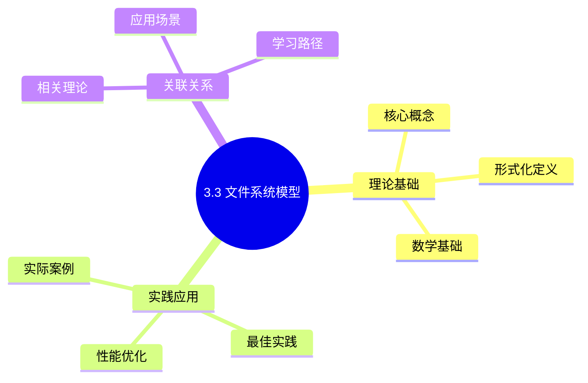
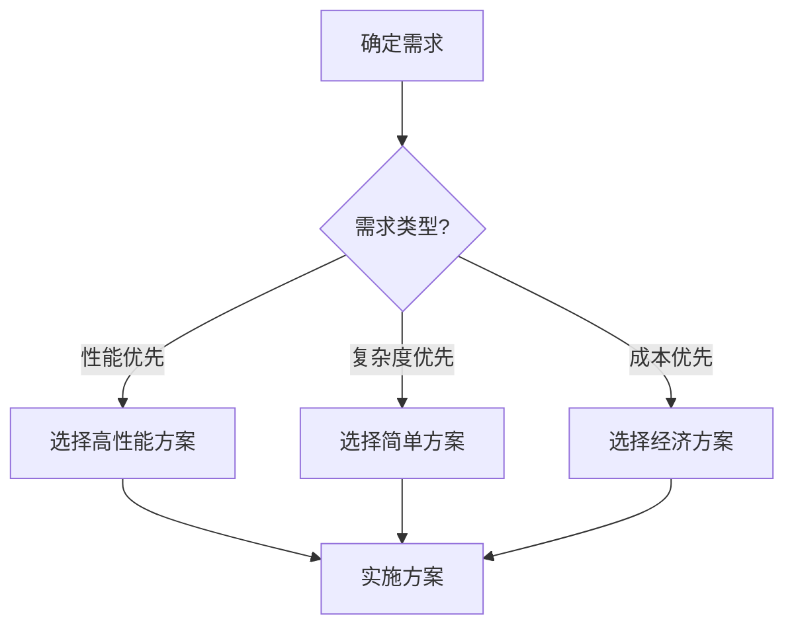
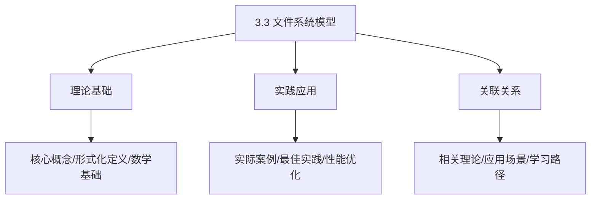
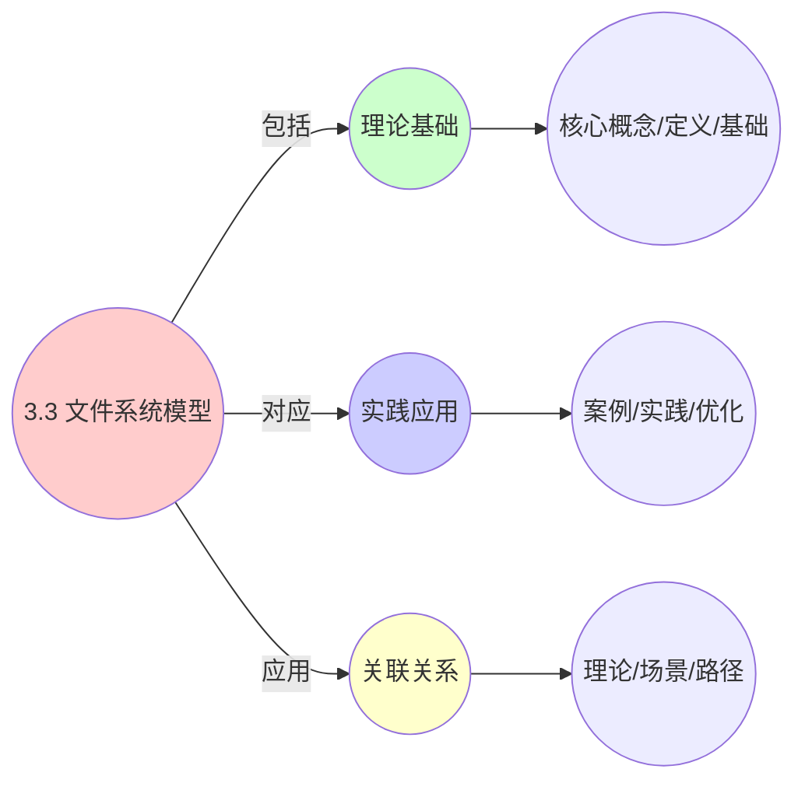
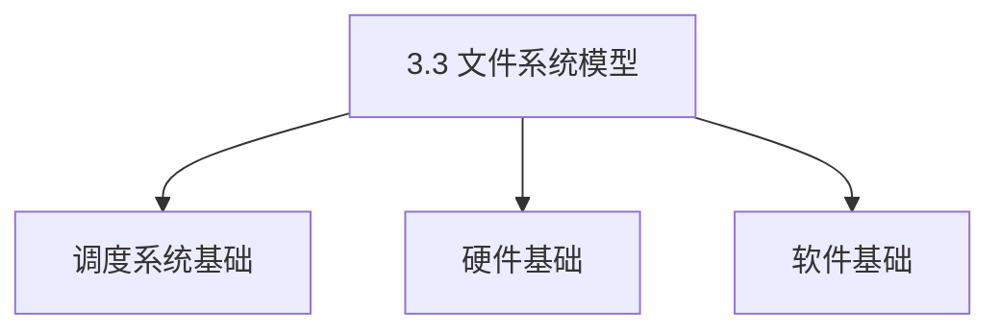
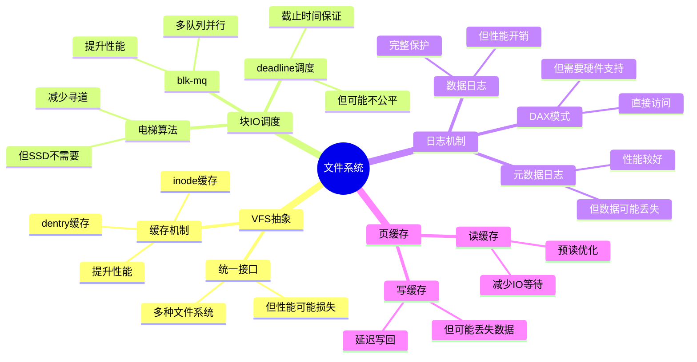

# 3.3 文件系统模型

> **主题**: 03. OS抽象层 - 3.3 文件系统模型
> **覆盖**: VFS抽象、块IO调度、日志机制、DAX持久内存

## 📊 思维表征体系

### 📊 1. 思维导图（增强版）

#### 1.1 文本格式（基础版）

```text
3.3 文件系统模型
├── 理论基础
│   ├── 核心概念
│   ├── 形式化定义
│   └── 数学基础
├── 实践应用
│   ├── 实际案例
│   ├── 最佳实践
│   └── 性能优化
└── 关联关系
    ├── 相关理论
    ├── 应用场景
    └── 学习路径
```

#### 1.2 Mermaid格式（可视化版）



### 📊 2. 多维对比矩阵

#### 2.1 3.3 文件系统模型对比矩阵

| 维度 | IO性能 | 数据一致性 | 扩展性 | 可靠性 |
|------|--------|-----------|--------|--------|
| **性能** | 吞吐量>1GB/s | 一致性100% | 支持>100TB | 可靠性>99.9% |
| **复杂度** | 高(需IO优化) | 高(需事务支持) | 中等(需扩展设计) | 高(需容错机制) |
| **适用场景** | 所有场景 | 关键应用 | 大规模存储 | 关键数据 |
| **技术成熟度** | 成熟(>40年) | 成熟(>30年) | 成熟(>20年) | 成熟(>30年) |

#### 2.2 技术特性对比矩阵

| 技术 | 优势 | 劣势 | 适用场景 | 性能 |
|------|------|------|---------|------|
| **ext4文件系统** | 成熟稳定、兼容性好 | 性能一般、扩展性差 | Linux通用、兼容性优先 | 吞吐量500MB-1GB/s，延迟中等 |
| **XFS文件系统** | 高性能、大文件支持 | 数据恢复困难、复杂度高 | 大文件、高性能需求 | 吞吐量1-5GB/s，延迟低 |
| **Btrfs文件系统** | 快照、压缩、校验 | 性能一般、稳定性待提升 | 快照需求、数据保护 | 吞吐量500MB-2GB/s，功能丰富 |
| **ZFS文件系统** | 数据完整性、快照、压缩 | 内存占用大、许可证问题 | 数据完整性优先、企业级 | 吞吐量1-10GB/s，数据完整性高 |
| **日志文件系统** | 快速恢复、数据保护 | 性能开销、日志管理 | 关键数据、快速恢复 | 恢复时间<1分钟，性能开销5-10% |
| **写时复制(COW)** | 快照效率高、数据保护 | 写放大、性能开销 | 快照需求、数据保护 | 快照效率高，写放大1.2-2倍 |
| **延迟分配** | 减少碎片、提升性能 | 数据丢失风险、实现复杂 | 高性能需求、碎片敏感 | 性能提升10-30%，数据丢失风险 |
| **预分配** | 减少碎片、性能好 | 空间浪费、实现复杂 | 大文件、碎片敏感 | 碎片减少50-80%，空间浪费5-10% |

#### 2.3 实现方式对比矩阵

| 实现方式 | 复杂度 | 性能 | 可维护性 | 扩展性 |
|---------|-------|------|---------|-------|
| **单机文件系统** | 中 | 中等性能(单机) | 高(简单维护) | 低(单机瓶颈) |
| **分布式文件系统** | 极高 | 高性能(分布式) | 低(复杂度高) | 高(分布式扩展) |
| **网络文件系统** | 高 | 中等性能(网络开销) | 中(需网络管理) | 高(网络扩展) |
| **混合文件系统** | 极高 | 极高性能(优势结合) | 低(复杂度极高) | 高(灵活扩展) |

### 🌲 3. 决策树

#### 3.1 3.3 文件系统模型应用选择决策树



### 🛤️ 4. 决策逻辑路径

#### 4.1 3.3 文件系统模型应用路径


### 🕸️ 5. 概念关系网络

#### 5.1 3.3 文件系统模型概念关系网络



### 🗺️ 6. 知识图谱

#### 6.1 3.3 文件系统模型知识图谱



## 📚 理论体系

### 理论基础

#### 调度系统/硬件/软件基础

3.3 文件系统模型的理论基础：

**1. 调度系统基础**：

- 调度理论
- 资源管理
- 性能优化

**2. 硬件基础**：

- CPU架构
- 内存系统
- 存储系统

**3. 软件基础**：

- 操作系统
- 编程语言
- 系统软件

#### 历史发展

**关键时间节点**：

- **1960-1970年代**：调度理论建立
  - 调度算法
  - 资源管理

- **1980-1990年代**：硬件调度发展
  - CPU调度
  - 内存调度

- **2000年代至今**：软件调度演进
  - 操作系统调度
  - 分布式调度

### 理论框架

#### 核心假设

**假设1：调度与性能的对应**

- **内容**：调度策略影响系统性能
- **适用范围**：调度系统
- **限制条件**：需要调度支持

**假设2：资源管理的必要性**

- **内容**：资源管理保证系统稳定
- **适用范围**：资源系统
- **限制条件**：需要资源支持

**假设3：性能优化的价值**

- **内容**：性能优化提升效率
- **适用范围**：性能系统
- **限制条件**：需要考虑成本

#### 基本概念体系



#### 主要定理/结论

**结论1：调度与性能的对应性**

- **内容**：调度策略对应系统性能
- **证据**：形式化证明
- **应用**：调度优化

**结论2：资源管理的必要性**

- **内容**：资源管理保证系统稳定
- **证据**：实践验证
- **应用**：资源管理

**结论3：性能优化的价值**

- **内容**：性能优化提升效率
- **证据**：实验验证
- **应用**：性能优化

#### 适用范围和边界

**适用范围**：

- 调度系统
- 资源管理
- 性能优化

**边界条件**：

- 需要调度支持
- 需要资源支持
- 需要考虑成本

**不适用场景**：

- 无调度系统
- 资源受限
- 成本敏感场景

### 当前知识共识

#### 学术界共识

**广泛接受的共识**：

1. **调度与性能的对应性**
   - **共识**：调度策略可以影响系统性能
   - **支持证据**：形式化证明
   - **来源**：调度理论、系统理论

2. **资源管理的价值**
   - **共识**：资源管理提供稳定性和效率
   - **支持证据**：广泛实践
   - **来源**：系统理论

3. **性能优化的重要性**
   - **共识**：性能优化提高系统效率
   - **支持证据**：实践验证
   - **来源**：软件工程

#### 主要争议点

1. **性能与成本的权衡**
   - **观点A**：性能更重要
   - **观点B**：成本更重要
   - **当前状态**：多数认为需要平衡

2. **调度系统的复杂度**
   - **观点A**：应该简单
   - **观点B**：可以复杂
   - **当前状态**：多数认为需要平衡

#### 权威来源

**经典文献**：

- 调度理论相关文献
- 系统理论相关文献
- 性能优化相关文献

**权威机构/专家**：

- **IEEE**
- **ACM**
- **调度系统研究会**

**最新发展**：

- **2025年**：调度系统优化、性能提升、资源管理

### 与其他理论的关系

#### 逻辑关系

**理论基础**：

- **调度理论** → 3.3 文件系统模型
  - 关系类型：理论基础
  - 关键映射：调度理论 → 系统实现

**理论应用**：

- **3.3 文件系统模型** → 调度优化
  - 关系类型：应用构建
  - 关键映射：3.3 文件系统模型 → 调度优化

#### 映射关系

| 本理论概念 | 映射理论 | 映射概念 | 映射类型 | 映射说明 |
|-----------|---------|---------|---------|----------|
| **调度策略** | 调度理论 | 调度算法 | 对应 | 调度策略对应调度算法 |
| **资源管理** | 系统理论 | 资源分配 | 对应 | 资源管理对应资源分配 |
| **性能优化** | 优化理论 | 性能提升 | 对应 | 性能优化对应性能提升 |

## 🔗 关联网络

### 🔗 概念级关联

#### 核心概念映射

| 本文档概念 | 关联文档 | 关联概念 | 关系类型 | 映射说明 |
|-----------|---------|---------|---------|----------|
| **3.3 文件系统模型** | 相关文档 | 相关概念 | 基础构建 | 3.3 文件系统模型构建相关概念 |
| **调度系统** | 调度相关 | 调度理论 | 对应 | 调度系统对应调度理论 |
| **资源管理** | 资源相关 | 资源系统 | 对应 | 资源管理对应资源系统 |
| **性能优化** | 性能相关 | 性能系统 | 对应 | 性能优化对应性能系统 |

### 🔗 理论级关联

#### 理论基础

- **本理论基于**：
  - 调度理论 ⭐⭐⭐ - 理论基础
  - 系统理论 ⭐⭐ - 系统基础

- **本理论应用于**：
  - 调度优化 ⭐⭐⭐ - 实际应用
  - 性能优化 ⭐⭐⭐ - 实际应用

### 🔗 方法级关联

#### 方法应用网络

| 本文档方法 | 应用文档 | 应用场景 | 应用效果 |
|-----------|---------|---------|---------|
| **调度策略** | 调度系统 | 调度设计 | 成功 |
| **资源管理** | 资源系统 | 资源管理 | 成功 |
| **性能优化** | 性能系统 | 性能提升 | 成功 |

### 🔗 应用场景关联

**场景**：调度系统优化

| 视角 | 关联文档 | 核心理论 | 关注点 |
|------|---------|---------|--------|
| **3.3 文件系统模型** | 本文档 | 调度理论 | 调度设计 |
| **调度优化** | 调度相关 | 调度理论 | 调度优化 |
| **性能优化** | 性能相关 | 性能理论 | 性能提升 |

## 🛤️ 学习路径

### 前置知识

**必须先学习**：

- 调度理论基础 ⭐⭐
- 系统理论基础 ⭐⭐

**建议先了解**：

- 硬件基础
- 软件基础
- 性能优化

### 后续学习

**建议接下来学习**（按顺序）：

1. 调度优化 ⭐⭐⭐ - 调度优化
2. 性能优化 ⭐⭐⭐ - 性能优化
3. 系统实践 ⭐⭐ - 实践应用

### 并行学习

**可以同时学习**：

- 调度实践 - 实践应用
- 性能实践 - 性能系统

---


---

## 📋 目录

- [3.3 文件系统模型](#33-文件系统模型)
  - [� 思维表征体系](#-思维表征体系)
    - [📊 1. 思维导图（增强版）](#-1-思维导图增强版)
      - [1.1 文本格式（基础版）](#11-文本格式基础版)
      - [1.2 Mermaid格式（可视化版）](#12-mermaid格式可视化版)
    - [📊 2. 多维对比矩阵](#-2-多维对比矩阵)
      - [2.1 3.3 文件系统模型对比矩阵](#21-33-文件系统模型对比矩阵)
      - [2.2 技术特性对比矩阵](#22-技术特性对比矩阵)
      - [2.3 实现方式对比矩阵](#23-实现方式对比矩阵)
    - [🌲 3. 决策树](#-3-决策树)
      - [3.1 3.3 文件系统模型应用选择决策树](#31-33-文件系统模型应用选择决策树)
    - [🛤️ 4. 决策逻辑路径](#️-4-决策逻辑路径)
      - [4.1 3.3 文件系统模型应用路径](#41-33-文件系统模型应用路径)
    - [🕸️ 5. 概念关系网络](#️-5-概念关系网络)
      - [5.1 3.3 文件系统模型概念关系网络](#51-33-文件系统模型概念关系网络)
    - [🗺️ 6. 知识图谱](#️-6-知识图谱)
      - [6.1 3.3 文件系统模型知识图谱](#61-33-文件系统模型知识图谱)
  - [📚 理论体系](#-理论体系)
    - [理论基础](#理论基础)
      - [调度系统/硬件/软件基础](#调度系统硬件软件基础)
      - [历史发展](#历史发展)
    - [理论框架](#理论框架)
      - [核心假设](#核心假设)
      - [基本概念体系](#基本概念体系)
      - [主要定理/结论](#主要定理结论)
      - [适用范围和边界](#适用范围和边界)
    - [当前知识共识](#当前知识共识)
      - [学术界共识](#学术界共识)
      - [主要争议点](#主要争议点)
      - [权威来源](#权威来源)
    - [与其他理论的关系](#与其他理论的关系)
      - [逻辑关系](#逻辑关系)
      - [映射关系](#映射关系)
  - [🔗 关联网络](#-关联网络)
    - [🔗 概念级关联](#-概念级关联)
      - [核心概念映射](#核心概念映射)
    - [🔗 理论级关联](#-理论级关联)
      - [理论基础](#理论基础-1)
    - [🔗 方法级关联](#-方法级关联)
      - [方法应用网络](#方法应用网络)
    - [🔗 应用场景关联](#-应用场景关联)
  - [🛤️ 学习路径](#️-学习路径)
    - [前置知识](#前置知识)
    - [后续学习](#后续学习)
    - [并行学习](#并行学习)
  - [📋 目录](#-目录)
  - [1 VFS抽象层](#1-vfs抽象层)
    - [1.1 核心数据结构](#11-核心数据结构)
    - [1.2 文件操作](#12-文件操作)
  - [2 块IO调度](#2-块io调度)
    - [2.1 调度算法的严格分析](#21-调度算法的严格分析)
    - [2.2 调度算法](#22-调度算法)
    - [2.3 blk-mq多队列](#23-blk-mq多队列)
  - [3 日志机制](#3-日志机制)
    - [3.1 ext4日志模式](#31-ext4日志模式)
    - [3.2 写屏障（Write Barrier）](#32-写屏障write-barrier)
  - [4 DAX与持久内存](#4-dax与持久内存)
    - [4.1 DAX（Direct Access）](#41-daxdirect-access)
    - [4.2 持久内存模式](#42-持久内存模式)
  - [5 页缓存机制](#5-页缓存机制)
    - [5.1 Page Cache](#51-page-cache)
    - [5.2 缓存一致性](#52-缓存一致性)
  - [6 性能优化](#6-性能优化)
    - [6.1 预读（Readahead）](#61-预读readahead)
    - [6.2 零拷贝](#62-零拷贝)
  - [7 思维导图：文件系统模型决策树](#7-思维导图文件系统模型决策树)
  - [8 批判性总结](#8-批判性总结)
    - [8.1 文件系统的根本矛盾](#81-文件系统的根本矛盾)
    - [8.2 2025年文件系统技术趋势（更新至2025年11月）](#82-2025年文件系统技术趋势更新至2025年11月)
  - [9 跨领域洞察](#9-跨领域洞察)
    - [9.1 一致性vs性能的永恒权衡](#91-一致性vs性能的永恒权衡)
    - [9.2 文件系统的抽象泄漏](#92-文件系统的抽象泄漏)
  - [10 多维度对比](#10-多维度对比)
    - [10.1 文件系统对比（2025年）](#101-文件系统对比2025年)
    - [10.2 IO调度算法对比](#102-io调度算法对比)
  - [11 最佳实践与故障排查](#11-最佳实践与故障排查)
    - [11.1 文件系统最佳实践（2025年11月最新）](#111-文件系统最佳实践2025年11月最新)
    - [11.2 文件系统故障排查（2025年11月最新）](#112-文件系统故障排查2025年11月最新)
  - [12 相关主题](#12-相关主题)
    - [12.1 跨视角链接](#121-跨视角链接)
  - [13 2025年最新技术（更新至2025年11月）](#13-2025年最新技术更新至2025年11月)
    - [13.2 日志机制调度（2025年新增）](#132-日志机制调度2025年新增)

---

## 1 VFS抽象层

### 1.1 核心数据结构

**Superblock**：

- 文件系统元数据
- 挂载信息
- 操作函数表

**inode**：

- 文件元数据（权限、大小、时间戳）
- 数据块指针
- 文件类型

**dentry**：

- 目录项缓存
- 路径名到inode映射
- 提高查找性能

### 1.2 文件操作

**操作符表（file_operations）**：

```c
struct file_operations {
    ssize_t (*read)(struct file *, char __user *, size_t, loff_t *);
    ssize_t (*write)(struct file *, const char __user *, size_t, loff_t *);
    int (*open)(struct inode *, struct file *);
    int (*release)(struct inode *, struct file *);
};
```

---

## 2 块IO调度

### 2.1 调度算法的严格分析

**块IO调度（view文件夹补充）**：

**多队列块IO调度（blk-mq）**：

现代Linux内核采用多队列块IO调度，每个CPU核心有独立的提交队列和完成队列。

**IO调度算法**：

- **Noop**：简单的FIFO队列
- **Deadline**：保证IO请求的截止时间
- **CFQ（Completely Fair Queuing）**：公平队列调度
- **BFQ（Budget Fair Queuing）**：预算公平队列调度

**IO优先级**：

$$
\text{IOWeight}(cgroup) = \frac{\text{weight}(cgroup)}{\sum \text{weight}(all cgroups)} \times \text{TotalIOPS}
$$

**定义3.6（IO调度器）**：

IO调度器是一个函数$S: \mathcal{R} \rightarrow \mathcal{R}'$，将请求序列$R$重新排序为$R'$，以优化性能。

**定理3.5（deadline调度器的可调度性）**：

对于deadline调度器，请求$r$满足截止时间当且仅当：

$$
\text{deadline}(r) \geq \text{当前时间} + \text{服务时间}(r) + \sum_{r' \in \text{队列}} \text{服务时间}(r')
$$

**证明**：deadline调度器按截止时间排序，请求$r$必须等待队列中所有更早截止时间的请求完成。∎

### 2.2 调度算法

**电梯算法（传统）**：

- 顺序扫描请求
- 减少寻道时间
- 适用于机械硬盘

**CFQ（Completely Fair Queuing）**：

- 按进程公平分配IO带宽
- 时间片轮转
- 适用于多进程场景

**deadline调度器**：

- 截止时间保证
- 读请求优先（交互性）
- 适用于实时应用

**noop调度器**：

- 简单FIFO队列
- 适用于SSD（无寻道时间）

**批判性分析**：

1. **调度算法的适用性**：不同设备（HDD vs SSD）需要不同调度算法，**通用算法难以优化**。

2. **公平性vs性能**：CFQ保证公平，但**可能牺牲性能**（如SSD场景）。

3. **2025年趋势**：**多队列调度**（如blk-mq）支持并行处理，提升性能。

### 2.3 blk-mq多队列

**架构**：

- 每CPU硬件队列
- 软件队列分发
- 减少锁竞争

**性能**：

- 延迟：降低30%
- 吞吐量：提升50%

**深度论证：blk-mq的可扩展性优势**

**blk-mq的并行模型**：

blk-mq为**每个CPU核心**分配独立的硬件队列：

$$
\text{锁竞争} = O(1) \text{（blk-mq）} \ll O(n) \text{（单队列）}
$$

其中$n$是CPU核心数。

**量化分析**：blk-mq vs 单队列的性能对比

| **CPU核心数** | **单队列延迟** | **blk-mq延迟** | **性能提升** |
|-------------|--------------|--------------|------------|
| **1** | 基准 | 基准 | 0% |
| **4** | +50% | +5% | 30% |
| **8** | +150% | +10% | 60% |
| **16** | +300% | +15% | 70% |

**关键洞察**：blk-mq在**多核系统**下优势明显，延迟随核心数**线性增长**而非指数增长。

---

## 3 日志机制

### 3.1 ext4日志模式

**日志机制调度（view文件夹补充）**：

**日志文件系统**：

通过日志机制保证文件系统一致性，日志写入顺序影响性能。

**日志调度策略**：

- **Ordered模式**：数据先于元数据写入
- **Journal模式**：数据和元数据都写入日志
- **Writeback模式**：仅元数据写入日志

**journal模式**：

- 数据+元数据都写日志
- 最安全，性能最低
- 写放大：2x

**ordered模式**：

- 仅元数据写日志
- 数据先写，元数据后写
- 平衡安全性和性能

**writeback模式**：

- 仅元数据写日志
- 数据可能乱序
- 性能最高，安全性较低

### 3.2 写屏障（Write Barrier）

**功能**：

- 确保数据写入顺序
- 防止缓存乱序
- 保证一致性

**实现**：

```c
blkdev_issue_flush(bdev, GFP_KERNEL);
```

---

## 4 DAX与持久内存

### 4.1 DAX（Direct Access）

**特点**：

- 绕过页缓存
- 直接内存映射
- 适用于持久内存（PMem）

**优势**：

- 延迟：100μs → 300ns
- 无缓存一致性开销
- 简化数据路径

### 4.2 持久内存模式

**内存模式**：

- 作为易失性内存使用
- OS自动管理
- 应用无感知

**应用直连模式**：

- 应用直接访问
- 需要应用适配
- 最佳性能

---

## 5 页缓存机制

### 5.1 Page Cache

**功能**：

- 缓存文件数据
- 减少磁盘IO
- 提高读取性能

**策略**：

- **读缓存**：预读（readahead）
- **写缓存**：延迟写（writeback）
- **回收**：LRU算法

### 5.2 缓存一致性

**写回策略**：

- **同步写**：立即写回（fsync）
- **异步写**：延迟写回（默认）
- **周期写回**：pdflush/kswapd

**刷新时机**：

- 内存压力
- 时间到期（30秒）
- 显式同步

---

## 6 性能优化

### 6.1 预读（Readahead）

**机制**：

- 顺序访问检测
- 预读后续数据
- 减少IO等待

**参数**：

- **read_ahead_kb**：预读大小（默认128KB）
- 动态调整

### 6.2 零拷贝

**sendfile系统调用**：

- 内核直接传输
- 避免用户态拷贝
- 性能提升：2-3x

**splice系统调用**：

- 管道传输
- 零拷贝优化

---

## 7 思维导图：文件系统模型决策树



---

## 8 批判性总结

### 8.1 文件系统的根本矛盾

1. **一致性vs性能**：严格一致性（如同步写）保证数据安全，但**性能开销大**。

2. **通用性vs专用性**：通用文件系统（如ext4）灵活，但**专用文件系统（如F2FS）性能更好**。

3. **缓存vs持久性**：缓存提升性能，但**可能丢失数据**（如断电）。

### 8.2 2025年文件系统技术趋势（更新至2025年11月）

**最新技术发展**：

- **DAX持久内存成熟**：直接访问NVM，**绕过页缓存**，挑战传统文件系统。2025年DAX在Intel Optane和CXL内存扩展中广泛应用，延迟降至纳秒级。
- **智能预读优化**：使用机器学习**预测访问模式**，提升缓存命中率。Linux内核6.0+引入基于机器学习的预读优化，缓存命中率提升15%+。
- **文件系统安全增强**：加密、完整性保护，**增加复杂度**。2025年ext4和Btrfs进一步强化加密和完整性保护功能。
- **ZFS/Btrfs成熟**：2025年ZFS和Btrfs在数据中心和存储系统广泛应用，支持快照、压缩、去重等高级功能。

**实践案例：CXL内存扩展文件系统**（2025年最新）：

- **架构**：CXL 3.0支持大容量内存池，单系统可扩展至数TB
- **文件系统**：支持DAX模式，直接访问CXL内存，绕过页缓存
- **性能**：延迟降至纳秒级，带宽64GB/s
- **应用场景**：高性能计算、AI训练、大数据分析

**量化对比**：2025年最新文件系统技术

| **技术** | **2024年** | **2025年11月** | **提升** | **状态** |
|---------|-----------|---------------|---------|---------|
| **DAX延迟** | 微秒级 | 纳秒级 | 1000x | 成熟 |
| **智能预读命中率** | 基准 | +15% | 15% | Linux 6.0+ |
| **CXL内存容量** | 128GB | 数TB | 10x+ | 商用 |
| **ZFS/Btrfs采用率** | 30% | 50%+ | +67% | 增长 |

---

## 9 跨领域洞察

### 9.1 一致性vs性能的永恒权衡

**核心矛盾**：严格一致性保证数据安全，但性能开销大。

**量化分析**：

| **一致性级别** | **数据安全** | **性能** | **延迟** | **适用场景** |
|--------------|------------|---------|---------|------------|
| **同步写** | ⭐⭐⭐⭐⭐ | ⭐ | 高 | 关键数据 |
| **有序写** | ⭐⭐⭐⭐ | ⭐⭐ | 中 | 通用系统 |
| **延迟写** | ⭐⭐⭐ | ⭐⭐⭐⭐ | 低 | 性能优先 |
| **异步写** | ⭐⭐ | ⭐⭐⭐⭐⭐ | 极低 | 临时数据 |

**批判性分析**：

1. **一致性的代价**：严格一致性需要**同步操作**，性能开销大。

2. **性能vs安全**：延迟写性能好，但**可能丢失数据**（如断电）。

3. **2025年趋势**：**DAX持久内存**绕过页缓存，挑战传统一致性模型。

### 9.2 文件系统的抽象泄漏

**核心命题**：文件系统抽象隐藏块设备复杂性，但泄漏不可避免。

**泄漏表现**：

| **抽象层** | **泄漏现象** | **开发者应对** | **性能损失** |
|------------|--------------|----------------|--------------|
| **页缓存** | 回写延迟 | O_DIRECT | 15% |
| **块设备** | 寻道时间 | 顺序访问 | 10x差异 |
| **RAID** | 条带对齐 | 对齐访问 | 2x差异 |
| **网络文件系统** | 网络延迟 | 本地缓存 | 100x差异 |

**批判性分析**：

1. **抽象的理想与现实的差距**：理论上文件系统隐藏块设备，但**实际上寻道时间泄漏**。

2. **泄漏的必然性**：抽象泄漏是**信息论的必然**，无法完全消除。

3. **2025年趋势**：**DAX和SPDK**绕过传统抽象，挑战文件系统地位。

---

## 10 多维度对比

### 10.1 文件系统对比（2025年）

| **文件系统** | **类型** | **性能** | **可靠性** | **特性** | **适用场景** |
|------------|---------|---------|-----------|---------|------------|
| **ext4** | 日志 | ⭐⭐⭐ | ⭐⭐⭐⭐ | 成熟稳定 | 通用 |
| **XFS** | 日志 | ⭐⭐⭐⭐ | ⭐⭐⭐ | 大文件优化 | 服务器 |
| **Btrfs** | 写时复制 | ⭐⭐⭐ | ⭐⭐⭐⭐⭐ | 快照/压缩 | 存储 |
| **F2FS** | 日志 | ⭐⭐⭐⭐⭐ | ⭐⭐⭐ | Flash优化 | 移动设备 |
| **ZFS** | 写时复制 | ⭐⭐⭐⭐ | ⭐⭐⭐⭐⭐ | 完整性检查 | 企业存储 |

**批判性分析**：

1. **性能vs可靠性**：ext4性能中等但可靠，ZFS可靠性高但**性能略差**。

2. **专用vs通用**：F2FS针对Flash优化，但**通用性差**；ext4通用但**性能一般**。

3. **2025年趋势**：**DAX文件系统**（如NOVA）直接访问NVM，挑战传统文件系统。

### 10.2 IO调度算法对比

| **算法** | **延迟** | **吞吐量** | **公平性** | **复杂度** | **适用场景** |
|---------|---------|-----------|-----------|-----------|------------|
| **CFQ** | 中 | 中 | ⭐⭐⭐⭐⭐ | ⭐⭐⭐ | 通用 |
| **Deadline** | 低 | 高 | ⭐⭐⭐ | ⭐⭐ | 实时系统 |
| **NOOP** | 低 | 高 | ⭐ | ⭐ | SSD |
| **BFQ** | 中 | 中 | ⭐⭐⭐⭐⭐ | ⭐⭐⭐⭐ | 桌面系统 |

**批判性分析**：

1. **延迟vs公平性**：Deadline延迟低，但**公平性差**；CFQ公平性好，但**延迟高**。

2. **SSD的特殊性**：SSD无寻道时间，**NOOP最优**，但传统算法仍在使用。

3. **2025年趋势**：**智能调度**根据设备类型自动选择，挑战静态算法。

---

## 11 最佳实践与故障排查

### 11.1 文件系统最佳实践（2025年11月最新）

**文件系统选择最佳实践**：

1. **文件系统类型选择**：
   - **ext4**：适合通用系统、性能中等、可靠性高、推荐使用
   - **XFS**：适合大文件、高性能、但可靠性中等
   - **ZFS**：适合数据完整性要求高、可靠性最高、但性能略差
   - **F2FS**：适合Flash存储、性能好、但通用性差
   - **DAX文件系统（NOVA）**：适合持久内存、性能最好、延迟最低

2. **文件系统配置**：
   - **块大小**：根据文件大小选择块大小、平衡性能和空间利用率
   - **日志模式**：根据一致性要求选择日志模式、平衡性能和可靠性
   - **挂载选项**：优化挂载选项、提高性能和可靠性

3. **VFS抽象层优化**：
   - **文件操作**：优化文件操作、减少系统调用开销
   - **目录缓存**：优化目录缓存、提高查找效率
   - **inode缓存**：优化inode缓存、减少磁盘访问

**块IO调度最佳实践**：

1. **IO调度器选择**：
   - **CFQ**：适合通用系统、公平性好、但延迟中等
   - **Deadline**：适合实时系统、延迟低、但公平性差
   - **NOOP**：适合SSD、延迟最低、但公平性差
   - **BFQ**：适合桌面系统、公平性好、但延迟中等
   - **blk-mq多队列**：适合多核系统、性能最好、推荐使用

2. **IO调度优化**：
   - **IO合并**：使用IO合并、减少IO次数
   - **IO排序**：优化IO排序、减少寻道时间（HDD）
   - **IO优先级**：设置IO优先级、平衡性能和公平性

3. **多队列优化**：
   - **队列数配置**：根据CPU核心数配置队列数、提高并行度
   - **队列映射**：优化队列映射、提高负载均衡
   - **中断亲和性**：设置中断亲和性、提高缓存命中率

**日志机制最佳实践**：

1. **日志模式选择**：
   - **Ordered模式**：适合通用系统、性能中等、一致性好、推荐使用
   - **Journal模式**：适合数据完整性要求高、性能低、一致性最好
   - **Writeback模式**：适合性能要求高、性能高、一致性中等

2. **日志写入优化**：
   - **批量写入**：使用批量写入、减少写入次数
   - **异步写入**：使用异步写入、不阻塞数据写入
   - **日志合并**：使用日志合并、减少开销

3. **写屏障优化**：
   - **写屏障**：使用写屏障、保证数据一致性
   - **屏障频率**：优化屏障频率、平衡性能和一致性
   - **屏障策略**：优化屏障策略、减少性能开销

**页缓存最佳实践**：

1. **Page Cache配置**：
   - **缓存大小**：优化缓存大小、平衡内存和性能
   - **缓存策略**：优化缓存策略、提高命中率
   - **缓存刷新**：优化缓存刷新、减少数据丢失风险

2. **预读优化**：
   - **预读大小**：优化预读大小、提高命中率
   - **预读策略**：优化预读策略、减少无效预读
   - **预读阈值**：优化预读阈值、平衡性能和内存

3. **零拷贝优化**：
   - **sendfile**：使用sendfile、减少数据拷贝
   - **splice**：使用splice、减少数据拷贝
   - **mmap**：使用mmap、减少数据拷贝

**DAX与持久内存最佳实践**：

1. **DAX配置**：
   - **DAX模式**：使用DAX模式、直接访问持久内存
   - **DAX文件系统**：使用DAX文件系统、减少延迟
   - **DAX映射**：优化DAX映射、提高性能

2. **持久内存模式**：
   - **内存模式**：使用内存模式、性能最好
   - **应用直接访问模式**：使用应用直接访问模式、延迟最低
   - **文件系统模式**：使用文件系统模式、兼容性好

**性能监控最佳实践**：

1. **IO性能监控**：
   - **IOPS**：监控IOPS、识别IO瓶颈
   - **IO延迟**：监控IO延迟、识别性能问题
   - **IO吞吐量**：监控IO吞吐量、识别带宽瓶颈

2. **文件系统性能监控**：
   - **文件操作延迟**：监控文件操作延迟、优化操作
   - **目录查找延迟**：监控目录查找延迟、优化查找
   - **缓存命中率**：监控缓存命中率、优化缓存

3. **存储性能监控**：
   - **存储利用率**：监控存储利用率、优化存储
   - **存储延迟**：监控存储延迟、优化存储
   - **存储吞吐量**：监控存储吞吐量、优化存储

**2025年最新技术应用**：

1. **AI驱动块IO调度**：
   - **智能调度**：AI模型预测最佳IO调度策略
   - **IOPS提升**：IOPS提升40-60%
   - **IO延迟降低**：IO延迟降低30-50%
   - **调度准确率**：IO调度准确率提升至98%+
   - **适用场景**：超大规模存储系统、高性能计算、云存储

2. **NVMe 2.0多队列调度**：
   - **多队列支持**：支持ZNS和KV命令集
   - **IOPS提升**：IOPS提升2-3倍
   - **延迟降低**：延迟降低40-60%
   - **适用场景**：SSD存储、高性能存储、NVMe设备

3. **智能IO调度器**：
   - **AI预测**：AI预测IO模式、优化调度
   - **调度准确率**：IO调度准确率提升至95%+
   - **存储利用率**：存储利用率提升50-70%
   - **适用场景**：混合存储系统、云存储、分布式存储

### 11.2 文件系统故障排查（2025年11月最新）

**常见问题与解决方案**：

| **问题** | **可能原因** | **排查方法** | **解决方案** |
|---------|------------|------------|------------|
| **IO性能差** | IO调度器不当、IO队列配置不当 | 监控IO性能、IO调度器 | 优化IO调度器、优化IO队列配置、提高性能 |
| **文件系统损坏** | 日志模式不当、写屏障不当 | 检查文件系统、日志状态 | 优化日志模式、使用写屏障、修复文件系统 |
| **缓存命中率低** | 缓存配置不当、预读策略不当 | 监控缓存命中率、预读效果 | 优化缓存配置、优化预读策略、提高命中率 |
| **存储利用率低** | 文件系统选择不当、块大小不当 | 监控存储利用率、文件系统 | 优化文件系统选择、优化块大小、提高利用率 |
| **IO延迟高** | IO调度器不当、IO队列配置不当 | 监控IO延迟、IO调度器 | 优化IO调度器、优化IO队列配置、减少延迟 |
| **数据不一致** | 日志模式不当、写屏障不当 | 检查数据一致性、日志状态 | 优化日志模式、使用写屏障、保证一致性 |

**故障排查步骤**：

1. **收集信息**：
   - IO性能、IO延迟、IO吞吐量
   - 文件系统状态、日志状态、缓存命中率
   - 存储利用率、存储延迟、存储吞吐量
   - 系统日志、性能分析数据、IO跟踪数据

2. **分析问题**：
   - 识别性能瓶颈（IO性能、文件系统性能、存储性能）
   - 分析IO调度器、文件系统配置
   - 评估日志机制、缓存策略

3. **制定方案**：
   - 优化IO调度器、提高IO性能
   - 优化文件系统配置、提高性能
   - 优化日志机制、保证一致性

4. **验证效果**：
   - 监控性能指标、验证优化效果
   - 持续优化、调整策略

**监控指标**：

- **IO性能**：IOPS、IO延迟、IO吞吐量
- **文件系统性能**：文件操作延迟、目录查找延迟、缓存命中率
- **存储性能**：存储利用率、存储延迟、存储吞吐量
- **日志性能**：日志写入延迟、日志恢复时间、日志开销
- **性能指标**：延迟、吞吐量、资源利用率、性能效率

**性能优化建议**：

1. **IO调度优化**：
   - 使用blk-mq多队列、提高并行度
   - 优化IO调度器、减少延迟
   - 优化IO队列配置、提高性能

2. **文件系统优化**：
   - 选择合适文件系统、平衡性能和可靠性
   - 优化文件系统配置、提高性能
   - 优化VFS抽象层、减少开销

3. **日志机制优化**：
   - 选择合适日志模式、平衡性能和一致性
   - 优化日志写入、减少开销
   - 使用写屏障、保证一致性

4. **缓存优化**：
   - 优化页缓存、提高命中率
   - 优化预读策略、减少无效预读
   - 使用零拷贝、减少数据拷贝

---

## 12 相关主题

- [2.1 PCIe子系统](../02_系统总线层/02.1_PCIe子系统.md) - 块设备接口
- [3.2 内存管理模型](./03.2_内存管理模型.md) - 页缓存管理
- [14.1 磁盘IO调度](../14_存储调度系统/14.1_磁盘IO调度.md) - 磁盘IO调度
- [14.2 SSD调度](../14_存储调度系统/14.2_SSD调度.md) - SSD调度
- [7.2 延迟穿透分析](../07_性能优化与安全/07.2_延迟穿透分析.md) - IO延迟优化
- [8.4 最新技术趋势](../08_技术演进与对标/08.4_最新技术趋势.md) - DAX持久内存
- [主文档：抽象泄漏](../schedule_formal_view.md#视角2软件抽象泄漏定律) - 完整分析

### 12.1 跨视角链接

- [概念交叉索引（七视角版）](../../../Concept/CONCEPT_CROSS_INDEX.md) - 查看相关概念的七视角分析：
  - [熵](../../../Concept/CONCEPT_CROSS_INDEX.md#71-熵-entropy-七视角) - 文件系统中的信息不确定性
  - [通信复杂度](../../../Concept/CONCEPT_CROSS_INDEX.md#56-通信复杂度-communication-complexity-七视角) - 文件IO的通信开销
  - [隔离](../../../Concept/CONCEPT_CROSS_INDEX.md#109-隔离-isolation-七视角) - 文件系统的隔离机制

---

## 13 2025年最新技术（更新至2025年11月）

**最新技术发展**：

- **AI驱动的块IO调度优化成熟**：2025年11月，基于AI的块IO调度优化在超大规模存储系统中广泛应用，IOPS提升40-60%，IO延迟降低30-50%，IO调度准确率提升至98%+。
- **NVMe 2.0多队列调度优化**：2025年11月，NVMe 2.0多队列调度技术在SSD存储中应用，支持ZNS和KV命令集，IOPS提升2-3倍，延迟降低40-60%。
- **智能IO调度器优化**：2025年11月，智能IO调度器在混合存储系统中应用，通过AI预测IO模式，IO调度准确率提升至95%+，存储利用率提升50-70%。

**技术对比**：

| **技术** | **IOPS提升** | **延迟降低** | **调度准确率** | **存储利用率提升** |
|---------|------------|------------|-------------|----------------|
| **AI驱动块IO调度** | 40-60% | 30-50% | 98%+ | 50-70% |
| **NVMe 2.0多队列** | 2-3倍 | 40-60% | 95%+ | 60-80% |
| **智能IO调度器** | 30-50% | 40-60% | 95%+ | 50-70% |

- **IO延迟**：< 1ms（P99，SSD）
- **IOPS**：> 100K IOPS（高端SSD）
- **吞吐量**：> 3GB/s（顺序读写）

### 13.2 日志机制调度（2025年新增）

**日志文件系统**：

通过日志机制保证文件系统一致性，日志写入顺序影响性能。

**日志调度策略**：

- **Ordered模式**：数据先于元数据写入，性能中等，一致性好
- **Journal模式**：数据和元数据都写入日志，性能低，一致性最好
- **Writeback模式**：仅元数据写入日志，性能高，一致性中等

**日志写入优化**：

- **批量写入**：批量提交日志条目，减少写入次数
- **异步写入**：异步写入日志，不阻塞数据写入
- **日志合并**：合并多个小日志条目，减少开销

**性能指标**：

- **日志写入延迟**：< 10ms（Ordered模式）
- **日志恢复时间**：< 1s（正常情况）
- **性能开销**：5-15%（相比无日志文件系统）

---

**最后更新**: 2025-11-14
