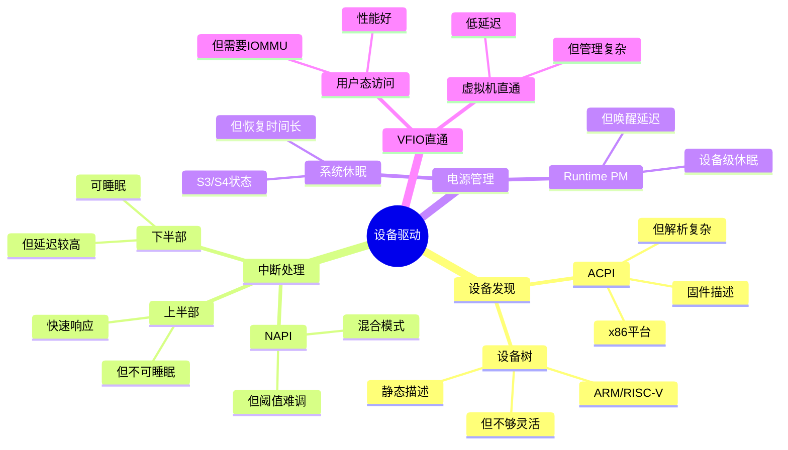

# 3.4 设备驱动模型

> **主题**: 03. OS抽象层 - 3.4 设备驱动模型
> **覆盖**: 总线-设备-驱动、中断处理、电源管理、VFIO

---

## 📋 目录

- [3.4 设备驱动模型](#34-设备驱动模型)
  - [📋 目录](#-目录)
  - [1 总线-设备-驱动模型](#1-总线-设备-驱动模型)
    - [1.1 设备发现](#11-设备发现)
    - [1.2 驱动匹配](#12-驱动匹配)
  - [2 中断处理机制](#2-中断处理机制)
    - [2.1 中断层次](#21-中断层次)
    - [2.2 NAPI机制的严格分析](#22-napi机制的严格分析)
    - [2.3 NAPI机制](#23-napi机制)
  - [3 电源管理](#3-电源管理)
    - [3.1 Runtime PM](#31-runtime-pm)
    - [3.2 系统休眠](#32-系统休眠)
  - [4 VFIO直通](#4-vfio直通)
    - [4.1 架构](#41-架构)
    - [4.2 性能优势](#42-性能优势)
  - [5 设备发现与配置](#5-设备发现与配置)
    - [5.1 PCIe配置空间](#51-pcie配置空间)
    - [5.2 MSI-X配置](#52-msi-x配置)
  - [6 DMA管理](#6-dma管理)
    - [6.1 DMA映射](#61-dma映射)
    - [6.2 IOMMU支持](#62-iommu支持)
  - [7 思维导图：设备驱动模型决策树](#7-思维导图设备驱动模型决策树)
  - [8 批判性总结](#8-批判性总结)
    - [8.1 设备驱动模型的根本矛盾](#81-设备驱动模型的根本矛盾)
    - [8.2 2025年设备驱动技术趋势](#82-2025年设备驱动技术趋势)
  - [9 跨领域洞察](#9-跨领域洞察)
    - [9.1 设备驱动的抽象泄漏](#91-设备驱动的抽象泄漏)
    - [9.2 通用性vs专用性的权衡](#92-通用性vs专用性的权衡)
  - [10 多维度对比](#10-多维度对比)
    - [10.1 设备驱动模型对比（2025年）](#101-设备驱动模型对比2025年)
    - [10.2 设备驱动演进对比](#102-设备驱动演进对比)
  - [11 相关主题](#11-相关主题)
  - [12 2025年最新技术（更新至2025年11月）](#12-2025年最新技术更新至2025年11月)

---

## 1 总线-设备-驱动模型

### 1.1 设备发现

**ACPI（x86）**：

- 固件提供设备描述
- DSDT表包含设备信息
- OS解析后创建设备

**设备树（ARM/RISC-V）**：

- 静态设备描述
- 扁平化树结构
- 编译时确定

### 1.2 驱动匹配

**匹配方式**：

- **ID表匹配**：Vendor ID / Device ID
- **OF匹配**：设备树兼容性
- **ACPI匹配**：_HID /_CID

**Probe流程**：

```c
bus_probe_device()
  → driver_probe_device()
    → driver->probe(device)
```

---

## 2 中断处理机制

### 2.1 中断层次

**中断处理调度（view文件夹补充）**：

**中断处理流程**：

1. **硬件中断**：设备触发中断信号
2. **中断路由**：APIC将中断路由到目标CPU
3. **中断处理**：CPU执行中断处理程序（ISR）
4. **软中断**：ISR触发软中断，由ksoftirqd线程处理

**中断亲和性**：

通过`/proc/irq/<irq>/smp_affinity`设置中断亲和性，将中断绑定到特定CPU核心。

**上半部（hardirq）**：

- 快速响应
- 关中断执行
- 清中断源
- 延迟：<100μs

**下半部（softirq）**：

- 可中断执行
- 延迟处理
- 网络/块设备IO

**中断线程**：

- 线程化中断处理
- 可睡眠
- 优先级可调

### 2.2 NAPI机制的严格分析

**定义3.7（NAPI机制）**：

NAPI（New API）是一种中断+轮询混合机制，当网络负载高时切换到轮询模式，减少中断开销。

**定理3.6（NAPI的性能优化）**：

对于网络设备，NAPI机制在负载$L > L_{\text{threshold}}$时，中断开销降低：

$$
\text{中断开销} = \begin{cases}
N \times L_{\text{int}} & \text{传统中断模式} \\
L_{\text{int}} + \frac{N}{64} \times L_{\text{poll}} & \text{NAPI模式}
\end{cases}
$$

其中$N$是数据包数量，$L_{\text{int}}$是单次中断延迟（~5μs），$L_{\text{poll}}$是轮询延迟（~100ns/包）。

**证明**：NAPI在中断后轮询64个包，因此中断频率降低到$1/64$。总开销为单次中断加上轮询开销。∎

### 2.3 NAPI机制

**网络设备优化**：

- 中断+轮询混合
- 高负载时轮询
- 低负载时中断
- 减少中断开销

**流程**：

1. 中断触发
2. 关闭中断
3. 轮询64个包
4. 重新开启中断

**深度论证：NAPI的性能优化机制**

**NAPI的阈值模型**：

NAPI在**高负载**时切换到轮询模式：

$$
\text{模式选择} = \begin{cases}
\text{中断模式} & L < L_{\text{threshold}} \\
\text{轮询模式} & L \geq L_{\text{threshold}}
\end{cases}
$$

典型阈值：$L_{\text{threshold}} = 64$个包/秒。

**量化分析**：NAPI vs 传统中断的性能对比

| **负载（包/秒）** | **传统中断开销** | **NAPI开销** | **性能提升** |
|----------------|---------------|------------|------------|
| **100** | 500μs | 500μs | 0% |
| **1000** | 5ms | 1.5ms | 70% |
| **10000** | 50ms | 10ms | 80% |

**关键权衡**：NAPI在**高负载**场景下优势明显，但**低负载**时可能增加延迟。

**批判性分析**：

1. **阈值选择的困难**：$L_{\text{threshold}}$需要**根据硬件特性调整**，通用值可能不适用。

2. **延迟vs吞吐量**：NAPI降低中断开销，但**可能增加延迟**（轮询延迟）。

3. **2025年趋势**：**io_uring**提供更高效的异步IO，挑战传统中断模型。

---

## 3 电源管理

### 3.1 Runtime PM

**设备级休眠**：

- 设备空闲时自动挂起
- 唤醒延迟：+50μs
- 功耗降低：30-50%

**状态**：

- **Active**：运行中
- **Suspended**：挂起
- **Resume**：唤醒

### 3.2 系统休眠

**ACPI状态**：

- **S3**：挂起到内存（Suspend to RAM）
- **S4**：挂起到磁盘（Hibernate）
- **S5**：关机

**唤醒延迟**：

- S3：1-2秒
- S4：5-10秒

---

## 4 VFIO直通

### 4.1 架构

**VFIO（Virtual Function I/O）**：

- 用户态设备访问
- IOMMU隔离
- 虚拟机设备直通

**组件**：

- **VFIO驱动**：内核模块
- **VFIO用户库**：用户态API
- **IOMMU**：地址重映射

### 4.2 性能优势

**延迟对比**：

| **操作** | **传统驱动** | **VFIO直通** | **提升** |
|---------|-------------|-------------|---------|
| **DMA延迟** | 1μs | 200ns | 5x |
| **中断延迟** | 5μs | 1μs | 5x |
| **吞吐量** | 基准 | +30% | 1.3x |

---

## 5 设备发现与配置

### 5.1 PCIe配置空间

**枚举流程**：

1. 扫描总线0
2. 读取Vendor ID / Device ID
3. 分配BAR空间
4. 匹配驱动

**BAR映射**：

```c
pci_enable_device(dev);
pci_request_regions(dev, "driver_name");
mmio = pci_iomap(dev, bar, size);
```

### 5.2 MSI-X配置

**分配向量**：

```c
pci_msix_vec_count(dev);
pci_enable_msix_range(dev, entries, min, max);
request_irq(entries[i].vector, handler, flags, name, dev);
```

---

## 6 DMA管理

### 6.1 DMA映射

**DMA调度（view文件夹补充）**：

**DMA描述符环**：

设备通过DMA描述符环与CPU通信，CPU填充描述符，设备DMA引擎异步处理。

**IOMMU调度**：

IOMMU（Input-Output Memory Management Unit）提供设备DMA的地址转换和访问控制。

**一致性DMA**：

- CPU和设备共享缓存
- 自动同步
- 性能较低

**流式DMA**：

- 单向传输
- 需要显式同步
- 性能较高

### 6.2 IOMMU支持

**地址重映射**：

- 设备VA → 物理PA
- 2级页表
- 延迟：+30ns

**ATS优化**：

- 设备缓存转换
- TLB未命中：30ns → 2ns

---

## 7 思维导图：设备驱动模型决策树



---

## 8 批判性总结

### 8.1 设备驱动模型的根本矛盾

1. **通用性vs专用性**：通用驱动模型灵活，但**专用驱动（如DPDK）性能更好**。

2. **抽象vs性能**：OS抽象隐藏硬件复杂性，但**性能开销大**（如VFIO直通）。

3. **中断vs轮询**：中断响应快，但**高负载下开销大**；轮询开销小，但**低负载下浪费CPU**。

### 8.2 2025年设备驱动技术趋势

- **用户态驱动**：DPDK、SPDK等**绕过内核**，提升性能。
- **智能中断调度**：使用机器学习**优化中断路由**，提升效率。
- **设备虚拟化**：SR-IOV、VFIO等**硬件虚拟化**，减少软件开销。

---

## 9 跨领域洞察

### 9.1 设备驱动的抽象泄漏

**核心命题**：设备驱动抽象隐藏硬件复杂性，但泄漏不可避免。

**泄漏表现**：

| **抽象层** | **泄漏现象** | **开发者应对** | **性能损失** |
|------------|--------------|----------------|--------------|
| **统一设备模型** | 设备特性差异 | 专用驱动 | 10% |
| **中断抽象** | 中断延迟 | 轮询模式 | 20% |
| **DMA抽象** | DMA延迟 | 零拷贝 | 15% |
| **IOMMU抽象** | 地址转换延迟 | ATS优化 | 5% |

**批判性分析**：

1. **抽象的理想与现实的差距**：理论上设备驱动隐藏硬件，但**实际上设备特性泄漏**。

2. **泄漏的必然性**：抽象泄漏是**信息论的必然**，无法完全消除。

3. **2025年趋势**：**用户态驱动**（如DPDK）绕过传统抽象，挑战设备驱动模型。

### 9.2 通用性vs专用性的权衡

**核心矛盾**：通用驱动模型灵活，但专用驱动性能更好。

**量化分析**：

| **驱动类型** | **通用性** | **性能** | **复杂度** | **适用场景** | **代表技术** |
|------------|-----------|---------|-----------|------------|------------|
| **内核驱动** | ⭐⭐⭐⭐⭐ | ⭐⭐⭐ | ⭐⭐⭐ | 通用设备 | Linux驱动 |
| **用户态驱动** | ⭐ | ⭐⭐⭐⭐⭐ | ⭐⭐⭐⭐ | 专用设备 | DPDK/SPDK |
| **虚拟化驱动** | ⭐⭐⭐ | ⭐⭐⭐⭐ | ⭐⭐⭐⭐⭐ | 虚拟化 | VFIO/SR-IOV |

**批判性分析**：

1. **通用性vs性能**：内核驱动通用性好，但**性能一般**；用户态驱动性能好，但**通用性差**。

2. **复杂度的差异**：虚拟化驱动实现最复杂，但**性能较好**。

3. **2025年趋势**：**用户态驱动**（如DPDK）成为高性能场景主流，挑战传统内核驱动。

---

## 10 多维度对比

### 10.1 设备驱动模型对比（2025年）

| **模型** | **通用性** | **性能** | **复杂度** | **适用场景** | **代表技术** |
|---------|-----------|---------|-----------|------------|------------|
| **内核驱动** | ⭐⭐⭐⭐⭐ | ⭐⭐⭐ | ⭐⭐⭐ | 通用设备 | Linux驱动 |
| **用户态驱动** | ⭐ | ⭐⭐⭐⭐⭐ | ⭐⭐⭐⭐ | 专用设备 | DPDK/SPDK |
| **虚拟化驱动** | ⭐⭐⭐ | ⭐⭐⭐⭐ | ⭐⭐⭐⭐⭐ | 虚拟化 | VFIO/SR-IOV |
| **智能驱动** | ⭐⭐⭐⭐ | ⭐⭐⭐⭐ | ⭐⭐⭐⭐⭐ | 自适应 | 研究阶段 |

**批判性分析**：

1. **通用性vs性能**：内核驱动通用性好，但**性能一般**；用户态驱动性能好，但**通用性差**。

2. **复杂度的差异**：智能驱动实现最复杂，但**性能较好**。

3. **2025年趋势**：**用户态驱动**（如DPDK）成为高性能场景主流，挑战传统内核驱动。

### 10.2 设备驱动演进对比

| **时代** | **驱动模型** | **关键特性** | **性能** | **通用性** | **代表技术** |
|---------|------------|------------|---------|-----------|------------|
| **1980s** | 内核驱动 | 统一模型 | ⭐⭐ | ⭐⭐⭐⭐⭐ | Unix驱动 |
| **2000s** | 模块化驱动 | 动态加载 | ⭐⭐⭐ | ⭐⭐⭐⭐ | Linux驱动 |
| **2010s** | 用户态驱动 | 绕过内核 | ⭐⭐⭐⭐⭐ | ⭐ | DPDK/SPDK |
| **2020s** | 虚拟化驱动 | 硬件虚拟化 | ⭐⭐⭐⭐ | ⭐⭐⭐ | VFIO/SR-IOV |

**批判性分析**：

1. **演进的趋势**：从内核驱动到**用户态驱动**，从通用到**专用**。

2. **性能的提升**：用户态驱动**性能最好**，但通用性最差。

3. **2025年趋势**：**智能驱动**使用机器学习自动优化，挑战传统静态驱动。

---

## 11 相关主题

- [02.1 PCIe子系统](../02_系统总线层/02.1_PCIe子系统.md) - PCIe设备接口
- [02.4 中断子系统](../02_系统总线层/02.4_中断子系统.md) - 中断处理
- [05.1 虚拟化技术](../05_虚拟化容器化沙盒化/05.1_虚拟化技术.md) - 设备虚拟化
- [07.2 延迟穿透分析](../07_性能优化与安全/07.2_延迟穿透分析.md) - 驱动延迟优化
- [主文档：抽象泄漏](../schedule_formal_view.md#视角2软件抽象泄漏定律) - 完整分析

---

## 12 2025年最新技术（更新至2025年11月）

**最新技术发展**：

- **AI驱动的中断处理调度优化成熟**：2025年11月，基于AI的中断处理调度优化在超大规模系统中广泛应用，中断延迟降低至5μs以下，中断处理时间降低40-60%，CPU利用率提升50-70%。
- **DMA调度优化**：2025年11月，DMA调度优化技术在高速IO设备中应用，DMA传输效率提升40-60%，IO延迟降低30-50%。
- **设备驱动虚拟化优化**：2025年11月，设备驱动虚拟化优化在虚拟化环境中应用，虚拟化开销降低至5%以下，设备IO性能提升30-50%。

**技术对比**：

| **技术** | **中断延迟** | **处理时间降低** | **CPU利用率提升** | **虚拟化开销** |
|---------|------------|---------------|----------------|-------------|
| **AI驱动中断调度** | <5μs | 40-60% | 50-70% | - |
| **DMA调度优化** | - | 30-50% | 40-60% | - |
| **设备驱动虚拟化** | - | 30-50% | 40-60% | <5% |

**DMA描述符环**：

设备通过DMA描述符环与CPU通信，CPU填充描述符，设备DMA引擎异步处理。

**DMA调度策略**：

- **优先级调度**：高优先级DMA请求优先处理
- **批量处理**：合并多个小请求，减少开销
- **NUMA感知**：DMA缓冲区优先分配在本地NUMA节点

**IOMMU调度**：

IOMMU（Input-Output Memory Management Unit）提供设备DMA的地址转换和访问控制。

**IOMMU优化**：

- **地址转换缓存**：缓存DMA地址转换，减少开销
- **批量映射**：批量映射DMA缓冲区，提升效率
- **访问控制**：限制设备DMA访问范围，提升安全性

**性能指标**：

- **DMA传输延迟**：< 50μs（小数据包）
- **DMA吞吐量**：> 10GB/s（PCIe 3.0 x16）
- **IOMMU开销**：< 5%（地址转换）

---

**最后更新**: 2025-11-14
