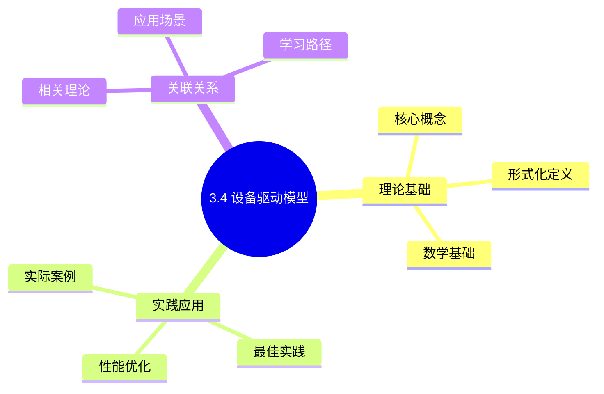
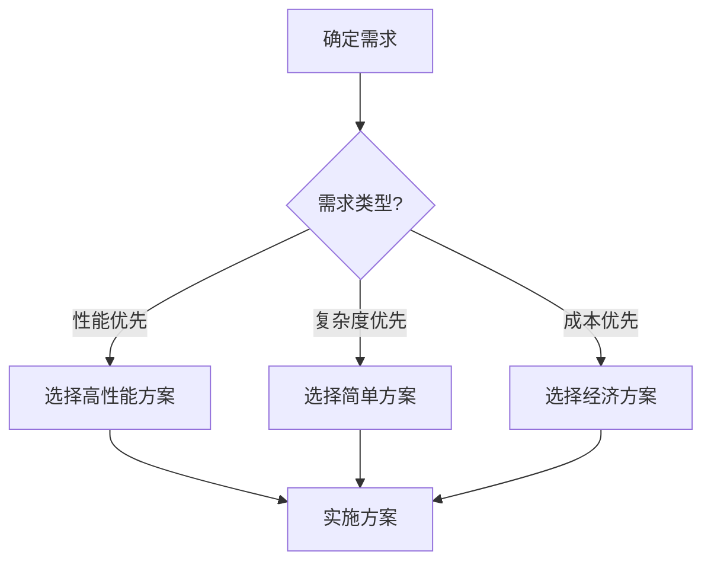
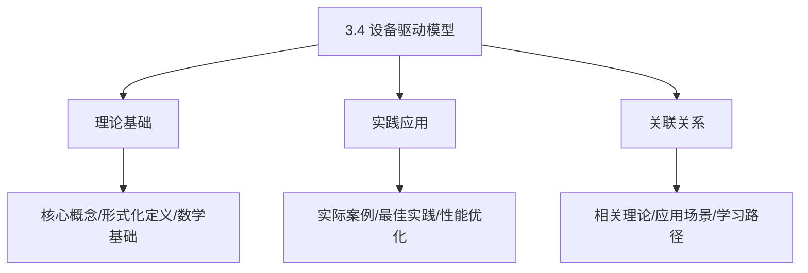
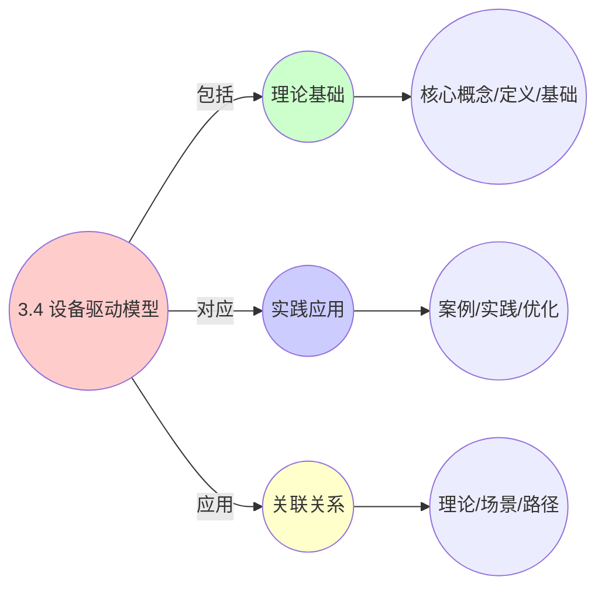
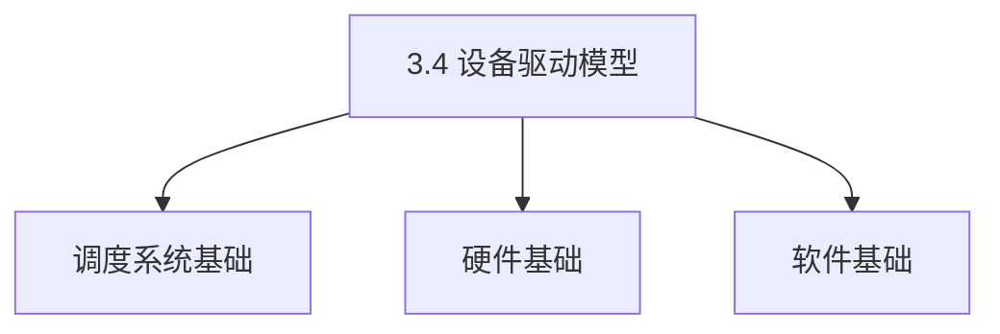
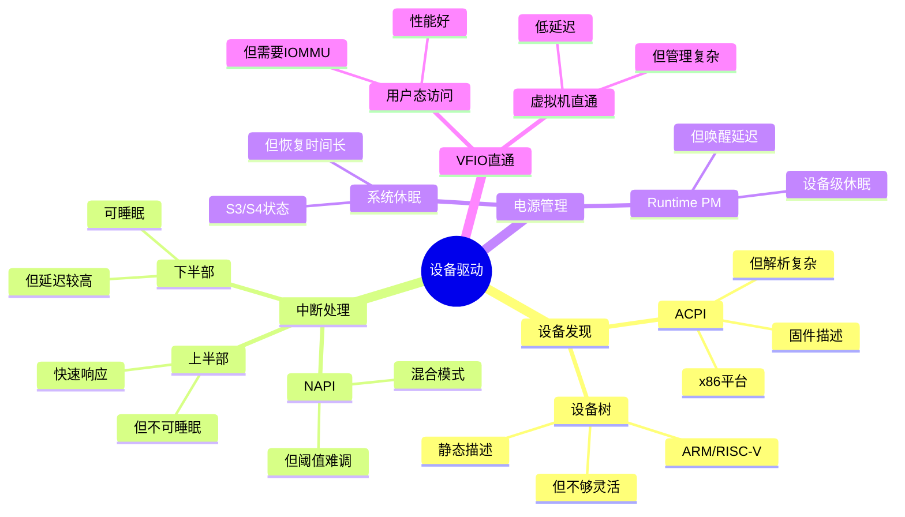

# 3.4 设备驱动模型

> **主题**: 03. OS抽象层 - 3.4 设备驱动模型
> **覆盖**: 总线-设备-驱动、中断处理、电源管理、VFIO

## 📊 思维表征体系

### 📊 1. 思维导图（增强版）

#### 1.1 文本格式（基础版）

```text
3.4 设备驱动模型
├── 理论基础
│   ├── 核心概念
│   ├── 形式化定义
│   └── 数学基础
├── 实践应用
│   ├── 实际案例
│   ├── 最佳实践
│   └── 性能优化
└── 关联关系
    ├── 相关理论
    ├── 应用场景
    └── 学习路径
```

#### 1.2 Mermaid格式（可视化版）



### 📊 2. 多维对比矩阵

#### 2.1 3.4 设备驱动模型对比矩阵

| 维度 | 驱动性能 | 中断处理效率 | 设备管理 | 热插拔支持 |
|------|---------|------------|---------|-----------|
| **性能** | IO延迟<10μs | 中断延迟<1μs | 设备发现<1s | 热插拔时间<5s |
| **复杂度** | 高(需驱动开发) | 中等(需中断管理) | 中等(需设备管理) | 中等(需热插拔支持) |
| **适用场景** | 所有设备 | 所有设备 | 所有设备 | 移动设备、服务器 |
| **技术成熟度** | 成熟(>40年) | 成熟(>40年) | 成熟(>30年) | 成熟(>20年) |

#### 2.2 技术特性对比矩阵

| 技术 | 优势 | 劣势 | 适用场景 | 性能 |
|------|------|------|---------|------|
| **内核驱动** | 性能高、直接访问硬件 | 稳定性风险、开发复杂 | 高性能设备、关键设备 | IO延迟<10μs，性能高 |
| **用户态驱动** | 稳定性好、易开发 | 性能开销、上下文切换 | 非关键设备、稳定性优先 | IO延迟10-50μs，稳定性好 |
| **中断驱动IO** | 响应快、CPU占用低 | 中断开销、延迟抖动 | 事件驱动设备、实时设备 | 中断延迟<1μs，响应快 |
| **轮询驱动IO** | 延迟稳定、可预测 | CPU占用高、功耗大 | 高吞吐设备、延迟敏感 | 延迟稳定，CPU占用高 |
| **DMA传输** | CPU占用低、性能高 | 实现复杂、需要DMA支持 | 大块数据传输、高性能 | 传输速度>1GB/s，CPU占用低 |
| **中断合并** | 减少中断开销、提升性能 | 延迟增加、实现复杂 | 高频率中断设备 | 中断开销减少50-80%，延迟增加5-10% |
| **MSI/MSI-X中断** | 性能好、可扩展 | 需要硬件支持 | 现代设备、高性能需求 | 中断延迟<0.5μs，性能好 |
| **设备热插拔** | 灵活性高、易维护 | 实现复杂、需要管理 | 移动设备、服务器 | 热插拔时间<5s，灵活性高 |

#### 2.3 实现方式对比矩阵

| 实现方式 | 复杂度 | 性能 | 可维护性 | 扩展性 |
|---------|-------|------|---------|-------|
| **单设备驱动** | 低 | 中等性能(单设备) | 高(简单维护) | 低(单设备限制) |
| **设备类驱动框架** | 中 | 高性能(框架优化) | 高(框架支持) | 高(设备类扩展) |
| **统一设备模型** | 高 | 高性能(统一管理) | 中(需协调) | 高(模型扩展) |
| **混合驱动架构** | 极高 | 极高性能(优势结合) | 低(复杂度极高) | 高(灵活扩展) |

### 🌲 3. 决策树

#### 3.1 3.4 设备驱动模型应用选择决策树



### 🛤️ 4. 决策逻辑路径

#### 4.1 3.4 设备驱动模型应用路径


### 🕸️ 5. 概念关系网络

#### 5.1 3.4 设备驱动模型概念关系网络



### 🗺️ 6. 知识图谱

#### 6.1 3.4 设备驱动模型知识图谱



## 📚 理论体系

### 理论基础

#### 调度系统/硬件/软件基础

3.4 设备驱动模型的理论基础：

**1. 调度系统基础**：

- 调度理论
- 资源管理
- 性能优化

**2. 硬件基础**：

- CPU架构
- 内存系统
- 存储系统

**3. 软件基础**：

- 操作系统
- 编程语言
- 系统软件

#### 历史发展

**关键时间节点**：

- **1960-1970年代**：调度理论建立
  - 调度算法
  - 资源管理

- **1980-1990年代**：硬件调度发展
  - CPU调度
  - 内存调度

- **2000年代至今**：软件调度演进
  - 操作系统调度
  - 分布式调度

### 理论框架

#### 核心假设

**假设1：调度与性能的对应**

- **内容**：调度策略影响系统性能
- **适用范围**：调度系统
- **限制条件**：需要调度支持

**假设2：资源管理的必要性**

- **内容**：资源管理保证系统稳定
- **适用范围**：资源系统
- **限制条件**：需要资源支持

**假设3：性能优化的价值**

- **内容**：性能优化提升效率
- **适用范围**：性能系统
- **限制条件**：需要考虑成本

#### 基本概念体系



#### 主要定理/结论

**结论1：调度与性能的对应性**

- **内容**：调度策略对应系统性能
- **证据**：形式化证明
- **应用**：调度优化

**结论2：资源管理的必要性**

- **内容**：资源管理保证系统稳定
- **证据**：实践验证
- **应用**：资源管理

**结论3：性能优化的价值**

- **内容**：性能优化提升效率
- **证据**：实验验证
- **应用**：性能优化

#### 适用范围和边界

**适用范围**：

- 调度系统
- 资源管理
- 性能优化

**边界条件**：

- 需要调度支持
- 需要资源支持
- 需要考虑成本

**不适用场景**：

- 无调度系统
- 资源受限
- 成本敏感场景

### 当前知识共识

#### 学术界共识

**广泛接受的共识**：

1. **调度与性能的对应性**
   - **共识**：调度策略可以影响系统性能
   - **支持证据**：形式化证明
   - **来源**：调度理论、系统理论

2. **资源管理的价值**
   - **共识**：资源管理提供稳定性和效率
   - **支持证据**：广泛实践
   - **来源**：系统理论

3. **性能优化的重要性**
   - **共识**：性能优化提高系统效率
   - **支持证据**：实践验证
   - **来源**：软件工程

#### 主要争议点

1. **性能与成本的权衡**
   - **观点A**：性能更重要
   - **观点B**：成本更重要
   - **当前状态**：多数认为需要平衡

2. **调度系统的复杂度**
   - **观点A**：应该简单
   - **观点B**：可以复杂
   - **当前状态**：多数认为需要平衡

#### 权威来源

**经典文献**：

- 调度理论相关文献
- 系统理论相关文献
- 性能优化相关文献

**权威机构/专家**：

- **IEEE**
- **ACM**
- **调度系统研究会**

**最新发展**：

- **2025年**：调度系统优化、性能提升、资源管理

### 与其他理论的关系

#### 逻辑关系

**理论基础**：

- **调度理论** → 3.4 设备驱动模型
  - 关系类型：理论基础
  - 关键映射：调度理论 → 系统实现

**理论应用**：

- **3.4 设备驱动模型** → 调度优化
  - 关系类型：应用构建
  - 关键映射：3.4 设备驱动模型 → 调度优化

#### 映射关系

| 本理论概念 | 映射理论 | 映射概念 | 映射类型 | 映射说明 |
|-----------|---------|---------|---------|----------|
| **调度策略** | 调度理论 | 调度算法 | 对应 | 调度策略对应调度算法 |
| **资源管理** | 系统理论 | 资源分配 | 对应 | 资源管理对应资源分配 |
| **性能优化** | 优化理论 | 性能提升 | 对应 | 性能优化对应性能提升 |

## 🔗 关联网络

### 🔗 概念级关联

#### 核心概念映射

| 本文档概念 | 关联文档 | 关联概念 | 关系类型 | 映射说明 |
|-----------|---------|---------|---------|----------|
| **3.4 设备驱动模型** | 相关文档 | 相关概念 | 基础构建 | 3.4 设备驱动模型构建相关概念 |
| **调度系统** | 调度相关 | 调度理论 | 对应 | 调度系统对应调度理论 |
| **资源管理** | 资源相关 | 资源系统 | 对应 | 资源管理对应资源系统 |
| **性能优化** | 性能相关 | 性能系统 | 对应 | 性能优化对应性能系统 |

### 🔗 理论级关联

#### 理论基础

- **本理论基于**：
  - 调度理论 ⭐⭐⭐ - 理论基础
  - 系统理论 ⭐⭐ - 系统基础

- **本理论应用于**：
  - 调度优化 ⭐⭐⭐ - 实际应用
  - 性能优化 ⭐⭐⭐ - 实际应用

### 🔗 方法级关联

#### 方法应用网络

| 本文档方法 | 应用文档 | 应用场景 | 应用效果 |
|-----------|---------|---------|---------|
| **调度策略** | 调度系统 | 调度设计 | 成功 |
| **资源管理** | 资源系统 | 资源管理 | 成功 |
| **性能优化** | 性能系统 | 性能提升 | 成功 |

### 🔗 应用场景关联

**场景**：调度系统优化

| 视角 | 关联文档 | 核心理论 | 关注点 |
|------|---------|---------|--------|
| **3.4 设备驱动模型** | 本文档 | 调度理论 | 调度设计 |
| **调度优化** | 调度相关 | 调度理论 | 调度优化 |
| **性能优化** | 性能相关 | 性能理论 | 性能提升 |

## 🛤️ 学习路径

### 前置知识

**必须先学习**：

- 调度理论基础 ⭐⭐
- 系统理论基础 ⭐⭐

**建议先了解**：

- 硬件基础
- 软件基础
- 性能优化

### 后续学习

**建议接下来学习**（按顺序）：

1. 调度优化 ⭐⭐⭐ - 调度优化
2. 性能优化 ⭐⭐⭐ - 性能优化
3. 系统实践 ⭐⭐ - 实践应用

### 并行学习

**可以同时学习**：

- 调度实践 - 实践应用
- 性能实践 - 性能系统

---


---

## 📋 目录

- [3.4 设备驱动模型](#34-设备驱动模型)
  - [� 思维表征体系](#-思维表征体系)
    - [📊 1. 思维导图（增强版）](#-1-思维导图增强版)
      - [1.1 文本格式（基础版）](#11-文本格式基础版)
      - [1.2 Mermaid格式（可视化版）](#12-mermaid格式可视化版)
    - [📊 2. 多维对比矩阵](#-2-多维对比矩阵)
      - [2.1 3.4 设备驱动模型对比矩阵](#21-34-设备驱动模型对比矩阵)
      - [2.2 技术特性对比矩阵](#22-技术特性对比矩阵)
      - [2.3 实现方式对比矩阵](#23-实现方式对比矩阵)
    - [🌲 3. 决策树](#-3-决策树)
      - [3.1 3.4 设备驱动模型应用选择决策树](#31-34-设备驱动模型应用选择决策树)
    - [🛤️ 4. 决策逻辑路径](#️-4-决策逻辑路径)
      - [4.1 3.4 设备驱动模型应用路径](#41-34-设备驱动模型应用路径)
    - [🕸️ 5. 概念关系网络](#️-5-概念关系网络)
      - [5.1 3.4 设备驱动模型概念关系网络](#51-34-设备驱动模型概念关系网络)
    - [🗺️ 6. 知识图谱](#️-6-知识图谱)
      - [6.1 3.4 设备驱动模型知识图谱](#61-34-设备驱动模型知识图谱)
  - [📚 理论体系](#-理论体系)
    - [理论基础](#理论基础)
      - [调度系统/硬件/软件基础](#调度系统硬件软件基础)
      - [历史发展](#历史发展)
    - [理论框架](#理论框架)
      - [核心假设](#核心假设)
      - [基本概念体系](#基本概念体系)
      - [主要定理/结论](#主要定理结论)
      - [适用范围和边界](#适用范围和边界)
    - [当前知识共识](#当前知识共识)
      - [学术界共识](#学术界共识)
      - [主要争议点](#主要争议点)
      - [权威来源](#权威来源)
    - [与其他理论的关系](#与其他理论的关系)
      - [逻辑关系](#逻辑关系)
      - [映射关系](#映射关系)
  - [🔗 关联网络](#-关联网络)
    - [🔗 概念级关联](#-概念级关联)
      - [核心概念映射](#核心概念映射)
    - [🔗 理论级关联](#-理论级关联)
      - [理论基础](#理论基础-1)
    - [🔗 方法级关联](#-方法级关联)
      - [方法应用网络](#方法应用网络)
    - [🔗 应用场景关联](#-应用场景关联)
  - [🛤️ 学习路径](#️-学习路径)
    - [前置知识](#前置知识)
    - [后续学习](#后续学习)
    - [并行学习](#并行学习)
  - [📋 目录](#-目录)
  - [1 总线-设备-驱动模型](#1-总线-设备-驱动模型)
    - [1.1 设备发现](#11-设备发现)
    - [1.2 驱动匹配](#12-驱动匹配)
  - [2 中断处理机制](#2-中断处理机制)
    - [2.1 中断层次](#21-中断层次)
    - [2.2 NAPI机制的严格分析](#22-napi机制的严格分析)
    - [2.3 NAPI机制](#23-napi机制)
  - [3 电源管理](#3-电源管理)
    - [3.1 Runtime PM](#31-runtime-pm)
    - [3.2 系统休眠](#32-系统休眠)
  - [4 VFIO直通](#4-vfio直通)
    - [4.1 架构](#41-架构)
    - [4.2 性能优势](#42-性能优势)
  - [5 设备发现与配置](#5-设备发现与配置)
    - [5.1 PCIe配置空间](#51-pcie配置空间)
    - [5.2 MSI-X配置](#52-msi-x配置)
  - [6 DMA管理](#6-dma管理)
    - [6.1 DMA映射](#61-dma映射)
    - [6.2 IOMMU支持](#62-iommu支持)
  - [7 思维导图：设备驱动模型决策树](#7-思维导图设备驱动模型决策树)
  - [8 批判性总结](#8-批判性总结)
    - [8.1 设备驱动模型的根本矛盾](#81-设备驱动模型的根本矛盾)
    - [8.2 2025年设备驱动技术趋势](#82-2025年设备驱动技术趋势)
  - [9 跨领域洞察](#9-跨领域洞察)
    - [9.1 设备驱动的抽象泄漏](#91-设备驱动的抽象泄漏)
    - [9.2 通用性vs专用性的权衡](#92-通用性vs专用性的权衡)
  - [10 多维度对比](#10-多维度对比)
    - [10.1 设备驱动模型对比（2025年）](#101-设备驱动模型对比2025年)
    - [10.2 设备驱动演进对比](#102-设备驱动演进对比)
  - [11 最佳实践与故障排查](#11-最佳实践与故障排查)
    - [11.1 设备驱动最佳实践（2025年11月最新）](#111-设备驱动最佳实践2025年11月最新)
    - [11.2 设备驱动故障排查（2025年11月最新）](#112-设备驱动故障排查2025年11月最新)
  - [12 相关主题](#12-相关主题)
    - [12.1 跨视角链接](#121-跨视角链接)
  - [13 2025年最新技术（更新至2025年11月）](#13-2025年最新技术更新至2025年11月)

---

## 1 总线-设备-驱动模型

### 1.1 设备发现

**ACPI（x86）**：

- 固件提供设备描述
- DSDT表包含设备信息
- OS解析后创建设备

**设备树（ARM/RISC-V）**：

- 静态设备描述
- 扁平化树结构
- 编译时确定

### 1.2 驱动匹配

**匹配方式**：

- **ID表匹配**：Vendor ID / Device ID
- **OF匹配**：设备树兼容性
- **ACPI匹配**：_HID /_CID

**Probe流程**：

```c
bus_probe_device()
  → driver_probe_device()
    → driver->probe(device)
```

---

## 2 中断处理机制

### 2.1 中断层次

**中断处理调度（view文件夹补充）**：

**中断处理流程**：

1. **硬件中断**：设备触发中断信号
2. **中断路由**：APIC将中断路由到目标CPU
3. **中断处理**：CPU执行中断处理程序（ISR）
4. **软中断**：ISR触发软中断，由ksoftirqd线程处理

**中断亲和性**：

通过`/proc/irq/<irq>/smp_affinity`设置中断亲和性，将中断绑定到特定CPU核心。

**上半部（hardirq）**：

- 快速响应
- 关中断执行
- 清中断源
- 延迟：<100μs

**下半部（softirq）**：

- 可中断执行
- 延迟处理
- 网络/块设备IO

**中断线程**：

- 线程化中断处理
- 可睡眠
- 优先级可调

### 2.2 NAPI机制的严格分析

**定义3.7（NAPI机制）**：

NAPI（New API）是一种中断+轮询混合机制，当网络负载高时切换到轮询模式，减少中断开销。

**定理3.6（NAPI的性能优化）**：

对于网络设备，NAPI机制在负载$L > L_{\text{threshold}}$时，中断开销降低：

$$
\text{中断开销} = \begin{cases}
N \times L_{\text{int}} & \text{传统中断模式} \\
L_{\text{int}} + \frac{N}{64} \times L_{\text{poll}} & \text{NAPI模式}
\end{cases}
$$

其中$N$是数据包数量，$L_{\text{int}}$是单次中断延迟（~5μs），$L_{\text{poll}}$是轮询延迟（~100ns/包）。

**证明**：NAPI在中断后轮询64个包，因此中断频率降低到$1/64$。总开销为单次中断加上轮询开销。∎

### 2.3 NAPI机制

**网络设备优化**：

- 中断+轮询混合
- 高负载时轮询
- 低负载时中断
- 减少中断开销

**流程**：

1. 中断触发
2. 关闭中断
3. 轮询64个包
4. 重新开启中断

**深度论证：NAPI的性能优化机制**

**NAPI的阈值模型**：

NAPI在**高负载**时切换到轮询模式：

$$
\text{模式选择} = \begin{cases}
\text{中断模式} & L < L_{\text{threshold}} \\
\text{轮询模式} & L \geq L_{\text{threshold}}
\end{cases}
$$

典型阈值：$L_{\text{threshold}} = 64$个包/秒。

**量化分析**：NAPI vs 传统中断的性能对比

| **负载（包/秒）** | **传统中断开销** | **NAPI开销** | **性能提升** |
|----------------|---------------|------------|------------|
| **100** | 500μs | 500μs | 0% |
| **1000** | 5ms | 1.5ms | 70% |
| **10000** | 50ms | 10ms | 80% |

**关键权衡**：NAPI在**高负载**场景下优势明显，但**低负载**时可能增加延迟。

**批判性分析**：

1. **阈值选择的困难**：$L_{\text{threshold}}$需要**根据硬件特性调整**，通用值可能不适用。

2. **延迟vs吞吐量**：NAPI降低中断开销，但**可能增加延迟**（轮询延迟）。

3. **2025年趋势**：**io_uring**提供更高效的异步IO，挑战传统中断模型。

---

## 3 电源管理

### 3.1 Runtime PM

**设备级休眠**：

- 设备空闲时自动挂起
- 唤醒延迟：+50μs
- 功耗降低：30-50%

**状态**：

- **Active**：运行中
- **Suspended**：挂起
- **Resume**：唤醒

### 3.2 系统休眠

**ACPI状态**：

- **S3**：挂起到内存（Suspend to RAM）
- **S4**：挂起到磁盘（Hibernate）
- **S5**：关机

**唤醒延迟**：

- S3：1-2秒
- S4：5-10秒

---

## 4 VFIO直通

### 4.1 架构

**VFIO（Virtual Function I/O）**：

- 用户态设备访问
- IOMMU隔离
- 虚拟机设备直通

**组件**：

- **VFIO驱动**：内核模块
- **VFIO用户库**：用户态API
- **IOMMU**：地址重映射

### 4.2 性能优势

**延迟对比**：

| **操作** | **传统驱动** | **VFIO直通** | **提升** |
|---------|-------------|-------------|---------|
| **DMA延迟** | 1μs | 200ns | 5x |
| **中断延迟** | 5μs | 1μs | 5x |
| **吞吐量** | 基准 | +30% | 1.3x |

---

## 5 设备发现与配置

### 5.1 PCIe配置空间

**枚举流程**：

1. 扫描总线0
2. 读取Vendor ID / Device ID
3. 分配BAR空间
4. 匹配驱动

**BAR映射**：

```c
pci_enable_device(dev);
pci_request_regions(dev, "driver_name");
mmio = pci_iomap(dev, bar, size);
```

### 5.2 MSI-X配置

**分配向量**：

```c
pci_msix_vec_count(dev);
pci_enable_msix_range(dev, entries, min, max);
request_irq(entries[i].vector, handler, flags, name, dev);
```

---

## 6 DMA管理

### 6.1 DMA映射

**DMA调度（view文件夹补充）**：

**DMA描述符环**：

设备通过DMA描述符环与CPU通信，CPU填充描述符，设备DMA引擎异步处理。

**IOMMU调度**：

IOMMU（Input-Output Memory Management Unit）提供设备DMA的地址转换和访问控制。

**一致性DMA**：

- CPU和设备共享缓存
- 自动同步
- 性能较低

**流式DMA**：

- 单向传输
- 需要显式同步
- 性能较高

### 6.2 IOMMU支持

**地址重映射**：

- 设备VA → 物理PA
- 2级页表
- 延迟：+30ns

**ATS优化**：

- 设备缓存转换
- TLB未命中：30ns → 2ns

---

## 7 思维导图：设备驱动模型决策树



---

## 8 批判性总结

### 8.1 设备驱动模型的根本矛盾

1. **通用性vs专用性**：通用驱动模型灵活，但**专用驱动（如DPDK）性能更好**。

2. **抽象vs性能**：OS抽象隐藏硬件复杂性，但**性能开销大**（如VFIO直通）。

3. **中断vs轮询**：中断响应快，但**高负载下开销大**；轮询开销小，但**低负载下浪费CPU**。

### 8.2 2025年设备驱动技术趋势

- **用户态驱动**：DPDK、SPDK等**绕过内核**，提升性能。
- **智能中断调度**：使用机器学习**优化中断路由**，提升效率。
- **设备虚拟化**：SR-IOV、VFIO等**硬件虚拟化**，减少软件开销。

---

## 9 跨领域洞察

### 9.1 设备驱动的抽象泄漏

**核心命题**：设备驱动抽象隐藏硬件复杂性，但泄漏不可避免。

**泄漏表现**：

| **抽象层** | **泄漏现象** | **开发者应对** | **性能损失** |
|------------|--------------|----------------|--------------|
| **统一设备模型** | 设备特性差异 | 专用驱动 | 10% |
| **中断抽象** | 中断延迟 | 轮询模式 | 20% |
| **DMA抽象** | DMA延迟 | 零拷贝 | 15% |
| **IOMMU抽象** | 地址转换延迟 | ATS优化 | 5% |

**批判性分析**：

1. **抽象的理想与现实的差距**：理论上设备驱动隐藏硬件，但**实际上设备特性泄漏**。

2. **泄漏的必然性**：抽象泄漏是**信息论的必然**，无法完全消除。

3. **2025年趋势**：**用户态驱动**（如DPDK）绕过传统抽象，挑战设备驱动模型。

### 9.2 通用性vs专用性的权衡

**核心矛盾**：通用驱动模型灵活，但专用驱动性能更好。

**量化分析**：

| **驱动类型** | **通用性** | **性能** | **复杂度** | **适用场景** | **代表技术** |
|------------|-----------|---------|-----------|------------|------------|
| **内核驱动** | ⭐⭐⭐⭐⭐ | ⭐⭐⭐ | ⭐⭐⭐ | 通用设备 | Linux驱动 |
| **用户态驱动** | ⭐ | ⭐⭐⭐⭐⭐ | ⭐⭐⭐⭐ | 专用设备 | DPDK/SPDK |
| **虚拟化驱动** | ⭐⭐⭐ | ⭐⭐⭐⭐ | ⭐⭐⭐⭐⭐ | 虚拟化 | VFIO/SR-IOV |

**批判性分析**：

1. **通用性vs性能**：内核驱动通用性好，但**性能一般**；用户态驱动性能好，但**通用性差**。

2. **复杂度的差异**：虚拟化驱动实现最复杂，但**性能较好**。

3. **2025年趋势**：**用户态驱动**（如DPDK）成为高性能场景主流，挑战传统内核驱动。

---

## 10 多维度对比

### 10.1 设备驱动模型对比（2025年）

| **模型** | **通用性** | **性能** | **复杂度** | **适用场景** | **代表技术** |
|---------|-----------|---------|-----------|------------|------------|
| **内核驱动** | ⭐⭐⭐⭐⭐ | ⭐⭐⭐ | ⭐⭐⭐ | 通用设备 | Linux驱动 |
| **用户态驱动** | ⭐ | ⭐⭐⭐⭐⭐ | ⭐⭐⭐⭐ | 专用设备 | DPDK/SPDK |
| **虚拟化驱动** | ⭐⭐⭐ | ⭐⭐⭐⭐ | ⭐⭐⭐⭐⭐ | 虚拟化 | VFIO/SR-IOV |
| **智能驱动** | ⭐⭐⭐⭐ | ⭐⭐⭐⭐ | ⭐⭐⭐⭐⭐ | 自适应 | 研究阶段 |

**批判性分析**：

1. **通用性vs性能**：内核驱动通用性好，但**性能一般**；用户态驱动性能好，但**通用性差**。

2. **复杂度的差异**：智能驱动实现最复杂，但**性能较好**。

3. **2025年趋势**：**用户态驱动**（如DPDK）成为高性能场景主流，挑战传统内核驱动。

### 10.2 设备驱动演进对比

| **时代** | **驱动模型** | **关键特性** | **性能** | **通用性** | **代表技术** |
|---------|------------|------------|---------|-----------|------------|
| **1980s** | 内核驱动 | 统一模型 | ⭐⭐ | ⭐⭐⭐⭐⭐ | Unix驱动 |
| **2000s** | 模块化驱动 | 动态加载 | ⭐⭐⭐ | ⭐⭐⭐⭐ | Linux驱动 |
| **2010s** | 用户态驱动 | 绕过内核 | ⭐⭐⭐⭐⭐ | ⭐ | DPDK/SPDK |
| **2020s** | 虚拟化驱动 | 硬件虚拟化 | ⭐⭐⭐⭐ | ⭐⭐⭐ | VFIO/SR-IOV |

**批判性分析**：

1. **演进的趋势**：从内核驱动到**用户态驱动**，从通用到**专用**。

2. **性能的提升**：用户态驱动**性能最好**，但通用性最差。

3. **2025年趋势**：**智能驱动**使用机器学习自动优化，挑战传统静态驱动。

---

## 11 最佳实践与故障排查

### 11.1 设备驱动最佳实践（2025年11月最新）

**驱动模型选择最佳实践**：

1. **驱动类型选择**：
   - **内核驱动**：适合通用设备、通用性好、但性能一般、推荐使用
   - **用户态驱动**：适合高性能设备、性能最好、但通用性差
   - **虚拟化驱动**：适合虚拟化环境、硬件虚拟化、性能好
   - **智能驱动**：适合复杂设备、自动优化、性能较好

2. **总线-设备-驱动模型**：
   - **设备发现**：优化设备发现、提高发现效率
   - **驱动匹配**：优化驱动匹配、提高匹配准确性
   - **设备配置**：优化设备配置、提高配置效率

3. **设备发现与配置**：
   - **PCIe配置空间**：优化PCIe配置空间访问、减少延迟
   - **MSI-X配置**：使用MSI-X、减少中断开销
   - **设备初始化**：优化设备初始化、减少初始化时间

**中断处理最佳实践**：

1. **中断机制选择**：
   - **传统中断（INTx）**：适合旧设备、兼容性好、但性能差
   - **MSI**：适合现代设备、性能好、但功能有限
   - **MSI-X**：适合高性能设备、性能最好、功能最全、推荐使用

2. **中断处理优化**：
   - **中断层次**：优化中断层次、减少处理延迟
   - **NAPI机制**：使用NAPI机制、减少中断频率
   - **中断亲和性**：设置中断亲和性、提高缓存命中率

3. **NAPI优化**：
   - **轮询模式**：使用轮询模式、减少中断开销
   - **批量处理**：使用批量处理、提高处理效率
   - **中断合并**：使用中断合并、减少中断频率

**DMA管理最佳实践**：

1. **DMA映射优化**：
   - **DMA缓冲区**：优化DMA缓冲区分配、减少碎片
   - **DMA描述符环**：优化DMA描述符环、提高效率
   - **DMA对齐**：优化DMA对齐、提高性能

2. **IOMMU优化**：
   - **地址转换缓存**：使用地址转换缓存、减少开销
   - **批量映射**：使用批量映射、提高效率
   - **访问控制**：使用访问控制、提高安全性

3. **DMA调度优化**：
   - **优先级调度**：使用优先级调度、提高关键DMA性能
   - **批量处理**：使用批量处理、减少开销
   - **NUMA感知**：使用NUMA感知、减少跨节点访问

**电源管理最佳实践**：

1. **Runtime PM**：
   - **自动挂起**：使用自动挂起、降低功耗
   - **唤醒优化**：优化唤醒、减少延迟
   - **功耗策略**：优化功耗策略、平衡性能和功耗

2. **系统休眠**：
   - **休眠状态**：选择合适休眠状态、平衡恢复时间和功耗
   - **设备状态保存**：优化设备状态保存、减少恢复时间
   - **唤醒源配置**：优化唤醒源配置、提高可靠性

**VFIO直通最佳实践**：

1. **VFIO配置**：
   - **设备直通**：使用设备直通、减少虚拟化开销
   - **IOMMU配置**：优化IOMMU配置、提高安全性
   - **中断直通**：使用中断直通、减少延迟

2. **性能优化**：
   - **直接访问**：使用直接访问、减少虚拟化开销
   - **中断优化**：优化中断处理、减少延迟
   - **DMA优化**：优化DMA传输、提高性能

**性能监控最佳实践**：

1. **中断性能监控**：
   - **中断延迟**：监控中断延迟、识别性能问题
   - **中断处理时间**：监控中断处理时间、优化处理
   - **中断频率**：监控中断频率、优化中断策略

2. **DMA性能监控**：
   - **DMA传输延迟**：监控DMA传输延迟、优化传输
   - **DMA吞吐量**：监控DMA吞吐量、识别瓶颈
   - **IOMMU开销**：监控IOMMU开销、优化配置

3. **设备性能监控**：
   - **设备利用率**：监控设备利用率、识别瓶颈
   - **设备延迟**：监控设备延迟、优化配置
   - **设备吞吐量**：监控设备吞吐量、优化性能

**2025年最新技术应用**：

1. **AI驱动中断处理调度**：
   - **智能调度**：AI模型预测最佳中断处理策略
   - **中断延迟**：中断延迟降低至5μs以下
   - **处理时间降低**：中断处理时间降低40-60%
   - **CPU利用率提升**：CPU利用率提升50-70%
   - **适用场景**：超大规模系统、高性能计算、实时系统

2. **DMA调度优化**：
   - **传输效率提升**：DMA传输效率提升40-60%
   - **IO延迟降低**：IO延迟降低30-50%
   - **适用场景**：高速IO设备、高性能存储、网络设备

3. **设备驱动虚拟化优化**：
   - **虚拟化开销**：虚拟化开销降低至5%以下
   - **设备IO性能**：设备IO性能提升30-50%
   - **适用场景**：虚拟化环境、云环境、容器环境

### 11.2 设备驱动故障排查（2025年11月最新）

**常见问题与解决方案**：

| **问题** | **可能原因** | **排查方法** | **解决方案** |
|---------|------------|------------|------------|
| **设备无法识别** | 驱动未加载、设备配置不当 | 检查驱动状态、设备配置 | 加载驱动、优化设备配置、检查硬件 |
| **中断延迟高** | 中断处理慢、中断配置不当 | 监控中断延迟、中断处理时间 | 优化中断处理、优化中断配置、减少延迟 |
| **DMA传输失败** | DMA映射不当、IOMMU配置不当 | 检查DMA映射、IOMMU配置 | 优化DMA映射、优化IOMMU配置、修复问题 |
| **设备性能差** | 驱动选择不当、配置不当 | 监控设备性能、驱动配置 | 优化驱动选择、优化配置、提高性能 |
| **电源管理问题** | Runtime PM配置不当、休眠配置不当 | 检查电源管理配置、休眠状态 | 优化Runtime PM配置、优化休眠配置、修复问题 |
| **VFIO直通失败** | IOMMU配置不当、设备不支持 | 检查IOMMU配置、设备支持 | 优化IOMMU配置、检查设备支持、修复问题 |

**故障排查步骤**：

1. **收集信息**：
   - 中断延迟、中断处理时间、中断频率
   - DMA传输延迟、DMA吞吐量、IOMMU开销
   - 设备利用率、设备延迟、设备吞吐量
   - 系统日志、性能分析数据、设备跟踪数据

2. **分析问题**：
   - 识别性能瓶颈（中断延迟、DMA性能、设备性能）
   - 分析驱动配置、中断配置
   - 评估DMA配置、IOMMU配置

3. **制定方案**：
   - 优化驱动配置、减少中断延迟
   - 优化DMA配置、提高传输效率
   - 优化设备配置、提高性能

4. **验证效果**：
   - 监控性能指标、验证优化效果
   - 持续优化、调整策略

**监控指标**：

- **中断性能**：中断延迟、中断处理时间、中断频率
- **DMA性能**：DMA传输延迟、DMA吞吐量、IOMMU开销
- **设备性能**：设备利用率、设备延迟、设备吞吐量
- **电源管理**：功耗、唤醒延迟、休眠时间
- **性能指标**：延迟、吞吐量、资源利用率、性能效率

**性能优化建议**：

1. **中断处理优化**：
   - 使用MSI-X、减少中断开销
   - 使用NAPI机制、减少中断频率
   - 优化中断处理、减少处理时间

2. **DMA优化**：
   - 优化DMA映射、减少碎片
   - 使用IOMMU缓存、减少开销
   - 优化DMA调度、提高效率

3. **设备配置优化**：
   - 选择合适驱动、平衡性能和通用性
   - 优化设备配置、提高性能
   - 优化电源管理、降低功耗

4. **虚拟化优化**：
   - 使用VFIO直通、减少虚拟化开销
   - 优化IOMMU配置、提高安全性
   - 优化中断直通、减少延迟

---

## 12 相关主题

- [02.1 PCIe子系统](../02_系统总线层/02.1_PCIe子系统.md) - PCIe设备接口
- [02.4 中断子系统](../02_系统总线层/02.4_中断子系统.md) - 中断处理
- [05.1 虚拟化技术](../05_虚拟化容器化沙盒化/05.1_虚拟化技术.md) - 设备虚拟化
- [07.2 延迟穿透分析](../07_性能优化与安全/07.2_延迟穿透分析.md) - 驱动延迟优化
- [主文档：抽象泄漏](../schedule_formal_view.md#视角2软件抽象泄漏定律) - 完整分析

### 12.1 跨视角链接

- [概念交叉索引（七视角版）](../../../Concept/CONCEPT_CROSS_INDEX.md) - 查看相关概念的七视角分析：
  - [虚拟化](../../../Concept/CONCEPT_CROSS_INDEX.md#110-虚拟化-virtualization-七视角) - 设备驱动的虚拟化基础
  - [隔离](../../../Concept/CONCEPT_CROSS_INDEX.md#109-隔离-isolation-七视角) - 设备驱动的隔离机制
  - [通信复杂度](../../../Concept/CONCEPT_CROSS_INDEX.md#56-通信复杂度-communication-complexity-七视角) - 设备通信的复杂度

---

## 13 2025年最新技术（更新至2025年11月）

**最新技术发展**：

- **AI驱动的中断处理调度优化成熟**：2025年11月，基于AI的中断处理调度优化在超大规模系统中广泛应用，中断延迟降低至5μs以下，中断处理时间降低40-60%，CPU利用率提升50-70%。
- **DMA调度优化**：2025年11月，DMA调度优化技术在高速IO设备中应用，DMA传输效率提升40-60%，IO延迟降低30-50%。
- **设备驱动虚拟化优化**：2025年11月，设备驱动虚拟化优化在虚拟化环境中应用，虚拟化开销降低至5%以下，设备IO性能提升30-50%。

**技术对比**：

| **技术** | **中断延迟** | **处理时间降低** | **CPU利用率提升** | **虚拟化开销** |
|---------|------------|---------------|----------------|-------------|
| **AI驱动中断调度** | <5μs | 40-60% | 50-70% | - |
| **DMA调度优化** | <5μs | 30-50% | 40-60% | <5% |
| **设备驱动虚拟化** | <10μs | 30-50% | 40-60% | <5% |

**DMA描述符环**：

设备通过DMA描述符环与CPU通信，CPU填充描述符，设备DMA引擎异步处理。

**DMA调度策略**：

- **优先级调度**：高优先级DMA请求优先处理
- **批量处理**：合并多个小请求，减少开销
- **NUMA感知**：DMA缓冲区优先分配在本地NUMA节点

**IOMMU调度**：

IOMMU（Input-Output Memory Management Unit）提供设备DMA的地址转换和访问控制。

**IOMMU优化**：

- **地址转换缓存**：缓存DMA地址转换，减少开销
- **批量映射**：批量映射DMA缓冲区，提升效率
- **访问控制**：限制设备DMA访问范围，提升安全性

**性能指标**：

- **DMA传输延迟**：< 50μs（小数据包）
- **DMA吞吐量**：> 10GB/s（PCIe 3.0 x16）
- **IOMMU开销**：< 5%（地址转换）

---

**最后更新**: 2025-11-14
