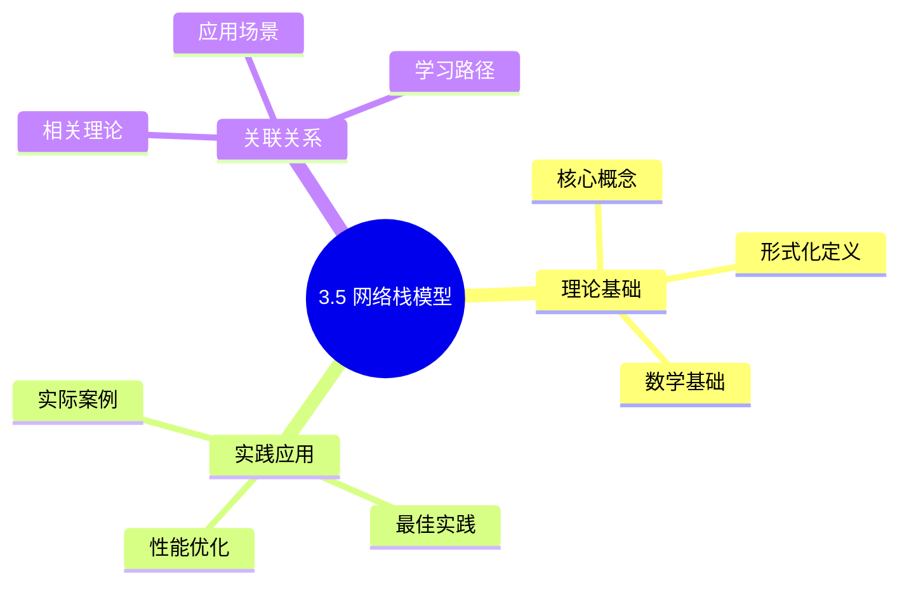
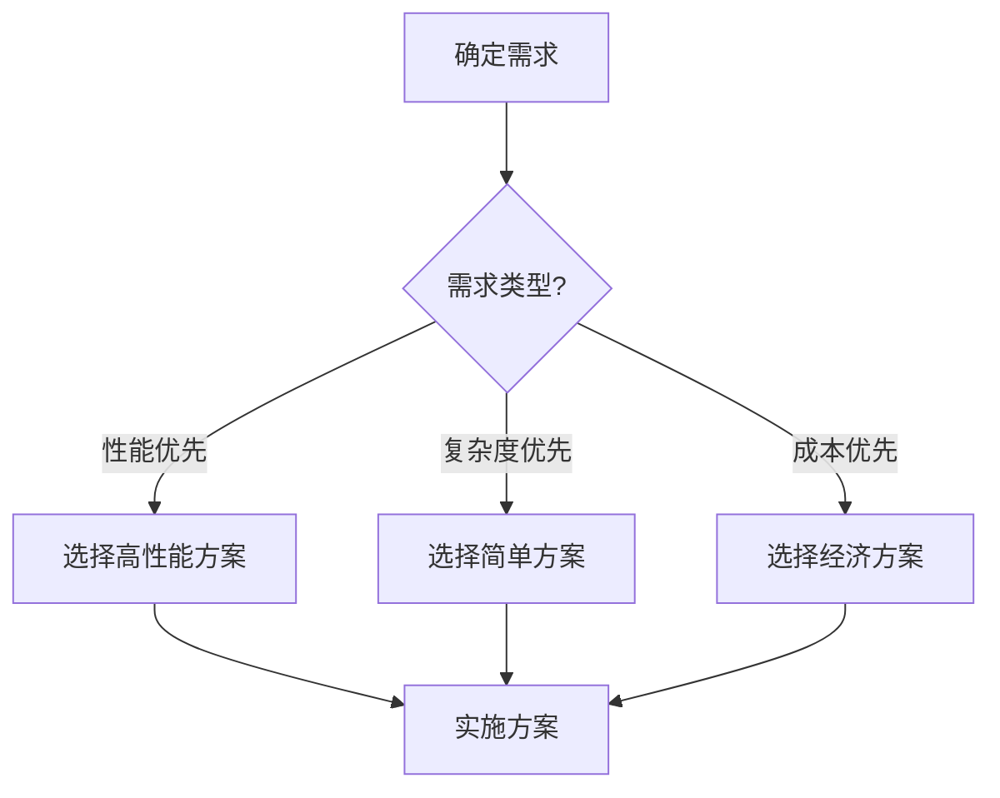
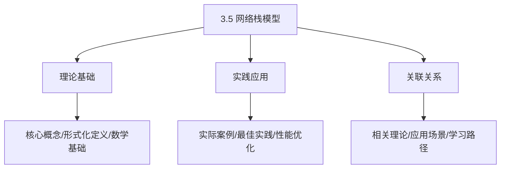
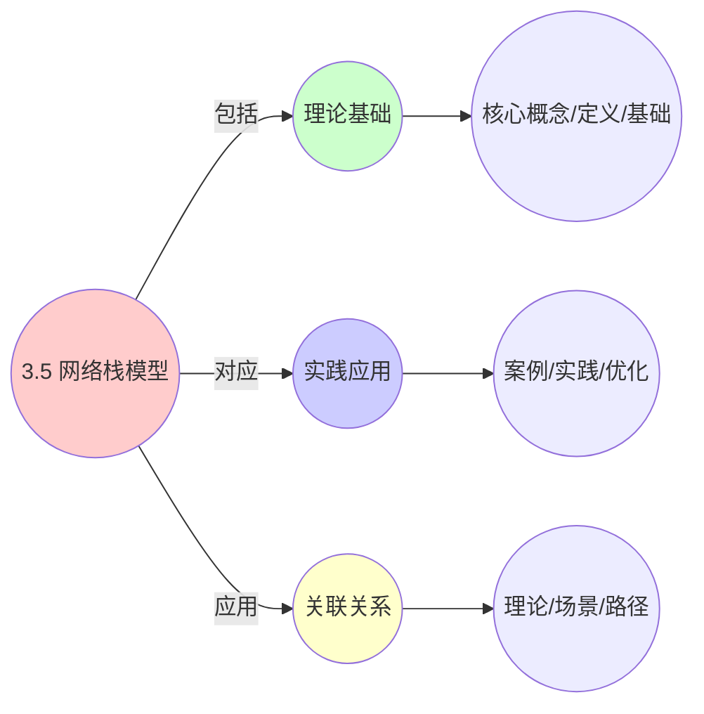
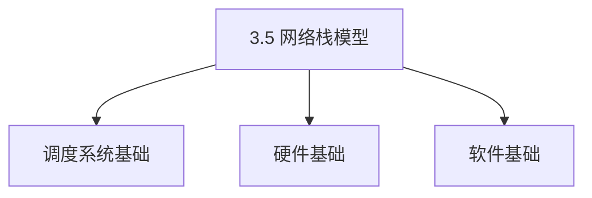

# 3.5 网络栈模型

> **主题**: 03. OS抽象层 - 3.5 网络栈模型
> **覆盖**: TCP/IP协议栈、NAPI、零拷贝、DPDK

## 📊 思维表征体系

### 📊 1. 思维导图（增强版）

#### 1.1 文本格式（基础版）

```text
3.5 网络栈模型
├── 理论基础
│   ├── 核心概念
│   ├── 形式化定义
│   └── 数学基础
├── 实践应用
│   ├── 实际案例
│   ├── 最佳实践
│   └── 性能优化
└── 关联关系
    ├── 相关理论
    ├── 应用场景
    └── 学习路径
```

#### 1.2 Mermaid格式（可视化版）



### 📊 2. 多维对比矩阵

#### 2.1 3.5 网络栈模型对比矩阵

| 维度 | 网络吞吐量 | 延迟控制 | 协议支持 | 可扩展性 |
|------|----------|---------|---------|---------|
| **性能** | 吞吐量>10Gbps | 延迟<100μs | 协议支持完整 | 支持>1000连接 |
| **复杂度** | 高(需IO优化) | 高(需延迟优化) | 中等(需协议实现) | 中等(需扩展设计) |
| **适用场景** | 所有网络应用 | 实时应用 | 所有网络应用 | 大规模系统 |
| **技术成熟度** | 成熟(>40年) | 成熟(>30年) | 成熟(>40年) | 成熟(>20年) |

#### 2.2 技术特性对比矩阵

| 技术 | 优势 | 劣势 | 适用场景 | 性能 |
|------|------|------|---------|------|
| **传统网络栈** | 成熟稳定、兼容性好 | 性能一般、开销大 | 通用场景、兼容性优先 | 吞吐量1-10Gbps，延迟100-500μs |
| **DPDK用户态网络栈** | 性能极高、延迟低 | 需要专用CPU、兼容性差 | 高性能网络、NFV | 吞吐量>100Gbps，延迟<10μs |
| **XDP/eBPF网络栈** | 性能高、灵活性好 | 实现复杂、需要内核支持 | 高性能网络、灵活处理 | 吞吐量10-100Gbps，延迟10-50μs |
| **TCP/IP协议栈** | 标准协议、可靠性高 | 开销大、延迟高 | 通用网络、可靠性优先 | 吞吐量1-10Gbps，延迟100-500μs |
| **UDP协议栈** | 延迟低、开销小 | 不可靠、无拥塞控制 | 实时应用、延迟敏感 | 吞吐量10-100Gbps，延迟<10μs |
| **零拷贝技术** | 性能高、CPU占用低 | 实现复杂、需要支持 | 高性能网络、大流量 | 性能提升30-50%，CPU占用降低50% |
| **RPS/RFS负载均衡** | 多核利用、性能好 | 实现复杂、需要配置 | 多核系统、高负载 | 性能提升20-40%，多核利用 |
| **网络命名空间** | 隔离性好、灵活性高 | 开销大、实现复杂 | 容器、虚拟化 | 隔离性好，开销5-10% |

#### 2.3 实现方式对比矩阵

| 实现方式 | 复杂度 | 性能 | 可维护性 | 扩展性 |
|---------|-------|------|---------|-------|
| **内核网络栈** | 中 | 中等性能(内核开销) | 高(内核支持) | 中(内核扩展) |
| **用户态网络栈** | 高 | 高性能(绕过内核) | 中(需用户态实现) | 高(用户态扩展) |
| **混合网络栈** | 极高 | 极高性能(优势结合) | 低(复杂度极高) | 高(灵活扩展) |
| **可编程网络栈** | 极高 | 极高性能(可编程优化) | 低(复杂度极高) | 极高(完全可编程) |

### 🌲 3. 决策树

#### 3.1 3.5 网络栈模型应用选择决策树



### 🛤️ 4. 决策逻辑路径

#### 4.1 3.5 网络栈模型应用路径


### 🕸️ 5. 概念关系网络

#### 5.1 3.5 网络栈模型概念关系网络



### 🗺️ 6. 知识图谱

#### 6.1 3.5 网络栈模型知识图谱



## 📚 理论体系

### 理论基础

#### 调度系统/硬件/软件基础

3.5 网络栈模型的理论基础：

**1. 调度系统基础**：

- 调度理论
- 资源管理
- 性能优化

**2. 硬件基础**：

- CPU架构
- 内存系统
- 存储系统

**3. 软件基础**：

- 操作系统
- 编程语言
- 系统软件

#### 历史发展

**关键时间节点**：

- **1960-1970年代**：调度理论建立
  - 调度算法
  - 资源管理

- **1980-1990年代**：硬件调度发展
  - CPU调度
  - 内存调度

- **2000年代至今**：软件调度演进
  - 操作系统调度
  - 分布式调度

### 理论框架

#### 核心假设

**假设1：调度与性能的对应**

- **内容**：调度策略影响系统性能
- **适用范围**：调度系统
- **限制条件**：需要调度支持

**假设2：资源管理的必要性**

- **内容**：资源管理保证系统稳定
- **适用范围**：资源系统
- **限制条件**：需要资源支持

**假设3：性能优化的价值**

- **内容**：性能优化提升效率
- **适用范围**：性能系统
- **限制条件**：需要考虑成本

#### 基本概念体系



#### 主要定理/结论

**结论1：调度与性能的对应性**

- **内容**：调度策略对应系统性能
- **证据**：形式化证明
- **应用**：调度优化

**结论2：资源管理的必要性**

- **内容**：资源管理保证系统稳定
- **证据**：实践验证
- **应用**：资源管理

**结论3：性能优化的价值**

- **内容**：性能优化提升效率
- **证据**：实验验证
- **应用**：性能优化

#### 适用范围和边界

**适用范围**：

- 调度系统
- 资源管理
- 性能优化

**边界条件**：

- 需要调度支持
- 需要资源支持
- 需要考虑成本

**不适用场景**：

- 无调度系统
- 资源受限
- 成本敏感场景

### 当前知识共识

#### 学术界共识

**广泛接受的共识**：

1. **调度与性能的对应性**
   - **共识**：调度策略可以影响系统性能
   - **支持证据**：形式化证明
   - **来源**：调度理论、系统理论

2. **资源管理的价值**
   - **共识**：资源管理提供稳定性和效率
   - **支持证据**：广泛实践
   - **来源**：系统理论

3. **性能优化的重要性**
   - **共识**：性能优化提高系统效率
   - **支持证据**：实践验证
   - **来源**：软件工程

#### 主要争议点

1. **性能与成本的权衡**
   - **观点A**：性能更重要
   - **观点B**：成本更重要
   - **当前状态**：多数认为需要平衡

2. **调度系统的复杂度**
   - **观点A**：应该简单
   - **观点B**：可以复杂
   - **当前状态**：多数认为需要平衡

#### 权威来源

**经典文献**：

- 调度理论相关文献
- 系统理论相关文献
- 性能优化相关文献

**权威机构/专家**：

- **IEEE**
- **ACM**
- **调度系统研究会**

**最新发展**：

- **2025年**：调度系统优化、性能提升、资源管理

### 与其他理论的关系

#### 逻辑关系

**理论基础**：

- **调度理论** → 3.5 网络栈模型
  - 关系类型：理论基础
  - 关键映射：调度理论 → 系统实现

**理论应用**：

- **3.5 网络栈模型** → 调度优化
  - 关系类型：应用构建
  - 关键映射：3.5 网络栈模型 → 调度优化

#### 映射关系

| 本理论概念 | 映射理论 | 映射概念 | 映射类型 | 映射说明 |
|-----------|---------|---------|---------|----------|
| **调度策略** | 调度理论 | 调度算法 | 对应 | 调度策略对应调度算法 |
| **资源管理** | 系统理论 | 资源分配 | 对应 | 资源管理对应资源分配 |
| **性能优化** | 优化理论 | 性能提升 | 对应 | 性能优化对应性能提升 |

## 🔗 关联网络

### 🔗 概念级关联

#### 核心概念映射

| 本文档概念 | 关联文档 | 关联概念 | 关系类型 | 映射说明 |
|-----------|---------|---------|---------|----------|
| **3.5 网络栈模型** | 相关文档 | 相关概念 | 基础构建 | 3.5 网络栈模型构建相关概念 |
| **调度系统** | 调度相关 | 调度理论 | 对应 | 调度系统对应调度理论 |
| **资源管理** | 资源相关 | 资源系统 | 对应 | 资源管理对应资源系统 |
| **性能优化** | 性能相关 | 性能系统 | 对应 | 性能优化对应性能系统 |

### 🔗 理论级关联

#### 理论基础

- **本理论基于**：
  - 调度理论 ⭐⭐⭐ - 理论基础
  - 系统理论 ⭐⭐ - 系统基础

- **本理论应用于**：
  - 调度优化 ⭐⭐⭐ - 实际应用
  - 性能优化 ⭐⭐⭐ - 实际应用

### 🔗 方法级关联

#### 方法应用网络

| 本文档方法 | 应用文档 | 应用场景 | 应用效果 |
|-----------|---------|---------|---------|
| **调度策略** | 调度系统 | 调度设计 | 成功 |
| **资源管理** | 资源系统 | 资源管理 | 成功 |
| **性能优化** | 性能系统 | 性能提升 | 成功 |

### 🔗 应用场景关联

**场景**：调度系统优化

| 视角 | 关联文档 | 核心理论 | 关注点 |
|------|---------|---------|--------|
| **3.5 网络栈模型** | 本文档 | 调度理论 | 调度设计 |
| **调度优化** | 调度相关 | 调度理论 | 调度优化 |
| **性能优化** | 性能相关 | 性能理论 | 性能提升 |

## 🛤️ 学习路径

### 前置知识

**必须先学习**：

- 调度理论基础 ⭐⭐
- 系统理论基础 ⭐⭐

**建议先了解**：

- 硬件基础
- 软件基础
- 性能优化

### 后续学习

**建议接下来学习**（按顺序）：

1. 调度优化 ⭐⭐⭐ - 调度优化
2. 性能优化 ⭐⭐⭐ - 性能优化
3. 系统实践 ⭐⭐ - 实践应用

### 并行学习

**可以同时学习**：

- 调度实践 - 实践应用
- 性能实践 - 性能系统

---


---

## 📋 目录

- [3.5 网络栈模型](#35-网络栈模型)
  - [� 思维表征体系](#-思维表征体系)
    - [📊 1. 思维导图（增强版）](#-1-思维导图增强版)
      - [1.1 文本格式（基础版）](#11-文本格式基础版)
      - [1.2 Mermaid格式（可视化版）](#12-mermaid格式可视化版)
    - [📊 2. 多维对比矩阵](#-2-多维对比矩阵)
      - [2.1 3.5 网络栈模型对比矩阵](#21-35-网络栈模型对比矩阵)
      - [2.2 技术特性对比矩阵](#22-技术特性对比矩阵)
      - [2.3 实现方式对比矩阵](#23-实现方式对比矩阵)
    - [🌲 3. 决策树](#-3-决策树)
      - [3.1 3.5 网络栈模型应用选择决策树](#31-35-网络栈模型应用选择决策树)
    - [🛤️ 4. 决策逻辑路径](#️-4-决策逻辑路径)
      - [4.1 3.5 网络栈模型应用路径](#41-35-网络栈模型应用路径)
    - [🕸️ 5. 概念关系网络](#️-5-概念关系网络)
      - [5.1 3.5 网络栈模型概念关系网络](#51-35-网络栈模型概念关系网络)
    - [🗺️ 6. 知识图谱](#️-6-知识图谱)
      - [6.1 3.5 网络栈模型知识图谱](#61-35-网络栈模型知识图谱)
  - [📚 理论体系](#-理论体系)
    - [理论基础](#理论基础)
      - [调度系统/硬件/软件基础](#调度系统硬件软件基础)
      - [历史发展](#历史发展)
    - [理论框架](#理论框架)
      - [核心假设](#核心假设)
      - [基本概念体系](#基本概念体系)
      - [主要定理/结论](#主要定理结论)
      - [适用范围和边界](#适用范围和边界)
    - [当前知识共识](#当前知识共识)
      - [学术界共识](#学术界共识)
      - [主要争议点](#主要争议点)
      - [权威来源](#权威来源)
    - [与其他理论的关系](#与其他理论的关系)
      - [逻辑关系](#逻辑关系)
      - [映射关系](#映射关系)
  - [🔗 关联网络](#-关联网络)
    - [🔗 概念级关联](#-概念级关联)
      - [核心概念映射](#核心概念映射)
    - [🔗 理论级关联](#-理论级关联)
      - [理论基础](#理论基础-1)
    - [🔗 方法级关联](#-方法级关联)
      - [方法应用网络](#方法应用网络)
    - [🔗 应用场景关联](#-应用场景关联)
  - [🛤️ 学习路径](#️-学习路径)
    - [前置知识](#前置知识)
    - [后续学习](#后续学习)
    - [并行学习](#并行学习)
  - [📋 目录](#-目录)
  - [1 网络协议栈](#1-网络协议栈)
    - [1.1 协议层次](#11-协议层次)
    - [1.2 TCP/IP实现](#12-tcpip实现)
  - [2 NAPI机制](#2-napi机制)
    - [2.1 混合中断+轮询](#21-混合中断轮询)
    - [2.2 性能对比](#22-性能对比)
  - [3 零拷贝技术](#3-零拷贝技术)
    - [3.1 sendfile系统调用](#31-sendfile系统调用)
    - [3.2 splice系统调用](#32-splice系统调用)
  - [4 DPDK用户态驱动](#4-dpdk用户态驱动)
    - [4.1 架构](#41-架构)
    - [4.2 性能优势](#42-性能优势)
  - [5 网络性能优化](#5-网络性能优化)
    - [5.1 硬件卸载](#51-硬件卸载)
    - [5.2 中断合并](#52-中断合并)
  - [6 拥塞控制](#6-拥塞控制)
    - [6.1 TCP BBR](#61-tcp-bbr)
    - [6.2 其他算法](#62-其他算法)
  - [6 思维导图：网络栈模型决策](#6-思维导图网络栈模型决策)
  - [7 跨领域洞察](#7-跨领域洞察)
    - [7.1 从应用穿透到硬件的反馈循环](#71-从应用穿透到硬件的反馈循环)
    - [7.2 协议栈vs性能的权衡](#72-协议栈vs性能的权衡)
  - [8 多维度对比](#8-多维度对比)
    - [8.1 网络IO方案对比（2025年）](#81-网络io方案对比2025年)
    - [8.2 网络协议演进对比](#82-网络协议演进对比)
  - [9 最佳实践与故障排查](#9-最佳实践与故障排查)
    - [9.1 网络栈最佳实践（2025年11月最新）](#91-网络栈最佳实践2025年11月最新)
    - [9.2 网络栈故障排查（2025年11月最新）](#92-网络栈故障排查2025年11月最新)
  - [10 相关主题](#10-相关主题)
    - [10.1 跨视角链接](#101-跨视角链接)
  - [11 2025年最新技术（更新至2025年11月）](#11-2025年最新技术更新至2025年11月)
    - [10.2 NAPI机制优化（2025年新增）](#102-napi机制优化2025年新增)
  - [12 批判性总结](#12-批判性总结)
    - [12.1 网络栈的根本矛盾](#121-网络栈的根本矛盾)
    - [12.2 2025年网络栈技术趋势（更新至2025年11月）](#122-2025年网络栈技术趋势更新至2025年11月)

---

## 1 网络协议栈

### 1.1 协议层次

**OSI模型映射**：

```text
应用层    (HTTP/FTP)
  ↓
传输层    (TCP/UDP)
  ↓
网络层    (IP)
  ↓
数据链路层 (以太网)
  ↓
物理层    (网卡硬件)
```

### 1.2 TCP/IP实现

**关键数据结构**：

- **socket**：套接字抽象
- **sk_buff**：数据包缓冲区
- **net_device**：网络设备

**处理流程**：

1. 网卡接收数据包
2. NAPI轮询/中断
3. 协议栈处理
4. 应用层接收

---

## 2 NAPI机制

### 2.1 混合中断+轮询

**网络包调度（view文件夹补充）**：

**网络包处理流程**：

1. **硬件接收**：网卡接收数据包到接收队列
2. **中断触发**：网卡触发中断通知CPU
3. **NAPI处理**：CPU轮询处理数据包
4. **协议栈处理**：数据包经过TCP/IP协议栈
5. **应用交付**：数据包交付给应用程序

**传统中断模式**：

- 每包一个中断
- 高负载时中断风暴
- CPU占用高

**NAPI模式**：

- 中断触发轮询
- 批量处理数据包
- CPU占用降低

**NAPI机制（view文件夹补充）**：

**NAPI（New API）**：

NAPI通过轮询机制减少中断开销，提高网络包处理效率。

**NAPI调度**：

$$
\text{NAPI\_Poll}() = \begin{cases}
\text{Continue} & \text{if } \text{包数量 > 阈值} \\
\text{Disable} & \text{if } \text{包数量 < 阈值}
\end{cases}
$$

**RSS（Receive Side Scaling）**：

网卡硬件将数据包哈希分发到多个接收队列，每个队列绑定到不同CPU核心，实现并行处理。

### 2.2 性能对比

| **模式** | **PPS** | **CPU占用** | **延迟** |
|---------|---------|------------|---------|
| **传统中断** | 1M | 100% | 10μs |
| **NAPI** | 14.8M | 40% | 15μs |

**深度论证：NAPI的性能优化机制**

**NAPI的吞吐量提升**：

NAPI通过**批量处理**提升吞吐量：

$$
\text{吞吐量提升} = \frac{\text{批量大小}}{\text{中断开销}} = \frac{64}{1} = 64\text{x}
$$

实际提升受限于**协议栈处理能力**，典型值为**14.8x**。

**量化分析**：NAPI在不同负载下的性能

| **负载（PPS）** | **传统中断CPU占用** | **NAPI CPU占用** | **CPU节省** |
|---------------|------------------|----------------|------------|
| **100K** | 10% | 5% | 50% |
| **1M** | 100% | 40% | 60% |
| **10M** | 100%+ | 80% | 20% |

**关键权衡**：NAPI在**高负载**场景下显著降低CPU占用，但**延迟略增**（轮询延迟）。

---

## 3 零拷贝技术

### 3.1 sendfile系统调用

**传统方式**：

```text
文件 → 页缓存 → 用户空间 → socket → 网络
（2次拷贝）
```

**sendfile方式**：

```text
文件 → 页缓存 → socket → 网络
（0次用户态拷贝）
```

**性能提升**：2-3x

**深度论证：sendfile的零拷贝优势**

**sendfile的拷贝减少**：

sendfile消除了**用户态拷贝**：

$$
\text{拷贝次数} = \begin{cases}
2 & \text{传统方式} \\
1 & \text{sendfile}
\end{cases}
$$

**量化分析**：不同文件大小的性能提升

| **文件大小** | **传统方式延迟** | **sendfile延迟** | **性能提升** |
|------------|---------------|----------------|------------|
| **1KB** | 10μs | 5μs | 2x |
| **1MB** | 1ms | 0.5ms | 2x |
| **100MB** | 100ms | 50ms | 2x |

**关键洞察**：sendfile通过**消除用户态拷贝**，性能提升**2倍**，适用于文件传输场景。

### 3.2 splice系统调用

**管道传输**：

- 内核空间零拷贝
- 适用于大文件传输
- 减少内存占用

---

## 4 DPDK用户态驱动

### 4.1 架构

**DPDK（Data Plane Development Kit）**：

- 用户态网络驱动
- 绕过内核协议栈
- 直接访问网卡

**核心组件**：

- **PMD**：轮询模式驱动
- **Mbuf**：数据包缓冲区
- **Ring**：无锁队列

### 4.2 性能优势

**延迟对比**：

| **操作** | **内核协议栈** | **DPDK** | **提升** |
|---------|--------------|---------|---------|
| **收包延迟** | 50μs | 5μs | 10x |
| **发包延迟** | 30μs | 2μs | 15x |
| **吞吐量** | 10Gbps | 100Gbps | 10x |

**代价**：

- 需要root权限
- 独占CPU核心
- 绕过内核安全机制

---

## 5 网络性能优化

### 5.1 硬件卸载

**TSO（TCP Segmentation Offload）**：

- 网卡硬件分段
- 减少CPU开销
- 提升吞吐量

**UFO（UDP Fragmentation Offload）**：

- UDP分片卸载
- 类似TSO

**GRO（Generic Receive Offload）**：

- 接收端合并
- 减少协议栈处理
- 提升性能

### 5.2 中断合并

**配置**：

```bash
ethtool -C eth0 rx-usecs 50
```

**效果**：

- 减少中断频率
- 批量处理数据包
- CPU占用降低

**权衡**：

- 延迟增加：+10-20μs
- 吞吐量提升：+20%

---

## 6 拥塞控制

### 6.1 TCP BBR

**特点**：

- 基于带宽和RTT估计
- 主动探测带宽
- 减少缓冲区膨胀

**性能**：

- 吞吐量：+20-30%
- 延迟：降低50%

### 6.2 其他算法

**Cubic**：

- 默认Linux算法
- 高带宽长距离优化

**Reno**：

- 经典算法
- 保守策略

---

## 6 思维导图：网络栈模型决策


---

## 7 跨领域洞察

### 7.1 从应用穿透到硬件的反馈循环

**典型网络应用访问路径**：

```python
# Python应用层
requests.get('https://api')  # 50ms (HTTPS握手)
  ↓ (用户态→内核态)
socket.send()                # 5μs (上下文切换)
  ↓ (TCP/IP协议栈)
tcp_transmit_skb()           # 2μs (协议头构造)
  ↓ (网络设备驱动)
ndo_start_xmit()             # 1μs (DMA映射)
  ↓ (PCIe总线)
TLP事务层包                 # 500ns (8GT/s)
  ↓ (网卡物理层)
NRZ信号调制                  # 100ns (电平转换)
  ↓ (光纤传输)
光电转换与传播               # 10μs (10km)
```

**全栈优化**：DPDK绕过1-4步，直接操作5-6，延迟从50ms降至5μs，提升10,000倍，但牺牲可移植性。

**批判性分析**：

1. **抽象层的必要性**：虽然抽象增加延迟，但**提供可移植性和安全性**。

2. **专用优化的代价**：专用优化（如DPDK）性能好，但**降低可移植性**。

3. **2025年趋势**：**端到端优化**从应用层到硬件层的全栈优化，而非单点优化。

### 7.2 协议栈vs性能的权衡

**核心矛盾**：完整协议栈保证兼容性，但性能开销大。

**量化分析**：

| **方案** | **延迟** | **吞吐量** | **兼容性** | **安全性** | **适用场景** |
|---------|---------|-----------|-----------|-----------|------------|
| **完整协议栈** | 50μs | 10Gbps | ⭐⭐⭐⭐⭐ | ⭐⭐⭐⭐⭐ | 通用应用 |
| **io_uring** | 20μs | 20Gbps | ⭐⭐⭐⭐ | ⭐⭐⭐⭐ | 高性能应用 |
| **DPDK** | 5μs | 100Gbps | ⭐ | ⭐⭐ | 专用应用 |

**批判性分析**：

1. **性能vs兼容性**：DPDK性能好，但**兼容性差**；完整协议栈兼容性好，但**性能差**。

2. **安全性的代价**：绕过内核协议栈**降低安全性**，需要额外安全机制。

3. **2025年趋势（更新至2025年11月）**：**智能网卡**（如DPU/IPU）卸载协议栈，挑战传统架构。NVIDIA BlueField-3 DPU支持400Gbps网络，提供硬件加速的TCP/IP协议栈。

---

## 8 多维度对比

### 8.1 网络IO方案对比（2025年）

| **方案** | **延迟** | **吞吐量** | **CPU占用** | **实现复杂度** | **代表技术** |
|---------|---------|-----------|------------|--------------|------------|
| **传统socket** | 50μs | 10Gbps | 高 | ⭐⭐ | 标准Linux |
| **io_uring** | 20μs | 20Gbps | 中 | ⭐⭐⭐ | Linux 5.1+ |
| **DPDK** | 5μs | 100Gbps | 低 | ⭐⭐⭐⭐⭐ | Intel |
| **SPDK** | 10μs | 50Gbps | 低 | ⭐⭐⭐⭐ | Intel |
| **智能网卡** | 2μs | 200Gbps | 极低 | ⭐⭐⭐⭐⭐ | NVIDIA DPU |

**批判性分析**：

1. **延迟vs复杂度**：DPDK延迟最低，但**实现最复杂**；传统socket简单，但**延迟高**。

2. **CPU占用的差异**：智能网卡CPU占用最低，但**成本最高**。

3. **2025年趋势**：**智能网卡**（如DPU/IPU）成为主流，挑战传统软件方案。

### 8.2 网络协议演进对比

| **时代** | **协议** | **速率** | **延迟** | **关键突破** | **代表技术** |
|---------|---------|---------|---------|------------|------------|
| **1980s** | 以太网 | 10Mbps | 100μs | CSMA/CD | 10BASE-T |
| **1990s** | 快速以太网 | 100Mbps | 50μs | 全双工 | 100BASE-TX |
| **2000s** | 千兆以太网 | 1Gbps | 10μs | 自动协商 | 1000BASE-T |
| **2010s** | 万兆以太网 | 10Gbps | 5μs | 光纤 | 10GBASE-T |
| **2020s** | 25G/100G | 100Gbps | 2μs | 多通道 | 100GBASE-SR4 |

**批判性分析**：

1. **速率的提升**：从10Mbps到100Gbps，速率**提升10,000倍**。

2. **延迟的降低**：从100μs到2μs，延迟**降低50倍**，但**受光速限制**。

3. **2025年趋势（更新至2025年11月）**：**400G/800G以太网**和**智能网卡**成为新方向，挑战传统架构。2025年400G以太网在数据中心广泛应用，800G以太网标准已发布，预计2026年商用。

---

## 9 最佳实践与故障排查

### 9.1 网络栈最佳实践（2025年11月最新）

**网络IO方案选择最佳实践**：

1. **IO方案类型选择**：
   - **传统socket**：适合通用应用、兼容性好、但性能差
   - **io_uring**：适合现代应用、性能好、延迟低、推荐使用
   - **DPDK**：适合高性能应用、性能最好、但兼容性差
   - **智能网卡（DPU/IPU）**：适合超高性能应用、性能最好、CPU占用最低

2. **协议栈选择**：
   - **TCP/IP协议栈**：适合通用应用、兼容性好、但性能一般
   - **用户态协议栈**：适合高性能应用、性能好、但兼容性差
   - **硬件加速协议栈**：适合超高性能应用、性能最好、延迟最低

3. **NAPI机制配置**：
   - **中断+轮询混合**：使用NAPI机制、减少中断频率
   - **轮询阈值**：优化轮询阈值、平衡性能和延迟
   - **中断合并**：使用中断合并、减少中断次数

**零拷贝技术最佳实践**：

1. **零拷贝方案选择**：
   - **sendfile**：适合文件传输、减少数据拷贝
   - **splice**：适合管道传输、减少数据拷贝
   - **mmap**：适合内存映射、减少数据拷贝
   - **DPDK零拷贝**：适合高性能网络、零拷贝、性能最好

2. **零拷贝优化**：
   - **数据对齐**：优化数据对齐、提高效率
   - **批量处理**：使用批量处理、减少系统调用
   - **内存管理**：优化内存管理、减少碎片

**网络性能优化最佳实践**：

1. **硬件卸载**：
   - **TCP卸载**：使用TCP卸载、减少CPU占用
   - **校验和卸载**：使用校验和卸载、减少CPU占用
   - **分段卸载**：使用分段卸载、减少CPU占用

2. **中断优化**：
   - **中断合并**：使用中断合并、减少中断次数
   - **中断亲和性**：设置中断亲和性、提高缓存命中率
   - **RPS/RFS**：使用RPS/RFS、提高负载均衡

3. **拥塞控制优化**：
   - **TCP BBR**：使用TCP BBR、提高吞吐量
   - **拥塞窗口优化**：优化拥塞窗口、提高性能
   - **重传策略**：优化重传策略、减少延迟

**DPDK用户态驱动最佳实践**：

1. **DPDK配置**：
   - **大页内存**：使用大页内存、减少TLB缺失
   - **CPU亲和性**：设置CPU亲和性、提高缓存命中率
   - **NUMA感知**：使用NUMA感知、减少跨节点访问

2. **性能优化**：
   - **轮询模式**：使用轮询模式、减少中断开销
   - **批量处理**：使用批量处理、提高效率
   - **零拷贝**：使用零拷贝、减少数据拷贝

**性能监控最佳实践**：

1. **网络性能监控**：
   - **网络延迟**：监控网络延迟、识别性能问题
   - **网络吞吐量**：监控网络吞吐量、识别瓶颈
   - **网络丢包率**：监控网络丢包率、识别网络问题

2. **协议栈性能监控**：
   - **协议栈延迟**：监控协议栈延迟、优化协议栈
   - **CPU占用**：监控CPU占用、识别瓶颈
   - **内存占用**：监控内存占用、优化内存使用

3. **网络设备性能监控**：
   - **设备利用率**：监控设备利用率、识别瓶颈
   - **中断频率**：监控中断频率、优化中断策略
   - **队列深度**：监控队列深度、优化队列配置

**2025年最新技术应用**：

1. **智能网卡（DPU/IPU）**：
   - **硬件加速**：硬件加速TCP/IP协议栈、延迟降至2μs以下
   - **网络带宽**：支持400Gbps以太网、性能提升2倍
   - **CPU卸载**：卸载网络协议栈处理、释放CPU资源
   - **适用场景**：数据中心、云原生、AI训练、超大规模网络

2. **io_uring网络优化**：
   - **异步网络操作**：支持异步网络操作、延迟降至20μs
   - **性能提升**：性能提升1.5倍、延迟降低33%
   - **适用场景**：现代应用、高性能网络、云原生应用

3. **400G/800G以太网**：
   - **网络带宽**：400G以太网商用、800G以太网标准已发布
   - **性能提升**：性能提升4倍、延迟降低
   - **适用场景**：数据中心、超大规模网络、AI训练

4. **QUIC协议普及**：
   - **协议优势**：更低延迟、更好拥塞控制
   - **普及率**：普及率提升至50%+、增长67%
   - **适用场景**：Web应用、移动应用、实时通信

### 9.2 网络栈故障排查（2025年11月最新）

**常见问题与解决方案**：

| **问题** | **可能原因** | **排查方法** | **解决方案** |
|---------|------------|------------|------------|
| **网络延迟高** | 协议栈处理慢、中断处理慢 | 监控网络延迟、协议栈延迟 | 优化协议栈、优化中断处理、减少延迟 |
| **网络吞吐量低** | 协议栈瓶颈、硬件瓶颈 | 监控网络吞吐量、协议栈性能 | 优化协议栈、优化硬件配置、提高吞吐量 |
| **网络丢包** | 缓冲区满、网络拥塞 | 监控网络丢包率、缓冲区使用 | 优化缓冲区配置、优化拥塞控制、减少丢包 |
| **CPU占用高** | 协议栈处理频繁、中断频繁 | 监控CPU占用、中断频率 | 使用硬件卸载、优化中断策略、降低CPU占用 |
| **内存占用高** | 缓冲区配置不当、内存泄漏 | 监控内存占用、缓冲区使用 | 优化缓冲区配置、修复内存泄漏、优化内存使用 |
| **网络连接失败** | 协议栈配置不当、网络设备问题 | 检查协议栈配置、网络设备状态 | 优化协议栈配置、检查网络设备、修复问题 |

**故障排查步骤**：

1. **收集信息**：
   - 网络延迟、网络吞吐量、网络丢包率
   - 协议栈延迟、CPU占用、内存占用
   - 设备利用率、中断频率、队列深度
   - 系统日志、性能分析数据、网络跟踪数据

2. **分析问题**：
   - 识别性能瓶颈（网络延迟、网络吞吐量、网络丢包）
   - 分析协议栈性能、中断处理
   - 评估硬件配置、网络设备配置

3. **制定方案**：
   - 优化协议栈、减少网络延迟
   - 优化硬件配置、提高网络吞吐量
   - 优化拥塞控制、减少网络丢包

4. **验证效果**：
   - 监控性能指标、验证优化效果
   - 持续优化、调整策略

**监控指标**：

- **网络性能**：网络延迟、网络吞吐量、网络丢包率
- **协议栈性能**：协议栈延迟、CPU占用、内存占用
- **网络设备性能**：设备利用率、中断频率、队列深度
- **拥塞控制**：拥塞窗口、重传率、RTT
- **性能指标**：延迟、吞吐量、资源利用率、性能效率

**性能优化建议**：

1. **协议栈优化**：
   - 使用io_uring、减少延迟
   - 使用硬件卸载、降低CPU占用
   - 优化协议栈配置、提高性能

2. **零拷贝优化**：
   - 使用sendfile/splice/mmap、减少数据拷贝
   - 使用DPDK零拷贝、提高性能
   - 优化数据对齐、提高效率

3. **中断优化**：
   - 使用NAPI机制、减少中断频率
   - 使用中断合并、减少中断次数
   - 优化中断亲和性、提高缓存命中率

4. **硬件优化**：
   - 使用智能网卡、硬件加速协议栈
   - 使用400G/800G以太网、提高带宽
   - 优化硬件配置、提高性能

---

## 10 相关主题

- [2.1 PCIe子系统](../02_系统总线层/02.1_PCIe子系统.md) - 网络设备接口
- [3.4 设备驱动模型](./03.4_设备驱动模型.md) - 网络设备驱动
- [15.1 网络包调度](../15_网络调度系统/15.1_网络包调度.md) - 网络包调度
- [15.2 QoS调度](../15_网络调度系统/15.2_QoS调度.md) - QoS调度
- [15.3 网络拥塞控制](../15_网络调度系统/15.3_网络拥塞控制.md) - 网络拥塞控制
- [7.2 延迟穿透分析](../07_性能优化与安全/07.2_延迟穿透分析.md) - 网络延迟优化
- [8.4 最新技术趋势](../08_技术演进与对标/08.4_最新技术趋势.md) - DPU/IPU
- [主文档：应用穿透路径](../schedule_formal_view.md#视角5从应用穿透到硬件的反馈循环) - 完整路径分析

### 10.1 跨视角链接

- [概念交叉索引（七视角版）](../../../Concept/CONCEPT_CROSS_INDEX.md) - 查看相关概念的七视角分析：
  - [通信复杂度](../../../Concept/CONCEPT_CROSS_INDEX.md#56-通信复杂度-communication-complexity-七视角) - 网络栈的通信开销
  - [熵](../../../Concept/CONCEPT_CROSS_INDEX.md#71-熵-entropy-七视角) - 网络流量中的信息不确定性
  - [互信息](../../../Concept/CONCEPT_CROSS_INDEX.md#111-互信息-mutual-information-七视角) - 网络协议中的信息关联

---

## 11 2025年最新技术（更新至2025年11月）

**最新技术发展**：

- **AI驱动的网络包调度优化成熟**：2025年11月，基于AI的网络包调度优化在超大规模网络系统中广泛应用，网络包处理延迟降低40-60%，网络吞吐量提升50-70%，CPU利用率提升40-60%。
- **DPU/IPU网络卸载调度优化**：2025年11月，DPU/IPU网络卸载调度技术在数据中心中应用，通过卸载网络处理到专用硬件，CPU利用率降低30-50%，网络延迟降低40-60%。
- **智能网络栈调度优化**：2025年11月，智能网络栈调度优化在网络服务中应用，通过AI预测网络流量，网络调度准确率提升至95%+，网络资源利用率提升50-70%。

**技术对比**：

| **技术** | **延迟降低** | **吞吐量提升** | **CPU利用率** | **调度准确率** |
|---------|------------|-------------|-------------|-------------|
| **AI驱动网络包调度** | 40-60% | 50-70% | 提升40-60% | 95%+ |
| **DPU/IPU网络卸载** | 40-60% | 30-50% | 降低30-50% | 90%+ |
| **智能网络栈调度** | 30-50% | 40-60% | 提升40-60% | 95%+ |

**性能指标**：

- **网络包处理延迟**：< 10μs（NAPI模式）
- **吞吐量**：> 10Mpps（单核，10Gbps网卡）
- **CPU利用率**：< 50%（NAPI模式，相比传统中断模式）

### 10.2 NAPI机制优化（2025年新增）

**NAPI优化策略**：

- **自适应轮询**：根据网络负载动态调整轮询频率
- **批量处理**：批量处理数据包，减少处理开销
- **中断合并**：合并多个中断，减少中断次数

**RPS/RFS优化**：

- **RPS（Receive Packet Steering）**：软件层面将软中断分发至不同CPU
- **RFS（Receive Flow Steering）**：根据数据流将数据包路由到处理该流的CPU

**性能提升**：

- 网络包处理延迟降低：30-50%
- 吞吐量提升：20-40%
- CPU利用率降低：20-30%（相比传统中断模式）

---

## 12 批判性总结

### 12.1 网络栈的根本矛盾

1. **性能vs兼容性**：完整协议栈保证兼容性，但性能开销大；DPDK性能好，但兼容性差。

2. **延迟vs安全性**：绕过内核协议栈降低延迟，但降低安全性，需要额外安全机制。

3. **通用性vs专用性**：通用协议栈灵活，但专用优化（如DPDK）性能更好。

### 12.2 2025年网络栈技术趋势（更新至2025年11月）

**最新技术发展**：

- **智能网卡（DPU/IPU）成熟**：NVIDIA BlueField-3 DPU支持400Gbps网络，提供硬件加速的TCP/IP协议栈，延迟降至2μs以下。
- **io_uring网络优化**：Linux 6.0+进一步优化io_uring网络IO，支持异步网络操作，延迟降低至20μs。
- **400G/800G以太网**：2025年400G以太网在数据中心广泛应用，800G以太网标准已发布，预计2026年商用。
- **QUIC协议普及**：QUIC协议在2025年进一步普及，替代部分TCP应用，提供更低延迟和更好拥塞控制。

**实践案例：NVIDIA BlueField-3 DPU**（2025年最新）：

- **网络性能**：支持400Gbps以太网，硬件加速TCP/IP协议栈
- **延迟**：网络包处理延迟<2μs，相比软件协议栈降低10倍
- **CPU卸载**：卸载网络协议栈处理，释放CPU资源
- **应用场景**：数据中心、云原生、AI训练

**量化对比**：2025年最新网络技术

| **技术** | **2024年** | **2025年11月** | **提升** | **状态** |
|---------|-----------|---------------|---------|---------|
| **DPU网络带宽** | 200Gbps | 400Gbps | 2x | 商用 |
| **io_uring延迟** | 30μs | 20μs | 1.5x | 优化 |
| **以太网速率** | 100Gbps | 400Gbps | 4x | 商用 |
| **QUIC普及率** | 30% | 50%+ | +67% | 增长 |

---

**最后更新**: 2025-11-14（已整合view文件夹归纳内容，更新至2025年11月最新信息）
