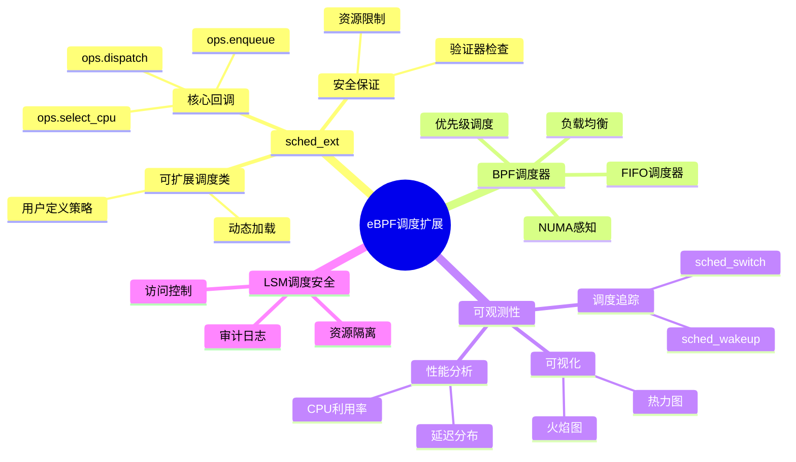
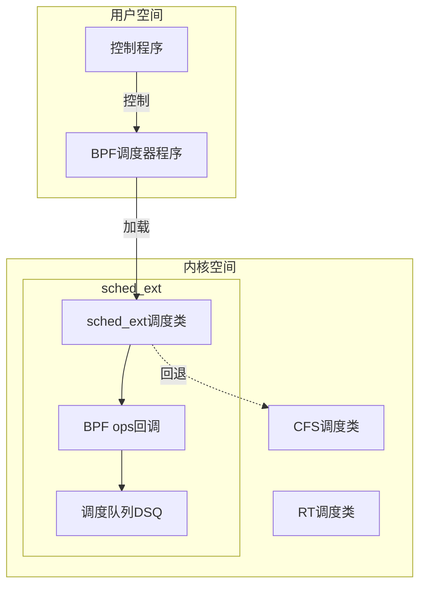

# 3.6 eBPF调度扩展

> **子主题编号**: 03.6
> **主题**: OS抽象层
> **最后更新**: 2025-12-02
> **文档状态**: ✅ 完成

---

## 📋 目录

- [1 概述](#1-概述)
- [2 思维导图](#2-思维导图)
- [3 sched_ext框架](#3-sched_ext框架)
- [4 BPF调度器实现](#4-bpf调度器实现)
- [5 可观测性调度](#5-可观测性调度)
- [6 知识矩阵](#6-知识矩阵)
- [7 实践案例](#7-实践案例)
- [8 跨视角链接](#8-跨视角链接)

---

## 1 概述

### 1.1 核心洞察

eBPF（Extended Berkeley Packet Filter）已从网络包过滤发展为通用的内核可编程框架。在调度领域，eBPF带来了革命性的变化：**用户空间可以安全地扩展和定制内核调度行为**。

### 1.2 eBPF调度特性

| 特性 | 描述 | 调度应用 |
|------|------|---------|
| **安全性** | 验证器保证程序安全 | 安全的调度扩展 |
| **高性能** | JIT编译，接近原生性能 | 低开销调度 |
| **动态性** | 运行时加载/卸载 | 动态调度策略 |
| **可观测性** | 丰富的追踪能力 | 调度分析优化 |
| **可移植性** | CO-RE跨内核版本 | 通用调度器 |

---

## 2 思维导图



---

## 3 sched_ext框架

### 3.1 sched_ext架构



### 3.2 核心回调函数

```c
/*
 * sched_ext BPF调度器操作结构
 */
struct sched_ext_ops {
    /* 选择运行CPU */
    s32 (*select_cpu)(struct task_struct *p, s32 prev_cpu, u64 wake_flags);

    /* 入队回调 */
    void (*enqueue)(struct task_struct *p, u64 enq_flags);

    /* 出队回调 */
    void (*dequeue)(struct task_struct *p, u64 deq_flags);

    /* 调度分发 */
    void (*dispatch)(s32 cpu, struct task_struct *prev);

    /* 运行中回调 */
    void (*running)(struct task_struct *p);

    /* 停止运行回调 */
    void (*stopping)(struct task_struct *p, bool runnable);

    /* 时间片耗尽 */
    void (*tick)(struct task_struct *p);

    /* 任务创建 */
    s32 (*init_task)(struct task_struct *p, struct scx_init_task_args *args);

    /* 任务退出 */
    void (*exit_task)(struct task_struct *p, struct scx_exit_task_args *args);

    /* 调度器初始化 */
    s32 (*init)(void);

    /* 调度器退出 */
    void (*exit)(struct scx_exit_info *info);

    /* 调度器名称 */
    char name[SCX_OPS_NAME_LEN];

    /* 超时时间(ns) */
    u64 timeout_ms;

    /* 调度类flags */
    u64 flags;
};
```

### 3.3 调度队列(DSQ)

```text
DSQ (Dispatch Queue) 架构:

┌─────────────────────────────────────────────┐
│              全局DSQ                         │
│   ┌─────┐ ┌─────┐ ┌─────┐ ┌─────┐          │
│   │Task1│→│Task2│→│Task3│→│Task4│          │
│   └─────┘ └─────┘ └─────┘ └─────┘          │
└─────────────────────────────────────────────┘
                    ↓
    ┌───────────────┼───────────────┐
    ↓               ↓               ↓
┌───────┐       ┌───────┐       ┌───────┐
│CPU 0  │       │CPU 1  │       │CPU N  │
│ DSQ   │       │ DSQ   │       │ DSQ   │
└───────┘       └───────┘       └───────┘

操作:
- scx_bpf_dispatch(): 将任务放入DSQ
- scx_bpf_consume(): 从DSQ获取任务
- scx_bpf_dispatch_vtime(): VTIME排序分发
```

---

## 4 BPF调度器实现

### 4.1 简单FIFO调度器

```c
// simple_fifo.bpf.c - 简单FIFO调度器
#include <scx/common.bpf.h>

char _license[] SEC("license") = "GPL";

/* 全局FIFO队列 */
#define SHARED_DSQ 0

/* 选择CPU - 使用之前的CPU */
s32 BPF_STRUCT_OPS(fifo_select_cpu, struct task_struct *p,
                   s32 prev_cpu, u64 wake_flags)
{
    return prev_cpu;
}

/* 入队 - 放入共享队列 */
void BPF_STRUCT_OPS(fifo_enqueue, struct task_struct *p, u64 enq_flags)
{
    scx_bpf_dispatch(p, SHARED_DSQ, SCX_SLICE_DFL, enq_flags);
}

/* 调度分发 - 从共享队列获取 */
void BPF_STRUCT_OPS(fifo_dispatch, s32 cpu, struct task_struct *prev)
{
    scx_bpf_consume(SHARED_DSQ);
}

/* 初始化 */
s32 BPF_STRUCT_OPS_SLEEPABLE(fifo_init)
{
    return scx_bpf_create_dsq(SHARED_DSQ, -1);
}

/* 调度器ops定义 */
SCX_OPS_DEFINE(fifo_ops,
    .select_cpu     = (void *)fifo_select_cpu,
    .enqueue        = (void *)fifo_enqueue,
    .dispatch       = (void *)fifo_dispatch,
    .init           = (void *)fifo_init,
    .name           = "fifo");
```

### 4.2 优先级调度器

```c
// priority.bpf.c - 优先级调度器
#include <scx/common.bpf.h>

char _license[] SEC("license") = "GPL";

/* 优先级队列 */
#define HIGH_PRIO_DSQ   0
#define NORMAL_PRIO_DSQ 1
#define LOW_PRIO_DSQ    2

/* 任务优先级映射 */
struct {
    __uint(type, BPF_MAP_TYPE_HASH);
    __type(key, pid_t);
    __type(value, u32);  /* 优先级: 0=high, 1=normal, 2=low */
    __uint(max_entries, 10000);
} task_priority SEC(".maps");

/* 获取任务优先级 */
static u32 get_priority(struct task_struct *p)
{
    u32 *prio = bpf_map_lookup_elem(&task_priority, &p->pid);
    return prio ? *prio : NORMAL_PRIO_DSQ;
}

/* 入队 - 按优先级分发 */
void BPF_STRUCT_OPS(prio_enqueue, struct task_struct *p, u64 enq_flags)
{
    u32 prio = get_priority(p);
    scx_bpf_dispatch(p, prio, SCX_SLICE_DFL, enq_flags);
}

/* 调度分发 - 优先高优先级队列 */
void BPF_STRUCT_OPS(prio_dispatch, s32 cpu, struct task_struct *prev)
{
    if (scx_bpf_consume(HIGH_PRIO_DSQ))
        return;
    if (scx_bpf_consume(NORMAL_PRIO_DSQ))
        return;
    scx_bpf_consume(LOW_PRIO_DSQ);
}

s32 BPF_STRUCT_OPS_SLEEPABLE(prio_init)
{
    s32 ret;
    ret = scx_bpf_create_dsq(HIGH_PRIO_DSQ, -1);
    if (ret) return ret;
    ret = scx_bpf_create_dsq(NORMAL_PRIO_DSQ, -1);
    if (ret) return ret;
    return scx_bpf_create_dsq(LOW_PRIO_DSQ, -1);
}

SCX_OPS_DEFINE(prio_ops,
    .enqueue    = (void *)prio_enqueue,
    .dispatch   = (void *)prio_dispatch,
    .init       = (void *)prio_init,
    .name       = "priority");
```

### 4.3 NUMA感知调度器

```c
// numa_aware.bpf.c - NUMA感知调度器
#include <scx/common.bpf.h>

char _license[] SEC("license") = "GPL";

/* 每NUMA节点DSQ */
#define MAX_NUMA_NODES 8
#define NUMA_DSQ_BASE 100

/* NUMA拓扑信息 */
struct numa_info {
    u32 node_id;
    u32 cpu_mask;
};

struct {
    __uint(type, BPF_MAP_TYPE_ARRAY);
    __type(key, u32);
    __type(value, struct numa_info);
    __uint(max_entries, MAX_CPUS);
} cpu_numa_map SEC(".maps");

/* 获取CPU的NUMA节点 */
static u32 get_numa_node(s32 cpu)
{
    struct numa_info *info = bpf_map_lookup_elem(&cpu_numa_map, &cpu);
    return info ? info->node_id : 0;
}

/* 选择CPU - NUMA亲和性 */
s32 BPF_STRUCT_OPS(numa_select_cpu, struct task_struct *p,
                   s32 prev_cpu, u64 wake_flags)
{
    u32 prev_node = get_numa_node(prev_cpu);

    /* 优先选择同NUMA节点的CPU */
    bpf_for(cpu, 0, nr_cpus) {
        if (get_numa_node(cpu) == prev_node &&
            scx_bpf_cpumask_test_cpu(cpu, p->cpus_ptr)) {
            return cpu;
        }
    }

    return prev_cpu;
}

/* 入队 - 按NUMA节点分发 */
void BPF_STRUCT_OPS(numa_enqueue, struct task_struct *p, u64 enq_flags)
{
    u32 node = get_numa_node(scx_bpf_task_cpu(p));
    u64 dsq_id = NUMA_DSQ_BASE + node;
    scx_bpf_dispatch(p, dsq_id, SCX_SLICE_DFL, enq_flags);
}

/* 调度分发 - 优先本地NUMA队列 */
void BPF_STRUCT_OPS(numa_dispatch, s32 cpu, struct task_struct *prev)
{
    u32 local_node = get_numa_node(cpu);
    u64 local_dsq = NUMA_DSQ_BASE + local_node;

    /* 先尝试本地队列 */
    if (scx_bpf_consume(local_dsq))
        return;

    /* 遍历其他NUMA节点 */
    bpf_for(node, 0, MAX_NUMA_NODES) {
        if (node != local_node) {
            if (scx_bpf_consume(NUMA_DSQ_BASE + node))
                return;
        }
    }
}

SCX_OPS_DEFINE(numa_ops,
    .select_cpu = (void *)numa_select_cpu,
    .enqueue    = (void *)numa_enqueue,
    .dispatch   = (void *)numa_dispatch,
    .name       = "numa_aware");
```

---

## 5 可观测性调度

### 5.1 调度追踪

```c
// sched_trace.bpf.c - 调度追踪
#include <vmlinux.h>
#include <bpf/bpf_helpers.h>
#include <bpf/bpf_tracing.h>

/* 调度事件结构 */
struct sched_event {
    u64 timestamp;
    u32 prev_pid;
    u32 next_pid;
    u32 cpu;
    u64 prev_runtime;
    char prev_comm[16];
    char next_comm[16];
};

/* 事件环形缓冲区 */
struct {
    __uint(type, BPF_MAP_TYPE_RINGBUF);
    __uint(max_entries, 256 * 1024);
} events SEC(".maps");

/* 调度切换追踪点 */
SEC("tp/sched/sched_switch")
int trace_sched_switch(struct trace_event_raw_sched_switch *ctx)
{
    struct sched_event *e;

    e = bpf_ringbuf_reserve(&events, sizeof(*e), 0);
    if (!e)
        return 0;

    e->timestamp = bpf_ktime_get_ns();
    e->prev_pid = ctx->prev_pid;
    e->next_pid = ctx->next_pid;
    e->cpu = bpf_get_smp_processor_id();

    bpf_probe_read_kernel_str(e->prev_comm, sizeof(e->prev_comm), ctx->prev_comm);
    bpf_probe_read_kernel_str(e->next_comm, sizeof(e->next_comm), ctx->next_comm);

    bpf_ringbuf_submit(e, 0);
    return 0;
}

/* 唤醒追踪点 */
SEC("tp/sched/sched_wakeup")
int trace_sched_wakeup(struct trace_event_raw_sched_wakeup *ctx)
{
    // 记录唤醒延迟
    return 0;
}

char LICENSE[] SEC("license") = "GPL";
```

### 5.2 调度延迟分析

```c
// sched_latency.bpf.c - 调度延迟分析
#include <vmlinux.h>
#include <bpf/bpf_helpers.h>

/* 延迟直方图 */
struct {
    __uint(type, BPF_MAP_TYPE_HASH);
    __type(key, u32);  /* 延迟桶 (log2) */
    __type(value, u64);  /* 计数 */
    __uint(max_entries, 64);
} latency_hist SEC(".maps");

/* 任务唤醒时间记录 */
struct {
    __uint(type, BPF_MAP_TYPE_HASH);
    __type(key, u32);  /* pid */
    __type(value, u64);  /* 唤醒时间 */
    __uint(max_entries, 10000);
} wakeup_times SEC(".maps");

SEC("tp/sched/sched_wakeup")
int trace_wakeup(struct trace_event_raw_sched_wakeup *ctx)
{
    u64 ts = bpf_ktime_get_ns();
    u32 pid = ctx->pid;
    bpf_map_update_elem(&wakeup_times, &pid, &ts, BPF_ANY);
    return 0;
}

SEC("tp/sched/sched_switch")
int trace_switch(struct trace_event_raw_sched_switch *ctx)
{
    u32 pid = ctx->next_pid;
    u64 *wakeup_ts = bpf_map_lookup_elem(&wakeup_times, &pid);

    if (wakeup_ts) {
        u64 now = bpf_ktime_get_ns();
        u64 latency = now - *wakeup_ts;

        /* 计算log2桶 */
        u32 bucket = 0;
        u64 temp = latency;
        while (temp > 1) {
            temp >>= 1;
            bucket++;
        }

        /* 更新直方图 */
        u64 *count = bpf_map_lookup_elem(&latency_hist, &bucket);
        if (count) {
            __sync_fetch_and_add(count, 1);
        } else {
            u64 init = 1;
            bpf_map_update_elem(&latency_hist, &bucket, &init, BPF_ANY);
        }

        bpf_map_delete_elem(&wakeup_times, &pid);
    }

    return 0;
}

char LICENSE[] SEC("license") = "GPL";
```

---

## 6 知识矩阵

### 6.1 eBPF调度技术对比

| 技术 | 适用场景 | 复杂度 | 性能开销 |
|------|---------|-------|---------|
| **sched_ext** | 自定义调度策略 | 高 | 低 |
| **调度追踪** | 性能分析 | 低 | 中 |
| **LSM调度** | 安全策略 | 中 | 低 |
| **cgroup调度** | 资源隔离 | 中 | 低 |

### 6.2 调度器实现对比

| 调度器 | 策略 | 适用场景 | 复杂度 |
|-------|------|---------|-------|
| **FIFO** | 先进先出 | 简单任务 | 低 |
| **优先级** | 优先级队列 | 差异化服务 | 中 |
| **NUMA感知** | NUMA亲和 | 大内存系统 | 高 |
| **负载均衡** | 动态迁移 | 多核系统 | 高 |

---

## 7 实践案例

### 7.1 Google ghOSt

```text
ghOSt (Google Host):
- 用户空间调度框架
- 基于sched_ext
- 支持复杂调度策略
- Google数据中心使用

架构:
  用户空间Agent → sched_ext → 内核调度

特点:
- 微秒级调度决策
- 支持机器学习调度
- 动态策略更新
```

### 7.2 Meta sched_ext调度器

```text
Meta的sched_ext使用:
- scx_rusty: Rust实现的负载均衡调度器
- scx_lavd: 低延迟音视频调度器
- scx_layered: 分层调度策略

使用方式:
$ sudo scx_rusty  # 启动Rust调度器
$ sudo scx_lavd   # 启动低延迟调度器
```

---

## 8 跨视角链接

### 8.1 调度视角关联

- [进程调度模型](./03.1_进程调度模型.md) - 基础调度
- [Linux调度视角](./03.0_Linux调度视角全面分析.md) - Linux调度
- [AI驱动调度](../10_AI驱动调度/) - 智能调度

### 8.2 形式语言视角关联

| 形式语言概念 | eBPF调度对应 | 映射说明 |
|------------|-------------|---------|
| **类型安全** | 验证器检查 | 程序安全保证 |
| **效应系统** | 辅助函数 | 副作用控制 |
| **模块系统** | BPF程序模块 | 代码组织 |

---

**返回**: [OS抽象层主索引](./README.md) | [调度视角主索引](../README.md)
