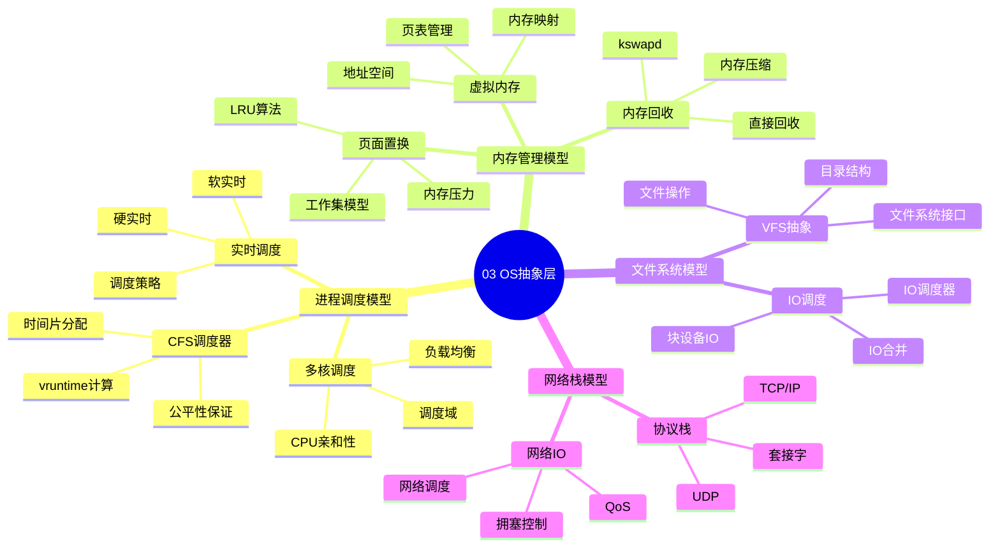

# 03. OS抽象层

> **主题**: OS抽象层技术特征
> **覆盖范围**: 进程调度、内存管理、文件系统、设备驱动、网络栈

---

## 📋 目录

- [03. OS抽象层](#03-os抽象层)
  - [📋 目录](#-目录)
  - [1 子主题索引](#1-子主题索引)
    - [1.0 OS抽象层思维导图](#10-os抽象层思维导图)
  - [2 相关主题](#2-相关主题)
  - [3 核心概念矩阵](#3-核心概念矩阵)
  - [3.1 系统软件层调度性能指标（整合自view文件夹）](#31-系统软件层调度性能指标整合自view文件夹)

---

## 1 子主题索引

### 1.0 OS抽象层思维导图

**可视化文档**: 查看 [思维导图与知识矩阵](../思维导图与知识矩阵.md#33-03-os抽象层) 获取更详细的思维导图。

- [3.0 Linux 调度视角全面分析](./03.0_Linux调度视角全面分析.md) - **从调度视角梳理Linux操作系统，包含思维导图和多维对比矩阵**
- [3.1 进程调度模型](./03.1_进程调度模型.md) - CFS调度器、实时调度、NUMA感知
- [3.2 内存管理模型](./03.2_内存管理模型.md) - 虚拟内存、页表、分配器
- [3.3 文件系统模型](./03.3_文件系统模型.md) - VFS、块IO调度、日志
- [3.4 设备驱动模型](./03.4_设备驱动模型.md) - 总线-设备-驱动、中断处理
- [3.5 网络栈模型](./03.5_网络栈模型.md) - TCP/IP、NAPI、零拷贝

---

## 2 相关主题

- [01. CPU硬件层](../01_CPU硬件层/README.md) - 硬件特性暴露
- [02. 系统总线层](../02_系统总线层/README.md) - 设备发现与配置
- [06. 调度模型](../06_调度模型/README.md) - 调度理论

---

## 3 核心概念矩阵

| **抽象层** | **硬件映射** | **延迟** | **OS开销** | **优化方向** |
|-----------|-------------|----------|------------|-------------|
| **进程调度** | CPU时间片 | 5μs | 95% | PCID、巨页 |
| **内存管理** | DRAM页 | 80ns | 50% | NUMA绑定 |
| **文件系统** | 块设备 | 100μs | 5% | DAX、io_uring |
| **设备驱动** | PCIe设备 | 1μs | 40% | VFIO直通 |
| **网络栈** | 网卡 | 50μs | 40% | DPDK、XDP |

## 3.1 系统软件层调度性能指标（整合自view文件夹）

| **调度对象** | **调度粒度** | **延迟范围** | **主要约束** | **典型实现** |
|------------|------------|------------|------------|------------|
| **进程** | 进程/线程 | 1ms-20ms | 公平性、优先级 | CFS调度器 |
| **内存页** | 4KB页 | 100ns-1ms | 容量限制 | LRU近似 |
| **块IO** | 扇区/块 | 100μs-10ms | 寻道时间 | Deadline调度 |
| **网络包** | 数据包 | 10μs-1ms | 带宽限制 | NAPI机制 |
| **中断** | 中断向量 | 1μs-10μs | 实时性 | 中断亲和性 |
| **RTOS任务** | 实时任务 | 微秒级 | 截止时间 | EDF/RM调度 |

---

**最后更新**: 2025-11-14
