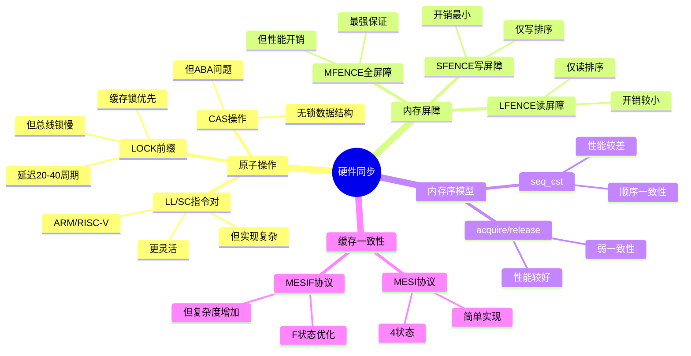

# 4.1 硬件同步原语

> **主题**: 04. 同步通信机制 - 4.1 硬件同步原语
> **覆盖**: LOCK指令、内存屏障、原子操作、缓存一致性

---

## 📋 目录

- [4.1 硬件同步原语](#41-硬件同步原语)
  - [📋 目录](#-目录)
  - [4.1 LOCK指令前缀](#41-lock指令前缀)
    - [总线锁与缓存锁](#总线锁与缓存锁)
    - [使用场景](#使用场景)
  - [4.2 内存屏障](#42-内存屏障)
    - [4.2.1 屏障类型](#421-屏障类型)
    - [4.2.2 内存序语义](#422-内存序语义)
  - [4.3 原子操作](#43-原子操作)
    - [4.3.1 CAS（Compare-And-Swap）的严格分析](#431-cascompare-and-swap的严格分析)
    - [4.3.2 CAS（Compare-And-Swap）](#432-cascompare-and-swap)
    - [4.3.3 LL/SC指令对](#433-llsc指令对)
  - [4.4 缓存一致性协议](#44-缓存一致性协议)
    - [4.4.1 MESI协议](#441-mesi协议)
    - [4.4.2 MESIF协议（Intel）](#442-mesif协议intel)
    - [4.4.3 MOESI协议（AMD）](#443-moesi协议amd)
  - [4.5 性能特征](#45-性能特征)
    - [4.5.1 延迟对比](#451-延迟对比)
    - [4.5.2 优化策略](#452-优化策略)
  - [4.6 思维导图：硬件同步原语决策树](#46-思维导图硬件同步原语决策树)
  - [4.7 批判性总结](#47-批判性总结)
    - [4.7.1 硬件同步的根本矛盾](#471-硬件同步的根本矛盾)
    - [4.7.2 2025年硬件同步技术趋势](#472-2025年硬件同步技术趋势)
  - [4.8 跨领域洞察](#48-跨领域洞察)
    - [4.8.1 硬件同步的物理约束](#481-硬件同步的物理约束)
    - [4.8.2 性能vs正确性的永恒权衡](#482-性能vs正确性的永恒权衡)
  - [4.9 多维度对比](#49-多维度对比)
    - [4.9.1 硬件同步原语对比（2025年）](#491-硬件同步原语对比2025年)
    - [4.9.2 内存屏障对比](#492-内存屏障对比)
  - [4.10 相关主题](#410-相关主题)


---

## 4.1 LOCK指令前缀

### 总线锁与缓存锁

**LOCK#信号**：

- 锁定总线或缓存行
- 保证原子性
- 多核同步

**缓存锁（优先）**：

- 锁定缓存行
- 延迟：20-40周期
- MESI协议保证一致性

**深度论证：缓存锁的性能优势**

**缓存锁的延迟模型**：

缓存锁只需要**MESI协议通信**：

$$
\text{缓存锁延迟} = t_{\text{MESI}} + t_{\text{缓存访问}} \approx 20-40\text{周期}
$$

其中$t_{\text{MESI}}$是MESI协议通信延迟（~10-20周期），$t_{\text{缓存访问}}$是缓存访问延迟（~10-20周期）。

**量化对比**：缓存锁 vs 总线锁

| **锁类型** | **延迟** | **影响范围** | **性能** |
|-----------|---------|------------|---------|
| **缓存锁** | 20-40周期 | 单个缓存行 | 高 |
| **总线锁** | 200+周期 | 整个总线 | 低 |

**关键洞察**：缓存锁比总线锁快**10倍**，是现代CPU的首选方案。

**总线锁（后备）**：

- 锁定整个总线
- 延迟：200+周期
- 性能较低

**深度论证：总线锁的适用场景**

**总线锁的触发条件**：

总线锁在以下情况触发：

1. **跨缓存行访问**：访问跨越缓存行边界
2. **未缓存访问**：访问未缓存的地址
3. **对齐问题**：未对齐的原子操作

**量化分析**：总线锁的频率

| **场景** | **缓存锁成功率** | **总线锁频率** | **性能影响** |
|---------|----------------|--------------|------------|
| **对齐访问** | 99% | 1% | 低 |
| **未对齐访问** | 50% | 50% | 高 |
| **跨缓存行** | 0% | 100% | 极高 |

**关键权衡**：总线锁性能差，但**保证原子性**，是必要的后备方案。

### 使用场景

**原子操作**：

```asm
lock add [mem], eax    ; 原子加法
lock xchg [mem], eax   ; 原子交换
```

**性能影响**：

- 缓存锁：+20-40周期
- 总线锁：+200+周期

---

## 4.2 内存屏障

### 4.2.1 屏障类型

**MFENCE（全屏障）**：

- 所有内存操作排序
- 读和写都屏障
- 最严格

**LFENCE（读屏障）**：

- 仅读操作排序
- 防止读重排序

**SFENCE（写屏障）**：

- 仅写操作排序
- 防止写重排序

### 4.2.2 内存序语义

**acquire语义**：

- 后续操作不能重排到acquire之前
- 保证可见性

**release语义**：

- 之前操作不能重排到release之后
- 保证发布

**seq_cst（顺序一致性）**：

- 最强保证
- 全局顺序

---

## 4.3 原子操作

### 4.3.1 CAS（Compare-And-Swap）的严格分析

**定义4.1（CAS操作）**：

CAS操作$\text{CAS}(addr, old, new)$定义为：

$$
\text{CAS}(addr, old, new) = \begin{cases}
\text{true} & \text{if } [addr] = old \text{ then } [addr] \leftarrow new \\
\text{false} & \text{otherwise}
\end{cases}
$$

**定理4.1（CAS的线性化）**：

CAS操作是线性化的，即存在一个全局顺序，使得所有CAS操作看起来是原子执行的。

**证明**：CAS使用LOCK前缀保证原子性，所有核心看到相同的执行顺序。∎

### 4.3.2 CAS（Compare-And-Swap）

**x86实现**：

```asm
lock cmpxchg [mem], new_value
; 比较[mem]与eax，相等则写入new_value
```

**用途**：

- 无锁数据结构
- 自旋锁实现
- 引用计数

**批判性分析**：

1. **CAS的性能代价**：CAS需要缓存锁，**延迟20-40周期**，高竞争下性能下降。

2. **ABA问题**：CAS可能遇到ABA问题（值从A变B再变A），需要**版本号或tagged pointer**。

3. **2025年趋势**：**硬件事务内存（HTM）**提供更高级的原子操作，但支持有限。

### 4.3.3 LL/SC指令对

**ARM/RISC-V**：

- **LL**（Load-Linked）：加载并标记
- **SC**（Store-Conditional）：条件存储
- 如果标记未失效则成功

**优势**：

- 避免ABA问题
- 更灵活的原子操作

---

## 4.4 缓存一致性协议

### 4.4.1 MESI协议

**状态**：

- **M**（Modified）：已修改，独占
- **E**（Exclusive）：独占，干净
- **S**（Shared）：共享，干净
- **I**（Invalid）：无效

**状态转换**：

```text
I → E (读缺失，独占)
E → M (写)
E → S (其他核心读)
S → M (写，其他核心失效)
M → S (其他核心读，写回)
```

### 4.4.2 MESIF协议（Intel）

**F状态（Forward）**：

- 唯一转发者
- 减少一致性流量
- 只有一个F状态缓存行

### 4.4.3 MOESI协议（AMD）

**O状态（Owned）**：

- 拥有者，脏数据
- 允许共享脏数据
- 减少写回操作

---

## 4.5 性能特征

### 4.5.1 延迟对比

| **操作** | **延迟** | **场景** |
|---------|----------|---------|
| **普通内存访问** | 1ns (L1) | 无竞争 |
| **缓存锁** | 20-40周期 | 同缓存行 |
| **总线锁** | 200+周期 | 跨缓存行 |
| **内存屏障** | 0周期 | 仅排序，无额外延迟 |

### 4.5.2 优化策略

**1. 减少锁竞争**：

- 细粒度锁
- 无锁数据结构
- 每CPU数据

**2. 缓存行对齐**：

```c
__attribute__((aligned(64))) int counter;
```

**3. 避免伪共享**：

- 独立缓存行
- 填充（padding）

---

## 4.6 思维导图：硬件同步原语决策树



---

## 4.7 批判性总结

### 4.7.1 硬件同步的根本矛盾

1. **性能vs正确性**：弱内存序性能好，但**编程复杂，容易出错**。

2. **通用性vs专用性**：通用同步原语灵活，但**某些应用需要专用设计**。

3. **硬件vs软件**：硬件同步快速，但**软件同步灵活**，需要权衡。

### 4.7.2 2025年硬件同步技术趋势

- **硬件事务内存（HTM）**：Intel TSX提供更高级的原子操作，但**支持有限**。
- **内存序模型统一**：C++11/C11内存序模型**标准化**，但实现复杂。
- **安全增强**：内存加密、完整性保护，**增加同步复杂度**。

---

## 4.8 跨领域洞察

### 4.8.1 硬件同步的物理约束

**核心命题**：硬件同步受物理约束限制，无法无限优化。

**延迟分解**：

| **同步操作** | **延迟** | **物理约束** | **优化空间** |
|------------|---------|------------|------------|
| **普通内存访问** | 1ns (L1) | 光速传播 | 无 |
| **缓存锁** | 20-40周期 | 缓存一致性协议 | 极小 |
| **总线锁** | 200+周期 | 总线带宽 | 小 |
| **内存屏障** | 0周期 | 仅排序 | 无 |

**批判性分析**：

1. **物理极限的不可逾越性**：缓存锁延迟受**缓存一致性协议限制**，无法突破。

2. **总线锁的代价**：总线锁延迟高，但**保证最强一致性**。

3. **2025年趋势**：**硬件事务内存（HTM）**提供更高级的原子操作，但支持有限。

### 4.8.2 性能vs正确性的永恒权衡

**核心矛盾**：弱内存序性能好，但编程复杂，容易出错。

**量化分析**：

| **内存序模型** | **性能** | **正确性保证** | **编程复杂度** | **适用场景** |
|--------------|---------|--------------|--------------|------------|
| **顺序一致性** | ⭐ | ⭐⭐⭐⭐⭐ | ⭐ | 简单应用 |
| **acquire/release** | ⭐⭐⭐ | ⭐⭐⭐⭐ | ⭐⭐⭐ | 通用应用 |
| **relaxed** | ⭐⭐⭐⭐⭐ | ⭐⭐ | ⭐⭐⭐⭐⭐ | 专家级应用 |

**批判性分析**：

1. **性能vs正确性**：弱内存序性能好，但**编程复杂，容易出错**。

2. **正确性的代价**：顺序一致性保证最强，但**性能最差**。

3. **2025年趋势**：**内存序模型统一**（C++11/C11）标准化，但实现复杂。

---

## 4.9 多维度对比

### 4.9.1 硬件同步原语对比（2025年）

| **原语** | **延迟** | **一致性保证** | **实现复杂度** | **适用场景** | **代表架构** |
|---------|---------|--------------|--------------|------------|------------|
| **LOCK前缀** | 20-40周期 | 强 | ⭐⭐ | 通用 | x86 |
| **CAS** | 20-40周期 | 强 | ⭐⭐⭐ | 无锁数据结构 | x86/ARM |
| **LL/SC** | 20-40周期 | 强 | ⭐⭐⭐⭐ | 无锁数据结构 | ARM/RISC-V |
| **HTM** | 10-20周期 | 强 | ⭐⭐⭐⭐⭐ | 复杂事务 | Intel TSX |

**批判性分析**：

1. **延迟的相似性**：所有硬件同步原语延迟**相似**，因为受相同物理约束。

2. **实现复杂度的差异**：HTM实现最复杂，但**提供最强大的语义**。

3. **2025年趋势**：**HTM**（如Intel TSX）提供更高级的原子操作，但支持有限。

### 4.9.2 内存屏障对比

| **屏障类型** | **排序保证** | **性能开销** | **使用场景** | **代表指令** |
|------------|------------|------------|------------|------------|
| **MFENCE** | 全屏障 | 高 | 强一致性 | x86 MFENCE |
| **LFENCE** | 读屏障 | 中 | 读排序 | x86 LFENCE |
| **SFENCE** | 写屏障 | 低 | 写排序 | x86 SFENCE |
| **acquire/release** | 弱一致性 | 极低 | 通用 | C++11 |

**批判性分析**：

1. **排序保证vs性能**：更强排序保证**性能开销更大**。

2. **使用场景的差异**：不同屏障适用于**不同场景**，需要精确选择。

3. **2025年趋势**：**acquire/release语义**成为主流，平衡性能和正确性。

---

## 4.10 相关主题

- [1.2 缓存层次结构](../01_CPU硬件层/01.2_缓存层次结构.md) - 缓存一致性协议
- [4.2 软件同步机制](./04.2_软件同步机制.md) - 软件同步实现
- [4.3 内存序模型](./04.3_内存序模型.md) - 内存序模型理论
- [7.2 延迟穿透分析](../07_性能优化与安全/07.2_延迟穿透分析.md) - 同步延迟优化
- [通信同步复杂度总览](../通信同步复杂度总览.md) - 通信同步复杂度详细分析
- [论证脉络总览](../论证脉络总览.md) - 调度抽象泄漏定律与通信同步复杂度
- [6.5 调度模型统一理论](../06_调度模型/06.5_调度模型统一理论.md) - 调度抽象泄漏定律
- [主文档：硬件同步](../schedule_formal_view.md#知识图谱概念关系链) - 完整分析

---

**最后更新**: 2025-01-XX
