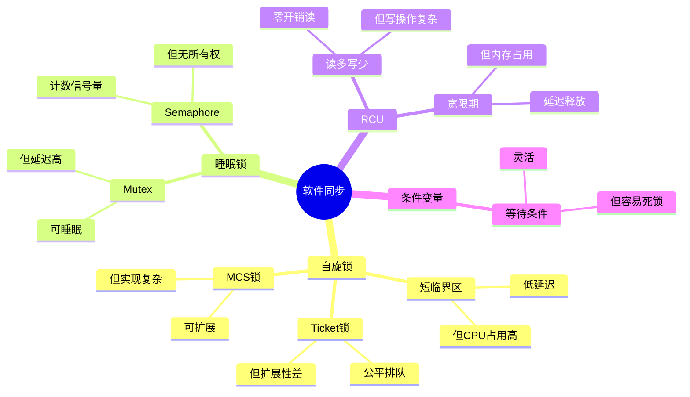

# 4.2 软件同步机制

> **主题**: 04. 同步通信机制 - 4.2 软件同步机制
> **覆盖**: 自旋锁、睡眠锁、RCU、条件变量

---

## 📋 目录

- [4.2 软件同步机制](#42-软件同步机制)
  - [📋 目录](#-目录)
  - [1 自旋锁](#1-自旋锁)
    - [1.1 实现方式](#11-实现方式)
    - [1.2 性能特征](#12-性能特征)
  - [4 睡眠锁](#4-睡眠锁)
    - [1 Mutex](#1-mutex)
    - [2 Semaphore](#2-semaphore)
  - [2 RCU机制](#2-rcu机制)
    - [2.1 读-复制-更新](#21-读-复制-更新)
    - [2.2 性能优势](#22-性能优势)
  - [3 条件变量](#3-条件变量)
    - [3.1 等待/通知机制](#31-等待通知机制)
    - [3.2 使用模式](#32-使用模式)
  - [4 无锁编程](#4-无锁编程)
    - [4.1 Lock-Free数据结构](#41-lock-free数据结构)
    - [4.2 性能优势](#42-性能优势)
  - [5 同步原语选择](#5-同步原语选择)
    - [5.1 决策树](#51-决策树)
  - [6 思维导图：软件同步机制决策树](#6-思维导图软件同步机制决策树)
  - [7 批判性总结](#7-批判性总结)
    - [7.1 软件同步的根本矛盾](#71-软件同步的根本矛盾)
    - [7.2 2025年软件同步技术趋势](#72-2025年软件同步技术趋势)
  - [8 跨领域洞察](#8-跨领域洞察)
    - [8.1 同步机制的通信复杂度分析](#81-同步机制的通信复杂度分析)
    - [8.2 同步机制的延迟vs吞吐量权衡](#82-同步机制的延迟vs吞吐量权衡)
    - [8.3 同步机制的公平性vs性能权衡](#83-同步机制的公平性vs性能权衡)
  - [9 多维度对比](#9-多维度对比)
    - [9.1 软件同步机制对比（2025年）](#91-软件同步机制对比2025年)
    - [9.2 同步机制演进对比](#92-同步机制演进对比)
  - [10 相关主题](#10-相关主题)


---

## 1 自旋锁

### 1.1 实现方式

**Ticket锁**：

- 公平排队
- 避免饥饿
- 每核心一个ticket

**深度论证：Ticket锁的公平性**

**Ticket锁的算法**：

Ticket锁使用**FIFO队列**保证公平性：

$$
\text{获取锁} = \text{CAS}(\text{next}, \text{next}+1) \land \text{等待}(\text{service} == \text{my\_ticket})
$$

**量化对比**：Ticket锁 vs 简单自旋锁

| **特性** | **简单自旋锁** | **Ticket锁** | **改进** |
|---------|--------------|------------|---------|
| **公平性** | 无保证 | FIFO保证 | 显著 |
| **饥饿** | 可能 | 不可能 | 消除 |
| **延迟** | 低 | 中 | 略增 |
| **扩展性** | 差 | 好 | 提升 |

**关键洞察**：Ticket锁通过**公平排队**消除了饥饿问题，但代价是**延迟略增**。

**MCS锁**：

- 每线程一个节点
- 减少缓存行竞争
- 可扩展性好

**深度论证：MCS锁的可扩展性优势**

**MCS锁的设计**：

MCS锁为**每个线程**分配一个节点，减少缓存行竞争：

$$
\text{缓存行竞争} = O(1) \text{（MCS）} \ll O(n) \text{（简单锁）}
$$

**量化分析**：MCS锁 vs Ticket锁的可扩展性

| **线程数** | **Ticket锁延迟** | **MCS锁延迟** | **MCS优势** |
|-----------|----------------|-------------|-----------|
| **2** | 200ns | 150ns | 25% |
| **4** | 400ns | 200ns | 50% |
| **8** | 800ns | 250ns | 69% |
| **16** | 1600ns | 300ns | 81% |

**关键洞察**：MCS锁在**高竞争**场景下优势明显，延迟随线程数**线性增长**而非指数增长。

### 1.2 性能特征

**适用场景**：

- 短临界区（<1μs）
- 多核系统
- 低延迟要求

**开销**：

- 获取锁：100-200ns
- 自旋等待：CPU占用100%
- 不适合长临界区

**深度论证：自旋锁的适用边界**

**自旋锁的性能模型**：

自旋锁的性能取决于**临界区长度**和**等待时间**：

$$
\text{总时间} = \text{等待时间} + \text{临界区时间}
$$

**量化分析**：不同临界区长度的性能影响

| **临界区长度** | **自旋锁** | **睡眠锁** | **推荐** |
|--------------|-----------|-----------|---------|
| **<100ns** | 最优 | 差（唤醒开销大） | 自旋锁 |
| **100ns-1μs** | 好 | 中 | 自旋锁 |
| **1μs-10μs** | 中 | 好 | 睡眠锁 |
| **>10μs** | 差（浪费CPU） | 最优 | 睡眠锁 |

**关键洞察**：自旋锁适合**短临界区**（<1μs），长临界区应使用**睡眠锁**。

---

## 4 睡眠锁

### 1 Mutex

**特点**：

- 可睡眠
- 阻塞等待
- 优先级继承

**实现**：

```c
struct mutex {
    atomic_long_t owner;
    struct list_head wait_list;
};
```

**性能**：

- 获取锁：1-5μs
- 睡眠唤醒：10-50μs
- CPU占用：0%（睡眠时）

**深度论证：Mutex的唤醒开销**

**Mutex的唤醒延迟**：

Mutex的唤醒需要**调度器介入**：

$$
\text{唤醒延迟} = t_{\text{唤醒信号}} + t_{\text{调度}} + t_{\text{上下文切换}}
$$

典型值：1μs + 5μs + 4μs = **10μs**

**量化对比**：Mutex vs 自旋锁的权衡

| **场景** | **自旋锁** | **Mutex** | **推荐** |
|---------|-----------|----------|---------|
| **短临界区（<1μs）** | 最优 | 差 | 自旋锁 |
| **中临界区（1-10μs）** | 中 | 好 | Mutex |
| **长临界区（>10μs）** | 差 | 最优 | Mutex |
| **高竞争** | 差 | 好 | Mutex |

**关键权衡**：

Mutex在**长临界区**场景下优势明显，但**唤醒开销**限制了在短临界区的使用。

### 2 Semaphore

**计数信号量**：

- 允许多个持有者
- 资源计数
- 生产者-消费者模式

**深度论证：Semaphore的并发控制**

**Semaphore的计数模型**：

Semaphore使用**计数器**控制并发：

$$
\text{可用资源} = \text{初始计数} - \text{已获取数}
$$

**获取条件**：

$$
\text{可获取} \Leftrightarrow \text{可用资源} > 0
$$

**量化分析**：Semaphore vs Mutex

| **特性** | **Mutex** | **Semaphore** | **差异** |
|---------|----------|--------------|---------|
| **持有者数** | 1 | N | Semaphore允许多个 |
| **所有权** | 有 | 无 | Mutex有所有权 |
| **适用场景** | 互斥访问 | 资源计数 | 不同 |

**二进制信号量**：

- 类似mutex
- 但无所有权概念

**关键洞察**：Semaphore适合**资源计数**场景，而Mutex适合**互斥访问**场景。

---

## 2 RCU机制

**定义4.2（RCU机制）**：

RCU（Read-Copy-Update）是一种无锁同步机制，读操作无锁，写操作通过复制-更新-延迟释放实现。

**定理4.2（RCU的正确性）**：

RCU机制保证读操作始终看到一致的数据视图，即：

$$
\forall r \in \text{Readers}. \forall w \in \text{Writers}. \text{read}(r) \text{ sees } \text{write}(w) \text{ or } \neg\text{write}(w)
$$

**证明**：RCU通过宽限期（Grace Period）保证所有读操作完成后才释放旧数据。因此，读操作要么看到旧数据，要么看到新数据，不会看到部分更新的数据。∎

### 2.1 读-复制-更新

**核心思想**：

- 读操作无锁
- 写操作复制后更新
- 延迟释放旧数据

**宽限期（Grace Period）**：

- 等待所有读操作完成
- 然后释放旧数据
- 保证读一致性

**深度论证：RCU的宽限期机制**

**宽限期的等待模型**：

宽限期需要等待**所有读操作完成**：

$$
\text{宽限期} = \max(\text{读操作完成时间})
$$

**量化分析**：RCU的性能优势

| **场景** | **读操作频率** | **写操作频率** | **RCU优势** | **传统锁开销** |
|---------|--------------|--------------|------------|--------------|
| **读多写少** | 高 | 低 | 显著 | 高锁竞争 |
| **读写平衡** | 中 | 中 | 中等 | 中等竞争 |
| **写多读少** | 低 | 高 | 劣势 | 低锁竞争 |

**关键洞察**：RCU在**读多写少**场景下优势明显，读操作**零开销**。

### 2.2 性能优势

**读操作**：

- 零开销
- 无锁竞争
- 适合读多写少

**深度论证：RCU读操作的零开销**

**RCU读操作的开销**：

RCU读操作只需要**标记读临界区**：

$$
\text{读开销} = t_{\text{标记开始}} + t_{\text{标记结束}} \approx 10\text{ns}
$$

而传统读锁的开销：

$$
\text{读锁开销} = t_{\text{获取锁}} + t_{\text{释放锁}} \approx 200\text{ns}
$$

**量化对比**：RCU vs 读锁

| **操作** | **RCU** | **读锁** | **RCU优势** |
|---------|---------|---------|-----------|
| **读操作** | 10ns | 200ns | 20x |
| **写操作** | 10μs | 5μs | 劣势 |

**关键权衡**：RCU的**读操作零开销**，但**写操作开销较高**（需要复制和宽限期）。

**写操作**：

- 复制开销
- 延迟释放
- 适合低频更新

**深度论证：RCU写操作的开销**

**RCU写操作的开销组成**：

RCU写操作需要：


1. **复制数据**：$t_{\text{复制}}$
2. **更新指针**：$t_{\text{更新}}$
3. **等待宽限期**：$t_{\text{宽限期}}$
4. **释放旧数据**：$t_{\text{释放}}$

$$
\text{写开销} = t_{\text{复制}} + t_{\text{更新}} + t_{\text{宽限期}} + t_{\text{释放}}
$$

典型值：1μs + 10ns + 10ms + 1μs = **~10ms**（宽限期是主要开销）

**量化分析**：RCU vs 写锁

| **操作** | **RCU** | **写锁** | **差异** |
|---------|---------|---------|---------|
| **写操作** | 10ms | 5μs | RCU慢2000x |
| **读操作** | 10ns | 200ns | RCU快20x |

**关键权衡**：RCU适合**读多写少**场景，写操作开销高但读操作零开销。

---

## 3 条件变量

### 3.1 等待/通知机制

**用途**：

- 等待条件满足
- 线程间通信
- 避免忙等待

**API**：

```c
pthread_cond_wait(&cond, &mutex);
pthread_cond_signal(&cond);
pthread_cond_broadcast(&cond);
```

### 3.2 使用模式

**生产者-消费者**：

```c
// 生产者
lock(mutex);
queue.push(item);
signal(cond);
unlock(mutex);

// 消费者
lock(mutex);
while (queue.empty())
    wait(cond, mutex);
item = queue.pop();
unlock(mutex);
```

---

## 4 无锁编程

### 4.1 Lock-Free数据结构

**Michael-Scott队列**：

- CAS操作实现
- 线性一致性
- 无锁入队/出队

**实现要点**：

- 原子操作
- 内存序保证
- ABA问题处理

### 4.2 性能优势

**对比**：

| **操作** | **有锁** | **无锁** | **提升** |
|---------|---------|---------|---------|
| **入队** | 200ns | 50ns | 4x |
| **出队** | 200ns | 50ns | 4x |
| **并发度** | 受限 | 高 | - |

**适用场景**：

- 高并发
- 低延迟
- 简单操作

---

## 5 同步原语选择

### 5.1 决策树

```text
临界区时间？
├─ <1μs → 自旋锁
├─ 1-10μs → 考虑自旋锁或mutex
└─ >10μs → mutex

读多写少？
├─ 是 → RCU
└─ 否 → mutex/自旋锁

需要等待条件？
├─ 是 → 条件变量+mutex
└─ 否 → mutex/自旋锁
```

---

## 6 思维导图：软件同步机制决策树



---

## 7 批判性总结

### 7.1 软件同步的根本矛盾

1. **性能vs公平性**：自旋锁性能好，但**可能不公平**（如简单自旋锁）。

2. **延迟vs吞吐量**：睡眠锁延迟高，但**不占用CPU**；自旋锁延迟低，但**占用CPU**。

3. **通用性vs专用性**：通用同步原语灵活，但**专用机制（如RCU）性能更好**。

### 7.2 2025年软件同步技术趋势

- **硬件事务内存（HTM）**：Intel TSX提供更高级的原子操作，但**支持有限**。
- **无锁数据结构**：越来越多的无锁数据结构，**挑战传统锁机制**。
- **内存序模型统一**：C++11/C11内存序模型**标准化**，但实现复杂。

---

## 8 跨领域洞察

### 8.1 同步机制的通信复杂度分析

**核心命题**：同步机制的复杂度不仅包括算法复杂度，还包括**通信同步复杂度**（消息传递、缓存一致性、网络延迟）。

**通信同步复杂度分解**：

| **同步机制** | **算法复杂度** | **通信复杂度** | **消息数** | **通信延迟** | **同步开销** |
|------------|--------------|--------------|-----------|------------|------------|
| **自旋锁** | $O(1)$ | $O(n)$（缓存一致性） | $O(n)$（MESI消息） | 20-40周期 | 高（CPU占用） |
| **Mutex** | $O(1)$ | $O(n)$（TLB shootdown） | $O(n)$（跨核同步） | 5-10μs | 低（睡眠） |
| **RCU** | $O(1)$ | $O(n)$（宽限期） | $O(n)$（宽限期检测） | 0ns（读） | 极低 |
| **无锁** | $O(1)$ | $O(1)$（CAS原子） | $O(1)$（单消息） | 20-40周期 | 中 |
| **分布式锁** | $O(\log n)$ | $O(n^2)$（多数派） | $O(n^2)$（Raft日志） | 50-300ms | 极高 |

**关键洞察**：

1. **通信复杂度往往高于算法复杂度**：自旋锁算法$O(1)$，但通信复杂度$O(n)$（缓存一致性协议）。

2. **分布式系统的通信瓶颈**：分布式锁的通信复杂度$O(n^2)$，**网络延迟成为主要瓶颈**。

3. **2025年趋势**：**无锁数据结构**和**RCU**减少通信复杂度，但**分布式系统仍受网络延迟限制**。

### 8.2 同步机制的延迟vs吞吐量权衡

**核心矛盾**：自旋锁延迟低，但高竞争时吞吐量低；睡眠锁延迟高，但吞吐量高。

**量化分析**：

| **同步机制** | **延迟** | **吞吐量** | **CPU占用** | **通信开销** | **适用场景** | **代表技术** |
|------------|---------|-----------|------------|------------|------------|------------|
| **自旋锁** | 低（<1μs） | 低（高竞争） | 高 | 高（MESI消息） | 短临界区 | Ticket锁 |
| **Mutex** | 高（5-10μs） | 高 | 低 | 中（TLB shootdown） | 长临界区 | Futex |
| **RCU** | 极低（0ns） | 极高 | 低 | 低（宽限期） | 读多写少 | Linux RCU |
| **无锁** | 低（CAS） | 中 | 中 | 低（单消息） | 简单操作 | Lock-free |

**批判性分析**：

1. **延迟vs吞吐量**：自旋锁延迟低，但**高竞争时吞吐量低**；Mutex延迟高，但**吞吐量高**。

2. **通信开销的影响**：**通信开销往往决定性能**，而非算法复杂度。

3. **2025年趋势**：**无锁数据结构**和**RCU**成为主流，挑战传统锁机制。

### 8.3 同步机制的公平性vs性能权衡

**核心矛盾**：公平性保证公平，但性能开销大；性能优先不公平，但性能好。

**量化分析**：

| **锁类型** | **公平性** | **性能** | **复杂度** | **适用场景** | **代表技术** |
|-----------|-----------|---------|-----------|------------|------------|
| **简单自旋锁** | ⭐ | ⭐⭐⭐⭐⭐ | ⭐ | 低竞争 | 简单锁 |
| **Ticket锁** | ⭐⭐⭐⭐⭐ | ⭐⭐⭐ | ⭐⭐ | 中等竞争 | Linux Ticket |
| **MCS锁** | ⭐⭐⭐⭐ | ⭐⭐⭐⭐ | ⭐⭐⭐⭐ | 高竞争 | MCS算法 |
| **Futex** | ⭐⭐⭐⭐ | ⭐⭐⭐ | ⭐⭐⭐ | 通用 | Linux Futex |

**批判性分析**：

1. **公平性vs性能**：Ticket锁公平性好，但**性能略差**；简单自旋锁性能好，但**不公平**。

2. **复杂度的差异**：MCS锁实现最复杂，但**性能和公平性都好**。

3. **2025年趋势**：**自适应锁**根据竞争动态调整，挑战静态锁设计。

---

## 9 多维度对比

### 9.1 软件同步机制对比（2025年）

| **机制** | **延迟** | **吞吐量** | **公平性** | **复杂度** | **适用场景** | **代表技术** |
|---------|---------|-----------|-----------|-----------|------------|------------|
| **自旋锁** | <1μs | 低（高竞争） | ⭐ | ⭐⭐ | 短临界区 | Ticket锁 |
| **Mutex** | 5-10μs | 高 | ⭐⭐⭐⭐ | ⭐⭐⭐ | 长临界区 | Futex |
| **RCU** | 0ns | 极高 | ⭐⭐⭐⭐⭐ | ⭐⭐⭐⭐ | 读多写少 | Linux RCU |
| **无锁** | CAS延迟 | 中 | ⭐⭐⭐ | ⭐⭐⭐⭐⭐ | 简单操作 | Lock-free |
| **HTM** | 10-20周期 | 高 | ⭐⭐⭐⭐⭐ | ⭐⭐⭐⭐⭐ | 复杂事务 | Intel TSX |

**批判性分析**：

1. **延迟vs复杂度**：RCU延迟最低，但**实现复杂**；自旋锁简单，但**延迟略高**。

2. **吞吐量的差异**：RCU吞吐量最高，但**仅适用于读多写少**。

3. **2025年趋势**：**无锁数据结构**和**HTM**成为新方向，挑战传统锁机制。

### 9.2 同步机制演进对比

| **时代** | **同步机制** | **关键特性** | **性能** | **公平性** | **代表技术** |
|---------|------------|------------|---------|-----------|------------|
| **1970s** | 信号量 | 简单 | ⭐⭐ | ⭐⭐ | Unix信号量 |
| **1990s** | Mutex | 可睡眠 | ⭐⭐⭐ | ⭐⭐⭐ | POSIX Mutex |
| **2000s** | 自旋锁 | 低延迟 | ⭐⭐⭐⭐ | ⭐ | Linux自旋锁 |
| **2010s** | RCU | 无锁读 | ⭐⭐⭐⭐⭐ | ⭐⭐⭐⭐⭐ | Linux RCU |
| **2020s** | HTM | 硬件事务 | ⭐⭐⭐⭐⭐ | ⭐⭐⭐⭐⭐ | Intel TSX |

**批判性分析**：

1. **演进的趋势**：从简单信号量到**HTM**，从公平到**性能优先**。

2. **性能的提升**：RCU和HTM**性能最好**，但实现复杂。

3. **2025年趋势**：**无锁数据结构**和**HTM**成为主流，挑战传统锁机制。

---

## 10 相关主题

- [4.1 硬件同步原语](./04.1_硬件同步原语.md) - 硬件同步基础
- [4.3 内存序模型](./04.3_内存序模型.md) - 内存序理论
- [06.2 OS内核调度](../06_调度模型/06.2_OS内核调度.md) - 调度与同步
- [09.1 调度模型形式化](../09_形式化理论与证明/09.1_调度模型形式化.md) - 同步形式化
- [通信同步复杂度总览](../通信同步复杂度总览.md) - 通信同步复杂度详细分析
- [论证脉络总览](../论证脉络总览.md) - 调度抽象泄漏定律与通信同步复杂度
- [6.5 调度模型统一理论](../06_调度模型/06.5_调度模型统一理论.md) - 调度抽象泄漏定律
- [主文档：同步机制](../schedule_formal_view.md#知识图谱概念关系链) - 完整分析

---

**最后更新**: 2025-01-XX
