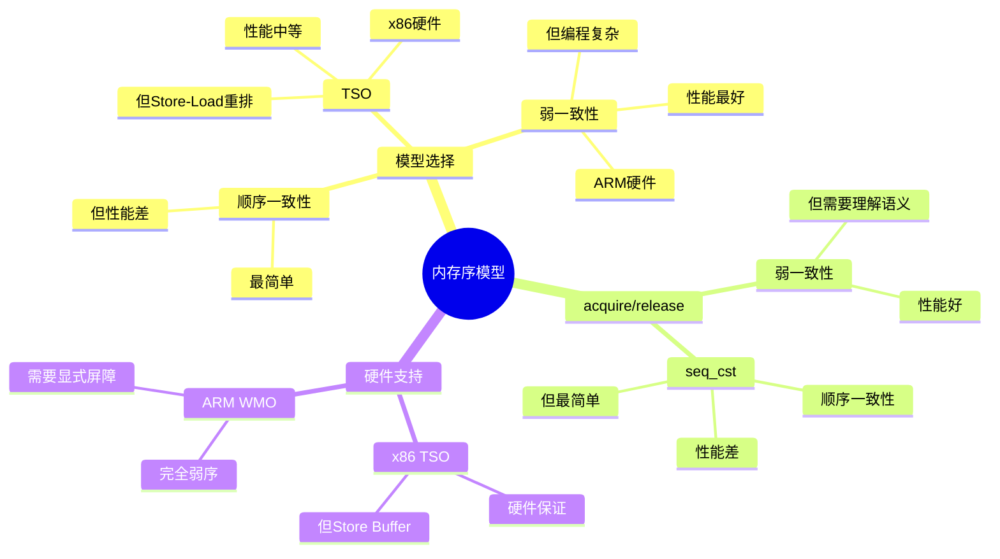

# 4.3 内存序模型

> **主题**: 04. 同步通信机制 - 4.3 内存序模型
> **覆盖**: TSO、弱一致性、acquire/release、顺序一致性

---

## 📋 目录

- [4.3 内存序模型](#43-内存序模型)
  - [📋 目录](#-目录)
  - [4.1 内存序模型类型](#41-内存序模型类型)
    - [4.1.1 模型对比](#411-模型对比)
    - [4.1.2 重排序类型](#412-重排序类型)
  - [4.2 TSO模型（x86）](#42-tso模型x86)
    - [4.2.1 特点](#421-特点)
    - [4.2.2 Store Buffer](#422-store-buffer)
  - [4.3 弱一致性模型（ARM）](#43-弱一致性模型arm)
    - [4.3.1 特点](#431-特点)
    - [4.3.2 使用示例](#432-使用示例)
  - [4.4 acquire/release语义](#44-acquirerelease语义)
    - [4.4.1 Acquire语义](#441-acquire语义)
    - [4.4.2 Release语义](#442-release语义)
  - [4.5 顺序一致性的严格分析](#45-顺序一致性的严格分析)
    - [4.5.1 顺序一致性](#451-顺序一致性)
    - [4.5.2 定义](#452-定义)
    - [4.5.3 性能代价](#453-性能代价)
  - [4.6 内存序选择](#46-内存序选择)
    - [4.6.1 决策指南](#461-决策指南)
  - [4.7 思维导图：内存序模型决策树](#47-思维导图内存序模型决策树)
  - [4.8 批判性总结](#48-批判性总结)
    - [4.8.1 内存序模型的根本矛盾](#481-内存序模型的根本矛盾)
    - [4.8.2 2025年内存序模型技术趋势](#482-2025年内存序模型技术趋势)
  - [4.9 跨领域洞察](#49-跨领域洞察)
    - [4.9.1 内存序模型的性能vs正确性权衡](#491-内存序模型的性能vs正确性权衡)
    - [4.9.2 硬件vs软件内存序的权衡](#492-硬件vs软件内存序的权衡)
  - [4.10 多维度对比](#410-多维度对比)
    - [4.10.1 内存序模型对比（2025年）](#4101-内存序模型对比2025年)
    - [4.10.2 内存序模型演进对比](#4102-内存序模型演进对比)
  - [4.11 相关主题](#411-相关主题)

---

## 4.1 内存序模型类型

### 4.1.1 模型对比

| **模型** | **硬件** | **重排序限制** | **编程复杂度** |
|---------|---------|---------------|--------------|
| **顺序一致性（SC）** | 无 | 无重排序 | 最简单 |
| **TSO** | x86 | 允许Store-Load重排 | 中等 |
| **弱一致性（WMO）** | ARM | 允许所有重排 | 最复杂 |

### 4.1.2 重排序类型

**Load-Load重排**：

- 两个读操作交换顺序
- TSO不允许
- WMO允许

**Store-Store重排**：

- 两个写操作交换顺序
- TSO不允许
- WMO允许

**Load-Store重排**：

- 读和写交换顺序
- TSO不允许
- WMO允许

**Store-Load重排**：

- 写和读交换顺序
- TSO允许（Store Buffer）
- WMO允许

---

## 4.2 TSO模型（x86）

### 4.2.1 特点

**Total Store Ordering**：

- 所有写操作全局顺序
- Store Buffer导致Store-Load重排
- 其他重排不允许

**优势**：

- 编程简单
- 大多数场景无需内存屏障
- 性能略低（硬件复杂度）

### 4.2.2 Store Buffer

**原因**：

- 写操作可能等待缓存行
- Store Buffer缓冲写操作
- 允许后续读操作继续

**影响**：

- Store-Load可能重排
- 需要MFENCE防止

---

## 4.3 弱一致性模型（ARM）

### 4.3.1 特点

**Weak Memory Ordering**：

- 允许所有类型重排
- 需要显式内存屏障
- 硬件简单，性能高

**内存屏障指令**：

- **DMB**（Data Memory Barrier）：数据内存屏障
- **DSB**（Data Synchronization Barrier）：数据同步屏障
- **ISB**（Instruction Synchronization Barrier）：指令同步屏障

### 4.3.2 使用示例

```asm
; ARM汇编
ldr r0, [r1]      ; Load
dmb ish           ; 内存屏障
str r2, [r3]      ; Store
```

---

## 4.4 acquire/release语义

### 4.4.1 Acquire语义

**定义**：

- 后续操作不能重排到acquire之前
- 保证可见性
- 读操作语义

**C++实现**：

```cpp
std::atomic<int> flag{0};
int data = 0;

// 线程1
data = 42;
flag.store(1, std::memory_order_release);

// 线程2
if (flag.load(std::memory_order_acquire) == 1) {
    // 保证看到data = 42
    use(data);
}
```

### 4.4.2 Release语义

**定义**：

- 之前操作不能重排到release之后
- 保证发布
- 写操作语义

**用途**：

- 锁释放
- 发布共享数据
- 同步点

---

## 4.5 顺序一致性的严格分析

**定义4.3（顺序一致性）**：

内存序模型$M$是顺序一致的，当且仅当存在一个全局顺序$<$，使得：

$$
\forall \text{op}_1, \text{op}_2. \text{op}_1 <_{\text{prog}} \text{op}_2 \Rightarrow \text{op}_1 < \text{op}_2
$$

其中$<_{\text{prog}}$是程序顺序。

**定理4.3（顺序一致性的性能代价）**：

顺序一致性需要全局同步，延迟满足：

$$
L_{\text{SC}} \geq L_{\text{local}} + L_{\text{global}}
$$

其中$L_{\text{local}}$是本地操作延迟，$L_{\text{global}}$是全局同步延迟。

**证明**：顺序一致性要求所有核心看到相同的全局顺序，因此需要全局同步。∎

### 4.5.1 顺序一致性

### 4.5.2 定义

**Sequential Consistency（SC）**：

- 所有操作全局顺序
- 每个线程内顺序保持
- 最强保证

**C++实现**：

```cpp
std::atomic<int> x{0}, y{0};

// 线程1
x.store(1, std::memory_order_seq_cst);
int a = y.load(std::memory_order_seq_cst);

// 线程2
y.store(1, std::memory_order_seq_cst);
int b = x.load(std::memory_order_seq_cst);

// 不可能出现 a=0 && b=0
```

### 4.5.3 性能代价

**开销**：

- 需要全局同步
- 性能较低
- 但最简单

**使用建议**：

- 默认使用seq_cst
- 性能关键时优化为acquire/release

---

## 4.6 内存序选择

### 4.6.1 决策指南

**默认**：

- 使用`memory_order_seq_cst`
- 最简单，最安全

**性能优化**：

- 读操作：`memory_order_acquire`
- 写操作：`memory_order_release`
- 仅当需要时使用

**避免**：

- `memory_order_relaxed`（除非确定）
- 手动内存屏障（除非必要）

---

## 4.7 思维导图：内存序模型决策树



---

## 4.8 批判性总结

### 4.8.1 内存序模型的根本矛盾

1. **简单性vs性能**：顺序一致性简单，但**性能开销大**；弱一致性性能好，但**编程复杂**。

2. **硬件vs软件**：硬件内存序模型（如TSO）**简化编程**，但增加硬件复杂度。

3. **通用性vs专用性**：通用内存序模型灵活，但**某些应用需要专用设计**。

### 4.8.2 2025年内存序模型技术趋势

- **内存序模型统一**：C++11/C11内存序模型**标准化**，但实现复杂。
- **硬件加速**：某些硬件（如ARM）提供**内存屏障加速**，减少开销。
- **形式化验证**：使用形式化方法**验证内存序正确性**，但复杂度高。

---

## 4.9 跨领域洞察

### 4.9.1 内存序模型的性能vs正确性权衡

**核心矛盾**：顺序一致性正确性保证最强，但性能开销大；弱一致性性能好，但编程复杂。

**量化分析**：

| **内存序模型** | **正确性保证** | **性能** | **编程复杂度** | **适用场景** | **代表架构** |
|--------------|--------------|---------|--------------|------------|------------|
| **顺序一致性** | ⭐⭐⭐⭐⭐ | ⭐ | ⭐ | 简单应用 | 理论模型 |
| **TSO** | ⭐⭐⭐⭐ | ⭐⭐⭐ | ⭐⭐ | 通用应用 | x86 |
| **acquire/release** | ⭐⭐⭐⭐ | ⭐⭐⭐ | ⭐⭐⭐ | 通用应用 | C++11 |
| **relaxed** | ⭐⭐ | ⭐⭐⭐⭐⭐ | ⭐⭐⭐⭐⭐ | 专家级应用 | 专用场景 |

**批判性分析**：

1. **正确性vs性能**：顺序一致性保证最强，但**性能最差**；relaxed性能最好，但**正确性保证最弱**。

2. **编程复杂度的差异**：relaxed编程最复杂，但**性能最好**。

3. **2025年趋势**：**acquire/release语义**成为主流，平衡性能和正确性。

### 4.9.2 硬件vs软件内存序的权衡

**核心矛盾**：硬件内存序模型简化编程，但增加硬件复杂度；软件内存序模型灵活，但编程复杂。

**量化分析**：

| **实现方式** | **硬件复杂度** | **编程复杂度** | **性能** | **适用场景** | **代表架构** |
|------------|--------------|--------------|---------|------------|------------|
| **TSO硬件** | ⭐⭐⭐⭐ | ⭐⭐ | ⭐⭐⭐ | 通用 | x86 |
| **WMO硬件** | ⭐⭐⭐ | ⭐⭐⭐⭐ | ⭐⭐⭐⭐ | 能效优先 | ARM |
| **软件屏障** | ⭐ | ⭐⭐⭐⭐⭐ | ⭐⭐⭐ | 灵活 | 软件实现 |

**批判性分析**：

1. **硬件vs软件的权衡**：硬件内存序**简化编程**，但增加硬件复杂度；软件内存序灵活，但**编程复杂**。

2. **性能的差异**：WMO硬件性能最好，但**编程最复杂**。

3. **2025年趋势**：**统一内存序模型**（C++11/C11）标准化，但实现复杂。

---

## 4.10 多维度对比

### 4.10.1 内存序模型对比（2025年）

| **模型** | **正确性保证** | **性能** | **编程复杂度** | **硬件支持** | **代表架构** |
|---------|--------------|---------|--------------|------------|------------|
| **顺序一致性** | ⭐⭐⭐⭐⭐ | ⭐ | ⭐ | 无 | 理论模型 |
| **TSO** | ⭐⭐⭐⭐ | ⭐⭐⭐ | ⭐⭐ | ⭐⭐⭐⭐ | x86 |
| **WMO** | ⭐⭐⭐ | ⭐⭐⭐⭐ | ⭐⭐⭐⭐ | ⭐⭐⭐ | ARM |
| **acquire/release** | ⭐⭐⭐⭐ | ⭐⭐⭐ | ⭐⭐⭐ | ⭐⭐⭐ | C++11 |
| **relaxed** | ⭐⭐ | ⭐⭐⭐⭐⭐ | ⭐⭐⭐⭐⭐ | ⭐⭐⭐⭐⭐ | 专用场景 |

**批判性分析**：

1. **正确性vs性能**：顺序一致性保证最强，但**性能最差**；relaxed性能最好，但**正确性保证最弱**。

2. **硬件支持的差异**：TSO硬件支持最好，但**性能一般**。

3. **2025年趋势**：**acquire/release语义**成为主流，平衡性能和正确性。

### 4.10.2 内存序模型演进对比

| **时代** | **内存序模型** | **关键特性** | **正确性** | **性能** | **代表架构** |
|---------|------------|------------|-----------|---------|------------|
| **1970s** | 顺序一致性 | 理论模型 | ⭐⭐⭐⭐⭐ | ⭐ | 理论 |
| **1980s** | TSO | 硬件支持 | ⭐⭐⭐⭐ | ⭐⭐⭐ | x86 |
| **1990s** | WMO | 弱一致性 | ⭐⭐⭐ | ⭐⭐⭐⭐ | ARM |
| **2010s** | acquire/release | 软件语义 | ⭐⭐⭐⭐ | ⭐⭐⭐ | C++11 |
| **2020s** | 统一模型 | 标准化 | ⭐⭐⭐⭐ | ⭐⭐⭐ | C++11/C11 |

**批判性分析**：

1. **演进的趋势**：从理论模型到**硬件支持**，从固定到**软件语义**。

2. **性能的提升**：WMO性能最好，但**正确性保证较弱**。

3. **2025年趋势**：**统一内存序模型**（C++11/C11）标准化，但实现复杂。

---

## 4.11 相关主题

- [4.1 硬件同步原语](./04.1_硬件同步原语.md) - 硬件同步基础
- [4.2 软件同步机制](./04.2_软件同步机制.md) - 软件同步实现
- [01.1 CPU微架构](../01_CPU硬件层/01.1_CPU微架构.md) - 硬件内存序
- [09.1 调度模型形式化](../09_形式化理论与证明/09.1_调度模型形式化.md) - 内存序形式化
- [通信同步复杂度总览](../通信同步复杂度总览.md) - 通信同步复杂度详细分析
- [论证脉络总览](../论证脉络总览.md) - 调度抽象泄漏定律与通信同步复杂度
- [主文档：内存序模型](../schedule_formal_view.md#知识图谱概念关系链) - 完整分析

---

**最后更新**: 2025-01-XX
