# 4.3 内存序模型

> **主题**: 04. 同步通信机制 - 4.3 内存序模型
> **覆盖**: TSO、弱一致性、acquire/release、顺序一致性

---

## 📋 目录

- [4.3 内存序模型](#43-内存序模型)
  - [📋 目录](#-目录)
  - [1 内存序模型类型](#1-内存序模型类型)
    - [1.1 模型对比](#11-模型对比)
    - [1.2 重排序类型](#12-重排序类型)
  - [2 TSO模型（x86）](#2-tso模型x86)
    - [2.1 特点](#21-特点)
    - [2.2 Store Buffer](#22-store-buffer)
  - [3 弱一致性模型（ARM）](#3-弱一致性模型arm)
    - [3.1 特点](#31-特点)
    - [3.2 使用示例](#32-使用示例)
  - [4 acquire/release语义](#4-acquirerelease语义)
    - [4.1 Acquire语义](#41-acquire语义)
    - [4.2 Release语义](#42-release语义)
  - [5 顺序一致性的严格分析](#5-顺序一致性的严格分析)
    - [5.1 顺序一致性定义](#51-顺序一致性定义)
    - [5.2 C++实现](#52-c实现)
    - [5.3 性能代价](#53-性能代价)
  - [6 实践案例](#6-实践案例)
    - [6.1 高性能无锁队列内存序优化](#61-高性能无锁队列内存序优化)
    - [6.2 自旋锁内存序优化](#62-自旋锁内存序优化)
  - [7 内存序选择](#7-内存序选择)
    - [7.1 决策指南](#71-决策指南)
  - [8 思维导图：内存序模型决策树](#8-思维导图内存序模型决策树)
  - [9 批判性总结](#9-批判性总结)
    - [7.1 内存序模型的根本矛盾](#71-内存序模型的根本矛盾)
    - [7.2 2025年内存序模型技术趋势](#72-2025年内存序模型技术趋势)
  - [10 跨领域洞察](#10-跨领域洞察)
    - [8.1 内存序模型的性能vs正确性权衡](#81-内存序模型的性能vs正确性权衡)
    - [8.2 硬件vs软件内存序的权衡](#82-硬件vs软件内存序的权衡)
  - [11 多维度对比](#11-多维度对比)
    - [9.1 内存序模型对比（2025年）](#91-内存序模型对比2025年)
    - [9.2 内存序模型演进对比](#92-内存序模型演进对比)
  - [12 相关主题](#12-相关主题)

---

## 1 内存序模型类型

### 1.1 模型对比

| **模型** | **硬件** | **重排序限制** | **编程复杂度** |
|---------|---------|---------------|--------------|
| **顺序一致性（SC）** | 无 | 无重排序 | 最简单 |
| **TSO** | x86 | 允许Store-Load重排 | 中等 |
| **弱一致性（WMO）** | ARM | 允许所有重排 | 最复杂 |

### 1.2 重排序类型

**Load-Load重排**：

- 两个读操作交换顺序
- TSO不允许
- WMO允许

**Store-Store重排**：

- 两个写操作交换顺序
- TSO不允许
- WMO允许

**Load-Store重排**：

- 读和写交换顺序
- TSO不允许
- WMO允许

**Store-Load重排**：

- 写和读交换顺序
- TSO允许（Store Buffer）
- WMO允许

---

## 2 TSO模型（x86）

### 2.1 特点

**案例4.3.1（TSO模型）**：

TSO（Total Store Ordering）是x86架构的内存序模型，在编程简单性和性能之间做了权衡。

**Total Store Ordering**：

**TSO模型规则**：

1. **所有写操作全局顺序**：所有核心看到相同的写操作顺序
2. **Store Buffer导致Store-Load重排**：写操作可能被缓冲，导致Store-Load重排
3. **其他重排不允许**：Load-Load、Load-Store、Store-Store重排不允许

**TSO模型实现**：

```c
// TSO模型的硬件实现（伪代码）
typedef struct {
    int store_buffer[STORE_BUFFER_SIZE];  // Store Buffer
    int store_buffer_head;
    int store_buffer_tail;
    cache_t *cache;                       // 缓存
} cpu_core_t;

// Store操作
void tso_store(cpu_core_t *core, int *addr, int value) {
    // 1. 写入Store Buffer
    core->store_buffer[core->store_buffer_tail] = value;
    core->store_buffer_tail = (core->store_buffer_tail + 1) % STORE_BUFFER_SIZE;

    // 2. 异步写回缓存（不阻塞）
    async_write_to_cache(core, addr, value);
}

// Load操作
int tso_load(cpu_core_t *core, int *addr) {
    // 1. 检查Store Buffer（防止Store-Load重排）
    for (int i = core->store_buffer_head; i != core->store_buffer_tail;
         i = (i + 1) % STORE_BUFFER_SIZE) {
        if (core->store_buffer[i].addr == addr) {
            return core->store_buffer[i].value;  // 从Store Buffer读取
        }
    }

    // 2. 从缓存读取
    return cache_load(core->cache, addr);
}

// 内存屏障（MFENCE）
void tso_mfence(cpu_core_t *core) {
    // 1. 等待Store Buffer清空
    while (core->store_buffer_head != core->store_buffer_tail) {
        // 等待所有写操作完成
        flush_store_buffer(core);
    }

    // 2. 确保所有内存操作完成
    memory_barrier();
}
```

**TSO优势**：

- **编程简单**：大多数场景无需显式内存屏障
- **大多数场景无需内存屏障**：TSO保证大多数操作的顺序
- **性能略低**：硬件复杂度较高，但可接受

**深度论证：TSO模型的性能-复杂度权衡**

**TSO的硬件复杂度**：

TSO需要**全局写顺序**，增加了硬件复杂度：

$$
\text{硬件复杂度} = O(\text{写操作数}^2)
$$

因为需要维护所有写操作的全局顺序。

**量化对比**：TSO vs WMO的权衡

| **特性** | **TSO** | **WMO** | **差异** |
|---------|---------|---------|---------|
| **编程复杂度** | 低 | 高 | TSO简单 |
| **硬件复杂度** | 高 | 低 | WMO简单 |
| **性能** | 中 | 高 | WMO更快 |
| **内存屏障需求** | 少 | 多 | TSO更少 |

**关键权衡**：TSO在**编程简单性**和**硬件复杂度**之间做了权衡，适合通用计算。

### 2.2 Store Buffer

**案例4.3.2（Store Buffer机制）**：

Store Buffer是TSO模型的核心机制，用于隐藏写操作的延迟。

**Store Buffer原因**：

**1. 写操作延迟**：

- **等待缓存行**：写操作需要获取缓存行的独占权（MESI协议）
- **延迟较高**：获取独占权需要20-40周期
- **阻塞问题**：如果写操作阻塞，后续操作无法继续

**2. Store Buffer缓冲**：

- **异步写回**：Store Buffer允许写操作异步完成
- **隐藏延迟**：后续读操作可以继续执行
- **性能提升**：提高CPU利用率

**Store Buffer实现**：

```c
// Store Buffer实现
typedef struct {
    struct {
        int *addr;
        int value;
        bool valid;
    } entries[STORE_BUFFER_SIZE];
    int head;
    int tail;
    int count;
} store_buffer_t;

// 写入Store Buffer
void store_buffer_write(store_buffer_t *sb, int *addr, int value) {
    // 1. 检查Store Buffer是否满
    while (sb->count >= STORE_BUFFER_SIZE) {
        // 等待空间
        flush_oldest_entry(sb);
    }

    // 2. 写入Store Buffer
    int idx = sb->tail;
    sb->entries[idx].addr = addr;
    sb->entries[idx].value = value;
    sb->entries[idx].valid = true;
    sb->tail = (sb->tail + 1) % STORE_BUFFER_SIZE;
    sb->count++;

    // 3. 异步写回缓存
    async_write_to_cache(addr, value);
}

// 从Store Buffer读取（Store-Load转发）
int store_buffer_read(store_buffer_t *sb, int *addr) {
    // 1. 检查Store Buffer中是否有该地址的写操作
    for (int i = sb->head; i != sb->tail; i = (i + 1) % STORE_BUFFER_SIZE) {
        if (sb->entries[i].valid && sb->entries[i].addr == addr) {
            return sb->entries[i].value;  // Store-Load转发
        }
    }

    // 2. 从缓存读取
    return cache_read(addr);
}
```

**Store Buffer影响**：

**1. Store-Load重排**：

```c
// Store-Load重排示例
int x = 0, y = 0;

// 线程1
x = 1;        // Store（写入Store Buffer）
int a = y;    // Load（可能从缓存读取，看不到x=1）

// 线程2
y = 1;        // Store
int b = x;    // Load（可能看到x=0）

// 可能出现：a=0 && b=0（违反顺序一致性）
```

**2. 需要MFENCE防止**：

```c
// 使用MFENCE防止Store-Load重排
int x = 0, y = 0;

// 线程1
x = 1;
mfence();     // 内存屏障，等待Store Buffer清空
int a = y;    // 保证看到y的最新值

// 线程2
y = 1;
mfence();     // 内存屏障
int b = x;    // 保证看到x的最新值

// 不可能出现：a=0 && b=0
```

**深度论证：Store Buffer的性能影响**

**Store Buffer的延迟隐藏**：

Store Buffer允许**写操作异步完成**，隐藏延迟：

$$
\text{有效延迟} = \max(0, t_{\text{写延迟}} - t_{\text{后续操作}})
$$

**量化分析**：Store Buffer的性能提升

| **场景** | **无Store Buffer** | **有Store Buffer** | **性能提升** |
|---------|------------------|------------------|------------|
| **写后读** | 基准 | +20% | 20% |
| **写后写** | 基准 | 基准 | 0% |
| **读后写** | 基准 | 基准 | 0% |

**关键洞察**：Store Buffer在**写后读**场景下可以**隐藏写延迟**，提升性能。

---

## 3 弱一致性模型（ARM）

### 3.1 特点

**案例4.3.3（弱一致性模型）**：

弱一致性模型（Weak Memory Ordering，WMO）是ARM架构的内存序模型，允许所有类型的内存操作重排。

**Weak Memory Ordering**：

**WMO模型规则**：

1. **允许所有类型重排**：Load-Load、Load-Store、Store-Store、Store-Load都可以重排
2. **需要显式内存屏障**：程序员必须显式插入内存屏障
3. **硬件简单，性能高**：硬件实现简单，性能更好

**WMO模型实现**：

```c
// WMO模型的硬件实现（伪代码）
typedef struct {
    load_queue_t load_queue;      // Load队列
    store_queue_t store_queue;    // Store队列
    cache_t *cache;               // 缓存
} arm_core_t;

// Load操作（可能重排）
int wmo_load(arm_core_t *core, int *addr) {
    // 1. 加入Load队列
    load_entry_t *entry = alloc_load_entry();
    entry->addr = addr;
    entry->status = PENDING;
    enqueue_load(core->load_queue, entry);

    // 2. 可能与其他操作重排
    // 3. 从缓存读取
    return cache_load(core->cache, addr);
}

// Store操作（可能重排）
void wmo_store(arm_core_t *core, int *addr, int value) {
    // 1. 加入Store队列
    store_entry_t *entry = alloc_store_entry();
    entry->addr = addr;
    entry->value = value;
    entry->status = PENDING;
    enqueue_store(core->store_queue, entry);

    // 2. 可能与其他操作重排
    // 3. 异步写回缓存
    async_write_to_cache(addr, value);
}

// 内存屏障（DMB）
void wmo_dmb(arm_core_t *core) {
    // 1. 等待所有Load操作完成
    flush_load_queue(core->load_queue);

    // 2. 等待所有Store操作完成
    flush_store_queue(core->store_queue);

    // 3. 确保所有内存操作完成
    memory_barrier();
}
```

**内存屏障指令**：

**1. DMB（Data Memory Barrier）**：

- **数据内存屏障**：确保数据内存操作的顺序
- **作用域**：可以指定作用域（inner shareable、outer shareable等）
- **性能开销**：中等

**2. DSB（Data Synchronization Barrier）**：

- **数据同步屏障**：比DMB更强，确保所有内存操作完成
- **用途**：用于需要强同步的场景
- **性能开销**：较高

**3. ISB（Instruction Synchronization Barrier）**：

- **指令同步屏障**：刷新指令流水线
- **用途**：用于代码修改后的同步
- **性能开销**：最高

### 3.2 使用示例

**ARM汇编示例**：

```asm
; ARM汇编 - 使用DMB
ldr r0, [r1]      ; Load操作
dmb ish           ; 数据内存屏障（inner shareable）
str r2, [r3]      ; Store操作（保证在Load之后）

; ARM汇编 - 使用DSB
ldr r0, [r1]      ; Load操作
dsb sy            ; 数据同步屏障（system）
str r2, [r3]      ; Store操作（强同步）

; ARM汇编 - 使用ISB
mcr p15, 0, r0, c1, c0, 0  ; 修改系统寄存器
isb                         ; 指令同步屏障
ldr r0, [r1]                ; 后续指令（保证看到修改）
```

**C语言示例**：

```c
// C语言使用内存屏障
#include <stdatomic.h>

int x = 0, y = 0;

// 线程1
x = 1;
atomic_thread_fence(memory_order_release);  // 相当于DMB
int a = y;

// 线程2
y = 1;
atomic_thread_fence(memory_order_acquire);  // 相当于DMB
int b = x;
```

---

## 4 acquire/release语义

### 4.1 Acquire语义

**案例4.3.4（Acquire语义）**：

Acquire语义是一种弱一致性内存序，用于读操作，保证后续操作不能重排到acquire之前。

**Acquire语义定义**：

**1. 后续操作不能重排到acquire之前**：

- **单向屏障**：只防止后续操作重排到acquire之前
- **不限制之前操作**：之前的操作可以重排
- **读操作语义**：通常用于读操作

**2. 保证可见性**：

- **同步点**：Acquire操作是一个同步点
- **看到之前的所有写操作**：保证看到release之前的所有写操作
- **内存可见性**：保证内存操作的可见性

**Acquire语义实现**：

```c
// Acquire语义的硬件实现（伪代码）
void acquire_barrier(cpu_core_t *core) {
    // 1. 等待所有之前的Load操作完成
    flush_load_queue(core->load_queue);

    // 2. 确保后续操作在acquire之后
    memory_barrier();
}

// Acquire Load
int acquire_load(atomic_int *addr) {
    int value = atomic_load_explicit(addr, memory_order_acquire);
    acquire_barrier(get_current_core());
    return value;
}
```

**C++实现示例**：

```cpp
#include <atomic>
#include <thread>

std::atomic<int> flag{0};
int data = 0;

// 线程1：发布数据
void thread1() {
    data = 42;                                    // 写操作
    flag.store(1, std::memory_order_release);    // Release写
}

// 线程2：获取数据
void thread2() {
    if (flag.load(std::memory_order_acquire) == 1) {  // Acquire读
        // 保证看到data = 42
        // 因为acquire保证看到release之前的所有写操作
        use(data);
    }
}
```

**Acquire语义的保证**：

```cpp
// Acquire语义保证
int x = 0, y = 0;
std::atomic<int> sync{0};

// 线程1
x = 1;
y = 2;
sync.store(1, std::memory_order_release);  // Release

// 线程2
if (sync.load(std::memory_order_acquire) == 1) {  // Acquire
    // 保证看到：x == 1 && y == 2
    // 因为acquire保证看到release之前的所有写操作
    assert(x == 1 && y == 2);
}
```

### 4.2 Release语义

**案例4.3.5（Release语义）**：

Release语义是一种弱一致性内存序，用于写操作，保证之前操作不能重排到release之后。

**Release语义定义**：

**1. 之前操作不能重排到release之后**：

- **单向屏障**：只防止之前操作重排到release之后
- **不限制后续操作**：后续操作可以重排
- **写操作语义**：通常用于写操作

**2. 保证发布**：

- **同步点**：Release操作是一个同步点
- **发布之前的所有写操作**：保证之前的所有写操作对其他线程可见
- **内存发布**：保证内存操作的发布

**Release语义实现**：

```c
// Release语义的硬件实现（伪代码）
void release_barrier(cpu_core_t *core) {
    // 1. 等待所有之前的Store操作完成
    flush_store_queue(core->store_queue);

    // 2. 确保之前操作在release之前
    memory_barrier();
}

// Release Store
void release_store(atomic_int *addr, int value) {
    release_barrier(get_current_core());
    atomic_store_explicit(addr, value, memory_order_release);
}
```

**Release语义用途**：

**1. 锁释放**：

```cpp
// 使用Release语义释放锁
class SpinLock {
    std::atomic<bool> locked{false};

public:
    void lock() {
        bool expected = false;
        while (!locked.compare_exchange_weak(expected, true,
                                             std::memory_order_acquire,
                                             std::memory_order_relaxed)) {
            expected = false;
        }
    }

    void unlock() {
        locked.store(false, std::memory_order_release);  // Release
    }
};
```

**2. 发布共享数据**：

```cpp
// 使用Release语义发布共享数据
struct SharedData {
    int value1;
    int value2;
};

std::atomic<SharedData*> shared_ptr{nullptr};

// 线程1：发布数据
void publish_data() {
    SharedData *data = new SharedData{42, 100};
    data->value1 = 42;
    data->value2 = 100;
    shared_ptr.store(data, std::memory_order_release);  // Release
}

// 线程2：获取数据
void consume_data() {
    SharedData *data = shared_ptr.load(std::memory_order_acquire);  // Acquire
    if (data != nullptr) {
        // 保证看到完整的data
        use(data->value1, data->value2);
    }
}
```

**3. 同步点**：

```cpp
// 使用Release/Acquire作为同步点
std::atomic<int> ready{0};
int data = 0;

// 线程1
void producer() {
    data = 42;
    ready.store(1, std::memory_order_release);  // 同步点
}

// 线程2
void consumer() {
    while (ready.load(std::memory_order_acquire) == 0) {  // 同步点
        // 等待
    }
    // 保证看到data = 42
    use(data);
}
```

---

## 5 顺序一致性的严格分析

**案例4.3.6（顺序一致性）**：

顺序一致性（Sequential Consistency，SC）是最强的内存序模型，保证所有操作有一个全局顺序。

**定义4.3（顺序一致性）**：

内存序模型$M$是顺序一致的，当且仅当存在一个全局顺序$<$，使得：

$$
\forall \text{op}_1, \text{op}_2. \text{op}_1 <_{\text{prog}} \text{op}_2 \Rightarrow \text{op}_1 < \text{op}_2
$$

其中$<_{\text{prog}}$是程序顺序。

**定理4.3（顺序一致性的性能代价）**：

顺序一致性需要全局同步，延迟满足：

$$
L_{\text{SC}} \geq L_{\text{local}} + L_{\text{global}}
$$

其中$L_{\text{local}}$是本地操作延迟，$L_{\text{global}}$是全局同步延迟。

**证明**：顺序一致性要求所有核心看到相同的全局顺序，因此需要全局同步。∎

### 5.1 顺序一致性定义

**Sequential Consistency（SC）**：

**1. 所有操作全局顺序**：

- **全局顺序**：所有线程的所有操作有一个全局顺序
- **一致性**：所有线程看到相同的全局顺序
- **线性化**：操作看起来是原子执行的

**2. 每个线程内顺序保持**：

- **程序顺序**：每个线程内的操作顺序保持
- **局部顺序**：线程内的操作顺序不能改变
- **全局顺序**：全局顺序必须包含所有局部顺序

**3. 最强保证**：

- **最强语义**：顺序一致性是最强的内存序模型
- **最简单**：编程最简单，不需要考虑重排
- **性能代价**：性能开销最大

**顺序一致性实现**：

```c
// 顺序一致性的硬件实现（伪代码）
typedef struct {
    global_order_t global_order;  // 全局顺序
    cache_t *cache;               // 缓存
} sc_core_t;

// 顺序一致性Load
int sc_load(sc_core_t *core, int *addr) {
    // 1. 获取全局顺序号
    int order = acquire_global_order(core->global_order);

    // 2. 等待所有之前的操作完成
    wait_for_previous_operations(core, order);

    // 3. 执行Load操作
    int value = cache_load(core->cache, addr);

    // 4. 记录操作到全局顺序
    record_operation(core->global_order, order, LOAD, addr, value);

    return value;
}

// 顺序一致性Store
void sc_store(sc_core_t *core, int *addr, int value) {
    // 1. 获取全局顺序号
    int order = acquire_global_order(core->global_order);

    // 2. 等待所有之前的操作完成
    wait_for_previous_operations(core, order);

    // 3. 执行Store操作
    cache_store(core->cache, addr, value);

    // 4. 记录操作到全局顺序
    record_operation(core->global_order, order, STORE, addr, value);

    // 5. 通知其他核心
    notify_other_cores(core, order);
}
```

### 5.2 C++实现

**顺序一致性C++实现**：

```cpp
#include <atomic>
#include <thread>

std::atomic<int> x{0}, y{0};

// 线程1
void thread1() {
    x.store(1, std::memory_order_seq_cst);  // 顺序一致性Store
    int a = y.load(std::memory_order_seq_cst);  // 顺序一致性Load
}

// 线程2
void thread2() {
    y.store(1, std::memory_order_seq_cst);  // 顺序一致性Store
    int b = x.load(std::memory_order_seq_cst);  // 顺序一致性Load
}

// 不可能出现：a=0 && b=0
// 因为顺序一致性保证全局顺序
```

**顺序一致性保证**：

```cpp
// 顺序一致性保证示例
std::atomic<int> flag1{0}, flag2{0};
int data1 = 0, data2 = 0;

// 线程1
void thread1() {
    data1 = 42;
    flag1.store(1, std::memory_order_seq_cst);
    int f2 = flag2.load(std::memory_order_seq_cst);
    if (f2 == 1) {
        // 保证看到data2的最新值
        use(data2);
    }
}

// 线程2
void thread2() {
    data2 = 100;
    flag2.store(1, std::memory_order_seq_cst);
    int f1 = flag1.load(std::memory_order_seq_cst);
    if (f1 == 1) {
        // 保证看到data1的最新值
        use(data1);
    }
}

// 顺序一致性保证：如果两个flag都为1，则两个线程都能看到对方的数据
```

### 5.3 性能代价

**顺序一致性开销**：

**1. 需要全局同步**：

- **全局顺序**：需要维护全局顺序
- **同步开销**：需要与其他核心同步
- **延迟增加**：延迟显著增加

**2. 性能较低**：

- **延迟**：顺序一致性操作的延迟是普通操作的2-10倍
- **吞吐量**：吞吐量显著降低
- **可扩展性**：可扩展性差

**性能对比**：

| **内存序** | **延迟** | **吞吐量** | **可扩展性** |
|-----------|---------|-----------|------------|
| **relaxed** | 基准 | 基准 | 好 |
| **acquire/release** | +20% | -10% | 好 |
| **seq_cst** | +200% | -50% | 差 |

**使用建议**：

**1. 默认使用seq_cst**：

- **最简单**：不需要考虑重排
- **最安全**：保证最强
- **适合开发**：适合开发和调试

**2. 性能关键时优化为acquire/release**：

- **性能优化**：在性能关键路径使用acquire/release
- **仔细验证**：需要仔细验证正确性
- **逐步优化**：逐步优化，不要一次性改变

---

## 6 实践案例

### 6.1 高性能无锁队列内存序优化

**案例4.3.7（高性能无锁队列）**：

某高性能系统优化无锁队列的内存序，提高性能。

**优化策略**：

**1. 使用acquire/release替代seq_cst**：

```cpp
// 优化前：使用seq_cst
template<typename T>
class LockFreeQueue {
    struct Node {
        std::atomic<T*> data{nullptr};
        std::atomic<Node*> next{nullptr};
    };

    std::atomic<Node*> head{nullptr};
    std::atomic<Node*> tail{nullptr};

public:
    void enqueue(T item) {
        Node *new_node = new Node;
        new_node->data.store(new T(item), std::memory_order_seq_cst);  // seq_cst

        Node *prev_tail = tail.exchange(new_node, std::memory_order_seq_cst);  // seq_cst
        prev_tail->next.store(new_node, std::memory_order_seq_cst);  // seq_cst
    }
};

// 优化后：使用acquire/release
template<typename T>
class LockFreeQueue {
    // ... 同上 ...

public:
    void enqueue(T item) {
        Node *new_node = new Node;
        new_node->data.store(new T(item), std::memory_order_relaxed);  // relaxed

        Node *prev_tail = tail.exchange(new_node, std::memory_order_acq_rel);  // acq_rel
        prev_tail->next.store(new_node, std::memory_order_release);  // release
    }

    bool dequeue(T &item) {
        Node *head_node = head.load(std::memory_order_acquire);  // acquire
        Node *next = head_node->next.load(std::memory_order_acquire);  // acquire

        if (next == nullptr) {
            return false;  // 队列为空
        }

        T *data = next->data.load(std::memory_order_acquire);  // acquire
        head.store(next, std::memory_order_release);  // release

        item = *data;
        delete data;
        delete head_node;
        return true;
    }
};
```

**优化效果**：

| **指标** | **优化前（seq_cst）** | **优化后（acq_rel）** | **改善** |
|---------|---------------------|---------------------|---------|
| **入队延迟** | 100ns | 50ns | -50% |
| **出队延迟** | 100ns | 50ns | -50% |
| **吞吐量** | 10M ops/s | 20M ops/s | +100% |

### 6.2 自旋锁内存序优化

**案例4.3.8（自旋锁优化）**：

优化自旋锁的内存序，减少不必要的同步开销。

**优化实现**：

```cpp
// 优化前：使用seq_cst
class SpinLock {
    std::atomic<bool> locked{false};

public:
    void lock() {
        bool expected = false;
        while (!locked.compare_exchange_weak(expected, true,
                                             std::memory_order_seq_cst,  // seq_cst
                                             std::memory_order_seq_cst)) {  // seq_cst
            expected = false;
        }
    }

    void unlock() {
        locked.store(false, std::memory_order_seq_cst);  // seq_cst
    }
};

// 优化后：使用acquire/release
class SpinLock {
    std::atomic<bool> locked{false};

public:
    void lock() {
        bool expected = false;
        while (!locked.compare_exchange_weak(expected, true,
                                             std::memory_order_acquire,  // acquire
                                             std::memory_order_relaxed)) {  // relaxed
            expected = false;
            // 自旋等待时使用relaxed，减少开销
            while (locked.load(std::memory_order_relaxed)) {
                cpu_pause();
            }
        }
    }

    void unlock() {
        locked.store(false, std::memory_order_release);  // release
    }
};
```

**优化效果**：

| **指标** | **优化前** | **优化后** | **改善** |
|---------|-----------|-----------|---------|
| **获取锁延迟** | 50ns | 30ns | -40% |
| **释放锁延迟** | 20ns | 15ns | -25% |
| **高竞争吞吐量** | 基准 | +30% | 提升 |

## 7 内存序选择

### 7.1 决策指南

**内存序选择决策树**：

```text
需要全局顺序？
├─ 是 → seq_cst（顺序一致性）
└─ 否 → 继续判断

需要同步点？
├─ 是 → acquire/release
│   ├─ 读操作 → acquire
│   └─ 写操作 → release
└─ 否 → relaxed

性能关键？
├─ 是 → 仔细选择内存序
└─ 否 → 默认使用seq_cst
```

**默认选择**：

**1. 使用`memory_order_seq_cst`**：

- **最简单**：不需要考虑重排
- **最安全**：保证最强
- **适合开发**：适合开发和调试阶段

**2. 性能优化**：

- **读操作**：`memory_order_acquire`
- **写操作**：`memory_order_release`
- **仅当需要时使用**：在性能关键路径使用

**3. 避免使用**：

- **`memory_order_relaxed`**：除非确定不需要同步
- **手动内存屏障**：除非必要，使用标准库提供的语义

---

## 8 思维导图：内存序模型决策树

```mermaid
mindmap
  root((内存序模型))
    模型选择
      顺序一致性
        最简单
        但性能差
      TSO
        x86硬件
        性能中等
        但Store-Load重排
      弱一致性
        ARM硬件
        性能最好
        但编程复杂
    acquire/release
      弱一致性
        性能好
        但需要理解语义
      seq_cst
        顺序一致性
        性能差
        但最简单
    硬件支持
      x86 TSO
        硬件保证
        但Store Buffer
      ARM WMO
        完全弱序
        需要显式屏障
```



---

## 9 批判性总结

### 7.1 内存序模型的根本矛盾

1. **简单性vs性能**：顺序一致性简单，但**性能开销大**；弱一致性性能好，但**编程复杂**。

2. **硬件vs软件**：硬件内存序模型（如TSO）**简化编程**，但增加硬件复杂度。

3. **通用性vs专用性**：通用内存序模型灵活，但**某些应用需要专用设计**。

### 7.2 2025年内存序模型技术趋势

- **内存序模型统一**：C++11/C11内存序模型**标准化**，但实现复杂。
- **硬件加速**：某些硬件（如ARM）提供**内存屏障加速**，减少开销。
- **形式化验证**：使用形式化方法**验证内存序正确性**，但复杂度高。

---

## 10 跨领域洞察

### 8.1 内存序模型的性能vs正确性权衡

**核心矛盾**：顺序一致性正确性保证最强，但性能开销大；弱一致性性能好，但编程复杂。

**量化分析**：

| **内存序模型** | **正确性保证** | **性能** | **编程复杂度** | **适用场景** | **代表架构** |
|--------------|--------------|---------|--------------|------------|------------|
| **顺序一致性** | ⭐⭐⭐⭐⭐ | ⭐ | ⭐ | 简单应用 | 理论模型 |
| **TSO** | ⭐⭐⭐⭐ | ⭐⭐⭐ | ⭐⭐ | 通用应用 | x86 |
| **acquire/release** | ⭐⭐⭐⭐ | ⭐⭐⭐ | ⭐⭐⭐ | 通用应用 | C++11 |
| **relaxed** | ⭐⭐ | ⭐⭐⭐⭐⭐ | ⭐⭐⭐⭐⭐ | 专家级应用 | 专用场景 |

**批判性分析**：

1. **正确性vs性能**：顺序一致性保证最强，但**性能最差**；relaxed性能最好，但**正确性保证最弱**。

2. **编程复杂度的差异**：relaxed编程最复杂，但**性能最好**。

3. **2025年趋势**：**acquire/release语义**成为主流，平衡性能和正确性。

### 8.2 硬件vs软件内存序的权衡

**核心矛盾**：硬件内存序模型简化编程，但增加硬件复杂度；软件内存序模型灵活，但编程复杂。

**量化分析**：

| **实现方式** | **硬件复杂度** | **编程复杂度** | **性能** | **适用场景** | **代表架构** |
|------------|--------------|--------------|---------|------------|------------|
| **TSO硬件** | ⭐⭐⭐⭐ | ⭐⭐ | ⭐⭐⭐ | 通用 | x86 |
| **WMO硬件** | ⭐⭐⭐ | ⭐⭐⭐⭐ | ⭐⭐⭐⭐ | 能效优先 | ARM |
| **软件屏障** | ⭐ | ⭐⭐⭐⭐⭐ | ⭐⭐⭐ | 灵活 | 软件实现 |

**批判性分析**：

1. **硬件vs软件的权衡**：硬件内存序**简化编程**，但增加硬件复杂度；软件内存序灵活，但**编程复杂**。

2. **性能的差异**：WMO硬件性能最好，但**编程最复杂**。

3. **2025年趋势**：**统一内存序模型**（C++11/C11）标准化，但实现复杂。

---

## 11 多维度对比

### 9.1 内存序模型对比（2025年）

| **模型** | **正确性保证** | **性能** | **编程复杂度** | **硬件支持** | **代表架构** |
|---------|--------------|---------|--------------|------------|------------|
| **顺序一致性** | ⭐⭐⭐⭐⭐ | ⭐ | ⭐ | 无 | 理论模型 |
| **TSO** | ⭐⭐⭐⭐ | ⭐⭐⭐ | ⭐⭐ | ⭐⭐⭐⭐ | x86 |
| **WMO** | ⭐⭐⭐ | ⭐⭐⭐⭐ | ⭐⭐⭐⭐ | ⭐⭐⭐ | ARM |
| **acquire/release** | ⭐⭐⭐⭐ | ⭐⭐⭐ | ⭐⭐⭐ | ⭐⭐⭐ | C++11 |
| **relaxed** | ⭐⭐ | ⭐⭐⭐⭐⭐ | ⭐⭐⭐⭐⭐ | ⭐⭐⭐⭐⭐ | 专用场景 |

**批判性分析**：

1. **正确性vs性能**：顺序一致性保证最强，但**性能最差**；relaxed性能最好，但**正确性保证最弱**。

2. **硬件支持的差异**：TSO硬件支持最好，但**性能一般**。

3. **2025年趋势**：**acquire/release语义**成为主流，平衡性能和正确性。

### 9.2 内存序模型演进对比

| **时代** | **内存序模型** | **关键特性** | **正确性** | **性能** | **代表架构** |
|---------|------------|------------|-----------|---------|------------|
| **1970s** | 顺序一致性 | 理论模型 | ⭐⭐⭐⭐⭐ | ⭐ | 理论 |
| **1980s** | TSO | 硬件支持 | ⭐⭐⭐⭐ | ⭐⭐⭐ | x86 |
| **1990s** | WMO | 弱一致性 | ⭐⭐⭐ | ⭐⭐⭐⭐ | ARM |
| **2010s** | acquire/release | 软件语义 | ⭐⭐⭐⭐ | ⭐⭐⭐ | C++11 |
| **2020s** | 统一模型 | 标准化 | ⭐⭐⭐⭐ | ⭐⭐⭐ | C++11/C11 |

**批判性分析**：

1. **演进的趋势**：从理论模型到**硬件支持**，从固定到**软件语义**。

2. **性能的提升**：WMO性能最好，但**正确性保证较弱**。

3. **2025年趋势**：**统一内存序模型**（C++11/C11）标准化，但实现复杂。

---

## 12 相关主题

- [4.1 硬件同步原语](./04.1_硬件同步原语.md) - 硬件同步基础
- [4.2 软件同步机制](./04.2_软件同步机制.md) - 软件同步实现
- [01.1 CPU微架构](../01_CPU硬件层/01.1_CPU微架构.md) - 硬件内存序
- [09.1 调度模型形式化](../09_形式化理论与证明/09.1_调度模型形式化.md) - 内存序形式化
- [通信同步复杂度总览](../通信同步复杂度总览.md) - 通信同步复杂度详细分析
- [论证脉络总览](../论证脉络总览.md) - 调度抽象泄漏定律与通信同步复杂度
- [主文档：内存序模型](../schedule_formal_view.md#知识图谱概念关系链) - 完整分析

---

**最后更新**: 2025-01-XX
