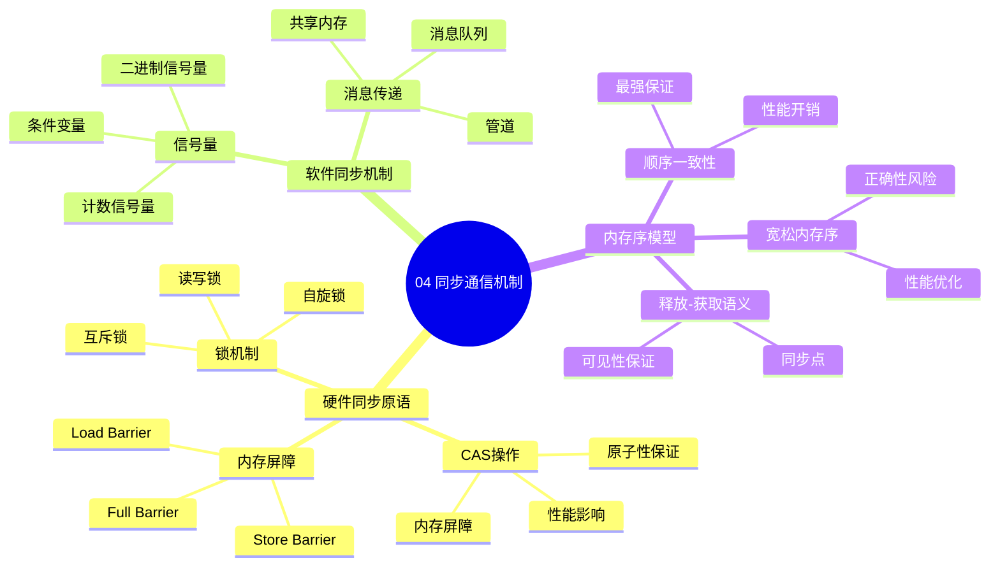

# 04. 同步通信机制

> **主题**: 同步通信机制
> **覆盖范围**: 硬件同步原语、软件同步机制、内存序模型

---

## 📋 目录

- [04. 同步通信机制](#04-同步通信机制)
  - [📋 目录](#-目录)
  - [1 子主题索引](#1-子主题索引)
    - [1.0 同步通信机制思维导图](#10-同步通信机制思维导图)
  - [2 相关主题](#2-相关主题)
  - [3 核心概念矩阵](#3-核心概念矩阵)

---

## 1 子主题索引

### 1.0 同步通信机制思维导图

**可视化文档**: 查看 [思维导图与知识矩阵](../思维导图与知识矩阵.md#34-04-同步通信机制) 获取更详细的思维导图。

- [4.1 硬件同步原语](./04.1_硬件同步原语.md) - LOCK指令、内存屏障、原子操作
- [4.2 软件同步机制](./04.2_软件同步机制.md) - 自旋锁、睡眠锁、RCU
- [4.3 内存序模型](./04.3_内存序模型.md) - TSO、弱一致性、acquire/release

---

## 2 相关主题

- [01. CPU硬件层](../01_CPU硬件层/README.md) - 缓存一致性
- [03. OS抽象层](../03_OS抽象层/README.md) - 进程同步

---

## 3 核心概念矩阵

| **同步机制** | **延迟** | **适用场景** | **硬件支持** |
|-------------|----------|-------------|-------------|
| **LOCK前缀** | 20-40周期 | 原子操作 | x86 LOCK# |
| **内存屏障** | 0周期 | 顺序保证 | MFENCE/LFENCE |
| **自旋锁** | 100ns | 短临界区 | CAS指令 |
| **互斥锁** | 1μs | 长临界区 | futex系统调用 |

---

**最后更新**: 2025-11-14
