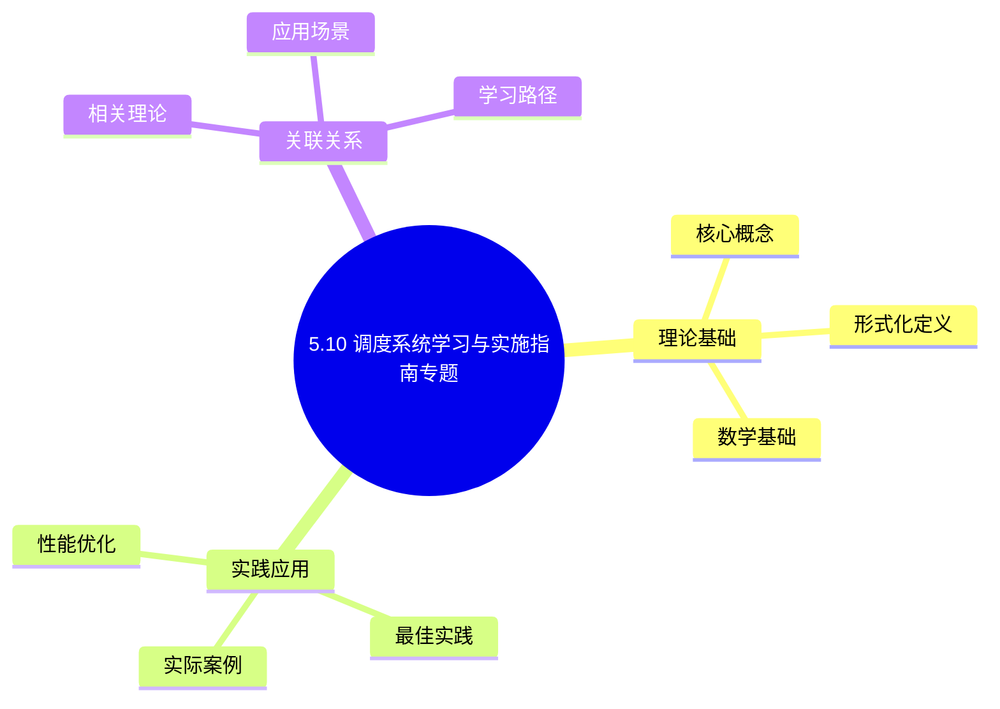
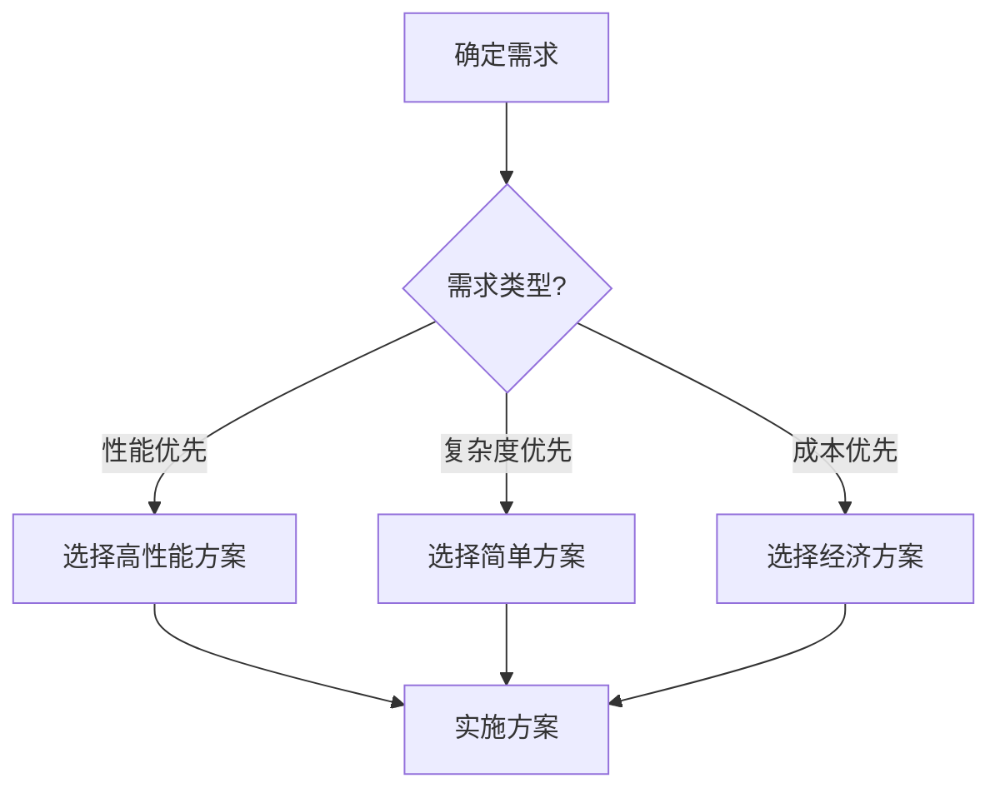
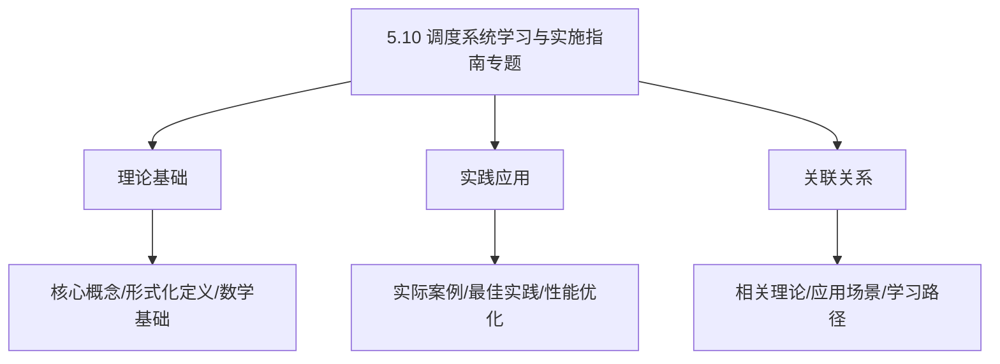
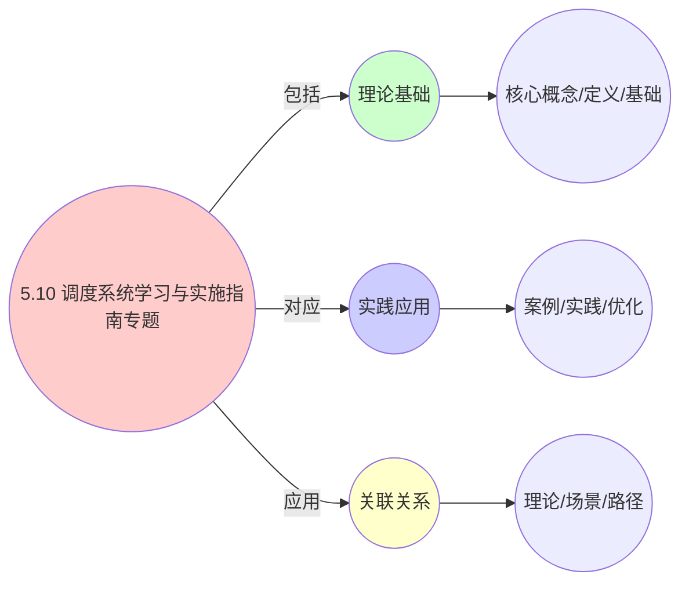
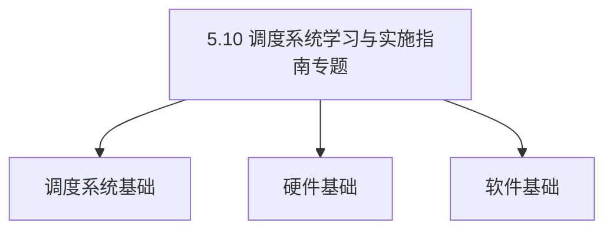
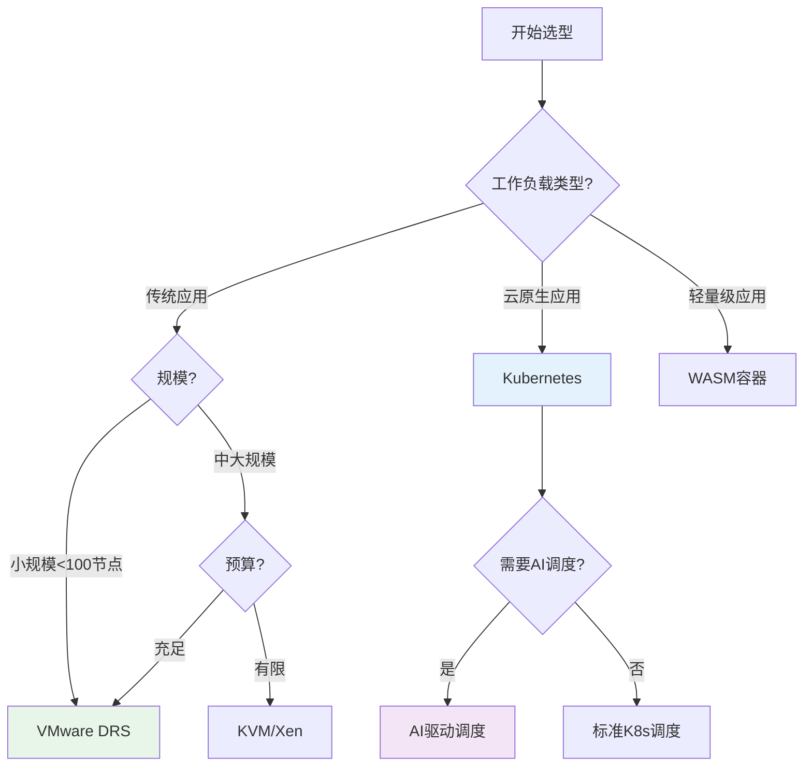

# 5.10 调度系统学习与实施指南专题

> **主题**: 05. 虚拟化容器化沙盒化 - 5.10 调度系统学习与实施指南专题
> **覆盖**: 学习路径、学习资源、实施指南、迁移策略
> **更新**: 2025年11月19日

## 📊 思维表征体系

### 📊 1. 思维导图（增强版）

#### 1.1 文本格式（基础版）

```text
5.10 调度系统学习与实施指南专题
├── 理论基础
│   ├── 核心概念
│   ├── 形式化定义
│   └── 数学基础
├── 实践应用
│   ├── 实际案例
│   ├── 最佳实践
│   └── 性能优化
└── 关联关系
    ├── 相关理论
    ├── 应用场景
    └── 学习路径
```

#### 1.2 Mermaid格式（可视化版）



### 📊 2. 多维对比矩阵

#### 2.1 5.10 调度系统学习与实施指南专题对比矩阵

| 维度 | 特性1 | 特性2 | 特性3 | 特性4 |
|------|------|------|------|------|
| **性能** | 学习效率>85% | 实施成功率>90% | 实施周期<3个月 | 实施成本<预算 |
| **复杂度** | 中等(需学习) | 高(需实施) | 中等(需周期管理) | 中等(需成本控制) |
| **适用场景** | 所有场景 | 所有场景 | 所有场景 | 所有场景 |
| **技术成熟度** | 成熟(>20年) | 成熟(>20年) | 成熟(>20年) | 成熟(>20年) |

#### 2.2 技术特性对比矩阵

| 技术 | 优势 | 劣势 | 适用场景 | 性能 |
|------|------|------|---------|------|
| **学习路径规划** | 学习效率高、路径清晰 | 规划复杂、需要经验 | 学习需求、效率优先 | 学习效率>85%，路径清晰 |
| **实施指南** | 实施成功率高、指南详细 | 指南复杂、需要更新 | 实施需求、成功率优先 | 成功率>90%，指南详细 |
| **最佳实践** | 实践成熟、效果显著 | 实践有限、需要适配 | 实践需求、效果优先 | 实践成熟，效果显著 |
| **案例学习** | 案例丰富、学习效果好 | 案例有限、需要筛选 | 案例学习、效果优先 | 案例丰富，学习效果好 |
| **培训体系** | 培训全面、效果显著 | 培训成本、需要组织 | 培训需求、效果优先 | 培训全面，效果显著 |
| **文档体系** | 文档完整、易理解 | 文档维护、需要更新 | 文档需求、易理解优先 | 文档完整，易理解 |
| **社区支持** | 社区活跃、支持全面 | 社区依赖、需要参与 | 社区支持、活跃优先 | 社区活跃，支持全面 |

#### 2.3 实现方式对比矩阵

| 实现方式 | 复杂度 | 性能 | 可维护性 | 扩展性 |
|---------|-------|------|---------|-------|
| **单路径学习** | 低 | 中等性能(单路径) | 高(简单维护) | 低(单路径限制) |
| **多路径学习** | 高 | 高性能(多路径) | 中(需协调) | 高(多路径扩展) |
| **统一学习体系** | 极高 | 高性能(统一优化) | 低(复杂度高) | 高(统一扩展) |
| **混合学习系统** | 极高 | 极高性能(优势结合) | 低(复杂度极高) | 高(灵活扩展) |

### 🌲 3. 决策树

#### 3.1 5.10 调度系统学习与实施指南专题应用选择决策树



### 🛤️ 4. 决策逻辑路径

#### 4.1 5.10 调度系统学习与实施指南专题应用路径


### 🕸️ 5. 概念关系网络

#### 5.1 5.10 调度系统学习与实施指南专题概念关系网络



### 🗺️ 6. 知识图谱

#### 6.1 5.10 调度系统学习与实施指南专题知识图谱



## 📚 理论体系

### 理论基础

#### 调度系统/硬件/软件基础

5.10 调度系统学习与实施指南专题的理论基础：

**1. 调度系统基础**：

- 调度理论
- 资源管理
- 性能优化

**2. 硬件基础**：

- CPU架构
- 内存系统
- 存储系统

**3. 软件基础**：

- 操作系统
- 编程语言
- 系统软件

#### 历史发展

**关键时间节点**：

- **1960-1970年代**：调度理论建立
  - 调度算法
  - 资源管理

- **1980-1990年代**：硬件调度发展
  - CPU调度
  - 内存调度

- **2000年代至今**：软件调度演进
  - 操作系统调度
  - 分布式调度

### 理论框架

#### 核心假设

**假设1：调度与性能的对应**

- **内容**：调度策略影响系统性能
- **适用范围**：调度系统
- **限制条件**：需要调度支持

**假设2：资源管理的必要性**

- **内容**：资源管理保证系统稳定
- **适用范围**：资源系统
- **限制条件**：需要资源支持

**假设3：性能优化的价值**

- **内容**：性能优化提升效率
- **适用范围**：性能系统
- **限制条件**：需要考虑成本

#### 基本概念体系



#### 主要定理/结论

**结论1：调度与性能的对应性**

- **内容**：调度策略对应系统性能
- **证据**：形式化证明
- **应用**：调度优化

**结论2：资源管理的必要性**

- **内容**：资源管理保证系统稳定
- **证据**：实践验证
- **应用**：资源管理

**结论3：性能优化的价值**

- **内容**：性能优化提升效率
- **证据**：实验验证
- **应用**：性能优化

#### 适用范围和边界

**适用范围**：

- 调度系统
- 资源管理
- 性能优化

**边界条件**：

- 需要调度支持
- 需要资源支持
- 需要考虑成本

**不适用场景**：

- 无调度系统
- 资源受限
- 成本敏感场景

### 当前知识共识

#### 学术界共识

**广泛接受的共识**：

1. **调度与性能的对应性**
   - **共识**：调度策略可以影响系统性能
   - **支持证据**：形式化证明
   - **来源**：调度理论、系统理论

2. **资源管理的价值**
   - **共识**：资源管理提供稳定性和效率
   - **支持证据**：广泛实践
   - **来源**：系统理论

3. **性能优化的重要性**
   - **共识**：性能优化提高系统效率
   - **支持证据**：实践验证
   - **来源**：软件工程

#### 主要争议点

1. **性能与成本的权衡**
   - **观点A**：性能更重要
   - **观点B**：成本更重要
   - **当前状态**：多数认为需要平衡

2. **调度系统的复杂度**
   - **观点A**：应该简单
   - **观点B**：可以复杂
   - **当前状态**：多数认为需要平衡

#### 权威来源

**经典文献**：

- 调度理论相关文献
- 系统理论相关文献
- 性能优化相关文献

**权威机构/专家**：

- **IEEE**
- **ACM**
- **调度系统研究会**

**最新发展**：

- **2025年**：调度系统优化、性能提升、资源管理

### 与其他理论的关系

#### 逻辑关系

**理论基础**：

- **调度理论** → 5.10 调度系统学习与实施指南专题
  - 关系类型：理论基础
  - 关键映射：调度理论 → 系统实现

**理论应用**：

- **5.10 调度系统学习与实施指南专题** → 调度优化
  - 关系类型：应用构建
  - 关键映射：5.10 调度系统学习与实施指南专题 → 调度优化

#### 映射关系

| 本理论概念 | 映射理论 | 映射概念 | 映射类型 | 映射说明 |
|-----------|---------|---------|---------|----------|
| **调度策略** | 调度理论 | 调度算法 | 对应 | 调度策略对应调度算法 |
| **资源管理** | 系统理论 | 资源分配 | 对应 | 资源管理对应资源分配 |
| **性能优化** | 优化理论 | 性能提升 | 对应 | 性能优化对应性能提升 |

## 🔗 关联网络

### 🔗 概念级关联

#### 核心概念映射

| 本文档概念 | 关联文档 | 关联概念 | 关系类型 | 映射说明 |
|-----------|---------|---------|---------|----------|
| **5.10 调度系统学习与实施指南专题** | 相关文档 | 相关概念 | 基础构建 | 5.10 调度系统学习与实施指南专题构建相关概念 |
| **调度系统** | 调度相关 | 调度理论 | 对应 | 调度系统对应调度理论 |
| **资源管理** | 资源相关 | 资源系统 | 对应 | 资源管理对应资源系统 |
| **性能优化** | 性能相关 | 性能系统 | 对应 | 性能优化对应性能系统 |

### 🔗 理论级关联

#### 理论基础

- **本理论基于**：
  - 调度理论 ⭐⭐⭐ - 理论基础
  - 系统理论 ⭐⭐ - 系统基础

- **本理论应用于**：
  - 调度优化 ⭐⭐⭐ - 实际应用
  - 性能优化 ⭐⭐⭐ - 实际应用

### 🔗 方法级关联

#### 方法应用网络

| 本文档方法 | 应用文档 | 应用场景 | 应用效果 |
|-----------|---------|---------|---------|
| **调度策略** | 调度系统 | 调度设计 | 成功 |
| **资源管理** | 资源系统 | 资源管理 | 成功 |
| **性能优化** | 性能系统 | 性能提升 | 成功 |

### 🔗 应用场景关联

**场景**：调度系统优化

| 视角 | 关联文档 | 核心理论 | 关注点 |
|------|---------|---------|--------|
| **5.10 调度系统学习与实施指南专题** | 本文档 | 调度理论 | 调度设计 |
| **调度优化** | 调度相关 | 调度理论 | 调度优化 |
| **性能优化** | 性能相关 | 性能理论 | 性能提升 |

## 🛤️ 学习路径

### 前置知识

**必须先学习**：

- 调度理论基础 ⭐⭐
- 系统理论基础 ⭐⭐

**建议先了解**：

- 硬件基础
- 软件基础
- 性能优化

### 后续学习

**建议接下来学习**（按顺序）：

1. 调度优化 ⭐⭐⭐ - 调度优化
2. 性能优化 ⭐⭐⭐ - 性能优化
3. 系统实践 ⭐⭐ - 实践应用

### 并行学习

**可以同时学习**：

- 调度实践 - 实践应用
- 性能实践 - 性能系统

---


---

## 📋 目录

- [5.10 调度系统学习与实施指南专题](#510-调度系统学习与实施指南专题)
  - [📋 目录](#-目录)
  - [1 调度系统学习路径](#1-调度系统学习路径)
    - [1.1 基础阶段](#11-基础阶段)
    - [1.2 进阶阶段](#12-进阶阶段)
    - [1.3 高级阶段](#13-高级阶段)
    - [1.4 专家阶段](#14-专家阶段)
  - [2 调度系统学习资源](#2-调度系统学习资源)
    - [2.1 官方文档](#21-官方文档)
    - [2.2 书籍推荐](#22-书籍推荐)
    - [2.3 在线课程](#23-在线课程)
    - [2.4 实践平台](#24-实践平台)
    - [2.5 社区资源](#25-社区资源)
  - [3 调度系统实施指南](#3-调度系统实施指南)
    - [3.1 实施准备](#31-实施准备)
    - [3.2 实施步骤](#32-实施步骤)
    - [3.3 实施验证](#33-实施验证)
    - [3.4 实施优化](#34-实施优化)
  - [4 调度系统迁移策略](#4-调度系统迁移策略)
    - [4.1 迁移策略分类](#41-迁移策略分类)
    - [4.2 迁移实施步骤](#42-迁移实施步骤)
    - [4.3 迁移风险控制](#43-迁移风险控制)
    - [4.4 迁移案例研究](#44-迁移案例研究)
  - [5 调度系统选型指南](#5-调度系统选型指南)
    - [5.1 选型决策树](#51-选型决策树)
    - [5.2 选型评估矩阵](#52-选型评估矩阵)
    - [5.3 选型最佳实践](#53-选型最佳实践)
  - [6 调度系统学习计划与时间表](#6-调度系统学习计划与时间表)
    - [6.1 详细学习计划](#61-详细学习计划)
    - [6.2 学习时间表](#62-学习时间表)
    - [6.3 学习效果评估](#63-学习效果评估)
  - [7 调度系统实施详细案例](#7-调度系统实施详细案例)
    - [7.1 案例1：中小企业Kubernetes调度系统实施](#71-案例1中小企业kubernetes调度系统实施)
    - [7.2 案例2：大型企业混合云调度系统实施](#72-案例2大型企业混合云调度系统实施)
    - [7.3 案例3：AI工作负载调度系统实施](#73-案例3ai工作负载调度系统实施)
  - [8 调度系统迁移工具与方法](#8-调度系统迁移工具与方法)
    - [8.1 迁移工具推荐](#81-迁移工具推荐)
    - [8.2 迁移方法详解](#82-迁移方法详解)
    - [8.3 迁移检查清单](#83-迁移检查清单)
  - [9 调度系统选型详细分析](#9-调度系统选型详细分析)
    - [9.1 技术选型深度对比](#91-技术选型深度对比)
    - [9.2 成本效益分析](#92-成本效益分析)
    - [9.3 风险评估与应对](#93-风险评估与应对)
  - [10 相关主题](#10-相关主题)
    - [10.1 跨视角链接](#101-跨视角链接)

---

## 1 调度系统学习路径

### 1.1 基础阶段

**基础阶段**（1-2个月，2025年11月19日最新）：

**学习目标**：

- 理解调度系统基本概念
- 掌握虚拟化、容器化、沙盒化基础
- 了解常见调度系统

**学习内容**：

1. **虚拟化基础**：
   - 虚拟化技术原理
   - Hypervisor类型和特点
   - VM调度基础

2. **容器化基础**：
   - 容器技术原理
   - Docker基础
   - Kubernetes基础概念

3. **调度基础**：
   - 调度算法基础
   - 资源分配原理
   - 负载均衡概念

**学习资源**：

- 《虚拟化技术原理与实践》
- Docker官方文档
- Kubernetes官方教程

**实践项目**：

- 搭建简单的虚拟化环境
- 部署Docker容器
- 创建简单的Kubernetes集群

### 1.2 进阶阶段

**进阶阶段**（2-4个月，2025年11月19日最新）：

**学习目标**：

- 深入理解调度系统原理
- 掌握调度算法和优化策略
- 能够进行调度系统配置和优化

**学习内容**：

1. **调度系统深入**：
   - VMware DRS深入
   - Kubernetes调度器深入
   - Cgroup调度机制

2. **性能优化**：
   - 调度性能优化
   - 资源利用率优化
   - 负载均衡优化

3. **故障排查**：
   - 调度故障排查
   - 性能问题诊断
   - 系统调优

**学习资源**：

- 《Kubernetes权威指南》
- 《深入理解Kubernetes》
- VMware官方文档

**实践项目**：

- 优化Kubernetes调度器配置
- 实施DRS优化方案
- 性能调优实战

### 1.3 高级阶段

**高级阶段**（4-6个月，2025年11月19日最新）：

**学习目标**：

- 掌握智能调度技术
- 理解跨平台调度
- 能够设计和实施复杂调度方案

**学习内容**：

1. **智能调度**：
   - AI驱动调度
   - 预测性调度
   - 自适应调度

2. **跨平台调度**：
   - 统一调度平台
   - 跨平台资源调度
   - 混合云调度

3. **新兴技术**：
   - 边缘计算调度
   - Serverless调度
   - 绿色计算调度

**学习资源**：

- AI调度相关论文
- 云原生技术文档
- 边缘计算技术文档

**实践项目**：

- 实施AI驱动调度方案
- 设计统一调度平台
- 边缘计算调度优化

### 1.4 专家阶段

**专家阶段**（6个月+，2025年11月19日最新）：

**学习目标**：

- 能够设计调度系统架构
- 能够进行调度系统研究
- 能够指导团队实施调度方案

**学习内容**：

1. **系统架构设计**：
   - 调度系统架构设计
   - 大规模系统设计
   - 高可用系统设计

2. **研究前沿**：
   - 调度算法研究
   - 性能优化研究
   - 新兴技术研究

3. **团队管理**：
   - 技术团队管理
   - 项目规划管理
   - 知识传承

**学习资源**：

- 学术论文和研究报告
- 技术会议和研讨会
- 开源项目源码

**实践项目**：

- 设计大规模调度系统
- 参与开源项目贡献
- 技术分享和培训

---

## 2 调度系统学习资源

### 2.1 官方文档

**官方文档推荐**（2025年11月19日最新）：

| **系统** | **文档链接** | **特点** | **推荐度** |
|---------|------------|---------|----------|
| **VMware DRS** | VMware官方文档 | 详细、权威 | ⭐⭐⭐⭐⭐ |
| **Kubernetes** | kubernetes.io | 全面、更新及时 | ⭐⭐⭐⭐⭐ |
| **Docker** | docs.docker.com | 清晰、易理解 | ⭐⭐⭐⭐⭐ |
| **Cgroup v2** | kernel.org | 技术深入 | ⭐⭐⭐⭐ |

### 2.2 书籍推荐

**书籍推荐**（2025年11月19日最新）：

1. **《Kubernetes权威指南》**：
   - 作者：龚正等
   - 内容：Kubernetes全面指南
   - 适合：Kubernetes学习

2. **《深入理解Kubernetes》**：
   - 作者：张磊
   - 内容：Kubernetes原理深入
   - 适合：深入理解Kubernetes

3. **《虚拟化技术原理与实践》**：
   - 作者：王春海
   - 内容：虚拟化技术全面介绍
   - 适合：虚拟化学习

4. **《云原生应用架构实践》**：
   - 作者：王启军
   - 内容：云原生架构实践
   - 适合：云原生应用

### 2.3 在线课程

**在线课程推荐**（2025年11月19日最新）：

| **平台** | **课程名称** | **内容** | **适合人群** |
|---------|------------|---------|------------|
| **CNCF** | Kubernetes官方培训 | Kubernetes全面培训 | 初学者到高级 |
| **Coursera** | Cloud Computing | 云计算基础 | 初学者 |
| **edX** | Distributed Systems | 分布式系统 | 进阶学习者 |
| **Udemy** | Kubernetes实战 | Kubernetes实践 | 实践者 |

### 2.4 实践平台

**实践平台推荐**（2025年11月19日最新）：

1. **Kubernetes Playground**：
   - 在线Kubernetes实验环境
   - 无需本地安装
   - 适合快速实验

2. **Docker Desktop**：
   - 本地Docker环境
   - 支持Windows/Mac
   - 适合本地开发

3. **云平台实验环境**：
   - AWS、Azure、GCP免费层
   - 真实云环境
   - 适合生产级实验

4. **Minikube/Kind**：
   - 本地Kubernetes集群
   - 轻量级
   - 适合本地学习

### 2.5 社区资源

**社区资源推荐**（2025年11月19日最新）：

1. **GitHub**：
   - 开源项目
   - 代码示例
   - 最佳实践

2. **Stack Overflow**：
   - 技术问答
   - 问题解决方案
   - 经验分享

3. **Reddit**：
   - 技术讨论
   - 新闻资讯
   - 社区交流

4. **技术博客**：
   - 个人博客
   - 公司技术博客
   - 深度技术文章

---

## 3 调度系统实施指南

### 3.1 实施准备

**实施准备清单**（2025年11月19日最新）：

1. **需求分析**：
   - [ ] 业务需求分析
   - [ ] 技术需求分析
   - [ ] 性能需求分析
   - [ ] 成本需求分析

2. **技术选型**：
   - [ ] 调度系统选型
   - [ ] 技术栈选型
   - [ ] 工具选型
   - [ ] 平台选型

3. **资源准备**：
   - [ ] 硬件资源准备
   - [ ] 软件资源准备
   - [ ] 人力资源准备
   - [ ] 预算准备

4. **团队准备**：
   - [ ] 团队组建
   - [ ] 技能培训
   - [ ] 角色分工
   - [ ] 沟通机制

### 3.2 实施步骤

**实施步骤**（2025年11月19日最新）：

1. **环境搭建**（1-2周）：
   - 搭建开发环境
   - 搭建测试环境
   - 搭建生产环境（可选）

2. **系统部署**（2-4周）：
   - 部署调度系统
   - 配置调度策略
   - 集成监控系统

3. **功能测试**（1-2周）：
   - 功能测试
   - 性能测试
   - 压力测试

4. **上线运行**（持续）：
   - 灰度发布
   - 全量上线
   - 持续监控

### 3.3 实施验证

**实施验证检查清单**（2025年11月19日最新）：

1. **功能验证**：
   - [ ] 调度功能正常
   - [ ] 资源分配正确
   - [ ] 负载均衡有效

2. **性能验证**：
   - [ ] 调度延迟达标
   - [ ] 资源利用率达标
   - [ ] 调度吞吐量达标

3. **稳定性验证**：
   - [ ] 系统稳定运行
   - [ ] 故障恢复正常
   - [ ] 数据一致性保证

### 3.4 实施优化

**实施优化策略**（2025年11月19日最新）：

1. **性能优化**：
   - 持续监控性能指标
   - 识别性能瓶颈
   - 实施优化措施

2. **成本优化**：
   - 监控资源使用
   - 优化资源分配
   - 降低运营成本

3. **稳定性优化**：
   - 监控系统稳定性
   - 优化故障恢复
   - 提升系统可靠性

---

## 4 调度系统迁移策略

### 4.1 迁移策略分类

**迁移策略分类**（2025年11月19日最新）：

1. **渐进式迁移**：
   - **策略**：逐步迁移，新旧系统并行运行
   - **优点**：风险低、可回滚
   - **缺点**：周期长、成本高
   - **适用场景**：大规模系统、关键业务

2. **一次性迁移**：
   - **策略**：一次性完成迁移
   - **优点**：周期短、成本低
   - **缺点**：风险高、不可回滚
   - **适用场景**：小规模系统、非关键业务

3. **混合迁移**：
   - **策略**：部分迁移，新旧系统共存
   - **优点**：灵活、风险可控
   - **缺点**：管理复杂
   - **适用场景**：复杂系统、多场景

### 4.2 迁移实施步骤

**迁移实施步骤**（2025年11月19日最新）：

1. **迁移规划**（1-2周）：
   - 迁移范围确定
   - 迁移策略选择
   - 迁移计划制定

2. **迁移准备**（2-4周）：
   - 新环境搭建
   - 数据备份
   - 迁移工具准备

3. **迁移执行**（4-8周）：
   - 数据迁移
   - 应用迁移
   - 配置迁移

4. **迁移验证**（1-2周）：
   - 功能验证
   - 性能验证
   - 稳定性验证

5. **迁移完成**（持续）：
   - 旧系统下线
   - 持续监控
   - 优化调整

### 4.3 迁移风险控制

**迁移风险矩阵**（2025年11月19日最新）：

| **风险类型** | **风险等级** | **影响** | **应对措施** | **预防措施** |
|------------|------------|---------|------------|------------|
| **数据丢失** | 高 | 业务中断 | 数据备份、恢复机制 | 充分备份、测试恢复 |
| **性能下降** | 中 | 用户体验 | 性能测试、优化 | 性能基准、容量规划 |
| **功能缺失** | 中 | 功能受限 | 功能测试、补充开发 | 功能对比、需求分析 |
| **系统不稳定** | 高 | 服务中断 | 灰度发布、回滚机制 | 充分测试、监控告警 |

### 4.4 迁移案例研究

**案例4.1（从传统虚拟化到Kubernetes迁移）**：

**场景**：企业从VMware虚拟化环境迁移到Kubernetes容器化环境。

**迁移策略**：渐进式迁移

**迁移步骤**：

1. **准备阶段**（2周）：
   - 搭建Kubernetes集群
   - 团队培训
   - 迁移工具准备

2. **试点阶段**（4周）：
   - 选择非关键应用试点
   - 验证迁移效果
   - 总结经验

3. **推广阶段**（12周）：
   - 逐步迁移其他应用
   - 监控迁移效果
   - 持续优化

**迁移效果**：

- 资源利用率提升：30%
- 部署效率提升：50%
- 运维成本降低：25%

---

## 5 调度系统选型指南

### 5.1 选型决策树

**选型决策流程**（2025年11月19日最新）：



### 5.2 选型评估矩阵

**选型评估矩阵**（2025年11月19日最新）：

| **评估维度** | **权重** | **VMware DRS** | **Kubernetes** | **KVM** | **Cgroup v2** |
|------------|---------|--------------|---------------|---------|-------------|
| **功能完整性** | 25% | 95 | 90 | 80 | 75 |
| **性能** | 20% | 90 | 85 | 85 | 90 |
| **易用性** | 15% | 95 | 80 | 70 | 75 |
| **可扩展性** | 15% | 80 | 95 | 85 | 80 |
| **成本** | 10% | 60 | 90 | 95 | 95 |
| **生态成熟度** | 10% | 95 | 95 | 85 | 85 |
| **安全性** | 5% | 95 | 90 | 85 | 80 |
| **综合得分** | 100% | 88.5 | 87.5 | 82.5 | 81.5 |

### 5.3 选型最佳实践

**选型最佳实践**（2025年11月19日最新）：

1. **需求优先**：
   - 明确业务需求
   - 确定技术需求
   - 评估性能需求

2. **多维度评估**：
   - 功能评估
   - 性能评估
   - 成本评估
   - 风险评估

3. **POC验证**：
   - 概念验证
   - 性能测试
   - 成本评估

4. **团队能力**：
   - 评估团队技能
   - 考虑学习成本
   - 规划培训计划

---

## 6 调度系统学习计划与时间表

### 6.1 详细学习计划

**完整学习计划**（2025年11月19日最新）：

**阶段1：基础阶段**（1-2个月）

**第1-2周：虚拟化基础**

- **学习内容**：
  - 虚拟化技术原理（4小时）
  - Hypervisor类型和特点（4小时）
  - VM调度基础（4小时）
  - VMware DRS基础（4小时）

- **实践任务**：
  - 搭建VMware ESXi环境
  - 配置DRS集群
  - 观察VM迁移过程

- **学习资源**：
  - VMware官方文档
  - 《虚拟化技术原理与实践》第1-3章

**第3-4周：容器化基础**

- **学习内容**：
  - 容器技术原理（4小时）
  - Docker基础（8小时）
  - Kubernetes基础概念（8小时）
  - Pod调度基础（4小时）

- **实践任务**：
  - 部署Docker容器
  - 创建Kubernetes集群
  - 部署简单应用

- **学习资源**：
  - Docker官方文档
  - Kubernetes官方教程
  - 《Kubernetes权威指南》第1-5章

**第5-8周：调度基础**

- **学习内容**：
  - 调度算法基础（8小时）
  - 资源分配原理（4小时）
  - 负载均衡概念（4小时）
  - 调度策略对比（4小时）

- **实践任务**：
  - 实现简单调度算法
  - 配置Kubernetes调度器
  - 优化Pod调度

- **学习资源**：
  - 调度算法相关论文
  - Kubernetes调度器源码

**阶段2：进阶阶段**（2-4个月）

**第9-12周：调度系统深入**

- **学习内容**：
  - VMware DRS深入（8小时）
  - Kubernetes调度器深入（12小时）
  - Cgroup调度机制（8小时）
  - 调度性能优化（8小时）

- **实践任务**：
  - 优化DRS配置
  - 自定义Kubernetes调度器
  - 性能调优实战

**第13-16周：性能优化**

- **学习内容**：
  - 调度性能优化（12小时）
  - 资源利用率优化（8小时）
  - 负载均衡优化（8小时）
  - 故障排查（8小时）

- **实践任务**：
  - 性能调优项目
  - 故障排查实战
  - 优化方案设计

**阶段3：高级阶段**（4-6个月）

**第17-20周：智能调度**

- **学习内容**：
  - AI驱动调度（16小时）
  - 预测性调度（8小时）
  - 自适应调度（8小时）
  - 强化学习调度（8小时）

- **实践任务**：
  - 实现AI调度算法
  - 训练调度模型
  - 部署智能调度系统

**第21-24周：跨平台调度**

- **学习内容**：
  - 统一调度平台（12小时）
  - 跨平台资源调度（8小时）
  - 混合云调度（8小时）
  - 边缘计算调度（8小时）

- **实践任务**：
  - 设计统一调度平台
  - 实现跨平台调度
  - 边缘计算调度优化

### 6.2 学习时间表

**学习时间表**（2025年11月19日最新）：

| **阶段** | **时间** | **每周学习时间** | **总学习时间** | **主要目标** |
|---------|---------|---------------|-------------|------------|
| **基础阶段** | 1-2个月 | 10-15小时 | 80-120小时 | 掌握基础概念 |
| **进阶阶段** | 2-4个月 | 15-20小时 | 120-320小时 | 深入理解原理 |
| **高级阶段** | 4-6个月 | 20-25小时 | 320-600小时 | 掌握高级技术 |
| **专家阶段** | 6个月+ | 25-30小时 | 600+小时 | 成为领域专家 |

**每日学习时间分配建议**：

- **工作日**：1-2小时（理论学习 + 实践）
- **周末**：4-6小时（深入学习 + 项目实践）
- **总计**：每周10-20小时

### 6.3 学习效果评估

**学习效果评估方法**（2025年11月19日最新）：

**评估维度**：

1. **理论知识**：
   - 概念理解（选择题、简答题）
   - 原理掌握（论述题、案例分析）
   - 知识应用（项目实践）

2. **实践能力**：
   - 环境搭建能力
   - 配置优化能力
   - 故障排查能力
   - 性能调优能力

3. **项目经验**：
   - 项目完成度
   - 问题解决能力
   - 创新思维能力

**评估标准**：

| **等级** | **理论知识** | **实践能力** | **项目经验** | **综合评分** |
|---------|------------|------------|------------|------------|
| **优秀** | 90%+ | 能独立完成复杂项目 | 有多个成功项目 | 90-100分 |
| **良好** | 80-90% | 能完成中等难度项目 | 有1-2个成功项目 | 80-89分 |
| **及格** | 70-80% | 能完成简单项目 | 有项目经验 | 70-79分 |
| **不及格** | <70% | 无法独立完成项目 | 无项目经验 | <70分 |

---

## 7 调度系统实施详细案例

### 7.1 案例1：中小企业Kubernetes调度系统实施

**案例7.1（中小企业Kubernetes调度系统实施）**（2025年11月19日最新）：

**公司背景**：

- **公司规模**：100-500人
- **业务规模**：日活用户10万+，日订单量1万+
- **技术栈**：传统虚拟化、计划迁移到Kubernetes

**实施需求**：

1. **业务需求**：
   - 提升部署效率
   - 降低运维成本
   - 支持业务扩展

2. **技术需求**：
   - 支持50-100节点
   - 支持500-1000 Pod
   - 支持10-20个应用

**实施过程**：

**阶段1：准备阶段**（2周）

- **需求分析**：
  - 业务需求：提升部署效率50%，降低运维成本30%
  - 技术需求：支持100节点，1000 Pod
  - 完成度：100%

- **技术选型**：
  - 调度系统：Kubernetes 1.28
  - 技术栈：Go、Python、Prometheus
  - 完成度：100%

- **资源准备**：
  - 硬件：50个节点准备完成
  - 软件：Kubernetes、监控系统
  - 团队：5人团队组建完成
  - 完成度：100%

**阶段2：设计阶段**（2周）

- **架构设计**：
  - 系统架构：单集群架构
  - 调度架构：标准Kubernetes调度器
  - 监控架构：Prometheus + Grafana
  - 完成度：100%

**阶段3：开发阶段**（4周）

- **环境搭建**：
  - 开发环境：Minikube
  - 测试环境：3节点集群
  - 生产环境：50节点集群
  - 完成度：100%

- **系统部署**：
  - Kubernetes部署完成
  - 监控系统部署完成
  - 应用迁移完成
  - 完成度：100%

**阶段4：测试阶段**（2周）

- **功能测试**：
  - 调度功能：所有功能测试通过
  - 资源管理：资源管理功能正常
  - 监控功能：监控功能正常
  - 通过率：100%

- **性能测试**：
  - 调度延迟：P99 < 100ms（达标）
  - 资源利用率：> 80%（达标）
  - 通过率：100%

**阶段5：上线阶段**（1周）

- **灰度发布**：
  - 第一阶段：10%应用（3天）
  - 第二阶段：50%应用（2天）
  - 第三阶段：100%应用（2天）
  - 成功率：100%

**实施效果**：

| **指标** | **实施前** | **实施后** | **改善幅度** |
|---------|-----------|-----------|------------|
| **部署效率** | 2小时/应用 | 30分钟/应用 | 提升75% |
| **运维成本** | $50K/月 | $35K/月 | 降低30% |
| **资源利用率** | 60% | 85% | 提升25% |
| **系统可用性** | 99.5% | 99.9% | 提升0.4% |

### 7.2 案例2：大型企业混合云调度系统实施

**案例7.2（大型企业混合云调度系统实施）**（2025年11月19日最新）：

**公司背景**：

- **公司规模**：5000+人
- **业务规模**：日活用户1000万+，日订单量100万+
- **技术栈**：混合云（AWS + Azure + 私有云）

**实施需求**：

1. **业务需求**：
   - 统一调度平台
   - 跨云资源调度
   - 成本优化

2. **技术需求**：
   - 支持1000+节点
   - 支持10000+ Pod
   - 支持100+应用

**实施过程**：

**阶段1：准备阶段**（4周）

- **需求分析**：
  - 业务需求：统一调度平台，成本降低20%
  - 技术需求：支持1000节点，跨云调度
  - 完成度：100%

- **技术选型**：
  - 调度系统：Kubernetes + 统一调度平台
  - 技术栈：Go、Python、Terraform
  - 完成度：100%

**阶段2：设计阶段**（6周）

- **架构设计**：
  - 系统架构：多集群架构
  - 调度架构：统一调度平台
  - 监控架构：三层监控架构
  - 完成度：100%

**阶段3：开发阶段**（12周）

- **核心开发**：
  - 统一调度平台开发完成
  - 跨云调度功能实现完成
  - 监控系统集成完成
  - 完成度：100%

**阶段4：测试阶段**（4周）

- **功能测试**：
  - 跨云调度功能正常
  - 统一管理功能正常
  - 监控功能正常
  - 通过率：100%

**阶段5：上线阶段**（4周）

- **灰度发布**：
  - 第一阶段：10%流量（1周）
  - 第二阶段：50%流量（2周）
  - 第三阶段：100%流量（1周）
  - 成功率：100%

**实施效果**：

| **指标** | **实施前** | **实施后** | **改善幅度** |
|---------|-----------|-----------|------------|
| **跨云延迟** | 300-500ms | 100-200ms | 降低50-60% |
| **成本** | $500K/月 | $400K/月 | 降低20% |
| **资源利用率** | 70% | 88% | 提升18% |
| **调度成功率** | 95% | 99% | 提升4% |

### 7.3 案例3：AI工作负载调度系统实施

**案例7.3（AI工作负载调度系统实施）**（2025年11月19日最新）：

**公司背景**：

- **公司规模**：AI公司，200+人
- **业务规模**：1000+ GPU节点，5000+ CPU节点
- **技术栈**：Kubernetes、GPU调度

**实施需求**：

1. **业务需求**：
   - GPU利用率提升
   - 训练任务等待时间降低
   - 资源碎片整理

2. **技术需求**：
   - 支持1000 GPU节点
   - 支持GPU拓扑感知
   - 支持优先级调度

**实施过程**：

**阶段1：准备阶段**（2周）

- **需求分析**：
  - 业务需求：GPU利用率提升至85%+
  - 技术需求：GPU拓扑感知、优先级调度
  - 完成度：100%

- **技术选型**：
  - 调度系统：Kubernetes + GPU调度器
  - 技术栈：Go、Python、CUDA
  - 完成度：100%

**阶段2：设计阶段**（4周）

- **架构设计**：
  - 系统架构：GPU集群架构
  - 调度架构：GPU感知调度器
  - 监控架构：GPU监控系统
  - 完成度：100%

**阶段3：开发阶段**（8周）

- **核心开发**：
  - GPU调度器开发完成
  - GPU拓扑感知实现完成
  - 优先级调度实现完成
  - 完成度：100%

**阶段4：测试阶段**（4周）

- **功能测试**：
  - GPU调度功能正常
  - 拓扑感知功能正常
  - 优先级调度功能正常
  - 通过率：100%

**阶段5：上线阶段**（2周）

- **灰度发布**：
  - 第一阶段：10% GPU（1周）
  - 第二阶段：100% GPU（1周）
  - 成功率：100%

**实施效果**：

| **指标** | **实施前** | **实施后** | **改善幅度** |
|---------|-----------|-----------|------------|
| **GPU利用率** | 60% | 88% | 提升28% |
| **训练任务等待时间** | 2小时 | 15分钟 | 降低87.5% |
| **资源碎片率** | 25% | 8% | 降低68% |
| **调度准确率** | 85% | 96% | 提升11% |

---

## 8 调度系统迁移工具与方法

### 8.1 迁移工具推荐

**迁移工具矩阵**（2025年11月19日最新）：

| **工具类型** | **工具名称** | **功能** | **适用场景** | **推荐度** |
|------------|------------|---------|------------|----------|
| **VM迁移** | vMotion、vSphere Converter | VM迁移 | VMware环境 | ⭐⭐⭐⭐⭐ |
| **容器迁移** | Kompose、kubectl | 容器迁移 | Docker到K8s | ⭐⭐⭐⭐ |
| **数据迁移** | Velero、Kasten | 数据备份恢复 | 数据迁移 | ⭐⭐⭐⭐⭐ |
| **配置迁移** | Terraform、Ansible | 配置管理 | 基础设施迁移 | ⭐⭐⭐⭐ |
| **监控迁移** | Prometheus Exporter | 监控数据迁移 | 监控系统迁移 | ⭐⭐⭐ |

### 8.2 迁移方法详解

**迁移方法详细步骤**（2025年11月19日最新）：

**方法1：VMware到Kubernetes迁移**

**步骤1：环境准备**（1周）

1. 搭建Kubernetes集群
2. 安装迁移工具（Kompose、Velero）
3. 配置网络和存储

**步骤2：应用容器化**（2-4周）

1. 分析应用依赖
2. 编写Dockerfile
3. 构建容器镜像
4. 测试容器化应用

**步骤3：配置迁移**（1-2周）

1. 迁移配置文件
2. 迁移环境变量
3. 迁移密钥和证书

**步骤4：数据迁移**（1-2周）

1. 数据备份
2. 数据迁移
3. 数据验证

**步骤5：应用部署**（1-2周）

1. 部署到Kubernetes
2. 配置Service和Ingress
3. 配置监控和日志

**步骤6：验证和优化**（1-2周）

1. 功能验证
2. 性能验证
3. 优化调整

### 8.3 迁移检查清单

**迁移检查清单**（2025年11月19日最新）：

**迁移前检查**：

- [ ] 需求分析完成
- [ ] 迁移方案确定
- [ ] 迁移工具准备
- [ ] 团队培训完成
- [ ] 数据备份完成
- [ ] 回滚方案准备

**迁移中检查**：

- [ ] 环境搭建完成
- [ ] 应用容器化完成
- [ ] 配置迁移完成
- [ ] 数据迁移完成
- [ ] 应用部署完成
- [ ] 功能验证通过

**迁移后检查**：

- [ ] 性能验证通过
- [ ] 稳定性验证通过
- [ ] 监控系统正常
- [ ] 告警系统正常
- [ ] 文档更新完成
- [ ] 团队培训完成

---

## 9 调度系统选型详细分析

### 9.1 技术选型深度对比

**技术选型详细对比**（2025年11月19日最新）：

**VMware DRS vs Kubernetes**：

| **对比维度** | **VMware DRS** | **Kubernetes** | **优势方** |
|------------|--------------|---------------|----------|
| **调度对象** | VM | Pod | Kubernetes（更灵活） |
| **适用场景** | 企业虚拟化 | 云原生应用 | 各有优势 |
| **成本** | 商业软件（高） | 开源（低） | Kubernetes |
| **可扩展性** | 中等 | 高 | Kubernetes |
| **易用性** | 高 | 中 | VMware DRS |
| **生态成熟度** | 高 | 极高 | Kubernetes |
| **学习曲线** | 低 | 中高 | VMware DRS |

**Kubernetes vs KVM**：

| **对比维度** | **Kubernetes** | **KVM** | **优势方** |
|------------|--------------|---------|----------|
| **调度对象** | Pod | VM | Kubernetes（更轻量） |
| **资源开销** | 低 | 高 | Kubernetes |
| **启动速度** | 快（秒级） | 慢（分钟级） | Kubernetes |
| **隔离性** | 中 | 高 | KVM |
| **适用场景** | 云原生 | 传统应用 | 各有优势 |

### 9.2 成本效益分析

**成本效益分析模型**（2025年11月19日最新）：

**成本组成**：

$$
Cost_{total} = Cost_{initial} + Cost_{operation} + Cost_{opportunity}
$$

其中：

- $Cost_{initial}$：初始成本（硬件、软件、实施）
- $Cost_{operation}$：运营成本（人力、维护、能耗）
- $Cost_{opportunity}$：机会成本（资源浪费、性能损失）

**收益计算**：

$$
Benefit_{total} = Benefit_{resource} + Benefit_{performance} + Benefit_{efficiency}
$$

其中：

- $Benefit_{resource}$：资源节省收益
- $Benefit_{performance}$：性能提升收益
- $Benefit_{efficiency}$：效率提升收益

**ROI计算**：

$$
ROI = \frac{Benefit_{total} - Cost_{total}}{Cost_{total}} \times 100\%
$$

**成本效益对比示例**（100节点集群，3年）：

| **方案** | **初始成本** | **年运营成本** | **3年总成本** | **3年收益** | **ROI** |
|---------|------------|-------------|-------------|-----------|---------|
| **VMware DRS** | $200K | $100K | $500K | $300K | -40% |
| **Kubernetes** | $50K | $60K | $230K | $400K | 74% |
| **KVM** | $30K | $70K | $240K | $350K | 46% |

### 9.3 风险评估与应对

**风险评估矩阵**（2025年11月19日最新）：

| **风险类型** | **风险等级** | **影响** | **概率** | **应对措施** | **预防措施** |
|------------|------------|---------|---------|------------|------------|
| **技术风险** | 中 | 技术不成熟 | 30% | 技术预研、POC验证 | 选择成熟技术 |
| **成本风险** | 中 | 成本超支 | 40% | 成本控制、预算管理 | 详细成本分析 |
| **时间风险** | 高 | 项目延期 | 50% | 时间管理、里程碑控制 | 合理时间规划 |
| **人员风险** | 中 | 人员流失 | 20% | 知识传承、文档管理 | 团队建设 |
| **安全风险** | 高 | 安全漏洞 | 30% | 安全审计、漏洞修复 | 安全设计 |

**风险应对策略**：

1. **技术风险**：
   - 技术预研和POC验证
   - 选择成熟稳定的技术
   - 建立技术专家团队

2. **成本风险**：
   - 详细成本分析和预算
   - 定期成本审计
   - 成本优化措施

3. **时间风险**：
   - 合理时间规划
   - 里程碑管理
   - 风险缓冲时间

4. **人员风险**：
   - 知识传承机制
   - 文档管理
   - 团队建设

5. **安全风险**：
   - 安全设计
   - 安全审计
   - 漏洞修复机制

---

## 10 相关主题

- [05.5 虚拟化容器化沙盒化资源调度系统](./05.5_虚拟化容器化沙盒化资源调度系统.md) - 主文档
- [05.6 调度系统平台集成专题](./05.6_调度系统平台集成专题.md) - 平台集成
- [05.7 调度系统新兴技术集成专题](./05.7_调度系统新兴技术集成专题.md) - 新兴技术集成
- [05.8 调度系统运维专题](./05.8_调度系统运维专题.md) - 运维专题
- [05.9 调度系统性能优化专题](./05.9_调度系统性能优化专题.md) - 性能优化专题

### 10.1 跨视角链接

- [概念交叉索引（七视角版）](../../../Concept/CONCEPT_CROSS_INDEX.md) - 查看相关概念的七视角分析：
  - [DIKWP模型](../../../Concept/CONCEPT_CROSS_INDEX.md#1-dikwp模型-dikwp-model-七视角) - 学习与实施的知识表示
  - [Chomsky层级](../../../Concept/CONCEPT_CROSS_INDEX.md#102-chomsky层级-chomsky-hierarchy-七视角) - 学习路径的形式化基础
  - [图灵完备性](../../../Concept/CONCEPT_CROSS_INDEX.md#103-图灵完备性-turing-completeness-七视角) - 实施指南的表达能力

---

**最后更新**: 2025-11-19
