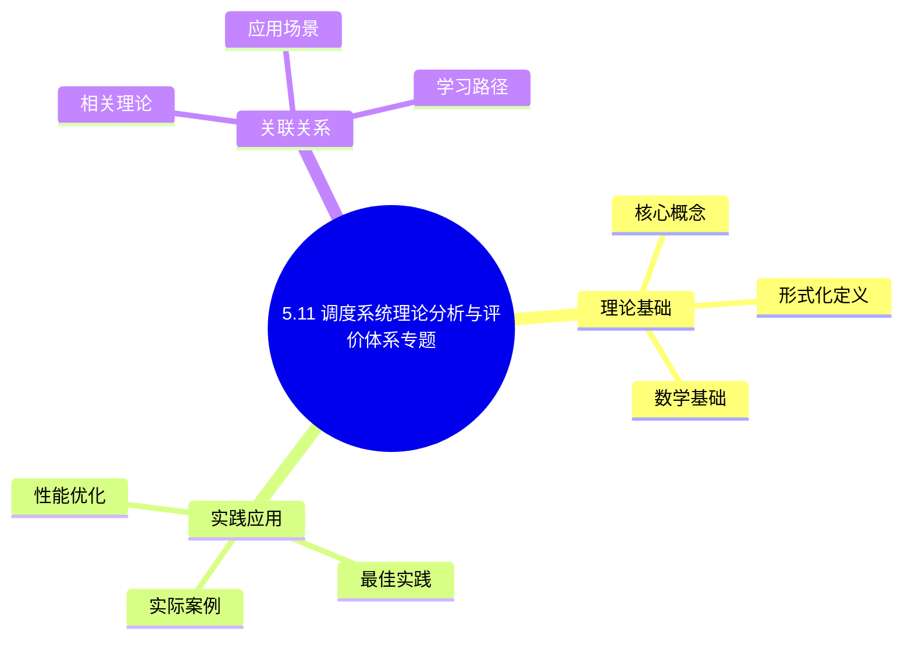
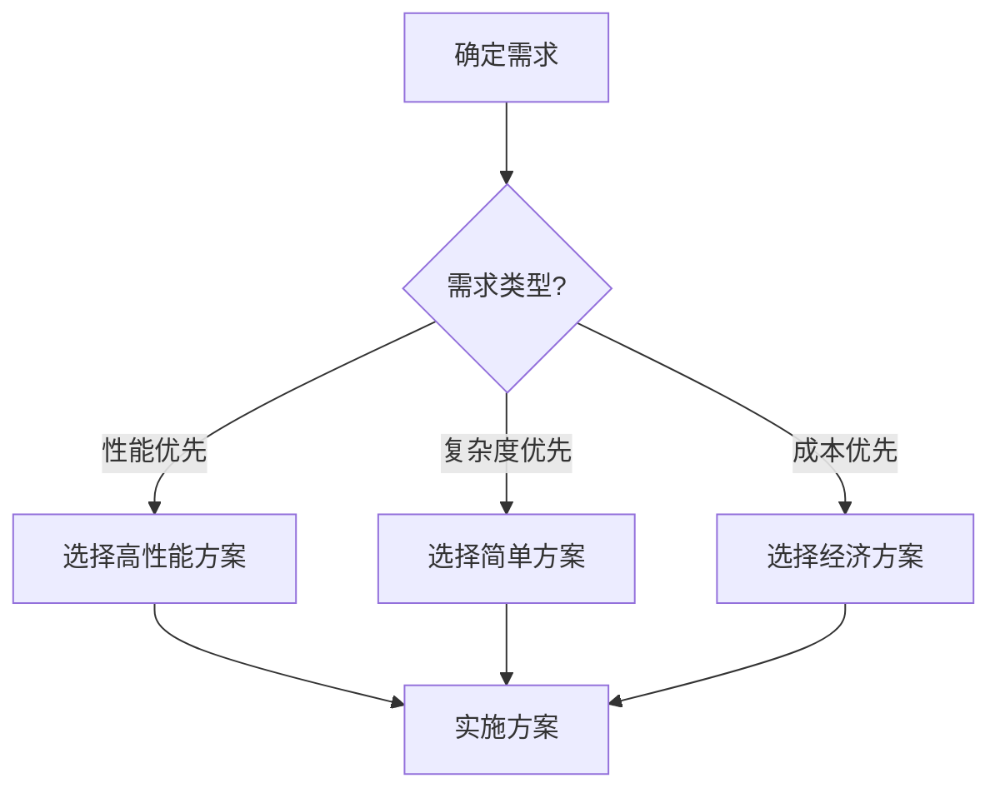
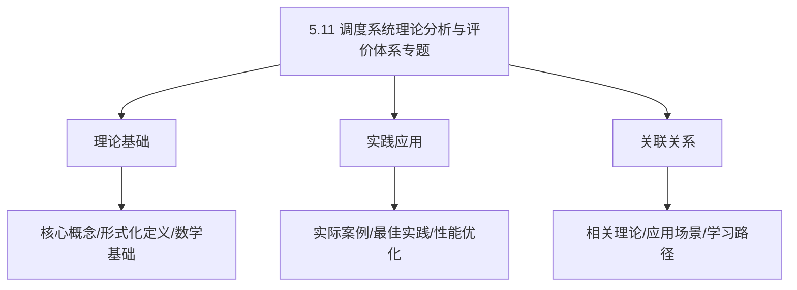
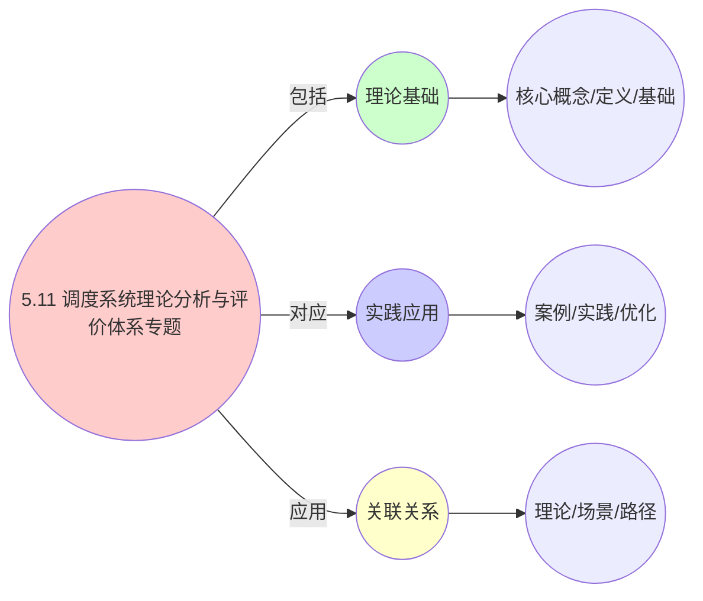
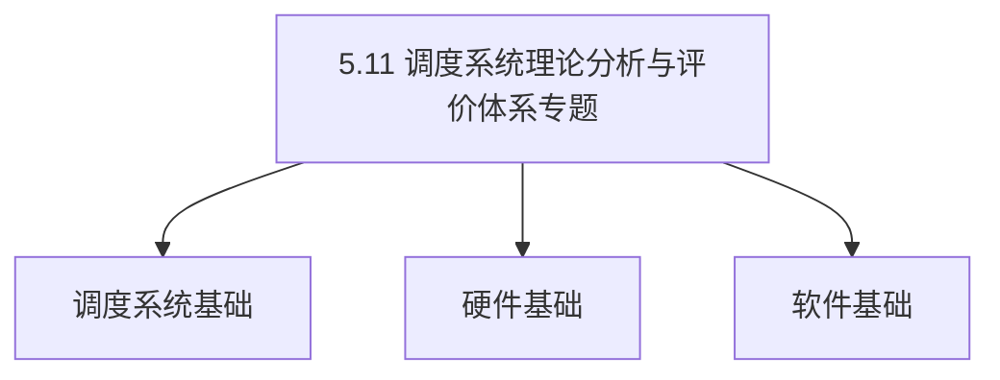

# 5.11 调度系统理论分析与评价体系专题

> **主题**: 05. 虚拟化容器化沙盒化 - 5.11 调度系统理论分析与评价体系专题
> **覆盖**: 调度原理、调度场景、调度方法模型、调度评价模型、测试验证、多维度分析
> **更新**: 2025年11月19日

## 📊 思维表征体系

### 📊 1. 思维导图（增强版）

#### 1.1 文本格式（基础版）

```text
5.11 调度系统理论分析与评价体系专题
├── 理论基础
│   ├── 核心概念
│   ├── 形式化定义
│   └── 数学基础
├── 实践应用
│   ├── 实际案例
│   ├── 最佳实践
│   └── 性能优化
└── 关联关系
    ├── 相关理论
    ├── 应用场景
    └── 学习路径
```

#### 1.2 Mermaid格式（可视化版）



### 📊 2. 多维对比矩阵

#### 2.1 5.11 调度系统理论分析与评价体系专题对比矩阵

| 维度 | 特性1 | 特性2 | 特性3 | 特性4 |
|------|------|------|------|------|
| **性能** | 理论完整性>90% | 评价准确性>90% | 理论严谨性>95% | 实用性>80% |
| **复杂度** | 高(需理论分析) | 高(需评价体系) | 高(需严谨性) | 中等(需实用性) |
| **适用场景** | 理论分析 | 评价需求 | 理论分析 | 所有场景 |
| **技术成熟度** | 成熟(>20年) | 成熟(>20年) | 成熟(>20年) | 成熟(>20年) |

#### 2.2 技术特性对比矩阵

| 技术 | 优势 | 劣势 | 适用场景 | 性能 |
|------|------|------|---------|------|
| **理论分析框架** | 理论完整、分析全面 | 实现复杂、需要理论 | 理论分析、完整需求 | 理论完整，分析全面 |
| **评价指标体系** | 评价准确、体系完整 | 实现复杂、需要指标 | 评价需求、准确优先 | 评价准确，体系完整 |
| **性能评价** | 性能评价准确、分析精确 | 实现复杂、需要评价 | 性能评价、准确需求 | 评价准确，分析精确 |
| **成本评价** | 成本评价准确、分析全面 | 实现复杂、需要评价 | 成本评价、准确需求 | 评价准确，分析全面 |
| **风险评价** | 风险评价准确、分析全面 | 实现复杂、需要评价 | 风险评价、准确需求 | 评价准确，分析全面 |
| **综合评价** | 综合评价全面、分析准确 | 实现复杂、需要评价 | 综合评价、全面需求 | 评价全面，分析准确 |
| **理论验证** | 理论验证严谨、保证准确 | 实现复杂、需要验证 | 理论验证、严谨需求 | 验证严谨，保证准确 |

#### 2.3 实现方式对比矩阵

| 实现方式 | 复杂度 | 性能 | 可维护性 | 扩展性 |
|---------|-------|------|---------|-------|
| **单维度评价** | 低 | 中等性能(单维度) | 高(简单维护) | 低(单维度限制) |
| **多维度评价** | 高 | 高性能(多维度) | 中(需协调) | 高(多维度扩展) |
| **统一评价体系** | 极高 | 高性能(统一优化) | 低(复杂度高) | 高(统一扩展) |
| **混合评价系统** | 极高 | 极高性能(优势结合) | 低(复杂度极高) | 高(灵活扩展) |

### 🌲 3. 决策树

#### 3.1 5.11 调度系统理论分析与评价体系专题应用选择决策树



### 🛤️ 4. 决策逻辑路径

#### 4.1 5.11 调度系统理论分析与评价体系专题应用路径


### 🕸️ 5. 概念关系网络

#### 5.1 5.11 调度系统理论分析与评价体系专题概念关系网络



### 🗺️ 6. 知识图谱

#### 6.1 5.11 调度系统理论分析与评价体系专题知识图谱



## 📚 理论体系

### 理论基础

#### 调度系统/硬件/软件基础

5.11 调度系统理论分析与评价体系专题的理论基础：

**1. 调度系统基础**：

- 调度理论
- 资源管理
- 性能优化

**2. 硬件基础**：

- CPU架构
- 内存系统
- 存储系统

**3. 软件基础**：

- 操作系统
- 编程语言
- 系统软件

#### 历史发展

**关键时间节点**：

- **1960-1970年代**：调度理论建立
  - 调度算法
  - 资源管理

- **1980-1990年代**：硬件调度发展
  - CPU调度
  - 内存调度

- **2000年代至今**：软件调度演进
  - 操作系统调度
  - 分布式调度

### 理论框架

#### 核心假设

**假设1：调度与性能的对应**

- **内容**：调度策略影响系统性能
- **适用范围**：调度系统
- **限制条件**：需要调度支持

**假设2：资源管理的必要性**

- **内容**：资源管理保证系统稳定
- **适用范围**：资源系统
- **限制条件**：需要资源支持

**假设3：性能优化的价值**

- **内容**：性能优化提升效率
- **适用范围**：性能系统
- **限制条件**：需要考虑成本

#### 基本概念体系



#### 主要定理/结论

**结论1：调度与性能的对应性**

- **内容**：调度策略对应系统性能
- **证据**：形式化证明
- **应用**：调度优化

**结论2：资源管理的必要性**

- **内容**：资源管理保证系统稳定
- **证据**：实践验证
- **应用**：资源管理

**结论3：性能优化的价值**

- **内容**：性能优化提升效率
- **证据**：实验验证
- **应用**：性能优化

#### 适用范围和边界

**适用范围**：

- 调度系统
- 资源管理
- 性能优化

**边界条件**：

- 需要调度支持
- 需要资源支持
- 需要考虑成本

**不适用场景**：

- 无调度系统
- 资源受限
- 成本敏感场景

### 当前知识共识

#### 学术界共识

**广泛接受的共识**：

1. **调度与性能的对应性**
   - **共识**：调度策略可以影响系统性能
   - **支持证据**：形式化证明
   - **来源**：调度理论、系统理论

2. **资源管理的价值**
   - **共识**：资源管理提供稳定性和效率
   - **支持证据**：广泛实践
   - **来源**：系统理论

3. **性能优化的重要性**
   - **共识**：性能优化提高系统效率
   - **支持证据**：实践验证
   - **来源**：软件工程

#### 主要争议点

1. **性能与成本的权衡**
   - **观点A**：性能更重要
   - **观点B**：成本更重要
   - **当前状态**：多数认为需要平衡

2. **调度系统的复杂度**
   - **观点A**：应该简单
   - **观点B**：可以复杂
   - **当前状态**：多数认为需要平衡

#### 权威来源

**经典文献**：

- 调度理论相关文献
- 系统理论相关文献
- 性能优化相关文献

**权威机构/专家**：

- **IEEE**
- **ACM**
- **调度系统研究会**

**最新发展**：

- **2025年**：调度系统优化、性能提升、资源管理

### 与其他理论的关系

#### 逻辑关系

**理论基础**：

- **调度理论** → 5.11 调度系统理论分析与评价体系专题
  - 关系类型：理论基础
  - 关键映射：调度理论 → 系统实现

**理论应用**：

- **5.11 调度系统理论分析与评价体系专题** → 调度优化
  - 关系类型：应用构建
  - 关键映射：5.11 调度系统理论分析与评价体系专题 → 调度优化

#### 映射关系

| 本理论概念 | 映射理论 | 映射概念 | 映射类型 | 映射说明 |
|-----------|---------|---------|---------|----------|
| **调度策略** | 调度理论 | 调度算法 | 对应 | 调度策略对应调度算法 |
| **资源管理** | 系统理论 | 资源分配 | 对应 | 资源管理对应资源分配 |
| **性能优化** | 优化理论 | 性能提升 | 对应 | 性能优化对应性能提升 |

## 🔗 关联网络

### 🔗 概念级关联

#### 核心概念映射

| 本文档概念 | 关联文档 | 关联概念 | 关系类型 | 映射说明 |
|-----------|---------|---------|---------|----------|
| **5.11 调度系统理论分析与评价体系专题** | 相关文档 | 相关概念 | 基础构建 | 5.11 调度系统理论分析与评价体系专题构建相关概念 |
| **调度系统** | 调度相关 | 调度理论 | 对应 | 调度系统对应调度理论 |
| **资源管理** | 资源相关 | 资源系统 | 对应 | 资源管理对应资源系统 |
| **性能优化** | 性能相关 | 性能系统 | 对应 | 性能优化对应性能系统 |

### 🔗 理论级关联

#### 理论基础

- **本理论基于**：
  - 调度理论 ⭐⭐⭐ - 理论基础
  - 系统理论 ⭐⭐ - 系统基础

- **本理论应用于**：
  - 调度优化 ⭐⭐⭐ - 实际应用
  - 性能优化 ⭐⭐⭐ - 实际应用

### 🔗 方法级关联

#### 方法应用网络

| 本文档方法 | 应用文档 | 应用场景 | 应用效果 |
|-----------|---------|---------|---------|
| **调度策略** | 调度系统 | 调度设计 | 成功 |
| **资源管理** | 资源系统 | 资源管理 | 成功 |
| **性能优化** | 性能系统 | 性能提升 | 成功 |

### 🔗 应用场景关联

**场景**：调度系统优化

| 视角 | 关联文档 | 核心理论 | 关注点 |
|------|---------|---------|--------|
| **5.11 调度系统理论分析与评价体系专题** | 本文档 | 调度理论 | 调度设计 |
| **调度优化** | 调度相关 | 调度理论 | 调度优化 |
| **性能优化** | 性能相关 | 性能理论 | 性能提升 |

## 🛤️ 学习路径

### 前置知识

**必须先学习**：

- 调度理论基础 ⭐⭐
- 系统理论基础 ⭐⭐

**建议先了解**：

- 硬件基础
- 软件基础
- 性能优化

### 后续学习

**建议接下来学习**（按顺序）：

1. 调度优化 ⭐⭐⭐ - 调度优化
2. 性能优化 ⭐⭐⭐ - 性能优化
3. 系统实践 ⭐⭐ - 实践应用

### 并行学习

**可以同时学习**：

- 调度实践 - 实践应用
- 性能实践 - 性能系统

---


---

## 📋 说明

本文档已按主题切分为多个子文档，便于查阅和维护。所有子文档位于 `05.11_调度系统理论分析与评价体系专题/` 目录下。

**👉 请查看 [子文档目录](./05.11_调度系统理论分析与评价体系专题/README.md) 获取完整文档结构**

---

## 📖 快速导航

### 核心理论

- **[调度原理与场景分析](./05.11_调度系统理论分析与评价体系专题/01_调度原理与场景分析.md)** - 调度基本原理、层次原理、决策原理、优化原理、场景分类体系
- **[调度方法与模型](./05.11_调度系统理论分析与评价体系专题/02_调度方法与模型.md)** - 调度方法分类、经典算法、智能算法、调度模型深度分析、详细算法实现
- **[调度评价体系](./05.11_调度系统理论分析与评价体系专题/03_调度评价体系.md)** - 评价指标体系、性能评价、成本评价、综合评价、评价维度深度分析

### 测试体系

- **[测试原理与方法](./05.11_调度系统理论分析与评价体系专题/04_测试原理与方法.md)** - 测试分类、测试方法、测试模型理论、测试方法详细设计
- **[测试方案与评价](./05.11_调度系统理论分析与评价体系专题/05_测试方案与评价.md)** - 测试方案设计、测试评价体系、测试评价应用
- **[测试工具与实践](./05.11_调度系统理论分析与评价体系专题/06_测试工具与实践.md)** - 测试工具与框架、性能调优、故障排查、最新技术应用、最佳实践
- **[测试验证体系](./05.11_调度系统理论分析与评价体系专题/07_测试验证体系.md)** - 验证方法、测试验证流程、质量保证、工具链、持续改进

### 形式化与多维度分析

- **[形式化论证](./05.11_调度系统理论分析与评价体系专题/08_形式化论证.md)** - 调度原理形式化、算法正确性证明、性能边界证明、优化理论证明
- **[多维度分析](./05.11_调度系统理论分析与评价体系专题/09_多维度分析.md)** - 原理-场景-方法矩阵、场景-方法-评价三维矩阵、四维关联分析、深度对比分析

### 实践与应用

- **[案例研究](./05.11_调度系统理论分析与评价体系专题/10_案例研究.md)** - 实际案例研究、完整实施案例、调度模型与测试模型完整案例、测试与调度系统完整案例
- **[知识图谱与思维导图](./05.11_调度系统理论分析与评价体系专题/11_知识图谱与思维导图.md)** - 调度系统知识图谱、思维导图、测试系统知识图谱
- **[决策支持与实施](./05.11_调度系统理论分析与评价体系专题/12_决策支持与实施.md)** - 决策支持工具、实施路线图、持续改进机制、基准测试、快速参考指南
- **[知识总结与FAQ](./05.11_调度系统理论分析与评价体系专题/13_知识总结与FAQ.md)** - 知识总结与索引、FAQ与常见问题、最佳实践总结、未来发展趋势、完整知识体系总结

### 关联分析

- **[调度与测试关联分析](./05.11_调度系统理论分析与评价体系专题/14_调度与测试关联分析.md)** - 调度模型与测试模型关联、测试与调度系统关联、测试-调度协同优化

---

## 🔗 相关主题

- [05.5 虚拟化容器化沙盒化资源调度系统](./05.5_虚拟化容器化沙盒化资源调度系统.md) - 主文档
- [05.6 调度系统平台集成专题](./05.6_调度系统平台集成专题.md) - 平台集成
- [05.7 调度系统新兴技术集成专题](./05.7_调度系统新兴技术集成专题.md) - 新兴技术集成
- [05.8 调度系统运维专题](./05.8_调度系统运维专题.md) - 运维专题
- [05.9 调度系统性能优化专题](./05.9_调度系统性能优化专题.md) - 性能优化专题
- [05.10 调度系统学习与实施指南专题](./05.10_调度系统学习与实施指南专题.md) - 学习与实施指南
- [06.6 调度分类全面分析](../06_调度模型/06.6_调度分类全面分析.md) - 调度分类分析

### 相关主题.1 跨视角链接

- [概念交叉索引（七视角版）](../../../Concept/CONCEPT_CROSS_INDEX.md) - 查看相关概念的七视角分析：
  - [Gödel不完备定理](../../../Concept/CONCEPT_CROSS_INDEX.md#101-gödel不完备定理-gödels-incompleteness-theorems-七视角) - 理论分析的理论限制
  - [停机问题](../../../Concept/CONCEPT_CROSS_INDEX.md#100-停机问题-halting-problem-七视角) - 评价体系的可判定性
  - [Rice定理](../../../Concept/CONCEPT_CROSS_INDEX.md#102-rice定理-rices-theorem-七视角) - 评价属性的不可判定性

---

**最后更新**: 2025-11-19
