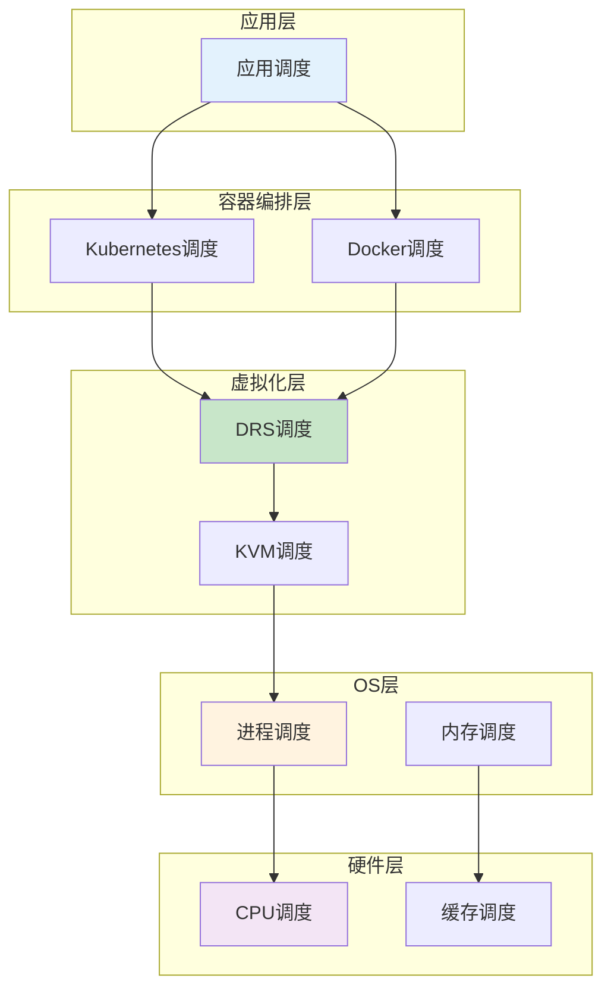
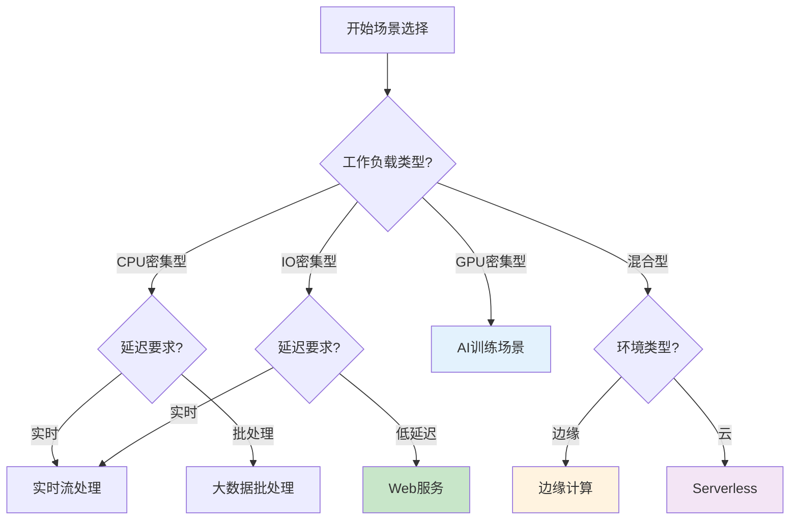

# 调度原理与场景分析

> **来源**: 05.11 调度系统理论分析与评价体系专题
> **章节**: 第1章、第2章
> **更新**: 2025年11月19日

---

## 📋 目录

- [调度原理与场景分析](#调度原理与场景分析)
  - [📋 目录](#-目录)
  - [1 调度原理分析](#1-调度原理分析)
    - [1.1 调度基本原理](#11-调度基本原理)
    - [1.2 调度层次原理](#12-调度层次原理)
    - [1.3 调度决策原理](#13-调度决策原理)
    - [1.4 调度优化原理](#14-调度优化原理)
  - [2 调度场景分类](#2-调度场景分类)
    - [2.1 场景分类体系](#21-场景分类体系)
    - [2.2 典型场景分析](#22-典型场景分析)
    - [2.3 场景对比矩阵](#23-场景对比矩阵)
    - [2.4 场景选择决策树](#24-场景选择决策树)
  - [🔗 相关文档](#-相关文档)

---

## 1 调度原理分析

### 1.1 调度基本原理

**定义1.1（调度系统）**：

调度系统是一个六元组：

$$
\mathcal{S} = (T, R, C, A, P, O)
$$

其中：

- $T = \{t_1, t_2, \ldots, t_n\}$：任务集合
- $R = \{r_1, r_2, \ldots, r_m\}$：资源集合
- $C$：约束条件集合
- $A$：调度算法集合
- $P$：调度策略集合
- $O$：优化目标集合

**调度基本原理**（2025年11月19日最新）：

1. **资源分配原理**：
   - 将有限资源分配给多个任务
   - 满足资源容量约束
   - 满足任务需求约束

2. **负载均衡原理**：
   - 平衡资源使用率
   - 避免资源热点
   - 提升整体利用率

3. **优先级原理**：
   - 根据任务优先级调度
   - 保证关键任务优先执行
   - 平衡公平性和效率

4. **本地性原理**：
   - 优先使用本地资源
   - 减少数据传输开销
   - 降低网络延迟

### 1.2 调度层次原理

**调度层次架构**：

**层次调度原理**：

1. **层次独立性**：每层独立调度，互不干扰
2. **层次协作**：上层调度依赖下层资源
3. **层次优化**：每层独立优化，整体协同
4. **层次抽象**：上层隐藏下层细节

### 1.3 调度决策原理

**定义1.2（调度决策）**：

调度决策函数：

$$
f_{decision} : (T, R, C, P) \rightarrow A
$$

其中 $A$ 是资源分配方案。

**调度决策原理**（2025年11月19日最新）：

1. **评分机制**：
   $$
   Score(t, r) = \sum_{i} w_i \cdot f_i(t, r)
   $$
   其中 $w_i$ 是权重，$f_i$ 是评分函数。

2. **选择机制**：
   $$
   r^* = \arg\max_{r \in R} Score(t, r)
   $$

3. **约束检查**：
   $$
   \forall c \in C: c(t, r^*) = true
   $$

4. **优化目标**：
   $$
   \max \sum_{t \in T} \sum_{r \in R} Score(t, r) \cdot x_{t,r}
   $$
   其中 $x_{t,r} \in \{0, 1\}$ 是分配变量。

### 1.4 调度优化原理

**定义1.3（调度优化问题）**：

调度优化问题是一个多目标优化问题：

$$
\begin{align}
\min \quad & (f_1(x), f_2(x), \ldots, f_k(x)) \\
\text{s.t.} \quad & g_i(x) \leq 0, \quad i = 1, 2, \ldots, m \\
& h_j(x) = 0, \quad j = 1, 2, \ldots, p
\end{align}
$$

**优化原理**（2025年11月19日最新）：

1. **帕累托最优**：不存在更优解
2. **权重聚合**：将多目标转化为单目标
3. **约束优化**：在约束条件下优化
4. **启发式优化**：使用启发式算法求解

---

## 2 调度场景分类

### 2.1 场景分类体系

**场景分类维度**（2025年11月19日最新）：

1. **按工作负载类型**：
   - CPU密集型
   - 内存密集型
   - IO密集型
   - 网络密集型
   - 混合型

2. **按延迟要求**：
   - 实时场景（<1ms）
   - 低延迟场景（1-10ms）
   - 一般延迟场景（10-100ms）
   - 批处理场景（>100ms）

3. **按规模**：
   - 小规模（<100节点）
   - 中规模（100-1000节点）
   - 大规模（1000-10000节点）
   - 超大规模（>10000节点）

4. **按环境**：
   - 云环境
   - 边缘环境
   - 混合环境
   - 本地环境

### 2.2 典型场景分析

**场景2.1（Web服务调度）**：

**特点**：

- 工作负载：IO密集型
- 延迟要求：低延迟（10-100ms）
- 规模：中大规模
- 环境：云环境

**调度需求**：

- 负载均衡
- 快速响应
- 高可用性

**场景2.2（大数据批处理调度）**：

**特点**：

- 工作负载：CPU/IO混合
- 延迟要求：批处理（>100ms）
- 规模：大规模
- 环境：云环境

**调度需求**：

- 数据本地性
- 资源利用率
- 成本优化

**场景2.3（AI训练调度）**：

**特点**：

- 工作负载：GPU密集型
- 延迟要求：一般延迟
- 规模：中大规模
- 环境：云环境/本地

**调度需求**：

- GPU资源分配
- 模型并行
- 数据并行

**场景2.4（边缘计算调度）**：

**特点**：

- 工作负载：混合型
- 延迟要求：实时/低延迟
- 规模：小规模
- 环境：边缘环境

**调度需求**：

- 本地优先
- 低延迟
- 资源受限

### 2.3 场景对比矩阵

**场景对比矩阵**（2025年11月19日最新）：

| **场景** | **工作负载** | **延迟要求** | **规模** | **环境** | **关键需求** |
|---------|------------|------------|---------|---------|------------|
| **Web服务** | IO密集型 | 低延迟 | 中大规模 | 云 | 负载均衡、快速响应 |
| **大数据批处理** | CPU/IO混合 | 批处理 | 大规模 | 云 | 数据本地性、利用率 |
| **AI训练** | GPU密集型 | 一般延迟 | 中大规模 | 云/本地 | GPU分配、并行 |
| **边缘计算** | 混合型 | 实时/低延迟 | 小规模 | 边缘 | 本地优先、低延迟 |
| **实时流处理** | CPU/IO混合 | 实时 | 中大规模 | 云/边缘 | 低延迟、高吞吐 |
| **Serverless** | 混合型 | 低延迟 | 大规模 | 云 | 冷启动优化、弹性 |

### 2.4 场景选择决策树

**场景选择决策流程**（2025年11月19日最新）：

---

## 🔗 相关文档

- [返回专题目录](./README.md)
- [调度方法与模型](./02_调度方法与模型.md) - 调度方法分类、经典算法、智能算法
- [调度评价体系](./03_调度评价体系.md) - 评价指标体系、性能评价、成本评价
- [多维度分析](./09_多维度分析.md) - 原理-场景-方法矩阵、场景对比分析
- [形式化论证](./08_形式化论证.md) - 调度原理形式化、算法正确性证明

---

**最后更新**: 2025-11-19
