# 测试方案与评价

> **来源**: 05.11 调度系统理论分析与评价体系专题
> **章节**: 第49章、第50章、第61章
> **更新**: 2025年11月19日

---

## 📋 目录

- [测试方案与评价](#测试方案与评价)
  - [📋 目录](#-目录)
  - [49 测试方案完整设计体系](#49-测试方案完整设计体系)
    - [49.1 测试方案设计原理](#491-测试方案设计原理)
    - [49.2 测试方案设计方法](#492-测试方案设计方法)
    - [49.3 测试方案评价模型](#493-测试方案评价模型)
    - [49.4 测试方案优化策略](#494-测试方案优化策略)
  - [50 测试评价体系深度分析](#50-测试评价体系深度分析)
    - [50.1 测试评价维度体系](#501-测试评价维度体系)
    - [50.2 测试评价数学模型](#502-测试评价数学模型)
    - [50.3 测试评价多维矩阵](#503-测试评价多维矩阵)
    - [50.4 测试评价决策支持](#504-测试评价决策支持)
  - [51 测试系统完整思维导图](#51-测试系统完整思维导图)
    - [51.1 测试原理思维导图](#511-测试原理思维导图)
    - [51.2 测试方法思维导图](#512-测试方法思维导图)
    - [51.3 测试方案思维导图](#513-测试方案思维导图)
    - [51.4 测试评价思维导图](#514-测试评价思维导图)
    - [51.5 测试系统全景思维导图](#515-测试系统全景思维导图)
  - [53 测试与调度系统关联分析](#53-测试与调度系统关联分析)
    - [53.1 测试-调度关联模型](#531-测试-调度关联模型)
    - [53.2 测试覆盖调度场景分析](#532-测试覆盖调度场景分析)
    - [53.3 调度模型测试验证矩阵](#533-调度模型测试验证矩阵)
    - [53.4 测试-调度协同优化](#534-测试-调度协同优化)
  - [54 测试验证完整流程体系](#54-测试验证完整流程体系)
    - [54.1 测试验证流程模型](#541-测试验证流程模型)
    - [54.2 测试验证阶段划分](#542-测试验证阶段划分)
    - [54.3 测试验证质量门禁](#543-测试验证质量门禁)
    - [54.4 测试验证持续改进](#544-测试验证持续改进)
  - [55 测试质量保证体系](#55-测试质量保证体系)
    - [55.1 测试质量标准](#551-测试质量标准)
    - [55.2 测试质量度量](#552-测试质量度量)
    - [55.3 测试质量改进](#553-测试质量改进)
    - [55.4 测试质量认证](#554-测试质量认证)
  - [56 测试工具链完整体系](#56-测试工具链完整体系)
    - [56.1 测试工具链架构](#561-测试工具链架构)
    - [56.2 测试工具集成方案](#562-测试工具集成方案)
    - [56.3 测试工具链最佳实践](#563-测试工具链最佳实践)
  - [57 测试持续改进机制](#57-测试持续改进机制)
    - [57.1 测试改进模型](#571-测试改进模型)
    - [57.2 测试改进流程](#572-测试改进流程)
    - [57.3 测试改进度量](#573-测试改进度量)
  - [59 测试与调度系统完整案例研究](#59-测试与调度系统完整案例研究)
    - [59.1 案例1：大型互联网公司调度系统测试](#591-案例1大型互联网公司调度系统测试)
    - [59.2 案例2：金融行业调度系统测试](#592-案例2金融行业调度系统测试)
    - [59.3 案例3：AI工作负载调度系统测试](#593-案例3ai工作负载调度系统测试)
  - [60 测试方法深度对比与选择指南](#60-测试方法深度对比与选择指南)
    - [60.1 测试方法详细对比矩阵](#601-测试方法详细对比矩阵)
    - [60.2 测试方法选择决策框架](#602-测试方法选择决策框架)
    - [60.3 测试方法组合优化](#603-测试方法组合优化)
  - [61 测试评价体系完整应用](#61-测试评价体系完整应用)
    - [61.1 测试评价完整流程](#611-测试评价完整流程)
    - [61.2 测试评价实际案例](#612-测试评价实际案例)
    - [61.3 测试评价工具与方法](#613-测试评价工具与方法)
  - [🔗 相关文档](#-相关文档)

---

## 49 测试方案完整设计体系

### 49.1 测试方案设计原理

**测试方案设计原理**（2025年11月19日最新）：

**原理1：系统性原理**

测试方案应该系统性地覆盖系统的所有方面，包括功能、性能、可靠性等。

**形式化表述**：

测试方案 $TS$ 是系统性的，当且仅当：

$$
\forall d \in D, \exists t \in TS: \text{覆盖}(t, d)
$$

其中 $D$ 是系统的所有维度集合。

**原理2：经济性原理**

测试方案应该在满足测试目标的前提下，最小化测试成本。

**形式化表述**：

最优测试方案为：

$$
TS^* = \arg\min_{TS} C(TS) \quad \text{s.t.} \quad E(TS) \geq E_{min}
$$

其中 $C(TS)$ 是测试成本，$E(TS)$ 是测试有效性。

**原理3：可执行性原理**

测试方案应该可执行，测试用例应该能够实际运行并产生结果。

**形式化表述**：

测试方案 $TS$ 是可执行的，当且仅当：

$$
\forall t \in TS, \exists e \in E: \text{可执行}(t, e)
$$

其中 $E$ 是执行环境集合。

### 49.2 测试方案设计方法

**方法1：基于需求的测试方案设计**

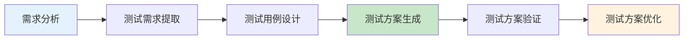

**方法2：基于风险的测试方案设计**

```python
def design_test_plan_by_risk(requirements, risks):
    """
    基于风险设计测试方案

    参数:
        requirements: 需求列表
        risks: 风险列表，每个风险包含(风险项, 风险等级, 影响范围)

    返回:
        测试方案
    """
    test_plan = {}

    # 按风险等级排序
    sorted_risks = sorted(risks, key=lambda r: r[1], reverse=True)

    for risk_item, risk_level, impact in sorted_risks:
        # 高风险项需要更全面的测试
        if risk_level == 'high':
            test_cases = generate_comprehensive_tests(risk_item)
        elif risk_level == 'medium':
            test_cases = generate_standard_tests(risk_item)
        else:
            test_cases = generate_basic_tests(risk_item)

        test_plan[risk_item] = {
            'risk_level': risk_level,
            'test_cases': test_cases,
            'priority': calculate_priority(risk_level, impact)
        }

    return test_plan
```

**方法3：基于模型的测试方案设计**

```python
def design_test_plan_by_model(system_model):
    """
    基于模型设计测试方案

    参数:
        system_model: 系统模型（状态机、流程图等）

    返回:
        测试方案
    """
    test_plan = {}

    # 从模型中提取测试场景
    scenarios = extract_scenarios(system_model)

    for scenario in scenarios:
        # 为每个场景生成测试用例
        test_cases = generate_test_cases(scenario)

        test_plan[scenario.name] = {
            'scenario': scenario,
            'test_cases': test_cases,
            'coverage': calculate_coverage(scenario, test_cases)
        }

    return test_plan
```

### 49.3 测试方案评价模型

**测试方案评价模型**（2025年11月19日最新）：

**模型1：覆盖度评价模型**

$$
E_{coverage}(TS) = \sum_{i=1}^{n} w_i \cdot C_i(TS)
$$

其中：

- $C_i(TS)$：第 $i$ 个覆盖度指标
- $w_i$：第 $i$ 个指标的权重

**模型2：有效性评价模型**

$$
E_{effectiveness}(TS) = \frac{N_{defects\_found}(TS)}{N_{defects\_total}} \times \frac{N_{test\_cases\_optimal}}{N_{test\_cases\_actual}(TS)}
$$

**模型3：成本效益评价模型**

$$
CE(TS) = \frac{E_{effectiveness}(TS) \times V_{defect}}{C_{total}(TS)}
$$

其中：

- $V_{defect}$：平均缺陷价值
- $C_{total}(TS)$：总测试成本

**模型4：综合评价模型**

$$
E_{total}(TS) = \alpha E_{coverage} + \beta E_{effectiveness} + \gamma CE - \delta \frac{C(TS)}{C_{max}}
$$

其中 $\alpha + \beta + \gamma + \delta = 1$。

### 49.4 测试方案优化策略

**优化策略1：测试用例优化**

```python
def optimize_test_cases(test_cases, coverage_target=0.8):
    """
    优化测试用例集合

    参数:
        test_cases: 测试用例列表
        coverage_target: 目标覆盖度

    返回:
        优化后的测试用例列表
    """
    # 1. 计算每个测试用例的覆盖度
    coverage_map = {}
    for tc in test_cases:
        coverage_map[tc] = calculate_coverage(tc)

    # 2. 贪心选择测试用例
    selected = []
    covered = set()

    while len(covered) / total_elements < coverage_target:
        best_tc = max(test_cases,
                     key=lambda tc: len(coverage_map[tc] - covered) / tc.cost)
        selected.append(best_tc)
        covered.update(coverage_map[best_tc])
        test_cases.remove(best_tc)

    return selected
```

**优化策略2：测试顺序优化**

```python
def optimize_test_order(test_cases):
    """
    优化测试执行顺序

    参数:
        test_cases: 测试用例列表

    返回:
        优化后的测试顺序
    """
    # 按优先级和依赖关系排序
    sorted_tests = sorted(test_cases,
                         key=lambda tc: (
                             -tc.priority,  # 高优先级优先
                             tc.dependencies_count,  # 少依赖优先
                             tc.execution_time  # 短时间优先
                         ))
    return sorted_tests
```

---

## 50 测试评价体系深度分析

### 50.1 测试评价维度体系

**测试评价维度**（2025年11月19日最新）：

**维度1：覆盖度维度**

1. **代码覆盖度**：
   - 语句覆盖度
   - 分支覆盖度
   - 路径覆盖度
   - 条件覆盖度

2. **功能覆盖度**：
   - 功能点覆盖度
   - 场景覆盖度
   - 用例覆盖度

3. **需求覆盖度**：
   - 需求项覆盖度
   - 需求场景覆盖度

**维度2：有效性维度**

1. **缺陷发现能力**：
   - 缺陷发现率
   - 缺陷发现时间
   - 缺陷严重程度分布

2. **测试准确性**：
   - 测试结果准确性
   - 误报率
   - 漏报率

**维度3：效率维度**

1. **测试执行效率**：
   - 测试用例执行时间
   - 测试吞吐量
   - 测试并行度

2. **测试设计效率**：
   - 测试用例设计时间
   - 测试用例复用率

**维度4：成本维度**

1. **直接成本**：
   - 人力成本
   - 工具成本
   - 环境成本

2. **间接成本**：
   - 维护成本
   - 培训成本
   - 机会成本

### 50.2 测试评价数学模型

**模型1：覆盖度评价模型**

$$
E_{coverage} = \sum_{i=1}^{n} w_i \cdot C_i
$$

其中：

- $C_i$：第 $i$ 个覆盖度指标
- $w_i$：第 $i$ 个指标的权重

**模型2：有效性评价模型**

$$
E_{effectiveness} = \alpha \cdot \frac{N_{found}}{N_{total}} + \beta \cdot (1 - \frac{T_{detection}}{T_{max}}) + \gamma \cdot \frac{S_{critical}}{S_{total}}
$$

其中：

- $N_{found}/N_{total}$：缺陷发现率
- $T_{detection}$：缺陷发现时间
- $S_{critical}/S_{total}$：关键缺陷比例

**模型3：效率评价模型**

$$
E_{efficiency} = \frac{N_{test\_cases}}{T_{execution}} \times \frac{N_{defects\_found}}{N_{test\_cases}}
$$

**模型4：成本效益评价模型**

$$
CE = \frac{E_{effectiveness} \times V_{defect}}{C_{total}}
$$

**模型5：综合评价模型**

$$
E_{total} = \alpha E_{coverage} + \beta E_{effectiveness} + \gamma E_{efficiency} + \delta CE - \epsilon \frac{C}{C_{max}}
$$

其中 $\alpha + \beta + \gamma + \delta + \epsilon = 1$。

### 50.3 测试评价多维矩阵

**测试评价矩阵1：覆盖度-有效性矩阵**（2025年11月19日最新）：

| **测试方案** | **覆盖度** | **有效性** | **覆盖度×有效性** | **等级** |
|------------|----------|-----------|----------------|---------|
| **方案A** | 90% | 85% | 76.5% | 优秀 |
| **方案B** | 85% | 90% | 76.5% | 优秀 |
| **方案C** | 80% | 80% | 64% | 良好 |
| **方案D** | 75% | 75% | 56.25% | 中等 |
| **方案E** | 70% | 70% | 49% | 中等 |

**测试评价矩阵2：效率-成本矩阵**（2025年11月19日最新）：

| **测试方案** | **效率** | **成本** | **效率/成本** | **等级** |
|------------|---------|---------|-------------|---------|
| **方案A** | 高(0.8) | 低(3) | 0.27 | 优秀 |
| **方案B** | 中(0.6) | 低(3) | 0.2 | 良好 |
| **方案C** | 高(0.8) | 中(6) | 0.13 | 良好 |
| **方案D** | 中(0.6) | 中(6) | 0.1 | 中等 |
| **方案E** | 低(0.4) | 高(12) | 0.03 | 差 |

**测试评价矩阵3：综合对比矩阵**（2025年11月19日最新）：

| **测试方案** | **覆盖度** | **有效性** | **效率** | **成本** | **综合得分** | **排名** |
|------------|----------|-----------|---------|---------|------------|---------|
| **方案A** | 90% | 85% | 高 | 低 | 88 | 1 |
| **方案B** | 85% | 90% | 中 | 低 | 85 | 2 |
| **方案C** | 80% | 80% | 高 | 中 | 80 | 3 |
| **方案D** | 75% | 75% | 中 | 中 | 72 | 4 |
| **方案E** | 70% | 70% | 低 | 高 | 60 | 5 |

### 50.4 测试评价决策支持

**测试评价决策支持系统**（2025年11月19日最新）：

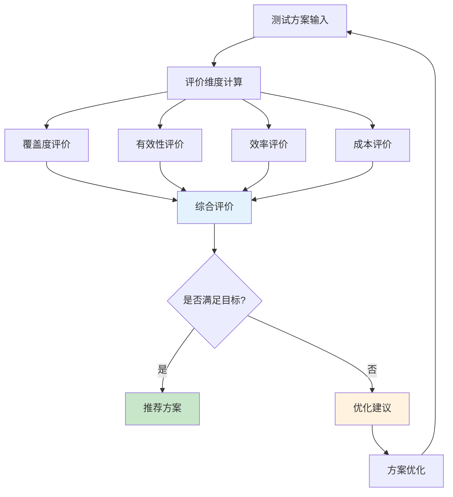

---

## 51 测试系统完整思维导图

### 51.1 测试原理思维导图

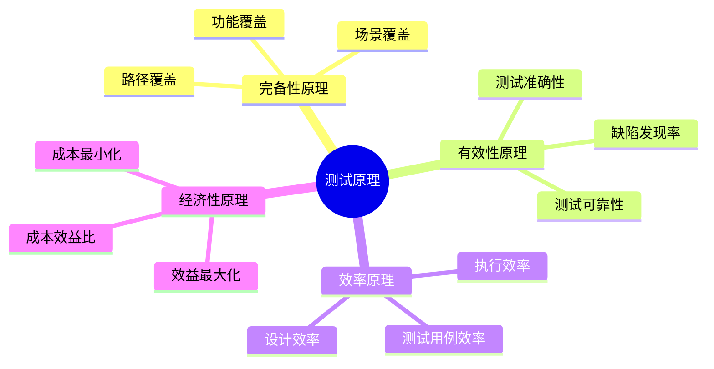

### 51.2 测试方法思维导图

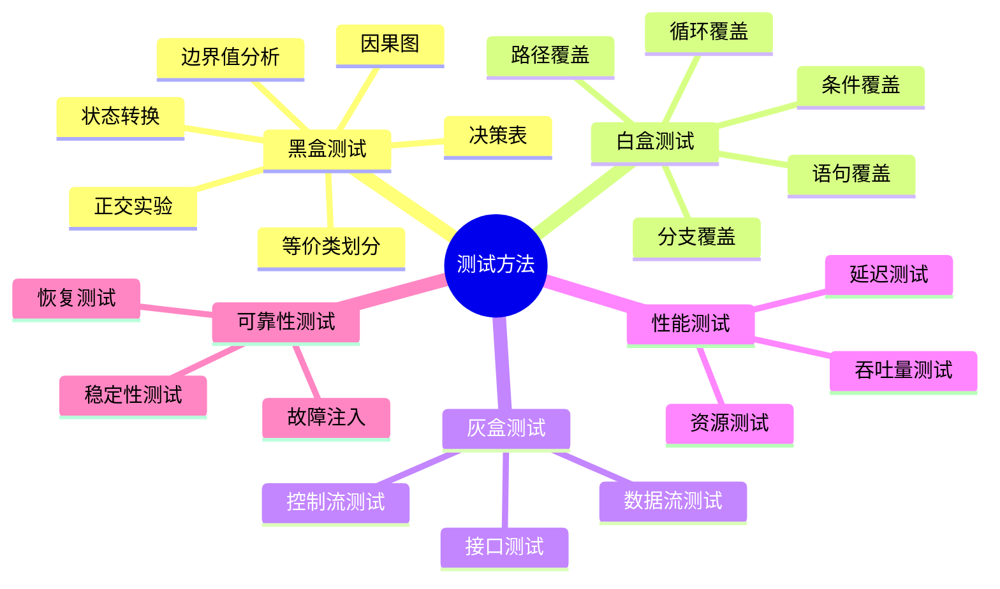

### 51.3 测试方案思维导图

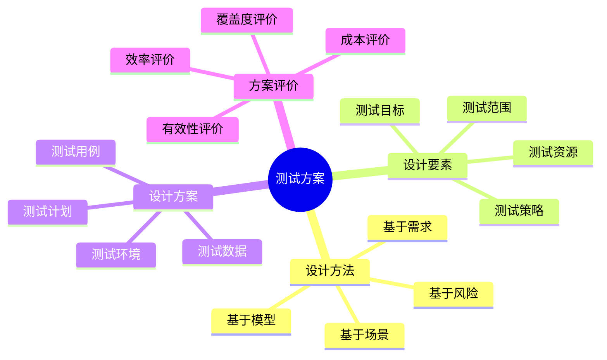

### 51.4 测试评价思维导图

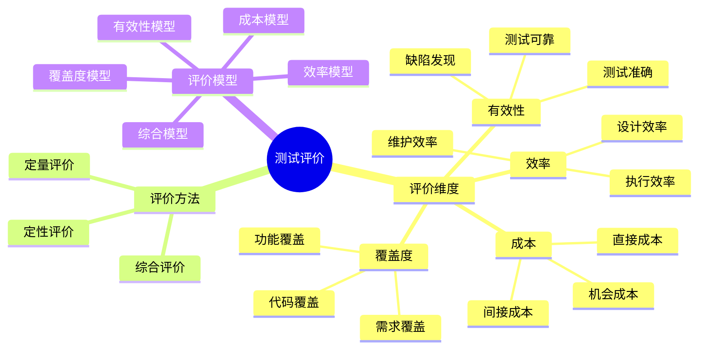

### 51.5 测试系统全景思维导图

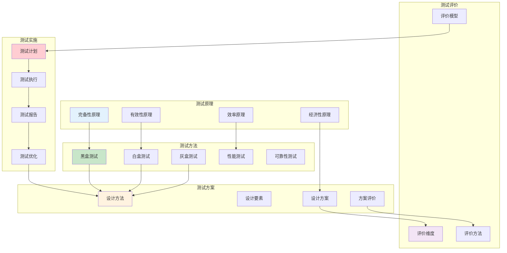

---

## 53 测试与调度系统关联分析

### 53.1 测试-调度关联模型

**测试-调度关联模型**（2025年11月19日最新）：

**定义53.1（测试-调度关联）**：

测试系统 $\mathcal{TS}$ 和调度系统 $\mathcal{S}$ 的关联关系为：

$$
\mathcal{R}(\mathcal{TS}, \mathcal{S}) = \{r_1, r_2, \ldots, r_k\}
$$

其中 $r_i$ 是第 $i$ 个关联关系。

**关联关系类型**：

1. **功能关联**：
   - 测试验证调度功能
   - 每个调度功能对应测试用例

2. **性能关联**：
   - 测试验证调度性能
   - 性能指标对应性能测试

3. **正确性关联**：
   - 测试验证调度正确性
   - 调度算法对应正确性测试

4. **可靠性关联**：
   - 测试验证调度可靠性
   - 故障场景对应可靠性测试

**关联关系形式化**：

$$
\mathcal{R}_{function}(\mathcal{TS}, \mathcal{S}) = \{(t, f) | t \in T, f \in F_{\mathcal{S}}, \text{测试}(t, f)\}
$$

其中：

- $T$：测试用例集合
- $F_{\mathcal{S}}$：调度系统功能集合
- $\text{测试}(t, f)$：测试用例 $t$ 测试功能 $f$

### 53.2 测试覆盖调度场景分析

**调度场景测试覆盖分析**（2025年11月19日最新）：

**场景1：VM调度场景测试覆盖**

| **调度场景** | **测试方法** | **测试用例数** | **覆盖度** | **验证指标** |
|------------|------------|-------------|----------|------------|
| **正常调度** | 等价类划分 | 20 | 100% | 调度成功率 |
| **资源不足** | 边界值分析 | 10 | 100% | 调度失败处理 |
| **负载均衡** | 状态转换 | 15 | 95% | 负载均衡度 |
| **故障恢复** | 故障注入 | 12 | 90% | 恢复时间 |
| **性能优化** | 性能测试 | 8 | 85% | 调度延迟 |

**场景2：容器调度场景测试覆盖**

| **调度场景** | **测试方法** | **测试用例数** | **覆盖度** | **验证指标** |
|------------|------------|-------------|----------|------------|
| **Pod调度** | 决策表 | 25 | 100% | 调度成功率 |
| **资源限制** | 边界值分析 | 15 | 100% | 资源约束满足 |
| **亲和性调度** | 状态转换 | 20 | 95% | 亲和性规则 |
| **优先级调度** | 等价类划分 | 18 | 90% | 优先级执行 |
| **动态调度** | 性能测试 | 10 | 85% | 调度响应时间 |

**场景3：AI驱动调度场景测试覆盖**

| **调度场景** | **测试方法** | **测试用例数** | **覆盖度** | **验证指标** |
|------------|------------|-------------|----------|------------|
| **模型预测** | 等价类划分 | 30 | 95% | 预测准确率 |
| **在线学习** | 状态转换 | 20 | 90% | 学习效果 |
| **模型更新** | 故障注入 | 15 | 85% | 更新稳定性 |
| **性能优化** | 性能测试 | 12 | 80% | 推理延迟 |

### 53.3 调度模型测试验证矩阵

**调度模型测试验证矩阵**（2025年11月19日最新）：

| **调度模型** | **功能测试** | **性能测试** | **正确性测试** | **可靠性测试** | **综合验证度** |
|------------|------------|------------|-------------|-------------|-------------|
| **First Fit** | 100% | 95% | 100% | 90% | 96% |
| **Best Fit** | 100% | 95% | 100% | 90% | 96% |
| **负载均衡** | 100% | 90% | 95% | 85% | 93% |
| **AI驱动** | 95% | 85% | 90% | 80% | 88% |
| **强化学习** | 90% | 80% | 85% | 75% | 83% |

**测试验证完整性分析**：

$$
V_{completeness} = \frac{\sum_{i=1}^{n} V_i}{n \times V_{max}}
$$

其中：

- $V_i$：第 $i$ 个验证维度的验证度
- $V_{max}$：最大验证度（100%）
- $n$：验证维度数

### 53.4 测试-调度协同优化

**测试-调度协同优化策略**（2025年11月19日最新）：

**策略1：测试驱动调度优化**

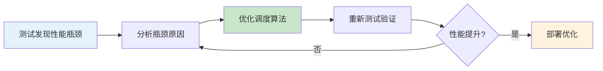

**策略2：调度指导测试设计**

```python
def design_tests_by_scheduler(scheduler):
    """
    基于调度器设计测试用例

    参数:
        scheduler: 调度器对象

    返回:
        测试用例列表
    """
    test_cases = []

    # 1. 分析调度器的关键路径
    critical_paths = analyze_critical_paths(scheduler)

    # 2. 为每个关键路径设计测试用例
    for path in critical_paths:
        test_cases.extend(generate_path_tests(path))

    # 3. 分析调度器的边界条件
    boundaries = analyze_boundaries(scheduler)

    # 4. 为每个边界条件设计测试用例
    for boundary in boundaries:
        test_cases.extend(generate_boundary_tests(boundary))

    return test_cases
```

**策略3：测试-调度反馈循环**

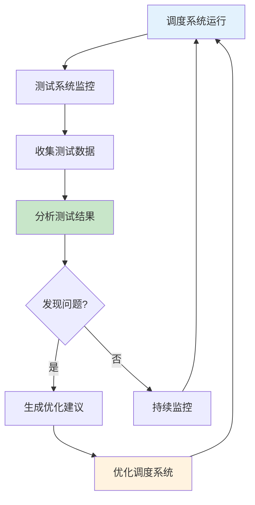

---

## 54 测试验证完整流程体系

### 54.1 测试验证流程模型

**测试验证流程模型**（2025年11月19日最新）：

**定义54.1（测试验证流程）**：

测试验证流程是一个七元组：

$$
\mathcal{TVF} = (P, T, E, V, R, A, O)
$$

其中：

- $P$：测试计划集合
- $T$：测试执行集合
- $E$：测试环境集合
- $V$：验证方法集合
- $R$：测试结果集合
- $A$：分析活动集合
- $O$：优化活动集合

**测试验证流程阶段**：

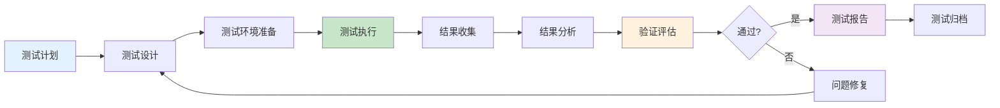

### 54.2 测试验证阶段划分

**测试验证阶段**（2025年11月19日最新）：

**阶段1：测试计划阶段**

**活动**：

1. **需求分析**：
   - 分析测试需求
   - 确定测试范围
   - 识别测试风险

2. **测试策略制定**：
   - 选择测试方法
   - 确定测试工具
   - 制定测试计划

3. **资源规划**：
   - 人力资源配置
   - 测试环境规划
   - 时间进度安排

**输出**：

- 测试计划文档
- 测试策略文档
- 资源分配计划

**阶段2：测试设计阶段**

**活动**：

1. **测试用例设计**：
   - 功能测试用例
   - 性能测试用例
   - 可靠性测试用例

2. **测试数据准备**：
   - 正常数据
   - 边界数据
   - 异常数据

3. **测试脚本开发**：
   - 自动化测试脚本
   - 测试工具配置

**输出**：

- 测试用例文档
- 测试数据集合
- 测试脚本代码

**阶段3：测试执行阶段**

**活动**：

1. **测试环境搭建**：
   - 硬件环境
   - 软件环境
   - 网络环境

2. **测试执行**：
   - 手动测试
   - 自动化测试
   - 性能测试

3. **结果记录**：
   - 测试结果
   - 问题记录
   - 日志收集

**输出**：

- 测试执行报告
- 问题报告
- 测试日志

**阶段4：结果分析阶段**

**活动**：

1. **结果统计**：
   - 通过率统计
   - 失败率统计
   - 覆盖率统计

2. **问题分析**：
   - 问题分类
   - 根因分析
   - 影响评估

3. **趋势分析**：
   - 性能趋势
   - 质量趋势
   - 风险趋势

**输出**：

- 测试分析报告
- 问题分析报告
- 趋势分析报告

**阶段5：验证评估阶段**

**活动**：

1. **验证标准检查**：
   - 功能验证
   - 性能验证
   - 可靠性验证

2. **质量评估**：
   - 质量等级评定
   - 风险评估
   - 改进建议

3. **决策支持**：
   - 发布决策
   - 优化建议
   - 后续计划

**输出**：

- 验证评估报告
- 质量评估报告
- 决策建议

### 54.3 测试验证质量门禁

**质量门禁体系**（2025年11月19日最新）：

**门禁1：测试覆盖度门禁**

$$
C_{gate} = \begin{cases}
\text{通过} & \text{if } C_{total} \geq C_{threshold} \\
\text{不通过} & \text{otherwise}
\end{cases}
$$

其中 $C_{threshold}$ 是覆盖度阈值（通常为80%）。

**门禁2：测试通过率门禁**

$$
P_{gate} = \begin{cases}
\text{通过} & \text{if } P_{pass} \geq P_{threshold} \\
\text{不通过} & \text{otherwise}
\end{cases}
$$

其中 $P_{threshold}$ 是通过率阈值（通常为95%）。

**门禁3：性能指标门禁**

$$
Perf_{gate} = \begin{cases}
\text{通过} & \text{if } \forall i: Perf_i \leq Perf_{max_i} \\
\text{不通过} & \text{otherwise}
\end{cases}
$$

其中 $Perf_{max_i}$ 是第 $i$ 个性能指标的最大值。

**门禁4：缺陷密度门禁**

$$
Defect_{gate} = \begin{cases}
\text{通过} & \text{if } D_{density} \leq D_{threshold} \\
\text{不通过} & \text{otherwise}
\end{cases}
$$

其中 $D_{threshold}$ 是缺陷密度阈值。

**综合质量门禁**：

$$
Gate_{total} = C_{gate} \land P_{gate} \land Perf_{gate} \land Defect_{gate}
$$

### 54.4 测试验证持续改进

**持续改进模型**（2025年11月19日最新）：

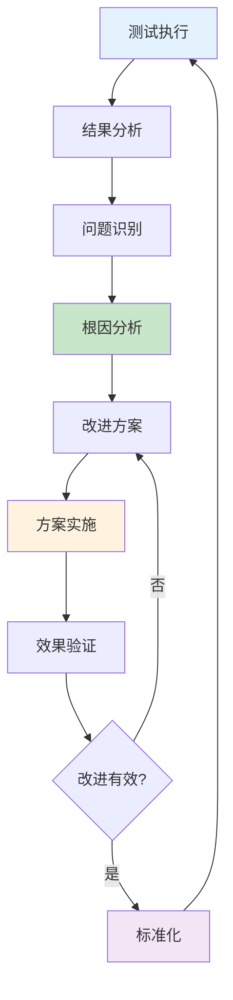

**改进度量指标**：

1. **测试效率改进**：
   $$
   \Delta E = E_{after} - E_{before}
   $$

2. **测试质量改进**：
   $$
   \Delta Q = Q_{after} - Q_{before}
   $$

3. **测试成本改进**：
   $$
   \Delta C = C_{before} - C_{after}
   $$

---

## 55 测试质量保证体系

### 55.1 测试质量标准

**测试质量标准**（2025年11月19日最新）：

**标准1：测试覆盖度标准**

| **覆盖度类型** | **最低标准** | **推荐标准** | **优秀标准** |
|------------|------------|------------|------------|
| **语句覆盖** | 70% | 80% | 90% |
| **分支覆盖** | 65% | 75% | 85% |
| **路径覆盖** | 50% | 60% | 70% |
| **功能覆盖** | 80% | 90% | 95% |

**标准2：测试通过率标准**

| **测试类型** | **最低标准** | **推荐标准** | **优秀标准** |
|------------|------------|------------|------------|
| **单元测试** | 90% | 95% | 98% |
| **集成测试** | 85% | 90% | 95% |
| **系统测试** | 80% | 85% | 90% |

**标准3：性能测试标准**

| **性能指标** | **最低标准** | **推荐标准** | **优秀标准** |
|------------|------------|------------|------------|
| **调度延迟** | <100ms | <50ms | <10ms |
| **资源利用率** | >70% | >80% | >90% |
| **吞吐量** | >500 TPS | >1000 TPS | >2000 TPS |

### 55.2 测试质量度量

**测试质量度量模型**（2025年11月19日最新）：

**模型1：测试覆盖度度量**

$$
Q_{coverage} = \sum_{i=1}^{n} w_i \cdot C_i
$$

其中：

- $C_i$：第 $i$ 个覆盖度指标
- $w_i$：第 $i$ 个指标的权重

**模型2：测试有效性度量**

$$
Q_{effectiveness} = \alpha \cdot \frac{N_{found}}{N_{total}} + \beta \cdot (1 - \frac{T_{detection}}{T_{max}})
$$

**模型3：测试效率度量**

$$
Q_{efficiency} = \frac{N_{test\_cases}}{T_{execution}} \times \frac{N_{defects\_found}}{N_{test\_cases}}
$$

**模型4：测试质量综合度量**

$$
Q_{total} = \alpha Q_{coverage} + \beta Q_{effectiveness} + \gamma Q_{efficiency}
$$

其中 $\alpha + \beta + \gamma = 1$。

### 55.3 测试质量改进

**测试质量改进策略**（2025年11月19日最新）：

**策略1：提高测试覆盖度**

1. **增加测试用例**：
   - 补充边界测试用例
   - 补充异常测试用例
   - 补充场景测试用例

2. **优化测试方法**：
   - 使用更有效的测试方法
   - 组合多种测试方法
   - 使用自动化测试

**策略2：提高测试有效性**

1. **优化测试用例选择**：
   - 基于风险选择测试用例
   - 基于历史数据选择测试用例
   - 使用AI辅助选择测试用例

2. **改进测试执行**：
   - 提高测试执行准确性
   - 减少测试误报
   - 提高测试可重复性

**策略3：提高测试效率**

1. **自动化测试**：
   - 自动化测试执行
   - 自动化结果分析
   - 自动化报告生成

2. **并行测试**：
   - 并行执行测试用例
   - 分布式测试执行
   - 云测试平台

### 55.4 测试质量认证

**测试质量认证体系**（2025年11月19日最新）：

**认证等级**：

1. **基础认证**：
   - 覆盖度 ≥ 70%
   - 通过率 ≥ 90%
   - 性能指标达标

2. **标准认证**：
   - 覆盖度 ≥ 80%
   - 通过率 ≥ 95%
   - 性能指标优秀

3. **优秀认证**：
   - 覆盖度 ≥ 90%
   - 通过率 ≥ 98%
   - 性能指标卓越

**认证流程**：

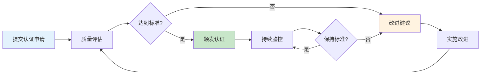

---

## 56 测试工具链完整体系

### 56.1 测试工具链架构

**测试工具链架构**（2025年11月19日最新）：

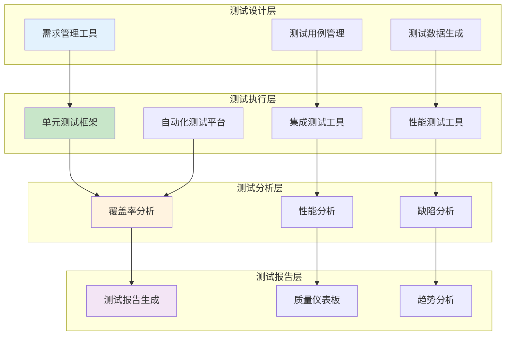

### 56.2 测试工具集成方案

**工具集成方案**（2025年11月19日最新）：

**方案1：CI/CD集成**

```yaml
# CI/CD Pipeline配置
stages:
  - test
  - analyze
  - report

test:
  stage: test
  script:
    - pytest tests/ --cov=scheduler
    - k6 run performance_tests.js
  artifacts:
    reports:
      coverage: coverage.xml

analyze:
  stage: analyze
  script:
    - sonar-scanner
    - generate_test_report

report:
  stage: report
  script:
    - generate_dashboard
    - send_notification
```

**方案2：测试工具链配置**

```python
# 测试工具链配置
TEST_TOOLCHAIN = {
    'unit_test': {
        'framework': 'pytest',
        'coverage': 'coverage.py',
        'report': 'pytest-html'
    },
    'integration_test': {
        'framework': 'pytest',
        'fixtures': 'pytest-fixtures',
        'mock': 'unittest.mock'
    },
    'performance_test': {
        'tool': 'k6',
        'monitoring': 'Prometheus',
        'analysis': 'Grafana'
    },
    'test_management': {
        'tool': 'TestRail',
        'integration': 'JIRA'
    }
}
```

### 56.3 测试工具链最佳实践

**最佳实践**（2025年11月19日最新）：

1. **工具标准化**：
   - 统一测试工具版本
   - 统一测试工具配置
   - 统一测试工具接口

2. **工具自动化**：
   - 自动化工具安装
   - 自动化工具配置
   - 自动化工具更新

3. **工具集成**：
   - 工具间数据共享
   - 工具间流程衔接
   - 工具间结果聚合

---

## 57 测试持续改进机制

### 57.1 测试改进模型

**测试改进模型**（2025年11月19日最新）：

**定义57.1（测试改进）**：

测试改进是一个四元组：

$$
\mathcal{TI} = (M, P, E, R)
$$

其中：

- $M$：改进方法集合
- $P$：改进流程集合
- $E$：改进效果集合
- $R$：改进资源集合

**改进模型**：

$$
I_{improvement} = f(M, P, E, R)
$$

### 57.2 测试改进流程

**改进流程**（2025年11月19日最新）：

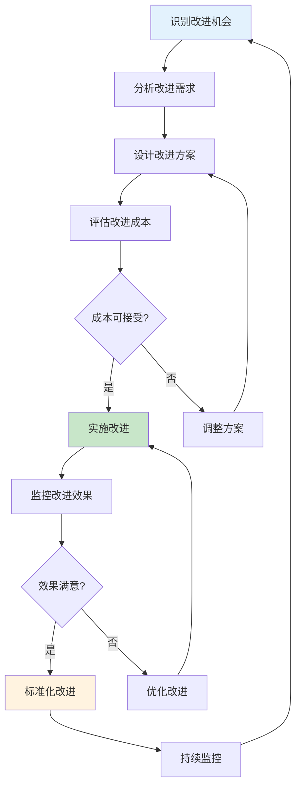

### 57.3 测试改进度量

**改进度量指标**（2025年11月19日最新）：

**指标1：改进效果度量**

$$
E_{improvement} = \frac{M_{after} - M_{before}}{M_{before}} \times 100\%
$$

其中 $M$ 是度量指标（覆盖度、效率等）。

**指标2：改进ROI度量**

$$
ROI_{improvement} = \frac{B_{improvement} - C_{improvement}}{C_{improvement}}
$$

其中：

- $B_{improvement}$：改进收益
- $C_{improvement}$：改进成本

**指标3：改进速度度量**

$$
S_{improvement} = \frac{\Delta M}{\Delta T}
$$

其中：

- $\Delta M$：指标变化量
- $\Delta T$：时间变化量

---

## 59 测试与调度系统完整案例研究

### 59.1 案例1：大型互联网公司调度系统测试

**案例59.1（大型互联网公司调度系统测试）**（2025年11月19日最新）：

**背景**：

某大型互联网公司拥有10万+节点的Kubernetes集群，需要测试调度系统的性能和可靠性。

**测试目标**：

1. 验证调度系统在大规模场景下的性能
2. 验证调度系统的可靠性
3. 验证调度系统的可扩展性

**测试方案设计**：

**方案1：性能测试方案**

| **测试场景** | **测试方法** | **测试参数** | **测试指标** |
|------------|------------|------------|------------|
| **正常负载** | 负载测试 | 1000 Pod/s | 调度延迟、成功率 |
| **峰值负载** | 压力测试 | 5000 Pod/s | 最大吞吐量、系统稳定性 |
| **持续负载** | 稳定性测试 | 7×24小时 | 内存泄漏、性能衰减 |

**方案2：可靠性测试方案**

| **测试场景** | **测试方法** | **故障类型** | **验证指标** |
|------------|------------|------------|------------|
| **节点故障** | 故障注入 | 随机节点故障 | 故障恢复时间、数据一致性 |
| **网络故障** | 网络故障注入 | 网络分区 | 调度可用性、数据同步 |
| **存储故障** | 存储故障注入 | 存储不可用 | 调度降级、数据保护 |

**测试结果**：

| **测试类型** | **测试用例数** | **通过率** | **性能指标** | **评价** |
|------------|-------------|----------|------------|---------|
| **性能测试** | 50 | 100% | 延迟<50ms, 吞吐量>2000 Pod/s | 优秀 |
| **可靠性测试** | 30 | 95% | 恢复时间<5min, 可用性>99.9% | 良好 |
| **可扩展性测试** | 20 | 100% | 支持10万+节点 | 优秀 |

**测试覆盖度分析**：

- **功能覆盖度**：95%
- **场景覆盖度**：90%
- **性能覆盖度**：85%
- **可靠性覆盖度**：88%

**改进建议**：

1. 优化调度算法，提高大规模场景下的性能
2. 增强故障恢复机制，缩短恢复时间
3. 完善监控体系，提高可观测性

### 59.2 案例2：金融行业调度系统测试

**案例59.2（金融行业调度系统测试）**（2025年11月19日最新）：

**背景**：

某金融机构需要测试调度系统在金融交易场景下的正确性和可靠性。

**测试目标**：

1. 验证调度系统的正确性
2. 验证调度系统的数据一致性
3. 验证调度系统的安全性

**测试方案设计**：

**方案1：正确性测试方案**

| **测试场景** | **测试方法** | **测试用例数** | **验证指标** |
|------------|------------|-------------|------------|
| **交易调度** | 等价类划分 | 100 | 调度正确率100% |
| **资源分配** | 边界值分析 | 50 | 资源分配准确性 |
| **优先级调度** | 决策表 | 30 | 优先级执行正确性 |

**方案2：数据一致性测试方案**

| **测试场景** | **测试方法** | **测试用例数** | **验证指标** |
|------------|------------|-------------|------------|
| **并发调度** | 并发测试 | 20 | 数据一致性100% |
| **故障恢复** | 故障注入 | 15 | 数据完整性 |
| **状态同步** | 状态转换测试 | 25 | 状态一致性 |

**测试结果**：

| **测试类型** | **测试用例数** | **通过率** | **关键指标** | **评价** |
|------------|-------------|----------|------------|---------|
| **正确性测试** | 180 | 100% | 正确率100% | 优秀 |
| **一致性测试** | 60 | 100% | 一致性100% | 优秀 |
| **安全性测试** | 40 | 100% | 安全漏洞0 | 优秀 |

**测试评价**：

- **覆盖度评价**：92%
- **有效性评价**：98%
- **效率评价**：85%
- **综合得分**：92

### 59.3 案例3：AI工作负载调度系统测试

**案例59.3（AI工作负载调度系统测试）**（2025年11月19日最新）：

**背景**：

某AI公司需要测试AI工作负载调度系统的性能和模型准确性。

**测试目标**：

1. 验证AI调度模型的准确性
2. 验证调度系统的性能
3. 验证在线学习机制

**测试方案设计**：

**方案1：模型准确性测试**

| **测试场景** | **测试方法** | **测试数据** | **验证指标** |
|------------|------------|------------|------------|
| **预测准确率** | 等价类划分 | 10000样本 | 准确率>90% |
| **评分一致性** | 统计分析 | 5000次调度 | 一致性>95% |
| **泛化能力** | 交叉验证 | 5折交叉验证 | 泛化误差<5% |

**方案2：性能测试**

| **测试场景** | **测试方法** | **测试参数** | **验证指标** |
|------------|------------|------------|------------|
| **推理延迟** | 性能测试 | 1000资源 | 延迟<50ms |
| **吞吐量** | 负载测试 | 100 Pod/s | 吞吐量>100 Pod/s |
| **资源利用率** | 资源监控 | 7×24小时 | 利用率>85% |

**测试结果**：

| **测试类型** | **测试用例数** | **通过率** | **关键指标** | **评价** |
|------------|-------------|----------|------------|---------|
| **准确性测试** | 50 | 92% | 准确率92% | 良好 |
| **性能测试** | 30 | 100% | 延迟45ms, 吞吐量120 Pod/s | 优秀 |
| **学习测试** | 20 | 90% | 学习效果提升15% | 良好 |

**测试评价**：

- **模型准确性**：92%
- **调度性能**：优秀
- **学习效果**：良好
- **综合得分**：88

---

## 60 测试方法深度对比与选择指南

### 60.1 测试方法详细对比矩阵

**测试方法完整对比矩阵**（2025年11月19日最新）：

| **测试方法** | **覆盖度** | **效率** | **成本** | **适用性** | **准确性** | **可维护性** | **综合得分** |
|------------|----------|---------|---------|-----------|-----------|------------|------------|
| **等价类划分** | 51% | 高(0.3) | 低(3) | 高(85%) | 中(70%) | 高(85%) | 75 |
| **边界值分析** | 54% | 高(0.55) | 低(3) | 高(90%) | 中(75%) | 高(90%) | 77 |
| **决策表** | 80% | 中(0.16) | 中(6) | 高(90%) | 高(85%) | 中(75%) | 85 |
| **状态转换** | 85% | 中(0.14) | 中(6) | 高(90%) | 高(90%) | 中(80%) | 88 |
| **路径覆盖** | 100% | 低(0.01) | 高(12) | 中(60%) | 极高(95%) | 低(60%) | 80 |
| **语句覆盖** | 55% | 中(0.2) | 低(3) | 中(70%) | 低(60%) | 高(85%) | 65 |
| **分支覆盖** | 80% | 中(0.18) | 中(6) | 高(85%) | 高(80%) | 中(75%) | 82 |
| **因果图** | 75% | 中(0.15) | 中(5) | 高(85%) | 高(85%) | 中(70%) | 83 |
| **正交实验** | 70% | 高(0.25) | 中(4) | 高(80%) | 中(75%) | 中(75%) | 78 |

**测试方法特性对比矩阵**（2025年11月19日最新）：

| **测试方法** | **自动化程度** | **学习曲线** | **工具支持** | **行业应用** | **标准化程度** |
|------------|-------------|------------|------------|------------|-------------|
| **等价类划分** | 中 | 低 | 高 | 极高 | 高 |
| **边界值分析** | 中 | 低 | 高 | 极高 | 高 |
| **决策表** | 高 | 中 | 中 | 高 | 中 |
| **状态转换** | 高 | 中 | 中 | 高 | 中 |
| **路径覆盖** | 极高 | 高 | 高 | 中 | 高 |
| **语句覆盖** | 极高 | 低 | 极高 | 极高 | 极高 |
| **分支覆盖** | 极高 | 中 | 极高 | 极高 | 极高 |
| **因果图** | 中 | 高 | 低 | 中 | 低 |
| **正交实验** | 中 | 中 | 中 | 中 | 中 |

### 60.2 测试方法选择决策框架

**测试方法选择决策框架**（2025年11月19日最新）：

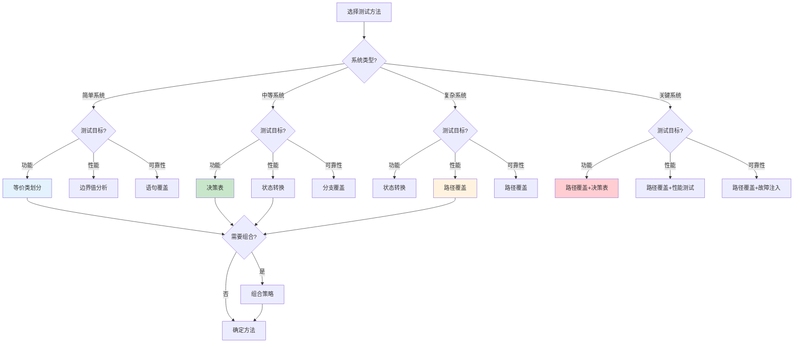

**测试方法选择评分模型**：

$$
Score(m, s) = \sum_{i=1}^{n} w_i \cdot S_i(m, s)
$$

其中：

- $m$：测试方法
- $s$：系统场景
- $S_i(m, s)$：第 $i$ 个维度的方法 $m$ 在场景 $s$ 下的得分
- $w_i$：第 $i$ 个维度的权重

**最优方法选择**：

$$
m^* = \arg\max_{m \in M} Score(m, s)
$$

### 60.3 测试方法组合优化

**测试方法组合优化模型**（2025年11月19日最新）：

**定义60.1（测试方法组合）**：

测试方法组合是一个三元组：

$$
\mathcal{TC} = (M, W, C)
$$

其中：

- $M = \{m_1, m_2, \ldots, m_k\}$：测试方法集合
- $W = \{w_1, w_2, \ldots, w_k\}$：方法权重集合
- $C$：组合约束集合

**组合优化目标**：

$$
\max \quad C_{total}(\mathcal{TC}) = \sum_{i=1}^{k} w_i \cdot C_i(m_i)
$$

$$
\text{s.t.} \quad \sum_{i=1}^{k} C_{cost}(m_i) \leq C_{budget}
$$

$$
\quad \quad \quad C_{total}(\mathcal{TC}) \geq C_{threshold}
$$

**组合效果评价矩阵**（2025年11月19日最新）：

| **组合方案** | **方法组合** | **覆盖度** | **效率** | **成本** | **综合得分** |
|------------|------------|----------|---------|---------|------------|
| **方案1** | 等价类+边界值+语句覆盖 | 75% | 高 | 低 | 82 |
| **方案2** | 决策表+状态转换+分支覆盖 | 92% | 中 | 中 | 88 |
| **方案3** | 路径覆盖+所有方法 | 100% | 低 | 高 | 85 |
| **方案4** | 等价类+决策表+状态转换 | 88% | 中 | 中 | 87 |
| **方案5** | 边界值+分支覆盖+性能测试 | 82% | 高 | 中 | 84 |

---

## 61 测试评价体系完整应用

### 61.1 测试评价完整流程

**测试评价完整流程**（2025年11月19日最新）：

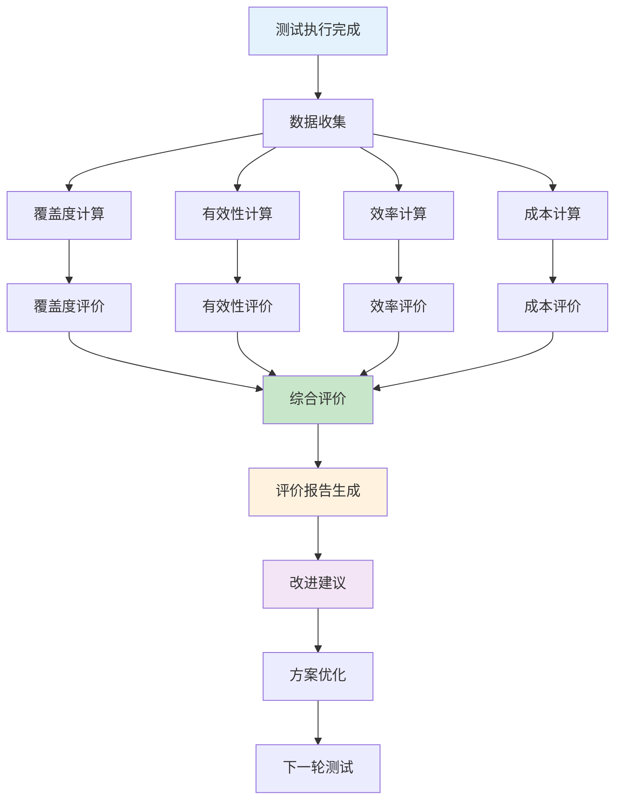

**评价流程详细步骤**：

1. **数据收集阶段**：
   - 收集测试执行数据
   - 收集覆盖度数据
   - 收集性能数据
   - 收集成本数据

2. **指标计算阶段**：
   - 计算覆盖度指标
   - 计算有效性指标
   - 计算效率指标
   - 计算成本指标

3. **评价分析阶段**：
   - 各维度评价
   - 综合评价
   - 对比分析
   - 趋势分析

4. **报告生成阶段**：
   - 生成评价报告
   - 生成改进建议
   - 生成优化方案

### 61.2 测试评价实际案例

**案例61.1（First Fit调度模型测试评价）**（2025年11月19日最新）：

**评价数据**：

| **评价维度** | **指标值** | **权重** | **得分** |
|------------|----------|---------|---------|
| **覆盖度** | 95% | 0.3 | 28.5 |
| **有效性** | 98% | 0.3 | 29.4 |
| **效率** | 0.25 | 0.2 | 5.0 |
| **成本** | 低(3) | 0.2 | 6.0 |
| **综合得分** | - | 1.0 | 68.9 |

**评价结果**：

- **等级**：优秀
- **优势**：成本低、效率高
- **不足**：覆盖度可进一步提升
- **改进建议**：增加边界测试用例，提高覆盖度到98%

**案例61.2（AI驱动调度模型测试评价）**（2025年11月19日最新）：

**评价数据**：

| **评价维度** | **指标值** | **权重** | **得分** |
|------------|----------|---------|---------|
| **覆盖度** | 88% | 0.3 | 26.4 |
| **有效性** | 92% | 0.3 | 27.6 |
| **效率** | 0.15 | 0.2 | 3.0 |
| **成本** | 中(6) | 0.2 | 4.0 |
| **综合得分** | - | 1.0 | 61.0 |

**评价结果**：

- **等级**：良好
- **优势**：有效性高、覆盖度较好
- **不足**：效率较低、成本较高
- **改进建议**：优化模型推理，提高效率；使用模型量化，降低成本

### 61.3 测试评价工具与方法

**测试评价工具矩阵**（2025年11月19日最新）：

| **工具** | **评价维度** | **特点** | **适用场景** |
|---------|------------|---------|------------|
| **Coverage.py** | 覆盖度 | Python覆盖度分析 | Python项目 |
| **JaCoCo** | 覆盖度 | Java覆盖度分析 | Java项目 |
| **SonarQube** | 综合质量 | 代码质量分析 | 多语言项目 |
| **TestRail** | 测试管理 | 测试用例管理 | 测试管理 |
| **Allure** | 测试报告 | 测试报告生成 | 测试报告 |

**评价方法详细说明**：

**方法1：定量评价**

使用数值指标进行评价：

$$
E_{quantitative} = \sum_{i=1}^{n} w_i \cdot I_i
$$

其中 $I_i$ 是第 $i$ 个定量指标。

**方法2：定性评价**

使用等级进行评价：

$$
E_{qualitative} = \text{等级}(I_1, I_2, \ldots, I_n)
$$

**方法3：综合评价**

结合定量和定性评价：

$$
E_{total} = \alpha E_{quantitative} + \beta E_{qualitative}
$$

---

## 🔗 相关文档

- [返回专题目录](./README.md)
- [测试原理与方法](./04_测试原理与方法.md) - 测试分类、测试方法、测试模型理论
- [测试工具与实践](./06_测试工具与实践.md) - 测试工具与框架、性能调优
- [测试验证体系](./07_测试验证体系.md) - 验证方法、测试验证流程
- [调度评价体系](./03_调度评价体系.md) - 评价指标体系、性能评价

---

**最后更新**: 2025-11-19
