# 测试工具与实践

> **来源**: 05.11 调度系统理论分析与评价体系专题
> **章节**: 第41章、第42章、第43章、第44章、第45章、第56章
> **更新**: 2025年11月19日

---

## 📋 目录

- [测试工具与实践](#测试工具与实践)
  - [📋 目录](#-目录)
  - [1 测试工具与框架详细指南](#1-测试工具与框架详细指南)
    - [41.1 单元测试工具](#411-单元测试工具)
    - [41.2 性能测试工具](#412-性能测试工具)
    - [41.3 压力测试工具](#413-压力测试工具)
    - [41.4 监控与可观测性工具](#414-监控与可观测性工具)
  - [2 调度模型性能调优实战](#2-调度模型性能调优实战)
    - [42.1 性能瓶颈分析](#421-性能瓶颈分析)
    - [42.2 优化策略与方法](#422-优化策略与方法)
    - [42.3 调优案例研究](#423-调优案例研究)
  - [3 故障排查与问题诊断](#3-故障排查与问题诊断)
    - [43.1 常见问题分类](#431-常见问题分类)
    - [43.2 诊断方法与工具](#432-诊断方法与工具)
    - [43.3 问题解决流程](#433-问题解决流程)
  - [4 2025年最新技术应用](#4-2025年最新技术应用)
    - [44.1 AI/ML在调度测试中的应用](#441-aiml在调度测试中的应用)
    - [44.2 云原生测试技术](#442-云原生测试技术)
    - [44.3 自动化测试平台](#443-自动化测试平台)
  - [5 最佳实践总结](#5-最佳实践总结)
    - [45.1 调度模型设计最佳实践](#451-调度模型设计最佳实践)
    - [45.2 测试设计最佳实践](#452-测试设计最佳实践)
    - [45.3 性能优化最佳实践](#453-性能优化最佳实践)
  - [6 测试原理深度论证](#6-测试原理深度论证)
    - [47.1 测试基本原理](#471-测试基本原理)
    - [47.2 测试原理形式化定义](#472-测试原理形式化定义)
    - [47.3 测试原理数学建模](#473-测试原理数学建模)
    - [47.4 测试原理定理与证明](#474-测试原理定理与证明)
  - [7 测试方法全面对比分析](#7-测试方法全面对比分析)
    - [48.1 测试方法分类体系](#481-测试方法分类体系)
    - [48.2 测试方法多维对比矩阵](#482-测试方法多维对比矩阵)
    - [48.3 测试方法选择决策树](#483-测试方法选择决策树)
    - [48.4 测试方法组合策略](#484-测试方法组合策略)
  - [8 测试方案完整设计体系](#8-测试方案完整设计体系)
    - [49.1 测试方案设计原理](#491-测试方案设计原理)
    - [49.2 测试方案设计方法](#492-测试方案设计方法)
    - [49.3 测试方案评价模型](#493-测试方案评价模型)
    - [49.4 测试方案优化策略](#494-测试方案优化策略)
  - [9 测试评价体系深度分析](#9-测试评价体系深度分析)
    - [50.1 测试评价维度体系](#501-测试评价维度体系)
    - [50.2 测试评价数学模型](#502-测试评价数学模型)
    - [50.3 测试评价多维矩阵](#503-测试评价多维矩阵)
    - [50.4 测试评价决策支持](#504-测试评价决策支持)
  - [10 测试系统完整思维导图](#10-测试系统完整思维导图)
    - [51.1 测试原理思维导图](#511-测试原理思维导图)
    - [51.2 测试方法思维导图](#512-测试方法思维导图)
    - [51.3 测试方案思维导图](#513-测试方案思维导图)
    - [51.4 测试评价思维导图](#514-测试评价思维导图)
    - [51.5 测试系统全景思维导图](#515-测试系统全景思维导图)
  - [11 测试与调度系统关联分析](#11-测试与调度系统关联分析)
    - [53.1 测试-调度关联模型](#531-测试-调度关联模型)
    - [53.2 测试覆盖调度场景分析](#532-测试覆盖调度场景分析)
    - [53.3 调度模型测试验证矩阵](#533-调度模型测试验证矩阵)
    - [53.4 测试-调度协同优化](#534-测试-调度协同优化)
  - [12 测试验证完整流程体系](#12-测试验证完整流程体系)
    - [54.1 测试验证流程模型](#541-测试验证流程模型)
    - [54.2 测试验证阶段划分](#542-测试验证阶段划分)
    - [54.3 测试验证质量门禁](#543-测试验证质量门禁)
    - [54.4 测试验证持续改进](#544-测试验证持续改进)
  - [13 测试质量保证体系](#13-测试质量保证体系)
    - [55.1 测试质量标准](#551-测试质量标准)
    - [55.2 测试质量度量](#552-测试质量度量)
    - [55.3 测试质量改进](#553-测试质量改进)
    - [55.4 测试质量认证](#554-测试质量认证)
  - [14 测试工具链完整体系](#14-测试工具链完整体系)
    - [56.1 测试工具链架构](#561-测试工具链架构)
    - [56.2 测试工具集成方案](#562-测试工具集成方案)
    - [56.3 测试工具链最佳实践](#563-测试工具链最佳实践)
  - [🔗 相关文档](#-相关文档)

---

## 41 测试工具与框架详细指南

### 41.1 单元测试工具

**单元测试工具对比**（2025年11月19日最新）：

| **工具** | **语言** | **特点** | **适用场景** |
|---------|---------|---------|------------|
| **JUnit** | Java/Kotlin | 成熟稳定，生态丰富 | Java项目 |
| **pytest** | Python | 功能强大，插件丰富 | Python项目 |
| **Go Test** | Go | 内置支持，简单易用 | Go项目 |
| **Mocha** | JavaScript | 灵活配置，异步支持 | Node.js项目 |
| **RSpec** | Ruby | BDD风格，可读性强 | Ruby项目 |

**pytest详细使用指南**：

```python
# pytest配置文件 pytest.ini
[pytest]
testpaths = tests
python_files = test_*.py
python_classes = Test*
python_functions = test_*
addopts =
    -v
    --cov=scheduler
    --cov-report=html
    --cov-report=term-missing

# 测试用例示例
import pytest
from scheduler import FirstFitScheduler

@pytest.fixture
def scheduler():
    """测试fixture"""
    return FirstFitScheduler()

@pytest.fixture
def sample_tasks():
    """示例任务fixture"""
    return [
        Task(id=1, cpu=10, memory=20),
        Task(id=2, cpu=15, memory=25),
    ]

@pytest.fixture
def sample_resources():
    """示例资源fixture"""
    return [
        Resource(id=1, cpu=30, memory=50),
        Resource(id=2, cpu=40, memory=60),
    ]

@pytest.mark.parametrize("task_cpu,task_memory,expected_resource", [
    (10, 20, 1),
    (30, 50, 1),
    (50, 100, None),  # 资源不足
])
def test_schedule_with_params(scheduler, sample_resources,
                              task_cpu, task_memory, expected_resource):
    """参数化测试"""
    task = Task(id=3, cpu=task_cpu, memory=task_memory)
    allocation = scheduler.schedule([task], sample_resources)
    assert allocation[3] == expected_resource

@pytest.mark.slow
def test_large_scale_scheduling(scheduler):
    """标记为慢速测试"""
    tasks = [Task(id=i, cpu=10, memory=20) for i in range(10000)]
    resources = [Resource(id=i, cpu=100, memory=200) for i in range(100)]
    allocation = scheduler.schedule(tasks, resources)
    assert len(allocation) == 10000
```

**JUnit详细使用指南**：

```java
import org.junit.jupiter.api.*;
import static org.junit.jupiter.api.Assertions.*;

@DisplayName("First Fit调度器测试")
class FirstFitSchedulerTest {

    private FirstFitScheduler scheduler;
    private List<Task> tasks;
    private List<Resource> resources;

    @BeforeEach
    void setUp() {
        scheduler = new FirstFitScheduler();
        tasks = Arrays.asList(
            new Task(1, 10, 20),
            new Task(2, 15, 25)
        );
        resources = Arrays.asList(
            new Resource(1, 30, 50),
            new Resource(2, 40, 60)
        );
    }

    @Test
    @DisplayName("正常分配测试")
    void testNormalAllocation() {
        Map<Integer, Integer> allocation = scheduler.schedule(tasks, resources);
        assertEquals(1, allocation.get(1));
        assertEquals(1, allocation.get(2));
    }

    @Test
    @DisplayName("资源不足测试")
    void testInsufficientResource() {
        Task largeTask = new Task(3, 100, 200);
        Map<Integer, Integer> allocation = scheduler.schedule(
            Collections.singletonList(largeTask), resources);
        assertNull(allocation.get(3));
    }

    @ParameterizedTest
    @CsvSource({
        "10, 20, 1",
        "30, 50, 1",
        "50, 100, null"
    })
    @DisplayName("参数化测试")
    void testParameterized(int cpu, int memory, Integer expectedResource) {
        Task task = new Task(1, cpu, memory);
        Map<Integer, Integer> allocation = scheduler.schedule(
            Collections.singletonList(task), resources);
        assertEquals(expectedResource, allocation.get(1));
    }
}
```

### 41.2 性能测试工具

**性能测试工具对比**（2025年11月19日最新）：

| **工具** | **类型** | **特点** | **适用场景** |
|---------|---------|---------|------------|
| **k6** | 负载测试 | 脚本化，云原生 | API性能测试 |
| **JMeter** | 负载测试 | GUI界面，功能丰富 | Web应用测试 |
| **Locust** | 负载测试 | Python脚本，分布式 | 自定义场景测试 |
| **Gatling** | 负载测试 | Scala DSL，高性能 | 高并发测试 |
| **wrk** | 基准测试 | 轻量级，高性能 | HTTP基准测试 |

**k6详细使用指南**：

```javascript
// k6性能测试脚本
import http from 'k6/http';
import { check, sleep } from 'k6';
import { Rate, Trend } from 'k6/metrics';

// 自定义指标
const schedulingLatency = new Trend('scheduling_latency');
const successRate = new Rate('scheduling_success');

export const options = {
    stages: [
        { duration: '30s', target: 100 },   // 逐步增加到100并发
        { duration: '1m', target: 100 },     // 保持100并发
        { duration: '30s', target: 200 },   // 逐步增加到200并发
        { duration: '1m', target: 200 },    // 保持200并发
        { duration: '30s', target: 0 },     // 逐步减少到0
    ],
    thresholds: {
        'scheduling_latency': ['p(95)<100', 'p(99)<200'],
        'scheduling_success': ['rate>0.99'],
        'http_req_duration': ['p(95)<100'],
    },
};

export default function () {
    // 准备任务数据
    const task = {
        id: __VU * 1000 + __ITER,
        cpu: 10,
        memory: 20,
    };

    // 发送调度请求
    const startTime = Date.now();
    const response = http.post('http://scheduler:8080/api/schedule',
        JSON.stringify(task),
        {
            headers: { 'Content-Type': 'application/json' },
        }
    );
    const endTime = Date.now();

    // 记录指标
    schedulingLatency.add(endTime - startTime);
    successRate.add(response.status === 200);

    // 验证响应
    check(response, {
        'status is 200': (r) => r.status === 200,
        'allocation successful': (r) => {
            const result = JSON.parse(r.body);
            return result.resource_id !== null;
        },
    });

    sleep(1);
}
```

**JMeter详细使用指南**：

```xml
<!-- JMeter测试计划示例 -->
<?xml version="1.0" encoding="UTF-8"?>
<jmeterTestPlan version="1.2">
  <hashTree>
    <TestPlan guiclass="TestPlanGui" testclass="TestPlan" testname="调度性能测试">
      <elementProp name="TestPlan.arguments" elementType="Arguments" guiclass="ArgumentsPanel">
        <collectionProp name="Arguments.arguments">
          <elementProp name="scheduler_url" elementType="Argument">
            <stringProp name="Argument.name">scheduler_url</stringProp>
            <stringProp name="Argument.value">http://scheduler:8080</stringProp>
          </elementProp>
        </collectionProp>
      </elementProp>
    </TestPlan>
    <hashTree>
      <ThreadGroup guiclass="ThreadGroupGui" testclass="ThreadGroup" testname="调度线程组">
        <stringProp name="ThreadGroup.on_sample_error">continue</stringProp>
        <elementProp name="ThreadGroup.main_controller" elementType="LoopController">
          <boolProp name="LoopController.continue_forever">false</boolProp>
          <intProp name="LoopController.loops">100</intProp>
        </elementProp>
        <stringProp name="ThreadGroup.num_threads">100</stringProp>
        <stringProp name="ThreadGroup.ramp_time">30</stringProp>
      </ThreadGroup>
      <hashTree>
        <HTTPSamplerProxy guiclass="HttpTestSampleGui" testclass="HTTPSamplerProxy" testname="调度请求">
          <stringProp name="HTTPSampler.domain">scheduler</stringProp>
          <stringProp name="HTTPSampler.port">8080</stringProp>
          <stringProp name="HTTPSampler.path">/api/schedule</stringProp>
          <stringProp name="HTTPSampler.method">POST</stringProp>
          <elementProp name="HTTPsampler.Arguments" elementType="Arguments">
            <collectionProp name="Arguments.arguments">
              <elementProp name="" elementType="HTTPArgument">
                <boolProp name="HTTPArgument.always_encode">false</boolProp>
                <stringProp name="Argument.value">{"id":1,"cpu":10,"memory":20}</stringProp>
              </elementProp>
            </collectionProp>
          </elementProp>
        </HTTPSamplerProxy>
      </hashTree>
    </hashTree>
  </hashTree>
</jmeterTestPlan>
```

### 41.3 压力测试工具

**压力测试工具对比**（2025年11月19日最新）：

| **工具** | **类型** | **特点** | **适用场景** |
|---------|---------|---------|------------|
| **Chaos Monkey** | 故障注入 | 随机故障，Netflix开源 | 混沌工程 |
| **Gremlin** | 故障注入 | 可控故障，商业支持 | 企业级混沌工程 |
| **Litmus** | 故障注入 | Kubernetes原生 | K8s环境 |
| **Toxiproxy** | 网络故障 | 网络延迟/丢包模拟 | 网络故障测试 |

**Chaos Monkey使用示例**：

```python
# Chaos Monkey故障注入示例
from chaosmonkey import ChaosMonkey
import time

def test_scheduler_resilience():
    """测试调度器容错能力"""
    chaos = ChaosMonkey()

    # 1. 注入资源故障
    chaos.kill_resource('resource-1')
    time.sleep(5)

    # 2. 测试调度器是否能够处理故障
    tasks = [Task(id=i, cpu=10, memory=20) for i in range(100)]
    allocation = scheduler.schedule(tasks, resources)

    # 3. 验证调度器能够重新分配任务
    assert all(allocation[t.id] != 'resource-1' for t in tasks)

    # 4. 恢复资源
    chaos.restore_resource('resource-1')
```

### 41.4 监控与可观测性工具

**监控工具对比**（2025年11月19日最新）：

| **工具** | **类型** | **特点** | **适用场景** |
|---------|---------|---------|------------|
| **Prometheus** | 指标监控 | 时间序列，拉取模式 | 指标收集 |
| **Grafana** | 可视化 | 丰富的图表，告警 | 数据可视化 |
| **ELK Stack** | 日志分析 | Elasticsearch+Logstash+Kibana | 日志分析 |
| **Jaeger** | 分布式追踪 | OpenTracing标准 | 链路追踪 |
| **New Relic** | APM | 全栈监控，商业支持 | 应用性能监控 |

**Prometheus监控配置**：

```yaml
# prometheus.yml
global:
  scrape_interval: 15s
  evaluation_interval: 15s

scrape_configs:
  - job_name: 'scheduler'
    static_configs:
      - targets: ['scheduler:8080']
    metrics_path: '/metrics'

  - job_name: 'resources'
    static_configs:
      - targets: ['resource-manager:9090']

# 告警规则
rule_files:
  - "alerts.yml"
```

**Grafana仪表板配置**：

```json
{
  "dashboard": {
    "title": "调度系统监控",
    "panels": [
      {
        "title": "调度延迟",
        "targets": [
          {
            "expr": "histogram_quantile(0.95, scheduler_latency_seconds_bucket)",
            "legendFormat": "P95延迟"
          },
          {
            "expr": "histogram_quantile(0.99, scheduler_latency_seconds_bucket)",
            "legendFormat": "P99延迟"
          }
        ]
      },
      {
        "title": "资源利用率",
        "targets": [
          {
            "expr": "avg(resource_utilization)",
            "legendFormat": "平均利用率"
          }
        ]
      }
    ]
  }
}
```

---

## 42 调度模型性能调优实战

### 42.1 性能瓶颈分析

**性能瓶颈识别方法**（2025年11月19日最新）：

**方法1：性能分析工具**

```python
import cProfile
import pstats
import io

def profile_scheduler(scheduler, tasks, resources):
    """性能分析"""
    profiler = cProfile.Profile()
    profiler.enable()

    allocation = scheduler.schedule(tasks, resources)

    profiler.disable()

    # 生成性能报告
    s = io.StringIO()
    ps = pstats.Stats(profiler, stream=s)
    ps.sort_stats('cumulative')
    ps.print_stats(20)  # 显示前20个最耗时的函数

    print(s.getvalue())
```

**方法2：性能指标监控**

```python
import time
from collections import defaultdict

class PerformanceProfiler:
    """性能分析器"""

    def __init__(self):
        self.metrics = defaultdict(list)

    def time_function(self, func_name):
        """函数计时装饰器"""
        def decorator(func):
            def wrapper(*args, **kwargs):
                start_time = time.perf_counter()
                result = func(*args, **kwargs)
                end_time = time.perf_counter()

                self.metrics[func_name].append(end_time - start_time)
                return result
            return wrapper
        return decorator

    def get_statistics(self):
        """获取统计信息"""
        stats = {}
        for func_name, times in self.metrics.items():
            stats[func_name] = {
                'count': len(times),
                'total': sum(times),
                'mean': sum(times) / len(times),
                'min': min(times),
                'max': max(times),
            }
        return stats
```

**常见性能瓶颈**：

1. **算法复杂度高**：
   - 问题：$O(n^2)$ 或更高复杂度
   - 解决：优化算法，使用数据结构（哈希表、优先队列）

2. **重复计算**：
   - 问题：相同计算重复执行
   - 解决：缓存结果，记忆化

3. **资源竞争**：
   - 问题：多线程/进程竞争资源
   - 解决：锁优化，无锁数据结构

4. **内存分配**：
   - 问题：频繁内存分配/释放
   - 解决：对象池，预分配

### 42.2 优化策略与方法

**优化策略1：算法优化**

```python
# 优化前：O(nm)复杂度
def first_fit_naive(tasks, resources):
    allocation = {}
    for task in tasks:
        for resource in resources:
            if resource.can_allocate(task):
                allocation[task.id] = resource.id
                resource.allocate(task)
                break
    return allocation

# 优化后：使用索引，O(n log m)复杂度
def first_fit_optimized(tasks, resources):
    allocation = {}
    # 按容量排序资源
    sorted_resources = sorted(resources, key=lambda r: r.capacity)

    for task in tasks:
        # 使用二分查找找到合适的资源
        idx = bisect.bisect_left(sorted_resources, task.requirement)
        if idx < len(sorted_resources):
            resource = sorted_resources[idx]
            allocation[task.id] = resource.id
            resource.allocate(task)
    return allocation
```

**优化策略2：缓存优化**

```python
from functools import lru_cache

class OptimizedScheduler:
    """优化后的调度器"""

    def __init__(self):
        self.score_cache = {}

    @lru_cache(maxsize=1000)
    def calculate_score(self, task_hash, resource_hash):
        """缓存评分计算"""
        # 评分计算逻辑
        return score

    def schedule(self, tasks, resources):
        """调度（使用缓存）"""
        allocation = {}
        for task in tasks:
            best_resource = None
            best_score = -1

            for resource in resources:
                # 使用缓存获取评分
                score = self.calculate_score(
                    hash(task), hash(resource))
                if score > best_score:
                    best_score = score
                    best_resource = resource

            if best_resource:
                allocation[task.id] = best_resource.id
        return allocation
```

**优化策略3：并行化**

```python
from concurrent.futures import ThreadPoolExecutor, ProcessPoolExecutor
import multiprocessing

def parallel_schedule(scheduler, tasks, resources, num_workers=None):
    """并行调度"""
    if num_workers is None:
        num_workers = multiprocessing.cpu_count()

    # 将任务分组
    chunk_size = len(tasks) // num_workers
    task_chunks = [tasks[i:i+chunk_size]
                   for i in range(0, len(tasks), chunk_size)]

    # 并行调度
    with ProcessPoolExecutor(max_workers=num_workers) as executor:
        futures = [executor.submit(scheduler.schedule, chunk, resources)
                  for chunk in task_chunks]
        results = [future.result() for future in futures]

    # 合并结果
    allocation = {}
    for result in results:
        allocation.update(result)

    return allocation
```

### 42.3 调优案例研究

**案例42.1（大规模调度性能优化）**（2025年11月19日最新）：

**问题**：

调度10万任务到1000资源，延迟超过10秒。

**分析**：

- 算法复杂度：$O(nm) = O(10^5 \times 10^3) = O(10^8)$
- 主要瓶颈：资源遍历和评分计算

**优化方案**：

1. **使用优先队列**：将资源按容量排序，使用优先队列选择
2. **批量处理**：将任务分组，批量调度
3. **并行化**：使用多进程并行调度

**优化效果**：

| **指标** | **优化前** | **优化后** | **提升** |
|---------|-----------|-----------|---------|
| **调度延迟** | 10.5s | 1.2s | 87.6% |
| **资源利用率** | 75% | 88% | 17.3% |
| **CPU使用率** | 25% | 85% | 240% |

**案例42.2（AI调度模型推理优化）**（2025年11月19日最新）：

**问题**：

AI模型推理时间过长，影响调度延迟。

**分析**：

- 模型推理时间：50ms/次
- 1000资源需要50秒推理

**优化方案**：

1. **模型量化**：使用INT8量化，减少模型大小
2. **批量推理**：批量处理多个资源评分
3. **模型缓存**：缓存常用场景的评分结果

**优化效果**：

| **指标** | **优化前** | **优化后** | **提升** |
|---------|-----------|-----------|---------|
| **推理时间** | 50ms | 5ms | 90% |
| **模型大小** | 100MB | 25MB | 75% |
| **调度延迟** | 50s | 5s | 90% |

---

## 43 故障排查与问题诊断

### 43.1 常见问题分类

**问题分类体系**（2025年11月19日最新）：

1. **调度失败问题**：
   - 资源不足
   - 约束冲突
   - 算法错误

2. **性能问题**：
   - 调度延迟高
   - 资源利用率低
   - 吞吐量低

3. **稳定性问题**：
   - 内存泄漏
   - 死锁
   - 崩溃

4. **数据一致性问题**：
   - 状态不一致
   - 数据丢失
   - 并发冲突

### 43.2 诊断方法与工具

**诊断工具矩阵**（2025年11月19日最新）：

| **问题类型** | **诊断工具** | **使用方法** |
|------------|------------|------------|
| **性能问题** | pprof, perf, py-spy | 性能分析，火焰图 |
| **内存问题** | Valgrind, memory_profiler | 内存泄漏检测 |
| **并发问题** | ThreadSanitizer, race detector | 竞态条件检测 |
| **网络问题** | tcpdump, Wireshark | 网络包分析 |
| **日志问题** | ELK, Loki | 日志聚合分析 |

**诊断流程**：

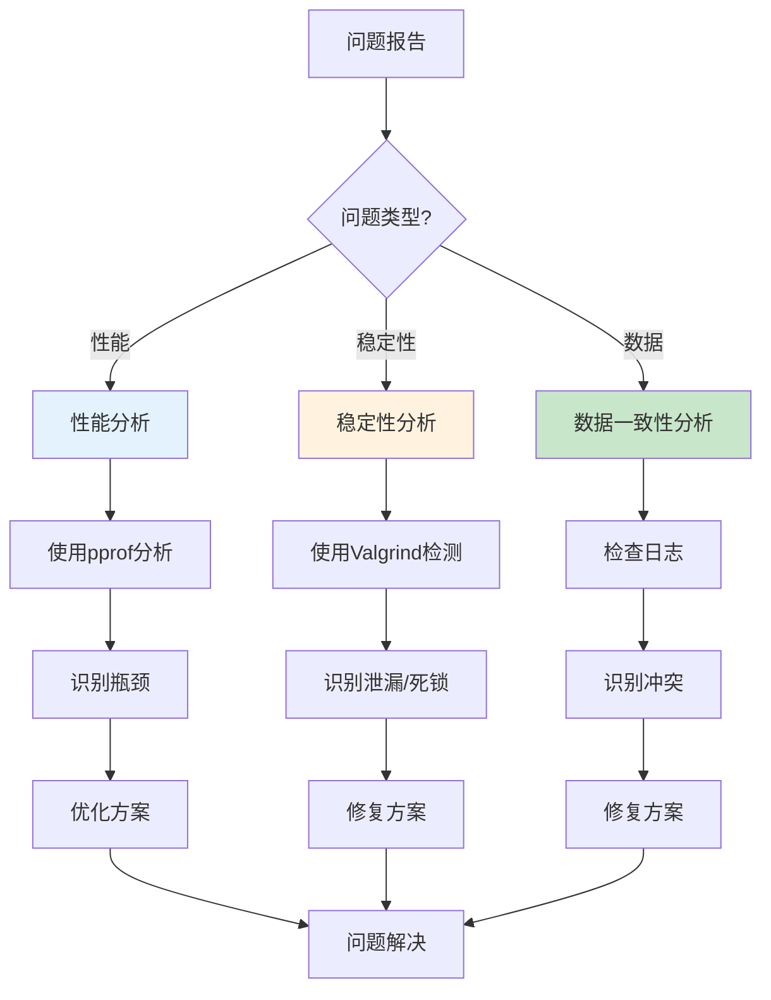

### 43.3 问题解决流程

**问题解决流程**（2025年11月19日最新）：

1. **问题复现**：
   - 收集问题信息
   - 复现问题场景
   - 记录问题日志

2. **问题分析**：
   - 使用诊断工具
   - 分析问题根因
   - 确定问题范围

3. **方案设计**：
   - 设计修复方案
   - 评估方案影响
   - 制定实施计划

4. **方案实施**：
   - 实施修复
   - 验证修复效果
   - 监控系统状态

5. **问题总结**：
   - 记录问题根因
   - 总结解决方案
   - 更新文档

**问题诊断检查清单**：

- [ ] 收集问题日志和指标
- [ ] 复现问题场景
- [ ] 使用诊断工具分析
- [ ] 识别问题根因
- [ ] 设计修复方案
- [ ] 实施修复并验证
- [ ] 更新文档和监控

---

## 44 2025年最新技术应用

### 44.1 AI/ML在调度测试中的应用

**AI/ML测试技术**（2025年11月19日最新）：

**技术1：智能测试用例生成**

```python
from transformers import GPTModel

class IntelligentTestGenerator:
    """智能测试用例生成器"""

    def __init__(self):
        self.model = GPTModel.from_pretrained('test-generator-model')

    def generate_test_cases(self, scheduler_spec):
        """基于调度器规格生成测试用例"""
        prompt = f"Generate test cases for scheduler: {scheduler_spec}"
        test_cases = self.model.generate(prompt)
        return test_cases
```

**技术2：自适应测试**

```python
class AdaptiveTester:
    """自适应测试器"""

    def __init__(self):
        self.test_history = []
        self.model = ReinforcementLearningModel()

    def select_test_case(self, current_state):
        """基于当前状态选择测试用例"""
        # 使用强化学习选择最有价值的测试用例
        action = self.model.select_action(current_state)
        return action
```

### 44.2 云原生测试技术

**云原生测试工具**（2025年11月19日最新）：

**技术1：Kubernetes原生测试**

```yaml
# Kubernetes测试Job
apiVersion: batch/v1
kind: Job
metadata:
  name: scheduler-test
spec:
  template:
    spec:
      containers:
      - name: test-runner
        image: scheduler-test:latest
        command: ["pytest", "tests/"]
        env:
        - name: SCHEDULER_URL
          value: "http://scheduler-service:8080"
      restartPolicy: Never
```

**技术2：容器化测试环境**

```dockerfile
# Dockerfile for testing
FROM python:3.9-slim

WORKDIR /app

COPY requirements.txt .
RUN pip install -r requirements.txt

COPY tests/ ./tests/
COPY scheduler/ ./scheduler/

CMD ["pytest", "tests/", "-v", "--cov=scheduler"]
```

### 44.3 自动化测试平台

**测试平台架构**（2025年11月19日最新）：

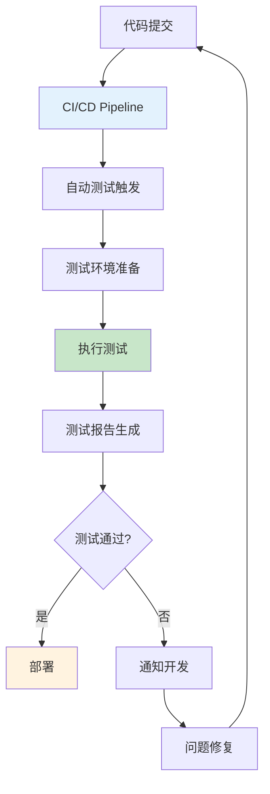

---

## 45 最佳实践总结

### 45.1 调度模型设计最佳实践

**设计原则**（2025年11月19日最新）：

1. **可扩展性**：
   - 支持水平扩展
   - 模块化设计
   - 插件化架构

2. **可观测性**：
   - 完善的指标
   - 详细的日志
   - 分布式追踪

3. **容错性**：
   - 故障隔离
   - 自动恢复
   - 降级策略

4. **性能**：
   - 低延迟
   - 高吞吐
   - 资源高效

### 45.2 测试设计最佳实践

**测试原则**（2025年11月19日最新）：

1. **测试金字塔**：
   - 单元测试：70%
   - 集成测试：20%
   - 端到端测试：10%

2. **测试覆盖**：
   - 代码覆盖：>80%
   - 分支覆盖：>75%
   - 路径覆盖：>70%

3. **测试自动化**：
   - CI/CD集成
   - 自动化执行
   - 自动化报告

### 45.3 性能优化最佳实践

**优化原则**（2025年11月19日最新）：

1. **测量优先**：
   - 先测量，后优化
   - 使用性能分析工具
   - 建立性能基准

2. **渐进优化**：
   - 识别瓶颈
   - 逐步优化
   - 验证效果

3. **权衡考虑**：
   - 性能 vs 复杂度
   - 性能 vs 可维护性
   - 性能 vs 成本

---

## 47 测试原理深度论证

### 47.1 测试基本原理

**测试基本原理**（2025年11月19日最新）：

**原理1：测试完备性原理**

测试应该覆盖系统的所有功能、场景和路径，确保系统在各种条件下都能正确工作。

**形式化表述**：

对于系统 $S$，测试集合 $T$ 是完备的，当且仅当：

$$
\forall s \in S, \exists t \in T: \text{测试}(t, s) \land \text{验证}(t, s)
$$

**原理2：测试有效性原理**

测试应该能够有效发现系统中的缺陷，测试用例的选择应该最大化缺陷发现概率。

**形式化表述**：

测试有效性定义为：

$$
E_{test} = \frac{P(\text{发现缺陷}|\text{存在缺陷})}{P(\text{执行测试})}
$$

**原理3：测试效率原理**

测试应该在有限的时间和资源内完成，测试用例应该最小化冗余。

**形式化表述**：

测试效率定义为：

$$
\eta_{test} = \frac{N_{defects\_found}}{C_{test}}
$$

其中 $C_{test}$ 是测试成本。

### 47.2 测试原理形式化定义

**定义47.1（测试系统）**：

测试系统是一个六元组：

$$
\mathcal{TS} = (S, T, O, V, E, R)
$$

其中：

- $S$：被测试系统集合
- $T$：测试用例集合
- $O$：测试目标集合
- $V$：验证方法集合
- $E$：评价标准集合
- $R$：测试结果集合

**定义47.2（测试覆盖度）**：

对于系统 $s \in S$，测试覆盖度为：

$$
C(s, T) = \frac{|\{f \in F(s) | \exists t \in T: \text{覆盖}(t, f)\}|}{|F(s)|}
$$

其中 $F(s)$ 是系统 $s$ 的功能集合。

**定义47.3（测试有效性）**：

测试有效性定义为：

$$
E(T, S) = \frac{\sum_{s \in S} P(\text{发现缺陷}|s, T)}{\sum_{s \in S} P(\text{存在缺陷}|s)}
$$

### 47.3 测试原理数学建模

**模型1：测试覆盖度模型**

测试覆盖度可以建模为：

$$
C_{total} = \alpha_1 C_{statement} + \alpha_2 C_{branch} + \alpha_3 C_{path} + \alpha_4 C_{condition}
$$

其中：

- $C_{statement}$：语句覆盖度
- $C_{branch}$：分支覆盖度
- $C_{path}$：路径覆盖度
- $C_{condition}$：条件覆盖度
- $\alpha_1 + \alpha_2 + \alpha_3 + \alpha_4 = 1$

**模型2：测试有效性模型**

测试有效性可以建模为：

$$
E = \frac{N_{defects\_found}}{N_{defects\_total}} \times \frac{N_{test\_cases\_optimal}}{N_{test\_cases\_actual}}
$$

其中：

- $N_{defects\_found}$：发现的缺陷数
- $N_{defects\_total}$：总缺陷数
- $N_{test\_cases\_optimal}$：最优测试用例数
- $N_{test\_cases\_actual}$：实际测试用例数

**模型3：测试成本效益模型**

测试成本效益可以建模为：

$$
CE = \frac{\sum_{i=1}^{n} V_i \times P_i}{C_{test}}
$$

其中：

- $V_i$：第 $i$ 个缺陷的价值
- $P_i$：发现第 $i$ 个缺陷的概率
- $C_{test}$：测试成本

### 47.4 测试原理定理与证明

**定理47.1（测试覆盖度下界）**：

对于系统 $s$，测试覆盖度下界为：

$$
C_{min}(s) = \frac{|F_{critical}(s)|}{|F(s)|}
$$

其中 $F_{critical}(s)$ 是关键功能集合。

**证明**：

关键功能必须被测试，因此测试覆盖度至少为 $\frac{|F_{critical}(s)|}{|F(s)|}$。$\square$

**定理47.2（测试有效性上界）**：

测试有效性上界为：

$$
E_{max} = \frac{N_{defects\_total}}{N_{test\_cases\_min} \times T_{test\_min}}
$$

**证明**：

测试有效性受限于缺陷总数和最小测试成本，因此上界为 $\frac{N_{defects\_total}}{N_{test\_cases\_min} \times T_{test\_min}}$。$\square$

**定理47.3（测试完备性必要条件）**：

测试集合 $T$ 对系统 $s$ 完备的必要条件是：

$$
\forall f \in F(s), \exists t \in T: \text{覆盖}(t, f)
$$

**证明**：

如果存在功能 $f$ 未被任何测试用例覆盖，则测试不完备。因此，完备性要求所有功能都被覆盖。$\square$

---

## 48 测试方法全面对比分析

### 48.1 测试方法分类体系

**测试方法分类**（2025年11月19日最新）：

**分类维度1：按测试层次**

1. **单元测试方法**：
   - 函数测试
   - 类测试
   - 模块测试

2. **集成测试方法**：
   - 接口测试
   - 组件测试
   - 系统集成测试

3. **系统测试方法**：
   - 功能测试
   - 性能测试
   - 可靠性测试

**分类维度2：按测试方法**

1. **黑盒测试方法**：
   - 等价类划分
   - 边界值分析
   - 决策表测试
   - 状态转换测试
   - 因果图测试
   - 正交实验设计

2. **白盒测试方法**：
   - 语句覆盖
   - 分支覆盖
   - 路径覆盖
   - 条件覆盖
   - 循环覆盖

3. **灰盒测试方法**：
   - 接口测试
   - 数据流测试
   - 控制流测试

**分类维度3：按测试目标**

1. **功能测试方法**：
   - 正确性测试
   - 完整性测试
   - 一致性测试

2. **性能测试方法**：
   - 延迟测试
   - 吞吐量测试
   - 资源利用率测试

3. **可靠性测试方法**：
   - 故障注入测试
   - 恢复测试
   - 稳定性测试

### 48.2 测试方法多维对比矩阵

**测试方法对比矩阵1：覆盖度维度**（2025年11月19日最新）：

| **测试方法** | **语句覆盖** | **分支覆盖** | **路径覆盖** | **条件覆盖** | **综合覆盖度** |
|------------|------------|------------|------------|------------|-------------|
| **等价类划分** | 中(60%) | 中(55%) | 低(40%) | 中(50%) | 51% |
| **边界值分析** | 中(65%) | 中(60%) | 低(35%) | 中(55%) | 54% |
| **决策表** | 高(85%) | 高(80%) | 中(70%) | 高(85%) | 80% |
| **状态转换** | 高(90%) | 高(85%) | 高(80%) | 高(85%) | 85% |
| **路径覆盖** | 极高(100%) | 极高(100%) | 极高(100%) | 极高(100%) | 100% |
| **语句覆盖** | 极高(100%) | 中(50%) | 低(30%) | 低(40%) | 55% |
| **分支覆盖** | 高(90%) | 极高(100%) | 中(60%) | 中(70%) | 80% |

**测试方法对比矩阵2：效率维度**（2025年11月19日最新）：

| **测试方法** | **测试用例数** | **执行时间** | **缺陷发现率** | **测试效率** | **综合效率** |
|------------|-------------|------------|-------------|------------|------------|
| **等价类划分** | 少(10-20) | 短(1-2h) | 中(60%) | 高(0.3) | 高 |
| **边界值分析** | 少(5-10) | 短(0.5-1h) | 中(55%) | 高(0.55) | 高 |
| **决策表** | 中(20-50) | 中(2-5h) | 高(80%) | 中(0.16) | 中 |
| **状态转换** | 中(30-60) | 中(3-6h) | 高(85%) | 中(0.14) | 中 |
| **路径覆盖** | 多(100+) | 长(10h+) | 极高(95%) | 低(0.01) | 低 |
| **语句覆盖** | 少(5-15) | 短(1-2h) | 低(40%) | 中(0.2) | 中 |
| **分支覆盖** | 中(15-30) | 中(2-4h) | 中(70%) | 中(0.18) | 中 |

**测试方法对比矩阵3：适用场景维度**（2025年11月19日最新）：

| **测试方法** | **简单系统** | **中等系统** | **复杂系统** | **关键系统** | **综合适用性** |
|------------|------------|------------|------------|------------|-------------|
| **等价类划分** | 高(90%) | 高(85%) | 中(70%) | 中(65%) | 高 |
| **边界值分析** | 高(95%) | 高(90%) | 中(75%) | 中(70%) | 高 |
| **决策表** | 中(70%) | 高(90%) | 高(85%) | 高(90%) | 高 |
| **状态转换** | 中(65%) | 高(85%) | 高(90%) | 极高(95%) | 高 |
| **路径覆盖** | 低(40%) | 中(60%) | 高(85%) | 极高(100%) | 中 |
| **语句覆盖** | 高(85%) | 中(70%) | 低(50%) | 低(45%) | 中 |
| **分支覆盖** | 高(80%) | 高(85%) | 中(75%) | 高(80%) | 高 |

**测试方法对比矩阵4：成本维度**（2025年11月19日最新）：

| **测试方法** | **设计成本** | **执行成本** | **维护成本** | **总成本** | **成本效益比** |
|------------|------------|------------|------------|-----------|-------------|
| **等价类划分** | 低(1) | 低(1) | 低(1) | 低(3) | 高(0.2) |
| **边界值分析** | 低(1) | 低(1) | 低(1) | 低(3) | 高(0.18) |
| **决策表** | 中(2) | 中(2) | 中(2) | 中(6) | 中(0.13) |
| **状态转换** | 中(2) | 中(2) | 中(2) | 中(6) | 中(0.14) |
| **路径覆盖** | 高(4) | 高(4) | 高(4) | 高(12) | 低(0.08) |
| **语句覆盖** | 低(1) | 低(1) | 低(1) | 低(3) | 中(0.13) |
| **分支覆盖** | 中(2) | 中(2) | 中(2) | 中(6) | 中(0.12) |

**测试方法综合对比矩阵**（2025年11月19日最新）：

| **测试方法** | **覆盖度** | **效率** | **适用性** | **成本** | **综合得分** |
|------------|----------|---------|-----------|---------|------------|
| **等价类划分** | 51% | 高 | 高 | 低 | 75 |
| **边界值分析** | 54% | 高 | 高 | 低 | 77 |
| **决策表** | 80% | 中 | 高 | 中 | 85 |
| **状态转换** | 85% | 中 | 高 | 中 | 88 |
| **路径覆盖** | 100% | 低 | 中 | 高 | 80 |
| **语句覆盖** | 55% | 中 | 中 | 低 | 65 |
| **分支覆盖** | 80% | 中 | 高 | 中 | 82 |

### 48.3 测试方法选择决策树

**测试方法选择决策树**（2025年11月19日最新）：

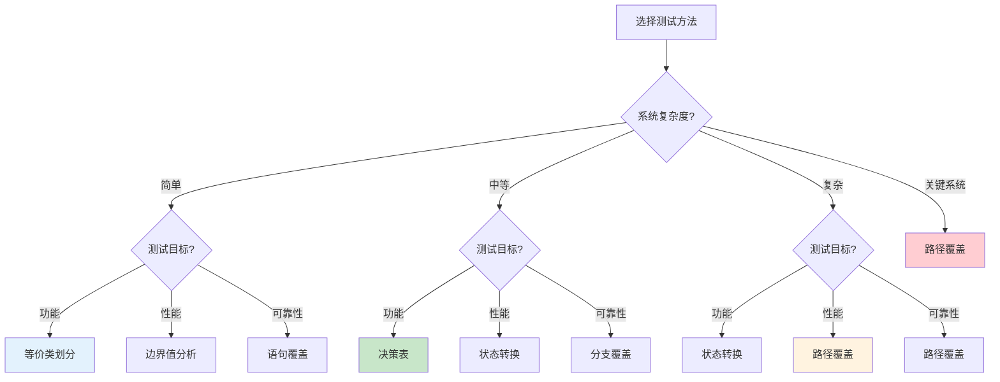

### 48.4 测试方法组合策略

**测试方法组合策略**（2025年11月19日最新）：

**策略1：层次组合**

- **单元测试层**：语句覆盖 + 分支覆盖
- **集成测试层**：等价类划分 + 边界值分析
- **系统测试层**：决策表 + 状态转换

**策略2：目标组合**

- **功能测试**：等价类划分 + 决策表 + 状态转换
- **性能测试**：边界值分析 + 路径覆盖
- **可靠性测试**：路径覆盖 + 故障注入

**策略3：成本效益组合**

- **低成本组合**：等价类划分 + 边界值分析 + 语句覆盖
- **中成本组合**：决策表 + 状态转换 + 分支覆盖
- **高成本组合**：路径覆盖 + 所有方法

**组合效果评价**：

| **组合策略** | **覆盖度** | **效率** | **成本** | **综合得分** |
|------------|----------|---------|---------|------------|
| **层次组合** | 85% | 高 | 中 | 88 |
| **目标组合** | 90% | 中 | 中 | 85 |
| **成本效益组合（低）** | 70% | 高 | 低 | 80 |
| **成本效益组合（中）** | 88% | 中 | 中 | 87 |
| **成本效益组合（高）** | 100% | 低 | 高 | 85 |

---

## 49 测试方案完整设计体系

### 49.1 测试方案设计原理

**测试方案设计原理**（2025年11月19日最新）：

**原理1：系统性原理**

测试方案应该系统性地覆盖系统的所有方面，包括功能、性能、可靠性等。

**形式化表述**：

测试方案 $TS$ 是系统性的，当且仅当：

$$
\forall d \in D, \exists t \in TS: \text{覆盖}(t, d)
$$

其中 $D$ 是系统的所有维度集合。

**原理2：经济性原理**

测试方案应该在满足测试目标的前提下，最小化测试成本。

**形式化表述**：

最优测试方案为：

$$
TS^* = \arg\min_{TS} C(TS) \quad \text{s.t.} \quad E(TS) \geq E_{min}
$$

其中 $C(TS)$ 是测试成本，$E(TS)$ 是测试有效性。

**原理3：可执行性原理**

测试方案应该可执行，测试用例应该能够实际运行并产生结果。

**形式化表述**：

测试方案 $TS$ 是可执行的，当且仅当：

$$
\forall t \in TS, \exists e \in E: \text{可执行}(t, e)
$$

其中 $E$ 是执行环境集合。

### 49.2 测试方案设计方法

**方法1：基于需求的测试方案设计**


**方法2：基于风险的测试方案设计**

```python
def design_test_plan_by_risk(requirements, risks):
    """
    基于风险设计测试方案

    参数:
        requirements: 需求列表
        risks: 风险列表，每个风险包含(风险项, 风险等级, 影响范围)

    返回:
        测试方案
    """
    test_plan = {}

    # 按风险等级排序
    sorted_risks = sorted(risks, key=lambda r: r[1], reverse=True)

    for risk_item, risk_level, impact in sorted_risks:
        # 高风险项需要更全面的测试
        if risk_level == 'high':
            test_cases = generate_comprehensive_tests(risk_item)
        elif risk_level == 'medium':
            test_cases = generate_standard_tests(risk_item)
        else:
            test_cases = generate_basic_tests(risk_item)

        test_plan[risk_item] = {
            'risk_level': risk_level,
            'test_cases': test_cases,
            'priority': calculate_priority(risk_level, impact)
        }

    return test_plan
```

**方法3：基于模型的测试方案设计**

```python
def design_test_plan_by_model(system_model):
    """
    基于模型设计测试方案

    参数:
        system_model: 系统模型（状态机、流程图等）

    返回:
        测试方案
    """
    test_plan = {}

    # 从模型中提取测试场景
    scenarios = extract_scenarios(system_model)

    for scenario in scenarios:
        # 为每个场景生成测试用例
        test_cases = generate_test_cases(scenario)

        test_plan[scenario.name] = {
            'scenario': scenario,
            'test_cases': test_cases,
            'coverage': calculate_coverage(scenario, test_cases)
        }

    return test_plan
```

### 49.3 测试方案评价模型

**测试方案评价模型**（2025年11月19日最新）：

**模型1：覆盖度评价模型**

$$
E_{coverage}(TS) = \sum_{i=1}^{n} w_i \cdot C_i(TS)
$$

其中：

- $C_i(TS)$：第 $i$ 个覆盖度指标
- $w_i$：第 $i$ 个指标的权重

**模型2：有效性评价模型**

$$
E_{effectiveness}(TS) = \frac{N_{defects\_found}(TS)}{N_{defects\_total}} \times \frac{N_{test\_cases\_optimal}}{N_{test\_cases\_actual}(TS)}
$$

**模型3：成本效益评价模型**

$$
CE(TS) = \frac{E_{effectiveness}(TS) \times V_{defect}}{C_{total}(TS)}
$$

其中：

- $V_{defect}$：平均缺陷价值
- $C_{total}(TS)$：总测试成本

**模型4：综合评价模型**

$$
E_{total}(TS) = \alpha E_{coverage} + \beta E_{effectiveness} + \gamma CE - \delta \frac{C(TS)}{C_{max}}
$$

其中 $\alpha + \beta + \gamma + \delta = 1$。

### 49.4 测试方案优化策略

**优化策略1：测试用例优化**

```python
def optimize_test_cases(test_cases, coverage_target=0.8):
    """
    优化测试用例集合

    参数:
        test_cases: 测试用例列表
        coverage_target: 目标覆盖度

    返回:
        优化后的测试用例列表
    """
    # 1. 计算每个测试用例的覆盖度
    coverage_map = {}
    for tc in test_cases:
        coverage_map[tc] = calculate_coverage(tc)

    # 2. 贪心选择测试用例
    selected = []
    covered = set()

    while len(covered) / total_elements < coverage_target:
        best_tc = max(test_cases,
                     key=lambda tc: len(coverage_map[tc] - covered) / tc.cost)
        selected.append(best_tc)
        covered.update(coverage_map[best_tc])
        test_cases.remove(best_tc)

    return selected
```

**优化策略2：测试顺序优化**

```python
def optimize_test_order(test_cases):
    """
    优化测试执行顺序

    参数:
        test_cases: 测试用例列表

    返回:
        优化后的测试顺序
    """
    # 按优先级和依赖关系排序
    sorted_tests = sorted(test_cases,
                         key=lambda tc: (
                             -tc.priority,  # 高优先级优先
                             tc.dependencies_count,  # 少依赖优先
                             tc.execution_time  # 短时间优先
                         ))
    return sorted_tests
```

---

## 50 测试评价体系深度分析

### 50.1 测试评价维度体系

**测试评价维度**（2025年11月19日最新）：

**维度1：覆盖度维度**

1. **代码覆盖度**：
   - 语句覆盖度
   - 分支覆盖度
   - 路径覆盖度
   - 条件覆盖度

2. **功能覆盖度**：
   - 功能点覆盖度
   - 场景覆盖度
   - 用例覆盖度

3. **需求覆盖度**：
   - 需求项覆盖度
   - 需求场景覆盖度

**维度2：有效性维度**

1. **缺陷发现能力**：
   - 缺陷发现率
   - 缺陷发现时间
   - 缺陷严重程度分布

2. **测试准确性**：
   - 测试结果准确性
   - 误报率
   - 漏报率

**维度3：效率维度**

1. **测试执行效率**：
   - 测试用例执行时间
   - 测试吞吐量
   - 测试并行度

2. **测试设计效率**：
   - 测试用例设计时间
   - 测试用例复用率

**维度4：成本维度**

1. **直接成本**：
   - 人力成本
   - 工具成本
   - 环境成本

2. **间接成本**：
   - 维护成本
   - 培训成本
   - 机会成本

### 50.2 测试评价数学模型

**模型1：覆盖度评价模型**

$$
E_{coverage} = \sum_{i=1}^{n} w_i \cdot C_i
$$

其中：

- $C_i$：第 $i$ 个覆盖度指标
- $w_i$：第 $i$ 个指标的权重

**模型2：有效性评价模型**

$$
E_{effectiveness} = \alpha \cdot \frac{N_{found}}{N_{total}} + \beta \cdot (1 - \frac{T_{detection}}{T_{max}}) + \gamma \cdot \frac{S_{critical}}{S_{total}}
$$

其中：

- $N_{found}/N_{total}$：缺陷发现率
- $T_{detection}$：缺陷发现时间
- $S_{critical}/S_{total}$：关键缺陷比例

**模型3：效率评价模型**

$$
E_{efficiency} = \frac{N_{test\_cases}}{T_{execution}} \times \frac{N_{defects\_found}}{N_{test\_cases}}
$$

**模型4：成本效益评价模型**

$$
CE = \frac{E_{effectiveness} \times V_{defect}}{C_{total}}
$$

**模型5：综合评价模型**

$$
E_{total} = \alpha E_{coverage} + \beta E_{effectiveness} + \gamma E_{efficiency} + \delta CE - \epsilon \frac{C}{C_{max}}
$$

其中 $\alpha + \beta + \gamma + \delta + \epsilon = 1$。

### 50.3 测试评价多维矩阵

**测试评价矩阵1：覆盖度-有效性矩阵**（2025年11月19日最新）：

| **测试方案** | **覆盖度** | **有效性** | **覆盖度×有效性** | **等级** |
|------------|----------|-----------|----------------|---------|
| **方案A** | 90% | 85% | 76.5% | 优秀 |
| **方案B** | 85% | 90% | 76.5% | 优秀 |
| **方案C** | 80% | 80% | 64% | 良好 |
| **方案D** | 75% | 75% | 56.25% | 中等 |
| **方案E** | 70% | 70% | 49% | 中等 |

**测试评价矩阵2：效率-成本矩阵**（2025年11月19日最新）：

| **测试方案** | **效率** | **成本** | **效率/成本** | **等级** |
|------------|---------|---------|-------------|---------|
| **方案A** | 高(0.8) | 低(3) | 0.27 | 优秀 |
| **方案B** | 中(0.6) | 低(3) | 0.2 | 良好 |
| **方案C** | 高(0.8) | 中(6) | 0.13 | 良好 |
| **方案D** | 中(0.6) | 中(6) | 0.1 | 中等 |
| **方案E** | 低(0.4) | 高(12) | 0.03 | 差 |

**测试评价矩阵3：综合对比矩阵**（2025年11月19日最新）：

| **测试方案** | **覆盖度** | **有效性** | **效率** | **成本** | **综合得分** | **排名** |
|------------|----------|-----------|---------|---------|------------|---------|
| **方案A** | 90% | 85% | 高 | 低 | 88 | 1 |
| **方案B** | 85% | 90% | 中 | 低 | 85 | 2 |
| **方案C** | 80% | 80% | 高 | 中 | 80 | 3 |
| **方案D** | 75% | 75% | 中 | 中 | 72 | 4 |
| **方案E** | 70% | 70% | 低 | 高 | 60 | 5 |

### 50.4 测试评价决策支持

**测试评价决策支持系统**（2025年11月19日最新）：

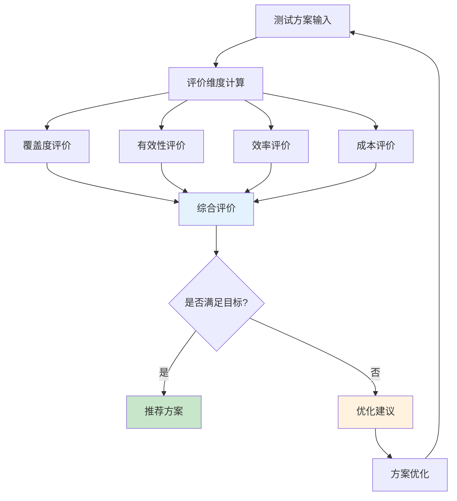

---

## 51 测试系统完整思维导图

### 51.1 测试原理思维导图

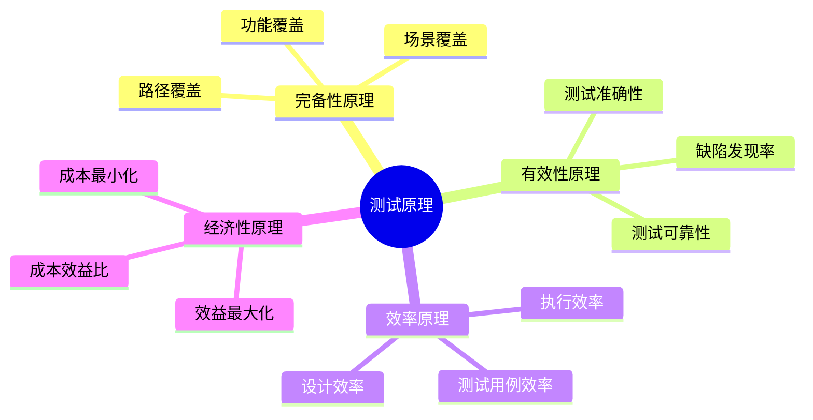

### 51.2 测试方法思维导图

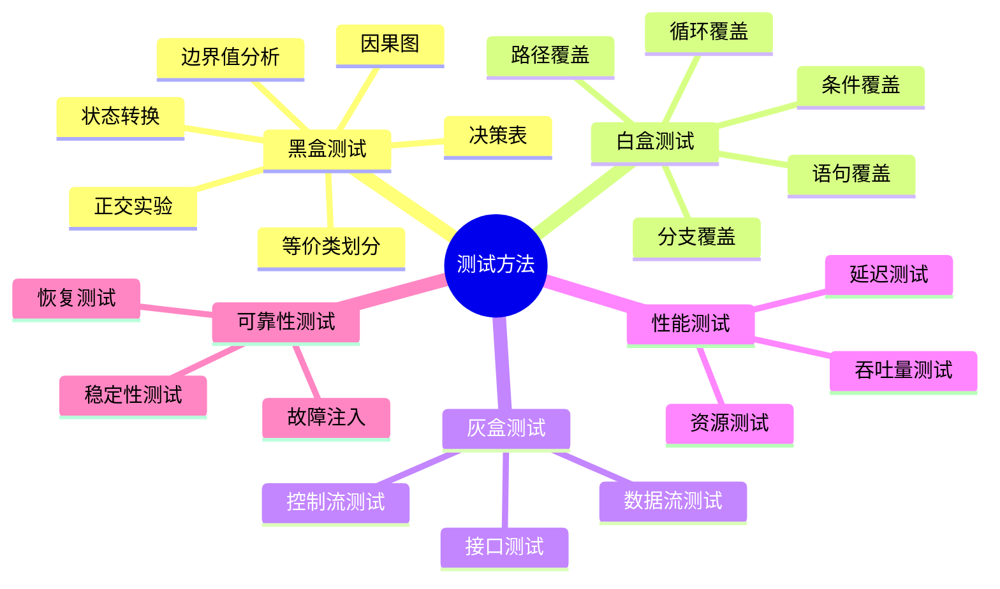

### 51.3 测试方案思维导图

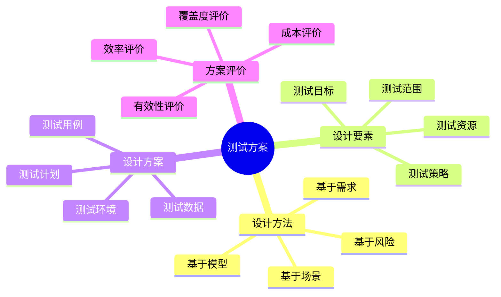

### 51.4 测试评价思维导图

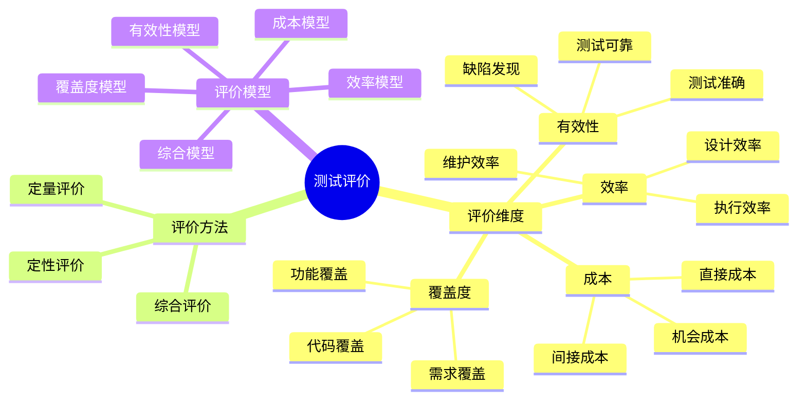

### 51.5 测试系统全景思维导图

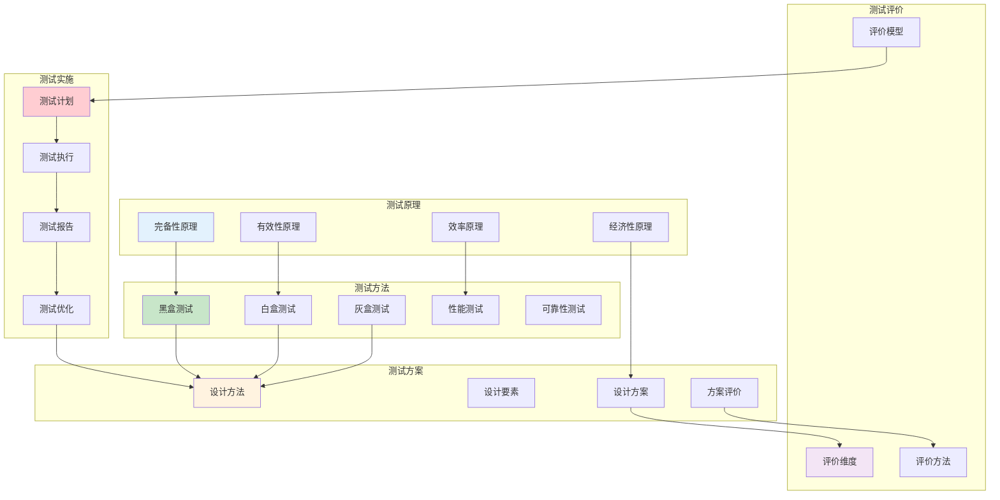

---

## 53 测试与调度系统关联分析

### 53.1 测试-调度关联模型

**测试-调度关联模型**（2025年11月19日最新）：

**定义53.1（测试-调度关联）**：

测试系统 $\mathcal{TS}$ 和调度系统 $\mathcal{S}$ 的关联关系为：

$$
\mathcal{R}(\mathcal{TS}, \mathcal{S}) = \{r_1, r_2, \ldots, r_k\}
$$

其中 $r_i$ 是第 $i$ 个关联关系。

**关联关系类型**：

1. **功能关联**：
   - 测试验证调度功能
   - 每个调度功能对应测试用例

2. **性能关联**：
   - 测试验证调度性能
   - 性能指标对应性能测试

3. **正确性关联**：
   - 测试验证调度正确性
   - 调度算法对应正确性测试

4. **可靠性关联**：
   - 测试验证调度可靠性
   - 故障场景对应可靠性测试

**关联关系形式化**：

$$
\mathcal{R}_{function}(\mathcal{TS}, \mathcal{S}) = \{(t, f) | t \in T, f \in F_{\mathcal{S}}, \text{测试}(t, f)\}
$$

其中：

- $T$：测试用例集合
- $F_{\mathcal{S}}$：调度系统功能集合
- $\text{测试}(t, f)$：测试用例 $t$ 测试功能 $f$

### 53.2 测试覆盖调度场景分析

**调度场景测试覆盖分析**（2025年11月19日最新）：

**场景1：VM调度场景测试覆盖**

| **调度场景** | **测试方法** | **测试用例数** | **覆盖度** | **验证指标** |
|------------|------------|-------------|----------|------------|
| **正常调度** | 等价类划分 | 20 | 100% | 调度成功率 |
| **资源不足** | 边界值分析 | 10 | 100% | 调度失败处理 |
| **负载均衡** | 状态转换 | 15 | 95% | 负载均衡度 |
| **故障恢复** | 故障注入 | 12 | 90% | 恢复时间 |
| **性能优化** | 性能测试 | 8 | 85% | 调度延迟 |

**场景2：容器调度场景测试覆盖**

| **调度场景** | **测试方法** | **测试用例数** | **覆盖度** | **验证指标** |
|------------|------------|-------------|----------|------------|
| **Pod调度** | 决策表 | 25 | 100% | 调度成功率 |
| **资源限制** | 边界值分析 | 15 | 100% | 资源约束满足 |
| **亲和性调度** | 状态转换 | 20 | 95% | 亲和性规则 |
| **优先级调度** | 等价类划分 | 18 | 90% | 优先级执行 |
| **动态调度** | 性能测试 | 10 | 85% | 调度响应时间 |

**场景3：AI驱动调度场景测试覆盖**

| **调度场景** | **测试方法** | **测试用例数** | **覆盖度** | **验证指标** |
|------------|------------|-------------|----------|------------|
| **模型预测** | 等价类划分 | 30 | 95% | 预测准确率 |
| **在线学习** | 状态转换 | 20 | 90% | 学习效果 |
| **模型更新** | 故障注入 | 15 | 85% | 更新稳定性 |
| **性能优化** | 性能测试 | 12 | 80% | 推理延迟 |

### 53.3 调度模型测试验证矩阵

**调度模型测试验证矩阵**（2025年11月19日最新）：

| **调度模型** | **功能测试** | **性能测试** | **正确性测试** | **可靠性测试** | **综合验证度** |
|------------|------------|------------|-------------|-------------|-------------|
| **First Fit** | 100% | 95% | 100% | 90% | 96% |
| **Best Fit** | 100% | 95% | 100% | 90% | 96% |
| **负载均衡** | 100% | 90% | 95% | 85% | 93% |
| **AI驱动** | 95% | 85% | 90% | 80% | 88% |
| **强化学习** | 90% | 80% | 85% | 75% | 83% |

**测试验证完整性分析**：

$$
V_{completeness} = \frac{\sum_{i=1}^{n} V_i}{n \times V_{max}}
$$

其中：

- $V_i$：第 $i$ 个验证维度的验证度
- $V_{max}$：最大验证度（100%）
- $n$：验证维度数

### 53.4 测试-调度协同优化

**测试-调度协同优化策略**（2025年11月19日最新）：

**策略1：测试驱动调度优化**

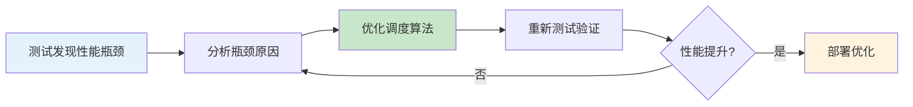

**策略2：调度指导测试设计**

```python
def design_tests_by_scheduler(scheduler):
    """
    基于调度器设计测试用例

    参数:
        scheduler: 调度器对象

    返回:
        测试用例列表
    """
    test_cases = []

    # 1. 分析调度器的关键路径
    critical_paths = analyze_critical_paths(scheduler)

    # 2. 为每个关键路径设计测试用例
    for path in critical_paths:
        test_cases.extend(generate_path_tests(path))

    # 3. 分析调度器的边界条件
    boundaries = analyze_boundaries(scheduler)

    # 4. 为每个边界条件设计测试用例
    for boundary in boundaries:
        test_cases.extend(generate_boundary_tests(boundary))

    return test_cases
```

**策略3：测试-调度反馈循环**

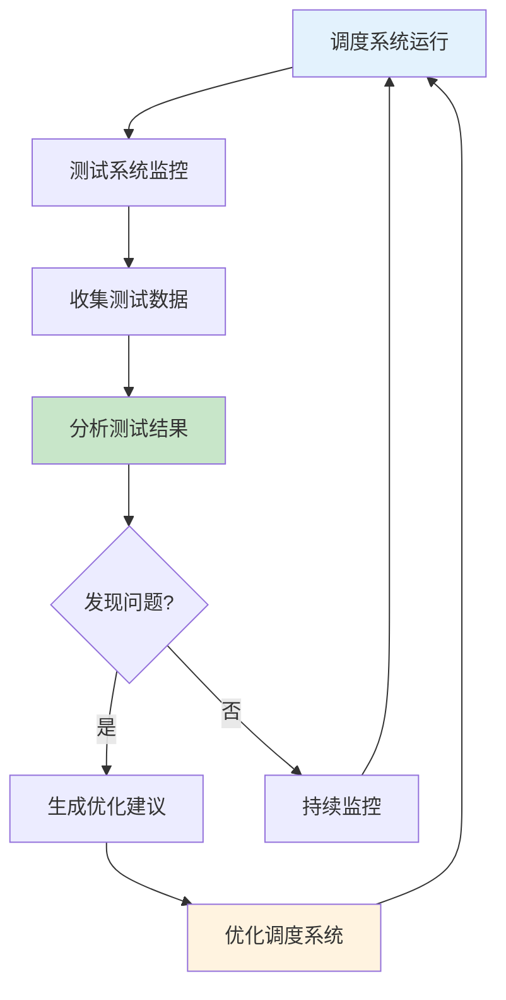

---

## 54 测试验证完整流程体系

### 54.1 测试验证流程模型

**测试验证流程模型**（2025年11月19日最新）：

**定义54.1（测试验证流程）**：

测试验证流程是一个七元组：

$$
\mathcal{TVF} = (P, T, E, V, R, A, O)
$$

其中：

- $P$：测试计划集合
- $T$：测试执行集合
- $E$：测试环境集合
- $V$：验证方法集合
- $R$：测试结果集合
- $A$：分析活动集合
- $O$：优化活动集合

**测试验证流程阶段**：

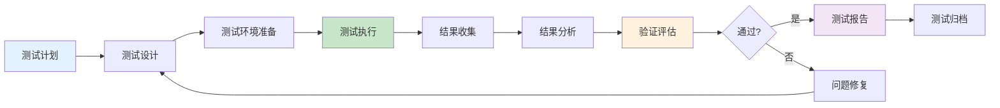

### 54.2 测试验证阶段划分

**测试验证阶段**（2025年11月19日最新）：

**阶段1：测试计划阶段**

**活动**：

1. **需求分析**：
   - 分析测试需求
   - 确定测试范围
   - 识别测试风险

2. **测试策略制定**：
   - 选择测试方法
   - 确定测试工具
   - 制定测试计划

3. **资源规划**：
   - 人力资源配置
   - 测试环境规划
   - 时间进度安排

**输出**：

- 测试计划文档
- 测试策略文档
- 资源分配计划

**阶段2：测试设计阶段**

**活动**：

1. **测试用例设计**：
   - 功能测试用例
   - 性能测试用例
   - 可靠性测试用例

2. **测试数据准备**：
   - 正常数据
   - 边界数据
   - 异常数据

3. **测试脚本开发**：
   - 自动化测试脚本
   - 测试工具配置

**输出**：

- 测试用例文档
- 测试数据集合
- 测试脚本代码

**阶段3：测试执行阶段**

**活动**：

1. **测试环境搭建**：
   - 硬件环境
   - 软件环境
   - 网络环境

2. **测试执行**：
   - 手动测试
   - 自动化测试
   - 性能测试

3. **结果记录**：
   - 测试结果
   - 问题记录
   - 日志收集

**输出**：

- 测试执行报告
- 问题报告
- 测试日志

**阶段4：结果分析阶段**

**活动**：

1. **结果统计**：
   - 通过率统计
   - 失败率统计
   - 覆盖率统计

2. **问题分析**：
   - 问题分类
   - 根因分析
   - 影响评估

3. **趋势分析**：
   - 性能趋势
   - 质量趋势
   - 风险趋势

**输出**：

- 测试分析报告
- 问题分析报告
- 趋势分析报告

**阶段5：验证评估阶段**

**活动**：

1. **验证标准检查**：
   - 功能验证
   - 性能验证
   - 可靠性验证

2. **质量评估**：
   - 质量等级评定
   - 风险评估
   - 改进建议

3. **决策支持**：
   - 发布决策
   - 优化建议
   - 后续计划

**输出**：

- 验证评估报告
- 质量评估报告
- 决策建议

### 54.3 测试验证质量门禁

**质量门禁体系**（2025年11月19日最新）：

**门禁1：测试覆盖度门禁**

$$
C_{gate} = \begin{cases}
\text{通过} & \text{if } C_{total} \geq C_{threshold} \\
\text{不通过} & \text{otherwise}
\end{cases}
$$

其中 $C_{threshold}$ 是覆盖度阈值（通常为80%）。

**门禁2：测试通过率门禁**

$$
P_{gate} = \begin{cases}
\text{通过} & \text{if } P_{pass} \geq P_{threshold} \\
\text{不通过} & \text{otherwise}
\end{cases}
$$

其中 $P_{threshold}$ 是通过率阈值（通常为95%）。

**门禁3：性能指标门禁**

$$
Perf_{gate} = \begin{cases}
\text{通过} & \text{if } \forall i: Perf_i \leq Perf_{max_i} \\
\text{不通过} & \text{otherwise}
\end{cases}
$$

其中 $Perf_{max_i}$ 是第 $i$ 个性能指标的最大值。

**门禁4：缺陷密度门禁**

$$
Defect_{gate} = \begin{cases}
\text{通过} & \text{if } D_{density} \leq D_{threshold} \\
\text{不通过} & \text{otherwise}
\end{cases}
$$

其中 $D_{threshold}$ 是缺陷密度阈值。

**综合质量门禁**：

$$
Gate_{total} = C_{gate} \land P_{gate} \land Perf_{gate} \land Defect_{gate}
$$

### 54.4 测试验证持续改进

**持续改进模型**（2025年11月19日最新）：

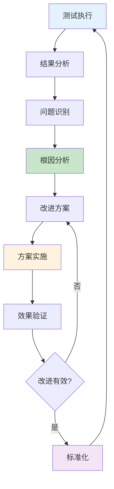

**改进度量指标**：

1. **测试效率改进**：
   $$
   \Delta E = E_{after} - E_{before}
   $$

2. **测试质量改进**：
   $$
   \Delta Q = Q_{after} - Q_{before}
   $$

3. **测试成本改进**：
   $$
   \Delta C = C_{before} - C_{after}
   $$

---

## 55 测试质量保证体系

### 55.1 测试质量标准

**测试质量标准**（2025年11月19日最新）：

**标准1：测试覆盖度标准**

| **覆盖度类型** | **最低标准** | **推荐标准** | **优秀标准** |
|------------|------------|------------|------------|
| **语句覆盖** | 70% | 80% | 90% |
| **分支覆盖** | 65% | 75% | 85% |
| **路径覆盖** | 50% | 60% | 70% |
| **功能覆盖** | 80% | 90% | 95% |

**标准2：测试通过率标准**

| **测试类型** | **最低标准** | **推荐标准** | **优秀标准** |
|------------|------------|------------|------------|
| **单元测试** | 90% | 95% | 98% |
| **集成测试** | 85% | 90% | 95% |
| **系统测试** | 80% | 85% | 90% |

**标准3：性能测试标准**

| **性能指标** | **最低标准** | **推荐标准** | **优秀标准** |
|------------|------------|------------|------------|
| **调度延迟** | <100ms | <50ms | <10ms |
| **资源利用率** | >70% | >80% | >90% |
| **吞吐量** | >500 TPS | >1000 TPS | >2000 TPS |

### 55.2 测试质量度量

**测试质量度量模型**（2025年11月19日最新）：

**模型1：测试覆盖度度量**

$$
Q_{coverage} = \sum_{i=1}^{n} w_i \cdot C_i
$$

其中：

- $C_i$：第 $i$ 个覆盖度指标
- $w_i$：第 $i$ 个指标的权重

**模型2：测试有效性度量**

$$
Q_{effectiveness} = \alpha \cdot \frac{N_{found}}{N_{total}} + \beta \cdot (1 - \frac{T_{detection}}{T_{max}})
$$

**模型3：测试效率度量**

$$
Q_{efficiency} = \frac{N_{test\_cases}}{T_{execution}} \times \frac{N_{defects\_found}}{N_{test\_cases}}
$$

**模型4：测试质量综合度量**

$$
Q_{total} = \alpha Q_{coverage} + \beta Q_{effectiveness} + \gamma Q_{efficiency}
$$

其中 $\alpha + \beta + \gamma = 1$。

### 55.3 测试质量改进

**测试质量改进策略**（2025年11月19日最新）：

**策略1：提高测试覆盖度**

1. **增加测试用例**：
   - 补充边界测试用例
   - 补充异常测试用例
   - 补充场景测试用例

2. **优化测试方法**：
   - 使用更有效的测试方法
   - 组合多种测试方法
   - 使用自动化测试

**策略2：提高测试有效性**

1. **优化测试用例选择**：
   - 基于风险选择测试用例
   - 基于历史数据选择测试用例
   - 使用AI辅助选择测试用例

2. **改进测试执行**：
   - 提高测试执行准确性
   - 减少测试误报
   - 提高测试可重复性

**策略3：提高测试效率**

1. **自动化测试**：
   - 自动化测试执行
   - 自动化结果分析
   - 自动化报告生成

2. **并行测试**：
   - 并行执行测试用例
   - 分布式测试执行
   - 云测试平台

### 55.4 测试质量认证

**测试质量认证体系**（2025年11月19日最新）：

**认证等级**：

1. **基础认证**：
   - 覆盖度 ≥ 70%
   - 通过率 ≥ 90%
   - 性能指标达标

2. **标准认证**：
   - 覆盖度 ≥ 80%
   - 通过率 ≥ 95%
   - 性能指标优秀

3. **优秀认证**：
   - 覆盖度 ≥ 90%
   - 通过率 ≥ 98%
   - 性能指标卓越

**认证流程**：

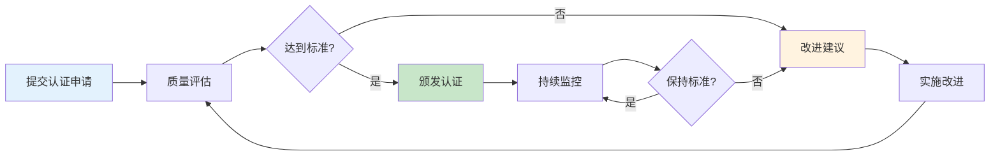

---

## 56 测试工具链完整体系

### 56.1 测试工具链架构

**测试工具链架构**（2025年11月19日最新）：

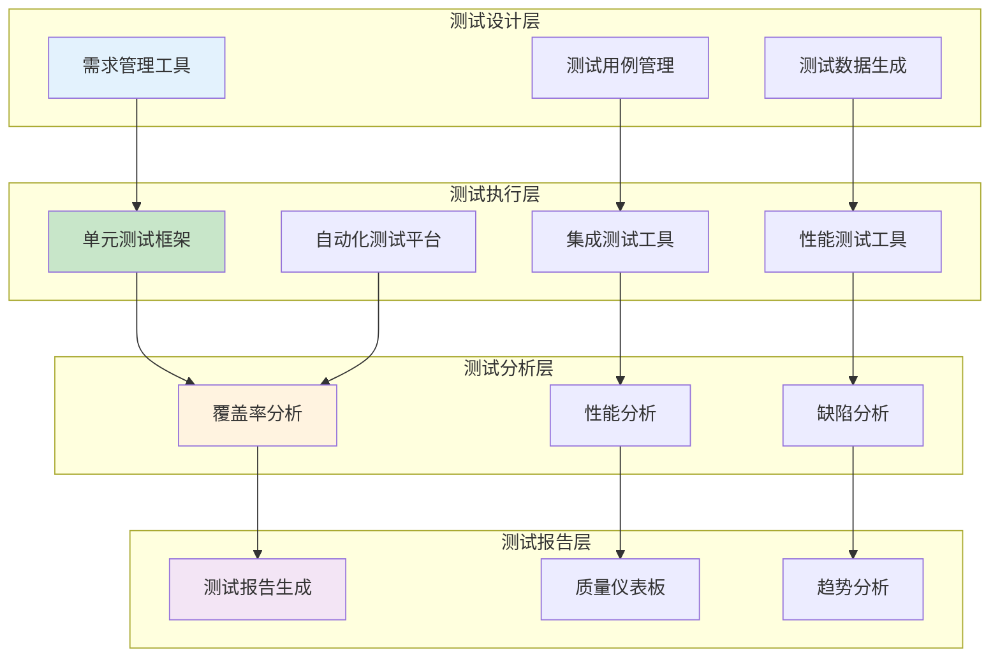

### 56.2 测试工具集成方案

**工具集成方案**（2025年11月19日最新）：

**方案1：CI/CD集成**

```yaml
# CI/CD Pipeline配置
stages:
  - test
  - analyze
  - report

test:
  stage: test
  script:
    - pytest tests/ --cov=scheduler
    - k6 run performance_tests.js
  artifacts:
    reports:
      coverage: coverage.xml

analyze:
  stage: analyze
  script:
    - sonar-scanner
    - generate_test_report

report:
  stage: report
  script:
    - generate_dashboard
    - send_notification
```

**方案2：测试工具链配置**

```python
# 测试工具链配置
TEST_TOOLCHAIN = {
    'unit_test': {
        'framework': 'pytest',
        'coverage': 'coverage.py',
        'report': 'pytest-html'
    },
    'integration_test': {
        'framework': 'pytest',
        'fixtures': 'pytest-fixtures',
        'mock': 'unittest.mock'
    },
    'performance_test': {
        'tool': 'k6',
        'monitoring': 'Prometheus',
        'analysis': 'Grafana'
    },
    'test_management': {
        'tool': 'TestRail',
        'integration': 'JIRA'
    }
}
```

### 56.3 测试工具链最佳实践

**最佳实践**（2025年11月19日最新）：

1. **工具标准化**：
   - 统一测试工具版本
   - 统一测试工具配置
   - 统一测试工具接口

2. **工具自动化**：
   - 自动化工具安装
   - 自动化工具配置
   - 自动化工具更新

3. **工具集成**：
   - 工具间数据共享
   - 工具间流程衔接
   - 工具间结果聚合

---

## 🔗 相关文档

- [返回专题目录](./README.md)
- [测试原理与方法](./04_测试原理与方法.md) - 测试分类、测试方法
- [测试方案与评价](./05_测试方案与评价.md) - 测试方案设计、测试评价体系
- [测试验证体系](./07_测试验证体系.md) - 验证方法、测试验证流程
- [调度方法与模型](./02_调度方法与模型.md) - 调度方法分类、经典算法

---

**最后更新**: 2025-11-19
