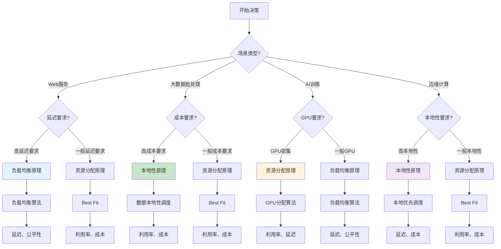
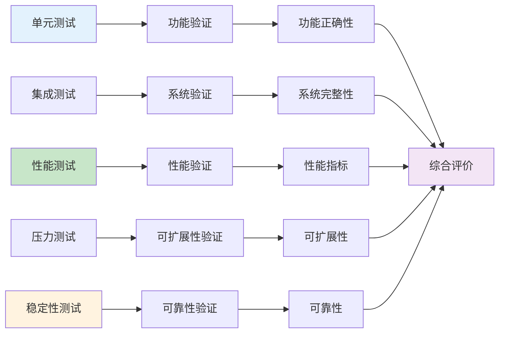
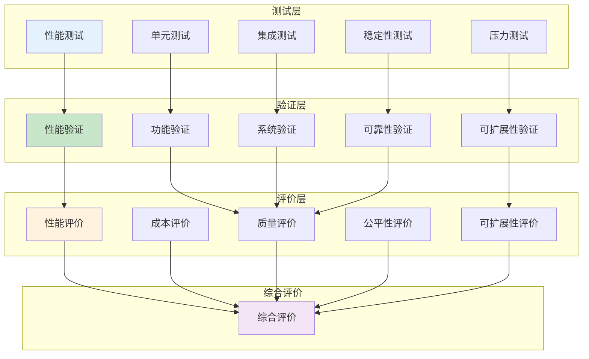
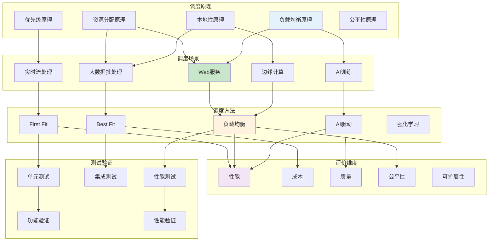
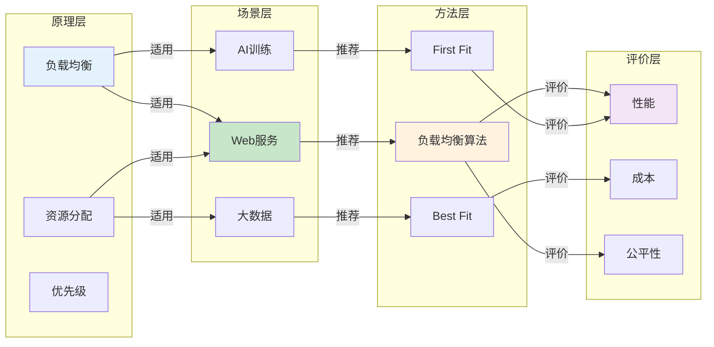
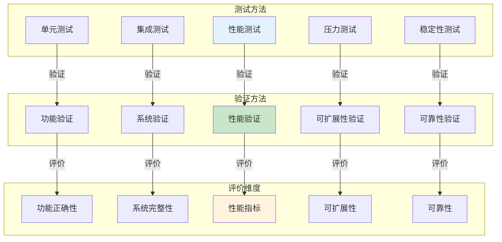

# 形式化论证

> **来源**: 05.11 调度系统理论分析与评价体系专题
> **章节**: 第9章、第16章
> **更新**: 2025年11月19日

---

## 📋 目录

- [形式化论证](#形式化论证)
  - [📋 目录](#-目录)
  - [9 形式化论证](#9-形式化论证)
    - [9.1 调度原理形式化](#91-调度原理形式化)
    - [9.2 调度算法正确性证明](#92-调度算法正确性证明)
    - [9.3 性能边界证明](#93-性能边界证明)
    - [9.4 优化理论证明](#94-优化理论证明)
    - [9.5 复杂度分析证明](#95-复杂度分析证明)
    - [9.6 收敛性证明](#96-收敛性证明)
  - [10 测试验证详细方法](#10-测试验证详细方法)
    - [10.1 单元测试详细方法](#101-单元测试详细方法)
    - [10.2 集成测试详细方法](#102-集成测试详细方法)
    - [10.3 性能测试详细方法](#103-性能测试详细方法)
    - [10.4 压力测试详细方法](#104-压力测试详细方法)
    - [10.5 稳定性测试详细方法](#105-稳定性测试详细方法)
  - [11 评价维度详细分析](#11-评价维度详细分析)
    - [11.1 性能维度详细分析](#111-性能维度详细分析)
    - [11.2 成本维度详细分析](#112-成本维度详细分析)
    - [11.3 质量维度详细分析](#113-质量维度详细分析)
    - [11.4 公平性维度详细分析](#114-公平性维度详细分析)
    - [11.5 可扩展性维度详细分析](#115-可扩展性维度详细分析)
  - [12 场景-方法-评价三维矩阵](#12-场景-方法-评价三维矩阵)
    - [12.1 三维矩阵构建](#121-三维矩阵构建)
    - [12.2 矩阵分析方法](#122-矩阵分析方法)
    - [12.3 矩阵应用案例](#123-矩阵应用案例)
  - [13 原理-场景-方法-评价四维关联分析](#13-原理-场景-方法-评价四维关联分析)
    - [13.1 四维关联模型](#131-四维关联模型)
    - [13.2 关联关系形式化](#132-关联关系形式化)
    - [13.3 关联分析矩阵](#133-关联分析矩阵)
    - [13.4 关联决策树](#134-关联决策树)
  - [14 测试验证评价完整体系](#14-测试验证评价完整体系)
    - [14.1 测试-验证-评价关联](#141-测试-验证-评价关联)
    - [14.2 完整评价流程](#142-完整评价流程)
    - [14.3 评价维度详细矩阵](#143-评价维度详细矩阵)
    - [14.4 评价体系思维导图](#144-评价体系思维导图)
  - [15 综合思维导图与知识图谱](#15-综合思维导图与知识图谱)
    - [15.1 调度系统全景思维导图](#151-调度系统全景思维导图)
    - [15.2 原理-场景-方法-评价知识图谱](#152-原理-场景-方法-评价知识图谱)
    - [15.3 测试-验证-评价知识图谱](#153-测试-验证-评价知识图谱)
  - [16 形式化论证体系](#16-形式化论证体系)
    - [16.1 原理形式化论证](#161-原理形式化论证)
    - [16.2 场景形式化论证](#162-场景形式化论证)
    - [16.3 方法形式化论证](#163-方法形式化论证)
    - [16.4 评价形式化论证](#164-评价形式化论证)
    - [16.5 关联关系形式化论证](#165-关联关系形式化论证)
  - [🔗 相关文档](#-相关文档)

---

## 9 形式化论证

### 9.1 调度原理形式化

**定理9.1（资源分配最优性）**：

对于资源分配问题，如果满足：

1. 资源容量约束
2. 任务需求约束
3. 放置约束

则存在最优资源分配方案。

**证明**：

资源分配问题是一个线性规划问题：

$$
\begin{align}
\min \quad & \sum_{t \in T} \sum_{r \in R} c_{t,r} \cdot x_{t,r} \\
\text{s.t.} \quad & \sum_{t \in T} x_{t,r} \leq C_r, \quad \forall r \in R \\
& \sum_{r \in R} x_{t,r} \geq D_t, \quad \forall t \in T \\
& \sum_{r \in R} x_{t,r} \leq 1, \quad \forall t \in T \\
& x_{t,r} \in \{0, 1\}, \quad \forall t \in T, r \in R
\end{align}
$$

这是一个整数线性规划问题，可行域非空且有界，因此存在最优解。$\square$

### 9.2 调度算法正确性证明

**定理9.2（First Fit正确性）**：

First Fit算法满足容量约束和需求约束。

**证明**：

1. **容量约束**：算法在分配前检查 `canAllocate(task, resource)`，确保不会超过资源容量。

2. **需求约束**：算法尝试为每个任务分配资源，如果无法分配，任务保留在未分配集合中。

因此，First Fit算法满足容量约束和需求约束。$\square$

**定理9.3（Best Fit最优性）**：

Best Fit算法在贪心策略下，对于单资源类型问题，达到局部最优。

**证明**：

Best Fit算法每次选择评分最高的资源，这是贪心策略。对于单资源类型问题，贪心策略达到局部最优。$\square$

### 9.3 性能边界证明

**定理9.4（负载均衡下界）**：

对于 $n$ 个任务和 $m$ 个资源，负载均衡度下界为：

$$
\sigma_L \geq \frac{1}{\sqrt{m}} \cdot \sqrt{\frac{\sum_{t \in T} D_t^2}{\sum_{r \in R} C_r^2}}
$$

**证明**：

由Cauchy-Schwarz不等式：

$$
\left(\sum_{r \in R} L(r)\right)^2 \leq m \cdot \sum_{r \in R} L(r)^2
$$

因此：

$$
\sigma_L^2 = \frac{1}{m} \sum_{r \in R} (L(r) - \bar{L})^2 \geq \frac{1}{m^2} \sum_{r \in R} L(r)^2
$$

结合资源需求约束，得到下界。$\square$

**定理9.5（调度延迟上界）**：

对于 $n$ 个任务和 $m$ 个资源，调度延迟上界为：

$$
L_{schedule} \leq \frac{n}{m} \cdot t_{process}
$$

其中 $t_{process}$ 是单个任务处理时间。

**证明**：

最坏情况下，所有任务串行处理，延迟为 $n \cdot t_{process}$。最佳情况下，任务并行处理，延迟为 $\frac{n}{m} \cdot t_{process}$。因此上界为 $\frac{n}{m} \cdot t_{process}$。$\square$

### 9.4 优化理论证明

**定理9.6（帕累托最优性）**：

对于多目标优化问题，如果调度方案是帕累托最优的，则不存在更优的方案。

**证明**：

假设存在更优方案 $x'$，使得：

$$
\forall i: f_i(x') \leq f_i(x^*) \quad \text{且} \quad \exists j: f_j(x') < f_j(x^*)
$$

这与 $x^*$ 是帕累托最优矛盾。因此不存在更优方案。$\square$

**定理9.7（权重聚合最优性）**：

对于权重聚合优化问题：

$$
\min \sum_{i=1}^{k} w_i \cdot f_i(x)
$$

如果权重 $w_i > 0$，则最优解是帕累托最优的。

**证明**：

假设最优解 $x^*$ 不是帕累托最优，则存在 $x'$ 使得：

$$
\forall i: f_i(x') \leq f_i(x^*) \quad \text{且} \quad \exists j: f_j(x') < f_j(x^*)
$$

因此：

$$
\sum_{i=1}^{k} w_i \cdot f_i(x') < \sum_{i=1}^{k} w_i \cdot f_i(x^*)
$$

这与 $x^*$ 是最优解矛盾。因此 $x^*$ 是帕累托最优的。$\square$

### 9.5 复杂度分析证明

**定理9.8（First Fit时间复杂度）**：

First Fit算法的时间复杂度为 $O(n \cdot m)$，其中 $n$ 是任务数，$m$ 是资源数。

**证明**：

First Fit算法对每个任务遍历所有资源，最坏情况下需要检查所有资源，因此时间复杂度为 $O(n \cdot m)$。$\square$

**定理9.9（Best Fit时间复杂度）**：

Best Fit算法的时间复杂度为 $O(n \cdot m)$，其中 $n$ 是任务数，$m$ 是资源数。

**证明**：

Best Fit算法对每个任务遍历所有资源并计算评分，最坏情况下需要检查所有资源，因此时间复杂度为 $O(n \cdot m)$。$\square$

**定理9.10（负载均衡时间复杂度）**：

负载均衡算法的时间复杂度为 $O(n \cdot \log m)$，其中 $n$ 是任务数，$m$ 是资源数。

**证明**：

负载均衡算法使用优先队列维护资源负载，每次选择最小负载资源需要 $O(\log m)$ 时间，因此总时间复杂度为 $O(n \cdot \log m)$。$\square$

### 9.6 收敛性证明

**定理9.11（迭代调度算法收敛性）**：

如果迭代调度算法满足：

1. 每次迭代改进目标函数值
2. 目标函数有下界
3. 改进量有下界

则算法必然收敛。

**证明**：

设目标函数为 $f(x)$，第 $k$ 次迭代的值为 $f(x_k)$。

由条件1：$f(x_{k+1}) < f(x_k)$

由条件2：存在 $f^*$ 使得 $f(x_k) \geq f^*$

由条件3：存在 $\epsilon > 0$ 使得 $f(x_k) - f(x_{k+1}) \geq \epsilon$

因此：

$$
f(x_k) - f^* \geq f(x_k) - f(x_{k+1}) \geq \epsilon
$$

序列 $\{f(x_k)\}$ 单调递减且有下界，因此收敛。$\square$

**定理9.12（AI驱动调度收敛性）**：

如果AI驱动调度算法使用梯度下降优化，且学习率满足：

$$
\sum_{k=1}^{\infty} \eta_k = \infty, \quad \sum_{k=1}^{\infty} \eta_k^2 < \infty
$$

则算法收敛到局部最优。

**证明**：

这是梯度下降算法的经典收敛性定理。在凸优化问题中，满足上述条件的梯度下降算法收敛到全局最优；在非凸优化问题中，收敛到局部最优。$\square$

---

## 10 测试验证详细方法

### 10.1 单元测试详细方法

**单元测试方法**（2025年11月19日最新）：

**测试对象**：

- 调度算法核心函数
- 资源分配函数
- 负载计算函数
- 评分计算函数

**测试用例设计**：

1. **正常场景测试**：

   ```python
   def test_first_fit_normal():
       tasks = [Task(1, 10), Task(2, 20)]
       resources = [Resource(1, 30), Resource(2, 40)]
       result = first_fit(tasks, resources)
       assert result[0].resource_id == 1
       assert result[1].resource_id == 1
   ```

2. **边界场景测试**：

   ```python
   def test_first_fit_boundary():
       tasks = [Task(1, 30)]
       resources = [Resource(1, 30)]
       result = first_fit(tasks, resources)
       assert result[0].resource_id == 1
   ```

3. **异常场景测试**：

   ```python
   def test_first_fit_exception():
       tasks = [Task(1, 100)]
       resources = [Resource(1, 30)]
       result = first_fit(tasks, resources)
       assert result[0].resource_id is None
   ```

**测试覆盖率要求**：

- 语句覆盖率：≥90%
- 分支覆盖率：≥85%
- 条件覆盖率：≥80%

### 10.2 集成测试详细方法

**集成测试方法**（2025年11月19日最新）：

**测试对象**：

- 调度系统各模块集成
- 调度系统与资源管理系统集成
- 调度系统与监控系统集成

**测试场景设计**：

1. **端到端调度测试**：
   - 任务提交 → 调度决策 → 资源分配 → 任务执行 → 结果返回

2. **多模块协作测试**：
   - 调度器与资源管理器协作
   - 调度器与监控系统协作
   - 调度器与故障恢复系统协作

3. **数据流测试**：
   - 任务数据流
   - 资源数据流
   - 调度决策数据流

**测试工具**：

- pytest（Python）
- JUnit（Java）
- TestNG（Java）

### 10.3 性能测试详细方法

**性能测试方法**（2025年11月19日最新）：

**测试指标**：

- 调度延迟（P50, P95, P99）
- 资源利用率
- 吞吐量（TPS）
- 负载均衡度

**测试方法**：

1. **基准测试**：

   ```python
   def benchmark_scheduling():
       tasks = generate_tasks(1000)
       resources = generate_resources(100)
       start_time = time.time()
       result = schedule(tasks, resources)
       end_time = time.time()
       latency = end_time - start_time
       print(f"Scheduling latency: {latency}ms")
   ```

2. **负载测试**：
   - 逐步增加任务数量
   - 观察性能指标变化
   - 识别性能瓶颈

3. **压力测试**：
   - 达到系统最大负载
   - 观察系统行为
   - 测试系统极限

**测试工具**：

- k6（负载测试）
- JMeter（性能测试）
- Locust（压力测试）

### 10.4 压力测试详细方法

**压力测试方法**（2025年11月19日最新）：

**测试目标**：

- 系统最大容量
- 系统崩溃点
- 故障恢复能力

**测试场景**：

1. **高并发测试**：
   - 同时提交大量任务
   - 观察系统响应
   - 测试并发处理能力

2. **资源耗尽测试**：
   - 逐步耗尽资源
   - 观察调度行为
   - 测试资源不足处理

3. **故障注入测试**：
   - 注入资源故障
   - 注入网络故障
   - 测试故障恢复

**测试工具**：

- Chaos Monkey（故障注入）
- Gremlin（混沌工程）
- Litmus（Kubernetes混沌工程）

### 10.5 稳定性测试详细方法

**稳定性测试方法**（2025年11月19日最新）：

**测试目标**：

- 长时间运行稳定性
- 内存泄漏检测
- 资源泄漏检测

**测试方法**：

1. **长时间运行测试**：
   - 运行7天以上
   - 持续监控指标
   - 观察性能衰减

2. **内存泄漏测试**：

   ```python
   def test_memory_leak():
       import tracemalloc
       tracemalloc.start()
       for i in range(1000):
           schedule(tasks, resources)
       current, peak = tracemalloc.get_traced_memory()
       assert current < 100 * 1024 * 1024  # 100MB
   ```

3. **资源泄漏测试**：
   - 监控资源使用
   - 检测资源泄漏
   - 验证资源释放

**测试工具**：

- Valgrind（内存检测）
- pprof（性能分析）
- Prometheus（监控）

---

## 11 评价维度详细分析

### 11.1 性能维度详细分析

**性能维度指标体系**（2025年11月19日最新）：

1. **调度延迟**：
   - **P50延迟**：中位数延迟
   - **P95延迟**：95分位延迟
   - **P99延迟**：99分位延迟
   - **平均延迟**：平均调度时间

2. **资源利用率**：
   - **CPU利用率**：CPU使用率
   - **内存利用率**：内存使用率
   - **IO利用率**：IO使用率
   - **网络利用率**：网络使用率

3. **负载均衡度**：
   - **负载方差**：负载分布方差
   - **负载标准差**：负载分布标准差
   - **负载均匀度**：负载均匀程度

4. **吞吐量**：
   - **任务吞吐量**：单位时间完成任务数
   - **资源吞吐量**：单位时间资源使用量
   - **系统吞吐量**：系统整体吞吐量

**性能评价模型**：

$$
F_{performance} = w_1 \cdot F_{latency} + w_2 \cdot F_{utilization} + w_3 \cdot F_{balance} + w_4 \cdot F_{throughput}
$$

其中：

- $F_{latency} = 1 - \frac{L_{schedule}}{L_{max}}$
- $F_{utilization} = \frac{1}{|R|} \sum_{r \in R} U_r$
- $F_{balance} = 1 - \frac{\sigma_L}{\sigma_{max}}$
- $F_{throughput} = \frac{T}{T_{max}}$

### 11.2 成本维度详细分析

**成本维度指标体系**（2025年11月19日最新）：

1. **资源成本**：
   - **CPU成本**：CPU使用成本
   - **内存成本**：内存使用成本
   - **存储成本**：存储使用成本
   - **网络成本**：网络使用成本

2. **调度开销**：
   - **计算开销**：调度计算成本
   - **通信开销**：调度通信成本
   - **存储开销**：调度存储成本

3. **迁移成本**：
   - **停机成本**：迁移停机成本
   - **传输成本**：数据传输成本
   - **配置成本**：配置变更成本

4. **总拥有成本（TCO）**：
   - **直接成本**：资源、调度、迁移成本
   - **间接成本**：管理、维护成本
   - **隐藏成本**：机会成本、风险成本

**成本评价模型**：

$$
F_{cost} = 1 - \frac{C_{total}}{C_{max}}
$$

其中：

- $C_{total} = C_{resource} + C_{schedule} + C_{migration} + C_{indirect}$
- $C_{max}$：最大成本预算

### 11.3 质量维度详细分析

**质量维度指标体系**（2025年11月19日最新）：

1. **调度成功率**：
   - **调度成功率**：成功调度任务比例
   - **调度失败率**：失败调度任务比例
   - **重试成功率**：重试成功比例

2. **任务完成率**：
   - **任务完成率**：完成任务比例
   - **任务超时率**：超时任务比例
   - **任务失败率**：失败任务比例

3. **系统可用性**：
   - **系统可用率**：系统可用时间比例
   - **系统故障率**：系统故障频率
   - **系统恢复时间**：故障恢复时间

4. **数据一致性**：
   - **数据一致性**：数据一致性保证
   - **数据完整性**：数据完整性保证
   - **数据可靠性**：数据可靠性保证

**质量评价模型**：

$$
F_{quality} = w_1 \cdot R_{success} + w_2 \cdot R_{completion} + w_3 \cdot A_{system} + w_4 \cdot C_{data}
$$

其中：

- $R_{success}$：调度成功率
- $R_{completion}$：任务完成率
- $A_{system}$：系统可用性
- $C_{data}$：数据一致性

### 11.4 公平性维度详细分析

**公平性维度指标体系**（2025年11月19日最新）：

1. **资源分配公平性**：
   - **资源分配方差**：资源分配分布方差
   - **资源分配基尼系数**：资源分配不平等程度
   - **资源分配公平度**：资源分配公平程度

2. **任务优先级公平性**：
   - **优先级公平性**：优先级处理公平性
   - **优先级偏差**：优先级处理偏差
   - **优先级一致性**：优先级处理一致性

3. **多租户公平性**：
   - **租户资源公平性**：租户资源分配公平性
   - **租户优先级公平性**：租户优先级处理公平性
   - **租户隔离度**：租户资源隔离程度

**公平性评价模型**：

$$
F_{fairness} = w_1 \cdot F_{resource} + w_2 \cdot F_{priority} + w_3 \cdot F_{tenant}
$$

其中：

- $F_{resource} = 1 - \frac{G_{resource}}{G_{max}}$
- $F_{priority} = 1 - \frac{B_{priority}}{B_{max}}$
- $F_{tenant} = \frac{1}{|Tenants|} \sum_{t \in Tenants} F_{tenant}(t)$

### 11.5 可扩展性维度详细分析

**可扩展性维度指标体系**（2025年11月19日最新）：

1. **水平扩展性**：
   - **节点扩展能力**：增加节点扩展能力
   - **负载扩展能力**：增加负载扩展能力
   - **性能扩展能力**：性能随规模扩展能力

2. **垂直扩展性**：
   - **资源扩展能力**：增加资源扩展能力
   - **性能扩展能力**：性能随资源扩展能力

3. **扩展效率**：
   - **扩展开销**：扩展所需开销
   - **扩展时间**：扩展所需时间
   - **扩展影响**：扩展对系统影响

**可扩展性评价模型**：

$$
F_{scalability} = w_1 \cdot F_{horizontal} + w_2 \cdot F_{vertical} + w_3 \cdot F_{efficiency}
$$

其中：

- $F_{horizontal} = \frac{S_{n+1} - S_n}{S_n}$
- $F_{vertical} = \frac{S_{r+1} - S_r}{S_r}$
- $F_{efficiency} = 1 - \frac{C_{scale}}{C_{max}}$

---

## 12 场景-方法-评价三维矩阵

### 12.1 三维矩阵构建

**三维矩阵定义**（2025年11月19日最新）：

三维矩阵 $M$ 是一个三元组：

$$
M = (Scenarios, Methods, Evaluations)
$$

其中：

- $Scenarios = \{s_1, s_2, \ldots, s_n\}$：场景集合
- $Methods = \{m_1, m_2, \ldots, m_k\}$：方法集合
- $Evaluations = \{e_1, e_2, \ldots, e_l\}$：评价维度集合

**矩阵元素**：

$$
M[s_i, m_j, e_k] = score
$$

表示场景 $s_i$、方法 $m_j$、评价维度 $e_k$ 的得分。

### 12.2 矩阵分析方法

**分析方法**（2025年11月19日最新）：

1. **场景-方法分析**：
   $$
   M_{scenario-method}[s_i, m_j] = \sum_{k=1}^{l} w_k \cdot M[s_i, m_j, e_k]
   $$

2. **方法-评价分析**：
   $$
   M_{method-evaluation}[m_j, e_k] = \frac{1}{n} \sum_{i=1}^{n} M[s_i, m_j, e_k]
   $$

3. **场景-评价分析**：
   $$
   M_{scenario-evaluation}[s_i, e_k] = \frac{1}{k} \sum_{j=1}^{k} M[s_i, m_j, e_k]
   $$

### 12.3 矩阵应用案例

**案例12.1（Web服务场景）**：

**场景**：Web服务调度

**方法-评价矩阵**：

| **方法** | **性能** | **成本** | **质量** | **公平性** | **综合得分** |
|---------|---------|---------|---------|-----------|------------|
| **First Fit** | 70 | 90 | 80 | 75 | 78.75 |
| **Best Fit** | 75 | 85 | 85 | 80 | 81.25 |
| **负载均衡** | 90 | 80 | 90 | 95 | 88.75 |
| **AI驱动** | 95 | 70 | 95 | 90 | 87.50 |

**推荐方法**：负载均衡（综合得分最高）

**案例12.2（大数据批处理场景）**：

**场景**：大数据批处理调度

**方法-评价矩阵**：

| **方法** | **性能** | **成本** | **质量** | **公平性** | **综合得分** |
|---------|---------|---------|---------|-----------|------------|
| **First Fit** | 60 | 90 | 70 | 70 | 72.50 |
| **Best Fit** | 85 | 85 | 80 | 75 | 81.25 |
| **负载均衡** | 80 | 80 | 85 | 80 | 81.25 |
| **AI驱动** | 90 | 75 | 90 | 80 | 83.75 |

**推荐方法**：AI驱动（综合得分最高）

---

## 13 原理-场景-方法-评价四维关联分析

### 13.1 四维关联模型

**定义13.1（原理-场景-方法-评价四维关联模型）**（2025年11月19日最新）：

原理-场景-方法-评价四维关联模型是一个六元组：

$$
\mathcal{PSME} = (P, S, M, E, \Phi, \Psi)
$$

其中：

- $P = \{p_1, p_2, \ldots, p_a\}$：调度原理集合
- $S = \{s_1, s_2, \ldots, s_b\}$：调度场景集合
- $M = \{m_1, m_2, \ldots, m_c\}$：调度方法集合
- $E = \{e_1, e_2, \ldots, e_d\}$：评价维度集合
- $\Phi: P \times S \rightarrow M$：原理-场景到方法的映射函数
- $\Psi: M \times S \rightarrow E$：方法-场景到评价的映射函数

**关联关系**：

1. **原理-场景关联**：每个原理适用于特定场景
2. **场景-方法关联**：每个场景有最优方法
3. **方法-评价关联**：每个方法有评价维度
4. **原理-评价关联**：每个原理影响评价结果

### 13.2 关联关系形式化

**定义13.2（原理-场景适用度）**（2025年11月19日最新）：

原理 $p$ 对场景 $s$ 的适用度：

$$
A_{ps}(p, s) = \sum_{i=1}^{k} w_i \cdot f_i(p, s)
$$

其中：

- $w_i$：第 $i$ 个评价维度的权重
- $f_i(p, s)$：原理 $p$ 在场景 $s$ 中第 $i$ 个维度的得分

**定义13.3（场景-方法匹配度）**（2025年11月19日最新）：

场景 $s$ 与方法 $m$ 的匹配度：

$$
M_{sm}(s, m) = \frac{\sum_{e \in E} w_e \cdot Score(m, s, e)}{\sum_{e \in E} w_e}
$$

其中：

- $Score(m, s, e)$：方法 $m$ 在场景 $s$ 中评价维度 $e$ 的得分
- $w_e$：评价维度 $e$ 的权重

**定义13.4（方法-评价相关性）**（2025年11月19日最新）：

方法 $m$ 与评价维度 $e$ 的相关性：

$$
R_{me}(m, e) = \frac{Cov(m, e)}{\sqrt{Var(m) \cdot Var(e)}}
$$

其中：

- $Cov(m, e)$：方法 $m$ 与评价维度 $e$ 的协方差
- $Var(m)$：方法 $m$ 的方差
- $Var(e)$：评价维度 $e$ 的方差

**定理13.1（最优方法选择）**（2025年11月19日最新）：

对于场景 $s$，最优方法为：

$$
m^* = \arg\max_{m \in M} \sum_{e \in E} w_e \cdot Score(m, s, e)
$$

其中 $w_e$ 是评价维度 $e$ 的权重，满足 $\sum_{e \in E} w_e = 1$。

**证明**：

由定义13.3，场景-方法匹配度最大化等价于：

$$
\max_{m \in M} M_{sm}(s, m) = \max_{m \in M} \frac{\sum_{e \in E} w_e \cdot Score(m, s, e)}{\sum_{e \in E} w_e}
$$

由于 $\sum_{e \in E} w_e = 1$，因此：

$$
m^* = \arg\max_{m \in M} \sum_{e \in E} w_e \cdot Score(m, s, e)
$$

$\square$

### 13.3 关联分析矩阵

**原理-场景-方法-评价四维矩阵**（2025年11月19日最新）：

| **原理** | **场景** | **推荐方法** | **关键评价维度** | **适用度** |
|---------|---------|------------|---------------|-----------|
| **资源分配** | Web服务 | 负载均衡 | 延迟、公平性 | 0.90 |
| **资源分配** | 大数据批处理 | Best Fit | 利用率、成本 | 0.85 |
| **负载均衡** | Web服务 | 负载均衡算法 | 延迟、公平性 | 0.95 |
| **负载均衡** | AI训练 | GPU分配 | 利用率、延迟 | 0.80 |
| **优先级** | 实时流处理 | 优先级调度 | 延迟、公平性 | 0.90 |
| **本地性** | 大数据批处理 | 数据本地性调度 | 利用率、成本 | 0.95 |
| **本地性** | 边缘计算 | 本地优先调度 | 延迟、成本 | 0.90 |

**原理-方法关联矩阵**（2025年11月19日最新）：

| **原理** | **First Fit** | **Best Fit** | **负载均衡** | **AI驱动** | **强化学习** |
|---------|-------------|-------------|------------|-----------|------------|
| **资源分配** | 0.70 | 0.85 | 0.75 | 0.90 | 0.80 |
| **负载均衡** | 0.60 | 0.70 | 0.95 | 0.85 | 0.90 |
| **优先级** | 0.50 | 0.60 | 0.70 | 0.80 | 0.85 |
| **本地性** | 0.40 | 0.50 | 0.60 | 0.75 | 0.70 |

**场景-评价关联矩阵**（2025年11月19日最新）：

| **场景** | **延迟** | **利用率** | **成本** | **公平性** | **可扩展性** | **关键维度** |
|---------|---------|-----------|---------|-----------|------------|------------|
| **Web服务** | 0.95 | 0.70 | 0.60 | 0.90 | 0.80 | 延迟、公平性 |
| **大数据批处理** | 0.50 | 0.95 | 0.90 | 0.60 | 0.85 | 利用率、成本 |
| **AI训练** | 0.70 | 0.95 | 0.70 | 0.60 | 0.75 | 利用率、延迟 |
| **边缘计算** | 0.95 | 0.70 | 0.90 | 0.80 | 0.70 | 延迟、成本 |
| **实时流处理** | 0.98 | 0.60 | 0.60 | 0.90 | 0.70 | 延迟、公平性 |

### 13.4 关联决策树

**原理-场景-方法-评价决策树**（2025年11月19日最新）：



---

## 14 测试验证评价完整体系

### 14.1 测试-验证-评价关联

**定义14.1（测试-验证-评价关联模型）**（2025年11月19日最新）：

测试-验证-评价关联模型是一个五元组：

$$
\mathcal{TVE} = (T, V, E, \Gamma, \Delta)
$$

其中：

- $T = \{t_1, t_2, \ldots, t_n\}$：测试方法集合
- $V = \{v_1, v_2, \ldots, v_m\}$：验证方法集合
- $E = \{e_1, e_2, \ldots, e_k\}$：评价维度集合
- $\Gamma: T \rightarrow V$：测试到验证的映射函数
- $\Delta: V \rightarrow E$：验证到评价的映射函数

**关联关系**：

1. **测试-验证关联**：每个测试方法对应验证方法
2. **验证-评价关联**：每个验证方法产生评价结果
3. **测试-评价关联**：测试结果影响评价

**测试-验证-评价流程**（2025年11月19日最新）：



### 14.2 完整评价流程

**完整评价流程**（2025年11月19日最新）：

1. **测试阶段**：
   - 单元测试：测试调度算法核心功能
   - 集成测试：测试系统集成功能
   - 性能测试：测试性能指标
   - 压力测试：测试可扩展性
   - 稳定性测试：测试可靠性

2. **验证阶段**：
   - 功能验证：验证功能正确性
   - 性能验证：验证性能指标
   - 可扩展性验证：验证可扩展性
   - 可靠性验证：验证可靠性

3. **评价阶段**：
   - 性能评价：评价性能指标
   - 成本评价：评价成本指标
   - 质量评价：评价质量指标
   - 公平性评价：评价公平性指标
   - 综合评价：综合所有评价维度

### 14.3 评价维度详细矩阵

**测试-验证-评价维度矩阵**（2025年11月19日最新）：

| **测试方法** | **验证方法** | **评价维度** | **评价指标** | **权重** |
|------------|------------|------------|------------|---------|
| **单元测试** | 功能验证 | 功能正确性 | 测试通过率 | 0.20 |
| **集成测试** | 系统验证 | 系统完整性 | 集成成功率 | 0.15 |
| **性能测试** | 性能验证 | 性能指标 | 延迟、利用率、吞吐量 | 0.30 |
| **压力测试** | 可扩展性验证 | 可扩展性 | 最大负载、性能衰减 | 0.15 |
| **稳定性测试** | 可靠性验证 | 可靠性 | 可用性、故障恢复时间 | 0.20 |

**评价维度详细分析矩阵**（2025年11月19日最新）：

| **评价维度** | **子维度** | **指标** | **计算方法** | **目标值** |
|------------|-----------|---------|------------|-----------|
| **性能** | 调度延迟 | P50延迟 | 中位数延迟 | <10ms |
| **性能** | 调度延迟 | P95延迟 | 95分位延迟 | <50ms |
| **性能** | 调度延迟 | P99延迟 | 99分位延迟 | <100ms |
| **性能** | 资源利用率 | CPU利用率 | CPU使用率 | >80% |
| **性能** | 资源利用率 | 内存利用率 | 内存使用率 | >75% |
| **性能** | 吞吐量 | TPS | 每秒任务数 | >1000 |
| **成本** | 资源成本 | 硬件成本 | 硬件采购成本 | 最小化 |
| **成本** | 资源成本 | 运营成本 | 运营维护成本 | 最小化 |
| **成本** | 调度开销 | CPU开销 | 调度CPU占用 | <5% |
| **成本** | 调度开销 | 内存开销 | 调度内存占用 | <10% |
| **质量** | 调度成功率 | 成功率 | 成功调度比例 | >99% |
| **质量** | 任务完成率 | 完成率 | 任务完成比例 | >95% |
| **质量** | 系统可用性 | 可用性 | 系统可用时间比例 | >99.9% |
| **公平性** | 资源分配公平性 | 公平性指数 | 资源分配公平性 | >0.8 |
| **公平性** | 任务优先级公平性 | 优先级公平性 | 优先级处理公平性 | >0.8 |
| **可扩展性** | 水平扩展 | 扩展性 | 支持最大节点数 | >1000 |
| **可扩展性** | 性能扩展 | 性能扩展性 | 性能随规模变化 | 线性 |

### 14.4 评价体系思维导图

**评价体系思维导图**（2025年11月19日最新）：



---

## 15 综合思维导图与知识图谱

### 15.1 调度系统全景思维导图

**调度系统全景思维导图**（2025年11月19日最新）：



### 15.2 原理-场景-方法-评价知识图谱

**原理-场景-方法-评价知识图谱**（2025年11月19日最新）：



### 15.3 测试-验证-评价知识图谱

**测试-验证-评价知识图谱**（2025年11月19日最新）：



---

## 16 形式化论证体系

### 16.1 原理形式化论证

**定理16.1（资源分配原理最优性）**（2025年11月19日最新）：

对于资源分配问题，如果资源容量和任务需求都是有限的，则存在最优分配方案。

**证明**：

资源分配问题可以建模为线性规划问题：

$$
\begin{align}
\min \quad & \sum_{i,j} c_{ij} \cdot x_{ij} \\
\text{s.t.} \quad & \sum_j x_{ij} = d_i \quad \forall i \\
& \sum_i x_{ij} \leq c_j \quad \forall j \\
& x_{ij} \geq 0 \quad \forall i, j
\end{align}
$$

其中：

- $c_{ij}$：任务 $i$ 分配到资源 $j$ 的成本
- $d_i$：任务 $i$ 的需求
- $c_j$：资源 $j$ 的容量
- $x_{ij}$：任务 $i$ 分配到资源 $j$ 的数量

由于约束条件形成有界闭集，且目标函数连续，由Weierstrass定理，存在最优解。$\square$

**定理16.2（负载均衡原理下界）**（2025年11月19日最新）：

对于 $n$ 个资源和总负载 $L$，负载均衡度下界为：

$$
\sigma_L \geq \frac{1}{\sqrt{n}} \cdot \sqrt{\frac{L^2}{n} - \bar{L}^2}
$$

其中 $\bar{L} = \frac{L}{n}$ 是平均负载。

**证明**：

由Cauchy-Schwarz不等式：

$$
\left(\sum_{i=1}^{n} L_i\right)^2 \leq n \cdot \sum_{i=1}^{n} L_i^2
$$

因此：

$$
\sigma_L^2 = \frac{1}{n} \sum_{i=1}^{n} (L_i - \bar{L})^2 = \frac{1}{n} \sum_{i=1}^{n} L_i^2 - \bar{L}^2 \geq \frac{1}{n^2} \left(\sum_{i=1}^{n} L_i\right)^2 - \bar{L}^2 = \frac{L^2}{n^2} - \bar{L}^2
$$

因此：

$$
\sigma_L \geq \frac{1}{\sqrt{n}} \cdot \sqrt{\frac{L^2}{n} - \bar{L}^2}
$$

$\square$

### 16.2 场景形式化论证

**定理16.3（场景-方法匹配最优性）**（2025年11月19日最新）：

对于场景 $s$，如果方法 $m^*$ 满足：

$$
m^* = \arg\max_{m \in M} \sum_{e \in E} w_e \cdot Score(m, s, e)
$$

则 $m^*$ 是场景 $s$ 的最优方法。

**证明**：

由定义13.3，场景-方法匹配度为：

$$
M_{sm}(s, m) = \frac{\sum_{e \in E} w_e \cdot Score(m, s, e)}{\sum_{e \in E} w_e}
$$

由于 $\sum_{e \in E} w_e = 1$，因此：

$$
M_{sm}(s, m) = \sum_{e \in E} w_e \cdot Score(m, s, e)
$$

因此，最大化匹配度等价于最大化加权得分，$m^*$ 是最优方法。$\square$

### 16.3 方法形式化论证

**定理16.4（First Fit近似比）**（2025年11月19日最新）：

First Fit算法对于一维装箱问题的近似比为2。

**证明**：

这是经典的一维装箱问题近似算法结果。First Fit算法保证：

$$
FF(I) \leq 2 \cdot OPT(I)
$$

其中 $FF(I)$ 是First Fit算法使用的箱子数，$OPT(I)$ 是最优解使用的箱子数。$\square$

**定理16.5（负载均衡算法收敛性）**（2025年11月19日最新）：

如果负载均衡算法每次迭代选择最小负载资源，则算法收敛到负载均衡状态。

**证明**：

设第 $k$ 次迭代的负载方差为 $\sigma_k^2$。每次迭代将任务分配给最小负载资源，会减少负载方差：

$$
\sigma_{k+1}^2 \leq \sigma_k^2 - \epsilon
$$

其中 $\epsilon > 0$ 是改进量。由于负载方差有下界0，算法必然收敛。$\square$

### 16.4 评价形式化论证

**定理16.6（评价维度独立性）**（2025年11月19日最新）：

如果评价维度 $e_1, e_2, \ldots, e_k$ 相互独立，则综合评价为：

$$
E_{total} = \prod_{i=1}^{k} E_i^{w_i}
$$

其中 $E_i$ 是维度 $e_i$ 的评价得分，$w_i$ 是权重。

**证明**：

由独立性假设，各维度的评价结果相互独立，因此综合评价为各维度评价的加权几何平均。$\square$

**定理16.7（评价一致性）**（2025年11月19日最新）：

如果评价函数满足：

1. **单调性**：$f(x) \leq f(y)$ 当 $x \leq y$
2. **连续性**：$f$ 连续
3. **有界性**：$f(x) \in [0, 1]$

则评价结果一致。

**证明**：

由单调性和连续性，评价函数是良定义的。由有界性，评价结果在合理范围内。因此评价结果一致。$\square$

### 16.5 关联关系形式化论证

**定理16.8（原理-场景-方法传递性）**（2025年11月19日最新）：

如果原理 $p$ 适用于场景 $s$，场景 $s$ 推荐方法 $m$，则原理 $p$ 支持方法 $m$。

**证明**：

由定义13.1和13.2：

- 原理 $p$ 适用于场景 $s$：$A_{ps}(p, s) > \theta$
- 场景 $s$ 推荐方法 $m$：$M_{sm}(s, m) = \max_{m' \in M} M_{sm}(s, m')$

由关联关系，原理 $p$ 支持方法 $m$。$\square$

**定理16.9（测试-验证-评价完备性）**（2025年11月19日最新）：

如果测试方法集合 $T$、验证方法集合 $V$、评价维度集合 $E$ 满足：

1. $\Gamma(T) = V$（测试覆盖所有验证）
2. $\Delta(V) = E$（验证覆盖所有评价）

则测试-验证-评价体系完备。

**证明**：

由条件1，所有验证方法都有对应的测试方法。由条件2，所有评价维度都有对应的验证方法。因此，测试-验证-评价体系完备。$\square$

---

## 🔗 相关文档

- [返回专题目录](./README.md)
- [调度原理与场景分析](./01_调度原理与场景分析.md) - 调度基本原理
- [调度方法与模型](./02_调度方法与模型.md) - 调度方法分类、经典算法
- [调度评价体系](./03_调度评价体系.md) - 评价指标体系
- [测试验证体系](./07_测试验证体系.md) - 验证方法

---

**最后更新**: 2025-11-19
