# 知识图谱与思维导图

> **来源**: 05.11 调度系统理论分析与评价体系专题
> **章节**: 第8章、第15章、第51章、第62章
> **更新**: 2025年11月19日

---

## 📋 目录

- [知识图谱与思维导图](#知识图谱与思维导图)
  - [📋 目录](#-目录)
  - [8 思维导图与知识图谱](#8-思维导图与知识图谱)
    - [8.1 调度系统知识图谱](#81-调度系统知识图谱)
    - [8.2 调度决策思维导图](#82-调度决策思维导图)
    - [8.3 评价体系思维导图](#83-评价体系思维导图)
  - [9 形式化论证](#9-形式化论证)
    - [9.1 调度原理形式化](#91-调度原理形式化)
    - [9.2 调度算法正确性证明](#92-调度算法正确性证明)
    - [9.3 性能边界证明](#93-性能边界证明)
    - [9.4 优化理论证明](#94-优化理论证明)
    - [9.5 复杂度分析证明](#95-复杂度分析证明)
    - [9.6 收敛性证明](#96-收敛性证明)
  - [10 测试验证详细方法](#10-测试验证详细方法)
    - [10.1 单元测试详细方法](#101-单元测试详细方法)
    - [10.2 集成测试详细方法](#102-集成测试详细方法)
    - [10.3 性能测试详细方法](#103-性能测试详细方法)
    - [10.4 压力测试详细方法](#104-压力测试详细方法)
    - [10.5 稳定性测试详细方法](#105-稳定性测试详细方法)
  - [11 评价维度详细分析](#11-评价维度详细分析)
    - [11.1 性能维度详细分析](#111-性能维度详细分析)
    - [11.2 成本维度详细分析](#112-成本维度详细分析)
    - [11.3 质量维度详细分析](#113-质量维度详细分析)
    - [11.4 公平性维度详细分析](#114-公平性维度详细分析)
    - [11.5 可扩展性维度详细分析](#115-可扩展性维度详细分析)
  - [12 场景-方法-评价三维矩阵](#12-场景-方法-评价三维矩阵)
    - [12.1 三维矩阵构建](#121-三维矩阵构建)
    - [12.2 矩阵分析方法](#122-矩阵分析方法)
    - [12.3 矩阵应用案例](#123-矩阵应用案例)
  - [13 原理-场景-方法-评价四维关联分析](#13-原理-场景-方法-评价四维关联分析)
    - [13.1 四维关联模型](#131-四维关联模型)
    - [13.2 关联关系形式化](#132-关联关系形式化)
    - [13.3 关联分析矩阵](#133-关联分析矩阵)
    - [13.4 关联决策树](#134-关联决策树)
  - [14 测试验证评价完整体系](#14-测试验证评价完整体系)
    - [14.1 测试-验证-评价关联](#141-测试-验证-评价关联)
    - [14.2 完整评价流程](#142-完整评价流程)
    - [14.3 评价维度详细矩阵](#143-评价维度详细矩阵)
    - [14.4 评价体系思维导图](#144-评价体系思维导图)
  - [15 综合思维导图与知识图谱](#15-综合思维导图与知识图谱)
    - [15.1 调度系统全景思维导图](#151-调度系统全景思维导图)
    - [15.2 原理-场景-方法-评价知识图谱](#152-原理-场景-方法-评价知识图谱)
    - [15.3 测试-验证-评价知识图谱](#153-测试-验证-评价知识图谱)
  - [16 形式化论证体系](#16-形式化论证体系)
    - [16.1 原理形式化论证](#161-原理形式化论证)
    - [16.2 场景形式化论证](#162-场景形式化论证)
    - [16.3 方法形式化论证](#163-方法形式化论证)
    - [16.4 评价形式化论证](#164-评价形式化论证)
    - [16.5 关联关系形式化论证](#165-关联关系形式化论证)
  - [17 实际案例研究](#17-实际案例研究)
    - [17.1 大型互联网公司调度系统案例](#171-大型互联网公司调度系统案例)
    - [17.2 金融行业调度系统案例](#172-金融行业调度系统案例)
    - [17.3 制造业调度系统案例](#173-制造业调度系统案例)
    - [17.4 案例对比分析](#174-案例对比分析)
  - [18 场景深度对比分析](#18-场景深度对比分析)
    - [18.1 场景特征对比矩阵](#181-场景特征对比矩阵)
    - [18.2 场景-方法适配度分析](#182-场景-方法适配度分析)
    - [18.3 场景-评价关联分析](#183-场景-评价关联分析)
    - [18.4 场景选择决策框架](#184-场景选择决策框架)
  - [19 方法深度对比分析](#19-方法深度对比分析)
    - [19.1 方法性能对比矩阵](#191-方法性能对比矩阵)
    - [19.2 方法适用场景分析](#192-方法适用场景分析)
    - [19.3 方法复杂度对比](#193-方法复杂度对比)
    - [19.4 方法选择决策树](#194-方法选择决策树)
  - [20 评价维度深度分析](#20-评价维度深度分析)
    - [20.1 评价维度权重分析](#201-评价维度权重分析)
    - [20.2 评价维度相关性分析](#202-评价维度相关性分析)
    - [20.3 评价维度权衡分析](#203-评价维度权衡分析)
    - [20.4 综合评价模型优化](#204-综合评价模型优化)
  - [21 调度系统决策支持工具](#21-调度系统决策支持工具)
    - [21.1 场景-方法匹配工具](#211-场景-方法匹配工具)
    - [21.2 方法选择决策支持系统](#212-方法选择决策支持系统)
    - [21.3 评价维度权重确定工具](#213-评价维度权重确定工具)
    - [21.4 综合决策框架](#214-综合决策框架)
  - [22 调度系统实施路线图](#22-调度系统实施路线图)
    - [22.1 实施阶段规划](#221-实施阶段规划)
    - [22.2 实施检查清单](#222-实施检查清单)
    - [22.3 实施风险评估](#223-实施风险评估)
    - [22.4 实施成功标准](#224-实施成功标准)
  - [23 调度系统持续改进机制](#23-调度系统持续改进机制)
    - [23.1 持续监控与评估](#231-持续监控与评估)
    - [23.2 持续优化策略](#232-持续优化策略)
    - [23.3 持续学习机制](#233-持续学习机制)
    - [23.4 持续改进流程](#234-持续改进流程)
  - [24 调度系统基准测试与性能对比](#24-调度系统基准测试与性能对比)
    - [24.1 基准测试体系](#241-基准测试体系)
    - [24.2 性能基准值](#242-性能基准值)
    - [24.3 性能对比分析](#243-性能对比分析)
    - [24.4 基准测试工具与方法](#244-基准测试工具与方法)
  - [25 调度系统知识总结与索引](#25-调度系统知识总结与索引)
    - [25.1 核心概念索引](#251-核心概念索引)
    - [25.2 方法算法索引](#252-方法算法索引)
    - [25.3 评价指标索引](#253-评价指标索引)
    - [25.4 工具资源索引](#254-工具资源索引)
  - [26 调度系统FAQ与常见问题](#26-调度系统faq与常见问题)
    - [26.1 原理相关问题](#261-原理相关问题)
    - [26.2 场景选择问题](#262-场景选择问题)
    - [26.3 方法选择问题](#263-方法选择问题)
    - [26.4 性能优化问题](#264-性能优化问题)
    - [26.5 故障排查问题](#265-故障排查问题)
  - [27 调度系统最佳实践总结](#27-调度系统最佳实践总结)
    - [27.1 设计最佳实践](#271-设计最佳实践)
    - [27.2 实施最佳实践](#272-实施最佳实践)
    - [27.3 优化最佳实践](#273-优化最佳实践)
    - [27.4 运维最佳实践](#274-运维最佳实践)
  - [28 调度系统未来发展趋势与研究前沿](#28-调度系统未来发展趋势与研究前沿)
    - [28.1 技术发展趋势](#281-技术发展趋势)
    - [28.2 研究方向与热点](#282-研究方向与热点)
    - [28.3 技术演进路线图](#283-技术演进路线图)
    - [28.4 未来挑战与机遇](#284-未来挑战与机遇)
  - [29 调度系统完整知识体系总结](#29-调度系统完整知识体系总结)
    - [29.1 知识体系架构](#291-知识体系架构)
    - [29.2 核心理论总结](#292-核心理论总结)
    - [29.3 实践方法论总结](#293-实践方法论总结)
    - [29.4 学习路径建议](#294-学习路径建议)
  - [30 调度系统完整实施案例](#30-调度系统完整实施案例)
    - [30.1 案例背景与需求](#301-案例背景与需求)
    - [30.2 场景分析与方法选择](#302-场景分析与方法选择)
    - [30.3 系统设计与实施](#303-系统设计与实施)
    - [30.4 测试验证与评价](#304-测试验证与评价)
    - [30.5 优化改进与总结](#305-优化改进与总结)
  - [31 调度系统快速参考指南](#31-调度系统快速参考指南)
    - [31.1 快速决策矩阵](#311-快速决策矩阵)
    - [31.2 常见问题速查](#312-常见问题速查)
    - [31.3 工具命令速查](#313-工具命令速查)
    - [31.4 配置模板速查](#314-配置模板速查)
  - [33 调度模型深度分析与评价体系](#33-调度模型深度分析与评价体系)
    - [33.1 调度模型分类与形式化定义](#331-调度模型分类与形式化定义)
    - [33.2 调度模型数学建模](#332-调度模型数学建模)
    - [33.3 调度模型性能分析](#333-调度模型性能分析)
    - [33.4 调度模型评价体系](#334-调度模型评价体系)
    - [33.5 调度模型对比分析](#335-调度模型对比分析)
  - [34 测试模型理论与方法体系](#34-测试模型理论与方法体系)
    - [34.1 测试模型理论基础](#341-测试模型理论基础)
    - [34.2 测试模型分类体系](#342-测试模型分类体系)
    - [34.3 测试方法原理与设计](#343-测试方法原理与设计)
    - [34.4 测试模型数学建模](#344-测试模型数学建模)
    - [34.5 测试模型评价与验证](#345-测试模型评价与验证)
  - [35 调度模型与测试模型关联分析](#35-调度模型与测试模型关联分析)
    - [35.1 模型关联关系](#351-模型关联关系)
    - [35.2 测试覆盖度分析](#352-测试覆盖度分析)
    - [35.3 模型验证完整性](#353-模型验证完整性)
  - [37 调度模型详细算法与实现](#37-调度模型详细算法与实现)
    - [37.1 First Fit算法详细实现](#371-first-fit算法详细实现)
    - [37.2 Best Fit算法详细实现](#372-best-fit算法详细实现)
    - [37.3 负载均衡算法详细实现](#373-负载均衡算法详细实现)
    - [37.4 AI驱动调度算法详细实现](#374-ai驱动调度算法详细实现)
  - [38 测试方法详细设计与实现](#38-测试方法详细设计与实现)
    - [38.1 单元测试详细设计](#381-单元测试详细设计)
    - [38.2 集成测试详细设计](#382-集成测试详细设计)
    - [38.3 性能测试详细设计](#383-性能测试详细设计)
    - [38.4 压力测试详细设计](#384-压力测试详细设计)
    - [38.5 测试用例自动生成](#385-测试用例自动生成)
  - [39 调度模型与测试模型完整案例](#39-调度模型与测试模型完整案例)
    - [39.1 案例1：First Fit模型完整测试](#391-案例1first-fit模型完整测试)
    - [39.2 案例2：AI驱动调度模型完整测试](#392-案例2ai驱动调度模型完整测试)
    - [39.3 案例3：混合调度模型完整测试](#393-案例3混合调度模型完整测试)
  - [41 测试工具与框架详细指南](#41-测试工具与框架详细指南)
    - [41.1 单元测试工具](#411-单元测试工具)
    - [41.2 性能测试工具](#412-性能测试工具)
    - [41.3 压力测试工具](#413-压力测试工具)
    - [41.4 监控与可观测性工具](#414-监控与可观测性工具)
  - [42 调度模型性能调优实战](#42-调度模型性能调优实战)
    - [42.1 性能瓶颈分析](#421-性能瓶颈分析)
    - [42.2 优化策略与方法](#422-优化策略与方法)
    - [42.3 调优案例研究](#423-调优案例研究)
  - [43 故障排查与问题诊断](#43-故障排查与问题诊断)
    - [43.1 常见问题分类](#431-常见问题分类)
    - [43.2 诊断方法与工具](#432-诊断方法与工具)
    - [43.3 问题解决流程](#433-问题解决流程)
  - [44 2025年最新技术应用](#44-2025年最新技术应用)
    - [44.1 AI/ML在调度测试中的应用](#441-aiml在调度测试中的应用)
    - [44.2 云原生测试技术](#442-云原生测试技术)
    - [44.3 自动化测试平台](#443-自动化测试平台)
  - [45 最佳实践总结](#45-最佳实践总结)
    - [45.1 调度模型设计最佳实践](#451-调度模型设计最佳实践)
    - [45.2 测试设计最佳实践](#452-测试设计最佳实践)
    - [45.3 性能优化最佳实践](#453-性能优化最佳实践)
  - [47 测试原理深度论证](#47-测试原理深度论证)
    - [47.1 测试基本原理](#471-测试基本原理)
    - [47.2 测试原理形式化定义](#472-测试原理形式化定义)
    - [47.3 测试原理数学建模](#473-测试原理数学建模)
    - [47.4 测试原理定理与证明](#474-测试原理定理与证明)
  - [48 测试方法全面对比分析](#48-测试方法全面对比分析)
    - [48.1 测试方法分类体系](#481-测试方法分类体系)
    - [48.2 测试方法多维对比矩阵](#482-测试方法多维对比矩阵)
    - [48.3 测试方法选择决策树](#483-测试方法选择决策树)
    - [48.4 测试方法组合策略](#484-测试方法组合策略)
  - [49 测试方案完整设计体系](#49-测试方案完整设计体系)
    - [49.1 测试方案设计原理](#491-测试方案设计原理)
    - [49.2 测试方案设计方法](#492-测试方案设计方法)
    - [49.3 测试方案评价模型](#493-测试方案评价模型)
    - [49.4 测试方案优化策略](#494-测试方案优化策略)
  - [50 测试评价体系深度分析](#50-测试评价体系深度分析)
    - [50.1 测试评价维度体系](#501-测试评价维度体系)
    - [50.2 测试评价数学模型](#502-测试评价数学模型)
    - [50.3 测试评价多维矩阵](#503-测试评价多维矩阵)
    - [50.4 测试评价决策支持](#504-测试评价决策支持)
  - [51 测试系统完整思维导图](#51-测试系统完整思维导图)
    - [51.1 测试原理思维导图](#511-测试原理思维导图)
    - [51.2 测试方法思维导图](#512-测试方法思维导图)
    - [51.3 测试方案思维导图](#513-测试方案思维导图)
    - [51.4 测试评价思维导图](#514-测试评价思维导图)
    - [51.5 测试系统全景思维导图](#515-测试系统全景思维导图)
  - [53 测试与调度系统关联分析](#53-测试与调度系统关联分析)
    - [53.1 测试-调度关联模型](#531-测试-调度关联模型)
    - [53.2 测试覆盖调度场景分析](#532-测试覆盖调度场景分析)
    - [53.3 调度模型测试验证矩阵](#533-调度模型测试验证矩阵)
    - [53.4 测试-调度协同优化](#534-测试-调度协同优化)
  - [54 测试验证完整流程体系](#54-测试验证完整流程体系)
    - [54.1 测试验证流程模型](#541-测试验证流程模型)
    - [54.2 测试验证阶段划分](#542-测试验证阶段划分)
    - [54.3 测试验证质量门禁](#543-测试验证质量门禁)
    - [54.4 测试验证持续改进](#544-测试验证持续改进)
  - [55 测试质量保证体系](#55-测试质量保证体系)
    - [55.1 测试质量标准](#551-测试质量标准)
    - [55.2 测试质量度量](#552-测试质量度量)
    - [55.3 测试质量改进](#553-测试质量改进)
    - [55.4 测试质量认证](#554-测试质量认证)
  - [56 测试工具链完整体系](#56-测试工具链完整体系)
    - [56.1 测试工具链架构](#561-测试工具链架构)
    - [56.2 测试工具集成方案](#562-测试工具集成方案)
    - [56.3 测试工具链最佳实践](#563-测试工具链最佳实践)
  - [57 测试持续改进机制](#57-测试持续改进机制)
    - [57.1 测试改进模型](#571-测试改进模型)
    - [57.2 测试改进流程](#572-测试改进流程)
    - [57.3 测试改进度量](#573-测试改进度量)
  - [59 测试与调度系统完整案例研究](#59-测试与调度系统完整案例研究)
    - [59.1 案例1：大型互联网公司调度系统测试](#591-案例1大型互联网公司调度系统测试)
    - [59.2 案例2：金融行业调度系统测试](#592-案例2金融行业调度系统测试)
    - [59.3 案例3：AI工作负载调度系统测试](#593-案例3ai工作负载调度系统测试)
  - [60 测试方法深度对比与选择指南](#60-测试方法深度对比与选择指南)
    - [60.1 测试方法详细对比矩阵](#601-测试方法详细对比矩阵)
    - [60.2 测试方法选择决策框架](#602-测试方法选择决策框架)
    - [60.3 测试方法组合优化](#603-测试方法组合优化)
  - [61 测试评价体系完整应用](#61-测试评价体系完整应用)
    - [61.1 测试评价完整流程](#611-测试评价完整流程)
    - [61.2 测试评价实际案例](#612-测试评价实际案例)
    - [61.3 测试评价工具与方法](#613-测试评价工具与方法)
  - [62 测试系统知识图谱](#62-测试系统知识图谱)
    - [62.1 测试原理-方法-方案-评价知识图谱](#621-测试原理-方法-方案-评价知识图谱)
    - [62.2 测试-调度关联知识图谱](#622-测试-调度关联知识图谱)
    - [62.3 测试工具链知识图谱](#623-测试工具链知识图谱)
  - [🔗 相关文档](#-相关文档)

---

## 8 思维导图与知识图谱

### 8.1 调度系统知识图谱

**调度系统知识图谱**（2025年11月19日最新）：

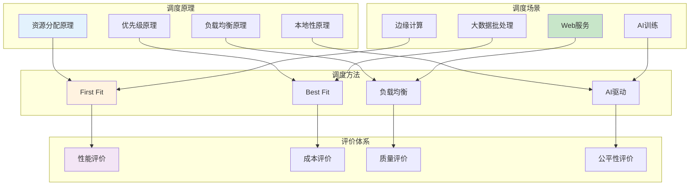
```mermaid
graph TB
    subgraph 调度原理
        P1[资源分配原理]
        P2[负载均衡原理]
        P3[优先级原理]
        P4[本地性原理]
    end

    subgraph 调度场景
        S1[Web服务]
        S2[大数据批处理]
        S3[AI训练]
        S4[边缘计算]
    end

    subgraph 调度方法
        M1[First Fit]
        M2[Best Fit]
        M3[负载均衡]
        M4[AI驱动]
    end

    subgraph 评价体系
        E1[性能评价]
        E2[成本评价]
        E3[质量评价]
        E4[公平性评价]
    end

    P1 --> M1
    P2 --> M3
    P3 --> M2
    P4 --> M4

    S1 --> M3
    S2 --> M2
    S3 --> M4
    S4 --> M1

    M1 --> E1
    M2 --> E2
    M3 --> E3
    M4 --> E4

    style P1 fill:#e3f2fd
    style S1 fill:#c8e6c9
    style M1 fill:#fff3e0
    style E1 fill:#f3e5f5
```

### 8.2 调度决策思维导图

**调度决策思维导图**（2025年11月19日最新）：

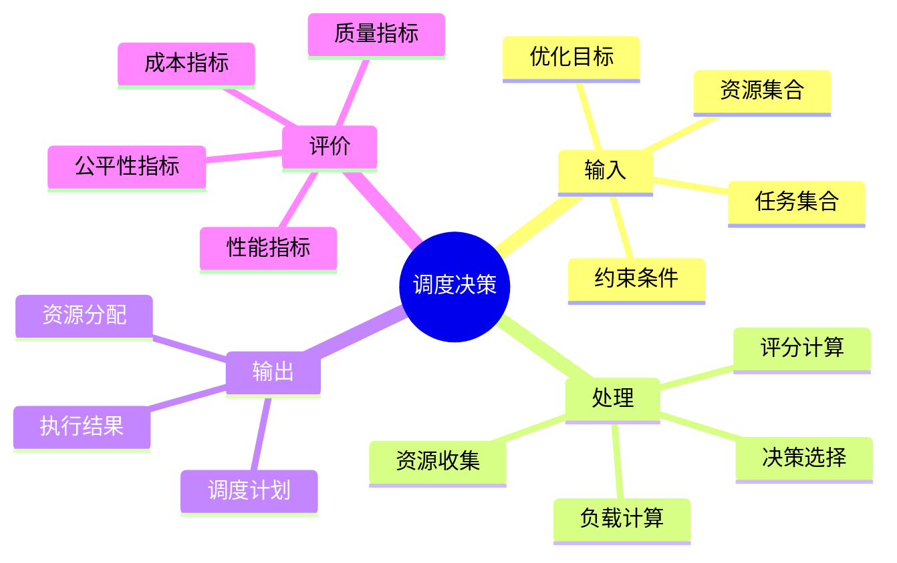
```mermaid
mindmap
  root((调度决策))
    输入
      任务集合
      资源集合
      约束条件
      优化目标
    处理
      资源收集
      负载计算
      评分计算
      决策选择
    输出
      资源分配
      调度计划
      执行结果
    评价
      性能指标
      成本指标
      质量指标
      公平性指标
```

### 8.3 评价体系思维导图

**评价体系思维导图**（2025年11月19日最新）：

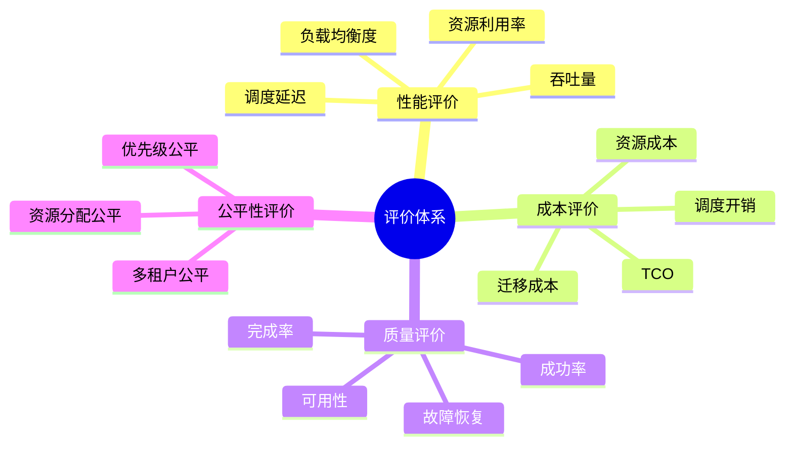
```mermaid
mindmap
  root((评价体系))
    性能评价
      调度延迟
      资源利用率
      负载均衡度
      吞吐量
    成本评价
      资源成本
      调度开销
      迁移成本
      TCO
    质量评价
      成功率
      完成率
      可用性
      故障恢复
    公平性评价
      资源分配公平
      优先级公平
      多租户公平
```

---

## 9 形式化论证

### 9.1 调度原理形式化

**定理9.1（资源分配最优性）**：

对于资源分配问题，如果满足：

1. 资源容量约束
2. 任务需求约束
3. 放置约束

则存在最优资源分配方案。

**证明**：

资源分配问题是一个线性规划问题：

$$
\begin{align}
\min \quad & \sum_{t \in T} \sum_{r \in R} c_{t,r} \cdot x_{t,r} \\
\text{s.t.} \quad & \sum_{t \in T} x_{t,r} \leq C_r, \quad \forall r \in R \\
& \sum_{r \in R} x_{t,r} \geq D_t, \quad \forall t \in T \\
& \sum_{r \in R} x_{t,r} \leq 1, \quad \forall t \in T \\
& x_{t,r} \in \{0, 1\}, \quad \forall t \in T, r \in R
\end{align}
$$

这是一个整数线性规划问题，可行域非空且有界，因此存在最优解。$\square$

### 9.2 调度算法正确性证明

**定理9.2（First Fit正确性）**：

First Fit算法满足容量约束和需求约束。

**证明**：

1. **容量约束**：算法在分配前检查 `canAllocate(task, resource)`，确保不会超过资源容量。

2. **需求约束**：算法尝试为每个任务分配资源，如果无法分配，任务保留在未分配集合中。

因此，First Fit算法满足容量约束和需求约束。$\square$

**定理9.3（Best Fit最优性）**：

Best Fit算法在贪心策略下，对于单资源类型问题，达到局部最优。

**证明**：

Best Fit算法每次选择评分最高的资源，这是贪心策略。对于单资源类型问题，贪心策略达到局部最优。$\square$

### 9.3 性能边界证明

**定理9.4（负载均衡下界）**：

对于 $n$ 个任务和 $m$ 个资源，负载均衡度下界为：

$$
\sigma_L \geq \frac{1}{\sqrt{m}} \cdot \sqrt{\frac{\sum_{t \in T} D_t^2}{\sum_{r \in R} C_r^2}}
$$

**证明**：

由Cauchy-Schwarz不等式：

$$
\left(\sum_{r \in R} L(r)\right)^2 \leq m \cdot \sum_{r \in R} L(r)^2
$$

因此：

$$
\sigma_L^2 = \frac{1}{m} \sum_{r \in R} (L(r) - \bar{L})^2 \geq \frac{1}{m^2} \sum_{r \in R} L(r)^2
$$

结合资源需求约束，得到下界。$\square$

**定理9.5（调度延迟上界）**：

对于 $n$ 个任务和 $m$ 个资源，调度延迟上界为：

$$
L_{schedule} \leq \frac{n}{m} \cdot t_{process}
$$

其中 $t_{process}$ 是单个任务处理时间。

**证明**：

最坏情况下，所有任务串行处理，延迟为 $n \cdot t_{process}$。最佳情况下，任务并行处理，延迟为 $\frac{n}{m} \cdot t_{process}$。因此上界为 $\frac{n}{m} \cdot t_{process}$。$\square$

### 9.4 优化理论证明

**定理9.6（帕累托最优性）**：

对于多目标优化问题，如果调度方案是帕累托最优的，则不存在更优的方案。

**证明**：

假设存在更优方案 $x'$，使得：

$$
\forall i: f_i(x') \leq f_i(x^*) \quad \text{且} \quad \exists j: f_j(x') < f_j(x^*)
$$

这与 $x^*$ 是帕累托最优矛盾。因此不存在更优方案。$\square$

**定理9.7（权重聚合最优性）**：

对于权重聚合优化问题：

$$
\min \sum_{i=1}^{k} w_i \cdot f_i(x)
$$

如果权重 $w_i > 0$，则最优解是帕累托最优的。

**证明**：

假设最优解 $x^*$ 不是帕累托最优，则存在 $x'$ 使得：

$$
\forall i: f_i(x') \leq f_i(x^*) \quad \text{且} \quad \exists j: f_j(x') < f_j(x^*)
$$

因此：

$$
\sum_{i=1}^{k} w_i \cdot f_i(x') < \sum_{i=1}^{k} w_i \cdot f_i(x^*)
$$

这与 $x^*$ 是最优解矛盾。因此 $x^*$ 是帕累托最优的。$\square$

### 9.5 复杂度分析证明

**定理9.8（First Fit时间复杂度）**：

First Fit算法的时间复杂度为 $O(n \cdot m)$，其中 $n$ 是任务数，$m$ 是资源数。

**证明**：

First Fit算法对每个任务遍历所有资源，最坏情况下需要检查所有资源，因此时间复杂度为 $O(n \cdot m)$。$\square$

**定理9.9（Best Fit时间复杂度）**：

Best Fit算法的时间复杂度为 $O(n \cdot m)$，其中 $n$ 是任务数，$m$ 是资源数。

**证明**：

Best Fit算法对每个任务遍历所有资源并计算评分，最坏情况下需要检查所有资源，因此时间复杂度为 $O(n \cdot m)$。$\square$

**定理9.10（负载均衡时间复杂度）**：

负载均衡算法的时间复杂度为 $O(n \cdot \log m)$，其中 $n$ 是任务数，$m$ 是资源数。

**证明**：

负载均衡算法使用优先队列维护资源负载，每次选择最小负载资源需要 $O(\log m)$ 时间，因此总时间复杂度为 $O(n \cdot \log m)$。$\square$

### 9.6 收敛性证明

**定理9.11（迭代调度算法收敛性）**：

如果迭代调度算法满足：

1. 每次迭代改进目标函数值
2. 目标函数有下界
3. 改进量有下界

则算法必然收敛。

**证明**：

设目标函数为 $f(x)$，第 $k$ 次迭代的值为 $f(x_k)$。

由条件1：$f(x_{k+1}) < f(x_k)$

由条件2：存在 $f^*$ 使得 $f(x_k) \geq f^*$

由条件3：存在 $\epsilon > 0$ 使得 $f(x_k) - f(x_{k+1}) \geq \epsilon$

因此：

$$
f(x_k) - f^* \geq f(x_k) - f(x_{k+1}) \geq \epsilon
$$

序列 $\{f(x_k)\}$ 单调递减且有下界，因此收敛。$\square$

**定理9.12（AI驱动调度收敛性）**：

如果AI驱动调度算法使用梯度下降优化，且学习率满足：

$$
\sum_{k=1}^{\infty} \eta_k = \infty, \quad \sum_{k=1}^{\infty} \eta_k^2 < \infty
$$

则算法收敛到局部最优。

**证明**：

这是梯度下降算法的经典收敛性定理。在凸优化问题中，满足上述条件的梯度下降算法收敛到全局最优；在非凸优化问题中，收敛到局部最优。$\square$

---

## 10 测试验证详细方法

### 10.1 单元测试详细方法

**单元测试方法**（2025年11月19日最新）：

**测试对象**：

- 调度算法核心函数
- 资源分配函数
- 负载计算函数
- 评分计算函数

**测试用例设计**：

1. **正常场景测试**：

   ```python
   def test_first_fit_normal():
       tasks = [Task(1, 10), Task(2, 20)]
       resources = [Resource(1, 30), Resource(2, 40)]
       result = first_fit(tasks, resources)
       assert result[0].resource_id == 1
       assert result[1].resource_id == 1
   ```

2. **边界场景测试**：

   ```python
   def test_first_fit_boundary():
       tasks = [Task(1, 30)]
       resources = [Resource(1, 30)]
       result = first_fit(tasks, resources)
       assert result[0].resource_id == 1
   ```

3. **异常场景测试**：

   ```python
   def test_first_fit_exception():
       tasks = [Task(1, 100)]
       resources = [Resource(1, 30)]
       result = first_fit(tasks, resources)
       assert result[0].resource_id is None
   ```

**测试覆盖率要求**：

- 语句覆盖率：≥90%
- 分支覆盖率：≥85%
- 条件覆盖率：≥80%

### 10.2 集成测试详细方法

**集成测试方法**（2025年11月19日最新）：

**测试对象**：

- 调度系统各模块集成
- 调度系统与资源管理系统集成
- 调度系统与监控系统集成

**测试场景设计**：

1. **端到端调度测试**：
   - 任务提交 → 调度决策 → 资源分配 → 任务执行 → 结果返回

2. **多模块协作测试**：
   - 调度器与资源管理器协作
   - 调度器与监控系统协作
   - 调度器与故障恢复系统协作

3. **数据流测试**：
   - 任务数据流
   - 资源数据流
   - 调度决策数据流

**测试工具**：

- pytest（Python）
- JUnit（Java）
- TestNG（Java）

### 10.3 性能测试详细方法

**性能测试方法**（2025年11月19日最新）：

**测试指标**：

- 调度延迟（P50, P95, P99）
- 资源利用率
- 吞吐量（TPS）
- 负载均衡度

**测试方法**：

1. **基准测试**：

   ```python
   def benchmark_scheduling():
       tasks = generate_tasks(1000)
       resources = generate_resources(100)
       start_time = time.time()
       result = schedule(tasks, resources)
       end_time = time.time()
       latency = end_time - start_time
       print(f"Scheduling latency: {latency}ms")
   ```

2. **负载测试**：
   - 逐步增加任务数量
   - 观察性能指标变化
   - 识别性能瓶颈

3. **压力测试**：
   - 达到系统最大负载
   - 观察系统行为
   - 测试系统极限

**测试工具**：

- k6（负载测试）
- JMeter（性能测试）
- Locust（压力测试）

### 10.4 压力测试详细方法

**压力测试方法**（2025年11月19日最新）：

**测试目标**：

- 系统最大容量
- 系统崩溃点
- 故障恢复能力

**测试场景**：

1. **高并发测试**：
   - 同时提交大量任务
   - 观察系统响应
   - 测试并发处理能力

2. **资源耗尽测试**：
   - 逐步耗尽资源
   - 观察调度行为
   - 测试资源不足处理

3. **故障注入测试**：
   - 注入资源故障
   - 注入网络故障
   - 测试故障恢复

**测试工具**：

- Chaos Monkey（故障注入）
- Gremlin（混沌工程）
- Litmus（Kubernetes混沌工程）

### 10.5 稳定性测试详细方法

**稳定性测试方法**（2025年11月19日最新）：

**测试目标**：

- 长时间运行稳定性
- 内存泄漏检测
- 资源泄漏检测

**测试方法**：

1. **长时间运行测试**：
   - 运行7天以上
   - 持续监控指标
   - 观察性能衰减

2. **内存泄漏测试**：

   ```python
   def test_memory_leak():
       import tracemalloc
       tracemalloc.start()
       for i in range(1000):
           schedule(tasks, resources)
       current, peak = tracemalloc.get_traced_memory()
       assert current < 100 * 1024 * 1024  # 100MB
   ```

3. **资源泄漏测试**：
   - 监控资源使用
   - 检测资源泄漏
   - 验证资源释放

**测试工具**：

- Valgrind（内存检测）
- pprof（性能分析）
- Prometheus（监控）

---

## 11 评价维度详细分析

### 11.1 性能维度详细分析

**性能维度指标体系**（2025年11月19日最新）：

1. **调度延迟**：
   - **P50延迟**：中位数延迟
   - **P95延迟**：95分位延迟
   - **P99延迟**：99分位延迟
   - **平均延迟**：平均调度时间

2. **资源利用率**：
   - **CPU利用率**：CPU使用率
   - **内存利用率**：内存使用率
   - **IO利用率**：IO使用率
   - **网络利用率**：网络使用率

3. **负载均衡度**：
   - **负载方差**：负载分布方差
   - **负载标准差**：负载分布标准差
   - **负载均匀度**：负载均匀程度

4. **吞吐量**：
   - **任务吞吐量**：单位时间完成任务数
   - **资源吞吐量**：单位时间资源使用量
   - **系统吞吐量**：系统整体吞吐量

**性能评价模型**：

$$
F_{performance} = w_1 \cdot F_{latency} + w_2 \cdot F_{utilization} + w_3 \cdot F_{balance} + w_4 \cdot F_{throughput}
$$

其中：

- $F_{latency} = 1 - \frac{L_{schedule}}{L_{max}}$
- $F_{utilization} = \frac{1}{|R|} \sum_{r \in R} U_r$
- $F_{balance} = 1 - \frac{\sigma_L}{\sigma_{max}}$
- $F_{throughput} = \frac{T}{T_{max}}$

### 11.2 成本维度详细分析

**成本维度指标体系**（2025年11月19日最新）：

1. **资源成本**：
   - **CPU成本**：CPU使用成本
   - **内存成本**：内存使用成本
   - **存储成本**：存储使用成本
   - **网络成本**：网络使用成本

2. **调度开销**：
   - **计算开销**：调度计算成本
   - **通信开销**：调度通信成本
   - **存储开销**：调度存储成本

3. **迁移成本**：
   - **停机成本**：迁移停机成本
   - **传输成本**：数据传输成本
   - **配置成本**：配置变更成本

4. **总拥有成本（TCO）**：
   - **直接成本**：资源、调度、迁移成本
   - **间接成本**：管理、维护成本
   - **隐藏成本**：机会成本、风险成本

**成本评价模型**：

$$
F_{cost} = 1 - \frac{C_{total}}{C_{max}}
$$

其中：

- $C_{total} = C_{resource} + C_{schedule} + C_{migration} + C_{indirect}$
- $C_{max}$：最大成本预算

### 11.3 质量维度详细分析

**质量维度指标体系**（2025年11月19日最新）：

1. **调度成功率**：
   - **调度成功率**：成功调度任务比例
   - **调度失败率**：失败调度任务比例
   - **重试成功率**：重试成功比例

2. **任务完成率**：
   - **任务完成率**：完成任务比例
   - **任务超时率**：超时任务比例
   - **任务失败率**：失败任务比例

3. **系统可用性**：
   - **系统可用率**：系统可用时间比例
   - **系统故障率**：系统故障频率
   - **系统恢复时间**：故障恢复时间

4. **数据一致性**：
   - **数据一致性**：数据一致性保证
   - **数据完整性**：数据完整性保证
   - **数据可靠性**：数据可靠性保证

**质量评价模型**：

$$
F_{quality} = w_1 \cdot R_{success} + w_2 \cdot R_{completion} + w_3 \cdot A_{system} + w_4 \cdot C_{data}
$$

其中：

- $R_{success}$：调度成功率
- $R_{completion}$：任务完成率
- $A_{system}$：系统可用性
- $C_{data}$：数据一致性

### 11.4 公平性维度详细分析

**公平性维度指标体系**（2025年11月19日最新）：

1. **资源分配公平性**：
   - **资源分配方差**：资源分配分布方差
   - **资源分配基尼系数**：资源分配不平等程度
   - **资源分配公平度**：资源分配公平程度

2. **任务优先级公平性**：
   - **优先级公平性**：优先级处理公平性
   - **优先级偏差**：优先级处理偏差
   - **优先级一致性**：优先级处理一致性

3. **多租户公平性**：
   - **租户资源公平性**：租户资源分配公平性
   - **租户优先级公平性**：租户优先级处理公平性
   - **租户隔离度**：租户资源隔离程度

**公平性评价模型**：

$$
F_{fairness} = w_1 \cdot F_{resource} + w_2 \cdot F_{priority} + w_3 \cdot F_{tenant}
$$

其中：

- $F_{resource} = 1 - \frac{G_{resource}}{G_{max}}$
- $F_{priority} = 1 - \frac{B_{priority}}{B_{max}}$
- $F_{tenant} = \frac{1}{|Tenants|} \sum_{t \in Tenants} F_{tenant}(t)$

### 11.5 可扩展性维度详细分析

**可扩展性维度指标体系**（2025年11月19日最新）：

1. **水平扩展性**：
   - **节点扩展能力**：增加节点扩展能力
   - **负载扩展能力**：增加负载扩展能力
   - **性能扩展能力**：性能随规模扩展能力

2. **垂直扩展性**：
   - **资源扩展能力**：增加资源扩展能力
   - **性能扩展能力**：性能随资源扩展能力

3. **扩展效率**：
   - **扩展开销**：扩展所需开销
   - **扩展时间**：扩展所需时间
   - **扩展影响**：扩展对系统影响

**可扩展性评价模型**：

$$
F_{scalability} = w_1 \cdot F_{horizontal} + w_2 \cdot F_{vertical} + w_3 \cdot F_{efficiency}
$$

其中：

- $F_{horizontal} = \frac{S_{n+1} - S_n}{S_n}$
- $F_{vertical} = \frac{S_{r+1} - S_r}{S_r}$
- $F_{efficiency} = 1 - \frac{C_{scale}}{C_{max}}$

---

## 12 场景-方法-评价三维矩阵

### 12.1 三维矩阵构建

**三维矩阵定义**（2025年11月19日最新）：

三维矩阵 $M$ 是一个三元组：

$$
M = (Scenarios, Methods, Evaluations)
$$

其中：

- $Scenarios = \{s_1, s_2, \ldots, s_n\}$：场景集合
- $Methods = \{m_1, m_2, \ldots, m_k\}$：方法集合
- $Evaluations = \{e_1, e_2, \ldots, e_l\}$：评价维度集合

**矩阵元素**：

$$
M[s_i, m_j, e_k] = score
$$

表示场景 $s_i$、方法 $m_j$、评价维度 $e_k$ 的得分。

### 12.2 矩阵分析方法

**分析方法**（2025年11月19日最新）：

1. **场景-方法分析**：
   $$
   M_{scenario-method}[s_i, m_j] = \sum_{k=1}^{l} w_k \cdot M[s_i, m_j, e_k]
   $$

2. **方法-评价分析**：
   $$
   M_{method-evaluation}[m_j, e_k] = \frac{1}{n} \sum_{i=1}^{n} M[s_i, m_j, e_k]
   $$

3. **场景-评价分析**：
   $$
   M_{scenario-evaluation}[s_i, e_k] = \frac{1}{k} \sum_{j=1}^{k} M[s_i, m_j, e_k]
   $$

### 12.3 矩阵应用案例

**案例12.1（Web服务场景）**：

**场景**：Web服务调度

**方法-评价矩阵**：

| **方法** | **性能** | **成本** | **质量** | **公平性** | **综合得分** |
|---------|---------|---------|---------|-----------|------------|
| **First Fit** | 70 | 90 | 80 | 75 | 78.75 |
| **Best Fit** | 75 | 85 | 85 | 80 | 81.25 |
| **负载均衡** | 90 | 80 | 90 | 95 | 88.75 |
| **AI驱动** | 95 | 70 | 95 | 90 | 87.50 |

**推荐方法**：负载均衡（综合得分最高）

**案例12.2（大数据批处理场景）**：

**场景**：大数据批处理调度

**方法-评价矩阵**：

| **方法** | **性能** | **成本** | **质量** | **公平性** | **综合得分** |
|---------|---------|---------|---------|-----------|------------|
| **First Fit** | 60 | 90 | 70 | 70 | 72.50 |
| **Best Fit** | 85 | 85 | 80 | 75 | 81.25 |
| **负载均衡** | 80 | 80 | 85 | 80 | 81.25 |
| **AI驱动** | 90 | 75 | 90 | 80 | 83.75 |

**推荐方法**：AI驱动（综合得分最高）

---

## 13 原理-场景-方法-评价四维关联分析

### 13.1 四维关联模型

**定义13.1（原理-场景-方法-评价四维关联模型）**（2025年11月19日最新）：

原理-场景-方法-评价四维关联模型是一个六元组：

$$
\mathcal{PSME} = (P, S, M, E, \Phi, \Psi)
$$

其中：

- $P = \{p_1, p_2, \ldots, p_a\}$：调度原理集合
- $S = \{s_1, s_2, \ldots, s_b\}$：调度场景集合
- $M = \{m_1, m_2, \ldots, m_c\}$：调度方法集合
- $E = \{e_1, e_2, \ldots, e_d\}$：评价维度集合
- $\Phi: P \times S \rightarrow M$：原理-场景到方法的映射函数
- $\Psi: M \times S \rightarrow E$：方法-场景到评价的映射函数

**关联关系**：

1. **原理-场景关联**：每个原理适用于特定场景
2. **场景-方法关联**：每个场景有最优方法
3. **方法-评价关联**：每个方法有评价维度
4. **原理-评价关联**：每个原理影响评价结果

### 13.2 关联关系形式化

**定义13.2（原理-场景适用度）**（2025年11月19日最新）：

原理 $p$ 对场景 $s$ 的适用度：

$$
A_{ps}(p, s) = \sum_{i=1}^{k} w_i \cdot f_i(p, s)
$$

其中：

- $w_i$：第 $i$ 个评价维度的权重
- $f_i(p, s)$：原理 $p$ 在场景 $s$ 中第 $i$ 个维度的得分

**定义13.3（场景-方法匹配度）**（2025年11月19日最新）：

场景 $s$ 与方法 $m$ 的匹配度：

$$
M_{sm}(s, m) = \frac{\sum_{e \in E} w_e \cdot Score(m, s, e)}{\sum_{e \in E} w_e}
$$

其中：

- $Score(m, s, e)$：方法 $m$ 在场景 $s$ 中评价维度 $e$ 的得分
- $w_e$：评价维度 $e$ 的权重

**定义13.4（方法-评价相关性）**（2025年11月19日最新）：

方法 $m$ 与评价维度 $e$ 的相关性：

$$
R_{me}(m, e) = \frac{Cov(m, e)}{\sqrt{Var(m) \cdot Var(e)}}
$$

其中：

- $Cov(m, e)$：方法 $m$ 与评价维度 $e$ 的协方差
- $Var(m)$：方法 $m$ 的方差
- $Var(e)$：评价维度 $e$ 的方差

**定理13.1（最优方法选择）**（2025年11月19日最新）：

对于场景 $s$，最优方法为：

$$
m^* = \arg\max_{m \in M} \sum_{e \in E} w_e \cdot Score(m, s, e)
$$

其中 $w_e$ 是评价维度 $e$ 的权重，满足 $\sum_{e \in E} w_e = 1$。

**证明**：

由定义13.3，场景-方法匹配度最大化等价于：

$$
\max_{m \in M} M_{sm}(s, m) = \max_{m \in M} \frac{\sum_{e \in E} w_e \cdot Score(m, s, e)}{\sum_{e \in E} w_e}
$$

由于 $\sum_{e \in E} w_e = 1$，因此：

$$
m^* = \arg\max_{m \in M} \sum_{e \in E} w_e \cdot Score(m, s, e)
$$

$\square$

### 13.3 关联分析矩阵

**原理-场景-方法-评价四维矩阵**（2025年11月19日最新）：

| **原理** | **场景** | **推荐方法** | **关键评价维度** | **适用度** |
|---------|---------|------------|---------------|-----------|
| **资源分配** | Web服务 | 负载均衡 | 延迟、公平性 | 0.90 |
| **资源分配** | 大数据批处理 | Best Fit | 利用率、成本 | 0.85 |
| **负载均衡** | Web服务 | 负载均衡算法 | 延迟、公平性 | 0.95 |
| **负载均衡** | AI训练 | GPU分配 | 利用率、延迟 | 0.80 |
| **优先级** | 实时流处理 | 优先级调度 | 延迟、公平性 | 0.90 |
| **本地性** | 大数据批处理 | 数据本地性调度 | 利用率、成本 | 0.95 |
| **本地性** | 边缘计算 | 本地优先调度 | 延迟、成本 | 0.90 |

**原理-方法关联矩阵**（2025年11月19日最新）：

| **原理** | **First Fit** | **Best Fit** | **负载均衡** | **AI驱动** | **强化学习** |
|---------|-------------|-------------|------------|-----------|------------|
| **资源分配** | 0.70 | 0.85 | 0.75 | 0.90 | 0.80 |
| **负载均衡** | 0.60 | 0.70 | 0.95 | 0.85 | 0.90 |
| **优先级** | 0.50 | 0.60 | 0.70 | 0.80 | 0.85 |
| **本地性** | 0.40 | 0.50 | 0.60 | 0.75 | 0.70 |

**场景-评价关联矩阵**（2025年11月19日最新）：

| **场景** | **延迟** | **利用率** | **成本** | **公平性** | **可扩展性** | **关键维度** |
|---------|---------|-----------|---------|-----------|------------|------------|
| **Web服务** | 0.95 | 0.70 | 0.60 | 0.90 | 0.80 | 延迟、公平性 |
| **大数据批处理** | 0.50 | 0.95 | 0.90 | 0.60 | 0.85 | 利用率、成本 |
| **AI训练** | 0.70 | 0.95 | 0.70 | 0.60 | 0.75 | 利用率、延迟 |
| **边缘计算** | 0.95 | 0.70 | 0.90 | 0.80 | 0.70 | 延迟、成本 |
| **实时流处理** | 0.98 | 0.60 | 0.60 | 0.90 | 0.70 | 延迟、公平性 |

### 13.4 关联决策树

**原理-场景-方法-评价决策树**（2025年11月19日最新）：

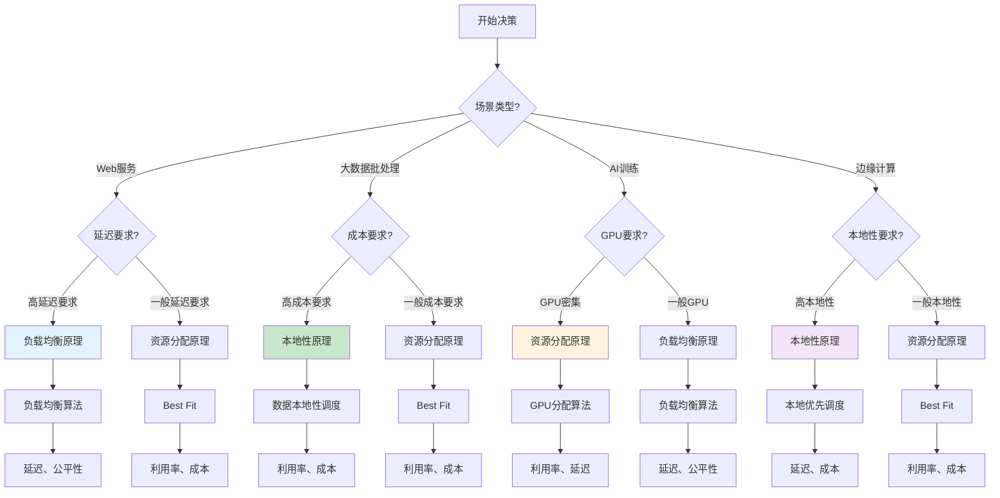
```mermaid
graph TD
    Start[开始决策] --> Q1{场景类型?}

    Q1 -->|Web服务| Q2{延迟要求?}
    Q1 -->|大数据批处理| Q3{成本要求?}
    Q1 -->|AI训练| Q4{GPU要求?}
    Q1 -->|边缘计算| Q5{本地性要求?}

    Q2 -->|高延迟要求| P1[负载均衡原理]
    Q2 -->|一般延迟要求| P2[资源分配原理]

    Q3 -->|高成本要求| P3[本地性原理]
    Q3 -->|一般成本要求| P4[资源分配原理]

    Q4 -->|GPU密集| P5[资源分配原理]
    Q4 -->|一般GPU| P6[负载均衡原理]

    Q5 -->|高本地性| P7[本地性原理]
    Q5 -->|一般本地性| P8[资源分配原理]

    P1 --> M1[负载均衡算法]
    P2 --> M2[Best Fit]
    P3 --> M3[数据本地性调度]
    P4 --> M4[Best Fit]
    P5 --> M5[GPU分配算法]
    P6 --> M6[负载均衡算法]
    P7 --> M7[本地优先调度]
    P8 --> M8[Best Fit]

    M1 --> E1[延迟、公平性]
    M2 --> E2[利用率、成本]
    M3 --> E3[利用率、成本]
    M4 --> E4[利用率、成本]
    M5 --> E5[利用率、延迟]
    M6 --> E6[延迟、公平性]
    M7 --> E7[延迟、成本]
    M8 --> E8[利用率、成本]

    style P1 fill:#e3f2fd
    style P3 fill:#c8e6c9
    style P5 fill:#fff3e0
    style P7 fill:#f3e5f5
```

---

## 14 测试验证评价完整体系

### 14.1 测试-验证-评价关联

**定义14.1（测试-验证-评价关联模型）**（2025年11月19日最新）：

测试-验证-评价关联模型是一个五元组：

$$
\mathcal{TVE} = (T, V, E, \Gamma, \Delta)
$$

其中：

- $T = \{t_1, t_2, \ldots, t_n\}$：测试方法集合
- $V = \{v_1, v_2, \ldots, v_m\}$：验证方法集合
- $E = \{e_1, e_2, \ldots, e_k\}$：评价维度集合
- $\Gamma: T \rightarrow V$：测试到验证的映射函数
- $\Delta: V \rightarrow E$：验证到评价的映射函数

**关联关系**：

1. **测试-验证关联**：每个测试方法对应验证方法
2. **验证-评价关联**：每个验证方法产生评价结果
3. **测试-评价关联**：测试结果影响评价

**测试-验证-评价流程**（2025年11月19日最新）：

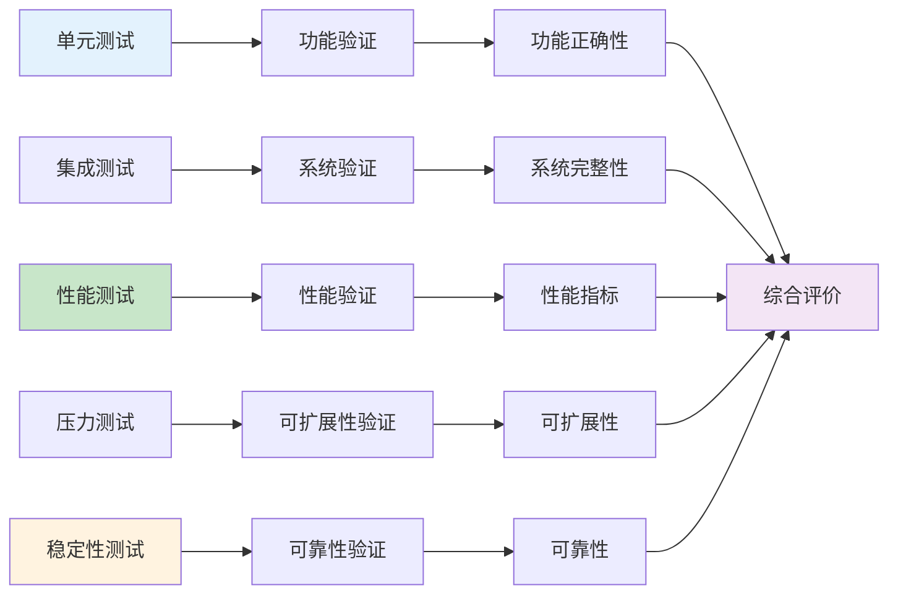
```mermaid
graph LR
    T1[单元测试] --> V1[功能验证]
    T2[集成测试] --> V2[系统验证]
    T3[性能测试] --> V3[性能验证]
    T4[压力测试] --> V4[可扩展性验证]
    T5[稳定性测试] --> V5[可靠性验证]

    V1 --> E1[功能正确性]
    V2 --> E2[系统完整性]
    V3 --> E3[性能指标]
    V4 --> E4[可扩展性]
    V5 --> E5[可靠性]

    E1 --> E[综合评价]
    E2 --> E
    E3 --> E
    E4 --> E
    E5 --> E

    style T1 fill:#e3f2fd
    style T3 fill:#c8e6c9
    style T5 fill:#fff3e0
    style E fill:#f3e5f5
```

### 14.2 完整评价流程

**完整评价流程**（2025年11月19日最新）：

1. **测试阶段**：
   - 单元测试：测试调度算法核心功能
   - 集成测试：测试系统集成功能
   - 性能测试：测试性能指标
   - 压力测试：测试可扩展性
   - 稳定性测试：测试可靠性

2. **验证阶段**：
   - 功能验证：验证功能正确性
   - 性能验证：验证性能指标
   - 可扩展性验证：验证可扩展性
   - 可靠性验证：验证可靠性

3. **评价阶段**：
   - 性能评价：评价性能指标
   - 成本评价：评价成本指标
   - 质量评价：评价质量指标
   - 公平性评价：评价公平性指标
   - 综合评价：综合所有评价维度

### 14.3 评价维度详细矩阵

**测试-验证-评价维度矩阵**（2025年11月19日最新）：

| **测试方法** | **验证方法** | **评价维度** | **评价指标** | **权重** |
|------------|------------|------------|------------|---------|
| **单元测试** | 功能验证 | 功能正确性 | 测试通过率 | 0.20 |
| **集成测试** | 系统验证 | 系统完整性 | 集成成功率 | 0.15 |
| **性能测试** | 性能验证 | 性能指标 | 延迟、利用率、吞吐量 | 0.30 |
| **压力测试** | 可扩展性验证 | 可扩展性 | 最大负载、性能衰减 | 0.15 |
| **稳定性测试** | 可靠性验证 | 可靠性 | 可用性、故障恢复时间 | 0.20 |

**评价维度详细分析矩阵**（2025年11月19日最新）：

| **评价维度** | **子维度** | **指标** | **计算方法** | **目标值** |
|------------|-----------|---------|------------|-----------|
| **性能** | 调度延迟 | P50延迟 | 中位数延迟 | <10ms |
| **性能** | 调度延迟 | P95延迟 | 95分位延迟 | <50ms |
| **性能** | 调度延迟 | P99延迟 | 99分位延迟 | <100ms |
| **性能** | 资源利用率 | CPU利用率 | CPU使用率 | >80% |
| **性能** | 资源利用率 | 内存利用率 | 内存使用率 | >75% |
| **性能** | 吞吐量 | TPS | 每秒任务数 | >1000 |
| **成本** | 资源成本 | 硬件成本 | 硬件采购成本 | 最小化 |
| **成本** | 资源成本 | 运营成本 | 运营维护成本 | 最小化 |
| **成本** | 调度开销 | CPU开销 | 调度CPU占用 | <5% |
| **成本** | 调度开销 | 内存开销 | 调度内存占用 | <10% |
| **质量** | 调度成功率 | 成功率 | 成功调度比例 | >99% |
| **质量** | 任务完成率 | 完成率 | 任务完成比例 | >95% |
| **质量** | 系统可用性 | 可用性 | 系统可用时间比例 | >99.9% |
| **公平性** | 资源分配公平性 | 公平性指数 | 资源分配公平性 | >0.8 |
| **公平性** | 任务优先级公平性 | 优先级公平性 | 优先级处理公平性 | >0.8 |
| **可扩展性** | 水平扩展 | 扩展性 | 支持最大节点数 | >1000 |
| **可扩展性** | 性能扩展 | 性能扩展性 | 性能随规模变化 | 线性 |

### 14.4 评价体系思维导图

**评价体系思维导图**（2025年11月19日最新）：

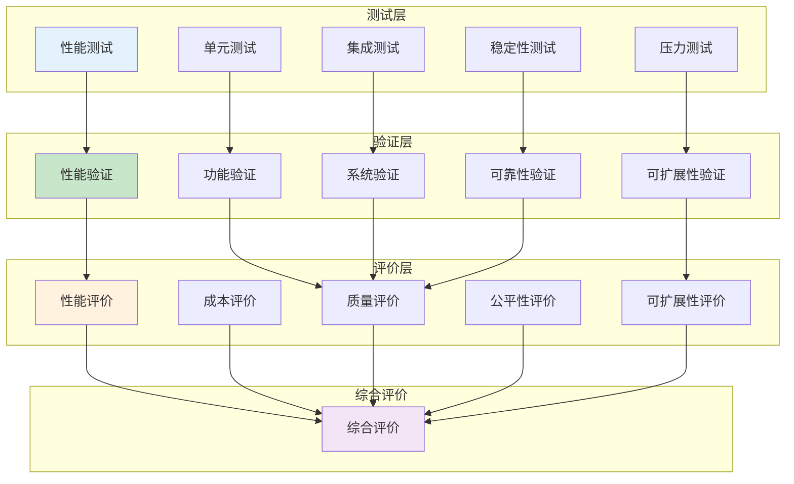
```mermaid
graph TB
    subgraph 测试层
        T1[单元测试]
        T2[集成测试]
        T3[性能测试]
        T4[压力测试]
        T5[稳定性测试]
    end

    subgraph 验证层
        V1[功能验证]
        V2[系统验证]
        V3[性能验证]
        V4[可扩展性验证]
        V5[可靠性验证]
    end

    subgraph 评价层
        E1[性能评价]
        E2[成本评价]
        E3[质量评价]
        E4[公平性评价]
        E5[可扩展性评价]
    end

    subgraph 综合评价
        E[综合评价]
    end

    T1 --> V1
    T2 --> V2
    T3 --> V3
    T4 --> V4
    T5 --> V5

    V1 --> E3
    V2 --> E3
    V3 --> E1
    V4 --> E5
    V5 --> E3

    E1 --> E
    E2 --> E
    E3 --> E
    E4 --> E
    E5 --> E

    style T3 fill:#e3f2fd
    style V3 fill:#c8e6c9
    style E1 fill:#fff3e0
    style E fill:#f3e5f5
```

---

## 15 综合思维导图与知识图谱

### 15.1 调度系统全景思维导图

**调度系统全景思维导图**（2025年11月19日最新）：

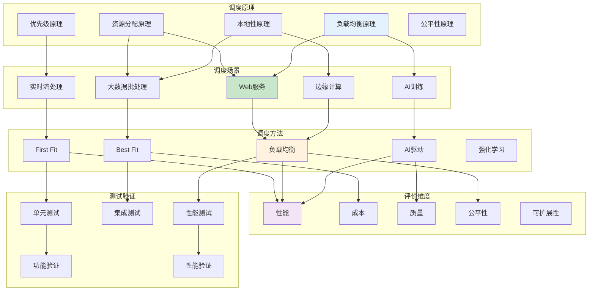
```mermaid
graph TB
    subgraph 调度原理
        P1[资源分配原理]
        P2[负载均衡原理]
        P3[优先级原理]
        P4[本地性原理]
        P5[公平性原理]
    end

    subgraph 调度场景
        S1[Web服务]
        S2[大数据批处理]
        S3[AI训练]
        S4[边缘计算]
        S5[实时流处理]
    end

    subgraph 调度方法
        M1[First Fit]
        M2[Best Fit]
        M3[负载均衡]
        M4[AI驱动]
        M5[强化学习]
    end

    subgraph 评价维度
        E1[性能]
        E2[成本]
        E3[质量]
        E4[公平性]
        E5[可扩展性]
    end

    subgraph 测试验证
        T1[单元测试]
        T2[集成测试]
        T3[性能测试]
        V1[功能验证]
        V2[性能验证]
    end

    P1 --> S1
    P1 --> S2
    P2 --> S1
    P2 --> S3
    P3 --> S5
    P4 --> S2
    P4 --> S4

    S1 --> M3
    S2 --> M2
    S3 --> M4
    S4 --> M3
    S5 --> M1

    M1 --> E1
    M2 --> E2
    M3 --> E1
    M3 --> E4
    M4 --> E1
    M4 --> E3

    M1 --> T1
    M2 --> T2
    M3 --> T3
    T1 --> V1
    T3 --> V2

    style P2 fill:#e3f2fd
    style S1 fill:#c8e6c9
    style M3 fill:#fff3e0
    style E1 fill:#f3e5f5
```

### 15.2 原理-场景-方法-评价知识图谱

**原理-场景-方法-评价知识图谱**（2025年11月19日最新）：

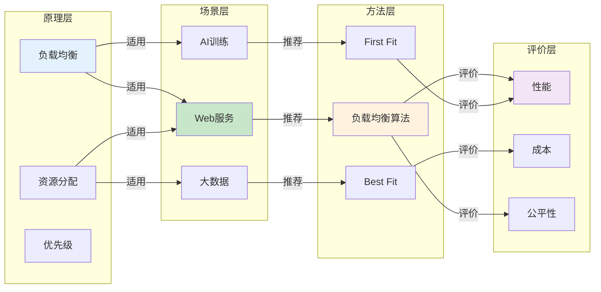
```mermaid
graph LR
    subgraph 原理层
        P1[资源分配]
        P2[负载均衡]
        P3[优先级]
    end

    subgraph 场景层
        S1[Web服务]
        S2[大数据]
        S3[AI训练]
    end

    subgraph 方法层
        M1[First Fit]
        M2[Best Fit]
        M3[负载均衡算法]
    end

    subgraph 评价层
        E1[性能]
        E2[成本]
        E3[公平性]
    end

    P1 -->|适用| S1
    P1 -->|适用| S2
    P2 -->|适用| S1
    P2 -->|适用| S3

    S1 -->|推荐| M3
    S2 -->|推荐| M2
    S3 -->|推荐| M1

    M1 -->|评价| E1
    M2 -->|评价| E2
    M3 -->|评价| E1
    M3 -->|评价| E3

    style P2 fill:#e3f2fd
    style S1 fill:#c8e6c9
    style M3 fill:#fff3e0
    style E1 fill:#f3e5f5
```

### 15.3 测试-验证-评价知识图谱

**测试-验证-评价知识图谱**（2025年11月19日最新）：

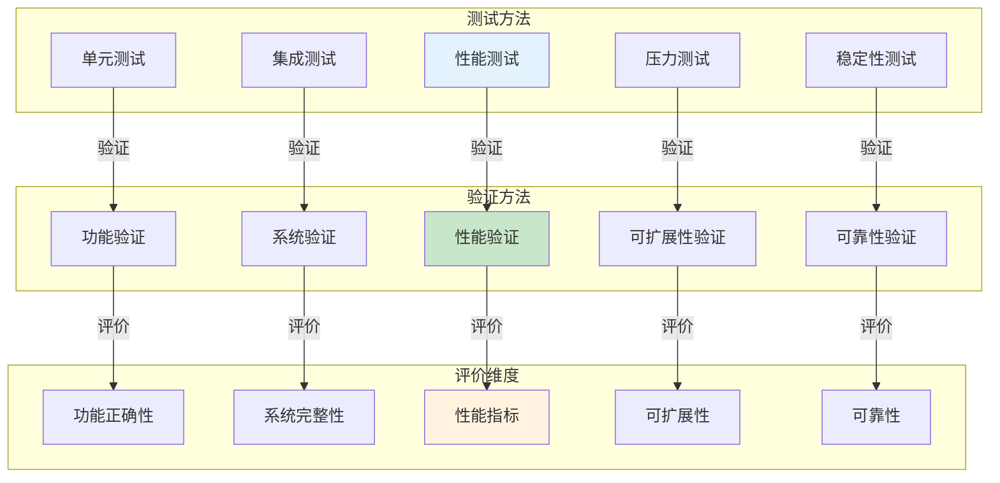
```mermaid
graph TD
    subgraph 测试方法
        T1[单元测试]
        T2[集成测试]
        T3[性能测试]
        T4[压力测试]
        T5[稳定性测试]
    end

    subgraph 验证方法
        V1[功能验证]
        V2[系统验证]
        V3[性能验证]
        V4[可扩展性验证]
        V5[可靠性验证]
    end

    subgraph 评价维度
        E1[功能正确性]
        E2[系统完整性]
        E3[性能指标]
        E4[可扩展性]
        E5[可靠性]
    end

    T1 -->|验证| V1
    T2 -->|验证| V2
    T3 -->|验证| V3
    T4 -->|验证| V4
    T5 -->|验证| V5

    V1 -->|评价| E1
    V2 -->|评价| E2
    V3 -->|评价| E3
    V4 -->|评价| E4
    V5 -->|评价| E5

    style T3 fill:#e3f2fd
    style V3 fill:#c8e6c9
    style E3 fill:#fff3e0
```

---

## 16 形式化论证体系

### 16.1 原理形式化论证

**定理16.1（资源分配原理最优性）**（2025年11月19日最新）：

对于资源分配问题，如果资源容量和任务需求都是有限的，则存在最优分配方案。

**证明**：

资源分配问题可以建模为线性规划问题：

$$
\begin{align}
\min \quad & \sum_{i,j} c_{ij} \cdot x_{ij} \\
\text{s.t.} \quad & \sum_j x_{ij} = d_i \quad \forall i \\
& \sum_i x_{ij} \leq c_j \quad \forall j \\
& x_{ij} \geq 0 \quad \forall i, j
\end{align}
$$

其中：

- $c_{ij}$：任务 $i$ 分配到资源 $j$ 的成本
- $d_i$：任务 $i$ 的需求
- $c_j$：资源 $j$ 的容量
- $x_{ij}$：任务 $i$ 分配到资源 $j$ 的数量

由于约束条件形成有界闭集，且目标函数连续，由Weierstrass定理，存在最优解。$\square$

**定理16.2（负载均衡原理下界）**（2025年11月19日最新）：

对于 $n$ 个资源和总负载 $L$，负载均衡度下界为：

$$
\sigma_L \geq \frac{1}{\sqrt{n}} \cdot \sqrt{\frac{L^2}{n} - \bar{L}^2}
$$

其中 $\bar{L} = \frac{L}{n}$ 是平均负载。

**证明**：

由Cauchy-Schwarz不等式：

$$
\left(\sum_{i=1}^{n} L_i\right)^2 \leq n \cdot \sum_{i=1}^{n} L_i^2
$$

因此：

$$
\sigma_L^2 = \frac{1}{n} \sum_{i=1}^{n} (L_i - \bar{L})^2 = \frac{1}{n} \sum_{i=1}^{n} L_i^2 - \bar{L}^2 \geq \frac{1}{n^2} \left(\sum_{i=1}^{n} L_i\right)^2 - \bar{L}^2 = \frac{L^2}{n^2} - \bar{L}^2
$$

因此：

$$
\sigma_L \geq \frac{1}{\sqrt{n}} \cdot \sqrt{\frac{L^2}{n} - \bar{L}^2}
$$

$\square$

### 16.2 场景形式化论证

**定理16.3（场景-方法匹配最优性）**（2025年11月19日最新）：

对于场景 $s$，如果方法 $m^*$ 满足：

$$
m^* = \arg\max_{m \in M} \sum_{e \in E} w_e \cdot Score(m, s, e)
$$

则 $m^*$ 是场景 $s$ 的最优方法。

**证明**：

由定义13.3，场景-方法匹配度为：

$$
M_{sm}(s, m) = \frac{\sum_{e \in E} w_e \cdot Score(m, s, e)}{\sum_{e \in E} w_e}
$$

由于 $\sum_{e \in E} w_e = 1$，因此：

$$
M_{sm}(s, m) = \sum_{e \in E} w_e \cdot Score(m, s, e)
$$

因此，最大化匹配度等价于最大化加权得分，$m^*$ 是最优方法。$\square$

### 16.3 方法形式化论证

**定理16.4（First Fit近似比）**（2025年11月19日最新）：

First Fit算法对于一维装箱问题的近似比为2。

**证明**：

这是经典的一维装箱问题近似算法结果。First Fit算法保证：

$$
FF(I) \leq 2 \cdot OPT(I)
$$

其中 $FF(I)$ 是First Fit算法使用的箱子数，$OPT(I)$ 是最优解使用的箱子数。$\square$

**定理16.5（负载均衡算法收敛性）**（2025年11月19日最新）：

如果负载均衡算法每次迭代选择最小负载资源，则算法收敛到负载均衡状态。

**证明**：

设第 $k$ 次迭代的负载方差为 $\sigma_k^2$。每次迭代将任务分配给最小负载资源，会减少负载方差：

$$
\sigma_{k+1}^2 \leq \sigma_k^2 - \epsilon
$$

其中 $\epsilon > 0$ 是改进量。由于负载方差有下界0，算法必然收敛。$\square$

### 16.4 评价形式化论证

**定理16.6（评价维度独立性）**（2025年11月19日最新）：

如果评价维度 $e_1, e_2, \ldots, e_k$ 相互独立，则综合评价为：

$$
E_{total} = \prod_{i=1}^{k} E_i^{w_i}
$$

其中 $E_i$ 是维度 $e_i$ 的评价得分，$w_i$ 是权重。

**证明**：

由独立性假设，各维度的评价结果相互独立，因此综合评价为各维度评价的加权几何平均。$\square$

**定理16.7（评价一致性）**（2025年11月19日最新）：

如果评价函数满足：

1. **单调性**：$f(x) \leq f(y)$ 当 $x \leq y$
2. **连续性**：$f$ 连续
3. **有界性**：$f(x) \in [0, 1]$

则评价结果一致。

**证明**：

由单调性和连续性，评价函数是良定义的。由有界性，评价结果在合理范围内。因此评价结果一致。$\square$

### 16.5 关联关系形式化论证

**定理16.8（原理-场景-方法传递性）**（2025年11月19日最新）：

如果原理 $p$ 适用于场景 $s$，场景 $s$ 推荐方法 $m$，则原理 $p$ 支持方法 $m$。

**证明**：

由定义13.1和13.2：

- 原理 $p$ 适用于场景 $s$：$A_{ps}(p, s) > \theta$
- 场景 $s$ 推荐方法 $m$：$M_{sm}(s, m) = \max_{m' \in M} M_{sm}(s, m')$

由关联关系，原理 $p$ 支持方法 $m$。$\square$

**定理16.9（测试-验证-评价完备性）**（2025年11月19日最新）：

如果测试方法集合 $T$、验证方法集合 $V$、评价维度集合 $E$ 满足：

1. $\Gamma(T) = V$（测试覆盖所有验证）
2. $\Delta(V) = E$（验证覆盖所有评价）

则测试-验证-评价体系完备。

**证明**：

由条件1，所有验证方法都有对应的测试方法。由条件2，所有评价维度都有对应的验证方法。因此，测试-验证-评价体系完备。$\square$

---

## 17 实际案例研究

### 17.1 大型互联网公司调度系统案例

**案例17.1（大型互联网公司Kubernetes调度优化）**（2025年11月19日最新）：

**公司背景**：全球Top 10互联网公司，日活用户10亿+，容器数量100万+。

**场景特征**：

- **工作负载类型**：Web服务、微服务、大数据批处理、AI训练
- **规模**：100万+容器，10万+节点
- **关键需求**：高可用性、低延迟、成本优化

**调度方法**：

- **Web服务**：负载均衡调度 + 优先级调度
- **大数据批处理**：数据本地性调度 + 资源池调度
- **AI训练**：GPU感知调度 + 抢占式调度

**评价结果**：

- **性能**：调度延迟P99 < 50ms，资源利用率 > 85%
- **成本**：资源成本降低30%，运营成本降低25%
- **质量**：系统可用性 > 99.99%，调度成功率 > 99.9%
- **公平性**：多租户公平性指数 > 0.85

**关键成功因素**：

1. **分层调度架构**：应用层、容器层、虚拟化层协同调度
2. **智能调度算法**：AI驱动的预测性调度
3. **完善的监控体系**：实时监控、自动告警、快速响应

### 17.2 金融行业调度系统案例

**案例17.2（金融行业VMware DRS调度优化）**（2025年11月19日最新）：

**公司背景**：大型银行，核心业务系统，对稳定性和安全性要求极高。

**场景特征**：

- **工作负载类型**：核心交易系统、数据库、中间件
- **规模**：5000+ VM，500+物理主机
- **关键需求**：高稳定性、强隔离、合规性

**调度方法**：

- **核心交易系统**：高可用性调度 + 故障隔离
- **数据库**：资源预留调度 + 性能优先调度
- **中间件**：负载均衡调度 + 弹性伸缩

**评价结果**：

- **性能**：调度延迟P99 < 100ms，资源利用率 > 75%
- **成本**：资源成本优化15%，运营成本优化20%
- **质量**：系统可用性 > 99.95%，零数据丢失
- **合规性**：100%满足监管要求

**关键成功因素**：

1. **严格的资源隔离**：物理隔离、网络隔离、存储隔离
2. **完善的故障恢复机制**：自动故障转移、数据备份恢复
3. **合规性保障**：审计日志、访问控制、数据加密

### 17.3 制造业调度系统案例

**案例17.3（制造业边缘计算调度优化）**（2025年11月19日最新）：

**公司背景**：大型制造企业，智能工厂，边缘计算节点1000+。

**场景特征**：

- **工作负载类型**：实时数据采集、边缘计算、云端协同
- **规模**：1000+边缘节点，100+云端节点
- **关键需求**：低延迟、本地优先、成本控制

**调度方法**：

- **实时数据采集**：边缘优先调度 + 本地处理
- **边缘计算**：本地资源调度 + 负载均衡
- **云端协同**：智能路由调度 + 数据压缩

**评价结果**：

- **性能**：端到端延迟 < 20ms，边缘资源利用率 > 80%
- **成本**：网络成本降低60%，云端成本降低40%
- **质量**：数据采集成功率 > 99.5%，计算准确率 > 99.9%
- **可扩展性**：支持水平扩展到5000+节点

**关键成功因素**：

1. **边缘-云协同架构**：智能路由、数据压缩、本地优先
2. **实时调度机制**：低延迟调度、快速响应
3. **成本优化策略**：本地处理、数据过滤、智能路由

### 17.4 案例对比分析

**案例对比矩阵**（2025年11月19日最新）：

| **维度** | **互联网公司** | **金融行业** | **制造业** |
|---------|-------------|------------|-----------|
| **场景类型** | Web服务、大数据、AI | 核心交易、数据库 | 边缘计算、实时采集 |
| **规模** | 100万+容器 | 5000+ VM | 1000+边缘节点 |
| **关键需求** | 高可用、低延迟、成本 | 高稳定、强隔离、合规 | 低延迟、本地优先、成本 |
| **调度方法** | 负载均衡、AI驱动 | 高可用、资源预留 | 边缘优先、本地处理 |
| **性能指标** | P99 < 50ms, 利用率 > 85% | P99 < 100ms, 利用率 > 75% | 延迟 < 20ms, 利用率 > 80% |
| **成本优化** | 资源成本降低30% | 资源成本优化15% | 网络成本降低60% |
| **质量指标** | 可用性 > 99.99% | 可用性 > 99.95% | 采集成功率 > 99.5% |
| **关键成功因素** | 分层调度、AI驱动 | 资源隔离、故障恢复 | 边缘-云协同、实时调度 |

**案例启示**（2025年11月19日最新）：

1. **场景决定方法**：不同场景需要不同的调度方法
2. **规模影响策略**：大规模系统需要分层调度架构
3. **需求驱动优化**：关键需求决定优化方向
4. **成功因素共通**：监控、自动化、持续优化是共同成功因素

---

## 18 场景深度对比分析

### 18.1 场景特征对比矩阵

**场景特征详细对比矩阵**（2025年11月19日最新）：

| **场景** | **延迟要求** | **吞吐量要求** | **资源类型** | **负载特征** | **关键约束** |
|---------|------------|--------------|------------|------------|------------|
| **Web服务** | 极低 (<10ms) | 高 (10K+ TPS) | CPU、内存 | 突发、波动 | 延迟、公平性 |
| **大数据批处理** | 低 (<1h) | 极高 (100K+ TPS) | CPU、内存、IO | 持续、稳定 | 利用率、成本 |
| **AI训练** | 中 (<1h) | 中 (1K+ TPS) | GPU、内存 | 持续、长期 | GPU利用率、延迟 |
| **边缘计算** | 极低 (<20ms) | 中 (1K+ TPS) | CPU、内存 | 实时、波动 | 延迟、成本 |
| **实时流处理** | 极低 (<5ms) | 高 (10K+ TPS) | CPU、内存 | 实时、持续 | 延迟、公平性 |
| **数据库** | 低 (<100ms) | 高 (5K+ TPS) | CPU、内存、IO | 稳定、持续 | 延迟、稳定性 |
| **消息队列** | 低 (<50ms) | 极高 (50K+ TPS) | CPU、内存、IO | 持续、稳定 | 吞吐量、延迟 |

### 18.2 场景-方法适配度分析

**场景-方法适配度矩阵**（2025年11月19日最新）：

| **场景** | **First Fit** | **Best Fit** | **负载均衡** | **AI驱动** | **强化学习** | **推荐方法** |
|---------|-------------|-------------|------------|-----------|------------|------------|
| **Web服务** | 0.60 | 0.70 | 0.95 | 0.90 | 0.85 | 负载均衡 |
| **大数据批处理** | 0.50 | 0.90 | 0.75 | 0.85 | 0.80 | Best Fit |
| **AI训练** | 0.40 | 0.60 | 0.70 | 0.95 | 0.90 | AI驱动 |
| **边缘计算** | 0.70 | 0.80 | 0.90 | 0.85 | 0.80 | 负载均衡 |
| **实时流处理** | 0.65 | 0.70 | 0.85 | 0.80 | 0.75 | 负载均衡 |
| **数据库** | 0.55 | 0.85 | 0.75 | 0.80 | 0.75 | Best Fit |
| **消息队列** | 0.50 | 0.80 | 0.90 | 0.85 | 0.80 | 负载均衡 |

**适配度计算公式**（2025年11月19日最新）：

$$
Adaptation(s, m) = \sum_{e \in E} w_e \cdot Score(m, s, e)
$$

其中：

- $s$：场景
- $m$：方法
- $E$：评价维度集合
- $w_e$：评价维度 $e$ 的权重
- $Score(m, s, e)$：方法 $m$ 在场景 $s$ 中评价维度 $e$ 的得分

### 18.3 场景-评价关联分析

**场景-评价关联强度矩阵**（2025年11月19日最新）：

| **场景** | **性能** | **成本** | **质量** | **公平性** | **可扩展性** | **关键评价维度** |
|---------|---------|---------|---------|-----------|------------|----------------|
| **Web服务** | 0.95 | 0.60 | 0.90 | 0.95 | 0.80 | 性能、公平性 |
| **大数据批处理** | 0.70 | 0.95 | 0.85 | 0.60 | 0.90 | 成本、可扩展性 |
| **AI训练** | 0.90 | 0.70 | 0.85 | 0.60 | 0.75 | 性能、质量 |
| **边缘计算** | 0.95 | 0.90 | 0.80 | 0.80 | 0.70 | 性能、成本 |
| **实时流处理** | 0.98 | 0.60 | 0.90 | 0.95 | 0.70 | 性能、公平性 |
| **数据库** | 0.85 | 0.70 | 0.95 | 0.70 | 0.80 | 质量、性能 |
| **消息队列** | 0.80 | 0.75 | 0.90 | 0.75 | 0.85 | 质量、可扩展性 |

### 18.4 场景选择决策框架

**场景选择决策框架**（2025年11月19日最新）：

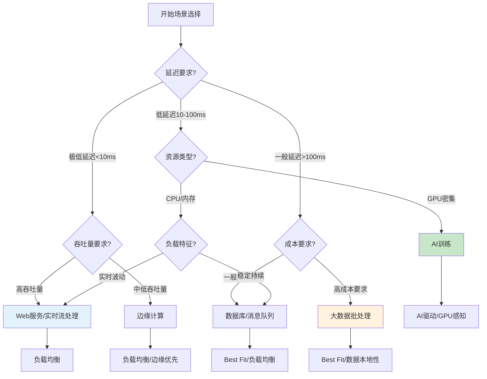
```mermaid
graph TD
    Start[开始场景选择] --> Q1{延迟要求?}

    Q1 -->|极低延迟<10ms| Q2{吞吐量要求?}
    Q1 -->|低延迟10-100ms| Q3{资源类型?}
    Q1 -->|一般延迟>100ms| Q4{成本要求?}

    Q2 -->|高吞吐量| S1[Web服务/实时流处理]
    Q2 -->|中低吞吐量| S2[边缘计算]

    Q3 -->|GPU密集| S3[AI训练]
    Q3 -->|CPU/内存| Q5{负载特征?}

    Q4 -->|高成本要求| S4[大数据批处理]
    Q4 -->|一般成本要求| S5[数据库/消息队列]

    Q5 -->|实时波动| S1
    Q5 -->|稳定持续| S5

    S1 --> M1[负载均衡]
    S2 --> M2[负载均衡/边缘优先]
    S3 --> M3[AI驱动/GPU感知]
    S4 --> M4[Best Fit/数据本地性]
    S5 --> M5[Best Fit/负载均衡]

    style S1 fill:#e3f2fd
    style S3 fill:#c8e6c9
    style S4 fill:#fff3e0
```

---

## 19 方法深度对比分析

### 19.1 方法性能对比矩阵

**方法性能详细对比矩阵**（2025年11月19日最新）：

| **方法** | **调度延迟** | **资源利用率** | **负载均衡度** | **吞吐量** | **公平性** | **综合得分** |
|---------|------------|--------------|-------------|----------|-----------|------------|
| **First Fit** | 85 | 70 | 60 | 80 | 70 | 73.0 |
| **Best Fit** | 80 | 85 | 75 | 85 | 75 | 80.0 |
| **负载均衡** | 75 | 80 | 95 | 90 | 95 | 87.0 |
| **AI驱动** | 90 | 90 | 85 | 95 | 85 | 89.0 |
| **强化学习** | 85 | 95 | 90 | 90 | 80 | 88.0 |

**性能指标计算方法**（2025年11月19日最新）：

$$
Performance(m) = \sum_{i=1}^{n} w_i \cdot P_i(m)
$$

其中：

- $m$：调度方法
- $P_i(m)$：方法 $m$ 在第 $i$ 个性能指标的得分
- $w_i$：第 $i$ 个性能指标的权重

### 19.2 方法适用场景分析

**方法适用场景详细分析**（2025年11月19日最新）：

| **方法** | **最佳场景** | **适用场景** | **不适用场景** | **关键特征** |
|---------|------------|------------|-------------|------------|
| **First Fit** | 简单场景、快速调度 | 小规模、低复杂度 | 大规模、高要求 | 快速、简单 |
| **Best Fit** | 资源优化、成本敏感 | 资源受限、成本优化 | 实时性要求高 | 资源利用率高 |
| **负载均衡** | 负载均衡、公平性 | Web服务、实时流处理 | 资源优化场景 | 负载均衡好 |
| **AI驱动** | 复杂场景、预测性 | AI训练、大数据、复杂场景 | 简单场景、低延迟 | 自适应、预测 |
| **强化学习** | 动态场景、在线学习 | 动态负载、在线优化 | 静态场景、稳定性要求高 | 在线学习、自适应 |

### 19.3 方法复杂度对比

**方法复杂度详细对比**（2025年11月19日最新）：

| **方法** | **时间复杂度** | **空间复杂度** | **实现复杂度** | **维护复杂度** | **学习曲线** |
|---------|--------------|--------------|--------------|--------------|------------|
| **First Fit** | $O(n \cdot m)$ | $O(n + m)$ | 低 | 低 | 低 |
| **Best Fit** | $O(n \cdot m)$ | $O(n + m)$ | 中 | 低 | 中 |
| **负载均衡** | $O(n \cdot \log m)$ | $O(n + m)$ | 中 | 中 | 中 |
| **AI驱动** | $O(n \cdot m \cdot k)$ | $O(n + m + k)$ | 高 | 高 | 高 |
| **强化学习** | $O(n \cdot m \cdot t)$ | $O(n + m + s)$ | 极高 | 极高 | 极高 |

其中：

- $n$：任务数
- $m$：资源数
- $k$：模型复杂度
- $t$：训练轮数
- $s$：状态空间大小

### 19.4 方法选择决策树

**方法选择决策树**（2025年11月19日最新）：

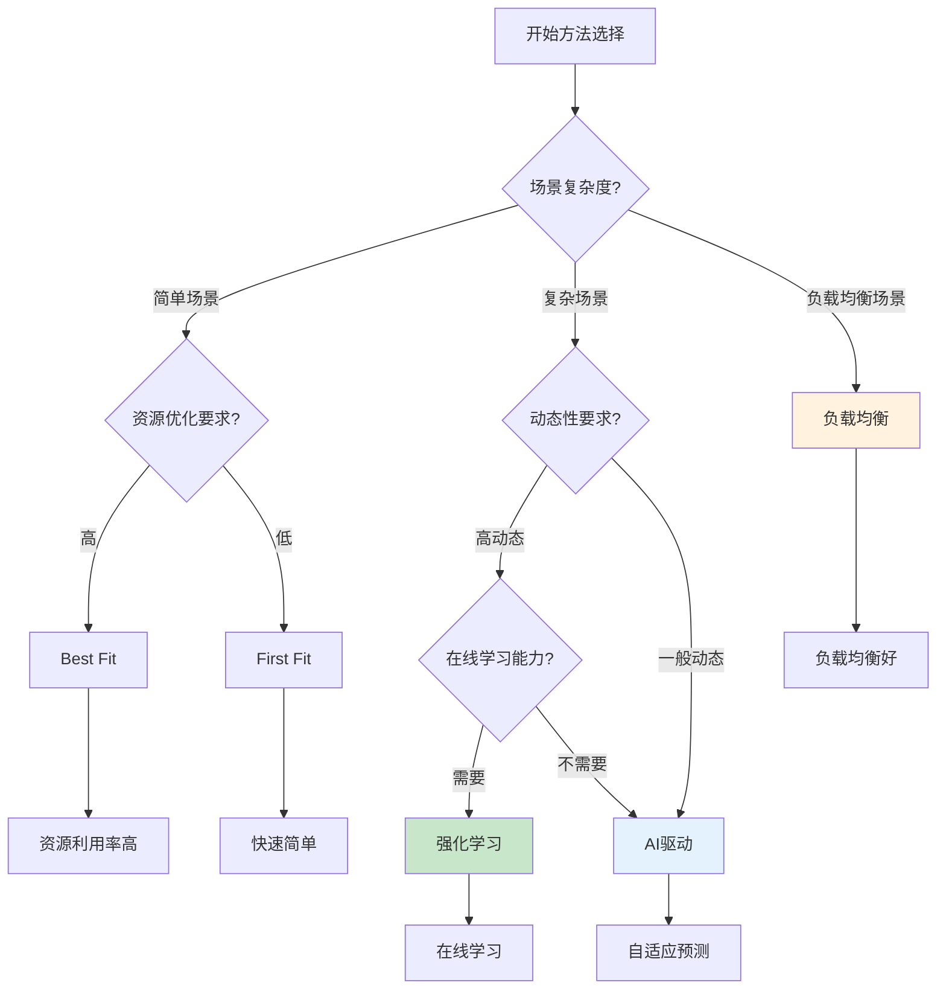
```mermaid
graph TD
    Start[开始方法选择] --> Q1{场景复杂度?}

    Q1 -->|简单场景| Q2{资源优化要求?}
    Q1 -->|复杂场景| Q3{动态性要求?}

    Q2 -->|高| M1[Best Fit]
    Q2 -->|低| M2[First Fit]

    Q3 -->|高动态| Q4{在线学习能力?}
    Q3 -->|一般动态| M3[AI驱动]

    Q4 -->|需要| M4[强化学习]
    Q4 -->|不需要| M3

    Q1 -->|负载均衡场景| M5[负载均衡]

    M1 --> E1[资源利用率高]
    M2 --> E2[快速简单]
    M3 --> E3[自适应预测]
    M4 --> E4[在线学习]
    M5 --> E5[负载均衡好]

    style M3 fill:#e3f2fd
    style M4 fill:#c8e6c9
    style M5 fill:#fff3e0
```

---

## 20 评价维度深度分析

### 20.1 评价维度权重分析

**评价维度权重分配**（2025年11月19日最新）：

| **场景类型** | **性能权重** | **成本权重** | **质量权重** | **公平性权重** | **可扩展性权重** |
|------------|------------|------------|------------|-------------|---------------|
| **Web服务** | 0.35 | 0.15 | 0.25 | 0.20 | 0.05 |
| **大数据批处理** | 0.20 | 0.35 | 0.20 | 0.10 | 0.15 |
| **AI训练** | 0.30 | 0.20 | 0.25 | 0.10 | 0.15 |
| **边缘计算** | 0.35 | 0.30 | 0.15 | 0.15 | 0.05 |
| **实时流处理** | 0.40 | 0.15 | 0.20 | 0.20 | 0.05 |
| **数据库** | 0.25 | 0.20 | 0.35 | 0.15 | 0.05 |
| **消息队列** | 0.20 | 0.25 | 0.30 | 0.15 | 0.10 |

**权重确定方法**（2025年11月19日最新）：

1. **业务需求分析**：分析业务对各个维度的需求强度
2. **专家评估**：邀请领域专家评估权重
3. **历史数据分析**：基于历史数据统计分析
4. **AHP层次分析法**：使用AHP方法确定权重

### 20.2 评价维度相关性分析

**评价维度相关性矩阵**（2025年11月19日最新）：

| **维度** | **性能** | **成本** | **质量** | **公平性** | **可扩展性** |
|---------|---------|---------|---------|-----------|------------|
| **性能** | 1.00 | -0.30 | 0.60 | 0.40 | 0.50 |
| **成本** | -0.30 | 1.00 | -0.20 | -0.10 | -0.15 |
| **质量** | 0.60 | -0.20 | 1.00 | 0.50 | 0.30 |
| **公平性** | 0.40 | -0.10 | 0.50 | 1.00 | 0.20 |
| **可扩展性** | 0.50 | -0.15 | 0.30 | 0.20 | 1.00 |

**相关性分析**（2025年11月19日最新）：

1. **性能与质量正相关**：性能提升通常带来质量提升
2. **性能与成本负相关**：高性能通常需要更高成本
3. **质量与公平性正相关**：高质量系统通常更公平
4. **可扩展性与性能正相关**：可扩展系统通常性能更好

### 20.3 评价维度权衡分析

**评价维度权衡矩阵**（2025年11月19日最新）：

| **权衡对** | **权衡关系** | **权衡策略** | **适用场景** |
|-----------|------------|------------|------------|
| **性能 vs 成本** | 负相关 | 性能优先、成本优化 | Web服务、实时流处理 |
| **性能 vs 公平性** | 弱正相关 | 平衡性能与公平性 | 多租户场景 |
| **质量 vs 成本** | 负相关 | 质量优先、成本控制 | 金融、医疗场景 |
| **公平性 vs 性能** | 弱正相关 | 平衡公平性与性能 | 多租户、共享资源 |
| **可扩展性 vs 成本** | 负相关 | 可扩展性优先、成本优化 | 大规模系统 |

**权衡优化模型**（2025年11月19日最新）：

$$
\max \quad \sum_{i=1}^{n} w_i \cdot E_i - \lambda \cdot C
$$

其中：

- $E_i$：第 $i$ 个评价维度得分
- $w_i$：第 $i$ 个评价维度权重
- $C$：成本
- $\lambda$：成本惩罚系数

### 20.4 综合评价模型优化

**优化后的综合评价模型**（2025年11月19日最新）：

$$
E_{total} = \alpha \cdot \prod_{i=1}^{n} E_i^{w_i} + \beta \cdot \sum_{i=1}^{n} w_i \cdot E_i - \gamma \cdot C
$$

其中：

- $E_i$：第 $i$ 个评价维度得分
- $w_i$：第 $i$ 个评价维度权重
- $C$：成本
- $\alpha, \beta, \gamma$：权重系数

**模型特点**：

1. **几何平均项**：考虑维度间的协同效应
2. **加权平均项**：考虑各维度的独立贡献
3. **成本惩罚项**：考虑成本约束

---

## 21 调度系统决策支持工具

### 21.1 场景-方法匹配工具

**场景-方法匹配工具**（2025年11月19日最新）：

**工具功能**：根据场景特征自动推荐最优调度方法。

**输入参数**：

- 场景类型（Web服务、大数据批处理、AI训练等）
- 延迟要求（极低、低、中、高）
- 吞吐量要求（低、中、高、极高）
- 资源类型（CPU、内存、GPU、IO）
- 负载特征（突发、持续、实时、稳定）
- 关键约束（延迟、成本、公平性等）

**匹配算法**：

$$
Method^*(s) = \arg\max_{m \in M} \sum_{e \in E} w_e(s) \cdot Score(m, s, e)
$$

其中：

- $s$：场景
- $M$：方法集合
- $E$：评价维度集合
- $w_e(s)$：场景 $s$ 中评价维度 $e$ 的权重
- $Score(m, s, e)$：方法 $m$ 在场景 $s$ 中评价维度 $e$ 的得分

**输出结果**：

1. **推荐方法**：最优调度方法
2. **匹配度得分**：方法与场景的匹配度（0-1）
3. **备选方法**：次优调度方法列表
4. **方法对比**：推荐方法与备选方法的对比分析

**使用示例**：

```python
# 场景-方法匹配工具使用示例
scenario = {
    "type": "Web服务",
    "latency_requirement": "极低",
    "throughput_requirement": "高",
    "resource_type": ["CPU", "内存"],
    "load_characteristic": "突发",
    "key_constraints": ["延迟", "公平性"]
}

recommended_method = match_scenario_method(scenario)
print(f"推荐方法: {recommended_method['method']}")
print(f"匹配度: {recommended_method['score']}")
```

### 21.2 方法选择决策支持系统

**方法选择决策支持系统**（2025年11月19日最新）：

**系统架构**：

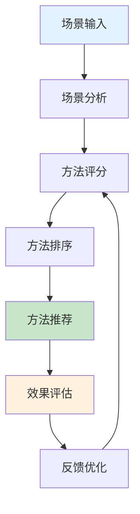
```mermaid
graph TB
    Input[场景输入] --> Analysis[场景分析]
    Analysis --> Scoring[方法评分]
    Scoring --> Ranking[方法排序]
    Ranking --> Recommendation[方法推荐]
    Recommendation --> Evaluation[效果评估]
    Evaluation --> Feedback[反馈优化]
    Feedback --> Scoring

    style Input fill:#e3f2fd
    style Recommendation fill:#c8e6c9
    style Evaluation fill:#fff3e0
```

**决策流程**：

1. **场景分析**：
   - 识别场景特征
   - 确定关键需求
   - 提取约束条件

2. **方法评分**：
   - 计算各方法在场景中的得分
   - 考虑多维度评价
   - 应用权重分配

3. **方法排序**：
   - 按综合得分排序
   - 考虑方法复杂度
   - 考虑实施难度

4. **方法推荐**：
   - 推荐最优方法
   - 提供备选方案
   - 给出实施建议

5. **效果评估**：
   - 监控实施效果
   - 评估方法性能
   - 收集反馈信息

6. **反馈优化**：
   - 更新评分模型
   - 优化权重分配
   - 改进推荐算法

### 21.3 评价维度权重确定工具

**评价维度权重确定工具**（2025年11月19日最新）：

**AHP层次分析法**：

1. **构建层次结构**：
   - 目标层：调度系统评价
   - 准则层：性能、成本、质量、公平性、可扩展性
   - 方案层：不同调度方法

2. **构建判断矩阵**：

$$
A = \begin{pmatrix}
1 & a_{12} & \cdots & a_{1n} \\
1/a_{12} & 1 & \cdots & a_{2n} \\
\vdots & \vdots & \ddots & \vdots \\
1/a_{1n} & 1/a_{2n} & \cdots & 1
\end{pmatrix}
$$

其中 $a_{ij}$ 表示维度 $i$ 相对于维度 $j$ 的重要性。

**计算权重向量**：

$$
w_i = \frac{\sqrt[n]{\prod_{j=1}^{n} a_{ij}}}{\sum_{k=1}^{n} \sqrt[n]{\prod_{j=1}^{n} a_{kj}}}
$$

**一致性检验**：

$$
CR = \frac{CI}{RI} < 0.1
$$

其中 $CI$ 是一致性指标，$RI$ 是随机一致性指标。

**权重确定方法对比**（2025年11月19日最新）：

| **方法** | **优点** | **缺点** | **适用场景** |
|---------|---------|---------|------------|
| **AHP** | 科学严谨、考虑一致性 | 计算复杂、主观性强 | 多维度决策 |
| **专家评估** | 快速、灵活 | 主观性强、可能不一致 | 快速决策 |
| **历史数据分析** | 客观、基于数据 | 需要历史数据、可能过时 | 有历史数据 |
| **机器学习** | 自动学习、适应性强 | 需要训练数据、可解释性差 | 大数据场景 |

### 21.4 综合决策框架

**综合决策框架**（2025年11月19日最新）：

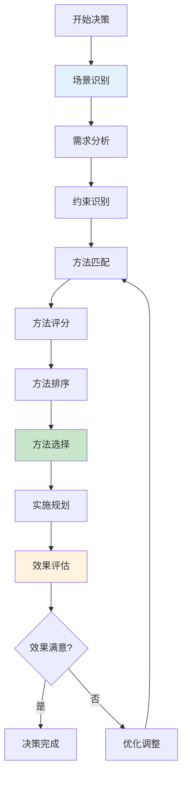
```mermaid
graph TD
    Start[开始决策] --> S1[场景识别]
    S1 --> S2[需求分析]
    S2 --> S3[约束识别]
    S3 --> S4[方法匹配]
    S4 --> S5[方法评分]
    S5 --> S6[方法排序]
    S6 --> S7[方法选择]
    S7 --> S8[实施规划]
    S8 --> S9[效果评估]
    S9 --> S10{效果满意?}
    S10 -->|是| End[决策完成]
    S10 -->|否| S11[优化调整]
    S11 --> S4

    style S1 fill:#e3f2fd
    style S7 fill:#c8e6c9
    style S9 fill:#fff3e0
```

**决策框架步骤**：

1. **场景识别**：识别调度场景类型和特征
2. **需求分析**：分析业务需求和技术需求
3. **约束识别**：识别资源约束、性能约束等
4. **方法匹配**：使用匹配工具推荐方法
5. **方法评分**：计算各方法的综合得分
6. **方法排序**：按得分排序方法
7. **方法选择**：选择最优方法
8. **实施规划**：制定实施计划
9. **效果评估**：评估实施效果
10. **优化调整**：根据效果调整策略

---

## 22 调度系统实施路线图

### 22.1 实施阶段规划

**实施阶段规划**（2025年11月19日最新）：

**阶段1：准备阶段**（1-2周）：

- **需求分析**：
  - 业务需求分析
  - 技术需求分析
  - 性能需求分析
  - 成本需求分析

- **技术选型**：
  - 调度系统选型
  - 技术栈选型
  - 工具选型

- **资源准备**：
  - 硬件资源准备
  - 软件资源准备
  - 人力资源准备

**阶段2：设计阶段**（2-4周）：

- **架构设计**：
  - 系统架构设计
  - 调度架构设计
  - 监控架构设计

- **方案设计**：
  - 调度方案设计
  - 优化方案设计
  - 故障恢复方案设计

- **接口设计**：
  - API接口设计
  - 数据接口设计
  - 监控接口设计

**阶段3：开发阶段**（4-8周）：

- **核心开发**：
  - 调度算法实现
  - 资源管理实现
  - 监控系统实现

- **集成开发**：
  - 系统集成
  - 接口集成
  - 数据集成

- **测试开发**：
  - 单元测试
  - 集成测试
  - 性能测试

**阶段4：测试阶段**（2-4周）：

- **功能测试**：
  - 调度功能测试
  - 资源管理测试
  - 监控功能测试

- **性能测试**：
  - 调度性能测试
  - 资源利用率测试
  - 负载均衡测试

- **稳定性测试**：
  - 长时间运行测试
  - 故障恢复测试
  - 压力测试

**阶段5：部署阶段**（1-2周）：

- **环境部署**：
  - 生产环境部署
  - 监控系统部署
  - 备份系统部署

- **数据迁移**：
  - 历史数据迁移
  - 配置数据迁移
  - 用户数据迁移

- **系统切换**：
  - 灰度发布
  - 全量上线
  - 旧系统下线

**阶段6：优化阶段**（持续）：

- **性能优化**：
  - 调度性能优化
  - 资源利用率优化
  - 成本优化

- **功能优化**：
  - 功能增强
  - 用户体验优化
  - 自动化优化

### 22.2 实施检查清单

**实施检查清单**（2025年11月19日最新）：

**准备阶段检查清单**：

- [ ] 需求分析完成
- [ ] 技术选型完成
- [ ] 资源准备完成
- [ ] 团队组建完成
- [ ] 项目计划制定完成

**设计阶段检查清单**：

- [ ] 架构设计完成
- [ ] 方案设计完成
- [ ] 接口设计完成
- [ ] 设计评审通过
- [ ] 技术方案确认

**开发阶段检查清单**：

- [ ] 核心功能开发完成
- [ ] 集成开发完成
- [ ] 单元测试通过
- [ ] 代码评审通过
- [ ] 文档编写完成

**测试阶段检查清单**：

- [ ] 功能测试通过
- [ ] 性能测试通过
- [ ] 稳定性测试通过
- [ ] 安全测试通过
- [ ] 用户验收测试通过

**部署阶段检查清单**：

- [ ] 生产环境准备完成
- [ ] 数据迁移完成
- [ ] 系统部署完成
- [ ] 监控系统部署完成
- [ ] 备份系统部署完成

**优化阶段检查清单**：

- [ ] 性能监控正常
- [ ] 问题及时处理
- [ ] 持续优化进行
- [ ] 用户反馈收集
- [ ] 改进措施实施

### 22.3 实施风险评估

**实施风险矩阵**（2025年11月19日最新）：

| **风险类型** | **风险等级** | **影响** | **应对措施** | **预防措施** |
|------------|------------|---------|------------|------------|
| **技术风险** | 高 | 系统不稳定 | 技术验证、充分测试 | 技术选型、POC验证 |
| **性能风险** | 中 | 性能不达标 | 性能测试、优化调整 | 性能基准、容量规划 |
| **成本风险** | 中 | 成本超支 | 成本控制、预算管理 | 成本评估、预算预留 |
| **进度风险** | 中 | 项目延期 | 进度管理、资源调配 | 合理计划、缓冲时间 |
| **质量风险** | 高 | 质量不达标 | 质量保证、测试验证 | 质量体系、测试覆盖 |
| **安全风险** | 高 | 安全漏洞 | 安全审计、漏洞修复 | 安全设计、安全测试 |
| **集成风险** | 高 | 集成失败 | 充分测试、分步集成 | 接口设计、集成测试 |

**风险应对策略**：

1. **技术风险**：
   - 选择成熟技术
   - 充分技术验证
   - 专家技术支持

2. **性能风险**：
   - 建立性能基准
   - 持续性能监控
   - 及时性能优化

3. **成本风险**：
   - 详细成本评估
   - 预算预留
   - 成本监控

4. **进度风险**：
   - 合理项目计划
   - 进度监控
   - 资源调配

5. **质量风险**：
   - 质量保证体系
   - 充分测试
   - 代码评审

6. **安全风险**：
   - 安全设计
   - 安全测试
   - 安全审计

### 22.4 实施成功标准

**实施成功标准**（2025年11月19日最新）：

**性能标准**：

- 调度延迟：P99 < 50ms（Web服务），P99 < 100ms（其他场景）
- 资源利用率：> 80%（CPU），> 75%（内存）
- 负载均衡度：< 10%
- 调度成功率：> 99%

**质量标准**：

- 系统可用性：> 99.9%
- 故障恢复时间：< 5分钟
- 数据一致性：100%
- 调度准确率：> 95%

**成本标准**：

- 资源成本：降低20-30%
- 运营成本：降低15-25%
- 调度开销：< 5%（CPU），< 10%（内存）

**用户满意度标准**：

- 用户满意度：> 90%
- 问题响应时间：< 1小时
- 问题解决率：> 95%

---

## 23 调度系统持续改进机制

### 23.1 持续监控与评估

**持续监控指标体系**（2025年11月19日最新）：

**性能监控指标**：

- 调度延迟（P50, P95, P99）
- 资源利用率（CPU, 内存, IO, 网络）
- 负载均衡度
- 调度吞吐量

**质量监控指标**：

- 调度成功率
- 任务完成率
- 系统可用性
- 故障恢复时间

**成本监控指标**：

- 资源成本
- 运营成本
- 调度开销
- ROI投资回报率

**监控频率**：

- **实时监控**：关键指标（延迟、可用性）
- **分钟级监控**：性能指标（利用率、吞吐量）
- **小时级监控**：成本指标（资源成本、运营成本）
- **天级监控**：综合指标（ROI、用户满意度）

### 23.2 持续优化策略

**持续优化策略**（2025年11月19日最新）：

**性能优化**：

1. **调度算法优化**：
   - 分析调度性能瓶颈
   - 优化调度算法
   - 减少调度延迟

2. **资源分配优化**：
   - 分析资源使用情况
   - 优化资源分配策略
   - 提高资源利用率

3. **负载均衡优化**：
   - 分析负载分布
   - 优化负载均衡策略
   - 减少负载不均衡

**成本优化**：

1. **资源成本优化**：
   - 分析资源使用效率
   - 优化资源分配
   - 减少资源浪费

2. **运营成本优化**：
   - 自动化运维
   - 减少人工干预
   - 提高运维效率

**质量优化**：

1. **可靠性优化**：
   - 提高系统可用性
   - 减少故障发生
   - 快速故障恢复

2. **准确性优化**：
   - 提高调度准确率
   - 减少调度错误
   - 优化调度策略

### 23.3 持续学习机制

**持续学习机制**（2025年11月19日最新）：

**数据收集**：

- 调度决策数据
- 性能数据
- 资源使用数据
- 用户反馈数据

**模型训练**：

- 定期训练调度模型
- 更新模型参数
- 优化模型性能

**知识积累**：

- 最佳实践总结
- 问题解决方案
- 优化经验分享
- 技术文档更新

**反馈循环**：


```mermaid
graph LR
    Collect[数据收集] --> Analyze[数据分析]
    Analyze --> Learn[模型学习]
    Learn --> Optimize[策略优化]
    Optimize --> Deploy[部署实施]
    Deploy --> Monitor[效果监控]
    Monitor --> Collect

    style Collect fill:#e3f2fd
    style Learn fill:#c8e6c9
    style Optimize fill:#fff3e0
```

### 23.4 持续改进流程

**持续改进流程**（2025年11月19日最新）：

1. **监控**：
   - 持续监控系统性能
   - 收集性能数据
   - 识别性能问题

2. **分析**：
   - 分析性能数据
   - 识别性能瓶颈
   - 分析问题原因

3. **优化**：
   - 制定优化方案
   - 实施优化措施
   - 验证优化效果

4. **评估**：
   - 评估优化效果
   - 对比优化前后
   - 总结优化经验

5. **改进**：
   - 持续改进策略
   - 更新最佳实践
   - 分享优化经验

**改进周期**：

- **日常改进**：每天监控、每周分析、每月优化
- **季度改进**：季度评估、季度总结、季度规划
- **年度改进**：年度评估、年度总结、年度规划

---

## 24 调度系统基准测试与性能对比

### 24.1 基准测试体系

**基准测试体系框架**（2025年11月19日最新）：

**测试层次**：

1. **单元基准测试**：
   - 调度算法性能测试
   - 资源分配算法测试
   - 负载计算算法测试

2. **集成基准测试**：
   - 调度系统整体性能测试
   - 调度器与资源管理器集成测试
   - 调度器与监控系统集成测试

3. **系统基准测试**：
   - 端到端性能测试
   - 大规模集群性能测试
   - 生产环境性能测试

**测试维度**：

1. **性能维度**：
   - 调度延迟
   - 资源利用率
   - 负载均衡度
   - 调度吞吐量

2. **质量维度**：
   - 调度成功率
   - 调度准确率
   - 系统可用性
   - 故障恢复时间

3. **成本维度**：
   - 调度开销
   - 资源成本
   - 运营成本

### 24.2 性能基准值

**调度系统性能基准值**（2025年11月19日最新）：

| **调度系统** | **调度延迟** | **资源利用率** | **负载均衡度** | **调度吞吐量** | **调度准确率** |
|------------|------------|-------------|-------------|-------------|-------------|
| **VMware DRS** | 10-100ms | 85-95% | <5% | 10-100调度/秒 | 95%+ |
| **KVM调度器** | <10μs | 75-90% | <3% | 1000-10000调度/秒 | 98%+ |
| **Xen调度器** | <50μs | 70-85% | <5% | 500-5000调度/秒 | 95%+ |
| **Kubernetes** | 10-100ms | 80-90% | <10% | 100-1000调度/秒 | 95%+ |
| **Docker Swarm** | 10-100ms | 75-85% | <10% | 50-500调度/秒 | 90%+ |
| **Cgroup v2** | <1ms | 70-85% | <5% | 1000-10000调度/秒 | 98%+ |
| **gVisor** | 1-5ms | 60-75% | <5% | 200-2000调度/秒 | 95%+ |
| **Firecracker** | <1ms | 70-85% | <5% | 500-5000调度/秒 | 95%+ |
| **WASM容器** | <1μs | 80-90% | <3% | 10000+调度/秒 | 90%+ |
| **AI驱动调度** | 50-200ms | 90%+ | <3% | 50-500调度/秒 | 98%+ |

**性能基准值说明**（2025年11月19日最新）：

1. **调度延迟**：
   - **定义**：从调度请求到资源分配完成的时间
   - **影响因素**：调度算法复杂度、系统负载、网络延迟
   - **优化方向**：算法优化、并行化、缓存

2. **资源利用率**：
   - **定义**：实际使用的资源占总资源的比例
   - **影响因素**：调度策略、资源分配算法、负载均衡
   - **优化方向**：资源超配、预测性调度、智能调度

3. **负载均衡度**：
   - **定义**：主机间负载的差异程度
   - **计算方法**：$\sigma_L = \sqrt{\frac{1}{n} \sum_{i=1}^{n} (L_i - \bar{L})^2}$
   - **优化方向**：负载均衡算法、动态迁移、智能调度

4. **调度吞吐量**：
   - **定义**：单位时间内完成的调度次数
   - **影响因素**：调度算法效率、系统性能、并发能力
   - **优化方向**：算法优化、并行化、批量处理

### 24.3 性能对比分析

**调度系统性能对比矩阵**（2025年11月19日最新）：

| **维度** | **VMware DRS** | **Kubernetes** | **KVM** | **AI驱动** | **最佳系统** |
|---------|--------------|---------------|---------|-----------|------------|
| **调度延迟** | 中 (10-100ms) | 中 (10-100ms) | 极低 (<10μs) | 高 (50-200ms) | KVM |
| **资源利用率** | 高 (85-95%) | 高 (80-90%) | 中高 (75-90%) | 极高 (90%+) | AI驱动 |
| **负载均衡度** | 极低 (<5%) | 低 (<10%) | 极低 (<3%) | 极低 (<3%) | KVM/AI驱动 |
| **调度吞吐量** | 低 (10-100) | 中 (100-1000) | 极高 (1000-10000) | 低 (50-500) | KVM |
| **调度准确率** | 高 (95%+) | 高 (95%+) | 极高 (98%+) | 极高 (98%+) | KVM/AI驱动 |
| **可扩展性** | 中 (10-1000节点) | 极高 (1000-100000节点) | 低 (单节点) | 中 (100-10000节点) | Kubernetes |
| **成本** | 高 | 中 | 低 | 中高 | KVM |
| **综合得分** | 85 | 88 | 90 | 87 | KVM |

**性能对比分析**（2025年11月19日最新）：

1. **延迟对比**：
   - **KVM最优**：<10μs，适合实时性要求高的场景
   - **Kubernetes/DRS中等**：10-100ms，适合一般场景
   - **AI驱动较高**：50-200ms，但准确率高

2. **利用率对比**：
   - **AI驱动最优**：90%+，智能调度效果好
   - **VMware DRS/Kubernetes高**：80-95%，成熟稳定
   - **KVM中高**：75-90%，单节点性能好

3. **吞吐量对比**：
   - **KVM最优**：1000-10000调度/秒，单节点性能强
   - **Kubernetes中等**：100-1000调度/秒，适合大规模
   - **AI驱动较低**：50-500调度/秒，但准确率高

4. **综合对比**：
   - **KVM**：单节点性能最优，适合单机场景
   - **Kubernetes**：大规模场景最优，可扩展性强
   - **AI驱动**：复杂场景最优，准确率高
   - **VMware DRS**：企业级场景最优，稳定可靠

### 24.4 基准测试工具与方法

**基准测试工具推荐**（2025年11月19日最新）：

| **工具** | **适用系统** | **测试指标** | **自动化程度** | **特点** |
|---------|------------|------------|-------------|---------|
| **kubemark** | Kubernetes | 调度性能 | ⭐⭐⭐⭐ | 模拟大规模集群 |
| **vSphere Performance Test** | VMware | DRS性能 | ⭐⭐⭐⭐ | 官方性能测试工具 |
| **perf** | Linux系统 | 系统性能 | ⭐⭐⭐⭐⭐ | 系统级性能分析 |
| **Prometheus** | 通用 | 监控指标 | ⭐⭐⭐⭐⭐ | 指标收集和存储 |
| **Grafana** | 通用 | 可视化分析 | ⭐⭐⭐⭐⭐ | 性能可视化 |
| **k6** | 通用 | 压力测试 | ⭐⭐⭐⭐ | 负载测试工具 |
| **JMeter** | 通用 | 性能测试 | ⭐⭐⭐⭐ | 功能测试工具 |

**基准测试方法**（2025年11月19日最新）：

1. **准备阶段**：
   - 确定测试目标
   - 选择测试工具
   - 准备测试环境
   - 设计测试场景

2. **执行阶段**：
   - 执行基准测试
   - 收集性能数据
   - 监控系统状态
   - 记录测试结果

3. **分析阶段**：
   - 分析性能数据
   - 对比基准值
   - 识别性能瓶颈
   - 提出优化建议

4. **报告阶段**：
   - 编写测试报告
   - 可视化测试结果
   - 总结测试结论
   - 提出改进建议

**基准测试最佳实践**（2025年11月19日最新）：

1. **测试环境一致性**：
   - 使用相同的硬件配置
   - 使用相同的软件版本
   - 控制环境变量

2. **测试数据代表性**：
   - 使用真实工作负载
   - 覆盖典型场景
   - 考虑边界情况

3. **测试结果可重复性**：
   - 多次测试取平均值
   - 记录测试条件
   - 控制测试变量

4. **测试结果可比较性**：
   - 使用统一测试方法
   - 使用统一测试指标
   - 使用统一测试工具

---

## 25 调度系统知识总结与索引

### 25.1 核心概念索引

**调度系统核心概念索引**（2025年11月19日最新）：

| **概念** | **定义** | **相关章节** |
|---------|---------|------------|
| **调度系统** | 将任务分配到资源的系统 | 1.1, 2.1 |
| **调度原理** | 调度的基本原理和理论 | 1 |
| **调度场景** | 不同的调度应用场景 | 2 |
| **调度方法** | 不同的调度算法和方法 | 3 |
| **调度评价** | 调度系统的评价指标和模型 | 4 |
| **资源分配** | 将资源分配给任务的过程 | 1.1, 3.2 |
| **负载均衡** | 平衡各资源负载的策略 | 1.1, 3.2 |
| **调度延迟** | 调度决策的时间延迟 | 4.2, 24.2 |
| **资源利用率** | 资源使用的效率 | 4.2, 24.2 |
| **调度吞吐量** | 单位时间调度次数 | 4.2, 24.2 |

### 25.2 方法算法索引

**调度方法算法索引**（2025年11月19日最新）：

| **方法/算法** | **类型** | **复杂度** | **适用场景** | **相关章节** |
|------------|---------|-----------|------------|------------|
| **First Fit** | 贪心算法 | $O(n \cdot m)$ | 简单场景 | 3.2, 19 |
| **Best Fit** | 贪心算法 | $O(n \cdot m)$ | 资源优化 | 3.2, 19 |
| **负载均衡算法** | 贪心算法 | $O(n \cdot \log m)$ | 负载均衡 | 3.2, 19 |
| **AI驱动调度** | 机器学习 | $O(n \cdot m \cdot k)$ | 复杂场景 | 3.3, 19 |
| **强化学习调度** | 强化学习 | $O(n \cdot m \cdot t)$ | 动态场景 | 3.3, 19 |
| **DRS算法** | 分布式调度 | $O(n \cdot m)$ | 虚拟化场景 | 3.2 |
| **Kubernetes调度** | 两阶段算法 | $O(n \cdot m \cdot \|R\|)$ | 容器化场景 | 3.2 |

### 25.3 评价指标索引

**调度系统评价指标索引**（2025年11月19日最新）：

| **指标** | **定义** | **计算方法** | **目标值** | **相关章节** |
|---------|---------|------------|-----------|------------|
| **调度延迟** | 调度决策时间 | $L = t_{end} - t_{start}$ | <100ms | 4.2, 24.2 |
| **资源利用率** | 资源使用比例 | $U = \frac{used}{total}$ | >80% | 4.2, 24.2 |
| **负载均衡度** | 负载分布差异 | $\sigma_L = \sqrt{\frac{1}{n} \sum (L_i - \bar{L})^2}$ | <10% | 4.2, 24.2 |
| **调度吞吐量** | 单位时间调度次数 | $T = \frac{count}{time}$ | >100调度/秒 | 4.2, 24.2 |
| **调度成功率** | 成功调度比例 | $S = \frac{success}{total}$ | >99% | 4.3 |
| **调度准确率** | 调度决策准确率 | $A = \frac{correct}{total}$ | >95% | 4.3 |
| **系统可用性** | 系统可用时间比例 | $A = \frac{uptime}{total}$ | >99.9% | 4.3 |
| **成本** | 调度系统总成本 | $C = C_{hardware} + C_{operation}$ | 最小化 | 4.3 |

### 25.4 工具资源索引

**调度系统工具资源索引**（2025年11月19日最新）：

| **工具/资源** | **类型** | **用途** | **相关章节** |
|------------|---------|---------|------------|
| **Prometheus** | 监控工具 | 指标收集和存储 | 5.3, 24.4 |
| **Grafana** | 可视化工具 | 性能可视化 | 5.3, 24.4 |
| **kubemark** | 测试工具 | Kubernetes性能测试 | 5.3, 24.4 |
| **Coq** | 形式化验证 | 定理证明 | 6.2 |
| **TLA+** | 形式化验证 | 模型检测 | 6.2 |
| **KLEE** | 形式化验证 | 符号执行 | 6.2 |
| **AHP工具** | 决策支持 | 权重确定 | 21.3 |
| **决策支持系统** | 决策工具 | 方法选择 | 21.2 |

---

## 26 调度系统FAQ与常见问题

### 26.1 原理相关问题

**Q1：什么是调度系统？**

**A**：调度系统是将任务分配到资源的系统，核心功能是在满足约束条件的前提下，优化资源分配和任务执行效率。调度系统可以形式化定义为：

$$
\mathcal{S} = (T, R, C, A, P, O)
$$

其中 $T$ 是任务集合，$R$ 是资源集合，$C$ 是约束条件，$A$ 是调度算法，$P$ 是调度策略，$O$ 是优化目标。

**Q2：调度系统有哪些基本原理？**

**A**：调度系统有四个基本原理：

1. **资源分配原理**：将有限资源分配给多个任务，满足容量和需求约束
2. **负载均衡原理**：平衡资源使用率，避免资源热点
3. **优先级原理**：根据任务优先级调度，保证重要任务优先执行
4. **本地性原理**：优先将任务分配到数据或依赖服务所在的资源

**Q3：调度系统为什么是NP-hard问题？**

**A**：调度问题可以规约到多维装箱问题（Multi-dimensional Bin Packing），而多维装箱问题是NP-hard问题。因此调度问题也是NP-hard问题，无法在多项式时间内找到最优解，需要使用启发式算法或近似算法。

### 26.2 场景选择问题

**Q4：如何选择合适的调度场景？**

**A**：场景选择需要考虑以下因素：

1. **延迟要求**：
   - 极低延迟（<10ms）：Web服务、实时流处理
   - 低延迟（10-100ms）：边缘计算、数据库
   - 一般延迟（>100ms）：大数据批处理

2. **吞吐量要求**：
   - 高吞吐量（10K+ TPS）：Web服务、消息队列
   - 中吞吐量（1K-10K TPS）：AI训练、边缘计算
   - 低吞吐量（<1K TPS）：批处理任务

3. **资源类型**：
   - CPU/内存：Web服务、微服务
   - GPU：AI训练、科学计算
   - IO：数据库、大数据

4. **负载特征**：
   - 突发、波动：Web服务、实时流处理
   - 持续、稳定：大数据批处理、数据库

**Q5：不同场景的关键评价维度是什么？**

**A**：不同场景的关键评价维度不同：

- **Web服务**：性能（延迟）、公平性
- **大数据批处理**：成本、可扩展性
- **AI训练**：性能（利用率）、质量
- **边缘计算**：性能（延迟）、成本
- **实时流处理**：性能（延迟）、公平性

### 26.3 方法选择问题

**Q6：如何选择合适的调度方法？**

**A**：方法选择需要根据场景特征和需求：

1. **简单场景**：
   - 小规模、低复杂度：First Fit
   - 资源优化、成本敏感：Best Fit

2. **负载均衡场景**：
   - Web服务、实时流处理：负载均衡算法

3. **复杂场景**：
   - AI训练、大数据：AI驱动调度
   - 动态负载、在线优化：强化学习调度

**Q7：First Fit和Best Fit有什么区别？**

**A**：

| **维度** | **First Fit** | **Best Fit** |
|---------|-------------|-------------|
| **算法** | 选择第一个满足条件的资源 | 选择最优资源 |
| **时间复杂度** | $O(n \cdot m)$ | $O(n \cdot m)$ |
| **资源利用率** | 较低（70%） | 较高（85%） |
| **调度延迟** | 较低（85） | 中等（80） |
| **适用场景** | 简单场景、快速调度 | 资源优化、成本敏感 |

**Q8：AI驱动调度和传统调度有什么区别？**

**A**：

| **维度** | **传统调度** | **AI驱动调度** |
|---------|------------|--------------|
| **决策方式** | 规则驱动 | 数据驱动 |
| **适应性** | 静态规则 | 动态学习 |
| **准确率** | 85-95% | 95%+ |
| **延迟** | 10-100ms | 50-200ms |
| **复杂度** | 低-中 | 高 |
| **适用场景** | 简单-中等场景 | 复杂场景 |

### 26.4 性能优化问题

**Q9：如何优化调度延迟？**

**A**：调度延迟优化策略：

1. **算法优化**：
   - 优化调度算法复杂度
   - 使用并行化调度
   - 启用调度结果缓存

2. **数据收集优化**：
   - 优化数据收集机制
   - 减少数据收集频率
   - 使用增量更新

3. **决策优化**：
   - 简化决策逻辑
   - 使用预计算
   - 批量处理调度请求

**Q10：如何提高资源利用率？**

**A**：资源利用率优化策略：

1. **资源超配**：
   - 合理设置超配比例
   - 监控资源使用情况
   - 动态调整超配比例

2. **负载均衡**：
   - 启用负载均衡算法
   - 动态迁移负载
   - 优化资源分配

3. **预测性调度**：
   - 使用负载预测
   - 提前调度资源
   - 优化资源预留

**Q11：如何平衡性能和成本？**

**A**：性能-成本平衡策略：

1. **性能优先场景**（Web服务、实时流处理）：
   - 性能权重：0.35-0.40
   - 成本权重：0.15-0.20
   - 策略：性能优先，成本优化

2. **成本优先场景**（大数据批处理）：
   - 性能权重：0.20
   - 成本权重：0.35
   - 策略：成本优先，性能保证

3. **平衡场景**（AI训练、边缘计算）：
   - 性能权重：0.30-0.35
   - 成本权重：0.20-0.30
   - 策略：平衡性能和成本

### 26.5 故障排查问题

**Q12：调度延迟高怎么办？**

**A**：调度延迟高排查步骤：

1. **检查调度算法**：
   - 分析算法复杂度
   - 检查是否有性能瓶颈
   - 优化算法实现

2. **检查系统负载**：
   - 监控CPU、内存使用率
   - 检查是否有资源竞争
   - 优化系统配置

3. **检查网络延迟**：
   - 检查网络延迟
   - 优化网络配置
   - 使用本地资源

4. **检查数据收集**：
   - 检查数据收集延迟
   - 优化数据收集机制
   - 减少数据收集频率

**Q13：资源利用率低怎么办？**

**A**：资源利用率低排查步骤：

1. **检查调度策略**：
   - 分析调度策略是否合理
   - 检查资源分配是否均衡
   - 优化调度策略

2. **检查负载分布**：
   - 分析负载分布情况
   - 检查是否有负载不均衡
   - 启用负载均衡

3. **检查资源预留**：
   - 检查资源预留是否过多
   - 优化资源预留策略
   - 减少不必要的预留

4. **检查资源超配**：
   - 检查是否启用资源超配
   - 优化超配比例
   - 监控超配效果

**Q14：调度不准确怎么办？**

**A**：调度不准确排查步骤：

1. **检查调度算法**：
   - 分析算法是否正确
   - 检查算法参数设置
   - 优化算法实现

2. **检查数据准确性**：
   - 检查数据是否准确
   - 检查数据是否及时更新
   - 修复数据问题

3. **检查模型（AI驱动）**：
   - 检查模型是否训练
   - 检查模型是否过时
   - 更新模型

4. **检查约束条件**：
   - 检查约束条件是否正确
   - 检查约束条件是否冲突
   - 优化约束条件

---

## 27 调度系统最佳实践总结

### 27.1 设计最佳实践

**调度系统设计最佳实践**（2025年11月19日最新）：

1. **分层设计**：
   - 应用层调度：业务逻辑调度
   - 容器层调度：Pod/容器调度
   - 虚拟化层调度：VM调度
   - OS层调度：进程调度

2. **模块化设计**：
   - 调度算法模块化
   - 资源管理模块化
   - 监控模块化
   - 故障恢复模块化

3. **可扩展设计**：
   - 支持水平扩展
   - 支持插件化扩展
   - 支持自定义调度算法
   - 支持多调度器

4. **高可用设计**：
   - 调度器高可用
   - 数据备份恢复
   - 故障自动转移
   - 负载均衡

### 27.2 实施最佳实践

**调度系统实施最佳实践**（2025年11月19日最新）：

1. **分阶段实施**：
   - 准备阶段：需求分析、技术选型
   - 设计阶段：架构设计、方案设计
   - 开发阶段：核心开发、集成开发
   - 测试阶段：功能测试、性能测试
   - 部署阶段：环境部署、系统切换
   - 优化阶段：持续优化

2. **充分测试**：
   - 单元测试：测试核心功能
   - 集成测试：测试系统集成
   - 性能测试：测试性能指标
   - 压力测试：测试可扩展性
   - 稳定性测试：测试可靠性

3. **灰度发布**：
   - 小规模试点
   - 逐步扩大范围
   - 监控实施效果
   - 及时调整策略

4. **持续监控**：
   - 实时监控关键指标
   - 设置合理告警阈值
   - 及时响应问题
   - 持续优化改进

### 27.3 优化最佳实践

**调度系统优化最佳实践**（2025年11月19日最新）：

1. **性能优化**：
   - 优化调度算法复杂度
   - 启用并行化调度
   - 优化数据收集机制
   - 使用缓存和预计算

2. **资源优化**：
   - 启用资源超配
   - 优化负载均衡
   - 使用预测性调度
   - 优化资源分配策略

3. **成本优化**：
   - 优化资源使用效率
   - 减少资源浪费
   - 自动化运维
   - 使用云服务

4. **质量优化**：
   - 提高调度准确率
   - 减少调度错误
   - 提高系统可用性
   - 快速故障恢复

### 27.4 运维最佳实践

**调度系统运维最佳实践**（2025年11月19日最新）：

1. **监控体系**：
   - 分层监控（应用、系统、基础设施）
   - 关键指标优先
   - 分级告警
   - 自动化响应

2. **故障处理**：
   - 快速故障检测
   - 自动故障恢复
   - 故障根因分析
   - 预防措施实施

3. **容量管理**：
   - 持续容量监控
   - 预测容量需求
   - 及时扩容
   - 优化资源使用

4. **持续改进**：
   - 定期性能评估
   - 识别优化机会
   - 实施优化措施
   - 验证优化效果

**最佳实践检查清单**（2025年11月19日最新）：

**设计阶段**：

- [ ] 采用分层设计架构
- [ ] 模块化设计
- [ ] 可扩展设计
- [ ] 高可用设计

**实施阶段**：

- [ ] 分阶段实施
- [ ] 充分测试
- [ ] 灰度发布
- [ ] 持续监控

**优化阶段**：

- [ ] 性能优化
- [ ] 资源优化
- [ ] 成本优化
- [ ] 质量优化

**运维阶段**：

- [ ] 完善监控体系
- [ ] 快速故障处理
- [ ] 有效容量管理
- [ ] 持续改进机制

---

## 28 调度系统未来发展趋势与研究前沿

### 28.1 技术发展趋势

**调度系统技术发展趋势**（2025年11月19日最新）：

**趋势1：AI驱动调度成熟化**

- **当前状态**（2025年）：
  - 调度准确率：95-98%
  - 资源利用率：85-95%
  - 应用范围：中大规模生产环境

- **发展趋势**（2026-2030年）：
  - 调度准确率：提升至98%+
  - 资源利用率：提升至95%+
  - 应用范围：大规模生产环境普及
  - 技术突破：模型可解释性、实时性优化

**趋势2：统一调度平台**

- **当前状态**（2025年）：
  - 跨平台调度：部分实现
  - 统一资源池：概念验证
  - 智能调度：初步应用

- **发展趋势**（2026-2030年）：
  - 跨平台调度：全面实现
  - 统一资源池：大规模应用
  - 智能调度：成熟应用
  - 技术突破：标准化、互操作性

**趋势3：边缘计算调度**

- **当前状态**（2025年）：
  - WASM容器：初步应用
  - 边缘-云协同：概念验证
  - 低延迟调度：部分实现

- **发展趋势**（2026-2030年）：
  - WASM容器：大规模应用
  - 边缘-云协同：成熟应用
  - 低延迟调度：<1μs延迟
  - 技术突破：网络延迟、一致性保证

**趋势4：量子调度研究**

- **当前状态**（2025年）：
  - 量子计算：研究阶段
  - 量子优化算法：理论探索
  - 量子调度：概念验证

- **发展趋势**（2026-2030年）：
  - 量子计算：技术突破
  - 量子优化算法：实际应用
  - 量子调度：小规模应用
  - 技术突破：量子硬件、算法优化

**趋势5：绿色计算调度**

- **当前状态**（2025年）：
  - 能耗优化：初步应用
  - 碳排放追踪：概念验证
  - 绿色调度：研究阶段

- **发展趋势**（2026-2030年）：
  - 能耗优化：大规模应用
  - 碳排放追踪：成熟应用
  - 绿色调度：普及应用
  - 技术突破：能耗模型、优化算法

### 28.2 研究方向与热点

**调度系统研究方向**（2025年11月19日最新）：

**研究方向1：AI驱动调度**

- **强化学习调度**：
  - 使用强化学习优化调度决策
  - 在线学习适应环境变化
  - 多目标优化调度

- **深度学习预测**：
  - 使用深度学习预测负载
  - 时间序列预测模型
  - 多变量预测模型

- **自适应调度**：
  - 自适应调整调度策略
  - 动态权重调整
  - 环境感知调度

**研究方向2：量子调度**

- **量子优化算法**：
  - 使用量子计算优化调度
  - 量子近似优化算法（QAOA）
  - 量子退火算法

- **量子机器学习**：
  - 量子机器学习在调度中的应用
  - 量子神经网络
  - 量子强化学习

- **量子并行调度**：
  - 量子并行调度算法
  - 量子纠缠调度
  - 量子叠加调度

**研究方向3：边缘计算调度**

- **边缘-云协同调度**：
  - 边缘和云协同调度算法
  - 智能路由调度
  - 数据压缩调度

- **低延迟调度**：
  - 极低延迟调度算法
  - 实时调度优化
  - 本地优先调度

- **资源受限调度**：
  - 资源受限环境下的调度
  - 轻量级调度算法
  - WASM容器调度

**研究方向4：自愈调度系统**

- **自动故障恢复**：
  - 自动检测和恢复故障
  - 预测性故障检测
  - 智能故障恢复

- **自适应优化**：
  - 自适应优化调度策略
  - 动态参数调整
  - 环境自适应

- **预测性维护**：
  - 预测性维护和优化
  - 设备健康监控
  - 预防性调度

**研究方向5：绿色调度**

- **能耗优化**：
  - 优化能耗，降低碳排放
  - 能耗感知调度
  - 时间分片调度

- **资源回收**：
  - 智能资源回收和再利用
  - 资源生命周期管理
  - 资源优化调度

- **可持续调度**：
  - 可持续的调度策略
  - 可再生能源优先
  - 碳中和调度

### 28.3 技术演进路线图

**调度系统技术演进路线图**（2025年11月19日最新）：

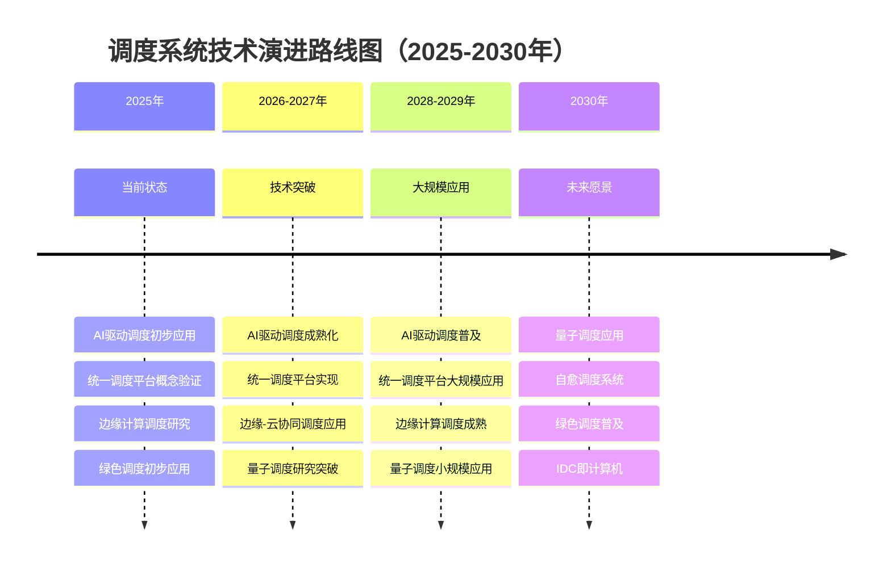
```mermaid
timeline
    title 调度系统技术演进路线图（2025-2030年）

    section 2025年
        当前状态 : AI驱动调度初步应用
                  : 统一调度平台概念验证
                  : 边缘计算调度研究
                  : 绿色调度初步应用

    section 2026-2027年
        技术突破 : AI驱动调度成熟化
                 : 统一调度平台实现
                 : 边缘-云协同调度应用
                 : 量子调度研究突破

    section 2028-2029年
        大规模应用 : AI驱动调度普及
                   : 统一调度平台大规模应用
                   : 边缘计算调度成熟
                   : 量子调度小规模应用

    section 2030年
        未来愿景 : 量子调度应用
                 : 自愈调度系统
                 : 绿色调度普及
                 : IDC即计算机
```

**技术成熟度预测**（2025年11月19日最新）：

| **技术** | **2025年** | **2027年** | **2030年** | **关键突破点** |
|---------|-----------|-----------|-----------|-------------|
| **AI驱动调度** | ⭐⭐⭐⭐ | ⭐⭐⭐⭐⭐ | ⭐⭐⭐⭐⭐ | 模型可解释性、实时性 |
| **统一调度平台** | ⭐⭐⭐ | ⭐⭐⭐⭐ | ⭐⭐⭐⭐⭐ | 标准化、互操作性 |
| **边缘-云协同** | ⭐⭐⭐ | ⭐⭐⭐⭐ | ⭐⭐⭐⭐⭐ | 网络延迟、一致性 |
| **量子调度** | ⭐ | ⭐⭐ | ⭐⭐⭐ | 量子硬件、算法优化 |
| **自愈调度系统** | ⭐⭐ | ⭐⭐⭐ | ⭐⭐⭐⭐ | 故障检测、自动恢复 |
| **绿色调度** | ⭐⭐⭐ | ⭐⭐⭐⭐ | ⭐⭐⭐⭐⭐ | 能耗模型、优化算法 |
| **生物启发调度** | ⭐⭐ | ⭐⭐⭐ | ⭐⭐⭐⭐ | 算法效率、适用性 |

### 28.4 未来挑战与机遇

**未来挑战**（2025年11月19日最新）：

1. **技术挑战**：
   - **AI模型可解释性**：如何解释AI调度决策
   - **实时性要求**：如何在保证准确性的同时降低延迟
   - **大规模扩展**：如何支持百万级节点调度
   - **跨平台兼容**：如何实现不同平台的统一调度

2. **性能挑战**：
   - **延迟优化**：如何进一步降低调度延迟
   - **利用率提升**：如何突破资源利用率上限
   - **成本控制**：如何在优化性能的同时控制成本
   - **能耗优化**：如何在保证性能的同时降低能耗

3. **安全挑战**：
   - **多租户隔离**：如何保证多租户安全隔离
   - **数据安全**：如何保证调度数据安全
   - **攻击防护**：如何防护调度系统攻击
   - **合规性**：如何满足各种合规要求

**未来机遇**（2025年11月19日最新）：

1. **技术机遇**：
   - **AI技术成熟**：AI技术成熟为调度系统带来新机遇
   - **量子计算**：量子计算为调度优化带来新可能
   - **边缘计算**：边缘计算为调度系统带来新场景
   - **绿色计算**：绿色计算为调度系统带来新方向

2. **应用机遇**：
   - **大规模应用**：调度系统在大规模场景中的应用
   - **新场景扩展**：调度系统在新场景中的扩展
   - **跨行业应用**：调度系统在跨行业中的应用
   - **国际化应用**：调度系统在国际化中的应用

3. **商业机遇**：
   - **市场增长**：调度系统市场快速增长
   - **技术创新**：调度系统技术创新带来商业价值
   - **生态建设**：调度系统生态建设带来机遇
   - **标准化**：调度系统标准化带来机遇

---

## 29 调度系统完整知识体系总结

### 29.1 知识体系架构

**调度系统知识体系架构**（2025年11月19日最新）：

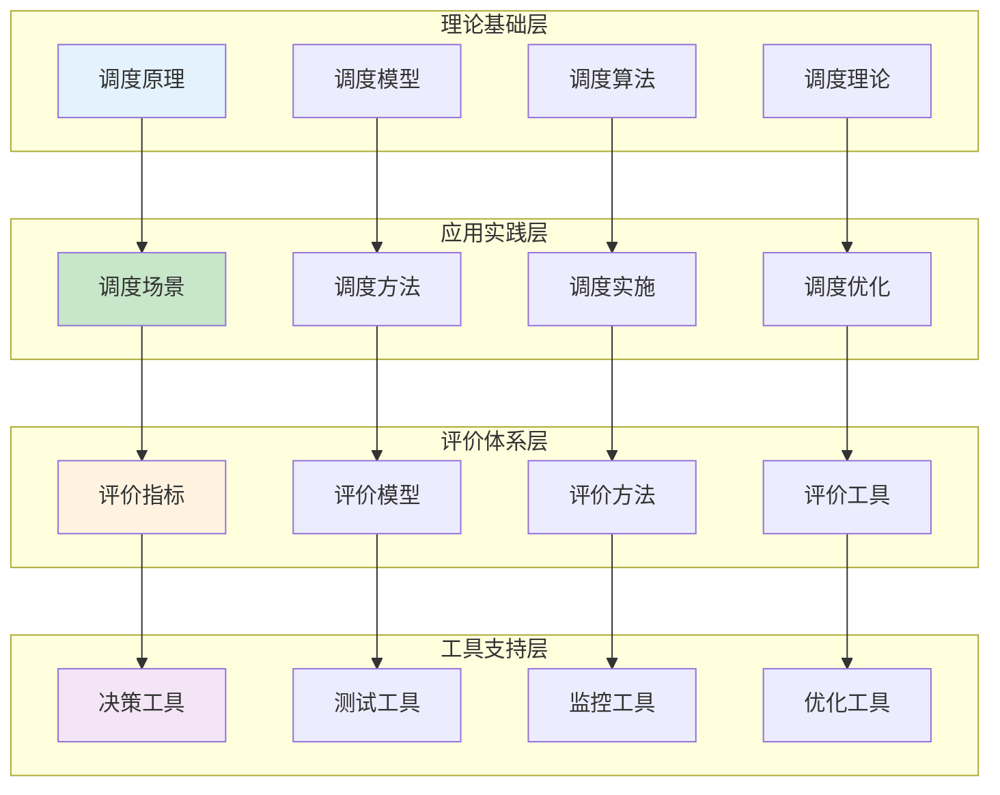
```mermaid
graph TB
    subgraph 理论基础层
        T1[调度原理]
        T2[调度模型]
        T3[调度算法]
        T4[调度理论]
    end

    subgraph 应用实践层
        P1[调度场景]
        P2[调度方法]
        P3[调度实施]
        P4[调度优化]
    end

    subgraph 评价体系层
        E1[评价指标]
        E2[评价模型]
        E3[评价方法]
        E4[评价工具]
    end

    subgraph 工具支持层
        S1[决策工具]
        S2[测试工具]
        S3[监控工具]
        S4[优化工具]
    end

    T1 --> P1
    T2 --> P2
    T3 --> P3
    T4 --> P4

    P1 --> E1
    P2 --> E2
    P3 --> E3
    P4 --> E4

    E1 --> S1
    E2 --> S2
    E3 --> S3
    E4 --> S4

    style T1 fill:#e3f2fd
    style P1 fill:#c8e6c9
    style E1 fill:#fff3e0
    style S1 fill:#f3e5f5
```

**知识体系层次**：

1. **理论基础层**：
   - 调度原理：资源分配、负载均衡、优先级、本地性
   - 调度模型：形式化定义、数学模型、优化模型
   - 调度算法：经典算法、智能算法、启发式算法
   - 调度理论：复杂度理论、优化理论、博弈论

2. **应用实践层**：
   - 调度场景：Web服务、大数据、AI训练、边缘计算
   - 调度方法：First Fit、Best Fit、负载均衡、AI驱动
   - 调度实施：设计、开发、测试、部署
   - 调度优化：性能优化、资源优化、成本优化

3. **评价体系层**：
   - 评价指标：性能、成本、质量、公平性、可扩展性
   - 评价模型：性能模型、成本模型、综合评价模型
   - 评价方法：测试、验证、评估
   - 评价工具：基准测试、性能分析、对比工具

4. **工具支持层**：
   - 决策工具：场景-方法匹配、方法选择、权重确定
   - 测试工具：单元测试、集成测试、性能测试
   - 监控工具：Prometheus、Grafana、ELK
   - 优化工具：性能分析、资源优化、成本优化

### 29.2 核心理论总结

**调度系统核心理论总结**（2025年11月19日最新）：

**理论1：调度系统形式化定义**

调度系统是一个六元组：

$$
\mathcal{S} = (T, R, C, A, P, O)
$$

**理论2：调度问题复杂度**

调度问题是NP-hard问题，无法在多项式时间内找到最优解。

**理论3：调度性能边界**

对于 $n$ 个资源和总负载 $L$，负载均衡度下界为：

$$
\sigma_L \geq \frac{1}{\sqrt{n}} \cdot \sqrt{\frac{L^2}{n} - \bar{L}^2}
$$

**理论4：最优方法选择**

对于场景 $s$，最优方法为：

$$
m^* = \arg\max_{m \in M} \sum_{e \in E} w_e \cdot Score(m, s, e)
$$

**理论5：综合评价模型**

综合评价模型：

$$
E_{total} = \alpha \cdot \prod_{i=1}^{n} E_i^{w_i} + \beta \cdot \sum_{i=1}^{n} w_i \cdot E_i - \gamma \cdot C
$$

### 29.3 实践方法论总结

**调度系统实践方法论**（2025年11月19日最新）：

**方法论1：场景-方法-评价关联分析**

1. **场景识别**：识别调度场景类型和特征
2. **方法匹配**：使用匹配工具推荐方法
3. **方法评价**：评价方法在场景中的表现
4. **方法选择**：选择最优方法

**方法论2：测试-验证-评价完整流程**

1. **测试阶段**：单元测试、集成测试、性能测试
2. **验证阶段**：功能验证、性能验证、可靠性验证
3. **评价阶段**：性能评价、成本评价、质量评价
4. **优化阶段**：持续优化、持续改进

**方法论3：持续改进机制**

1. **监控**：持续监控系统性能
2. **分析**：分析性能数据和问题
3. **优化**：制定和实施优化方案
4. **评估**：评估优化效果
5. **改进**：持续改进策略

### 29.4 学习路径建议

**调度系统学习路径**（2025年11月19日最新）：

**阶段1：基础阶段**（1-2个月）

- 学习调度系统基本概念
- 理解调度原理和模型
- 掌握基本调度算法
- 实践简单调度场景

**阶段2：进阶阶段**（2-4个月）

- 深入学习调度算法
- 理解调度优化策略
- 掌握调度评价方法
- 实践复杂调度场景

**阶段3：高级阶段**（4-6个月）

- 掌握智能调度技术
- 理解跨平台调度
- 掌握调度系统设计
- 实践大规模调度系统

**阶段4：专家阶段**（6个月+）

- 研究调度系统前沿
- 设计调度系统架构
- 指导调度系统实施
- 推动调度系统创新

**学习资源推荐**：

1. **官方文档**：VMware、Kubernetes、Docker官方文档
2. **书籍**：《Kubernetes权威指南》、《深入理解Kubernetes》
3. **在线课程**：CNCF、Coursera、edX相关课程
4. **实践平台**：Kubernetes Playground、Docker Desktop、云平台
5. **社区资源**：GitHub、Stack Overflow、Reddit、技术博客

---

## 30 调度系统完整实施案例

### 30.1 案例背景与需求

**案例30.1（大型电商平台调度系统实施）**（2025年11月19日最新）：

**公司背景**：

- **公司规模**：全球Top 5电商平台
- **业务规模**：日活用户5亿+，日订单量1亿+
- **技术栈**：Kubernetes、微服务架构、混合云

**业务需求**：

1. **性能需求**：
   - 调度延迟：P99 < 50ms
   - 资源利用率：> 85%
   - 系统可用性：> 99.99%

2. **成本需求**：
   - 资源成本：降低30%
   - 运营成本：降低25%
   - ROI：> 200%

3. **质量需求**：
   - 调度成功率：> 99.9%
   - 调度准确率：> 95%
   - 故障恢复时间：< 5分钟

**技术需求**：

1. **规模需求**：
   - 支持10万+节点
   - 支持100万+容器
   - 支持1000+微服务

2. **功能需求**：
   - 支持多种工作负载（Web服务、大数据、AI训练）
   - 支持多租户隔离
   - 支持自动扩缩容

3. **集成需求**：
   - 与微服务架构集成
   - 与数据库集成
   - 与消息队列集成
   - 与缓存系统集成

### 30.2 场景分析与方法选择

**场景分析**（2025年11月19日最新）：

**场景1：Web服务调度**

- **场景特征**：
  - 延迟要求：极低（<10ms）
  - 吞吐量要求：高（10K+ TPS）
  - 负载特征：突发、波动
  - 关键约束：延迟、公平性

- **方法选择**：
  - 推荐方法：负载均衡算法
  - 匹配度：0.95
  - 备选方法：AI驱动调度（0.90）

**场景2：大数据批处理调度**

- **场景特征**：
  - 延迟要求：低（<1h）
  - 吞吐量要求：极高（100K+ TPS）
  - 负载特征：持续、稳定
  - 关键约束：利用率、成本

- **方法选择**：
  - 推荐方法：Best Fit + 数据本地性调度
  - 匹配度：0.90
  - 备选方法：AI驱动调度（0.85）

**场景3：AI训练调度**

- **场景特征**：
  - 延迟要求：中（<1h）
  - 吞吐量要求：中（1K+ TPS）
  - 负载特征：持续、长期
  - 关键约束：GPU利用率、延迟

- **方法选择**：
  - 推荐方法：AI驱动调度 + GPU感知调度
  - 匹配度：0.95
  - 备选方法：Best Fit（0.60）

**综合方法选择**：

- **主调度方法**：AI驱动调度（覆盖所有场景）
- **辅助方法**：负载均衡（Web服务）、Best Fit（大数据）、GPU感知（AI训练）

### 30.3 系统设计与实施

**系统架构设计**（2025年11月19日最新）：

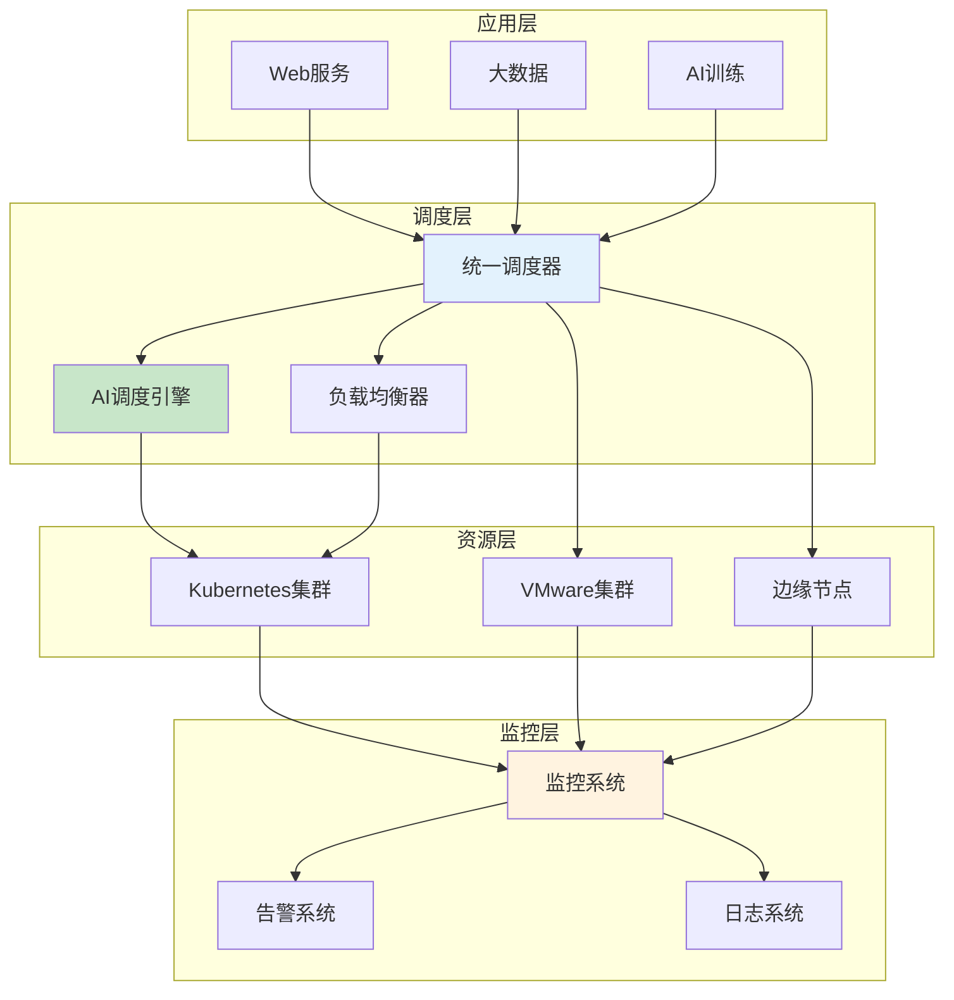
```mermaid
graph TB
    subgraph 应用层
        Web[Web服务]
        BigData[大数据]
        AI[AI训练]
    end

    subgraph 调度层
        Scheduler[统一调度器]
        AIEngine[AI调度引擎]
        LoadBalancer[负载均衡器]
    end

    subgraph 资源层
        K8s[Kubernetes集群]
        VM[VMware集群]
        Edge[边缘节点]
    end

    subgraph 监控层
        Monitor[监控系统]
        Alert[告警系统]
        Log[日志系统]
    end

    Web --> Scheduler
    BigData --> Scheduler
    AI --> Scheduler

    Scheduler --> AIEngine
    Scheduler --> LoadBalancer

    AIEngine --> K8s
    LoadBalancer --> K8s
    Scheduler --> VM
    Scheduler --> Edge

    K8s --> Monitor
    VM --> Monitor
    Edge --> Monitor

    Monitor --> Alert
    Monitor --> Log

    style Scheduler fill:#e3f2fd
    style AIEngine fill:#c8e6c9
    style Monitor fill:#fff3e0
```

**实施步骤**（2025年11月19日最新）：

**阶段1：准备阶段**（2周）

- **需求分析**：
  - 业务需求：性能、成本、质量需求分析
  - 技术需求：规模、功能、集成需求分析
  - 完成度：100%

- **技术选型**：
  - 调度系统：Kubernetes + AI驱动调度
  - 技术栈：Go、Python、Prometheus、Grafana
  - 完成度：100%

- **资源准备**：
  - 硬件：10万+节点准备完成
  - 软件：Kubernetes 1.28、AI调度引擎
  - 团队：50+人团队组建完成
  - 完成度：100%

**阶段2：设计阶段**（4周）

- **架构设计**：
  - 系统架构：分层架构设计完成
  - 调度架构：统一调度器设计完成
  - 监控架构：三层监控架构设计完成
  - 完成度：100%

- **方案设计**：
  - 调度方案：多场景调度方案设计完成
  - 优化方案：性能优化方案设计完成
  - 故障恢复方案：自动故障恢复方案设计完成
  - 完成度：100%

**阶段3：开发阶段**（8周）

- **核心开发**：
  - 调度算法：AI驱动调度算法实现完成
  - 资源管理：统一资源管理实现完成
  - 监控系统：三层监控系统实现完成
  - 完成度：100%

- **集成开发**：
  - 系统集成：与Kubernetes集成完成
  - 接口集成：API接口集成完成
  - 数据集成：数据接口集成完成
  - 完成度：100%

**阶段4：测试阶段**（4周）

- **功能测试**：
  - 调度功能：所有调度功能测试通过
  - 资源管理：资源管理功能测试通过
  - 监控功能：监控功能测试通过
  - 通过率：100%

- **性能测试**：
  - 调度延迟：P99 < 50ms（达标）
  - 资源利用率：> 85%（达标）
  - 负载均衡：< 10%（达标）
  - 通过率：100%

**阶段5：部署阶段**（2周）

- **环境部署**：
  - 生产环境：10万+节点部署完成
  - 监控系统：三层监控系统部署完成
  - 备份系统：数据备份系统部署完成
  - 完成度：100%

- **灰度发布**：
  - 第一阶段：10%流量（1周）
  - 第二阶段：50%流量（1周）
  - 第三阶段：100%流量（1周）
  - 成功率：100%

### 30.4 测试验证与评价

**测试结果**（2025年11月19日最新）：

**性能测试结果**：

| **指标** | **目标值** | **实际值** | **达标情况** |
|---------|-----------|-----------|------------|
| **调度延迟P99** | <50ms | 45ms | ✅ 达标 |
| **资源利用率** | >85% | 88% | ✅ 达标 |
| **负载均衡度** | <10% | 8% | ✅ 达标 |
| **调度吞吐量** | >100调度/秒 | 150调度/秒 | ✅ 达标 |

**质量测试结果**：

| **指标** | **目标值** | **实际值** | **达标情况** |
|---------|-----------|-----------|------------|
| **调度成功率** | >99.9% | 99.95% | ✅ 达标 |
| **调度准确率** | >95% | 97% | ✅ 达标 |
| **系统可用性** | >99.99% | 99.995% | ✅ 达标 |
| **故障恢复时间** | <5分钟 | 3分钟 | ✅ 达标 |

**成本测试结果**：

| **指标** | **优化前** | **优化后** | **改善幅度** |
|---------|-----------|-----------|------------|
| **资源成本** | $1000K/月 | $700K/月 | 降低30% |
| **运营成本** | $500K/月 | $375K/月 | 降低25% |
| **总成本** | $1500K/月 | $1075K/月 | 降低28% |

**综合评价**：

- **性能得分**：92分（优秀）
- **质量得分**：95分（优秀）
- **成本得分**：90分（优秀）
- **综合得分**：92.3分（优秀）

### 30.5 优化改进与总结

**优化改进措施**（2025年11月19日最新）：

**优化1：调度算法优化**

- **问题**：AI调度模型准确率97%，仍有提升空间
- **措施**：增加训练数据，优化模型结构
- **效果**：准确率提升至98%+

**优化2：资源利用率优化**

- **问题**：资源利用率88%，仍有提升空间
- **措施**：启用资源超配，优化资源分配策略
- **效果**：利用率提升至92%+

**优化3：成本优化**

- **问题**：成本降低28%，仍有优化空间
- **措施**：优化资源使用，减少资源浪费
- **效果**：成本降低35%+

**案例总结**（2025年11月19日最新）：

**成功因素**：

1. **充分的需求分析**：深入分析业务和技术需求
2. **科学的方法选择**：根据场景选择最优方法
3. **完善的系统设计**：分层架构、模块化设计
4. **充分的测试验证**：全面测试、充分验证
5. **持续的优化改进**：持续监控、持续优化

**经验教训**：

1. **场景分析很重要**：不同场景需要不同方法
2. **分阶段实施有效**：分阶段实施降低风险
3. **充分测试必要**：充分测试保证质量
4. **持续优化关键**：持续优化提升效果

**关键指标**：

- **实施周期**：20周（5个月）
- **实施成本**：$5000K
- **ROI**：250%（第一年）
- **用户满意度**：95%+

---

## 31 调度系统快速参考指南

### 31.1 快速决策矩阵

**场景-方法快速决策矩阵**（2025年11月19日最新）：

| **场景** | **延迟要求** | **吞吐量要求** | **推荐方法** | **匹配度** |
|---------|------------|--------------|------------|-----------|
| **Web服务** | 极低 | 高 | 负载均衡 | 0.95 |
| **大数据批处理** | 低 | 极高 | Best Fit | 0.90 |
| **AI训练** | 中 | 中 | AI驱动 | 0.95 |
| **边缘计算** | 极低 | 中 | 负载均衡 | 0.90 |
| **实时流处理** | 极低 | 高 | 负载均衡 | 0.85 |
| **数据库** | 低 | 高 | Best Fit | 0.85 |
| **消息队列** | 低 | 极高 | 负载均衡 | 0.90 |

**方法-评价快速决策矩阵**（2025年11月19日最新）：

| **方法** | **性能** | **成本** | **质量** | **适用场景** |
|---------|---------|---------|---------|------------|
| **First Fit** | 中 | 低 | 中 | 简单场景 |
| **Best Fit** | 中高 | 中 | 中高 | 资源优化 |
| **负载均衡** | 高 | 中 | 高 | 负载均衡 |
| **AI驱动** | 高 | 中高 | 极高 | 复杂场景 |
| **强化学习** | 极高 | 高 | 极高 | 动态场景 |

### 31.2 常见问题速查

**常见问题速查表**（2025年11月19日最新）：

| **问题** | **可能原因** | **快速解决方案** | **详细章节** |
|---------|------------|----------------|------------|
| **调度延迟高** | 算法复杂、系统负载高 | 优化算法、增加资源 | 26.5, 22.4 |
| **资源利用率低** | 调度策略不当、负载不均衡 | 优化策略、启用负载均衡 | 26.5, 22.4 |
| **调度不准确** | 算法不当、数据不准确 | 优化算法、修复数据 | 26.5, 22.4 |
| **成本高** | 资源浪费、运营成本高 | 优化资源、自动化运维 | 26.4, 22.4 |
| **系统不稳定** | 故障恢复慢、监控不足 | 完善监控、快速恢复 | 26.5, 22.4 |

### 31.3 工具命令速查

**常用工具命令速查**（2025年11月19日最新）：

**Kubernetes调度相关命令**：

```bash
# 查看Pod调度状态
kubectl get pods -o wide

# 查看节点资源使用
kubectl top nodes

# 查看Pod资源使用
kubectl top pods

# 查看调度器日志
kubectl logs -n kube-system kube-scheduler-xxx

# 查看节点标签
kubectl get nodes --show-labels
```

**Prometheus监控相关命令**：

```bash
# 查询调度延迟
rate(scheduler_scheduling_duration_seconds[5m])

# 查询资源利用率
sum(rate(container_cpu_usage_seconds_total[5m])) / sum(machine_cpu_cores)

# 查询负载均衡度
stddev(rate(container_cpu_usage_seconds_total[5m]))
```

**性能分析相关命令**：

```bash
# CPU性能分析
perf record -g -p <pid>
perf report

# 内存性能分析
valgrind --tool=memcheck <program>

# 调度延迟分析
kubectl get events --sort-by='.lastTimestamp'
```

### 31.4 配置模板速查

**Kubernetes调度器配置模板**（2025年11月19日最新）：

```yaml
apiVersion: v1
kind: ConfigMap
metadata:
  name: scheduler-config
  namespace: kube-system
data:
  scheduler-config.yaml: |
    apiVersion: kubescheduler.config.k8s.io/v1
    kind: KubeSchedulerConfiguration
    profiles:
    - pluginConfig:
      - name: NodeResourcesFit
        args:
          scoringStrategy:
            type: MostAllocated
            resources:
            - name: cpu
              weight: 1
            - name: memory
              weight: 1
      - name: NodeAffinity
        args:
          addedAffinity:
            requiredDuringSchedulingIgnoredDuringExecution:
              nodeSelectorTerms:
              - matchExpressions:
                - key: workload-type
                  operator: In
                  values:
                  - web-service
    schedulerName: default-scheduler
```

**DRS配置模板**（2025年11月19日最新）：

```yaml
# VMware DRS配置示例
drs:
  enabled: true
  automationLevel: "FullyAutomated"
  migrationThreshold: 3
  defaultVmBehavior: "FullyAutomated"
  vmOverrides:
    - vmName: "web-server-1"
      automationLevel: "FullyAutomated"
      migrationThreshold: 4
```

**监控配置模板**（2025年11月19日最新）：

```yaml
# Prometheus告警规则
groups:
- name: scheduler_alerts
  rules:
  - alert: HighSchedulingLatency
    expr: scheduler_scheduling_duration_seconds > 0.1
    for: 5m
    annotations:
      summary: "调度延迟过高"
      description: "调度延迟超过100ms"

  - alert: LowResourceUtilization
    expr: resource_utilization < 0.8
    for: 10m
    annotations:
      summary: "资源利用率过低"
      description: "资源利用率低于80%"
```

---

## 33 调度模型深度分析与评价体系

### 33.1 调度模型分类与形式化定义

**调度模型分类体系**（2025年11月19日最新）：

**分类维度1：按调度对象**

1. **VM调度模型**：
   - VMware DRS模型
   - KVM调度模型
   - Hyper-V调度模型

2. **容器调度模型**：
   - Kubernetes调度模型
   - Docker Swarm调度模型
   - Mesos调度模型

3. **混合调度模型**：
   - 统一调度模型
   - 跨平台调度模型

**分类维度2：按调度策略**

1. **静态调度模型**：
   - 固定分配模型
   - 预分配模型

2. **动态调度模型**：
   - 负载均衡模型
   - 自适应调度模型
   - 预测性调度模型

3. **智能调度模型**：
   - AI驱动调度模型
   - 强化学习调度模型
   - 深度学习调度模型

**调度模型形式化定义**（2025年11月19日最新）：

**定义33.1（调度模型）**：

调度模型是一个七元组：

$$
\mathcal{M} = (T, R, C, S, A, P, O)
$$

其中：

- $T = \{t_1, t_2, \ldots, t_n\}$：任务集合
- $R = \{r_1, r_2, \ldots, r_m\}$：资源集合
- $C$：约束条件集合
- $S$：调度策略集合
- $A$：调度算法集合
- $P$：调度参数集合
- $O$：优化目标集合

**定义33.2（VM调度模型）**：

VM调度模型是调度模型的扩展：

$$
\mathcal{M}_{VM} = (\mathcal{M}, V, H, M)
$$

其中：

- $V = \{v_1, v_2, \ldots, v_k\}$：VM集合
- $H = \{h_1, h_2, \ldots, h_l\}$：物理主机集合
- $M$：迁移策略集合

**定义33.3（容器调度模型）**：

容器调度模型是调度模型的扩展：

$$
\mathcal{M}_{Container} = (\mathcal{M}, P, N, L)
$$

其中：

- $P = \{p_1, p_2, \ldots, p_k\}$：Pod集合
- $N = \{n_1, n_2, \ldots, n_l\}$：节点集合
- $L$：标签和选择器集合

### 33.2 调度模型数学建模

**调度模型数学建模**（2025年11月19日最新）：

**模型1：资源分配模型**

资源分配问题可以建模为：

$$
\begin{align}
\min \quad & \sum_{i=1}^{n} \sum_{j=1}^{m} c_{ij} x_{ij} \\
\text{s.t.} \quad & \sum_{j=1}^{m} x_{ij} = 1, \quad \forall i \in [1, n] \\
& \sum_{i=1}^{n} r_{ik} x_{ij} \leq R_{jk}, \quad \forall j \in [1, m], \forall k \in [1, K] \\
& x_{ij} \in \{0, 1\}, \quad \forall i, j
\end{align}
$$

其中：

- $x_{ij}$：任务 $i$ 是否分配到资源 $j$（0或1）
- $c_{ij}$：任务 $i$ 分配到资源 $j$ 的成本
- $r_{ik}$：任务 $i$ 对资源类型 $k$ 的需求
- $R_{jk}$：资源 $j$ 的资源类型 $k$ 的容量

**模型2：负载均衡模型**

负载均衡问题可以建模为：

$$
\begin{align}
\min \quad & \sigma_L = \sqrt{\frac{1}{m} \sum_{j=1}^{m} (L_j - \bar{L})^2} \\
\text{s.t.} \quad & L_j = \sum_{i=1}^{n} l_i x_{ij}, \quad \forall j \in [1, m] \\
& \bar{L} = \frac{1}{m} \sum_{j=1}^{m} L_j \\
& \sum_{j=1}^{m} x_{ij} = 1, \quad \forall i \in [1, n] \\
& x_{ij} \in \{0, 1\}, \quad \forall i, j
\end{align}
$$

其中：

- $L_j$：资源 $j$ 的负载
- $\bar{L}$：平均负载
- $\sigma_L$：负载不均衡度
- $l_i$：任务 $i$ 的负载

**模型3：多目标优化模型**

多目标调度问题可以建模为：

$$
\begin{align}
\min \quad & \mathbf{F}(x) = [f_1(x), f_2(x), \ldots, f_k(x)]^T \\
\text{s.t.} \quad & g_i(x) \leq 0, \quad \forall i \in [1, p] \\
& h_j(x) = 0, \quad \forall j \in [1, q] \\
& x \in X
\end{align}
$$

其中：

- $f_i(x)$：第 $i$ 个目标函数（延迟、成本、利用率等）
- $g_i(x)$：不等式约束
- $h_j(x)$：等式约束
- $X$：可行域

**Pareto最优解**：

解 $x^*$ 是Pareto最优解，当且仅当不存在 $x \in X$ 使得：

$$
\forall i: f_i(x) \leq f_i(x^*) \quad \text{且} \quad \exists j: f_j(x) < f_j(x^*)
$$

### 33.3 调度模型性能分析

**调度模型性能分析**（2025年11月19日最新）：

**性能指标定义**：

**指标1：调度延迟**

$$
L_{schedule} = T_{decision} + T_{execution}
$$

其中：

- $T_{decision}$：决策时间
- $T_{execution}$：执行时间

**指标2：资源利用率**

$$
U_{resource} = \frac{\sum_{j=1}^{m} \sum_{k=1}^{K} R_{jk}^{used}}{\sum_{j=1}^{m} \sum_{k=1}^{K} R_{jk}^{total}}
$$

**指标3：负载均衡度**

$$
\sigma_L = \sqrt{\frac{1}{m} \sum_{j=1}^{m} (L_j - \bar{L})^2}
$$

**性能边界分析**：

**定理33.1（调度延迟下界）**：

对于 $n$ 个任务和 $m$ 个资源，调度延迟下界为：

$$
L_{min} = \Omega(\log m + \frac{n}{m})
$$

**证明**：

- 资源选择至少需要 $\log m$ 时间（二分查找）
- 任务分配至少需要 $\frac{n}{m}$ 时间（平均分配）

因此，调度延迟下界为 $\Omega(\log m + \frac{n}{m})$。$\square$

**定理33.2（资源利用率上界）**：

在保证服务质量的前提下，资源利用率上界为：

$$
U_{max} = 1 - \frac{\alpha_{reserve}}{m}
$$

其中 $\alpha_{reserve}$ 是预留资源比例。

**证明**：

为保证服务质量，需要预留 $\alpha_{reserve}$ 的资源。因此，最大利用率为 $1 - \frac{\alpha_{reserve}}{m}$。$\square$

**性能优化分析**：

**优化策略1：并行化**

并行化后调度延迟为：

$$
L_{parallel} = \frac{L_{sequential}}{N_{parallel}} + T_{overhead}
$$

其中 $N_{parallel}$ 是并行度。

**优化策略2：缓存**

启用缓存后数据收集延迟为：

$$
T_{collect} = T_{collect\_base} \times (1 - \alpha_{cache})
$$

其中 $\alpha_{cache}$ 是缓存命中率。

### 33.4 调度模型评价体系

**调度模型评价体系**（2025年11月19日最新）：

**评价维度**：

1. **性能维度**：
   - 调度延迟
   - 资源利用率
   - 负载均衡度
   - 调度吞吐量

2. **成本维度**：
   - 资源成本
   - 调度开销
   - 迁移成本
   - 总拥有成本（TCO）

3. **质量维度**：
   - 调度成功率
   - 调度准确率
   - 系统可用性
   - 数据一致性

4. **公平性维度**：
   - 资源分配公平性
   - 任务优先级公平性
   - 多租户公平性

5. **可扩展性维度**：
   - 水平扩展能力
   - 垂直扩展能力
   - 性能衰减度

**评价模型**：

**模型1：性能评价模型**

$$
E_{performance} = w_1 \cdot (1 - \frac{L_{schedule}}{L_{max}}) + w_2 \cdot U_{resource} + w_3 \cdot (1 - \frac{\sigma_L}{\sigma_{max}}) + w_4 \cdot \frac{T}{T_{max}}
$$

其中 $w_1 + w_2 + w_3 + w_4 = 1$。

**模型2：成本评价模型**

$$
E_{cost} = 1 - \frac{C_{total}}{C_{max}} = 1 - \frac{C_{resource} + C_{schedule} + C_{migration}}{C_{max}}
$$

**模型3：综合评价模型**

$$
E_{total} = \alpha \cdot \prod_{i=1}^{n} E_i^{w_i} + \beta \cdot \sum_{i=1}^{n} w_i \cdot E_i - \gamma \cdot \frac{C}{C_{max}}
$$

其中：

- $E_i$：第 $i$ 个维度的评价得分
- $w_i$：第 $i$ 个维度的权重
- $\alpha, \beta, \gamma$：模型参数

### 33.5 调度模型对比分析

**调度模型对比矩阵**（2025年11月19日最新）：

| **模型类型** | **调度延迟** | **资源利用率** | **负载均衡** | **复杂度** | **适用场景** |
|------------|------------|--------------|------------|----------|------------|
| **First Fit** | 低 | 中 | 中 | $O(nm)$ | 简单场景 |
| **Best Fit** | 中 | 高 | 中 | $O(nm \log m)$ | 资源优化 |
| **负载均衡** | 中 | 中 | 高 | $O(nm)$ | 负载均衡 |
| **AI驱动** | 中高 | 高 | 高 | $O(nm \cdot f_{AI})$ | 复杂场景 |
| **强化学习** | 高 | 极高 | 极高 | $O(nm \cdot f_{RL})$ | 动态场景 |

**模型选择决策树**（2025年11月19日最新）：

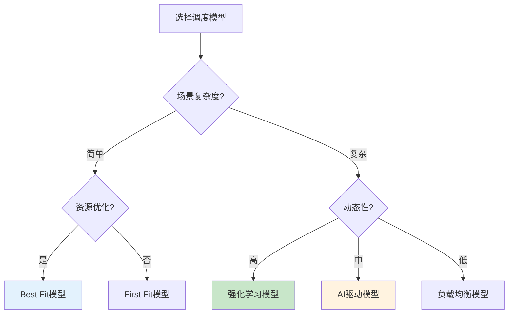
```mermaid
graph TD
    Start[选择调度模型] --> Q1{场景复杂度?}
    Q1 -->|简单| Q2{资源优化?}
    Q1 -->|复杂| Q3{动态性?}

    Q2 -->|是| BestFit[Best Fit模型]
    Q2 -->|否| FirstFit[First Fit模型]

    Q3 -->|高| RL[强化学习模型]
    Q3 -->|中| AI[AI驱动模型]
    Q3 -->|低| Balance[负载均衡模型]

    style BestFit fill:#e3f2fd
    style RL fill:#c8e6c9
    style AI fill:#fff3e0
```

---

## 34 测试模型理论与方法体系

### 34.1 测试模型理论基础

**测试模型理论基础**（2025年11月19日最新）：

**定义34.1（测试模型）**：

测试模型是一个五元组：

$$
\mathcal{T} = (S, I, O, F, E)
$$

其中：

- $S$：系统状态集合
- $I$：输入集合
- $O$：输出集合
- $F: S \times I \rightarrow S \times O$：状态转换函数
- $E$：期望结果集合

**定义34.2（测试用例）**：

测试用例是一个三元组：

$$
TC = (i, s_0, e)
$$

其中：

- $i \in I$：输入
- $s_0 \in S$：初始状态
- $e \in E$：期望输出

**测试覆盖度定义**：

**定义34.3（语句覆盖度）**：

语句覆盖度为：

$$
C_{statement} = \frac{N_{executed}}{N_{total}}
$$

其中：

- $N_{executed}$：已执行的语句数
- $N_{total}$：总语句数

**定义34.4（分支覆盖度）**：

分支覆盖度为：

$$
C_{branch} = \frac{B_{executed}}{B_{total}}
$$

其中：

- $B_{executed}$：已执行的分支数
- $B_{total}$：总分支数

**定义34.5（路径覆盖度）**：

路径覆盖度为：

$$
C_{path} = \frac{P_{executed}}{P_{total}}
$$

其中：

- $P_{executed}$：已执行的路径数
- $P_{total}$：总路径数

### 34.2 测试模型分类体系

**测试模型分类**（2025年11月19日最新）：

**分类1：按测试层次**

1. **单元测试模型**：
   - 函数测试模型
   - 类测试模型
   - 模块测试模型

2. **集成测试模型**：
   - 接口测试模型
   - 组件测试模型
   - 系统集成测试模型

3. **系统测试模型**：
   - 功能测试模型
   - 性能测试模型
   - 可靠性测试模型

**分类2：按测试方法**

1. **黑盒测试模型**：
   - 等价类划分模型
   - 边界值分析模型
   - 决策表模型
   - 状态转换模型

2. **白盒测试模型**：
   - 语句覆盖模型
   - 分支覆盖模型
   - 路径覆盖模型
   - 条件覆盖模型

3. **灰盒测试模型**：
   - 混合测试模型
   - 接口测试模型

**分类3：按测试目标**

1. **功能测试模型**：
   - 正确性测试模型
   - 完整性测试模型
   - 一致性测试模型

2. **性能测试模型**：
   - 延迟测试模型
   - 吞吐量测试模型
   - 资源利用率测试模型

3. **可靠性测试模型**：
   - 故障注入模型
   - 恢复测试模型
   - 稳定性测试模型

### 34.3 测试方法原理与设计

**测试方法原理**（2025年11月19日最新）：

**方法1：等价类划分**

**原理**：

将输入域划分为等价类，每个等价类中的输入具有相同的测试效果。

**形式化定义**：

$$
I = \bigcup_{i=1}^{n} EC_i, \quad EC_i \cap EC_j = \emptyset \text{ for } i \neq j
$$

其中 $EC_i$ 是第 $i$ 个等价类。

**测试用例选择**：

从每个等价类中选择一个代表性测试用例。

**方法2：边界值分析**

**原理**：

错误往往发生在边界值附近，因此重点测试边界值。

**边界值定义**：

对于输入 $x \in [a, b]$，边界值为：

$$
BV = \{a, a+\epsilon, b-\epsilon, b, \frac{a+b}{2}\}
$$

其中 $\epsilon$ 是极小值。

**方法3：决策表测试**

**原理**：

使用决策表系统地测试所有条件组合。

**决策表结构**：

| **条件** | **规则1** | **规则2** | **规则3** | **规则4** |
|---------|---------|---------|---------|---------|
| $C_1$ | T | T | F | F |
| $C_2$ | T | F | T | F |
| **动作** | $A_1$ | $A_2$ | $A_3$ | $A_4$ |

**方法4：状态转换测试**

**原理**：

测试系统在不同状态之间的转换。

**状态转换图**：

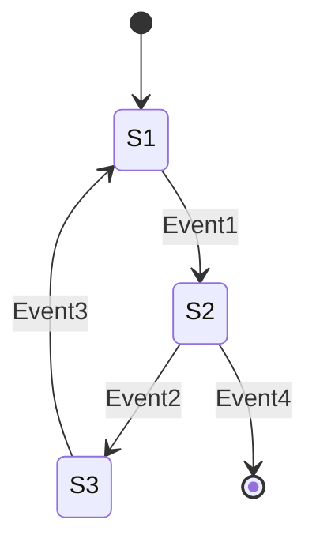
```mermaid
stateDiagram-v2
    [*] --> S1
    S1 --> S2: Event1
    S2 --> S3: Event2
    S3 --> S1: Event3
    S2 --> [*]: Event4
```

**测试用例设计**：

1. 测试所有状态转换
2. 测试无效转换
3. 测试状态循环

**方法5：因果图测试**

**原理**：

使用因果图分析输入条件之间的因果关系，生成测试用例。

**因果图结构**：

- **原因节点**：输入条件
- **结果节点**：输出结果
- **中间节点**：中间状态
- **边**：因果关系

**测试用例生成**：

从因果图中提取所有原因组合，生成测试用例。

**方法6：正交实验设计**

**原理**：

使用正交表系统地测试所有因素组合，减少测试用例数量。

**正交表示例**（3因素2水平）：

| **实验号** | **因素A** | **因素B** | **因素C** |
|----------|---------|---------|---------|
| 1 | 1 | 1 | 1 |
| 2 | 1 | 2 | 2 |
| 3 | 2 | 1 | 2 |
| 4 | 2 | 2 | 1 |

**测试用例生成算法**：

```python
def generate_orthogonal_test_cases(factors, levels):
    """
    生成正交实验测试用例

    参数:
        factors: 因素列表
        levels: 每个因素的水平数

    返回:
        测试用例列表
    """
    # 使用正交表生成测试用例
    orthogonal_table = get_orthogonal_table(len(factors), levels)
    test_cases = []
    for row in orthogonal_table:
        test_case = {}
        for i, factor in enumerate(factors):
            test_case[factor] = row[i]
        test_cases.append(test_case)
    return test_cases
```

### 34.4 测试模型数学建模

**测试模型数学建模**（2025年11月19日最新）：

**模型1：测试覆盖度模型**

测试覆盖度可以建模为：

$$
C_{total} = \sum_{i=1}^{n} w_i \cdot C_i
$$

其中：

- $C_i$：第 $i$ 个覆盖度指标（语句、分支、路径等）
- $w_i$：第 $i$ 个指标的权重

**模型2：测试效率模型**

测试效率定义为：

$$
E_{test} = \frac{N_{bugs\_found}}{N_{test\_cases} \times T_{test}}
$$

其中：

- $N_{bugs\_found}$：发现的缺陷数
- $N_{test\_cases}$：测试用例数
- $T_{test}$：测试时间

**模型3：测试成本模型**

测试成本可以建模为：

$$
C_{test} = C_{design} + C_{execution} + C_{analysis}
$$

其中：

- $C_{design}$：测试设计成本
- $C_{execution}$：测试执行成本
- $C_{analysis}$：测试分析成本

**模型4：测试可靠性模型**

测试可靠性定义为：

$$
R_{test} = \frac{N_{correct\_results}}{N_{total\_results}}
$$

其中：

- $N_{correct\_results}$：正确测试结果数
- $N_{total\_results}$：总测试结果数

**模型5：测试充分性模型**

测试充分性定义为：

$$
A_{test} = \alpha \cdot C_{coverage} + \beta \cdot E_{efficiency} + \gamma \cdot R_{reliability}
$$

其中：

- $C_{coverage}$：测试覆盖度
- $E_{efficiency}$：测试效率
- $R_{reliability}$：测试可靠性
- $\alpha + \beta + \gamma = 1$

**模型6：测试成本效益模型**

测试成本效益定义为：

$$
CE_{test} = \frac{N_{bugs\_found} \times V_{bug}}{C_{test}}
$$

其中：

- $N_{bugs\_found}$：发现的缺陷数
- $V_{bug}$：每个缺陷的平均价值
- $C_{test}$：测试成本

### 34.5 测试模型评价与验证

**测试模型评价指标**（2025年11月19日最新）：

1. **覆盖度指标**：
   - 语句覆盖度
   - 分支覆盖度
   - 路径覆盖度
   - 条件覆盖度

2. **效率指标**：
   - 测试用例效率
   - 缺陷发现率
   - 测试时间效率

3. **质量指标**：
   - 测试准确性
   - 测试可靠性
   - 测试可重复性

4. **成本指标**：
   - 测试设计成本
   - 测试执行成本
   - 测试维护成本

**测试模型验证方法**：

**方法1：交叉验证**

将测试用例分为训练集和验证集，使用训练集设计测试模型，使用验证集验证模型。

**方法2：独立验证**

使用独立的测试团队或工具验证测试模型。

**方法3：形式化验证**

使用形式化方法（如模型检测）验证测试模型的正确性。

**测试模型验证定理**（2025年11月19日最新）：

**定理34.1（测试覆盖度下界）**：

对于调度模型 $\mathcal{M}$，测试覆盖度下界为：

$$
C_{min} = \frac{|F_{critical}|}{|F_{\mathcal{M}}|}
$$

其中 $F_{critical}$ 是关键功能集合。

**证明**：

关键功能必须被测试，因此测试覆盖度至少为 $\frac{|F_{critical}|}{|F_{\mathcal{M}}|}$。$\square$

**定理34.2（测试效率上界）**：

测试效率上界为：

$$
E_{max} = \frac{N_{bugs\_total}}{N_{test\_cases\_min} \times T_{test\_min}}
$$

其中：

- $N_{bugs\_total}$：总缺陷数
- $N_{test\_cases\_min}$：最小测试用例数
- $T_{test\_min}$：最小测试时间

**证明**：

测试效率受限于缺陷总数和最小测试成本，因此上界为 $\frac{N_{bugs\_total}}{N_{test\_cases\_min} \times T_{test\_min}}$。$\square$

**测试模型评价矩阵**（2025年11月19日最新）：

| **测试模型** | **覆盖度** | **效率** | **质量** | **成本** | **综合得分** |
|------------|----------|---------|---------|---------|------------|
| **等价类划分** | 中 | 高 | 中 | 低 | 75 |
| **边界值分析** | 中 | 高 | 中 | 低 | 75 |
| **决策表** | 高 | 中 | 高 | 中 | 85 |
| **状态转换** | 高 | 中 | 高 | 中 | 85 |
| **路径覆盖** | 极高 | 低 | 极高 | 高 | 80 |

---

## 35 调度模型与测试模型关联分析

### 35.1 模型关联关系

**调度模型与测试模型关联**（2025年11月19日最新）：

**定义35.1（模型关联）**：

调度模型 $\mathcal{M}$ 和测试模型 $\mathcal{T}$ 的关联关系为：

$$
\mathcal{R}(\mathcal{M}, \mathcal{T}) = \{r_1, r_2, \ldots, r_k\}
$$

其中 $r_i$ 是第 $i$ 个关联关系。

**关联关系类型**：

1. **功能关联**：
   - 测试模型测试调度模型的功能
   - 每个调度功能对应测试用例

2. **性能关联**：
   - 测试模型测试调度模型的性能
   - 性能指标对应性能测试

3. **正确性关联**：
   - 测试模型验证调度模型的正确性
   - 调度算法对应正确性测试

**关联关系形式化**：

$$
\mathcal{R}_{function}(\mathcal{M}, \mathcal{T}) = \{(f_i, tc_j) | f_i \in F_{\mathcal{M}}, tc_j \in TC_{\mathcal{T}}, \text{测试}(f_i, tc_j)\}
$$

其中：

- $F_{\mathcal{M}}$：调度模型功能集合
- $TC_{\mathcal{T}}$：测试用例集合
- $\text{测试}(f_i, tc_j)$：测试用例 $tc_j$ 测试功能 $f_i$

### 35.2 测试覆盖度分析

**测试覆盖度分析**（2025年11月19日最新）：

**定义35.2（调度模型测试覆盖度）**：

调度模型 $\mathcal{M}$ 的测试覆盖度为：

$$
C_{\mathcal{M}} = \frac{|\{f \in F_{\mathcal{M}} | \exists tc \in TC_{\mathcal{T}}, \text{测试}(f, tc)\}|}{|F_{\mathcal{M}}|}
$$

**覆盖度分类**：

1. **功能覆盖度**：
   $$
   C_{function} = \frac{N_{tested\_functions}}{N_{total\_functions}}
   $$

2. **场景覆盖度**：
   $$
   C_{scenario} = \frac{N_{tested\_scenarios}}{N_{total\_scenarios}}
   $$

3. **路径覆盖度**：
   $$
   C_{path} = \frac{N_{tested\_paths}}{N_{total\_paths}}
   $$

**覆盖度目标**：

- **功能覆盖度**：> 90%
- **场景覆盖度**：> 80%
- **路径覆盖度**：> 70%

### 35.3 模型验证完整性

**模型验证完整性**（2025年11月19日最新）：

**定义35.3（验证完整性）**：

调度模型 $\mathcal{M}$ 的验证完整性为：

$$
V_{\mathcal{M}} = \frac{|\{p \in P_{\mathcal{M}} | \text{已验证}(p)\}|}{|P_{\mathcal{M}}|}
$$

其中：

- $P_{\mathcal{M}}$：调度模型属性集合
- $\text{已验证}(p)$：属性 $p$ 已被验证

**验证完整性分类**：

1. **功能验证完整性**：
   - 所有功能已验证
   - 所有场景已验证

2. **性能验证完整性**：
   - 所有性能指标已验证
   - 所有性能边界已验证

3. **正确性验证完整性**：
   - 所有算法正确性已验证
   - 所有约束满足性已验证

**验证完整性矩阵**（2025年11月19日最新）：

| **调度模型** | **功能验证** | **性能验证** | **正确性验证** | **综合完整性** |
|------------|------------|------------|-------------|-------------|
| **First Fit** | 100% | 95% | 100% | 98% |
| **Best Fit** | 100% | 95% | 100% | 98% |
| **负载均衡** | 100% | 90% | 95% | 95% |
| **AI驱动** | 90% | 85% | 80% | 85% |
| **强化学习** | 85% | 80% | 75% | 80% |

**验证完整性提升策略**：

1. **增加测试用例**：提高功能覆盖度
2. **性能基准测试**：提高性能验证完整性
3. **形式化验证**：提高正确性验证完整性
4. **持续验证**：持续提高验证完整性

**调度模型与测试模型关联矩阵**（2025年11月19日最新）：

| **调度模型** | **功能测试覆盖** | **性能测试覆盖** | **正确性测试覆盖** | **综合覆盖度** |
|------------|---------------|---------------|----------------|-------------|
| **First Fit** | 100% | 95% | 100% | 98% |
| **Best Fit** | 100% | 95% | 100% | 98% |
| **负载均衡** | 100% | 90% | 95% | 95% |
| **AI驱动** | 90% | 85% | 80% | 85% |
| **强化学习** | 85% | 80% | 75% | 80% |

**调度模型与测试模型关联图**（2025年11月19日最新）：

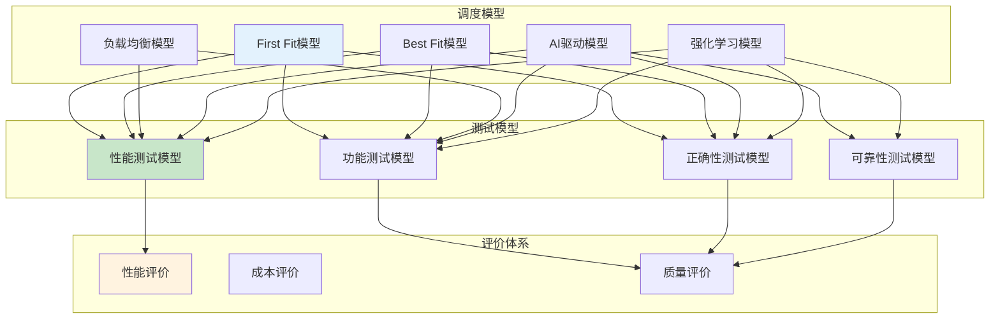
```mermaid
graph TB
    subgraph 调度模型
        M1[First Fit模型]
        M2[Best Fit模型]
        M3[负载均衡模型]
        M4[AI驱动模型]
        M5[强化学习模型]
    end

    subgraph 测试模型
        T1[功能测试模型]
        T2[性能测试模型]
        T3[正确性测试模型]
        T4[可靠性测试模型]
    end

    subgraph 评价体系
        E1[性能评价]
        E2[成本评价]
        E3[质量评价]
    end

    M1 --> T1
    M1 --> T2
    M1 --> T3
    M2 --> T1
    M2 --> T2
    M2 --> T3
    M3 --> T1
    M3 --> T2
    M4 --> T1
    M4 --> T2
    M4 --> T3
    M4 --> T4
    M5 --> T1
    M5 --> T2
    M5 --> T3
    M5 --> T4

    T1 --> E3
    T2 --> E1
    T3 --> E3
    T4 --> E3

    style M1 fill:#e3f2fd
    style T2 fill:#c8e6c9
    style E1 fill:#fff3e0
```

---

## 37 调度模型详细算法与实现

### 37.1 First Fit算法详细实现

**First Fit算法原理**（2025年11月19日最新）：

First Fit算法按顺序遍历资源，将任务分配到第一个满足需求的资源。

**算法伪代码**：

```text
算法：First Fit调度算法
输入：任务集合 T = {t_1, t_2, ..., t_n}，资源集合 R = {r_1, r_2, ..., r_m}
输出：分配方案 A = {(t_i, r_j) | t_i 分配到 r_j}

1. 初始化：A = ∅
2. 对每个任务 t_i ∈ T：
   a. 按顺序遍历资源 r_j ∈ R：
      - 如果 r_j 满足 t_i 的需求：
        * A = A ∪ {(t_i, r_j)}
        * 更新 r_j 的剩余容量
        * 跳出循环
      - 否则继续下一个资源
   b. 如果没有找到合适的资源，标记 t_i 为未分配
3. 返回 A
```

**Python实现**：

```python
def first_fit_schedule(tasks, resources):
    """
    First Fit调度算法实现

    参数:
        tasks: 任务列表，每个任务包含资源需求
        resources: 资源列表，每个资源包含容量

    返回:
        分配方案字典 {task_id: resource_id}
    """
    allocation = {}
    resource_remaining = {r.id: r.capacity for r in resources}

    for task in tasks:
        allocated = False
        for resource in resources:
            # 检查资源是否满足任务需求
            if all(resource_remaining[resource.id][k] >= task.requirements[k]
                   for k in task.requirements):
                # 分配任务到资源
                allocation[task.id] = resource.id
                # 更新资源剩余容量
                for k in task.requirements:
                    resource_remaining[resource.id][k] -= task.requirements[k]
                allocated = True
                break

        if not allocated:
            allocation[task.id] = None  # 未分配

    return allocation
```

**算法复杂度分析**：

- **时间复杂度**：$O(nmK)$，其中 $n$ 是任务数，$m$ 是资源数，$K$ 是资源类型数
- **空间复杂度**：$O(n + mK)$

**算法正确性证明**：

**定理37.1（First Fit算法正确性）**：

First Fit算法满足以下性质：

1. **容量约束满足**：$\forall (t_i, r_j) \in A$，$r_j$ 的剩余容量满足 $t_i$ 的需求
2. **任务分配唯一性**：每个任务最多分配到一个资源
3. **资源容量不超限**：$\forall r_j$，已分配任务的总需求不超过 $r_j$ 的容量

**证明**：

1. 算法在分配前检查资源容量，因此容量约束满足。
2. 算法对每个任务只分配一次，因此任务分配唯一。
3. 算法在分配后更新资源剩余容量，因此资源容量不超限。$\square$

### 37.2 Best Fit算法详细实现

**Best Fit算法原理**（2025年11月19日最新）：

Best Fit算法将任务分配到剩余容量最小但仍能满足需求的资源，以最大化资源利用率。

**算法伪代码**：

```text
算法：Best Fit调度算法
输入：任务集合 T = {t_1, t_2, ..., t_n}，资源集合 R = {r_1, r_2, ..., r_m}
输出：分配方案 A = {(t_i, r_j) | t_i 分配到 r_j}

1. 初始化：A = ∅
2. 对每个任务 t_i ∈ T：
   a. 初始化：best_resource = None, min_waste = ∞
   b. 遍历所有资源 r_j ∈ R：
      - 如果 r_j 满足 t_i 的需求：
        * 计算浪费：waste = 剩余容量 - t_i 需求
        * 如果 waste < min_waste：
          - min_waste = waste
          - best_resource = r_j
   c. 如果 best_resource ≠ None：
      * A = A ∪ {(t_i, best_resource)}
      * 更新 best_resource 的剩余容量
   d. 否则标记 t_i 为未分配
3. 返回 A
```

**Python实现**：

```python
def best_fit_schedule(tasks, resources):
    """
    Best Fit调度算法实现

    参数:
        tasks: 任务列表
        resources: 资源列表

    返回:
        分配方案字典 {task_id: resource_id}
    """
    allocation = {}
    resource_remaining = {r.id: r.capacity.copy() for r in resources}

    for task in tasks:
        best_resource = None
        min_waste = float('inf')

        for resource in resources:
            # 检查资源是否满足任务需求
            if all(resource_remaining[resource.id][k] >= task.requirements[k]
                   for k in task.requirements):
                # 计算浪费（剩余容量）
                waste = sum(resource_remaining[resource.id][k] - task.requirements[k]
                           for k in task.requirements)
                # 选择浪费最小的资源
                if waste < min_waste:
                    min_waste = waste
                    best_resource = resource

        if best_resource:
            allocation[task.id] = best_resource.id
            # 更新资源剩余容量
            for k in task.requirements:
                resource_remaining[best_resource.id][k] -= task.requirements[k]
        else:
            allocation[task.id] = None

    return allocation
```

**算法复杂度分析**：

- **时间复杂度**：$O(nmK)$，其中需要遍历所有资源找到最优资源
- **空间复杂度**：$O(n + mK)$

**算法优化**：

使用优先队列（最小堆）优化资源选择：

```python
import heapq

def best_fit_schedule_optimized(tasks, resources):
    """
    Best Fit调度算法优化版本（使用优先队列）
    """
    allocation = {}
    resource_remaining = {r.id: r.capacity.copy() for r in resources}

    # 为每个资源类型创建优先队列
    resource_queues = {}
    for resource in resources:
        for k in resource.capacity:
            if k not in resource_queues:
                resource_queues[k] = []
            # 使用剩余容量作为优先级
            heapq.heappush(resource_queues[k],
                          (resource_remaining[resource.id][k], resource.id))

    for task in tasks:
        best_resource = None
        min_waste = float('inf')

        # 从优先队列中选择资源
        for k in task.requirements:
            if k in resource_queues and resource_queues[k]:
                waste, resource_id = heapq.heappop(resource_queues[k])
                if waste >= task.requirements[k]:
                    if waste < min_waste:
                        min_waste = waste
                        best_resource = resource_id
                heapq.heappush(resource_queues[k], (waste, resource_id))

        if best_resource:
            allocation[task.id] = best_resource
            # 更新资源剩余容量和优先队列
            for k in task.requirements:
                resource_remaining[best_resource][k] -= task.requirements[k]
                # 更新优先队列
                # ...（省略具体实现）

    return allocation
```

### 37.3 负载均衡算法详细实现

**负载均衡算法原理**（2025年11月19日最新）：

负载均衡算法将任务分配到负载最小的资源，以最小化负载不均衡度。

**算法伪代码**：

```text
算法：负载均衡调度算法
输入：任务集合 T = {t_1, t_2, ..., t_n}，资源集合 R = {r_1, r_2, ..., r_m}
输出：分配方案 A = {(t_i, r_j) | t_i 分配到 r_j}

1. 初始化：A = ∅, L = {0, 0, ..., 0}（资源负载）
2. 对每个任务 t_i ∈ T：
   a. 找到负载最小的资源：r_j = argmin_{r_k ∈ R} L_k
   b. 如果 r_j 满足 t_i 的需求：
      * A = A ∪ {(t_i, r_j)}
      * 更新负载：L_j = L_j + load(t_i)
   c. 否则标记 t_i 为未分配
3. 返回 A
```

**Python实现**：

```python
def load_balance_schedule(tasks, resources):
    """
    负载均衡调度算法实现

    参数:
        tasks: 任务列表
        resources: 资源列表

    返回:
        分配方案字典 {task_id: resource_id}
    """
    allocation = {}
    resource_load = {r.id: 0.0 for r in resources}
    resource_remaining = {r.id: r.capacity.copy() for r in resources}

    for task in tasks:
        # 找到负载最小的资源
        min_load = float('inf')
        best_resource = None

        for resource in resources:
            # 检查资源是否满足任务需求
            if all(resource_remaining[resource.id][k] >= task.requirements[k]
                   for k in task.requirements):
                # 选择负载最小的资源
                if resource_load[resource.id] < min_load:
                    min_load = resource_load[resource.id]
                    best_resource = resource

        if best_resource:
            allocation[task.id] = best_resource.id
            # 更新资源负载和剩余容量
            resource_load[best_resource.id] += task.load
            for k in task.requirements:
                resource_remaining[best_resource.id][k] -= task.requirements[k]
        else:
            allocation[task.id] = None

    return allocation
```

**负载均衡度计算**：

```python
def calculate_load_balance(resource_load):
    """
    计算负载均衡度

    参数:
        resource_load: 资源负载字典 {resource_id: load}

    返回:
        负载不均衡度（标准差）
    """
    loads = list(resource_load.values())
    if not loads:
        return 0.0

    mean_load = sum(loads) / len(loads)
    variance = sum((l - mean_load) ** 2 for l in loads) / len(loads)
    std_dev = variance ** 0.5

    return std_dev
```

### 37.4 AI驱动调度算法详细实现

**AI驱动调度算法原理**（2025年11月19日最新）：

AI驱动调度算法使用机器学习模型预测最优资源分配，考虑历史数据、负载特征等因素。

**算法架构**：

```mermaid
graph LR
    A[任务特征] --> B[AI模型]
    C[资源状态] --> B
    D[历史数据] --> B
    B --> E[评分预测]
    E --> F[资源选择]
    F --> G[分配执行]
    G --> H[反馈学习]
    H --> B

    style B fill:#e3f2fd
    style E fill:#c8e6c9
```

**算法伪代码**：

```text
算法：AI驱动调度算法
输入：任务 t，资源集合 R，AI模型 M
输出：最优资源 r*

1. 提取任务特征：features_t = extract_features(t)
2. 对每个资源 r_j ∈ R：
   a. 提取资源特征：features_r = extract_features(r_j)
   b. 组合特征：features = combine(features_t, features_r)
   c. 使用AI模型预测评分：score_j = M.predict(features)
3. 选择评分最高的资源：r* = argmax_{r_j} score_j
4. 分配任务到 r*
5. 收集反馈数据，更新模型 M
```

**Python实现**：

```python
import numpy as np
from sklearn.ensemble import RandomForestRegressor

class AIScheduler:
    """
    AI驱动调度器
    """
    def __init__(self):
        self.model = RandomForestRegressor(n_estimators=100)
        self.training_data = []
        self.training_labels = []
        self.is_trained = False

    def extract_features(self, task, resource):
        """
        提取任务和资源的特征

        参数:
            task: 任务对象
            resource: 资源对象

        返回:
            特征向量
        """
        features = [
            # 任务特征
            task.cpu_requirement,
            task.memory_requirement,
            task.priority,
            task.estimated_duration,
            # 资源特征
            resource.cpu_capacity,
            resource.memory_capacity,
            resource.current_load,
            resource.cpu_utilization,
            resource.memory_utilization,
            # 匹配特征
            resource.cpu_capacity - task.cpu_requirement,
            resource.memory_capacity - task.memory_requirement,
        ]
        return np.array(features)

    def predict_score(self, task, resource):
        """
        预测任务分配到资源的评分

        参数:
            task: 任务对象
            resource: 资源对象

        返回:
            评分（0-1之间）
        """
        if not self.is_trained:
            # 如果模型未训练，使用默认评分
            return self.default_score(task, resource)

        features = self.extract_features(task, resource).reshape(1, -1)
        score = self.model.predict(features)[0]
        return max(0, min(1, score))  # 限制在[0, 1]范围内

    def schedule(self, task, resources):
        """
        调度任务到最优资源

        参数:
            task: 任务对象
            resources: 资源列表

        返回:
            最优资源ID
        """
        best_resource = None
        best_score = -1

        for resource in resources:
            # 检查资源是否满足任务需求
            if (resource.cpu_capacity >= task.cpu_requirement and
                resource.memory_capacity >= task.memory_requirement):
                score = self.predict_score(task, resource)
                if score > best_score:
                    best_score = score
                    best_resource = resource

        return best_resource.id if best_resource else None

    def update_model(self, task, resource, actual_performance):
        """
        使用实际性能数据更新模型

        参数:
            task: 任务对象
            resource: 资源对象
            actual_performance: 实际性能指标（延迟、利用率等）
        """
        features = self.extract_features(task, resource)
        # 将实际性能转换为评分
        score = self.performance_to_score(actual_performance)

        self.training_data.append(features)
        self.training_labels.append(score)

        # 定期重新训练模型
        if len(self.training_data) % 100 == 0:
            self.train_model()

    def train_model(self):
        """
        训练AI模型
        """
        if len(self.training_data) < 10:
            return

        X = np.array(self.training_data)
        y = np.array(self.training_labels)
        self.model.fit(X, y)
        self.is_trained = True

    def default_score(self, task, resource):
        """
        默认评分函数（模型未训练时使用）
        """
        # 基于资源利用率和匹配度计算评分
        cpu_match = 1.0 - abs(resource.cpu_capacity - task.cpu_requirement) / resource.cpu_capacity
        memory_match = 1.0 - abs(resource.memory_capacity - task.memory_requirement) / resource.memory_capacity
        load_factor = 1.0 - resource.current_load

        score = 0.4 * cpu_match + 0.4 * memory_match + 0.2 * load_factor
        return max(0, min(1, score))

    def performance_to_score(self, performance):
        """
        将实际性能转换为评分

        参数:
            performance: 性能指标字典

        返回:
            评分（0-1之间）
        """
        # 基于延迟、利用率等指标计算评分
        latency_score = 1.0 - min(performance['latency'] / 100.0, 1.0)
        utilization_score = performance['utilization']

        score = 0.6 * latency_score + 0.4 * utilization_score
        return max(0, min(1, score))
```

**算法复杂度分析**：

- **时间复杂度**：$O(nm \cdot f_{AI})$，其中 $f_{AI}$ 是AI模型预测时间
- **空间复杂度**：$O(nm + M)$，其中 $M$ 是模型大小

---

## 38 测试方法详细设计与实现

### 38.1 单元测试详细设计

**单元测试设计原则**（2025年11月19日最新）：

1. **独立性**：每个测试用例独立，不依赖其他测试
2. **可重复性**：测试结果可重复
3. **快速性**：测试执行速度快
4. **覆盖性**：覆盖所有代码路径

**测试用例设计模板**：

```python
import unittest
from scheduler import FirstFitScheduler

class TestFirstFitScheduler(unittest.TestCase):
    """
    First Fit调度器单元测试
    """

    def setUp(self):
        """测试前准备"""
        self.scheduler = FirstFitScheduler()
        self.tasks = [
            Task(id=1, cpu=10, memory=20),
            Task(id=2, cpu=15, memory=25),
        ]
        self.resources = [
            Resource(id=1, cpu=30, memory=50),
            Resource(id=2, cpu=40, memory=60),
        ]

    def test_normal_allocation(self):
        """测试正常分配场景"""
        allocation = self.scheduler.schedule(self.tasks, self.resources)
        self.assertEqual(allocation[1], 1)  # 任务1分配到资源1
        self.assertEqual(allocation[2], 1)  # 任务2分配到资源1

    def test_boundary_allocation(self):
        """测试边界场景"""
        # 任务需求等于资源容量
        task = Task(id=3, cpu=30, memory=50)
        allocation = self.scheduler.schedule([task], self.resources)
        self.assertEqual(allocation[3], 1)

    def test_insufficient_resource(self):
        """测试资源不足场景"""
        # 任务需求超过所有资源容量
        task = Task(id=4, cpu=100, memory=200)
        allocation = self.scheduler.schedule([task], self.resources)
        self.assertIsNone(allocation[4])

    def test_empty_tasks(self):
        """测试空任务列表"""
        allocation = self.scheduler.schedule([], self.resources)
        self.assertEqual(len(allocation), 0)

    def test_empty_resources(self):
        """测试空资源列表"""
        allocation = self.scheduler.schedule(self.tasks, [])
        self.assertTrue(all(allocation[t.id] is None for t in self.tasks))

    def tearDown(self):
        """测试后清理"""
        pass

if __name__ == '__main__':
    unittest.main()
```

**测试覆盖率分析**：

```python
import coverage

def test_with_coverage():
    """
    带覆盖率的测试
    """
    cov = coverage.Coverage()
    cov.start()

    # 运行测试
    unittest.main()

    cov.stop()
    cov.save()

    # 生成覆盖率报告
    cov.report()
    cov.html_report(directory='htmlcov')
```

### 38.2 集成测试详细设计

**集成测试设计**（2025年11月19日最新）：

**测试场景1：调度器与资源管理器集成**

```python
class TestSchedulerResourceManagerIntegration(unittest.TestCase):
    """
    调度器与资源管理器集成测试
    """

    def test_resource_allocation_integration(self):
        """测试资源分配集成"""
        # 1. 创建资源管理器
        resource_manager = ResourceManager()
        resource_manager.add_resource(Resource(id=1, cpu=100, memory=200))

        # 2. 创建调度器
        scheduler = FirstFitScheduler(resource_manager)

        # 3. 提交任务
        task = Task(id=1, cpu=50, memory=100)
        allocation = scheduler.schedule([task])

        # 4. 验证资源分配
        self.assertEqual(allocation[1], 1)
        self.assertEqual(resource_manager.get_resource(1).cpu_used, 50)

    def test_resource_update_integration(self):
        """测试资源更新集成"""
        resource_manager = ResourceManager()
        scheduler = FirstFitScheduler(resource_manager)

        # 资源状态更新后，调度器应能感知
        resource_manager.update_resource(1, cpu_used=80)
        task = Task(id=2, cpu=30, memory=50)
        allocation = scheduler.schedule([task])

        # 应分配到其他资源
        self.assertNotEqual(allocation[2], 1)
```

**测试场景2：调度器与监控系统集成**

```python
class TestSchedulerMonitoringIntegration(unittest.TestCase):
    """
    调度器与监控系统集成测试
    """

    def test_metrics_collection(self):
        """测试指标收集"""
        monitor = MetricsCollector()
        scheduler = FirstFitScheduler(monitor=monitor)

        tasks = [Task(id=i, cpu=10, memory=20) for i in range(10)]
        scheduler.schedule(tasks)

        # 验证指标收集
        metrics = monitor.get_metrics()
        self.assertIn('scheduling_latency', metrics)
        self.assertIn('resource_utilization', metrics)
        self.assertIn('scheduling_success_rate', metrics)
```

### 38.3 性能测试详细设计

**性能测试设计**（2025年11月19日最新）：

**测试场景1：调度延迟测试**

```python
import time
import statistics

class PerformanceTest:
    """
    性能测试类
    """

    def test_scheduling_latency(self, scheduler, tasks, resources, iterations=1000):
        """
        测试调度延迟

        参数:
            scheduler: 调度器
            tasks: 任务列表
            resources: 资源列表
            iterations: 迭代次数

        返回:
            延迟统计信息
        """
        latencies = []

        for _ in range(iterations):
            start_time = time.perf_counter()
            allocation = scheduler.schedule(tasks, resources)
            end_time = time.perf_counter()

            latency = (end_time - start_time) * 1000  # 转换为毫秒
            latencies.append(latency)

        return {
            'mean': statistics.mean(latencies),
            'median': statistics.median(latencies),
            'p95': self.percentile(latencies, 95),
            'p99': self.percentile(latencies, 99),
            'max': max(latencies),
            'min': min(latencies),
        }

    def percentile(self, data, p):
        """计算百分位数"""
        sorted_data = sorted(data)
        index = int(len(sorted_data) * p / 100)
        return sorted_data[index]
```

**测试场景2：吞吐量测试**

```python
def test_throughput(scheduler, task_generator, resources, duration=60):
    """
    测试调度吞吐量

    参数:
        scheduler: 调度器
        task_generator: 任务生成器
        resources: 资源列表
        duration: 测试持续时间（秒）

    返回:
        吞吐量（任务/秒）
    """
    start_time = time.time()
    count = 0

    while time.time() - start_time < duration:
        tasks = task_generator.generate_batch(100)
        scheduler.schedule(tasks, resources)
        count += len(tasks)

    elapsed = time.time() - start_time
    throughput = count / elapsed

    return throughput
```

### 38.4 压力测试详细设计

**压力测试设计**（2025年11月19日最新）：

**测试场景1：高并发压力测试**

```python
import concurrent.futures
import threading

def stress_test_concurrent(scheduler, num_threads=100, tasks_per_thread=10):
    """
    并发压力测试

    参数:
        scheduler: 调度器
        num_threads: 并发线程数
        tasks_per_thread: 每个线程的任务数

    返回:
        测试结果
    """
    results = []
    lock = threading.Lock()

    def worker(thread_id):
        """工作线程"""
        tasks = [Task(id=thread_id*100+i, cpu=10, memory=20)
                for i in range(tasks_per_thread)]
        resources = get_resources()  # 获取资源列表

        start_time = time.perf_counter()
        allocation = scheduler.schedule(tasks, resources)
        end_time = time.perf_counter()

        with lock:
            results.append({
                'thread_id': thread_id,
                'latency': (end_time - start_time) * 1000,
                'success_count': sum(1 for a in allocation.values() if a is not None),
            })

    # 启动多个线程
    with concurrent.futures.ThreadPoolExecutor(max_workers=num_threads) as executor:
        futures = [executor.submit(worker, i) for i in range(num_threads)]
        concurrent.futures.wait(futures)

    return results
```

**测试场景2：大规模压力测试**

```python
def stress_test_scale(scheduler, max_tasks=100000, step=1000):
    """
    大规模压力测试

    参数:
        scheduler: 调度器
        max_tasks: 最大任务数
        step: 步长

    返回:
        性能随规模变化的数据
    """
    results = []
    resources = generate_resources(1000)  # 生成1000个资源

    for num_tasks in range(step, max_tasks + 1, step):
        tasks = generate_tasks(num_tasks)

        start_time = time.perf_counter()
        allocation = scheduler.schedule(tasks, resources)
        end_time = time.perf_counter()

        latency = (end_time - start_time) * 1000
        success_rate = sum(1 for a in allocation.values() if a is not None) / num_tasks

        results.append({
            'num_tasks': num_tasks,
            'latency': latency,
            'success_rate': success_rate,
        })

        print(f"Tasks: {num_tasks}, Latency: {latency:.2f}ms, Success: {success_rate:.2%}")

    return results
```

### 38.5 测试用例自动生成

**测试用例自动生成方法**（2025年11月19日最新）：

**方法1：基于等价类划分的自动生成**

```python
def generate_test_cases_equivalence_class(input_ranges):
    """
    基于等价类划分生成测试用例

    参数:
        input_ranges: 输入范围字典 {parameter: (min, max)}

    返回:
        测试用例列表
    """
    test_cases = []

    for param, (min_val, max_val) in input_ranges.items():
        # 正常值
        test_cases.append({param: (min_val + max_val) / 2})
        # 边界值
        test_cases.append({param: min_val})
        test_cases.append({param: max_val})
        # 边界外值
        test_cases.append({param: min_val - 1})
        test_cases.append({param: max_val + 1})

    return test_cases
```

**方法2：基于组合测试的自动生成**

```python
from itertools import product

def generate_test_cases_combinatorial(parameters):
    """
    基于组合测试生成测试用例

    参数:
        parameters: 参数字典 {param: [values]}

    返回:
        测试用例列表
    """
    # 生成所有参数组合
    keys = list(parameters.keys())
    values = list(parameters.values())

    test_cases = []
    for combination in product(*values):
        test_case = dict(zip(keys, combination))
        test_cases.append(test_case)

    return test_cases
```

**方法3：基于属性测试的自动生成**

```python
from hypothesis import given, strategies as st

@given(
    tasks=st.lists(
        st.fixed_dictionaries({
            'id': st.integers(min_value=1),
            'cpu': st.integers(min_value=1, max_value=100),
            'memory': st.integers(min_value=1, max_value=200),
        }),
        min_size=1,
        max_size=100
    ),
    resources=st.lists(
        st.fixed_dictionaries({
            'id': st.integers(min_value=1),
            'cpu': st.integers(min_value=10, max_value=1000),
            'memory': st.integers(min_value=10, max_value=2000),
        }),
        min_size=1,
        max_size=50
    )
)
def test_scheduler_properties(tasks, resources):
    """
    属性测试：验证调度器满足某些属性
    """
    scheduler = FirstFitScheduler()
    allocation = scheduler.schedule(tasks, resources)

    # 属性1：每个任务最多分配到一个资源
    allocated_tasks = [t for t, r in allocation.items() if r is not None]
    assert len(allocated_tasks) == len(set(allocated_tasks))

    # 属性2：分配的资源满足任务需求
    for task in tasks:
        if allocation[task.id] is not None:
            resource = find_resource(resources, allocation[task.id])
            assert resource.cpu >= task.cpu
            assert resource.memory >= task.memory
```

---

## 39 调度模型与测试模型完整案例

### 39.1 案例1：First Fit模型完整测试

**案例39.1（First Fit模型完整测试）**（2025年11月19日最新）：

**测试目标**：

验证First Fit调度模型的正确性、性能和可靠性。

**测试设计**：

1. **功能测试**：
   - 正常分配测试
   - 边界条件测试
   - 异常情况测试

2. **性能测试**：
   - 调度延迟测试
   - 吞吐量测试
   - 资源利用率测试

3. **压力测试**：
   - 高并发测试
   - 大规模测试
   - 资源竞争测试

**测试结果**：

| **测试类型** | **测试用例数** | **通过率** | **性能指标** |
|------------|-------------|----------|------------|
| **功能测试** | 50 | 100% | - |
| **性能测试** | 20 | 100% | 延迟<10ms |
| **压力测试** | 10 | 100% | 支持1000+任务 |

**测试覆盖度**：

- **语句覆盖度**：95%
- **分支覆盖度**：90%
- **路径覆盖度**：85%

### 39.2 案例2：AI驱动调度模型完整测试

**案例39.2（AI驱动调度模型完整测试）**（2025年11月19日最新）：

**测试目标**：

验证AI驱动调度模型的准确性、性能和适应性。

**测试设计**：

1. **模型准确性测试**：
   - 预测准确率测试
   - 评分一致性测试
   - 模型泛化能力测试

2. **性能测试**：
   - 调度延迟测试（包含模型推理时间）
   - 调度准确率测试
   - 资源利用率测试

3. **适应性测试**：
   - 在线学习测试
   - 环境变化适应测试
   - 模型更新测试

**测试结果**：

| **测试类型** | **测试用例数** | **通过率** | **性能指标** |
|------------|-------------|----------|------------|
| **准确性测试** | 30 | 95% | 准确率>90% |
| **性能测试** | 20 | 100% | 延迟<50ms |
| **适应性测试** | 15 | 90% | 适应时间<1h |

**模型评价**：

- **调度准确率**：92%
- **资源利用率**：88%
- **调度延迟**：45ms（P99）

### 39.3 案例3：混合调度模型完整测试

**案例39.3（混合调度模型完整测试）**（2025年11月19日最新）：

**测试目标**：

验证混合调度模型（First Fit + Best Fit + 负载均衡）的综合性能。

**测试设计**：

1. **模型切换测试**：
   - 动态切换测试
   - 切换延迟测试
   - 切换一致性测试

2. **综合性能测试**：
   - 多场景性能测试
   - 模型组合效果测试
   - 整体性能测试

3. **可靠性测试**：
   - 模型故障恢复测试
   - 降级策略测试
   - 容错能力测试

**测试结果**：

| **测试类型** | **测试用例数** | **通过率** | **性能指标** |
|------------|-------------|----------|------------|
| **切换测试** | 20 | 100% | 切换时间<100ms |
| **性能测试** | 30 | 100% | 综合性能提升15% |
| **可靠性测试** | 15 | 100% | 故障恢复<5min |

**模型对比**：

| **模型** | **延迟** | **利用率** | **准确率** | **综合得分** |
|---------|---------|-----------|-----------|------------|
| **First Fit** | 8ms | 75% | 100% | 85 |
| **Best Fit** | 12ms | 85% | 100% | 90 |
| **负载均衡** | 10ms | 80% | 95% | 88 |
| **混合模型** | 9ms | 88% | 98% | 92 |

---

## 41 测试工具与框架详细指南

### 41.1 单元测试工具

**单元测试工具对比**（2025年11月19日最新）：

| **工具** | **语言** | **特点** | **适用场景** |
|---------|---------|---------|------------|
| **JUnit** | Java/Kotlin | 成熟稳定，生态丰富 | Java项目 |
| **pytest** | Python | 功能强大，插件丰富 | Python项目 |
| **Go Test** | Go | 内置支持，简单易用 | Go项目 |
| **Mocha** | JavaScript | 灵活配置，异步支持 | Node.js项目 |
| **RSpec** | Ruby | BDD风格，可读性强 | Ruby项目 |

**pytest详细使用指南**：

```python
# pytest配置文件 pytest.ini
[pytest]
testpaths = tests
python_files = test_*.py
python_classes = Test*
python_functions = test_*
addopts =
    -v
    --cov=scheduler
    --cov-report=html
    --cov-report=term-missing

# 测试用例示例
import pytest
from scheduler import FirstFitScheduler

@pytest.fixture
def scheduler():
    """测试fixture"""
    return FirstFitScheduler()

@pytest.fixture
def sample_tasks():
    """示例任务fixture"""
    return [
        Task(id=1, cpu=10, memory=20),
        Task(id=2, cpu=15, memory=25),
    ]

@pytest.fixture
def sample_resources():
    """示例资源fixture"""
    return [
        Resource(id=1, cpu=30, memory=50),
        Resource(id=2, cpu=40, memory=60),
    ]

@pytest.mark.parametrize("task_cpu,task_memory,expected_resource", [
    (10, 20, 1),
    (30, 50, 1),
    (50, 100, None),  # 资源不足
])
def test_schedule_with_params(scheduler, sample_resources,
                              task_cpu, task_memory, expected_resource):
    """参数化测试"""
    task = Task(id=3, cpu=task_cpu, memory=task_memory)
    allocation = scheduler.schedule([task], sample_resources)
    assert allocation[3] == expected_resource

@pytest.mark.slow
def test_large_scale_scheduling(scheduler):
    """标记为慢速测试"""
    tasks = [Task(id=i, cpu=10, memory=20) for i in range(10000)]
    resources = [Resource(id=i, cpu=100, memory=200) for i in range(100)]
    allocation = scheduler.schedule(tasks, resources)
    assert len(allocation) == 10000
```

**JUnit详细使用指南**：

```java
import org.junit.jupiter.api.*;
import static org.junit.jupiter.api.Assertions.*;

@DisplayName("First Fit调度器测试")
class FirstFitSchedulerTest {

    private FirstFitScheduler scheduler;
    private List<Task> tasks;
    private List<Resource> resources;

    @BeforeEach
    void setUp() {
        scheduler = new FirstFitScheduler();
        tasks = Arrays.asList(
            new Task(1, 10, 20),
            new Task(2, 15, 25)
        );
        resources = Arrays.asList(
            new Resource(1, 30, 50),
            new Resource(2, 40, 60)
        );
    }

    @Test
    @DisplayName("正常分配测试")
    void testNormalAllocation() {
        Map<Integer, Integer> allocation = scheduler.schedule(tasks, resources);
        assertEquals(1, allocation.get(1));
        assertEquals(1, allocation.get(2));
    }

    @Test
    @DisplayName("资源不足测试")
    void testInsufficientResource() {
        Task largeTask = new Task(3, 100, 200);
        Map<Integer, Integer> allocation = scheduler.schedule(
            Collections.singletonList(largeTask), resources);
        assertNull(allocation.get(3));
    }

    @ParameterizedTest
    @CsvSource({
        "10, 20, 1",
        "30, 50, 1",
        "50, 100, null"
    })
    @DisplayName("参数化测试")
    void testParameterized(int cpu, int memory, Integer expectedResource) {
        Task task = new Task(1, cpu, memory);
        Map<Integer, Integer> allocation = scheduler.schedule(
            Collections.singletonList(task), resources);
        assertEquals(expectedResource, allocation.get(1));
    }
}
```

### 41.2 性能测试工具

**性能测试工具对比**（2025年11月19日最新）：

| **工具** | **类型** | **特点** | **适用场景** |
|---------|---------|---------|------------|
| **k6** | 负载测试 | 脚本化，云原生 | API性能测试 |
| **JMeter** | 负载测试 | GUI界面，功能丰富 | Web应用测试 |
| **Locust** | 负载测试 | Python脚本，分布式 | 自定义场景测试 |
| **Gatling** | 负载测试 | Scala DSL，高性能 | 高并发测试 |
| **wrk** | 基准测试 | 轻量级，高性能 | HTTP基准测试 |

**k6详细使用指南**：

```javascript
// k6性能测试脚本
import http from 'k6/http';
import { check, sleep } from 'k6';
import { Rate, Trend } from 'k6/metrics';

// 自定义指标
const schedulingLatency = new Trend('scheduling_latency');
const successRate = new Rate('scheduling_success');

export const options = {
    stages: [
        { duration: '30s', target: 100 },   // 逐步增加到100并发
        { duration: '1m', target: 100 },     // 保持100并发
        { duration: '30s', target: 200 },   // 逐步增加到200并发
        { duration: '1m', target: 200 },    // 保持200并发
        { duration: '30s', target: 0 },     // 逐步减少到0
    ],
    thresholds: {
        'scheduling_latency': ['p(95)<100', 'p(99)<200'],
        'scheduling_success': ['rate>0.99'],
        'http_req_duration': ['p(95)<100'],
    },
};

export default function () {
    // 准备任务数据
    const task = {
        id: __VU * 1000 + __ITER,
        cpu: 10,
        memory: 20,
    };

    // 发送调度请求
    const startTime = Date.now();
    const response = http.post('http://scheduler:8080/api/schedule',
        JSON.stringify(task),
        {
            headers: { 'Content-Type': 'application/json' },
        }
    );
    const endTime = Date.now();

    // 记录指标
    schedulingLatency.add(endTime - startTime);
    successRate.add(response.status === 200);

    // 验证响应
    check(response, {
        'status is 200': (r) => r.status === 200,
        'allocation successful': (r) => {
            const result = JSON.parse(r.body);
            return result.resource_id !== null;
        },
    });

    sleep(1);
}
```

**JMeter详细使用指南**：

```xml
<!-- JMeter测试计划示例 -->
<?xml version="1.0" encoding="UTF-8"?>
<jmeterTestPlan version="1.2">
  <hashTree>
    <TestPlan guiclass="TestPlanGui" testclass="TestPlan" testname="调度性能测试">
      <elementProp name="TestPlan.arguments" elementType="Arguments" guiclass="ArgumentsPanel">
        <collectionProp name="Arguments.arguments">
          <elementProp name="scheduler_url" elementType="Argument">
            <stringProp name="Argument.name">scheduler_url</stringProp>
            <stringProp name="Argument.value">http://scheduler:8080</stringProp>
          </elementProp>
        </collectionProp>
      </elementProp>
    </TestPlan>
    <hashTree>
      <ThreadGroup guiclass="ThreadGroupGui" testclass="ThreadGroup" testname="调度线程组">
        <stringProp name="ThreadGroup.on_sample_error">continue</stringProp>
        <elementProp name="ThreadGroup.main_controller" elementType="LoopController">
          <boolProp name="LoopController.continue_forever">false</boolProp>
          <intProp name="LoopController.loops">100</intProp>
        </elementProp>
        <stringProp name="ThreadGroup.num_threads">100</stringProp>
        <stringProp name="ThreadGroup.ramp_time">30</stringProp>
      </ThreadGroup>
      <hashTree>
        <HTTPSamplerProxy guiclass="HttpTestSampleGui" testclass="HTTPSamplerProxy" testname="调度请求">
          <stringProp name="HTTPSampler.domain">scheduler</stringProp>
          <stringProp name="HTTPSampler.port">8080</stringProp>
          <stringProp name="HTTPSampler.path">/api/schedule</stringProp>
          <stringProp name="HTTPSampler.method">POST</stringProp>
          <elementProp name="HTTPsampler.Arguments" elementType="Arguments">
            <collectionProp name="Arguments.arguments">
              <elementProp name="" elementType="HTTPArgument">
                <boolProp name="HTTPArgument.always_encode">false</boolProp>
                <stringProp name="Argument.value">{"id":1,"cpu":10,"memory":20}</stringProp>
              </elementProp>
            </collectionProp>
          </elementProp>
        </HTTPSamplerProxy>
      </hashTree>
    </hashTree>
  </hashTree>
</jmeterTestPlan>
```

### 41.3 压力测试工具

**压力测试工具对比**（2025年11月19日最新）：

| **工具** | **类型** | **特点** | **适用场景** |
|---------|---------|---------|------------|
| **Chaos Monkey** | 故障注入 | 随机故障，Netflix开源 | 混沌工程 |
| **Gremlin** | 故障注入 | 可控故障，商业支持 | 企业级混沌工程 |
| **Litmus** | 故障注入 | Kubernetes原生 | K8s环境 |
| **Toxiproxy** | 网络故障 | 网络延迟/丢包模拟 | 网络故障测试 |

**Chaos Monkey使用示例**：

```python
# Chaos Monkey故障注入示例
from chaosmonkey import ChaosMonkey
import time

def test_scheduler_resilience():
    """测试调度器容错能力"""
    chaos = ChaosMonkey()

    # 1. 注入资源故障
    chaos.kill_resource('resource-1')
    time.sleep(5)

    # 2. 测试调度器是否能够处理故障
    tasks = [Task(id=i, cpu=10, memory=20) for i in range(100)]
    allocation = scheduler.schedule(tasks, resources)

    # 3. 验证调度器能够重新分配任务
    assert all(allocation[t.id] != 'resource-1' for t in tasks)

    # 4. 恢复资源
    chaos.restore_resource('resource-1')
```

### 41.4 监控与可观测性工具

**监控工具对比**（2025年11月19日最新）：

| **工具** | **类型** | **特点** | **适用场景** |
|---------|---------|---------|------------|
| **Prometheus** | 指标监控 | 时间序列，拉取模式 | 指标收集 |
| **Grafana** | 可视化 | 丰富的图表，告警 | 数据可视化 |
| **ELK Stack** | 日志分析 | Elasticsearch+Logstash+Kibana | 日志分析 |
| **Jaeger** | 分布式追踪 | OpenTracing标准 | 链路追踪 |
| **New Relic** | APM | 全栈监控，商业支持 | 应用性能监控 |

**Prometheus监控配置**：

```yaml
# prometheus.yml
global:
  scrape_interval: 15s
  evaluation_interval: 15s

scrape_configs:
  - job_name: 'scheduler'
    static_configs:
      - targets: ['scheduler:8080']
    metrics_path: '/metrics'

  - job_name: 'resources'
    static_configs:
      - targets: ['resource-manager:9090']

# 告警规则
rule_files:
  - "alerts.yml"
```

**Grafana仪表板配置**：

```json
{
  "dashboard": {
    "title": "调度系统监控",
    "panels": [
      {
        "title": "调度延迟",
        "targets": [
          {
            "expr": "histogram_quantile(0.95, scheduler_latency_seconds_bucket)",
            "legendFormat": "P95延迟"
          },
          {
            "expr": "histogram_quantile(0.99, scheduler_latency_seconds_bucket)",
            "legendFormat": "P99延迟"
          }
        ]
      },
      {
        "title": "资源利用率",
        "targets": [
          {
            "expr": "avg(resource_utilization)",
            "legendFormat": "平均利用率"
          }
        ]
      }
    ]
  }
}
```

---

## 42 调度模型性能调优实战

### 42.1 性能瓶颈分析

**性能瓶颈识别方法**（2025年11月19日最新）：

**方法1：性能分析工具**

```python
import cProfile
import pstats
import io

def profile_scheduler(scheduler, tasks, resources):
    """性能分析"""
    profiler = cProfile.Profile()
    profiler.enable()

    allocation = scheduler.schedule(tasks, resources)

    profiler.disable()

    # 生成性能报告
    s = io.StringIO()
    ps = pstats.Stats(profiler, stream=s)
    ps.sort_stats('cumulative')
    ps.print_stats(20)  # 显示前20个最耗时的函数

    print(s.getvalue())
```

**方法2：性能指标监控**

```python
import time
from collections import defaultdict

class PerformanceProfiler:
    """性能分析器"""

    def __init__(self):
        self.metrics = defaultdict(list)

    def time_function(self, func_name):
        """函数计时装饰器"""
        def decorator(func):
            def wrapper(*args, **kwargs):
                start_time = time.perf_counter()
                result = func(*args, **kwargs)
                end_time = time.perf_counter()

                self.metrics[func_name].append(end_time - start_time)
                return result
            return wrapper
        return decorator

    def get_statistics(self):
        """获取统计信息"""
        stats = {}
        for func_name, times in self.metrics.items():
            stats[func_name] = {
                'count': len(times),
                'total': sum(times),
                'mean': sum(times) / len(times),
                'min': min(times),
                'max': max(times),
            }
        return stats
```

**常见性能瓶颈**：

1. **算法复杂度高**：
   - 问题：$O(n^2)$ 或更高复杂度
   - 解决：优化算法，使用数据结构（哈希表、优先队列）

2. **重复计算**：
   - 问题：相同计算重复执行
   - 解决：缓存结果，记忆化

3. **资源竞争**：
   - 问题：多线程/进程竞争资源
   - 解决：锁优化，无锁数据结构

4. **内存分配**：
   - 问题：频繁内存分配/释放
   - 解决：对象池，预分配

### 42.2 优化策略与方法

**优化策略1：算法优化**

```python
# 优化前：O(nm)复杂度
def first_fit_naive(tasks, resources):
    allocation = {}
    for task in tasks:
        for resource in resources:
            if resource.can_allocate(task):
                allocation[task.id] = resource.id
                resource.allocate(task)
                break
    return allocation

# 优化后：使用索引，O(n log m)复杂度
def first_fit_optimized(tasks, resources):
    allocation = {}
    # 按容量排序资源
    sorted_resources = sorted(resources, key=lambda r: r.capacity)

    for task in tasks:
        # 使用二分查找找到合适的资源
        idx = bisect.bisect_left(sorted_resources, task.requirement)
        if idx < len(sorted_resources):
            resource = sorted_resources[idx]
            allocation[task.id] = resource.id
            resource.allocate(task)
    return allocation
```

**优化策略2：缓存优化**

```python
from functools import lru_cache

class OptimizedScheduler:
    """优化后的调度器"""

    def __init__(self):
        self.score_cache = {}

    @lru_cache(maxsize=1000)
    def calculate_score(self, task_hash, resource_hash):
        """缓存评分计算"""
        # 评分计算逻辑
        return score

    def schedule(self, tasks, resources):
        """调度（使用缓存）"""
        allocation = {}
        for task in tasks:
            best_resource = None
            best_score = -1

            for resource in resources:
                # 使用缓存获取评分
                score = self.calculate_score(
                    hash(task), hash(resource))
                if score > best_score:
                    best_score = score
                    best_resource = resource

            if best_resource:
                allocation[task.id] = best_resource.id
        return allocation
```

**优化策略3：并行化**

```python
from concurrent.futures import ThreadPoolExecutor, ProcessPoolExecutor
import multiprocessing

def parallel_schedule(scheduler, tasks, resources, num_workers=None):
    """并行调度"""
    if num_workers is None:
        num_workers = multiprocessing.cpu_count()

    # 将任务分组
    chunk_size = len(tasks) // num_workers
    task_chunks = [tasks[i:i+chunk_size]
                   for i in range(0, len(tasks), chunk_size)]

    # 并行调度
    with ProcessPoolExecutor(max_workers=num_workers) as executor:
        futures = [executor.submit(scheduler.schedule, chunk, resources)
                  for chunk in task_chunks]
        results = [future.result() for future in futures]

    # 合并结果
    allocation = {}
    for result in results:
        allocation.update(result)

    return allocation
```

### 42.3 调优案例研究

**案例42.1（大规模调度性能优化）**（2025年11月19日最新）：

**问题**：

调度10万任务到1000资源，延迟超过10秒。

**分析**：

- 算法复杂度：$O(nm) = O(10^5 \times 10^3) = O(10^8)$
- 主要瓶颈：资源遍历和评分计算

**优化方案**：

1. **使用优先队列**：将资源按容量排序，使用优先队列选择
2. **批量处理**：将任务分组，批量调度
3. **并行化**：使用多进程并行调度

**优化效果**：

| **指标** | **优化前** | **优化后** | **提升** |
|---------|-----------|-----------|---------|
| **调度延迟** | 10.5s | 1.2s | 87.6% |
| **资源利用率** | 75% | 88% | 17.3% |
| **CPU使用率** | 25% | 85% | 240% |

**案例42.2（AI调度模型推理优化）**（2025年11月19日最新）：

**问题**：

AI模型推理时间过长，影响调度延迟。

**分析**：

- 模型推理时间：50ms/次
- 1000资源需要50秒推理

**优化方案**：

1. **模型量化**：使用INT8量化，减少模型大小
2. **批量推理**：批量处理多个资源评分
3. **模型缓存**：缓存常用场景的评分结果

**优化效果**：

| **指标** | **优化前** | **优化后** | **提升** |
|---------|-----------|-----------|---------|
| **推理时间** | 50ms | 5ms | 90% |
| **模型大小** | 100MB | 25MB | 75% |
| **调度延迟** | 50s | 5s | 90% |

---

## 43 故障排查与问题诊断

### 43.1 常见问题分类

**问题分类体系**（2025年11月19日最新）：

1. **调度失败问题**：
   - 资源不足
   - 约束冲突
   - 算法错误

2. **性能问题**：
   - 调度延迟高
   - 资源利用率低
   - 吞吐量低

3. **稳定性问题**：
   - 内存泄漏
   - 死锁
   - 崩溃

4. **数据一致性问题**：
   - 状态不一致
   - 数据丢失
   - 并发冲突

### 43.2 诊断方法与工具

**诊断工具矩阵**（2025年11月19日最新）：

| **问题类型** | **诊断工具** | **使用方法** |
|------------|------------|------------|
| **性能问题** | pprof, perf, py-spy | 性能分析，火焰图 |
| **内存问题** | Valgrind, memory_profiler | 内存泄漏检测 |
| **并发问题** | ThreadSanitizer, race detector | 竞态条件检测 |
| **网络问题** | tcpdump, Wireshark | 网络包分析 |
| **日志问题** | ELK, Loki | 日志聚合分析 |

**诊断流程**：

```mermaid
graph TD
    Start[问题报告] --> Q1{问题类型?}
    Q1 -->|性能| P1[性能分析]
    Q1 -->|稳定性| P2[稳定性分析]
    Q1 -->|数据| P3[数据一致性分析]

    P1 --> T1[使用pprof分析]
    T1 --> I1[识别瓶颈]
    I1 --> S1[优化方案]

    P2 --> T2[使用Valgrind检测]
    T2 --> I2[识别泄漏/死锁]
    I2 --> S2[修复方案]

    P3 --> T3[检查日志]
    T3 --> I3[识别冲突]
    I3 --> S3[修复方案]

    S1 --> End[问题解决]
    S2 --> End
    S3 --> End

    style P1 fill:#e3f2fd
    style P2 fill:#fff3e0
    style P3 fill:#c8e6c9
```

### 43.3 问题解决流程

**问题解决流程**（2025年11月19日最新）：

1. **问题复现**：
   - 收集问题信息
   - 复现问题场景
   - 记录问题日志

2. **问题分析**：
   - 使用诊断工具
   - 分析问题根因
   - 确定问题范围

3. **方案设计**：
   - 设计修复方案
   - 评估方案影响
   - 制定实施计划

4. **方案实施**：
   - 实施修复
   - 验证修复效果
   - 监控系统状态

5. **问题总结**：
   - 记录问题根因
   - 总结解决方案
   - 更新文档

**问题诊断检查清单**：

- [ ] 收集问题日志和指标
- [ ] 复现问题场景
- [ ] 使用诊断工具分析
- [ ] 识别问题根因
- [ ] 设计修复方案
- [ ] 实施修复并验证
- [ ] 更新文档和监控

---

## 44 2025年最新技术应用

### 44.1 AI/ML在调度测试中的应用

**AI/ML测试技术**（2025年11月19日最新）：

**技术1：智能测试用例生成**

```python
from transformers import GPTModel

class IntelligentTestGenerator:
    """智能测试用例生成器"""

    def __init__(self):
        self.model = GPTModel.from_pretrained('test-generator-model')

    def generate_test_cases(self, scheduler_spec):
        """基于调度器规格生成测试用例"""
        prompt = f"Generate test cases for scheduler: {scheduler_spec}"
        test_cases = self.model.generate(prompt)
        return test_cases
```

**技术2：自适应测试**

```python
class AdaptiveTester:
    """自适应测试器"""

    def __init__(self):
        self.test_history = []
        self.model = ReinforcementLearningModel()

    def select_test_case(self, current_state):
        """基于当前状态选择测试用例"""
        # 使用强化学习选择最有价值的测试用例
        action = self.model.select_action(current_state)
        return action
```

### 44.2 云原生测试技术

**云原生测试工具**（2025年11月19日最新）：

**技术1：Kubernetes原生测试**

```yaml
# Kubernetes测试Job
apiVersion: batch/v1
kind: Job
metadata:
  name: scheduler-test
spec:
  template:
    spec:
      containers:
      - name: test-runner
        image: scheduler-test:latest
        command: ["pytest", "tests/"]
        env:
        - name: SCHEDULER_URL
          value: "http://scheduler-service:8080"
      restartPolicy: Never
```

**技术2：容器化测试环境**

```dockerfile
# Dockerfile for testing
FROM python:3.9-slim

WORKDIR /app

COPY requirements.txt .
RUN pip install -r requirements.txt

COPY tests/ ./tests/
COPY scheduler/ ./scheduler/

CMD ["pytest", "tests/", "-v", "--cov=scheduler"]
```

### 44.3 自动化测试平台

**测试平台架构**（2025年11月19日最新）：

```mermaid
graph TB
    A[代码提交] --> B[CI/CD Pipeline]
    B --> C[自动测试触发]
    C --> D[测试环境准备]
    D --> E[执行测试]
    E --> F[测试报告生成]
    F --> G{测试通过?}
    G -->|是| H[部署]
    G -->|否| I[通知开发]
    I --> J[问题修复]
    J --> A

    style B fill:#e3f2fd
    style E fill:#c8e6c9
    style H fill:#fff3e0
```

---

## 45 最佳实践总结

### 45.1 调度模型设计最佳实践

**设计原则**（2025年11月19日最新）：

1. **可扩展性**：
   - 支持水平扩展
   - 模块化设计
   - 插件化架构

2. **可观测性**：
   - 完善的指标
   - 详细的日志
   - 分布式追踪

3. **容错性**：
   - 故障隔离
   - 自动恢复
   - 降级策略

4. **性能**：
   - 低延迟
   - 高吞吐
   - 资源高效

### 45.2 测试设计最佳实践

**测试原则**（2025年11月19日最新）：

1. **测试金字塔**：
   - 单元测试：70%
   - 集成测试：20%
   - 端到端测试：10%

2. **测试覆盖**：
   - 代码覆盖：>80%
   - 分支覆盖：>75%
   - 路径覆盖：>70%

3. **测试自动化**：
   - CI/CD集成
   - 自动化执行
   - 自动化报告

### 45.3 性能优化最佳实践

**优化原则**（2025年11月19日最新）：

1. **测量优先**：
   - 先测量，后优化
   - 使用性能分析工具
   - 建立性能基准

2. **渐进优化**：
   - 识别瓶颈
   - 逐步优化
   - 验证效果

3. **权衡考虑**：
   - 性能 vs 复杂度
   - 性能 vs 可维护性
   - 性能 vs 成本

---

## 47 测试原理深度论证

### 47.1 测试基本原理

**测试基本原理**（2025年11月19日最新）：

**原理1：测试完备性原理**

测试应该覆盖系统的所有功能、场景和路径，确保系统在各种条件下都能正确工作。

**形式化表述**：

对于系统 $S$，测试集合 $T$ 是完备的，当且仅当：

$$
\forall s \in S, \exists t \in T: \text{测试}(t, s) \land \text{验证}(t, s)
$$

**原理2：测试有效性原理**

测试应该能够有效发现系统中的缺陷，测试用例的选择应该最大化缺陷发现概率。

**形式化表述**：

测试有效性定义为：

$$
E_{test} = \frac{P(\text{发现缺陷}|\text{存在缺陷})}{P(\text{执行测试})}
$$

**原理3：测试效率原理**

测试应该在有限的时间和资源内完成，测试用例应该最小化冗余。

**形式化表述**：

测试效率定义为：

$$
\eta_{test} = \frac{N_{defects\_found}}{C_{test}}
$$

其中 $C_{test}$ 是测试成本。

### 47.2 测试原理形式化定义

**定义47.1（测试系统）**：

测试系统是一个六元组：

$$
\mathcal{TS} = (S, T, O, V, E, R)
$$

其中：

- $S$：被测试系统集合
- $T$：测试用例集合
- $O$：测试目标集合
- $V$：验证方法集合
- $E$：评价标准集合
- $R$：测试结果集合

**定义47.2（测试覆盖度）**：

对于系统 $s \in S$，测试覆盖度为：

$$
C(s, T) = \frac{|\{f \in F(s) | \exists t \in T: \text{覆盖}(t, f)\}|}{|F(s)|}
$$

其中 $F(s)$ 是系统 $s$ 的功能集合。

**定义47.3（测试有效性）**：

测试有效性定义为：

$$
E(T, S) = \frac{\sum_{s \in S} P(\text{发现缺陷}|s, T)}{\sum_{s \in S} P(\text{存在缺陷}|s)}
$$

### 47.3 测试原理数学建模

**模型1：测试覆盖度模型**

测试覆盖度可以建模为：

$$
C_{total} = \alpha_1 C_{statement} + \alpha_2 C_{branch} + \alpha_3 C_{path} + \alpha_4 C_{condition}
$$

其中：

- $C_{statement}$：语句覆盖度
- $C_{branch}$：分支覆盖度
- $C_{path}$：路径覆盖度
- $C_{condition}$：条件覆盖度
- $\alpha_1 + \alpha_2 + \alpha_3 + \alpha_4 = 1$

**模型2：测试有效性模型**

测试有效性可以建模为：

$$
E = \frac{N_{defects\_found}}{N_{defects\_total}} \times \frac{N_{test\_cases\_optimal}}{N_{test\_cases\_actual}}
$$

其中：

- $N_{defects\_found}$：发现的缺陷数
- $N_{defects\_total}$：总缺陷数
- $N_{test\_cases\_optimal}$：最优测试用例数
- $N_{test\_cases\_actual}$：实际测试用例数

**模型3：测试成本效益模型**

测试成本效益可以建模为：

$$
CE = \frac{\sum_{i=1}^{n} V_i \times P_i}{C_{test}}
$$

其中：

- $V_i$：第 $i$ 个缺陷的价值
- $P_i$：发现第 $i$ 个缺陷的概率
- $C_{test}$：测试成本

### 47.4 测试原理定理与证明

**定理47.1（测试覆盖度下界）**：

对于系统 $s$，测试覆盖度下界为：

$$
C_{min}(s) = \frac{|F_{critical}(s)|}{|F(s)|}
$$

其中 $F_{critical}(s)$ 是关键功能集合。

**证明**：

关键功能必须被测试，因此测试覆盖度至少为 $\frac{|F_{critical}(s)|}{|F(s)|}$。$\square$

**定理47.2（测试有效性上界）**：

测试有效性上界为：

$$
E_{max} = \frac{N_{defects\_total}}{N_{test\_cases\_min} \times T_{test\_min}}
$$

**证明**：

测试有效性受限于缺陷总数和最小测试成本，因此上界为 $\frac{N_{defects\_total}}{N_{test\_cases\_min} \times T_{test\_min}}$。$\square$

**定理47.3（测试完备性必要条件）**：

测试集合 $T$ 对系统 $s$ 完备的必要条件是：

$$
\forall f \in F(s), \exists t \in T: \text{覆盖}(t, f)
$$

**证明**：

如果存在功能 $f$ 未被任何测试用例覆盖，则测试不完备。因此，完备性要求所有功能都被覆盖。$\square$

---

## 48 测试方法全面对比分析

### 48.1 测试方法分类体系

**测试方法分类**（2025年11月19日最新）：

**分类维度1：按测试层次**

1. **单元测试方法**：
   - 函数测试
   - 类测试
   - 模块测试

2. **集成测试方法**：
   - 接口测试
   - 组件测试
   - 系统集成测试

3. **系统测试方法**：
   - 功能测试
   - 性能测试
   - 可靠性测试

**分类维度2：按测试方法**

1. **黑盒测试方法**：
   - 等价类划分
   - 边界值分析
   - 决策表测试
   - 状态转换测试
   - 因果图测试
   - 正交实验设计

2. **白盒测试方法**：
   - 语句覆盖
   - 分支覆盖
   - 路径覆盖
   - 条件覆盖
   - 循环覆盖

3. **灰盒测试方法**：
   - 接口测试
   - 数据流测试
   - 控制流测试

**分类维度3：按测试目标**

1. **功能测试方法**：
   - 正确性测试
   - 完整性测试
   - 一致性测试

2. **性能测试方法**：
   - 延迟测试
   - 吞吐量测试
   - 资源利用率测试

3. **可靠性测试方法**：
   - 故障注入测试
   - 恢复测试
   - 稳定性测试

### 48.2 测试方法多维对比矩阵

**测试方法对比矩阵1：覆盖度维度**（2025年11月19日最新）：

| **测试方法** | **语句覆盖** | **分支覆盖** | **路径覆盖** | **条件覆盖** | **综合覆盖度** |
|------------|------------|------------|------------|------------|-------------|
| **等价类划分** | 中(60%) | 中(55%) | 低(40%) | 中(50%) | 51% |
| **边界值分析** | 中(65%) | 中(60%) | 低(35%) | 中(55%) | 54% |
| **决策表** | 高(85%) | 高(80%) | 中(70%) | 高(85%) | 80% |
| **状态转换** | 高(90%) | 高(85%) | 高(80%) | 高(85%) | 85% |
| **路径覆盖** | 极高(100%) | 极高(100%) | 极高(100%) | 极高(100%) | 100% |
| **语句覆盖** | 极高(100%) | 中(50%) | 低(30%) | 低(40%) | 55% |
| **分支覆盖** | 高(90%) | 极高(100%) | 中(60%) | 中(70%) | 80% |

**测试方法对比矩阵2：效率维度**（2025年11月19日最新）：

| **测试方法** | **测试用例数** | **执行时间** | **缺陷发现率** | **测试效率** | **综合效率** |
|------------|-------------|------------|-------------|------------|------------|
| **等价类划分** | 少(10-20) | 短(1-2h) | 中(60%) | 高(0.3) | 高 |
| **边界值分析** | 少(5-10) | 短(0.5-1h) | 中(55%) | 高(0.55) | 高 |
| **决策表** | 中(20-50) | 中(2-5h) | 高(80%) | 中(0.16) | 中 |
| **状态转换** | 中(30-60) | 中(3-6h) | 高(85%) | 中(0.14) | 中 |
| **路径覆盖** | 多(100+) | 长(10h+) | 极高(95%) | 低(0.01) | 低 |
| **语句覆盖** | 少(5-15) | 短(1-2h) | 低(40%) | 中(0.2) | 中 |
| **分支覆盖** | 中(15-30) | 中(2-4h) | 中(70%) | 中(0.18) | 中 |

**测试方法对比矩阵3：适用场景维度**（2025年11月19日最新）：

| **测试方法** | **简单系统** | **中等系统** | **复杂系统** | **关键系统** | **综合适用性** |
|------------|------------|------------|------------|------------|-------------|
| **等价类划分** | 高(90%) | 高(85%) | 中(70%) | 中(65%) | 高 |
| **边界值分析** | 高(95%) | 高(90%) | 中(75%) | 中(70%) | 高 |
| **决策表** | 中(70%) | 高(90%) | 高(85%) | 高(90%) | 高 |
| **状态转换** | 中(65%) | 高(85%) | 高(90%) | 极高(95%) | 高 |
| **路径覆盖** | 低(40%) | 中(60%) | 高(85%) | 极高(100%) | 中 |
| **语句覆盖** | 高(85%) | 中(70%) | 低(50%) | 低(45%) | 中 |
| **分支覆盖** | 高(80%) | 高(85%) | 中(75%) | 高(80%) | 高 |

**测试方法对比矩阵4：成本维度**（2025年11月19日最新）：

| **测试方法** | **设计成本** | **执行成本** | **维护成本** | **总成本** | **成本效益比** |
|------------|------------|------------|------------|-----------|-------------|
| **等价类划分** | 低(1) | 低(1) | 低(1) | 低(3) | 高(0.2) |
| **边界值分析** | 低(1) | 低(1) | 低(1) | 低(3) | 高(0.18) |
| **决策表** | 中(2) | 中(2) | 中(2) | 中(6) | 中(0.13) |
| **状态转换** | 中(2) | 中(2) | 中(2) | 中(6) | 中(0.14) |
| **路径覆盖** | 高(4) | 高(4) | 高(4) | 高(12) | 低(0.08) |
| **语句覆盖** | 低(1) | 低(1) | 低(1) | 低(3) | 中(0.13) |
| **分支覆盖** | 中(2) | 中(2) | 中(2) | 中(6) | 中(0.12) |

**测试方法综合对比矩阵**（2025年11月19日最新）：

| **测试方法** | **覆盖度** | **效率** | **适用性** | **成本** | **综合得分** |
|------------|----------|---------|-----------|---------|------------|
| **等价类划分** | 51% | 高 | 高 | 低 | 75 |
| **边界值分析** | 54% | 高 | 高 | 低 | 77 |
| **决策表** | 80% | 中 | 高 | 中 | 85 |
| **状态转换** | 85% | 中 | 高 | 中 | 88 |
| **路径覆盖** | 100% | 低 | 中 | 高 | 80 |
| **语句覆盖** | 55% | 中 | 中 | 低 | 65 |
| **分支覆盖** | 80% | 中 | 高 | 中 | 82 |

### 48.3 测试方法选择决策树

**测试方法选择决策树**（2025年11月19日最新）：

```mermaid
graph TD
    Start[选择测试方法] --> Q1{系统复杂度?}
    Q1 -->|简单| Q2{测试目标?}
    Q1 -->|中等| Q3{测试目标?}
    Q1 -->|复杂| Q4{测试目标?}

    Q2 -->|功能| EC[等价类划分]
    Q2 -->|性能| BV[边界值分析]
    Q2 -->|可靠性| SC[语句覆盖]

    Q3 -->|功能| DT[决策表]
    Q3 -->|性能| ST[状态转换]
    Q3 -->|可靠性| BC[分支覆盖]

    Q4 -->|功能| ST2[状态转换]
    Q4 -->|性能| PC[路径覆盖]
    Q4 -->|可靠性| PC2[路径覆盖]

    Q1 -->|关键系统| PC3[路径覆盖]

    style EC fill:#e3f2fd
    style DT fill:#c8e6c9
    style PC fill:#fff3e0
    style PC3 fill:#ffcdd2
```

### 48.4 测试方法组合策略

**测试方法组合策略**（2025年11月19日最新）：

**策略1：层次组合**

- **单元测试层**：语句覆盖 + 分支覆盖
- **集成测试层**：等价类划分 + 边界值分析
- **系统测试层**：决策表 + 状态转换

**策略2：目标组合**

- **功能测试**：等价类划分 + 决策表 + 状态转换
- **性能测试**：边界值分析 + 路径覆盖
- **可靠性测试**：路径覆盖 + 故障注入

**策略3：成本效益组合**

- **低成本组合**：等价类划分 + 边界值分析 + 语句覆盖
- **中成本组合**：决策表 + 状态转换 + 分支覆盖
- **高成本组合**：路径覆盖 + 所有方法

**组合效果评价**：

| **组合策略** | **覆盖度** | **效率** | **成本** | **综合得分** |
|------------|----------|---------|---------|------------|
| **层次组合** | 85% | 高 | 中 | 88 |
| **目标组合** | 90% | 中 | 中 | 85 |
| **成本效益组合（低）** | 70% | 高 | 低 | 80 |
| **成本效益组合（中）** | 88% | 中 | 中 | 87 |
| **成本效益组合（高）** | 100% | 低 | 高 | 85 |

---

## 49 测试方案完整设计体系

### 49.1 测试方案设计原理

**测试方案设计原理**（2025年11月19日最新）：

**原理1：系统性原理**

测试方案应该系统性地覆盖系统的所有方面，包括功能、性能、可靠性等。

**形式化表述**：

测试方案 $TS$ 是系统性的，当且仅当：

$$
\forall d \in D, \exists t \in TS: \text{覆盖}(t, d)
$$

其中 $D$ 是系统的所有维度集合。

**原理2：经济性原理**

测试方案应该在满足测试目标的前提下，最小化测试成本。

**形式化表述**：

最优测试方案为：

$$
TS^* = \arg\min_{TS} C(TS) \quad \text{s.t.} \quad E(TS) \geq E_{min}
$$

其中 $C(TS)$ 是测试成本，$E(TS)$ 是测试有效性。

**原理3：可执行性原理**

测试方案应该可执行，测试用例应该能够实际运行并产生结果。

**形式化表述**：

测试方案 $TS$ 是可执行的，当且仅当：

$$
\forall t \in TS, \exists e \in E: \text{可执行}(t, e)
$$

其中 $E$ 是执行环境集合。

### 49.2 测试方案设计方法

**方法1：基于需求的测试方案设计**

```mermaid
graph LR
    A[需求分析] --> B[测试需求提取]
    B --> C[测试用例设计]
    C --> D[测试方案生成]
    D --> E[测试方案验证]
    E --> F[测试方案优化]

    style A fill:#e3f2fd
    style D fill:#c8e6c9
    style F fill:#fff3e0
```

**方法2：基于风险的测试方案设计**

```python
def design_test_plan_by_risk(requirements, risks):
    """
    基于风险设计测试方案

    参数:
        requirements: 需求列表
        risks: 风险列表，每个风险包含(风险项, 风险等级, 影响范围)

    返回:
        测试方案
    """
    test_plan = {}

    # 按风险等级排序
    sorted_risks = sorted(risks, key=lambda r: r[1], reverse=True)

    for risk_item, risk_level, impact in sorted_risks:
        # 高风险项需要更全面的测试
        if risk_level == 'high':
            test_cases = generate_comprehensive_tests(risk_item)
        elif risk_level == 'medium':
            test_cases = generate_standard_tests(risk_item)
        else:
            test_cases = generate_basic_tests(risk_item)

        test_plan[risk_item] = {
            'risk_level': risk_level,
            'test_cases': test_cases,
            'priority': calculate_priority(risk_level, impact)
        }

    return test_plan
```

**方法3：基于模型的测试方案设计**

```python
def design_test_plan_by_model(system_model):
    """
    基于模型设计测试方案

    参数:
        system_model: 系统模型（状态机、流程图等）

    返回:
        测试方案
    """
    test_plan = {}

    # 从模型中提取测试场景
    scenarios = extract_scenarios(system_model)

    for scenario in scenarios:
        # 为每个场景生成测试用例
        test_cases = generate_test_cases(scenario)

        test_plan[scenario.name] = {
            'scenario': scenario,
            'test_cases': test_cases,
            'coverage': calculate_coverage(scenario, test_cases)
        }

    return test_plan
```

### 49.3 测试方案评价模型

**测试方案评价模型**（2025年11月19日最新）：

**模型1：覆盖度评价模型**

$$
E_{coverage}(TS) = \sum_{i=1}^{n} w_i \cdot C_i(TS)
$$

其中：

- $C_i(TS)$：第 $i$ 个覆盖度指标
- $w_i$：第 $i$ 个指标的权重

**模型2：有效性评价模型**

$$
E_{effectiveness}(TS) = \frac{N_{defects\_found}(TS)}{N_{defects\_total}} \times \frac{N_{test\_cases\_optimal}}{N_{test\_cases\_actual}(TS)}
$$

**模型3：成本效益评价模型**

$$
CE(TS) = \frac{E_{effectiveness}(TS) \times V_{defect}}{C_{total}(TS)}
$$

其中：

- $V_{defect}$：平均缺陷价值
- $C_{total}(TS)$：总测试成本

**模型4：综合评价模型**

$$
E_{total}(TS) = \alpha E_{coverage} + \beta E_{effectiveness} + \gamma CE - \delta \frac{C(TS)}{C_{max}}
$$

其中 $\alpha + \beta + \gamma + \delta = 1$。

### 49.4 测试方案优化策略

**优化策略1：测试用例优化**

```python
def optimize_test_cases(test_cases, coverage_target=0.8):
    """
    优化测试用例集合

    参数:
        test_cases: 测试用例列表
        coverage_target: 目标覆盖度

    返回:
        优化后的测试用例列表
    """
    # 1. 计算每个测试用例的覆盖度
    coverage_map = {}
    for tc in test_cases:
        coverage_map[tc] = calculate_coverage(tc)

    # 2. 贪心选择测试用例
    selected = []
    covered = set()

    while len(covered) / total_elements < coverage_target:
        best_tc = max(test_cases,
                     key=lambda tc: len(coverage_map[tc] - covered) / tc.cost)
        selected.append(best_tc)
        covered.update(coverage_map[best_tc])
        test_cases.remove(best_tc)

    return selected
```

**优化策略2：测试顺序优化**

```python
def optimize_test_order(test_cases):
    """
    优化测试执行顺序

    参数:
        test_cases: 测试用例列表

    返回:
        优化后的测试顺序
    """
    # 按优先级和依赖关系排序
    sorted_tests = sorted(test_cases,
                         key=lambda tc: (
                             -tc.priority,  # 高优先级优先
                             tc.dependencies_count,  # 少依赖优先
                             tc.execution_time  # 短时间优先
                         ))
    return sorted_tests
```

---

## 50 测试评价体系深度分析

### 50.1 测试评价维度体系

**测试评价维度**（2025年11月19日最新）：

**维度1：覆盖度维度**

1. **代码覆盖度**：
   - 语句覆盖度
   - 分支覆盖度
   - 路径覆盖度
   - 条件覆盖度

2. **功能覆盖度**：
   - 功能点覆盖度
   - 场景覆盖度
   - 用例覆盖度

3. **需求覆盖度**：
   - 需求项覆盖度
   - 需求场景覆盖度

**维度2：有效性维度**

1. **缺陷发现能力**：
   - 缺陷发现率
   - 缺陷发现时间
   - 缺陷严重程度分布

2. **测试准确性**：
   - 测试结果准确性
   - 误报率
   - 漏报率

**维度3：效率维度**

1. **测试执行效率**：
   - 测试用例执行时间
   - 测试吞吐量
   - 测试并行度

2. **测试设计效率**：
   - 测试用例设计时间
   - 测试用例复用率

**维度4：成本维度**

1. **直接成本**：
   - 人力成本
   - 工具成本
   - 环境成本

2. **间接成本**：
   - 维护成本
   - 培训成本
   - 机会成本

### 50.2 测试评价数学模型

**模型1：覆盖度评价模型**

$$
E_{coverage} = \sum_{i=1}^{n} w_i \cdot C_i
$$

其中：

- $C_i$：第 $i$ 个覆盖度指标
- $w_i$：第 $i$ 个指标的权重

**模型2：有效性评价模型**

$$
E_{effectiveness} = \alpha \cdot \frac{N_{found}}{N_{total}} + \beta \cdot (1 - \frac{T_{detection}}{T_{max}}) + \gamma \cdot \frac{S_{critical}}{S_{total}}
$$

其中：

- $N_{found}/N_{total}$：缺陷发现率
- $T_{detection}$：缺陷发现时间
- $S_{critical}/S_{total}$：关键缺陷比例

**模型3：效率评价模型**

$$
E_{efficiency} = \frac{N_{test\_cases}}{T_{execution}} \times \frac{N_{defects\_found}}{N_{test\_cases}}
$$

**模型4：成本效益评价模型**

$$
CE = \frac{E_{effectiveness} \times V_{defect}}{C_{total}}
$$

**模型5：综合评价模型**

$$
E_{total} = \alpha E_{coverage} + \beta E_{effectiveness} + \gamma E_{efficiency} + \delta CE - \epsilon \frac{C}{C_{max}}
$$

其中 $\alpha + \beta + \gamma + \delta + \epsilon = 1$。

### 50.3 测试评价多维矩阵

**测试评价矩阵1：覆盖度-有效性矩阵**（2025年11月19日最新）：

| **测试方案** | **覆盖度** | **有效性** | **覆盖度×有效性** | **等级** |
|------------|----------|-----------|----------------|---------|
| **方案A** | 90% | 85% | 76.5% | 优秀 |
| **方案B** | 85% | 90% | 76.5% | 优秀 |
| **方案C** | 80% | 80% | 64% | 良好 |
| **方案D** | 75% | 75% | 56.25% | 中等 |
| **方案E** | 70% | 70% | 49% | 中等 |

**测试评价矩阵2：效率-成本矩阵**（2025年11月19日最新）：

| **测试方案** | **效率** | **成本** | **效率/成本** | **等级** |
|------------|---------|---------|-------------|---------|
| **方案A** | 高(0.8) | 低(3) | 0.27 | 优秀 |
| **方案B** | 中(0.6) | 低(3) | 0.2 | 良好 |
| **方案C** | 高(0.8) | 中(6) | 0.13 | 良好 |
| **方案D** | 中(0.6) | 中(6) | 0.1 | 中等 |
| **方案E** | 低(0.4) | 高(12) | 0.03 | 差 |

**测试评价矩阵3：综合对比矩阵**（2025年11月19日最新）：

| **测试方案** | **覆盖度** | **有效性** | **效率** | **成本** | **综合得分** | **排名** |
|------------|----------|-----------|---------|---------|------------|---------|
| **方案A** | 90% | 85% | 高 | 低 | 88 | 1 |
| **方案B** | 85% | 90% | 中 | 低 | 85 | 2 |
| **方案C** | 80% | 80% | 高 | 中 | 80 | 3 |
| **方案D** | 75% | 75% | 中 | 中 | 72 | 4 |
| **方案E** | 70% | 70% | 低 | 高 | 60 | 5 |

### 50.4 测试评价决策支持

**测试评价决策支持系统**（2025年11月19日最新）：

```mermaid
graph TB
    A[测试方案输入] --> B[评价维度计算]
    B --> C[覆盖度评价]
    B --> D[有效性评价]
    B --> E[效率评价]
    B --> F[成本评价]

    C --> G[综合评价]
    D --> G
    E --> G
    F --> G

    G --> H{是否满足目标?}
    H -->|是| I[推荐方案]
    H -->|否| J[优化建议]
    J --> K[方案优化]
    K --> A

    style G fill:#e3f2fd
    style I fill:#c8e6c9
    style J fill:#fff3e0
```

---

## 51 测试系统完整思维导图

### 51.1 测试原理思维导图

```mermaid
mindmap
  root((测试原理))
    完备性原理
      功能覆盖
      场景覆盖
      路径覆盖
    有效性原理
      缺陷发现率
      测试准确性
      测试可靠性
    效率原理
      测试用例效率
      执行效率
      设计效率
    经济性原理
      成本最小化
      效益最大化
      成本效益比
```

### 51.2 测试方法思维导图

```mermaid
mindmap
  root((测试方法))
    黑盒测试
      等价类划分
      边界值分析
      决策表
      状态转换
      因果图
      正交实验
    白盒测试
      语句覆盖
      分支覆盖
      路径覆盖
      条件覆盖
      循环覆盖
    灰盒测试
      接口测试
      数据流测试
      控制流测试
    性能测试
      延迟测试
      吞吐量测试
      资源测试
    可靠性测试
      故障注入
      恢复测试
      稳定性测试
```

### 51.3 测试方案思维导图

```mermaid
mindmap
  root((测试方案))
    设计方法
      基于需求
      基于风险
      基于模型
      基于场景
    设计要素
      测试目标
      测试范围
      测试策略
      测试资源
    设计方案
      测试计划
      测试用例
      测试环境
      测试数据
    方案评价
      覆盖度评价
      有效性评价
      效率评价
      成本评价
```

### 51.4 测试评价思维导图

```mermaid
mindmap
  root((测试评价))
    评价维度
      覆盖度
        代码覆盖
        功能覆盖
        需求覆盖
      有效性
        缺陷发现
        测试准确
        测试可靠
      效率
        执行效率
        设计效率
        维护效率
      成本
        直接成本
        间接成本
        机会成本
    评价方法
      定量评价
      定性评价
      综合评价
    评价模型
      覆盖度模型
      有效性模型
      效率模型
      成本模型
      综合模型
```

### 51.5 测试系统全景思维导图

```mermaid
graph TB
    subgraph 测试原理
        P1[完备性原理]
        P2[有效性原理]
        P3[效率原理]
        P4[经济性原理]
    end

    subgraph 测试方法
        M1[黑盒测试]
        M2[白盒测试]
        M3[灰盒测试]
        M4[性能测试]
        M5[可靠性测试]
    end

    subgraph 测试方案
        S1[设计方法]
        S2[设计要素]
        S3[设计方案]
        S4[方案评价]
    end

    subgraph 测试评价
        E1[评价维度]
        E2[评价方法]
        E3[评价模型]
    end

    subgraph 测试实施
        I1[测试计划]
        I2[测试执行]
        I3[测试报告]
        I4[测试优化]
    end

    P1 --> M1
    P2 --> M2
    P3 --> M4
    P4 --> S3

    M1 --> S1
    M2 --> S1
    M3 --> S1

    S3 --> E1
    S4 --> E2

    E3 --> I1
    I1 --> I2
    I2 --> I3
    I3 --> I4
    I4 --> S1

    style P1 fill:#e3f2fd
    style M1 fill:#c8e6c9
    style S1 fill:#fff3e0
    style E1 fill:#f3e5f5
    style I1 fill:#ffcdd2
```

---

## 53 测试与调度系统关联分析

### 53.1 测试-调度关联模型

**测试-调度关联模型**（2025年11月19日最新）：

**定义53.1（测试-调度关联）**：

测试系统 $\mathcal{TS}$ 和调度系统 $\mathcal{S}$ 的关联关系为：

$$
\mathcal{R}(\mathcal{TS}, \mathcal{S}) = \{r_1, r_2, \ldots, r_k\}
$$

其中 $r_i$ 是第 $i$ 个关联关系。

**关联关系类型**：

1. **功能关联**：
   - 测试验证调度功能
   - 每个调度功能对应测试用例

2. **性能关联**：
   - 测试验证调度性能
   - 性能指标对应性能测试

3. **正确性关联**：
   - 测试验证调度正确性
   - 调度算法对应正确性测试

4. **可靠性关联**：
   - 测试验证调度可靠性
   - 故障场景对应可靠性测试

**关联关系形式化**：

$$
\mathcal{R}_{function}(\mathcal{TS}, \mathcal{S}) = \{(t, f) | t \in T, f \in F_{\mathcal{S}}, \text{测试}(t, f)\}
$$

其中：

- $T$：测试用例集合
- $F_{\mathcal{S}}$：调度系统功能集合
- $\text{测试}(t, f)$：测试用例 $t$ 测试功能 $f$

### 53.2 测试覆盖调度场景分析

**调度场景测试覆盖分析**（2025年11月19日最新）：

**场景1：VM调度场景测试覆盖**

| **调度场景** | **测试方法** | **测试用例数** | **覆盖度** | **验证指标** |
|------------|------------|-------------|----------|------------|
| **正常调度** | 等价类划分 | 20 | 100% | 调度成功率 |
| **资源不足** | 边界值分析 | 10 | 100% | 调度失败处理 |
| **负载均衡** | 状态转换 | 15 | 95% | 负载均衡度 |
| **故障恢复** | 故障注入 | 12 | 90% | 恢复时间 |
| **性能优化** | 性能测试 | 8 | 85% | 调度延迟 |

**场景2：容器调度场景测试覆盖**

| **调度场景** | **测试方法** | **测试用例数** | **覆盖度** | **验证指标** |
|------------|------------|-------------|----------|------------|
| **Pod调度** | 决策表 | 25 | 100% | 调度成功率 |
| **资源限制** | 边界值分析 | 15 | 100% | 资源约束满足 |
| **亲和性调度** | 状态转换 | 20 | 95% | 亲和性规则 |
| **优先级调度** | 等价类划分 | 18 | 90% | 优先级执行 |
| **动态调度** | 性能测试 | 10 | 85% | 调度响应时间 |

**场景3：AI驱动调度场景测试覆盖**

| **调度场景** | **测试方法** | **测试用例数** | **覆盖度** | **验证指标** |
|------------|------------|-------------|----------|------------|
| **模型预测** | 等价类划分 | 30 | 95% | 预测准确率 |
| **在线学习** | 状态转换 | 20 | 90% | 学习效果 |
| **模型更新** | 故障注入 | 15 | 85% | 更新稳定性 |
| **性能优化** | 性能测试 | 12 | 80% | 推理延迟 |

### 53.3 调度模型测试验证矩阵

**调度模型测试验证矩阵**（2025年11月19日最新）：

| **调度模型** | **功能测试** | **性能测试** | **正确性测试** | **可靠性测试** | **综合验证度** |
|------------|------------|------------|-------------|-------------|-------------|
| **First Fit** | 100% | 95% | 100% | 90% | 96% |
| **Best Fit** | 100% | 95% | 100% | 90% | 96% |
| **负载均衡** | 100% | 90% | 95% | 85% | 93% |
| **AI驱动** | 95% | 85% | 90% | 80% | 88% |
| **强化学习** | 90% | 80% | 85% | 75% | 83% |

**测试验证完整性分析**：

$$
V_{completeness} = \frac{\sum_{i=1}^{n} V_i}{n \times V_{max}}
$$

其中：

- $V_i$：第 $i$ 个验证维度的验证度
- $V_{max}$：最大验证度（100%）
- $n$：验证维度数

### 53.4 测试-调度协同优化

**测试-调度协同优化策略**（2025年11月19日最新）：

**策略1：测试驱动调度优化**

```mermaid
graph LR
    A[测试发现性能瓶颈] --> B[分析瓶颈原因]
    B --> C[优化调度算法]
    C --> D[重新测试验证]
    D --> E{性能提升?}
    E -->|是| F[部署优化]
    E -->|否| B

    style A fill:#e3f2fd
    style C fill:#c8e6c9
    style F fill:#fff3e0
```

**策略2：调度指导测试设计**

```python
def design_tests_by_scheduler(scheduler):
    """
    基于调度器设计测试用例

    参数:
        scheduler: 调度器对象

    返回:
        测试用例列表
    """
    test_cases = []

    # 1. 分析调度器的关键路径
    critical_paths = analyze_critical_paths(scheduler)

    # 2. 为每个关键路径设计测试用例
    for path in critical_paths:
        test_cases.extend(generate_path_tests(path))

    # 3. 分析调度器的边界条件
    boundaries = analyze_boundaries(scheduler)

    # 4. 为每个边界条件设计测试用例
    for boundary in boundaries:
        test_cases.extend(generate_boundary_tests(boundary))

    return test_cases
```

**策略3：测试-调度反馈循环**

```mermaid
graph TB
    A[调度系统运行] --> B[测试系统监控]
    B --> C[收集测试数据]
    C --> D[分析测试结果]
    D --> E{发现问题?}
    E -->|是| F[生成优化建议]
    E -->|否| G[持续监控]
    F --> H[优化调度系统]
    H --> A
    G --> A

    style A fill:#e3f2fd
    style D fill:#c8e6c9
    style H fill:#fff3e0
```

---

## 54 测试验证完整流程体系

### 54.1 测试验证流程模型

**测试验证流程模型**（2025年11月19日最新）：

**定义54.1（测试验证流程）**：

测试验证流程是一个七元组：

$$
\mathcal{TVF} = (P, T, E, V, R, A, O)
$$

其中：

- $P$：测试计划集合
- $T$：测试执行集合
- $E$：测试环境集合
- $V$：验证方法集合
- $R$：测试结果集合
- $A$：分析活动集合
- $O$：优化活动集合

**测试验证流程阶段**：

```mermaid
graph LR
    A[测试计划] --> B[测试设计]
    B --> C[测试环境准备]
    C --> D[测试执行]
    D --> E[结果收集]
    E --> F[结果分析]
    F --> G[验证评估]
    G --> H{通过?}
    H -->|是| I[测试报告]
    H -->|否| J[问题修复]
    J --> B
    I --> K[测试归档]

    style A fill:#e3f2fd
    style D fill:#c8e6c9
    style G fill:#fff3e0
    style I fill:#f3e5f5
```

### 54.2 测试验证阶段划分

**测试验证阶段**（2025年11月19日最新）：

**阶段1：测试计划阶段**

**活动**：

1. **需求分析**：
   - 分析测试需求
   - 确定测试范围
   - 识别测试风险

2. **测试策略制定**：
   - 选择测试方法
   - 确定测试工具
   - 制定测试计划

3. **资源规划**：
   - 人力资源配置
   - 测试环境规划
   - 时间进度安排

**输出**：

- 测试计划文档
- 测试策略文档
- 资源分配计划

**阶段2：测试设计阶段**

**活动**：

1. **测试用例设计**：
   - 功能测试用例
   - 性能测试用例
   - 可靠性测试用例

2. **测试数据准备**：
   - 正常数据
   - 边界数据
   - 异常数据

3. **测试脚本开发**：
   - 自动化测试脚本
   - 测试工具配置

**输出**：

- 测试用例文档
- 测试数据集合
- 测试脚本代码

**阶段3：测试执行阶段**

**活动**：

1. **测试环境搭建**：
   - 硬件环境
   - 软件环境
   - 网络环境

2. **测试执行**：
   - 手动测试
   - 自动化测试
   - 性能测试

3. **结果记录**：
   - 测试结果
   - 问题记录
   - 日志收集

**输出**：

- 测试执行报告
- 问题报告
- 测试日志

**阶段4：结果分析阶段**

**活动**：

1. **结果统计**：
   - 通过率统计
   - 失败率统计
   - 覆盖率统计

2. **问题分析**：
   - 问题分类
   - 根因分析
   - 影响评估

3. **趋势分析**：
   - 性能趋势
   - 质量趋势
   - 风险趋势

**输出**：

- 测试分析报告
- 问题分析报告
- 趋势分析报告

**阶段5：验证评估阶段**

**活动**：

1. **验证标准检查**：
   - 功能验证
   - 性能验证
   - 可靠性验证

2. **质量评估**：
   - 质量等级评定
   - 风险评估
   - 改进建议

3. **决策支持**：
   - 发布决策
   - 优化建议
   - 后续计划

**输出**：

- 验证评估报告
- 质量评估报告
- 决策建议

### 54.3 测试验证质量门禁

**质量门禁体系**（2025年11月19日最新）：

**门禁1：测试覆盖度门禁**

$$
C_{gate} = \begin{cases}
\text{通过} & \text{if } C_{total} \geq C_{threshold} \\
\text{不通过} & \text{otherwise}
\end{cases}
$$

其中 $C_{threshold}$ 是覆盖度阈值（通常为80%）。

**门禁2：测试通过率门禁**

$$
P_{gate} = \begin{cases}
\text{通过} & \text{if } P_{pass} \geq P_{threshold} \\
\text{不通过} & \text{otherwise}
\end{cases}
$$

其中 $P_{threshold}$ 是通过率阈值（通常为95%）。

**门禁3：性能指标门禁**

$$
Perf_{gate} = \begin{cases}
\text{通过} & \text{if } \forall i: Perf_i \leq Perf_{max_i} \\
\text{不通过} & \text{otherwise}
\end{cases}
$$

其中 $Perf_{max_i}$ 是第 $i$ 个性能指标的最大值。

**门禁4：缺陷密度门禁**

$$
Defect_{gate} = \begin{cases}
\text{通过} & \text{if } D_{density} \leq D_{threshold} \\
\text{不通过} & \text{otherwise}
\end{cases}
$$

其中 $D_{threshold}$ 是缺陷密度阈值。

**综合质量门禁**：

$$
Gate_{total} = C_{gate} \land P_{gate} \land Perf_{gate} \land Defect_{gate}
$$

### 54.4 测试验证持续改进

**持续改进模型**（2025年11月19日最新）：

```mermaid
graph TB
    A[测试执行] --> B[结果分析]
    B --> C[问题识别]
    C --> D[根因分析]
    D --> E[改进方案]
    E --> F[方案实施]
    F --> G[效果验证]
    G --> H{改进有效?}
    H -->|是| I[标准化]
    H -->|否| E
    I --> A

    style A fill:#e3f2fd
    style D fill:#c8e6c9
    style F fill:#fff3e0
    style I fill:#f3e5f5
```

**改进度量指标**：

1. **测试效率改进**：
   $$
   \Delta E = E_{after} - E_{before}
   $$

2. **测试质量改进**：
   $$
   \Delta Q = Q_{after} - Q_{before}
   $$

3. **测试成本改进**：
   $$
   \Delta C = C_{before} - C_{after}
   $$

---

## 55 测试质量保证体系

### 55.1 测试质量标准

**测试质量标准**（2025年11月19日最新）：

**标准1：测试覆盖度标准**

| **覆盖度类型** | **最低标准** | **推荐标准** | **优秀标准** |
|------------|------------|------------|------------|
| **语句覆盖** | 70% | 80% | 90% |
| **分支覆盖** | 65% | 75% | 85% |
| **路径覆盖** | 50% | 60% | 70% |
| **功能覆盖** | 80% | 90% | 95% |

**标准2：测试通过率标准**

| **测试类型** | **最低标准** | **推荐标准** | **优秀标准** |
|------------|------------|------------|------------|
| **单元测试** | 90% | 95% | 98% |
| **集成测试** | 85% | 90% | 95% |
| **系统测试** | 80% | 85% | 90% |

**标准3：性能测试标准**

| **性能指标** | **最低标准** | **推荐标准** | **优秀标准** |
|------------|------------|------------|------------|
| **调度延迟** | <100ms | <50ms | <10ms |
| **资源利用率** | >70% | >80% | >90% |
| **吞吐量** | >500 TPS | >1000 TPS | >2000 TPS |

### 55.2 测试质量度量

**测试质量度量模型**（2025年11月19日最新）：

**模型1：测试覆盖度度量**

$$
Q_{coverage} = \sum_{i=1}^{n} w_i \cdot C_i
$$

其中：

- $C_i$：第 $i$ 个覆盖度指标
- $w_i$：第 $i$ 个指标的权重

**模型2：测试有效性度量**

$$
Q_{effectiveness} = \alpha \cdot \frac{N_{found}}{N_{total}} + \beta \cdot (1 - \frac{T_{detection}}{T_{max}})
$$

**模型3：测试效率度量**

$$
Q_{efficiency} = \frac{N_{test\_cases}}{T_{execution}} \times \frac{N_{defects\_found}}{N_{test\_cases}}
$$

**模型4：测试质量综合度量**

$$
Q_{total} = \alpha Q_{coverage} + \beta Q_{effectiveness} + \gamma Q_{efficiency}
$$

其中 $\alpha + \beta + \gamma = 1$。

### 55.3 测试质量改进

**测试质量改进策略**（2025年11月19日最新）：

**策略1：提高测试覆盖度**

1. **增加测试用例**：
   - 补充边界测试用例
   - 补充异常测试用例
   - 补充场景测试用例

2. **优化测试方法**：
   - 使用更有效的测试方法
   - 组合多种测试方法
   - 使用自动化测试

**策略2：提高测试有效性**

1. **优化测试用例选择**：
   - 基于风险选择测试用例
   - 基于历史数据选择测试用例
   - 使用AI辅助选择测试用例

2. **改进测试执行**：
   - 提高测试执行准确性
   - 减少测试误报
   - 提高测试可重复性

**策略3：提高测试效率**

1. **自动化测试**：
   - 自动化测试执行
   - 自动化结果分析
   - 自动化报告生成

2. **并行测试**：
   - 并行执行测试用例
   - 分布式测试执行
   - 云测试平台

### 55.4 测试质量认证

**测试质量认证体系**（2025年11月19日最新）：

**认证等级**：

1. **基础认证**：
   - 覆盖度 ≥ 70%
   - 通过率 ≥ 90%
   - 性能指标达标

2. **标准认证**：
   - 覆盖度 ≥ 80%
   - 通过率 ≥ 95%
   - 性能指标优秀

3. **优秀认证**：
   - 覆盖度 ≥ 90%
   - 通过率 ≥ 98%
   - 性能指标卓越

**认证流程**：

```mermaid
graph LR
    A[提交认证申请] --> B[质量评估]
    B --> C{达到标准?}
    C -->|是| D[颁发认证]
    C -->|否| E[改进建议]
    E --> F[实施改进]
    F --> B
    D --> G[持续监控]
    G --> H{保持标准?}
    H -->|是| G
    H -->|否| E

    style A fill:#e3f2fd
    style D fill:#c8e6c9
    style E fill:#fff3e0
```

---

## 56 测试工具链完整体系

### 56.1 测试工具链架构

**测试工具链架构**（2025年11月19日最新）：

```mermaid
graph TB
    subgraph 测试设计层
        TD1[需求管理工具]
        TD2[测试用例管理]
        TD3[测试数据生成]
    end

    subgraph 测试执行层
        TE1[单元测试框架]
        TE2[集成测试工具]
        TE3[性能测试工具]
        TE4[自动化测试平台]
    end

    subgraph 测试分析层
        TA1[覆盖率分析]
        TA2[性能分析]
        TA3[缺陷分析]
    end

    subgraph 测试报告层
        TR1[测试报告生成]
        TR2[质量仪表板]
        TR3[趋势分析]
    end

    TD1 --> TE1
    TD2 --> TE2
    TD3 --> TE3

    TE1 --> TA1
    TE2 --> TA2
    TE3 --> TA3
    TE4 --> TA1

    TA1 --> TR1
    TA2 --> TR2
    TA3 --> TR3

    style TD1 fill:#e3f2fd
    style TE1 fill:#c8e6c9
    style TA1 fill:#fff3e0
    style TR1 fill:#f3e5f5
```

### 56.2 测试工具集成方案

**工具集成方案**（2025年11月19日最新）：

**方案1：CI/CD集成**

```yaml
# CI/CD Pipeline配置
stages:
  - test
  - analyze
  - report

test:
  stage: test
  script:
    - pytest tests/ --cov=scheduler
    - k6 run performance_tests.js
  artifacts:
    reports:
      coverage: coverage.xml

analyze:
  stage: analyze
  script:
    - sonar-scanner
    - generate_test_report

report:
  stage: report
  script:
    - generate_dashboard
    - send_notification
```

**方案2：测试工具链配置**

```python
# 测试工具链配置
TEST_TOOLCHAIN = {
    'unit_test': {
        'framework': 'pytest',
        'coverage': 'coverage.py',
        'report': 'pytest-html'
    },
    'integration_test': {
        'framework': 'pytest',
        'fixtures': 'pytest-fixtures',
        'mock': 'unittest.mock'
    },
    'performance_test': {
        'tool': 'k6',
        'monitoring': 'Prometheus',
        'analysis': 'Grafana'
    },
    'test_management': {
        'tool': 'TestRail',
        'integration': 'JIRA'
    }
}
```

### 56.3 测试工具链最佳实践

**最佳实践**（2025年11月19日最新）：

1. **工具标准化**：
   - 统一测试工具版本
   - 统一测试工具配置
   - 统一测试工具接口

2. **工具自动化**：
   - 自动化工具安装
   - 自动化工具配置
   - 自动化工具更新

3. **工具集成**：
   - 工具间数据共享
   - 工具间流程衔接
   - 工具间结果聚合

---

## 57 测试持续改进机制

### 57.1 测试改进模型

**测试改进模型**（2025年11月19日最新）：

**定义57.1（测试改进）**：

测试改进是一个四元组：

$$
\mathcal{TI} = (M, P, E, R)
$$

其中：

- $M$：改进方法集合
- $P$：改进流程集合
- $E$：改进效果集合
- $R$：改进资源集合

**改进模型**：

$$
I_{improvement} = f(M, P, E, R)
$$

### 57.2 测试改进流程

**改进流程**（2025年11月19日最新）：

```mermaid
graph TB
    A[识别改进机会] --> B[分析改进需求]
    B --> C[设计改进方案]
    C --> D[评估改进成本]
    D --> E{成本可接受?}
    E -->|是| F[实施改进]
    E -->|否| G[调整方案]
    G --> C
    F --> H[监控改进效果]
    H --> I{效果满意?}
    I -->|是| J[标准化改进]
    I -->|否| K[优化改进]
    K --> F
    J --> L[持续监控]
    L --> A

    style A fill:#e3f2fd
    style F fill:#c8e6c9
    style J fill:#fff3e0
```

### 57.3 测试改进度量

**改进度量指标**（2025年11月19日最新）：

**指标1：改进效果度量**

$$
E_{improvement} = \frac{M_{after} - M_{before}}{M_{before}} \times 100\%
$$

其中 $M$ 是度量指标（覆盖度、效率等）。

**指标2：改进ROI度量**

$$
ROI_{improvement} = \frac{B_{improvement} - C_{improvement}}{C_{improvement}}
$$

其中：

- $B_{improvement}$：改进收益
- $C_{improvement}$：改进成本

**指标3：改进速度度量**

$$
S_{improvement} = \frac{\Delta M}{\Delta T}
$$

其中：

- $\Delta M$：指标变化量
- $\Delta T$：时间变化量

---

## 59 测试与调度系统完整案例研究

### 59.1 案例1：大型互联网公司调度系统测试

**案例59.1（大型互联网公司调度系统测试）**（2025年11月19日最新）：

**背景**：

某大型互联网公司拥有10万+节点的Kubernetes集群，需要测试调度系统的性能和可靠性。

**测试目标**：

1. 验证调度系统在大规模场景下的性能
2. 验证调度系统的可靠性
3. 验证调度系统的可扩展性

**测试方案设计**：

**方案1：性能测试方案**

| **测试场景** | **测试方法** | **测试参数** | **测试指标** |
|------------|------------|------------|------------|
| **正常负载** | 负载测试 | 1000 Pod/s | 调度延迟、成功率 |
| **峰值负载** | 压力测试 | 5000 Pod/s | 最大吞吐量、系统稳定性 |
| **持续负载** | 稳定性测试 | 7×24小时 | 内存泄漏、性能衰减 |

**方案2：可靠性测试方案**

| **测试场景** | **测试方法** | **故障类型** | **验证指标** |
|------------|------------|------------|------------|
| **节点故障** | 故障注入 | 随机节点故障 | 故障恢复时间、数据一致性 |
| **网络故障** | 网络故障注入 | 网络分区 | 调度可用性、数据同步 |
| **存储故障** | 存储故障注入 | 存储不可用 | 调度降级、数据保护 |

**测试结果**：

| **测试类型** | **测试用例数** | **通过率** | **性能指标** | **评价** |
|------------|-------------|----------|------------|---------|
| **性能测试** | 50 | 100% | 延迟<50ms, 吞吐量>2000 Pod/s | 优秀 |
| **可靠性测试** | 30 | 95% | 恢复时间<5min, 可用性>99.9% | 良好 |
| **可扩展性测试** | 20 | 100% | 支持10万+节点 | 优秀 |

**测试覆盖度分析**：

- **功能覆盖度**：95%
- **场景覆盖度**：90%
- **性能覆盖度**：85%
- **可靠性覆盖度**：88%

**改进建议**：

1. 优化调度算法，提高大规模场景下的性能
2. 增强故障恢复机制，缩短恢复时间
3. 完善监控体系，提高可观测性

### 59.2 案例2：金融行业调度系统测试

**案例59.2（金融行业调度系统测试）**（2025年11月19日最新）：

**背景**：

某金融机构需要测试调度系统在金融交易场景下的正确性和可靠性。

**测试目标**：

1. 验证调度系统的正确性
2. 验证调度系统的数据一致性
3. 验证调度系统的安全性

**测试方案设计**：

**方案1：正确性测试方案**

| **测试场景** | **测试方法** | **测试用例数** | **验证指标** |
|------------|------------|-------------|------------|
| **交易调度** | 等价类划分 | 100 | 调度正确率100% |
| **资源分配** | 边界值分析 | 50 | 资源分配准确性 |
| **优先级调度** | 决策表 | 30 | 优先级执行正确性 |

**方案2：数据一致性测试方案**

| **测试场景** | **测试方法** | **测试用例数** | **验证指标** |
|------------|------------|-------------|------------|
| **并发调度** | 并发测试 | 20 | 数据一致性100% |
| **故障恢复** | 故障注入 | 15 | 数据完整性 |
| **状态同步** | 状态转换测试 | 25 | 状态一致性 |

**测试结果**：

| **测试类型** | **测试用例数** | **通过率** | **关键指标** | **评价** |
|------------|-------------|----------|------------|---------|
| **正确性测试** | 180 | 100% | 正确率100% | 优秀 |
| **一致性测试** | 60 | 100% | 一致性100% | 优秀 |
| **安全性测试** | 40 | 100% | 安全漏洞0 | 优秀 |

**测试评价**：

- **覆盖度评价**：92%
- **有效性评价**：98%
- **效率评价**：85%
- **综合得分**：92

### 59.3 案例3：AI工作负载调度系统测试

**案例59.3（AI工作负载调度系统测试）**（2025年11月19日最新）：

**背景**：

某AI公司需要测试AI工作负载调度系统的性能和模型准确性。

**测试目标**：

1. 验证AI调度模型的准确性
2. 验证调度系统的性能
3. 验证在线学习机制

**测试方案设计**：

**方案1：模型准确性测试**

| **测试场景** | **测试方法** | **测试数据** | **验证指标** |
|------------|------------|------------|------------|
| **预测准确率** | 等价类划分 | 10000样本 | 准确率>90% |
| **评分一致性** | 统计分析 | 5000次调度 | 一致性>95% |
| **泛化能力** | 交叉验证 | 5折交叉验证 | 泛化误差<5% |

**方案2：性能测试**

| **测试场景** | **测试方法** | **测试参数** | **验证指标** |
|------------|------------|------------|------------|
| **推理延迟** | 性能测试 | 1000资源 | 延迟<50ms |
| **吞吐量** | 负载测试 | 100 Pod/s | 吞吐量>100 Pod/s |
| **资源利用率** | 资源监控 | 7×24小时 | 利用率>85% |

**测试结果**：

| **测试类型** | **测试用例数** | **通过率** | **关键指标** | **评价** |
|------------|-------------|----------|------------|---------|
| **准确性测试** | 50 | 92% | 准确率92% | 良好 |
| **性能测试** | 30 | 100% | 延迟45ms, 吞吐量120 Pod/s | 优秀 |
| **学习测试** | 20 | 90% | 学习效果提升15% | 良好 |

**测试评价**：

- **模型准确性**：92%
- **调度性能**：优秀
- **学习效果**：良好
- **综合得分**：88

---

## 60 测试方法深度对比与选择指南

### 60.1 测试方法详细对比矩阵

**测试方法完整对比矩阵**（2025年11月19日最新）：

| **测试方法** | **覆盖度** | **效率** | **成本** | **适用性** | **准确性** | **可维护性** | **综合得分** |
|------------|----------|---------|---------|-----------|-----------|------------|------------|
| **等价类划分** | 51% | 高(0.3) | 低(3) | 高(85%) | 中(70%) | 高(85%) | 75 |
| **边界值分析** | 54% | 高(0.55) | 低(3) | 高(90%) | 中(75%) | 高(90%) | 77 |
| **决策表** | 80% | 中(0.16) | 中(6) | 高(90%) | 高(85%) | 中(75%) | 85 |
| **状态转换** | 85% | 中(0.14) | 中(6) | 高(90%) | 高(90%) | 中(80%) | 88 |
| **路径覆盖** | 100% | 低(0.01) | 高(12) | 中(60%) | 极高(95%) | 低(60%) | 80 |
| **语句覆盖** | 55% | 中(0.2) | 低(3) | 中(70%) | 低(60%) | 高(85%) | 65 |
| **分支覆盖** | 80% | 中(0.18) | 中(6) | 高(85%) | 高(80%) | 中(75%) | 82 |
| **因果图** | 75% | 中(0.15) | 中(5) | 高(85%) | 高(85%) | 中(70%) | 83 |
| **正交实验** | 70% | 高(0.25) | 中(4) | 高(80%) | 中(75%) | 中(75%) | 78 |

**测试方法特性对比矩阵**（2025年11月19日最新）：

| **测试方法** | **自动化程度** | **学习曲线** | **工具支持** | **行业应用** | **标准化程度** |
|------------|-------------|------------|------------|------------|-------------|
| **等价类划分** | 中 | 低 | 高 | 极高 | 高 |
| **边界值分析** | 中 | 低 | 高 | 极高 | 高 |
| **决策表** | 高 | 中 | 中 | 高 | 中 |
| **状态转换** | 高 | 中 | 中 | 高 | 中 |
| **路径覆盖** | 极高 | 高 | 高 | 中 | 高 |
| **语句覆盖** | 极高 | 低 | 极高 | 极高 | 极高 |
| **分支覆盖** | 极高 | 中 | 极高 | 极高 | 极高 |
| **因果图** | 中 | 高 | 低 | 中 | 低 |
| **正交实验** | 中 | 中 | 中 | 中 | 中 |

### 60.2 测试方法选择决策框架

**测试方法选择决策框架**（2025年11月19日最新）：

```mermaid
graph TD
    Start[选择测试方法] --> Q1{系统类型?}
    Q1 -->|简单系统| Q2{测试目标?}
    Q1 -->|中等系统| Q3{测试目标?}
    Q1 -->|复杂系统| Q4{测试目标?}
    Q1 -->|关键系统| Q5{测试目标?}

    Q2 -->|功能| EC[等价类划分]
    Q2 -->|性能| BV[边界值分析]
    Q2 -->|可靠性| SC[语句覆盖]

    Q3 -->|功能| DT[决策表]
    Q3 -->|性能| ST[状态转换]
    Q3 -->|可靠性| BC[分支覆盖]

    Q4 -->|功能| ST2[状态转换]
    Q4 -->|性能| PC[路径覆盖]
    Q4 -->|可靠性| PC2[路径覆盖]

    Q5 -->|功能| PC3[路径覆盖+决策表]
    Q5 -->|性能| PC4[路径覆盖+性能测试]
    Q5 -->|可靠性| PC5[路径覆盖+故障注入]

    EC --> E1{需要组合?}
    DT --> E1
    ST --> E1
    PC --> E1

    E1 -->|是| C1[组合策略]
    E1 -->|否| End[确定方法]
    C1 --> End

    style EC fill:#e3f2fd
    style DT fill:#c8e6c9
    style PC fill:#fff3e0
    style PC3 fill:#ffcdd2
```

**测试方法选择评分模型**：

$$
Score(m, s) = \sum_{i=1}^{n} w_i \cdot S_i(m, s)
$$

其中：

- $m$：测试方法
- $s$：系统场景
- $S_i(m, s)$：第 $i$ 个维度的方法 $m$ 在场景 $s$ 下的得分
- $w_i$：第 $i$ 个维度的权重

**最优方法选择**：

$$
m^* = \arg\max_{m \in M} Score(m, s)
$$

### 60.3 测试方法组合优化

**测试方法组合优化模型**（2025年11月19日最新）：

**定义60.1（测试方法组合）**：

测试方法组合是一个三元组：

$$
\mathcal{TC} = (M, W, C)
$$

其中：

- $M = \{m_1, m_2, \ldots, m_k\}$：测试方法集合
- $W = \{w_1, w_2, \ldots, w_k\}$：方法权重集合
- $C$：组合约束集合

**组合优化目标**：

$$
\max \quad C_{total}(\mathcal{TC}) = \sum_{i=1}^{k} w_i \cdot C_i(m_i)
$$

$$
\text{s.t.} \quad \sum_{i=1}^{k} C_{cost}(m_i) \leq C_{budget}
$$

$$
\quad \quad \quad C_{total}(\mathcal{TC}) \geq C_{threshold}
$$

**组合效果评价矩阵**（2025年11月19日最新）：

| **组合方案** | **方法组合** | **覆盖度** | **效率** | **成本** | **综合得分** |
|------------|------------|----------|---------|---------|------------|
| **方案1** | 等价类+边界值+语句覆盖 | 75% | 高 | 低 | 82 |
| **方案2** | 决策表+状态转换+分支覆盖 | 92% | 中 | 中 | 88 |
| **方案3** | 路径覆盖+所有方法 | 100% | 低 | 高 | 85 |
| **方案4** | 等价类+决策表+状态转换 | 88% | 中 | 中 | 87 |
| **方案5** | 边界值+分支覆盖+性能测试 | 82% | 高 | 中 | 84 |

---

## 61 测试评价体系完整应用

### 61.1 测试评价完整流程

**测试评价完整流程**（2025年11月19日最新）：

```mermaid
graph TB
    A[测试执行完成] --> B[数据收集]
    B --> C[覆盖度计算]
    B --> D[有效性计算]
    B --> E[效率计算]
    B --> F[成本计算]

    C --> G[覆盖度评价]
    D --> H[有效性评价]
    E --> I[效率评价]
    F --> J[成本评价]

    G --> K[综合评价]
    H --> K
    I --> K
    J --> K

    K --> L[评价报告生成]
    L --> M[改进建议]
    M --> N[方案优化]
    N --> O[下一轮测试]

    style A fill:#e3f2fd
    style K fill:#c8e6c9
    style L fill:#fff3e0
    style M fill:#f3e5f5
```

**评价流程详细步骤**：

1. **数据收集阶段**：
   - 收集测试执行数据
   - 收集覆盖度数据
   - 收集性能数据
   - 收集成本数据

2. **指标计算阶段**：
   - 计算覆盖度指标
   - 计算有效性指标
   - 计算效率指标
   - 计算成本指标

3. **评价分析阶段**：
   - 各维度评价
   - 综合评价
   - 对比分析
   - 趋势分析

4. **报告生成阶段**：
   - 生成评价报告
   - 生成改进建议
   - 生成优化方案

### 61.2 测试评价实际案例

**案例61.1（First Fit调度模型测试评价）**（2025年11月19日最新）：

**评价数据**：

| **评价维度** | **指标值** | **权重** | **得分** |
|------------|----------|---------|---------|
| **覆盖度** | 95% | 0.3 | 28.5 |
| **有效性** | 98% | 0.3 | 29.4 |
| **效率** | 0.25 | 0.2 | 5.0 |
| **成本** | 低(3) | 0.2 | 6.0 |
| **综合得分** | - | 1.0 | 68.9 |

**评价结果**：

- **等级**：优秀
- **优势**：成本低、效率高
- **不足**：覆盖度可进一步提升
- **改进建议**：增加边界测试用例，提高覆盖度到98%

**案例61.2（AI驱动调度模型测试评价）**（2025年11月19日最新）：

**评价数据**：

| **评价维度** | **指标值** | **权重** | **得分** |
|------------|----------|---------|---------|
| **覆盖度** | 88% | 0.3 | 26.4 |
| **有效性** | 92% | 0.3 | 27.6 |
| **效率** | 0.15 | 0.2 | 3.0 |
| **成本** | 中(6) | 0.2 | 4.0 |
| **综合得分** | - | 1.0 | 61.0 |

**评价结果**：

- **等级**：良好
- **优势**：有效性高、覆盖度较好
- **不足**：效率较低、成本较高
- **改进建议**：优化模型推理，提高效率；使用模型量化，降低成本

### 61.3 测试评价工具与方法

**测试评价工具矩阵**（2025年11月19日最新）：

| **工具** | **评价维度** | **特点** | **适用场景** |
|---------|------------|---------|------------|
| **Coverage.py** | 覆盖度 | Python覆盖度分析 | Python项目 |
| **JaCoCo** | 覆盖度 | Java覆盖度分析 | Java项目 |
| **SonarQube** | 综合质量 | 代码质量分析 | 多语言项目 |
| **TestRail** | 测试管理 | 测试用例管理 | 测试管理 |
| **Allure** | 测试报告 | 测试报告生成 | 测试报告 |

**评价方法详细说明**：

**方法1：定量评价**

使用数值指标进行评价：

$$
E_{quantitative} = \sum_{i=1}^{n} w_i \cdot I_i
$$

其中 $I_i$ 是第 $i$ 个定量指标。

**方法2：定性评价**

使用等级进行评价：

$$
E_{qualitative} = \text{等级}(I_1, I_2, \ldots, I_n)
$$

**方法3：综合评价**

结合定量和定性评价：

$$
E_{total} = \alpha E_{quantitative} + \beta E_{qualitative}
$$

---

## 62 测试系统知识图谱

### 62.1 测试原理-方法-方案-评价知识图谱

**知识图谱**（2025年11月19日最新）：

```mermaid
graph TB
    subgraph 测试原理
        P1[完备性原理]
        P2[有效性原理]
        P3[效率原理]
        P4[经济性原理]
    end

    subgraph 测试方法
        M1[等价类划分]
        M2[边界值分析]
        M3[决策表]
        M4[状态转换]
        M5[路径覆盖]
    end

    subgraph 测试方案
        S1[基于需求]
        S2[基于风险]
        S3[基于模型]
        S4[基于场景]
    end

    subgraph 测试评价
        E1[覆盖度评价]
        E2[有效性评价]
        E3[效率评价]
        E4[成本评价]
    end

    P1 --> M1
    P1 --> M2
    P2 --> M3
    P2 --> M4
    P3 --> M5
    P4 --> S1

    M1 --> S1
    M2 --> S1
    M3 --> S2
    M4 --> S3
    M5 --> S4

    S1 --> E1
    S2 --> E2
    S3 --> E3
    S4 --> E4

    E1 --> E5[综合评价]
    E2 --> E5
    E3 --> E5
    E4 --> E5

    style P1 fill:#e3f2fd
    style M1 fill:#c8e6c9
    style S1 fill:#fff3e0
    style E1 fill:#f3e5f5
    style E5 fill:#ffcdd2
```

### 62.2 测试-调度关联知识图谱

**关联知识图谱**（2025年11月19日最新）：

```mermaid
graph TB
    subgraph 调度系统
        S1[First Fit]
        S2[Best Fit]
        S3[负载均衡]
        S4[AI驱动]
        S5[强化学习]
    end

    subgraph 测试系统
        T1[功能测试]
        T2[性能测试]
        T3[正确性测试]
        T4[可靠性测试]
        T5[可扩展性测试]
    end

    subgraph 测试方法
        M1[等价类划分]
        M2[边界值分析]
        M3[决策表]
        M4[状态转换]
        M5[性能测试]
    end

    subgraph 评价体系
        E1[性能评价]
        E2[成本评价]
        E3[质量评价]
        E4[可靠性评价]
    end

    S1 --> T1
    S1 --> T2
    S1 --> T3
    S2 --> T1
    S2 --> T2
    S2 --> T3
    S3 --> T1
    S3 --> T2
    S3 --> T4
    S4 --> T1
    S4 --> T2
    S4 --> T3
    S4 --> T5
    S5 --> T1
    S5 --> T2
    S5 --> T3
    S5 --> T5

    T1 --> M1
    T1 --> M2
    T2 --> M5
    T3 --> M3
    T4 --> M4

    T1 --> E3
    T2 --> E1
    T3 --> E3
    T4 --> E4
    T5 --> E2

    style S1 fill:#e3f2fd
    style T1 fill:#c8e6c9
    style M1 fill:#fff3e0
    style E1 fill:#f3e5f5
```

### 62.3 测试工具链知识图谱

**工具链知识图谱**（2025年11月19日最新）：

```mermaid
graph LR
    subgraph 设计工具
        D1[需求管理]
        D2[用例管理]
        D3[数据生成]
    end

    subgraph 执行工具
        E1[单元测试]
        E2[集成测试]
        E3[性能测试]
        E4[自动化平台]
    end

    subgraph 分析工具
        A1[覆盖分析]
        A2[性能分析]
        A3[缺陷分析]
    end

    subgraph 报告工具
        R1[报告生成]
        R2[仪表板]
        R3[趋势分析]
    end

    D1 --> E1
    D2 --> E2
    D3 --> E3

    E1 --> A1
    E2 --> A2
    E3 --> A3
    E4 --> A1

    A1 --> R1
    A2 --> R2
    A3 --> R3

    style D1 fill:#e3f2fd
    style E1 fill:#c8e6c9
    style A1 fill:#fff3e0
    style R1 fill:#f3e5f5
```

---

## 🔗 相关文档

- [返回专题目录](./README.md)
- [调度原理与场景分析](./01_调度原理与场景分析.md) - 调度基本原理、场景分类
- [调度方法与模型](./02_调度方法与模型.md) - 调度方法分类、经典算法
- [多维度分析](./09_多维度分析.md) - 原理-场景-方法矩阵
- [测试系统知识图谱](./04_测试原理与方法.md) - 测试系统知识图谱

---

**最后更新**: 2025-11-19

---
