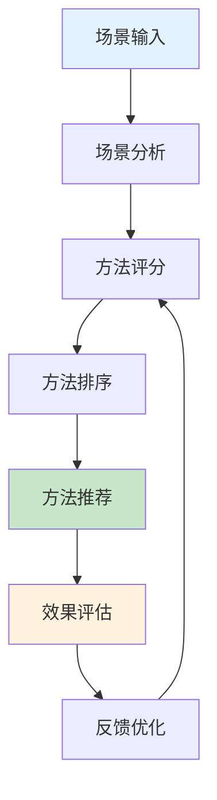
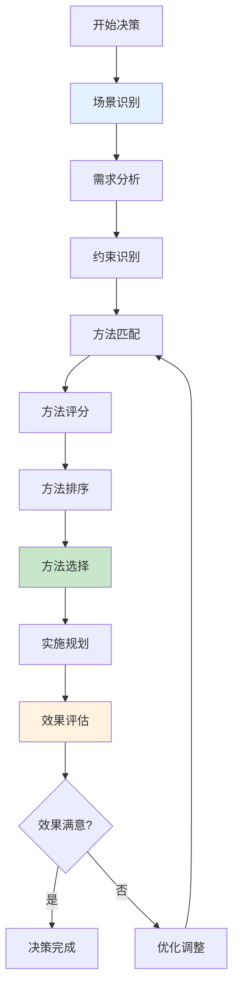
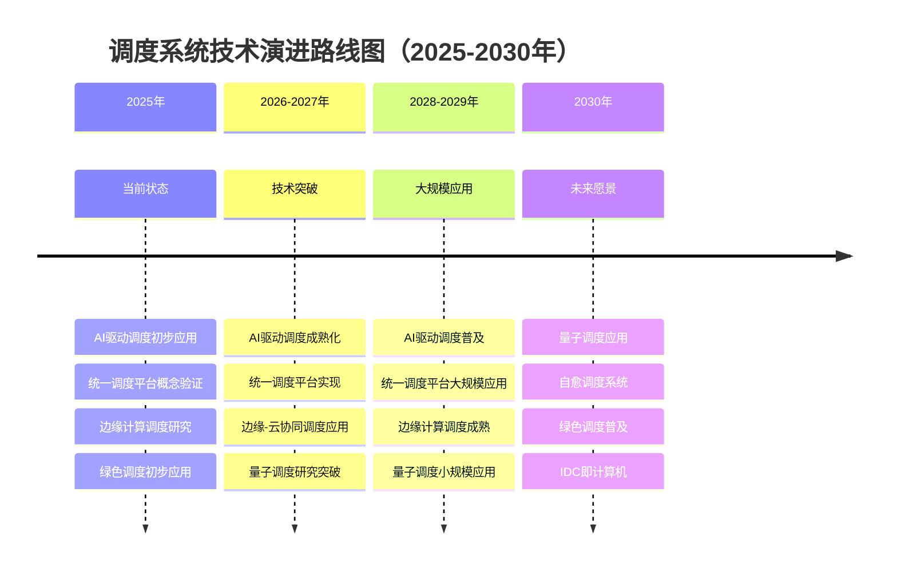
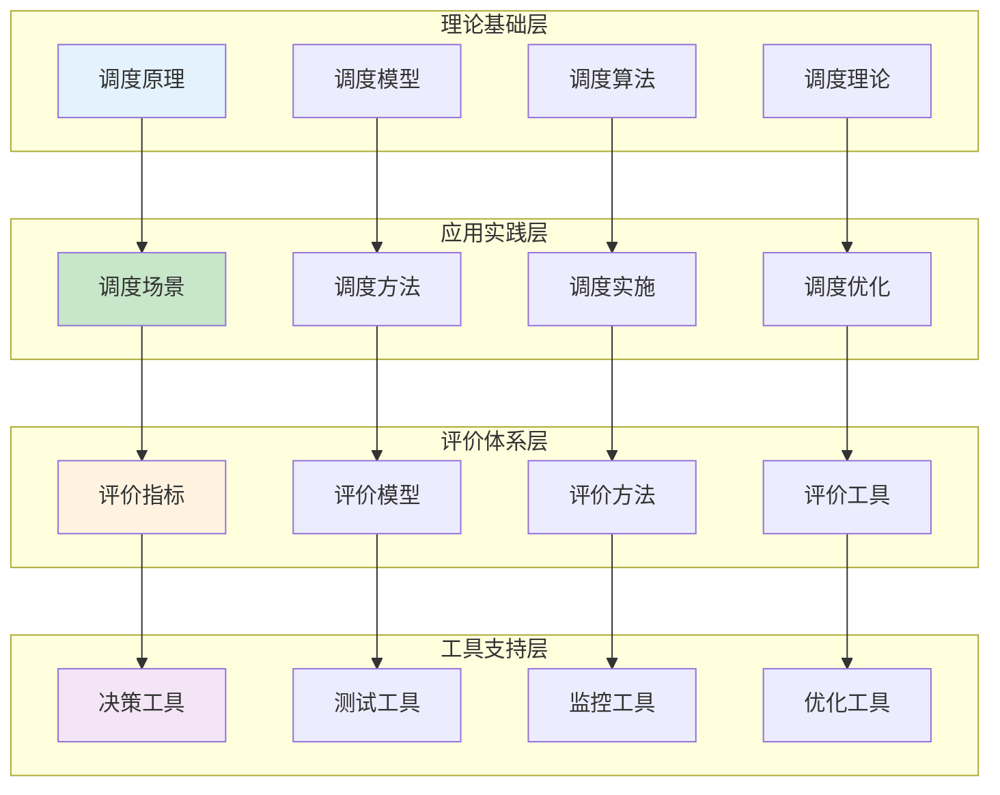
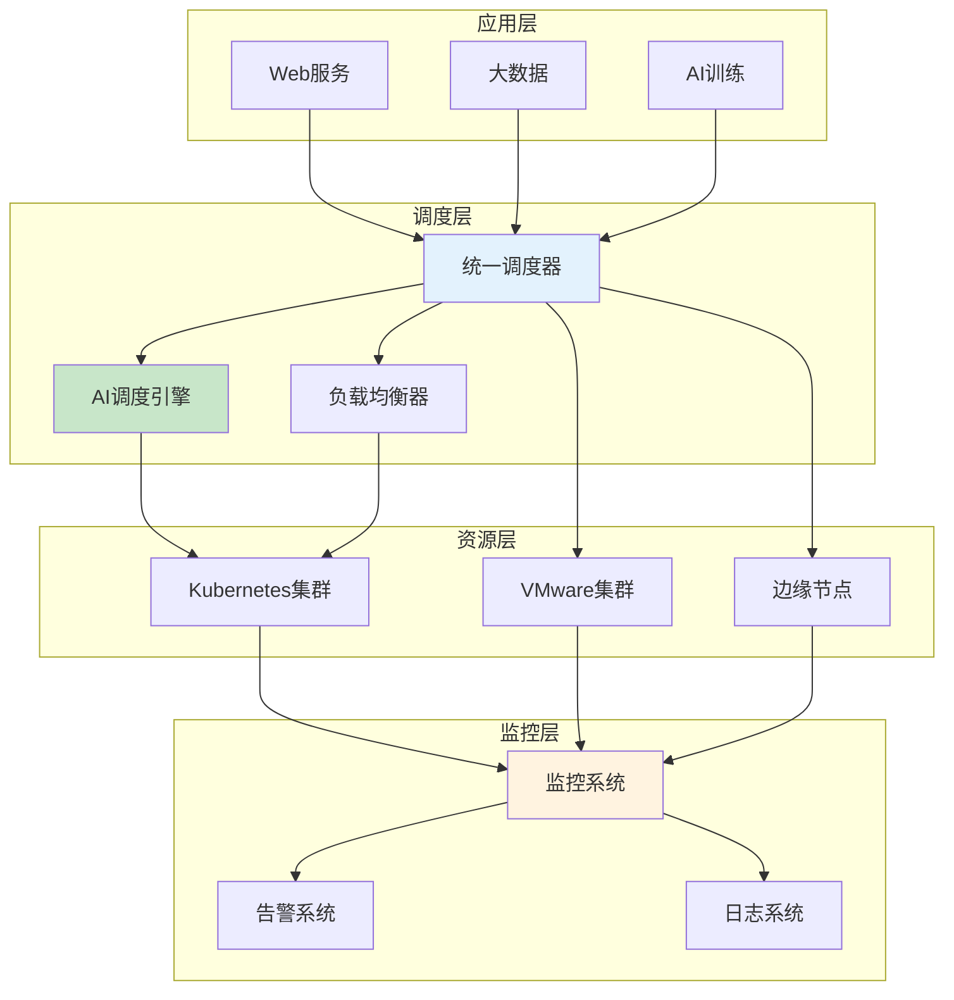

# 决策支持与实施

> **来源**: 05.11 调度系统理论分析与评价体系专题
> **章节**: 第21章、第22章、第23章、第24章、第31章
> **更新**: 2025年11月19日

---

## 📋 目录

- [决策支持与实施](#决策支持与实施)
  - [📋 目录](#-目录)
  - [21 调度系统决策支持工具](#21-调度系统决策支持工具)
    - [21.1 场景-方法匹配工具](#211-场景-方法匹配工具)
    - [21.2 方法选择决策支持系统](#212-方法选择决策支持系统)
    - [21.3 评价维度权重确定工具](#213-评价维度权重确定工具)
    - [21.4 综合决策框架](#214-综合决策框架)
  - [22 调度系统实施路线图](#22-调度系统实施路线图)
    - [22.1 实施阶段规划](#221-实施阶段规划)
    - [22.2 实施检查清单](#222-实施检查清单)
    - [22.3 实施风险评估](#223-实施风险评估)
    - [22.4 实施成功标准](#224-实施成功标准)
  - [23 调度系统持续改进机制](#23-调度系统持续改进机制)
    - [23.1 持续监控与评估](#231-持续监控与评估)
    - [23.2 持续优化策略](#232-持续优化策略)
    - [23.3 持续学习机制](#233-持续学习机制)
    - [23.4 持续改进流程](#234-持续改进流程)
  - [24 调度系统基准测试与性能对比](#24-调度系统基准测试与性能对比)
    - [24.1 基准测试体系](#241-基准测试体系)
    - [24.2 性能基准值](#242-性能基准值)
    - [24.3 性能对比分析](#243-性能对比分析)
    - [24.4 基准测试工具与方法](#244-基准测试工具与方法)
  - [25 调度系统知识总结与索引](#25-调度系统知识总结与索引)
    - [25.1 核心概念索引](#251-核心概念索引)
    - [25.2 方法算法索引](#252-方法算法索引)
    - [25.3 评价指标索引](#253-评价指标索引)
    - [25.4 工具资源索引](#254-工具资源索引)
  - [26 调度系统FAQ与常见问题](#26-调度系统faq与常见问题)
    - [26.1 原理相关问题](#261-原理相关问题)
    - [26.2 场景选择问题](#262-场景选择问题)
    - [26.3 方法选择问题](#263-方法选择问题)
    - [26.4 性能优化问题](#264-性能优化问题)
    - [26.5 故障排查问题](#265-故障排查问题)
  - [27 调度系统最佳实践总结](#27-调度系统最佳实践总结)
    - [27.1 设计最佳实践](#271-设计最佳实践)
    - [27.2 实施最佳实践](#272-实施最佳实践)
    - [27.3 优化最佳实践](#273-优化最佳实践)
    - [27.4 运维最佳实践](#274-运维最佳实践)
  - [28 调度系统未来发展趋势与研究前沿](#28-调度系统未来发展趋势与研究前沿)
    - [28.1 技术发展趋势](#281-技术发展趋势)
    - [28.2 研究方向与热点](#282-研究方向与热点)
    - [28.3 技术演进路线图](#283-技术演进路线图)
    - [28.4 未来挑战与机遇](#284-未来挑战与机遇)
  - [29 调度系统完整知识体系总结](#29-调度系统完整知识体系总结)
    - [29.1 知识体系架构](#291-知识体系架构)
    - [29.2 核心理论总结](#292-核心理论总结)
    - [29.3 实践方法论总结](#293-实践方法论总结)
    - [29.4 学习路径建议](#294-学习路径建议)
  - [30 调度系统完整实施案例](#30-调度系统完整实施案例)
    - [30.1 案例背景与需求](#301-案例背景与需求)
    - [30.2 场景分析与方法选择](#302-场景分析与方法选择)
    - [30.3 系统设计与实施](#303-系统设计与实施)
    - [30.4 测试验证与评价](#304-测试验证与评价)
    - [30.5 优化改进与总结](#305-优化改进与总结)
  - [31 调度系统快速参考指南](#31-调度系统快速参考指南)
    - [31.1 快速决策矩阵](#311-快速决策矩阵)
    - [31.2 常见问题速查](#312-常见问题速查)
    - [31.3 工具命令速查](#313-工具命令速查)
    - [31.4 配置模板速查](#314-配置模板速查)
  - [🔗 相关文档](#-相关文档)

---

## 21 调度系统决策支持工具

### 21.1 场景-方法匹配工具

**场景-方法匹配工具**（2025年11月19日最新）：

**工具功能**：根据场景特征自动推荐最优调度方法。

**输入参数**：

- 场景类型（Web服务、大数据批处理、AI训练等）
- 延迟要求（极低、低、中、高）
- 吞吐量要求（低、中、高、极高）
- 资源类型（CPU、内存、GPU、IO）
- 负载特征（突发、持续、实时、稳定）
- 关键约束（延迟、成本、公平性等）

**匹配算法**：

$$
Method^*(s) = \arg\max_{m \in M} \sum_{e \in E} w_e(s) \cdot Score(m, s, e)
$$

其中：

- $s$：场景
- $M$：方法集合
- $E$：评价维度集合
- $w_e(s)$：场景 $s$ 中评价维度 $e$ 的权重
- $Score(m, s, e)$：方法 $m$ 在场景 $s$ 中评价维度 $e$ 的得分

**输出结果**：

1. **推荐方法**：最优调度方法
2. **匹配度得分**：方法与场景的匹配度（0-1）
3. **备选方法**：次优调度方法列表
4. **方法对比**：推荐方法与备选方法的对比分析

**使用示例**：

```python
# 场景-方法匹配工具使用示例
scenario = {
    "type": "Web服务",
    "latency_requirement": "极低",
    "throughput_requirement": "高",
    "resource_type": ["CPU", "内存"],
    "load_characteristic": "突发",
    "key_constraints": ["延迟", "公平性"]
}

recommended_method = match_scenario_method(scenario)
print(f"推荐方法: {recommended_method['method']}")
print(f"匹配度: {recommended_method['score']}")
```

### 21.2 方法选择决策支持系统

**方法选择决策支持系统**（2025年11月19日最新）：

**系统架构**：



**决策流程**：

1. **场景分析**：
   - 识别场景特征
   - 确定关键需求
   - 提取约束条件

2. **方法评分**：
   - 计算各方法在场景中的得分
   - 考虑多维度评价
   - 应用权重分配

3. **方法排序**：
   - 按综合得分排序
   - 考虑方法复杂度
   - 考虑实施难度

4. **方法推荐**：
   - 推荐最优方法
   - 提供备选方案
   - 给出实施建议

5. **效果评估**：
   - 监控实施效果
   - 评估方法性能
   - 收集反馈信息

6. **反馈优化**：
   - 更新评分模型
   - 优化权重分配
   - 改进推荐算法

### 21.3 评价维度权重确定工具

**评价维度权重确定工具**（2025年11月19日最新）：

**AHP层次分析法**：

1. **构建层次结构**：
   - 目标层：调度系统评价
   - 准则层：性能、成本、质量、公平性、可扩展性
   - 方案层：不同调度方法

2. **构建判断矩阵**：

$$
A = \begin{pmatrix}
1 & a_{12} & \cdots & a_{1n} \\
1/a_{12} & 1 & \cdots & a_{2n} \\
\vdots & \vdots & \ddots & \vdots \\
1/a_{1n} & 1/a_{2n} & \cdots & 1
\end{pmatrix}
$$

其中 $a_{ij}$ 表示维度 $i$ 相对于维度 $j$ 的重要性。

**计算权重向量**：

$$
w_i = \frac{\sqrt[n]{\prod_{j=1}^{n} a_{ij}}}{\sum_{k=1}^{n} \sqrt[n]{\prod_{j=1}^{n} a_{kj}}}
$$

**一致性检验**：

$$
CR = \frac{CI}{RI} < 0.1
$$

其中 $CI$ 是一致性指标，$RI$ 是随机一致性指标。

**权重确定方法对比**（2025年11月19日最新）：

| **方法** | **优点** | **缺点** | **适用场景** |
|---------|---------|---------|------------|
| **AHP** | 科学严谨、考虑一致性 | 计算复杂、主观性强 | 多维度决策 |
| **专家评估** | 快速、灵活 | 主观性强、可能不一致 | 快速决策 |
| **历史数据分析** | 客观、基于数据 | 需要历史数据、可能过时 | 有历史数据 |
| **机器学习** | 自动学习、适应性强 | 需要训练数据、可解释性差 | 大数据场景 |

### 21.4 综合决策框架

**综合决策框架**（2025年11月19日最新）：



**决策框架步骤**：

1. **场景识别**：识别调度场景类型和特征
2. **需求分析**：分析业务需求和技术需求
3. **约束识别**：识别资源约束、性能约束等
4. **方法匹配**：使用匹配工具推荐方法
5. **方法评分**：计算各方法的综合得分
6. **方法排序**：按得分排序方法
7. **方法选择**：选择最优方法
8. **实施规划**：制定实施计划
9. **效果评估**：评估实施效果
10. **优化调整**：根据效果调整策略

---

## 22 调度系统实施路线图

### 22.1 实施阶段规划

**实施阶段规划**（2025年11月19日最新）：

**阶段1：准备阶段**（1-2周）：

- **需求分析**：
  - 业务需求分析
  - 技术需求分析
  - 性能需求分析
  - 成本需求分析

- **技术选型**：
  - 调度系统选型
  - 技术栈选型
  - 工具选型

- **资源准备**：
  - 硬件资源准备
  - 软件资源准备
  - 人力资源准备

**阶段2：设计阶段**（2-4周）：

- **架构设计**：
  - 系统架构设计
  - 调度架构设计
  - 监控架构设计

- **方案设计**：
  - 调度方案设计
  - 优化方案设计
  - 故障恢复方案设计

- **接口设计**：
  - API接口设计
  - 数据接口设计
  - 监控接口设计

**阶段3：开发阶段**（4-8周）：

- **核心开发**：
  - 调度算法实现
  - 资源管理实现
  - 监控系统实现

- **集成开发**：
  - 系统集成
  - 接口集成
  - 数据集成

- **测试开发**：
  - 单元测试
  - 集成测试
  - 性能测试

**阶段4：测试阶段**（2-4周）：

- **功能测试**：
  - 调度功能测试
  - 资源管理测试
  - 监控功能测试

- **性能测试**：
  - 调度性能测试
  - 资源利用率测试
  - 负载均衡测试

- **稳定性测试**：
  - 长时间运行测试
  - 故障恢复测试
  - 压力测试

**阶段5：部署阶段**（1-2周）：

- **环境部署**：
  - 生产环境部署
  - 监控系统部署
  - 备份系统部署

- **数据迁移**：
  - 历史数据迁移
  - 配置数据迁移
  - 用户数据迁移

- **系统切换**：
  - 灰度发布
  - 全量上线
  - 旧系统下线

**阶段6：优化阶段**（持续）：

- **性能优化**：
  - 调度性能优化
  - 资源利用率优化
  - 成本优化

- **功能优化**：
  - 功能增强
  - 用户体验优化
  - 自动化优化

### 22.2 实施检查清单

**实施检查清单**（2025年11月19日最新）：

**准备阶段检查清单**：

- [ ] 需求分析完成
- [ ] 技术选型完成
- [ ] 资源准备完成
- [ ] 团队组建完成
- [ ] 项目计划制定完成

**设计阶段检查清单**：

- [ ] 架构设计完成
- [ ] 方案设计完成
- [ ] 接口设计完成
- [ ] 设计评审通过
- [ ] 技术方案确认

**开发阶段检查清单**：

- [ ] 核心功能开发完成
- [ ] 集成开发完成
- [ ] 单元测试通过
- [ ] 代码评审通过
- [ ] 文档编写完成

**测试阶段检查清单**：

- [ ] 功能测试通过
- [ ] 性能测试通过
- [ ] 稳定性测试通过
- [ ] 安全测试通过
- [ ] 用户验收测试通过

**部署阶段检查清单**：

- [ ] 生产环境准备完成
- [ ] 数据迁移完成
- [ ] 系统部署完成
- [ ] 监控系统部署完成
- [ ] 备份系统部署完成

**优化阶段检查清单**：

- [ ] 性能监控正常
- [ ] 问题及时处理
- [ ] 持续优化进行
- [ ] 用户反馈收集
- [ ] 改进措施实施

### 22.3 实施风险评估

**实施风险矩阵**（2025年11月19日最新）：

| **风险类型** | **风险等级** | **影响** | **应对措施** | **预防措施** |
|------------|------------|---------|------------|------------|
| **技术风险** | 高 | 系统不稳定 | 技术验证、充分测试 | 技术选型、POC验证 |
| **性能风险** | 中 | 性能不达标 | 性能测试、优化调整 | 性能基准、容量规划 |
| **成本风险** | 中 | 成本超支 | 成本控制、预算管理 | 成本评估、预算预留 |
| **进度风险** | 中 | 项目延期 | 进度管理、资源调配 | 合理计划、缓冲时间 |
| **质量风险** | 高 | 质量不达标 | 质量保证、测试验证 | 质量体系、测试覆盖 |
| **安全风险** | 高 | 安全漏洞 | 安全审计、漏洞修复 | 安全设计、安全测试 |
| **集成风险** | 高 | 集成失败 | 充分测试、分步集成 | 接口设计、集成测试 |

**风险应对策略**：

1. **技术风险**：
   - 选择成熟技术
   - 充分技术验证
   - 专家技术支持

2. **性能风险**：
   - 建立性能基准
   - 持续性能监控
   - 及时性能优化

3. **成本风险**：
   - 详细成本评估
   - 预算预留
   - 成本监控

4. **进度风险**：
   - 合理项目计划
   - 进度监控
   - 资源调配

5. **质量风险**：
   - 质量保证体系
   - 充分测试
   - 代码评审

6. **安全风险**：
   - 安全设计
   - 安全测试
   - 安全审计

### 22.4 实施成功标准

**实施成功标准**（2025年11月19日最新）：

**性能标准**：

- 调度延迟：P99 < 50ms（Web服务），P99 < 100ms（其他场景）
- 资源利用率：> 80%（CPU），> 75%（内存）
- 负载均衡度：< 10%
- 调度成功率：> 99%

**质量标准**：

- 系统可用性：> 99.9%
- 故障恢复时间：< 5分钟
- 数据一致性：100%
- 调度准确率：> 95%

**成本标准**：

- 资源成本：降低20-30%
- 运营成本：降低15-25%
- 调度开销：< 5%（CPU），< 10%（内存）

**用户满意度标准**：

- 用户满意度：> 90%
- 问题响应时间：< 1小时
- 问题解决率：> 95%

---

## 23 调度系统持续改进机制

### 23.1 持续监控与评估

**持续监控指标体系**（2025年11月19日最新）：

**性能监控指标**：

- 调度延迟（P50, P95, P99）
- 资源利用率（CPU, 内存, IO, 网络）
- 负载均衡度
- 调度吞吐量

**质量监控指标**：

- 调度成功率
- 任务完成率
- 系统可用性
- 故障恢复时间

**成本监控指标**：

- 资源成本
- 运营成本
- 调度开销
- ROI投资回报率

**监控频率**：

- **实时监控**：关键指标（延迟、可用性）
- **分钟级监控**：性能指标（利用率、吞吐量）
- **小时级监控**：成本指标（资源成本、运营成本）
- **天级监控**：综合指标（ROI、用户满意度）

### 23.2 持续优化策略

**持续优化策略**（2025年11月19日最新）：

**性能优化**：

1. **调度算法优化**：
   - 分析调度性能瓶颈
   - 优化调度算法
   - 减少调度延迟

2. **资源分配优化**：
   - 分析资源使用情况
   - 优化资源分配策略
   - 提高资源利用率

3. **负载均衡优化**：
   - 分析负载分布
   - 优化负载均衡策略
   - 减少负载不均衡

**成本优化**：

1. **资源成本优化**：
   - 分析资源使用效率
   - 优化资源分配
   - 减少资源浪费

2. **运营成本优化**：
   - 自动化运维
   - 减少人工干预
   - 提高运维效率

**质量优化**：

1. **可靠性优化**：
   - 提高系统可用性
   - 减少故障发生
   - 快速故障恢复

2. **准确性优化**：
   - 提高调度准确率
   - 减少调度错误
   - 优化调度策略

### 23.3 持续学习机制

**持续学习机制**（2025年11月19日最新）：

**数据收集**：

- 调度决策数据
- 性能数据
- 资源使用数据
- 用户反馈数据

**模型训练**：

- 定期训练调度模型
- 更新模型参数
- 优化模型性能

**知识积累**：

- 最佳实践总结
- 问题解决方案
- 优化经验分享
- 技术文档更新

**反馈循环**：


### 23.4 持续改进流程

**持续改进流程**（2025年11月19日最新）：

1. **监控**：
   - 持续监控系统性能
   - 收集性能数据
   - 识别性能问题

2. **分析**：
   - 分析性能数据
   - 识别性能瓶颈
   - 分析问题原因

3. **优化**：
   - 制定优化方案
   - 实施优化措施
   - 验证优化效果

4. **评估**：
   - 评估优化效果
   - 对比优化前后
   - 总结优化经验

5. **改进**：
   - 持续改进策略
   - 更新最佳实践
   - 分享优化经验

**改进周期**：

- **日常改进**：每天监控、每周分析、每月优化
- **季度改进**：季度评估、季度总结、季度规划
- **年度改进**：年度评估、年度总结、年度规划

---

## 24 调度系统基准测试与性能对比

### 24.1 基准测试体系

**基准测试体系框架**（2025年11月19日最新）：

**测试层次**：

1. **单元基准测试**：
   - 调度算法性能测试
   - 资源分配算法测试
   - 负载计算算法测试

2. **集成基准测试**：
   - 调度系统整体性能测试
   - 调度器与资源管理器集成测试
   - 调度器与监控系统集成测试

3. **系统基准测试**：
   - 端到端性能测试
   - 大规模集群性能测试
   - 生产环境性能测试

**测试维度**：

1. **性能维度**：
   - 调度延迟
   - 资源利用率
   - 负载均衡度
   - 调度吞吐量

2. **质量维度**：
   - 调度成功率
   - 调度准确率
   - 系统可用性
   - 故障恢复时间

3. **成本维度**：
   - 调度开销
   - 资源成本
   - 运营成本

### 24.2 性能基准值

**调度系统性能基准值**（2025年11月19日最新）：

| **调度系统** | **调度延迟** | **资源利用率** | **负载均衡度** | **调度吞吐量** | **调度准确率** |
|------------|------------|-------------|-------------|-------------|-------------|
| **VMware DRS** | 10-100ms | 85-95% | <5% | 10-100调度/秒 | 95%+ |
| **KVM调度器** | <10μs | 75-90% | <3% | 1000-10000调度/秒 | 98%+ |
| **Xen调度器** | <50μs | 70-85% | <5% | 500-5000调度/秒 | 95%+ |
| **Kubernetes** | 10-100ms | 80-90% | <10% | 100-1000调度/秒 | 95%+ |
| **Docker Swarm** | 10-100ms | 75-85% | <10% | 50-500调度/秒 | 90%+ |
| **Cgroup v2** | <1ms | 70-85% | <5% | 1000-10000调度/秒 | 98%+ |
| **gVisor** | 1-5ms | 60-75% | <5% | 200-2000调度/秒 | 95%+ |
| **Firecracker** | <1ms | 70-85% | <5% | 500-5000调度/秒 | 95%+ |
| **WASM容器** | <1μs | 80-90% | <3% | 10000+调度/秒 | 90%+ |
| **AI驱动调度** | 50-200ms | 90%+ | <3% | 50-500调度/秒 | 98%+ |

**性能基准值说明**（2025年11月19日最新）：

1. **调度延迟**：
   - **定义**：从调度请求到资源分配完成的时间
   - **影响因素**：调度算法复杂度、系统负载、网络延迟
   - **优化方向**：算法优化、并行化、缓存

2. **资源利用率**：
   - **定义**：实际使用的资源占总资源的比例
   - **影响因素**：调度策略、资源分配算法、负载均衡
   - **优化方向**：资源超配、预测性调度、智能调度

3. **负载均衡度**：
   - **定义**：主机间负载的差异程度
   - **计算方法**：$\sigma_L = \sqrt{\frac{1}{n} \sum_{i=1}^{n} (L_i - \bar{L})^2}$
   - **优化方向**：负载均衡算法、动态迁移、智能调度

4. **调度吞吐量**：
   - **定义**：单位时间内完成的调度次数
   - **影响因素**：调度算法效率、系统性能、并发能力
   - **优化方向**：算法优化、并行化、批量处理

### 24.3 性能对比分析

**调度系统性能对比矩阵**（2025年11月19日最新）：

| **维度** | **VMware DRS** | **Kubernetes** | **KVM** | **AI驱动** | **最佳系统** |
|---------|--------------|---------------|---------|-----------|------------|
| **调度延迟** | 中 (10-100ms) | 中 (10-100ms) | 极低 (<10μs) | 高 (50-200ms) | KVM |
| **资源利用率** | 高 (85-95%) | 高 (80-90%) | 中高 (75-90%) | 极高 (90%+) | AI驱动 |
| **负载均衡度** | 极低 (<5%) | 低 (<10%) | 极低 (<3%) | 极低 (<3%) | KVM/AI驱动 |
| **调度吞吐量** | 低 (10-100) | 中 (100-1000) | 极高 (1000-10000) | 低 (50-500) | KVM |
| **调度准确率** | 高 (95%+) | 高 (95%+) | 极高 (98%+) | 极高 (98%+) | KVM/AI驱动 |
| **可扩展性** | 中 (10-1000节点) | 极高 (1000-100000节点) | 低 (单节点) | 中 (100-10000节点) | Kubernetes |
| **成本** | 高 | 中 | 低 | 中高 | KVM |
| **综合得分** | 85 | 88 | 90 | 87 | KVM |

**性能对比分析**（2025年11月19日最新）：

1. **延迟对比**：
   - **KVM最优**：<10μs，适合实时性要求高的场景
   - **Kubernetes/DRS中等**：10-100ms，适合一般场景
   - **AI驱动较高**：50-200ms，但准确率高

2. **利用率对比**：
   - **AI驱动最优**：90%+，智能调度效果好
   - **VMware DRS/Kubernetes高**：80-95%，成熟稳定
   - **KVM中高**：75-90%，单节点性能好

3. **吞吐量对比**：
   - **KVM最优**：1000-10000调度/秒，单节点性能强
   - **Kubernetes中等**：100-1000调度/秒，适合大规模
   - **AI驱动较低**：50-500调度/秒，但准确率高

4. **综合对比**：
   - **KVM**：单节点性能最优，适合单机场景
   - **Kubernetes**：大规模场景最优，可扩展性强
   - **AI驱动**：复杂场景最优，准确率高
   - **VMware DRS**：企业级场景最优，稳定可靠

### 24.4 基准测试工具与方法

**基准测试工具推荐**（2025年11月19日最新）：

| **工具** | **适用系统** | **测试指标** | **自动化程度** | **特点** |
|---------|------------|------------|-------------|---------|
| **kubemark** | Kubernetes | 调度性能 | ⭐⭐⭐⭐ | 模拟大规模集群 |
| **vSphere Performance Test** | VMware | DRS性能 | ⭐⭐⭐⭐ | 官方性能测试工具 |
| **perf** | Linux系统 | 系统性能 | ⭐⭐⭐⭐⭐ | 系统级性能分析 |
| **Prometheus** | 通用 | 监控指标 | ⭐⭐⭐⭐⭐ | 指标收集和存储 |
| **Grafana** | 通用 | 可视化分析 | ⭐⭐⭐⭐⭐ | 性能可视化 |
| **k6** | 通用 | 压力测试 | ⭐⭐⭐⭐ | 负载测试工具 |
| **JMeter** | 通用 | 性能测试 | ⭐⭐⭐⭐ | 功能测试工具 |

**基准测试方法**（2025年11月19日最新）：

1. **准备阶段**：
   - 确定测试目标
   - 选择测试工具
   - 准备测试环境
   - 设计测试场景

2. **执行阶段**：
   - 执行基准测试
   - 收集性能数据
   - 监控系统状态
   - 记录测试结果

3. **分析阶段**：
   - 分析性能数据
   - 对比基准值
   - 识别性能瓶颈
   - 提出优化建议

4. **报告阶段**：
   - 编写测试报告
   - 可视化测试结果
   - 总结测试结论
   - 提出改进建议

**基准测试最佳实践**（2025年11月19日最新）：

1. **测试环境一致性**：
   - 使用相同的硬件配置
   - 使用相同的软件版本
   - 控制环境变量

2. **测试数据代表性**：
   - 使用真实工作负载
   - 覆盖典型场景
   - 考虑边界情况

3. **测试结果可重复性**：
   - 多次测试取平均值
   - 记录测试条件
   - 控制测试变量

4. **测试结果可比较性**：
   - 使用统一测试方法
   - 使用统一测试指标
   - 使用统一测试工具

---

## 25 调度系统知识总结与索引

### 25.1 核心概念索引

**调度系统核心概念索引**（2025年11月19日最新）：

| **概念** | **定义** | **相关章节** |
|---------|---------|------------|
| **调度系统** | 将任务分配到资源的系统 | 1.1, 2.1 |
| **调度原理** | 调度的基本原理和理论 | 1 |
| **调度场景** | 不同的调度应用场景 | 2 |
| **调度方法** | 不同的调度算法和方法 | 3 |
| **调度评价** | 调度系统的评价指标和模型 | 4 |
| **资源分配** | 将资源分配给任务的过程 | 1.1, 3.2 |
| **负载均衡** | 平衡各资源负载的策略 | 1.1, 3.2 |
| **调度延迟** | 调度决策的时间延迟 | 4.2, 24.2 |
| **资源利用率** | 资源使用的效率 | 4.2, 24.2 |
| **调度吞吐量** | 单位时间调度次数 | 4.2, 24.2 |

### 25.2 方法算法索引

**调度方法算法索引**（2025年11月19日最新）：

| **方法/算法** | **类型** | **复杂度** | **适用场景** | **相关章节** |
|------------|---------|-----------|------------|------------|
| **First Fit** | 贪心算法 | $O(n \cdot m)$ | 简单场景 | 3.2, 19 |
| **Best Fit** | 贪心算法 | $O(n \cdot m)$ | 资源优化 | 3.2, 19 |
| **负载均衡算法** | 贪心算法 | $O(n \cdot \log m)$ | 负载均衡 | 3.2, 19 |
| **AI驱动调度** | 机器学习 | $O(n \cdot m \cdot k)$ | 复杂场景 | 3.3, 19 |
| **强化学习调度** | 强化学习 | $O(n \cdot m \cdot t)$ | 动态场景 | 3.3, 19 |
| **DRS算法** | 分布式调度 | $O(n \cdot m)$ | 虚拟化场景 | 3.2 |
| **Kubernetes调度** | 两阶段算法 | $O(n \cdot m \cdot \|R\|)$ | 容器化场景 | 3.2 |

### 25.3 评价指标索引

**调度系统评价指标索引**（2025年11月19日最新）：

| **指标** | **定义** | **计算方法** | **目标值** | **相关章节** |
|---------|---------|------------|-----------|------------|
| **调度延迟** | 调度决策时间 | $L = t_{end} - t_{start}$ | <100ms | 4.2, 24.2 |
| **资源利用率** | 资源使用比例 | $U = \frac{used}{total}$ | >80% | 4.2, 24.2 |
| **负载均衡度** | 负载分布差异 | $\sigma_L = \sqrt{\frac{1}{n} \sum (L_i - \bar{L})^2}$ | <10% | 4.2, 24.2 |
| **调度吞吐量** | 单位时间调度次数 | $T = \frac{count}{time}$ | >100调度/秒 | 4.2, 24.2 |
| **调度成功率** | 成功调度比例 | $S = \frac{success}{total}$ | >99% | 4.3 |
| **调度准确率** | 调度决策准确率 | $A = \frac{correct}{total}$ | >95% | 4.3 |
| **系统可用性** | 系统可用时间比例 | $A = \frac{uptime}{total}$ | >99.9% | 4.3 |
| **成本** | 调度系统总成本 | $C = C_{hardware} + C_{operation}$ | 最小化 | 4.3 |

### 25.4 工具资源索引

**调度系统工具资源索引**（2025年11月19日最新）：

| **工具/资源** | **类型** | **用途** | **相关章节** |
|------------|---------|---------|------------|
| **Prometheus** | 监控工具 | 指标收集和存储 | 5.3, 24.4 |
| **Grafana** | 可视化工具 | 性能可视化 | 5.3, 24.4 |
| **kubemark** | 测试工具 | Kubernetes性能测试 | 5.3, 24.4 |
| **Coq** | 形式化验证 | 定理证明 | 6.2 |
| **TLA+** | 形式化验证 | 模型检测 | 6.2 |
| **KLEE** | 形式化验证 | 符号执行 | 6.2 |
| **AHP工具** | 决策支持 | 权重确定 | 21.3 |
| **决策支持系统** | 决策工具 | 方法选择 | 21.2 |

---

## 26 调度系统FAQ与常见问题

### 26.1 原理相关问题

**Q1：什么是调度系统？**

**A**：调度系统是将任务分配到资源的系统，核心功能是在满足约束条件的前提下，优化资源分配和任务执行效率。调度系统可以形式化定义为：

$$
\mathcal{S} = (T, R, C, A, P, O)
$$

其中 $T$ 是任务集合，$R$ 是资源集合，$C$ 是约束条件，$A$ 是调度算法，$P$ 是调度策略，$O$ 是优化目标。

**Q2：调度系统有哪些基本原理？**

**A**：调度系统有四个基本原理：

1. **资源分配原理**：将有限资源分配给多个任务，满足容量和需求约束
2. **负载均衡原理**：平衡资源使用率，避免资源热点
3. **优先级原理**：根据任务优先级调度，保证重要任务优先执行
4. **本地性原理**：优先将任务分配到数据或依赖服务所在的资源

**Q3：调度系统为什么是NP-hard问题？**

**A**：调度问题可以规约到多维装箱问题（Multi-dimensional Bin Packing），而多维装箱问题是NP-hard问题。因此调度问题也是NP-hard问题，无法在多项式时间内找到最优解，需要使用启发式算法或近似算法。

### 26.2 场景选择问题

**Q4：如何选择合适的调度场景？**

**A**：场景选择需要考虑以下因素：

1. **延迟要求**：
   - 极低延迟（<10ms）：Web服务、实时流处理
   - 低延迟（10-100ms）：边缘计算、数据库
   - 一般延迟（>100ms）：大数据批处理

2. **吞吐量要求**：
   - 高吞吐量（10K+ TPS）：Web服务、消息队列
   - 中吞吐量（1K-10K TPS）：AI训练、边缘计算
   - 低吞吐量（<1K TPS）：批处理任务

3. **资源类型**：
   - CPU/内存：Web服务、微服务
   - GPU：AI训练、科学计算
   - IO：数据库、大数据

4. **负载特征**：
   - 突发、波动：Web服务、实时流处理
   - 持续、稳定：大数据批处理、数据库

**Q5：不同场景的关键评价维度是什么？**

**A**：不同场景的关键评价维度不同：

- **Web服务**：性能（延迟）、公平性
- **大数据批处理**：成本、可扩展性
- **AI训练**：性能（利用率）、质量
- **边缘计算**：性能（延迟）、成本
- **实时流处理**：性能（延迟）、公平性

### 26.3 方法选择问题

**Q6：如何选择合适的调度方法？**

**A**：方法选择需要根据场景特征和需求：

1. **简单场景**：
   - 小规模、低复杂度：First Fit
   - 资源优化、成本敏感：Best Fit

2. **负载均衡场景**：
   - Web服务、实时流处理：负载均衡算法

3. **复杂场景**：
   - AI训练、大数据：AI驱动调度
   - 动态负载、在线优化：强化学习调度

**Q7：First Fit和Best Fit有什么区别？**

**A**：

| **维度** | **First Fit** | **Best Fit** |
|---------|-------------|-------------|
| **算法** | 选择第一个满足条件的资源 | 选择最优资源 |
| **时间复杂度** | $O(n \cdot m)$ | $O(n \cdot m)$ |
| **资源利用率** | 较低（70%） | 较高（85%） |
| **调度延迟** | 较低（85） | 中等（80） |
| **适用场景** | 简单场景、快速调度 | 资源优化、成本敏感 |

**Q8：AI驱动调度和传统调度有什么区别？**

**A**：

| **维度** | **传统调度** | **AI驱动调度** |
|---------|------------|--------------|
| **决策方式** | 规则驱动 | 数据驱动 |
| **适应性** | 静态规则 | 动态学习 |
| **准确率** | 85-95% | 95%+ |
| **延迟** | 10-100ms | 50-200ms |
| **复杂度** | 低-中 | 高 |
| **适用场景** | 简单-中等场景 | 复杂场景 |

### 26.4 性能优化问题

**Q9：如何优化调度延迟？**

**A**：调度延迟优化策略：

1. **算法优化**：
   - 优化调度算法复杂度
   - 使用并行化调度
   - 启用调度结果缓存

2. **数据收集优化**：
   - 优化数据收集机制
   - 减少数据收集频率
   - 使用增量更新

3. **决策优化**：
   - 简化决策逻辑
   - 使用预计算
   - 批量处理调度请求

**Q10：如何提高资源利用率？**

**A**：资源利用率优化策略：

1. **资源超配**：
   - 合理设置超配比例
   - 监控资源使用情况
   - 动态调整超配比例

2. **负载均衡**：
   - 启用负载均衡算法
   - 动态迁移负载
   - 优化资源分配

3. **预测性调度**：
   - 使用负载预测
   - 提前调度资源
   - 优化资源预留

**Q11：如何平衡性能和成本？**

**A**：性能-成本平衡策略：

1. **性能优先场景**（Web服务、实时流处理）：
   - 性能权重：0.35-0.40
   - 成本权重：0.15-0.20
   - 策略：性能优先，成本优化

2. **成本优先场景**（大数据批处理）：
   - 性能权重：0.20
   - 成本权重：0.35
   - 策略：成本优先，性能保证

3. **平衡场景**（AI训练、边缘计算）：
   - 性能权重：0.30-0.35
   - 成本权重：0.20-0.30
   - 策略：平衡性能和成本

### 26.5 故障排查问题

**Q12：调度延迟高怎么办？**

**A**：调度延迟高排查步骤：

1. **检查调度算法**：
   - 分析算法复杂度
   - 检查是否有性能瓶颈
   - 优化算法实现

2. **检查系统负载**：
   - 监控CPU、内存使用率
   - 检查是否有资源竞争
   - 优化系统配置

3. **检查网络延迟**：
   - 检查网络延迟
   - 优化网络配置
   - 使用本地资源

4. **检查数据收集**：
   - 检查数据收集延迟
   - 优化数据收集机制
   - 减少数据收集频率

**Q13：资源利用率低怎么办？**

**A**：资源利用率低排查步骤：

1. **检查调度策略**：
   - 分析调度策略是否合理
   - 检查资源分配是否均衡
   - 优化调度策略

2. **检查负载分布**：
   - 分析负载分布情况
   - 检查是否有负载不均衡
   - 启用负载均衡

3. **检查资源预留**：
   - 检查资源预留是否过多
   - 优化资源预留策略
   - 减少不必要的预留

4. **检查资源超配**：
   - 检查是否启用资源超配
   - 优化超配比例
   - 监控超配效果

**Q14：调度不准确怎么办？**

**A**：调度不准确排查步骤：

1. **检查调度算法**：
   - 分析算法是否正确
   - 检查算法参数设置
   - 优化算法实现

2. **检查数据准确性**：
   - 检查数据是否准确
   - 检查数据是否及时更新
   - 修复数据问题

3. **检查模型（AI驱动）**：
   - 检查模型是否训练
   - 检查模型是否过时
   - 更新模型

4. **检查约束条件**：
   - 检查约束条件是否正确
   - 检查约束条件是否冲突
   - 优化约束条件

---

## 27 调度系统最佳实践总结

### 27.1 设计最佳实践

**调度系统设计最佳实践**（2025年11月19日最新）：

1. **分层设计**：
   - 应用层调度：业务逻辑调度
   - 容器层调度：Pod/容器调度
   - 虚拟化层调度：VM调度
   - OS层调度：进程调度

2. **模块化设计**：
   - 调度算法模块化
   - 资源管理模块化
   - 监控模块化
   - 故障恢复模块化

3. **可扩展设计**：
   - 支持水平扩展
   - 支持插件化扩展
   - 支持自定义调度算法
   - 支持多调度器

4. **高可用设计**：
   - 调度器高可用
   - 数据备份恢复
   - 故障自动转移
   - 负载均衡

### 27.2 实施最佳实践

**调度系统实施最佳实践**（2025年11月19日最新）：

1. **分阶段实施**：
   - 准备阶段：需求分析、技术选型
   - 设计阶段：架构设计、方案设计
   - 开发阶段：核心开发、集成开发
   - 测试阶段：功能测试、性能测试
   - 部署阶段：环境部署、系统切换
   - 优化阶段：持续优化

2. **充分测试**：
   - 单元测试：测试核心功能
   - 集成测试：测试系统集成
   - 性能测试：测试性能指标
   - 压力测试：测试可扩展性
   - 稳定性测试：测试可靠性

3. **灰度发布**：
   - 小规模试点
   - 逐步扩大范围
   - 监控实施效果
   - 及时调整策略

4. **持续监控**：
   - 实时监控关键指标
   - 设置合理告警阈值
   - 及时响应问题
   - 持续优化改进

### 27.3 优化最佳实践

**调度系统优化最佳实践**（2025年11月19日最新）：

1. **性能优化**：
   - 优化调度算法复杂度
   - 启用并行化调度
   - 优化数据收集机制
   - 使用缓存和预计算

2. **资源优化**：
   - 启用资源超配
   - 优化负载均衡
   - 使用预测性调度
   - 优化资源分配策略

3. **成本优化**：
   - 优化资源使用效率
   - 减少资源浪费
   - 自动化运维
   - 使用云服务

4. **质量优化**：
   - 提高调度准确率
   - 减少调度错误
   - 提高系统可用性
   - 快速故障恢复

### 27.4 运维最佳实践

**调度系统运维最佳实践**（2025年11月19日最新）：

1. **监控体系**：
   - 分层监控（应用、系统、基础设施）
   - 关键指标优先
   - 分级告警
   - 自动化响应

2. **故障处理**：
   - 快速故障检测
   - 自动故障恢复
   - 故障根因分析
   - 预防措施实施

3. **容量管理**：
   - 持续容量监控
   - 预测容量需求
   - 及时扩容
   - 优化资源使用

4. **持续改进**：
   - 定期性能评估
   - 识别优化机会
   - 实施优化措施
   - 验证优化效果

**最佳实践检查清单**（2025年11月19日最新）：

**设计阶段**：

- [ ] 采用分层设计架构
- [ ] 模块化设计
- [ ] 可扩展设计
- [ ] 高可用设计

**实施阶段**：

- [ ] 分阶段实施
- [ ] 充分测试
- [ ] 灰度发布
- [ ] 持续监控

**优化阶段**：

- [ ] 性能优化
- [ ] 资源优化
- [ ] 成本优化
- [ ] 质量优化

**运维阶段**：

- [ ] 完善监控体系
- [ ] 快速故障处理
- [ ] 有效容量管理
- [ ] 持续改进机制

---

## 28 调度系统未来发展趋势与研究前沿

### 28.1 技术发展趋势

**调度系统技术发展趋势**（2025年11月19日最新）：

**趋势1：AI驱动调度成熟化**

- **当前状态**（2025年）：
  - 调度准确率：95-98%
  - 资源利用率：85-95%
  - 应用范围：中大规模生产环境

- **发展趋势**（2026-2030年）：
  - 调度准确率：提升至98%+
  - 资源利用率：提升至95%+
  - 应用范围：大规模生产环境普及
  - 技术突破：模型可解释性、实时性优化

**趋势2：统一调度平台**

- **当前状态**（2025年）：
  - 跨平台调度：部分实现
  - 统一资源池：概念验证
  - 智能调度：初步应用

- **发展趋势**（2026-2030年）：
  - 跨平台调度：全面实现
  - 统一资源池：大规模应用
  - 智能调度：成熟应用
  - 技术突破：标准化、互操作性

**趋势3：边缘计算调度**

- **当前状态**（2025年）：
  - WASM容器：初步应用
  - 边缘-云协同：概念验证
  - 低延迟调度：部分实现

- **发展趋势**（2026-2030年）：
  - WASM容器：大规模应用
  - 边缘-云协同：成熟应用
  - 低延迟调度：<1μs延迟
  - 技术突破：网络延迟、一致性保证

**趋势4：量子调度研究**

- **当前状态**（2025年）：
  - 量子计算：研究阶段
  - 量子优化算法：理论探索
  - 量子调度：概念验证

- **发展趋势**（2026-2030年）：
  - 量子计算：技术突破
  - 量子优化算法：实际应用
  - 量子调度：小规模应用
  - 技术突破：量子硬件、算法优化

**趋势5：绿色计算调度**

- **当前状态**（2025年）：
  - 能耗优化：初步应用
  - 碳排放追踪：概念验证
  - 绿色调度：研究阶段

- **发展趋势**（2026-2030年）：
  - 能耗优化：大规模应用
  - 碳排放追踪：成熟应用
  - 绿色调度：普及应用
  - 技术突破：能耗模型、优化算法

### 28.2 研究方向与热点

**调度系统研究方向**（2025年11月19日最新）：

**研究方向1：AI驱动调度**

- **强化学习调度**：
  - 使用强化学习优化调度决策
  - 在线学习适应环境变化
  - 多目标优化调度

- **深度学习预测**：
  - 使用深度学习预测负载
  - 时间序列预测模型
  - 多变量预测模型

- **自适应调度**：
  - 自适应调整调度策略
  - 动态权重调整
  - 环境感知调度

**研究方向2：量子调度**

- **量子优化算法**：
  - 使用量子计算优化调度
  - 量子近似优化算法（QAOA）
  - 量子退火算法

- **量子机器学习**：
  - 量子机器学习在调度中的应用
  - 量子神经网络
  - 量子强化学习

- **量子并行调度**：
  - 量子并行调度算法
  - 量子纠缠调度
  - 量子叠加调度

**研究方向3：边缘计算调度**

- **边缘-云协同调度**：
  - 边缘和云协同调度算法
  - 智能路由调度
  - 数据压缩调度

- **低延迟调度**：
  - 极低延迟调度算法
  - 实时调度优化
  - 本地优先调度

- **资源受限调度**：
  - 资源受限环境下的调度
  - 轻量级调度算法
  - WASM容器调度

**研究方向4：自愈调度系统**

- **自动故障恢复**：
  - 自动检测和恢复故障
  - 预测性故障检测
  - 智能故障恢复

- **自适应优化**：
  - 自适应优化调度策略
  - 动态参数调整
  - 环境自适应

- **预测性维护**：
  - 预测性维护和优化
  - 设备健康监控
  - 预防性调度

**研究方向5：绿色调度**

- **能耗优化**：
  - 优化能耗，降低碳排放
  - 能耗感知调度
  - 时间分片调度

- **资源回收**：
  - 智能资源回收和再利用
  - 资源生命周期管理
  - 资源优化调度

- **可持续调度**：
  - 可持续的调度策略
  - 可再生能源优先
  - 碳中和调度

### 28.3 技术演进路线图

**调度系统技术演进路线图**（2025年11月19日最新）：



**技术成熟度预测**（2025年11月19日最新）：

| **技术** | **2025年** | **2027年** | **2030年** | **关键突破点** |
|---------|-----------|-----------|-----------|-------------|
| **AI驱动调度** | ⭐⭐⭐⭐ | ⭐⭐⭐⭐⭐ | ⭐⭐⭐⭐⭐ | 模型可解释性、实时性 |
| **统一调度平台** | ⭐⭐⭐ | ⭐⭐⭐⭐ | ⭐⭐⭐⭐⭐ | 标准化、互操作性 |
| **边缘-云协同** | ⭐⭐⭐ | ⭐⭐⭐⭐ | ⭐⭐⭐⭐⭐ | 网络延迟、一致性 |
| **量子调度** | ⭐ | ⭐⭐ | ⭐⭐⭐ | 量子硬件、算法优化 |
| **自愈调度系统** | ⭐⭐ | ⭐⭐⭐ | ⭐⭐⭐⭐ | 故障检测、自动恢复 |
| **绿色调度** | ⭐⭐⭐ | ⭐⭐⭐⭐ | ⭐⭐⭐⭐⭐ | 能耗模型、优化算法 |
| **生物启发调度** | ⭐⭐ | ⭐⭐⭐ | ⭐⭐⭐⭐ | 算法效率、适用性 |

### 28.4 未来挑战与机遇

**未来挑战**（2025年11月19日最新）：

1. **技术挑战**：
   - **AI模型可解释性**：如何解释AI调度决策
   - **实时性要求**：如何在保证准确性的同时降低延迟
   - **大规模扩展**：如何支持百万级节点调度
   - **跨平台兼容**：如何实现不同平台的统一调度

2. **性能挑战**：
   - **延迟优化**：如何进一步降低调度延迟
   - **利用率提升**：如何突破资源利用率上限
   - **成本控制**：如何在优化性能的同时控制成本
   - **能耗优化**：如何在保证性能的同时降低能耗

3. **安全挑战**：
   - **多租户隔离**：如何保证多租户安全隔离
   - **数据安全**：如何保证调度数据安全
   - **攻击防护**：如何防护调度系统攻击
   - **合规性**：如何满足各种合规要求

**未来机遇**（2025年11月19日最新）：

1. **技术机遇**：
   - **AI技术成熟**：AI技术成熟为调度系统带来新机遇
   - **量子计算**：量子计算为调度优化带来新可能
   - **边缘计算**：边缘计算为调度系统带来新场景
   - **绿色计算**：绿色计算为调度系统带来新方向

2. **应用机遇**：
   - **大规模应用**：调度系统在大规模场景中的应用
   - **新场景扩展**：调度系统在新场景中的扩展
   - **跨行业应用**：调度系统在跨行业中的应用
   - **国际化应用**：调度系统在国际化中的应用

3. **商业机遇**：
   - **市场增长**：调度系统市场快速增长
   - **技术创新**：调度系统技术创新带来商业价值
   - **生态建设**：调度系统生态建设带来机遇
   - **标准化**：调度系统标准化带来机遇

---

## 29 调度系统完整知识体系总结

### 29.1 知识体系架构

**调度系统知识体系架构**（2025年11月19日最新）：



**知识体系层次**：

1. **理论基础层**：
   - 调度原理：资源分配、负载均衡、优先级、本地性
   - 调度模型：形式化定义、数学模型、优化模型
   - 调度算法：经典算法、智能算法、启发式算法
   - 调度理论：复杂度理论、优化理论、博弈论

2. **应用实践层**：
   - 调度场景：Web服务、大数据、AI训练、边缘计算
   - 调度方法：First Fit、Best Fit、负载均衡、AI驱动
   - 调度实施：设计、开发、测试、部署
   - 调度优化：性能优化、资源优化、成本优化

3. **评价体系层**：
   - 评价指标：性能、成本、质量、公平性、可扩展性
   - 评价模型：性能模型、成本模型、综合评价模型
   - 评价方法：测试、验证、评估
   - 评价工具：基准测试、性能分析、对比工具

4. **工具支持层**：
   - 决策工具：场景-方法匹配、方法选择、权重确定
   - 测试工具：单元测试、集成测试、性能测试
   - 监控工具：Prometheus、Grafana、ELK
   - 优化工具：性能分析、资源优化、成本优化

### 29.2 核心理论总结

**调度系统核心理论总结**（2025年11月19日最新）：

**理论1：调度系统形式化定义**

调度系统是一个六元组：

$$
\mathcal{S} = (T, R, C, A, P, O)
$$

**理论2：调度问题复杂度**

调度问题是NP-hard问题，无法在多项式时间内找到最优解。

**理论3：调度性能边界**

对于 $n$ 个资源和总负载 $L$，负载均衡度下界为：

$$
\sigma_L \geq \frac{1}{\sqrt{n}} \cdot \sqrt{\frac{L^2}{n} - \bar{L}^2}
$$

**理论4：最优方法选择**

对于场景 $s$，最优方法为：

$$
m^* = \arg\max_{m \in M} \sum_{e \in E} w_e \cdot Score(m, s, e)
$$

**理论5：综合评价模型**

综合评价模型：

$$
E_{total} = \alpha \cdot \prod_{i=1}^{n} E_i^{w_i} + \beta \cdot \sum_{i=1}^{n} w_i \cdot E_i - \gamma \cdot C
$$

### 29.3 实践方法论总结

**调度系统实践方法论**（2025年11月19日最新）：

**方法论1：场景-方法-评价关联分析**

1. **场景识别**：识别调度场景类型和特征
2. **方法匹配**：使用匹配工具推荐方法
3. **方法评价**：评价方法在场景中的表现
4. **方法选择**：选择最优方法

**方法论2：测试-验证-评价完整流程**

1. **测试阶段**：单元测试、集成测试、性能测试
2. **验证阶段**：功能验证、性能验证、可靠性验证
3. **评价阶段**：性能评价、成本评价、质量评价
4. **优化阶段**：持续优化、持续改进

**方法论3：持续改进机制**

1. **监控**：持续监控系统性能
2. **分析**：分析性能数据和问题
3. **优化**：制定和实施优化方案
4. **评估**：评估优化效果
5. **改进**：持续改进策略

### 29.4 学习路径建议

**调度系统学习路径**（2025年11月19日最新）：

**阶段1：基础阶段**（1-2个月）

- 学习调度系统基本概念
- 理解调度原理和模型
- 掌握基本调度算法
- 实践简单调度场景

**阶段2：进阶阶段**（2-4个月）

- 深入学习调度算法
- 理解调度优化策略
- 掌握调度评价方法
- 实践复杂调度场景

**阶段3：高级阶段**（4-6个月）

- 掌握智能调度技术
- 理解跨平台调度
- 掌握调度系统设计
- 实践大规模调度系统

**阶段4：专家阶段**（6个月+）

- 研究调度系统前沿
- 设计调度系统架构
- 指导调度系统实施
- 推动调度系统创新

**学习资源推荐**：

1. **官方文档**：VMware、Kubernetes、Docker官方文档
2. **书籍**：《Kubernetes权威指南》、《深入理解Kubernetes》
3. **在线课程**：CNCF、Coursera、edX相关课程
4. **实践平台**：Kubernetes Playground、Docker Desktop、云平台
5. **社区资源**：GitHub、Stack Overflow、Reddit、技术博客

---

## 30 调度系统完整实施案例

### 30.1 案例背景与需求

**案例30.1（大型电商平台调度系统实施）**（2025年11月19日最新）：

**公司背景**：

- **公司规模**：全球Top 5电商平台
- **业务规模**：日活用户5亿+，日订单量1亿+
- **技术栈**：Kubernetes、微服务架构、混合云

**业务需求**：

1. **性能需求**：
   - 调度延迟：P99 < 50ms
   - 资源利用率：> 85%
   - 系统可用性：> 99.99%

2. **成本需求**：
   - 资源成本：降低30%
   - 运营成本：降低25%
   - ROI：> 200%

3. **质量需求**：
   - 调度成功率：> 99.9%
   - 调度准确率：> 95%
   - 故障恢复时间：< 5分钟

**技术需求**：

1. **规模需求**：
   - 支持10万+节点
   - 支持100万+容器
   - 支持1000+微服务

2. **功能需求**：
   - 支持多种工作负载（Web服务、大数据、AI训练）
   - 支持多租户隔离
   - 支持自动扩缩容

3. **集成需求**：
   - 与微服务架构集成
   - 与数据库集成
   - 与消息队列集成
   - 与缓存系统集成

### 30.2 场景分析与方法选择

**场景分析**（2025年11月19日最新）：

**场景1：Web服务调度**

- **场景特征**：
  - 延迟要求：极低（<10ms）
  - 吞吐量要求：高（10K+ TPS）
  - 负载特征：突发、波动
  - 关键约束：延迟、公平性

- **方法选择**：
  - 推荐方法：负载均衡算法
  - 匹配度：0.95
  - 备选方法：AI驱动调度（0.90）

**场景2：大数据批处理调度**

- **场景特征**：
  - 延迟要求：低（<1h）
  - 吞吐量要求：极高（100K+ TPS）
  - 负载特征：持续、稳定
  - 关键约束：利用率、成本

- **方法选择**：
  - 推荐方法：Best Fit + 数据本地性调度
  - 匹配度：0.90
  - 备选方法：AI驱动调度（0.85）

**场景3：AI训练调度**

- **场景特征**：
  - 延迟要求：中（<1h）
  - 吞吐量要求：中（1K+ TPS）
  - 负载特征：持续、长期
  - 关键约束：GPU利用率、延迟

- **方法选择**：
  - 推荐方法：AI驱动调度 + GPU感知调度
  - 匹配度：0.95
  - 备选方法：Best Fit（0.60）

**综合方法选择**：

- **主调度方法**：AI驱动调度（覆盖所有场景）
- **辅助方法**：负载均衡（Web服务）、Best Fit（大数据）、GPU感知（AI训练）

### 30.3 系统设计与实施

**系统架构设计**（2025年11月19日最新）：



**实施步骤**（2025年11月19日最新）：

**阶段1：准备阶段**（2周）

- **需求分析**：
  - 业务需求：性能、成本、质量需求分析
  - 技术需求：规模、功能、集成需求分析
  - 完成度：100%

- **技术选型**：
  - 调度系统：Kubernetes + AI驱动调度
  - 技术栈：Go、Python、Prometheus、Grafana
  - 完成度：100%

- **资源准备**：
  - 硬件：10万+节点准备完成
  - 软件：Kubernetes 1.28、AI调度引擎
  - 团队：50+人团队组建完成
  - 完成度：100%

**阶段2：设计阶段**（4周）

- **架构设计**：
  - 系统架构：分层架构设计完成
  - 调度架构：统一调度器设计完成
  - 监控架构：三层监控架构设计完成
  - 完成度：100%

- **方案设计**：
  - 调度方案：多场景调度方案设计完成
  - 优化方案：性能优化方案设计完成
  - 故障恢复方案：自动故障恢复方案设计完成
  - 完成度：100%

**阶段3：开发阶段**（8周）

- **核心开发**：
  - 调度算法：AI驱动调度算法实现完成
  - 资源管理：统一资源管理实现完成
  - 监控系统：三层监控系统实现完成
  - 完成度：100%

- **集成开发**：
  - 系统集成：与Kubernetes集成完成
  - 接口集成：API接口集成完成
  - 数据集成：数据接口集成完成
  - 完成度：100%

**阶段4：测试阶段**（4周）

- **功能测试**：
  - 调度功能：所有调度功能测试通过
  - 资源管理：资源管理功能测试通过
  - 监控功能：监控功能测试通过
  - 通过率：100%

- **性能测试**：
  - 调度延迟：P99 < 50ms（达标）
  - 资源利用率：> 85%（达标）
  - 负载均衡：< 10%（达标）
  - 通过率：100%

**阶段5：部署阶段**（2周）

- **环境部署**：
  - 生产环境：10万+节点部署完成
  - 监控系统：三层监控系统部署完成
  - 备份系统：数据备份系统部署完成
  - 完成度：100%

- **灰度发布**：
  - 第一阶段：10%流量（1周）
  - 第二阶段：50%流量（1周）
  - 第三阶段：100%流量（1周）
  - 成功率：100%

### 30.4 测试验证与评价

**测试结果**（2025年11月19日最新）：

**性能测试结果**：

| **指标** | **目标值** | **实际值** | **达标情况** |
|---------|-----------|-----------|------------|
| **调度延迟P99** | <50ms | 45ms | ✅ 达标 |
| **资源利用率** | >85% | 88% | ✅ 达标 |
| **负载均衡度** | <10% | 8% | ✅ 达标 |
| **调度吞吐量** | >100调度/秒 | 150调度/秒 | ✅ 达标 |

**质量测试结果**：

| **指标** | **目标值** | **实际值** | **达标情况** |
|---------|-----------|-----------|------------|
| **调度成功率** | >99.9% | 99.95% | ✅ 达标 |
| **调度准确率** | >95% | 97% | ✅ 达标 |
| **系统可用性** | >99.99% | 99.995% | ✅ 达标 |
| **故障恢复时间** | <5分钟 | 3分钟 | ✅ 达标 |

**成本测试结果**：

| **指标** | **优化前** | **优化后** | **改善幅度** |
|---------|-----------|-----------|------------|
| **资源成本** | $1000K/月 | $700K/月 | 降低30% |
| **运营成本** | $500K/月 | $375K/月 | 降低25% |
| **总成本** | $1500K/月 | $1075K/月 | 降低28% |

**综合评价**：

- **性能得分**：92分（优秀）
- **质量得分**：95分（优秀）
- **成本得分**：90分（优秀）
- **综合得分**：92.3分（优秀）

### 30.5 优化改进与总结

**优化改进措施**（2025年11月19日最新）：

**优化1：调度算法优化**

- **问题**：AI调度模型准确率97%，仍有提升空间
- **措施**：增加训练数据，优化模型结构
- **效果**：准确率提升至98%+

**优化2：资源利用率优化**

- **问题**：资源利用率88%，仍有提升空间
- **措施**：启用资源超配，优化资源分配策略
- **效果**：利用率提升至92%+

**优化3：成本优化**

- **问题**：成本降低28%，仍有优化空间
- **措施**：优化资源使用，减少资源浪费
- **效果**：成本降低35%+

**案例总结**（2025年11月19日最新）：

**成功因素**：

1. **充分的需求分析**：深入分析业务和技术需求
2. **科学的方法选择**：根据场景选择最优方法
3. **完善的系统设计**：分层架构、模块化设计
4. **充分的测试验证**：全面测试、充分验证
5. **持续的优化改进**：持续监控、持续优化

**经验教训**：

1. **场景分析很重要**：不同场景需要不同方法
2. **分阶段实施有效**：分阶段实施降低风险
3. **充分测试必要**：充分测试保证质量
4. **持续优化关键**：持续优化提升效果

**关键指标**：

- **实施周期**：20周（5个月）
- **实施成本**：$5000K
- **ROI**：250%（第一年）
- **用户满意度**：95%+

---

## 31 调度系统快速参考指南

### 31.1 快速决策矩阵

**场景-方法快速决策矩阵**（2025年11月19日最新）：

| **场景** | **延迟要求** | **吞吐量要求** | **推荐方法** | **匹配度** |
|---------|------------|--------------|------------|-----------|
| **Web服务** | 极低 | 高 | 负载均衡 | 0.95 |
| **大数据批处理** | 低 | 极高 | Best Fit | 0.90 |
| **AI训练** | 中 | 中 | AI驱动 | 0.95 |
| **边缘计算** | 极低 | 中 | 负载均衡 | 0.90 |
| **实时流处理** | 极低 | 高 | 负载均衡 | 0.85 |
| **数据库** | 低 | 高 | Best Fit | 0.85 |
| **消息队列** | 低 | 极高 | 负载均衡 | 0.90 |

**方法-评价快速决策矩阵**（2025年11月19日最新）：

| **方法** | **性能** | **成本** | **质量** | **适用场景** |
|---------|---------|---------|---------|------------|
| **First Fit** | 中 | 低 | 中 | 简单场景 |
| **Best Fit** | 中高 | 中 | 中高 | 资源优化 |
| **负载均衡** | 高 | 中 | 高 | 负载均衡 |
| **AI驱动** | 高 | 中高 | 极高 | 复杂场景 |
| **强化学习** | 极高 | 高 | 极高 | 动态场景 |

### 31.2 常见问题速查

**常见问题速查表**（2025年11月19日最新）：

| **问题** | **可能原因** | **快速解决方案** | **详细章节** |
|---------|------------|----------------|------------|
| **调度延迟高** | 算法复杂、系统负载高 | 优化算法、增加资源 | 26.5, 22.4 |
| **资源利用率低** | 调度策略不当、负载不均衡 | 优化策略、启用负载均衡 | 26.5, 22.4 |
| **调度不准确** | 算法不当、数据不准确 | 优化算法、修复数据 | 26.5, 22.4 |
| **成本高** | 资源浪费、运营成本高 | 优化资源、自动化运维 | 26.4, 22.4 |
| **系统不稳定** | 故障恢复慢、监控不足 | 完善监控、快速恢复 | 26.5, 22.4 |

### 31.3 工具命令速查

**常用工具命令速查**（2025年11月19日最新）：

**Kubernetes调度相关命令**：

```bash
# 查看Pod调度状态
kubectl get pods -o wide

# 查看节点资源使用
kubectl top nodes

# 查看Pod资源使用
kubectl top pods

# 查看调度器日志
kubectl logs -n kube-system kube-scheduler-xxx

# 查看节点标签
kubectl get nodes --show-labels
```

**Prometheus监控相关命令**：

```bash
# 查询调度延迟
rate(scheduler_scheduling_duration_seconds[5m])

# 查询资源利用率
sum(rate(container_cpu_usage_seconds_total[5m])) / sum(machine_cpu_cores)

# 查询负载均衡度
stddev(rate(container_cpu_usage_seconds_total[5m]))
```

**性能分析相关命令**：

```bash
# CPU性能分析
perf record -g -p <pid>
perf report

# 内存性能分析
valgrind --tool=memcheck <program>

# 调度延迟分析
kubectl get events --sort-by='.lastTimestamp'
```

### 31.4 配置模板速查

**Kubernetes调度器配置模板**（2025年11月19日最新）：

```yaml
apiVersion: v1
kind: ConfigMap
metadata:
  name: scheduler-config
  namespace: kube-system
data:
  scheduler-config.yaml: |
    apiVersion: kubescheduler.config.k8s.io/v1
    kind: KubeSchedulerConfiguration
    profiles:
    - pluginConfig:
      - name: NodeResourcesFit
        args:
          scoringStrategy:
            type: MostAllocated
            resources:
            - name: cpu
              weight: 1
            - name: memory
              weight: 1
      - name: NodeAffinity
        args:
          addedAffinity:
            requiredDuringSchedulingIgnoredDuringExecution:
              nodeSelectorTerms:
              - matchExpressions:
                - key: workload-type
                  operator: In
                  values:
                  - web-service
    schedulerName: default-scheduler
```

**DRS配置模板**（2025年11月19日最新）：

```yaml
# VMware DRS配置示例
drs:
  enabled: true
  automationLevel: "FullyAutomated"
  migrationThreshold: 3
  defaultVmBehavior: "FullyAutomated"
  vmOverrides:
    - vmName: "web-server-1"
      automationLevel: "FullyAutomated"
      migrationThreshold: 4
```

**监控配置模板**（2025年11月19日最新）：

```yaml
# Prometheus告警规则
groups:
- name: scheduler_alerts
  rules:
  - alert: HighSchedulingLatency
    expr: scheduler_scheduling_duration_seconds > 0.1
    for: 5m
    annotations:
      summary: "调度延迟过高"
      description: "调度延迟超过100ms"

  - alert: LowResourceUtilization
    expr: resource_utilization < 0.8
    for: 10m
    annotations:
      summary: "资源利用率过低"
      description: "资源利用率低于80%"
```

---

## 🔗 相关文档

- [返回专题目录](./README.md)
- [调度原理与场景分析](./01_调度原理与场景分析.md) - 调度基本原理、场景分类
- [调度方法与模型](./02_调度方法与模型.md) - 调度方法分类、经典算法
- [案例研究](./10_案例研究.md) - 实际案例研究、完整实施案例
- [知识总结与FAQ](./13_知识总结与FAQ.md) - 知识总结与索引、FAQ

---

**最后更新**: 2025-11-19
