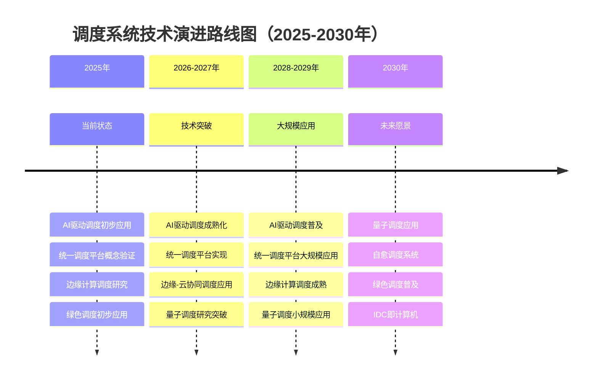
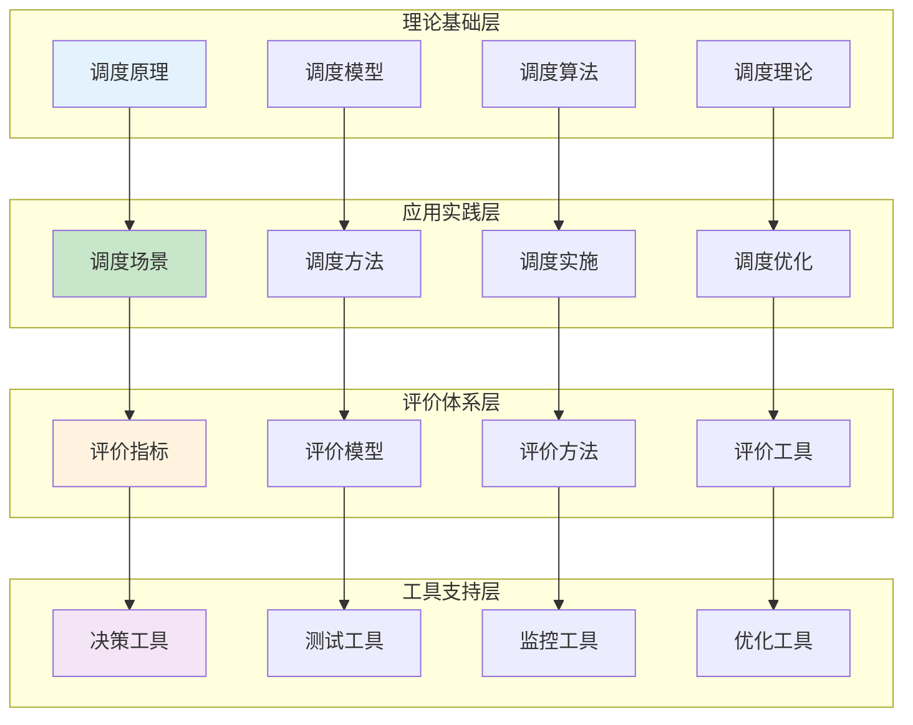

# 知识总结与FAQ

> **来源**: 05.11 调度系统理论分析与评价体系专题
> **章节**: 第25章、第26章、第27章、第28章、第29章
> **更新**: 2025年11月19日

---

## 📋 目录

- [知识总结与FAQ](#知识总结与faq)
  - [📋 目录](#-目录)
  - [1 调度系统知识总结与索引](#1-调度系统知识总结与索引)
    - [25.1 核心概念索引](#251-核心概念索引)
    - [25.2 方法算法索引](#252-方法算法索引)
    - [25.3 评价指标索引](#253-评价指标索引)
    - [25.4 工具资源索引](#254-工具资源索引)
  - [2 调度系统FAQ与常见问题](#2-调度系统faq与常见问题)
    - [26.1 原理相关问题](#261-原理相关问题)
    - [26.2 场景选择问题](#262-场景选择问题)
    - [26.3 方法选择问题](#263-方法选择问题)
    - [26.4 性能优化问题](#264-性能优化问题)
    - [26.5 故障排查问题](#265-故障排查问题)
  - [3 调度系统最佳实践总结](#3-调度系统最佳实践总结)
    - [27.1 设计最佳实践](#271-设计最佳实践)
    - [27.2 实施最佳实践](#272-实施最佳实践)
    - [27.3 优化最佳实践](#273-优化最佳实践)
    - [27.4 运维最佳实践](#274-运维最佳实践)
  - [4 调度系统未来发展趋势与研究前沿](#4-调度系统未来发展趋势与研究前沿)
    - [28.1 技术发展趋势](#281-技术发展趋势)
    - [28.2 研究方向与热点](#282-研究方向与热点)
    - [28.3 技术演进路线图](#283-技术演进路线图)
    - [28.4 未来挑战与机遇](#284-未来挑战与机遇)
  - [5 调度系统完整知识体系总结](#5-调度系统完整知识体系总结)
    - [29.1 知识体系架构](#291-知识体系架构)
    - [29.2 核心理论总结](#292-核心理论总结)
    - [29.3 实践方法论总结](#293-实践方法论总结)
    - [29.4 学习路径建议](#294-学习路径建议)
  - [🔗 相关文档](#-相关文档)

---

## 25 调度系统知识总结与索引

### 25.1 核心概念索引

**调度系统核心概念索引**（2025年11月19日最新）：

| **概念** | **定义** | **相关章节** |
|---------|---------|------------|
| **调度系统** | 将任务分配到资源的系统 | 1.1, 2.1 |
| **调度原理** | 调度的基本原理和理论 | 1 |
| **调度场景** | 不同的调度应用场景 | 2 |
| **调度方法** | 不同的调度算法和方法 | 3 |
| **调度评价** | 调度系统的评价指标和模型 | 4 |
| **资源分配** | 将资源分配给任务的过程 | 1.1, 3.2 |
| **负载均衡** | 平衡各资源负载的策略 | 1.1, 3.2 |
| **调度延迟** | 调度决策的时间延迟 | 4.2, 24.2 |
| **资源利用率** | 资源使用的效率 | 4.2, 24.2 |
| **调度吞吐量** | 单位时间调度次数 | 4.2, 24.2 |

### 25.2 方法算法索引

**调度方法算法索引**（2025年11月19日最新）：

| **方法/算法** | **类型** | **复杂度** | **适用场景** | **相关章节** |
|------------|---------|-----------|------------|------------|
| **First Fit** | 贪心算法 | $O(n \cdot m)$ | 简单场景 | 3.2, 19 |
| **Best Fit** | 贪心算法 | $O(n \cdot m)$ | 资源优化 | 3.2, 19 |
| **负载均衡算法** | 贪心算法 | $O(n \cdot \log m)$ | 负载均衡 | 3.2, 19 |
| **AI驱动调度** | 机器学习 | $O(n \cdot m \cdot k)$ | 复杂场景 | 3.3, 19 |
| **强化学习调度** | 强化学习 | $O(n \cdot m \cdot t)$ | 动态场景 | 3.3, 19 |
| **DRS算法** | 分布式调度 | $O(n \cdot m)$ | 虚拟化场景 | 3.2 |
| **Kubernetes调度** | 两阶段算法 | $O(n \cdot m \cdot \|R\|)$ | 容器化场景 | 3.2 |

### 25.3 评价指标索引

**调度系统评价指标索引**（2025年11月19日最新）：

| **指标** | **定义** | **计算方法** | **目标值** | **相关章节** |
|---------|---------|------------|-----------|------------|
| **调度延迟** | 调度决策时间 | $L = t_{end} - t_{start}$ | <100ms | 4.2, 24.2 |
| **资源利用率** | 资源使用比例 | $U = \frac{used}{total}$ | >80% | 4.2, 24.2 |
| **负载均衡度** | 负载分布差异 | $\sigma_L = \sqrt{\frac{1}{n} \sum (L_i - \bar{L})^2}$ | <10% | 4.2, 24.2 |
| **调度吞吐量** | 单位时间调度次数 | $T = \frac{count}{time}$ | >100调度/秒 | 4.2, 24.2 |
| **调度成功率** | 成功调度比例 | $S = \frac{success}{total}$ | >99% | 4.3 |
| **调度准确率** | 调度决策准确率 | $A = \frac{correct}{total}$ | >95% | 4.3 |
| **系统可用性** | 系统可用时间比例 | $A = \frac{uptime}{total}$ | >99.9% | 4.3 |
| **成本** | 调度系统总成本 | $C = C_{hardware} + C_{operation}$ | 最小化 | 4.3 |

### 25.4 工具资源索引

**调度系统工具资源索引**（2025年11月19日最新）：

| **工具/资源** | **类型** | **用途** | **相关章节** |
|------------|---------|---------|------------|
| **Prometheus** | 监控工具 | 指标收集和存储 | 5.3, 24.4 |
| **Grafana** | 可视化工具 | 性能可视化 | 5.3, 24.4 |
| **kubemark** | 测试工具 | Kubernetes性能测试 | 5.3, 24.4 |
| **Coq** | 形式化验证 | 定理证明 | 6.2 |
| **TLA+** | 形式化验证 | 模型检测 | 6.2 |
| **KLEE** | 形式化验证 | 符号执行 | 6.2 |
| **AHP工具** | 决策支持 | 权重确定 | 21.3 |
| **决策支持系统** | 决策工具 | 方法选择 | 21.2 |

---

## 26 调度系统FAQ与常见问题

### 26.1 原理相关问题

**Q1：什么是调度系统？**

**A**：调度系统是将任务分配到资源的系统，核心功能是在满足约束条件的前提下，优化资源分配和任务执行效率。调度系统可以形式化定义为：

$$
\mathcal{S} = (T, R, C, A, P, O)
$$

其中 $T$ 是任务集合，$R$ 是资源集合，$C$ 是约束条件，$A$ 是调度算法，$P$ 是调度策略，$O$ 是优化目标。

**Q2：调度系统有哪些基本原理？**

**A**：调度系统有四个基本原理：

1. **资源分配原理**：将有限资源分配给多个任务，满足容量和需求约束
2. **负载均衡原理**：平衡资源使用率，避免资源热点
3. **优先级原理**：根据任务优先级调度，保证重要任务优先执行
4. **本地性原理**：优先将任务分配到数据或依赖服务所在的资源

**Q3：调度系统为什么是NP-hard问题？**

**A**：调度问题可以规约到多维装箱问题（Multi-dimensional Bin Packing），而多维装箱问题是NP-hard问题。因此调度问题也是NP-hard问题，无法在多项式时间内找到最优解，需要使用启发式算法或近似算法。

### 26.2 场景选择问题

**Q4：如何选择合适的调度场景？**

**A**：场景选择需要考虑以下因素：

1. **延迟要求**：
   - 极低延迟（<10ms）：Web服务、实时流处理
   - 低延迟（10-100ms）：边缘计算、数据库
   - 一般延迟（>100ms）：大数据批处理

2. **吞吐量要求**：
   - 高吞吐量（10K+ TPS）：Web服务、消息队列
   - 中吞吐量（1K-10K TPS）：AI训练、边缘计算
   - 低吞吐量（<1K TPS）：批处理任务

3. **资源类型**：
   - CPU/内存：Web服务、微服务
   - GPU：AI训练、科学计算
   - IO：数据库、大数据

4. **负载特征**：
   - 突发、波动：Web服务、实时流处理
   - 持续、稳定：大数据批处理、数据库

**Q5：不同场景的关键评价维度是什么？**

**A**：不同场景的关键评价维度不同：

- **Web服务**：性能（延迟）、公平性
- **大数据批处理**：成本、可扩展性
- **AI训练**：性能（利用率）、质量
- **边缘计算**：性能（延迟）、成本
- **实时流处理**：性能（延迟）、公平性

### 26.3 方法选择问题

**Q6：如何选择合适的调度方法？**

**A**：方法选择需要根据场景特征和需求：

1. **简单场景**：
   - 小规模、低复杂度：First Fit
   - 资源优化、成本敏感：Best Fit

2. **负载均衡场景**：
   - Web服务、实时流处理：负载均衡算法

3. **复杂场景**：
   - AI训练、大数据：AI驱动调度
   - 动态负载、在线优化：强化学习调度

**Q7：First Fit和Best Fit有什么区别？**

**A**：

| **维度** | **First Fit** | **Best Fit** |
|---------|-------------|-------------|
| **算法** | 选择第一个满足条件的资源 | 选择最优资源 |
| **时间复杂度** | $O(n \cdot m)$ | $O(n \cdot m)$ |
| **资源利用率** | 较低（70%） | 较高（85%） |
| **调度延迟** | 较低（85） | 中等（80） |
| **适用场景** | 简单场景、快速调度 | 资源优化、成本敏感 |

**Q8：AI驱动调度和传统调度有什么区别？**

**A**：

| **维度** | **传统调度** | **AI驱动调度** |
|---------|------------|--------------|
| **决策方式** | 规则驱动 | 数据驱动 |
| **适应性** | 静态规则 | 动态学习 |
| **准确率** | 85-95% | 95%+ |
| **延迟** | 10-100ms | 50-200ms |
| **复杂度** | 低-中 | 高 |
| **适用场景** | 简单-中等场景 | 复杂场景 |

### 26.4 性能优化问题

**Q9：如何优化调度延迟？**

**A**：调度延迟优化策略：

1. **算法优化**：
   - 优化调度算法复杂度
   - 使用并行化调度
   - 启用调度结果缓存

2. **数据收集优化**：
   - 优化数据收集机制
   - 减少数据收集频率
   - 使用增量更新

3. **决策优化**：
   - 简化决策逻辑
   - 使用预计算
   - 批量处理调度请求

**Q10：如何提高资源利用率？**

**A**：资源利用率优化策略：

1. **资源超配**：
   - 合理设置超配比例
   - 监控资源使用情况
   - 动态调整超配比例

2. **负载均衡**：
   - 启用负载均衡算法
   - 动态迁移负载
   - 优化资源分配

3. **预测性调度**：
   - 使用负载预测
   - 提前调度资源
   - 优化资源预留

**Q11：如何平衡性能和成本？**

**A**：性能-成本平衡策略：

1. **性能优先场景**（Web服务、实时流处理）：
   - 性能权重：0.35-0.40
   - 成本权重：0.15-0.20
   - 策略：性能优先，成本优化

2. **成本优先场景**（大数据批处理）：
   - 性能权重：0.20
   - 成本权重：0.35
   - 策略：成本优先，性能保证

3. **平衡场景**（AI训练、边缘计算）：
   - 性能权重：0.30-0.35
   - 成本权重：0.20-0.30
   - 策略：平衡性能和成本

### 26.5 故障排查问题

**Q12：调度延迟高怎么办？**

**A**：调度延迟高排查步骤：

1. **检查调度算法**：
   - 分析算法复杂度
   - 检查是否有性能瓶颈
   - 优化算法实现

2. **检查系统负载**：
   - 监控CPU、内存使用率
   - 检查是否有资源竞争
   - 优化系统配置

3. **检查网络延迟**：
   - 检查网络延迟
   - 优化网络配置
   - 使用本地资源

4. **检查数据收集**：
   - 检查数据收集延迟
   - 优化数据收集机制
   - 减少数据收集频率

**Q13：资源利用率低怎么办？**

**A**：资源利用率低排查步骤：

1. **检查调度策略**：
   - 分析调度策略是否合理
   - 检查资源分配是否均衡
   - 优化调度策略

2. **检查负载分布**：
   - 分析负载分布情况
   - 检查是否有负载不均衡
   - 启用负载均衡

3. **检查资源预留**：
   - 检查资源预留是否过多
   - 优化资源预留策略
   - 减少不必要的预留

4. **检查资源超配**：
   - 检查是否启用资源超配
   - 优化超配比例
   - 监控超配效果

**Q14：调度不准确怎么办？**

**A**：调度不准确排查步骤：

1. **检查调度算法**：
   - 分析算法是否正确
   - 检查算法参数设置
   - 优化算法实现

2. **检查数据准确性**：
   - 检查数据是否准确
   - 检查数据是否及时更新
   - 修复数据问题

3. **检查模型（AI驱动）**：
   - 检查模型是否训练
   - 检查模型是否过时
   - 更新模型

4. **检查约束条件**：
   - 检查约束条件是否正确
   - 检查约束条件是否冲突
   - 优化约束条件

---

## 27 调度系统最佳实践总结

### 27.1 设计最佳实践

**调度系统设计最佳实践**（2025年11月19日最新）：

1. **分层设计**：
   - 应用层调度：业务逻辑调度
   - 容器层调度：Pod/容器调度
   - 虚拟化层调度：VM调度
   - OS层调度：进程调度

2. **模块化设计**：
   - 调度算法模块化
   - 资源管理模块化
   - 监控模块化
   - 故障恢复模块化

3. **可扩展设计**：
   - 支持水平扩展
   - 支持插件化扩展
   - 支持自定义调度算法
   - 支持多调度器

4. **高可用设计**：
   - 调度器高可用
   - 数据备份恢复
   - 故障自动转移
   - 负载均衡

### 27.2 实施最佳实践

**调度系统实施最佳实践**（2025年11月19日最新）：

1. **分阶段实施**：
   - 准备阶段：需求分析、技术选型
   - 设计阶段：架构设计、方案设计
   - 开发阶段：核心开发、集成开发
   - 测试阶段：功能测试、性能测试
   - 部署阶段：环境部署、系统切换
   - 优化阶段：持续优化

2. **充分测试**：
   - 单元测试：测试核心功能
   - 集成测试：测试系统集成
   - 性能测试：测试性能指标
   - 压力测试：测试可扩展性
   - 稳定性测试：测试可靠性

3. **灰度发布**：
   - 小规模试点
   - 逐步扩大范围
   - 监控实施效果
   - 及时调整策略

4. **持续监控**：
   - 实时监控关键指标
   - 设置合理告警阈值
   - 及时响应问题
   - 持续优化改进

### 27.3 优化最佳实践

**调度系统优化最佳实践**（2025年11月19日最新）：

1. **性能优化**：
   - 优化调度算法复杂度
   - 启用并行化调度
   - 优化数据收集机制
   - 使用缓存和预计算

2. **资源优化**：
   - 启用资源超配
   - 优化负载均衡
   - 使用预测性调度
   - 优化资源分配策略

3. **成本优化**：
   - 优化资源使用效率
   - 减少资源浪费
   - 自动化运维
   - 使用云服务

4. **质量优化**：
   - 提高调度准确率
   - 减少调度错误
   - 提高系统可用性
   - 快速故障恢复

### 27.4 运维最佳实践

**调度系统运维最佳实践**（2025年11月19日最新）：

1. **监控体系**：
   - 分层监控（应用、系统、基础设施）
   - 关键指标优先
   - 分级告警
   - 自动化响应

2. **故障处理**：
   - 快速故障检测
   - 自动故障恢复
   - 故障根因分析
   - 预防措施实施

3. **容量管理**：
   - 持续容量监控
   - 预测容量需求
   - 及时扩容
   - 优化资源使用

4. **持续改进**：
   - 定期性能评估
   - 识别优化机会
   - 实施优化措施
   - 验证优化效果

**最佳实践检查清单**（2025年11月19日最新）：

**设计阶段**：

- [ ] 采用分层设计架构
- [ ] 模块化设计
- [ ] 可扩展设计
- [ ] 高可用设计

**实施阶段**：

- [ ] 分阶段实施
- [ ] 充分测试
- [ ] 灰度发布
- [ ] 持续监控

**优化阶段**：

- [ ] 性能优化
- [ ] 资源优化
- [ ] 成本优化
- [ ] 质量优化

**运维阶段**：

- [ ] 完善监控体系
- [ ] 快速故障处理
- [ ] 有效容量管理
- [ ] 持续改进机制

---

## 28 调度系统未来发展趋势与研究前沿

### 28.1 技术发展趋势

**调度系统技术发展趋势**（2025年11月19日最新）：

**趋势1：AI驱动调度成熟化**

- **当前状态**（2025年）：
  - 调度准确率：95-98%
  - 资源利用率：85-95%
  - 应用范围：中大规模生产环境

- **发展趋势**（2026-2030年）：
  - 调度准确率：提升至98%+
  - 资源利用率：提升至95%+
  - 应用范围：大规模生产环境普及
  - 技术突破：模型可解释性、实时性优化

**趋势2：统一调度平台**

- **当前状态**（2025年）：
  - 跨平台调度：部分实现
  - 统一资源池：概念验证
  - 智能调度：初步应用

- **发展趋势**（2026-2030年）：
  - 跨平台调度：全面实现
  - 统一资源池：大规模应用
  - 智能调度：成熟应用
  - 技术突破：标准化、互操作性

**趋势3：边缘计算调度**

- **当前状态**（2025年）：
  - WASM容器：初步应用
  - 边缘-云协同：概念验证
  - 低延迟调度：部分实现

- **发展趋势**（2026-2030年）：
  - WASM容器：大规模应用
  - 边缘-云协同：成熟应用
  - 低延迟调度：<1μs延迟
  - 技术突破：网络延迟、一致性保证

**趋势4：量子调度研究**

- **当前状态**（2025年）：
  - 量子计算：研究阶段
  - 量子优化算法：理论探索
  - 量子调度：概念验证

- **发展趋势**（2026-2030年）：
  - 量子计算：技术突破
  - 量子优化算法：实际应用
  - 量子调度：小规模应用
  - 技术突破：量子硬件、算法优化

**趋势5：绿色计算调度**

- **当前状态**（2025年）：
  - 能耗优化：初步应用
  - 碳排放追踪：概念验证
  - 绿色调度：研究阶段

- **发展趋势**（2026-2030年）：
  - 能耗优化：大规模应用
  - 碳排放追踪：成熟应用
  - 绿色调度：普及应用
  - 技术突破：能耗模型、优化算法

### 28.2 研究方向与热点

**调度系统研究方向**（2025年11月19日最新）：

**研究方向1：AI驱动调度**

- **强化学习调度**：
  - 使用强化学习优化调度决策
  - 在线学习适应环境变化
  - 多目标优化调度

- **深度学习预测**：
  - 使用深度学习预测负载
  - 时间序列预测模型
  - 多变量预测模型

- **自适应调度**：
  - 自适应调整调度策略
  - 动态权重调整
  - 环境感知调度

**研究方向2：量子调度**

- **量子优化算法**：
  - 使用量子计算优化调度
  - 量子近似优化算法（QAOA）
  - 量子退火算法

- **量子机器学习**：
  - 量子机器学习在调度中的应用
  - 量子神经网络
  - 量子强化学习

- **量子并行调度**：
  - 量子并行调度算法
  - 量子纠缠调度
  - 量子叠加调度

**研究方向3：边缘计算调度**

- **边缘-云协同调度**：
  - 边缘和云协同调度算法
  - 智能路由调度
  - 数据压缩调度

- **低延迟调度**：
  - 极低延迟调度算法
  - 实时调度优化
  - 本地优先调度

- **资源受限调度**：
  - 资源受限环境下的调度
  - 轻量级调度算法
  - WASM容器调度

**研究方向4：自愈调度系统**

- **自动故障恢复**：
  - 自动检测和恢复故障
  - 预测性故障检测
  - 智能故障恢复

- **自适应优化**：
  - 自适应优化调度策略
  - 动态参数调整
  - 环境自适应

- **预测性维护**：
  - 预测性维护和优化
  - 设备健康监控
  - 预防性调度

**研究方向5：绿色调度**

- **能耗优化**：
  - 优化能耗，降低碳排放
  - 能耗感知调度
  - 时间分片调度

- **资源回收**：
  - 智能资源回收和再利用
  - 资源生命周期管理
  - 资源优化调度

- **可持续调度**：
  - 可持续的调度策略
  - 可再生能源优先
  - 碳中和调度

### 28.3 技术演进路线图

**调度系统技术演进路线图**（2025年11月19日最新）：

**技术成熟度预测**（2025年11月19日最新）：

| **技术** | **2025年** | **2027年** | **2030年** | **关键突破点** |
|---------|-----------|-----------|-----------|-------------|
| **AI驱动调度** | ⭐⭐⭐⭐ | ⭐⭐⭐⭐⭐ | ⭐⭐⭐⭐⭐ | 模型可解释性、实时性 |
| **统一调度平台** | ⭐⭐⭐ | ⭐⭐⭐⭐ | ⭐⭐⭐⭐⭐ | 标准化、互操作性 |
| **边缘-云协同** | ⭐⭐⭐ | ⭐⭐⭐⭐ | ⭐⭐⭐⭐⭐ | 网络延迟、一致性 |
| **量子调度** | ⭐ | ⭐⭐ | ⭐⭐⭐ | 量子硬件、算法优化 |
| **自愈调度系统** | ⭐⭐ | ⭐⭐⭐ | ⭐⭐⭐⭐ | 故障检测、自动恢复 |
| **绿色调度** | ⭐⭐⭐ | ⭐⭐⭐⭐ | ⭐⭐⭐⭐⭐ | 能耗模型、优化算法 |
| **生物启发调度** | ⭐⭐ | ⭐⭐⭐ | ⭐⭐⭐⭐ | 算法效率、适用性 |

### 28.4 未来挑战与机遇

**未来挑战**（2025年11月19日最新）：

1. **技术挑战**：
   - **AI模型可解释性**：如何解释AI调度决策
   - **实时性要求**：如何在保证准确性的同时降低延迟
   - **大规模扩展**：如何支持百万级节点调度
   - **跨平台兼容**：如何实现不同平台的统一调度

2. **性能挑战**：
   - **延迟优化**：如何进一步降低调度延迟
   - **利用率提升**：如何突破资源利用率上限
   - **成本控制**：如何在优化性能的同时控制成本
   - **能耗优化**：如何在保证性能的同时降低能耗

3. **安全挑战**：
   - **多租户隔离**：如何保证多租户安全隔离
   - **数据安全**：如何保证调度数据安全
   - **攻击防护**：如何防护调度系统攻击
   - **合规性**：如何满足各种合规要求

**未来机遇**（2025年11月19日最新）：

1. **技术机遇**：
   - **AI技术成熟**：AI技术成熟为调度系统带来新机遇
   - **量子计算**：量子计算为调度优化带来新可能
   - **边缘计算**：边缘计算为调度系统带来新场景
   - **绿色计算**：绿色计算为调度系统带来新方向

2. **应用机遇**：
   - **大规模应用**：调度系统在大规模场景中的应用
   - **新场景扩展**：调度系统在新场景中的扩展
   - **跨行业应用**：调度系统在跨行业中的应用
   - **国际化应用**：调度系统在国际化中的应用

3. **商业机遇**：
   - **市场增长**：调度系统市场快速增长
   - **技术创新**：调度系统技术创新带来商业价值
   - **生态建设**：调度系统生态建设带来机遇
   - **标准化**：调度系统标准化带来机遇

---

## 29 调度系统完整知识体系总结

### 29.1 知识体系架构

**调度系统知识体系架构**（2025年11月19日最新）：

**知识体系层次**：

1. **理论基础层**：
   - 调度原理：资源分配、负载均衡、优先级、本地性
   - 调度模型：形式化定义、数学模型、优化模型
   - 调度算法：经典算法、智能算法、启发式算法
   - 调度理论：复杂度理论、优化理论、博弈论

2. **应用实践层**：
   - 调度场景：Web服务、大数据、AI训练、边缘计算
   - 调度方法：First Fit、Best Fit、负载均衡、AI驱动
   - 调度实施：设计、开发、测试、部署
   - 调度优化：性能优化、资源优化、成本优化

3. **评价体系层**：
   - 评价指标：性能、成本、质量、公平性、可扩展性
   - 评价模型：性能模型、成本模型、综合评价模型
   - 评价方法：测试、验证、评估
   - 评价工具：基准测试、性能分析、对比工具

4. **工具支持层**：
   - 决策工具：场景-方法匹配、方法选择、权重确定
   - 测试工具：单元测试、集成测试、性能测试
   - 监控工具：Prometheus、Grafana、ELK
   - 优化工具：性能分析、资源优化、成本优化

### 29.2 核心理论总结

**调度系统核心理论总结**（2025年11月19日最新）：

**理论1：调度系统形式化定义**

调度系统是一个六元组：

$$
\mathcal{S} = (T, R, C, A, P, O)
$$

**理论2：调度问题复杂度**

调度问题是NP-hard问题，无法在多项式时间内找到最优解。

**理论3：调度性能边界**

对于 $n$ 个资源和总负载 $L$，负载均衡度下界为：

$$
\sigma_L \geq \frac{1}{\sqrt{n}} \cdot \sqrt{\frac{L^2}{n} - \bar{L}^2}
$$

**理论4：最优方法选择**

对于场景 $s$，最优方法为：

$$
m^* = \arg\max_{m \in M} \sum_{e \in E} w_e \cdot Score(m, s, e)
$$

**理论5：综合评价模型**

综合评价模型：

$$
E_{total} = \alpha \cdot \prod_{i=1}^{n} E_i^{w_i} + \beta \cdot \sum_{i=1}^{n} w_i \cdot E_i - \gamma \cdot C
$$

### 29.3 实践方法论总结

**调度系统实践方法论**（2025年11月19日最新）：

**方法论1：场景-方法-评价关联分析**

1. **场景识别**：识别调度场景类型和特征
2. **方法匹配**：使用匹配工具推荐方法
3. **方法评价**：评价方法在场景中的表现
4. **方法选择**：选择最优方法

**方法论2：测试-验证-评价完整流程**

1. **测试阶段**：单元测试、集成测试、性能测试
2. **验证阶段**：功能验证、性能验证、可靠性验证
3. **评价阶段**：性能评价、成本评价、质量评价
4. **优化阶段**：持续优化、持续改进

**方法论3：持续改进机制**

1. **监控**：持续监控系统性能
2. **分析**：分析性能数据和问题
3. **优化**：制定和实施优化方案
4. **评估**：评估优化效果
5. **改进**：持续改进策略

### 29.4 学习路径建议

**调度系统学习路径**（2025年11月19日最新）：

**阶段1：基础阶段**（1-2个月）

- 学习调度系统基本概念
- 理解调度原理和模型
- 掌握基本调度算法
- 实践简单调度场景

**阶段2：进阶阶段**（2-4个月）

- 深入学习调度算法
- 理解调度优化策略
- 掌握调度评价方法
- 实践复杂调度场景

**阶段3：高级阶段**（4-6个月）

- 掌握智能调度技术
- 理解跨平台调度
- 掌握调度系统设计
- 实践大规模调度系统

**阶段4：专家阶段**（6个月+）

- 研究调度系统前沿
- 设计调度系统架构
- 指导调度系统实施
- 推动调度系统创新

**学习资源推荐**：

1. **官方文档**：VMware、Kubernetes、Docker官方文档
2. **书籍**：《Kubernetes权威指南》、《深入理解Kubernetes》
3. **在线课程**：CNCF、Coursera、edX相关课程
4. **实践平台**：Kubernetes Playground、Docker Desktop、云平台
5. **社区资源**：GitHub、Stack Overflow、Reddit、技术博客

---

## 🔗 相关文档

- [返回专题目录](./README.md)
- [调度原理与场景分析](./01_调度原理与场景分析.md) - 调度基本原理、场景分类
- [调度方法与模型](./02_调度方法与模型.md) - 调度方法分类、经典算法
- [决策支持与实施](./12_决策支持与实施.md) - 决策支持工具、实施路线图
- [案例研究](./10_案例研究.md) - 实际案例研究、完整实施案例

---

**最后更新**: 2025-11-19

---
