# 调度与测试关联分析

> **来源**: 05.11 调度系统理论分析与评价体系专题
> **章节**: 第35章、第53章
> **更新**: 2025年11月19日

---

## 📋 目录

- [调度与测试关联分析](#调度与测试关联分析)
  - [📋 目录](#-目录)
  - [35 调度模型与测试模型关联分析](#35-调度模型与测试模型关联分析)
    - [35.1 模型关联关系](#351-模型关联关系)
    - [35.2 测试覆盖度分析](#352-测试覆盖度分析)
    - [35.3 模型验证完整性](#353-模型验证完整性)
  - [37 调度模型详细算法与实现](#37-调度模型详细算法与实现)
    - [37.1 First Fit算法详细实现](#371-first-fit算法详细实现)
    - [37.2 Best Fit算法详细实现](#372-best-fit算法详细实现)
    - [37.3 负载均衡算法详细实现](#373-负载均衡算法详细实现)
    - [37.4 AI驱动调度算法详细实现](#374-ai驱动调度算法详细实现)
  - [38 测试方法详细设计与实现](#38-测试方法详细设计与实现)
    - [38.1 单元测试详细设计](#381-单元测试详细设计)
    - [38.2 集成测试详细设计](#382-集成测试详细设计)
    - [38.3 性能测试详细设计](#383-性能测试详细设计)
    - [38.4 压力测试详细设计](#384-压力测试详细设计)
    - [38.5 测试用例自动生成](#385-测试用例自动生成)
  - [39 调度模型与测试模型完整案例](#39-调度模型与测试模型完整案例)
    - [39.1 案例1：First Fit模型完整测试](#391-案例1first-fit模型完整测试)
    - [39.2 案例2：AI驱动调度模型完整测试](#392-案例2ai驱动调度模型完整测试)
    - [39.3 案例3：混合调度模型完整测试](#393-案例3混合调度模型完整测试)
  - [41 测试工具与框架详细指南](#41-测试工具与框架详细指南)
    - [41.1 单元测试工具](#411-单元测试工具)
    - [41.2 性能测试工具](#412-性能测试工具)
    - [41.3 压力测试工具](#413-压力测试工具)
    - [41.4 监控与可观测性工具](#414-监控与可观测性工具)
  - [42 调度模型性能调优实战](#42-调度模型性能调优实战)
    - [42.1 性能瓶颈分析](#421-性能瓶颈分析)
    - [42.2 优化策略与方法](#422-优化策略与方法)
    - [42.3 调优案例研究](#423-调优案例研究)
  - [43 故障排查与问题诊断](#43-故障排查与问题诊断)
    - [43.1 常见问题分类](#431-常见问题分类)
    - [43.2 诊断方法与工具](#432-诊断方法与工具)
    - [43.3 问题解决流程](#433-问题解决流程)
  - [44 2025年最新技术应用](#44-2025年最新技术应用)
    - [44.1 AI/ML在调度测试中的应用](#441-aiml在调度测试中的应用)
    - [44.2 云原生测试技术](#442-云原生测试技术)
    - [44.3 自动化测试平台](#443-自动化测试平台)
  - [45 最佳实践总结](#45-最佳实践总结)
    - [45.1 调度模型设计最佳实践](#451-调度模型设计最佳实践)
    - [45.2 测试设计最佳实践](#452-测试设计最佳实践)
    - [45.3 性能优化最佳实践](#453-性能优化最佳实践)
  - [47 测试原理深度论证](#47-测试原理深度论证)
    - [47.1 测试基本原理](#471-测试基本原理)
    - [47.2 测试原理形式化定义](#472-测试原理形式化定义)
    - [47.3 测试原理数学建模](#473-测试原理数学建模)
    - [47.4 测试原理定理与证明](#474-测试原理定理与证明)
  - [48 测试方法全面对比分析](#48-测试方法全面对比分析)
    - [48.1 测试方法分类体系](#481-测试方法分类体系)
    - [48.2 测试方法多维对比矩阵](#482-测试方法多维对比矩阵)
    - [48.3 测试方法选择决策树](#483-测试方法选择决策树)
    - [48.4 测试方法组合策略](#484-测试方法组合策略)
  - [49 测试方案完整设计体系](#49-测试方案完整设计体系)
    - [49.1 测试方案设计原理](#491-测试方案设计原理)
    - [49.2 测试方案设计方法](#492-测试方案设计方法)
    - [49.3 测试方案评价模型](#493-测试方案评价模型)
    - [49.4 测试方案优化策略](#494-测试方案优化策略)
  - [50 测试评价体系深度分析](#50-测试评价体系深度分析)
    - [50.1 测试评价维度体系](#501-测试评价维度体系)
    - [50.2 测试评价数学模型](#502-测试评价数学模型)
    - [50.3 测试评价多维矩阵](#503-测试评价多维矩阵)
    - [50.4 测试评价决策支持](#504-测试评价决策支持)
  - [51 测试系统完整思维导图](#51-测试系统完整思维导图)
    - [51.1 测试原理思维导图](#511-测试原理思维导图)
    - [51.2 测试方法思维导图](#512-测试方法思维导图)
    - [51.3 测试方案思维导图](#513-测试方案思维导图)
    - [51.4 测试评价思维导图](#514-测试评价思维导图)
    - [51.5 测试系统全景思维导图](#515-测试系统全景思维导图)
  - [53 测试与调度系统关联分析](#53-测试与调度系统关联分析)
    - [53.1 测试-调度关联模型](#531-测试-调度关联模型)
    - [53.2 测试覆盖调度场景分析](#532-测试覆盖调度场景分析)
    - [53.3 调度模型测试验证矩阵](#533-调度模型测试验证矩阵)
    - [53.4 测试-调度协同优化](#534-测试-调度协同优化)
  - [🔗 相关文档](#-相关文档)

---

## 35 调度模型与测试模型关联分析

### 35.1 模型关联关系

**调度模型与测试模型关联**（2025年11月19日最新）：

**定义35.1（模型关联）**：

调度模型 $\mathcal{M}$ 和测试模型 $\mathcal{T}$ 的关联关系为：

$$
\mathcal{R}(\mathcal{M}, \mathcal{T}) = \{r_1, r_2, \ldots, r_k\}
$$

其中 $r_i$ 是第 $i$ 个关联关系。

**关联关系类型**：

1. **功能关联**：
   - 测试模型测试调度模型的功能
   - 每个调度功能对应测试用例

2. **性能关联**：
   - 测试模型测试调度模型的性能
   - 性能指标对应性能测试

3. **正确性关联**：
   - 测试模型验证调度模型的正确性
   - 调度算法对应正确性测试

**关联关系形式化**：

$$
\mathcal{R}_{function}(\mathcal{M}, \mathcal{T}) = \{(f_i, tc_j) | f_i \in F_{\mathcal{M}}, tc_j \in TC_{\mathcal{T}}, \text{测试}(f_i, tc_j)\}
$$

其中：

- $F_{\mathcal{M}}$：调度模型功能集合
- $TC_{\mathcal{T}}$：测试用例集合
- $\text{测试}(f_i, tc_j)$：测试用例 $tc_j$ 测试功能 $f_i$

### 35.2 测试覆盖度分析

**测试覆盖度分析**（2025年11月19日最新）：

**定义35.2（调度模型测试覆盖度）**：

调度模型 $\mathcal{M}$ 的测试覆盖度为：

$$
C_{\mathcal{M}} = \frac{|\{f \in F_{\mathcal{M}} | \exists tc \in TC_{\mathcal{T}}, \text{测试}(f, tc)\}|}{|F_{\mathcal{M}}|}
$$

**覆盖度分类**：

1. **功能覆盖度**：
   $$
   C_{function} = \frac{N_{tested\_functions}}{N_{total\_functions}}
   $$

2. **场景覆盖度**：
   $$
   C_{scenario} = \frac{N_{tested\_scenarios}}{N_{total\_scenarios}}
   $$

3. **路径覆盖度**：
   $$
   C_{path} = \frac{N_{tested\_paths}}{N_{total\_paths}}
   $$

**覆盖度目标**：

- **功能覆盖度**：> 90%
- **场景覆盖度**：> 80%
- **路径覆盖度**：> 70%

### 35.3 模型验证完整性

**模型验证完整性**（2025年11月19日最新）：

**定义35.3（验证完整性）**：

调度模型 $\mathcal{M}$ 的验证完整性为：

$$
V_{\mathcal{M}} = \frac{|\{p \in P_{\mathcal{M}} | \text{已验证}(p)\}|}{|P_{\mathcal{M}}|}
$$

其中：

- $P_{\mathcal{M}}$：调度模型属性集合
- $\text{已验证}(p)$：属性 $p$ 已被验证

**验证完整性分类**：

1. **功能验证完整性**：
   - 所有功能已验证
   - 所有场景已验证

2. **性能验证完整性**：
   - 所有性能指标已验证
   - 所有性能边界已验证

3. **正确性验证完整性**：
   - 所有算法正确性已验证
   - 所有约束满足性已验证

**验证完整性矩阵**（2025年11月19日最新）：

| **调度模型** | **功能验证** | **性能验证** | **正确性验证** | **综合完整性** |
|------------|------------|------------|-------------|-------------|
| **First Fit** | 100% | 95% | 100% | 98% |
| **Best Fit** | 100% | 95% | 100% | 98% |
| **负载均衡** | 100% | 90% | 95% | 95% |
| **AI驱动** | 90% | 85% | 80% | 85% |
| **强化学习** | 85% | 80% | 75% | 80% |

**验证完整性提升策略**：

1. **增加测试用例**：提高功能覆盖度
2. **性能基准测试**：提高性能验证完整性
3. **形式化验证**：提高正确性验证完整性
4. **持续验证**：持续提高验证完整性

**调度模型与测试模型关联矩阵**（2025年11月19日最新）：

| **调度模型** | **功能测试覆盖** | **性能测试覆盖** | **正确性测试覆盖** | **综合覆盖度** |
|------------|---------------|---------------|----------------|-------------|
| **First Fit** | 100% | 95% | 100% | 98% |
| **Best Fit** | 100% | 95% | 100% | 98% |
| **负载均衡** | 100% | 90% | 95% | 95% |
| **AI驱动** | 90% | 85% | 80% | 85% |
| **强化学习** | 85% | 80% | 75% | 80% |

**调度模型与测试模型关联图**（2025年11月19日最新）：

```mermaid
graph TB
    subgraph 调度模型
        M1[First Fit模型]
        M2[Best Fit模型]
        M3[负载均衡模型]
        M4[AI驱动模型]
        M5[强化学习模型]
    end

    subgraph 测试模型
        T1[功能测试模型]
        T2[性能测试模型]
        T3[正确性测试模型]
        T4[可靠性测试模型]
    end

    subgraph 评价体系
        E1[性能评价]
        E2[成本评价]
        E3[质量评价]
    end

    M1 --> T1
    M1 --> T2
    M1 --> T3
    M2 --> T1
    M2 --> T2
    M2 --> T3
    M3 --> T1
    M3 --> T2
    M4 --> T1
    M4 --> T2
    M4 --> T3
    M4 --> T4
    M5 --> T1
    M5 --> T2
    M5 --> T3
    M5 --> T4

    T1 --> E3
    T2 --> E1
    T3 --> E3
    T4 --> E3

    style M1 fill:#e3f2fd
    style T2 fill:#c8e6c9
    style E1 fill:#fff3e0
```

---

## 37 调度模型详细算法与实现

### 37.1 First Fit算法详细实现

**First Fit算法原理**（2025年11月19日最新）：

First Fit算法按顺序遍历资源，将任务分配到第一个满足需求的资源。

**算法伪代码**：

```text
算法：First Fit调度算法
输入：任务集合 T = {t_1, t_2, ..., t_n}，资源集合 R = {r_1, r_2, ..., r_m}
输出：分配方案 A = {(t_i, r_j) | t_i 分配到 r_j}

1. 初始化：A = ∅
2. 对每个任务 t_i ∈ T：
   a. 按顺序遍历资源 r_j ∈ R：
      - 如果 r_j 满足 t_i 的需求：
        * A = A ∪ {(t_i, r_j)}
        * 更新 r_j 的剩余容量
        * 跳出循环
      - 否则继续下一个资源
   b. 如果没有找到合适的资源，标记 t_i 为未分配
3. 返回 A
```

**Python实现**：

```python
def first_fit_schedule(tasks, resources):
    """
    First Fit调度算法实现

    参数:
        tasks: 任务列表，每个任务包含资源需求
        resources: 资源列表，每个资源包含容量

    返回:
        分配方案字典 {task_id: resource_id}
    """
    allocation = {}
    resource_remaining = {r.id: r.capacity for r in resources}

    for task in tasks:
        allocated = False
        for resource in resources:
            # 检查资源是否满足任务需求
            if all(resource_remaining[resource.id][k] >= task.requirements[k]
                   for k in task.requirements):
                # 分配任务到资源
                allocation[task.id] = resource.id
                # 更新资源剩余容量
                for k in task.requirements:
                    resource_remaining[resource.id][k] -= task.requirements[k]
                allocated = True
                break

        if not allocated:
            allocation[task.id] = None  # 未分配

    return allocation
```

**算法复杂度分析**：

- **时间复杂度**：$O(nmK)$，其中 $n$ 是任务数，$m$ 是资源数，$K$ 是资源类型数
- **空间复杂度**：$O(n + mK)$

**算法正确性证明**：

**定理37.1（First Fit算法正确性）**：

First Fit算法满足以下性质：

1. **容量约束满足**：$\forall (t_i, r_j) \in A$，$r_j$ 的剩余容量满足 $t_i$ 的需求
2. **任务分配唯一性**：每个任务最多分配到一个资源
3. **资源容量不超限**：$\forall r_j$，已分配任务的总需求不超过 $r_j$ 的容量

**证明**：

1. 算法在分配前检查资源容量，因此容量约束满足。
2. 算法对每个任务只分配一次，因此任务分配唯一。
3. 算法在分配后更新资源剩余容量，因此资源容量不超限。$\square$

### 37.2 Best Fit算法详细实现

**Best Fit算法原理**（2025年11月19日最新）：

Best Fit算法将任务分配到剩余容量最小但仍能满足需求的资源，以最大化资源利用率。

**算法伪代码**：

```text
算法：Best Fit调度算法
输入：任务集合 T = {t_1, t_2, ..., t_n}，资源集合 R = {r_1, r_2, ..., r_m}
输出：分配方案 A = {(t_i, r_j) | t_i 分配到 r_j}

1. 初始化：A = ∅
2. 对每个任务 t_i ∈ T：
   a. 初始化：best_resource = None, min_waste = ∞
   b. 遍历所有资源 r_j ∈ R：
      - 如果 r_j 满足 t_i 的需求：
        * 计算浪费：waste = 剩余容量 - t_i 需求
        * 如果 waste < min_waste：
          - min_waste = waste
          - best_resource = r_j
   c. 如果 best_resource ≠ None：
      * A = A ∪ {(t_i, best_resource)}
      * 更新 best_resource 的剩余容量
   d. 否则标记 t_i 为未分配
3. 返回 A
```

**Python实现**：

```python
def best_fit_schedule(tasks, resources):
    """
    Best Fit调度算法实现

    参数:
        tasks: 任务列表
        resources: 资源列表

    返回:
        分配方案字典 {task_id: resource_id}
    """
    allocation = {}
    resource_remaining = {r.id: r.capacity.copy() for r in resources}

    for task in tasks:
        best_resource = None
        min_waste = float('inf')

        for resource in resources:
            # 检查资源是否满足任务需求
            if all(resource_remaining[resource.id][k] >= task.requirements[k]
                   for k in task.requirements):
                # 计算浪费（剩余容量）
                waste = sum(resource_remaining[resource.id][k] - task.requirements[k]
                           for k in task.requirements)
                # 选择浪费最小的资源
                if waste < min_waste:
                    min_waste = waste
                    best_resource = resource

        if best_resource:
            allocation[task.id] = best_resource.id
            # 更新资源剩余容量
            for k in task.requirements:
                resource_remaining[best_resource.id][k] -= task.requirements[k]
        else:
            allocation[task.id] = None

    return allocation
```

**算法复杂度分析**：

- **时间复杂度**：$O(nmK)$，其中需要遍历所有资源找到最优资源
- **空间复杂度**：$O(n + mK)$

**算法优化**：

使用优先队列（最小堆）优化资源选择：

```python
import heapq

def best_fit_schedule_optimized(tasks, resources):
    """
    Best Fit调度算法优化版本（使用优先队列）
    """
    allocation = {}
    resource_remaining = {r.id: r.capacity.copy() for r in resources}

    # 为每个资源类型创建优先队列
    resource_queues = {}
    for resource in resources:
        for k in resource.capacity:
            if k not in resource_queues:
                resource_queues[k] = []
            # 使用剩余容量作为优先级
            heapq.heappush(resource_queues[k],
                          (resource_remaining[resource.id][k], resource.id))

    for task in tasks:
        best_resource = None
        min_waste = float('inf')

        # 从优先队列中选择资源
        for k in task.requirements:
            if k in resource_queues and resource_queues[k]:
                waste, resource_id = heapq.heappop(resource_queues[k])
                if waste >= task.requirements[k]:
                    if waste < min_waste:
                        min_waste = waste
                        best_resource = resource_id
                heapq.heappush(resource_queues[k], (waste, resource_id))

        if best_resource:
            allocation[task.id] = best_resource
            # 更新资源剩余容量和优先队列
            for k in task.requirements:
                resource_remaining[best_resource][k] -= task.requirements[k]
                # 更新优先队列
                # ...（省略具体实现）

    return allocation
```

### 37.3 负载均衡算法详细实现

**负载均衡算法原理**（2025年11月19日最新）：

负载均衡算法将任务分配到负载最小的资源，以最小化负载不均衡度。

**算法伪代码**：

```text
算法：负载均衡调度算法
输入：任务集合 T = {t_1, t_2, ..., t_n}，资源集合 R = {r_1, r_2, ..., r_m}
输出：分配方案 A = {(t_i, r_j) | t_i 分配到 r_j}

1. 初始化：A = ∅, L = {0, 0, ..., 0}（资源负载）
2. 对每个任务 t_i ∈ T：
   a. 找到负载最小的资源：r_j = argmin_{r_k ∈ R} L_k
   b. 如果 r_j 满足 t_i 的需求：
      * A = A ∪ {(t_i, r_j)}
      * 更新负载：L_j = L_j + load(t_i)
   c. 否则标记 t_i 为未分配
3. 返回 A
```

**Python实现**：

```python
def load_balance_schedule(tasks, resources):
    """
    负载均衡调度算法实现

    参数:
        tasks: 任务列表
        resources: 资源列表

    返回:
        分配方案字典 {task_id: resource_id}
    """
    allocation = {}
    resource_load = {r.id: 0.0 for r in resources}
    resource_remaining = {r.id: r.capacity.copy() for r in resources}

    for task in tasks:
        # 找到负载最小的资源
        min_load = float('inf')
        best_resource = None

        for resource in resources:
            # 检查资源是否满足任务需求
            if all(resource_remaining[resource.id][k] >= task.requirements[k]
                   for k in task.requirements):
                # 选择负载最小的资源
                if resource_load[resource.id] < min_load:
                    min_load = resource_load[resource.id]
                    best_resource = resource

        if best_resource:
            allocation[task.id] = best_resource.id
            # 更新资源负载和剩余容量
            resource_load[best_resource.id] += task.load
            for k in task.requirements:
                resource_remaining[best_resource.id][k] -= task.requirements[k]
        else:
            allocation[task.id] = None

    return allocation
```

**负载均衡度计算**：

```python
def calculate_load_balance(resource_load):
    """
    计算负载均衡度

    参数:
        resource_load: 资源负载字典 {resource_id: load}

    返回:
        负载不均衡度（标准差）
    """
    loads = list(resource_load.values())
    if not loads:
        return 0.0

    mean_load = sum(loads) / len(loads)
    variance = sum((l - mean_load) ** 2 for l in loads) / len(loads)
    std_dev = variance ** 0.5

    return std_dev
```

### 37.4 AI驱动调度算法详细实现

**AI驱动调度算法原理**（2025年11月19日最新）：

AI驱动调度算法使用机器学习模型预测最优资源分配，考虑历史数据、负载特征等因素。

**算法架构**：

```mermaid
graph LR
    A[任务特征] --> B[AI模型]
    C[资源状态] --> B
    D[历史数据] --> B
    B --> E[评分预测]
    E --> F[资源选择]
    F --> G[分配执行]
    G --> H[反馈学习]
    H --> B

    style B fill:#e3f2fd
    style E fill:#c8e6c9
```

**算法伪代码**：

```text
算法：AI驱动调度算法
输入：任务 t，资源集合 R，AI模型 M
输出：最优资源 r*

1. 提取任务特征：features_t = extract_features(t)
2. 对每个资源 r_j ∈ R：
   a. 提取资源特征：features_r = extract_features(r_j)
   b. 组合特征：features = combine(features_t, features_r)
   c. 使用AI模型预测评分：score_j = M.predict(features)
3. 选择评分最高的资源：r* = argmax_{r_j} score_j
4. 分配任务到 r*
5. 收集反馈数据，更新模型 M
```

**Python实现**：

```python
import numpy as np
from sklearn.ensemble import RandomForestRegressor

class AIScheduler:
    """
    AI驱动调度器
    """
    def __init__(self):
        self.model = RandomForestRegressor(n_estimators=100)
        self.training_data = []
        self.training_labels = []
        self.is_trained = False

    def extract_features(self, task, resource):
        """
        提取任务和资源的特征

        参数:
            task: 任务对象
            resource: 资源对象

        返回:
            特征向量
        """
        features = [
            # 任务特征
            task.cpu_requirement,
            task.memory_requirement,
            task.priority,
            task.estimated_duration,
            # 资源特征
            resource.cpu_capacity,
            resource.memory_capacity,
            resource.current_load,
            resource.cpu_utilization,
            resource.memory_utilization,
            # 匹配特征
            resource.cpu_capacity - task.cpu_requirement,
            resource.memory_capacity - task.memory_requirement,
        ]
        return np.array(features)

    def predict_score(self, task, resource):
        """
        预测任务分配到资源的评分

        参数:
            task: 任务对象
            resource: 资源对象

        返回:
            评分（0-1之间）
        """
        if not self.is_trained:
            # 如果模型未训练，使用默认评分
            return self.default_score(task, resource)

        features = self.extract_features(task, resource).reshape(1, -1)
        score = self.model.predict(features)[0]
        return max(0, min(1, score))  # 限制在[0, 1]范围内

    def schedule(self, task, resources):
        """
        调度任务到最优资源

        参数:
            task: 任务对象
            resources: 资源列表

        返回:
            最优资源ID
        """
        best_resource = None
        best_score = -1

        for resource in resources:
            # 检查资源是否满足任务需求
            if (resource.cpu_capacity >= task.cpu_requirement and
                resource.memory_capacity >= task.memory_requirement):
                score = self.predict_score(task, resource)
                if score > best_score:
                    best_score = score
                    best_resource = resource

        return best_resource.id if best_resource else None

    def update_model(self, task, resource, actual_performance):
        """
        使用实际性能数据更新模型

        参数:
            task: 任务对象
            resource: 资源对象
            actual_performance: 实际性能指标（延迟、利用率等）
        """
        features = self.extract_features(task, resource)
        # 将实际性能转换为评分
        score = self.performance_to_score(actual_performance)

        self.training_data.append(features)
        self.training_labels.append(score)

        # 定期重新训练模型
        if len(self.training_data) % 100 == 0:
            self.train_model()

    def train_model(self):
        """
        训练AI模型
        """
        if len(self.training_data) < 10:
            return

        X = np.array(self.training_data)
        y = np.array(self.training_labels)
        self.model.fit(X, y)
        self.is_trained = True

    def default_score(self, task, resource):
        """
        默认评分函数（模型未训练时使用）
        """
        # 基于资源利用率和匹配度计算评分
        cpu_match = 1.0 - abs(resource.cpu_capacity - task.cpu_requirement) / resource.cpu_capacity
        memory_match = 1.0 - abs(resource.memory_capacity - task.memory_requirement) / resource.memory_capacity
        load_factor = 1.0 - resource.current_load

        score = 0.4 * cpu_match + 0.4 * memory_match + 0.2 * load_factor
        return max(0, min(1, score))

    def performance_to_score(self, performance):
        """
        将实际性能转换为评分

        参数:
            performance: 性能指标字典

        返回:
            评分（0-1之间）
        """
        # 基于延迟、利用率等指标计算评分
        latency_score = 1.0 - min(performance['latency'] / 100.0, 1.0)
        utilization_score = performance['utilization']

        score = 0.6 * latency_score + 0.4 * utilization_score
        return max(0, min(1, score))
```

**算法复杂度分析**：

- **时间复杂度**：$O(nm \cdot f_{AI})$，其中 $f_{AI}$ 是AI模型预测时间
- **空间复杂度**：$O(nm + M)$，其中 $M$ 是模型大小

---

## 38 测试方法详细设计与实现

### 38.1 单元测试详细设计

**单元测试设计原则**（2025年11月19日最新）：

1. **独立性**：每个测试用例独立，不依赖其他测试
2. **可重复性**：测试结果可重复
3. **快速性**：测试执行速度快
4. **覆盖性**：覆盖所有代码路径

**测试用例设计模板**：

```python
import unittest
from scheduler import FirstFitScheduler

class TestFirstFitScheduler(unittest.TestCase):
    """
    First Fit调度器单元测试
    """

    def setUp(self):
        """测试前准备"""
        self.scheduler = FirstFitScheduler()
        self.tasks = [
            Task(id=1, cpu=10, memory=20),
            Task(id=2, cpu=15, memory=25),
        ]
        self.resources = [
            Resource(id=1, cpu=30, memory=50),
            Resource(id=2, cpu=40, memory=60),
        ]

    def test_normal_allocation(self):
        """测试正常分配场景"""
        allocation = self.scheduler.schedule(self.tasks, self.resources)
        self.assertEqual(allocation[1], 1)  # 任务1分配到资源1
        self.assertEqual(allocation[2], 1)  # 任务2分配到资源1

    def test_boundary_allocation(self):
        """测试边界场景"""
        # 任务需求等于资源容量
        task = Task(id=3, cpu=30, memory=50)
        allocation = self.scheduler.schedule([task], self.resources)
        self.assertEqual(allocation[3], 1)

    def test_insufficient_resource(self):
        """测试资源不足场景"""
        # 任务需求超过所有资源容量
        task = Task(id=4, cpu=100, memory=200)
        allocation = self.scheduler.schedule([task], self.resources)
        self.assertIsNone(allocation[4])

    def test_empty_tasks(self):
        """测试空任务列表"""
        allocation = self.scheduler.schedule([], self.resources)
        self.assertEqual(len(allocation), 0)

    def test_empty_resources(self):
        """测试空资源列表"""
        allocation = self.scheduler.schedule(self.tasks, [])
        self.assertTrue(all(allocation[t.id] is None for t in self.tasks))

    def tearDown(self):
        """测试后清理"""
        pass

if __name__ == '__main__':
    unittest.main()
```

**测试覆盖率分析**：

```python
import coverage

def test_with_coverage():
    """
    带覆盖率的测试
    """
    cov = coverage.Coverage()
    cov.start()

    # 运行测试
    unittest.main()

    cov.stop()
    cov.save()

    # 生成覆盖率报告
    cov.report()
    cov.html_report(directory='htmlcov')
```

### 38.2 集成测试详细设计

**集成测试设计**（2025年11月19日最新）：

**测试场景1：调度器与资源管理器集成**

```python
class TestSchedulerResourceManagerIntegration(unittest.TestCase):
    """
    调度器与资源管理器集成测试
    """

    def test_resource_allocation_integration(self):
        """测试资源分配集成"""
        # 1. 创建资源管理器
        resource_manager = ResourceManager()
        resource_manager.add_resource(Resource(id=1, cpu=100, memory=200))

        # 2. 创建调度器
        scheduler = FirstFitScheduler(resource_manager)

        # 3. 提交任务
        task = Task(id=1, cpu=50, memory=100)
        allocation = scheduler.schedule([task])

        # 4. 验证资源分配
        self.assertEqual(allocation[1], 1)
        self.assertEqual(resource_manager.get_resource(1).cpu_used, 50)

    def test_resource_update_integration(self):
        """测试资源更新集成"""
        resource_manager = ResourceManager()
        scheduler = FirstFitScheduler(resource_manager)

        # 资源状态更新后，调度器应能感知
        resource_manager.update_resource(1, cpu_used=80)
        task = Task(id=2, cpu=30, memory=50)
        allocation = scheduler.schedule([task])

        # 应分配到其他资源
        self.assertNotEqual(allocation[2], 1)
```

**测试场景2：调度器与监控系统集成**

```python
class TestSchedulerMonitoringIntegration(unittest.TestCase):
    """
    调度器与监控系统集成测试
    """

    def test_metrics_collection(self):
        """测试指标收集"""
        monitor = MetricsCollector()
        scheduler = FirstFitScheduler(monitor=monitor)

        tasks = [Task(id=i, cpu=10, memory=20) for i in range(10)]
        scheduler.schedule(tasks)

        # 验证指标收集
        metrics = monitor.get_metrics()
        self.assertIn('scheduling_latency', metrics)
        self.assertIn('resource_utilization', metrics)
        self.assertIn('scheduling_success_rate', metrics)
```

### 38.3 性能测试详细设计

**性能测试设计**（2025年11月19日最新）：

**测试场景1：调度延迟测试**

```python
import time
import statistics

class PerformanceTest:
    """
    性能测试类
    """

    def test_scheduling_latency(self, scheduler, tasks, resources, iterations=1000):
        """
        测试调度延迟

        参数:
            scheduler: 调度器
            tasks: 任务列表
            resources: 资源列表
            iterations: 迭代次数

        返回:
            延迟统计信息
        """
        latencies = []

        for _ in range(iterations):
            start_time = time.perf_counter()
            allocation = scheduler.schedule(tasks, resources)
            end_time = time.perf_counter()

            latency = (end_time - start_time) * 1000  # 转换为毫秒
            latencies.append(latency)

        return {
            'mean': statistics.mean(latencies),
            'median': statistics.median(latencies),
            'p95': self.percentile(latencies, 95),
            'p99': self.percentile(latencies, 99),
            'max': max(latencies),
            'min': min(latencies),
        }

    def percentile(self, data, p):
        """计算百分位数"""
        sorted_data = sorted(data)
        index = int(len(sorted_data) * p / 100)
        return sorted_data[index]
```

**测试场景2：吞吐量测试**

```python
def test_throughput(scheduler, task_generator, resources, duration=60):
    """
    测试调度吞吐量

    参数:
        scheduler: 调度器
        task_generator: 任务生成器
        resources: 资源列表
        duration: 测试持续时间（秒）

    返回:
        吞吐量（任务/秒）
    """
    start_time = time.time()
    count = 0

    while time.time() - start_time < duration:
        tasks = task_generator.generate_batch(100)
        scheduler.schedule(tasks, resources)
        count += len(tasks)

    elapsed = time.time() - start_time
    throughput = count / elapsed

    return throughput
```

### 38.4 压力测试详细设计

**压力测试设计**（2025年11月19日最新）：

**测试场景1：高并发压力测试**

```python
import concurrent.futures
import threading

def stress_test_concurrent(scheduler, num_threads=100, tasks_per_thread=10):
    """
    并发压力测试

    参数:
        scheduler: 调度器
        num_threads: 并发线程数
        tasks_per_thread: 每个线程的任务数

    返回:
        测试结果
    """
    results = []
    lock = threading.Lock()

    def worker(thread_id):
        """工作线程"""
        tasks = [Task(id=thread_id*100+i, cpu=10, memory=20)
                for i in range(tasks_per_thread)]
        resources = get_resources()  # 获取资源列表

        start_time = time.perf_counter()
        allocation = scheduler.schedule(tasks, resources)
        end_time = time.perf_counter()

        with lock:
            results.append({
                'thread_id': thread_id,
                'latency': (end_time - start_time) * 1000,
                'success_count': sum(1 for a in allocation.values() if a is not None),
            })

    # 启动多个线程
    with concurrent.futures.ThreadPoolExecutor(max_workers=num_threads) as executor:
        futures = [executor.submit(worker, i) for i in range(num_threads)]
        concurrent.futures.wait(futures)

    return results
```

**测试场景2：大规模压力测试**

```python
def stress_test_scale(scheduler, max_tasks=100000, step=1000):
    """
    大规模压力测试

    参数:
        scheduler: 调度器
        max_tasks: 最大任务数
        step: 步长

    返回:
        性能随规模变化的数据
    """
    results = []
    resources = generate_resources(1000)  # 生成1000个资源

    for num_tasks in range(step, max_tasks + 1, step):
        tasks = generate_tasks(num_tasks)

        start_time = time.perf_counter()
        allocation = scheduler.schedule(tasks, resources)
        end_time = time.perf_counter()

        latency = (end_time - start_time) * 1000
        success_rate = sum(1 for a in allocation.values() if a is not None) / num_tasks

        results.append({
            'num_tasks': num_tasks,
            'latency': latency,
            'success_rate': success_rate,
        })

        print(f"Tasks: {num_tasks}, Latency: {latency:.2f}ms, Success: {success_rate:.2%}")

    return results
```

### 38.5 测试用例自动生成

**测试用例自动生成方法**（2025年11月19日最新）：

**方法1：基于等价类划分的自动生成**

```python
def generate_test_cases_equivalence_class(input_ranges):
    """
    基于等价类划分生成测试用例

    参数:
        input_ranges: 输入范围字典 {parameter: (min, max)}

    返回:
        测试用例列表
    """
    test_cases = []

    for param, (min_val, max_val) in input_ranges.items():
        # 正常值
        test_cases.append({param: (min_val + max_val) / 2})
        # 边界值
        test_cases.append({param: min_val})
        test_cases.append({param: max_val})
        # 边界外值
        test_cases.append({param: min_val - 1})
        test_cases.append({param: max_val + 1})

    return test_cases
```

**方法2：基于组合测试的自动生成**

```python
from itertools import product

def generate_test_cases_combinatorial(parameters):
    """
    基于组合测试生成测试用例

    参数:
        parameters: 参数字典 {param: [values]}

    返回:
        测试用例列表
    """
    # 生成所有参数组合
    keys = list(parameters.keys())
    values = list(parameters.values())

    test_cases = []
    for combination in product(*values):
        test_case = dict(zip(keys, combination))
        test_cases.append(test_case)

    return test_cases
```

**方法3：基于属性测试的自动生成**

```python
from hypothesis import given, strategies as st

@given(
    tasks=st.lists(
        st.fixed_dictionaries({
            'id': st.integers(min_value=1),
            'cpu': st.integers(min_value=1, max_value=100),
            'memory': st.integers(min_value=1, max_value=200),
        }),
        min_size=1,
        max_size=100
    ),
    resources=st.lists(
        st.fixed_dictionaries({
            'id': st.integers(min_value=1),
            'cpu': st.integers(min_value=10, max_value=1000),
            'memory': st.integers(min_value=10, max_value=2000),
        }),
        min_size=1,
        max_size=50
    )
)
def test_scheduler_properties(tasks, resources):
    """
    属性测试：验证调度器满足某些属性
    """
    scheduler = FirstFitScheduler()
    allocation = scheduler.schedule(tasks, resources)

    # 属性1：每个任务最多分配到一个资源
    allocated_tasks = [t for t, r in allocation.items() if r is not None]
    assert len(allocated_tasks) == len(set(allocated_tasks))

    # 属性2：分配的资源满足任务需求
    for task in tasks:
        if allocation[task.id] is not None:
            resource = find_resource(resources, allocation[task.id])
            assert resource.cpu >= task.cpu
            assert resource.memory >= task.memory
```

---

## 39 调度模型与测试模型完整案例

### 39.1 案例1：First Fit模型完整测试

**案例39.1（First Fit模型完整测试）**（2025年11月19日最新）：

**测试目标**：

验证First Fit调度模型的正确性、性能和可靠性。

**测试设计**：

1. **功能测试**：
   - 正常分配测试
   - 边界条件测试
   - 异常情况测试

2. **性能测试**：
   - 调度延迟测试
   - 吞吐量测试
   - 资源利用率测试

3. **压力测试**：
   - 高并发测试
   - 大规模测试
   - 资源竞争测试

**测试结果**：

| **测试类型** | **测试用例数** | **通过率** | **性能指标** |
|------------|-------------|----------|------------|
| **功能测试** | 50 | 100% | - |
| **性能测试** | 20 | 100% | 延迟<10ms |
| **压力测试** | 10 | 100% | 支持1000+任务 |

**测试覆盖度**：

- **语句覆盖度**：95%
- **分支覆盖度**：90%
- **路径覆盖度**：85%

### 39.2 案例2：AI驱动调度模型完整测试

**案例39.2（AI驱动调度模型完整测试）**（2025年11月19日最新）：

**测试目标**：

验证AI驱动调度模型的准确性、性能和适应性。

**测试设计**：

1. **模型准确性测试**：
   - 预测准确率测试
   - 评分一致性测试
   - 模型泛化能力测试

2. **性能测试**：
   - 调度延迟测试（包含模型推理时间）
   - 调度准确率测试
   - 资源利用率测试

3. **适应性测试**：
   - 在线学习测试
   - 环境变化适应测试
   - 模型更新测试

**测试结果**：

| **测试类型** | **测试用例数** | **通过率** | **性能指标** |
|------------|-------------|----------|------------|
| **准确性测试** | 30 | 95% | 准确率>90% |
| **性能测试** | 20 | 100% | 延迟<50ms |
| **适应性测试** | 15 | 90% | 适应时间<1h |

**模型评价**：

- **调度准确率**：92%
- **资源利用率**：88%
- **调度延迟**：45ms（P99）

### 39.3 案例3：混合调度模型完整测试

**案例39.3（混合调度模型完整测试）**（2025年11月19日最新）：

**测试目标**：

验证混合调度模型（First Fit + Best Fit + 负载均衡）的综合性能。

**测试设计**：

1. **模型切换测试**：
   - 动态切换测试
   - 切换延迟测试
   - 切换一致性测试

2. **综合性能测试**：
   - 多场景性能测试
   - 模型组合效果测试
   - 整体性能测试

3. **可靠性测试**：
   - 模型故障恢复测试
   - 降级策略测试
   - 容错能力测试

**测试结果**：

| **测试类型** | **测试用例数** | **通过率** | **性能指标** |
|------------|-------------|----------|------------|
| **切换测试** | 20 | 100% | 切换时间<100ms |
| **性能测试** | 30 | 100% | 综合性能提升15% |
| **可靠性测试** | 15 | 100% | 故障恢复<5min |

**模型对比**：

| **模型** | **延迟** | **利用率** | **准确率** | **综合得分** |
|---------|---------|-----------|-----------|------------|
| **First Fit** | 8ms | 75% | 100% | 85 |
| **Best Fit** | 12ms | 85% | 100% | 90 |
| **负载均衡** | 10ms | 80% | 95% | 88 |
| **混合模型** | 9ms | 88% | 98% | 92 |

---

## 41 测试工具与框架详细指南

### 41.1 单元测试工具

**单元测试工具对比**（2025年11月19日最新）：

| **工具** | **语言** | **特点** | **适用场景** |
|---------|---------|---------|------------|
| **JUnit** | Java/Kotlin | 成熟稳定，生态丰富 | Java项目 |
| **pytest** | Python | 功能强大，插件丰富 | Python项目 |
| **Go Test** | Go | 内置支持，简单易用 | Go项目 |
| **Mocha** | JavaScript | 灵活配置，异步支持 | Node.js项目 |
| **RSpec** | Ruby | BDD风格，可读性强 | Ruby项目 |

**pytest详细使用指南**：

```python
# pytest配置文件 pytest.ini
[pytest]
testpaths = tests
python_files = test_*.py
python_classes = Test*
python_functions = test_*
addopts =
    -v
    --cov=scheduler
    --cov-report=html
    --cov-report=term-missing

# 测试用例示例
import pytest
from scheduler import FirstFitScheduler

@pytest.fixture
def scheduler():
    """测试fixture"""
    return FirstFitScheduler()

@pytest.fixture
def sample_tasks():
    """示例任务fixture"""
    return [
        Task(id=1, cpu=10, memory=20),
        Task(id=2, cpu=15, memory=25),
    ]

@pytest.fixture
def sample_resources():
    """示例资源fixture"""
    return [
        Resource(id=1, cpu=30, memory=50),
        Resource(id=2, cpu=40, memory=60),
    ]

@pytest.mark.parametrize("task_cpu,task_memory,expected_resource", [
    (10, 20, 1),
    (30, 50, 1),
    (50, 100, None),  # 资源不足
])
def test_schedule_with_params(scheduler, sample_resources,
                              task_cpu, task_memory, expected_resource):
    """参数化测试"""
    task = Task(id=3, cpu=task_cpu, memory=task_memory)
    allocation = scheduler.schedule([task], sample_resources)
    assert allocation[3] == expected_resource

@pytest.mark.slow
def test_large_scale_scheduling(scheduler):
    """标记为慢速测试"""
    tasks = [Task(id=i, cpu=10, memory=20) for i in range(10000)]
    resources = [Resource(id=i, cpu=100, memory=200) for i in range(100)]
    allocation = scheduler.schedule(tasks, resources)
    assert len(allocation) == 10000
```

**JUnit详细使用指南**：

```java
import org.junit.jupiter.api.*;
import static org.junit.jupiter.api.Assertions.*;

@DisplayName("First Fit调度器测试")
class FirstFitSchedulerTest {

    private FirstFitScheduler scheduler;
    private List<Task> tasks;
    private List<Resource> resources;

    @BeforeEach
    void setUp() {
        scheduler = new FirstFitScheduler();
        tasks = Arrays.asList(
            new Task(1, 10, 20),
            new Task(2, 15, 25)
        );
        resources = Arrays.asList(
            new Resource(1, 30, 50),
            new Resource(2, 40, 60)
        );
    }

    @Test
    @DisplayName("正常分配测试")
    void testNormalAllocation() {
        Map<Integer, Integer> allocation = scheduler.schedule(tasks, resources);
        assertEquals(1, allocation.get(1));
        assertEquals(1, allocation.get(2));
    }

    @Test
    @DisplayName("资源不足测试")
    void testInsufficientResource() {
        Task largeTask = new Task(3, 100, 200);
        Map<Integer, Integer> allocation = scheduler.schedule(
            Collections.singletonList(largeTask), resources);
        assertNull(allocation.get(3));
    }

    @ParameterizedTest
    @CsvSource({
        "10, 20, 1",
        "30, 50, 1",
        "50, 100, null"
    })
    @DisplayName("参数化测试")
    void testParameterized(int cpu, int memory, Integer expectedResource) {
        Task task = new Task(1, cpu, memory);
        Map<Integer, Integer> allocation = scheduler.schedule(
            Collections.singletonList(task), resources);
        assertEquals(expectedResource, allocation.get(1));
    }
}
```

### 41.2 性能测试工具

**性能测试工具对比**（2025年11月19日最新）：

| **工具** | **类型** | **特点** | **适用场景** |
|---------|---------|---------|------------|
| **k6** | 负载测试 | 脚本化，云原生 | API性能测试 |
| **JMeter** | 负载测试 | GUI界面，功能丰富 | Web应用测试 |
| **Locust** | 负载测试 | Python脚本，分布式 | 自定义场景测试 |
| **Gatling** | 负载测试 | Scala DSL，高性能 | 高并发测试 |
| **wrk** | 基准测试 | 轻量级，高性能 | HTTP基准测试 |

**k6详细使用指南**：

```javascript
// k6性能测试脚本
import http from 'k6/http';
import { check, sleep } from 'k6';
import { Rate, Trend } from 'k6/metrics';

// 自定义指标
const schedulingLatency = new Trend('scheduling_latency');
const successRate = new Rate('scheduling_success');

export const options = {
    stages: [
        { duration: '30s', target: 100 },   // 逐步增加到100并发
        { duration: '1m', target: 100 },     // 保持100并发
        { duration: '30s', target: 200 },   // 逐步增加到200并发
        { duration: '1m', target: 200 },    // 保持200并发
        { duration: '30s', target: 0 },     // 逐步减少到0
    ],
    thresholds: {
        'scheduling_latency': ['p(95)<100', 'p(99)<200'],
        'scheduling_success': ['rate>0.99'],
        'http_req_duration': ['p(95)<100'],
    },
};

export default function () {
    // 准备任务数据
    const task = {
        id: __VU * 1000 + __ITER,
        cpu: 10,
        memory: 20,
    };

    // 发送调度请求
    const startTime = Date.now();
    const response = http.post('http://scheduler:8080/api/schedule',
        JSON.stringify(task),
        {
            headers: { 'Content-Type': 'application/json' },
        }
    );
    const endTime = Date.now();

    // 记录指标
    schedulingLatency.add(endTime - startTime);
    successRate.add(response.status === 200);

    // 验证响应
    check(response, {
        'status is 200': (r) => r.status === 200,
        'allocation successful': (r) => {
            const result = JSON.parse(r.body);
            return result.resource_id !== null;
        },
    });

    sleep(1);
}
```

**JMeter详细使用指南**：

```xml
<!-- JMeter测试计划示例 -->
<?xml version="1.0" encoding="UTF-8"?>
<jmeterTestPlan version="1.2">
  <hashTree>
    <TestPlan guiclass="TestPlanGui" testclass="TestPlan" testname="调度性能测试">
      <elementProp name="TestPlan.arguments" elementType="Arguments" guiclass="ArgumentsPanel">
        <collectionProp name="Arguments.arguments">
          <elementProp name="scheduler_url" elementType="Argument">
            <stringProp name="Argument.name">scheduler_url</stringProp>
            <stringProp name="Argument.value">http://scheduler:8080</stringProp>
          </elementProp>
        </collectionProp>
      </elementProp>
    </TestPlan>
    <hashTree>
      <ThreadGroup guiclass="ThreadGroupGui" testclass="ThreadGroup" testname="调度线程组">
        <stringProp name="ThreadGroup.on_sample_error">continue</stringProp>
        <elementProp name="ThreadGroup.main_controller" elementType="LoopController">
          <boolProp name="LoopController.continue_forever">false</boolProp>
          <intProp name="LoopController.loops">100</intProp>
        </elementProp>
        <stringProp name="ThreadGroup.num_threads">100</stringProp>
        <stringProp name="ThreadGroup.ramp_time">30</stringProp>
      </ThreadGroup>
      <hashTree>
        <HTTPSamplerProxy guiclass="HttpTestSampleGui" testclass="HTTPSamplerProxy" testname="调度请求">
          <stringProp name="HTTPSampler.domain">scheduler</stringProp>
          <stringProp name="HTTPSampler.port">8080</stringProp>
          <stringProp name="HTTPSampler.path">/api/schedule</stringProp>
          <stringProp name="HTTPSampler.method">POST</stringProp>
          <elementProp name="HTTPsampler.Arguments" elementType="Arguments">
            <collectionProp name="Arguments.arguments">
              <elementProp name="" elementType="HTTPArgument">
                <boolProp name="HTTPArgument.always_encode">false</boolProp>
                <stringProp name="Argument.value">{"id":1,"cpu":10,"memory":20}</stringProp>
              </elementProp>
            </collectionProp>
          </elementProp>
        </HTTPSamplerProxy>
      </hashTree>
    </hashTree>
  </hashTree>
</jmeterTestPlan>
```

### 41.3 压力测试工具

**压力测试工具对比**（2025年11月19日最新）：

| **工具** | **类型** | **特点** | **适用场景** |
|---------|---------|---------|------------|
| **Chaos Monkey** | 故障注入 | 随机故障，Netflix开源 | 混沌工程 |
| **Gremlin** | 故障注入 | 可控故障，商业支持 | 企业级混沌工程 |
| **Litmus** | 故障注入 | Kubernetes原生 | K8s环境 |
| **Toxiproxy** | 网络故障 | 网络延迟/丢包模拟 | 网络故障测试 |

**Chaos Monkey使用示例**：

```python
# Chaos Monkey故障注入示例
from chaosmonkey import ChaosMonkey
import time

def test_scheduler_resilience():
    """测试调度器容错能力"""
    chaos = ChaosMonkey()

    # 1. 注入资源故障
    chaos.kill_resource('resource-1')
    time.sleep(5)

    # 2. 测试调度器是否能够处理故障
    tasks = [Task(id=i, cpu=10, memory=20) for i in range(100)]
    allocation = scheduler.schedule(tasks, resources)

    # 3. 验证调度器能够重新分配任务
    assert all(allocation[t.id] != 'resource-1' for t in tasks)

    # 4. 恢复资源
    chaos.restore_resource('resource-1')
```

### 41.4 监控与可观测性工具

**监控工具对比**（2025年11月19日最新）：

| **工具** | **类型** | **特点** | **适用场景** |
|---------|---------|---------|------------|
| **Prometheus** | 指标监控 | 时间序列，拉取模式 | 指标收集 |
| **Grafana** | 可视化 | 丰富的图表，告警 | 数据可视化 |
| **ELK Stack** | 日志分析 | Elasticsearch+Logstash+Kibana | 日志分析 |
| **Jaeger** | 分布式追踪 | OpenTracing标准 | 链路追踪 |
| **New Relic** | APM | 全栈监控，商业支持 | 应用性能监控 |

**Prometheus监控配置**：

```yaml
# prometheus.yml
global:
  scrape_interval: 15s
  evaluation_interval: 15s

scrape_configs:
  - job_name: 'scheduler'
    static_configs:
      - targets: ['scheduler:8080']
    metrics_path: '/metrics'

  - job_name: 'resources'
    static_configs:
      - targets: ['resource-manager:9090']

# 告警规则
rule_files:
  - "alerts.yml"
```

**Grafana仪表板配置**：

```json
{
  "dashboard": {
    "title": "调度系统监控",
    "panels": [
      {
        "title": "调度延迟",
        "targets": [
          {
            "expr": "histogram_quantile(0.95, scheduler_latency_seconds_bucket)",
            "legendFormat": "P95延迟"
          },
          {
            "expr": "histogram_quantile(0.99, scheduler_latency_seconds_bucket)",
            "legendFormat": "P99延迟"
          }
        ]
      },
      {
        "title": "资源利用率",
        "targets": [
          {
            "expr": "avg(resource_utilization)",
            "legendFormat": "平均利用率"
          }
        ]
      }
    ]
  }
}
```

---

## 42 调度模型性能调优实战

### 42.1 性能瓶颈分析

**性能瓶颈识别方法**（2025年11月19日最新）：

**方法1：性能分析工具**

```python
import cProfile
import pstats
import io

def profile_scheduler(scheduler, tasks, resources):
    """性能分析"""
    profiler = cProfile.Profile()
    profiler.enable()

    allocation = scheduler.schedule(tasks, resources)

    profiler.disable()

    # 生成性能报告
    s = io.StringIO()
    ps = pstats.Stats(profiler, stream=s)
    ps.sort_stats('cumulative')
    ps.print_stats(20)  # 显示前20个最耗时的函数

    print(s.getvalue())
```

**方法2：性能指标监控**

```python
import time
from collections import defaultdict

class PerformanceProfiler:
    """性能分析器"""

    def __init__(self):
        self.metrics = defaultdict(list)

    def time_function(self, func_name):
        """函数计时装饰器"""
        def decorator(func):
            def wrapper(*args, **kwargs):
                start_time = time.perf_counter()
                result = func(*args, **kwargs)
                end_time = time.perf_counter()

                self.metrics[func_name].append(end_time - start_time)
                return result
            return wrapper
        return decorator

    def get_statistics(self):
        """获取统计信息"""
        stats = {}
        for func_name, times in self.metrics.items():
            stats[func_name] = {
                'count': len(times),
                'total': sum(times),
                'mean': sum(times) / len(times),
                'min': min(times),
                'max': max(times),
            }
        return stats
```

**常见性能瓶颈**：

1. **算法复杂度高**：
   - 问题：$O(n^2)$ 或更高复杂度
   - 解决：优化算法，使用数据结构（哈希表、优先队列）

2. **重复计算**：
   - 问题：相同计算重复执行
   - 解决：缓存结果，记忆化

3. **资源竞争**：
   - 问题：多线程/进程竞争资源
   - 解决：锁优化，无锁数据结构

4. **内存分配**：
   - 问题：频繁内存分配/释放
   - 解决：对象池，预分配

### 42.2 优化策略与方法

**优化策略1：算法优化**

```python
# 优化前：O(nm)复杂度
def first_fit_naive(tasks, resources):
    allocation = {}
    for task in tasks:
        for resource in resources:
            if resource.can_allocate(task):
                allocation[task.id] = resource.id
                resource.allocate(task)
                break
    return allocation

# 优化后：使用索引，O(n log m)复杂度
def first_fit_optimized(tasks, resources):
    allocation = {}
    # 按容量排序资源
    sorted_resources = sorted(resources, key=lambda r: r.capacity)

    for task in tasks:
        # 使用二分查找找到合适的资源
        idx = bisect.bisect_left(sorted_resources, task.requirement)
        if idx < len(sorted_resources):
            resource = sorted_resources[idx]
            allocation[task.id] = resource.id
            resource.allocate(task)
    return allocation
```

**优化策略2：缓存优化**

```python
from functools import lru_cache

class OptimizedScheduler:
    """优化后的调度器"""

    def __init__(self):
        self.score_cache = {}

    @lru_cache(maxsize=1000)
    def calculate_score(self, task_hash, resource_hash):
        """缓存评分计算"""
        # 评分计算逻辑
        return score

    def schedule(self, tasks, resources):
        """调度（使用缓存）"""
        allocation = {}
        for task in tasks:
            best_resource = None
            best_score = -1

            for resource in resources:
                # 使用缓存获取评分
                score = self.calculate_score(
                    hash(task), hash(resource))
                if score > best_score:
                    best_score = score
                    best_resource = resource

            if best_resource:
                allocation[task.id] = best_resource.id
        return allocation
```

**优化策略3：并行化**

```python
from concurrent.futures import ThreadPoolExecutor, ProcessPoolExecutor
import multiprocessing

def parallel_schedule(scheduler, tasks, resources, num_workers=None):
    """并行调度"""
    if num_workers is None:
        num_workers = multiprocessing.cpu_count()

    # 将任务分组
    chunk_size = len(tasks) // num_workers
    task_chunks = [tasks[i:i+chunk_size]
                   for i in range(0, len(tasks), chunk_size)]

    # 并行调度
    with ProcessPoolExecutor(max_workers=num_workers) as executor:
        futures = [executor.submit(scheduler.schedule, chunk, resources)
                  for chunk in task_chunks]
        results = [future.result() for future in futures]

    # 合并结果
    allocation = {}
    for result in results:
        allocation.update(result)

    return allocation
```

### 42.3 调优案例研究

**案例42.1（大规模调度性能优化）**（2025年11月19日最新）：

**问题**：

调度10万任务到1000资源，延迟超过10秒。

**分析**：

- 算法复杂度：$O(nm) = O(10^5 \times 10^3) = O(10^8)$
- 主要瓶颈：资源遍历和评分计算

**优化方案**：

1. **使用优先队列**：将资源按容量排序，使用优先队列选择
2. **批量处理**：将任务分组，批量调度
3. **并行化**：使用多进程并行调度

**优化效果**：

| **指标** | **优化前** | **优化后** | **提升** |
|---------|-----------|-----------|---------|
| **调度延迟** | 10.5s | 1.2s | 87.6% |
| **资源利用率** | 75% | 88% | 17.3% |
| **CPU使用率** | 25% | 85% | 240% |

**案例42.2（AI调度模型推理优化）**（2025年11月19日最新）：

**问题**：

AI模型推理时间过长，影响调度延迟。

**分析**：

- 模型推理时间：50ms/次
- 1000资源需要50秒推理

**优化方案**：

1. **模型量化**：使用INT8量化，减少模型大小
2. **批量推理**：批量处理多个资源评分
3. **模型缓存**：缓存常用场景的评分结果

**优化效果**：

| **指标** | **优化前** | **优化后** | **提升** |
|---------|-----------|-----------|---------|
| **推理时间** | 50ms | 5ms | 90% |
| **模型大小** | 100MB | 25MB | 75% |
| **调度延迟** | 50s | 5s | 90% |

---

## 43 故障排查与问题诊断

### 43.1 常见问题分类

**问题分类体系**（2025年11月19日最新）：

1. **调度失败问题**：
   - 资源不足
   - 约束冲突
   - 算法错误

2. **性能问题**：
   - 调度延迟高
   - 资源利用率低
   - 吞吐量低

3. **稳定性问题**：
   - 内存泄漏
   - 死锁
   - 崩溃

4. **数据一致性问题**：
   - 状态不一致
   - 数据丢失
   - 并发冲突

### 43.2 诊断方法与工具

**诊断工具矩阵**（2025年11月19日最新）：

| **问题类型** | **诊断工具** | **使用方法** |
|------------|------------|------------|
| **性能问题** | pprof, perf, py-spy | 性能分析，火焰图 |
| **内存问题** | Valgrind, memory_profiler | 内存泄漏检测 |
| **并发问题** | ThreadSanitizer, race detector | 竞态条件检测 |
| **网络问题** | tcpdump, Wireshark | 网络包分析 |
| **日志问题** | ELK, Loki | 日志聚合分析 |

**诊断流程**：

```mermaid
graph TD
    Start[问题报告] --> Q1{问题类型?}
    Q1 -->|性能| P1[性能分析]
    Q1 -->|稳定性| P2[稳定性分析]
    Q1 -->|数据| P3[数据一致性分析]

    P1 --> T1[使用pprof分析]
    T1 --> I1[识别瓶颈]
    I1 --> S1[优化方案]

    P2 --> T2[使用Valgrind检测]
    T2 --> I2[识别泄漏/死锁]
    I2 --> S2[修复方案]

    P3 --> T3[检查日志]
    T3 --> I3[识别冲突]
    I3 --> S3[修复方案]

    S1 --> End[问题解决]
    S2 --> End
    S3 --> End

    style P1 fill:#e3f2fd
    style P2 fill:#fff3e0
    style P3 fill:#c8e6c9
```

### 43.3 问题解决流程

**问题解决流程**（2025年11月19日最新）：

1. **问题复现**：
   - 收集问题信息
   - 复现问题场景
   - 记录问题日志

2. **问题分析**：
   - 使用诊断工具
   - 分析问题根因
   - 确定问题范围

3. **方案设计**：
   - 设计修复方案
   - 评估方案影响
   - 制定实施计划

4. **方案实施**：
   - 实施修复
   - 验证修复效果
   - 监控系统状态

5. **问题总结**：
   - 记录问题根因
   - 总结解决方案
   - 更新文档

**问题诊断检查清单**：

- [ ] 收集问题日志和指标
- [ ] 复现问题场景
- [ ] 使用诊断工具分析
- [ ] 识别问题根因
- [ ] 设计修复方案
- [ ] 实施修复并验证
- [ ] 更新文档和监控

---

## 44 2025年最新技术应用

### 44.1 AI/ML在调度测试中的应用

**AI/ML测试技术**（2025年11月19日最新）：

**技术1：智能测试用例生成**

```python
from transformers import GPTModel

class IntelligentTestGenerator:
    """智能测试用例生成器"""

    def __init__(self):
        self.model = GPTModel.from_pretrained('test-generator-model')

    def generate_test_cases(self, scheduler_spec):
        """基于调度器规格生成测试用例"""
        prompt = f"Generate test cases for scheduler: {scheduler_spec}"
        test_cases = self.model.generate(prompt)
        return test_cases
```

**技术2：自适应测试**

```python
class AdaptiveTester:
    """自适应测试器"""

    def __init__(self):
        self.test_history = []
        self.model = ReinforcementLearningModel()

    def select_test_case(self, current_state):
        """基于当前状态选择测试用例"""
        # 使用强化学习选择最有价值的测试用例
        action = self.model.select_action(current_state)
        return action
```

### 44.2 云原生测试技术

**云原生测试工具**（2025年11月19日最新）：

**技术1：Kubernetes原生测试**

```yaml
# Kubernetes测试Job
apiVersion: batch/v1
kind: Job
metadata:
  name: scheduler-test
spec:
  template:
    spec:
      containers:
      - name: test-runner
        image: scheduler-test:latest
        command: ["pytest", "tests/"]
        env:
        - name: SCHEDULER_URL
          value: "http://scheduler-service:8080"
      restartPolicy: Never
```

**技术2：容器化测试环境**

```dockerfile
# Dockerfile for testing
FROM python:3.9-slim

WORKDIR /app

COPY requirements.txt .
RUN pip install -r requirements.txt

COPY tests/ ./tests/
COPY scheduler/ ./scheduler/

CMD ["pytest", "tests/", "-v", "--cov=scheduler"]
```

### 44.3 自动化测试平台

**测试平台架构**（2025年11月19日最新）：

```mermaid
graph TB
    A[代码提交] --> B[CI/CD Pipeline]
    B --> C[自动测试触发]
    C --> D[测试环境准备]
    D --> E[执行测试]
    E --> F[测试报告生成]
    F --> G{测试通过?}
    G -->|是| H[部署]
    G -->|否| I[通知开发]
    I --> J[问题修复]
    J --> A

    style B fill:#e3f2fd
    style E fill:#c8e6c9
    style H fill:#fff3e0
```

---

## 45 最佳实践总结

### 45.1 调度模型设计最佳实践

**设计原则**（2025年11月19日最新）：

1. **可扩展性**：
   - 支持水平扩展
   - 模块化设计
   - 插件化架构

2. **可观测性**：
   - 完善的指标
   - 详细的日志
   - 分布式追踪

3. **容错性**：
   - 故障隔离
   - 自动恢复
   - 降级策略

4. **性能**：
   - 低延迟
   - 高吞吐
   - 资源高效

### 45.2 测试设计最佳实践

**测试原则**（2025年11月19日最新）：

1. **测试金字塔**：
   - 单元测试：70%
   - 集成测试：20%
   - 端到端测试：10%

2. **测试覆盖**：
   - 代码覆盖：>80%
   - 分支覆盖：>75%
   - 路径覆盖：>70%

3. **测试自动化**：
   - CI/CD集成
   - 自动化执行
   - 自动化报告

### 45.3 性能优化最佳实践

**优化原则**（2025年11月19日最新）：

1. **测量优先**：
   - 先测量，后优化
   - 使用性能分析工具
   - 建立性能基准

2. **渐进优化**：
   - 识别瓶颈
   - 逐步优化
   - 验证效果

3. **权衡考虑**：
   - 性能 vs 复杂度
   - 性能 vs 可维护性
   - 性能 vs 成本

---

## 47 测试原理深度论证

### 47.1 测试基本原理

**测试基本原理**（2025年11月19日最新）：

**原理1：测试完备性原理**

测试应该覆盖系统的所有功能、场景和路径，确保系统在各种条件下都能正确工作。

**形式化表述**：

对于系统 $S$，测试集合 $T$ 是完备的，当且仅当：

$$
\forall s \in S, \exists t \in T: \text{测试}(t, s) \land \text{验证}(t, s)
$$

**原理2：测试有效性原理**

测试应该能够有效发现系统中的缺陷，测试用例的选择应该最大化缺陷发现概率。

**形式化表述**：

测试有效性定义为：

$$
E_{test} = \frac{P(\text{发现缺陷}|\text{存在缺陷})}{P(\text{执行测试})}
$$

**原理3：测试效率原理**

测试应该在有限的时间和资源内完成，测试用例应该最小化冗余。

**形式化表述**：

测试效率定义为：

$$
\eta_{test} = \frac{N_{defects\_found}}{C_{test}}
$$

其中 $C_{test}$ 是测试成本。

### 47.2 测试原理形式化定义

**定义47.1（测试系统）**：

测试系统是一个六元组：

$$
\mathcal{TS} = (S, T, O, V, E, R)
$$

其中：

- $S$：被测试系统集合
- $T$：测试用例集合
- $O$：测试目标集合
- $V$：验证方法集合
- $E$：评价标准集合
- $R$：测试结果集合

**定义47.2（测试覆盖度）**：

对于系统 $s \in S$，测试覆盖度为：

$$
C(s, T) = \frac{|\{f \in F(s) | \exists t \in T: \text{覆盖}(t, f)\}|}{|F(s)|}
$$

其中 $F(s)$ 是系统 $s$ 的功能集合。

**定义47.3（测试有效性）**：

测试有效性定义为：

$$
E(T, S) = \frac{\sum_{s \in S} P(\text{发现缺陷}|s, T)}{\sum_{s \in S} P(\text{存在缺陷}|s)}
$$

### 47.3 测试原理数学建模

**模型1：测试覆盖度模型**

测试覆盖度可以建模为：

$$
C_{total} = \alpha_1 C_{statement} + \alpha_2 C_{branch} + \alpha_3 C_{path} + \alpha_4 C_{condition}
$$

其中：

- $C_{statement}$：语句覆盖度
- $C_{branch}$：分支覆盖度
- $C_{path}$：路径覆盖度
- $C_{condition}$：条件覆盖度
- $\alpha_1 + \alpha_2 + \alpha_3 + \alpha_4 = 1$

**模型2：测试有效性模型**

测试有效性可以建模为：

$$
E = \frac{N_{defects\_found}}{N_{defects\_total}} \times \frac{N_{test\_cases\_optimal}}{N_{test\_cases\_actual}}
$$

其中：

- $N_{defects\_found}$：发现的缺陷数
- $N_{defects\_total}$：总缺陷数
- $N_{test\_cases\_optimal}$：最优测试用例数
- $N_{test\_cases\_actual}$：实际测试用例数

**模型3：测试成本效益模型**

测试成本效益可以建模为：

$$
CE = \frac{\sum_{i=1}^{n} V_i \times P_i}{C_{test}}
$$

其中：

- $V_i$：第 $i$ 个缺陷的价值
- $P_i$：发现第 $i$ 个缺陷的概率
- $C_{test}$：测试成本

### 47.4 测试原理定理与证明

**定理47.1（测试覆盖度下界）**：

对于系统 $s$，测试覆盖度下界为：

$$
C_{min}(s) = \frac{|F_{critical}(s)|}{|F(s)|}
$$

其中 $F_{critical}(s)$ 是关键功能集合。

**证明**：

关键功能必须被测试，因此测试覆盖度至少为 $\frac{|F_{critical}(s)|}{|F(s)|}$。$\square$

**定理47.2（测试有效性上界）**：

测试有效性上界为：

$$
E_{max} = \frac{N_{defects\_total}}{N_{test\_cases\_min} \times T_{test\_min}}
$$

**证明**：

测试有效性受限于缺陷总数和最小测试成本，因此上界为 $\frac{N_{defects\_total}}{N_{test\_cases\_min} \times T_{test\_min}}$。$\square$

**定理47.3（测试完备性必要条件）**：

测试集合 $T$ 对系统 $s$ 完备的必要条件是：

$$
\forall f \in F(s), \exists t \in T: \text{覆盖}(t, f)
$$

**证明**：

如果存在功能 $f$ 未被任何测试用例覆盖，则测试不完备。因此，完备性要求所有功能都被覆盖。$\square$

---

## 48 测试方法全面对比分析

### 48.1 测试方法分类体系

**测试方法分类**（2025年11月19日最新）：

**分类维度1：按测试层次**

1. **单元测试方法**：
   - 函数测试
   - 类测试
   - 模块测试

2. **集成测试方法**：
   - 接口测试
   - 组件测试
   - 系统集成测试

3. **系统测试方法**：
   - 功能测试
   - 性能测试
   - 可靠性测试

**分类维度2：按测试方法**

1. **黑盒测试方法**：
   - 等价类划分
   - 边界值分析
   - 决策表测试
   - 状态转换测试
   - 因果图测试
   - 正交实验设计

2. **白盒测试方法**：
   - 语句覆盖
   - 分支覆盖
   - 路径覆盖
   - 条件覆盖
   - 循环覆盖

3. **灰盒测试方法**：
   - 接口测试
   - 数据流测试
   - 控制流测试

**分类维度3：按测试目标**

1. **功能测试方法**：
   - 正确性测试
   - 完整性测试
   - 一致性测试

2. **性能测试方法**：
   - 延迟测试
   - 吞吐量测试
   - 资源利用率测试

3. **可靠性测试方法**：
   - 故障注入测试
   - 恢复测试
   - 稳定性测试

### 48.2 测试方法多维对比矩阵

**测试方法对比矩阵1：覆盖度维度**（2025年11月19日最新）：

| **测试方法** | **语句覆盖** | **分支覆盖** | **路径覆盖** | **条件覆盖** | **综合覆盖度** |
|------------|------------|------------|------------|------------|-------------|
| **等价类划分** | 中(60%) | 中(55%) | 低(40%) | 中(50%) | 51% |
| **边界值分析** | 中(65%) | 中(60%) | 低(35%) | 中(55%) | 54% |
| **决策表** | 高(85%) | 高(80%) | 中(70%) | 高(85%) | 80% |
| **状态转换** | 高(90%) | 高(85%) | 高(80%) | 高(85%) | 85% |
| **路径覆盖** | 极高(100%) | 极高(100%) | 极高(100%) | 极高(100%) | 100% |
| **语句覆盖** | 极高(100%) | 中(50%) | 低(30%) | 低(40%) | 55% |
| **分支覆盖** | 高(90%) | 极高(100%) | 中(60%) | 中(70%) | 80% |

**测试方法对比矩阵2：效率维度**（2025年11月19日最新）：

| **测试方法** | **测试用例数** | **执行时间** | **缺陷发现率** | **测试效率** | **综合效率** |
|------------|-------------|------------|-------------|------------|------------|
| **等价类划分** | 少(10-20) | 短(1-2h) | 中(60%) | 高(0.3) | 高 |
| **边界值分析** | 少(5-10) | 短(0.5-1h) | 中(55%) | 高(0.55) | 高 |
| **决策表** | 中(20-50) | 中(2-5h) | 高(80%) | 中(0.16) | 中 |
| **状态转换** | 中(30-60) | 中(3-6h) | 高(85%) | 中(0.14) | 中 |
| **路径覆盖** | 多(100+) | 长(10h+) | 极高(95%) | 低(0.01) | 低 |
| **语句覆盖** | 少(5-15) | 短(1-2h) | 低(40%) | 中(0.2) | 中 |
| **分支覆盖** | 中(15-30) | 中(2-4h) | 中(70%) | 中(0.18) | 中 |

**测试方法对比矩阵3：适用场景维度**（2025年11月19日最新）：

| **测试方法** | **简单系统** | **中等系统** | **复杂系统** | **关键系统** | **综合适用性** |
|------------|------------|------------|------------|------------|-------------|
| **等价类划分** | 高(90%) | 高(85%) | 中(70%) | 中(65%) | 高 |
| **边界值分析** | 高(95%) | 高(90%) | 中(75%) | 中(70%) | 高 |
| **决策表** | 中(70%) | 高(90%) | 高(85%) | 高(90%) | 高 |
| **状态转换** | 中(65%) | 高(85%) | 高(90%) | 极高(95%) | 高 |
| **路径覆盖** | 低(40%) | 中(60%) | 高(85%) | 极高(100%) | 中 |
| **语句覆盖** | 高(85%) | 中(70%) | 低(50%) | 低(45%) | 中 |
| **分支覆盖** | 高(80%) | 高(85%) | 中(75%) | 高(80%) | 高 |

**测试方法对比矩阵4：成本维度**（2025年11月19日最新）：

| **测试方法** | **设计成本** | **执行成本** | **维护成本** | **总成本** | **成本效益比** |
|------------|------------|------------|------------|-----------|-------------|
| **等价类划分** | 低(1) | 低(1) | 低(1) | 低(3) | 高(0.2) |
| **边界值分析** | 低(1) | 低(1) | 低(1) | 低(3) | 高(0.18) |
| **决策表** | 中(2) | 中(2) | 中(2) | 中(6) | 中(0.13) |
| **状态转换** | 中(2) | 中(2) | 中(2) | 中(6) | 中(0.14) |
| **路径覆盖** | 高(4) | 高(4) | 高(4) | 高(12) | 低(0.08) |
| **语句覆盖** | 低(1) | 低(1) | 低(1) | 低(3) | 中(0.13) |
| **分支覆盖** | 中(2) | 中(2) | 中(2) | 中(6) | 中(0.12) |

**测试方法综合对比矩阵**（2025年11月19日最新）：

| **测试方法** | **覆盖度** | **效率** | **适用性** | **成本** | **综合得分** |
|------------|----------|---------|-----------|---------|------------|
| **等价类划分** | 51% | 高 | 高 | 低 | 75 |
| **边界值分析** | 54% | 高 | 高 | 低 | 77 |
| **决策表** | 80% | 中 | 高 | 中 | 85 |
| **状态转换** | 85% | 中 | 高 | 中 | 88 |
| **路径覆盖** | 100% | 低 | 中 | 高 | 80 |
| **语句覆盖** | 55% | 中 | 中 | 低 | 65 |
| **分支覆盖** | 80% | 中 | 高 | 中 | 82 |

### 48.3 测试方法选择决策树

**测试方法选择决策树**（2025年11月19日最新）：

```mermaid
graph TD
    Start[选择测试方法] --> Q1{系统复杂度?}
    Q1 -->|简单| Q2{测试目标?}
    Q1 -->|中等| Q3{测试目标?}
    Q1 -->|复杂| Q4{测试目标?}

    Q2 -->|功能| EC[等价类划分]
    Q2 -->|性能| BV[边界值分析]
    Q2 -->|可靠性| SC[语句覆盖]

    Q3 -->|功能| DT[决策表]
    Q3 -->|性能| ST[状态转换]
    Q3 -->|可靠性| BC[分支覆盖]

    Q4 -->|功能| ST2[状态转换]
    Q4 -->|性能| PC[路径覆盖]
    Q4 -->|可靠性| PC2[路径覆盖]

    Q1 -->|关键系统| PC3[路径覆盖]

    style EC fill:#e3f2fd
    style DT fill:#c8e6c9
    style PC fill:#fff3e0
    style PC3 fill:#ffcdd2
```

### 48.4 测试方法组合策略

**测试方法组合策略**（2025年11月19日最新）：

**策略1：层次组合**

- **单元测试层**：语句覆盖 + 分支覆盖
- **集成测试层**：等价类划分 + 边界值分析
- **系统测试层**：决策表 + 状态转换

**策略2：目标组合**

- **功能测试**：等价类划分 + 决策表 + 状态转换
- **性能测试**：边界值分析 + 路径覆盖
- **可靠性测试**：路径覆盖 + 故障注入

**策略3：成本效益组合**

- **低成本组合**：等价类划分 + 边界值分析 + 语句覆盖
- **中成本组合**：决策表 + 状态转换 + 分支覆盖
- **高成本组合**：路径覆盖 + 所有方法

**组合效果评价**：

| **组合策略** | **覆盖度** | **效率** | **成本** | **综合得分** |
|------------|----------|---------|---------|------------|
| **层次组合** | 85% | 高 | 中 | 88 |
| **目标组合** | 90% | 中 | 中 | 85 |
| **成本效益组合（低）** | 70% | 高 | 低 | 80 |
| **成本效益组合（中）** | 88% | 中 | 中 | 87 |
| **成本效益组合（高）** | 100% | 低 | 高 | 85 |

---

## 49 测试方案完整设计体系

### 49.1 测试方案设计原理

**测试方案设计原理**（2025年11月19日最新）：

**原理1：系统性原理**

测试方案应该系统性地覆盖系统的所有方面，包括功能、性能、可靠性等。

**形式化表述**：

测试方案 $TS$ 是系统性的，当且仅当：

$$
\forall d \in D, \exists t \in TS: \text{覆盖}(t, d)
$$

其中 $D$ 是系统的所有维度集合。

**原理2：经济性原理**

测试方案应该在满足测试目标的前提下，最小化测试成本。

**形式化表述**：

最优测试方案为：

$$
TS^* = \arg\min_{TS} C(TS) \quad \text{s.t.} \quad E(TS) \geq E_{min}
$$

其中 $C(TS)$ 是测试成本，$E(TS)$ 是测试有效性。

**原理3：可执行性原理**

测试方案应该可执行，测试用例应该能够实际运行并产生结果。

**形式化表述**：

测试方案 $TS$ 是可执行的，当且仅当：

$$
\forall t \in TS, \exists e \in E: \text{可执行}(t, e)
$$

其中 $E$ 是执行环境集合。

### 49.2 测试方案设计方法

**方法1：基于需求的测试方案设计**


**方法2：基于风险的测试方案设计**

```python
def design_test_plan_by_risk(requirements, risks):
    """
    基于风险设计测试方案

    参数:
        requirements: 需求列表
        risks: 风险列表，每个风险包含(风险项, 风险等级, 影响范围)

    返回:
        测试方案
    """
    test_plan = {}

    # 按风险等级排序
    sorted_risks = sorted(risks, key=lambda r: r[1], reverse=True)

    for risk_item, risk_level, impact in sorted_risks:
        # 高风险项需要更全面的测试
        if risk_level == 'high':
            test_cases = generate_comprehensive_tests(risk_item)
        elif risk_level == 'medium':
            test_cases = generate_standard_tests(risk_item)
        else:
            test_cases = generate_basic_tests(risk_item)

        test_plan[risk_item] = {
            'risk_level': risk_level,
            'test_cases': test_cases,
            'priority': calculate_priority(risk_level, impact)
        }

    return test_plan
```

**方法3：基于模型的测试方案设计**

```python
def design_test_plan_by_model(system_model):
    """
    基于模型设计测试方案

    参数:
        system_model: 系统模型（状态机、流程图等）

    返回:
        测试方案
    """
    test_plan = {}

    # 从模型中提取测试场景
    scenarios = extract_scenarios(system_model)

    for scenario in scenarios:
        # 为每个场景生成测试用例
        test_cases = generate_test_cases(scenario)

        test_plan[scenario.name] = {
            'scenario': scenario,
            'test_cases': test_cases,
            'coverage': calculate_coverage(scenario, test_cases)
        }

    return test_plan
```

### 49.3 测试方案评价模型

**测试方案评价模型**（2025年11月19日最新）：

**模型1：覆盖度评价模型**

$$
E_{coverage}(TS) = \sum_{i=1}^{n} w_i \cdot C_i(TS)
$$

其中：

- $C_i(TS)$：第 $i$ 个覆盖度指标
- $w_i$：第 $i$ 个指标的权重

**模型2：有效性评价模型**

$$
E_{effectiveness}(TS) = \frac{N_{defects\_found}(TS)}{N_{defects\_total}} \times \frac{N_{test\_cases\_optimal}}{N_{test\_cases\_actual}(TS)}
$$

**模型3：成本效益评价模型**

$$
CE(TS) = \frac{E_{effectiveness}(TS) \times V_{defect}}{C_{total}(TS)}
$$

其中：

- $V_{defect}$：平均缺陷价值
- $C_{total}(TS)$：总测试成本

**模型4：综合评价模型**

$$
E_{total}(TS) = \alpha E_{coverage} + \beta E_{effectiveness} + \gamma CE - \delta \frac{C(TS)}{C_{max}}
$$

其中 $\alpha + \beta + \gamma + \delta = 1$。

### 49.4 测试方案优化策略

**优化策略1：测试用例优化**

```python
def optimize_test_cases(test_cases, coverage_target=0.8):
    """
    优化测试用例集合

    参数:
        test_cases: 测试用例列表
        coverage_target: 目标覆盖度

    返回:
        优化后的测试用例列表
    """
    # 1. 计算每个测试用例的覆盖度
    coverage_map = {}
    for tc in test_cases:
        coverage_map[tc] = calculate_coverage(tc)

    # 2. 贪心选择测试用例
    selected = []
    covered = set()

    while len(covered) / total_elements < coverage_target:
        best_tc = max(test_cases,
                     key=lambda tc: len(coverage_map[tc] - covered) / tc.cost)
        selected.append(best_tc)
        covered.update(coverage_map[best_tc])
        test_cases.remove(best_tc)

    return selected
```

**优化策略2：测试顺序优化**

```python
def optimize_test_order(test_cases):
    """
    优化测试执行顺序

    参数:
        test_cases: 测试用例列表

    返回:
        优化后的测试顺序
    """
    # 按优先级和依赖关系排序
    sorted_tests = sorted(test_cases,
                         key=lambda tc: (
                             -tc.priority,  # 高优先级优先
                             tc.dependencies_count,  # 少依赖优先
                             tc.execution_time  # 短时间优先
                         ))
    return sorted_tests
```

---

## 50 测试评价体系深度分析

### 50.1 测试评价维度体系

**测试评价维度**（2025年11月19日最新）：

**维度1：覆盖度维度**

1. **代码覆盖度**：
   - 语句覆盖度
   - 分支覆盖度
   - 路径覆盖度
   - 条件覆盖度

2. **功能覆盖度**：
   - 功能点覆盖度
   - 场景覆盖度
   - 用例覆盖度

3. **需求覆盖度**：
   - 需求项覆盖度
   - 需求场景覆盖度

**维度2：有效性维度**

1. **缺陷发现能力**：
   - 缺陷发现率
   - 缺陷发现时间
   - 缺陷严重程度分布

2. **测试准确性**：
   - 测试结果准确性
   - 误报率
   - 漏报率

**维度3：效率维度**

1. **测试执行效率**：
   - 测试用例执行时间
   - 测试吞吐量
   - 测试并行度

2. **测试设计效率**：
   - 测试用例设计时间
   - 测试用例复用率

**维度4：成本维度**

1. **直接成本**：
   - 人力成本
   - 工具成本
   - 环境成本

2. **间接成本**：
   - 维护成本
   - 培训成本
   - 机会成本

### 50.2 测试评价数学模型

**模型1：覆盖度评价模型**

$$
E_{coverage} = \sum_{i=1}^{n} w_i \cdot C_i
$$

其中：

- $C_i$：第 $i$ 个覆盖度指标
- $w_i$：第 $i$ 个指标的权重

**模型2：有效性评价模型**

$$
E_{effectiveness} = \alpha \cdot \frac{N_{found}}{N_{total}} + \beta \cdot (1 - \frac{T_{detection}}{T_{max}}) + \gamma \cdot \frac{S_{critical}}{S_{total}}
$$

其中：

- $N_{found}/N_{total}$：缺陷发现率
- $T_{detection}$：缺陷发现时间
- $S_{critical}/S_{total}$：关键缺陷比例

**模型3：效率评价模型**

$$
E_{efficiency} = \frac{N_{test\_cases}}{T_{execution}} \times \frac{N_{defects\_found}}{N_{test\_cases}}
$$

**模型4：成本效益评价模型**

$$
CE = \frac{E_{effectiveness} \times V_{defect}}{C_{total}}
$$

**模型5：综合评价模型**

$$
E_{total} = \alpha E_{coverage} + \beta E_{effectiveness} + \gamma E_{efficiency} + \delta CE - \epsilon \frac{C}{C_{max}}
$$

其中 $\alpha + \beta + \gamma + \delta + \epsilon = 1$。

### 50.3 测试评价多维矩阵

**测试评价矩阵1：覆盖度-有效性矩阵**（2025年11月19日最新）：

| **测试方案** | **覆盖度** | **有效性** | **覆盖度×有效性** | **等级** |
|------------|----------|-----------|----------------|---------|
| **方案A** | 90% | 85% | 76.5% | 优秀 |
| **方案B** | 85% | 90% | 76.5% | 优秀 |
| **方案C** | 80% | 80% | 64% | 良好 |
| **方案D** | 75% | 75% | 56.25% | 中等 |
| **方案E** | 70% | 70% | 49% | 中等 |

**测试评价矩阵2：效率-成本矩阵**（2025年11月19日最新）：

| **测试方案** | **效率** | **成本** | **效率/成本** | **等级** |
|------------|---------|---------|-------------|---------|
| **方案A** | 高(0.8) | 低(3) | 0.27 | 优秀 |
| **方案B** | 中(0.6) | 低(3) | 0.2 | 良好 |
| **方案C** | 高(0.8) | 中(6) | 0.13 | 良好 |
| **方案D** | 中(0.6) | 中(6) | 0.1 | 中等 |
| **方案E** | 低(0.4) | 高(12) | 0.03 | 差 |

**测试评价矩阵3：综合对比矩阵**（2025年11月19日最新）：

| **测试方案** | **覆盖度** | **有效性** | **效率** | **成本** | **综合得分** | **排名** |
|------------|----------|-----------|---------|---------|------------|---------|
| **方案A** | 90% | 85% | 高 | 低 | 88 | 1 |
| **方案B** | 85% | 90% | 中 | 低 | 85 | 2 |
| **方案C** | 80% | 80% | 高 | 中 | 80 | 3 |
| **方案D** | 75% | 75% | 中 | 中 | 72 | 4 |
| **方案E** | 70% | 70% | 低 | 高 | 60 | 5 |

### 50.4 测试评价决策支持

**测试评价决策支持系统**（2025年11月19日最新）：

```mermaid
graph TB
    A[测试方案输入] --> B[评价维度计算]
    B --> C[覆盖度评价]
    B --> D[有效性评价]
    B --> E[效率评价]
    B --> F[成本评价]

    C --> G[综合评价]
    D --> G
    E --> G
    F --> G

    G --> H{是否满足目标?}
    H -->|是| I[推荐方案]
    H -->|否| J[优化建议]
    J --> K[方案优化]
    K --> A

    style G fill:#e3f2fd
    style I fill:#c8e6c9
    style J fill:#fff3e0
```

---

## 51 测试系统完整思维导图

### 51.1 测试原理思维导图

```mermaid
mindmap
  root((测试原理))
    完备性原理
      功能覆盖
      场景覆盖
      路径覆盖
    有效性原理
      缺陷发现率
      测试准确性
      测试可靠性
    效率原理
      测试用例效率
      执行效率
      设计效率
    经济性原理
      成本最小化
      效益最大化
      成本效益比
```

### 51.2 测试方法思维导图

```mermaid
mindmap
  root((测试方法))
    黑盒测试
      等价类划分
      边界值分析
      决策表
      状态转换
      因果图
      正交实验
    白盒测试
      语句覆盖
      分支覆盖
      路径覆盖
      条件覆盖
      循环覆盖
    灰盒测试
      接口测试
      数据流测试
      控制流测试
    性能测试
      延迟测试
      吞吐量测试
      资源测试
    可靠性测试
      故障注入
      恢复测试
      稳定性测试
```

### 51.3 测试方案思维导图

```mermaid
mindmap
  root((测试方案))
    设计方法
      基于需求
      基于风险
      基于模型
      基于场景
    设计要素
      测试目标
      测试范围
      测试策略
      测试资源
    设计方案
      测试计划
      测试用例
      测试环境
      测试数据
    方案评价
      覆盖度评价
      有效性评价
      效率评价
      成本评价
```

### 51.4 测试评价思维导图

```mermaid
mindmap
  root((测试评价))
    评价维度
      覆盖度
        代码覆盖
        功能覆盖
        需求覆盖
      有效性
        缺陷发现
        测试准确
        测试可靠
      效率
        执行效率
        设计效率
        维护效率
      成本
        直接成本
        间接成本
        机会成本
    评价方法
      定量评价
      定性评价
      综合评价
    评价模型
      覆盖度模型
      有效性模型
      效率模型
      成本模型
      综合模型
```

### 51.5 测试系统全景思维导图

```mermaid
graph TB
    subgraph 测试原理
        P1[完备性原理]
        P2[有效性原理]
        P3[效率原理]
        P4[经济性原理]
    end

    subgraph 测试方法
        M1[黑盒测试]
        M2[白盒测试]
        M3[灰盒测试]
        M4[性能测试]
        M5[可靠性测试]
    end

    subgraph 测试方案
        S1[设计方法]
        S2[设计要素]
        S3[设计方案]
        S4[方案评价]
    end

    subgraph 测试评价
        E1[评价维度]
        E2[评价方法]
        E3[评价模型]
    end

    subgraph 测试实施
        I1[测试计划]
        I2[测试执行]
        I3[测试报告]
        I4[测试优化]
    end

    P1 --> M1
    P2 --> M2
    P3 --> M4
    P4 --> S3

    M1 --> S1
    M2 --> S1
    M3 --> S1

    S3 --> E1
    S4 --> E2

    E3 --> I1
    I1 --> I2
    I2 --> I3
    I3 --> I4
    I4 --> S1

    style P1 fill:#e3f2fd
    style M1 fill:#c8e6c9
    style S1 fill:#fff3e0
    style E1 fill:#f3e5f5
    style I1 fill:#ffcdd2
```

---

## 53 测试与调度系统关联分析

### 53.1 测试-调度关联模型

**测试-调度关联模型**（2025年11月19日最新）：

**定义53.1（测试-调度关联）**：

测试系统 $\mathcal{TS}$ 和调度系统 $\mathcal{S}$ 的关联关系为：

$$
\mathcal{R}(\mathcal{TS}, \mathcal{S}) = \{r_1, r_2, \ldots, r_k\}
$$

其中 $r_i$ 是第 $i$ 个关联关系。

**关联关系类型**：

1. **功能关联**：
   - 测试验证调度功能
   - 每个调度功能对应测试用例

2. **性能关联**：
   - 测试验证调度性能
   - 性能指标对应性能测试

3. **正确性关联**：
   - 测试验证调度正确性
   - 调度算法对应正确性测试

4. **可靠性关联**：
   - 测试验证调度可靠性
   - 故障场景对应可靠性测试

**关联关系形式化**：

$$
\mathcal{R}_{function}(\mathcal{TS}, \mathcal{S}) = \{(t, f) | t \in T, f \in F_{\mathcal{S}}, \text{测试}(t, f)\}
$$

其中：

- $T$：测试用例集合
- $F_{\mathcal{S}}$：调度系统功能集合
- $\text{测试}(t, f)$：测试用例 $t$ 测试功能 $f$

### 53.2 测试覆盖调度场景分析

**调度场景测试覆盖分析**（2025年11月19日最新）：

**场景1：VM调度场景测试覆盖**

| **调度场景** | **测试方法** | **测试用例数** | **覆盖度** | **验证指标** |
|------------|------------|-------------|----------|------------|
| **正常调度** | 等价类划分 | 20 | 100% | 调度成功率 |
| **资源不足** | 边界值分析 | 10 | 100% | 调度失败处理 |
| **负载均衡** | 状态转换 | 15 | 95% | 负载均衡度 |
| **故障恢复** | 故障注入 | 12 | 90% | 恢复时间 |
| **性能优化** | 性能测试 | 8 | 85% | 调度延迟 |

**场景2：容器调度场景测试覆盖**

| **调度场景** | **测试方法** | **测试用例数** | **覆盖度** | **验证指标** |
|------------|------------|-------------|----------|------------|
| **Pod调度** | 决策表 | 25 | 100% | 调度成功率 |
| **资源限制** | 边界值分析 | 15 | 100% | 资源约束满足 |
| **亲和性调度** | 状态转换 | 20 | 95% | 亲和性规则 |
| **优先级调度** | 等价类划分 | 18 | 90% | 优先级执行 |
| **动态调度** | 性能测试 | 10 | 85% | 调度响应时间 |

**场景3：AI驱动调度场景测试覆盖**

| **调度场景** | **测试方法** | **测试用例数** | **覆盖度** | **验证指标** |
|------------|------------|-------------|----------|------------|
| **模型预测** | 等价类划分 | 30 | 95% | 预测准确率 |
| **在线学习** | 状态转换 | 20 | 90% | 学习效果 |
| **模型更新** | 故障注入 | 15 | 85% | 更新稳定性 |
| **性能优化** | 性能测试 | 12 | 80% | 推理延迟 |

### 53.3 调度模型测试验证矩阵

**调度模型测试验证矩阵**（2025年11月19日最新）：

| **调度模型** | **功能测试** | **性能测试** | **正确性测试** | **可靠性测试** | **综合验证度** |
|------------|------------|------------|-------------|-------------|-------------|
| **First Fit** | 100% | 95% | 100% | 90% | 96% |
| **Best Fit** | 100% | 95% | 100% | 90% | 96% |
| **负载均衡** | 100% | 90% | 95% | 85% | 93% |
| **AI驱动** | 95% | 85% | 90% | 80% | 88% |
| **强化学习** | 90% | 80% | 85% | 75% | 83% |

**测试验证完整性分析**：

$$
V_{completeness} = \frac{\sum_{i=1}^{n} V_i}{n \times V_{max}}
$$

其中：

- $V_i$：第 $i$ 个验证维度的验证度
- $V_{max}$：最大验证度（100%）
- $n$：验证维度数

### 53.4 测试-调度协同优化

**测试-调度协同优化策略**（2025年11月19日最新）：

**策略1：测试驱动调度优化**

```mermaid
graph LR
    A[测试发现性能瓶颈] --> B[分析瓶颈原因]
    B --> C[优化调度算法]
    C --> D[重新测试验证]
    D --> E{性能提升?}
    E -->|是| F[部署优化]
    E -->|否| B

    style A fill:#e3f2fd
    style C fill:#c8e6c9
    style F fill:#fff3e0
```

**策略2：调度指导测试设计**

```python
def design_tests_by_scheduler(scheduler):
    """
    基于调度器设计测试用例

    参数:
        scheduler: 调度器对象

    返回:
        测试用例列表
    """
    test_cases = []

    # 1. 分析调度器的关键路径
    critical_paths = analyze_critical_paths(scheduler)

    # 2. 为每个关键路径设计测试用例
    for path in critical_paths:
        test_cases.extend(generate_path_tests(path))

    # 3. 分析调度器的边界条件
    boundaries = analyze_boundaries(scheduler)

    # 4. 为每个边界条件设计测试用例
    for boundary in boundaries:
        test_cases.extend(generate_boundary_tests(boundary))

    return test_cases
```

**策略3：测试-调度反馈循环**

```mermaid
graph TB
    A[调度系统运行] --> B[测试系统监控]
    B --> C[收集测试数据]
    C --> D[分析测试结果]
    D --> E{发现问题?}
    E -->|是| F[生成优化建议]
    E -->|否| G[持续监控]
    F --> H[优化调度系统]
    H --> A
    G --> A

    style A fill:#e3f2fd
    style D fill:#c8e6c9
    style H fill:#fff3e0
```

---

## 🔗 相关文档

- [返回专题目录](./README.md)
- [调度原理与场景分析](./01_调度原理与场景分析.md) - 调度基本原理、场景分类
- [调度方法与模型](./02_调度方法与模型.md) - 调度方法分类、经典算法
- [测试原理与方法](./04_测试原理与方法.md) - 测试分类、测试方法
- [测试验证体系](./07_测试验证体系.md) - 验证方法、测试验证流程

---

**最后更新**: 2025-11-19

---
