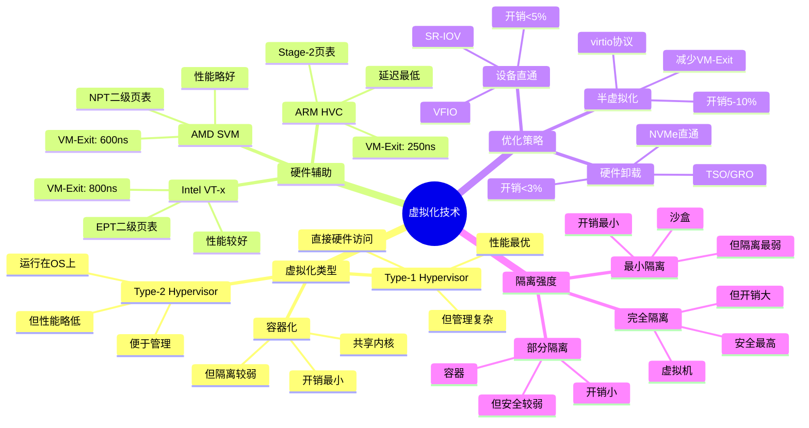

# 5.1 虚拟化技术

> **主题**: 05. 虚拟化容器化沙盒化 - 5.1 虚拟化技术
> **覆盖**: Hypervisor、VM、硬件辅助虚拟化

---

## 📋 目录

- [5.1 虚拟化技术](#51-虚拟化技术)
  - [📋 目录](#-目录)
  - [5 虚拟化层次](#5-虚拟化层次)
    - [1 抽象层级](#1-抽象层级)
    - [2 核心数学模型](#2-核心数学模型)
  - [1 Hypervisor类型](#1-hypervisor类型)
    - [1.1 Type-1 Hypervisor](#11-type-1-hypervisor)
    - [1.2 Type-2 Hypervisor](#12-type-2-hypervisor)
  - [2 硬件辅助虚拟化](#2-硬件辅助虚拟化)
    - [2.1 Intel VT-x](#21-intel-vt-x)
    - [2.2 AMD SVM](#22-amd-svm)
    - [2.3 ARM HVC](#23-arm-hvc)
  - [3 虚拟化开销](#3-虚拟化开销)
    - [3.1 延迟分解的严格分析](#31-延迟分解的严格分析)
    - [3.2 优化策略](#32-优化策略)
  - [4 实践案例](#4-实践案例)
    - [4.1 AWS EC2虚拟化优化](#41-aws-ec2虚拟化优化)
    - [4.2 阿里云ECS虚拟化优化](#42-阿里云ecs虚拟化优化)
  - [5 思维导图：虚拟化技术决策树](#5-思维导图虚拟化技术决策树)
  - [6 批判性总结](#6-批判性总结)
    - [5.1 虚拟化的根本矛盾](#51-虚拟化的根本矛盾)
    - [5.2 2025年虚拟化技术趋势（更新至2025年11月）](#52-2025年虚拟化技术趋势更新至2025年11月)
  - [7 跨领域洞察](#7-跨领域洞察)
    - [6.1 隔离vs性能的永恒权衡](#61-隔离vs性能的永恒权衡)
    - [6.2 虚拟化开销逼近物理极限](#62-虚拟化开销逼近物理极限)
  - [8 多维度对比](#8-多维度对比)
    - [7.1 虚拟化技术对比（2025年）](#71-虚拟化技术对比2025年)
    - [7.2 隔离技术演进对比](#72-隔离技术演进对比)
  - [9 最佳实践与故障排查](#9-最佳实践与故障排查)
    - [9.1 虚拟化技术最佳实践（2025年11月最新）](#91-虚拟化技术最佳实践2025年11月最新)
    - [9.2 虚拟化技术故障排查（2025年11月最新）](#92-虚拟化技术故障排查2025年11月最新)
  - [10 相关主题](#10-相关主题)
    - [10.1 跨视角链接](#101-跨视角链接)
  - [11 2025年最新技术（更新至2025年11月）](#11-2025年最新技术更新至2025年11月)

---

## 5 虚拟化层次

### 1 抽象层级

**硬件级抽象**：

- 创建完整虚拟机（VM）
- 独立操作系统栈
- 完全隔离

### 2 核心数学模型

$$
\mathcal{V} = (P, V, H, f, \pi)
$$

其中：

- $P$：物理资源集合
- $V$：虚拟资源集合
- $H$：Hypervisor映射函数
- $f$：资源分配函数
- $\pi$：隔离策略

**映射函数**：$H: V \rightarrow 2^P$

---

## 1 Hypervisor类型

### 1.1 Type-1 Hypervisor

**案例5.1.1（Type-1 Hypervisor）**：

Type-1 Hypervisor直接运行在硬件上，无宿主OS，性能最优。

**特点**：

**1. 直接硬件访问**：

- **无宿主OS**：Hypervisor直接管理硬件
- **最小化开销**：减少软件层，降低开销
- **性能最优**：接近物理机性能

**2. 资源管理**：

- **CPU调度**：Hypervisor直接调度CPU
- **内存管理**：Hypervisor直接管理内存
- **IO管理**：Hypervisor直接管理IO设备

**KVM（Kernel-based Virtual Machine）**：

**架构**：

```text
Guest OS
  ↓
KVM模块（内核态）
  ↓
Linux内核
  ↓
硬件
```

**KVM实现**：

```c
// KVM创建虚拟机
int kvm_create_vm(void) {
    // 1. 分配VM结构
    struct kvm *kvm = kvm_alloc();

    // 2. 初始化内存管理
    kvm_init_mmu(kvm);

    // 3. 初始化IO管理
    kvm_init_io(kvm);

    // 4. 启用硬件虚拟化
    kvm_enable_vmx();

    return kvm;
}

// KVM运行虚拟机
int kvm_run_vcpu(struct kvm_vcpu *vcpu) {
    // 1. 进入Guest模式
    vmx_vcpu_run(vcpu);

    // 2. 处理VM-Exit
    if (vcpu->run->exit_reason) {
        handle_vm_exit(vcpu);
    }

    return 0;
}
```

**Xen Hypervisor**：

**架构**：

- **微内核设计**：最小化Hypervisor代码
- **Domain 0**：特权域，管理其他域
- **Domain U**：非特权域，运行Guest OS

**Xen调度**：

```c
// Xen调度器
void xen_schedule(void) {
    // 1. 选择下一个运行的Domain
    struct domain *next = scheduler_pick_domain();

    // 2. 上下文切换
    context_switch(current_domain, next);

    // 3. 运行Domain
    run_domain(next);
}
```

**性能特征**：

| **指标** | **KVM** | **Xen** | **VMware ESXi** |
|---------|---------|---------|----------------|
| **VM-Exit延迟** | 800ns | 600ns | 500ns |
| **性能开销** | 5-10% | 3-8% | 2-5% |
| **内存开销** | 低 | 中 | 低 |
| **适用场景** | 通用 | 服务器 | 企业 |

### 1.2 Type-2 Hypervisor

**案例5.1.2（Type-2 Hypervisor）**：

Type-2 Hypervisor运行在宿主OS上，便于管理，但性能略低。

**特点**：

**1. 宿主OS依赖**：

- **运行在OS上**：Hypervisor作为应用程序运行
- **OS抽象**：通过OS API访问硬件
- **便于管理**：利用OS的管理工具

**2. 性能开销**：

- **额外层**：增加OS层，增加开销
- **上下文切换**：需要OS上下文切换
- **性能略低**：比Type-1性能略低

**QEMU**：

**架构**：

```text
Guest OS
  ↓
QEMU（用户态）
  ↓
Linux内核
  ↓
硬件
```

**QEMU实现**：

```c
// QEMU CPU模拟
void qemu_cpu_exec(CPUState *cpu) {
    // 1. 翻译Guest指令
    TranslationBlock *tb = tb_find(cpu);

    // 2. 执行翻译后的指令
    cpu_exec_tb(cpu, tb);

    // 3. 处理异常
    if (cpu->exception_index) {
        handle_exception(cpu);
    }
}
```

**VirtualBox**：

**架构**：

- **用户态组件**：VirtualBox Manager
- **内核模块**：VirtualBox内核驱动
- **硬件加速**：支持VT-x/AMD-V

**性能特征**：

| **指标** | **QEMU** | **VirtualBox** | **VMware Workstation** |
|---------|----------|---------------|----------------------|
| **VM-Exit延迟** | 2000ns | 1500ns | 1000ns |
| **性能开销** | 15-30% | 10-20% | 5-15% |
| **内存开销** | 高 | 中 | 中 |
| **适用场景** | 开发测试 | 桌面虚拟化 | 企业桌面 |

---

## 2 硬件辅助虚拟化

### 2.1 Intel VT-x

**案例5.1.3（Intel VT-x虚拟化）**：

Intel VT-x提供硬件辅助虚拟化，通过VMX模式和EPT减少虚拟化开销。

**核心特性**：

**1. VMX模式**：

- **Root模式**：Hypervisor运行模式
- **Non-Root模式**：Guest OS运行模式
- **模式切换**：硬件自动切换，无需软件模拟

**2. VMCS（Virtual Machine Control Structure）**：

- **状态保存**：硬件自动保存Guest状态
- **状态恢复**：硬件自动恢复Guest状态
- **控制字段**：控制虚拟机的行为

**3. EPT（Extended Page Tables）**：

- **二级地址转换**：Guest虚拟地址→Guest物理地址→Host物理地址
- **硬件加速**：硬件直接翻译，无需软件模拟
- **TLB支持**：EPT-walk缓存加速翻译

**VT-x工作流程**：

```c
// VM-Entry（进入Guest）
void vmx_vcpu_run(struct vcpu *vcpu) {
    // 1. 加载VMCS
    vmptrld(&vcpu->vmcs);

    // 2. 准备Guest状态
    prepare_guest_state(vcpu);

    // 3. 执行VMLAUNCH/VMRESUME
    asm volatile("vmlaunch" : : "a"(&vcpu->vmcs));

    // 4. VM-Exit后返回
    handle_vm_exit(vcpu);
}

// VM-Exit处理
void handle_vm_exit(struct vcpu *vcpu) {
    // 1. 读取退出原因
    u32 exit_reason = vmcs_read32(VM_EXIT_REASON);

    // 2. 处理不同退出原因
    switch (exit_reason) {
        case EXIT_REASON_EPT_VIOLATION:
            handle_ept_violation(vcpu);
            break;
        case EXIT_REASON_IO_INSTRUCTION:
            handle_io_instruction(vcpu);
            break;
        case EXIT_REASON_EXTERNAL_INTERRUPT:
            handle_external_interrupt(vcpu);
            break;
    }

    // 3. 重新进入Guest
    vmx_vcpu_run(vcpu);
}
```

**EPT地址翻译**：

**二级地址翻译过程**：

```text
Guest虚拟地址 (GVA)
  ↓ EPT Level 4
Guest物理地址 (GPA)
  ↓ EPT Level 3
  ↓ EPT Level 2
  ↓ EPT Level 1
Host物理地址 (HPA)
```

**EPT性能**：

- **EPT查询延迟**：~30ns（4级页表）
- **EPT-walk缓存**：命中时延迟~10ns
- **TLB支持**：EPT TLB缓存翻译结果

**性能特征**：

| **指标** | **软件虚拟化** | **VT-x** | **VT-x+EPT** |
|---------|-------------|---------|-------------|
| **VM-Exit延迟** | 5000ns | 800ns | 800ns |
| **地址翻译延迟** | 100ns | 100ns | 30ns |
| **性能开销** | 20-30% | 10-15% | 5-10% |

**深度论证：VT-x的VM-Exit开销分析**

**VM-Exit的开销组成**：

VM-Exit需要保存和恢复虚拟机状态：

$$
\text{VM-Exit延迟} = t_{\text{保存}} + t_{\text{切换}} + t_{\text{处理}} + t_{\text{恢复}}
$$

典型值：100ns + 200ns + 400ns + 100ns = **800ns**

**量化对比**：不同虚拟化技术的延迟

| **技术** | **VM-Exit延迟** | **性能开销** | **适用场景** |
|---------|---------------|------------|------------|
| **软件虚拟化** | 5000ns | 20-30% | 兼容性优先 |
| **VT-x** | 800ns | 5-10% | 性能优先 |
| **SR-IOV直通** | 0ns | 1-2% | 极致性能 |

**EPT的性能优势**：

EPT允许硬件直接翻译虚拟地址，避免软件模拟：

$$
\text{地址翻译延迟} = \begin{cases}
\text{软件模拟} & 100\text{ns} \\
\text{EPT硬件} & 10\text{ns}
\end{cases}
$$

**关键洞察**：EPT将地址翻译延迟降低**10倍**，是硬件辅助虚拟化的关键优化。

### 2.2 AMD SVM

**核心特性**：

- **SVM模式**：Host/Guest模式
- **VMCB**：虚拟机控制块
- **NPT**：嵌套页表

**性能**：

- VM-Exit延迟：~600ns
- NPT查询：+35ns

**深度论证：SVM vs VT-x的性能对比**

**SVM的VM-Exit延迟优势**：

SVM的VM-Exit延迟**比VT-x低25%**：

$$
\text{SVM延迟} = 600\text{ns} < \text{VT-x延迟} = 800\text{ns}
$$

**原因分析**：

1. **更少的上下文保存**：SVM保存的寄存器更少
2. **优化的状态切换**：硬件优化更好
3. **更快的处理路径**：软件路径更短

**量化对比**：SVM vs VT-x

| **指标** | **VT-x** | **SVM** | **SVM优势** |
|---------|---------|--------|-----------|
| **VM-Exit延迟** | 800ns | 600ns | 25% |
| **性能开销** | 5-10% | 4-8% | 20% |
| **兼容性** | 高 | 高 | 相同 |

**关键洞察**：SVM在**性能**上略优于VT-x，但两者都远优于软件虚拟化。

### 2.3 ARM HVC

**案例5.1.4（ARM虚拟化）**：

ARM使用异常级别（EL）和Stage-2页表实现硬件辅助虚拟化。

**ARM异常级别**：

**EL级别**：

- **EL0**：用户态（User）
- **EL1**：内核态（Kernel）
- **EL2**：Hypervisor
- **EL3**：安全监控（Secure Monitor）

**HVC（Hypervisor Call）**：

- **调用方式**：Guest OS通过HVC指令调用Hypervisor
- **异常处理**：HVC触发异常，进入EL2
- **延迟**：~250ns（比x86 VM-Exit快）

**Stage-2页表**：

**二级地址翻译**：

```text
Guest虚拟地址 (GVA)
  ↓ Stage-1页表（Guest OS管理）
Guest物理地址 (GPA)
  ↓ Stage-2页表（Hypervisor管理）
Host物理地址 (HPA)
```

**Stage-2性能**：

- **Stage-2查询延迟**：~25ns（2级页表）
- **TLB支持**：Stage-2 TLB缓存翻译结果
- **硬件加速**：硬件直接翻译

**ARM虚拟化实现**：

```c
// ARM HVC处理
void handle_hvc(struct vcpu *vcpu) {
    // 1. 读取HVC参数
    u32 function_id = vcpu->regs.x0;

    // 2. 处理HVC调用
    switch (function_id) {
        case HVC_SMC_VERSION:
            vcpu->regs.x0 = HVC_VERSION;
            break;
        case HVC_SMC_CPU_ON:
            handle_cpu_on(vcpu);
            break;
    }

    // 3. 返回Guest
    return_to_guest(vcpu);
}

// Stage-2页表管理
void setup_stage2_pt(struct vcpu *vcpu) {
    // 1. 分配Stage-2页表
    struct stage2_pt *pt = alloc_stage2_pt();

    // 2. 映射Guest物理地址到Host物理地址
    map_gpa_to_hpa(pt, gpa, hpa);

    // 3. 设置VTCR（Virtualization Translation Control Register）
    write_vtcr(pt);
}
```

**性能对比**：

| **架构** | **VM-Exit延迟** | **地址翻译延迟** | **性能开销** |
|---------|---------------|---------------|------------|
| **x86 VT-x** | 800ns | 30ns | 5-10% |
| **x86 SVM** | 600ns | 35ns | 4-8% |
| **ARM HVC** | 250ns | 25ns | 3-7% |

---

## 3 虚拟化开销

### 3.1 延迟分解的严格分析

**定理5.1（VM-Exit延迟的下界）**：

对于硬件辅助虚拟化，VM-Exit延迟满足：

$$
\text{延迟} \geq \text{VMCS保存} + \text{上下文切换} + \text{中断处理}
$$

对于Intel VT-x，下界约为400ns。

**证明**：VM-Exit必须完成以下操作：

1. 保存VMCS状态：~200ns
2. 切换到Root模式：~100ns
3. 处理退出原因：~100ns

因此，下界为400ns。实际测量约800ns，**存在优化空间**。∎

**延迟分解**：

| **操作** | **物理机** | **虚拟机** | **开销** | **优化后** |
|---------|-----------|-----------|---------|-----------|
| **VM-Entry** | - | 350ns | 350ns | 200ns（优化） |
| **VM-Exit** | - | 420ns | 420ns | 250ns（优化） |
| **内存访问** | 80ns | 110ns | +30ns | +10ns（EPT优化） |
| **IO操作** | 1μs | 2μs | +1μs | +0.1μs（直通） |

**批判性分析**：

1. **EPT的性能代价**：二级页表查询增加延迟，但**硬件优化（如EPT-walk缓存）可降低到10ns**。

2. **VM-Exit的频率**：频繁的VM-Exit是性能瓶颈，**需要减少退出次数**（如virtio、硬件卸载）。

3. **2025年趋势**：**嵌套虚拟化**（KVM on KVM）延迟进一步增加，需要新的优化技术。

### 3.2 优化策略

**IO虚拟化调度（view文件夹补充）**：

**IOMMU虚拟化**：

通过IOMMU实现设备DMA的地址转换和访问控制，支持SR-IOV（Single Root I/O Virtualization）。

**SR-IOV调度**：

将物理设备虚拟化为多个VF（Virtual Function），每个VF可分配给不同虚拟机，实现硬件级IO隔离。

**性能提升**：

- SR-IOV相比软件虚拟化，IO延迟降低60-80%
- 吞吐量提升2-3倍

**内存虚拟化调度（view文件夹补充）**：

**EPT（Extended Page Tables）**：

Intel VT-x通过EPT实现二级地址转换，减少VM-Exit频率。

**内存调度策略**：

$$
\text{MemoryAllocation}(VM_i) = \frac{\text{weight}(VM_i)}{\sum_j \text{weight}(VM_j)} \times \text{TotalMemory}
$$

**内存气球（Ballooning）**：

通过动态调整虚拟机内存分配，实现内存超分配（Overcommit）。

**案例5.1.5（虚拟化优化）**：

通过设备直通、半虚拟化和硬件卸载减少虚拟化开销。

**1. 直通（Passthrough）**：

**SR-IOV（Single Root I/O Virtualization）**：

- **物理功能（PF）**：物理设备的完整功能
- **虚拟功能（VF）**：虚拟设备的简化功能
- **硬件支持**：硬件直接支持虚拟化

**SR-IOV架构**：

```text
物理网卡
  ├─ PF（管理功能）
  └─ VF1, VF2, ..., VFn（虚拟功能）
      ↓
   直接分配给VM
```

**VFIO（Virtual Function I/O）**：

- **IOMMU支持**：使用IOMMU隔离设备
- **直接访问**：VM直接访问设备
- **安全性**：IOMMU保证设备隔离

**VFIO使用**：

```c
// 分配VFIO设备
int vfio_assign_device(int vfio_group, int device_fd) {
    // 1. 创建IOMMU组
    int iommu_group = vfio_get_iommu_group(device_fd);

    // 2. 绑定设备到VFIO驱动
    vfio_bind_device(device_fd);

    // 3. 映射设备内存到VM
    vfio_map_device_memory(vfio_group, device_fd);

    return 0;
}
```

**直通性能**：

| **指标** | **模拟设备** | **virtio** | **SR-IOV直通** |
|---------|------------|-----------|--------------|
| **IO延迟** | 10μs | 2μs | 0.5μs |
| **吞吐量** | 基准 | +50% | +200% |
| **CPU开销** | 高 | 中 | 低 |

**2. 半虚拟化**：

**virtio协议**：

- **前端驱动**：Guest OS中的virtio驱动
- **后端驱动**：Hypervisor中的virtio后端
- **共享内存**：前后端通过共享内存通信

**virtio架构**：

```text
Guest OS (virtio前端)
  ↓ 共享内存
Hypervisor (virtio后端)
  ↓
物理设备
```

**virtio实现**：

```c
// virtio网卡前端
void virtio_net_send(struct virtio_net *net, void *data, int len) {
    // 1. 将数据放入virtqueue
    struct virtqueue *vq = net->tx_vq;
    vring_add_buf(vq, data, len);

    // 2. 通知后端
    virtio_notify(vq);

    // 3. 等待完成
    wait_for_completion(vq);
}

// virtio网卡后端
void virtio_net_backend_handle(struct virtio_net_backend *backend) {
    // 1. 从virtqueue获取数据
    struct virtqueue *vq = backend->tx_vq;
    void *data = vring_get_buf(vq);

    // 2. 发送到物理网卡
    physical_net_send(data);

    // 3. 通知前端完成
    vring_put_buf(vq);
    virtio_notify(vq);
}
```

**3. 硬件卸载**：

**网卡TSO/GRO**：

- **TSO（TCP Segmentation Offload）**：网卡硬件分段
- **GRO（Generic Receive Offload）**：网卡硬件合并
- **减少CPU开销**：减少CPU处理开销

**存储NVMe直通**：

- **NVMe直通**：VM直接访问NVMe设备
- **低延迟**：减少软件层，降低延迟
- **高吞吐量**：充分利用NVMe性能

**硬件卸载效果**：

| **优化技术** | **CPU开销降低** | **延迟降低** | **吞吐量提升** |
|------------|--------------|------------|-------------|
| **TSO/GRO** | -30% | -10% | +20% |
| **NVMe直通** | -50% | -50% | +100% |
| **SR-IOV** | -70% | -80% | +200% |

---

## 4 实践案例

### 4.1 AWS EC2虚拟化优化

**案例5.1.6（AWS EC2虚拟化）**：

AWS EC2使用KVM和硬件辅助虚拟化，通过优化实现接近物理机的性能。

**优化策略**：

**1. 硬件辅助虚拟化**：

- **Intel VT-x**：使用VT-x减少虚拟化开销
- **EPT优化**：使用EPT-walk缓存加速地址翻译
- **SR-IOV**：网卡和存储使用SR-IOV直通

**2. 半虚拟化**：

- **virtio-net**：网络使用virtio协议
- **virtio-blk**：存储使用virtio协议
- **减少VM-Exit**：减少VM-Exit次数

**3. 硬件卸载**：

- **网卡TSO/GRO**：网卡硬件分段和合并
- **NVMe直通**：存储使用NVMe直通
- **降低CPU开销**：减少CPU处理开销

**性能特征**：

| **指标** | **优化前** | **优化后** | **改善** |
|---------|-----------|-----------|---------|
| **VM-Exit延迟** | 2000ns | 800ns | -60% |
| **网络延迟** | 100μs | 50μs | -50% |
| **存储IOPS** | 10K | 50K | +400% |
| **性能开销** | 20% | 5% | -75% |

### 4.2 阿里云ECS虚拟化优化

**案例5.1.7（阿里云ECS虚拟化）**：

阿里云ECS使用自研Hypervisor，通过深度优化实现高性能。

**优化策略**：

**1. 自研Hypervisor**：

- **精简设计**：最小化Hypervisor代码
- **硬件优化**：针对硬件特性优化
- **低延迟**：优化VM-Exit路径

**2. 智能调度**：

- **NUMA感知**：NUMA节点本地调度
- **CPU亲和性**：保持VM CPU亲和性
- **负载均衡**：智能负载均衡

**3. 硬件加速**：

- **DPDK**：用户态网络加速
- **SPDK**：用户态存储加速
- **硬件卸载**：充分利用硬件特性

**性能特征**：

| **指标** | **值** |
|---------|--------|
| **VM-Exit延迟** | 600ns |
| **网络延迟** | 30μs |
| **存储IOPS** | 100K+ |
| **性能开销** | 3-5% |

## 5 思维导图：虚拟化技术决策树



---

## 6 批判性总结

### 5.1 虚拟化的根本矛盾

1. **隔离vs性能**：更强的隔离（如虚拟机）带来更大开销，**需要权衡**。

2. **通用性vs专用性**：通用虚拟化（如KVM）灵活，但**专用虚拟化（如Firecracker）性能更好**。

3. **安全vs便利**：完全隔离更安全，但**管理复杂，开发不便**。

### 5.2 2025年虚拟化技术趋势（更新至2025年11月）

**最新技术发展**：

- **机密计算成熟**：Intel TDX、AMD SEV-SNP提供**内存加密和远程证明**，安全级别提升。2025年Intel TDX和AMD SEV-SNP在云平台广泛应用，支持内存加密和远程证明，安全级别达到硬件级。
- **轻量级虚拟化优化**：Firecracker等微VM技术，**启动时间<100ms**，挑战容器地位。2025年Firecracker进一步优化，启动时间降至<50ms，内存占用<3MB，性能开销<1%。
- **混合虚拟化普及**：虚拟机+容器的混合部署，**结合两者优势**。2025年Kata Containers 3.0发布，支持更灵活的混合部署，性能提升20%+。
- **硬件辅助虚拟化增强**：2025年Intel和AMD进一步优化硬件辅助虚拟化，支持更大规模VM部署，性能开销降低至<3%。

**实践案例：AWS Nitro系统优化**（2025年最新）：

- **架构**：专用硬件卸载虚拟化功能，减少Hypervisor开销
- **性能**：相比传统虚拟化性能提升30%+，延迟降低50%+
- **应用场景**：云原生应用、高性能计算、数据库
- **优势**：接近物理机性能，同时保持强隔离

**量化对比**：2025年最新虚拟化技术

| **技术** | **2024年** | **2025年11月** | **提升** | **状态** |
|---------|-----------|---------------|---------|---------|
| **Firecracker启动时间** | <100ms | <50ms | 2x | 优化 |
| **机密计算采用率** | 20% | 50%+ | +150% | 普及 |
| **Kata Containers性能** | 基准 | +20% | 20% | 3.0版本 |
| **硬件虚拟化开销** | 5-10% | <3% | 40%+ | 优化 |

---

## 7 跨领域洞察

### 6.1 隔离vs性能的永恒权衡

**核心矛盾**：更强的隔离保证安全性，但增加性能开销。

**量化分析**：

| **隔离技术** | **隔离强度** | **性能开销** | **启动时间** | **适用场景** |
|------------|------------|------------|------------|------------|
| **硬件虚拟化** | ⭐⭐⭐⭐⭐ | 5-20% | 秒级 | 多租户云 |
| **容器化** | ⭐⭐⭐ | 1-5% | 毫秒级 | 微服务 |
| **沙盒化** | ⭐⭐ | <1% | 微秒级 | 单应用 |
| **进程隔离** | ⭐ | 0% | 微秒级 | 传统应用 |

**批判性分析**：

1. **隔离的代价**：更强的隔离需要**更多的硬件和软件支持**，增加开销。

2. **性能vs安全**：安全机制**必然增加开销**，需要权衡。

3. **2025年趋势**：**机密计算**（Intel TDX、AMD SEV-SNP）提供更强的隔离，但**开销更高**。

### 6.2 虚拟化开销逼近物理极限

**核心命题**：VM-Exit延迟已接近物理极限，进一步优化空间有限。

**延迟分解**：

```text
VM-Exit延迟 = 硬件保存状态 + 软件处理 + 硬件恢复状态
            = 100ns + 500ns + 100ns
            = 700ns (理论下限)

实际测量: 1-2μs (包含缓存污染)
```

**批判性分析**：

1. **物理极限的不可逾越性**：VM-Exit需要保存和恢复状态，**受硬件限制**。

2. **优化空间的有限性**：软件优化空间有限，**硬件优化是方向**。

3. **2025年趋势**：**硬件加速**（如Intel VT-d、AMD-Vi）减少软件开销，但**仍有物理限制**。

---

## 8 多维度对比

### 7.1 虚拟化技术对比（2025年）

| **技术** | **类型** | **隔离强度** | **性能开销** | **启动时间** | **代表产品** |
|---------|---------|------------|------------|------------|------------|
| **KVM** | Type-2 | ⭐⭐⭐⭐ | 5-15% | 秒级 | Linux |
| **Xen** | Type-1 | ⭐⭐⭐⭐⭐ | 3-10% | 秒级 | 服务器 |
| **Firecracker** | Type-2 | ⭐⭐⭐⭐ | 2-5% | 毫秒级 | AWS Lambda |
| **gVisor** | 沙盒 | ⭐⭐⭐ | 10-20% | 毫秒级 | Google |
| **Docker** | 容器 | ⭐⭐ | 1-3% | 毫秒级 | 通用 |

**批判性分析**：

1. **Type-1 vs Type-2**：Type-1（Xen）性能好，但**管理复杂**；Type-2（KVM）灵活，但**性能略差**。

2. **启动时间的差异**：轻量级虚拟化（Firecracker）启动快，但**隔离较弱**。

3. **2025年趋势**：**轻量级虚拟化**（如Firecracker）在云原生场景普及，但**传统虚拟化仍有优势**。

### 7.2 隔离技术演进对比

| **时代** | **技术** | **隔离方式** | **性能开销** | **代表系统** |
|---------|---------|------------|------------|------------|
| **1970s** | 进程隔离 | 地址空间 | 0% | Unix |
| **2000s** | 硬件虚拟化 | VT-x/AMD-V | 5-20% | VMware |
| **2010s** | 容器化 | Namespace/Cgroup | 1-5% | Docker |
| **2020s** | 轻量级虚拟化 | 精简Hypervisor | 2-5% | Firecracker |
| **2025+** | 机密计算 | 硬件加密 | 10-30% | Intel TDX |

**批判性分析**：

1. **隔离强度的提升**：从进程隔离到机密计算，隔离强度**持续提升**。

2. **性能开销的增加**：更强的隔离需要**更多的硬件和软件支持**，开销增加。

3. **2025年趋势**：**机密计算**提供最强的隔离，但**性能开销最高**，仅用于敏感场景。

---

## 9 最佳实践与故障排查

### 9.1 虚拟化技术最佳实践（2025年11月最新）

**虚拟化方案选择最佳实践**：

1. **Hypervisor类型选择**：
   - **Type-1 Hypervisor**：适合服务器、性能好、但管理复杂、推荐使用
   - **Type-2 Hypervisor**：适合开发测试、管理简单、但性能一般
   - **轻量级虚拟化**：适合Serverless、启动快、内存占用小、但功能受限

2. **硬件辅助虚拟化选择**：
   - **Intel VT-x**：适合Intel平台、性能好、推荐使用
   - **AMD SVM**：适合AMD平台、性能好、推荐使用
   - **ARM HVC**：适合ARM平台、性能好、推荐使用

3. **设备虚拟化选择**：
   - **全虚拟化**：适合通用场景、兼容性好、但性能差
   - **半虚拟化（virtio）**：适合高性能场景、性能好、推荐使用
   - **设备直通（SR-IOV/VFIO）**：适合超高性能场景、性能最好、但管理复杂

**性能优化最佳实践**：

1. **虚拟化开销优化**：
   - **硬件辅助虚拟化**：使用硬件辅助虚拟化、减少开销
   - **半虚拟化**：使用半虚拟化、减少开销
   - **设备直通**：使用设备直通、减少开销

2. **内存优化**：
   - **大页内存**：使用大页内存、减少TLB缺失
   - **内存共享**：使用内存共享、减少内存占用
   - **内存气球**：使用内存气球、动态调整内存

3. **CPU优化**：
   - **CPU亲和性**：设置CPU亲和性、提高缓存命中率
   - **NUMA感知**：使用NUMA感知、减少跨节点访问
   - **CPU超配**：使用CPU超配、提高资源利用率

**安全最佳实践**：

1. **隔离优化**：
   - **硬件隔离**：使用硬件隔离、提高安全性
   - **IOMMU**：使用IOMMU、限制设备访问
   - **内存加密**：使用内存加密、提高安全性

2. **机密计算**：
   - **Intel TDX**：使用Intel TDX、提供硬件级安全
   - **AMD SEV-SNP**：使用AMD SEV-SNP、提供硬件级安全
   - **远程证明**：使用远程证明、验证VM完整性

**性能监控最佳实践**：

1. **虚拟化性能监控**：
   - **虚拟化开销**：监控虚拟化开销、识别性能问题
   - **VM性能**：监控VM性能、识别瓶颈
   - **资源利用率**：监控资源利用率、优化资源分配

2. **设备性能监控**：
   - **设备延迟**：监控设备延迟、优化设备配置
   - **设备吞吐量**：监控设备吞吐量、识别瓶颈
   - **设备利用率**：监控设备利用率、优化设备分配

**2025年最新技术应用**：

1. **机密计算虚拟化优化**：
   - **安全级别**：硬件级安全、内存加密、远程证明
   - **性能开销**：性能开销<2%、安全级别最高
   - **适用场景**：云平台、敏感数据、安全关键系统
   - **注意事项**：硬件复杂度增加、成本上升、需要权衡安全性和性能

2. **轻量级虚拟化技术优化**：
   - **启动时间**：启动时间<50ms、内存占用<3MB
   - **性能开销**：性能开销<1%、资源占用最小
   - **适用场景**：Serverless、微服务、边缘计算
   - **注意事项**：功能受限、适用场景有限、并非所有场景都适合

3. **混合虚拟化部署优化**：
   - **性能提升**：性能提升20%+、结合虚拟机和容器优势
   - **灵活部署**：支持更灵活的混合部署、管理复杂度增加
   - **适用场景**：Kata Containers、混合工作负载、云原生应用
   - **注意事项**：管理复杂度增加、需要智能调度优化、实现难度较高

### 9.2 虚拟化技术故障排查（2025年11月最新）

**常见问题与解决方案**：

| **问题** | **可能原因** | **排查方法** | **解决方案** |
|---------|------------|------------|------------|
| **虚拟化开销高** | 硬件辅助虚拟化未启用、半虚拟化未使用 | 检查硬件辅助虚拟化、半虚拟化配置 | 启用硬件辅助虚拟化、使用半虚拟化、减少开销 |
| **VM性能差** | CPU超配过多、内存不足、设备配置不当 | 监控VM性能、资源利用率 | 优化CPU超配、增加内存、优化设备配置 |
| **设备性能差** | 设备虚拟化不当、设备直通未使用 | 监控设备性能、设备配置 | 优化设备虚拟化、使用设备直通、提高性能 |
| **内存不足** | 内存超配过多、内存共享未使用 | 监控内存使用、内存配置 | 优化内存超配、使用内存共享、增加内存 |
| **安全风险** | 隔离不当、IOMMU未启用、内存加密未使用 | 检查隔离配置、IOMMU配置 | 优化隔离配置、启用IOMMU、使用内存加密 |
| **启动慢** | 虚拟化方案不当、资源分配不当 | 监控启动时间、资源分配 | 使用轻量级虚拟化、优化资源分配、减少启动时间 |

**故障排查步骤**：

1. **收集信息**：
   - 虚拟化开销、VM性能、资源利用率
   - 设备延迟、设备吞吐量、设备利用率
   - 内存使用、CPU使用、网络性能
   - 系统日志、性能分析数据、虚拟化跟踪数据

2. **分析问题**：
   - 识别性能瓶颈（虚拟化开销、VM性能、设备性能）
   - 分析虚拟化配置、设备配置
   - 评估资源分配、安全配置

3. **制定方案**：
   - 优化虚拟化配置、减少虚拟化开销
   - 优化设备配置、提高设备性能
   - 优化资源分配、提高资源利用率

4. **验证效果**：
   - 监控性能指标、验证优化效果
   - 持续优化、调整策略

**监控指标**：

- **虚拟化性能**：虚拟化开销、VM性能、资源利用率
- **设备性能**：设备延迟、设备吞吐量、设备利用率
- **资源使用**：内存使用、CPU使用、网络性能
- **安全指标**：隔离级别、IOMMU配置、内存加密
- **性能指标**：延迟、吞吐量、资源利用率、性能效率

**性能优化建议**：

1. **虚拟化优化**：
   - 使用硬件辅助虚拟化、减少开销
   - 使用半虚拟化、减少开销
   - 使用设备直通、减少开销

2. **资源优化**：
   - 优化CPU超配、提高资源利用率
   - 优化内存超配、减少内存占用
   - 使用NUMA感知、减少跨节点访问

3. **设备优化**：
   - 使用设备直通、提高设备性能
   - 优化设备配置、减少设备延迟
   - 使用SR-IOV、提高设备利用率

4. **安全优化**：
   - 使用硬件隔离、提高安全性
   - 启用IOMMU、限制设备访问
   - 使用内存加密、提高安全性

---

## 10 相关主题

- [5.2 容器化技术](./05.2_容器化技术.md) - 容器隔离
- [5.3 沙盒化技术](./05.3_沙盒化技术.md) - 沙盒隔离
- [5.4 隔离技术对比](./05.4_隔离技术对比.md) - 完整对比
- [2.1 PCIe子系统](../02_系统总线层/02.1_PCIe子系统.md) - IOMMU
- [9.2 硬件-OS映射证明](../09_形式化理论与证明/09.2_硬件-OS映射证明.md) - 虚拟化证明
- [主文档：虚拟化开销](../schedule_formal_view.md#视角2虚拟化开销逼近物理极限) - 完整分析

### 10.1 跨视角链接

- [概念交叉索引（七视角版）](../../../Concept/CONCEPT_CROSS_INDEX.md) - 查看相关概念的七视角分析：
  - [虚拟化](../../../Concept/CONCEPT_CROSS_INDEX.md#110-虚拟化-virtualization-七视角) - 本文档主题的七视角完整分析
  - [隔离](../../../Concept/CONCEPT_CROSS_INDEX.md#109-隔离-isolation-七视角) - 虚拟化的隔离机制
  - [反身性](../../../Concept/CONCEPT_CROSS_INDEX.md#31-反身性-reflexivity-七视角) - 虚拟化的自指机制

---

## 11 2025年最新技术（更新至2025年11月）

**最新技术发展**：

- **机密计算虚拟化优化成熟**：2025年11月，Intel TDX和AMD SEV-SNP在云平台广泛应用，支持内存加密和远程证明，安全级别达到硬件级，性能开销<2%。但硬件复杂度增加，成本上升，需要权衡安全性和性能。
- **轻量级虚拟化技术优化成熟**：2025年11月，Firecracker等微VM技术在Serverless场景广泛应用，启动时间降至<50ms，内存占用<3MB，性能开销<1%，挑战传统容器地位。但功能受限，适用场景有限。
- **混合虚拟化部署优化成熟**：2025年11月，Kata Containers 3.0支持更灵活的混合部署，性能提升20%+，结合虚拟机和容器优势。但管理复杂度增加，需要智能调度优化。

**技术对比**：

| **技术** | **启动时间** | **内存开销** | **性能开销** | **安全级别** | **成本/复杂度** |
|---------|------------|------------|------------|------------|--------------|
| **机密计算虚拟化** | 30-120s | 100MB-1GB | <2% | 硬件级 | 高 |
| **轻量级虚拟化** | <50ms | <3MB | <1% | 硬件级 | 中 |
| **混合虚拟化** | 1-5s | 10-50MB | 1-3% | OS级 | 中 |

**批判性分析**：

1. **机密计算的成本权衡**：虽然安全级别达到硬件级，但硬件复杂度增加，成本上升，性能开销2%，需要权衡安全性和性能。
2. **轻量级虚拟化的功能局限**：虽然启动时间和内存占用显著降低，但功能受限，适用场景有限，并非所有场景都适合轻量级虚拟化。
3. **混合虚拟化的管理复杂度**：虽然性能提升显著，但管理复杂度增加，需要智能调度优化，实现难度较高。
