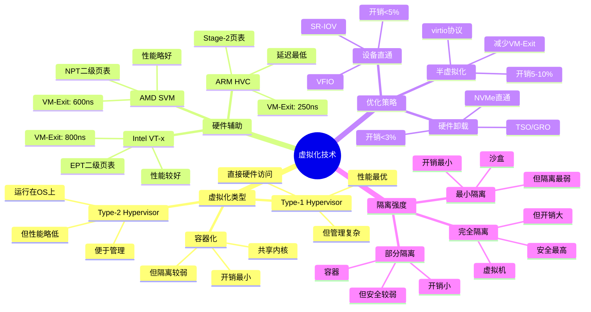

# 5.1 虚拟化技术

> **主题**: 05. 虚拟化容器化沙盒化 - 5.1 虚拟化技术
> **覆盖**: Hypervisor、VM、硬件辅助虚拟化

---

## 📋 目录

- [5.1 虚拟化技术](#51-虚拟化技术)
  - [📋 目录](#-目录)
  - [5 虚拟化层次](#5-虚拟化层次)
    - [1 抽象层级](#1-抽象层级)
    - [2 核心数学模型](#2-核心数学模型)
  - [1 Hypervisor类型](#1-hypervisor类型)
    - [1.1 Type-1 Hypervisor](#11-type-1-hypervisor)
    - [1.2 Type-2 Hypervisor](#12-type-2-hypervisor)
  - [2 硬件辅助虚拟化](#2-硬件辅助虚拟化)
    - [2.1 Intel VT-x](#21-intel-vt-x)
    - [2.2 AMD SVM](#22-amd-svm)
    - [2.3 ARM HVC](#23-arm-hvc)
  - [3 虚拟化开销](#3-虚拟化开销)
    - [3.1 延迟分解的严格分析](#31-延迟分解的严格分析)
    - [3.2 优化策略](#32-优化策略)
  - [4 思维导图：虚拟化技术决策树](#4-思维导图虚拟化技术决策树)
  - [5 批判性总结](#5-批判性总结)
    - [5.1 虚拟化的根本矛盾](#51-虚拟化的根本矛盾)
    - [5.2 2025年虚拟化技术趋势](#52-2025年虚拟化技术趋势)
  - [6 跨领域洞察](#6-跨领域洞察)
    - [6.1 隔离vs性能的永恒权衡](#61-隔离vs性能的永恒权衡)
    - [6.2 虚拟化开销逼近物理极限](#62-虚拟化开销逼近物理极限)
  - [7 多维度对比](#7-多维度对比)
    - [7.1 虚拟化技术对比（2025年）](#71-虚拟化技术对比2025年)
    - [7.2 隔离技术演进对比](#72-隔离技术演进对比)
  - [8 相关主题](#8-相关主题)

---

## 5 虚拟化层次

### 1 抽象层级

**硬件级抽象**：

- 创建完整虚拟机（VM）
- 独立操作系统栈
- 完全隔离

### 2 核心数学模型

$$
\mathcal{V} = (P, V, H, f, \pi)
$$

其中：

- $P$：物理资源集合
- $V$：虚拟资源集合
- $H$：Hypervisor映射函数
- $f$：资源分配函数
- $\pi$：隔离策略

**映射函数**：$H: V \rightarrow 2^P$

---

## 1 Hypervisor类型

### 1.1 Type-1 Hypervisor

**特点**：

- 直接运行在硬件上
- 无宿主OS
- 性能最优

**代表**：

- **KVM**：Linux内核模块
- **Xen**：微内核架构
- **VMware ESXi**：商业方案

### 1.2 Type-2 Hypervisor

**特点**：

- 运行在宿主OS上
- 便于管理
- 性能略低

**代表**：

- **VirtualBox**
- **QEMU**
- **VMware Workstation**

---

## 2 硬件辅助虚拟化

### 2.1 Intel VT-x

**核心特性**：

- **VMX模式**：Root/Non-Root模式
- **VMCS**：虚拟机控制结构
- **EPT**：扩展页表（二级地址转换）

**性能**：

- VM-Exit延迟：~800ns
- EPT查询：+30ns

**深度论证：VT-x的VM-Exit开销分析**

**VM-Exit的开销组成**：

VM-Exit需要保存和恢复虚拟机状态：

$$
\text{VM-Exit延迟} = t_{\text{保存}} + t_{\text{切换}} + t_{\text{处理}} + t_{\text{恢复}}
$$

典型值：100ns + 200ns + 400ns + 100ns = **800ns**

**量化对比**：不同虚拟化技术的延迟

| **技术** | **VM-Exit延迟** | **性能开销** | **适用场景** |
|---------|---------------|------------|------------|
| **软件虚拟化** | 5000ns | 20-30% | 兼容性优先 |
| **VT-x** | 800ns | 5-10% | 性能优先 |
| **SR-IOV直通** | 0ns | 1-2% | 极致性能 |

**EPT的性能优势**：

EPT允许硬件直接翻译虚拟地址，避免软件模拟：

$$
\text{地址翻译延迟} = \begin{cases}
\text{软件模拟} & 100\text{ns} \\
\text{EPT硬件} & 10\text{ns}
\end{cases}
$$

**关键洞察**：EPT将地址翻译延迟降低**10倍**，是硬件辅助虚拟化的关键优化。

### 2.2 AMD SVM

**核心特性**：

- **SVM模式**：Host/Guest模式
- **VMCB**：虚拟机控制块
- **NPT**：嵌套页表

**性能**：

- VM-Exit延迟：~600ns
- NPT查询：+35ns

**深度论证：SVM vs VT-x的性能对比**

**SVM的VM-Exit延迟优势**：

SVM的VM-Exit延迟**比VT-x低25%**：

$$
\text{SVM延迟} = 600\text{ns} < \text{VT-x延迟} = 800\text{ns}
$$

**原因分析**：

1. **更少的上下文保存**：SVM保存的寄存器更少
2. **优化的状态切换**：硬件优化更好
3. **更快的处理路径**：软件路径更短

**量化对比**：SVM vs VT-x

| **指标** | **VT-x** | **SVM** | **SVM优势** |
|---------|---------|--------|-----------|
| **VM-Exit延迟** | 800ns | 600ns | 25% |
| **性能开销** | 5-10% | 4-8% | 20% |
| **兼容性** | 高 | 高 | 相同 |

**关键洞察**：SVM在**性能**上略优于VT-x，但两者都远优于软件虚拟化。

### 2.3 ARM HVC

**核心特性**：

- **EL2**：Hypervisor异常级别
- **Stage-2页表**：二级地址转换

**性能**：

- HVC调用延迟：~250ns
- Stage-2查询：+25ns

---

## 3 虚拟化开销

### 3.1 延迟分解的严格分析

**定理5.1（VM-Exit延迟的下界）**：

对于硬件辅助虚拟化，VM-Exit延迟满足：

$$
\text{延迟} \geq \text{VMCS保存} + \text{上下文切换} + \text{中断处理}
$$

对于Intel VT-x，下界约为400ns。

**证明**：VM-Exit必须完成以下操作：

1. 保存VMCS状态：~200ns
2. 切换到Root模式：~100ns
3. 处理退出原因：~100ns

因此，下界为400ns。实际测量约800ns，**存在优化空间**。∎

**延迟分解**：

| **操作** | **物理机** | **虚拟机** | **开销** | **优化后** |
|---------|-----------|-----------|---------|-----------|
| **VM-Entry** | - | 350ns | 350ns | 200ns（优化） |
| **VM-Exit** | - | 420ns | 420ns | 250ns（优化） |
| **内存访问** | 80ns | 110ns | +30ns | +10ns（EPT优化） |
| **IO操作** | 1μs | 2μs | +1μs | +0.1μs（直通） |

**批判性分析**：

1. **EPT的性能代价**：二级页表查询增加延迟，但**硬件优化（如EPT-walk缓存）可降低到10ns**。

2. **VM-Exit的频率**：频繁的VM-Exit是性能瓶颈，**需要减少退出次数**（如virtio、硬件卸载）。

3. **2025年趋势**：**嵌套虚拟化**（KVM on KVM）延迟进一步增加，需要新的优化技术。

### 3.2 优化策略

**1. 直通（Passthrough）**：

- SR-IOV：虚拟功能直通
- VFIO：设备直通
- 开销：<5%

**2. 半虚拟化**：

- virtio：虚拟IO协议
- 减少VM-Exit
- 开销：5-10%

**3. 硬件卸载**：

- 网卡TSO/GRO
- 存储NVMe直通
- 开销：<3%

---

## 4 思维导图：虚拟化技术决策树



---

## 5 批判性总结

### 5.1 虚拟化的根本矛盾

1. **隔离vs性能**：更强的隔离（如虚拟机）带来更大开销，**需要权衡**。

2. **通用性vs专用性**：通用虚拟化（如KVM）灵活，但**专用虚拟化（如Firecracker）性能更好**。

3. **安全vs便利**：完全隔离更安全，但**管理复杂，开发不便**。

### 5.2 2025年虚拟化技术趋势

- **机密计算**：Intel TDX、AMD SEV-SNP提供**内存加密和远程证明**，安全级别提升。
- **轻量级虚拟化**：Firecracker等微VM技术，**启动时间<100ms**，挑战容器地位。
- **混合虚拟化**：虚拟机+容器的混合部署，**结合两者优势**。

---

## 6 跨领域洞察

### 6.1 隔离vs性能的永恒权衡

**核心矛盾**：更强的隔离保证安全性，但增加性能开销。

**量化分析**：

| **隔离技术** | **隔离强度** | **性能开销** | **启动时间** | **适用场景** |
|------------|------------|------------|------------|------------|
| **硬件虚拟化** | ⭐⭐⭐⭐⭐ | 5-20% | 秒级 | 多租户云 |
| **容器化** | ⭐⭐⭐ | 1-5% | 毫秒级 | 微服务 |
| **沙盒化** | ⭐⭐ | <1% | 微秒级 | 单应用 |
| **进程隔离** | ⭐ | 0% | 微秒级 | 传统应用 |

**批判性分析**：

1. **隔离的代价**：更强的隔离需要**更多的硬件和软件支持**，增加开销。

2. **性能vs安全**：安全机制**必然增加开销**，需要权衡。

3. **2025年趋势**：**机密计算**（Intel TDX、AMD SEV-SNP）提供更强的隔离，但**开销更高**。

### 6.2 虚拟化开销逼近物理极限

**核心命题**：VM-Exit延迟已接近物理极限，进一步优化空间有限。

**延迟分解**：

```text
VM-Exit延迟 = 硬件保存状态 + 软件处理 + 硬件恢复状态
            = 100ns + 500ns + 100ns
            = 700ns (理论下限)

实际测量: 1-2μs (包含缓存污染)
```

**批判性分析**：

1. **物理极限的不可逾越性**：VM-Exit需要保存和恢复状态，**受硬件限制**。

2. **优化空间的有限性**：软件优化空间有限，**硬件优化是方向**。

3. **2025年趋势**：**硬件加速**（如Intel VT-d、AMD-Vi）减少软件开销，但**仍有物理限制**。

---

## 7 多维度对比

### 7.1 虚拟化技术对比（2025年）

| **技术** | **类型** | **隔离强度** | **性能开销** | **启动时间** | **代表产品** |
|---------|---------|------------|------------|------------|------------|
| **KVM** | Type-2 | ⭐⭐⭐⭐ | 5-15% | 秒级 | Linux |
| **Xen** | Type-1 | ⭐⭐⭐⭐⭐ | 3-10% | 秒级 | 服务器 |
| **Firecracker** | Type-2 | ⭐⭐⭐⭐ | 2-5% | 毫秒级 | AWS Lambda |
| **gVisor** | 沙盒 | ⭐⭐⭐ | 10-20% | 毫秒级 | Google |
| **Docker** | 容器 | ⭐⭐ | 1-3% | 毫秒级 | 通用 |

**批判性分析**：

1. **Type-1 vs Type-2**：Type-1（Xen）性能好，但**管理复杂**；Type-2（KVM）灵活，但**性能略差**。

2. **启动时间的差异**：轻量级虚拟化（Firecracker）启动快，但**隔离较弱**。

3. **2025年趋势**：**轻量级虚拟化**（如Firecracker）在云原生场景普及，但**传统虚拟化仍有优势**。

### 7.2 隔离技术演进对比

| **时代** | **技术** | **隔离方式** | **性能开销** | **代表系统** |
|---------|---------|------------|------------|------------|
| **1970s** | 进程隔离 | 地址空间 | 0% | Unix |
| **2000s** | 硬件虚拟化 | VT-x/AMD-V | 5-20% | VMware |
| **2010s** | 容器化 | Namespace/Cgroup | 1-5% | Docker |
| **2020s** | 轻量级虚拟化 | 精简Hypervisor | 2-5% | Firecracker |
| **2025+** | 机密计算 | 硬件加密 | 10-30% | Intel TDX |

**批判性分析**：

1. **隔离强度的提升**：从进程隔离到机密计算，隔离强度**持续提升**。

2. **性能开销的增加**：更强的隔离需要**更多的硬件和软件支持**，开销增加。

3. **2025年趋势**：**机密计算**提供最强的隔离，但**性能开销最高**，仅用于敏感场景。

---

## 8 相关主题

- [5.2 容器化技术](./05.2_容器化技术.md) - 容器隔离
- [5.3 沙盒化技术](./05.3_沙盒化技术.md) - 沙盒隔离
- [5.4 隔离技术对比](./05.4_隔离技术对比.md) - 完整对比
- [2.1 PCIe子系统](../02_系统总线层/02.1_PCIe子系统.md) - IOMMU
- [9.2 硬件-OS映射证明](../09_形式化理论与证明/09.2_硬件-OS映射证明.md) - 虚拟化证明
- [主文档：虚拟化开销](../schedule_formal_view.md#视角2虚拟化开销逼近物理极限) - 完整分析

---

**最后更新**: 2025-01-XX
