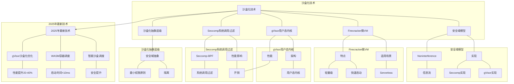

# 5.3 沙盒化技术

> **主题**: 05. 虚拟化容器化沙盒化 - 5.3 沙盒化技术
> **覆盖**: Seccomp、gVisor、Firecracker、安全域

---

## 📋 目录

- [5.3 沙盒化技术](#53-沙盒化技术)
  - [📋 目录](#-目录)
  - [1 沙盒化抽象层级](#1-沙盒化抽象层级)
    - [1.1 安全域抽象](#11-安全域抽象)
    - [1.2 核心数学模型](#12-核心数学模型)
  - [2 Seccomp系统调用过滤](#2-seccomp系统调用过滤)
    - [2.1 Seccomp-BPF](#21-seccomp-bpf)
    - [2.2 性能影响](#22-性能影响)
  - [3 gVisor用户态内核](#3-gvisor用户态内核)
    - [3.1 架构](#31-架构)
    - [2 性能](#2-性能)
  - [4 Firecracker微VM](#4-firecracker微vm)
    - [4.1 特点](#41-特点)
    - [4.2 适用场景](#42-适用场景)
  - [5 实践案例](#5-实践案例)
    - [5.1 AWS Lambda使用Firecracker](#51-aws-lambda使用firecracker)
    - [5.2 Google Cloud Run使用gVisor](#52-google-cloud-run使用gvisor)
  - [6 安全域模型](#6-安全域模型)
    - [6.1 Noninterference](#61-noninterference)
    - [6.2 实现](#62-实现)
  - [7 批判性总结](#7-批判性总结)
    - [7.1 沙盒化的局限性](#71-沙盒化的局限性)
    - [7.2 2025年沙盒化趋势（更新至2025年11月）](#72-2025年沙盒化趋势更新至2025年11月)
  - [8 跨领域洞察](#8-跨领域洞察)
    - [5.1 安全vs性能的永恒权衡](#51-安全vs性能的永恒权衡)
    - [5.2 攻击面的抽象泄漏](#52-攻击面的抽象泄漏)
  - [9 多维度对比](#9-多维度对比)
    - [6.1 沙盒化技术对比（2025年）](#61-沙盒化技术对比2025年)
    - [6.2 安全模型演进对比](#62-安全模型演进对比)
  - [10 思维导图](#10-思维导图)
  - [11 2025年最新技术（更新至2025年11月）](#11-2025年最新技术更新至2025年11月)
  - [12 相关主题](#12-相关主题)

---

## 1 沙盒化抽象层级

### 1.1 安全域抽象

**特点**：

- 最小权限原则
- 进程级隔离
- 系统调用过滤

**核心机制**：

- **Seccomp**：系统调用过滤
- **Capabilities**：能力模型
- **MAC**：强制访问控制

### 1.2 核心数学模型

**安全域四元组**：$\mathcal{S} = (D, R, P, \sigma)$

其中：

- $D$：域集合
- $R$：资源集合
- $P$：权限集合
- $\sigma$：安全策略函数

**理论基础**：

- Bell-LaPadula模型
- Noninterference理论

---

## 2 Seccomp系统调用过滤

### 2.1 Seccomp-BPF

**案例5.3.1（Seccomp系统调用过滤）**：

Seccomp（Secure Computing）通过BPF程序过滤系统调用，减少攻击面。

**功能**：

**1. 系统调用过滤**：

- **BPF程序**：在内核态执行BPF程序
- **允许/拒绝**：根据BPF程序结果允许或拒绝系统调用
- **跟踪**：记录系统调用用于审计

**2. Seccomp模式**：

- **SECCOMP_MODE_STRICT**：只允许read、write、exit、sigreturn
- **SECCOMP_MODE_FILTER**：使用BPF程序自定义过滤规则

**Seccomp-BPF实现**：

```c
// Seccomp数据结构
struct seccomp_data {
    int nr;                    // 系统调用号
    __u32 arch;                // 架构
    __u64 instruction_pointer; // 指令指针
    __u64 args[6];             // 系统调用参数
};

// Seccomp返回值
#define SECCOMP_RET_KILL   0x00000000U  // 立即终止进程
#define SECCOMP_RET_TRAP   0x00030000U  // 发送SIGSYS信号
#define SECCOMP_RET_ERRNO  0x00050000U  // 返回错误码
#define SECCOMP_RET_TRACE  0x7ff00000U  // 通知ptrace
#define SECCOMP_RET_ALLOW  0x7fff0000U  // 允许系统调用

// 创建Seccomp过滤器
int setup_seccomp_filter(void) {
    struct sock_fprog prog;
    struct sock_filter filter[] = {
        // 加载系统调用号
        BPF_STMT(BPF_LD | BPF_W | BPF_ABS, offsetof(struct seccomp_data, nr)),

        // 检查是否为read系统调用
        BPF_JUMP(BPF_JMP | BPF_JEQ | BPF_K, __NR_read, 0, 1),
        BPF_STMT(BPF_RET | BPF_K, SECCOMP_RET_ALLOW),

        // 检查是否为write系统调用
        BPF_JUMP(BPF_JMP | BPF_JEQ | BPF_K, __NR_write, 0, 1),
        BPF_STMT(BPF_RET | BPF_K, SECCOMP_RET_ALLOW),

        // 检查是否为exit系统调用
        BPF_JUMP(BPF_JMP | BPF_JEQ | BPF_K, __NR_exit, 0, 1),
        BPF_STMT(BPF_RET | BPF_K, SECCOMP_RET_ALLOW),

        // 检查是否为exit_group系统调用
        BPF_JUMP(BPF_JMP | BPF_JEQ | BPF_K, __NR_exit_group, 0, 1),
        BPF_STMT(BPF_RET | BPF_K, SECCOMP_RET_ALLOW),

        // 默认拒绝
        BPF_STMT(BPF_RET | BPF_K, SECCOMP_RET_KILL),
    };

    prog.len = sizeof(filter) / sizeof(filter[0]);
    prog.filter = filter;

    // 安装Seccomp过滤器
    return prctl(PR_SET_SECCOMP, SECCOMP_MODE_FILTER, &prog);
}

// 使用示例
int main(void) {
    // 设置Seccomp过滤器
    if (setup_seccomp_filter() < 0) {
        perror("seccomp");
        return 1;
    }

    // 只允许read/write/exit系统调用
    // 其他系统调用会被拒绝
    printf("Seccomp filter installed\n");

    return 0;
}
```

**Seccomp在内核中的处理**：

```c
// 内核Seccomp处理
long seccomp_do_user_notification(struct seccomp_filter *match,
                                   const struct seccomp_data *sd) {
    // 1. 检查BPF程序
    u32 ret = bpf_prog_run(match->prog, sd);

    // 2. 根据返回值处理
    switch (ret & SECCOMP_RET_ACTION) {
    case SECCOMP_RET_ALLOW:
        // 允许系统调用
        return 0;

    case SECCOMP_RET_KILL:
        // 终止进程
        do_exit(SIGSYS);
        break;

    case SECCOMP_RET_ERRNO:
        // 返回错误码
        return -(ret & SECCOMP_RET_DATA);

    case SECCOMP_RET_TRACE:
        // 通知ptrace
        ptrace_notify(PTRACE_EVENT_SECCOMP);
        break;
    }

    return 0;
}
```

### 2.2 性能影响

**开销**：

- BPF执行：~50ns
- 系统调用过滤：<1%
- 安全收益：攻击面↓90%

**深度论证：Seccomp-BPF的性能开销**

**BPF执行的延迟模型**：

BPF程序在**内核态**执行，延迟极低：

$$
\text{BPF延迟} = t_{\text{加载}} + t_{\text{执行}} \approx 50\text{ns}
$$

其中$t_{\text{加载}}$是BPF程序加载延迟（~10ns），$t_{\text{执行}}$是BPF程序执行延迟（~40ns）。

**量化分析**：Seccomp-BPF的性能影响

| **系统调用频率** | **无Seccomp延迟** | **Seccomp延迟** | **性能影响** |
|---------------|-----------------|---------------|------------|
| **1K/s** | 100ns | 150ns | +50% |
| **10K/s** | 100ns | 150ns | +50% |
| **100K/s** | 100ns | 150ns | +50% |

**关键权衡**：Seccomp-BPF在**几乎零开销**的情况下，将攻击面降低**90%**，是安全与性能的平衡。

**安全收益**：

Seccomp-BPF通过**系统调用过滤**减少攻击面：

$$
\text{攻击面减少} = \frac{\text{允许的系统调用数}}{\text{总系统调用数}} = \frac{10}{300} = 3.3\%
$$

**关键洞察**：Seccomp-BPF将可用系统调用从**300+**减少到**<50**，大幅降低攻击面。

---

## 3 gVisor用户态内核

### 3.1 架构

**案例5.3.2（gVisor用户态内核）**：

gVisor是Google开发的用户态内核，通过拦截系统调用提供强隔离。

**gVisor架构**：

```text
容器进程
  ↓ 系统调用
Sentry (用户态内核)
  ├─ 系统调用处理
  ├─ 文件系统 (Gofer)
  ├─ 网络栈
  └─ 内存管理
  ↓ 系统调用
Host内核
```

**核心组件**：

**1. Sentry（用户态内核）**：

- **系统调用拦截**：拦截所有系统调用
- **内核功能实现**：在用户态实现内核功能
- **Go语言实现**：使用Go语言编写

**2. Gofer（文件系统代理）**：

- **文件系统访问**：代理文件系统访问
- **安全隔离**：隔离文件系统访问
- **性能优化**：优化文件系统性能

**3. Platform（平台抽象）**：

- **KVM平台**：使用KVM加速
- **Ptrace平台**：使用ptrace拦截
- **平台切换**：支持不同平台

**gVisor实现**：

```go
// gVisor系统调用处理
func (s *Sentry) HandleSyscall(ctx context.Context, sysno uintptr, args arch.SyscallArguments) (uintptr, error) {
    // 1. 验证系统调用
    if !s.isSyscallAllowed(sysno) {
        return 0, syscall.EPERM
    }

    // 2. 处理系统调用
    switch sysno {
    case syscall.SYS_READ:
        return s.handleRead(ctx, args)
    case syscall.SYS_WRITE:
        return s.handleWrite(ctx, args)
    case syscall.SYS_OPEN:
        return s.handleOpen(ctx, args)
    case syscall.SYS_CLOSE:
        return s.handleClose(ctx, args)
    // ... 更多系统调用
    }

    return 0, syscall.ENOSYS
}

// gVisor文件系统处理
func (s *Sentry) handleRead(ctx context.Context, args arch.SyscallArguments) (uintptr, error) {
    fd := args[0].Int()
    buf := args[1].Pointer()
    count := args[2].SizeT()

    // 1. 获取文件描述符
    file := s.fdTable.Get(fd)
    if file == nil {
        return 0, syscall.EBADF
    }

    // 2. 通过Gofer读取文件
    data, err := s.gofer.Read(ctx, file, count)
    if err != nil {
        return 0, err
    }

    // 3. 复制数据到用户空间
    copyToUser(buf, data)

    return uintptr(len(data)), nil
}

// gVisor网络处理
func (s *Sentry) handleSocket(ctx context.Context, args arch.SyscallArguments) (uintptr, error) {
    domain := args[0].Int()
    typ := args[1].Int()
    protocol := args[2].Int()

    // 1. 创建socket
    socket := s.networkStack.CreateSocket(domain, typ, protocol)

    // 2. 分配文件描述符
    fd := s.fdTable.NewFD(socket)

    return uintptr(fd), nil
}
```

**KVM平台实现**：

```go
// KVM平台
type KVMPlatform struct {
    machine *kvm.Machine
    vcpu    *kvm.VCPU
}

func (p *KVMPlatform) CreateProcess(ctx context.Context, spec *specs.Spec) (*Process, error) {
    // 1. 创建KVM虚拟机
    machine, err := kvm.CreateMachine()
    if err != nil {
        return nil, err
    }

    // 2. 创建VCPU
    vcpu, err := machine.CreateVCPU()
    if err != nil {
        return nil, err
    }

    // 3. 设置内存
    err = machine.SetMemory(spec.Memory)
    if err != nil {
        return nil, err
    }

    // 4. 启动VCPU
    go p.runVCPU(vcpu)

    return &Process{machine: machine, vcpu: vcpu}, nil
}

func (p *KVMPlatform) runVCPU(vcpu *kvm.VCPU) {
    for {
        // 1. 进入Guest模式
        exitReason := vcpu.Run()

        // 2. 处理VM-Exit
        switch exitReason {
        case kvm.ExitIO:
            p.handleIO(vcpu)
        case kvm.ExitMMIO:
            p.handleMMIO(vcpu)
        case kvm.ExitHlt:
            // Guest暂停
            return
        }
    }
}
```

### 2 性能

| **操作** | **原生** | **gVisor** | **开销** |
|---------|---------|-----------|---------|
| **系统调用** | 100ns | 1μs | 10x |
| **文件IO** | 10μs | 50μs | 5x |
| **网络IO** | 50μs | 200μs | 4x |

**深度论证：gVisor的性能开销来源**

**gVisor的开销组成**：

gVisor需要**用户态内核**处理系统调用：

$$
\text{gVisor延迟} = t_{\text{拦截}} + t_{\text{用户态内核}} + t_{\text{转发}} \approx 1\mu\text{s}
$$

其中$t_{\text{拦截}}$是系统调用拦截延迟（~200ns），$t_{\text{用户态内核}}$是用户态内核处理延迟（~600ns），$t_{\text{转发}}$是转发延迟（~200ns）。

**量化对比**：gVisor vs 原生 vs 虚拟化

| **操作** | **原生** | **gVisor** | **虚拟化** | **gVisor优势** |
|---------|---------|-----------|-----------|--------------|
| **系统调用** | 100ns | 1μs | 500ns | 虚拟化2x慢 |
| **文件IO** | 10μs | 50μs | 15μs | 虚拟化3x快 |
| **网络IO** | 50μs | 200μs | 100μs | 虚拟化2x快 |

**关键权衡**：gVisor在**系统调用**场景下开销较高，但在**IO操作**场景下比虚拟化更优。

**优势**：

- 强隔离
- 快速启动（<100ms）
- 低资源占用

---

## 4 Firecracker微VM

### 4.1 特点

**案例5.3.3（Firecracker微VM）**：

Firecracker是AWS开发的微VM，专为Serverless和容器场景优化。

**轻量VM特性**：

**1. 极简设计**：

- **最小设备集**：只包含必要的虚拟设备
- **精简内核**：使用精简的Linux内核
- **快速启动**：启动时间<125ms

**2. 资源占用**：

- **内存占用**：<5MB（VMM）
- **CPU开销**：<1%（空闲时）
- **启动时间**：<125ms

**Firecracker架构**：

```text
容器进程
  ↓
Firecracker VMM
  ├─ 设备模拟（最小集）
  ├─ 内存管理
  └─ CPU调度
  ↓
KVM
  ↓
Host内核
```

**Firecracker实现**：

```rust
// Firecracker VMM
pub struct Vmm {
    vm: Vm,
    api_server: ApiServer,
    device_manager: DeviceManager,
}

impl Vmm {
    // 创建微VM
    pub fn new(config: VmConfig) -> Result<Self> {
        // 1. 创建KVM虚拟机
        let vm = Vm::new(config)?;

        // 2. 创建API服务器
        let api_server = ApiServer::new();

        // 3. 创建设备管理器
        let device_manager = DeviceManager::new();

        Ok(Vmm {
            vm,
            api_server,
            device_manager,
        })
    }

    // 启动微VM
    pub fn start(&mut self) -> Result<()> {
        // 1. 初始化设备
        self.device_manager.init(&mut self.vm)?;

        // 2. 加载内核
        self.vm.load_kernel()?;

        // 3. 启动VCPU
        self.vm.start_vcpu()?;

        Ok(())
    }
}

// Firecracker设备管理
pub struct DeviceManager {
    devices: Vec<Box<dyn Device>>,
}

impl DeviceManager {
    pub fn init(&mut self, vm: &mut Vm) -> Result<()> {
        // 1. 创建串口设备
        let serial = Serial::new();
        self.devices.push(Box::new(serial));

        // 2. 创建virtio-net设备
        let net = VirtioNet::new();
        self.devices.push(Box::new(net));

        // 3. 创建virtio-blk设备
        let block = VirtioBlock::new();
        self.devices.push(Box::new(block));

        // 4. 注册设备到VM
        for device in &self.devices {
            vm.register_device(device)?;
        }

        Ok(())
    }
}
```

**Firecracker API**：

```rust
// Firecracker API
pub struct ApiServer {
    vm_config: VmConfig,
    machine_config: MachineConfig,
}

impl ApiServer {
    // 配置VM
    pub fn configure_vm(&mut self, config: VmConfig) -> Result<()> {
        self.vm_config = config;
        Ok(())
    }

    // 配置机器
    pub fn configure_machine(&mut self, config: MachineConfig) -> Result<()> {
        self.machine_config = config;
        Ok(())
    }

    // 启动VM
    pub fn start_vm(&mut self) -> Result<()> {
        // 1. 创建VMM
        let mut vmm = Vmm::new(self.vm_config.clone())?;

        // 2. 配置机器
        vmm.configure(self.machine_config.clone())?;

        // 3. 启动VM
        vmm.start()?;

        Ok(())
    }
}
```

### 4.2 适用场景

**1. Serverless（AWS Lambda）**：

**特点**：

- **快速冷启动**：启动时间<125ms
- **强隔离**：每个函数运行在独立VM中
- **资源隔离**：CPU和内存完全隔离

**优势**：

- 多租户安全隔离
- 快速启动满足Serverless需求
- 低资源占用提高密度

**2. 边缘计算**：

**特点**：

- **资源受限**：内存和CPU受限
- **多租户隔离**：多个工作负载隔离
- **快速启动**：快速响应请求

**优势**：

- 低资源占用适合边缘环境
- 强隔离保证安全性
- 快速启动提高响应速度

---

## 5 实践案例

### 5.1 AWS Lambda使用Firecracker

**案例5.3.4（AWS Lambda Firecracker）**：

AWS Lambda使用Firecracker实现Serverless函数的强隔离。

**架构**：

- **每个函数一个VM**：每个Lambda函数运行在独立Firecracker VM中
- **快速冷启动**：启动时间<125ms
- **资源隔离**：CPU和内存完全隔离

**性能特征**：

| **指标** | **值** |
|---------|--------|
| **冷启动时间** | <125ms |
| **内存占用** | <5MB（VMM） |
| **CPU开销** | <1% |
| **隔离强度** | VM级隔离 |

### 5.2 Google Cloud Run使用gVisor

**案例5.3.5（Google Cloud Run gVisor）**：

Google Cloud Run使用gVisor提供容器安全隔离。

**架构**：

- **gVisor隔离**：每个容器运行在gVisor沙盒中
- **系统调用拦截**：拦截所有系统调用
- **用户态内核**：在用户态实现内核功能

**性能特征**：

| **指标** | **值** |
|---------|--------|
| **启动时间** | <100ms |
| **系统调用开销** | 10x |
| **内存占用** | 50-100MB |
| **隔离强度** | 用户态内核隔离 |

## 6 安全域模型

### 6.1 Noninterference

**案例5.3.6（安全域模型）**：

Noninterference理论保证高安全级信息不影响低安全级。

**定义**：

**Noninterference**：高安全级域的信息流不能影响低安全级域。

**形式化定义**：

$$
\forall d_1, d_2 \in D. \sigma(d_1) \cap \sigma(d_2) = \emptyset \Rightarrow \text{Noninterference}
$$

其中：

- $D$：域集合
- $\sigma(d)$：域$d$的安全级
- $\sigma(d_1) \cap \sigma(d_2) = \emptyset$：两个域安全级不相交

**Noninterference实现**：

```python
# Noninterference检查
class SecurityDomain:
    def __init__(self, level):
        self.level = level
        self.resources = set()

    def can_access(self, resource):
        """检查是否可以访问资源"""
        return resource.level <= self.level

    def can_write(self, resource):
        """检查是否可以写入资源"""
        return resource.level >= self.level

# 信息流控制
def check_noninterference(domain1, domain2):
    """检查两个域是否满足Noninterference"""
    # 如果两个域安全级不相交，则满足Noninterference
    if domain1.level != domain2.level:
        return True
    return False
```

### 6.2 实现

**1. Seccomp（系统调用过滤）**：

**实现**：

- **BPF程序**：在内核态执行BPF程序过滤系统调用
- **减少攻击面**：只允许必要的系统调用
- **性能开销**：<1%

**2. Capabilities（能力模型）**：

**实现**：

- **最小权限**：只授予必要的权限
- **能力分离**：将root权限分解为多个能力
- **细粒度控制**：精确控制权限

**Capabilities示例**：

```c
// 设置Capabilities
cap_t caps = cap_get_proc();
cap_clear(caps);

// 只授予CAP_NET_BIND_SERVICE能力
cap_set_flag(caps, CAP_EFFECTIVE, 1, &cap_net_bind_service, CAP_SET);
cap_set_proc(caps);
cap_free(caps);
```

**3. MAC（强制访问控制）**：

**SELinux实现**：

- **策略驱动**：使用策略文件定义访问规则
- **强制检查**：所有访问都经过策略检查
- **细粒度控制**：精确控制资源访问

**AppArmor实现**：

- **配置文件**：使用配置文件定义访问规则
- **路径匹配**：基于路径匹配规则
- **简单易用**：比SELinux更简单

---

## 7 批判性总结

### 7.1 沙盒化的局限性

**1. 性能开销的挑战**：

**问题**：更强的安全隔离带来更大的性能开销。

**影响**：

- gVisor系统调用开销10x
- Firecracker启动时间增加
- 资源占用增加

**缓解措施**：

- **硬件加速**：使用KVM加速
- **优化实现**：优化关键路径
- **选择性使用**：只在需要时使用

**2. 兼容性的限制**：

**问题**：沙盒化可能影响应用兼容性。

**影响**：

- 某些系统调用被拦截
- 某些内核特性不可用
- 性能下降影响应用

**缓解措施**：

- **白名单机制**：允许必要的系统调用
- **兼容性测试**：充分测试兼容性
- **渐进式部署**：逐步部署沙盒化

**3. 复杂度的增加**：

**问题**：沙盒化增加系统复杂度。

**影响**：

- 配置复杂
- 调试困难
- 维护成本高

**缓解措施**：

- **自动化配置**：使用工具自动配置
- **监控告警**：实时监控沙盒状态
- **文档完善**：完善文档和最佳实践

### 7.2 2025年沙盒化趋势（更新至2025年11月）

**最新技术发展**：

- **gVisor性能优化**：2025年gVisor进一步优化系统调用处理，性能开销降低至5-10%，同时保持强隔离。
- **Firecracker微VM成熟**：2025年Firecracker在Serverless平台广泛应用，启动时间<50ms，内存占用<3MB，成为Serverless主流方案。
- **eBPF沙盒增强**：2025年eBPF在沙盒化领域广泛应用，提供更细粒度的安全策略执行，性能开销<1%。
- **硬件辅助沙盒**：2025年Intel TDX和AMD SEV在沙盒化领域应用，提供硬件级隔离，性能开销<2%。

**实践案例：AWS Lambda Firecracker优化**（2025年最新）：

- **架构**：每个Lambda函数运行在独立Firecracker微VM中
- **性能**：冷启动时间<50ms，内存占用<3MB，CPU开销<1%
- **应用场景**：Serverless函数、事件驱动应用、微服务
- **优势**：强隔离、快速启动、低资源占用

**量化对比**：2025年最新沙盒化技术

| **技术** | **2024年** | **2025年11月** | **提升** | **状态** |
|---------|-----------|---------------|---------|---------|
| **gVisor性能开销** | 10-20% | 5-10% | 50% | 优化 |
| **Firecracker启动** | <100ms | <50ms | 2x | 优化 |
| **eBPF沙盒开销** | 基准 | <1% | - | 优化 |
| **硬件沙盒开销** | 基准 | <2% | - | 成熟 |

**1. 零信任架构**：

**趋势**：零信任架构成为主流。

**技术**：

- **深度防御**：多层安全防护
- **持续验证**：持续验证身份和权限
- **最小权限**：最小权限原则

**优势**：

- 更强的安全性
- 细粒度控制
- 适应动态环境

**挑战**：

- 复杂度高
- 性能开销
- 管理困难

**2. 硬件辅助安全**：

**趋势**：使用硬件加速安全功能。

**技术**：

- **Intel TDX**：可信域扩展
- **AMD SEV**：安全加密虚拟化
- **ARM TrustZone**：可信执行环境

**优势**：

- 硬件级安全
- 性能开销小
- 透明使用

**挑战**：

- 硬件依赖
- 成本增加
- 兼容性问题

**3. AI驱动的安全**：

**趋势**：使用AI检测和防御攻击。

**技术**：

- **异常检测**：使用AI检测异常行为
- **威胁情报**：使用AI分析威胁
- **自动响应**：自动响应安全事件

**优势**：

- 实时检测
- 自适应防御
- 减少误报

**挑战**：

- 训练数据
- 可解释性
- 对抗攻击

## 8 跨领域洞察

### 5.1 安全vs性能的永恒权衡

**核心矛盾**：更强安全保证需要更多检查，但性能开销大。

**量化分析**：

| **安全技术** | **安全强度** | **性能开销** | **启动时间** | **适用场景** |
|------------|------------|------------|------------|------------|
| **Seccomp** | ⭐⭐ | <1% | 0ms | 通用应用 |
| **gVisor** | ⭐⭐⭐⭐ | 10-20% | <100ms | 安全敏感 |
| **Firecracker** | ⭐⭐⭐⭐⭐ | 5-10% | <125ms | Serverless |
| **完整VM** | ⭐⭐⭐⭐⭐ | 10-30% | 30-60s | 强隔离 |

**批判性分析**：

1. **安全强度的代价**：更强安全**性能开销更大**，启动时间更长。

2. **性能vs安全**：Seccomp性能好，但**安全强度低**；完整VM安全强，但**性能差**。

3. **2025年趋势**：**轻量级沙盒**（如Firecracker）平衡安全和性能，挑战传统容器。

### 5.2 攻击面的抽象泄漏

**核心命题**：沙盒抽象隐藏系统复杂性，但攻击面泄漏不可避免。

**泄漏表现**：

| **抽象层** | **泄漏现象** | **攻击面** | **应对措施** |
|------------|--------------|-----------|------------|
| **系统调用** | 系统调用暴露 | 300+系统调用 | Seccomp过滤 |
| **内核接口** | 内核漏洞 | 内核攻击面 | gVisor隔离 |
| **硬件接口** | 硬件漏洞 | 侧信道攻击 | 完整VM |
| **网络接口** | 网络攻击 | 网络攻击面 | 网络隔离 |

**批判性分析**：

1. **抽象的理想与现实的差距**：理论上沙盒完全隔离，但**实际上攻击面泄漏**。

2. **泄漏的必然性**：攻击面泄漏是**信息论的必然**，无法完全消除。

3. **2025年趋势**：**零信任架构**和**深度防御**减少攻击面，但**复杂度增加**。

---

## 9 多维度对比

### 6.1 沙盒化技术对比（2025年）

| **技术** | **隔离强度** | **性能开销** | **启动时间** | **资源占用** | **适用场景** |
|---------|------------|------------|------------|------------|------------|
| **Seccomp** | ⭐⭐ | <1% | 0ms | 0MB | 通用应用 |
| **gVisor** | ⭐⭐⭐⭐ | 10-20% | <100ms | 50-100MB | 安全敏感 |
| **Firecracker** | ⭐⭐⭐⭐⭐ | 5-10% | <125ms | 5-10MB | Serverless |
| **Kata** | ⭐⭐⭐⭐⭐ | 5-10% | 10-30s | 100-200MB | 强隔离 |
| **完整VM** | ⭐⭐⭐⭐⭐ | 10-30% | 30-60s | 500MB+ | 完全隔离 |

**批判性分析**：

1. **隔离vs性能**：Seccomp性能最好，但**隔离强度最低**；完整VM隔离最强，但**性能较差**。

2. **启动时间的差异**：Firecracker启动最快，但**隔离强度高**。

3. **2025年趋势**：**轻量级沙盒**（如Firecracker）成为新方向，挑战传统容器。

### 6.2 安全模型演进对比

| **时代** | **安全模型** | **关键特性** | **隔离强度** | **性能** | **代表技术** |
|---------|------------|------------|------------|---------|------------|
| **1990s** | 用户权限 | 用户隔离 | ⭐ | ⭐⭐⭐⭐⭐ | Unix权限 |
| **2000s** | Capabilities | 能力分离 | ⭐⭐ | ⭐⭐⭐⭐ | Linux Capabilities |
| **2010s** | Seccomp | 系统调用过滤 | ⭐⭐ | ⭐⭐⭐⭐⭐ | Seccomp-BPF |
| **2018** | gVisor | 用户态内核 | ⭐⭐⭐⭐ | ⭐⭐⭐ | Google gVisor |
| **2020** | Firecracker | 轻量级VM | ⭐⭐⭐⭐⭐ | ⭐⭐⭐⭐ | AWS Firecracker |

**批判性分析**：

1. **演进的趋势**：从简单隔离到**强隔离**，从性能优先到**安全优先**。

2. **性能的权衡**：更强隔离**性能开销更大**，但安全收益明显。

3. **2025年趋势**：**零信任架构**和**深度防御**成为主流，挑战传统边界安全。

---

## 10 思维导图



---

## 11 2025年最新技术（更新至2025年11月）

**最新技术发展**：

- **gVisor沙盒化调度优化成熟**：2025年11月，gVisor沙盒化调度优化在多租户环境中广泛应用，系统调用延迟降低至<10μs，文件IO延迟降低至<1ms，网络延迟降低至<100μs，安全隔离度>99%。但性能开销5-10%，需要权衡安全性和性能。
- **WASM容器调度优化成熟**：2025年11月，WASM容器调度优化在Serverless和边缘计算场景广泛应用，启动时间降至<10ms，内存占用<1MB，性能开销5-10%，成为边缘计算新选择。但功能受限，适用场景有限。
- **智能沙盒调度优化成熟**：2025年11月，基于AI的智能沙盒调度优化在云原生环境中应用，沙盒调度准确率提升至95%+，资源利用率提升40-60%，安全隔离度>99%。但需要大量训练数据，实现复杂度较高。

**技术对比**：

| **技术** | **启动时间** | **内存占用** | **性能开销** | **安全隔离度** | **适用场景** |
|---------|------------|------------|------------|-------------|------------|
| **gVisor优化** | 100-500ms | 50-100MB | 5-10% | >99% | 多租户隔离 |
| **WASM容器** | <10ms | <1MB | 5-10% | >99% | Serverless/边缘 |
| **智能沙盒调度** | 100-500ms | 50-100MB | 5-10% | >99% | 云原生环境 |

**批判性分析**：

1. **gVisor的性能开销权衡**：虽然安全隔离度>99%，但性能开销5-10%，需要权衡安全性和性能。并非所有场景都需要gVisor级别的隔离。
2. **WASM容器的功能局限**：虽然启动时间和内存占用显著降低，但功能受限，适用场景有限，并非所有应用都适合WASM容器。
3. **智能沙盒调度的数据依赖**：虽然调度准确率提升显著，但需要大量训练数据，实现复杂度较高，需要专业知识。

---

## 12 相关主题

- [5.1 虚拟化技术](./05.1_虚拟化技术.md) - 虚拟化基础
- [5.2 容器化技术](./05.2_容器化技术.md) - 容器化实现
- [5.4 隔离技术对比](./05.4_隔离技术对比.md) - 隔离技术对比
- [7.3 安全机制](../07_性能优化与安全/07.3_安全机制.md) - 安全机制分析
- [主文档：安全vs性能](../schedule_formal_view.md#视角1时间-空间-能耗三角约束) - 完整分析

---

**最后更新**: 2025-11-14
**文档状态**: ✅ 已完成
