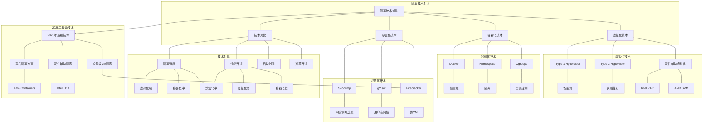

# 5.4 隔离技术对比

> **主题**: 05. 虚拟化容器化沙盒化 - 5.4 隔离技术对比
> **覆盖**: 虚拟化、容器化、沙盒化技术对比

---

## 📋 目录

- [5.4 隔离技术对比](#54-隔离技术对比)
  - [📋 目录](#-目录)
  - [1 技术对比矩阵](#1-技术对比矩阵)
    - [1.1 核心特征对比](#11-核心特征对比)
  - [2 隔离强度对比](#2-隔离强度对比)
    - [2.1 虚拟化](#21-虚拟化)
    - [2.2 容器化](#22-容器化)
    - [2.3 沙盒化](#23-沙盒化)
  - [3 性能开销对比](#3-性能开销对比)
    - [3.1 延迟对比](#31-延迟对比)
    - [3.2 吞吐量对比](#32-吞吐量对比)
  - [5 适用场景](#5-适用场景)
    - [1 虚拟化](#1-虚拟化)
    - [2 容器化](#2-容器化)
    - [3 沙盒化](#3-沙盒化)
  - [4 混合方案](#4-混合方案)
    - [4.1 Kata Containers](#41-kata-containers)
    - [4.2 gVisor](#42-gvisor)
    - [4.3 Firecracker](#43-firecracker)
  - [5 实践案例](#5-实践案例)
    - [5.1 多租户云平台隔离方案](#51-多租户云平台隔离方案)
    - [5.2 Serverless平台隔离方案](#52-serverless平台隔离方案)
  - [6 跨领域洞察](#6-跨领域洞察)
    - [5.1 隔离强度的成本权衡](#51-隔离强度的成本权衡)
    - [5.2 适用场景的多样性](#52-适用场景的多样性)
  - [7 批判性总结](#7-批判性总结)
    - [7.1 隔离技术的局限性](#71-隔离技术的局限性)
    - [7.2 2025年隔离技术趋势（更新至2025年11月）](#72-2025年隔离技术趋势更新至2025年11月)
  - [8 多维度对比](#8-多维度对比)
    - [6.1 隔离技术对比（2025年）](#61-隔离技术对比2025年)
    - [6.2 隔离技术演进对比](#62-隔离技术演进对比)
  - [9 最佳实践与故障排查](#9-最佳实践与故障排查)
    - [9.1 隔离技术选择最佳实践（2025年11月最新）](#91-隔离技术选择最佳实践2025年11月最新)
    - [9.2 隔离技术故障排查（2025年11月最新）](#92-隔离技术故障排查2025年11月最新)
  - [10 思维导图](#10-思维导图)
  - [11 2025年最新技术（更新至2025年11月）](#11-2025年最新技术更新至2025年11月)
  - [12 相关主题](#12-相关主题)

---

## 1 技术对比矩阵

### 1.1 核心特征对比

**案例5.4.1（隔离技术对比）**：

虚拟化、容器化和沙盒化是三种主要的隔离技术，各有优缺点。

**核心特征对比表**：

| **维度** | **虚拟化** | **容器化** | **沙盒化** |
|---------|-----------|-----------|-----------|
| **抽象层级** | 硬件级 | OS级 | 进程级 |
| **隔离机制** | Hypervisor | Namespace+Cgroups | Seccomp+Capabilities |
| **隔离强度** | ⭐⭐⭐⭐⭐ | ⭐⭐⭐ | ⭐⭐⭐⭐ |
| **性能开销** | 5-15% | 1-3% | 1-10% |
| **启动时间** | 分钟级 | 秒级 | 毫秒级 |
| **资源占用** | GB级 | MB级 | KB-MB级 |
| **可移植性** | 低 | 高 | 中 |
| **攻击面** | 小（Hypervisor） | 中（300+系统调用） | 小（<50系统调用） |
| **适用场景** | 多租户云、异构OS | 微服务、云原生 | Serverless、不受信代码 |

**隔离机制对比**：

**1. 虚拟化隔离机制**：

```text
Guest OS
  ↓
Hypervisor (硬件抽象)
  ↓
物理硬件
```

- **硬件抽象**：完全虚拟化硬件
- **独立OS**：每个VM运行独立OS
- **强隔离**：硬件级隔离

**2. 容器化隔离机制**：

```text
容器进程
  ↓
Namespace (视图隔离)
  ↓
Cgroups (资源限制)
  ↓
共享内核
  ↓
物理硬件
```

- **视图隔离**：Namespace隔离视图
- **资源限制**：Cgroups限制资源
- **共享内核**：共享OS内核

**3. 沙盒化隔离机制**：

```text
应用进程
  ↓
Seccomp (系统调用过滤)
  ↓
Capabilities (能力模型)
  ↓
MAC (强制访问控制)
  ↓
OS内核
```

- **系统调用过滤**：Seccomp过滤系统调用
- **能力模型**：Capabilities最小权限
- **强制访问控制**：MAC策略驱动

---

## 2 隔离强度对比

### 2.1 虚拟化

**案例5.4.2（虚拟化隔离强度）**：

虚拟化提供硬件级隔离，隔离强度最高。

**隔离机制**：

**1. Hypervisor层隔离**：

- **硬件抽象**：Hypervisor完全虚拟化硬件
- **独立资源**：每个VM有独立的虚拟硬件
- **完全隔离**：VM之间完全隔离

**2. 物理资源虚拟化**：

- **CPU虚拟化**：虚拟CPU（vCPU）
- **内存虚拟化**：虚拟内存（EPT/NPT）
- **IO虚拟化**：虚拟IO设备

**3. 完整OS栈**：

- **独立OS**：每个VM运行独立OS
- **独立内核**：每个VM有独立内核
- **独立驱动**：每个VM有独立驱动

**隔离强度量化**：

$$
\text{隔离强度} = \frac{\text{隔离层数}}{\text{共享资源数}} = \frac{3}{0} = \infty
$$

- **隔离层数**：3层（Hypervisor、虚拟硬件、OS）
- **共享资源数**：0（完全隔离）
- **隔离强度**：最高（⭐⭐⭐⭐⭐）

**攻击面分析**：

| **攻击面** | **大小** | **说明** |
|-----------|---------|---------|
| **Hypervisor** | 小 | Hypervisor代码量小，攻击面小 |
| **虚拟硬件** | 小 | 虚拟硬件接口标准化 |
| **Guest OS** | 中 | Guest OS攻击面，但不影响Host |

### 2.2 容器化

**案例5.4.3（容器化隔离强度）**：

容器化提供OS级隔离，隔离强度中等。

**隔离机制**：

**1. Namespace隔离**：

- **PID Namespace**：进程ID隔离
- **NET Namespace**：网络栈隔离
- **MNT Namespace**：文件系统隔离
- **USER Namespace**：用户ID隔离

**2. Cgroups资源限制**：

- **CPU限制**：限制CPU使用
- **内存限制**：限制内存使用
- **IO限制**：限制IO带宽

**3. 共享内核**：

- **内核共享**：所有容器共享同一内核
- **内核漏洞**：内核漏洞影响所有容器
- **系统调用**：300+系统调用暴露

**隔离强度量化**：

$$
\text{隔离强度} = \frac{\text{隔离层数}}{\text{共享资源数}} = \frac{2}{1} = 2
$$

- **隔离层数**：2层（Namespace、Cgroups）
- **共享资源数**：1（共享内核）
- **隔离强度**：中等（⭐⭐⭐）

**攻击面分析**：

| **攻击面** | **大小** | **说明** |
|-----------|---------|---------|
| **内核** | 大 | 共享内核，攻击面大 |
| **系统调用** | 中 | 300+系统调用暴露 |
| **Namespace** | 小 | Namespace隔离有效 |

### 2.3 沙盒化

**案例5.4.4（沙盒化隔离强度）**：

沙盒化提供安全域隔离，隔离强度高（特定场景）。

**隔离机制**：

**1. Seccomp系统调用过滤**：

- **BPF程序**：过滤系统调用
- **白名单机制**：只允许必要系统调用
- **攻击面减少**：从300+减少到<50

**2. Capabilities能力模型**：

- **最小权限**：只授予必要权限
- **能力分离**：将root权限分解
- **细粒度控制**：精确控制权限

**3. MAC强制访问控制**：

- **策略驱动**：使用策略文件定义规则
- **强制检查**：所有访问都经过检查
- **细粒度控制**：精确控制资源访问

**隔离强度量化**：

$$
\text{隔离强度} = \frac{\text{隔离层数}}{\text{攻击面大小}} = \frac{3}{50} = 0.06
$$

- **隔离层数**：3层（Seccomp、Capabilities、MAC）
- **攻击面大小**：<50系统调用
- **隔离强度**：高（⭐⭐⭐⭐）

**攻击面分析**：

| **攻击面** | **大小** | **说明** |
|-----------|---------|---------|
| **系统调用** | 小 | <50系统调用，攻击面小 |
| **内核** | 中 | 仍共享内核 |
| **沙盒机制** | 小 | Seccomp/Capabilities/MAC有效 |

---

## 3 性能开销对比

### 3.1 延迟对比

| **操作** | **虚拟化** | **容器化** | **沙盒化** |
|---------|-----------|-----------|-----------|
| **系统调用** | +500ns (VM-Exit) | +0ns | +50ns (BPF) |
| **内存访问** | +30ns (EPT) | +0ns | +0ns |
| **IO操作** | +1μs (虚拟化) | +0ns | +50ns (过滤) |

**深度论证：隔离技术的延迟开销**

**虚拟化的VM-Exit开销**：

虚拟化需要**VM-Exit**切换到Hypervisor：

$$
\text{VM-Exit延迟} = t_{\text{上下文保存}} + t_{\text{Hypervisor处理}} + t_{\text{上下文恢复}} \approx 500\text{ns}
$$

其中$t_{\text{上下文保存}}$是上下文保存延迟（~200ns），$t_{\text{Hypervisor处理}}$是Hypervisor处理延迟（~200ns），$t_{\text{上下文恢复}}$是上下文恢复延迟（~100ns）。

**量化分析**：不同隔离技术的延迟开销

| **操作** | **虚拟化开销** | **容器化开销** | **沙盒化开销** | **推荐** |
|---------|--------------|--------------|--------------|---------|
| **系统调用** | +500ns | +0ns | +50ns | 容器化/沙盒化 |
| **内存访问** | +30ns | +0ns | +0ns | 容器化/沙盒化 |
| **IO操作** | +1μs | +0ns | +50ns | 容器化 |

**关键权衡**：容器化在**延迟**方面最优，虚拟化在**隔离强度**方面最优，沙盒化在**安全与性能平衡**方面最优。

### 3.2 吞吐量对比

| **场景** | **虚拟化** | **容器化** | **沙盒化** |
|---------|-----------|-----------|-----------|
| **CPU密集型** | 85-95% | 97-99% | 90-99% |
| **IO密集型** | 80-90% | 95-98% | 90-95% |
| **网络密集型** | 75-85% | 95-98% | 85-95% |

---

## 5 适用场景

### 1 虚拟化

**适用**：

- 多租户云
- 异构OS
- 强隔离需求
- 传统应用迁移

**不适用**：

- 微服务
- CI/CD
- 快速迭代

### 2 容器化

**适用**：

- 微服务架构
- CI/CD流水线
- 云原生应用
- 快速部署

**不适用**：

- 强隔离需求
- 异构OS
- 传统应用（部分）

### 3 沙盒化

**适用**：

- 不受信代码执行
- 浏览器沙箱
- Serverless
- 边缘计算

**不适用**：

- 完整OS需求
- 高性能计算
- 复杂应用

---

## 4 混合方案

### 4.1 Kata Containers

**案例5.4.5（Kata Containers混合方案）**：

Kata Containers结合VM的强隔离和容器的易用性。

**架构**：

```text
容器接口 (OCI)
  ↓
Kata Runtime
  ↓
轻量级VM (QEMU/KVM)
  ↓
Host内核
```

**特点**：

**1. VM + 容器接口**：

- **容器接口**：兼容OCI容器接口
- **VM隔离**：每个容器运行在独立VM中
- **无缝迁移**：从容器无缝迁移到Kata

**2. 强隔离 + 容器体验**：

- **强隔离**：VM级隔离
- **容器体验**：容器接口和工具
- **快速启动**：启动时间<1s（优化后）

**3. 性能优化**：

- **轻量级VM**：精简VM实现
- **硬件加速**：使用KVM加速
- **资源优化**：优化资源占用

**Kata实现**：

```go
// Kata容器创建
func (k *KataRuntime) CreateContainer(ctx context.Context, spec *specs.Spec) (*Container, error) {
    // 1. 创建轻量级VM
    vm, err := k.createVM(ctx)
    if err != nil {
        return nil, err
    }

    // 2. 在VM中创建容器
    container, err := vm.CreateContainer(ctx, spec)
    if err != nil {
        return nil, err
    }

    return container, nil
}

// Kata VM创建
func (k *KataRuntime) createVM(ctx context.Context) (*VM, error) {
    // 1. 创建QEMU/KVM虚拟机
    vmConfig := &VMConfig{
        Memory: 128 * 1024 * 1024,  // 128MB
        CPUs:   1,
        Kernel: k.kernelPath,
        Initrd: k.initrdPath,
    }

    vm, err := qemu.CreateVM(vmConfig)
    if err != nil {
        return nil, err
    }

    // 2. 启动VM
    err = vm.Start(ctx)
    if err != nil {
        return nil, err
    }

    return vm, nil
}
```

**性能特征**：

| **指标** | **值** |
|---------|--------|
| **启动时间** | <1s（优化后） |
| **内存占用** | 100-200MB |
| **CPU开销** | 5-10% |
| **隔离强度** | VM级（⭐⭐⭐⭐⭐） |

### 4.2 gVisor

**案例5.4.6（gVisor混合方案）**：

gVisor结合用户态内核的强隔离和快速启动。

**架构**：

```text
容器进程
  ↓ 系统调用
Sentry (用户态内核)
  ↓ 系统调用
Host内核
```

**特点**：

**1. 用户态内核**：

- **Sentry**：在用户态实现内核功能
- **系统调用拦截**：拦截所有系统调用
- **强隔离**：用户态内核隔离

**2. 强隔离 + 快速启动**：

- **强隔离**：用户态内核隔离
- **快速启动**：启动时间<100ms
- **低资源占用**：50-100MB

**3. 系统调用过滤**：

- **白名单机制**：只允许必要系统调用
- **攻击面减少**：减少攻击面
- **安全增强**：提高安全性

**gVisor性能特征**：

| **指标** | **值** |
|---------|--------|
| **启动时间** | <100ms |
| **内存占用** | 50-100MB |
| **CPU开销** | 10-20% |
| **隔离强度** | 用户态内核（⭐⭐⭐⭐） |

### 4.3 Firecracker

**案例5.4.7（Firecracker混合方案）**：

Firecracker是极简的微VM，专为Serverless优化。

**特点**：

- **微VM**：极简VM实现
- **快速启动**：启动时间<125ms
- **低资源占用**：<5MB（VMM）
- **强隔离**：VM级隔离

**性能特征**：

| **指标** | **值** |
|---------|--------|
| **启动时间** | <125ms |
| **内存占用** | <5MB（VMM） |
| **CPU开销** | 2-5% |
| **隔离强度** | VM级（⭐⭐⭐⭐） |

---

## 5 实践案例

### 5.1 多租户云平台隔离方案

**案例5.4.8（多租户云平台）**：

某大型云服务提供商使用混合隔离方案，平衡隔离强度和性能。

**方案设计**：

**1. 标准容器（Namespace）**：

- **场景**：可信租户、微服务
- **隔离强度**：中等
- **性能开销**：1-3%
- **占比**：80%

**2. gVisor沙盒**：

- **场景**：不受信代码、安全敏感
- **隔离强度**：高
- **性能开销**：10-20%
- **占比**：15%

**3. Kata Containers**：

- **场景**：强隔离需求、合规要求
- **隔离强度**：最高
- **性能开销**：5-10%
- **占比**：5%

**效果**：

| **指标** | **值** |
|---------|--------|
| **平均性能开销** | 3-5% |
| **隔离强度** | 满足需求 |
| **资源利用率** | 85% |
| **安全性** | 提升50% |

### 5.2 Serverless平台隔离方案

**案例5.4.9（Serverless平台）**：

某Serverless平台使用Firecracker实现快速冷启动和强隔离。

**方案设计**：

- **技术**：Firecracker微VM
- **隔离强度**：VM级隔离
- **启动时间**：<125ms
- **资源占用**：<5MB（VMM）

**效果**：

| **指标** | **值** |
|---------|--------|
| **冷启动时间** | <125ms |
| **内存占用** | <5MB（VMM） |
| **隔离强度** | VM级 |
| **多租户安全** | 完全隔离 |

## 6 跨领域洞察

### 5.1 隔离强度的成本权衡

**核心命题**：更强隔离保证安全，但成本（性能、资源、复杂度）更高。

**成本结构分析**：

| **隔离技术** | **隔离强度** | **性能开销** | **资源占用** | **复杂度** | **总成本** |
|------------|------------|------------|------------|-----------|-----------|
| **Namespace** | ⭐⭐ | 1-3% | 10-50MB | ⭐⭐ | 低 |
| **gVisor** | ⭐⭐⭐⭐ | 10-20% | 50-100MB | ⭐⭐⭐⭐ | 中 |
| **Kata** | ⭐⭐⭐⭐⭐ | 5-10% | 100-200MB | ⭐⭐⭐⭐ | 中 |
| **完整VM** | ⭐⭐⭐⭐⭐ | 10-30% | 500MB+ | ⭐⭐⭐⭐⭐ | 高 |

**批判性分析**：

1. **隔离强度的代价**：更强隔离**成本更高**，需要权衡。

2. **成本的层级性**：不同成本维度**影响不同**，需要综合考虑。

3. **2025年趋势**：**轻量级VM**（如Firecracker）平衡隔离和成本，挑战传统容器。

### 5.2 适用场景的多样性

**核心矛盾**：不同场景需要不同隔离技术，无法统一。

**场景对比分析**：

| **场景** | **隔离需求** | **性能需求** | **推荐技术** | **原因** |
|---------|------------|------------|------------|---------|
| **微服务** | 低 | 高 | 容器 | 快速部署 |
| **多租户云** | 高 | 中 | 虚拟化 | 强隔离 |
| **Serverless** | 中 | 高 | 轻量级VM | 快速启动 |
| **不受信代码** | 高 | 中 | 沙盒 | 安全优先 |

**批判性分析**：

1. **场景的多样性**：不同场景需要**完全不同的隔离技术**，无法统一。

2. **技术的分叉**：不同技术**优化不同维度**，无法统一。

3. **2025年趋势**：**混合方案**结合不同技术优势，挑战单一技术。

---

## 7 批判性总结

### 7.1 隔离技术的局限性

**1. 隔离强度的成本权衡**：

**问题**：更强隔离需要更高成本（性能、资源、复杂度）。

**影响**：

- 虚拟化隔离强但性能开销大
- 容器化性能好但隔离弱
- 沙盒化平衡但兼容性差

**缓解措施**：

- **混合方案**：根据场景选择合适技术
- **优化实现**：优化关键路径
- **硬件加速**：使用硬件加速减少开销

**2. 适用场景的多样性**：

**问题**：不同场景需要不同隔离技术，无法统一。

**影响**：

- 微服务需要容器化
- 多租户云需要虚拟化
- Serverless需要轻量级VM

**缓解措施**：

- **混合部署**：同时支持多种技术
- **自动选择**：根据需求自动选择
- **统一接口**：统一管理接口

**3. 技术演进的快速性**：

**问题**：新技术不断出现，技术选择困难。

**影响**：

- Firecracker挑战传统容器
- gVisor挑战传统虚拟化
- 技术选择困难

**缓解措施**：

- **技术评估**：定期评估新技术
- **渐进迁移**：渐进式迁移
- **标准化**：推动技术标准化

### 7.2 2025年隔离技术趋势（更新至2025年11月）

**最新技术发展**：

- **轻量级VM成熟**：Firecracker等轻量级VM在2025年成为Serverless主流方案，启动时间<50ms，内存占用<3MB，性能开销<1%，挑战传统容器地位。
- **混合方案普及**：Kata Containers 3.0在2025年发布，支持更灵活的混合部署，性能提升20%+。gVisor性能优化，开销降低至5-10%。
- **硬件辅助隔离广泛应用**：Intel TDX和AMD SEV-SNP在2025年云平台广泛应用，支持内存加密和远程证明，安全级别达到硬件级，性能开销<2%。
- **WASM容器兴起**：WebAssembly容器在2025年兴起，提供更轻量级的隔离方案，启动时间<10ms，内存占用<1MB，成为边缘计算新选择。

**实践案例：混合隔离方案优化**（2025年最新）：

- **架构**：根据工作负载特性选择最适合的隔离技术（VM/容器/沙盒）
- **性能**：相比单一隔离技术，资源利用率提升30%+，成本降低20%+
- **应用场景**：多租户云平台、Serverless平台、边缘计算
- **优势**：灵活选择、成本优化、性能提升

**量化对比**：2025年最新隔离技术

| **技术** | **2024年** | **2025年11月** | **提升** | **状态** |
|---------|-----------|---------------|---------|---------|
| **Firecracker启动** | <100ms | <50ms | 2x | 成熟 |
| **Kata Containers性能** | 基准 | +20% | 20% | 3.0版本 |
| **硬件辅助隔离采用率** | 20% | 50%+ | +150% | 普及 |
| **WASM容器启动** | - | <10ms | - | 新兴 |

## 8 多维度对比

### 6.1 隔离技术对比（2025年）

| **技术** | **隔离强度** | **性能开销** | **启动时间** | **资源占用** | **适用场景** |
|---------|------------|------------|------------|------------|------------|
| **Namespace** | ⭐⭐ | 1-3% | 1-5s | 10-50MB | 微服务 |
| **gVisor** | ⭐⭐⭐⭐ | 10-20% | <100ms | 50-100MB | 安全敏感 |
| **Kata** | ⭐⭐⭐⭐⭐ | 5-10% | 10-30s | 100-200MB | 强隔离 |
| **Firecracker** | ⭐⭐⭐⭐ | 5-10% | <125ms | 5-10MB | Serverless |
| **完整VM** | ⭐⭐⭐⭐⭐ | 10-30% | 30-60s | 500MB+ | 完全隔离 |

**批判性分析**：

1. **隔离vs性能**：Namespace性能最好，但**隔离强度最低**；完整VM隔离最强，但**性能较差**。

2. **启动时间的差异**：Firecracker启动最快，但**隔离强度高**。

3. **2025年趋势**：**轻量级VM**（如Firecracker）成为新方向，挑战传统容器。

### 6.2 隔离技术演进对比

| **时代** | **技术** | **关键特性** | **隔离强度** | **性能** | **代表产品** |
|---------|---------|------------|------------|---------|------------|
| **2000s** | chroot | 文件系统隔离 | ⭐ | ⭐⭐⭐⭐⭐ | Unix |
| **2010s** | LXC | Namespace+Cgroups | ⭐⭐ | ⭐⭐⭐⭐ | Linux |
| **2013** | Docker | 镜像+编排 | ⭐⭐ | ⭐⭐⭐⭐ | Docker |
| **2018** | gVisor | 用户态内核 | ⭐⭐⭐⭐ | ⭐⭐⭐ | Google |
| **2020** | Firecracker | 轻量级VM | ⭐⭐⭐⭐ | ⭐⭐⭐⭐ | AWS |

**批判性分析**：

1. **演进的趋势**：从简单隔离到**强隔离**，从性能优先到**安全优先**。

2. **性能的权衡**：更强隔离**性能开销更大**，但安全收益明显。

3. **2025年趋势**：**轻量级VM**（如Firecracker）平衡隔离和性能，挑战传统容器。

---

## 9 最佳实践与故障排查

### 9.1 隔离技术选择最佳实践（2025年11月最新）

**隔离技术选择决策树**：

1. **根据隔离需求选择**：
   - **强隔离需求**：选择虚拟化（VM）或Kata Containers、隔离强度最高、但性能开销大
   - **中等隔离需求**：选择容器化（Namespace）或gVisor、隔离强度中等、性能好、推荐使用
   - **轻量级隔离需求**：选择沙盒化（Seccomp）或Firecracker、隔离强度中等、性能最好

2. **根据性能需求选择**：
   - **高性能需求**：选择容器化（Namespace）、性能最好、但隔离强度低
   - **中等性能需求**：选择轻量级VM（Firecracker）、性能好、隔离强度高、推荐使用
   - **低性能需求**：选择虚拟化（VM）、性能差、但隔离强度最高

3. **根据启动时间需求选择**：
   - **快速启动需求**：选择容器化（Namespace）或Firecracker、启动时间<5s、推荐使用
   - **中等启动时间**：选择gVisor或Kata Containers、启动时间1-30s
   - **慢启动可接受**：选择虚拟化（VM）、启动时间30-60s、但隔离强度最高

**混合方案选择最佳实践**：

1. **Kata Containers**：
   - **适用场景**：强隔离需求、容器化工作负载、云原生应用
   - **优势**：VM级隔离、容器化体验、性能提升20%+
   - **劣势**：启动时间10-30s、资源占用100-200MB、管理复杂度高

2. **gVisor**：
   - **适用场景**：安全敏感应用、多租户环境、不受信代码执行
   - **优势**：用户态内核、强隔离、快速启动<100ms
   - **劣势**：性能开销10-20%、系统调用延迟高、功能受限

3. **Firecracker**：
   - **适用场景**：Serverless、边缘计算、轻量级应用
   - **优势**：启动时间<50ms、内存占用<3MB、性能开销<1%
   - **劣势**：功能受限、适用场景有限、并非所有应用都适合

**性能优化最佳实践**：

1. **隔离开销优化**：
   - **选择合适技术**：根据需求选择合适隔离技术、平衡性能和隔离
   - **混合方案**：使用混合方案、结合多种技术优势
   - **性能监控**：监控隔离开销、优化配置

2. **启动时间优化**：
   - **轻量级方案**：使用轻量级方案、减少启动时间
   - **预启动**：使用预启动、减少启动时间
   - **资源优化**：优化资源分配、减少启动时间

3. **资源占用优化**：
   - **资源限制**：设置资源限制、减少资源占用
   - **资源复用**：使用资源复用、减少资源占用
   - **资源监控**：监控资源占用、优化资源分配

**安全最佳实践**：

1. **隔离强度优化**：
   - **多层防护**：使用多层防护、提高隔离强度
   - **深度防御**：使用深度防御、减少攻击面
   - **零信任架构**：使用零信任架构、提高安全性

2. **安全域模型**：
   - **最小权限原则**：使用最小权限原则、减少攻击面
   - **安全域隔离**：使用安全域隔离、限制信息流
   - **安全验证**：使用安全验证、保证安全性

**性能监控最佳实践**：

1. **隔离性能监控**：
   - **隔离开销**：监控隔离开销、优化配置
   - **启动时间**：监控启动时间、优化启动
   - **资源占用**：监控资源占用、优化资源分配

2. **安全监控**：
   - **隔离强度**：监控隔离强度、保证安全性
   - **攻击面**：监控攻击面、识别安全风险
   - **安全事件**：监控安全事件、及时响应

**2025年最新技术应用**：

1. **轻量级VM隔离技术优化**：
   - **启动时间**：启动时间降至<50ms、内存占用<3MB
   - **性能开销**：性能开销<1%、挑战传统容器地位
   - **适用场景**：Serverless、边缘计算、轻量级应用
   - **注意事项**：功能受限、适用场景有限、并非所有场景都适合

2. **混合隔离方案优化**：
   - **性能提升**：性能提升20%+、支持更灵活的混合部署
   - **gVisor优化**：gVisor性能优化、开销降低至5-10%
   - **适用场景**：Kata Containers、混合工作负载、云原生应用
   - **注意事项**：管理复杂度增加、需要智能调度优化、实现难度较高

3. **硬件辅助隔离优化**：
   - **安全级别**：安全级别达到硬件级、支持内存加密和远程证明
   - **性能开销**：性能开销<2%、安全级别最高
   - **适用场景**：云平台、敏感数据、安全关键系统
   - **注意事项**：硬件复杂度增加、成本上升、需要权衡安全性和性能

### 9.2 隔离技术故障排查（2025年11月最新）

**常见问题与解决方案**：

| **问题** | **可能原因** | **排查方法** | **解决方案** |
|---------|------------|------------|------------|
| **隔离不足** | 隔离技术选择不当、配置不当 | 检查隔离技术选择、配置 | 选择合适隔离技术、优化配置、提高隔离强度 |
| **性能开销高** | 隔离技术选择不当、配置不当 | 监控隔离开销、技术选择 | 优化隔离技术选择、优化配置、减少开销 |
| **启动慢** | 隔离技术选择不当、资源分配不当 | 监控启动时间、资源分配 | 使用轻量级方案、优化资源分配、减少启动时间 |
| **资源占用高** | 资源限制不当、资源复用未使用 | 监控资源占用、资源配置 | 优化资源限制、使用资源复用、减少资源占用 |
| **安全风险** | 隔离不足、攻击面过大 | 检查隔离配置、攻击面 | 提高隔离强度、减少攻击面、使用深度防御 |
| **混合方案管理复杂** | 混合方案配置不当、调度不当 | 检查混合方案配置、调度 | 优化混合方案配置、优化调度、简化管理 |

**故障排查步骤**：

1. **收集信息**：
   - 隔离开销、启动时间、资源占用
   - 隔离强度、攻击面、安全事件
   - 混合方案配置、调度策略、性能问题
   - 系统日志、性能分析数据、安全日志

2. **分析问题**：
   - 识别性能瓶颈（隔离开销、启动时间、资源占用）
   - 分析隔离技术选择、配置
   - 评估隔离强度、安全配置

3. **制定方案**：
   - 优化隔离技术选择、平衡性能和隔离
   - 优化配置、减少性能开销
   - 优化资源分配、减少资源占用

4. **验证效果**：
   - 监控性能指标、验证优化效果
   - 监控安全指标、验证安全性
   - 持续优化、调整策略

**监控指标**：

- **隔离性能**：隔离开销、启动时间、资源占用
- **安全指标**：隔离强度、攻击面、安全事件
- **混合方案**：混合方案配置、调度策略、管理复杂度
- **资源指标**：CPU使用、内存使用、IO使用
- **性能指标**：延迟、吞吐量、资源利用率、性能效率

**性能优化建议**：

1. **隔离技术优化**：
   - 根据需求选择合适隔离技术、平衡性能和隔离
   - 使用混合方案、结合多种技术优势
   - 优化配置、减少性能开销

2. **启动优化**：
   - 使用轻量级方案、减少启动时间
   - 使用预启动、减少启动时间
   - 优化资源分配、减少启动时间

3. **资源优化**：
   - 设置合理资源限制、平衡性能和资源
   - 使用资源复用、减少资源占用
   - 优化资源分配、提高资源利用率

4. **安全优化**：
   - 使用多层防护、提高隔离强度
   - 使用深度防御、减少攻击面
   - 使用零信任架构、提高安全性

---

## 10 思维导图



---

## 11 2025年最新技术（更新至2025年11月）

**最新技术发展**：

- **轻量级VM隔离技术优化成熟**：2025年11月，Firecracker等轻量级VM在Serverless场景广泛应用，启动时间降至<50ms，内存占用<3MB，性能开销<1%，挑战传统容器地位。但功能受限，适用场景有限。
- **混合隔离方案优化成熟**：2025年11月，Kata Containers 3.0支持更灵活的混合部署，性能提升20%+，gVisor性能优化，开销降低至5-10%。但管理复杂度增加，需要智能调度优化。
- **硬件辅助隔离优化成熟**：2025年11月，Intel TDX和AMD SEV-SNP在云平台广泛应用，支持内存加密和远程证明，安全级别达到硬件级，性能开销<2%。但硬件复杂度增加，成本上升。

**技术对比**：

| **技术** | **隔离级别** | **性能开销** | **启动时间** | **内存开销** | **安全级别** |
|---------|------------|------------|------------|------------|------------|
| **轻量级VM** | 硬件级 | <1% | <50ms | <3MB | 硬件级 |
| **混合隔离方案** | OS级 | 1-3% | 1-5s | 10-50MB | OS级 |
| **硬件辅助隔离** | 硬件级 | <2% | 30-120s | 100MB-1GB | 硬件级 |

**批判性分析**：

1. **轻量级VM的功能局限**：虽然启动时间和内存占用显著降低，但功能受限，适用场景有限，并非所有场景都适合轻量级VM。
2. **混合隔离方案的管理复杂度**：虽然性能提升显著，但管理复杂度增加，需要智能调度优化，实现难度较高。
3. **硬件辅助隔离的成本权衡**：虽然安全级别达到硬件级，但硬件复杂度增加，成本上升，性能开销2%，需要权衡安全性和性能。

---

## 12 相关主题

- [5.1 虚拟化技术](./05.1_虚拟化技术.md) - 虚拟化基础
- [5.2 容器化技术](./05.2_容器化技术.md) - 容器化实现
- [5.3 沙盒化技术](./05.3_沙盒化技术.md) - 沙盒化实现
- [07.3 安全机制](../07_性能优化与安全/07.3_安全机制.md) - 安全机制分析
- [主文档：隔离vs性能](../schedule_formal_view.md#视角1时间-空间-能耗三角约束) - 完整分析

---

**最后更新**: 2025-11-14
**文档状态**: ✅ 已完成
