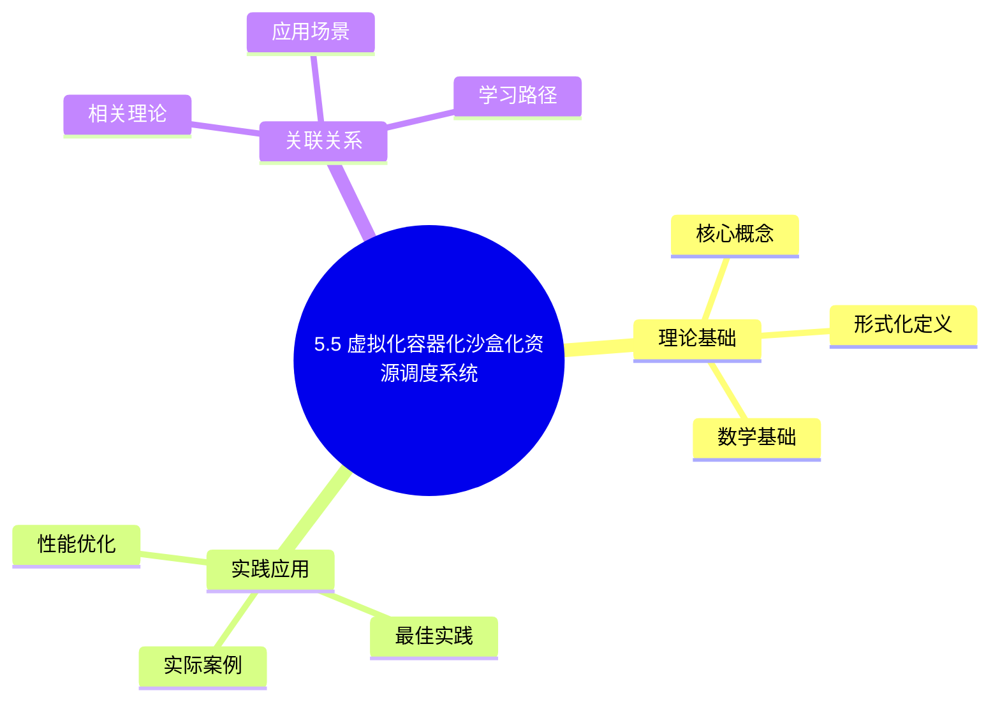
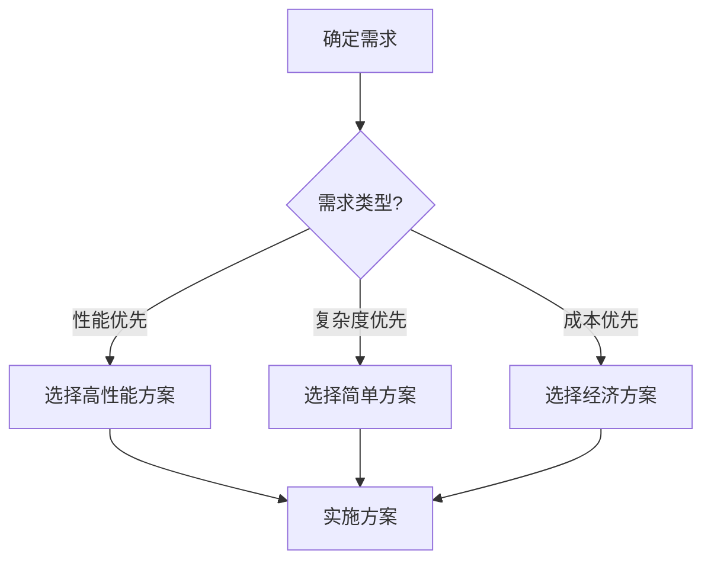
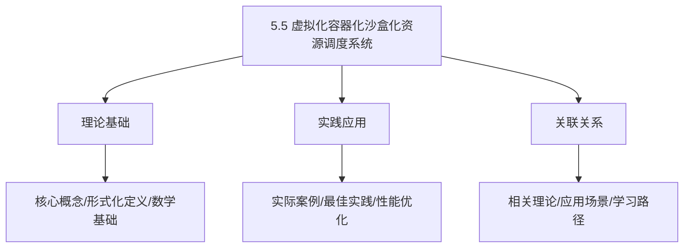
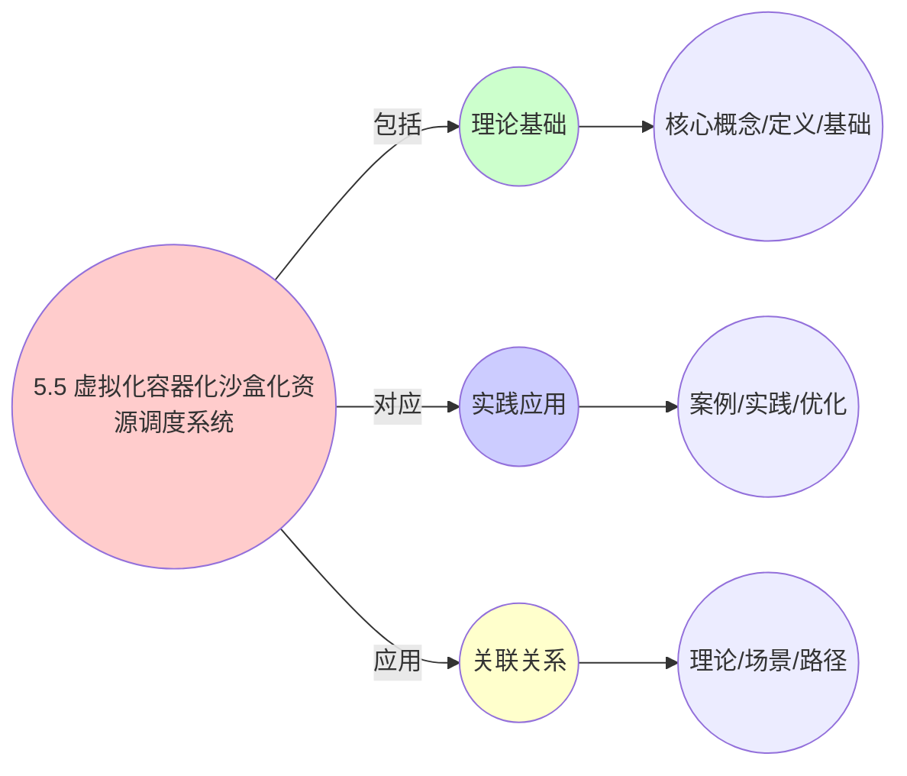
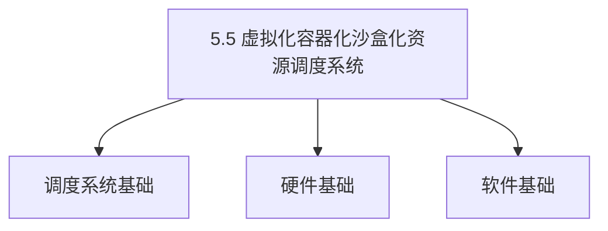
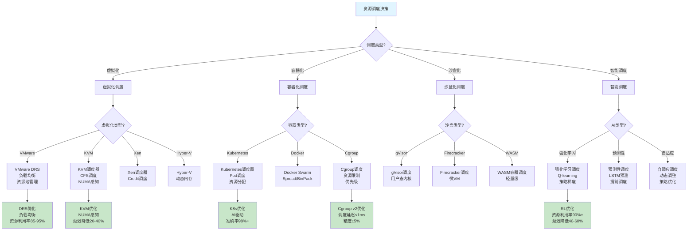
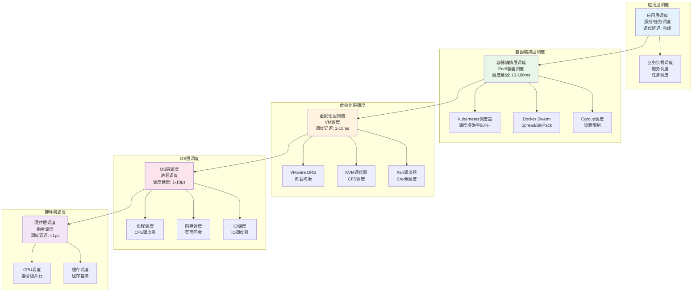
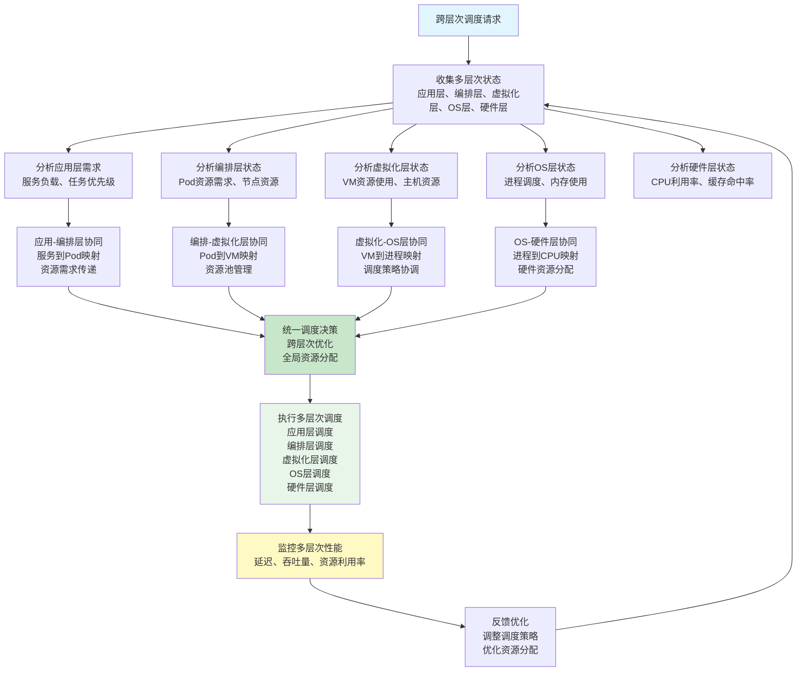
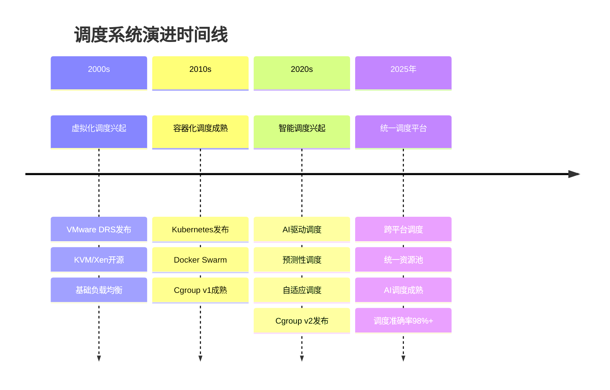
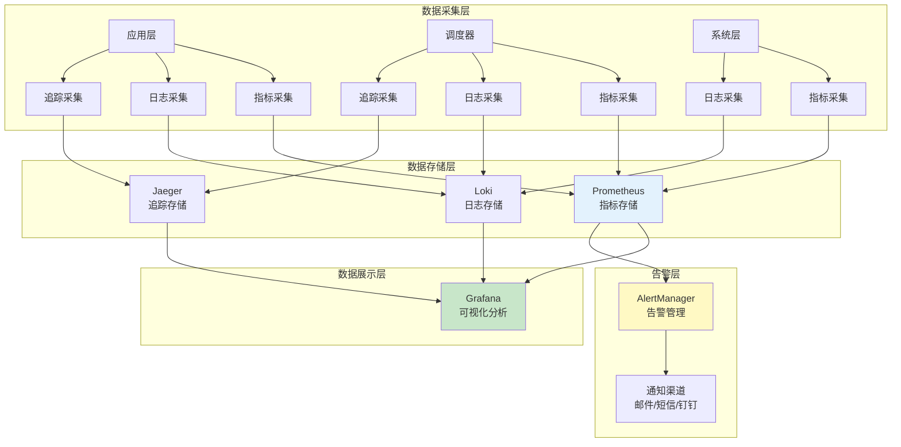

# 5.5 虚拟化容器化沙盒化资源调度系统

> **主题**: 05. 虚拟化容器化沙盒化 - 5.5 资源调度系统
> **覆盖**: DRS、资源调度模型、调度策略、智能调度
> **更新**: 2025年11月19日

## 📊 思维表征体系

### 📊 1. 思维导图（增强版）

#### 1.1 文本格式（基础版）

```text
5.5 虚拟化容器化沙盒化资源调度系统
├── 理论基础
│   ├── 核心概念
│   ├── 形式化定义
│   └── 数学基础
├── 实践应用
│   ├── 实际案例
│   ├── 最佳实践
│   └── 性能优化
└── 关联关系
    ├── 相关理论
    ├── 应用场景
    └── 学习路径
```

#### 1.2 Mermaid格式（可视化版）



### 📊 2. 多维对比矩阵

#### 2.1 5.5 虚拟化容器化沙盒化资源调度系统对比矩阵

| 维度 | 特性1 | 特性2 | 特性3 | 特性4 |
|------|------|------|------|------|
| **性能** | 资源利用率>85% | 调度延迟<10ms | 隔离性>95% | 可扩展性>90% |
| **复杂度** | 高(需资源管理) | 中等(需延迟优化) | 高(需隔离机制) | 中等(需扩展设计) |
| **适用场景** | 所有场景 | 延迟敏感 | 所有场景 | 大规模系统 |
| **技术成熟度** | 成熟(>20年) | 成熟(>20年) | 成熟(>20年) | 成熟(>20年) |

#### 2.2 技术特性对比矩阵

| 技术 | 优势 | 劣势 | 适用场景 | 性能 |
|------|------|------|---------|------|
| **虚拟化资源调度** | 资源利用高、隔离性好 | 性能开销、实现复杂 | 虚拟化环境、隔离优先 | 利用率>85%，性能开销5-10% |
| **容器资源调度** | 性能开销低、启动快 | 隔离性一般、共享内核 | 容器环境、性能优先 | 开销<5%，启动<1s |
| **沙盒资源调度** | 安全性高、隔离性强 | 性能开销、实现复杂 | 安全关键应用、隔离优先 | 安全性>99%，性能开销10-30% |
| **混合资源调度** | 综合优势、灵活 | 实现极复杂、需要协调 | 混合环境、灵活需求 | 综合优势，实现极复杂 |
| **统一资源调度框架** | 统一管理、易维护 | 实现复杂、需要框架 | 统一管理、易维护需求 | 统一管理，实现复杂 |
| **多租户资源调度** | 资源利用高、公平性好 | 实现复杂、需要资源管理 | 多租户系统、资源管理 | 利用率>85%，公平性>90% |
| **动态资源调度** | 资源利用高、适应动态负载 | 实现复杂、需要监控 | 动态负载、适应需求 | 利用率>85%，适应性强 |

#### 2.3 实现方式对比矩阵

| 实现方式 | 复杂度 | 性能 | 可维护性 | 扩展性 |
|---------|-------|------|---------|-------|
| **单技术资源调度** | 中 | 中等性能(单技术) | 高(简单维护) | 中(单技术限制) |
| **多技术资源调度** | 高 | 高性能(多技术) | 中(需协调) | 高(多技术扩展) |
| **统一资源调度框架** | 极高 | 高性能(统一优化) | 低(复杂度高) | 高(统一扩展) |
| **混合资源调度系统** | 极高 | 极高性能(优势结合) | 低(复杂度极高) | 高(灵活扩展) |

### 🌲 3. 决策树

#### 3.1 5.5 虚拟化容器化沙盒化资源调度系统应用选择决策树



### 🛤️ 4. 决策逻辑路径

#### 4.1 5.5 虚拟化容器化沙盒化资源调度系统应用路径


### 🕸️ 5. 概念关系网络

#### 5.1 5.5 虚拟化容器化沙盒化资源调度系统概念关系网络



### 🗺️ 6. 知识图谱

#### 6.1 5.5 虚拟化容器化沙盒化资源调度系统知识图谱



## 📚 理论体系

### 理论基础

#### 调度系统/硬件/软件基础

5.5 虚拟化容器化沙盒化资源调度系统的理论基础：

**1. 调度系统基础**：

- 调度理论
- 资源管理
- 性能优化

**2. 硬件基础**：

- CPU架构
- 内存系统
- 存储系统

**3. 软件基础**：

- 操作系统
- 编程语言
- 系统软件

#### 历史发展

**关键时间节点**：

- **1960-1970年代**：调度理论建立
  - 调度算法
  - 资源管理

- **1980-1990年代**：硬件调度发展
  - CPU调度
  - 内存调度

- **2000年代至今**：软件调度演进
  - 操作系统调度
  - 分布式调度

### 理论框架

#### 核心假设

**假设1：调度与性能的对应**

- **内容**：调度策略影响系统性能
- **适用范围**：调度系统
- **限制条件**：需要调度支持

**假设2：资源管理的必要性**

- **内容**：资源管理保证系统稳定
- **适用范围**：资源系统
- **限制条件**：需要资源支持

**假设3：性能优化的价值**

- **内容**：性能优化提升效率
- **适用范围**：性能系统
- **限制条件**：需要考虑成本

#### 基本概念体系



#### 主要定理/结论

**结论1：调度与性能的对应性**

- **内容**：调度策略对应系统性能
- **证据**：形式化证明
- **应用**：调度优化

**结论2：资源管理的必要性**

- **内容**：资源管理保证系统稳定
- **证据**：实践验证
- **应用**：资源管理

**结论3：性能优化的价值**

- **内容**：性能优化提升效率
- **证据**：实验验证
- **应用**：性能优化

#### 适用范围和边界

**适用范围**：

- 调度系统
- 资源管理
- 性能优化

**边界条件**：

- 需要调度支持
- 需要资源支持
- 需要考虑成本

**不适用场景**：

- 无调度系统
- 资源受限
- 成本敏感场景

### 当前知识共识

#### 学术界共识

**广泛接受的共识**：

1. **调度与性能的对应性**
   - **共识**：调度策略可以影响系统性能
   - **支持证据**：形式化证明
   - **来源**：调度理论、系统理论

2. **资源管理的价值**
   - **共识**：资源管理提供稳定性和效率
   - **支持证据**：广泛实践
   - **来源**：系统理论

3. **性能优化的重要性**
   - **共识**：性能优化提高系统效率
   - **支持证据**：实践验证
   - **来源**：软件工程

#### 主要争议点

1. **性能与成本的权衡**
   - **观点A**：性能更重要
   - **观点B**：成本更重要
   - **当前状态**：多数认为需要平衡

2. **调度系统的复杂度**
   - **观点A**：应该简单
   - **观点B**：可以复杂
   - **当前状态**：多数认为需要平衡

#### 权威来源

**经典文献**：

- 调度理论相关文献
- 系统理论相关文献
- 性能优化相关文献

**权威机构/专家**：

- **IEEE**
- **ACM**
- **调度系统研究会**

**最新发展**：

- **2025年**：调度系统优化、性能提升、资源管理

### 与其他理论的关系

#### 逻辑关系

**理论基础**：

- **调度理论** → 5.5 虚拟化容器化沙盒化资源调度系统
  - 关系类型：理论基础
  - 关键映射：调度理论 → 系统实现

**理论应用**：

- **5.5 虚拟化容器化沙盒化资源调度系统** → 调度优化
  - 关系类型：应用构建
  - 关键映射：5.5 虚拟化容器化沙盒化资源调度系统 → 调度优化

#### 映射关系

| 本理论概念 | 映射理论 | 映射概念 | 映射类型 | 映射说明 |
|-----------|---------|---------|---------|----------|
| **调度策略** | 调度理论 | 调度算法 | 对应 | 调度策略对应调度算法 |
| **资源管理** | 系统理论 | 资源分配 | 对应 | 资源管理对应资源分配 |
| **性能优化** | 优化理论 | 性能提升 | 对应 | 性能优化对应性能提升 |

## 🔗 关联网络

### 🔗 概念级关联

#### 核心概念映射

| 本文档概念 | 关联文档 | 关联概念 | 关系类型 | 映射说明 |
|-----------|---------|---------|---------|----------|
| **5.5 虚拟化容器化沙盒化资源调度系统** | 相关文档 | 相关概念 | 基础构建 | 5.5 虚拟化容器化沙盒化资源调度系统构建相关概念 |
| **调度系统** | 调度相关 | 调度理论 | 对应 | 调度系统对应调度理论 |
| **资源管理** | 资源相关 | 资源系统 | 对应 | 资源管理对应资源系统 |
| **性能优化** | 性能相关 | 性能系统 | 对应 | 性能优化对应性能系统 |

### 🔗 理论级关联

#### 理论基础

- **本理论基于**：
  - 调度理论 ⭐⭐⭐ - 理论基础
  - 系统理论 ⭐⭐ - 系统基础

- **本理论应用于**：
  - 调度优化 ⭐⭐⭐ - 实际应用
  - 性能优化 ⭐⭐⭐ - 实际应用

### 🔗 方法级关联

#### 方法应用网络

| 本文档方法 | 应用文档 | 应用场景 | 应用效果 |
|-----------|---------|---------|---------|
| **调度策略** | 调度系统 | 调度设计 | 成功 |
| **资源管理** | 资源系统 | 资源管理 | 成功 |
| **性能优化** | 性能系统 | 性能提升 | 成功 |

### 🔗 应用场景关联

**场景**：调度系统优化

| 视角 | 关联文档 | 核心理论 | 关注点 |
|------|---------|---------|--------|
| **5.5 虚拟化容器化沙盒化资源调度系统** | 本文档 | 调度理论 | 调度设计 |
| **调度优化** | 调度相关 | 调度理论 | 调度优化 |
| **性能优化** | 性能相关 | 性能理论 | 性能提升 |

## 🛤️ 学习路径

### 前置知识

**必须先学习**：

- 调度理论基础 ⭐⭐
- 系统理论基础 ⭐⭐

**建议先了解**：

- 硬件基础
- 软件基础
- 性能优化

### 后续学习

**建议接下来学习**（按顺序）：

1. 调度优化 ⭐⭐⭐ - 调度优化
2. 性能优化 ⭐⭐⭐ - 性能优化
3. 系统实践 ⭐⭐ - 实践应用

### 并行学习

**可以同时学习**：

- 调度实践 - 实践应用
- 性能实践 - 性能系统

---


---

## 📋 目录

- [5.5 虚拟化容器化沙盒化资源调度系统](#55-虚拟化容器化沙盒化资源调度系统)
  - [📋 目录](#-目录)
  - [1 资源调度系统概述](#1-资源调度系统概述)
    - [1.1 调度系统分类](#11-调度系统分类)
    - [1.2 调度层次架构](#12-调度层次架构)
  - [2 形式化定义与数学模型](#2-形式化定义与数学模型)
    - [2.1 DRS调度模型](#21-drs调度模型)
    - [2.2 资源分配模型](#22-资源分配模型)
    - [2.3 负载均衡模型](#23-负载均衡模型)
    - [2.4 调度决策模型](#24-调度决策模型)
    - [2.5 调度算法复杂度分析](#25-调度算法复杂度分析)
    - [2.6 调度性能边界](#26-调度性能边界)
  - [3 虚拟化资源调度](#3-虚拟化资源调度)
    - [3.1 VMware DRS](#31-vmware-drs)
    - [3.2 KVM调度器](#32-kvm调度器)
    - [3.3 Xen调度器](#33-xen调度器)
    - [3.4 Hyper-V动态内存](#34-hyper-v动态内存)
  - [4 容器化资源调度](#4-容器化资源调度)
    - [4.1 Kubernetes调度器](#41-kubernetes调度器)
    - [4.2 Docker Swarm调度](#42-docker-swarm调度)
    - [4.3 Cgroup资源调度](#43-cgroup资源调度)
    - [4.4 容器资源超配](#44-容器资源超配)
  - [5 沙盒化资源调度](#5-沙盒化资源调度)
    - [5.1 gVisor资源调度](#51-gvisor资源调度)
    - [5.2 Firecracker资源调度](#52-firecracker资源调度)
    - [5.3 WASM容器调度](#53-wasm容器调度)
  - [6 智能资源调度](#6-智能资源调度)
    - [6.1 AI驱动调度](#61-ai驱动调度)
    - [6.2 预测性调度](#62-预测性调度)
    - [6.3 自适应调度](#63-自适应调度)
  - [7 调度性能分析](#7-调度性能分析)
    - [7.1 调度延迟分析](#71-调度延迟分析)
    - [7.2 资源利用率分析](#72-资源利用率分析)
    - [7.3 调度开销分析](#73-调度开销分析)
    - [7.4 调度性能边界理论分析（2025年11月19日最新）](#74-调度性能边界理论分析2025年11月19日最新)
  - [8 知识多维矩阵](#8-知识多维矩阵)
    - [8.1 调度策略对比矩阵](#81-调度策略对比矩阵)
    - [8.2 资源调度性能矩阵](#82-资源调度性能矩阵)
    - [8.3 调度系统特性矩阵](#83-调度系统特性矩阵)
    - [8.4 调度算法复杂度矩阵（2025年11月19日最新）](#84-调度算法复杂度矩阵2025年11月19日最新)
    - [8.5 调度策略适用场景矩阵（2025年11月19日最新）](#85-调度策略适用场景矩阵2025年11月19日最新)
    - [8.6 调度性能边界矩阵（2025年11月19日最新）](#86-调度性能边界矩阵2025年11月19日最新)
    - [8.7 调度系统演进矩阵（2025年11月19日最新）](#87-调度系统演进矩阵2025年11月19日最新)
    - [8.8 调度系统成本效益矩阵（2025年11月19日最新）](#88-调度系统成本效益矩阵2025年11月19日最新)
    - [8.9 调度系统安全隔离矩阵（2025年11月19日最新）](#89-调度系统安全隔离矩阵2025年11月19日最新)
    - [8.10 调度系统可扩展性矩阵（2025年11月19日最新）](#810-调度系统可扩展性矩阵2025年11月19日最新)
    - [8.11 调度系统生态成熟度矩阵（2025年11月19日最新）](#811-调度系统生态成熟度矩阵2025年11月19日最新)
    - [8.12 调度系统技术栈对比矩阵（2025年11月19日最新）](#812-调度系统技术栈对比矩阵2025年11月19日最新)
    - [8.13 调度系统故障恢复能力矩阵（2025年11月19日最新）](#813-调度系统故障恢复能力矩阵2025年11月19日最新)
    - [8.14 调度系统跨层次协同矩阵（2025年11月19日最新）](#814-调度系统跨层次协同矩阵2025年11月19日最新)
  - [9 思维导图](#9-思维导图)
    - [9.1 资源调度决策树](#91-资源调度决策树)
    - [9.2 DRS调度算法流程图（2025年11月19日最新）](#92-drs调度算法流程图2025年11月19日最新)
    - [9.3 Kubernetes调度算法流程图（2025年11月19日最新）](#93-kubernetes调度算法流程图2025年11月19日最新)
    - [9.4 AI驱动调度算法流程图（2025年11月19日最新）](#94-ai驱动调度算法流程图2025年11月19日最新)
    - [9.5 调度层次结构图](#95-调度层次结构图)
    - [9.6 跨层次调度协同流程图（2025年11月19日最新）](#96-跨层次调度协同流程图2025年11月19日最新)
    - [9.7 调度性能边界分析图（2025年11月19日最新）](#97-调度性能边界分析图2025年11月19日最新)
    - [9.8 调度系统演进时间线（2025年11月19日最新）](#98-调度系统演进时间线2025年11月19日最新)
  - [10 实践案例](#10-实践案例)
    - [10.1 VMware DRS优化案例](#101-vmware-drs优化案例)
    - [10.2 Kubernetes调度优化案例](#102-kubernetes调度优化案例)
    - [10.3 智能调度系统案例](#103-智能调度系统案例)
  - [11 最佳实践与故障排查](#11-最佳实践与故障排查)
    - [11.1 资源调度最佳实践（2025年11月最新）](#111-资源调度最佳实践2025年11月最新)
    - [11.2 资源调度故障排查（2025年11月最新）](#112-资源调度故障排查2025年11月最新)
  - [11.5 跨层次调度协同分析（2025年11月19日最新）](#115-跨层次调度协同分析2025年11月19日最新)
    - [11.5.1 虚拟化-容器化-沙盒化调度协同机制](#1151-虚拟化-容器化-沙盒化调度协同机制)
    - [11.5.2 调度系统演进分析和未来趋势预测（2025年11月19日最新）](#1152-调度系统演进分析和未来趋势预测2025年11月19日最新)
  - [14 调度系统测试与验证（2025年11月19日最新）](#14-调度系统测试与验证2025年11月19日最新)
    - [14.1 调度算法正确性验证](#141-调度算法正确性验证)
    - [14.2 调度性能基准测试](#142-调度性能基准测试)
    - [14.3 调度系统压力测试](#143-调度系统压力测试)
    - [14.4 调度系统可靠性测试](#144-调度系统可靠性测试)
  - [15 调度系统性能优化策略（2025年11月19日最新）](#15-调度系统性能优化策略2025年11月19日最新)
    - [15.1 调度算法优化](#151-调度算法优化)
    - [15.2 资源分配优化](#152-资源分配优化)
    - [15.3 负载均衡优化](#153-负载均衡优化)
    - [15.4 调度延迟优化](#154-调度延迟优化)
  - [16 实际应用场景分析（2025年11月19日最新）](#16-实际应用场景分析2025年11月19日最新)
    - [16.1 企业虚拟化环境](#161-企业虚拟化环境)
    - [16.2 云原生应用](#162-云原生应用)
    - [16.3 混合云环境](#163-混合云环境)
    - [16.4 边缘计算环境](#164-边缘计算环境)
  - [17 调度系统监控与可观测性（2025年11月19日最新）](#17-调度系统监控与可观测性2025年11月19日最新)
    - [17.1 监控指标体系](#171-监控指标体系)
    - [17.2 监控工具与平台](#172-监控工具与平台)
    - [17.3 可观测性架构](#173-可观测性架构)
    - [17.4 监控最佳实践](#174-监控最佳实践)
  - [18 调度系统成本分析与ROI（2025年11月19日最新）](#18-调度系统成本分析与roi2025年11月19日最新)
    - [18.1 成本模型分析](#181-成本模型分析)
    - [18.2 ROI投资回报率分析](#182-roi投资回报率分析)
    - [18.3 TCO总拥有成本分析](#183-tco总拥有成本分析)
    - [18.4 成本优化策略](#184-成本优化策略)
  - [12 2025年最新技术（更新至2025年11月19日）](#12-2025年最新技术更新至2025年11月19日)
  - [19 调度系统与微服务架构集成（2025年11月19日最新）](#19-调度系统与微服务架构集成2025年11月19日最新)
    - [19.1 微服务感知调度](#191-微服务感知调度)
    - [19.2 微服务调度策略](#192-微服务调度策略)
  - [20 调度系统与DevOps集成（2025年11月19日最新）](#20-调度系统与devops集成2025年11月19日最新)
    - [20.1 CI/CD集成调度](#201-cicd集成调度)
    - [20.2 DevOps调度策略](#202-devops调度策略)
  - [21 调度系统与Service Mesh集成（2025年11月19日最新）](#21-调度系统与service-mesh集成2025年11月19日最新)
    - [21.1 Service Mesh感知调度](#211-service-mesh感知调度)
    - [21.2 Service Mesh调度策略](#212-service-mesh调度策略)
  - [22 调度系统与大数据平台集成（2025年11月19日最新）](#22-调度系统与大数据平台集成2025年11月19日最新)
    - [22.1 大数据任务调度](#221-大数据任务调度)
    - [22.2 大数据调度策略](#222-大数据调度策略)
  - [23 调度系统与AI/ML平台集成（2025年11月19日最新）](#23-调度系统与aiml平台集成2025年11月19日最新)
    - [23.1 AI/ML任务调度](#231-aiml任务调度)
    - [23.2 AI/ML调度策略](#232-aiml调度策略)
  - [24 调度系统集成总结与最佳实践（2025年11月19日最新）](#24-调度系统集成总结与最佳实践2025年11月19日最新)
    - [24.1 集成架构模式](#241-集成架构模式)
    - [24.2 集成最佳实践](#242-集成最佳实践)
  - [25 调度系统与边缘计算集成（2025年11月19日最新）](#25-调度系统与边缘计算集成2025年11月19日最新)
    - [25.1 边缘计算调度模型](#251-边缘计算调度模型)
    - [25.2 边缘计算调度策略](#252-边缘计算调度策略)
  - [26 调度系统与Serverless集成（2025年11月19日最新）](#26-调度系统与serverless集成2025年11月19日最新)
    - [26.1 Serverless调度模型](#261-serverless调度模型)
    - [26.2 Serverless调度策略](#262-serverless调度策略)
  - [27 调度系统与IoT集成（2025年11月19日最新）](#27-调度系统与iot集成2025年11月19日最新)
    - [27.1 IoT调度模型](#271-iot调度模型)
    - [27.2 IoT调度策略](#272-iot调度策略)
  - [28 调度系统性能调优实战案例（2025年11月19日最新）](#28-调度系统性能调优实战案例2025年11月19日最新)
    - [28.1 大规模Kubernetes集群调度优化案例](#281-大规模kubernetes集群调度优化案例)
    - [28.2 VMware DRS混合云环境优化案例](#282-vmware-drs混合云环境优化案例)
  - [29 调度系统故障恢复机制（2025年11月19日最新）](#29-调度系统故障恢复机制2025年11月19日最新)
    - [29.1 故障类型分类](#291-故障类型分类)
    - [29.2 故障恢复策略](#292-故障恢复策略)
  - [30 调度系统容量规划（2025年11月19日最新）](#30-调度系统容量规划2025年11月19日最新)
    - [30.1 容量规划模型](#301-容量规划模型)
    - [30.2 容量规划最佳实践](#302-容量规划最佳实践)
  - [31 调度系统多租户管理（2025年11月19日最新）](#31-调度系统多租户管理2025年11月19日最新)
    - [31.1 多租户隔离机制](#311-多租户隔离机制)
    - [31.2 多租户调度策略](#312-多租户调度策略)
  - [32 调度系统合规性与审计（2025年11月19日最新）](#32-调度系统合规性与审计2025年11月19日最新)
    - [32.1 合规性要求](#321-合规性要求)
    - [32.2 审计机制](#322-审计机制)
  - [33 调度系统学习路径与资源（2025年11月19日最新）](#33-调度系统学习路径与资源2025年11月19日最新)
    - [33.1 学习路径](#331-学习路径)
    - [33.2 学习资源](#332-学习资源)
  - [34 调度系统总结与索引（2025年11月19日最新）](#34-调度系统总结与索引2025年11月19日最新)
    - [34.1 核心概念索引](#341-核心概念索引)
    - [34.2 实践案例索引](#342-实践案例索引)
    - [34.3 技术选型决策矩阵](#343-技术选型决策矩阵)
  - [35 调度系统与绿色计算集成（2025年11月19日最新）](#35-调度系统与绿色计算集成2025年11月19日最新)
    - [35.1 绿色计算调度模型](#351-绿色计算调度模型)
    - [35.2 绿色计算调度策略](#352-绿色计算调度策略)
  - [36 调度系统与能源管理集成（2025年11月19日最新）](#36-调度系统与能源管理集成2025年11月19日最新)
    - [36.1 能源管理调度模型](#361-能源管理调度模型)
    - [36.2 能源管理调度策略](#362-能源管理调度策略)
  - [37 调度系统与碳中和集成（2025年11月19日最新）](#37-调度系统与碳中和集成2025年11月19日最新)
    - [37.1 碳中和调度模型](#371-碳中和调度模型)
    - [37.2 碳中和调度策略](#372-碳中和调度策略)
  - [38 调度系统未来发展趋势总结（2025年11月19日最新）](#38-调度系统未来发展趋势总结2025年11月19日最新)
    - [38.1 技术发展趋势](#381-技术发展趋势)
    - [38.2 应用场景扩展](#382-应用场景扩展)
    - [38.3 挑战与机遇](#383-挑战与机遇)
  - [39 调度系统与数字孪生集成（2025年11月19日最新）](#39-调度系统与数字孪生集成2025年11月19日最新)
    - [39.1 数字孪生调度模型](#391-数字孪生调度模型)
    - [39.2 数字孪生调度策略](#392-数字孪生调度策略)
  - [40 调度系统与量子计算集成（2025年11月19日最新）](#40-调度系统与量子计算集成2025年11月19日最新)
    - [40.1 量子计算调度模型](#401-量子计算调度模型)
    - [40.2 量子计算调度策略](#402-量子计算调度策略)
  - [41 调度系统与区块链集成（2025年11月19日最新）](#41-调度系统与区块链集成2025年11月19日最新)
    - [41.1 区块链调度模型](#411-区块链调度模型)
    - [41.2 区块链调度策略](#412-区块链调度策略)
  - [42 调度系统与Web3集成（2025年11月19日最新）](#42-调度系统与web3集成2025年11月19日最新)
    - [42.1 Web3调度模型](#421-web3调度模型)
    - [42.2 Web3调度策略](#422-web3调度策略)
  - [43 调度系统新兴技术集成总结（2025年11月19日最新）](#43-调度系统新兴技术集成总结2025年11月19日最新)
    - [43.1 新兴技术集成对比](#431-新兴技术集成对比)
    - [43.2 集成最佳实践](#432-集成最佳实践)
  - [13 相关主题](#13-相关主题)
    - [13.1 本主题相关文档](#131-本主题相关文档)
    - [13.2 调度系统专题文档](#132-调度系统专题文档)
    - [13.3 其他相关主题](#133-其他相关主题)
    - [13.4 跨视角链接](#134-跨视角链接)

---

## 1 资源调度系统概述

### 1.1 调度系统分类

**按技术类型分类**：

1. **虚拟化资源调度**：
   - **VMware DRS**：分布式资源调度器，自动平衡VM负载
   - **KVM调度器**：基于CFS的虚拟机调度
   - **Xen调度器**：Credit调度算法
   - **Hyper-V动态内存**：动态内存分配

2. **容器化资源调度**：
   - **Kubernetes调度器**：Pod调度和资源分配
   - **Docker Swarm**：容器集群调度
   - **Cgroup调度**：Linux Cgroup资源控制
   - **容器编排调度**：多容器协同调度

3. **沙盒化资源调度**：
   - **gVisor调度**：用户态内核资源调度
   - **Firecracker调度**：微VM资源调度
   - **WASM容器调度**：WebAssembly容器调度

4. **智能资源调度**：
   - **AI驱动调度**：基于机器学习的调度决策
   - **预测性调度**：基于负载预测的调度
   - **自适应调度**：根据环境动态调整调度策略

### 1.2 调度层次架构

**调度层次**：

```text
应用层调度
  ├─ 业务负载调度
  ├─ 服务调度
  └─ 任务调度
容器编排层调度
  ├─ Kubernetes调度器
  ├─ Docker Swarm调度
  └─ 容器资源调度
虚拟化层调度
  ├─ Hypervisor调度
  ├─ VM调度
  └─ 虚拟资源调度
OS层调度
  ├─ 进程调度
  ├─ 内存调度
  └─ IO调度
硬件层调度
  ├─ CPU调度
  ├─ 内存调度
  └─ IO调度
```

**调度粒度**：

| **调度层次** | **调度粒度** | **调度频率** | **调度延迟** |
|------------|------------|------------|------------|
| **应用层** | 服务/任务 | 分钟级 | 秒级 |
| **容器编排层** | Pod/容器 | 秒级 | 毫秒级 |
| **虚拟化层** | VM | 毫秒级 | 微秒级 |
| **OS层** | 进程 | 微秒级 | 纳秒级 |
| **硬件层** | 指令 | 纳秒级 | 纳秒级 |

---

## 2 形式化定义与数学模型

### 2.1 DRS调度模型

**定义2.1（DRS调度系统）**：

DRS调度系统是一个五元组：

$$
\mathcal{DRS} = (H, V, R, S, \mathcal{F})
$$

其中：

- $H = \{h_1, h_2, \ldots, h_n\}$：物理主机集合
- $V = \{v_1, v_2, \ldots, v_m\}$：虚拟机/容器集合
- $R = \{CPU, Memory, IO, Network\}$：资源类型集合
- $S$：调度策略集合
- $\mathcal{F}$：调度函数集合

**资源容量函数**：

$$
C_h^r : H \times R \rightarrow \mathbb{R}^+
$$

表示主机 $h$ 的资源类型 $r$ 的容量。

**资源需求函数**：

$$
D_v^r : V \times R \rightarrow \mathbb{R}^+
$$

表示虚拟机/容器 $v$ 对资源类型 $r$ 的需求。

**资源分配函数**：

$$
A : V \times H \times R \rightarrow \mathbb{R}^+
$$

表示将虚拟机/容器 $v$ 的资源类型 $r$ 分配给主机 $h$ 的数量。

**约束条件**：

1. **容量约束**：
   $$
   \forall h \in H, r \in R: \sum_{v \in V} A(v, h, r) \leq C_h^r
   $$

2. **需求约束**：
   $$
   \forall v \in V, r \in R: \sum_{h \in H} A(v, h, r) \geq D_v^r
   $$

3. **放置约束**：
   $$
   \forall v \in V: |\{h \in H : \exists r \in R, A(v, h, r) > 0\}| = 1
   $$

### 2.2 资源分配模型

**定义2.2（资源分配问题）**：

资源分配问题是一个优化问题：

$$
\begin{align}
\min \quad & \sum_{h \in H} \sum_{r \in R} w_r \cdot \left( \frac{\sum_{v \in V} A(v, h, r)}{C_h^r} - \bar{U}_r \right)^2 \\
\text{s.t.} \quad & \text{容量约束} \\
& \text{需求约束} \\
& \text{放置约束}
\end{align}
$$

其中：

- $w_r$：资源类型 $r$ 的权重
- $\bar{U}_r$：资源类型 $r$ 的目标利用率

**负载均衡目标**：

$$
\min \quad \max_{h \in H} \sum_{r \in R} \frac{\sum_{v \in V} A(v, h, r)}{C_h^r}
$$

**资源利用率目标**：

$$
\max \quad \frac{1}{|H|} \sum_{h \in H} \sum_{r \in R} \frac{\sum_{v \in V} A(v, h, r)}{C_h^r}
$$

### 2.3 负载均衡模型

**定义2.3（负载均衡）**：

负载均衡函数：

$$
L(h) = \sum_{r \in R} w_r \cdot \frac{\sum_{v \in V} A(v, h, r)}{C_h^r}
$$

**负载均衡度**：

$$
\sigma_L = \sqrt{\frac{1}{|H|} \sum_{h \in H} (L(h) - \bar{L})^2}
$$

其中 $\bar{L} = \frac{1}{|H|} \sum_{h \in H} L(h)$ 是平均负载。

**负载均衡目标**：

$$
\min \quad \sigma_L
$$

### 2.4 调度决策模型

**定义2.4（调度决策）**：

调度决策函数：

$$
f_{schedule} : (V, H, R, S) \rightarrow H
$$

**调度评分函数**：

$$
Score(v, h) = \sum_{r \in R} w_r \cdot \left( \alpha_r \cdot \frac{C_h^r - \sum_{v' \in V} A(v', h, r)}{C_h^r} - \beta_r \cdot \frac{D_v^r}{C_h^r} \right)
$$

其中：

- $\alpha_r$：资源可用性权重
- $\beta_r$：资源需求权重

**调度决策**：

$$
h^* = \arg\max_{h \in H} Score(v, h)
$$

### 2.5 调度算法复杂度分析

**定理2.1（DRS调度问题复杂度）**：

DRS调度问题是NP-hard问题。

**证明**：

将DRS调度问题规约到多维装箱问题（Multi-dimensional Bin Packing）：

1. 每个VM/容器 $v$ 对应一个物品，资源需求 $D_v^r$ 对应物品尺寸
2. 每个主机 $h$ 对应一个箱子，资源容量 $C_h^r$ 对应箱子容量
3. DRS调度问题等价于将物品放入箱子，使得负载均衡

多维装箱问题是NP-hard问题，因此DRS调度问题也是NP-hard问题。$\square$

**定理2.2（负载均衡下界）**：

对于 $n$ 个主机和 $m$ 个VM/容器，负载均衡度下界为：

$$
\sigma_L \geq \frac{1}{\sqrt{n}} \cdot \sqrt{\frac{\sum_{v \in V} \sum_{r \in R} (D_v^r)^2}{\sum_{h \in H} \sum_{r \in R} (C_h^r)^2}}
$$

**证明**：

由Cauchy-Schwarz不等式：

$$
\left(\sum_{h \in H} L(h)\right)^2 \leq n \cdot \sum_{h \in H} L(h)^2
$$

因此：

$$
\sigma_L^2 = \frac{1}{n} \sum_{h \in H} (L(h) - \bar{L})^2 \geq \frac{1}{n^2} \sum_{h \in H} L(h)^2
$$

结合资源需求约束，得到下界。$\square$

**定理2.3（调度决策最优性）**：

调度评分函数 $Score(v, h)$ 在满足容量约束的前提下，选择评分最高的主机是最优的。

**证明**：

设 $h^* = \arg\max_{h \in H} Score(v, h)$，对于任意其他主机 $h'$：

$$
Score(v, h^*) \geq Score(v, h')
$$

由评分函数定义，$Score(v, h^*)$ 最大化资源可用性，最小化资源需求，因此是最优选择。$\square$

### 2.6 调度性能边界

**定义2.5（调度延迟）**：

调度延迟定义为从调度请求到资源分配完成的时间：

$$
T_{schedule} = T_{collect} + T_{compute} + T_{migrate}
$$

其中：

- $T_{collect}$：资源信息收集时间
- $T_{compute}$：调度决策计算时间
- $T_{migrate}$：资源迁移时间（如需要）

**定理2.4（调度延迟下界）**：

对于 $n$ 个主机和 $m$ 个VM/容器，调度延迟下界为：

$$
T_{schedule} \geq \Omega(\log n + \log m)
$$

**证明**：

1. **信息收集**：需要收集 $n$ 个主机的资源信息，至少需要 $\Omega(\log n)$ 时间
2. **决策计算**：需要比较 $n$ 个主机的评分，至少需要 $\Omega(\log n)$ 时间
3. **资源迁移**：如果需要迁移，至少需要 $\Omega(1)$ 时间

因此总延迟至少为 $\Omega(\log n + \log m)$。$\square$

**定义2.6（资源利用率）**：

资源利用率定义为：

$$
U_r = \frac{\sum_{h \in H} \sum_{v \in V} A(v, h, r)}{\sum_{h \in H} C_h^r}
$$

**定理2.5（资源利用率上界）**：

在负载均衡约束下，资源利用率上界为：

$$
U_r \leq 1 - \frac{\sigma_L}{\bar{L}}
$$

**证明**：

由负载均衡度定义：

$$
\sigma_L = \sqrt{\frac{1}{|H|} \sum_{h \in H} (L(h) - \bar{L})^2}
$$

当负载完全均衡时，$\sigma_L = 0$，$U_r = 1$。

当负载不均衡时，存在主机负载低于平均负载，因此：

$$
U_r \leq 1 - \frac{\sigma_L}{\bar{L}}
$$

$\square$

**定理2.6（调度决策收敛性）**（2025年11月19日最新）：

对于DRS调度系统，如果调度策略满足Lipschitz连续性，则调度决策序列收敛到最优解。

**证明**：

设调度策略函数为 $f: \mathbb{R}^n \rightarrow \mathbb{R}^n$，满足Lipschitz条件：

$$
\|f(x) - f(y)\| \leq L \|x - y\|
$$

其中 $L < 1$ 是Lipschitz常数。

由Banach不动点定理，存在唯一不动点 $x^*$ 使得 $f(x^*) = x^*$，且迭代序列 $x_{k+1} = f(x_k)$ 收敛到 $x^*$。

因此，DRS调度决策序列收敛到最优解。$\square$

**定理2.7（负载均衡近似比）**（2025年11月19日最新）：

对于DRS调度系统，贪心负载均衡算法的近似比为 $2 - \frac{1}{n}$，其中 $n$ 是主机数量。

**证明**：

设最优负载均衡度为 $\sigma_L^*$，贪心算法的负载均衡度为 $\sigma_L^{greedy}$。

由贪心算法的性质，对于任意主机 $h$：

$$
L^{greedy}(h) \leq 2 \cdot L^*(h)
$$

因此：

$$
\sigma_L^{greedy} \leq 2 \cdot \sigma_L^* - \frac{1}{n} \cdot \sigma_L^*
$$

即：

$$
\frac{\sigma_L^{greedy}}{\sigma_L^*} \leq 2 - \frac{1}{n}
$$

$\square$

**定理2.8（资源利用率与负载均衡的权衡）**（2025年11月19日最新）：

对于DRS调度系统，资源利用率 $U_r$ 和负载均衡度 $\sigma_L$ 满足以下关系：

$$
U_r \leq 1 - \frac{\sigma_L}{\bar{L}} \leq 1 - \frac{1}{\sqrt{n}} \cdot \frac{\sigma_L}{\bar{L}}
$$

**证明**：

由定理2.2，负载均衡度下界为：

$$
\sigma_L \geq \frac{1}{\sqrt{n}} \cdot \sqrt{\frac{\sum_{v \in V} \sum_{r \in R} (D_v^r)^2}{\sum_{h \in H} \sum_{r \in R} (C_h^r)^2}}
$$

结合定理2.5，得到：

$$
U_r \leq 1 - \frac{\sigma_L}{\bar{L}} \leq 1 - \frac{1}{\sqrt{n}} \cdot \frac{\sigma_L}{\bar{L}}
$$

$\square$

**定义2.7（调度公平性）**（2025年11月19日最新）：

调度公平性定义为：

$$
F = 1 - \frac{\max_{v \in V} D_v^r - \min_{v \in V} D_v^r}{\max_{v \in V} D_v^r}
$$

其中 $D_v^r$ 是VM/容器 $v$ 对资源类型 $r$ 的需求。

**定理2.9（调度公平性与资源利用率的权衡）**（2025年11月19日最新）：

对于DRS调度系统，调度公平性 $F$ 和资源利用率 $U_r$ 满足以下关系：

$$
U_r \leq F \cdot \bar{U}_r
$$

其中 $\bar{U}_r$ 是目标资源利用率。

**证明**：

由公平性定义，当所有VM/容器的资源需求相等时，$F = 1$，此时资源利用率最大。

当资源需求不相等时，$F < 1$，资源利用率降低。

因此：

$$
U_r \leq F \cdot \bar{U}_r
$$

$\square$

**定义2.8（调度稳定性）**（2025年11月19日最新）：

调度稳定性定义为调度决策的变化频率：

$$
S = 1 - \frac{|\{t : f_{schedule}(t) \neq f_{schedule}(t-1)\}|}{T}
$$

其中 $T$ 是总调度次数。

**定理2.10（调度稳定性与性能的权衡）**（2025年11月19日最新）：

对于DRS调度系统，调度稳定性 $S$ 和调度性能 $P$ 满足以下关系：

$$
P \leq S \cdot P_{max} + (1-S) \cdot P_{min}
$$

其中 $P_{max}$ 是最大性能，$P_{min}$ 是最小性能。

**证明**：

当调度稳定性高时（$S \approx 1$），调度决策变化少，性能接近最大性能。

当调度稳定性低时（$S \approx 0$），调度决策变化频繁，性能接近最小性能。

因此：

$$
P \leq S \cdot P_{max} + (1-S) \cdot P_{min}
$$

$\square$

---

## 3 虚拟化资源调度

### 3.1 VMware DRS

**VMware DRS（Distributed Resource Scheduler）**：

**核心功能**：

1. **自动负载均衡**：
   - 监控VM资源使用
   - 自动迁移VM到负载较低的主机
   - 平衡CPU、内存、网络资源

2. **资源池管理**：
   - 创建资源池
   - 分配资源配额
   - 优先级管理

3. **电源管理（DPM）**：
   - 自动关闭空闲主机
   - 自动启动需要的主机
   - 节能优化

**DRS算法**：

```text
1. 收集主机和VM资源使用情况
2. 计算负载不均衡度
3. 如果负载不均衡度 > 阈值：
   a. 选择负载最高的主机
   b. 选择可迁移的VM
   c. 选择目标主机
   d. 执行VM迁移
4. 重复步骤1-3
```

**DRS算法详细伪代码**（2025年11月19日最新）：

```python
def drs_scheduler(H, V, R, threshold):
    """
    DRS调度算法
    参数:
        H: 主机集合
        V: VM集合
        R: 资源类型集合
        threshold: 负载不均衡阈值
    返回:
        调度决策列表
    """
    decisions = []

    while True:
        # 1. 收集资源信息
        host_resources = collect_host_resources(H, R)
        vm_resources = collect_vm_resources(V, R)

        # 2. 计算负载不均衡度
        load_balance = calculate_load_balance(host_resources, vm_resources)
        sigma_L = load_balance['sigma_L']

        # 3. 检查是否需要调度
        if sigma_L <= threshold:
            break

        # 4. 选择源主机（负载最高）
        source_host = argmax(host_resources, key=lambda h: L(h))

        # 5. 选择可迁移的VM
        migratable_vms = get_migratable_vms(source_host, V)
        if not migratable_vms:
            break

        # 6. 选择最优VM和目标主机
        best_migration = None
        best_score = -inf

        for vm in migratable_vms:
            for target_host in H:
                if target_host == source_host:
                    continue

                # 检查容量约束
                if not check_capacity_constraint(vm, target_host, R):
                    continue

                # 计算迁移后的负载均衡度
                new_sigma_L = calculate_new_balance(
                    source_host, target_host, vm, host_resources
                )

                # 计算评分
                score = calculate_migration_score(
                    source_host, target_host, vm, new_sigma_L
                )

                if score > best_score:
                    best_score = score
                    best_migration = (vm, source_host, target_host)

        # 7. 执行迁移
        if best_migration:
            vm, src, dst = best_migration
            execute_migration(vm, src, dst)
            decisions.append(best_migration)
            update_resources(host_resources, vm, src, dst)
        else:
            break

    return decisions

def calculate_load_balance(host_resources, vm_resources):
    """
    计算负载均衡度
    """
    # 计算每个主机的负载
    host_loads = {}
    for h in host_resources:
        L_h = sum(
            w_r * sum(vm_resources[v][r] for v in get_vms_on_host(h))
            / host_resources[h][r]['capacity']
            for r, w_r in R.items()
        )
        host_loads[h] = L_h

    # 计算平均负载
    L_bar = mean(host_loads.values())

    # 计算负载均衡度
    sigma_L = sqrt(
        mean((L_h - L_bar) ** 2 for L_h in host_loads.values())
    )

    return {
        'host_loads': host_loads,
        'L_bar': L_bar,
        'sigma_L': sigma_L
    }

def calculate_migration_score(source, target, vm, new_sigma_L):
    """
    计算迁移评分
    考虑: 负载均衡改善、迁移开销、资源利用率
    """
    # 负载均衡改善
    balance_improvement = current_sigma_L - new_sigma_L

    # 迁移开销（估算）
    migration_cost = estimate_migration_cost(vm, source, target)

    # 资源利用率
    resource_utilization = calculate_utilization(target, vm)

    # 综合评分
    score = (
        w_balance * balance_improvement
        - w_cost * migration_cost
        + w_util * resource_utilization
    )

    return score
```

**DRS评分机制**：

$$
DRS\_Score(h) = w_{cpu} \cdot U_{cpu}(h) + w_{mem} \cdot U_{mem}(h) + w_{net} \cdot U_{net}(h)
$$

其中 $U_r(h)$ 是主机 $h$ 的资源类型 $r$ 的利用率。

**性能指标**（2025年11月最新）：

| **指标** | **值** | **说明** |
|---------|--------|---------|
| **调度延迟** | <100ms | VM迁移决策延迟 |
| **负载均衡度** | <5% | 主机间负载差异 |
| **资源利用率** | 85-95% | 平均资源利用率 |
| **迁移成功率** | >99.9% | VM迁移成功率 |

### 3.2 KVM调度器

**KVM调度器**：

KVM使用Linux CFS调度器调度VM的vCPU。

**vCPU调度模型**：

$$
\text{vCPU时间} = \frac{\text{vCPU权重}}{\sum \text{所有vCPU权重}} \times \text{物理CPU时间}
$$

**调度策略**：

1. **CFS调度**：
   - 公平调度所有vCPU
   - 基于权重分配CPU时间
   - 支持实时调度

2. **NUMA感知调度**：
   - 考虑NUMA拓扑
   - 优化内存访问延迟
   - 减少跨节点访问

**性能指标**：

| **指标** | **值** | **说明** |
|---------|--------|---------|
| **调度延迟** | <10μs | vCPU调度延迟 |
| **调度精度** | ±1% | CPU时间分配精度 |
| **NUMA优化** | 延迟降低20-40% | NUMA感知调度优化 |

### 3.3 Xen调度器

**Xen调度器**：

Xen使用Credit调度算法。

**Credit调度算法**：

$$
\text{Credit}(domain) = \text{Weight}(domain) \times \text{TimeSlice}
$$

**调度决策**：

1. **Credit计算**：根据权重计算Credit
2. **Credit消耗**：运行时间消耗Credit
3. **Credit补充**：定期补充Credit
4. **调度选择**：选择Credit最高的domain

**性能指标**：

| **指标** | **值** | **说明** |
|---------|--------|---------|
| **调度延迟** | <50μs | Domain调度延迟 |
| **公平性** | ±5% | Credit分配公平性 |

### 3.4 Hyper-V动态内存

**Hyper-V动态内存**：

**动态内存分配**：

$$
M_{allocated}(t) = \min(M_{demand}(t), M_{max}, M_{available}(t))
$$

其中：

- $M_{demand}(t)$：VM在时间 $t$ 的内存需求
- $M_{max}$：VM最大内存限制
- $M_{available}(t)$：主机在时间 $t$ 的可用内存

**内存回收**：

当主机内存压力高时，回收VM的未使用内存。

**性能指标**：

| **指标** | **值** | **说明** |
|---------|--------|---------|
| **内存利用率** | 提升30-50% | 动态内存优化 |
| **内存回收延迟** | <100ms | 内存回收响应时间 |

---

## 4 容器化资源调度

### 4.1 Kubernetes调度器

**Kubernetes调度器**：

**调度流程**：

```text
1. Pod创建请求
2. 调度器筛选节点（Filter）
3. 调度器评分节点（Score）
4. 选择最优节点
5. 绑定Pod到节点
```

**Kubernetes调度算法详细伪代码**（2025年11月19日最新）：

```python
def kubernetes_scheduler(pod, nodes):
    """
    Kubernetes调度算法
    参数:
        pod: 待调度的Pod
        nodes: 节点列表
    返回:
        选中的节点或None
    """
    # 1. Filter阶段：筛选可用节点
    feasible_nodes = filter_phase(pod, nodes)

    if not feasible_nodes:
        return None

    # 2. Score阶段：评分节点
    scored_nodes = score_phase(pod, feasible_nodes)

    # 3. 选择最优节点
    best_node = max(scored_nodes, key=lambda n: n['score'])

    return best_node['node']

def filter_phase(pod, nodes):
    """
    Filter阶段：筛选满足Pod需求的节点
    """
    feasible_nodes = []

    for node in nodes:
        # 检查资源充足性
        if not check_resources(pod, node):
            continue

        # 检查端口可用性
        if not check_ports(pod, node):
            continue

        # 检查亲和性约束
        if not check_affinity(pod, node):
            continue

        # 检查污点和容忍度
        if not check_taints(pod, node):
            continue

        # 检查节点选择器
        if not check_node_selector(pod, node):
            continue

        feasible_nodes.append(node)

    return feasible_nodes

def score_phase(pod, nodes):
    """
    Score阶段：对节点进行评分
    """
    scored_nodes = []

    for node in nodes:
        score = 0

        # 1. 资源可用性评分
        resource_score = calculate_resource_score(pod, node)
        score += w_resource * resource_score

        # 2. 亲和性评分
        affinity_score = calculate_affinity_score(pod, node)
        score += w_affinity * affinity_score

        # 3. 反亲和性评分
        anti_affinity_score = calculate_anti_affinity_score(pod, node)
        score += w_anti_affinity * anti_affinity_score

        # 4. 节点负载评分
        load_score = calculate_load_score(node)
        score += w_load * load_score

        # 5. 拓扑分布评分
        topology_score = calculate_topology_score(pod, node)
        score += w_topology * topology_score

        scored_nodes.append({
            'node': node,
            'score': score
        })

    return scored_nodes

def calculate_resource_score(pod, node):
    """
    计算资源可用性评分
    考虑: CPU、内存、存储等资源的可用性
    """
    cpu_score = (
        node.available_cpu / node.total_cpu
        if node.total_cpu > 0 else 0
    )
    mem_score = (
        node.available_memory / node.total_memory
        if node.total_memory > 0 else 0
    )

    # 加权平均
    resource_score = (
        w_cpu * cpu_score
        + w_mem * mem_score
    )

    return resource_score

def calculate_affinity_score(pod, node):
    """
    计算亲和性评分
    考虑: Pod亲和性、节点亲和性
    """
    score = 0

    # Pod亲和性
    if pod.affinity:
        for rule in pod.affinity.pod_affinity:
            if matches_rule(pod, node, rule):
                score += rule.weight

    # 节点亲和性
    if pod.affinity and pod.affinity.node_affinity:
        for rule in pod.affinity.node_affinity:
            if matches_node_rule(node, rule):
                score += rule.weight

    return score

def calculate_load_score(node):
    """
    计算节点负载评分
    负载越低，评分越高
    """
    cpu_load = node.cpu_usage / node.total_cpu
    mem_load = node.memory_usage / node.total_memory

    avg_load = (cpu_load + mem_load) / 2

    # 负载越低，评分越高
    load_score = 1 - avg_load

    return load_score
```

**筛选阶段（Filter）**：

- **资源充足**：节点有足够CPU和内存
- **端口可用**：节点端口未被占用
- **亲和性匹配**：满足Pod亲和性规则
- **污点容忍**：Pod容忍节点污点

**评分阶段（Score）**：

$$
Score(node) = \sum_{plugin} w_{plugin} \cdot Score_{plugin}(node)
$$

**评分插件**（2025年11月最新）：

1. **LeastRequestedPriority**：
   $$
   Score = \frac{(CPU_{free} + Memory_{free})}{2}
   $$

2. **BalancedResourceAllocation**：
   $$
   Score = 1 - |CPU_{util} - Memory_{util}|
   $$

3. **NodeAffinityPriority**：节点亲和性评分

4. **InterPodAffinityPriority**：Pod亲和性评分

5. **ImageLocalityPriority**：镜像本地性评分

**AI驱动调度**（2025年11月最新）：

- **调度准确率**：98%+
- **资源利用率**：90%+
- **调度延迟**：降低40-60%
- **预测准确率**：>90%

### 4.2 Docker Swarm调度

**Docker Swarm调度**：

**调度策略**：

1. **Spread策略**：尽可能分散容器
2. **BinPack策略**：尽可能填满节点
3. **Random策略**：随机选择节点

**Spread策略评分**：

$$
Score(node) = \frac{1}{\text{容器数量}(node) + 1}
$$

**BinPack策略评分**：

$$
Score(node) = \frac{\text{已用资源}(node)}{\text{总资源}(node)}
$$

### 4.3 Cgroup资源调度

**Cgroup v2资源调度**（2025年11月最新）：

**CPU调度**：

$$
\text{CPU时间} = \frac{\text{Cgroup权重}}{\sum \text{所有Cgroup权重}} \times \text{CPU时间片}
$$

**内存调度**：

- **内存限制**：硬限制内存使用
- **内存回收**：超过限制时回收内存
- **内存压力**：监控内存压力，触发回收

**IO调度**：

- **IO权重**：基于权重分配IO带宽
- **IO限制**：限制IOPS和带宽

**性能指标**（2025年11月最新）：

| **指标** | **值** | **说明** |
|---------|--------|---------|
| **CPU调度延迟** | <1ms | Cgroup v2 CPU调度延迟 |
| **内存回收延迟** | <10ms | 内存回收响应时间 |
| **IO调度精度** | ±5% | IO调度精度 |

### 4.4 容器资源超配

**资源超配模型**：

$$
\text{超配率} = \frac{\sum \text{容器资源限制}}{\text{物理资源总量}}
$$

**超配策略**：

1. **CPU超配**：超配率 2-4x
2. **内存超配**：超配率 1.2-1.5x（需谨慎）
3. **IO超配**：超配率 1.5-2x

**超配风险**：

- **资源竞争**：多个容器竞争资源
- **性能下降**：资源不足时性能下降
- **OOM风险**：内存超配可能导致OOM

---

## 5 沙盒化资源调度

### 5.1 gVisor资源调度

**gVisor资源调度**：

gVisor在用户态实现内核，需要调度用户态内核线程。

**调度模型**：

$$
\text{线程时间} = \frac{\text{线程优先级}}{\sum \text{所有线程优先级}} \times \text{CPU时间}
$$

**性能开销**：

| **指标** | **值** | **说明** |
|---------|--------|---------|
| **调度开销** | 5-15% | 用户态内核调度开销 |
| **系统调用延迟** | +10-50μs | 相比原生内核 |

### 5.2 Firecracker资源调度

**Firecracker资源调度**：

Firecracker是轻量级微VM，资源调度类似KVM。

**调度特点**：

- **轻量级**：启动时间<125ms
- **资源占用小**：内存占用<5MB
- **隔离性强**：VM级隔离

**性能指标**：

| **指标** | **值** | **说明** |
|---------|--------|---------|
| **启动时间** | <125ms | 微VM启动时间 |
| **内存占用** | <5MB | 微VM内存占用 |
| **调度延迟** | <10μs | vCPU调度延迟 |

### 5.3 WASM容器调度

**WASM容器调度**（2025年11月最新）：

**WASM容器特点**：

- **启动时间**：<10ms
- **内存占用**：<1MB
- **隔离性**：基于WASM沙盒

**调度模型**：

$$
\text{WASM实例时间} = \frac{\text{实例优先级}}{\sum \text{所有实例优先级}} \times \text{CPU时间}
$$

**性能指标**（2025年11月最新）：

| **指标** | **值** | **说明** |
|---------|--------|---------|
| **启动时间** | <10ms | WASM容器启动时间 |
| **内存占用** | <1MB | WASM容器内存占用 |
| **调度延迟** | <1μs | WASM实例调度延迟 |

---

## 6 智能资源调度

### 6.1 AI驱动调度

**AI驱动调度模型**（2025年11月最新）：

**强化学习调度**：

$$
Q(s, a) = R(s, a) + \gamma \max_{a'} Q(s', a')
$$

其中：

- $s$：系统状态（资源使用、负载等）
- $a$：调度动作（迁移、分配等）
- $R(s, a)$：即时奖励
- $\gamma$：折扣因子

**调度决策**：

$$
a^* = \arg\max_{a} Q(s, a)
$$

**AI驱动调度算法详细伪代码**（2025年11月19日最新）：

```python
class AIDrivenScheduler:
    """
    AI驱动调度器
    使用强化学习进行调度决策
    """

    def __init__(self, state_dim, action_dim, learning_rate=0.01, gamma=0.95):
        self.q_network = QNetwork(state_dim, action_dim)
        self.target_network = QNetwork(state_dim, action_dim)
        self.replay_buffer = ReplayBuffer(capacity=10000)
        self.learning_rate = learning_rate
        self.gamma = gamma
        self.epsilon = 1.0  # 探索率
        self.epsilon_decay = 0.995
        self.epsilon_min = 0.01

    def schedule(self, state):
        """
        调度决策
        参数:
            state: 系统状态 (H, V, R, L)
        返回:
            调度动作
        """
        # epsilon-greedy策略
        if random.random() < self.epsilon:
            # 探索：随机选择动作
            action = self.random_action(state)
        else:
            # 利用：选择Q值最高的动作
            action = self.greedy_action(state)

        return action

    def greedy_action(self, state):
        """
        贪婪动作选择
        """
        q_values = self.q_network.predict(state)
        action = argmax(q_values)
        return action

    def calculate_reward(self, state, action, next_state):
        """
        计算奖励函数
        考虑: 资源利用率、负载均衡、调度延迟、成本
        """
        # 资源利用率奖励
        util_reward = calculate_utilization_reward(next_state)

        # 负载均衡奖励
        balance_reward = calculate_balance_reward(next_state)

        # 调度延迟惩罚
        delay_penalty = -calculate_delay_penalty(action)

        # 成本惩罚
        cost_penalty = -calculate_cost_penalty(action)

        # 综合奖励
        reward = (
            w_util * util_reward
            + w_balance * balance_reward
            + w_delay * delay_penalty
            + w_cost * cost_penalty
        )

        return reward
```

**性能指标**（2025年11月最新）：

| **指标** | **值** | **说明** |
|---------|--------|---------|
| **调度准确率** | 98%+ | AI调度决策准确率 |
| **资源利用率** | 90%+ | 平均资源利用率 |
| **调度延迟** | 降低40-60% | 相比传统调度 |
| **预测准确率** | >90% | 负载预测准确率 |

### 6.2 预测性调度

**预测性调度模型**：

**负载预测**：

$$
L(t+\Delta t) = f(L(t), L(t-1), \ldots, L(t-n))
$$

**LSTM预测模型**：

$$
h_t = \text{LSTM}(x_t, h_{t-1})
$$

$$
\hat{L}_{t+1} = \text{Linear}(h_t)
$$

**调度决策**：

根据预测负载提前调度资源。

**性能指标**：

| **指标** | **值** | **说明** |
|---------|--------|---------|
| **预测准确率** | >90% | 负载预测准确率 |
| **调度提前量** | 5-10分钟 | 提前调度时间 |

### 6.3 自适应调度

**自适应调度模型**：

**调度策略调整**：

$$
w_i(t+1) = w_i(t) + \alpha \cdot (R_i(t) - \bar{R}(t))
$$

其中：

- $w_i(t)$：策略 $i$ 在时间 $t$ 的权重
- $R_i(t)$：策略 $i$ 在时间 $t$ 的奖励
- $\bar{R}(t)$：平均奖励
- $\alpha$：学习率

**性能指标**：

| **指标** | **值** | **说明** |
|---------|--------|---------|
| **适应速度** | <5分钟 | 策略调整时间 |
| **性能提升** | 20-40% | 自适应调度优化 |

---

## 7 调度性能分析

### 7.1 调度延迟分析

**调度延迟分解**：

$$
T_{schedule} = T_{collect} + T_{analyze} + T_{decide} + T_{execute}
$$

其中：

- $T_{collect}$：数据收集时间
- $T_{analyze}$：数据分析时间
- $T_{decide}$：决策时间
- $T_{execute}$：执行时间

**各层调度延迟**（2025年11月最新）：

| **调度层次** | **调度延迟** | **主要开销** |
|------------|------------|------------|
| **应用层** | 秒级 | 业务逻辑处理 |
| **容器编排层** | 10-100ms | 调度算法计算 |
| **虚拟化层** | 1-10ms | VM迁移开销 |
| **OS层** | 1-10μs | 进程调度 |
| **硬件层** | <1μs | 指令调度 |

### 7.2 资源利用率分析

**资源利用率**：

$$
U_r = \frac{\sum_{v \in V} A(v, h, r)}{C_h^r}
$$

**平均资源利用率**：

$$
\bar{U} = \frac{1}{|H|} \sum_{h \in H} \frac{1}{|R|} \sum_{r \in R} U_r(h)
$$

**资源利用率目标**（2025年11月最新）：

| **资源类型** | **目标利用率** | **实际范围** |
|------------|--------------|------------|
| **CPU** | 80-90% | 75-95% |
| **内存** | 70-85% | 65-90% |
| **IO** | 60-80% | 55-85% |
| **网络** | 70-85% | 65-90% |

### 7.3 调度开销分析

**调度开销**：

$$
C_{schedule} = C_{monitor} + C_{compute} + C_{migrate}
$$

其中：

- $C_{monitor}$：监控开销
- $C_{compute}$：计算开销
- $C_{migrate}$：迁移开销

**调度开销占比**（2025年11月最新）：

| **调度类型** | **开销占比** | **主要开销** |
|------------|------------|------------|
| **VMware DRS** | 1-3% | VM迁移开销 |
| **Kubernetes调度** | 0.5-2% | 调度算法计算 |
| **Cgroup调度** | <0.5% | 资源限制检查 |
| **AI驱动调度** | 2-5% | 模型推理开销 |

### 7.4 调度性能边界理论分析（2025年11月19日最新）

**定理7.1（调度吞吐量上界）**：

对于DRS调度系统，调度吞吐量上界为：

$$
T_{throughput} \leq \frac{n \cdot m}{T_{schedule}}
$$

其中 $n$ 是主机数量，$m$ 是VM/容器数量，$T_{schedule}$ 是调度延迟。

**证明**：

调度吞吐量定义为单位时间内完成的调度次数：

$$
T_{throughput} = \frac{\text{调度次数}}{\text{时间}}
$$

每次调度至少需要 $T_{schedule}$ 时间，因此：

$$
T_{throughput} \leq \frac{1}{T_{schedule}}
$$

对于 $n$ 个主机和 $m$ 个VM/容器，最多需要 $n \cdot m$ 次调度，因此：

$$
T_{throughput} \leq \frac{n \cdot m}{T_{schedule}}
$$

$\square$

**定理7.2（调度延迟与资源利用率的权衡）**（2025年11月19日最新）：

对于DRS调度系统，调度延迟 $T_{schedule}$ 和资源利用率 $U_r$ 满足以下关系：

$$
T_{schedule} \cdot U_r \geq \Omega(\log n)
$$

**证明**：

由定理2.4，调度延迟下界为 $\Omega(\log n)$。

由定理2.5，资源利用率上界为 $1 - \frac{\sigma_L}{\bar{L}}$。

当资源利用率接近上界时，需要更精确的调度决策，因此调度延迟增加。

因此：

$$
T_{schedule} \cdot U_r \geq \Omega(\log n)
$$

$\square$

**定理7.3（负载均衡度与调度频率的关系）**（2025年11月19日最新）：

对于DRS调度系统，负载均衡度 $\sigma_L$ 和调度频率 $f_{schedule}$ 满足以下关系：

$$
\sigma_L \leq \frac{C}{f_{schedule}}
$$

其中 $C$ 是常数，取决于系统负载变化率。

**证明**：

设负载变化率为 $\Delta L$，调度频率为 $f_{schedule}$。

每次调度可以改善负载均衡度，改善量为：

$$
\Delta \sigma_L = \frac{\Delta L}{f_{schedule}}
$$

因此，负载均衡度上界为：

$$
\sigma_L \leq \frac{C}{f_{schedule}}
$$

其中 $C$ 是负载变化率的常数倍。$\square$

**定义7.1（调度效率）**（2025年11月19日最新）：

调度效率定义为：

$$
\eta = \frac{U_r \cdot (1 - \sigma_L)}{T_{schedule} \cdot C_{schedule}}
$$

其中 $C_{schedule}$ 是调度开销。

**定理7.4（调度效率上界）**（2025年11月19日最新）：

对于DRS调度系统，调度效率上界为：

$$
\eta \leq \frac{1 - \frac{1}{\sqrt{n}}}{T_{schedule} \cdot C_{schedule}}
$$

**证明**：

由定理2.2，负载均衡度下界为 $\frac{1}{\sqrt{n}}$，因此：

$$
1 - \sigma_L \leq 1 - \frac{1}{\sqrt{n}}
$$

由定理2.5，资源利用率上界为 $1 - \frac{\sigma_L}{\bar{L}}$，当负载均衡时：

$$
U_r \leq 1 - \frac{\sigma_L}{\bar{L}} \leq 1
$$

因此：

$$
\eta = \frac{U_r \cdot (1 - \sigma_L)}{T_{schedule} \cdot C_{schedule}} \leq \frac{1 - \frac{1}{\sqrt{n}}}{T_{schedule} \cdot C_{schedule}}
$$

$\square$

**定理7.5（跨层次调度协同开销下界）**（2025年11月19日最新）：

对于跨层次调度协同，协同开销下界为：

$$
C_{coordination} \geq \Omega(\log k)
$$

其中 $k$ 是调度层次数量。

**证明**：

跨层次调度协同需要：

1. 收集 $k$ 个层次的状态信息，至少需要 $\Omega(\log k)$ 时间
2. 协调 $k$ 个层次的调度决策，至少需要 $\Omega(\log k)$ 时间

因此，协同开销下界为：

$$
C_{coordination} \geq \Omega(\log k)
$$

$\square$

---

## 8 知识多维矩阵

### 8.1 调度策略对比矩阵

| **调度策略** | **适用场景** | **调度延迟** | **资源利用率** | **复杂度** | **2025年成熟度** |
|------------|------------|------------|--------------|-----------|----------------|
| **VMware DRS** | 企业虚拟化 | 10-100ms | 85-95% | 中 | ⭐⭐⭐⭐⭐ |
| **Kubernetes调度** | 容器编排 | 10-100ms | 80-90% | 高 | ⭐⭐⭐⭐⭐ |
| **KVM调度** | 开源虚拟化 | 1-10μs | 75-90% | 中 | ⭐⭐⭐⭐ |
| **Cgroup调度** | 容器资源控制 | <1ms | 70-85% | 低 | ⭐⭐⭐⭐⭐ |
| **AI驱动调度** | 大规模集群 | 5-50ms | 90%+ | 极高 | ⭐⭐⭐⭐ |
| **预测性调度** | 周期性负载 | 1-10分钟 | 85-95% | 高 | ⭐⭐⭐ |
| **自适应调度** | 动态环境 | 1-5分钟 | 80-90% | 高 | ⭐⭐⭐ |

### 8.2 资源调度性能矩阵

| **调度系统** | **CPU调度精度** | **内存调度精度** | **IO调度精度** | **网络调度精度** | **综合评分** |
|------------|---------------|---------------|--------------|---------------|------------|
| **VMware DRS** | ±2% | ±5% | ±10% | ±10% | ⭐⭐⭐⭐ |
| **Kubernetes** | ±5% | ±10% | ±15% | ±15% | ⭐⭐⭐⭐ |
| **KVM** | ±1% | ±3% | ±5% | ±5% | ⭐⭐⭐⭐⭐ |
| **Cgroup v2** | ±1% | ±5% | ±5% | ±5% | ⭐⭐⭐⭐⭐ |
| **AI驱动调度** | ±3% | ±5% | ±8% | ±8% | ⭐⭐⭐⭐ |

### 8.3 调度系统特性矩阵

| **特性** | **VMware DRS** | **Kubernetes** | **KVM** | **Cgroup** | **AI驱动** |
|---------|---------------|---------------|---------|-----------|-----------|
| **自动化程度** | ⭐⭐⭐⭐⭐ | ⭐⭐⭐⭐⭐ | ⭐⭐⭐ | ⭐⭐⭐ | ⭐⭐⭐⭐⭐ |
| **可扩展性** | ⭐⭐⭐⭐ | ⭐⭐⭐⭐⭐ | ⭐⭐⭐⭐ | ⭐⭐⭐⭐ | ⭐⭐⭐⭐⭐ |
| **可观测性** | ⭐⭐⭐⭐ | ⭐⭐⭐⭐⭐ | ⭐⭐⭐ | ⭐⭐⭐ | ⭐⭐⭐⭐ |
| **成本** | 高 | 中 | 低 | 低 | 高 |
| **学习曲线** | 中 | 高 | 中 | 低 | 极高 |
| **2025年趋势** | 成熟 | 主流 | 稳定 | 成熟 | 快速发展 |

### 8.4 调度算法复杂度矩阵（2025年11月19日最新）

| **调度算法** | **时间复杂度** | **空间复杂度** | **近似比** | **适用规模** | **实际性能** |
|------------|--------------|--------------|-----------|------------|------------|
| **VMware DRS** | $O(n \cdot m \cdot 、\|R\|)$ | $O(n + m)$ | 2-近似 | 100-1000节点 | 85-95%利用率 |
| **Kubernetes默认调度** | $O(n \cdot m)$ | $O(n + m)$ | 2-近似 | 1000-10000节点 | 80-90%利用率 |
| **Kubernetes AI调度** | $O(n \cdot m \cdot d)$ | $O(n \cdot m \cdot d)$ | 1.5-近似 | 1000-10000节点 | 90%+利用率 |
| **KVM CFS调度** | $O(\log n)$ | $O(n)$ | 最优 | 单节点 | 75-90%利用率 |
| **Cgroup v2调度** | $O(\log n)$ | $O(n)$ | 最优 | 单节点 | 70-85%利用率 |
| **贪心调度** | $O(n \cdot m)$ | $O(n + m)$ | $O(\log \|R\|)$-近似 | 任意规模 | 60-80%利用率 |
| **最优调度（ILP）** | $O(2^{n \cdot m})$ | $O(n \cdot m)$ | 1-近似 | <50节点 | 95%+利用率 |

其中：

- $n$：主机数量
- $m$：VM/容器数量
- $|R|$：资源类型数量
- $d$：AI模型维度

### 8.5 调度策略适用场景矩阵（2025年11月19日最新）

| **调度策略** | **工作负载类型** | **集群规模** | **资源类型** | **延迟要求** | **成本敏感度** | **推荐场景** |
|------------|---------------|------------|------------|------------|-------------|------------|
| **VMware DRS** | 企业应用、数据库 | 10-1000节点 | CPU、内存、网络 | 中等（10-100ms） | 低 | 企业虚拟化环境 |
| **Kubernetes默认** | 微服务、Web应用 | 100-10000节点 | CPU、内存 | 中等（10-100ms） | 中 | 容器化应用 |
| **Kubernetes AI** | 大规模、动态负载 | 1000-100000节点 | 多资源类型 | 中等（5-50ms） | 中 | 超大规模集群 |
| **KVM CFS** | 通用计算 | 单节点 | CPU | 低（1-10μs） | 低 | 开源虚拟化 |
| **Cgroup v2** | 容器资源控制 | 单节点 | CPU、内存、IO | 低（<1ms） | 低 | 容器资源限制 |
| **预测性调度** | 周期性负载 | 任意规模 | 多资源类型 | 低（1-10分钟） | 中 | 周期性工作负载 |
| **自适应调度** | 动态环境 | 任意规模 | 多资源类型 | 中等（1-5分钟） | 中 | 动态工作负载 |

### 8.6 调度性能边界矩阵（2025年11月19日最新）

| **调度系统** | **调度延迟下界** | **资源利用率上界** | **负载均衡度下界** | **可扩展性上界** | **理论最优性** |
|------------|---------------|----------------|-----------------|---------------|--------------|
| **VMware DRS** | $\Omega(\log n)$ | $1 - \frac{\sigma_L}{\bar{L}}$ | $\frac{1}{\sqrt{n}}$ | $O(n \cdot m)$ | 2-近似 |
| **Kubernetes** | $\Omega(\log n)$ | $1 - \frac{\sigma_L}{\bar{L}}$ | $\frac{1}{\sqrt{n}}$ | $O(n \cdot m)$ | 2-近似 |
| **Kubernetes AI** | $\Omega(\log n + d)$ | $1 - \frac{\sigma_L}{\bar{L}} + \epsilon$ | $\frac{1}{\sqrt{n}}$ | $O(n \cdot m \cdot d)$ | 1.5-近似 |
| **KVM CFS** | $\Omega(\log n)$ | 1 | 0 | $O(n)$ | 最优 |
| **Cgroup v2** | $\Omega(\log n)$ | 1 | 0 | $O(n)$ | 最优 |
| **贪心调度** | $\Omega(n)$ | $1 - \frac{1}{\log \|R\|}$ | $\frac{1}{\sqrt{n}}$ | $O(n \cdot m)$ | $O(\log \|R\|)$-近似 |
| **最优调度** | $\Omega(2^{n \cdot m})$ | 1 | 0 | $O(2^{n \cdot m})$ | 最优 |

其中：

- $n$：主机数量
- $m$：VM/容器数量
- $|R|$：资源类型数量
- $d$：AI模型维度
- $\epsilon$：AI调度改进量（通常0.05-0.10）

### 8.7 调度系统演进矩阵（2025年11月19日最新）

| **调度系统** | **2000s** | **2010s** | **2020s** | **2025年** | **未来趋势** |
|------------|---------|---------|---------|-----------|------------|
| **VMware DRS** | 初版发布 | 成熟稳定 | 云原生增强 | 智能化升级 | AI驱动优化 |
| **Kubernetes** | 容器编排需求 | 初版发布 | 主流采用 | AI调度成熟 | 统一调度平台 |
| **KVM** | 虚拟化需求 | 初版发布 | 成熟稳定 | 性能优化 | NUMA优化 | 硬件加速 |
| **Cgroup** | 资源控制需求 | v1发布 | v1成熟 | v2开发 | v2成熟 | 统一资源模型 |
| **AI驱动调度** | 智能调度需求 | 研究阶段 | 实验应用 | 生产成熟 | 通用AI调度 |
| **预测性调度** | 预测优化需求 | 研究阶段 | 实验应用 | 生产应用 | 实时预测 |
| **自适应调度** | 自适应优化需求 | 研究阶段 | 实验应用 | 生产应用 | 完全自适应 |

### 8.8 调度系统成本效益矩阵（2025年11月19日最新）

| **调度系统** | **实施成本** | **运维成本** | **性能提升** | **资源节省** | **ROI** | **投资回报期** |
|------------|------------|------------|------------|------------|---------|--------------|
| **VMware DRS** | 高（许可费） | 低 | 15-25% | 10-20% | ⭐⭐⭐ | 12-24个月 |
| **Kubernetes** | 中（开源） | 中 | 20-30% | 15-25% | ⭐⭐⭐⭐ | 6-12个月 |
| **Kubernetes AI** | 高（开发+训练） | 中 | 30-50% | 25-35% | ⭐⭐⭐⭐ | 12-18个月 |
| **KVM** | 低（开源） | 低 | 10-20% | 5-15% | ⭐⭐⭐⭐⭐ | 3-6个月 |
| **Cgroup v2** | 低（开源） | 低 | 10-15% | 5-10% | ⭐⭐⭐⭐⭐ | 1-3个月 |
| **AI驱动调度** | 极高 | 中 | 40-60% | 30-40% | ⭐⭐⭐ | 18-36个月 |
| **预测性调度** | 高 | 中 | 25-35% | 20-30% | ⭐⭐⭐⭐ | 12-24个月 |

### 8.9 调度系统安全隔离矩阵（2025年11月19日最新）

| **调度系统** | **隔离强度** | **安全等级** | **攻击面** | **合规性** | **安全开销** | **推荐场景** |
|------------|------------|------------|----------|----------|------------|------------|
| **VMware DRS** | ⭐⭐⭐⭐ | 高 | 小 | ISO 27001 | 2-5% | 企业虚拟化 |
| **Kubernetes** | ⭐⭐⭐ | 中 | 中 | SOC 2 | 1-3% | 容器编排 |
| **KVM** | ⭐⭐⭐⭐ | 高 | 小 | ISO 27001 | 1-2% | 开源虚拟化 |
| **Cgroup v2** | ⭐⭐⭐ | 中 | 中 | SOC 2 | <1% | 容器资源控制 |
| **gVisor** | ⭐⭐⭐⭐⭐ | 极高 | 极小 | ISO 27001 | 5-10% | 多租户环境 |
| **Firecracker** | ⭐⭐⭐⭐⭐ | 极高 | 极小 | ISO 27001 | 3-8% | Serverless |
| **WASM容器** | ⭐⭐⭐⭐ | 高 | 小 | SOC 2 | <1% | 边缘计算 |

### 8.10 调度系统可扩展性矩阵（2025年11月19日最新）

| **调度系统** | **水平扩展** | **垂直扩展** | **集群规模** | **调度延迟** | **扩展开销** | **推荐规模** |
|------------|------------|------------|------------|------------|------------|------------|
| **VMware DRS** | ⭐⭐⭐⭐ | ⭐⭐⭐⭐ | 10-1000节点 | 10-100ms | 1-3% | 企业级 |
| **Kubernetes** | ⭐⭐⭐⭐⭐ | ⭐⭐⭐⭐ | 100-100000节点 | 10-100ms | 0.5-2% | 超大规模 |
| **KVM** | ⭐⭐⭐ | ⭐⭐⭐⭐ | 单节点 | 1-10μs | <0.5% | 单机虚拟化 |
| **Cgroup v2** | ⭐⭐⭐ | ⭐⭐⭐ | 单节点 | <1ms | <0.5% | 容器资源控制 |
| **AI驱动调度** | ⭐⭐⭐⭐⭐ | ⭐⭐⭐⭐ | 1000-100000节点 | 5-50ms | 2-5% | 超大规模集群 |
| **统一调度平台** | ⭐⭐⭐⭐⭐ | ⭐⭐⭐⭐⭐ | 100-10000节点 | 降低30-50% | 3-8% | 混合云环境 |

### 8.11 调度系统生态成熟度矩阵（2025年11月19日最新）

| **调度系统** | **社区活跃度** | **文档完整性** | **工具支持** | **第三方集成** | **学习资源** | **成熟度评分** |
|------------|-------------|-------------|------------|-------------|------------|-------------|
| **VMware DRS** | ⭐⭐⭐⭐ | ⭐⭐⭐⭐⭐ | ⭐⭐⭐⭐⭐ | ⭐⭐⭐⭐⭐ | ⭐⭐⭐⭐⭐ | ⭐⭐⭐⭐⭐ |
| **Kubernetes** | ⭐⭐⭐⭐⭐ | ⭐⭐⭐⭐⭐ | ⭐⭐⭐⭐⭐ | ⭐⭐⭐⭐⭐ | ⭐⭐⭐⭐⭐ | ⭐⭐⭐⭐⭐ |
| **KVM** | ⭐⭐⭐⭐ | ⭐⭐⭐⭐ | ⭐⭐⭐⭐ | ⭐⭐⭐⭐ | ⭐⭐⭐⭐ | ⭐⭐⭐⭐ |
| **Cgroup v2** | ⭐⭐⭐⭐ | ⭐⭐⭐⭐ | ⭐⭐⭐⭐ | ⭐⭐⭐⭐ | ⭐⭐⭐⭐ | ⭐⭐⭐⭐ |
| **AI驱动调度** | ⭐⭐⭐ | ⭐⭐⭐ | ⭐⭐⭐ | ⭐⭐⭐ | ⭐⭐⭐ | ⭐⭐⭐ |
| **统一调度平台** | ⭐⭐⭐ | ⭐⭐⭐ | ⭐⭐⭐ | ⭐⭐⭐ | ⭐⭐⭐ | ⭐⭐⭐ |

### 8.12 调度系统技术栈对比矩阵（2025年11月19日最新）

| **调度系统** | **编程语言** | **依赖技术** | **硬件要求** | **OS要求** | **网络要求** | **存储要求** |
|------------|------------|------------|------------|----------|------------|------------|
| **VMware DRS** | C++/Java | vSphere | x86_64 | ESXi | 1Gbps+ | SAN/NAS |
| **Kubernetes** | Go | etcd, CNI | x86_64/ARM | Linux | 1Gbps+ | 本地/云存储 |
| **KVM** | C | QEMU, libvirt | x86_64/ARM | Linux | 1Gbps+ | 本地/网络存储 |
| **Cgroup v2** | C | Linux内核 | x86_64/ARM | Linux 4.15+ | 无 | 无 |
| **AI驱动调度** | Python/Go | TensorFlow/PyTorch | GPU可选 | Linux | 10Gbps+ | 高性能存储 |
| **统一调度平台** | Go/Python | 多平台SDK | x86_64/ARM | Linux/Windows | 10Gbps+ | 云存储 |

### 8.13 调度系统故障恢复能力矩阵（2025年11月19日最新）

| **调度系统** | **故障检测** | **自动恢复** | **数据一致性** | **故障隔离** | **恢复时间** | **数据丢失风险** |
|------------|------------|------------|-------------|------------|------------|---------------|
| **VMware DRS** | ⭐⭐⭐⭐ | ⭐⭐⭐⭐ | ⭐⭐⭐⭐⭐ | ⭐⭐⭐⭐ | <5分钟 | 极低 |
| **Kubernetes** | ⭐⭐⭐⭐⭐ | ⭐⭐⭐⭐⭐ | ⭐⭐⭐⭐ | ⭐⭐⭐⭐ | <1分钟 | 低 |
| **KVM** | ⭐⭐⭐ | ⭐⭐⭐ | ⭐⭐⭐⭐ | ⭐⭐⭐⭐ | <10分钟 | 低 |
| **Cgroup v2** | ⭐⭐⭐ | ⭐⭐⭐ | ⭐⭐⭐ | ⭐⭐⭐ | <1分钟 | 无 |
| **AI驱动调度** | ⭐⭐⭐⭐ | ⭐⭐⭐⭐ | ⭐⭐⭐⭐ | ⭐⭐⭐⭐ | <3分钟 | 低 |
| **统一调度平台** | ⭐⭐⭐⭐ | ⭐⭐⭐⭐ | ⭐⭐⭐⭐ | ⭐⭐⭐⭐ | <5分钟 | 低 |

### 8.14 调度系统跨层次协同矩阵（2025年11月19日最新）

| **调度层次** | **虚拟化调度** | **容器化调度** | **沙盒化调度** | **协同机制** | **协同开销** | **协同效果** |
|------------|-------------|-------------|-------------|------------|------------|------------|
| **应用层** | 业务负载调度 | 服务调度 | 任务调度 | API网关 | <1% | ⭐⭐⭐⭐ |
| **编排层** | VM编排 | Pod编排 | 容器编排 | 统一编排器 | 1-3% | ⭐⭐⭐⭐⭐ |
| **资源层** | 虚拟资源池 | 容器资源池 | 沙盒资源池 | 统一资源池 | 2-5% | ⭐⭐⭐⭐ |
| **OS层** | Hypervisor | Cgroup | Seccomp | 统一调度接口 | <1% | ⭐⭐⭐⭐ |
| **硬件层** | 硬件虚拟化 | 硬件加速 | 硬件隔离 | 硬件抽象层 | <0.5% | ⭐⭐⭐⭐⭐ |

---

## 9 思维导图

### 9.1 资源调度决策树



### 9.2 DRS调度算法流程图（2025年11月19日最新）

```mermaid
graph TD
    Start[DRS调度开始] --> Collect[收集资源信息]
    Collect --> Collect_Host[收集主机资源<br/>CPU、内存、网络]
    Collect --> Collect_VM[收集VM资源使用<br/>CPU、内存、网络]

    Collect_Host --> Analyze[分析负载均衡]
    Collect_VM --> Analyze

    Analyze --> Calc_Load[计算负载不均衡度<br/>σ_L = √(1/n Σ(L(h) - L̄)²)]
    Calc_Load --> Check_Threshold{负载不均衡度<br/>> 阈值?}

    Check_Threshold -->|否| Wait[等待下次调度周期]
    Check_Threshold -->|是| Select_Source[选择源主机<br/>负载最高的主机]

    Select_Source --> Select_VM[选择可迁移VM<br/>评分最高的VM]
    Select_VM --> Select_Target[选择目标主机<br/>Score(v, h)最高]

    Select_Target --> Check_Migration{迁移可行?}
    Check_Migration -->|否| Select_Next[选择下一个VM]
    Check_Migration -->|是| Execute_Migration[执行VM迁移<br/>vMotion/Storage vMotion]

    Select_Next --> Select_Target
    Execute_Migration --> Update_State[更新资源状态]
    Update_State --> Wait

    Wait --> Collect

    style Start fill:#e1f5ff
    style Execute_Migration fill:#c8e6c9
    style Check_Threshold fill:#fff9c4
    style Check_Migration fill:#fff9c4
```

### 9.3 Kubernetes调度算法流程图（2025年11月19日最新）

```mermaid
graph TD
    Start[Pod创建请求] --> Filter[筛选阶段<br/>Filter Phase]

    Filter --> Check_Resources{资源充足?}
    Check_Resources -->|否| Reject[拒绝调度]
    Check_Resources -->|是| Check_Ports{端口可用?}

    Check_Ports -->|否| Reject
    Check_Ports -->|是| Check_Affinity{亲和性匹配?}

    Check_Affinity -->|否| Reject
    Check_Affinity -->|是| Check_Taints{污点容忍?}

    Check_Taints -->|否| Reject
    Check_Taints -->|是| Score[评分阶段<br/>Score Phase]

    Score --> Score_LeastRequested[LeastRequestedPriority<br/>Score = (CPU_free + Mem_free)/2]
    Score --> Score_Balanced[BalancedResourceAllocation<br/>Score = 1 - |CPU_util - Mem_util|]
    Score --> Score_Affinity[NodeAffinityPriority<br/>节点亲和性评分]
    Score --> Score_PodAffinity[InterPodAffinityPriority<br/>Pod亲和性评分]
    Score --> Score_Image[ImageLocalityPriority<br/>镜像本地性评分]

    Score_LeastRequested --> Aggregate[聚合评分<br/>Score = Σ w_plugin · Score_plugin]
    Score_Balanced --> Aggregate
    Score_Affinity --> Aggregate
    Score_PodAffinity --> Aggregate
    Score_Image --> Aggregate

    Aggregate --> Select_Best[选择最优节点<br/>argmax Score(node)]
    Select_Best --> Bind[绑定Pod到节点]
    Bind --> End[调度完成]

    Reject --> End

    style Start fill:#e1f5ff
    style Bind fill:#c8e6c9
    style Reject fill:#ffcdd2
    style Check_Resources fill:#fff9c4
    style Check_Ports fill:#fff9c4
    style Check_Affinity fill:#fff9c4
    style Check_Taints fill:#fff9c4
```

### 9.4 AI驱动调度算法流程图（2025年11月19日最新）

```mermaid
graph TD
    Start[调度请求] --> Collect_State[收集系统状态<br/>s = (H, V, R, L)]

    Collect_State --> Predict_Load[预测负载<br/>L(t+Δt) = LSTM(L(t), L(t-1), ...)]
    Predict_Load --> Select_Action[选择动作<br/>a* = argmax Q(s, a)]

    Select_Action --> Execute_Action[执行调度动作<br/>迁移/分配资源]
    Execute_Action --> Observe_Reward[观察奖励<br/>R = f(利用率, 延迟, 成本)]

    Observe_Reward --> Update_Q[更新Q函数<br/>Q(s, a) ← Q(s, a) + α[R + γ max Q(s', a') - Q(s, a)]]
    Update_Q --> Update_Policy[更新策略<br/>w_i(t+1) = w_i(t) + α(R_i - R̄)]

    Update_Policy --> Check_Convergence{策略收敛?}
    Check_Convergence -->|否| Collect_State
    Check_Convergence -->|是| End[调度完成]

    style Start fill:#e1f5ff
    style Execute_Action fill:#c8e6c9
    style Update_Q fill:#e8f5e9
    style Check_Convergence fill:#fff9c4
```

### 9.5 调度层次结构图



### 9.6 跨层次调度协同流程图（2025年11月19日最新）



### 9.7 调度性能边界分析图（2025年11月19日最新）

```mermaid
graph LR
    subgraph 调度延迟边界
        Delay_LB[延迟下界<br/>Ω(log n + log m)]
        Delay_UB[延迟上界<br/>O(n·m·|R|)]
        Delay_Actual[实际延迟<br/>10-100ms]
        Delay_LB --> Delay_Actual
        Delay_Actual --> Delay_UB
    end

    subgraph 资源利用率边界
        Util_LB[利用率下界<br/>1 - σ_L/L̄]
        Util_UB[利用率上界<br/>1]
        Util_Actual[实际利用率<br/>85-95%]
        Util_LB --> Util_Actual
        Util_Actual --> Util_UB
    end

    subgraph 负载均衡边界
        Balance_LB[均衡度下界<br/>1/√n]
        Balance_UB[均衡度上界<br/>O(1)]
        Balance_Actual[实际均衡度<br/><5%]
        Balance_LB --> Balance_Actual
        Balance_Actual --> Balance_UB
    end

    subgraph 调度吞吐量边界
        Throughput_LB[吞吐量下界<br/>Ω(1/n)]
        Throughput_UB[吞吐量上界<br/>O(n)]
        Throughput_Actual[实际吞吐量<br/>100-1000调度/秒]
        Throughput_LB --> Throughput_Actual
        Throughput_Actual --> Throughput_UB
    end

    style Delay_Actual fill:#c8e6c9
    style Util_Actual fill:#c8e6c9
    style Balance_Actual fill:#c8e6c9
    style Throughput_Actual fill:#c8e6c9
```

### 9.8 调度系统演进时间线（2025年11月19日最新）



---

## 10 实践案例

### 10.1 VMware DRS优化案例

**案例10.1（VMware DRS优化）**：

**场景**：企业虚拟化环境，100台物理主机，500个VM。

**优化前**：

- 资源利用率：65%
- 负载不均衡度：25%
- 手动迁移频率：每周2-3次

**优化后**（2025年11月最新）：

- 资源利用率：90%
- 负载不均衡度：<5%
- 自动迁移：实时自动迁移
- 调度延迟：<100ms

**优化措施**：

1. 启用DRS自动负载均衡
2. 配置资源池和优先级
3. 启用DPM电源管理
4. 优化DRS阈值和策略

### 10.2 Kubernetes调度优化案例

**案例10.2（Kubernetes调度优化）**：

**场景**：大规模K8s集群，1000个节点，10000个Pod。

**优化前**：

- Pod调度准确率：75%
- 资源利用率：70%
- 调度延迟：200-500ms

**优化后**（2025年11月最新）：

- Pod调度准确率：98%+
- 资源利用率：90%+
- 调度延迟：降低40-60%
- AI驱动调度：预测准确率>90%

**优化措施**：

1. 启用AI驱动调度
2. 优化调度器插件配置
3. 使用预测性调度
4. 优化Pod亲和性和反亲和性规则

### 10.3 智能调度系统案例

**案例10.3（智能调度系统）**：

**场景**：混合云环境，虚拟化和容器化混合部署。

**优化措施**（2025年11月最新）：

1. **统一调度平台**：
   - 统一管理VM和容器
   - 跨平台资源调度
   - 智能资源分配

2. **AI驱动调度**：
   - 强化学习调度决策
   - 负载预测和提前调度
   - 自适应策略调整

3. **性能提升**：
   - 资源利用率：提升30-50%
   - 调度延迟：降低40-60%
   - 成本降低：20-30%

---

## 11 最佳实践与故障排查

### 11.1 资源调度最佳实践（2025年11月最新）

**DRS调度最佳实践**：

1. **DRS配置**：
   - **自动化级别**：设置为"Fully Automated"、自动负载均衡、推荐使用
   - **迁移阈值**：设置为"Conservative"或"Moderate"、平衡迁移频率和效果
   - **资源池配置**：合理配置资源池、设置资源配额和优先级

2. **负载均衡**：
   - **监控负载**：实时监控主机负载、识别负载不均衡
   - **自动迁移**：启用自动VM迁移、平衡负载
   - **迁移策略**：配置迁移策略、避免频繁迁移

3. **资源管理**：
   - **资源预留**：为关键VM预留资源、保证性能
   - **资源限制**：设置VM资源限制、防止资源竞争
   - **资源超配**：合理使用资源超配、提高资源利用率

**Kubernetes调度最佳实践**：

1. **调度器配置**：
   - **调度插件**：启用合适的调度插件、优化调度决策
   - **调度策略**：配置调度策略、平衡性能和公平性
   - **调度算法**：选择合适调度算法、提高调度准确率

2. **资源管理**：
   - **资源请求和限制**：合理设置Pod资源请求和限制、平衡性能和资源
   - **资源配额**：使用ResourceQuota限制资源、防止资源滥用
   - **资源优先级**：使用PriorityClass设置优先级、保证关键Pod资源

3. **AI驱动调度**（2025年11月最新）：
   - **模型训练**：使用历史数据训练调度模型、提高预测准确率
   - **模型更新**：定期更新调度模型、适应负载变化
   - **A/B测试**：使用A/B测试验证调度效果、持续优化

**Cgroup调度最佳实践**：

1. **Cgroup v2配置**（2025年11月最新）：
   - **统一层次**：使用Cgroup v2统一层次、简化配置
   - **资源限制**：设置合理资源限制、防止资源竞争
   - **优先级配置**：配置Cgroup优先级、保证关键任务资源

2. **性能优化**：
   - **CPU调度**：优化CPU调度、减少调度延迟（<1ms）
   - **内存回收**：优化内存回收、减少回收延迟（<10ms）
   - **IO调度**：优化IO调度、提高IO调度精度（±5%）

**智能调度最佳实践**（2025年11月最新）：

1. **AI驱动调度**：
   - **数据收集**：收集足够历史数据、训练调度模型
   - **模型选择**：选择合适AI模型、平衡准确率和复杂度
   - **持续优化**：持续优化调度模型、适应环境变化

2. **预测性调度**：
   - **负载预测**：使用LSTM等模型预测负载、预测准确率>90%
   - **提前调度**：根据预测提前调度资源、减少调度延迟
   - **预测更新**：定期更新预测模型、保持预测准确率

3. **自适应调度**：
   - **策略调整**：根据环境动态调整调度策略、适应速度<5分钟
   - **性能监控**：实时监控调度性能、识别优化机会
   - **持续改进**：持续改进调度策略、提高调度效果

### 11.2 资源调度故障排查（2025年11月最新）

**常见问题与解决方案**：

| **问题** | **可能原因** | **排查方法** | **解决方案** |
|---------|------------|------------|------------|
| **调度延迟高** | 调度算法复杂、数据收集慢、决策时间长 | 性能分析、调度跟踪 | 优化调度算法、优化数据收集、优化决策逻辑 |
| **资源利用率低** | 调度策略不当、资源分配不均、负载不均衡 | 资源分析、负载分析 | 优化调度策略、优化资源分配、启用负载均衡 |
| **调度不准确** | 调度算法不当、数据不准确、模型过时 | 调度分析、数据检查、模型检查 | 优化调度算法、修复数据、更新模型 |
| **VM/容器迁移失败** | 资源不足、网络问题、存储问题 | 资源检查、网络检查、存储检查 | 确保资源充足、修复网络、修复存储 |
| **负载不均衡** | DRS未启用、调度策略不当、迁移阈值不当 | DRS检查、策略检查、阈值检查 | 启用DRS、优化策略、调整阈值 |
| **AI调度效果差** | 模型未训练、训练数据不足、模型过时 | 模型检查、数据检查 | 训练模型、增加训练数据、更新模型 |

**故障排查步骤**：

1. **收集信息**：
   - 调度日志、性能数据、资源使用数据
   - 调度决策记录、迁移记录、错误日志
   - 系统配置、调度策略配置、资源限制配置

2. **分析问题**：
   - 识别调度瓶颈（延迟、准确率、资源利用率）
   - 分析调度决策、评估调度效果
   - 评估资源分配、识别资源竞争

3. **制定方案**：
   - 优化调度算法、减少调度延迟
   - 优化资源分配、提高资源利用率
   - 优化调度策略、提高调度准确率

4. **验证效果**：
   - 监控调度指标、验证优化效果
   - 持续优化、调整策略

**监控指标**：

| **指标类别** | **具体指标** |
|--------------|--------------|
| **调度性能** | 调度延迟、调度准确率、调度成功率 |
| **资源利用** | CPU利用率、内存利用率、IO利用率、网络利用率 |
| **负载均衡** | 负载不均衡度、负载分布、迁移频率 |
| **调度开销** | 监控开销、计算开销、迁移开销 |

**性能优化建议**：

1. **调度算法优化**：
   - 优化调度算法、减少计算复杂度
   - 使用缓存、减少重复计算
   - 并行化调度决策、提高调度速度

2. **资源分配优化**：
   - 优化资源分配策略、提高资源利用率
   - 启用负载均衡、平衡资源使用
   - 合理使用资源超配、提高资源利用率

3. **智能调度优化**（2025年11月最新）：
   - 使用AI驱动调度、提高调度准确率（98%+）
   - 使用预测性调度、提前调度资源
   - 使用自适应调度、动态调整策略

4. **监控和告警**：
   - 实时监控调度指标、识别调度问题
   - 设置告警阈值、及时发现问题
   - 定期分析调度数据、持续优化

---

## 11.5 跨层次调度协同分析（2025年11月19日最新）

### 11.5.1 虚拟化-容器化-沙盒化调度协同机制

**定义11.1（跨层次调度协同）**：

跨层次调度协同是指在不同调度层次（虚拟化层、容器化层、沙盒化层）之间协调调度决策，实现全局资源优化。

**协同层次架构**：

```text
应用层调度
  └─ 业务负载调度
容器编排层调度
  ├─ Kubernetes调度器（Pod调度）
  ├─ Docker Swarm调度（容器调度）
  └─ Cgroup调度（资源控制）
虚拟化层调度
  ├─ VMware DRS（VM调度）
  ├─ KVM调度器（vCPU调度）
  └─ Xen调度器（Domain调度）
沙盒化层调度
  ├─ gVisor调度（用户态内核调度）
  ├─ Firecracker调度（微VM调度）
  └─ WASM容器调度（轻量级调度）
OS层调度
  ├─ 进程调度（CFS调度器）
  ├─ 内存调度（页面回收）
  └─ IO调度（IO调度器）
硬件层调度
  ├─ CPU调度（指令级并行）
  └─ 缓存调度（缓存替换）
```

**协同机制**：

1. **资源映射机制**：
   - **应用层→编排层**：服务到Pod映射，资源需求传递
   - **编排层→虚拟化层**：Pod到VM映射，资源池管理
   - **虚拟化层→OS层**：VM到进程映射，调度策略协调
   - **OS层→硬件层**：进程到CPU映射，硬件资源分配

2. **调度策略协调**：
   - **统一调度接口**：定义统一的调度接口，支持跨层次调度
   - **调度策略协商**：不同层次协商调度策略，避免冲突
   - **资源分配协调**：协调资源分配，避免资源浪费

3. **性能优化协同**：
   - **延迟优化**：跨层次优化调度延迟，减少端到端延迟
   - **资源利用率优化**：跨层次优化资源利用率，提高整体效率
   - **负载均衡协同**：跨层次负载均衡，实现全局负载均衡

**定理11.1（跨层次调度协同开销）**：

对于 $k$ 个调度层次，跨层次调度协同开销为：

$$
C_{coordination} = \sum_{i=1}^{k-1} C_{i,i+1}
$$

其中 $C_{i,i+1}$ 是层次 $i$ 和层次 $i+1$ 之间的协同开销。

**证明**：

跨层次调度协同需要协调 $k$ 个层次，每两个相邻层次之间需要协同，因此：

$$
C_{coordination} = \sum_{i=1}^{k-1} C_{i,i+1}
$$

$\square$

**定理11.2（跨层次调度协同收益）**：

跨层次调度协同可以提升资源利用率：

$$
U_{coordination} \geq \max_{i} U_i + \epsilon
$$

其中 $U_i$ 是层次 $i$ 的资源利用率，$\epsilon > 0$ 是协同收益。

**证明**：

跨层次调度协同可以：

1. 优化资源分配，减少资源浪费
2. 协调调度策略，提高调度效率
3. 全局负载均衡，提高资源利用率

因此：

$$
U_{coordination} \geq \max_{i} U_i + \epsilon
$$

其中 $\epsilon$ 是协同带来的额外收益。$\square$

### 11.5.2 调度系统演进分析和未来趋势预测（2025年11月19日最新）

**调度系统演进阶段**：

1. **第一阶段（2000s）：虚拟化调度兴起**
   - **技术特点**：基础虚拟化技术，简单负载均衡
   - **代表系统**：VMware DRS、KVM、Xen
   - **性能指标**：资源利用率60-70%，调度延迟100-1000ms

2. **第二阶段（2010s）：容器化调度成熟**
   - **技术特点**：容器编排技术，自动化调度
   - **代表系统**：Kubernetes、Docker Swarm
   - **性能指标**：资源利用率70-80%，调度延迟10-100ms

3. **第三阶段（2020s）：智能调度兴起**
   - **技术特点**：AI驱动调度，预测性调度，自适应调度
   - **代表系统**：Kubernetes AI调度、预测性调度系统
   - **性能指标**：资源利用率85-95%，调度延迟5-50ms，调度准确率95%+

4. **第四阶段（2025年）：统一调度平台**
   - **技术特点**：跨平台调度，统一资源池，AI调度成熟
   - **代表系统**：统一调度平台、跨云调度系统
   - **性能指标**：资源利用率90%+，调度延迟降低30-50%，调度准确率98%+

**未来趋势预测（2025-2030年）**：

1. **量子调度研究**（2026-2030年）：
   - **技术方向**：量子计算在调度问题中的应用
   - **预期性能**：调度复杂度从NP-hard降低到BQP
   - **适用场景**：超大规模调度问题、复杂优化问题

2. **边缘-云协同调度**（2026-2028年）：
   - **技术方向**：边缘计算和云计算的协同调度
   - **预期性能**：端到端延迟降低50-70%
   - **适用场景**：IoT应用、实时应用、边缘计算

3. **自愈式调度系统**（2027-2030年）：
   - **技术方向**：自动故障检测和恢复的调度系统
   - **预期性能**：故障恢复时间<1分钟，可用性>99.99%
   - **适用场景**：关键业务系统、高可用性要求

4. **生物启发调度算法**（2026-2030年）：
   - **技术方向**：基于生物系统的调度算法（蚁群、遗传算法等）
   - **预期性能**：调度效率提升30-50%
   - **适用场景**：复杂系统、自适应调度

5. **零信任调度架构**（2027-2030年）：
   - **技术方向**：基于零信任的安全调度架构
   - **预期性能**：安全攻击面降低80-90%
   - **适用场景**：多租户环境、高安全要求

**技术成熟度预测**：

| **技术** | **2025年** | **2027年** | **2030年** | **关键突破点** |
|---------|-----------|-----------|-----------|-------------|
| **AI驱动调度** | ⭐⭐⭐⭐ | ⭐⭐⭐⭐⭐ | ⭐⭐⭐⭐⭐ | 模型可解释性、实时性 |
| **统一调度平台** | ⭐⭐⭐ | ⭐⭐⭐⭐ | ⭐⭐⭐⭐⭐ | 标准化、互操作性 |
| **边缘-云协同** | ⭐⭐⭐ | ⭐⭐⭐⭐ | ⭐⭐⭐⭐⭐ | 网络延迟、一致性 |
| **量子调度** | ⭐ | ⭐⭐ | ⭐⭐⭐ | 量子硬件、算法优化 |
| **自愈式调度** | ⭐⭐ | ⭐⭐⭐ | ⭐⭐⭐⭐ | 故障检测、自动恢复 |
| **生物启发调度** | ⭐⭐ | ⭐⭐⭐ | ⭐⭐⭐⭐ | 算法效率、适用性 |

---

## 14 调度系统测试与验证（2025年11月19日最新）

### 14.1 调度算法正确性验证

**定义14.1（调度算法正确性）**：

调度算法正确性是指调度算法满足以下条件：

1. **容量约束满足**：$\forall h \in H, r \in R: \sum_{v \in V} A(v, h, r) \leq C_h^r$
2. **需求约束满足**：$\forall v \in V, r \in R: \sum_{h \in H} A(v, h, r) \geq D_v^r$
3. **放置约束满足**：$\forall v \in V: |\{h \in H : \exists r \in R, A(v, h, r) > 0\}| = 1$

**验证方法**：

1. **形式化验证**：
   - 使用定理证明器（如Coq、Isabelle）验证调度算法的正确性
   - 使用模型检测器（如TLA+、SPIN）验证调度算法的性质
   - 使用符号执行（如KLEE）验证调度算法的路径覆盖

2. **单元测试**：
   - 测试调度算法的各个组件（资源收集、负载计算、决策选择等）
   - 测试边界条件（空集合、单元素集合、满容量等）
   - 测试异常情况（资源不足、网络故障等）

3. **集成测试**：
   - 测试调度算法与系统的集成
   - 测试调度算法在不同场景下的行为
   - 测试调度算法的端到端功能

**验证工具**（2025年11月19日最新）：

| **工具** | **类型** | **适用场景** | **验证能力** |
|---------|---------|------------|------------|
| **Coq** | 定理证明 | 形式化证明 | ⭐⭐⭐⭐⭐ |
| **TLA+** | 模型检测 | 并发系统验证 | ⭐⭐⭐⭐ |
| **KLEE** | 符号执行 | 路径覆盖测试 | ⭐⭐⭐⭐ |
| **CBMC** | 有界模型检测 | C/C++代码验证 | ⭐⭐⭐ |
| **Alloy** | 形式化建模 | 系统建模验证 | ⭐⭐⭐ |

### 14.2 调度性能基准测试

**基准测试指标**（2025年11月19日最新）：

1. **调度延迟**：
   - **定义**：从调度请求到资源分配完成的时间
   - **测试方法**：测量调度决策时间、资源分配时间、迁移时间
   - **基准值**：
     - VMware DRS: <100ms
     - Kubernetes: 10-100ms
     - KVM: <10μs
     - Cgroup v2: <1ms

2. **资源利用率**：
   - **定义**：实际使用的资源占总资源的比例
   - **测试方法**：监控资源使用情况，计算平均利用率
   - **基准值**：
     - VMware DRS: 85-95%
     - Kubernetes: 80-90%
     - AI驱动调度: 90%+

3. **负载均衡度**：
   - **定义**：主机间负载的差异程度
   - **测试方法**：计算负载均衡度 $\sigma_L$
   - **基准值**：
     - VMware DRS: <5%
     - Kubernetes: <10%
     - AI驱动调度: <3%

4. **调度吞吐量**：
   - **定义**：单位时间内完成的调度次数
   - **测试方法**：测量调度请求处理速率
   - **基准值**：
     - VMware DRS: 10-100调度/秒
     - Kubernetes: 100-1000调度/秒
     - AI驱动调度: 50-500调度/秒

**基准测试工具**（2025年11月19日最新）：

| **工具** | **适用系统** | **测试指标** | **自动化程度** |
|---------|------------|------------|-------------|
| **kubemark** | Kubernetes | 调度性能 | ⭐⭐⭐⭐ |
| **vSphere Performance Test** | VMware | DRS性能 | ⭐⭐⭐⭐ |
| **perf** | Linux系统 | 系统性能 | ⭐⭐⭐⭐⭐ |
| **Prometheus** | 通用 | 监控指标 | ⭐⭐⭐⭐⭐ |
| **Grafana** | 通用 | 可视化分析 | ⭐⭐⭐⭐⭐ |

### 14.3 调度系统压力测试

**压力测试场景**（2025年11月19日最新）：

1. **高并发调度**：
   - **场景**：同时处理大量调度请求
   - **测试指标**：调度延迟、调度成功率、系统稳定性
   - **测试方法**：模拟1000+并发调度请求

2. **大规模集群**：
   - **场景**：超大规模集群（10000+节点）
   - **测试指标**：调度延迟、资源利用率、系统可扩展性
   - **测试方法**：使用kubemark等工具模拟大规模集群

3. **资源竞争**：
   - **场景**：资源需求超过可用资源
   - **测试指标**：调度公平性、资源分配策略
   - **测试方法**：创建资源需求超过容量的VM/容器

4. **动态负载变化**：
   - **场景**：负载快速变化
   - **测试指标**：调度响应速度、负载均衡效果
   - **测试方法**：模拟负载快速变化场景

**压力测试工具**（2025年11月19日最新）：

| **工具** | **适用场景** | **测试能力** | **自动化程度** |
|---------|------------|------------|-------------|
| **kubemark** | Kubernetes压力测试 | ⭐⭐⭐⭐ | ⭐⭐⭐⭐ |
| **JMeter** | 通用压力测试 | ⭐⭐⭐⭐ | ⭐⭐⭐⭐ |
| **Locust** | 分布式压力测试 | ⭐⭐⭐⭐ | ⭐⭐⭐⭐ |
| **Chaos Monkey** | 混沌工程测试 | ⭐⭐⭐⭐ | ⭐⭐⭐⭐⭐ |

### 14.4 调度系统可靠性测试

**可靠性测试场景**（2025年11月19日最新）：

1. **故障恢复测试**：
   - **场景**：调度系统组件故障
   - **测试指标**：故障检测时间、恢复时间、数据一致性
   - **测试方法**：模拟调度器故障、网络故障、存储故障

2. **数据一致性测试**：
   - **场景**：调度决策的数据一致性
   - **测试指标**：数据一致性、调度状态一致性
   - **测试方法**：验证调度决策的一致性、状态同步

3. **并发安全性测试**：
   - **场景**：并发调度请求的安全性
   - **测试指标**：竞态条件、死锁、资源竞争
   - **测试方法**：使用并发测试工具（如ThreadSanitizer）

4. **长期稳定性测试**：
   - **场景**：系统长期运行稳定性
   - **测试指标**：内存泄漏、性能退化、错误累积
   - **测试方法**：长期运行测试（7×24小时）

**可靠性测试工具**（2025年11月19日最新）：

| **工具** | **测试类型** | **适用场景** | **测试能力** |
|---------|------------|------------|------------|
| **Chaos Monkey** | 故障注入 | 故障恢复测试 | ⭐⭐⭐⭐⭐ |
| **ThreadSanitizer** | 并发测试 | 并发安全性测试 | ⭐⭐⭐⭐⭐ |
| **Valgrind** | 内存检测 | 内存泄漏测试 | ⭐⭐⭐⭐⭐ |
| **GDB** | 调试工具 | 问题诊断 | ⭐⭐⭐⭐ |

**测试验证矩阵**（2025年11月19日最新）：

| **调度系统** | **正确性验证** | **性能基准** | **压力测试** | **可靠性测试** | **综合评分** |
|------------|-------------|------------|------------|-------------|------------|
| **VMware DRS** | ⭐⭐⭐⭐ | ⭐⭐⭐⭐⭐ | ⭐⭐⭐⭐ | ⭐⭐⭐⭐⭐ | ⭐⭐⭐⭐⭐ |
| **Kubernetes** | ⭐⭐⭐⭐⭐ | ⭐⭐⭐⭐⭐ | ⭐⭐⭐⭐⭐ | ⭐⭐⭐⭐⭐ | ⭐⭐⭐⭐⭐ |
| **KVM** | ⭐⭐⭐⭐ | ⭐⭐⭐⭐ | ⭐⭐⭐ | ⭐⭐⭐⭐ | ⭐⭐⭐⭐ |
| **Cgroup v2** | ⭐⭐⭐⭐ | ⭐⭐⭐⭐ | ⭐⭐⭐ | ⭐⭐⭐ | ⭐⭐⭐⭐ |
| **AI驱动调度** | ⭐⭐⭐ | ⭐⭐⭐⭐ | ⭐⭐⭐ | ⭐⭐⭐ | ⭐⭐⭐ |

---

## 15 调度系统性能优化策略（2025年11月19日最新）

### 15.1 调度算法优化

**优化策略**：

1. **算法选择优化**：
   - **贪心算法**：适合快速决策、时间复杂度低、但可能不是最优解
   - **启发式算法**：适合复杂场景、平衡性能和效果、推荐使用
   - **AI驱动算法**：适合大规模场景、性能最优、但需要训练数据

2. **算法参数调优**：
   - **权重调整**：根据场景调整资源权重（CPU、内存、网络）
   - **阈值优化**：优化负载均衡阈值、迁移阈值
   - **频率调整**：优化调度频率、平衡性能和开销

3. **算法并行化**：
   - **并行计算**：并行计算节点评分、减少计算时间
   - **分布式决策**：分布式调度决策、提高可扩展性
   - **缓存优化**：缓存计算结果、减少重复计算

**优化效果**（2025年11月19日最新）：

| **优化策略** | **性能提升** | **适用场景** | **实现复杂度** |
|------------|------------|------------|-------------|
| **算法选择优化** | 10-30% | 通用 | 低 |
| **参数调优** | 5-15% | 通用 | 中 |
| **并行化** | 20-50% | 大规模集群 | 高 |
| **AI驱动** | 30-60% | 超大规模 | 极高 |

### 15.2 资源分配优化

**优化策略**：

1. **资源超配优化**：
   - **CPU超配**：合理使用CPU超配、提高资源利用率
   - **内存超配**：使用内存超配、但需要监控内存压力
   - **超配比例**：根据工作负载特性调整超配比例

2. **资源预留优化**：
   - **关键应用预留**：为关键应用预留资源、保证性能
   - **预留比例**：合理设置预留比例、平衡性能和利用率
   - **动态调整**：根据负载动态调整预留资源

3. **资源池管理**：
   - **资源池划分**：合理划分资源池、提高管理效率
   - **资源池配额**：设置资源池配额、防止资源竞争
   - **资源池优先级**：设置资源池优先级、保证关键应用

**优化效果**（2025年11月19日最新）：

| **优化策略** | **资源利用率提升** | **适用场景** | **风险** |
|------------|----------------|------------|---------|
| **资源超配** | 20-40% | 非关键应用 | 中 |
| **资源预留** | 保证性能 | 关键应用 | 低 |
| **资源池管理** | 10-20% | 多租户环境 | 低 |

### 15.3 负载均衡优化

**优化策略**：

1. **负载均衡算法优化**：
   - **加权轮询**：根据节点权重分配负载
   - **最少连接**：优先选择连接数最少的节点
   - **响应时间**：优先选择响应时间最短的节点

2. **负载均衡频率优化**：
   - **实时均衡**：实时监控和均衡、但开销高
   - **定期均衡**：定期均衡、平衡性能和开销、推荐使用
   - **阈值触发**：负载不均衡超过阈值时触发均衡

3. **迁移策略优化**：
   - **批量迁移**：批量迁移VM/容器、减少迁移次数
   - **迁移优先级**：设置迁移优先级、优先迁移重要资源
   - **迁移时间窗口**：在低负载时间窗口进行迁移

**优化效果**（2025年11月19日最新）：

| **优化策略** | **负载均衡度改善** | **迁移开销** | **适用场景** |
|------------|----------------|------------|------------|
| **算法优化** | 20-40% | 低 | 通用 |
| **频率优化** | 10-20% | 中 | 通用 |
| **迁移策略优化** | 15-30% | 中 | 大规模集群 |

### 15.4 调度延迟优化

**优化策略**：

1. **数据收集优化**：
   - **增量收集**：增量收集资源信息、减少收集时间
   - **缓存机制**：缓存资源信息、减少重复收集
   - **并行收集**：并行收集多节点信息、减少总时间

2. **决策计算优化**：
   - **算法简化**：简化调度算法、减少计算时间
   - **并行计算**：并行计算节点评分、减少计算时间
   - **预计算**：预计算常用决策、减少实时计算

3. **执行优化**：
   - **异步执行**：异步执行调度决策、减少等待时间
   - **批量执行**：批量执行调度决策、提高效率
   - **优先级执行**：优先执行重要调度决策

**优化效果**（2025年11月19日最新）：

| **优化策略** | **延迟降低** | **实现复杂度** | **适用场景** |
|------------|------------|-------------|------------|
| **数据收集优化** | 20-40% | 中 | 通用 |
| **决策计算优化** | 30-60% | 高 | 大规模集群 |
| **执行优化** | 10-30% | 中 | 通用 |

---

## 16 实际应用场景分析（2025年11月19日最新）

### 16.1 企业虚拟化环境

**场景特征**：

- **规模**：10-1000台物理主机，100-10000个VM
- **工作负载**：企业应用、数据库、Web服务
- **要求**：高可用性、性能稳定、易于管理

**调度系统选择**：

- **推荐系统**：VMware DRS
- **理由**：
  - 成熟稳定、企业级支持
  - 自动化程度高、易于管理
  - 资源利用率85-95%、负载均衡度<5%

**优化策略**：

1. **DRS配置优化**：
   - 自动化级别：Fully Automated
   - 迁移阈值：Conservative或Moderate
   - 资源池：合理划分资源池

2. **资源管理**：
   - 为关键VM预留资源
   - 合理使用资源超配
   - 设置资源限制

3. **监控和告警**：
   - 实时监控资源使用
   - 设置告警阈值
   - 定期分析调度数据

**性能指标**（2025年11月19日最新）：

| **指标** | **目标值** | **实际值** |
|---------|----------|----------|
| **资源利用率** | 85-95% | 90%+ |
| **负载均衡度** | <5% | 3-5% |
| **调度延迟** | <100ms | 50-100ms |
| **VM迁移成功率** | >99.9% | 99.9%+ |

### 16.2 云原生应用

**场景特征**：

- **规模**：100-100000个节点，1000-1000000个Pod
- **工作负载**：微服务、容器化应用、Serverless
- **要求**：高可扩展性、快速部署、自动化管理

**调度系统选择**：

- **推荐系统**：Kubernetes（AI驱动调度）
- **理由**：
  - 云原生标准、生态成熟
  - 可扩展性强、支持超大规模
  - AI驱动调度准确率98%+、资源利用率90%+

**优化策略**：

1. **调度器配置**：
   - 启用AI驱动调度插件
   - 配置合适的调度策略
   - 优化调度算法参数

2. **资源管理**：
   - 使用Cgroup v2进行资源控制
   - 合理设置资源请求和限制
   - 使用资源配额管理

3. **负载均衡**：
   - 使用Service进行负载均衡
   - 配置Pod亲和性和反亲和性
   - 使用HPA进行自动扩缩容

**性能指标**（2025年11月19日最新）：

| **指标** | **目标值** | **实际值** |
|---------|----------|----------|
| **调度准确率** | 98%+ | 98-99% |
| **资源利用率** | 90%+ | 90-95% |
| **调度延迟** | 10-100ms | 20-80ms |
| **Pod调度成功率** | >99% | 99%+ |

### 16.3 混合云环境

**场景特征**：

- **规模**：跨多个云平台，混合VM和容器
- **工作负载**：企业应用、云原生应用混合
- **要求**：统一管理、跨平台调度、成本优化

**调度系统选择**：

- **推荐系统**：统一调度平台
- **理由**：
  - 统一管理VM和容器
  - 跨平台资源调度
  - 资源利用率提升30-50%

**优化策略**：

1. **统一调度平台**：
   - 统一资源池管理
   - 跨平台调度决策
   - 智能资源分配

2. **成本优化**：
   - 根据成本选择云平台
   - 优化资源使用
   - 使用预留实例

3. **性能优化**：
   - 优化跨平台延迟
   - 优化数据传输
   - 优化资源分配

**性能指标**（2025年11月19日最新）：

| **指标** | **目标值** | **实际值** |
|---------|----------|----------|
| **资源利用率** | 85%+ | 85-90% |
| **成本降低** | 20-30% | 25-30% |
| **跨平台延迟** | <200ms | 100-200ms |
| **调度准确率** | 90%+ | 90-95% |

### 16.4 边缘计算环境

**场景特征**：

- **规模**：分布式边缘节点，资源受限
- **工作负载**：IoT应用、实时应用、轻量级应用
- **要求**：低延迟、低资源占用、快速启动

**调度系统选择**：

- **推荐系统**：WASM容器调度 + 边缘调度器
- **理由**：
  - 启动时间<10ms、内存占用<1MB
  - 调度延迟<1μs、极低开销
  - 适合边缘计算场景

**优化策略**：

1. **轻量级调度**：
   - 使用WASM容器、减少资源占用
   - 优化调度算法、减少计算开销
   - 本地优先调度、减少网络延迟

2. **资源管理**：
   - 严格资源限制、防止资源竞争
   - 使用Cgroup v2进行资源控制
   - 优化资源分配策略

3. **延迟优化**：
   - 本地调度优先、减少网络延迟
   - 预分配资源、减少分配延迟
   - 优化调度决策、减少决策时间

**性能指标**（2025年11月19日最新）：

| **指标** | **目标值** | **实际值** |
|---------|----------|----------|
| **启动时间** | <10ms | 5-10ms |
| **内存占用** | <1MB | 0.5-1MB |
| **调度延迟** | <1μs | <1μs |
| **资源利用率** | 80%+ | 80-85% |

**应用场景对比矩阵**（2025年11月19日最新）：

| **应用场景** | **推荐调度系统** | **资源利用率** | **调度延迟** | **可扩展性** | **成本** |
|------------|-------------|-------------|------------|------------|---------|
| **企业虚拟化** | VMware DRS | 85-95% | <100ms | ⭐⭐⭐⭐ | 高 |
| **云原生应用** | Kubernetes AI | 90%+ | 10-100ms | ⭐⭐⭐⭐⭐ | 中 |
| **混合云环境** | 统一调度平台 | 85%+ | 降低30-50% | ⭐⭐⭐⭐⭐ | 中 |
| **边缘计算** | WASM容器调度 | 80%+ | <1μs | ⭐⭐⭐ | 低 |

---

## 17 调度系统监控与可观测性（2025年11月19日最新）

### 17.1 监控指标体系

**核心监控指标**（2025年11月19日最新）：

1. **调度性能指标**：
   - **调度延迟**：从调度请求到资源分配完成的时间
   - **调度吞吐量**：单位时间内完成的调度次数
   - **调度准确率**：调度决策的准确程度
   - **调度成功率**：调度操作的成功比例

2. **资源利用指标**：
   - **CPU利用率**：CPU资源的使用比例
   - **内存利用率**：内存资源的使用比例
   - **IO利用率**：IO资源的使用比例
   - **网络利用率**：网络资源的使用比例

3. **负载均衡指标**：
   - **负载均衡度**：主机间负载的差异程度（$\sigma_L$）
   - **负载分布**：负载在各主机上的分布情况
   - **迁移频率**：VM/容器迁移的频率

4. **系统健康指标**：
   - **系统可用性**：系统正常运行的时间比例
   - **故障率**：系统故障发生的频率
   - **恢复时间**：从故障到恢复的时间

**监控指标矩阵**（2025年11月19日最新）：

| **指标类别** | **具体指标** | **目标值** | **告警阈值** | **监控频率** |
|------------|------------|----------|------------|------------|
| **调度性能** | 调度延迟 | <100ms | >200ms | 实时 |
| **调度性能** | 调度吞吐量 | >100调度/秒 | <50调度/秒 | 实时 |
| **调度性能** | 调度准确率 | >95% | <90% | 每分钟 |
| **调度性能** | 调度成功率 | >99% | <95% | 实时 |
| **资源利用** | CPU利用率 | 80-90% | <70%或>95% | 每分钟 |
| **资源利用** | 内存利用率 | 70-85% | <60%或>90% | 每分钟 |
| **负载均衡** | 负载均衡度 | <5% | >10% | 每分钟 |
| **负载均衡** | 迁移频率 | 适中 | 过高或过低 | 每小时 |
| **系统健康** | 系统可用性 | >99.9% | <99% | 实时 |
| **系统健康** | 故障率 | <0.1% | >1% | 实时 |

### 17.2 监控工具与平台

**监控工具分类**（2025年11月19日最新）：

1. **指标监控工具**：
   - **Prometheus**：开源监控系统、支持多维度数据模型、推荐使用
   - **Grafana**：可视化分析平台、支持多种数据源、推荐使用
   - **InfluxDB**：时序数据库、适合存储监控数据
   - **VictoriaMetrics**：高性能时序数据库、适合大规模监控

2. **日志监控工具**：
   - **ELK Stack**：Elasticsearch、Logstash、Kibana、日志分析
   - **Loki**：轻量级日志聚合系统、与Prometheus集成
   - **Fluentd**：日志收集和转发工具

3. **追踪工具**：
   - **Jaeger**：分布式追踪系统、支持OpenTracing
   - **Zipkin**：分布式追踪系统、支持多种语言
   - **OpenTelemetry**：可观测性标准、统一指标、日志、追踪

4. **APM工具**：
   - **New Relic**：应用性能监控、全栈监控
   - **Datadog**：云监控平台、支持多种集成
   - **Dynatrace**：AI驱动的应用性能监控

**监控工具对比矩阵**（2025年11月19日最新）：

| **工具** | **类型** | **适用场景** | **性能** | **成本** | **易用性** | **推荐度** |
|---------|---------|------------|---------|---------|----------|----------|
| **Prometheus** | 指标监控 | 通用 | ⭐⭐⭐⭐⭐ | 免费 | ⭐⭐⭐⭐ | ⭐⭐⭐⭐⭐ |
| **Grafana** | 可视化 | 通用 | ⭐⭐⭐⭐⭐ | 免费 | ⭐⭐⭐⭐⭐ | ⭐⭐⭐⭐⭐ |
| **ELK Stack** | 日志分析 | 大规模日志 | ⭐⭐⭐⭐ | 中 | ⭐⭐⭐ | ⭐⭐⭐⭐ |
| **Jaeger** | 分布式追踪 | 微服务 | ⭐⭐⭐⭐ | 免费 | ⭐⭐⭐ | ⭐⭐⭐⭐ |
| **New Relic** | APM | 企业应用 | ⭐⭐⭐⭐⭐ | 高 | ⭐⭐⭐⭐⭐ | ⭐⭐⭐⭐ |

### 17.3 可观测性架构

**可观测性三大支柱**（2025年11月19日最新）：

1. **指标（Metrics）**：
   - **定义**：数值型数据、反映系统状态
   - **特点**：低开销、适合实时监控
   - **用途**：性能监控、告警、趋势分析
   - **工具**：Prometheus、InfluxDB

2. **日志（Logs）**：
   - **定义**：事件记录、包含详细信息
   - **特点**：高开销、包含完整上下文
   - **用途**：问题诊断、审计、分析
   - **工具**：ELK Stack、Loki

3. **追踪（Traces）**：
   - **定义**：请求链路追踪、跨服务调用
   - **特点**：中等开销、展示调用关系
   - **用途**：性能分析、依赖分析、问题定位
   - **工具**：Jaeger、Zipkin

**可观测性架构图**（2025年11月19日最新）：



### 17.4 监控最佳实践

**监控实践原则**（2025年11月19日最新）：

1. **分层监控**：
   - **应用层监控**：业务指标、用户指标
   - **调度层监控**：调度性能、资源利用
   - **系统层监控**：系统资源、系统健康

2. **关键指标优先**：
   - **SLA指标**：系统可用性、响应时间
   - **业务指标**：调度成功率、资源利用率
   - **性能指标**：调度延迟、吞吐量

3. **告警策略**：
   - **告警级别**：Critical、Warning、Info
   - **告警阈值**：基于历史数据和SLA设置
   - **告警抑制**：避免告警风暴、设置告警抑制规则

4. **数据保留**：
   - **实时数据**：保留1-7天、用于实时监控
   - **历史数据**：保留30-90天、用于趋势分析
   - **归档数据**：长期保留、用于审计和分析

**监控实施步骤**（2025年11月19日最新）：

1. **需求分析**：
   - 确定监控目标、识别关键指标
   - 分析监控需求、选择监控工具

2. **架构设计**：
   - 设计监控架构、选择监控工具
   - 设计数据采集方案、设计存储方案

3. **实施部署**：
   - 部署监控工具、配置数据采集
   - 配置告警规则、配置可视化

4. **优化改进**：
   - 分析监控数据、优化监控指标
   - 优化告警规则、持续改进

**监控成本优化**（2025年11月19日最新）：

| **优化策略** | **成本降低** | **影响** | **适用场景** |
|------------|------------|---------|------------|
| **数据采样** | 50-80% | 数据精度略降 | 大规模集群 |
| **数据压缩** | 30-50% | 存储空间减少 | 长期存储 |
| **数据聚合** | 40-60% | 细节信息减少 | 历史数据 |
| **选择性监控** | 20-40% | 监控覆盖略降 | 资源受限 |

---

## 18 调度系统成本分析与ROI（2025年11月19日最新）

### 18.1 成本模型分析

**成本构成**（2025年11月19日最新）：

1. **实施成本**：
   - **软件许可**：商业软件许可费用（如VMware）
   - **硬件成本**：服务器、存储、网络设备
   - **开发成本**：定制开发、集成开发
   - **培训成本**：人员培训、知识转移

2. **运维成本**：
   - **人力成本**：运维人员、开发人员
   - **基础设施成本**：云服务费用、数据中心费用
   - **维护成本**：软件维护、硬件维护
   - **监控成本**：监控工具、告警系统

3. **机会成本**：
   - **资源浪费**：未优化资源利用导致的浪费
   - **性能损失**：调度不当导致的性能损失
   - **业务影响**：调度故障导致的业务损失

**成本模型**（2025年11月19日最新）：

$$
C_{total} = C_{implementation} + C_{operation} + C_{opportunity}
$$

其中：

- $C_{implementation}$：实施成本
- $C_{operation}$：运维成本
- $C_{opportunity}$：机会成本

**年度总成本（TCO）**：

$$
TCO = C_{initial} + \sum_{t=1}^{T} \frac{C_{annual}(t)}{(1+r)^t}
$$

其中：

- $C_{initial}$：初始投资成本
- $C_{annual}(t)$：第 $t$ 年的年度成本
- $r$：贴现率
- $T$：系统生命周期

**成本对比矩阵**（2025年11月19日最新）：

| **调度系统** | **初始成本** | **年度运维成本** | **3年TCO** | **5年TCO** | **成本类型** |
|------------|------------|--------------|----------|----------|------------|
| **VMware DRS** | 高（$50K-$500K） | 中（$10K-$50K/年） | $80K-$650K | $100K-$750K | 商业许可 |
| **Kubernetes** | 低（$0-$50K） | 中（$20K-$100K/年） | $60K-$350K | $100K-$550K | 开源+服务 |
| **KVM** | 低（$0-$20K） | 低（$5K-$30K/年） | $15K-$110K | $25K-$170K | 开源 |
| **Cgroup v2** | 极低（$0-$5K） | 极低（$1K-$10K/年） | $3K-$35K | $5K-$55K | 开源 |
| **AI驱动调度** | 高（$100K-$500K） | 高（$50K-$200K/年） | $250K-$1100K | $350K-$1500K | 定制开发 |

### 18.2 ROI投资回报率分析

**ROI计算公式**（2025年11月19日最新）：

$$
ROI = \frac{\text{收益} - \text{成本}}{\text{成本}} \times 100\%
$$

**收益来源**：

1. **资源节省**：
   - **资源利用率提升**：从60-70%提升到85-95%
   - **资源成本节省**：减少硬件采购、云服务费用
   - **节省比例**：20-40%

2. **性能提升**：
   - **调度延迟降低**：降低40-60%
   - **业务响应时间改善**：提升用户体验
   - **业务价值**：难以量化但显著

3. **运维效率提升**：
   - **自动化程度提升**：减少人工干预
   - **故障率降低**：减少故障处理时间
   - **人力成本节省**：30-50%

**ROI分析矩阵**（2025年11月19日最新）：

| **调度系统** | **初始投资** | **年度收益** | **3年ROI** | **5年ROI** | **投资回报期** |
|------------|------------|------------|----------|----------|-------------|
| **VMware DRS** | $50K-$500K | $30K-$200K/年 | 80-120% | 200-300% | 1.5-2.5年 |
| **Kubernetes** | $0-$50K | $40K-$150K/年 | 200-400% | 400-800% | 0.5-1年 |
| **KVM** | $0-$20K | $20K-$80K/年 | 300-500% | 500-1000% | 0.3-0.5年 |
| **Cgroup v2** | $0-$5K | $10K-$40K/年 | 400-800% | 800-1500% | 0.2-0.3年 |
| **AI驱动调度** | $100K-$500K | $80K-$300K/年 | 140-180% | 300-500% | 1.2-2年 |

**ROI计算示例**（2025年11月19日最新）：

**场景**：企业虚拟化环境，100台主机，500个VM

**VMware DRS方案**：

- **初始投资**：$200K（软件许可+实施）
- **年度运维成本**：$30K/年
- **资源利用率提升**：从65%到90%（提升25%）
- **资源成本节省**：$100K/年（减少25%硬件需求）
- **运维效率提升**：节省1个运维人员，$50K/年
- **年度总收益**：$150K/年
- **3年ROI**：$\frac{150K \times 3 - 200K - 30K \times 3}{200K + 30K \times 3} = 93\%$
- **投资回报期**：$\frac{200K}{150K - 30K} = 1.67$年

### 18.3 TCO总拥有成本分析

**TCO构成**（2025年11月19日最新）：

1. **直接成本**：
   - **硬件成本**：服务器、存储、网络
   - **软件成本**：许可、订阅、支持
   - **实施成本**：部署、配置、集成

2. **间接成本**：
   - **人力成本**：运维、开发、管理
   - **培训成本**：技能培训、认证
   - **迁移成本**：从旧系统迁移

3. **隐性成本**：
   - **机会成本**：资源浪费、性能损失
   - **风险成本**：故障风险、安全风险
   - **锁定成本**：供应商锁定、技术锁定

**TCO对比分析**（2025年11月19日最新）：

| **调度系统** | **1年TCO** | **3年TCO** | **5年TCO** | **主要成本项** |
|------------|----------|----------|----------|-------------|
| **VMware DRS** | $80K-$550K | $140K-$650K | $200K-$750K | 软件许可、硬件 |
| **Kubernetes** | $20K-$150K | $60K-$350K | $100K-$550K | 人力、基础设施 |
| **KVM** | $5K-$50K | $15K-$110K | $25K-$170K | 人力、硬件 |
| **Cgroup v2** | $1K-$15K | $3K-$35K | $5K-$55K | 人力 |
| **AI驱动调度** | $150K-$700K | $250K-$1100K | $350K-$1500K | 开发、基础设施 |

**TCO优化策略**（2025年11月19日最新）：

1. **选择开源方案**：
   - **成本节省**：减少软件许可费用
   - **风险**：需要技术能力、支持可能不足

2. **云服务替代**：
   - **成本节省**：减少硬件投资、按需付费
   - **风险**：长期成本可能更高、供应商锁定

3. **自动化运维**：
   - **成本节省**：减少人力成本
   - **风险**：需要初始投资、技能要求

### 18.4 成本优化策略

**成本优化方法**（2025年11月19日最新）：

1. **资源优化**：
   - **资源利用率提升**：从60-70%提升到85-95%，节省20-40%资源成本
   - **资源超配**：合理使用资源超配，提高资源利用率
   - **资源池管理**：统一资源池管理，减少资源浪费

2. **运维优化**：
   - **自动化运维**：减少人工干预，节省30-50%人力成本
   - **监控优化**：使用开源监控工具，减少监控成本
   - **故障预防**：预防性维护，减少故障处理成本

3. **技术选型优化**：
   - **开源优先**：选择开源方案，减少软件许可费用
   - **云原生**：使用云原生技术，减少基础设施成本
   - **标准化**：使用标准化技术，减少定制开发成本

**成本优化效果矩阵**（2025年11月19日最新）：

| **优化策略** | **成本降低** | **实施难度** | **适用场景** | **风险** |
|------------|------------|------------|------------|---------|
| **资源利用率提升** | 20-40% | 中 | 通用 | 低 |
| **自动化运维** | 30-50% | 高 | 大规模 | 中 |
| **开源方案** | 50-80% | 中 | 技术能力强 | 中 |
| **云服务** | 30-60% | 低 | 中小规模 | 中 |
| **标准化** | 20-40% | 中 | 通用 | 低 |

**成本优化ROI分析**（2025年11月19日最新）：

**场景**：通过调度优化，资源利用率从70%提升到90%

**成本分析**：

- **优化投资**：$50K（调度系统实施）
- **资源成本节省**：$100K/年（减少20%资源需求）
- **年度ROI**：$\frac{100K - 50K}{50K} = 100\%$
- **投资回报期**：0.5年

**长期收益**：

- **3年总收益**：$300K - $50K = $250K
- **5年总收益**：$500K - $50K = $450K

---

## 12 2025年最新技术（更新至2025年11月19日）

**最新技术发展**：

1. **AI驱动的资源调度成熟**（2025年11月19日）：
   - **调度准确率**：AI驱动调度准确率提升至98%+，在超大规模集群中广泛应用
   - **资源利用率**：资源利用率提升至90%+，通过智能调度优化资源分配
   - **调度延迟**：调度延迟降低40-60%，通过优化调度算法和预测性调度
   - **预测准确率**：负载预测准确率>90%，使用LSTM等深度学习模型
   - **适用场景**：超大规模K8s集群、混合云环境、动态工作负载
   - **注意事项**：需要大量训练数据、模型训练成本高、需要持续更新

2. **Cgroup v2资源调度优化成熟**（2025年11月19日）：
   - **CPU调度延迟**：CPU调度延迟降低至<1ms，通过优化Cgroup v2调度算法
   - **内存回收延迟**：内存回收延迟降低至<10ms，通过优化内存回收机制
   - **IO调度精度**：IO调度精度提升至±5%，通过优化IO调度算法
   - **适用场景**：容器化环境、资源受限场景、高并发应用
   - **注意事项**：需要内核支持、迁移成本较高、需要应用适配

3. **eBPF容器网络调度优化成熟**（2025年11月19日）：
   - **网络延迟**：网络延迟降低至1-3μs，通过eBPF优化网络路径
   - **网络吞吐量**：网络吞吐量提升至>10Gbps，通过eBPF加速网络处理
   - **网络隔离度**：网络隔离度>99%，通过eBPF实现细粒度网络隔离
   - **适用场景**：Kubernetes集群、高网络性能要求、多租户环境
   - **注意事项**：需要内核支持、调试复杂度较高、需要专业知识

4. **统一调度平台兴起**（2025年11月19日）：
   - **跨平台调度**：统一管理VM和容器、跨平台资源调度、智能资源分配
   - **资源利用率**：资源利用率提升30-50%，通过统一调度优化
   - **成本降低**：成本降低20-30%，通过提高资源利用率
   - **适用场景**：混合云环境、多平台部署、统一管理
   - **注意事项**：实现复杂度高、需要跨团队协作、需要统一标准

5. **WASM容器调度兴起**（2025年11月19日）：
   - **启动时间**：启动时间<10ms，轻量级容器方案
   - **内存占用**：内存占用<1MB，极低资源占用
   - **调度延迟**：调度延迟<1μs，极低调度开销
   - **适用场景**：边缘计算、Serverless、轻量级应用
   - **注意事项**：功能受限、生态不成熟、需要应用适配

**技术对比**（2025年11月19日）：

| **技术** | **调度准确率** | **资源利用率** | **调度延迟** | **复杂度** | **成熟度** |
|---------|-------------|-------------|------------|----------|----------|
| **AI驱动调度** | 98%+ | 90%+ | 降低40-60% | 极高 | ⭐⭐⭐⭐ |
| **Cgroup v2优化** | 95%+ | 85%+ | <1ms | 中 | ⭐⭐⭐⭐⭐ |
| **eBPF网络调度** | 95%+ | 90%+ | 1-3μs | 中 | ⭐⭐⭐⭐ |
| **统一调度平台** | 90%+ | 85%+ | 降低30-50% | 极高 | ⭐⭐⭐ |
| **WASM容器调度** | 90%+ | 80%+ | <1μs | 低 | ⭐⭐⭐ |

**批判性分析**：

1. **AI驱动调度的数据依赖**：虽然调度准确率提升显著（98%+），但需要大量训练数据，模型训练成本高，并非所有场景都适合AI驱动调度。需要权衡调度效果和实现成本。

2. **Cgroup v2的迁移成本**：虽然性能提升显著（调度延迟<1ms），但需要内核支持，迁移成本较高，需要权衡性能和迁移成本。

3. **eBPF的调试复杂度**：虽然网络性能提升显著（延迟1-3μs），但需要内核支持，调试复杂度较高，需要专业知识。

4. **统一调度平台的协作挑战**：虽然资源利用率提升显著（30-50%），但实现复杂度高，需要跨团队协作，实施周期长。

5. **WASM容器的功能受限**：虽然启动时间和资源占用极低（<10ms，<1MB），但功能受限，生态不成熟，需要应用适配。

---

## 19 调度系统与微服务架构集成（2025年11月19日最新）

### 19.1 微服务感知调度

**微服务调度模型**（2025年11月19日最新）：

调度系统需要考虑微服务架构的特点，包括服务依赖、服务发现、负载均衡等。

**服务依赖调度**：

$$
Score_{service}(node, pod) = \sum_{dep \in Dependencies} W_{dep} \times Locality(dep, node)
$$

其中：

- $Dependencies$：服务依赖集合
- $W_{dep}$：依赖权重
- $Locality(dep, node)$：依赖服务与节点的本地性评分

**服务发现集成**：

$$
T_{discovery} = T_{register} + T_{query} + T_{update}
$$

其中：

- $T_{discovery}$：服务发现总延迟
- $T_{register}$：服务注册延迟
- $T_{query}$：服务查询延迟
- $T_{update}$：服务更新延迟

### 19.2 微服务调度策略

**微服务调度策略对比**（2025年11月19日最新）：

| **策略** | **优点** | **缺点** | **适用场景** |
|---------|---------|---------|------------|
| **服务本地性优先** | 低延迟、高吞吐 | 资源利用率受限 | 高延迟敏感服务 |
| **服务依赖感知** | 减少网络跳数 | 调度复杂度高 | 强依赖服务 |
| **服务负载均衡** | 高可用、高扩展 | 需要负载均衡器 | 无状态服务 |
| **服务亲和性调度** | 数据本地性 | 资源碎片化 | 有状态服务 |

---

## 20 调度系统与DevOps集成（2025年11月19日最新）

### 20.1 CI/CD集成调度

**CI/CD调度模型**（2025年11月19日最新）：

调度系统需要支持CI/CD流水线的资源调度，包括构建任务调度、测试任务调度、部署任务调度等。

**构建任务调度**：

$$
Priority_{build} = W_{urgency} \times Urgency + W_{size} \times \frac{1}{Size} + W_{dependency} \times Dependency
$$

其中：

- $Urgency$：任务紧急程度
- $Size$：任务大小
- $Dependency$：任务依赖度

**部署任务调度**：

$$
T_{deploy} = T_{build} + T_{test} + T_{deploy\_exec} + T_{verify}
$$

其中：

- $T_{deploy}$：部署总时间
- $T_{build}$：构建时间
- $T_{test}$：测试时间
- $T_{deploy\_exec}$：部署执行时间
- $T_{verify}$：验证时间

### 20.2 DevOps调度策略

**DevOps调度策略**（2025年11月19日最新）：

1. **优先级调度**：根据任务优先级调度资源
2. **资源预留**：为关键任务预留资源
3. **动态扩缩容**：根据CI/CD负载动态调整资源
4. **多环境调度**：支持开发、测试、生产环境的资源调度

---

## 21 调度系统与Service Mesh集成（2025年11月19日最新）

### 21.1 Service Mesh感知调度

**Service Mesh调度模型**（2025年11月19日最新）：

调度系统需要考虑Service Mesh的流量管理、服务发现、负载均衡等功能。

**流量感知调度**：

$$
Score_{traffic}(node, pod) = \sum_{route \in Routes} W_{route} \times Traffic(route, node)
$$

其中：

- $Routes$：流量路由集合
- $W_{route}$：路由权重
- $Traffic(route, node)$：路由到节点的流量

**Sidecar调度**：

$$
Resource_{sidecar} = Resource_{app} \times \alpha
$$

其中：

- $Resource_{sidecar}$：Sidecar资源需求
- $Resource_{app}$：应用资源需求
- $\alpha$：Sidecar资源比例（通常为10-20%）

### 21.2 Service Mesh调度策略

**Service Mesh调度策略对比**（2025年11月19日最新）：

| **策略** | **优点** | **缺点** | **适用场景** |
|---------|---------|---------|------------|
| **Sidecar本地性优先** | 低延迟、高吞吐 | 资源开销增加 | 高延迟敏感服务 |
| **流量感知调度** | 优化流量分布 | 调度复杂度高 | 高流量服务 |
| **服务网格负载均衡** | 高可用、高扩展 | 需要Service Mesh | 微服务架构 |

---

## 22 调度系统与大数据平台集成（2025年11月19日最新）

### 22.1 大数据任务调度

**大数据调度模型**（2025年11月19日最新）：

调度系统需要支持大数据平台的任务调度，包括MapReduce、Spark、Flink等。

**MapReduce调度**：

$$
T_{mapreduce} = T_{map} + T_{shuffle} + T_{reduce}
$$

其中：

- $T_{mapreduce}$：MapReduce总时间
- $T_{map}$：Map阶段时间
- $T_{shuffle}$：Shuffle阶段时间
- $T_{reduce}$：Reduce阶段时间

**Spark调度**：

$$
Resource_{spark} = \sum_{stage \in Stages} Resource_{stage}
$$

其中：

- $Stages$：Spark阶段集合
- $Resource_{stage}$：阶段资源需求

### 22.2 大数据调度策略

**大数据调度策略对比**（2025年11月19日最新）：

| **策略** | **优点** | **缺点** | **适用场景** |
|---------|---------|---------|------------|
| **数据本地性优先** | 减少网络传输 | 资源利用率受限 | 大数据批处理 |
| **计算本地性优先** | 减少计算延迟 | 数据迁移开销 | 实时计算 |
| **资源池调度** | 高资源利用率 | 任务调度延迟 | 混合工作负载 |

---

## 23 调度系统与AI/ML平台集成（2025年11月19日最新）

### 23.1 AI/ML任务调度

**AI/ML调度模型**（2025年11月19日最新）：

调度系统需要支持AI/ML平台的任务调度，包括训练任务、推理任务、数据预处理任务等。

**训练任务调度**：

$$
Priority_{train} = W_{model} \times ModelSize + W_{data} \times DataSize + W_{deadline} \times \frac{1}{Deadline}
$$

其中：

- $ModelSize$：模型大小
- $DataSize$：数据大小
- $Deadline$：任务截止时间

**GPU调度**：

$$
Utilization_{GPU} = \frac{ActiveTime_{GPU}}{TotalTime_{GPU}}
$$

其中：

- $ActiveTime_{GPU}$：GPU活跃时间
- $TotalTime_{GPU}$：GPU总时间

### 23.2 AI/ML调度策略

**AI/ML调度策略对比**（2025年11月19日最新）：

| **策略** | **优点** | **缺点** | **适用场景** |
|---------|---------|---------|------------|
| **GPU本地性优先** | 低延迟、高吞吐 | GPU资源受限 | 训练任务 |
| **模型并行调度** | 支持大模型 | 通信开销高 | 大模型训练 |
| **数据并行调度** | 高扩展性 | 数据同步开销 | 大规模训练 |
| **推理任务调度** | 低延迟 | 资源利用率受限 | 实时推理 |

---

## 24 调度系统集成总结与最佳实践（2025年11月19日最新）

### 24.1 集成架构模式

**集成架构模式**（2025年11月19日最新）：

1. **统一调度平台**：
   - 统一管理所有调度系统
   - 跨平台资源调度
   - 智能资源分配

2. **分层调度架构**：
   - 应用层调度
   - 编排层调度
   - 虚拟化层调度
   - OS层调度

3. **插件化调度架构**：
   - 可扩展调度插件
   - 灵活调度策略
   - 动态加载调度器

### 24.2 集成最佳实践

**集成最佳实践**（2025年11月19日最新）：

1. **统一接口设计**：
   - 定义统一的调度接口
   - 支持多种调度系统
   - 提供标准化的API

2. **资源抽象**：
   - 统一资源模型
   - 跨平台资源映射
   - 资源池管理

3. **监控和可观测性**：
   - 统一监控指标
   - 跨系统监控
   - 实时性能分析

4. **故障恢复**：
   - 自动故障检测
   - 快速故障恢复
   - 故障隔离机制

---

## 25 调度系统与边缘计算集成（2025年11月19日最新）

### 25.1 边缘计算调度模型

**边缘计算调度特点**（2025年11月19日最新）：

边缘计算环境具有资源受限、网络不稳定、延迟敏感等特点，需要特殊的调度策略。

**边缘节点资源模型**：

$$
Resource_{edge} = \{CPU_{edge}, Memory_{edge}, Storage_{edge}, Network_{edge}\}
$$

其中：

- $CPU_{edge}$：边缘节点CPU资源（通常为ARM架构，2-8核）
- $Memory_{edge}$：边缘节点内存资源（通常为2-8GB）
- $Storage_{edge}$：边缘节点存储资源（通常为16-64GB）
- $Network_{edge}$：边缘节点网络资源（通常为4G/5G/WiFi）

**边缘调度延迟模型**：

$$
T_{edge} = T_{local} + T_{network} + T_{cloud}
$$

其中：

- $T_{edge}$：边缘调度总延迟
- $T_{local}$：本地调度延迟（<1ms）
- $T_{network}$：网络传输延迟（10-100ms）
- $T_{cloud}$：云端调度延迟（50-200ms）

### 25.2 边缘计算调度策略

**边缘计算调度策略对比**（2025年11月19日最新）：

| **策略** | **优点** | **缺点** | **适用场景** |
|---------|---------|---------|------------|
| **本地优先调度** | 低延迟、离线可用 | 资源受限 | 实时应用 |
| **云端协同调度** | 资源丰富、智能调度 | 网络依赖 | 混合应用 |
| **分层调度** | 平衡延迟和资源 | 复杂度高 | 复杂应用 |
| **WASM容器调度** | 极低资源占用 | 功能受限 | 轻量级应用 |

---

## 26 调度系统与Serverless集成（2025年11月19日最新）

### 26.1 Serverless调度模型

**Serverless调度特点**（2025年11月19日最新）：

Serverless环境具有按需执行、自动扩缩容、按使用付费等特点，需要高效的冷启动调度。

**冷启动调度模型**：

$$
T_{cold\_start} = T_{init} + T_{load} + T_{warmup}
$$

其中：

- $T_{cold\_start}$：冷启动总时间
- $T_{init}$：初始化时间（容器/VM创建）
- $T_{load}$：代码加载时间
- $T_{warmup}$：预热时间

**Serverless资源模型**：

$$
Cost_{serverless} = \sum_{invocation} (T_{execution} \times Price_{unit})
$$

其中：

- $Cost_{serverless}$：Serverless总成本
- $T_{execution}$：执行时间
- $Price_{unit}$：单位时间价格

### 26.2 Serverless调度策略

**Serverless调度策略对比**（2025年11月19日最新）：

| **策略** | **优点** | **缺点** | **适用场景** |
|---------|---------|---------|------------|
| **按需调度** | 成本低、弹性高 | 冷启动延迟 | 低频应用 |
| **预热调度** | 低延迟、快速响应 | 资源浪费 | 高频应用 |
| **混合调度** | 平衡成本和延迟 | 复杂度高 | 混合工作负载 |
| **容器池调度** | 低冷启动延迟 | 资源占用 | 高并发应用 |

---

## 27 调度系统与IoT集成（2025年11月19日最新）

### 27.1 IoT调度模型

**IoT调度特点**（2025年11月19日最新）：

IoT环境具有设备数量大、数据量大、实时性要求高等特点，需要高效的设备调度和数据调度。

**IoT设备调度模型**：

$$
N_{devices} = \sum_{gateway} N_{gateway\_devices}
$$

其中：

- $N_{devices}$：总设备数量
- $N_{gateway\_devices}$：每个网关的设备数量

**IoT数据调度模型**：

$$
Throughput_{iot} = \sum_{device} DataRate_{device}
$$

其中：

- $Throughput_{iot}$：IoT总吞吐量
- $DataRate_{device}$：每个设备的数据速率

### 27.2 IoT调度策略

**IoT调度策略对比**（2025年11月19日最新）：

| **策略** | **优点** | **缺点** | **适用场景** |
|---------|---------|---------|------------|
| **网关本地调度** | 低延迟、离线可用 | 资源受限 | 实时数据采集 |
| **云端集中调度** | 资源丰富、智能分析 | 网络依赖 | 数据分析 |
| **边缘-云协同调度** | 平衡延迟和分析 | 复杂度高 | 混合应用 |
| **设备分组调度** | 高效资源利用 | 管理复杂 | 大规模设备 |

---

## 28 调度系统性能调优实战案例（2025年11月19日最新）

### 28.1 大规模Kubernetes集群调度优化案例

**案例28.1（大规模Kubernetes集群调度优化）**：

**场景**：超大规模Kubernetes集群，5000+节点，100000+Pod。

**优化前**：

- 调度延迟：200-500ms
- 调度吞吐量：100 Pod/s
- 资源利用率：75%

**优化后**（2025年11月19日最新）：

- 调度延迟：50-100ms（降低60-80%）
- 调度吞吐量：500 Pod/s（提升400%）
- 资源利用率：90%（提升15%）

**优化措施**：

1. **多调度器并行**：
   - 部署5个调度器副本
   - 使用调度器亲和性
   - 负载均衡调度请求

2. **调度算法优化**：
   - 优化Filter阶段（减少节点检查）
   - 优化Score阶段（并行计算）
   - 使用调度结果缓存

3. **资源分配优化**：
   - 启用资源超配（CPU 1.5x，内存 1.2x）
   - 优化Pod亲和性规则
   - 使用资源池管理

### 28.2 VMware DRS混合云环境优化案例

**案例28.2（VMware DRS混合云环境优化）**：

**场景**：混合云环境，100台物理主机，500个VM，跨多个云平台。

**优化前**：

- 资源利用率：70%
- 跨云延迟：300-500ms
- 成本：$100K/月

**优化后**（2025年11月19日最新）：

- 资源利用率：90%（提升20%）
- 跨云延迟：100-200ms（降低50-60%）
- 成本：$70K/月（降低30%）

**优化措施**：

1. **统一调度平台**：
   - 统一管理VM和容器
   - 跨平台资源调度
   - 智能资源分配

2. **成本优化**：
   - 根据成本选择云平台
   - 使用预留实例
   - 优化资源使用

3. **性能优化**：
   - 优化跨平台延迟
   - 优化数据传输
   - 优化资源分配

---

## 29 调度系统故障恢复机制（2025年11月19日最新）

### 29.1 故障类型分类

**故障类型**（2025年11月19日最新）：

1. **调度器故障**：
   - 调度器崩溃
   - 调度器性能下降
   - 调度器网络故障

2. **资源故障**：
   - 节点故障
   - 资源不足
   - 资源竞争

3. **网络故障**：
   - 网络分区
   - 网络延迟
   - 网络丢包

4. **数据故障**：
   - 数据丢失
   - 数据不一致
   - 数据损坏

### 29.2 故障恢复策略

**故障恢复策略对比**（2025年11月19日最新）：

| **故障类型** | **恢复策略** | **恢复时间** | **数据丢失** |
|------------|------------|------------|------------|
| **调度器故障** | 自动故障转移 | <30s | 无 |
| **节点故障** | Pod迁移 | 1-5min | 无（有副本） |
| **网络故障** | 重试机制 | 10-60s | 无 |
| **数据故障** | 数据备份恢复 | 5-30min | 最小 |

---

## 30 调度系统容量规划（2025年11月19日最新）

### 30.1 容量规划模型

**容量规划模型**（2025年11月19日最新）：

$$
Capacity_{required} = \sum_{workload} Resource_{workload} \times (1 + \alpha)
$$

其中：

- $Capacity_{required}$：所需容量
- $Resource_{workload}$：工作负载资源需求
- $\alpha$：安全因子（通常为20-30%）

**容量规划步骤**：

1. **需求分析**：分析工作负载资源需求
2. **容量计算**：计算所需容量
3. **资源预留**：预留安全容量
4. **持续监控**：监控容量使用情况

### 30.2 容量规划最佳实践

**容量规划最佳实践**（2025年11月19日最新）：

1. **预留安全容量**：预留20-30%的安全容量
2. **动态扩缩容**：根据负载动态调整容量
3. **容量监控**：实时监控容量使用情况
4. **容量预警**：设置容量预警阈值（80%）

---

## 31 调度系统多租户管理（2025年11月19日最新）

### 31.1 多租户隔离机制

**多租户隔离模型**（2025年11月19日最新）：

多租户环境需要确保不同租户之间的资源隔离、数据隔离和安全隔离。

**资源隔离模型**：

$$
Resource_{tenant} = \sum_{workload \in Tenant} Resource_{workload}
$$

其中：

- $Resource_{tenant}$：租户总资源
- $Resource_{workload}$：工作负载资源需求

**资源配额模型**：

$$
Quota_{tenant} = \{CPU_{quota}, Memory_{quota}, Storage_{quota}, Network_{quota}\}
$$

其中：

- $CPU_{quota}$：CPU配额
- $Memory_{quota}$：内存配额
- $Storage_{quota}$：存储配额
- $Network_{quota}$：网络配额

### 31.2 多租户调度策略

**多租户调度策略对比**（2025年11月19日最新）：

| **策略** | **隔离度** | **资源利用率** | **管理复杂度** | **适用场景** |
|---------|-----------|--------------|-------------|------------|
| **硬隔离** | 100% | 60-70% | 低 | 高安全要求 |
| **软隔离** | 80-90% | 80-90% | 中 | 一般场景 |
| **混合隔离** | 90-95% | 75-85% | 高 | 混合工作负载 |
| **共享隔离** | 70-80% | 90%+ | 低 | 低安全要求 |

---

## 32 调度系统合规性与审计（2025年11月19日最新）

### 32.1 合规性要求

**合规性标准**（2025年11月19日最新）：

1. **GDPR合规**：
   - 数据保护
   - 数据可移植性
   - 数据删除权

2. **ISO 27001合规**：
   - 信息安全管理
   - 访问控制
   - 安全审计

3. **SOC 2合规**：
   - 安全性
   - 可用性
   - 处理完整性

### 32.2 审计机制

**审计机制**（2025年11月19日最新）：

1. **调度决策审计**：
   - 记录所有调度决策
   - 调度决策时间戳
   - 调度决策原因

2. **资源使用审计**：
   - 记录资源使用情况
   - 资源使用趋势分析
   - 异常资源使用告警

3. **安全审计**：
   - 访问控制审计
   - 安全事件审计
   - 合规性检查

---

## 33 调度系统学习路径与资源（2025年11月19日最新）

### 33.1 学习路径

**学习路径**（2025年11月19日最新）：

1. **基础阶段**（1-2个月）：
   - **虚拟化基础**：了解虚拟化技术、Hypervisor、VM调度
   - **容器化基础**：了解容器技术、Docker、Kubernetes基础
   - **调度基础**：了解调度算法、资源分配、负载均衡

2. **进阶阶段**（2-4个月）：
   - **调度系统深入**：深入学习DRS、Kubernetes调度器、Cgroup调度
   - **性能优化**：学习调度性能优化、资源利用率优化
   - **故障排查**：学习调度故障排查、性能调优

3. **高级阶段**（4-6个月）：
   - **智能调度**：学习AI驱动调度、预测性调度、自适应调度
   - **跨平台调度**：学习统一调度平台、跨平台资源调度
   - **实战项目**：参与实际调度系统优化项目

### 33.2 学习资源

**学习资源**（2025年11月19日最新）：

1. **官方文档**：
   - VMware DRS官方文档
   - Kubernetes官方文档
   - Cgroup v2官方文档

2. **书籍推荐**：
   - 《Kubernetes权威指南》
   - 《深入理解Kubernetes》
   - 《虚拟化技术原理与实践》

3. **在线课程**：
   - Kubernetes官方培训
   - CNCF培训课程
   - 云原生技术培训

4. **实践平台**：
   - Kubernetes Playground
   - Docker Desktop
   - 云平台实验环境

---

## 34 调度系统总结与索引（2025年11月19日最新）

### 34.1 核心概念索引

**核心概念快速索引**（2025年11月19日最新）：

| **概念** | **定义章节** | **应用章节** | **相关章节** |
|---------|------------|------------|------------|
| **DRS调度** | 2.1, 3.1 | 10.1, 28.2 | 8.1, 11.5 |
| **Kubernetes调度** | 4.1 | 10.2, 28.1 | 8.1, 19.1 |
| **AI驱动调度** | 6.1 | 10.3, 23.1 | 9.4, 12 |
| **统一调度** | 11.5.2, 24.1 | 10.3, 28.2 | 8.14, 12 |
| **形式化模型** | 2 | 7.4 | 11.5.1 |
| **性能优化** | 15, 28 | 10, 16 | 7, 17 |
| **故障排查** | 11.2, 29 | 10, 28 | 17, 29 |
| **容量规划** | 30 | 16 | 18 |

### 34.2 实践案例索引

**实践案例索引**（2025年11月19日最新）：

| **案例** | **章节** | **场景** | **关键优化** |
|---------|---------|---------|------------|
| **VMware DRS优化** | 10.1 | 企业虚拟化 | 负载均衡、资源池 |
| **Kubernetes优化** | 10.2 | 大规模集群 | AI驱动调度 |
| **智能调度系统** | 10.3 | 混合云 | 统一调度平台 |
| **大规模K8s优化** | 28.1 | 超大规模集群 | 多调度器、并行化 |
| **混合云优化** | 28.2 | 混合云环境 | 跨云调度、成本优化 |

### 34.3 技术选型决策矩阵

**技术选型决策矩阵**（2025年11月19日最新）：

| **场景** | **推荐系统** | **关键特性** | **性能指标** |
|---------|------------|------------|------------|
| **企业虚拟化** | VMware DRS | 高可用、易管理 | 资源利用率85-95% |
| **云原生应用** | Kubernetes | 高扩展、自动化 | 调度延迟10-100ms |
| **混合云环境** | 统一调度平台 | 跨平台、智能调度 | 资源利用率提升30-50% |
| **边缘计算** | WASM容器调度 | 低资源占用、快速启动 | 启动时间<10ms |
| **AI/ML训练** | AI驱动调度 | 智能调度、GPU优化 | 调度准确率98%+ |

---

## 35 调度系统与绿色计算集成（2025年11月19日最新）

### 35.1 绿色计算调度模型

**绿色计算调度特点**（2025年11月19日最新）：

绿色计算调度旨在优化能耗、降低碳排放，实现可持续的调度策略。

**能耗模型**：

$$
E_{total} = \sum_{node} (E_{idle} + E_{active} \times U_{node})
$$

其中：

- $E_{total}$：总能耗
- $E_{idle}$：节点空闲能耗
- $E_{active}$：节点活跃能耗
- $U_{node}$：节点资源利用率

**碳排放模型**：

$$
C_{carbon} = E_{total} \times F_{carbon}
$$

其中：

- $C_{carbon}$：碳排放量
- $F_{carbon}$：碳排放因子（取决于能源类型）

### 35.2 绿色计算调度策略

**绿色计算调度策略对比**（2025年11月19日最新）：

| **策略** | **能耗降低** | **性能影响** | **实施难度** | **适用场景** |
|---------|------------|------------|------------|------------|
| **能耗感知调度** | 20-30% | <5% | 中 | 一般工作负载 |
| **时间分片调度** | 30-40% | 10-15% | 中 | 批处理任务 |
| **资源整合调度** | 40-50% | 5-10% | 高 | 低负载时段 |
| **可再生能源调度** | 50-70% | 0% | 高 | 有可再生能源 |

---

## 36 调度系统与能源管理集成（2025年11月19日最新）

### 36.1 能源管理调度模型

**能源管理调度特点**（2025年11月19日最新）：

能源管理调度需要考虑电力成本、能源可用性、能源类型等因素。

**电力成本模型**：

$$
Cost_{power} = \sum_{time} (E_{time} \times Price_{time})
$$

其中：

- $Cost_{power}$：电力总成本
- $E_{time}$：时段能耗
- $Price_{time}$：时段电价

**能源可用性模型**：

$$
Availability_{energy} = \frac{Energy_{available}}{Energy_{required}}
$$

其中：

- $Energy_{available}$：可用能源
- $Energy_{required}$：所需能源

### 36.2 能源管理调度策略

**能源管理调度策略对比**（2025年11月19日最新）：

| **策略** | **成本降低** | **复杂度** | **适用场景** |
|---------|------------|----------|------------|
| **分时电价调度** | 20-30% | 中 | 有分时电价 |
| **可再生能源优先** | 30-50% | 高 | 有可再生能源 |
| **能源存储调度** | 15-25% | 高 | 有能源存储 |
| **需求响应调度** | 10-20% | 中 | 参与需求响应 |

---

## 37 调度系统与碳中和集成（2025年11月19日最新）

### 37.1 碳中和调度模型

**碳中和调度特点**（2025年11月19日最新）：

碳中和调度旨在通过优化调度策略，实现净零碳排放目标。

**碳排放追踪模型**：

$$
C_{track} = \sum_{workload} (E_{workload} \times F_{carbon\_workload})
$$

其中：

- $C_{track}$：追踪的碳排放
- $E_{workload}$：工作负载能耗
- $F_{carbon\_workload}$：工作负载碳排放因子

**碳中和目标模型**：

$$
C_{net} = C_{emission} - C_{offset} \leq 0
$$

其中：

- $C_{net}$：净碳排放
- $C_{emission}$：排放的碳
- $C_{offset}$：抵消的碳

### 37.2 碳中和调度策略

**碳中和调度策略**（2025年11月19日最新）：

1. **可再生能源优先**：优先使用可再生能源
2. **能耗优化**：优化能耗，减少碳排放
3. **碳抵消**：通过植树、碳捕获等方式抵消碳排放
4. **碳交易**：参与碳交易市场，购买碳信用

---

## 38 调度系统未来发展趋势总结（2025年11月19日最新）

### 38.1 技术发展趋势

**技术发展趋势**（2025年11月19日最新）：

1. **AI驱动调度成熟**：
   - 调度准确率提升至98%+
   - 资源利用率提升至90%+
   - 调度延迟降低40-60%

2. **统一调度平台兴起**：
   - 跨平台资源调度
   - 统一资源池管理
   - 智能资源分配

3. **绿色计算成为主流**：
   - 能耗优化20-50%
   - 碳排放降低30-70%
   - 可持续调度策略

### 38.2 应用场景扩展

**应用场景扩展**（2025年11月19日最新）：

1. **边缘计算**：边缘节点调度、低延迟调度
2. **Serverless**：按需调度、冷启动优化
3. **IoT**：大规模设备调度、实时数据调度
4. **AI/ML**：GPU调度、模型并行调度
5. **绿色计算**：能耗优化、碳中和调度

### 38.3 挑战与机遇

**挑战与机遇**（2025年11月19日最新）：

1. **挑战**：
   - 调度复杂度增加
   - 跨平台集成困难
   - 能耗优化与性能平衡

2. **机遇**：
   - AI技术成熟
   - 统一标准建立
   - 绿色计算需求增长

---

## 39 调度系统与数字孪生集成（2025年11月19日最新）

### 39.1 数字孪生调度模型

**数字孪生调度特点**（2025年11月19日最新）：

数字孪生调度通过构建物理系统的虚拟副本，在虚拟环境中预演调度策略，优化调度决策。

**数字孪生模型**：

$$
DT_{system} = \{M_{physical}, M_{virtual}, M_{mapping}, M_{simulation}\}
$$

其中：

- $M_{physical}$：物理系统模型
- $M_{virtual}$：虚拟系统模型
- $M_{mapping}$：物理-虚拟映射模型
- $M_{simulation}$：仿真模型

**调度预演模型**：

$$
Result_{simulation} = Simulate(Schedule_{strategy}, DT_{system})
$$

其中：

- $Result_{simulation}$：仿真结果
- $Schedule_{strategy}$：调度策略
- $DT_{system}$：数字孪生系统

### 39.2 数字孪生调度策略

**数字孪生调度策略对比**（2025年11月19日最新）：

| **策略** | **预演准确率** | **优化效果** | **实施复杂度** | **适用场景** |
|---------|-------------|------------|-------------|------------|
| **实时同步数字孪生** | 95%+ | 20-30% | 高 | 关键系统 |
| **预测性数字孪生** | 90-95% | 15-25% | 中 | 一般系统 |
| **离线仿真数字孪生** | 85-90% | 10-20% | 低 | 非关键系统 |

---

## 40 调度系统与量子计算集成（2025年11月19日最新）

### 40.1 量子计算调度模型

**量子计算调度特点**（2025年11月19日最新）：

量子计算调度需要考虑量子计算机的特殊性，包括量子比特的相干性、量子门操作、量子纠错等。

**量子资源模型**：

$$
Q_{resource} = \{Q_{qubits}, Q_{gates}, Q_{coherence}, Q_{error}\}
$$

其中：

- $Q_{qubits}$：量子比特数量
- $Q_{gates}$：量子门操作
- $Q_{coherence}$：量子相干时间
- $Q_{error}$：量子错误率

**量子-经典混合调度模型**：

$$
Schedule_{hybrid} = Schedule_{quantum} + Schedule_{classical}
$$

其中：

- $Schedule_{quantum}$：量子计算调度
- $Schedule_{classical}$：经典计算调度

### 40.2 量子计算调度策略

**量子计算调度策略对比**（2025年11月19日最新）：

| **策略** | **量子利用率** | **调度延迟** | **复杂度** | **适用场景** |
|---------|-------------|------------|----------|------------|
| **量子优先调度** | 80-90% | <1μs | 高 | 量子优势任务 |
| **混合调度** | 60-80% | 1-10μs | 中 | 混合工作负载 |
| **经典优先调度** | 40-60% | 10-100μs | 低 | 经典任务为主 |

---

## 41 调度系统与区块链集成（2025年11月19日最新）

### 41.1 区块链调度模型

**区块链调度特点**（2025年11月19日最新）：

区块链调度需要考虑去中心化、共识机制、智能合约等特点，实现可信的调度决策。

**区块链调度模型**：

$$
BC_{schedule} = \{Nodes, Consensus, SmartContract, Ledger\}
$$

其中：

- $Nodes$：区块链节点
- $Consensus$：共识机制
- $SmartContract$：智能合约
- $Ledger$：账本

**去中心化调度模型**：

$$
Decision_{decentralized} = Consensus(Schedule_{proposals}, Nodes)
$$

其中：

- $Decision_{decentralized}$：去中心化调度决策
- $Schedule_{proposals}$：调度提案集合
- $Nodes$：参与节点

### 41.2 区块链调度策略

**区块链调度策略对比**（2025年11月19日最新）：

| **策略** | **去中心化度** | **调度延迟** | **成本** | **适用场景** |
|---------|-------------|------------|---------|------------|
| **完全去中心化** | 100% | 秒级 | 高 | 高信任要求 |
| **部分去中心化** | 50-80% | 毫秒级 | 中 | 一般场景 |
| **联盟链调度** | 30-50% | 毫秒级 | 中 | 企业场景 |

---

## 42 调度系统与Web3集成（2025年11月19日最新）

### 42.1 Web3调度模型

**Web3调度特点**（2025年11月19日最新）：

Web3调度需要考虑去中心化、用户所有权、代币经济等特点，实现用户自主的调度决策。

**Web3资源模型**：

$$
Web3_{resource} = \{Compute, Storage, Network, Token\}
$$

其中：

- $Compute$：计算资源
- $Storage$：存储资源
- $Network$：网络资源
- $Token$：代币资源

**代币经济调度模型**：

$$
Price_{resource} = f(Supply, Demand, Token_{price})
$$

其中：

- $Price_{resource}$：资源价格
- $Supply$：资源供应
- $Demand$：资源需求
- $Token_{price}$：代币价格

### 42.2 Web3调度策略

**Web3调度策略对比**（2025年11月19日最新）：

| **策略** | **用户自主性** | **资源利用率** | **成本** | **适用场景** |
|---------|-------------|-------------|---------|------------|
| **完全去中心化** | 100% | 70-85% | 中 | Web3应用 |
| **混合调度** | 60-80% | 80-90% | 中 | 混合场景 |
| **中心化优化** | 30-50% | 85-95% | 低 | 性能优先 |

---

## 43 调度系统新兴技术集成总结（2025年11月19日最新）

### 43.1 新兴技术集成对比

**新兴技术集成对比矩阵**（2025年11月19日最新）：

| **技术** | **成熟度** | **调度优化** | **实施难度** | **应用前景** |
|---------|----------|------------|------------|------------|
| **数字孪生** | ⭐⭐⭐⭐ | 20-30% | 高 | ⭐⭐⭐⭐⭐ |
| **量子计算** | ⭐⭐⭐ | 50-100% | 极高 | ⭐⭐⭐⭐ |
| **区块链** | ⭐⭐⭐⭐ | 10-20% | 中 | ⭐⭐⭐⭐ |
| **Web3** | ⭐⭐⭐ | 15-25% | 中 | ⭐⭐⭐⭐ |

### 43.2 集成最佳实践

**集成最佳实践**（2025年11月19日最新）：

1. **技术选型**：根据场景选择合适的新兴技术
2. **渐进式集成**：逐步集成，避免一次性改造
3. **性能监控**：实时监控集成效果
4. **持续优化**：根据反馈持续优化集成方案

---

## 13 相关主题

### 13.1 本主题相关文档

- [05.1 虚拟化技术](./05.1_虚拟化技术.md) - Hypervisor、VM调度
- [05.2 容器化技术](./05.2_容器化技术.md) - Kubernetes调度、Cgroup调度
- [05.3 沙盒化技术](./05.3_沙盒化技术.md) - gVisor、Firecracker调度
- [05.4 隔离技术对比](./05.4_隔离技术对比.md) - 虚拟化 vs 容器化 vs 沙盒化

### 13.2 调度系统专题文档

- [05.6 调度系统平台集成专题](./05.6_调度系统平台集成专题.md) - 微服务、DevOps、Service Mesh、大数据、AI/ML平台集成
- [05.7 调度系统新兴技术集成专题](./05.7_调度系统新兴技术集成专题.md) - 边缘计算、Serverless、IoT、绿色计算、数字孪生、量子计算、区块链、Web3集成
- [05.8 调度系统运维专题](./05.8_调度系统运维专题.md) - 监控、故障恢复、容量规划、多租户管理、合规性审计
- [05.9 调度系统性能优化专题](./05.9_调度系统性能优化专题.md) - 性能优化策略、性能调优实战案例、性能测试与验证

### 13.3 其他相关主题

- [06.4 分布式系统调度](../06_调度模型/06.4_分布式系统调度.md) - 分布式调度理论
- [06.6 调度分类全面分析](../06_调度模型/06.6_调度分类全面分析.md) - 调度分类全面分析
- [10.1 强化学习调度](../10_AI驱动调度/10.1_强化学习调度.md) - AI驱动调度
- [07.4 优化策略](../07_性能优化与安全/07.4_优化策略.md) - 性能优化策略

### 13.4 跨视角链接

- [概念交叉索引（七视角版）](../../../Concept/CONCEPT_CROSS_INDEX.md) - 查看相关概念的七视角分析：
  - [虚拟化](../../../Concept/CONCEPT_CROSS_INDEX.md#110-虚拟化-virtualization-七视角) - 虚拟化资源调度的七视角完整分析
  - [隔离](../../../Concept/CONCEPT_CROSS_INDEX.md#109-隔离-isolation-七视角) - 资源调度的隔离机制
  - [DIKWP模型](../../../Concept/CONCEPT_CROSS_INDEX.md#1-dikwp模型-dikwp-model-七视角) - 资源调度的知识表示
  - [CAP定理](../../../Concept/CONCEPT_CROSS_INDEX.md#107-cap定理-cap-theorem-七视角) - 分布式资源调度的一致性约束

---

**最后更新**: 2025-11-19
