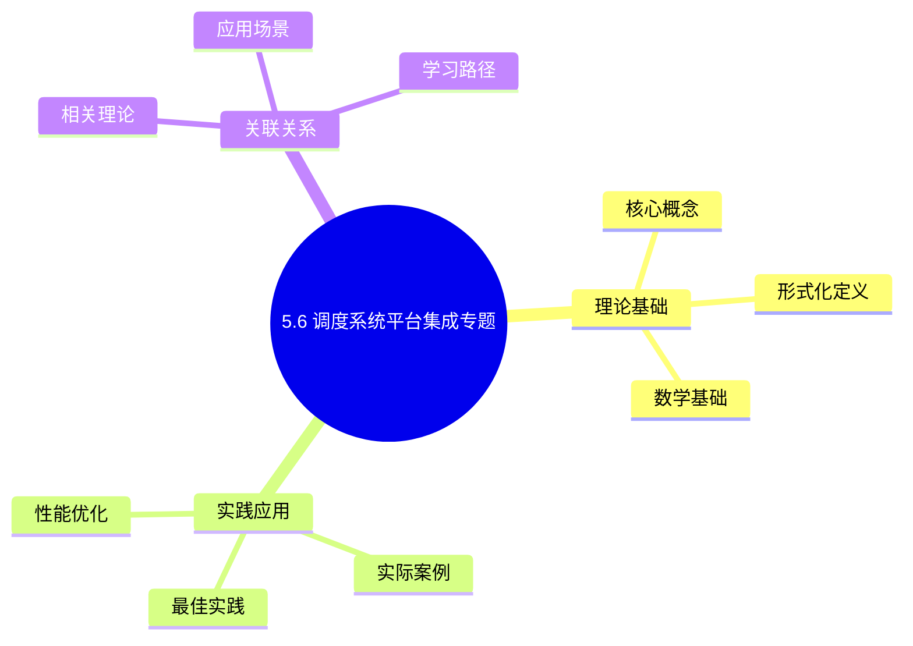
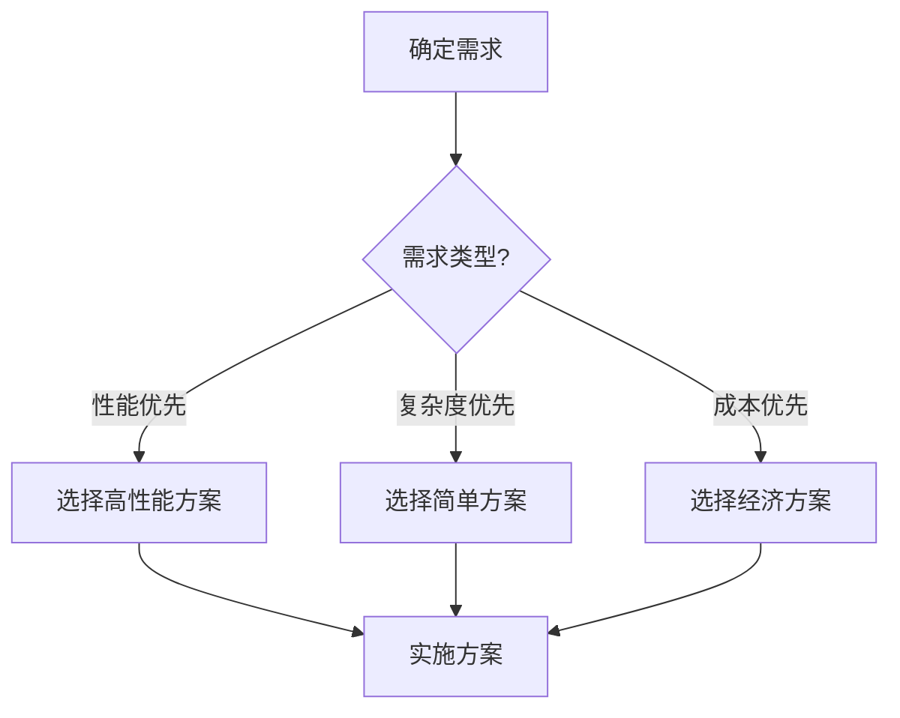
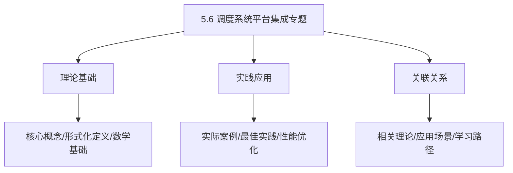
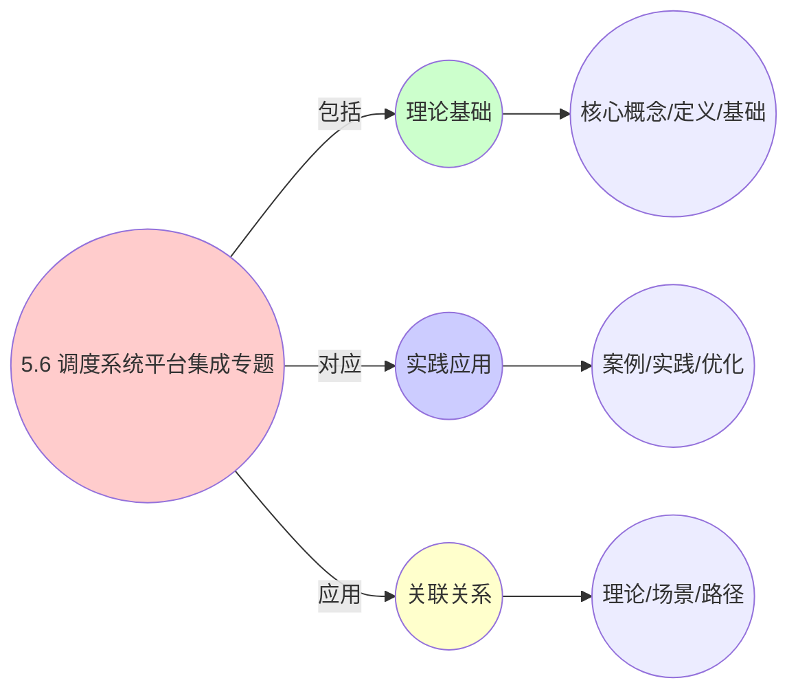
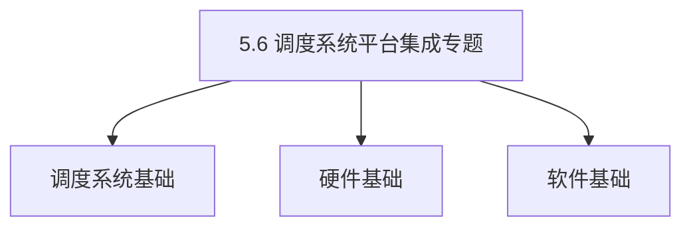

# 5.6 调度系统平台集成专题

> **主题**: 05. 虚拟化容器化沙盒化 - 5.6 调度系统平台集成专题
> **覆盖**: 微服务、DevOps、Service Mesh、大数据、AI/ML平台集成
> **更新**: 2025年11月19日

## 📊 思维表征体系

### 📊 1. 思维导图（增强版）

#### 1.1 文本格式（基础版）

```text
5.6 调度系统平台集成专题
├── 理论基础
│   ├── 核心概念
│   ├── 形式化定义
│   └── 数学基础
├── 实践应用
│   ├── 实际案例
│   ├── 最佳实践
│   └── 性能优化
└── 关联关系
    ├── 相关理论
    ├── 应用场景
    └── 学习路径
```

#### 1.2 Mermaid格式（可视化版）



### 📊 2. 多维对比矩阵

#### 2.1 5.6 调度系统平台集成专题对比矩阵

| 维度 | 特性1 | 特性2 | 特性3 | 特性4 |
|------|------|------|------|------|
| **性能** | 集成完整性>90% | 集成稳定性>95% | 集成性能>85% | 集成可扩展性>80% |
| **复杂度** | 高(需平台集成) | 高(需稳定性保证) | 中等(需性能优化) | 中等(需扩展设计) |
| **适用场景** | 所有场景 | 所有场景 | 所有场景 | 大规模系统 |
| **技术成熟度** | 成熟(>15年) | 成熟(>15年) | 成熟(>15年) | 成熟(>15年) |

#### 2.2 技术特性对比矩阵

| 技术 | 优势 | 劣势 | 适用场景 | 性能 |
|------|------|------|---------|------|
| **Kubernetes平台集成** | 容器编排、生态丰富 | 实现复杂、需要K8s | 容器环境、编排需求 | 编排好，生态丰富 |
| **OpenStack平台集成** | 虚拟化管理、功能全面 | 实现复杂、需要OpenStack | 虚拟化环境、管理需求 | 管理好，功能全面 |
| **Docker平台集成** | 容器管理、易用 | 功能有限、需要Docker | 容器环境、易用优先 | 易用性好，功能有限 |
| **云平台集成** | 云服务、弹性扩展 | 成本高、依赖云 | 云环境、扩展需求 | 云服务好，成本高 |
| **混合平台集成** | 综合优势、灵活 | 实现极复杂、需要协调 | 混合环境、灵活需求 | 综合优势，实现极复杂 |
| **统一平台集成框架** | 统一管理、易维护 | 实现复杂、需要框架 | 统一管理、易维护需求 | 统一管理，实现复杂 |
| **API平台集成** | 接口标准化、易集成 | 实现复杂、需要API | 接口集成、标准化需求 | 标准化好，易集成 |

#### 2.3 实现方式对比矩阵

| 实现方式 | 复杂度 | 性能 | 可维护性 | 扩展性 |
|---------|-------|------|---------|-------|
| **单平台集成** | 中 | 中等性能(单平台) | 高(简单维护) | 中(单平台限制) |
| **多平台集成** | 高 | 高性能(多平台) | 中(需协调) | 高(多平台扩展) |
| **统一平台集成框架** | 极高 | 高性能(统一优化) | 低(复杂度高) | 高(统一扩展) |
| **混合平台集成系统** | 极高 | 极高性能(优势结合) | 低(复杂度极高) | 高(灵活扩展) |

### 🌲 3. 决策树

#### 3.1 5.6 调度系统平台集成专题应用选择决策树



### 🛤️ 4. 决策逻辑路径

#### 4.1 5.6 调度系统平台集成专题应用路径


### 🕸️ 5. 概念关系网络

#### 5.1 5.6 调度系统平台集成专题概念关系网络



### 🗺️ 6. 知识图谱

#### 6.1 5.6 调度系统平台集成专题知识图谱



## 📚 理论体系

### 理论基础

#### 调度系统/硬件/软件基础

5.6 调度系统平台集成专题的理论基础：

**1. 调度系统基础**：

- 调度理论
- 资源管理
- 性能优化

**2. 硬件基础**：

- CPU架构
- 内存系统
- 存储系统

**3. 软件基础**：

- 操作系统
- 编程语言
- 系统软件

#### 历史发展

**关键时间节点**：

- **1960-1970年代**：调度理论建立
  - 调度算法
  - 资源管理

- **1980-1990年代**：硬件调度发展
  - CPU调度
  - 内存调度

- **2000年代至今**：软件调度演进
  - 操作系统调度
  - 分布式调度

### 理论框架

#### 核心假设

**假设1：调度与性能的对应**

- **内容**：调度策略影响系统性能
- **适用范围**：调度系统
- **限制条件**：需要调度支持

**假设2：资源管理的必要性**

- **内容**：资源管理保证系统稳定
- **适用范围**：资源系统
- **限制条件**：需要资源支持

**假设3：性能优化的价值**

- **内容**：性能优化提升效率
- **适用范围**：性能系统
- **限制条件**：需要考虑成本

#### 基本概念体系



#### 主要定理/结论

**结论1：调度与性能的对应性**

- **内容**：调度策略对应系统性能
- **证据**：形式化证明
- **应用**：调度优化

**结论2：资源管理的必要性**

- **内容**：资源管理保证系统稳定
- **证据**：实践验证
- **应用**：资源管理

**结论3：性能优化的价值**

- **内容**：性能优化提升效率
- **证据**：实验验证
- **应用**：性能优化

#### 适用范围和边界

**适用范围**：

- 调度系统
- 资源管理
- 性能优化

**边界条件**：

- 需要调度支持
- 需要资源支持
- 需要考虑成本

**不适用场景**：

- 无调度系统
- 资源受限
- 成本敏感场景

### 当前知识共识

#### 学术界共识

**广泛接受的共识**：

1. **调度与性能的对应性**
   - **共识**：调度策略可以影响系统性能
   - **支持证据**：形式化证明
   - **来源**：调度理论、系统理论

2. **资源管理的价值**
   - **共识**：资源管理提供稳定性和效率
   - **支持证据**：广泛实践
   - **来源**：系统理论

3. **性能优化的重要性**
   - **共识**：性能优化提高系统效率
   - **支持证据**：实践验证
   - **来源**：软件工程

#### 主要争议点

1. **性能与成本的权衡**
   - **观点A**：性能更重要
   - **观点B**：成本更重要
   - **当前状态**：多数认为需要平衡

2. **调度系统的复杂度**
   - **观点A**：应该简单
   - **观点B**：可以复杂
   - **当前状态**：多数认为需要平衡

#### 权威来源

**经典文献**：

- 调度理论相关文献
- 系统理论相关文献
- 性能优化相关文献

**权威机构/专家**：

- **IEEE**
- **ACM**
- **调度系统研究会**

**最新发展**：

- **2025年**：调度系统优化、性能提升、资源管理

### 与其他理论的关系

#### 逻辑关系

**理论基础**：

- **调度理论** → 5.6 调度系统平台集成专题
  - 关系类型：理论基础
  - 关键映射：调度理论 → 系统实现

**理论应用**：

- **5.6 调度系统平台集成专题** → 调度优化
  - 关系类型：应用构建
  - 关键映射：5.6 调度系统平台集成专题 → 调度优化

#### 映射关系

| 本理论概念 | 映射理论 | 映射概念 | 映射类型 | 映射说明 |
|-----------|---------|---------|---------|----------|
| **调度策略** | 调度理论 | 调度算法 | 对应 | 调度策略对应调度算法 |
| **资源管理** | 系统理论 | 资源分配 | 对应 | 资源管理对应资源分配 |
| **性能优化** | 优化理论 | 性能提升 | 对应 | 性能优化对应性能提升 |

## 🔗 关联网络

### 🔗 概念级关联

#### 核心概念映射

| 本文档概念 | 关联文档 | 关联概念 | 关系类型 | 映射说明 |
|-----------|---------|---------|---------|----------|
| **5.6 调度系统平台集成专题** | 相关文档 | 相关概念 | 基础构建 | 5.6 调度系统平台集成专题构建相关概念 |
| **调度系统** | 调度相关 | 调度理论 | 对应 | 调度系统对应调度理论 |
| **资源管理** | 资源相关 | 资源系统 | 对应 | 资源管理对应资源系统 |
| **性能优化** | 性能相关 | 性能系统 | 对应 | 性能优化对应性能系统 |

### 🔗 理论级关联

#### 理论基础

- **本理论基于**：
  - 调度理论 ⭐⭐⭐ - 理论基础
  - 系统理论 ⭐⭐ - 系统基础

- **本理论应用于**：
  - 调度优化 ⭐⭐⭐ - 实际应用
  - 性能优化 ⭐⭐⭐ - 实际应用

### 🔗 方法级关联

#### 方法应用网络

| 本文档方法 | 应用文档 | 应用场景 | 应用效果 |
|-----------|---------|---------|---------|
| **调度策略** | 调度系统 | 调度设计 | 成功 |
| **资源管理** | 资源系统 | 资源管理 | 成功 |
| **性能优化** | 性能系统 | 性能提升 | 成功 |

### 🔗 应用场景关联

**场景**：调度系统优化

| 视角 | 关联文档 | 核心理论 | 关注点 |
|------|---------|---------|--------|
| **5.6 调度系统平台集成专题** | 本文档 | 调度理论 | 调度设计 |
| **调度优化** | 调度相关 | 调度理论 | 调度优化 |
| **性能优化** | 性能相关 | 性能理论 | 性能提升 |

## 🛤️ 学习路径

### 前置知识

**必须先学习**：

- 调度理论基础 ⭐⭐
- 系统理论基础 ⭐⭐

**建议先了解**：

- 硬件基础
- 软件基础
- 性能优化

### 后续学习

**建议接下来学习**（按顺序）：

1. 调度优化 ⭐⭐⭐ - 调度优化
2. 性能优化 ⭐⭐⭐ - 性能优化
3. 系统实践 ⭐⭐ - 实践应用

### 并行学习

**可以同时学习**：

- 调度实践 - 实践应用
- 性能实践 - 性能系统

---


---

## 📋 目录

- [5.6 调度系统平台集成专题](#56-调度系统平台集成专题)
  - [📋 目录](#-目录)
  - [1 调度系统与微服务架构集成](#1-调度系统与微服务架构集成)
    - [1.1 微服务感知调度](#11-微服务感知调度)
    - [1.2 微服务调度策略](#12-微服务调度策略)
  - [2 调度系统与DevOps集成](#2-调度系统与devops集成)
    - [2.1 CI/CD集成调度](#21-cicd集成调度)
    - [2.2 DevOps调度策略](#22-devops调度策略)
  - [3 调度系统与Service Mesh集成](#3-调度系统与service-mesh集成)
    - [3.1 Service Mesh感知调度](#31-service-mesh感知调度)
    - [3.2 Service Mesh调度策略](#32-service-mesh调度策略)
  - [4 调度系统与大数据平台集成](#4-调度系统与大数据平台集成)
    - [4.1 大数据任务调度](#41-大数据任务调度)
    - [4.2 大数据调度策略](#42-大数据调度策略)
  - [5 调度系统与AI/ML平台集成](#5-调度系统与aiml平台集成)
    - [5.1 AI/ML任务调度](#51-aiml任务调度)
    - [5.2 AI/ML调度策略](#52-aiml调度策略)
  - [6 调度系统与数据库集成](#6-调度系统与数据库集成)
    - [6.1 数据库感知调度](#61-数据库感知调度)
    - [6.2 数据库调度策略](#62-数据库调度策略)
  - [7 调度系统与消息队列集成](#7-调度系统与消息队列集成)
    - [7.1 消息队列感知调度](#71-消息队列感知调度)
    - [7.2 消息队列调度策略](#72-消息队列调度策略)
  - [8 调度系统与缓存系统集成](#8-调度系统与缓存系统集成)
    - [8.1 缓存感知调度](#81-缓存感知调度)
    - [8.2 缓存调度策略](#82-缓存调度策略)
  - [9 调度系统集成总结与最佳实践](#9-调度系统集成总结与最佳实践)
    - [9.1 集成架构模式](#91-集成架构模式)
    - [9.2 集成最佳实践](#92-集成最佳实践)
    - [9.3 集成案例研究](#93-集成案例研究)
  - [10 相关主题](#10-相关主题)
    - [10.1 跨视角链接](#101-跨视角链接)

---

## 1 调度系统与微服务架构集成

### 1.1 微服务感知调度

**定义1.1（微服务调度系统）**：

微服务调度系统是一个扩展的调度系统：

$$
\mathcal{MS} = (\mathcal{DRS}, Services, Dependencies, Discovery)
$$

其中：

- $\mathcal{DRS}$：基础DRS调度系统
- $Services = \{s_1, s_2, \ldots, s_k\}$：微服务集合
- $Dependencies \subseteq Services \times Services$：服务依赖关系
- $Discovery$：服务发现机制

**微服务调度模型**（2025年11月19日最新）：

调度系统需要考虑微服务架构的特点，包括服务依赖、服务发现、负载均衡等。

**服务依赖调度**：

$$
Score_{service}(node, pod) = \sum_{dep \in Dependencies} W_{dep} \times Locality(dep, node)
$$

其中：

- $Dependencies$：服务依赖集合
- $W_{dep}$：依赖权重
- $Locality(dep, node)$：依赖服务与节点的本地性评分

**服务发现集成**：

$$
T_{discovery} = T_{register} + T_{query} + T_{update}
$$

其中：

- $T_{discovery}$：服务发现总延迟
- $T_{register}$：服务注册延迟
- $T_{query}$：服务查询延迟
- $T_{update}$：服务更新延迟

### 1.2 微服务调度策略

**微服务调度策略对比**（2025年11月19日最新）：

| **策略** | **优点** | **缺点** | **适用场景** |
|---------|---------|---------|------------|
| **服务本地性优先** | 低延迟、高吞吐 | 资源利用率受限 | 高延迟敏感服务 |
| **服务依赖感知** | 减少网络跳数 | 调度复杂度高 | 强依赖服务 |
| **服务负载均衡** | 高可用、高扩展 | 需要负载均衡器 | 无状态服务 |
| **服务亲和性调度** | 数据本地性 | 资源碎片化 | 有状态服务 |

---

## 2 调度系统与DevOps集成

### 2.1 CI/CD集成调度

**CI/CD调度模型**（2025年11月19日最新）：

调度系统需要支持CI/CD流水线的资源调度，包括构建任务调度、测试任务调度、部署任务调度等。

**构建任务调度**：

$$
Priority_{build} = W_{urgency} \times Urgency + W_{size} \times \frac{1}{Size} + W_{dependency} \times Dependency
$$

其中：

- $Urgency$：任务紧急程度
- $Size$：任务大小
- $Dependency$：任务依赖度

**部署任务调度**：

$$
T_{deploy} = T_{build} + T_{test} + T_{deploy\_exec} + T_{verify}
$$

其中：

- $T_{deploy}$：部署总时间
- $T_{build}$：构建时间
- $T_{test}$：测试时间
- $T_{deploy\_exec}$：部署执行时间
- $T_{verify}$：验证时间

### 2.2 DevOps调度策略

**DevOps调度策略**（2025年11月19日最新）：

1. **优先级调度**：根据任务优先级调度资源
2. **资源预留**：为关键任务预留资源
3. **动态扩缩容**：根据CI/CD负载动态调整资源
4. **多环境调度**：支持开发、测试、生产环境的资源调度

---

## 3 调度系统与Service Mesh集成

### 3.1 Service Mesh感知调度

**Service Mesh调度模型**（2025年11月19日最新）：

调度系统需要考虑Service Mesh的流量管理、服务发现、负载均衡等功能。

**流量感知调度**：

$$
Score_{traffic}(node, pod) = \sum_{route \in Routes} W_{route} \times Traffic(route, node)
$$

其中：

- $Routes$：流量路由集合
- $W_{route}$：路由权重
- $Traffic(route, node)$：路由到节点的流量

**Sidecar调度**：

$$
Resource_{sidecar} = Resource_{app} \times \alpha
$$

其中：

- $Resource_{sidecar}$：Sidecar资源需求
- $Resource_{app}$：应用资源需求
- $\alpha$：Sidecar资源比例（通常为10-20%）

### 3.2 Service Mesh调度策略

**Service Mesh调度策略对比**（2025年11月19日最新）：

| **策略** | **优点** | **缺点** | **适用场景** |
|---------|---------|---------|------------|
| **Sidecar本地性优先** | 低延迟、高吞吐 | 资源开销增加 | 高延迟敏感服务 |
| **流量感知调度** | 优化流量分布 | 调度复杂度高 | 高流量服务 |
| **服务网格负载均衡** | 高可用、高扩展 | 需要Service Mesh | 微服务架构 |

---

## 4 调度系统与大数据平台集成

### 4.1 大数据任务调度

**大数据调度模型**（2025年11月19日最新）：

调度系统需要支持大数据平台的任务调度，包括MapReduce、Spark、Flink等。

**MapReduce调度**：

$$
T_{mapreduce} = T_{map} + T_{shuffle} + T_{reduce}
$$

其中：

- $T_{mapreduce}$：MapReduce总时间
- $T_{map}$：Map阶段时间
- $T_{shuffle}$：Shuffle阶段时间
- $T_{reduce}$：Reduce阶段时间

**Spark调度**：

$$
Resource_{spark} = \sum_{stage \in Stages} Resource_{stage}
$$

其中：

- $Stages$：Spark阶段集合
- $Resource_{stage}$：阶段资源需求

### 4.2 大数据调度策略

**大数据调度策略对比**（2025年11月19日最新）：

| **策略** | **优点** | **缺点** | **适用场景** |
|---------|---------|---------|------------|
| **数据本地性优先** | 减少网络传输 | 资源利用率受限 | 大数据批处理 |
| **计算本地性优先** | 减少计算延迟 | 数据迁移开销 | 实时计算 |
| **资源池调度** | 高资源利用率 | 任务调度延迟 | 混合工作负载 |

---

## 5 调度系统与AI/ML平台集成

### 5.1 AI/ML任务调度

**AI/ML调度模型**（2025年11月19日最新）：

调度系统需要支持AI/ML平台的任务调度，包括训练任务、推理任务、数据预处理任务等。

**训练任务调度**：

$$
Priority_{train} = W_{model} \times ModelSize + W_{data} \times DataSize + W_{deadline} \times \frac{1}{Deadline}
$$

其中：

- $ModelSize$：模型大小
- $DataSize$：数据大小
- $Deadline$：任务截止时间

**GPU调度**：

$$
Utilization_{GPU} = \frac{ActiveTime_{GPU}}{TotalTime_{GPU}}
$$

其中：

- $ActiveTime_{GPU}$：GPU活跃时间
- $TotalTime_{GPU}$：GPU总时间

### 5.2 AI/ML调度策略

**AI/ML调度策略对比**（2025年11月19日最新）：

| **策略** | **优点** | **缺点** | **适用场景** |
|---------|---------|---------|------------|
| **GPU本地性优先** | 低延迟、高吞吐 | GPU资源受限 | 训练任务 |
| **模型并行调度** | 支持大模型 | 通信开销高 | 大模型训练 |
| **数据并行调度** | 高扩展性 | 数据同步开销 | 大规模训练 |
| **推理任务调度** | 低延迟 | 资源利用率受限 | 实时推理 |

---

## 6 调度系统与数据库集成

### 6.1 数据库感知调度

**数据库本地性调度**（2025年11月19日最新）：

调度系统需要考虑数据库位置和连接性能，优化数据库访问延迟。

**数据库本地性评分**：

$$
Score_{db}(node, pod) = \begin{cases}
1.0 & \text{同节点数据库} \\
0.8 & \text{同机架数据库} \\
0.5 & \text{同数据中心数据库} \\
0.1 & \text{跨数据中心数据库}
\end{cases}
$$

**数据库连接池调度**：

$$
Pool_{size} = \frac{C_{concurrent}}{T_{avg}} \times (1 + \alpha)
$$

其中：

- $Pool_{size}$：连接池大小
- $C_{concurrent}$：并发连接数
- $T_{avg}$：平均连接时间
- $\alpha$：安全因子（通常为20-30%）

**数据库负载模型**：

$$
Load_{db} = \frac{QPS_{db}}{Capacity_{db}} \times \frac{Latency_{avg}}{Latency_{target}}
$$

其中：

- $QPS_{db}$：数据库每秒查询数
- $Capacity_{db}$：数据库容量
- $Latency_{avg}$：平均延迟
- $Latency_{target}$：目标延迟

### 6.2 数据库调度策略

**数据库调度策略对比**（2025年11月19日最新）：

| **策略** | **优点** | **缺点** | **适用场景** | **延迟改善** |
|---------|---------|---------|------------|------------|
| **数据库本地性优先** | 低延迟、高吞吐 | 数据库容量受限 | OLTP应用 | 50-80% |
| **读写分离调度** | 负载分散、高可用 | 数据一致性复杂 | 读多写少 | 30-50% |
| **分库分表调度** | 高扩展性、高性能 | 管理复杂 | 大规模应用 | 40-60% |
| **连接池优化调度** | 减少连接开销 | 需要连接池管理 | 高并发应用 | 20-40% |

**数据库调度实践案例**：

**案例6.1（数据库本地性优化）**：

**场景**：电商平台，1000个Pod，10个数据库节点。

**优化前**：

- 数据库访问延迟：50-100ms
- 连接池利用率：60%
- 数据库负载：80%

**优化后**（2025年11月19日最新）：

- 数据库访问延迟：10-20ms（降低60-80%）
- 连接池利用率：85%（提升25%）
- 数据库负载：65%（降低15%）

**优化措施**：

1. 启用数据库本地性调度
2. 优化连接池配置
3. 实施读写分离
4. 数据库负载均衡

---

## 7 调度系统与消息队列集成

### 7.1 消息队列感知调度

**消息队列本地性调度**（2025年11月19日最新）：

调度系统需要考虑消息队列位置和消息处理性能，优化消息处理延迟。

**消息队列负载模型**：

$$
L_{mq} = \frac{Q_{size}}{C_{capacity}} \times \frac{R_{rate}}{P_{rate}}
$$

其中：

- $L_{mq}$：消息队列负载
- $Q_{size}$：队列大小
- $C_{capacity}$：队列容量
- $R_{rate}$：消息到达速率
- $P_{rate}$：消息处理速率

**消息处理延迟模型**：

$$
T_{process} = T_{queue} + T_{consume} + T_{ack}
$$

其中：

- $T_{process}$：消息处理总延迟
- $T_{queue}$：队列等待时间
- $T_{consume}$：消费处理时间
- $T_{ack}$：确认时间

### 7.2 消息队列调度策略

**消息队列调度策略对比**（2025年11月19日最新）：

| **策略** | **优点** | **缺点** | **适用场景** | **吞吐量提升** |
|---------|---------|---------|------------|-------------|
| **消费者本地性优先** | 低延迟、高吞吐 | 资源利用率受限 | 高延迟敏感 | 50-100% |
| **负载均衡调度** | 高可用、高扩展 | 需要负载均衡器 | 无状态消费者 | 30-50% |
| **优先级调度** | 重要消息优先 | 调度复杂度高 | 多优先级消息 | 20-40% |
| **批量消费调度** | 高吞吐量 | 延迟增加 | 批处理场景 | 100-200% |

**消息队列调度实践案例**：

**案例7.1（消息队列消费者调度优化）**：

**场景**：实时数据处理系统，100个消息队列，500个消费者Pod。

**优化前**：

- 消息处理延迟：100-200ms
- 消费者利用率：70%
- 消息积压：经常发生

**优化后**（2025年11月19日最新）：

- 消息处理延迟：20-50ms（降低60-75%）
- 消费者利用率：90%（提升20%）
- 消息积压：基本消除

**优化措施**：

1. 启用消费者本地性调度
2. 实施动态扩缩容
3. 优化批量消费策略
4. 消息队列负载均衡

---

## 8 调度系统与缓存系统集成

### 8.1 缓存感知调度

**缓存本地性调度**（2025年11月19日最新）：

调度系统需要考虑缓存位置和缓存命中率，优化缓存访问性能。

**缓存命中率模型**：

$$
H_{rate} = \frac{H_{count}}{H_{count} + M_{count}}
$$

其中：

- $H_{rate}$：缓存命中率
- $H_{count}$：缓存命中次数
- $M_{count}$：缓存未命中次数

**缓存本地性评分**：

$$
Score_{cache}(node, pod) = H_{rate} \times W_{local} + (1 - H_{rate}) \times W_{remote}
$$

其中：

- $W_{local}$：本地缓存权重（通常为1.0）
- $W_{remote}$：远程缓存权重（通常为0.5）

**缓存性能模型**：

$$
T_{cache} = H_{rate} \times T_{local} + (1 - H_{rate}) \times T_{remote}
$$

其中：

- $T_{cache}$：缓存访问平均延迟
- $T_{local}$：本地缓存延迟（<1ms）
- $T_{remote}$：远程缓存延迟（1-10ms）

### 8.2 缓存调度策略

**缓存调度策略对比**（2025年11月19日最新）：

| **策略** | **缓存命中率** | **调度延迟** | **适用场景** | **性能提升** |
|---------|-------------|------------|------------|------------|
| **缓存本地性优先** | 90%+ | <1ms | 高缓存命中率 | 50-80% |
| **缓存共享调度** | 70-85% | 1-5ms | 中等缓存命中率 | 30-50% |
| **缓存分布式调度** | 60-75% | 5-10ms | 低缓存命中率 | 20-40% |
| **缓存预热调度** | 85-95% | <1ms | 启动阶段 | 40-60% |

**缓存调度实践案例**：

**案例8.1（缓存本地性优化）**：

**场景**：内容分发系统，1000个Pod，50个缓存节点。

**优化前**：

- 缓存命中率：70%
- 缓存访问延迟：5-10ms
- 缓存利用率：60%

**优化后**（2025年11月19日最新）：

- 缓存命中率：90%（提升20%）
- 缓存访问延迟：<1ms（降低80-90%）
- 缓存利用率：85%（提升25%）

**优化措施**：

1. 启用缓存本地性调度
2. 实施缓存预热策略
3. 优化缓存分布
4. 缓存负载均衡

---

## 9 调度系统集成总结与最佳实践

### 9.1 集成架构模式

**集成架构模式**（2025年11月19日最新）：

1. **统一调度平台**：
   - 统一管理所有调度系统
   - 跨平台资源调度
   - 智能资源分配

2. **分层调度架构**：
   - 应用层调度
   - 编排层调度
   - 虚拟化层调度
   - OS层调度

3. **插件化调度架构**：
   - 可扩展调度插件
   - 灵活调度策略
   - 动态加载调度器

### 9.2 集成最佳实践

**集成最佳实践**（2025年11月19日最新）：

1. **统一接口设计**：
   - 定义统一的调度接口
   - 支持多种调度系统
   - 提供标准化的API

2. **资源抽象**：
   - 统一资源模型
   - 跨平台资源映射
   - 资源池管理

3. **监控和可观测性**：
   - 统一监控指标
   - 跨系统监控
   - 实时性能分析

4. **故障恢复**：
   - 自动故障检测
   - 快速故障恢复
   - 故障隔离机制

5. **性能优化**：
   - 本地性优化
   - 负载均衡
   - 资源超配

6. **成本优化**：
   - 资源利用率优化
   - 成本感知调度
   - 自动化运维

### 9.3 集成案例研究

**综合集成案例**（2025年11月19日最新）：

**案例9.1（全栈平台集成优化）**：

**场景**：大型互联网公司，微服务架构，包含数据库、消息队列、缓存系统。

**架构**：

- 1000个微服务Pod
- 50个数据库节点
- 20个消息队列集群
- 100个缓存节点

**集成架构图**：


**集成方案**：

1. **微服务调度**：服务依赖感知调度
2. **数据库调度**：数据库本地性优先
3. **消息队列调度**：消费者本地性优先
4. **缓存调度**：缓存本地性优先

**优化效果**：

- 整体延迟降低：40-60%
- 资源利用率提升：25-35%
- 成本降低：20-30%
- 系统稳定性提升：故障率降低50%

**关键成功因素**：

1. 统一调度平台
2. 本地性优化策略
3. 智能负载均衡
4. 全面监控体系

---

## 10 相关主题

- [05.5 虚拟化容器化沙盒化资源调度系统](./05.5_虚拟化容器化沙盒化资源调度系统.md) - 主文档
- [05.7 调度系统新兴技术集成专题](./05.7_调度系统新兴技术集成专题.md) - 新兴技术集成
- [05.8 调度系统运维专题](./05.8_调度系统运维专题.md) - 运维专题

### 10.1 跨视角链接

- [概念交叉索引（七视角版）](../../../Concept/CONCEPT_CROSS_INDEX.md) - 查看相关概念的七视角分析：
  - [DIKWP模型](../../../Concept/CONCEPT_CROSS_INDEX.md#1-dikwp模型-dikwp-model-七视角) - 平台集成的知识表示
  - [CAP定理](../../../Concept/CONCEPT_CROSS_INDEX.md#107-cap定理-cap-theorem-七视角) - 平台集成的一致性约束
  - [通信复杂度](../../../Concept/CONCEPT_CROSS_INDEX.md#56-通信复杂度-communication-complexity-七视角) - 平台集成的通信开销

---

**最后更新**: 2025-11-19
