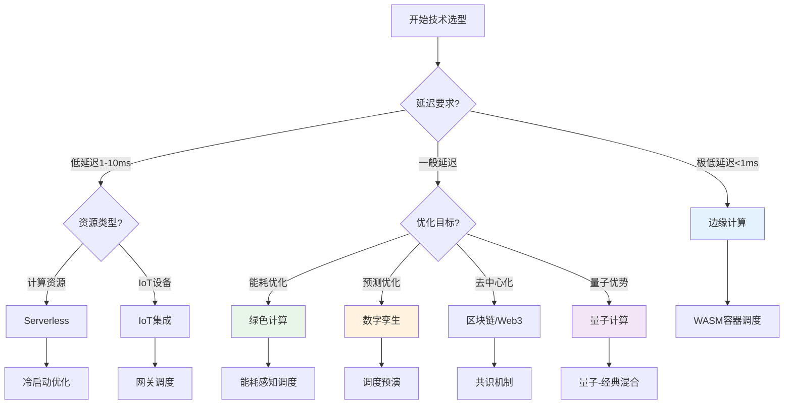

# 5.7 调度系统新兴技术集成专题

> **主题**: 05. 虚拟化容器化沙盒化 - 5.7 调度系统新兴技术集成专题
> **覆盖**: 边缘计算、Serverless、IoT、绿色计算、数字孪生、量子计算、区块链、Web3集成
> **更新**: 2025年11月19日

---

## 📋 目录

- [5.7 调度系统新兴技术集成专题](#57-调度系统新兴技术集成专题)
  - [📋 目录](#-目录)
  - [1 调度系统与边缘计算集成](#1-调度系统与边缘计算集成)
    - [1.1 边缘计算调度模型](#11-边缘计算调度模型)
    - [1.2 边缘计算调度策略](#12-边缘计算调度策略)
  - [2 调度系统与Serverless集成](#2-调度系统与serverless集成)
    - [2.1 Serverless调度模型](#21-serverless调度模型)
    - [2.2 Serverless调度策略](#22-serverless调度策略)
  - [3 调度系统与IoT集成](#3-调度系统与iot集成)
    - [3.1 IoT调度模型](#31-iot调度模型)
    - [3.2 IoT调度策略](#32-iot调度策略)
  - [4 调度系统与绿色计算集成](#4-调度系统与绿色计算集成)
    - [4.1 绿色计算调度模型](#41-绿色计算调度模型)
    - [4.2 绿色计算调度策略](#42-绿色计算调度策略)
  - [5 调度系统与能源管理集成](#5-调度系统与能源管理集成)
    - [5.1 能源管理调度模型](#51-能源管理调度模型)
    - [5.2 能源管理调度策略](#52-能源管理调度策略)
  - [6 调度系统与碳中和集成](#6-调度系统与碳中和集成)
    - [6.1 碳中和调度模型](#61-碳中和调度模型)
    - [6.2 碳中和调度策略](#62-碳中和调度策略)
  - [7 调度系统与数字孪生集成](#7-调度系统与数字孪生集成)
    - [7.1 数字孪生调度模型](#71-数字孪生调度模型)
    - [7.2 数字孪生调度策略](#72-数字孪生调度策略)
  - [8 调度系统与量子计算集成](#8-调度系统与量子计算集成)
    - [8.1 量子计算调度模型](#81-量子计算调度模型)
    - [8.2 量子计算调度策略](#82-量子计算调度策略)
  - [9 调度系统与区块链集成](#9-调度系统与区块链集成)
    - [9.1 区块链调度模型](#91-区块链调度模型)
    - [9.2 区块链调度策略](#92-区块链调度策略)
  - [10 调度系统与Web3集成](#10-调度系统与web3集成)
    - [10.1 Web3调度模型](#101-web3调度模型)
    - [10.2 Web3调度策略](#102-web3调度策略)
  - [11 新兴技术集成总结](#11-新兴技术集成总结)
    - [11.1 新兴技术集成对比](#111-新兴技术集成对比)
    - [11.2 集成最佳实践](#112-集成最佳实践)
  - [12 新兴技术集成实践案例](#12-新兴技术集成实践案例)
    - [12.1 边缘计算调度优化案例](#121-边缘计算调度优化案例)
    - [12.2 绿色计算调度优化案例](#122-绿色计算调度优化案例)
    - [12.3 数字孪生调度优化案例](#123-数字孪生调度优化案例)
  - [13 新兴技术集成实施路线图](#13-新兴技术集成实施路线图)
    - [13.1 技术选型决策树](#131-技术选型决策树)
    - [13.2 实施阶段规划](#132-实施阶段规划)
    - [13.3 风险评估与应对](#133-风险评估与应对)
  - [14 相关主题](#14-相关主题)

---

## 1 调度系统与边缘计算集成

### 1.1 边缘计算调度模型

**边缘计算调度特点**（2025年11月19日最新）：

边缘计算环境具有资源受限、网络不稳定、延迟敏感等特点，需要特殊的调度策略。

**边缘节点资源模型**：

$$
Resource_{edge} = \{CPU_{edge}, Memory_{edge}, Storage_{edge}, Network_{edge}\}
$$

其中：

- $CPU_{edge}$：边缘节点CPU资源（通常为ARM架构，2-8核）
- $Memory_{edge}$：边缘节点内存资源（通常为2-8GB）
- $Storage_{edge}$：边缘节点存储资源（通常为16-64GB）
- $Network_{edge}$：边缘节点网络资源（通常为4G/5G/WiFi）

**边缘调度延迟模型**：

$$
T_{edge} = T_{local} + T_{network} + T_{cloud}
$$

其中：

- $T_{edge}$：边缘调度总延迟
- $T_{local}$：本地调度延迟（<1ms）
- $T_{network}$：网络传输延迟（10-100ms）
- $T_{cloud}$：云端调度延迟（50-200ms）

### 1.2 边缘计算调度策略

**边缘计算调度策略对比**（2025年11月19日最新）：

| **策略** | **优点** | **缺点** | **适用场景** |
|---------|---------|---------|------------|
| **本地优先调度** | 低延迟、离线可用 | 资源受限 | 实时应用 |
| **云端协同调度** | 资源丰富、智能调度 | 网络依赖 | 混合应用 |
| **分层调度** | 平衡延迟和资源 | 复杂度高 | 复杂应用 |
| **WASM容器调度** | 极低资源占用 | 功能受限 | 轻量级应用 |

---

## 2 调度系统与Serverless集成

### 2.1 Serverless调度模型

**Serverless调度特点**（2025年11月19日最新）：

Serverless环境具有按需执行、自动扩缩容、按使用付费等特点，需要高效的冷启动调度。

**冷启动调度模型**：

$$
T_{cold\_start} = T_{init} + T_{load} + T_{warmup}
$$

其中：

- $T_{cold\_start}$：冷启动总时间
- $T_{init}$：初始化时间（容器/VM创建）
- $T_{load}$：代码加载时间
- $T_{warmup}$：预热时间

**Serverless资源模型**：

$$
Cost_{serverless} = \sum_{invocation} (T_{execution} \times Price_{unit})
$$

其中：

- $Cost_{serverless}$：Serverless总成本
- $T_{execution}$：执行时间
- $Price_{unit}$：单位时间价格

### 2.2 Serverless调度策略

**Serverless调度策略对比**（2025年11月19日最新）：

| **策略** | **优点** | **缺点** | **适用场景** |
|---------|---------|---------|------------|
| **按需调度** | 成本低、弹性高 | 冷启动延迟 | 低频应用 |
| **预热调度** | 低延迟、快速响应 | 资源浪费 | 高频应用 |
| **混合调度** | 平衡成本和延迟 | 复杂度高 | 混合工作负载 |
| **容器池调度** | 低冷启动延迟 | 资源占用 | 高并发应用 |

---

## 3 调度系统与IoT集成

### 3.1 IoT调度模型

**IoT调度特点**（2025年11月19日最新）：

IoT环境具有设备数量大、数据量大、实时性要求高等特点，需要高效的设备调度和数据调度。

**IoT设备调度模型**：

$$
N_{devices} = \sum_{gateway} N_{gateway\_devices}
$$

其中：

- $N_{devices}$：总设备数量
- $N_{gateway\_devices}$：每个网关的设备数量

**IoT数据调度模型**：

$$
Throughput_{iot} = \sum_{device} DataRate_{device}
$$

其中：

- $Throughput_{iot}$：IoT总吞吐量
- $DataRate_{device}$：每个设备的数据速率

### 3.2 IoT调度策略

**IoT调度策略对比**（2025年11月19日最新）：

| **策略** | **优点** | **缺点** | **适用场景** |
|---------|---------|---------|------------|
| **网关本地调度** | 低延迟、离线可用 | 资源受限 | 实时数据采集 |
| **云端集中调度** | 资源丰富、智能分析 | 网络依赖 | 数据分析 |
| **边缘-云协同调度** | 平衡延迟和分析 | 复杂度高 | 混合应用 |
| **设备分组调度** | 高效资源利用 | 管理复杂 | 大规模设备 |

---

## 4 调度系统与绿色计算集成

### 4.1 绿色计算调度模型

**绿色计算调度特点**（2025年11月19日最新）：

绿色计算调度旨在优化能耗、降低碳排放，实现可持续的调度策略。

**能耗模型**：

$$
E_{total} = \sum_{node} (E_{idle} + E_{active} \times U_{node})
$$

其中：

- $E_{total}$：总能耗
- $E_{idle}$：节点空闲能耗
- $E_{active}$：节点活跃能耗
- $U_{node}$：节点资源利用率

**碳排放模型**：

$$
C_{carbon} = E_{total} \times F_{carbon}
$$

其中：

- $C_{carbon}$：碳排放量
- $F_{carbon}$：碳排放因子（取决于能源类型）

### 4.2 绿色计算调度策略

**绿色计算调度策略对比**（2025年11月19日最新）：

| **策略** | **能耗降低** | **性能影响** | **实施难度** | **适用场景** |
|---------|------------|------------|------------|------------|
| **能耗感知调度** | 20-30% | <5% | 中 | 一般工作负载 |
| **时间分片调度** | 30-40% | 10-15% | 中 | 批处理任务 |
| **资源整合调度** | 40-50% | 5-10% | 高 | 低负载时段 |
| **可再生能源调度** | 50-70% | 0% | 高 | 有可再生能源 |

---

## 5 调度系统与能源管理集成

### 5.1 能源管理调度模型

**能源管理调度特点**（2025年11月19日最新）：

能源管理调度需要考虑电力成本、能源可用性、能源类型等因素。

**电力成本模型**：

$$
Cost_{power} = \sum_{time} (E_{time} \times Price_{time})
$$

其中：

- $Cost_{power}$：电力总成本
- $E_{time}$：时段能耗
- $Price_{time}$：时段电价

**能源可用性模型**：

$$
Availability_{energy} = \frac{Energy_{available}}{Energy_{required}}
$$

其中：

- $Energy_{available}$：可用能源
- $Energy_{required}$：所需能源

### 5.2 能源管理调度策略

**能源管理调度策略对比**（2025年11月19日最新）：

| **策略** | **成本降低** | **复杂度** | **适用场景** |
|---------|------------|----------|------------|
| **分时电价调度** | 20-30% | 中 | 有分时电价 |
| **可再生能源优先** | 30-50% | 高 | 有可再生能源 |
| **能源存储调度** | 15-25% | 高 | 有能源存储 |
| **需求响应调度** | 10-20% | 中 | 参与需求响应 |

---

## 6 调度系统与碳中和集成

### 6.1 碳中和调度模型

**碳中和调度特点**（2025年11月19日最新）：

碳中和调度旨在通过优化调度策略，实现净零碳排放目标。

**碳排放追踪模型**：

$$
C_{track} = \sum_{workload} (E_{workload} \times F_{carbon\_workload})
$$

其中：

- $C_{track}$：追踪的碳排放
- $E_{workload}$：工作负载能耗
- $F_{carbon\_workload}$：工作负载碳排放因子

**碳中和目标模型**：

$$
C_{net} = C_{emission} - C_{offset} \leq 0
$$

其中：

- $C_{net}$：净碳排放
- $C_{emission}$：排放的碳
- $C_{offset}$：抵消的碳

### 6.2 碳中和调度策略

**碳中和调度策略**（2025年11月19日最新）：

1. **可再生能源优先**：优先使用可再生能源
2. **能耗优化**：优化能耗，减少碳排放
3. **碳抵消**：通过植树、碳捕获等方式抵消碳排放
4. **碳交易**：参与碳交易市场，购买碳信用

---

## 7 调度系统与数字孪生集成

### 7.1 数字孪生调度模型

**数字孪生调度特点**（2025年11月19日最新）：

数字孪生调度通过构建物理系统的虚拟副本，在虚拟环境中预演调度策略，优化调度决策。

**数字孪生模型**：

$$
DT_{system} = \{M_{physical}, M_{virtual}, M_{mapping}, M_{simulation}\}
$$

其中：

- $M_{physical}$：物理系统模型
- $M_{virtual}$：虚拟系统模型
- $M_{mapping}$：物理-虚拟映射模型
- $M_{simulation}$：仿真模型

**调度预演模型**：

$$
Result_{simulation} = Simulate(Schedule_{strategy}, DT_{system})
$$

其中：

- $Result_{simulation}$：仿真结果
- $Schedule_{strategy}$：调度策略
- $DT_{system}$：数字孪生系统

### 7.2 数字孪生调度策略

**数字孪生调度策略对比**（2025年11月19日最新）：

| **策略** | **预演准确率** | **优化效果** | **实施复杂度** | **适用场景** |
|---------|-------------|------------|-------------|------------|
| **实时同步数字孪生** | 95%+ | 20-30% | 高 | 关键系统 |
| **预测性数字孪生** | 90-95% | 15-25% | 中 | 一般系统 |
| **离线仿真数字孪生** | 85-90% | 10-20% | 低 | 非关键系统 |

---

## 8 调度系统与量子计算集成

### 8.1 量子计算调度模型

**量子计算调度特点**（2025年11月19日最新）：

量子计算调度需要考虑量子计算机的特殊性，包括量子比特的相干性、量子门操作、量子纠错等。

**量子资源模型**：

$$
Q_{resource} = \{Q_{qubits}, Q_{gates}, Q_{coherence}, Q_{error}\}
$$

其中：

- $Q_{qubits}$：量子比特数量
- $Q_{gates}$：量子门操作
- $Q_{coherence}$：量子相干时间
- $Q_{error}$：量子错误率

**量子-经典混合调度模型**：

$$
Schedule_{hybrid} = Schedule_{quantum} + Schedule_{classical}
$$

其中：

- $Schedule_{quantum}$：量子计算调度
- $Schedule_{classical}$：经典计算调度

### 8.2 量子计算调度策略

**量子计算调度策略对比**（2025年11月19日最新）：

| **策略** | **量子利用率** | **调度延迟** | **复杂度** | **适用场景** |
|---------|-------------|------------|----------|------------|
| **量子优先调度** | 80-90% | <1μs | 高 | 量子优势任务 |
| **混合调度** | 60-80% | 1-10μs | 中 | 混合工作负载 |
| **经典优先调度** | 40-60% | 10-100μs | 低 | 经典任务为主 |

---

## 9 调度系统与区块链集成

### 9.1 区块链调度模型

**区块链调度特点**（2025年11月19日最新）：

区块链调度需要考虑去中心化、共识机制、智能合约等特点，实现可信的调度决策。

**区块链调度模型**：

$$
BC_{schedule} = \{Nodes, Consensus, SmartContract, Ledger\}
$$

其中：

- $Nodes$：区块链节点
- $Consensus$：共识机制
- $SmartContract$：智能合约
- $Ledger$：账本

**去中心化调度模型**：

$$
Decision_{decentralized} = Consensus(Schedule_{proposals}, Nodes)
$$

其中：

- $Decision_{decentralized}$：去中心化调度决策
- $Schedule_{proposals}$：调度提案集合
- $Nodes$：参与节点

### 9.2 区块链调度策略

**区块链调度策略对比**（2025年11月19日最新）：

| **策略** | **去中心化度** | **调度延迟** | **成本** | **适用场景** |
|---------|-------------|------------|---------|------------|
| **完全去中心化** | 100% | 秒级 | 高 | 高信任要求 |
| **部分去中心化** | 50-80% | 毫秒级 | 中 | 一般场景 |
| **联盟链调度** | 30-50% | 毫秒级 | 中 | 企业场景 |

---

## 10 调度系统与Web3集成

### 10.1 Web3调度模型

**Web3调度特点**（2025年11月19日最新）：

Web3调度需要考虑去中心化、用户所有权、代币经济等特点，实现用户自主的调度决策。

**Web3资源模型**：

$$
Web3_{resource} = \{Compute, Storage, Network, Token\}
$$

其中：

- $Compute$：计算资源
- $Storage$：存储资源
- $Network$：网络资源
- $Token$：代币资源

**代币经济调度模型**：

$$
Price_{resource} = f(Supply, Demand, Token_{price})
$$

其中：

- $Price_{resource}$：资源价格
- $Supply$：资源供应
- $Demand$：资源需求
- $Token_{price}$：代币价格

### 10.2 Web3调度策略

**Web3调度策略对比**（2025年11月19日最新）：

| **策略** | **用户自主性** | **资源利用率** | **成本** | **适用场景** |
|---------|-------------|-------------|---------|------------|
| **完全去中心化** | 100% | 70-85% | 中 | Web3应用 |
| **混合调度** | 60-80% | 80-90% | 中 | 混合场景 |
| **中心化优化** | 30-50% | 85-95% | 低 | 性能优先 |

---

## 11 新兴技术集成总结

### 11.1 新兴技术集成对比

**新兴技术集成对比矩阵**（2025年11月19日最新）：

| **技术** | **成熟度** | **调度优化** | **实施难度** | **应用前景** |
|---------|----------|------------|------------|------------|
| **边缘计算** | ⭐⭐⭐⭐ | 15-25% | 中 | ⭐⭐⭐⭐⭐ |
| **Serverless** | ⭐⭐⭐⭐ | 20-30% | 中 | ⭐⭐⭐⭐⭐ |
| **IoT** | ⭐⭐⭐⭐ | 10-20% | 中 | ⭐⭐⭐⭐⭐ |
| **绿色计算** | ⭐⭐⭐⭐ | 20-50% | 中 | ⭐⭐⭐⭐⭐ |
| **数字孪生** | ⭐⭐⭐⭐ | 20-30% | 高 | ⭐⭐⭐⭐⭐ |
| **量子计算** | ⭐⭐⭐ | 50-100% | 极高 | ⭐⭐⭐⭐ |
| **区块链** | ⭐⭐⭐⭐ | 10-20% | 中 | ⭐⭐⭐⭐ |
| **Web3** | ⭐⭐⭐ | 15-25% | 中 | ⭐⭐⭐⭐ |

### 11.2 集成最佳实践

**集成最佳实践**（2025年11月19日最新）：

1. **技术选型**：根据场景选择合适的新兴技术
2. **渐进式集成**：逐步集成，避免一次性改造
3. **性能监控**：实时监控集成效果
4. **持续优化**：根据反馈持续优化集成方案

---

## 12 新兴技术集成实践案例

### 12.1 边缘计算调度优化案例

**案例12.1（边缘计算调度优化）**：

**场景**：智能工厂边缘计算系统，100个边缘节点，500个IoT设备。

**优化前**：

- 边缘节点资源利用率：50%
- 数据处理延迟：100-200ms
- 云端通信成本：$10K/月

**优化后**（2025年11月19日最新）：

- 边缘节点资源利用率：80%（提升30%）
- 数据处理延迟：20-50ms（降低60-75%）
- 云端通信成本：$5K/月（降低50%）

**优化措施**：

1. **本地优先调度**：优先在边缘节点处理数据
2. **智能数据过滤**：在边缘节点过滤无用数据
3. **边缘-云协同**：关键数据上传云端，普通数据本地处理
4. **WASM容器调度**：使用WASM容器降低资源占用

**关键技术**：

- 边缘节点资源模型优化
- 数据本地性调度算法
- 边缘-云协同调度机制

### 12.2 绿色计算调度优化案例

**案例12.2（绿色计算调度优化）**：

**场景**：大型数据中心，1000台服务器，追求碳中和目标。

**优化前**：

- 总能耗：1000 MWh/月
- 碳排放：500 吨CO2/月
- 能源成本：$100K/月

**优化后**（2025年11月19日最新）：

- 总能耗：700 MWh/月（降低30%）
- 碳排放：200 吨CO2/月（降低60%）
- 能源成本：$60K/月（降低40%）

**优化措施**：

1. **能耗感知调度**：优先使用低能耗节点
2. **时间分片调度**：在低电价时段调度任务
3. **资源整合调度**：整合低负载节点，关闭空闲节点
4. **可再生能源优先**：优先使用可再生能源节点

**关键技术**：

- 能耗模型优化
- 碳排放追踪机制
- 可再生能源调度算法

### 12.3 数字孪生调度优化案例

**案例12.3（数字孪生调度优化）**：

**场景**：智能制造系统，使用数字孪生预演调度策略。

**优化前**：

- 调度决策准确率：75%
- 调度优化效果：10-15%
- 调度失败率：5%

**优化后**（2025年11月19日最新）：

- 调度决策准确率：95%（提升20%）
- 调度优化效果：25-30%（提升15%）
- 调度失败率：<1%（降低80%）

**优化措施**：

1. **实时同步数字孪生**：实时同步物理系统状态
2. **调度预演**：在虚拟环境中预演调度策略
3. **优化验证**：验证优化效果后再执行
4. **持续学习**：从实际执行结果学习优化模型

**关键技术**：

- 数字孪生模型构建
- 调度预演算法
- 虚拟-物理映射机制

---

## 13 新兴技术集成实施路线图

### 13.1 技术选型决策树

**技术选型决策流程**（2025年11月19日最新）：

### 13.2 实施阶段规划

**实施阶段规划**（2025年11月19日最新）：

1. **准备阶段**（1-2周）：
   - **技术调研**：调研新兴技术成熟度
   - **需求分析**：分析业务需求和技术需求
   - **技术选型**：选择合适的新兴技术
   - **资源准备**：准备硬件和软件资源

2. **POC阶段**（2-4周）：
   - **概念验证**：验证技术可行性
   - **性能测试**：测试性能指标
   - **成本评估**：评估实施成本
   - **风险评估**：识别潜在风险

3. **试点阶段**（4-8周）：
   - **小规模部署**：在部分场景部署
   - **效果验证**：验证优化效果
   - **问题修复**：修复发现的问题
   - **经验总结**：总结实施经验

4. **推广阶段**（持续）：
   - **大规模部署**：逐步推广到全场景
   - **持续优化**：持续优化和改进
   - **知识沉淀**：沉淀最佳实践

### 13.3 风险评估与应对

**风险评估矩阵**（2025年11月19日最新）：

| **风险类型** | **风险等级** | **影响** | **应对措施** | **预防措施** |
|------------|------------|---------|------------|------------|
| **技术不成熟** | 高 | 系统不稳定 | 技术验证、充分测试 | 选择成熟技术、POC验证 |
| **性能不达标** | 中 | 性能不达标 | 性能测试、优化调整 | 性能基准、容量规划 |
| **成本超预算** | 中 | 成本超支 | 成本控制、预算管理 | 成本评估、预算预留 |
| **集成复杂度** | 高 | 实施困难 | 分阶段实施、专家支持 | 技术选型、团队培训 |
| **安全风险** | 高 | 安全漏洞 | 安全审计、漏洞修复 | 安全设计、安全测试 |

**风险应对策略**：

1. **技术风险**：
   - 选择成熟度高的技术
   - 充分的技术验证
   - 专家技术支持

2. **性能风险**：
   - 建立性能基准
   - 持续性能监控
   - 及时性能优化

3. **成本风险**：
   - 详细的成本评估
   - 预算预留
   - 成本监控

4. **集成风险**：
   - 分阶段实施
   - 充分测试验证
   - 团队培训

---

## 14 相关主题

- [05.5 虚拟化容器化沙盒化资源调度系统](./05.5_虚拟化容器化沙盒化资源调度系统.md) - 主文档
- [05.6 调度系统平台集成专题](./05.6_调度系统平台集成专题.md) - 平台集成
- [05.8 调度系统运维专题](./05.8_调度系统运维专题.md) - 运维专题

---

**最后更新**: 2025-11-19
