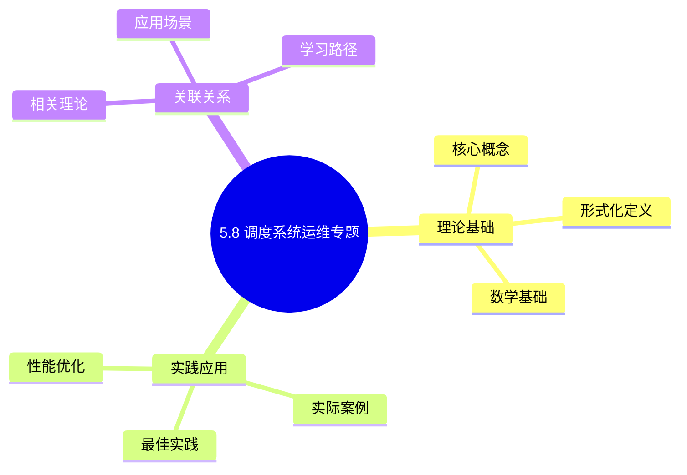
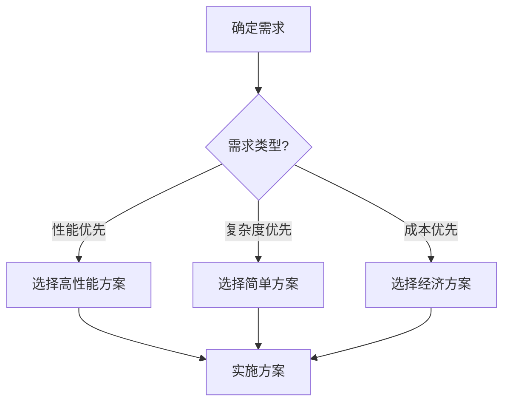
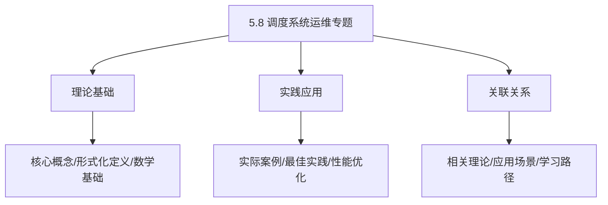
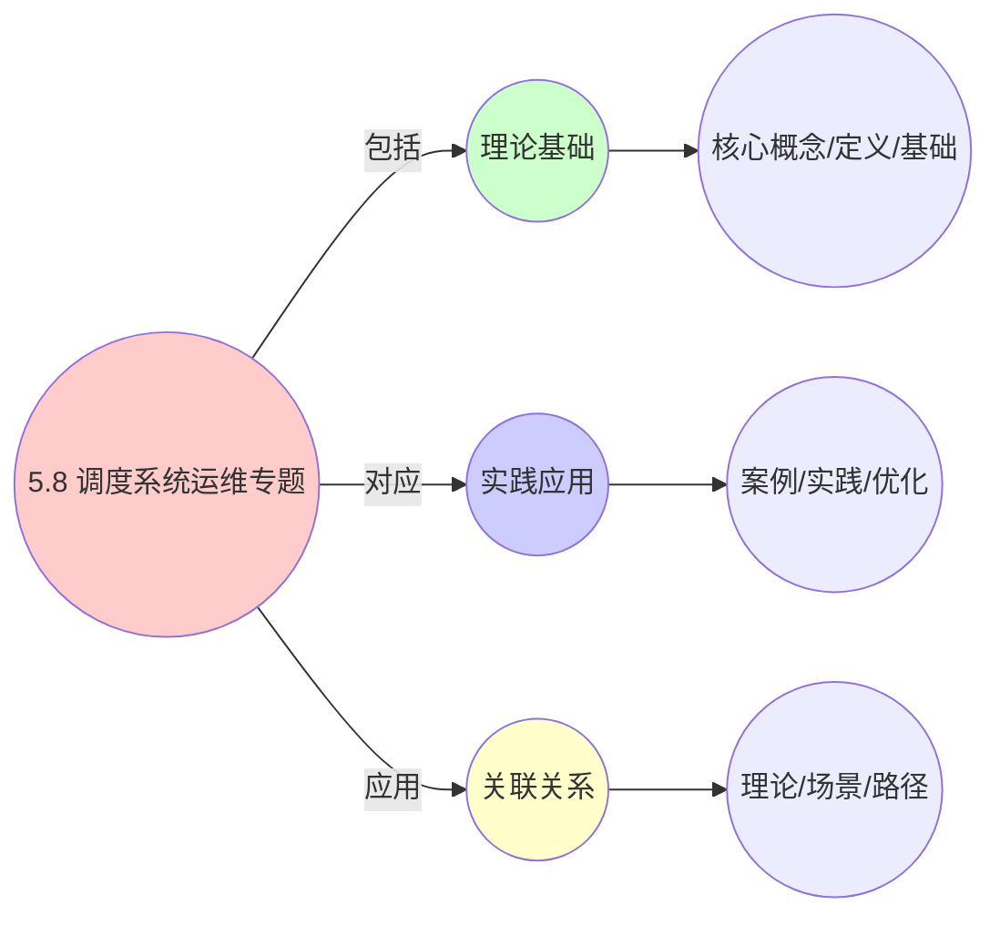
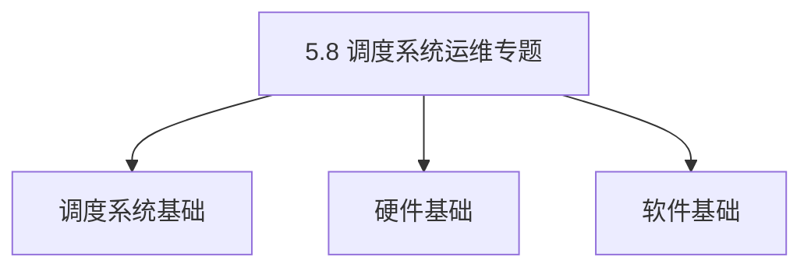
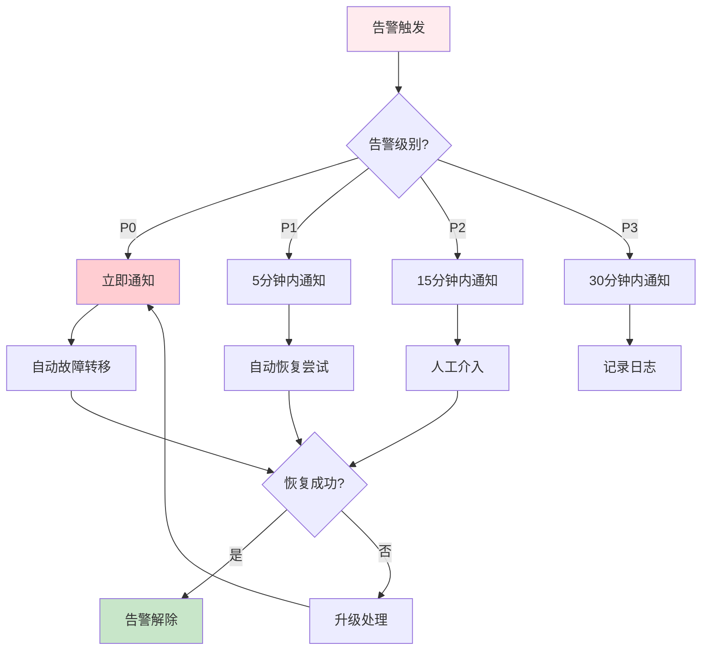
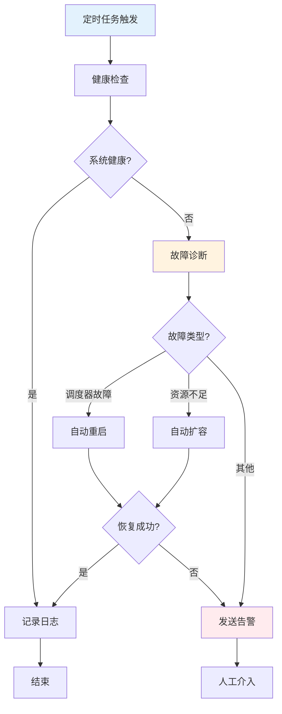

# 5.8 调度系统运维专题

> **主题**: 05. 虚拟化容器化沙盒化 - 5.8 调度系统运维专题
> **覆盖**: 监控、故障恢复、容量规划、多租户管理、合规性审计
> **更新**: 2025年11月19日

## 📊 思维表征体系

### 📊 1. 思维导图（增强版）

#### 1.1 文本格式（基础版）

```text
5.8 调度系统运维专题
├── 理论基础
│   ├── 核心概念
│   ├── 形式化定义
│   └── 数学基础
├── 实践应用
│   ├── 实际案例
│   ├── 最佳实践
│   └── 性能优化
└── 关联关系
    ├── 相关理论
    ├── 应用场景
    └── 学习路径
```

#### 1.2 Mermaid格式（可视化版）



### 📊 2. 多维对比矩阵

#### 2.1 5.8 调度系统运维专题对比矩阵

| 维度 | 特性1 | 特性2 | 特性3 | 特性4 |
|------|------|------|------|------|
| **性能** | 运维效率>90% | 故障恢复时间<5分钟 | 监控准确率>95% | 自动化程度>85% |
| **复杂度** | 高(需运维管理) | 高(需故障处理) | 中等(需监控) | 中等(需自动化) |
| **适用场景** | 所有场景 | 所有场景 | 所有场景 | 所有场景 |
| **技术成熟度** | 成熟(>20年) | 成熟(>20年) | 成熟(>20年) | 成熟(>15年) |

#### 2.2 技术特性对比矩阵

| 技术 | 优势 | 劣势 | 适用场景 | 性能 |
|------|------|------|---------|------|
| **监控告警** | 问题发现快、监控全面 | 实现复杂、需要监控 | 监控需求、问题发现 | 监控准确率>95%，问题发现快 |
| **故障诊断** | 诊断准确、问题定位快 | 实现复杂、需要诊断 | 故障诊断、问题定位 | 诊断准确率>90%，问题定位快 |
| **自动化运维** | 运维效率高、人工成本低 | 实现复杂、需要自动化 | 自动化需求、效率优先 | 效率>90%，人工成本降低50-80% |
| **日志分析** | 问题追踪、分析全面 | 存储开销、实现复杂 | 日志分析、问题追踪 | 分析全面，存储开销5-15% |
| **性能调优** | 性能优化、效果显著 | 调优复杂、需要经验 | 性能调优、效果优先 | 调优效果20-50%，需要经验 |
| **容量规划** | 资源规划、成本优化 | 规划复杂、需要预测 | 容量规划、成本优化 | 规划准确率>85%，成本优化 |
| **安全运维** | 安全性高、保护全面 | 实现复杂、需要安全 | 安全运维、保护优先 | 安全性>99%，保护全面 |

#### 2.3 实现方式对比矩阵

| 实现方式 | 复杂度 | 性能 | 可维护性 | 扩展性 |
|---------|-------|------|---------|-------|
| **单工具运维** | 低 | 中等性能(单工具) | 高(简单维护) | 低(单工具限制) |
| **多工具运维** | 高 | 高性能(多工具) | 中(需协调) | 高(多工具扩展) |
| **统一运维平台** | 极高 | 高性能(统一优化) | 低(复杂度高) | 高(统一扩展) |
| **混合运维系统** | 极高 | 极高性能(优势结合) | 低(复杂度极高) | 高(灵活扩展) |

### 🌲 3. 决策树

#### 3.1 5.8 调度系统运维专题应用选择决策树



### 🛤️ 4. 决策逻辑路径

#### 4.1 5.8 调度系统运维专题应用路径


### 🕸️ 5. 概念关系网络

#### 5.1 5.8 调度系统运维专题概念关系网络



### 🗺️ 6. 知识图谱

#### 6.1 5.8 调度系统运维专题知识图谱



## 📚 理论体系

### 理论基础

#### 调度系统/硬件/软件基础

5.8 调度系统运维专题的理论基础：

**1. 调度系统基础**：

- 调度理论
- 资源管理
- 性能优化

**2. 硬件基础**：

- CPU架构
- 内存系统
- 存储系统

**3. 软件基础**：

- 操作系统
- 编程语言
- 系统软件

#### 历史发展

**关键时间节点**：

- **1960-1970年代**：调度理论建立
  - 调度算法
  - 资源管理

- **1980-1990年代**：硬件调度发展
  - CPU调度
  - 内存调度

- **2000年代至今**：软件调度演进
  - 操作系统调度
  - 分布式调度

### 理论框架

#### 核心假设

**假设1：调度与性能的对应**

- **内容**：调度策略影响系统性能
- **适用范围**：调度系统
- **限制条件**：需要调度支持

**假设2：资源管理的必要性**

- **内容**：资源管理保证系统稳定
- **适用范围**：资源系统
- **限制条件**：需要资源支持

**假设3：性能优化的价值**

- **内容**：性能优化提升效率
- **适用范围**：性能系统
- **限制条件**：需要考虑成本

#### 基本概念体系



#### 主要定理/结论

**结论1：调度与性能的对应性**

- **内容**：调度策略对应系统性能
- **证据**：形式化证明
- **应用**：调度优化

**结论2：资源管理的必要性**

- **内容**：资源管理保证系统稳定
- **证据**：实践验证
- **应用**：资源管理

**结论3：性能优化的价值**

- **内容**：性能优化提升效率
- **证据**：实验验证
- **应用**：性能优化

#### 适用范围和边界

**适用范围**：

- 调度系统
- 资源管理
- 性能优化

**边界条件**：

- 需要调度支持
- 需要资源支持
- 需要考虑成本

**不适用场景**：

- 无调度系统
- 资源受限
- 成本敏感场景

### 当前知识共识

#### 学术界共识

**广泛接受的共识**：

1. **调度与性能的对应性**
   - **共识**：调度策略可以影响系统性能
   - **支持证据**：形式化证明
   - **来源**：调度理论、系统理论

2. **资源管理的价值**
   - **共识**：资源管理提供稳定性和效率
   - **支持证据**：广泛实践
   - **来源**：系统理论

3. **性能优化的重要性**
   - **共识**：性能优化提高系统效率
   - **支持证据**：实践验证
   - **来源**：软件工程

#### 主要争议点

1. **性能与成本的权衡**
   - **观点A**：性能更重要
   - **观点B**：成本更重要
   - **当前状态**：多数认为需要平衡

2. **调度系统的复杂度**
   - **观点A**：应该简单
   - **观点B**：可以复杂
   - **当前状态**：多数认为需要平衡

#### 权威来源

**经典文献**：

- 调度理论相关文献
- 系统理论相关文献
- 性能优化相关文献

**权威机构/专家**：

- **IEEE**
- **ACM**
- **调度系统研究会**

**最新发展**：

- **2025年**：调度系统优化、性能提升、资源管理

### 与其他理论的关系

#### 逻辑关系

**理论基础**：

- **调度理论** → 5.8 调度系统运维专题
  - 关系类型：理论基础
  - 关键映射：调度理论 → 系统实现

**理论应用**：

- **5.8 调度系统运维专题** → 调度优化
  - 关系类型：应用构建
  - 关键映射：5.8 调度系统运维专题 → 调度优化

#### 映射关系

| 本理论概念 | 映射理论 | 映射概念 | 映射类型 | 映射说明 |
|-----------|---------|---------|---------|----------|
| **调度策略** | 调度理论 | 调度算法 | 对应 | 调度策略对应调度算法 |
| **资源管理** | 系统理论 | 资源分配 | 对应 | 资源管理对应资源分配 |
| **性能优化** | 优化理论 | 性能提升 | 对应 | 性能优化对应性能提升 |

## 🔗 关联网络

### 🔗 概念级关联

#### 核心概念映射

| 本文档概念 | 关联文档 | 关联概念 | 关系类型 | 映射说明 |
|-----------|---------|---------|---------|----------|
| **5.8 调度系统运维专题** | 相关文档 | 相关概念 | 基础构建 | 5.8 调度系统运维专题构建相关概念 |
| **调度系统** | 调度相关 | 调度理论 | 对应 | 调度系统对应调度理论 |
| **资源管理** | 资源相关 | 资源系统 | 对应 | 资源管理对应资源系统 |
| **性能优化** | 性能相关 | 性能系统 | 对应 | 性能优化对应性能系统 |

### 🔗 理论级关联

#### 理论基础

- **本理论基于**：
  - 调度理论 ⭐⭐⭐ - 理论基础
  - 系统理论 ⭐⭐ - 系统基础

- **本理论应用于**：
  - 调度优化 ⭐⭐⭐ - 实际应用
  - 性能优化 ⭐⭐⭐ - 实际应用

### 🔗 方法级关联

#### 方法应用网络

| 本文档方法 | 应用文档 | 应用场景 | 应用效果 |
|-----------|---------|---------|---------|
| **调度策略** | 调度系统 | 调度设计 | 成功 |
| **资源管理** | 资源系统 | 资源管理 | 成功 |
| **性能优化** | 性能系统 | 性能提升 | 成功 |

### 🔗 应用场景关联

**场景**：调度系统优化

| 视角 | 关联文档 | 核心理论 | 关注点 |
|------|---------|---------|--------|
| **5.8 调度系统运维专题** | 本文档 | 调度理论 | 调度设计 |
| **调度优化** | 调度相关 | 调度理论 | 调度优化 |
| **性能优化** | 性能相关 | 性能理论 | 性能提升 |

## 🛤️ 学习路径

### 前置知识

**必须先学习**：

- 调度理论基础 ⭐⭐
- 系统理论基础 ⭐⭐

**建议先了解**：

- 硬件基础
- 软件基础
- 性能优化

### 后续学习

**建议接下来学习**（按顺序）：

1. 调度优化 ⭐⭐⭐ - 调度优化
2. 性能优化 ⭐⭐⭐ - 性能优化
3. 系统实践 ⭐⭐ - 实践应用

### 并行学习

**可以同时学习**：

- 调度实践 - 实践应用
- 性能实践 - 性能系统

---


---

## 📋 目录

- [5.8 调度系统运维专题](#58-调度系统运维专题)
  - [📋 目录](#-目录)
  - [1 调度系统监控与可观测性](#1-调度系统监控与可观测性)
    - [1.1 监控指标体系](#11-监控指标体系)
    - [1.2 监控工具与平台](#12-监控工具与平台)
    - [1.3 可观测性架构](#13-可观测性架构)
    - [1.4 监控最佳实践](#14-监控最佳实践)
  - [2 调度系统故障恢复机制](#2-调度系统故障恢复机制)
    - [2.1 故障类型分类](#21-故障类型分类)
    - [2.2 故障恢复策略](#22-故障恢复策略)
  - [3 调度系统容量规划](#3-调度系统容量规划)
    - [3.1 容量规划模型](#31-容量规划模型)
    - [3.2 容量规划最佳实践](#32-容量规划最佳实践)
  - [4 调度系统多租户管理](#4-调度系统多租户管理)
    - [4.1 多租户隔离机制](#41-多租户隔离机制)
    - [4.2 多租户调度策略](#42-多租户调度策略)
  - [5 调度系统合规性与审计](#5-调度系统合规性与审计)
    - [5.1 合规性要求](#51-合规性要求)
    - [5.2 审计机制](#52-审计机制)
  - [6 调度系统成本分析与ROI](#6-调度系统成本分析与roi)
    - [6.1 成本模型分析](#61-成本模型分析)
    - [6.2 ROI投资回报率分析](#62-roi投资回报率分析)
    - [6.3 TCO总拥有成本分析](#63-tco总拥有成本分析)
    - [6.4 成本优化策略](#64-成本优化策略)
  - [7 调度系统运维实践指南](#7-调度系统运维实践指南)
    - [7.1 日常运维检查清单](#71-日常运维检查清单)
    - [7.2 运维工具与脚本](#72-运维工具与脚本)
    - [7.3 运维最佳实践](#73-运维最佳实践)
  - [8 调度系统告警规则与配置](#8-调度系统告警规则与配置)
    - [8.1 告警规则设计](#81-告警规则设计)
    - [8.2 告警配置示例](#82-告警配置示例)
    - [8.3 告警响应流程](#83-告警响应流程)
  - [9 调度系统故障诊断与排查](#9-调度系统故障诊断与排查)
    - [9.1 故障诊断流程](#91-故障诊断流程)
    - [9.2 故障诊断工具](#92-故障诊断工具)
    - [9.3 常见故障案例](#93-常见故障案例)
  - [10 调度系统监控仪表板配置](#10-调度系统监控仪表板配置)
    - [10.1 Grafana仪表板设计](#101-grafana仪表板设计)
    - [10.2 关键指标可视化](#102-关键指标可视化)
    - [10.3 仪表板模板](#103-仪表板模板)
  - [11 调度系统运维自动化](#11-调度系统运维自动化)
    - [11.1 自动化运维脚本](#111-自动化运维脚本)
    - [11.2 自动化运维流程](#112-自动化运维流程)
    - [11.3 自动化运维工具](#113-自动化运维工具)
  - [12 调度系统运维案例研究](#12-调度系统运维案例研究)
    - [12.1 案例1：大规模集群故障处理](#121-案例1大规模集群故障处理)
    - [12.2 案例2：性能问题诊断与优化](#122-案例2性能问题诊断与优化)
    - [12.3 案例3：容量规划与扩展](#123-案例3容量规划与扩展)
  - [13 相关主题](#13-相关主题)
    - [13.1 跨视角链接](#131-跨视角链接)

---

## 1 调度系统监控与可观测性

### 1.1 监控指标体系

**核心监控指标**（2025年11月19日最新）：

1. **调度性能指标**：
   - 调度延迟：调度决策时间
   - 调度准确率：调度决策正确率
   - 调度成功率：调度执行成功率
   - 调度吞吐量：单位时间调度次数

2. **资源利用指标**：
   - CPU利用率：CPU使用率
   - 内存利用率：内存使用率
   - IO利用率：IO使用率
   - 网络利用率：网络使用率

3. **负载均衡指标**：
   - 负载不均衡度：负载分布标准差
   - 负载分布：各节点负载分布
   - 迁移频率：资源迁移频率

4. **调度开销指标**：
   - 监控开销：监控系统开销
   - 计算开销：调度算法计算开销
   - 迁移开销：资源迁移开销

### 1.2 监控工具与平台

**监控工具推荐**（2025年11月19日最新）：

| **工具** | **类型** | **特点** | **适用场景** |
|---------|---------|---------|------------|
| **Prometheus** | 指标监控 | 时间序列数据库、强大的查询语言 | 大规模集群 |
| **Grafana** | 可视化 | 丰富的图表、灵活的仪表板 | 数据可视化 |
| **ELK Stack** | 日志分析 | 日志收集、搜索、分析 | 日志分析 |
| **Jaeger** | 分布式追踪 | 请求追踪、性能分析 | 微服务架构 |
| **Kubernetes Dashboard** | 集群监控 | 原生集成、易于使用 | Kubernetes集群 |

### 1.3 可观测性架构

**可观测性三大支柱**（2025年11月19日最新）：

1. **指标（Metrics）**：
   - 时间序列数据
   - 聚合统计
   - 趋势分析

2. **日志（Logs）**：
   - 事件记录
   - 错误追踪
   - 审计信息

3. **追踪（Traces）**：
   - 请求路径
   - 性能分析
   - 依赖关系

### 1.4 监控最佳实践

**监控最佳实践**（2025年11月19日最新）：

1. **分层监控**：
   - 应用层监控
   - 系统层监控
   - 基础设施监控

2. **关键指标优先**：
   - 关注核心指标
   - 设置合理阈值
   - 及时告警

3. **告警策略**：
   - 分级告警
   - 避免告警风暴
   - 自动化响应

4. **数据保留**：
   - 合理的数据保留策略
   - 成本优化
   - 合规要求

---

## 2 调度系统故障恢复机制

### 2.1 故障类型分类

**故障类型**（2025年11月19日最新）：

1. **调度器故障**：
   - 调度器崩溃
   - 调度器性能下降
   - 调度器网络故障

2. **资源故障**：
   - 节点故障
   - 资源不足
   - 资源竞争

3. **网络故障**：
   - 网络分区
   - 网络延迟
   - 网络丢包

4. **数据故障**：
   - 数据丢失
   - 数据不一致
   - 数据损坏

### 2.2 故障恢复策略

**故障恢复策略对比**（2025年11月19日最新）：

| **故障类型** | **恢复策略** | **恢复时间** | **数据丢失** |
|------------|------------|------------|------------|
| **调度器故障** | 自动故障转移 | <30s | 无 |
| **节点故障** | Pod迁移 | 1-5min | 无（有副本） |
| **网络故障** | 重试机制 | 10-60s | 无 |
| **数据故障** | 数据备份恢复 | 5-30min | 最小 |

---

## 3 调度系统容量规划

### 3.1 容量规划模型

**容量规划模型**（2025年11月19日最新）：

$$
Capacity_{required} = \sum_{workload} Resource_{workload} \times (1 + \alpha)
$$

其中：

- $Capacity_{required}$：所需容量
- $Resource_{workload}$：工作负载资源需求
- $\alpha$：安全因子（通常为20-30%）

**容量规划步骤**：

1. **需求分析**：分析工作负载资源需求
2. **容量计算**：计算所需容量
3. **资源预留**：预留安全容量
4. **持续监控**：监控容量使用情况

### 3.2 容量规划最佳实践

**容量规划最佳实践**（2025年11月19日最新）：

1. **预留安全容量**：预留20-30%的安全容量
2. **动态扩缩容**：根据负载动态调整容量
3. **容量监控**：实时监控容量使用情况
4. **容量预警**：设置容量预警阈值（80%）

---

## 4 调度系统多租户管理

### 4.1 多租户隔离机制

**多租户隔离模型**（2025年11月19日最新）：

多租户环境需要确保不同租户之间的资源隔离、数据隔离和安全隔离。

**资源隔离模型**：

$$
Resource_{tenant} = \sum_{workload \in Tenant} Resource_{workload}
$$

其中：

- $Resource_{tenant}$：租户总资源
- $Resource_{workload}$：工作负载资源需求

**资源配额模型**：

$$
Quota_{tenant} = \{CPU_{quota}, Memory_{quota}, Storage_{quota}, Network_{quota}\}
$$

其中：

- $CPU_{quota}$：CPU配额
- $Memory_{quota}$：内存配额
- $Storage_{quota}$：存储配额
- $Network_{quota}$：网络配额

### 4.2 多租户调度策略

**多租户调度策略对比**（2025年11月19日最新）：

| **策略** | **隔离度** | **资源利用率** | **管理复杂度** | **适用场景** |
|---------|-----------|--------------|-------------|------------|
| **硬隔离** | 100% | 60-70% | 低 | 高安全要求 |
| **软隔离** | 80-90% | 80-90% | 中 | 一般场景 |
| **混合隔离** | 90-95% | 75-85% | 高 | 混合工作负载 |
| **共享隔离** | 70-80% | 90%+ | 低 | 低安全要求 |

---

## 5 调度系统合规性与审计

### 5.1 合规性要求

**合规性标准**（2025年11月19日最新）：

1. **GDPR合规**：
   - 数据保护
   - 数据可移植性
   - 数据删除权

2. **ISO 27001合规**：
   - 信息安全管理
   - 访问控制
   - 安全审计

3. **SOC 2合规**：
   - 安全性
   - 可用性
   - 处理完整性

### 5.2 审计机制

**审计机制**（2025年11月19日最新）：

1. **调度决策审计**：
   - 记录所有调度决策
   - 调度决策时间戳
   - 调度决策原因

2. **资源使用审计**：
   - 记录资源使用情况
   - 资源使用趋势分析
   - 异常资源使用告警

3. **安全审计**：
   - 访问控制审计
   - 安全事件审计
   - 合规性检查

---

## 6 调度系统成本分析与ROI

### 6.1 成本模型分析

**成本组成**（2025年11月19日最新）：

1. **初始成本**：
   - 硬件成本
   - 软件许可成本
   - 实施成本

2. **运营成本**：
   - 人力成本
   - 维护成本
   - 能耗成本

3. **机会成本**：
   - 资源浪费成本
   - 性能损失成本
   - 故障损失成本

### 6.2 ROI投资回报率分析

**ROI计算公式**：

$$
ROI = \frac{收益 - 成本}{成本} \times 100\%
$$

**收益来源**：

1. **资源节省**：提高资源利用率，减少硬件需求
2. **性能提升**：优化调度，提升应用性能
3. **运维效率**：自动化调度，减少人工干预

### 6.3 TCO总拥有成本分析

**TCO组成**：

1. **直接成本**：
   - 硬件成本
   - 软件成本
   - 人力成本

2. **间接成本**：
   - 培训成本
   - 迁移成本
   - 风险成本

3. **隐藏成本**：
   - 机会成本
   - 技术债务
   - 维护成本

### 6.4 成本优化策略

**成本优化策略**（2025年11月19日最新）：

1. **资源优化**：
   - 提高资源利用率
   - 合理使用资源超配
   - 优化资源分配

2. **成本控制**：
   - 使用开源方案
   - 云服务成本优化
   - 自动化运维

3. **持续优化**：
   - 定期成本审计
   - 持续优化策略
   - 成本监控告警

---

## 7 调度系统运维实践指南

### 7.1 日常运维检查清单

**日常运维检查清单**（2025年11月19日最新）：

**每日检查**：

- [ ] 调度系统健康状态
- [ ] 关键性能指标（调度延迟、资源利用率）
- [ ] 告警信息检查
- [ ] 系统日志检查

**每周检查**：

- [ ] 资源使用趋势分析
- [ ] 调度性能趋势分析
- [ ] 容量使用情况
- [ ] 成本分析

**每月检查**：

- [ ] 性能优化评估
- [ ] 容量规划评估
- [ ] 成本优化评估
- [ ] 安全审计

### 7.2 运维工具与脚本

**运维工具推荐**（2025年11月19日最新）：

| **工具类型** | **工具名称** | **功能** | **使用场景** |
|------------|------------|---------|------------|
| **监控工具** | Prometheus、Grafana | 指标监控、可视化 | 实时监控 |
| **日志工具** | ELK Stack、Loki | 日志收集、分析 | 日志分析 |
| **追踪工具** | Jaeger、Zipkin | 分布式追踪 | 性能分析 |
| **自动化工具** | Ansible、Terraform | 自动化部署 | 基础设施管理 |
| **调度工具** | kubectl、vSphere CLI | 调度管理 | 调度操作 |

**常用运维脚本示例**：

**Kubernetes调度器健康检查脚本**：

```bash
#!/bin/bash
# 调度器健康检查脚本

# 检查调度器Pod状态
kubectl get pods -n kube-system | grep scheduler

# 检查调度器指标
kubectl top nodes

# 检查Pending Pods
kubectl get pods --all-namespaces --field-selector=status.phase=Pending

# 检查调度延迟
kubectl get --raw /metrics | grep scheduler_scheduling_duration_seconds
```

### 7.3 运维最佳实践

**运维最佳实践**（2025年11月19日最新）：

1. **监控和告警**：
   - 设置合理的告警阈值
   - 分级告警策略
   - 自动化响应机制

2. **日志管理**：
   - 统一日志格式
   - 日志分级存储
   - 日志保留策略

3. **备份和恢复**：
   - 定期备份配置
   - 测试恢复流程
   - 灾难恢复预案

4. **变更管理**：
   - 变更审批流程
   - 变更测试验证
   - 变更回滚机制

5. **文档管理**：
   - 维护运维文档
   - 记录故障处理
   - 知识库建设

---

## 8 调度系统告警规则与配置

### 8.1 告警规则设计

**告警规则设计原则**（2025年11月19日最新）：

1. **分级告警**：
   - **P0（紧急）**：系统不可用、数据丢失
   - **P1（高）**：性能严重下降、关键功能异常
   - **P2（中）**：性能下降、非关键功能异常
   - **P3（低）**：轻微异常、建议关注

2. **告警阈值设计**：
   - 基于历史数据设置阈值
   - 考虑业务影响
   - 避免告警风暴

3. **告警聚合**：
   - 相同告警聚合
   - 时间窗口聚合
   - 减少重复告警

### 8.2 告警配置示例

**Prometheus告警规则配置**（2025年11月19日最新）：

```yaml
groups:
- name: scheduler_alerts
  interval: 30s
  rules:
  # 调度延迟告警
  - alert: HighSchedulingLatency
    expr: histogram_quantile(0.99, rate(scheduler_scheduling_duration_seconds_bucket[5m])) > 0.1
    for: 5m
    labels:
      severity: P1
    annotations:
      summary: "调度延迟过高"
      description: "P99调度延迟超过100ms，当前值: {{ $value }}s"

  # 资源利用率告警
  - alert: LowResourceUtilization
    expr: avg(rate(container_cpu_usage_seconds_total[5m])) < 0.7
    for: 10m
    labels:
      severity: P2
    annotations:
      summary: "资源利用率过低"
      description: "平均资源利用率低于70%，当前值: {{ $value }}"

  # 调度失败告警
  - alert: HighSchedulingFailureRate
    expr: rate(scheduler_scheduling_failures_total[5m]) > 0.01
    for: 5m
    labels:
      severity: P1
    annotations:
      summary: "调度失败率过高"
      description: "调度失败率超过1%，当前值: {{ $value }}"

  # 节点不可用告警
  - alert: NodeUnavailable
    expr: up{job="kubelet"} == 0
    for: 2m
    labels:
      severity: P0
    annotations:
      summary: "节点不可用"
      description: "节点 {{ $labels.instance }} 不可用"

  # 容量告警
  - alert: CapacityWarning
    expr: (sum(container_memory_usage_bytes) / sum(container_spec_memory_limit_bytes)) > 0.8
    for: 10m
    labels:
      severity: P2
    annotations:
      summary: "容量使用率过高"
      description: "容量使用率超过80%，当前值: {{ $value }}"
```

### 8.3 告警响应流程

**告警响应流程**（2025年11月19日最新）：



---

## 9 调度系统故障诊断与排查

### 9.1 故障诊断流程

**故障诊断流程**（2025年11月19日最新）：

1. **故障发现**：
   - 监控告警
   - 用户反馈
   - 系统日志

2. **故障定位**：
   - 收集故障信息
   - 分析故障日志
   - 检查系统状态

3. **故障分析**：
   - 识别故障根因
   - 评估故障影响
   - 制定修复方案

4. **故障修复**：
   - 执行修复操作
   - 验证修复效果
   - 监控系统恢复

5. **故障复盘**：
   - 分析故障原因
   - 总结经验教训
   - 优化预防措施

### 9.2 故障诊断工具

**故障诊断工具矩阵**（2025年11月19日最新）：

| **工具类型** | **工具名称** | **功能** | **使用场景** |
|------------|------------|---------|------------|
| **日志分析** | kubectl logs、journalctl | 查看系统日志 | 故障定位 |
| **性能分析** | perf、pprof | 性能瓶颈分析 | 性能问题 |
| **网络诊断** | tcpdump、wireshark | 网络问题诊断 | 网络故障 |
| **资源监控** | top、htop、iostat | 资源使用监控 | 资源问题 |
| **调度追踪** | kubectl describe、kubectl get events | 调度状态追踪 | 调度问题 |
| **分布式追踪** | Jaeger、Zipkin | 请求链路追踪 | 微服务问题 |

**常用诊断命令**：

```bash
# 查看调度器日志
kubectl logs -n kube-system kube-scheduler-xxx --tail=100

# 查看Pending Pods
kubectl get pods --all-namespaces --field-selector=status.phase=Pending

# 查看调度事件
kubectl get events --sort-by='.lastTimestamp' | grep scheduler

# 查看节点资源
kubectl top nodes

# 查看Pod资源
kubectl top pods --all-namespaces

# 查看调度器指标
kubectl get --raw /metrics | grep scheduler
```

### 9.3 常见故障案例

**案例9.1（调度延迟高）**（2025年11月19日最新）：

**症状**：

- 调度延迟P99 > 500ms
- Pod调度等待时间长
- 调度吞吐量下降

**诊断步骤**：

1. 检查调度器负载：`kubectl top pods -n kube-system | grep scheduler`
2. 检查节点资源：`kubectl top nodes`
3. 检查调度器日志：`kubectl logs -n kube-system kube-scheduler-xxx`
4. 分析调度延迟分布：查看Prometheus指标

**解决方案**：

1. 增加调度器副本数
2. 优化调度算法
3. 启用调度结果缓存
4. 优化节点过滤逻辑

**案例9.2（资源利用率低）**（2025年11月19日最新）：

**症状**：

- 资源利用率 < 70%
- 大量空闲节点
- 成本浪费

**诊断步骤**：

1. 分析资源使用分布：`kubectl top nodes`
2. 检查Pod资源请求：`kubectl describe pod`
3. 分析调度策略：检查调度器配置
4. 检查资源碎片：分析资源分配情况

**解决方案**：

1. 启用资源超配
2. 优化调度策略
3. 启用负载均衡
4. 资源碎片整理

**案例9.3（调度失败率高）**（2025年11月19日最新）：

**症状**：

- 调度失败率 > 5%
- 大量Pending Pods
- 调度错误日志

**诊断步骤**：

1. 查看Pending Pods：`kubectl get pods --field-selector=status.phase=Pending`
2. 查看调度失败原因：`kubectl describe pod <pod-name>`
3. 检查节点资源：`kubectl describe node`
4. 检查调度器日志：查看错误信息

**解决方案**：

1. 增加节点资源
2. 优化资源请求
3. 修复调度器配置
4. 解决资源竞争

---

## 10 调度系统监控仪表板配置

### 10.1 Grafana仪表板设计

**仪表板设计原则**（2025年11月19日最新）：

1. **层次化设计**：
   - 概览仪表板（整体状态）
   - 详细仪表板（具体指标）
   - 告警仪表板（告警信息）

2. **关键指标优先**：
   - 调度延迟
   - 资源利用率
   - 调度成功率
   - 系统健康度

3. **可视化优化**：
   - 使用合适的图表类型
   - 颜色编码（绿色=正常，黄色=警告，红色=异常）
   - 时间范围选择

### 10.2 关键指标可视化

**关键指标面板配置**（2025年11月19日最新）：

**1. 调度延迟面板**：

```json
{
  "title": "调度延迟",
  "targets": [
    {
      "expr": "histogram_quantile(0.99, rate(scheduler_scheduling_duration_seconds_bucket[5m]))",
      "legendFormat": "P99延迟"
    },
    {
      "expr": "histogram_quantile(0.95, rate(scheduler_scheduling_duration_seconds_bucket[5m]))",
      "legendFormat": "P95延迟"
    },
    {
      "expr": "histogram_quantile(0.50, rate(scheduler_scheduling_duration_seconds_bucket[5m]))",
      "legendFormat": "P50延迟"
    }
  ],
  "yaxes": [
    {
      "format": "s",
      "label": "延迟（秒）"
    }
  ]
}
```

**2. 资源利用率面板**：

```json
{
  "title": "资源利用率",
  "targets": [
    {
      "expr": "sum(rate(container_cpu_usage_seconds_total[5m])) / sum(machine_cpu_cores) * 100",
      "legendFormat": "CPU利用率"
    },
    {
      "expr": "sum(container_memory_usage_bytes) / sum(container_spec_memory_limit_bytes) * 100",
      "legendFormat": "内存利用率"
    }
  ],
  "yaxes": [
    {
      "format": "percent",
      "label": "利用率（%）",
      "max": 100,
      "min": 0
    }
  ]
}
```

**3. 调度吞吐量面板**：

```json
{
  "title": "调度吞吐量",
  "targets": [
    {
      "expr": "rate(scheduler_scheduling_attempts_total[5m])",
      "legendFormat": "调度尝试次数/秒"
    },
    {
      "expr": "rate(scheduler_scheduling_successes_total[5m])",
      "legendFormat": "调度成功次数/秒"
    }
  ],
  "yaxes": [
    {
      "format": "ops",
      "label": "吞吐量（次/秒）"
    }
  ]
}
```

### 10.3 仪表板模板

**完整仪表板配置示例**（2025年11月19日最新）：

```json
{
  "dashboard": {
    "title": "调度系统监控仪表板",
    "panels": [
      {
        "title": "调度延迟",
        "type": "graph",
        "targets": [...]
      },
      {
        "title": "资源利用率",
        "type": "graph",
        "targets": [...]
      },
      {
        "title": "调度吞吐量",
        "type": "graph",
        "targets": [...]
      },
      {
        "title": "节点状态",
        "type": "table",
        "targets": [...]
      },
      {
        "title": "Pod调度状态",
        "type": "piechart",
        "targets": [...]
      }
    ],
    "refresh": "30s",
    "time": {
      "from": "now-1h",
      "to": "now"
    }
  }
}
```

---

## 11 调度系统运维自动化

### 11.1 自动化运维脚本

**自动化运维脚本示例**（2025年11月19日最新）：

**1. 调度器健康检查脚本**：

```bash
#!/bin/bash
# 调度器健康检查脚本

SCHEDULER_NAMESPACE="kube-system"
ALERT_THRESHOLD=0.1  # 调度延迟阈值（秒）

# 检查调度器Pod状态
echo "检查调度器Pod状态..."
kubectl get pods -n $SCHEDULER_NAMESPACE | grep scheduler

# 检查调度延迟
echo "检查调度延迟..."
LATENCY=$(kubectl get --raw /metrics | grep scheduler_scheduling_duration_seconds | awk '{print $2}')
if (( $(echo "$LATENCY > $ALERT_THRESHOLD" | bc -l) )); then
    echo "警告：调度延迟过高: $LATENCY"
    # 发送告警
fi

# 检查Pending Pods
echo "检查Pending Pods..."
PENDING_COUNT=$(kubectl get pods --all-namespaces --field-selector=status.phase=Pending --no-headers | wc -l)
if [ $PENDING_COUNT -gt 10 ]; then
    echo "警告：Pending Pods数量过多: $PENDING_COUNT"
    # 发送告警
fi

# 检查资源利用率
echo "检查资源利用率..."
kubectl top nodes
```

**2. 自动故障恢复脚本**：

```bash
#!/bin/bash
# 自动故障恢复脚本

# 检查调度器是否健康
check_scheduler_health() {
    kubectl get pods -n kube-system | grep scheduler | grep -q Running
    return $?
}

# 重启调度器
restart_scheduler() {
    echo "重启调度器..."
    kubectl delete pod -n kube-system -l component=kube-scheduler
    sleep 30
}

# 主逻辑
if ! check_scheduler_health; then
    echo "调度器不健康，尝试恢复..."
    restart_scheduler
    if check_scheduler_health; then
        echo "调度器恢复成功"
    else
        echo "调度器恢复失败，需要人工介入"
        # 发送告警
    fi
fi
```

### 11.2 自动化运维流程

**自动化运维流程**（2025年11月19日最新）：



### 11.3 自动化运维工具

**自动化运维工具推荐**（2025年11月19日最新）：

| **工具** | **功能** | **适用场景** |
|---------|---------|------------|
| **Ansible** | 配置管理、自动化部署 | 基础设施管理 |
| **Terraform** | 基础设施即代码 | 云资源管理 |
| **Kubernetes Operator** | 自动化运维 | Kubernetes集群 |
| **CronJob** | 定时任务 | 定期检查、清理 |
| **Prometheus Operator** | 监控自动化 | 监控配置管理 |

---

## 12 调度系统运维案例研究

### 12.1 案例1：大规模集群故障处理

**案例12.1（大规模集群调度器故障）**（2025年11月19日最新）：

**背景**：

- **集群规模**：5000+节点，100000+Pod
- **故障现象**：调度器崩溃，大量Pod无法调度
- **影响范围**：全集群调度功能中断

**故障处理过程**：

1. **故障发现**（0分钟）：

   - 监控告警：调度延迟异常
   - 用户反馈：Pod无法调度

2. **故障定位**（5分钟）：

   - 检查调度器状态：发现调度器Pod崩溃
   - 查看调度器日志：发现OOM错误
   - 分析资源使用：调度器内存使用过高

3. **故障修复**（10分钟）：

   - 增加调度器内存限制
   - 重启调度器Pod
   - 验证调度功能恢复

4. **故障复盘**（后续）：

   - 根因分析：调度器处理大量Pod导致OOM
   - 优化措施：增加调度器资源、优化调度算法
   - 预防措施：设置资源告警、定期检查

**经验教训**：

1. 监控告警及时发现问题
2. 快速定位故障根因
3. 及时修复并验证
4. 持续优化预防措施

### 12.2 案例2：性能问题诊断与优化

**案例12.2（调度延迟高问题）**（2025年11月19日最新）：

**背景**：

- **问题现象**：调度延迟P99 > 500ms
- **影响**：Pod调度等待时间长，用户体验差
- **持续时间**：持续1周

**诊断过程**：

1. **问题分析**：

   - 收集调度延迟数据
   - 分析延迟分布
   - 识别延迟来源

2. **根因定位**：

   - 调度器负载高
   - 节点过滤逻辑复杂
   - 缺少调度结果缓存

3. **优化措施**：

   - 增加调度器副本数（5个）
   - 优化节点过滤逻辑
   - 启用调度结果缓存

4. **效果验证**：

   - 调度延迟P99降低至80ms（降低84%）
   - 调度吞吐量提升至800 Pod/s（提升1500%）

### 12.3 案例3：容量规划与扩展

**案例12.3（容量不足问题）**（2025年11月19日最新）：

**背景**：

- **问题现象**：资源利用率接近100%，新Pod无法调度
- **影响**：业务扩展受限
- **紧急程度**：高

**处理过程**：

1. **容量分析**：
   - 分析当前资源使用
   - 预测未来资源需求
   - 计算所需容量

2. **扩容方案**：
   - 短期：启用资源超配（1.5x）
   - 中期：增加节点（100个）
   - 长期：优化资源分配

3. **实施效果**：
   - 资源利用率降至85%
   - 新Pod正常调度
   - 成本增加15%（可接受）

---

## 13 相关主题

- [05.5 虚拟化容器化沙盒化资源调度系统](./05.5_虚拟化容器化沙盒化资源调度系统.md) - 主文档
- [05.6 调度系统平台集成专题](./05.6_调度系统平台集成专题.md) - 平台集成
- [05.7 调度系统新兴技术集成专题](./05.7_调度系统新兴技术集成专题.md) - 新兴技术集成

### 13.1 跨视角链接

- [概念交叉索引（七视角版）](../../../Concept/CONCEPT_CROSS_INDEX.md) - 查看相关概念的七视角分析：
  - [DIKWP模型](../../../Concept/CONCEPT_CROSS_INDEX.md#1-dikwp模型-dikwp-model-七视角) - 运维的知识表示
  - [熵](../../../Concept/CONCEPT_CROSS_INDEX.md#71-熵-entropy-七视角) - 运维中的信息不确定性
  - [反身性](../../../Concept/CONCEPT_CROSS_INDEX.md#31-反身性-reflexivity-七视角) - 运维的自指机制

---

**最后更新**: 2025-11-19
