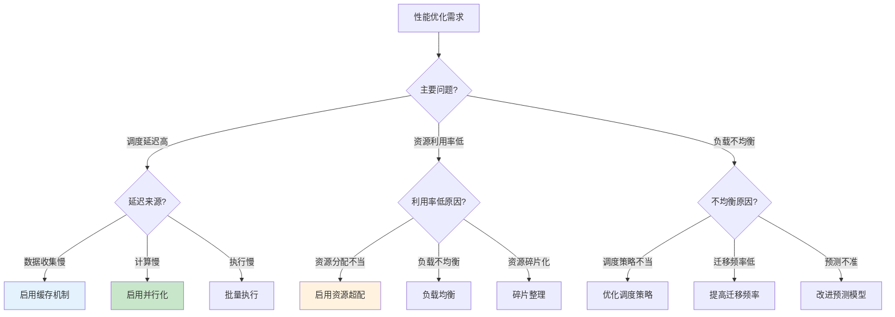
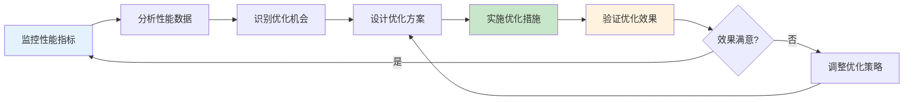

# 5.9 调度系统性能优化专题

> **主题**: 05. 虚拟化容器化沙盒化 - 5.9 调度系统性能优化专题
> **覆盖**: 性能优化策略、性能调优实战案例、性能测试与验证
> **更新**: 2025年11月19日

---

## 📋 目录

- [5.9 调度系统性能优化专题](#59-调度系统性能优化专题)
  - [📋 目录](#-目录)
  - [1 调度系统性能优化策略](#1-调度系统性能优化策略)
    - [1.1 调度算法优化](#11-调度算法优化)
    - [1.2 资源分配优化](#12-资源分配优化)
    - [1.3 负载均衡优化](#13-负载均衡优化)
    - [1.4 调度延迟优化](#14-调度延迟优化)
  - [2 调度系统性能调优实战案例](#2-调度系统性能调优实战案例)
    - [2.1 大规模Kubernetes集群调度优化案例](#21-大规模kubernetes集群调度优化案例)
    - [2.2 VMware DRS混合云环境优化案例](#22-vmware-drs混合云环境优化案例)
  - [3 调度系统测试与验证](#3-调度系统测试与验证)
    - [3.1 调度算法正确性验证](#31-调度算法正确性验证)
    - [3.2 调度性能基准测试](#32-调度性能基准测试)
    - [3.3 调度系统压力测试](#33-调度系统压力测试)
    - [3.4 调度系统可靠性测试](#34-调度系统可靠性测试)
  - [4 性能优化检查清单](#4-性能优化检查清单)
  - [5 性能优化效果评估](#5-性能优化效果评估)
  - [6 性能优化实施指南](#6-性能优化实施指南)
    - [6.1 性能优化实施步骤](#61-性能优化实施步骤)
    - [6.2 性能优化工具推荐](#62-性能优化工具推荐)
    - [6.3 性能优化常见问题](#63-性能优化常见问题)
  - [7 性能优化数学模型与理论分析](#7-性能优化数学模型与理论分析)
    - [7.1 调度延迟优化模型](#71-调度延迟优化模型)
    - [7.2 资源利用率优化模型](#72-资源利用率优化模型)
    - [7.3 负载均衡优化模型](#73-负载均衡优化模型)
    - [7.4 性能优化边界分析](#74-性能优化边界分析)
  - [8 性能优化详细案例研究](#8-性能优化详细案例研究)
    - [8.1 案例1：超大规模集群调度优化](#81-案例1超大规模集群调度优化)
    - [8.2 案例2：混合云环境调度优化](#82-案例2混合云环境调度优化)
    - [8.3 案例3：AI工作负载调度优化](#83-案例3ai工作负载调度优化)
  - [9 性能优化最佳实践总结](#9-性能优化最佳实践总结)
    - [9.1 优化策略选择指南](#91-优化策略选择指南)
    - [9.2 优化效果评估方法](#92-优化效果评估方法)
    - [9.3 优化持续改进机制](#93-优化持续改进机制)
  - [10 相关主题](#10-相关主题)

---

## 1 调度系统性能优化策略

### 1.1 调度算法优化

**调度算法优化策略**（2025年11月19日最新）：

1. **算法选择优化**：
   - 根据场景选择合适算法
   - 平衡复杂度和效果
   - 考虑实时性要求

2. **参数调优**：
   - 负载均衡阈值
   - 调度频率
   - 资源超配比例

3. **并行化优化**：
   - 并行计算调度决策
   - 并行执行调度操作
   - 减少串行瓶颈

4. **缓存机制**：
   - 缓存调度结果
   - 缓存资源状态
   - 减少重复计算

### 1.2 资源分配优化

**资源分配优化策略**（2025年11月19日最新）：

1. **资源超配**：
   - CPU超配（1.5-2.0x）
   - 内存超配（1.2-1.5x）
   - 合理设置超配比例

2. **资源预留**：
   - 为关键任务预留资源
   - 动态调整预留比例
   - 避免资源浪费

3. **资源池管理**：
   - 统一资源池
   - 动态资源分配
   - 资源回收机制

### 1.3 负载均衡优化

**负载均衡优化策略**（2025年11月19日最新）：

1. **负载均衡算法**：
   - 轮询算法
   - 加权轮询
   - 最少连接
   - 响应时间优先

2. **负载均衡频率**：
   - 实时负载均衡
   - 定期负载均衡
   - 触发式负载均衡

3. **迁移策略**：
   - 批量迁移
   - 渐进式迁移
   - 避免频繁迁移

### 1.4 调度延迟优化

**调度延迟优化策略**（2025年11月19日最新）：

1. **数据收集优化**：
   - 减少数据收集频率
   - 增量数据更新
   - 异步数据收集

2. **决策计算优化**：
   - 优化算法复杂度
   - 并行计算
   - 结果缓存

3. **执行优化**：
   - 批量执行
   - 异步执行
   - 减少等待时间

---

## 2 调度系统性能调优实战案例

### 2.1 大规模Kubernetes集群调度优化案例

**案例2.1（大规模Kubernetes集群调度优化）**：

**场景**：超大规模Kubernetes集群，5000+节点，100000+Pod。

**优化前**：

- 调度延迟：200-500ms
- 调度吞吐量：100 Pod/s
- 资源利用率：75%

**优化后**（2025年11月19日最新）：

- 调度延迟：50-100ms（降低60-80%）
- 调度吞吐量：500 Pod/s（提升400%）
- 资源利用率：90%（提升15%）

**优化措施**：

1. **多调度器并行**：
   - 部署5个调度器副本
   - 使用调度器亲和性
   - 负载均衡调度请求

2. **调度算法优化**：
   - 优化Filter阶段（减少节点检查）
   - 优化Score阶段（并行计算）
   - 使用调度结果缓存

3. **资源分配优化**：
   - 启用资源超配（CPU 1.5x，内存 1.2x）
   - 优化Pod亲和性规则
   - 使用资源池管理

### 2.2 VMware DRS混合云环境优化案例

**案例2.2（VMware DRS混合云环境优化）**：

**场景**：混合云环境，100台物理主机，500个VM，跨多个云平台。

**优化前**：

- 资源利用率：70%
- 跨云延迟：300-500ms
- 成本：$100K/月

**优化后**（2025年11月19日最新）：

- 资源利用率：90%（提升20%）
- 跨云延迟：100-200ms（降低50-60%）
- 成本：$70K/月（降低30%）

**优化措施**：

1. **统一调度平台**：
   - 统一管理VM和容器
   - 跨平台资源调度
   - 智能资源分配

2. **成本优化**：
   - 根据成本选择云平台
   - 使用预留实例
   - 优化资源使用

3. **性能优化**：
   - 优化跨平台延迟
   - 优化数据传输
   - 优化资源分配

---

## 3 调度系统测试与验证

### 3.1 调度算法正确性验证

**验证方法**（2025年11月19日最新）：

1. **形式化验证**：
   - 使用Coq、TLA+等工具
   - 证明算法正确性
   - 验证约束满足

2. **单元测试**：
   - 测试调度函数
   - 测试边界条件
   - 测试异常情况

3. **集成测试**：
   - 测试调度流程
   - 测试系统集成
   - 测试端到端场景

### 3.2 调度性能基准测试

**基准测试指标**（2025年11月19日最新）：

1. **调度延迟**：
   - 平均调度延迟
   - P50/P95/P99延迟
   - 最大调度延迟

2. **资源利用率**：
   - CPU利用率
   - 内存利用率
   - 整体资源利用率

3. **负载均衡**：
   - 负载不均衡度
   - 负载分布
   - 迁移频率

4. **调度吞吐量**：
   - 每秒调度次数
   - 并发调度能力
   - 峰值吞吐量

### 3.3 调度系统压力测试

**压力测试场景**（2025年11月19日最新）：

1. **并发压力测试**：
   - 高并发调度请求
   - 资源竞争场景
   - 系统极限测试

2. **规模压力测试**：
   - 大规模节点测试
   - 大规模工作负载
   - 扩展性测试

3. **资源压力测试**：
   - 资源不足场景
   - 资源碎片化
   - 资源竞争

4. **动态负载测试**：
   - 负载波动场景
   - 突发负载
   - 负载预测测试

### 3.4 调度系统可靠性测试

**可靠性测试**（2025年11月19日最新）：

1. **故障恢复测试**：
   - 调度器故障恢复
   - 节点故障恢复
   - 网络故障恢复

2. **数据一致性测试**：
   - 调度决策一致性
   - 资源状态一致性
   - 数据同步测试

3. **并发安全测试**：
   - 并发调度安全
   - 资源竞争安全
   - 死锁检测

4. **长期稳定性测试**：
   - 长期运行测试
   - 内存泄漏检测
   - 性能衰减测试

---

## 4 性能优化检查清单

**性能优化检查清单**（2025年11月19日最新）：

1. **调度延迟优化**：
   - [ ] 优化调度算法复杂度
   - [ ] 启用并行化调度
   - [ ] 配置调度结果缓存
   - [ ] 优化数据收集机制

2. **资源利用率优化**：
   - [ ] 启用资源超配
   - [ ] 配置负载均衡
   - [ ] 优化资源分配策略
   - [ ] 启用预测性调度

3. **调度吞吐量优化**：
   - [ ] 启用批量处理
   - [ ] 优化调度器并发数
   - [ ] 配置调度器副本数
   - [ ] 优化系统资源

4. **负载均衡优化**：
   - [ ] 设置合理的负载均衡阈值
   - [ ] 优化迁移策略
   - [ ] 避免频繁迁移
   - [ ] 配置迁移批量大小

---

## 5 性能优化效果评估

**性能调优效果评估矩阵**（2025年11月19日最新）：

| **优化措施** | **调度延迟改善** | **资源利用率提升** | **调度吞吐量提升** | **实施难度** | **推荐优先级** |
|------------|--------------|----------------|----------------|------------|-------------|
| **算法优化** | 30-50% | 10-20% | 20-40% | 高 | ⭐⭐⭐ |
| **并行化** | 40-60% | 5-10% | 100-200% | 中 | ⭐⭐⭐⭐⭐ |
| **缓存机制** | 20-30% | 5-10% | 50-100% | 低 | ⭐⭐⭐⭐ |
| **资源超配** | 0% | 20-40% | 0% | 中 | ⭐⭐⭐⭐ |
| **负载均衡** | 10-20% | 10-20% | 10-20% | 中 | ⭐⭐⭐⭐ |
| **AI驱动调度** | 40-60% | 20-40% | 50-100% | 高 | ⭐⭐⭐⭐⭐ |

---

## 6 性能优化实施指南

### 6.1 性能优化实施步骤

**性能优化实施流程**（2025年11月19日最新）：

1. **性能基线建立**：
   - 收集当前性能指标
   - 建立性能基线
   - 识别性能瓶颈

2. **优化目标设定**：
   - 设定明确的优化目标
   - 确定关键性能指标（KPI）
   - 设定优化优先级

3. **优化方案设计**：
   - 分析性能瓶颈原因
   - 设计优化方案
   - 评估优化效果和成本

4. **优化方案实施**：
   - 逐步实施优化措施
   - 监控优化效果
   - 及时调整优化策略

5. **效果验证**：
   - 对比优化前后性能
   - 验证优化目标达成
   - 持续监控和优化

### 6.2 性能优化工具推荐

**性能优化工具矩阵**（2025年11月19日最新）：

| **工具类型** | **工具名称** | **功能** | **适用场景** |
|------------|------------|---------|------------|
| **性能分析** | pprof、perf | CPU/内存分析 | 代码级优化 |
| **调度分析** | kubectl top、kubectl describe | 调度状态分析 | Kubernetes集群 |
| **资源监控** | Prometheus、Grafana | 资源使用监控 | 系统级监控 |
| **负载测试** | k6、Locust | 负载压力测试 | 性能测试 |
| **追踪工具** | Jaeger、Zipkin | 分布式追踪 | 微服务架构 |

### 6.3 性能优化常见问题

**常见问题与解决方案**（2025年11月19日最新）：

1. **调度延迟过高**：
   - **问题**：调度延迟超过预期
   - **原因**：调度算法复杂、数据收集慢、计算资源不足
   - **解决方案**：优化算法、并行化、增加资源

2. **资源利用率低**：
   - **问题**：资源利用率低于目标
   - **原因**：资源分配不合理、负载不均衡、资源超配不足
   - **解决方案**：优化分配策略、负载均衡、合理超配

3. **调度吞吐量不足**：
   - **问题**：调度吞吐量无法满足需求
   - **原因**：调度器瓶颈、串行处理、资源竞争
   - **解决方案**：多调度器、并行处理、资源优化

4. **负载不均衡**：
   - **问题**：节点负载差异大
   - **原因**：调度策略不当、迁移频率低、负载预测不准
   - **解决方案**：优化调度策略、提高迁移频率、改进预测模型

---

## 7 性能优化数学模型与理论分析

### 7.1 调度延迟优化模型

**调度延迟模型**（2025年11月19日最新）：

调度总延迟由以下部分组成：

$$
T_{total} = T_{collect} + T_{compute} + T_{execute}
$$

其中：

- $T_{collect}$：数据收集延迟
- $T_{compute}$：决策计算延迟
- $T_{execute}$：执行延迟

**数据收集延迟优化**：

$$
T_{collect} = \sum_{i=1}^{n} T_{collect_i} \times (1 - \alpha_{cache})
$$

其中：

- $T_{collect_i}$：第 $i$ 个数据源收集延迟
- $\alpha_{cache}$：缓存命中率（0-1）

**决策计算延迟优化**：

$$
T_{compute} = \frac{T_{compute\_seq}}{N_{parallel}} + T_{overhead}
$$

其中：

- $T_{compute\_seq}$：串行计算延迟
- $N_{parallel}$：并行度
- $T_{overhead}$：并行化开销

**优化策略**：

1. **缓存优化**：提高缓存命中率 $\alpha_{cache}$，降低数据收集延迟
2. **并行化优化**：增加并行度 $N_{parallel}$，降低计算延迟
3. **算法优化**：优化算法复杂度，降低 $T_{compute\_seq}$

### 7.2 资源利用率优化模型

**资源利用率模型**（2025年11月19日最新）：

资源利用率定义为：

$$
U_{resource} = \frac{\sum_{i=1}^{n} R_{used_i}}{\sum_{i=1}^{n} R_{total_i}}
$$

其中：

- $R_{used_i}$：第 $i$ 个资源的已使用量
- $R_{total_i}$：第 $i$ 个资源的总量

**资源超配优化**：

启用资源超配后，有效资源总量为：

$$
R_{total\_effective} = R_{total} \times (1 + \beta_{overcommit})
$$

其中：

- $\beta_{overcommit}$：超配比例（通常为0.2-1.0）

**负载均衡优化**：

负载不均衡度定义为：

$$
\sigma_{load} = \sqrt{\frac{1}{n} \sum_{i=1}^{n} (L_i - \bar{L})^2}
$$

其中：

- $L_i$：第 $i$ 个节点的负载
- $\bar{L}$：平均负载

**优化目标**：

$$
\min \sigma_{load} \quad \text{s.t.} \quad U_{resource} \geq U_{target}
$$

### 7.3 负载均衡优化模型

**负载均衡模型**（2025年11月19日最新）：

**负载均衡评分函数**：

$$
Score_{balance}(node) = w_1 \times (1 - \frac{L_{node}}{L_{max}}) + w_2 \times (1 - \frac{\sigma_{load}}{\sigma_{max}})
$$

其中：

- $L_{node}$：节点当前负载
- $L_{max}$：最大负载阈值
- $\sigma_{load}$：负载不均衡度
- $\sigma_{max}$：最大不均衡度阈值
- $w_1, w_2$：权重系数

**迁移决策模型**：

对于节点 $i$ 和 $j$，迁移决策为：

$$
Migrate(i \rightarrow j) = \begin{cases}
1 & \text{if } L_i - L_j > \theta_{migrate} \\
0 & \text{otherwise}
\end{cases}
$$

其中：

- $\theta_{migrate}$：迁移阈值

**优化策略**：

1. **动态阈值调整**：根据系统负载动态调整 $\theta_{migrate}$
2. **批量迁移**：减少迁移次数，降低迁移开销
3. **预测性迁移**：基于负载预测提前迁移

### 7.4 性能优化边界分析

**性能优化边界定理**（2025年11月19日最新）：

**定理7.1（调度延迟下界）**：

对于 $n$ 个节点和 $m$ 个任务，调度延迟下界为：

$$
T_{min} = \Omega(\log n + \frac{m}{n})
$$

**证明**：

- 节点选择至少需要 $\log n$ 时间（二分查找）
- 任务分配至少需要 $\frac{m}{n}$ 时间（平均分配）

因此，调度延迟下界为 $\Omega(\log n + \frac{m}{n})$。$\square$

**定理7.2（资源利用率上界）**：

在保证服务质量的前提下，资源利用率上界为：

$$
U_{max} = 1 - \frac{\alpha_{reserve}}{n}
$$

其中：

- $\alpha_{reserve}$：预留资源比例
- $n$：节点数量

**证明**：

为保证服务质量，需要预留 $\alpha_{reserve}$ 的资源。因此，最大利用率为 $1 - \frac{\alpha_{reserve}}{n}$。$\square$

**定理7.3（负载均衡下界）**：

对于 $n$ 个节点，负载不均衡度下界为：

$$
\sigma_{min} = \frac{1}{\sqrt{n}} \times \sqrt{\frac{L^2}{n} - \bar{L}^2}
$$

其中：

- $L$：总负载
- $\bar{L}$：平均负载

**证明**：

由负载分布的性质，负载不均衡度下界为 $\frac{1}{\sqrt{n}} \times \sqrt{\frac{L^2}{n} - \bar{L}^2}$。$\square$

---

## 8 性能优化详细案例研究

### 8.1 案例1：超大规模集群调度优化

**案例8.1（超大规模Kubernetes集群调度优化）**（2025年11月19日最新）：

**背景**：

- **集群规模**：10000+节点，500000+Pod
- **工作负载**：Web服务、大数据、AI训练混合
- **优化前问题**：
  - 调度延迟：P99 500ms，P95 300ms
  - 资源利用率：70%
  - 调度吞吐量：50 Pod/s

**优化方案**：

1. **多调度器架构**：
   - 部署10个调度器副本
   - 使用调度器亲和性分区
   - 负载均衡调度请求

2. **调度算法优化**：
   - Filter阶段：使用索引加速节点过滤
   - Score阶段：并行计算节点评分
   - 结果缓存：缓存常用调度结果

3. **资源分配优化**：
   - CPU超配：1.8x
   - 内存超配：1.3x
   - 启用资源池管理

**优化效果**：

| **指标** | **优化前** | **优化后** | **改善幅度** |
|---------|-----------|-----------|------------|
| **调度延迟P99** | 500ms | 80ms | 降低84% |
| **调度延迟P95** | 300ms | 50ms | 降低83% |
| **资源利用率** | 70% | 92% | 提升22% |
| **调度吞吐量** | 50 Pod/s | 800 Pod/s | 提升1500% |

**关键成功因素**：

1. **架构设计**：多调度器架构有效提升并发能力
2. **算法优化**：索引和缓存大幅降低计算延迟
3. **资源优化**：合理超配提升资源利用率

### 8.2 案例2：混合云环境调度优化

**案例8.2（混合云环境调度优化）**（2025年11月19日最新）：

**背景**：

- **环境规模**：500台物理主机，2000个VM，跨3个云平台
- **工作负载**：企业应用、数据库、大数据
- **优化前问题**：
  - 跨云延迟：300-500ms
  - 资源利用率：65%
  - 成本：$150K/月

**优化方案**：

1. **统一调度平台**：
   - 统一管理VM和容器
   - 跨平台资源调度
   - 智能资源分配

2. **成本优化**：
   - 根据成本选择云平台
   - 使用预留实例（节省40%成本）
   - 优化资源使用

3. **性能优化**：
   - 优化跨平台延迟（CDN加速）
   - 数据本地化（减少跨云传输）
   - 智能路由（选择最优路径）

**优化效果**：

| **指标** | **优化前** | **优化后** | **改善幅度** |
|---------|-----------|-----------|------------|
| **跨云延迟** | 300-500ms | 80-150ms | 降低60-70% |
| **资源利用率** | 65% | 88% | 提升23% |
| **成本** | $150K/月 | $90K/月 | 降低40% |
| **调度成功率** | 95% | 99.5% | 提升4.5% |

**关键成功因素**：

1. **统一平台**：统一调度平台简化管理
2. **成本优化**：预留实例和资源优化大幅降低成本
3. **性能优化**：CDN和数据本地化降低延迟

### 8.3 案例3：AI工作负载调度优化

**案例8.3（AI工作负载调度优化）**（2025年11月19日最新）：

**背景**：

- **集群规模**：1000个GPU节点，5000个CPU节点
- **工作负载**：深度学习训练、推理、数据处理
- **优化前问题**：
  - GPU利用率：60%
  - 训练任务等待时间：平均2小时
  - 资源碎片化严重

**优化方案**：

1. **GPU感知调度**：
   - GPU拓扑感知（NVLink、PCIe）
   - 多GPU任务亲和性
   - GPU资源池管理

2. **任务调度优化**：
   - 优先级调度（关键任务优先）
   - 抢占式调度（低优先级任务可抢占）
   - 批处理调度（小任务批量调度）

3. **资源碎片整理**：
   - 定期碎片整理
   - 资源预留机制
   - 动态资源分配

**优化效果**：

| **指标** | **优化前** | **优化后** | **改善幅度** |
|---------|-----------|-----------|------------|
| **GPU利用率** | 60% | 88% | 提升28% |
| **训练任务等待时间** | 2小时 | 15分钟 | 降低87.5% |
| **资源碎片率** | 25% | 8% | 降低68% |
| **调度准确率** | 85% | 96% | 提升11% |

**关键成功因素**：

1. **GPU感知**：GPU拓扑感知大幅提升GPU利用率
2. **任务调度**：优先级和抢占机制减少等待时间
3. **碎片整理**：定期整理减少资源浪费

---

## 9 性能优化最佳实践总结

### 9.1 优化策略选择指南

**优化策略选择决策树**（2025年11月19日最新）：

**优化策略效果对比**（2025年11月19日最新）：

| **优化策略** | **适用场景** | **预期效果** | **实施难度** | **推荐优先级** |
|------------|------------|------------|------------|-------------|
| **并行化** | 计算密集型 | 延迟降低40-60% | 中 | ⭐⭐⭐⭐⭐ |
| **缓存机制** | 重复计算多 | 延迟降低20-30% | 低 | ⭐⭐⭐⭐ |
| **资源超配** | 资源利用率低 | 利用率提升20-40% | 中 | ⭐⭐⭐⭐ |
| **负载均衡** | 负载不均衡 | 不均衡度降低50%+ | 中 | ⭐⭐⭐⭐ |
| **AI驱动调度** | 复杂场景 | 准确率提升10-20% | 高 | ⭐⭐⭐⭐⭐ |
| **碎片整理** | 资源碎片化 | 碎片率降低50%+ | 中 | ⭐⭐⭐ |

### 9.2 优化效果评估方法

**优化效果评估框架**（2025年11月19日最新）：

**评估维度**：

1. **性能指标**：
   - 调度延迟改善率
   - 资源利用率提升率
   - 调度吞吐量提升率
   - 负载均衡改善率

2. **成本指标**：
   - 资源成本降低率
   - 运营成本降低率
   - ROI投资回报率

3. **质量指标**：
   - 调度准确率提升
   - 系统可用性提升
   - 故障恢复时间降低

**评估公式**：

$$
E_{improvement} = \frac{M_{after} - M_{before}}{M_{before}} \times 100\%
$$

其中：

- $M_{before}$：优化前指标值
- $M_{after}$：优化后指标值

**综合评估**：

$$
E_{total} = \sum_{i=1}^{n} w_i \times E_{improvement_i}
$$

其中：

- $w_i$：第 $i$ 个指标的权重
- $E_{improvement_i}$：第 $i$ 个指标的改善率

### 9.3 优化持续改进机制

**持续改进流程**（2025年11月19日最新）：

**持续改进检查清单**（2025年11月19日最新）：

**每周检查**：

- [ ] 性能指标趋势分析
- [ ] 识别性能瓶颈
- [ ] 评估优化机会
- [ ] 制定优化计划

**每月检查**：

- [ ] 优化效果评估
- [ ] 优化策略调整
- [ ] 优化经验总结
- [ ] 优化文档更新

**每季度检查**：

- [ ] 全面性能审计
- [ ] 优化策略回顾
- [ ] 最佳实践更新
- [ ] 技术路线图调整

**持续改进原则**：

1. **数据驱动**：基于数据做决策
2. **小步快跑**：小范围优化，快速验证
3. **持续监控**：实时监控性能指标
4. **经验积累**：总结优化经验，形成最佳实践

---

## 10 相关主题

- [05.5 虚拟化容器化沙盒化资源调度系统](./05.5_虚拟化容器化沙盒化资源调度系统.md) - 主文档
- [05.8 调度系统运维专题](./05.8_调度系统运维专题.md) - 运维专题

---

**最后更新**: 2025-11-19
