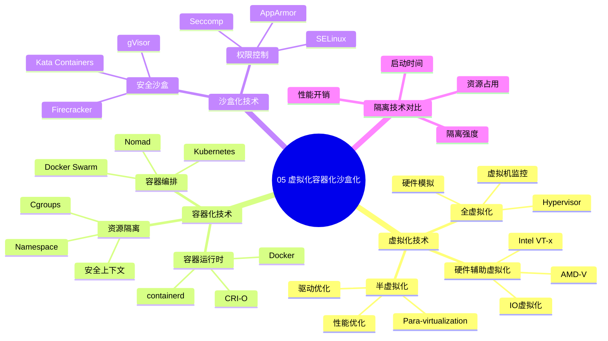

# 05. 虚拟化容器化沙盒化

> **主题**: 虚拟化、容器化、沙盒化技术特征
> **覆盖**: 虚拟化、容器化、沙盒化、隔离技术对比

---

## 📋 目录

- [05. 虚拟化容器化沙盒化](#05-虚拟化容器化沙盒化)
  - [📋 目录](#-目录)
  - [1 子主题索引](#1-子主题索引)
    - [1.0 虚拟化容器化沙盒化思维导图](#10-虚拟化容器化沙盒化思维导图)
  - [2 相关主题](#2-相关主题)
  - [3 核心概念矩阵](#3-核心概念矩阵)

---

## 1 子主题索引

### 1.0 虚拟化容器化沙盒化思维导图

**可视化文档**: 查看 [思维导图与知识矩阵](../思维导图与知识矩阵.md#35-05-虚拟化容器化沙盒化) 获取更详细的思维导图。

- [5.1 虚拟化技术](./05.1_虚拟化技术.md) - Hypervisor、VM、硬件辅助虚拟化
- [5.2 容器化技术](./05.2_容器化技术.md) - Docker、Namespace、Cgroups
- [5.3 沙盒化技术](./05.3_沙盒化技术.md) - Seccomp、gVisor、Firecracker
- [5.4 隔离技术对比](./05.4_隔离技术对比.md) - 虚拟化 vs 容器化 vs 沙盒化
- [5.5 虚拟化容器化沙盒化资源调度系统](./05.5_虚拟化容器化沙盒化资源调度系统.md) - DRS、资源调度模型、智能调度（主文档）
- [5.6 调度系统平台集成专题](./05.6_调度系统平台集成专题.md) - 微服务、DevOps、Service Mesh、大数据、AI/ML、数据库、消息队列、缓存系统集成
- [5.7 调度系统新兴技术集成专题](./05.7_调度系统新兴技术集成专题.md) - 边缘计算、Serverless、IoT、绿色计算、数字孪生、量子计算、区块链、Web3集成
- [5.8 调度系统运维专题](./05.8_调度系统运维专题.md) - 监控、故障恢复、容量规划、多租户管理、合规性审计、运维实践指南
- [5.9 调度系统性能优化专题](./05.9_调度系统性能优化专题.md) - 性能优化策略、性能调优实战案例、性能测试与验证、实施指南
- [5.10 调度系统学习与实施指南专题](./05.10_调度系统学习与实施指南专题.md) - 学习路径、学习资源、实施指南、迁移策略、选型指南
- [5.11 调度系统理论分析与评价体系专题](./05.11_调度系统理论分析与评价体系专题.md) - 调度原理、调度场景、调度方法模型、调度评价模型、测试验证、多维度分析、形式化论证

---

## 2 相关主题

- [02. 系统总线层](../02_系统总线层/README.md) - IOMMU、SR-IOV
- [03. OS抽象层](../03_OS抽象层/README.md) - 进程调度、内存管理
- [06. 调度模型](../06_调度模型/README.md) - 虚拟化调度

---

## 3 核心概念矩阵

| **技术** | **隔离强度** | **性能开销** | **启动时间** | **资源占用** |
|---------|-------------|-------------|-------------|-------------|
| **虚拟化** | ⭐⭐⭐⭐⭐ | 5-15% | 分钟级 | GB级 |
| **容器化** | ⭐⭐⭐ | 1-3% | 秒级 | MB级 |
| **沙盒化** | ⭐⭐⭐⭐ | 1-10% | 毫秒级 | KB-MB级 |

---

**最后更新**: 2025-11-14
