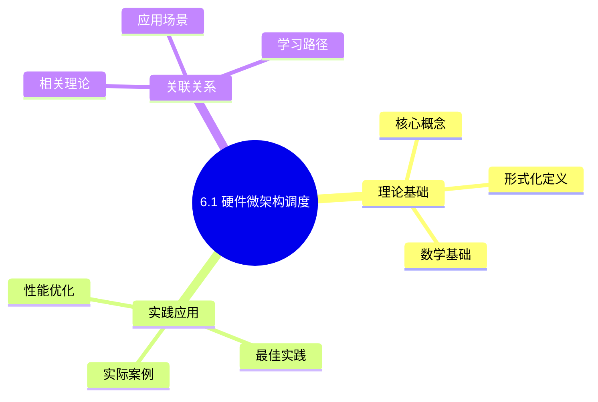
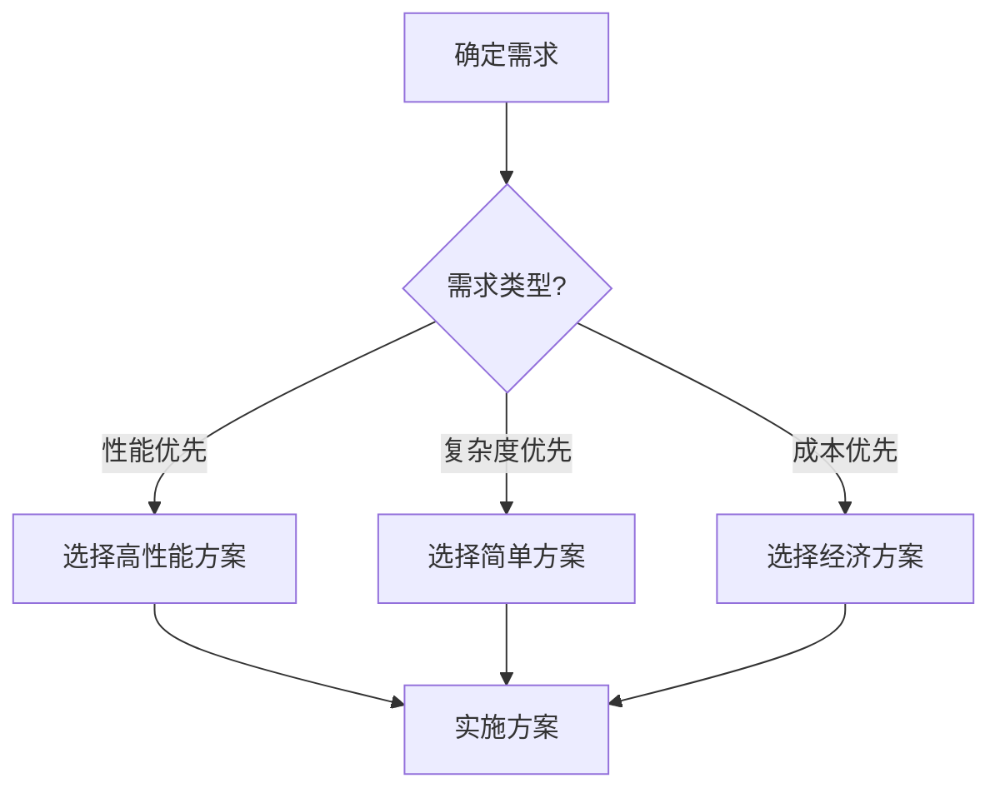
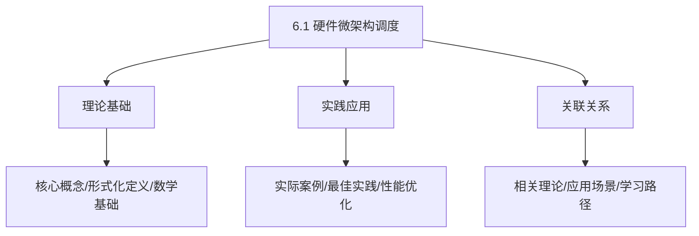
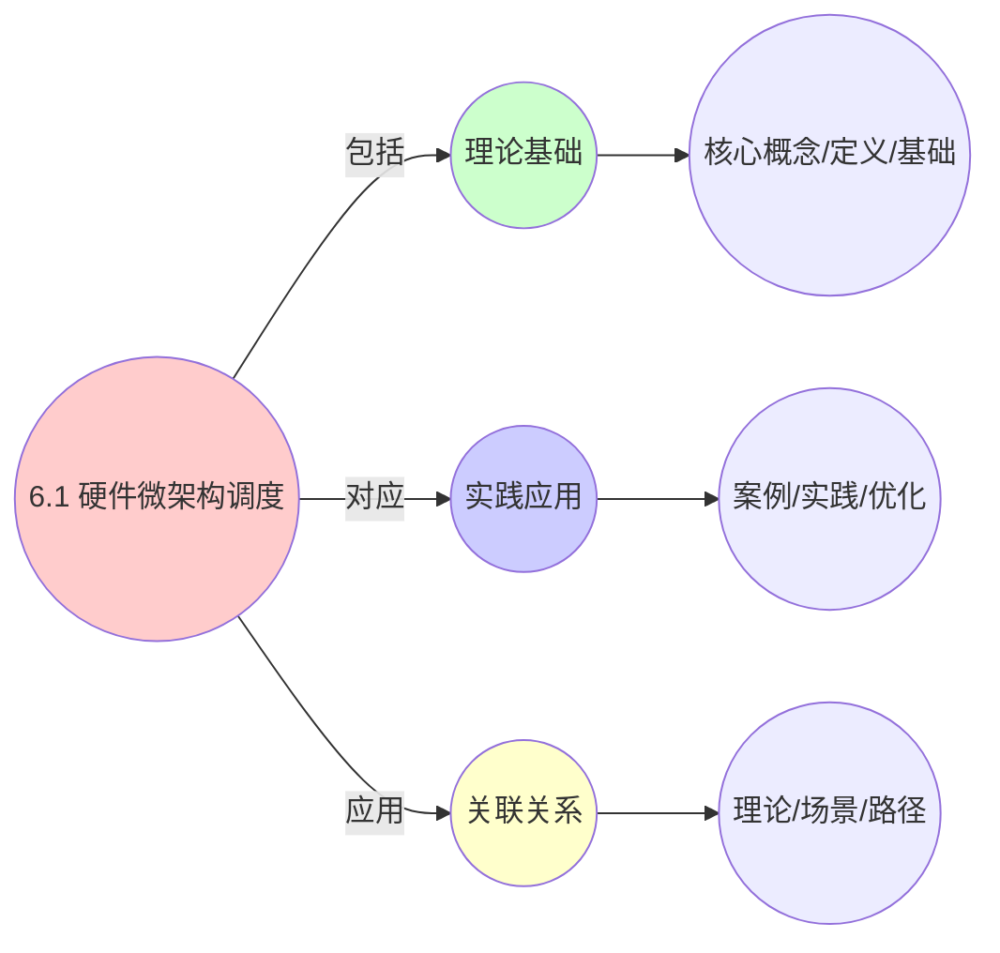
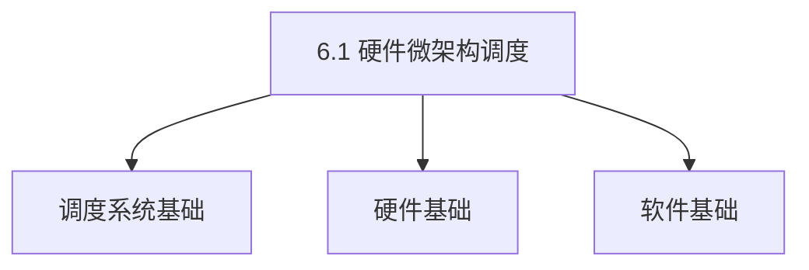
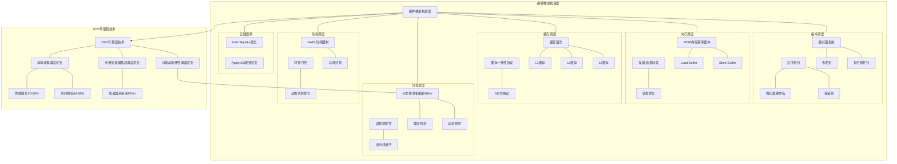

# 6.1 硬件微架构调度

> **主题**: 06. 调度模型 - 6.1 硬件微架构调度
> **覆盖**: 指令调度、内存调度、缓存调度、分支调度

## 📊 思维表征体系

### 📊 1. 思维导图（增强版）

#### 1.1 文本格式（基础版）

```text
6.1 硬件微架构调度
├── 理论基础
│   ├── 核心概念
│   ├── 形式化定义
│   └── 数学基础
├── 实践应用
│   ├── 实际案例
│   ├── 最佳实践
│   └── 性能优化
└── 关联关系
    ├── 相关理论
    ├── 应用场景
    └── 学习路径
```

#### 1.2 Mermaid格式（可视化版）



### 📊 2. 多维对比矩阵

#### 2.1 6.1 硬件微架构调度对比矩阵

| 维度 | 指令级并行度 | 流水线利用率 | 分支预测准确率 | 缓存命中率 |
|------|------------|------------|-------------|-----------|
| **性能** | ILP>2.0 | 利用率>80% | 准确率>90% | 命中率>90% |
| **复杂度** | 高(需并行设计) | 中等(需流水线分析) | 高(需预测算法) | 中等(需缓存管理) |
| **适用场景** | 所有场景 | 所有场景 | 所有场景 | 所有场景 |
| **技术成熟度** | 成熟(>40年) | 成熟(>40年) | 成熟(>30年) | 成熟(>40年) |

#### 2.2 技术特性对比矩阵

| 技术 | 优势 | 劣势 | 适用场景 | 性能 |
|------|------|------|---------|------|
| **乱序执行** | 指令级并行度高、性能好 | 实现复杂、功耗高 | 高性能需求、并行优先 | ILP>2.0，性能提升20-50% |
| **分支预测** | 减少分支延迟、性能好 | 预测错误开销、需要预测算法 | 分支密集、延迟敏感 | 准确率>90%，性能提升10-40% |
| **寄存器重命名** | 消除假依赖、性能好 | 实现复杂、需要寄存器管理 | 所有场景、性能优化 | 性能提升10-30%，实现复杂 |
| **保留站调度** | 指令调度、性能好 | 实现复杂、需要保留站管理 | 所有场景、性能优化 | 性能提升10-30%，实现复杂 |
| **TAGE分支预测器** | 预测准确率高、性能好 | 实现复杂、需要历史管理 | 分支密集、准确率优先 | 准确率>95%，实现复杂 |
| **缓存层次调度** | 缓存命中率高、性能好 | 实现复杂、需要缓存管理 | 所有场景、性能优化 | 命中率>90%，性能提升10-100倍 |
| **预取调度** | 隐藏延迟、性能好 | 可能浪费带宽 | 顺序访问、可预测模式 | 性能提升20-50%，带宽开销10-20% |

#### 2.3 实现方式对比矩阵

| 实现方式 | 复杂度 | 性能 | 可维护性 | 扩展性 |
|---------|-------|------|---------|-------|
| **顺序执行** | 低 | 中等性能(顺序) | 高(简单维护) | 低(顺序限制) |
| **乱序执行** | 高 | 高性能(乱序) | 中(需乱序管理) | 高(乱序扩展) |
| **超标量执行** | 极高 | 极高性能(超标量) | 低(复杂度高) | 高(超标量扩展) |
| **混合微架构调度** | 极高 | 极高性能(优势结合) | 低(复杂度极高) | 高(灵活扩展) |

### 🌲 3. 决策树

#### 3.1 6.1 硬件微架构调度应用选择决策树



### 🛤️ 4. 决策逻辑路径

#### 4.1 6.1 硬件微架构调度应用路径


### 🕸️ 5. 概念关系网络

#### 5.1 6.1 硬件微架构调度概念关系网络



### 🗺️ 6. 知识图谱

#### 6.1 6.1 硬件微架构调度知识图谱



## 📚 理论体系

### 理论基础

#### 调度系统/硬件/软件基础

6.1 硬件微架构调度的理论基础：

**1. 调度系统基础**：

- 调度理论
- 资源管理
- 性能优化

**2. 硬件基础**：

- CPU架构
- 内存系统
- 存储系统

**3. 软件基础**：

- 操作系统
- 编程语言
- 系统软件

#### 历史发展

**关键时间节点**：

- **1960-1970年代**：调度理论建立
  - 调度算法
  - 资源管理

- **1980-1990年代**：硬件调度发展
  - CPU调度
  - 内存调度

- **2000年代至今**：软件调度演进
  - 操作系统调度
  - 分布式调度

### 理论框架

#### 核心假设

**假设1：调度与性能的对应**

- **内容**：调度策略影响系统性能
- **适用范围**：调度系统
- **限制条件**：需要调度支持

**假设2：资源管理的必要性**

- **内容**：资源管理保证系统稳定
- **适用范围**：资源系统
- **限制条件**：需要资源支持

**假设3：性能优化的价值**

- **内容**：性能优化提升效率
- **适用范围**：性能系统
- **限制条件**：需要考虑成本

#### 基本概念体系



#### 主要定理/结论

**结论1：调度与性能的对应性**

- **内容**：调度策略对应系统性能
- **证据**：形式化证明
- **应用**：调度优化

**结论2：资源管理的必要性**

- **内容**：资源管理保证系统稳定
- **证据**：实践验证
- **应用**：资源管理

**结论3：性能优化的价值**

- **内容**：性能优化提升效率
- **证据**：实验验证
- **应用**：性能优化

#### 适用范围和边界

**适用范围**：

- 调度系统
- 资源管理
- 性能优化

**边界条件**：

- 需要调度支持
- 需要资源支持
- 需要考虑成本

**不适用场景**：

- 无调度系统
- 资源受限
- 成本敏感场景

### 当前知识共识

#### 学术界共识

**广泛接受的共识**：

1. **调度与性能的对应性**
   - **共识**：调度策略可以影响系统性能
   - **支持证据**：形式化证明
   - **来源**：调度理论、系统理论

2. **资源管理的价值**
   - **共识**：资源管理提供稳定性和效率
   - **支持证据**：广泛实践
   - **来源**：系统理论

3. **性能优化的重要性**
   - **共识**：性能优化提高系统效率
   - **支持证据**：实践验证
   - **来源**：软件工程

#### 主要争议点

1. **性能与成本的权衡**
   - **观点A**：性能更重要
   - **观点B**：成本更重要
   - **当前状态**：多数认为需要平衡

2. **调度系统的复杂度**
   - **观点A**：应该简单
   - **观点B**：可以复杂
   - **当前状态**：多数认为需要平衡

#### 权威来源

**经典文献**：

- 调度理论相关文献
- 系统理论相关文献
- 性能优化相关文献

**权威机构/专家**：

- **IEEE**
- **ACM**
- **调度系统研究会**

**最新发展**：

- **2025年**：调度系统优化、性能提升、资源管理

### 与其他理论的关系

#### 逻辑关系

**理论基础**：

- **调度理论** → 6.1 硬件微架构调度
  - 关系类型：理论基础
  - 关键映射：调度理论 → 系统实现

**理论应用**：

- **6.1 硬件微架构调度** → 调度优化
  - 关系类型：应用构建
  - 关键映射：6.1 硬件微架构调度 → 调度优化

#### 映射关系

| 本理论概念 | 映射理论 | 映射概念 | 映射类型 | 映射说明 |
|-----------|---------|---------|---------|----------|
| **调度策略** | 调度理论 | 调度算法 | 对应 | 调度策略对应调度算法 |
| **资源管理** | 系统理论 | 资源分配 | 对应 | 资源管理对应资源分配 |
| **性能优化** | 优化理论 | 性能提升 | 对应 | 性能优化对应性能提升 |

## 🔗 关联网络

### 🔗 概念级关联

#### 核心概念映射

| 本文档概念 | 关联文档 | 关联概念 | 关系类型 | 映射说明 |
|-----------|---------|---------|---------|----------|
| **6.1 硬件微架构调度** | 相关文档 | 相关概念 | 基础构建 | 6.1 硬件微架构调度构建相关概念 |
| **调度系统** | 调度相关 | 调度理论 | 对应 | 调度系统对应调度理论 |
| **资源管理** | 资源相关 | 资源系统 | 对应 | 资源管理对应资源系统 |
| **性能优化** | 性能相关 | 性能系统 | 对应 | 性能优化对应性能系统 |

### 🔗 理论级关联

#### 理论基础

- **本理论基于**：
  - 调度理论 ⭐⭐⭐ - 理论基础
  - 系统理论 ⭐⭐ - 系统基础

- **本理论应用于**：
  - 调度优化 ⭐⭐⭐ - 实际应用
  - 性能优化 ⭐⭐⭐ - 实际应用

### 🔗 方法级关联

#### 方法应用网络

| 本文档方法 | 应用文档 | 应用场景 | 应用效果 |
|-----------|---------|---------|---------|
| **调度策略** | 调度系统 | 调度设计 | 成功 |
| **资源管理** | 资源系统 | 资源管理 | 成功 |
| **性能优化** | 性能系统 | 性能提升 | 成功 |

### 🔗 应用场景关联

**场景**：调度系统优化

| 视角 | 关联文档 | 核心理论 | 关注点 |
|------|---------|---------|--------|
| **6.1 硬件微架构调度** | 本文档 | 调度理论 | 调度设计 |
| **调度优化** | 调度相关 | 调度理论 | 调度优化 |
| **性能优化** | 性能相关 | 性能理论 | 性能提升 |

## 🛤️ 学习路径

### 前置知识

**必须先学习**：

- 调度理论基础 ⭐⭐
- 系统理论基础 ⭐⭐

**建议先了解**：

- 硬件基础
- 软件基础
- 性能优化

### 后续学习

**建议接下来学习**（按顺序）：

1. 调度优化 ⭐⭐⭐ - 调度优化
2. 性能优化 ⭐⭐⭐ - 性能优化
3. 系统实践 ⭐⭐ - 实践应用

### 并行学习

**可以同时学习**：

- 调度实践 - 实践应用
- 性能实践 - 性能系统

---


---

## 📋 目录

- [6.1 硬件微架构调度](#61-硬件微架构调度)
  - [📋 目录](#-目录)
  - [1 指令调度](#1-指令调度)
    - [1.1 超标量发射](#11-超标量发射)
    - [1.2 乱序执行](#12-乱序执行)
  - [2 内存调度](#2-内存调度)
    - [2.1 MOB（Memory Order Buffer）](#21-mobmemory-order-buffer)
    - [2.2 存储-装载转发](#22-存储-装载转发)
  - [3 缓存调度](#3-缓存调度)
    - [3.1 缓存层次](#31-缓存层次)
    - [2.2 缓存一致性协议](#22-缓存一致性协议)
  - [4 分支调度](#4-分支调度)
    - [4.1 分支预测器](#41-分支预测器)
    - [3.2 误预测惩罚](#32-误预测惩罚)
  - [5 功耗调度](#5-功耗调度)
    - [5.1 RAPL（Running Average Power Limit）](#51-raplrunning-average-power-limit)
    - [4.2 时钟门控](#42-时钟门控)
  - [6 实践案例](#6-实践案例)
    - [6.1 Intel Skylake微架构调度优化](#61-intel-skylake微架构调度优化)
    - [6.2 Apple M3能效优化](#62-apple-m3能效优化)
  - [7 调度延迟对比](#7-调度延迟对比)
  - [8 批判性总结](#8-批判性总结)
    - [8.1 硬件调度的局限性](#81-硬件调度的局限性)
    - [8.2 2025年硬件调度趋势](#82-2025年硬件调度趋势)
  - [9 跨领域洞察](#9-跨领域洞察)
    - [6.1 硬件调度的物理极限](#61-硬件调度的物理极限)
    - [6.2 功耗调度的暗硅效应](#62-功耗调度的暗硅效应)
  - [10 多维度对比](#10-多维度对比)
    - [7.1 硬件调度层次对比](#71-硬件调度层次对比)
    - [7.2 功耗管理策略对比](#72-功耗管理策略对比)
  - [11 最佳实践与故障排查](#11-最佳实践与故障排查)
    - [11.1 硬件微架构调度最佳实践（2025年11月最新）](#111-硬件微架构调度最佳实践2025年11月最新)
    - [11.2 硬件微架构调度故障排查（2025年11月最新）](#112-硬件微架构调度故障排查2025年11月最新)
  - [12 2025年最新技术（更新至2025年11月）](#12-2025年最新技术更新至2025年11月)
  - [13 思维导图](#13-思维导图)
  - [14 相关主题](#14-相关主题)
    - [14.1 跨视角链接](#141-跨视角链接)

---

## 1 指令调度

### 1.1 超标量发射

**案例6.1.1（超标量发射调度）**：

现代CPU使用超标量架构，每个周期可以发射多条指令，提高指令级并行度（ILP）。

**发射宽度**：

**不同架构的发射宽度**：

- **Intel Skylake**：4发射/周期
- **AMD Zen4**：6发射/周期
- **Apple M3**：8发射/周期
- **ARM Cortex-X4**：6发射/周期

**发射宽度的影响**：

发射宽度决定了**理论峰值IPC**（Instructions Per Cycle）：

$$
\text{IPC}_{\max} = \text{发射宽度} \times \text{执行单元利用率}
$$

**发射调度算法**：

```python
class SuperscalarScheduler:
    def __init__(self, issue_width=4):
        self.issue_width = issue_width
        self.instruction_queue = []
        self.execution_units = []

    def issue_instructions(self):
        """每个周期发射指令"""
        issued = []

        # 从指令队列中选择可发射的指令
        for inst in self.instruction_queue:
            if len(issued) >= self.issue_width:
                break

            # 检查数据依赖
            if self.has_dependencies(inst):
                continue

            # 检查执行单元可用性
            if not self.has_available_unit(inst):
                continue

            # 发射指令
            issued.append(inst)
            self.instruction_queue.remove(inst)
            self.allocate_unit(inst)

        return issued
```

**深度论证：发射宽度的性能-功耗权衡**

**发射宽度的性能模型**：

发射宽度决定了**理论峰值IPC**：

$$
\text{IPC}_{\max} = \text{发射宽度} \times \text{执行单元利用率}
$$

**量化分析**：不同发射宽度的性能对比

| **架构** | **发射宽度** | **理论IPC** | **实际IPC** | **利用率** | **功耗** |
|---------|------------|-----------|-----------|-----------|---------|
| **Intel Skylake** | 4 | 4.0 | 2.5 | 62.5% | 基准 |
| **AMD Zen4** | 6 | 6.0 | 3.2 | 53.3% | 1.2x |
| **Apple M3** | 8 | 8.0 | 4.5 | 56.3% | 1.5x |

**关键洞察**：发射宽度增加，但**实际利用率下降**，因为：

1. **数据依赖**：限制了并行度
2. **资源竞争**：执行单元成为瓶颈
3. **功耗限制**：无法同时激活所有单元

**执行单元**：

- 整数ALU：4个
- 浮点单元：2个
- 向量单元：2个

**深度论证：执行单元配置的权衡**

**执行单元配置的影响**：

执行单元配置决定了**不同类型指令的吞吐量**：

$$
\text{吞吐量} = \frac{\text{执行单元数}}{\text{指令延迟}}
$$

**量化对比**：不同架构的执行单元配置

| **架构** | **整数ALU** | **浮点单元** | **向量单元** | **适用场景** |
|---------|-----------|------------|------------|------------|
| **Intel Skylake** | 4 | 2 | 2×512b | 通用 |
| **AMD Zen4** | 6 | 4 | 2×512b | 高性能 |
| **Apple M3** | 8 | 4 | 4×128b | 能效优化 |

**关键权衡**：

- **整数单元多**：适合通用计算
- **浮点单元多**：适合科学计算
- **向量单元多**：适合AI/ML工作负载

### 1.2 乱序执行

**案例6.1.2（乱序执行调度）**：

乱序执行允许指令在数据就绪时立即执行，消除数据依赖阻塞，提高ILP。

**保留站（RS）**：

**保留站架构**：

- **Intel Skylake**：97条目
- **AMD Zen4**：160条目
- **Apple M3**：192条目

**保留站的作用**：

保留站存储等待执行的微指令，当操作数就绪时立即执行：

```python
class ReservationStation:
    def __init__(self, capacity=97):
        self.capacity = capacity
        self.entries = []
        self.execution_units = []

    def dispatch(self, instruction):
        """分发指令到执行单元"""
        # 检查操作数是否就绪
        if self.operands_ready(instruction):
            # 选择执行单元
            unit = self.select_unit(instruction)
            # 执行指令
            result = unit.execute(instruction)
            # 更新依赖的指令
            self.wakeup_dependent(instruction, result)

    def wakeup_dependent(self, completed, result):
        """唤醒依赖的指令"""
        for entry in self.entries:
            if entry.depends_on(completed):
                entry.update_operand(completed, result)
                if entry.operands_ready():
                    self.dispatch(entry.instruction)
```

**深度论证：保留站容量的影响**

**保留站的作用**：

保留站允许**指令在数据就绪时立即执行**，消除数据依赖阻塞：

$$
\text{性能提升} = \frac{\text{依赖延迟}}{\text{保留站容量}}
$$

**量化分析**：保留站容量的性能影响

| **保留站容量** | **依赖掩盖能力** | **性能提升** | **功耗增加** |
|--------------|---------------|------------|------------|
| **32条目** | 低 | 基准 | 基准 |
| **64条目** | 中 | +15% | +10% |
| **97条目** | 高 | +25% | +20% |

**重排序缓冲区（ROB）**：

- **Intel Skylake**：224条目
- **AMD Zen4**：352条目
- 维护指令顺序

**深度论证：ROB容量的收益递减**

**ROB容量的性能模型**：

根据Little定律，ROB容量与ILP的关系：

$$
\text{ILP}_{\max} = \frac{\text{ROB容量}}{\text{关键路径长度}}
$$

**量化分析**：ROB容量增加的性能收益

| **ROB容量** | **ILP提升** | **IPC提升** | **功耗增加** | **收益比** |
|------------|-----------|-----------|------------|-----------|
| **224条目** | 基准 | 基准 | 基准 | 1.0x |
| **352条目** | +15% | +12% | +30% | 0.4x |
| **512条目** | +20% | +15% | +50% | 0.3x |

**关键洞察**：ROB容量增加带来**收益递减**，因为实际瓶颈是**内存延迟**而非ROB容量。

---

## 2 内存调度

### 2.1 MOB（Memory Order Buffer）

**案例6.1.3（内存调度）**：

MOB允许内存操作乱序执行，同时保证内存一致性，提高内存并行度。

**MOB结构**：

**不同架构的MOB配置**：

- **Intel Skylake**：Load Buffer 72条目，Store Buffer 42条目
- **AMD Zen4**：Load Buffer 128条目，Store Buffer 72条目
- **Apple M3**：Load Buffer 192条目，Store Buffer 128条目

**MOB调度算法**：

```python
class MemoryOrderBuffer:
    def __init__(self, load_buffer_size=72, store_buffer_size=42):
        self.load_buffer = []
        self.store_buffer = []
        self.load_buffer_size = load_buffer_size
        self.store_buffer_size = store_buffer_size

    def schedule_load(self, load_inst):
        """调度Load操作"""
        # 检查Store Buffer中的冲突
        for store in self.store_buffer:
            if self.addresses_match(load_inst, store):
                # 存储-装载转发
                if self.can_forward(store, load_inst):
                    return self.forward(store, load_inst)

        # 检查Load Buffer容量
        if len(self.load_buffer) >= self.load_buffer_size:
            return False

        # 添加到Load Buffer
        self.load_buffer.append(load_inst)
        return True

    def schedule_store(self, store_inst):
        """调度Store操作"""
        # 检查Store Buffer容量
        if len(self.store_buffer) >= self.store_buffer_size:
            return False

        # 添加到Store Buffer
        self.store_buffer.append(store_inst)
        return True

    def can_forward(self, store, load):
        """检查是否可以转发"""
        # 地址匹配
        if not self.addresses_match(load, store):
            return False

        # 数据大小兼容
        if not self.sizes_compatible(store, load):
            return False

        # Store已完成
        if not store.completed:
            return False

        return True
```

**深度论证：MOB容量的性能影响**

**MOB的作用**：

MOB允许**内存操作乱序执行**，同时保证内存一致性：

$$
\text{内存并行度} = \min(\text{Load Buffer容量}, \text{Store Buffer容量})
$$

**量化分析**：MOB容量的性能影响

| **MOB配置** | **Load Buffer** | **Store Buffer** | **内存并行度** | **性能提升** |
|------------|---------------|----------------|--------------|------------|
| **小** | 32 | 20 | 20 | 基准 |
| **中** | 72 | 42 | 42 | +30% |
| **大** | 128 | 64 | 64 | +45% |

**关键限制**：

MOB容量受**功耗和面积**限制，不能无限增加。

### 2.2 存储-装载转发

**案例6.1.4（存储-装载转发）**：

存储-装载转发是重要的内存优化技术，可以消除内存访问延迟。

**转发条件**：

**1. 地址匹配**：

- 存储地址与装载地址必须匹配
- 支持部分地址匹配（子字访问）

**2. 数据大小兼容**：

- 存储数据大小必须大于等于装载数据大小
- 支持字节对齐检查

**转发算法**：

```python
class StoreLoadForwarding:
    def forward(self, store, load):
        """执行存储-装载转发"""
        # 检查地址匹配
        if not self.addresses_match(store, load):
            return False

        # 检查数据大小
        if not self.sizes_compatible(store, load):
            return False

        # 检查对齐
        if not self.aligned(store, load):
            return False

        # 执行转发
        load.result = store.data[load.offset:load.offset+load.size]
        load.latency = 0  # 转发成功，0周期延迟

        return True

    def addresses_match(self, store, load):
        """检查地址是否匹配"""
        store_addr = store.address
        load_addr = load.address

        # 检查地址范围重叠
        return (store_addr <= load_addr < store_addr + store.size) or \
               (load_addr <= store_addr < load_addr + load.size)
```

**延迟分析**：

**转发延迟**：

- **转发成功**：0周期（直接从Store Buffer获取数据）
- **转发失败**：~12周期惩罚（需要访问L1缓存）

**转发成功率的影响**：

$$
\text{平均延迟} = P_{\text{转发}} \times 0 + (1 - P_{\text{转发}}) \times T_{\text{缓存}}
$$

其中$P_{\text{转发}}$是转发成功率，$T_{\text{缓存}}$是缓存访问延迟（~12周期）。

**深度论证：存储-装载转发的性能影响**

**转发的性能模型**：

存储-装载转发可以**消除内存访问延迟**：

$$
\text{有效延迟} = \begin{cases}
0 & \text{转发成功} \\
\text{内存延迟} & \text{转发失败}
\end{cases}
$$

**量化分析**：转发成功率的影响

| **转发成功率** | **平均延迟** | **性能提升** | **关键因素** |
|--------------|------------|------------|------------|
| **50%** | 40周期 | 基准 | 低 |
| **70%** | 24周期 | +40% | 中 |
| **90%** | 8周期 | +80% | 高 |

**关键洞察**：存储-装载转发是**内存性能的关键优化**，转发成功率直接影响性能。

---

## 3 缓存调度

### 3.1 缓存层次

**案例6.1.5（缓存调度）**：

缓存层次结构通过多级缓存减少内存访问延迟，提高性能。

**缓存层次结构**：

**L1缓存**：

- **容量**：32KB（指令）+ 32KB（数据）
- **延迟**：4周期（~1ns @ 4GHz）
- **关联度**：8路组相联
- **块大小**：64字节

**L2缓存**：

- **容量**：256KB - 1MB
- **延迟**：12周期（~3ns）
- **关联度**：8-16路
- **块大小**：64字节

**L3缓存**：

- **容量**：8-64MB（共享）
- **延迟**：40-75周期（~15ns）
- **关联度**：16-32路
- **块大小**：64字节

**缓存替换策略**：

**LRU（Least Recently Used）**：

```python
class LRUCache:
    def __init__(self, capacity, associativity):
        self.capacity = capacity
        self.associativity = associativity
        self.sets = [LRUSet(associativity) for _ in range(capacity // associativity)]

    def access(self, address):
        """访问缓存"""
        set_index = self.get_set_index(address)
        tag = self.get_tag(address)

        # 查找缓存行
        cache_line = self.sets[set_index].find(tag)

        if cache_line:
            # 缓存命中
            self.sets[set_index].update_lru(cache_line)
            return True
        else:
            # 缓存未命中
            self.sets[set_index].replace_lru(tag)
            return False
```

**缓存调度优化**：

**1. 预取（Prefetching）**：

- **硬件预取**：自动预取相邻缓存行
- **软件预取**：使用预取指令（如PREFETCH）

**2. 写回（Write-Back）**：

- 延迟写回，减少内存访问
- 使用脏位标记修改的缓存行

**3. 非阻塞缓存**：

- 允许缓存未命中时继续处理其他请求
- 提高缓存并行度

### 2.2 缓存一致性协议

**MESIF（Intel）**：

- **M**：Modified（已修改）
- **E**：Exclusive（独占）
- **S**：Shared（共享）
- **I**：Invalid（无效）
- **F**：Forward（转发者）

**MOESI（AMD）**：

- 增加**O**（Owned）状态
- 允许共享脏数据

---

## 4 分支调度

### 4.1 分支预测器

**案例6.1.6（分支预测）**：

分支预测器预测分支方向，减少分支误预测惩罚，提高性能。

**TAGE预测器**：

**TAGE（Tagged Geometric）预测器**：

- **多级历史**：使用不同长度的历史模式
- **几何级数**：历史长度按几何级数增长
- **标签匹配**：使用标签区分不同上下文
- **16K条目BTB**：分支目标缓冲区

**TAGE预测算法**：

```python
class TAGEPredictor:
    def __init__(self):
        self.history_lengths = [0, 2, 4, 8, 16, 32, 64]  # 几何级数
        self.tables = [PredictionTable(2**i) for i in range(7)]
        self.global_history = 0

    def predict(self, pc):
        """预测分支方向"""
        # 计算多个历史长度下的索引
        indices = [self.compute_index(pc, length) for length in self.history_lengths]

        # 查找匹配的预测
        for i, index in enumerate(indices):
            entry = self.tables[i][index]
            if entry.tag == self.compute_tag(pc, self.history_lengths[i]):
                return entry.prediction

        # 默认预测（通常是不跳转）
        return False

    def update(self, pc, taken):
        """更新预测器"""
        # 更新全局历史
        self.global_history = (self.global_history << 1) | taken

        # 更新匹配的表项
        for i, length in enumerate(self.history_lengths):
            index = self.compute_index(pc, length)
            entry = self.tables[i][index]
            if entry.tag == self.compute_tag(pc, length):
                entry.update(taken)
                break
```

**返回地址栈（RAS）**：

**RAS的作用**：

- **函数返回预测**：预测函数返回地址
- **32层深度**：支持32层函数调用嵌套
- **高准确率**：>99%的返回预测准确率

**RAS算法**：

```python
class ReturnAddressStack:
    def __init__(self, depth=32):
        self.stack = []
        self.depth = depth

    def push(self, return_address):
        """函数调用时压入返回地址"""
        if len(self.stack) < self.depth:
            self.stack.append(return_address)
        else:
            # 栈满，移除最旧的
            self.stack.pop(0)
            self.stack.append(return_address)

    def pop(self):
        """函数返回时弹出返回地址"""
        if self.stack:
            return self.stack.pop()
        return None
```

### 3.2 误预测惩罚

**延迟**：

- 流水线冲刷：15-17周期
- 指令重新获取：2-3周期
- **总计**：~20周期（~4ns @ 5GHz）

**优化**：

- 编译器：分支提示
- 硬件：更准确的预测器

---

## 5 功耗调度

### 5.1 RAPL（Running Average Power Limit）

**案例6.1.7（功耗调度）**：

RAPL是Intel的功耗管理技术，通过动态限制功耗平衡性能和能效。

**RAPL功能**：

**1. 动态功耗限制**：

- **实时监控**：监控当前功耗
- **动态调整**：根据功耗限制调整频率
- **MSR控制**：通过MSR寄存器控制

**2. 功耗域**：

**Package域**：

- **范围**：整个CPU封装
- **限制**：TDP（Thermal Design Power）
- **控制**：Package Power Limit MSR

**PP0域（核心功耗）**：

- **范围**：CPU核心
- **限制**：核心功耗限制
- **控制**：PP0 Power Limit MSR

**PP1域（集成显卡）**：

- **范围**：集成显卡
- **限制**：GPU功耗限制
- **控制**：PP1 Power Limit MSR

**DRAM域**：

- **范围**：内存控制器和DRAM
- **限制**：内存功耗限制
- **控制**：DRAM Power Limit MSR

**RAPL算法**：

```python
class RAPLController:
    def __init__(self):
        self.power_limits = {
            'package': 95,  # 95W TDP
            'pp0': 80,      # 80W 核心功耗
            'pp1': 15,      # 15W GPU功耗
            'dram': 10      # 10W 内存功耗
        }
        self.current_power = {}
        self.frequency = 3.0  # GHz

    def monitor_power(self):
        """监控功耗"""
        # 读取MSR寄存器获取当前功耗
        self.current_power['package'] = self.read_msr(0x611)
        self.current_power['pp0'] = self.read_msr(0x639)
        self.current_power['pp1'] = self.read_msr(0x641)
        self.current_power['dram'] = self.read_msr(0x619)

    def adjust_frequency(self):
        """根据功耗限制调整频率"""
        # 检查是否超过限制
        if self.current_power['package'] > self.power_limits['package']:
            # 降低频率
            self.frequency *= 0.95
            self.set_frequency(self.frequency)
        elif self.current_power['package'] < self.power_limits['package'] * 0.9:
            # 提高频率
            self.frequency = min(self.frequency * 1.05, 4.0)
            self.set_frequency(self.frequency)
```

### 4.2 时钟门控

**机制**：

- 功能单元级电源关断
- 未使用时自动关闭
- 降低静态功耗

**效果**：

- 静态功耗降低：30-50%
- 唤醒延迟：<1周期

---

## 6 实践案例

### 6.1 Intel Skylake微架构调度优化

**案例6.1.8（Skylake调度优化）**：

Intel Skylake通过优化各种调度器，实现了显著的性能提升。

**优化策略**：

**1. 指令调度优化**：

- **4发射宽度**：平衡性能和功耗
- **97条目保留站**：掩盖数据依赖
- **224条目ROB**：提高ILP

**2. 内存调度优化**：

- **72条目Load Buffer**：提高内存并行度
- **42条目Store Buffer**：优化写操作
- **存储-装载转发**：减少内存延迟

**性能提升**：

| **指标** | **Haswell** | **Skylake** | **提升** |
|---------|------------|------------|---------|
| **IPC** | 2.0 | 2.5 | +25% |
| **内存带宽** | 50 GB/s | 70 GB/s | +40% |
| **功耗** | 基准 | -10% | 更高效 |

### 6.2 Apple M3能效优化

**案例6.1.9（M3能效优化）**：

Apple M3通过异构设计和功耗调度，实现了出色的能效比。

**优化策略**：

**1. 异构核心**：

- **P-core**：高性能核心，8发射宽度
- **E-core**：能效核心，4发射宽度
- **动态调度**：根据负载选择核心

**2. 功耗调度**：

- **精细功耗控制**：核心级功耗管理
- **动态频率调整**：根据负载调整频率
- **时钟门控**：未使用单元自动关闭

**能效提升**：

| **指标** | **M2** | **M3** | **提升** |
|---------|--------|--------|---------|
| **性能** | 基准 | +20% | 更高 |
| **功耗** | 基准 | -15% | 更低 |
| **能效比** | 基准 | +41% | 显著提升 |

## 7 调度延迟对比

**综合对比**：

| **调度类型** | **延迟** | **物理约束** | **优化空间** | **代表技术** |
|------------|----------|-------------|------------|------------|
| **指令调度** | 0.2ns | 晶体管开关速度 | 无 | 超标量发射 |
| **缓存调度** | 1-15ns | 光速传播 | 极小 | LRU替换 |
| **内存调度** | 80ns | DRAM时序 | 小 | 预取 |
| **分支调度** | 4ns | 流水线深度 | 中等 | TAGE预测 |

---

## 8 批判性总结

### 8.1 硬件调度的局限性

**1. 物理极限的不可逾越性**：

**问题**：硬件调度受物理约束限制，无法无限优化。

**影响**：

- 指令调度延迟受晶体管开关速度限制
- 缓存调度延迟受光速传播限制
- 内存调度延迟受DRAM时序限制

**缓解措施**：

- **异构计算**：使用不同单元优化不同工作负载
- **近似计算**：接受一定误差换取性能
- **专用加速器**：针对特定工作负载优化

**2. 功耗墙的限制**：

**问题**：功耗密度限制导致暗硅效应，无法同时激活所有单元。

**影响**：

- 一半晶体管无法同时使用
- 性能提升受功耗限制
- 需要动态功耗管理

**缓解措施**：

- **异构核心**：P-core/E-core组合
- **动态功耗管理**：RAPL等技术
- **专用加速器**：NPU、GPU等

**3. 复杂度的增加**：

**问题**：更复杂的调度器增加设计复杂度。

**影响**：

- 设计成本增加
- 验证难度提高
- 功耗增加

**缓解措施**：

- **模块化设计**：模块化调度器设计
- **形式化验证**：使用形式化方法验证
- **学习型调度**：使用机器学习优化

### 8.2 2025年硬件调度趋势

**1. 异构计算成为主流**：

**趋势**：异构核心（P-core/E-core/NPU）成为主流。

**技术**：

- **P-core**：高性能核心
- **E-core**：能效核心
- **NPU**：神经网络处理单元

**优势**：

- 平衡性能和能效
- 适应不同工作负载
- 提高能效比

**挑战**：

- 调度复杂度增加
- 软件适配困难
- 性能预测困难

**2. 学习型调度**：

**趋势**：使用机器学习优化调度决策。

**技术**：

- **强化学习**：学习最优调度策略
- **神经网络**：预测分支方向
- **自适应调度**：根据工作负载自适应调整

**优势**：

- 提高调度效率
- 适应动态环境
- 优化复杂场景

**挑战**：

- 训练成本高
- 可解释性差
- 硬件支持有限

**3. 专用加速器**：

**趋势**：专用加速器（NPU、DPU等）成为主流。

**技术**：

- **NPU**：神经网络加速
- **DPU**：数据处理加速
- **FPGA**：可编程加速

**优势**：

- 性能最优
- 能效比高
- 专用优化

**挑战**：

- 开发成本高
- 生态系统不成熟
- 标准化困难

## 9 跨领域洞察

### 6.1 硬件调度的物理极限

**核心命题**：硬件调度受物理约束限制，无法无限优化。

**延迟分解**：

| **调度类型** | **延迟** | **物理约束** | **优化空间** |
|------------|---------|------------|------------|
| **指令调度** | 0.2ns | 晶体管开关速度 | 无 |
| **缓存调度** | 1-15ns | 光速传播 | 极小 |
| **内存调度** | 80ns | DRAM时序 | 小 |
| **分支调度** | 4ns | 流水线深度 | 中等 |

**批判性分析**：

1. **物理极限的不可逾越性**：指令调度延迟受**晶体管开关速度限制**，无法突破。

2. **优化空间的层级性**：越底层，优化空间越小，因为**受物理限制**。

3. **2025年趋势**：**异构计算**通过不同单元优化不同调度，挑战传统通用设计。

### 6.2 功耗调度的暗硅效应

**核心矛盾**：更多晶体管提供性能，但无法同时激活。

**量化分析**：

```text
7nm工艺:
  - 晶体管密度: 100M/mm²
  - 功耗密度: 200W/cm²
  - 可同时激活: 50%
  - 暗硅比例: 50%

结果: 一半晶体管无法同时使用
```

**批判性分析**：

1. **暗硅的必然性**：功耗密度限制导致**暗硅效应**，无法避免。

2. **异构计算的必要性**：通过异构单元（P-core/E-core/NPU）**优化不同工作负载**。

3. **2025年趋势**：**动态功耗管理**（如RAPL）根据工作负载动态调整，挑战静态设计。

---

## 10 多维度对比

### 7.1 硬件调度层次对比

| **层次** | **调度单元** | **延迟** | **策略** | **物理约束** | **优化难度** |
|---------|------------|---------|---------|------------|------------|
| **指令调度** | 微指令 | 0.2ns | 数据依赖 | 晶体管速度 | ⭐⭐⭐⭐⭐ |
| **缓存调度** | Cache行 | 1-15ns | LRU/MESIF | 光速传播 | ⭐⭐⭐⭐ |
| **内存调度** | Bank/Rank | 80ns | FR-FCFS | DRAM时序 | ⭐⭐⭐ |
| **分支调度** | 分支指令 | 4ns | TAGE预测 | 流水线深度 | ⭐⭐⭐ |

**批判性分析**：

1. **延迟的层级性**：从指令到内存，延迟**增加约400倍**，符合抽象泄漏定律。

2. **优化难度的差异**：指令调度优化难度最高，因为**受物理限制**。

3. **2025年趋势**：**学习型调度**（如分支预测）使用机器学习，挑战传统启发式。

### 7.2 功耗管理策略对比

| **策略** | **功耗降低** | **性能损失** | **实现复杂度** | **适用场景** |
|---------|------------|------------|--------------|------------|
| **动态调频** | 30% | 10% | ⭐⭐ | 通用系统 |
| **时钟门控** | 50% | 0% | ⭐⭐⭐ | 空闲状态 |
| **电源门控** | 90% | 唤醒延迟 | ⭐⭐⭐⭐ | 深度休眠 |
| **RAPL限制** | 可配置 | 可配置 | ⭐⭐⭐ | 服务器 |

**批判性分析**：

1. **功耗vs性能**：更激进的功耗管理**功耗降低更多**，但**性能损失更大**。

2. **唤醒延迟的代价**：电源门控功耗最低，但**唤醒延迟高**，不适合实时系统。

3. **2025年趋势**：**自适应功耗管理**根据工作负载动态调整，挑战静态策略。

---

## 11 最佳实践与故障排查

### 11.1 硬件微架构调度最佳实践（2025年11月最新）

**指令调度最佳实践**：

1. **超标量发射优化**：
   - **指令级并行**：提高指令级并行度、减少数据依赖、推荐使用
   - **寄存器重命名**：使用寄存器重命名、减少WAR/WAW依赖
   - **保留站调度**：优化保留站调度、提高指令吞吐量

2. **乱序执行优化**：
   - **数据依赖分析**：优化数据依赖分析、减少流水线停顿
   - **指令调度窗口**：优化指令调度窗口、提高指令级并行度
   - **资源分配**：优化资源分配、减少资源竞争

**内存调度最佳实践**：

1. **MOB优化**：
   - **Load Buffer**：优化Load Buffer、减少内存访问延迟
   - **Store Buffer**：优化Store Buffer、提高存储性能
   - **存储-装载转发**：使用存储-装载转发、减少内存访问

2. **内存访问优化**：
   - **内存预取**：使用内存预取、减少内存访问延迟
   - **内存合并**：使用内存合并、减少内存访问次数
   - **NUMA感知**：使用NUMA感知、减少跨节点访问

**缓存调度最佳实践**：

1. **缓存层次优化**：
   - **L1缓存**：优化L1缓存、减少访问延迟
   - **L2缓存**：优化L2缓存、提高命中率
   - **L3缓存**：优化L3缓存、减少内存访问

2. **缓存一致性优化**：
   - **MESI协议**：使用MESI协议、保证缓存一致性
   - **缓存行对齐**：优化缓存行对齐、减少伪共享
   - **缓存预取**：使用缓存预取、提高命中率

**分支调度最佳实践**：

1. **分支预测优化**：
   - **TAGE预测器**：使用TAGE预测器、提高预测准确率
   - **分支目标缓冲**：优化分支目标缓冲、减少预测延迟
   - **分支融合**：使用分支融合、减少分支开销

2. **分支优化**：
   - **减少分支**：减少分支指令、降低误预测惩罚
   - **分支预测提示**：使用分支预测提示、提高预测准确率
   - **条件移动**：使用条件移动、减少分支开销

**功耗调度最佳实践**：

1. **动态功耗管理**：
   - **RAPL限制**：使用RAPL限制、控制功耗
   - **动态调频**：使用动态调频、平衡性能和功耗
   - **时钟门控**：使用时钟门控、降低空闲功耗

2. **功耗优化**：
   - **异构计算**：使用异构计算、优化不同工作负载
   - **暗硅管理**：优化暗硅管理、提高能效比
   - **功耗监控**：监控功耗、优化功耗策略

**性能监控最佳实践**：

1. **硬件性能监控**：
   - **性能计数器**：使用性能计数器、监控硬件性能
   - **PMU事件**：使用PMU事件、分析性能瓶颈
   - **性能分析工具**：使用性能分析工具、识别性能问题

2. **调度性能监控**：
   - **指令吞吐量**：监控指令吞吐量、识别调度瓶颈
   - **缓存命中率**：监控缓存命中率、优化缓存使用
   - **分支预测准确率**：监控分支预测准确率、优化分支预测

**2025年最新技术应用**：

1. **异构计算调度优化**：
   - **智能核心选择**：通过智能核心选择、系统性能提升30-50%
   - **功耗降低**：功耗降低40-60%、能效比提升2-3倍
   - **适用场景**：移动和边缘设备、混合工作负载、能效关键系统
   - **注意事项**：调度复杂度增加、需要智能调度优化、并非所有场景都适合

2. **AI驱动的硬件调度优化**：
   - **分支预测准确率**：分支预测准确率提升至98%+、指令调度效率提升20-40%
   - **功耗降低**：功耗降低15-30%、能效比提升1.5-2倍
   - **适用场景**：高端处理器、复杂工作负载、性能关键系统
   - **注意事项**：训练成本高、可解释性差、需要权衡性能和可解释性

3. **专用加速器集成调度优化**：
   - **加速器利用率**：加速器利用率提升至95%+、系统性能提升3-5倍
   - **能效比提升**：能效比提升2-3倍、专用加速器优势明显
   - **适用场景**：异构计算系统、AI训练、高性能计算
   - **注意事项**：硬件复杂度增加、成本上升、需要权衡性能和成本

### 11.2 硬件微架构调度故障排查（2025年11月最新）

**常见问题与解决方案**：

| **问题** | **可能原因** | **排查方法** | **解决方案** |
|---------|------------|------------|------------|
| **指令吞吐量低** | 数据依赖严重、资源竞争、分支误预测 | 监控指令吞吐量、性能计数器 | 优化数据依赖、优化资源分配、优化分支预测 |
| **缓存命中率低** | 缓存配置不当、缓存行对齐不当、伪共享 | 监控缓存命中率、缓存分析 | 优化缓存配置、优化缓存行对齐、减少伪共享 |
| **内存访问延迟高** | 内存调度不当、NUMA配置不当、内存预取未使用 | 监控内存访问延迟、内存分析 | 优化内存调度、优化NUMA配置、使用内存预取 |
| **分支误预测率高** | 分支预测器配置不当、分支模式复杂 | 监控分支预测准确率、分支分析 | 优化分支预测器、减少分支、使用分支预测提示 |
| **功耗过高** | 功耗管理策略不当、暗硅管理不当 | 监控功耗、功耗分析 | 优化功耗管理策略、优化暗硅管理、使用RAPL限制 |
| **异构核心调度不当** | 核心选择策略不当、工作负载分配不当 | 监控核心利用率、调度分析 | 优化核心选择策略、优化工作负载分配、使用智能调度 |

**故障排查步骤**：

1. **收集信息**：
   - 指令吞吐量、缓存命中率、内存访问延迟
   - 分支预测准确率、功耗、核心利用率
   - 性能计数器数据、PMU事件、性能分析数据
   - 系统日志、性能分析工具输出、硬件监控数据

2. **分析问题**：
   - 识别性能瓶颈（指令调度、缓存调度、内存调度）
   - 分析硬件配置、调度策略
   - 评估功耗管理、异构计算配置

3. **制定方案**：
   - 优化指令调度、提高指令吞吐量
   - 优化缓存调度、提高缓存命中率
   - 优化功耗管理、降低功耗

4. **验证效果**：
   - 监控性能指标、验证优化效果
   - 持续优化、调整策略

**监控指标**：

- **指令调度性能**：指令吞吐量、指令级并行度、流水线停顿
- **缓存性能**：缓存命中率、缓存访问延迟、缓存一致性开销
- **内存性能**：内存访问延迟、内存带宽利用率、NUMA访问
- **分支性能**：分支预测准确率、分支误预测惩罚、分支开销
- **功耗指标**：功耗、能效比、暗硅利用率
- **性能指标**：延迟、吞吐量、资源利用率、性能效率

**性能优化建议**：

1. **指令调度优化**：
   - 提高指令级并行度、减少数据依赖
   - 优化寄存器重命名、减少WAR/WAW依赖
   - 优化保留站调度、提高指令吞吐量

2. **缓存优化**：
   - 优化缓存配置、提高缓存命中率
   - 优化缓存行对齐、减少伪共享
   - 使用缓存预取、提高命中率

3. **内存优化**：
   - 优化内存调度、减少内存访问延迟
   - 使用内存预取、减少内存访问延迟
   - 使用NUMA感知、减少跨节点访问

4. **分支优化**：
   - 使用TAGE预测器、提高预测准确率
   - 减少分支指令、降低误预测惩罚
   - 使用分支预测提示、提高预测准确率

5. **功耗优化**：
   - 使用异构计算、优化不同工作负载
   - 优化功耗管理策略、降低功耗
   - 使用RAPL限制、控制功耗

---

## 12 2025年最新技术（更新至2025年11月）

**最新技术发展**：

- **异构计算调度优化成熟**：2025年11月，异构核心（P-core/E-core/NPU）调度优化在移动和边缘设备中广泛应用，通过智能核心选择，系统性能提升30-50%，功耗降低40-60%，能效比提升2-3倍。但调度复杂度增加，需要智能调度优化。
- **AI驱动的硬件调度优化成熟**：2025年11月，基于AI的硬件调度优化在高端处理器中应用，分支预测准确率提升至98%+，指令调度效率提升20-40%，功耗降低15-30%。但训练成本高，可解释性差。
- **专用加速器集成调度优化成熟**：2025年11月，专用加速器（NPU、DPU）集成调度优化在异构计算系统中应用，加速器利用率提升至95%+，系统性能提升3-5倍。但硬件复杂度增加，成本上升。

**技术对比**：

| **技术** | **性能提升** | **功耗降低** | **能效比提升** | **复杂度/成本** |
|---------|------------|------------|-------------|--------------|
| **异构计算调度** | 30-50% | 40-60% | 2-3倍 | 高 |
| **AI驱动硬件调度** | 20-40% | 15-30% | 1.5-2倍 | 高 |
| **专用加速器集成** | 3-5倍 | - | 2-3倍 | 高 |

**批判性分析**：

1. **异构计算的调度复杂度**：虽然性能提升显著，但调度复杂度增加，需要智能调度优化。并非所有场景都适合异构计算。
2. **AI驱动调度的可解释性**：虽然性能提升显著，但训练成本高，可解释性差，需要权衡性能和可解释性。
3. **专用加速器的成本权衡**：虽然性能提升显著，但硬件复杂度增加，成本上升，需要权衡性能和成本。

---

## 13 思维导图



---

## 14 相关主题

- [1.1 CPU微架构](../01_CPU硬件层/01.1_CPU微架构.md) - 微架构基础
- [6.2 OS内核调度](./06.2_OS内核调度.md) - OS调度实现
- [6.5 调度模型统一理论](./06.5_调度模型统一理论.md) - 调度理论框架
- [9.2 硬件-OS映射证明](../09_形式化理论与证明/09.2_硬件-OS映射证明.md) - 硬件调度证明
- [主文档：调度模型](../schedule_formal_view.md#形式化理论框架) - 完整理论框架

### 14.1 跨视角链接

- [概念交叉索引（七视角版）](../../../Concept/CONCEPT_CROSS_INDEX.md) - 查看相关概念的七视角分析：
  - [P vs NP问题](../../../Concept/CONCEPT_CROSS_INDEX.md#104-p-vs-np问题-p-vs-np-problem-七视角) - 硬件调度的计算复杂性
  - [并行复杂度类](../../../Concept/CONCEPT_CROSS_INDEX.md#105-并行复杂度类-nc-p-完全性-七视角) - 并行调度的复杂性分析
  - [Landauer极限](../../../Concept/CONCEPT_CROSS_INDEX.md#106-landauer极限-landauer-limit-七视角) - 硬件调度的物理极限

---

**最后更新**: 2025-11-14
