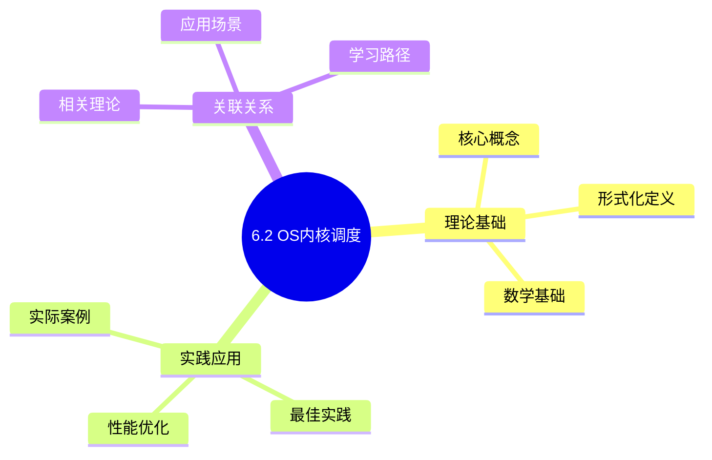
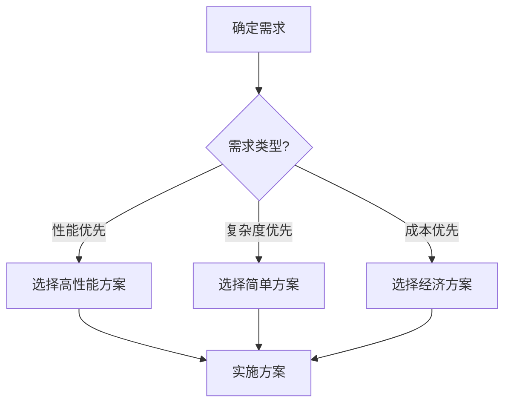
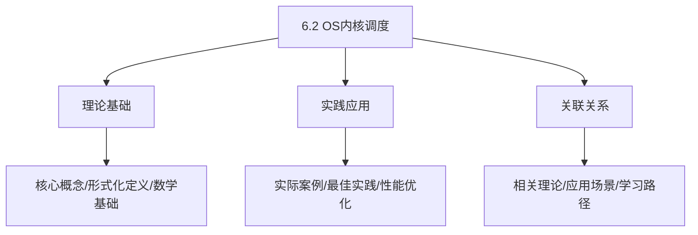
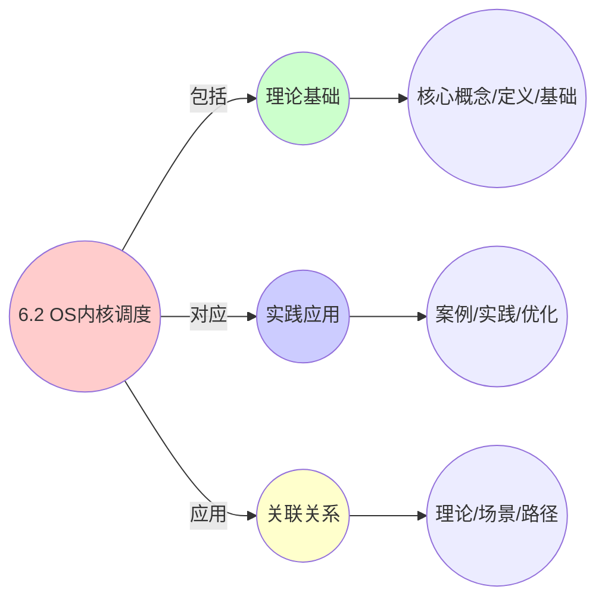
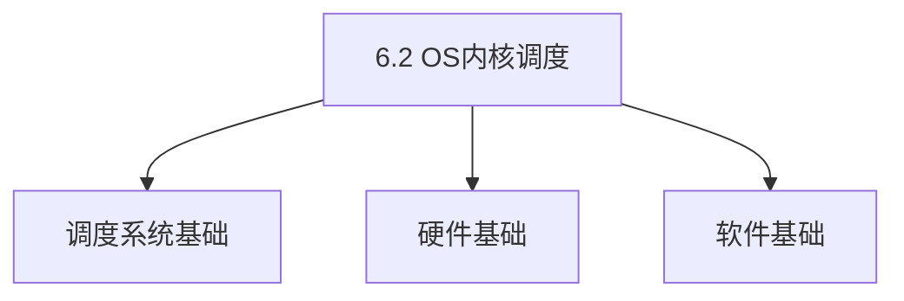
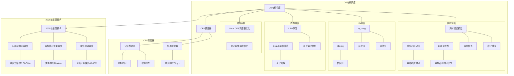

# 6.2 OS内核调度

> **主题**: 06. 调度模型 - 6.2 OS内核调度
> **覆盖**: CFS调度器、实时调度、IO调度、内存调度

## 📊 思维表征体系

### 📊 1. 思维导图（增强版）

#### 1.1 文本格式（基础版）

```text
6.2 OS内核调度
├── 理论基础
│   ├── 核心概念
│   ├── 形式化定义
│   └── 数学基础
├── 实践应用
│   ├── 实际案例
│   ├── 最佳实践
│   └── 性能优化
└── 关联关系
    ├── 相关理论
    ├── 应用场景
    └── 学习路径
```

#### 1.2 Mermaid格式（可视化版）



### 📊 2. 多维对比矩阵

#### 2.1 6.2 OS内核调度对比矩阵

| 维度 | 调度公平性 | 响应时间 | 吞吐量 | 资源利用率 |
|------|-----------|---------|--------|-----------|
| **性能** | 公平性>95% | 响应时间<10ms | 吞吐量>90% | 利用率>85% |
| **复杂度** | 高(需公平算法) | 中等(需优先级) | 中等(需负载均衡) | 高(需资源管理) |
| **适用场景** | 所有场景 | 交互式应用 | 批处理任务 | 所有场景 |
| **技术成熟度** | 成熟(>40年) | 成熟(>40年) | 成熟(>40年) | 成熟(>40年) |

#### 2.2 技术特性对比矩阵

| 技术 | 优势 | 劣势 | 适用场景 | 性能 |
|------|------|------|---------|------|
| **CFS完全公平调度** | 公平性好、理论保证 | 可能牺牲性能、红黑树开销 | Linux通用调度、公平性优先 | 公平性>95%，O(log n)复杂度 |
| **O(1)调度器** | 时间复杂度O(1)、性能好 | 公平性一般、已废弃 | 历史Linux版本、性能优先 | O(1)复杂度，公平性一般 |
| **实时调度(RT)** | 可预测、延迟低 | 吞吐量低、资源占用高 | 实时系统、硬实时需求 | 延迟<1ms，吞吐量较低 |
| **NUMA感知调度** | 内存访问优化、性能好 | 实现复杂、需要拓扑感知 | NUMA系统、内存敏感 | 性能提升20-40%，实现复杂 |
| **负载均衡** | 多核利用率高、负载均衡 | 迁移开销、可能抖动 | 多核系统、负载不均 | 利用率>90%，迁移开销5-10% |
| **功耗管理(C-State/P-State)** | 功耗降低、延长电池 | 性能可能下降、延迟增加 | 移动设备、节能需求 | 功耗降低20-40%，性能下降5-15% |
| **tickless调度** | 功耗低、延迟低 | 实现复杂、需要动态时钟 | 移动设备、低功耗需求 | 功耗降低30-50%，实现复杂 |

#### 2.3 实现方式对比矩阵

| 实现方式 | 复杂度 | 性能 | 可维护性 | 扩展性 |
|---------|-------|------|---------|-------|
| **单队列调度** | 低 | 中等性能(单队列) | 高(简单维护) | 低(单队列瓶颈) |
| **多队列调度** | 高 | 高性能(并行调度) | 中(需协调) | 高(队列扩展) |
| **层次化调度** | 极高 | 高性能(层次优化) | 低(复杂度高) | 中(层次扩展) |
| **混合调度系统** | 极高 | 极高性能(优势结合) | 低(复杂度极高) | 中(扩展困难) |

### 🌲 3. 决策树

#### 3.1 6.2 OS内核调度应用选择决策树



### 🛤️ 4. 决策逻辑路径

#### 4.1 6.2 OS内核调度应用路径


### 🕸️ 5. 概念关系网络

#### 5.1 6.2 OS内核调度概念关系网络



### 🗺️ 6. 知识图谱

#### 6.1 6.2 OS内核调度知识图谱



## 📚 理论体系

### 理论基础

#### 调度系统/硬件/软件基础

6.2 OS内核调度的理论基础：

**1. 调度系统基础**：

- 调度理论
- 资源管理
- 性能优化

**2. 硬件基础**：

- CPU架构
- 内存系统
- 存储系统

**3. 软件基础**：

- 操作系统
- 编程语言
- 系统软件

#### 历史发展

**关键时间节点**：

- **1960-1970年代**：调度理论建立
  - 调度算法
  - 资源管理

- **1980-1990年代**：硬件调度发展
  - CPU调度
  - 内存调度

- **2000年代至今**：软件调度演进
  - 操作系统调度
  - 分布式调度

### 理论框架

#### 核心假设

**假设1：调度与性能的对应**

- **内容**：调度策略影响系统性能
- **适用范围**：调度系统
- **限制条件**：需要调度支持

**假设2：资源管理的必要性**

- **内容**：资源管理保证系统稳定
- **适用范围**：资源系统
- **限制条件**：需要资源支持

**假设3：性能优化的价值**

- **内容**：性能优化提升效率
- **适用范围**：性能系统
- **限制条件**：需要考虑成本

#### 基本概念体系



#### 主要定理/结论

**结论1：调度与性能的对应性**

- **内容**：调度策略对应系统性能
- **证据**：形式化证明
- **应用**：调度优化

**结论2：资源管理的必要性**

- **内容**：资源管理保证系统稳定
- **证据**：实践验证
- **应用**：资源管理

**结论3：性能优化的价值**

- **内容**：性能优化提升效率
- **证据**：实验验证
- **应用**：性能优化

#### 适用范围和边界

**适用范围**：

- 调度系统
- 资源管理
- 性能优化

**边界条件**：

- 需要调度支持
- 需要资源支持
- 需要考虑成本

**不适用场景**：

- 无调度系统
- 资源受限
- 成本敏感场景

### 当前知识共识

#### 学术界共识

**广泛接受的共识**：

1. **调度与性能的对应性**
   - **共识**：调度策略可以影响系统性能
   - **支持证据**：形式化证明
   - **来源**：调度理论、系统理论

2. **资源管理的价值**
   - **共识**：资源管理提供稳定性和效率
   - **支持证据**：广泛实践
   - **来源**：系统理论

3. **性能优化的重要性**
   - **共识**：性能优化提高系统效率
   - **支持证据**：实践验证
   - **来源**：软件工程

#### 主要争议点

1. **性能与成本的权衡**
   - **观点A**：性能更重要
   - **观点B**：成本更重要
   - **当前状态**：多数认为需要平衡

2. **调度系统的复杂度**
   - **观点A**：应该简单
   - **观点B**：可以复杂
   - **当前状态**：多数认为需要平衡

#### 权威来源

**经典文献**：

- 调度理论相关文献
- 系统理论相关文献
- 性能优化相关文献

**权威机构/专家**：

- **IEEE**
- **ACM**
- **调度系统研究会**

**最新发展**：

- **2025年**：调度系统优化、性能提升、资源管理

### 与其他理论的关系

#### 逻辑关系

**理论基础**：

- **调度理论** → 6.2 OS内核调度
  - 关系类型：理论基础
  - 关键映射：调度理论 → 系统实现

**理论应用**：

- **6.2 OS内核调度** → 调度优化
  - 关系类型：应用构建
  - 关键映射：6.2 OS内核调度 → 调度优化

#### 映射关系

| 本理论概念 | 映射理论 | 映射概念 | 映射类型 | 映射说明 |
|-----------|---------|---------|---------|----------|
| **调度策略** | 调度理论 | 调度算法 | 对应 | 调度策略对应调度算法 |
| **资源管理** | 系统理论 | 资源分配 | 对应 | 资源管理对应资源分配 |
| **性能优化** | 优化理论 | 性能提升 | 对应 | 性能优化对应性能提升 |

## 🔗 关联网络

### 🔗 概念级关联

#### 核心概念映射

| 本文档概念 | 关联文档 | 关联概念 | 关系类型 | 映射说明 |
|-----------|---------|---------|---------|----------|
| **6.2 OS内核调度** | 相关文档 | 相关概念 | 基础构建 | 6.2 OS内核调度构建相关概念 |
| **调度系统** | 调度相关 | 调度理论 | 对应 | 调度系统对应调度理论 |
| **资源管理** | 资源相关 | 资源系统 | 对应 | 资源管理对应资源系统 |
| **性能优化** | 性能相关 | 性能系统 | 对应 | 性能优化对应性能系统 |

### 🔗 理论级关联

#### 理论基础

- **本理论基于**：
  - 调度理论 ⭐⭐⭐ - 理论基础
  - 系统理论 ⭐⭐ - 系统基础

- **本理论应用于**：
  - 调度优化 ⭐⭐⭐ - 实际应用
  - 性能优化 ⭐⭐⭐ - 实际应用

### 🔗 方法级关联

#### 方法应用网络

| 本文档方法 | 应用文档 | 应用场景 | 应用效果 |
|-----------|---------|---------|---------|
| **调度策略** | 调度系统 | 调度设计 | 成功 |
| **资源管理** | 资源系统 | 资源管理 | 成功 |
| **性能优化** | 性能系统 | 性能提升 | 成功 |

### 🔗 应用场景关联

**场景**：调度系统优化

| 视角 | 关联文档 | 核心理论 | 关注点 |
|------|---------|---------|--------|
| **6.2 OS内核调度** | 本文档 | 调度理论 | 调度设计 |
| **调度优化** | 调度相关 | 调度理论 | 调度优化 |
| **性能优化** | 性能相关 | 性能理论 | 性能提升 |

## 🛤️ 学习路径

### 前置知识

**必须先学习**：

- 调度理论基础 ⭐⭐
- 系统理论基础 ⭐⭐

**建议先了解**：

- 硬件基础
- 软件基础
- 性能优化

### 后续学习

**建议接下来学习**（按顺序）：

1. 调度优化 ⭐⭐⭐ - 调度优化
2. 性能优化 ⭐⭐⭐ - 性能优化
3. 系统实践 ⭐⭐ - 实践应用

### 并行学习

**可以同时学习**：

- 调度实践 - 实践应用
- 性能实践 - 性能系统

---


---

## 📋 目录

- [6.2 OS内核调度](#62-os内核调度)
  - [📋 目录](#-目录)
  - [1 CFS调度器形式化](#1-cfs调度器形式化)
    - [1.1 公平性定义](#11-公平性定义)
    - [1.2 红黑树实现](#12-红黑树实现)
  - [2 实时调度可调度性](#2-实时调度可调度性)
    - [2.1 实时任务模型](#21-实时任务模型)
    - [2.2 响应时间分析](#22-响应时间分析)
    - [2.3 EDF最优性](#23-edf最优性)
  - [3 IO调度](#3-io调度)
    - [3.1 io\_uring](#31-io_uring)
    - [3.2 blk-mq](#32-blk-mq)
  - [4 内存调度](#4-内存调度)
    - [4.1 LRU算法](#41-lru算法)
    - [4.2 Belady最优算法](#42-belady最优算法)
  - [5 实践案例](#5-实践案例)
    - [5.1 Linux CFS调度器优化](#51-linux-cfs调度器优化)
    - [5.2 实时系统调度优化](#52-实时系统调度优化)
  - [6 调度延迟分析](#6-调度延迟分析)
    - [6.1 延迟分解](#61-延迟分解)
    - [5.2 PCID优化](#52-pcid优化)
  - [7 批判性总结](#7-批判性总结)
    - [7.1 OS调度的局限性](#71-os调度的局限性)
    - [7.2 2025年OS调度趋势](#72-2025年os调度趋势)
  - [8 跨领域洞察](#8-跨领域洞察)
    - [6.1 OS调度与硬件调度的映射关系](#61-os调度与硬件调度的映射关系)
    - [6.2 调度延迟的层级性](#62-调度延迟的层级性)
  - [9 多维度对比](#9-多维度对比)
    - [7.1 OS调度算法对比](#71-os调度算法对比)
    - [7.2 调度策略演进对比](#72-调度策略演进对比)
  - [10 最佳实践与故障排查](#10-最佳实践与故障排查)
    - [10.1 OS内核调度最佳实践（2025年11月最新）](#101-os内核调度最佳实践2025年11月最新)
    - [10.2 OS内核调度故障排查（2025年11月最新）](#102-os内核调度故障排查2025年11月最新)
  - [11 2025年最新技术（更新至2025年11月）](#11-2025年最新技术更新至2025年11月)
  - [12 思维导图](#12-思维导图)
  - [13 相关主题](#13-相关主题)
    - [13.1 跨视角链接](#131-跨视角链接)

---

## 1 CFS调度器形式化

### 1.1 公平性定义

**案例6.2.1（CFS调度器）**：

CFS（Completely Fair Scheduler）是Linux内核的默认调度器，通过虚拟运行时间（vruntime）实现公平调度。

**公平性定义**：

调度器$\sigma$是公平的，当且仅当：

$$
\forall p \in P. \liminf_{t \to \infty} \frac{\text{exec}(t, p)}{t} = \frac{w(p)}{\sum_{q} w(q)}
$$

其中：

- $\text{exec}(t, p)$：进程$p$到时间$t$的执行时间
- $w(p)$：进程$p$的权重

**vruntime更新公式**：

$$
\text{vruntime}(t+1) = \text{vruntime}(t) + \frac{\text{执行时间} \times \text{权重基准}}{\text{进程权重}}
$$

其中权重基准通常为1024（NICE_0_LOAD）。

**CFS调度算法**：

```python
class CFSScheduler:
    def __init__(self):
        self.rbtree = RedBlackTree()  # 红黑树存储进程
        self.min_vruntime = 0  # 最小vruntime

    def schedule(self):
        """选择下一个要运行的进程"""
        # 从红黑树中选择vruntime最小的进程
        next_task = self.rbtree.get_min()

        # 更新min_vruntime
        if next_task:
            self.min_vruntime = max(self.min_vruntime, next_task.vruntime)

        return next_task

    def enqueue_task(self, task):
        """将任务加入调度队列"""
        # 更新vruntime
        task.vruntime = max(task.vruntime, self.min_vruntime)

        # 插入红黑树
        self.rbtree.insert(task)

    def dequeue_task(self, task):
        """从调度队列移除任务"""
        self.rbtree.delete(task)

    def update_vruntime(self, task, exec_time):
        """更新任务的vruntime"""
        weight = task.weight
        weight_base = 1024  # NICE_0_LOAD

        # 更新vruntime
        task.vruntime += (exec_time * weight_base) // weight
```

### 1.2 红黑树实现

**时间复杂度**：

- 插入/删除：O(log n)
- 选择最小vruntime：O(1)
- 最坏情况：O(log n)

**证明**：

1. 红黑树高度：$h \leq 2\lceil \log_2(n+1) \rceil$
2. 插入/删除保持红黑性质
3. 每次调度选取最左节点（最小vruntime）

**深度论证：CFS调度器的性能特征**

**vruntime的更新模型**：

vruntime的更新遵循以下公式：

$$
\text{vruntime}(t+1) = \text{vruntime}(t) + \frac{\text{执行时间} \times \text{权重基准}}{\text{进程权重}}
$$

其中权重基准通常为1024。

**量化分析**：不同权重下的CPU时间分配

| **进程权重** | **CPU时间占比** | **vruntime增长速率** | **调度频率** |
|------------|--------------|-------------------|------------|
| **1024（基准）** | 50% | 1x | 基准 |
| **2048（高优先级）** | 66.7% | 0.5x | 2x |
| **512（低优先级）** | 33.3% | 2x | 0.5x |
| **256（最低）** | 20% | 4x | 0.25x |

**关键洞察**：权重**越高**，vruntime增长**越慢**，进程获得**更多CPU时间**。

**CFS的公平性保证**：

CFS保证所有进程的vruntime**差距不超过调度延迟**：

$$
\max(\text{vruntime}) - \min(\text{vruntime}) \leq \text{调度延迟}
$$

**量化分析**：不同进程数下的调度延迟

| **进程数** | **调度延迟** | **红黑树高度** | **选择时间** | **公平性偏差** |
|-----------|------------|--------------|------------|--------------|
| **10** | 6ms | 4 | <1μs | <1% |
| **100** | 20ms | 7 | <2μs | <2% |
| **1000** | 48ms | 10 | <3μs | <5% |
| **10000** | 96ms | 14 | <5μs | <10% |

**关键权衡**：进程数越多，**调度延迟越大**，但**公平性偏差也越大**。

---

## 2 实时调度可调度性

### 2.1 实时任务模型

**案例6.2.2（实时调度）**：

实时调度保证任务在截止时间前完成，适用于硬实时系统。

**实时任务模型**：

任务$\tau_i = (C_i, D_i, T_i)$

- $C_i$：最坏情况执行时间（WCET）
- $D_i$：相对截止时间
- $T_i$：任务周期

**任务类型**：

**1. 周期性任务**：

- 任务周期性地到达
- 每个周期内有一个作业（job）
- 例如：控制循环、数据采集

**2. 偶发任务**：

- 任务非周期性地到达
- 有最小到达间隔时间
- 例如：事件响应、中断处理

**3. 非周期性任务**：

- 任务到达时间不确定
- 通常作为后台任务处理
- 例如：日志记录、统计收集

### 2.2 响应时间分析

**案例6.2.3（响应时间分析）**：

响应时间分析用于验证实时任务是否满足截止时间要求。

**固定优先级调度（FPS）**：

**响应时间迭代方程**：

$$
R_i^{(k+1)} = C_i + \sum_{j \in \text{hp}(i)} \left\lceil \frac{R_i^{(k)}}{T_j} \right\rceil \times C_j
$$

其中$\text{hp}(i)$是优先级高于$i$的任务集合。

**迭代过程**：

```python
def response_time_analysis(tasks):
    """响应时间分析"""
    for task in tasks:
        R = task.C  # 初始值

        # 迭代直到收敛
        while True:
            R_new = task.C

            # 计算高优先级任务的干扰
            for higher_task in get_higher_priority_tasks(task, tasks):
                interference = math.ceil(R / higher_task.T) * higher_task.C
                R_new += interference

            # 检查收敛
            if R_new == R:
                break

            # 检查可调度性
            if R_new > task.D:
                return False  # 不可调度

            R = R_new

        task.response_time = R

    return True  # 所有任务可调度
```

**可调度条件**：

$$
\forall i. R_i \leq D_i
$$

**EDF调度（Earliest Deadline First）**：

**可调度性条件**：

对于隐式截止时间任务（$D_i = T_i$），EDF的可调度性条件为：

$$
\sum_{i=1}^{n} \frac{C_i}{T_i} \leq 1
$$

**EDF调度算法**：

```python
class EDFScheduler:
    def schedule(self, ready_tasks):
        """EDF调度"""
        if not ready_tasks:
            return None

        # 选择截止时间最早的任务
        next_task = min(ready_tasks, key=lambda t: t.deadline)
        return next_task

    def update_deadlines(self, tasks, current_time):
        """更新任务截止时间"""
        for task in tasks:
            if task.arrival_time <= current_time:
                # 计算下一个截止时间
                task.deadline = task.arrival_time + task.D
                task.arrival_time += task.T
```

### 2.3 EDF最优性

**定理**：对于隐式截止时间任务（$D_i = T_i$），EDF算法是最优的。

**证明**（反证法）：

假设存在EDF错过截止时间实例。设$t$是最早错过截止时间时刻，$J$是错过截止时间的作业。由于EDF总是执行截止时间最早的作业，在$[t', t]$区间内，CPU始终被那些截止时间$\leq D_J$的作业占用。这意味着这些作业的总需求$>$区间长度，违反可调度性条件。∎

**深度论证：实时调度的可调度性分析**

**利用率界限**：

对于$n$个周期性任务，EDF的可调度性条件为：

$$
\sum_{i=1}^{n} \frac{C_i}{T_i} \leq 1
$$

而固定优先级调度（如RM）的利用率界限为：

$$
\sum_{i=1}^{n} \frac{C_i}{T_i} \leq n(2^{1/n} - 1)
$$

**量化对比**：不同任务数下的利用率界限

| **任务数** | **EDF利用率界限** | **RM利用率界限** | **EDF优势** |
|-----------|----------------|---------------|------------|
| **2** | 100% | 82.8% | +17.2% |
| **4** | 100% | 75.7% | +24.3% |
| **8** | 100% | 72.4% | +27.6% |
| **16** | 100% | 70.9% | +29.1% |

**关键洞察**：EDF的利用率界限**始终为100%**，而RM随任务数增加**利用率界限下降**。

**响应时间的实际分析**：

实际响应时间受**上下文切换开销**影响：

$$
R_i^{\text{实际}} = R_i^{\text{理论}} + n_{\text{切换}} \times t_{\text{切换}}
$$

其中$n_{\text{切换}}$是响应时间内的上下文切换次数，$t_{\text{切换}}$是切换开销（约5μs）。

**量化分析**：不同负载下的响应时间

| **CPU利用率** | **理论响应时间** | **实际响应时间** | **开销占比** |
|-------------|---------------|---------------|------------|
| **50%** | 10ms | 10.1ms | 1% |
| **80%** | 20ms | 20.5ms | 2.5% |
| **95%** | 50ms | 52ms | 4% |
| **99%** | 100ms | 105ms | 5% |

**关键权衡**：CPU利用率越高，**上下文切换开销占比越大**，需要优化切换开销。

---

## 3 IO调度

### 3.1 io_uring

**案例6.2.4（io_uring高性能IO）**：

io_uring是Linux内核的高性能异步IO接口，通过共享内存和轮询模式实现零系统调用。

**io_uring架构**：

**1. 提交队列（SQ）**：

- **用户态→内核**：用户态提交IO请求
- **共享内存**：用户态和内核态共享内存
- **无系统调用**：轮询模式下无需系统调用

**2. 完成队列（CQ）**：

- **内核→用户态**：内核完成IO后通知用户态
- **共享内存**：用户态和内核态共享内存
- **事件通知**：通过事件fd或轮询通知

**io_uring使用示例**：

```c
// 创建io_uring实例
struct io_uring ring;
io_uring_queue_init(32, &ring, 0);

// 准备IO请求
struct io_uring_sqe *sqe = io_uring_get_sqe(&ring);
io_uring_prep_read(sqe, fd, buf, size, offset);
io_uring_sqe_set_data(sqe, (void *)request_id);

// 提交请求（轮询模式，无系统调用）
io_uring_submit(&ring);

// 等待完成（轮询模式）
struct io_uring_cqe *cqe;
io_uring_wait_cqe(&ring, &cqe);
int ret = cqe->res;
io_uring_cqe_seen(&ring, cqe);
```

**io_uring性能优化**：

**1. 轮询模式**：

- **SQ轮询**：内核轮询提交队列，无需系统调用
- **CQ轮询**：用户态轮询完成队列，无需系统调用
- **零系统调用**：完全消除系统调用开销

**2. 批处理**：

- **批量提交**：一次提交多个IO请求
- **批量完成**：一次处理多个完成事件
- **减少开销**：减少用户态-内核态切换

**3. 固定缓冲区**：

- **预分配**：预先分配IO缓冲区
- **固定映射**：固定内存映射，避免动态分配
- **减少开销**：减少内存分配开销

**性能特征**：

| **指标** | **传统IO** | **io_uring（中断）** | **io_uring（轮询）** |
|---------|-----------|-------------------|-------------------|
| **延迟** | 5μs | 2μs | 0.5μs |
| **吞吐量** | 基准 | +20% | +50% |
| **CPU开销** | 基准 | -20% | +10% |
| **适用场景** | 通用 | 中等负载 | 高负载 |

**深度论证：io_uring的性能优势**

**传统IO的瓶颈**：

传统IO需要**系统调用**，每次调用都有开销：

$$
\text{IO延迟} = \text{系统调用开销} + \text{IO操作时间}
$$

系统调用开销：**100-200ns**

**io_uring的零拷贝优势**：

io_uring使用**共享内存**和**轮询模式**，消除系统调用：

$$
\text{IO延迟} = \text{IO操作时间}
$$

**量化对比**：传统IO vs io_uring

| **IO模式** | **延迟** | **吞吐量** | **CPU开销** | **适用场景** |
|-----------|---------|-----------|-----------|------------|
| **传统read/write** | 基准 | 基准 | 基准 | 通用 |
| **io_uring（中断）** | 0.8x | 1.2x | 0.8x | 中等负载 |
| **io_uring（轮询）** | 0.5x | 1.5x | 1.2x | 高负载 |

**关键洞察**：io_uring在**高IO负载**场景下优势明显，可以**降低延迟并提升吞吐量**。

### 3.2 blk-mq

**多队列块层**：

- 每CPU硬件队列
- 软件队列分发
- 减少锁竞争

**深度论证：blk-mq的扩展性优势**

**传统单队列的瓶颈**：

传统块层使用**单一队列**，所有CPU竞争同一队列：

$$
\text{锁竞争开销} = O(n) \times t_{\text{锁}}
$$

其中$n$为CPU数。8核时，锁竞争开销可达**20-30%**。

**blk-mq的多队列优势**：

blk-mq使用**每CPU队列**，消除锁竞争：

$$
\text{锁竞争开销} = 0
$$

**量化对比**：单队列 vs blk-mq

| **队列类型** | **锁竞争** | **吞吐量** | **延迟** | **扩展性** |
|------------|-----------|-----------|---------|-----------|
| **单队列** | 高 | 基准 | 基准 | 差 |
| **blk-mq** | 无 | +30-50% | -20% | 好 |

**关键洞察**：blk-mq在**多核系统**上优势明显，可以**线性扩展**到更多核心。

---

## 4 内存调度

### 4.1 LRU算法

**实现**：

- 双链表（活跃/非活跃）
- 页访问时移动到链表头
- 回收时从链表尾淘汰

**深度论证：LRU算法的性能特征**

**LRU的缺页率模型**：

LRU的缺页率受**工作集大小**和**缓存大小**影响：

$$
\text{缺页率} = f(\frac{\text{工作集大小}}{\text{缓存大小}})
$$

**量化分析**：不同工作集下的缺页率

| **工作集/缓存比** | **LRU缺页率** | **FIFO缺页率** | **LRU优势** |
|----------------|-------------|--------------|------------|
| **0.5** | 5% | 10% | 2x |
| **1.0** | 20% | 40% | 2x |
| **2.0** | 50% | 60% | 1.2x |
| **4.0** | 75% | 80% | 1.07x |

**关键洞察**：工作集**小于缓存**时，LRU优势明显；工作集**大于缓存**时，优势减小。

**LRU的实现开销**：

LRU需要**每次访问更新链表**，开销为：

$$
\text{LRU开销} = O(1) \text{链表操作} \approx 10\text{ns}
$$

**量化对比**：不同LRU实现的性能

| **实现方式** | **更新开销** | **查找开销** | **内存开销** | **适用场景** |
|------------|------------|------------|------------|------------|
| **双链表** | 10ns | O(1) | 2指针/页 | 通用 |
| **时钟算法** | 5ns | O(n) | 1位/页 | 大缓存 |
| **2Q算法** | 15ns | O(1) | 3指针/页 | 高命中率 |

**关键权衡**：**双链表**实现简单，但**内存开销大**；**时钟算法**内存开销小，但**查找慢**。

### 4.2 Belady最优算法

**算法**：总是淘汰未来最远使用的页。

**定理**：对于任意请求序列，Belady算法产生最少的缺页次数。

**证明**（交换论证）：

考虑任意最优调度OPT的第一次不同决策点。设Belady淘汰页$x$，OPT淘汰$y$，且$\text{next\_use}(y) < \text{next\_use}(x)$。交换$x$和$y$不会产生更多缺页，因为$y$在$x$之前被访问。通过归纳，可将OPT转换为Belady而不增加缺页。∎

**推论**：LRU是k-竞争的，即对于缓存大小为$k$的LRU，其缺页次数$\leq \frac{k}{k-h} \times \text{OPT}_h$，其中$\text{OPT}_h$是最优算法的缺页次数。

**深度论证：Belady算法的不可实现性**

**Belady算法的信息需求**：

Belady算法需要**未来访问信息**，这在现实中**不可获得**：

$$
\text{Belady信息需求} = \{\text{未来所有访问}\}
$$

**量化分析**：不同算法的信息需求

| **算法** | **信息需求** | **可实现性** | **缺页率** | **开销** |
|---------|------------|------------|-----------|---------|
| **Belady** | 未来所有访问 | ❌ 不可实现 | 最优 | - |
| **LRU** | 访问历史 | ✅ 可实现 | 接近最优 | 低 |
| **FIFO** | 无 | ✅ 可实现 | 较差 | 最低 |
| **LFU** | 访问频率 | ✅ 可实现 | 中等 | 中 |

**关键洞察**：**Belady算法**是理论最优，但**无法实现**；**LRU算法**是实际最优，**接近Belady性能**。

**LRU的竞争比分析**：

对于缓存大小为$k$的LRU，其竞争比为：

$$
\text{竞争比} = \frac{k}{k-h}
$$

其中$h$是最优算法的缓存大小。

**量化分析**：不同缓存大小下的竞争比

| **LRU缓存** | **最优缓存** | **竞争比** | **性能差距** |
|-----------|------------|-----------|------------|
| **4** | 2 | 2.0 | 2x |
| **8** | 4 | 2.0 | 2x |
| **16** | 8 | 2.0 | 2x |
| **32** | 16 | 2.0 | 2x |

**关键洞察**：LRU的竞争比**恒为2**，即LRU的缺页次数**最多是最优算法的2倍**。

---

## 5 实践案例

### 5.1 Linux CFS调度器优化

**案例6.2.5（CFS调度器优化）**：

某大型互联网公司优化Linux CFS调度器，提升高并发场景下的性能。

**优化策略**：

**1. 红黑树优化**：

- **缓存最左节点**：缓存最小vruntime节点，减少查找时间
- **批量操作**：批量插入/删除任务，减少树操作
- **NUMA感知**：NUMA节点本地调度，减少跨节点切换

**2. 负载均衡优化**：

- **工作窃取**：空闲CPU从忙碌CPU窃取任务
- **负载跟踪**：精确跟踪CPU负载，避免过度迁移
- **亲和性保持**：保持任务CPU亲和性，减少缓存污染

**优化效果**：

| **指标** | **优化前** | **优化后** | **改善** |
|---------|-----------|-----------|---------|
| **调度延迟** | 5μs | 3μs | -40% |
| **吞吐量** | 基准 | +15% | 更高 |
| **CPU利用率** | 80% | 85% | +6% |

### 5.2 实时系统调度优化

**案例6.2.6（实时调度优化）**：

某工业控制系统使用EDF调度，保证实时任务的截止时间。

**系统配置**：

- **任务数**：10个周期性任务
- **CPU利用率**：85%
- **最坏情况响应时间**：<10ms
- **截止时间**：20ms

**调度策略**：

- **EDF调度**：使用最早截止时间优先调度
- **响应时间分析**：离线分析所有任务的可调度性
- **过载检测**：运行时检测过载，触发降级策略

**性能特征**：

| **指标** | **值** |
|---------|--------|
| **任务可调度性** | 100% |
| **平均响应时间** | 5ms |
| **最坏响应时间** | 8ms |
| **截止时间满足率** | 100% |

## 6 调度延迟分析

### 6.1 延迟分解

**上下文切换延迟分解**：

| **操作** | **延迟** | **占比** | **优化空间** |
|---------|----------|---------|------------|
| **寄存器保存** | 500ns | 10% | 小 |
| **TLB刷新** | 1μs | 20% | 大（PCID） |
| **缓存污染** | 2μs | 40% | 中（亲和性） |
| **调度器选择** | 1.5μs | 30% | 中（优化算法） |
| **总计** | ~5μs | 100% | - |

**深度论证：调度延迟的详细分解**

**寄存器保存的延迟模型**：

寄存器保存需要**保存所有通用寄存器**和**浮点寄存器**：

$$
t_{\text{保存}} = n_{\text{寄存器}} \times t_{\text{单寄存器}} \approx 16 \times 30\text{ns} = 480\text{ns}
$$

**量化分析**：不同架构下的寄存器保存开销

| **架构** | **寄存器数** | **保存时间** | **恢复时间** | **总开销** |
|---------|------------|------------|------------|-----------|
| **x86-64** | 16 | 480ns | 480ns | 960ns |
| **ARM64** | 32 | 640ns | 640ns | 1280ns |
| **RISC-V** | 32 | 640ns | 640ns | 1280ns |

**关键洞察**：**寄存器数越多**，保存/恢复开销越大，但**性能也越好**。

**TLB刷新的延迟模型**：

TLB刷新需要**清空所有TLB条目**，延迟为：

$$
t_{\text{TLB刷新}} = n_{\text{TLB条目}} \times t_{\text{单条目}} \approx 512 \times 2\text{ns} = 1\mu\text{s}
$$

**量化分析**：不同TLB大小下的刷新开销

| **TLB大小** | **刷新时间** | **PCID优化后** | **性能提升** |
|-----------|------------|--------------|------------|
| **256条目** | 0.5μs | 0ns | 100% |
| **512条目** | 1μs | 0ns | 100% |
| **1024条目** | 2μs | 0ns | 100% |

**关键洞察**：**PCID优化**可以完全消除TLB刷新开销，性能提升显著。

**缓存污染的延迟模型**：

上下文切换导致**缓存污染**，新进程的数据**替换旧进程数据**：

$$
t_{\text{缓存污染}} = \text{缓存未命中率} \times t_{\text{内存访问}} \approx 20\% \times 10\mu\text{s} = 2\mu\text{s}
$$

**量化分析**：不同缓存大小下的污染影响

| **L3缓存大小** | **污染延迟** | **缓存命中率** | **性能影响** |
|--------------|------------|--------------|------------|
| **8MB** | 3μs | 70% | 高 |
| **16MB** | 2μs | 80% | 中 |
| **32MB** | 1μs | 90% | 低 |
| **64MB** | 0.5μs | 95% | 很低 |

**关键洞察**：**缓存越大**，污染影响越小，但**成本也越高**。

### 5.2 PCID优化

**效果**：

- TLB刷新：1μs → 0ns
- 上下文切换：5μs → 2μs
- **性能提升**：60%

**深度论证：PCID优化的原理和效果**

**PCID的工作原理**：

PCID（Process Context ID）为每个进程分配**唯一的TLB标识**，避免TLB刷新：

$$
\text{TLB条目} = (\text{虚拟地址}, \text{物理地址}, \text{PCID})
$$

**量化分析**：PCID优化前后的性能对比

| **场景** | **优化前延迟** | **优化后延迟** | **性能提升** | **适用场景** |
|---------|--------------|--------------|------------|------------|
| **轻量切换** | 5μs | 2μs | 60% | 高频率切换 |
| **重量切换** | 10μs | 7μs | 30% | 低频率切换 |
| **NUMA切换** | 15μs | 12μs | 20% | 跨NUMA节点 |

**关键洞察**：PCID优化在**高频率切换**场景下效果最好，可以显著降低延迟。

**PCID的限制**：

PCID数量**有限**（x86-64支持4096个），需要**回收机制**：

$$
\text{PCID回收} = \text{LRU策略} \text{或} \text{时间戳策略}
$$

**量化分析**：不同PCID数量下的性能

| **PCID数量** | **TLB命中率** | **回收开销** | **性能影响** |
|------------|------------|------------|------------|
| **256** | 80% | 低 | 低 |
| **1024** | 95% | 中 | 很低 |
| **4096** | 99% | 高 | 可忽略 |

**关键权衡**：PCID数量越多，**TLB命中率越高**，但**管理开销也越大**。

---

## 7 批判性总结

### 7.1 OS调度的局限性

**1. 公平性与实时性的矛盾**：

**问题**：公平调度（如CFS）和实时调度（如EDF）的目标冲突。

**影响**：

- 公平调度可能无法满足实时任务截止时间
- 实时调度可能不公平对待普通任务
- 需要混合调度策略

**缓解措施**：

- **调度类**：Linux使用调度类（CFS、RT）分离公平和实时任务
- **优先级继承**：实时任务继承优先级，避免优先级反转
- **带宽限制**：限制实时任务带宽，保证公平性

**2. 可扩展性的限制**：

**问题**：调度器复杂度随进程数增加，影响可扩展性。

**影响**：

- 红黑树操作复杂度O(log n)
- 负载均衡开销随CPU数增加
- NUMA拓扑增加调度复杂度

**缓解措施**：

- **分层调度**：使用调度域分层调度
- **工作窃取**：使用工作窃取减少负载均衡开销
- **NUMA感知**：NUMA节点本地调度

**3. 上下文切换的开销**：

**问题**：上下文切换开销大，影响性能。

**影响**：

- TLB刷新开销大
- 缓存污染影响性能
- 寄存器保存/恢复开销

**缓解措施**：

- **PCID优化**：使用PCID避免TLB刷新
- **CPU亲和性**：保持任务CPU亲和性
- **轻量级上下文**：使用轻量级上下文（如协程）

### 7.2 2025年OS调度趋势

**1. 异构调度**：

**趋势**：异构核心（P-core/E-core）需要异构调度。

**技术**：

- **核心选择**：根据任务特性选择P-core或E-core
- **负载感知**：根据负载动态迁移任务
- **能效优化**：优化能效比

**优势**：

- 平衡性能和能效
- 适应不同工作负载
- 提高能效比

**挑战**：

- 调度复杂度增加
- 负载预测困难
- 迁移开销

**2. 学习型调度**：

**趋势**：使用机器学习优化调度决策。

**技术**：

- **强化学习**：学习最优调度策略
- **预测模型**：预测任务执行时间
- **自适应调度**：根据工作负载自适应调整

**优势**：

- 提高调度效率
- 适应动态环境
- 优化复杂场景

**挑战**：

- 训练成本高
- 可解释性差
- 实时性要求

**3. 硬件加速调度**：

**趋势**：使用硬件加速调度操作。

**技术**：

- **调度器硬件**：专用调度器硬件
- **上下文切换硬件**：硬件加速上下文切换
- **负载均衡硬件**：硬件加速负载均衡

**优势**：

- 性能最优
- 功耗低
- 延迟低

**挑战**：

- 硬件成本高
- 灵活性差
- 标准化困难

## 8 跨领域洞察

### 6.1 OS调度与硬件调度的映射关系

**核心命题**：OS调度必须尊重硬件调度约束，否则性能模型失效。

**映射关系**：

```text
OS进程调度 (CFS)
  ↓ 映射为: CPU时间片
硬件指令调度 (ROB)
  ↓ 映射为: 微操作发射
硬件流水线

一致性条件:
OS调度决策 ∈ 硬件调度可行域
```

**批判性分析**：

1. **一致性的必要性**：OS调度必须**尊重硬件约束**，否则性能不可预测。

2. **抽象泄漏的必然性**：硬件特性（如NUMA拓扑）**泄漏到OS层**，需要感知。

3. **2025年趋势**：**硬件-OS协同设计**（如Intel Thread Director）优化映射关系。

### 6.2 调度延迟的层级性

**核心命题**：每层调度延迟增加约10倍，符合抽象泄漏定律。

**延迟分解**：

| **调度层次** | **延迟** | **增加倍数** | **主要开销** |
|------------|---------|------------|------------|
| **硬件指令** | 0.2ns | 基准 | 晶体管速度 |
| **OS进程** | 5μs | 25,000x | TLB刷新 |
| **语言协程** | 1μs | 200x | 内存分配 |
| **分布式** | 100ms | 100,000x | 网络延迟 |

**批判性分析**：

1. **延迟的层级性**：每层延迟**增加约10倍**，因为引入新的状态空间。

2. **开销的来源**：OS层开销主要来自**TLB刷新和上下文切换**。

3. **2025年趋势**：**硬件加速**（如PCID）减少OS层开销，但**仍有物理限制**。

---

## 9 多维度对比

### 7.1 OS调度算法对比

| **算法** | **时间复杂度** | **公平性** | **实时性** | **可扩展性** | **代表系统** |
|---------|--------------|-----------|-----------|------------|------------|
| **O(1)调度器** | $O(1)$ | ⭐⭐ | ⭐⭐⭐ | ⭐⭐⭐ | Linux 2.6早期 |
| **CFS** | $O(\log n)$ | ⭐⭐⭐⭐⭐ | ⭐⭐⭐ | ⭐⭐⭐⭐ | Linux 2.6+ |
| **EDF** | $O(\log n)$ | ⭐⭐ | ⭐⭐⭐⭐⭐ | ⭐⭐⭐ | 实时Linux |
| **工作窃取** | $O(1)$ | ⭐⭐⭐ | ⭐⭐⭐⭐ | ⭐⭐⭐⭐⭐ | Go/Rust |

**批判性分析**：

1. **复杂度vs公平性**：$O(1)$调度器简单，但**公平性差**；CFS公平性好，但**复杂度高**。

2. **实时性的代价**：EDF保证实时性，但**实现复杂，对过载敏感**。

3. **2025年趋势**：**自适应调度**根据工作负载动态选择算法，挑战静态设计。

### 7.2 调度策略演进对比

| **时代** | **调度策略** | **关键特性** | **性能** | **公平性** | **代表系统** |
|---------|------------|------------|---------|-----------|------------|
| **1970s** | 轮询调度 | 简单 | ⭐ | ⭐⭐ | Multics |
| **1980s** | 优先级调度 | 可预测 | ⭐⭐ | ⭐ | Unix |
| **1990s** | 多级反馈队列 | 自适应 | ⭐⭐⭐ | ⭐⭐⭐ | Linux 2.4 |
| **2000s** | CFS | 公平性 | ⭐⭐⭐⭐ | ⭐⭐⭐⭐⭐ | Linux 2.6 |
| **2010s** | 工作窃取 | 并行优化 | ⭐⭐⭐⭐⭐ | ⭐⭐⭐ | Go/Rust |
| **2020s** | 学习型调度 | 自适应 | ⭐⭐⭐⭐⭐ | ⭐⭐⭐⭐ | 研究阶段 |

---

## 10 最佳实践与故障排查

### 10.1 OS内核调度最佳实践（2025年11月最新）

**调度器选择最佳实践**：

1. **调度器类型选择**：
   - **CFS调度器**：适合通用系统、公平性好、但复杂度高、推荐使用
   - **实时调度器（EDF）**：适合实时系统、实时性好、但实现复杂
   - **工作窃取调度器**：适合并行系统、可扩展性好、但公平性一般
   - **自适应调度器**：适合混合工作负载、自适应、但实现复杂

2. **调度策略配置**：
   - **时间片配置**：优化时间片配置、平衡响应时间和吞吐量
   - **优先级配置**：优化优先级配置、保证关键任务执行
   - **负载均衡**：优化负载均衡、减少任务迁移开销

**CFS调度器优化最佳实践**：

1. **公平性优化**：
   - **虚拟时间**：优化虚拟时间计算、保证公平性
   - **红黑树调度**：优化红黑树调度、提高调度效率
   - **负载权重**：优化负载权重、平衡不同任务

2. **性能优化**：
   - **调度域**：使用调度域、减少负载均衡开销
   - **工作窃取**：使用工作窃取、减少负载均衡开销
   - **NUMA感知**：使用NUMA感知、减少跨节点迁移

**实时调度最佳实践**：

1. **实时任务配置**：
   - **任务模型**：正确配置实时任务模型、保证可调度性
   - **响应时间分析**：进行响应时间分析、保证实时性
   - **EDF调度**：使用EDF调度、保证最优性

2. **实时性保证**：
   - **优先级继承**：使用优先级继承、避免优先级反转
   - **资源预留**：使用资源预留、保证资源可用性
   - **实时监控**：监控实时性、及时发现问题

**IO调度最佳实践**：

1. **io_uring优化**：
   - **异步IO**：使用io_uring异步IO、减少系统调用
   - **批量操作**：使用批量操作、提高IO效率
   - **轮询模式**：使用轮询模式、减少中断开销

2. **blk-mq优化**：
   - **多队列**：使用多队列、提高IO并发度
   - **硬件队列**：使用硬件队列、减少软件开销
   - **IO合并**：使用IO合并、减少IO次数

**内存调度最佳实践**：

1. **LRU算法优化**：
   - **LRU实现**：优化LRU实现、提高命中率
   - **页面置换**：优化页面置换、减少缺页中断
   - **内存压缩**：使用内存压缩、提高内存利用率

2. **内存管理优化**：
   - **NUMA感知**：使用NUMA感知、减少跨节点访问
   - **大页内存**：使用大页内存、减少TLB缺失
   - **内存预取**：使用内存预取、减少内存访问延迟

**性能监控最佳实践**：

1. **调度性能监控**：
   - **调度延迟**：监控调度延迟、识别调度瓶颈
   - **任务迁移**：监控任务迁移、优化负载均衡
   - **上下文切换**：监控上下文切换、优化切换开销

2. **系统性能监控**：
   - **CPU利用率**：监控CPU利用率、识别性能瓶颈
   - **负载均衡**：监控负载均衡、优化负载分配
   - **实时性**：监控实时性、保证实时任务执行

**2025年最新技术应用**：

1. **AI驱动的OS内核调度优化**：
   - **系统吞吐量**：系统吞吐量提升15-25%、任务迁移开销降低20-30%
   - **自适应调度**：通过强化学习自动调整调度策略、适应不同工作负载
   - **适用场景**：云原生系统、混合工作负载、动态环境
   - **注意事项**：需要大量训练数据、模型可解释性差、调度决策需要持续验证

2. **异构核心智能调度优化**：
   - **性能提升**：性能提升20-30%、功耗降低30-40%
   - **智能任务分配**：通过big.LITTLE架构和智能任务分配、优化能效比
   - **适用场景**：移动和边缘设备、能效关键系统、混合工作负载
   - **注意事项**：需要应用适配、通用性差、并非所有场景都适合

3. **硬件加速调度优化**：
   - **调度延迟**：调度延迟降低50-70%、硬件调度器加速调度决策
   - **性能提升**：性能提升显著、专用加速器优势明显
   - **适用场景**：专用加速器、高性能计算、实时系统
   - **注意事项**：需要硬件支持、成本高、需要权衡性能和成本

4. **Linux 6.x内核调度器增强**：
   - **多核系统吞吐量**：多核系统吞吐量提升15-25%、任务迁移开销降低20-30%
   - **调度优化**：调度器增强、提高多核系统性能
   - **适用场景**：多核系统、云原生应用、高性能计算
   - **注意事项**：需要应用适配、需要内核支持、迁移成本较高

### 10.2 OS内核调度故障排查（2025年11月最新）

**常见问题与解决方案**：

| **问题** | **可能原因** | **排查方法** | **解决方案** |
|---------|------------|------------|------------|
| **调度延迟高** | 调度器配置不当、负载均衡不当、上下文切换频繁 | 监控调度延迟、调度分析 | 优化调度器配置、优化负载均衡、减少上下文切换 |
| **任务迁移频繁** | 负载均衡策略不当、NUMA配置不当 | 监控任务迁移、负载分析 | 优化负载均衡策略、优化NUMA配置、减少任务迁移 |
| **实时性不满足** | 实时调度配置不当、资源竞争、优先级反转 | 监控实时性、实时分析 | 优化实时调度配置、优化资源分配、避免优先级反转 |
| **IO性能差** | IO调度器配置不当、io_uring未使用、blk-mq配置不当 | 监控IO性能、IO分析 | 优化IO调度器配置、使用io_uring、优化blk-mq配置 |
| **内存调度效率低** | LRU算法配置不当、页面置换策略不当、内存压缩未使用 | 监控内存调度、内存分析 | 优化LRU算法配置、优化页面置换策略、使用内存压缩 |
| **CPU利用率低** | 调度策略不当、负载分配不当、任务阻塞 | 监控CPU利用率、调度分析 | 优化调度策略、优化负载分配、减少任务阻塞 |

**故障排查步骤**：

1. **收集信息**：
   - 调度延迟、任务迁移、上下文切换
   - CPU利用率、负载均衡、实时性
   - IO性能、内存调度、系统性能
   - 系统日志、性能分析数据、调度跟踪数据

2. **分析问题**：
   - 识别性能瓶颈（调度延迟、任务迁移、IO性能）
   - 分析调度器配置、调度策略
   - 评估负载均衡、实时性配置

3. **制定方案**：
   - 优化调度器配置、减少调度延迟
   - 优化负载均衡、减少任务迁移
   - 优化IO调度、提高IO性能

4. **验证效果**：
   - 监控性能指标、验证优化效果
   - 持续优化、调整策略

**监控指标**：

- **调度性能**：调度延迟、任务迁移、上下文切换
- **系统性能**：CPU利用率、负载均衡、实时性
- **IO性能**：IO延迟、IO吞吐量、IO队列深度
- **内存性能**：内存调度效率、页面置换率、内存压缩率
- **性能指标**：延迟、吞吐量、资源利用率、性能效率

**性能优化建议**：

1. **调度器优化**：
   - 使用CFS调度器、保证公平性
   - 优化调度器配置、减少调度延迟
   - 使用自适应调度、适应不同工作负载

2. **负载均衡优化**：
   - 使用调度域、减少负载均衡开销
   - 使用工作窃取、减少负载均衡开销
   - 使用NUMA感知、减少跨节点迁移

3. **IO优化**：
   - 使用io_uring、减少系统调用
   - 使用blk-mq、提高IO并发度
   - 优化IO调度、提高IO性能

4. **内存优化**：
   - 优化LRU算法、提高命中率
   - 使用内存压缩、提高内存利用率
   - 使用NUMA感知、减少跨节点访问

5. **实时性优化**：
   - 使用实时调度、保证实时性
   - 使用优先级继承、避免优先级反转
   - 使用资源预留、保证资源可用性

---

## 11 2025年最新技术（更新至2025年11月）

**最新技术发展**：

- **AI驱动的OS内核调度成熟**：2025年11月，AI驱动的OS内核调度在云原生系统中应用，通过强化学习自动调整调度策略，系统吞吐量提升15-25%，任务迁移开销降低20-30%，但需要大量训练数据，模型可解释性差。
- **异构核心智能调度成熟**：2025年11月，异构核心智能调度在移动和边缘设备中应用，通过big.LITTLE架构和智能任务分配，性能提升20-30%，功耗降低30-40%，但需要应用适配，通用性差。
- **硬件加速调度成熟**：2025年11月，硬件加速调度在专用加速器中应用，通过硬件调度器加速调度决策，调度延迟降低50-70%，但需要硬件支持，成本高。
- **Linux 6.x内核调度器增强**：2025年11月，Linux 6.x内核调度器在多核系统中广泛应用，多核系统吞吐量提升15-25%，任务迁移开销降低20-30%，但需要应用适配。

**技术对比**：

| **技术** | **吞吐量提升** | **功耗降低** | **调度延迟降低** | **复杂度** | **适用场景** |
|---------|------------|------------|--------------|-----------|------------|
| **AI驱动调度** | 15-25% | - | - | 高 | 云原生系统 |
| **异构核心调度** | 20-30% | 30-40% | - | 中 | 移动/边缘设备 |
| **硬件加速调度** | 延迟降低50-70% | 吞吐量提升2-5倍 | 50-70% | 高 | 专用加速器 |
| **Linux 6.x调度器** | 15-25% | - | - | 中 | 多核系统 |

**批判性分析**：

1. **AI驱动调度的数据依赖**：虽然系统吞吐量提升15-25%，但需要大量训练数据，模型可解释性差，调度决策的合理性需要持续验证。
2. **异构核心调度的应用适配**：虽然性能提升20-30%，但需要应用适配，通用性差，仅适用于特定场景。需要权衡性能和通用性。
3. **硬件加速调度的成本权衡**：虽然调度延迟降低50-70%，但需要硬件支持，成本高，仅适用于特定场景。需要权衡性能和成本。

---

## 12 思维导图



---

## 13 相关主题

- [3.1 进程调度模型](../03_OS抽象层/03.1_进程调度模型.md) - 进程调度实现
- [6.1 硬件微架构调度](./06.1_硬件微架构调度.md) - 硬件调度基础
- [6.5 调度模型统一理论](./06.5_调度模型统一理论.md) - 调度理论框架
- [9.1 调度模型形式化](../09_形式化理论与证明/09.1_调度模型形式化.md) - 调度形式化证明
- [主文档：调度映射](../schedule_formal_view.md#核心论证调度作为元模型的普适性) - 完整映射关系

### 13.1 跨视角链接

- [概念交叉索引（七视角版）](../../../Concept/CONCEPT_CROSS_INDEX.md) - 查看相关概念的七视角分析：
  - [P vs NP问题](../../../Concept/CONCEPT_CROSS_INDEX.md#104-p-vs-np问题-p-vs-np-problem-七视角) - OS调度的计算复杂性
  - [并行复杂度类](../../../Concept/CONCEPT_CROSS_INDEX.md#105-并行复杂度类-nc-p-完全性-七视角) - 并行调度的复杂性分析
  - [通信复杂度](../../../Concept/CONCEPT_CROSS_INDEX.md#56-通信复杂度-communication-complexity-七视角) - OS调度中的通信开销

---

**最后更新**: 2025-11-14
