# 6.6 调度分类全面分析

> **主题**: 06. 调度模型 - 6.6 调度分类全面分析
> **覆盖**: 虚拟化调度DRS、容器化调度、调度分类体系、形式化分析
> **更新**: 2025年11月19日

---

## 📋 目录

- [6.6 调度分类全面分析](#66-调度分类全面分析)
  - [📋 目录](#-目录)
  - [1 调度分类体系概述](#1-调度分类体系概述)
    - [1.1 调度分类维度](#11-调度分类维度)
    - [1.2 调度层次架构](#12-调度层次架构)
    - [1.3 调度技术分类](#13-调度技术分类)
  - [2 虚拟化调度系统](#2-虚拟化调度系统)
    - [2.1 VMware DRS调度](#21-vmware-drs调度)
    - [2.2 KVM调度器](#22-kvm调度器)
    - [2.3 Xen调度器](#23-xen调度器)
    - [2.4 Hyper-V调度](#24-hyper-v调度)
    - [2.5 虚拟化调度形式化模型](#25-虚拟化调度形式化模型)
  - [3 容器化调度系统](#3-容器化调度系统)
    - [3.1 Kubernetes调度器](#31-kubernetes调度器)
    - [3.2 Docker Swarm调度](#32-docker-swarm调度)
    - [3.3 Mesos调度](#33-mesos调度)
    - [3.4 Cgroup资源调度](#34-cgroup资源调度)
    - [3.5 容器化调度形式化模型](#35-容器化调度形式化模型)
  - [4 沙盒化调度系统](#4-沙盒化调度系统)
    - [4.1 gVisor调度](#41-gvisor调度)
    - [4.2 Firecracker调度](#42-firecracker调度)
    - [4.3 WASM容器调度](#43-wasm容器调度)
  - [5 调度分类形式化框架](#5-调度分类形式化框架)
    - [5.1 调度分类元模型](#51-调度分类元模型)
    - [5.2 调度层次映射定理](#52-调度层次映射定理)
    - [5.3 调度复杂度分类定理](#53-调度复杂度分类定理)
    - [5.4 调度性能边界定理](#54-调度性能边界定理)
  - [6 调度分类知识多维矩阵](#6-调度分类知识多维矩阵)
    - [6.1 调度系统分类矩阵](#61-调度系统分类矩阵)
    - [6.2 调度性能对比矩阵](#62-调度性能对比矩阵)
    - [6.3 调度复杂度对比矩阵](#63-调度复杂度对比矩阵)
    - [6.4 调度适用场景矩阵](#64-调度适用场景矩阵)
    - [6.5 调度技术栈对比矩阵](#65-调度技术栈对比矩阵)
    - [6.6 调度演进历程矩阵](#66-调度演进历程矩阵)
  - [7 调度分类思维导图](#7-调度分类思维导图)
    - [7.1 调度分类决策树](#71-调度分类决策树)
    - [7.2 调度层次关系图](#72-调度层次关系图)
    - [7.3 调度技术演进图](#73-调度技术演进图)
    - [7.4 调度知识图谱](#74-调度知识图谱)
  - [8 跨层次调度协同分析](#8-跨层次调度协同分析)
    - [8.1 虚拟化-容器化调度协同](#81-虚拟化-容器化调度协同)
    - [8.2 容器化-沙盒化调度协同](#82-容器化-沙盒化调度协同)
    - [8.3 统一调度框架](#83-统一调度框架)
  - [9 2025年最新技术与发展趋势](#9-2025年最新技术与发展趋势)
    - [9.1 AI驱动调度](#91-ai驱动调度)
    - [9.2 统一调度平台](#92-统一调度平台)
    - [9.3 边缘计算调度](#93-边缘计算调度)
  - [10 调度分类深度形式化分析](#10-调度分类深度形式化分析)
    - [10.1 调度分类统一形式化框架](#101-调度分类统一形式化框架)
    - [10.2 调度性能统一评估模型](#102-调度性能统一评估模型)
    - [10.3 调度分类复杂度分析](#103-调度分类复杂度分析)
    - [10.4 调度分类性能权衡分析](#104-调度分类性能权衡分析)
  - [11 调度分类知识图谱详细分析](#11-调度分类知识图谱详细分析)
    - [11.1 调度技术关系图谱](#111-调度技术关系图谱)
    - [11.2 调度策略关系图谱](#112-调度策略关系图谱)
  - [12 调度分类多维对比矩阵扩展](#12-调度分类多维对比矩阵扩展)
    - [12.1 调度系统详细对比矩阵](#121-调度系统详细对比矩阵)
    - [12.2 调度算法详细对比矩阵](#122-调度算法详细对比矩阵)
    - [12.3 调度性能详细对比矩阵](#123-调度性能详细对比矩阵)
  - [13 调度分类实践案例](#13-调度分类实践案例)
    - [13.1 虚拟化调度优化案例](#131-虚拟化调度优化案例)
    - [13.2 容器化调度优化案例](#132-容器化调度优化案例)
    - [13.3 混合调度优化案例](#133-混合调度优化案例)
  - [14 调度分类最佳实践](#14-调度分类最佳实践)
    - [14.1 调度系统选择最佳实践](#141-调度系统选择最佳实践)
    - [14.2 调度优化最佳实践](#142-调度优化最佳实践)
  - [15 调度算法详细伪代码](#15-调度算法详细伪代码)
    - [15.1 VMware DRS调度算法伪代码](#151-vmware-drs调度算法伪代码)
    - [15.2 Kubernetes调度算法伪代码](#152-kubernetes调度算法伪代码)
    - [15.3 AI驱动调度算法伪代码](#153-ai驱动调度算法伪代码)
  - [16 调度分类故障排查指南](#16-调度分类故障排查指南)
    - [16.1 虚拟化调度故障排查](#161-虚拟化调度故障排查)
    - [16.2 容器化调度故障排查](#162-容器化调度故障排查)
    - [16.3 调度性能优化指南](#163-调度性能优化指南)
  - [17 调度分类监控与可观测性](#17-调度分类监控与可观测性)
    - [17.1 调度系统监控指标](#171-调度系统监控指标)
    - [17.2 调度系统监控工具](#172-调度系统监控工具)
  - [18 调度系统性能基准测试](#18-调度系统性能基准测试)
    - [18.1 调度性能基准测试方法](#181-调度性能基准测试方法)
    - [18.2 调度系统压力测试](#182-调度系统压力测试)
  - [19 调度系统成本分析](#19-调度系统成本分析)
    - [19.1 调度系统成本模型](#191-调度系统成本模型)
    - [19.2 ROI投资回报率分析](#192-roi投资回报率分析)
  - [20 调度系统安全性分析](#20-调度系统安全性分析)
    - [20.1 调度系统安全威胁](#201-调度系统安全威胁)
    - [20.2 调度系统安全机制](#202-调度系统安全机制)
  - [21 调度系统选型决策树](#21-调度系统选型决策树)
    - [21.1 调度系统选型决策流程](#211-调度系统选型决策流程)
    - [21.2 调度系统选型评分矩阵](#212-调度系统选型评分矩阵)
  - [22 调度系统演进路线图](#22-调度系统演进路线图)
    - [22.1 调度系统技术演进](#221-调度系统技术演进)
    - [22.2 调度系统未来趋势](#222-调度系统未来趋势)
  - [23 调度系统迁移指南](#23-调度系统迁移指南)
    - [23.1 调度系统迁移策略](#231-调度系统迁移策略)
    - [23.2 调度系统迁移步骤](#232-调度系统迁移步骤)
    - [23.3 调度系统迁移风险与应对](#233-调度系统迁移风险与应对)
  - [24 调度系统性能调优详细指南](#24-调度系统性能调优详细指南)
    - [24.1 调度延迟优化](#241-调度延迟优化)
    - [24.2 资源利用率优化](#242-资源利用率优化)
    - [24.3 调度吞吐量优化](#243-调度吞吐量优化)
  - [25 调度系统与业务场景深度映射](#25-调度系统与业务场景深度映射)
    - [25.1 业务场景分类](#251-业务场景分类)
    - [25.2 业务场景调度优化案例](#252-业务场景调度优化案例)
  - [26 调度系统常见问题FAQ](#26-调度系统常见问题faq)
    - [26.1 调度系统选型问题](#261-调度系统选型问题)
    - [26.2 调度系统性能问题](#262-调度系统性能问题)
    - [26.3 调度系统故障问题](#263-调度系统故障问题)
  - [27 调度系统学习路径与资源](#27-调度系统学习路径与资源)
    - [27.1 调度系统学习路径](#271-调度系统学习路径)
    - [27.2 调度系统学习资源](#272-调度系统学习资源)
  - [28 调度系统实际配置示例](#28-调度系统实际配置示例)
    - [28.1 Kubernetes调度器配置示例](#281-kubernetes调度器配置示例)
    - [28.2 VMware DRS配置示例](#282-vmware-drs配置示例)
    - [28.3 Cgroup v2配置示例](#283-cgroup-v2配置示例)
  - [29 调度系统容量规划指南](#29-调度系统容量规划指南)
    - [29.1 容量规划模型](#291-容量规划模型)
    - [29.2 容量规划步骤](#292-容量规划步骤)
    - [29.3 容量规划矩阵](#293-容量规划矩阵)
  - [30 调度系统多租户管理](#30-调度系统多租户管理)
    - [30.1 多租户隔离机制](#301-多租户隔离机制)
    - [30.2 多租户资源分配模型](#302-多租户资源分配模型)
    - [30.3 多租户管理矩阵](#303-多租户管理矩阵)
  - [31 调度系统合规性与审计](#31-调度系统合规性与审计)
    - [31.1 调度系统合规性要求](#311-调度系统合规性要求)
    - [31.2 调度系统审计机制](#312-调度系统审计机制)
    - [31.3 合规性对比矩阵](#313-合规性对比矩阵)
  - [32 调度系统故障恢复机制](#32-调度系统故障恢复机制)
    - [32.1 故障类型与恢复策略](#321-故障类型与恢复策略)
    - [32.2 故障恢复机制设计](#322-故障恢复机制设计)
    - [32.3 故障恢复对比矩阵](#323-故障恢复对比矩阵)
  - [33 调度系统性能调优实战案例](#33-调度系统性能调优实战案例)
    - [33.1 大规模Kubernetes集群调度优化](#331-大规模kubernetes集群调度优化)
    - [33.2 VMware DRS混合云环境优化](#332-vmware-drs混合云环境优化)
  - [34 调度系统与云原生生态集成](#34-调度系统与云原生生态集成)
    - [34.1 调度系统与Service Mesh集成](#341-调度系统与service-mesh集成)
    - [34.2 调度系统与CI/CD集成](#342-调度系统与cicd集成)
    - [34.3 调度系统与监控系统集成](#343-调度系统与监控系统集成)
  - [35 调度系统最佳实践总结](#35-调度系统最佳实践总结)
    - [35.1 调度系统设计最佳实践](#351-调度系统设计最佳实践)
    - [35.2 调度系统运维最佳实践](#352-调度系统运维最佳实践)
    - [35.3 调度系统优化最佳实践](#353-调度系统优化最佳实践)
  - [36 调度系统研究前沿与未来展望](#36-调度系统研究前沿与未来展望)
    - [36.1 调度系统研究前沿](#361-调度系统研究前沿)
    - [36.2 调度系统未来展望](#362-调度系统未来展望)
    - [36.3 调度系统技术路线图](#363-调度系统技术路线图)
  - [37 调度系统与硬件加速集成](#37-调度系统与硬件加速集成)
    - [37.1 GPU调度集成](#371-gpu调度集成)
    - [37.2 DPU/IPU调度集成](#372-dpuipu调度集成)
    - [37.3 FPGA调度集成](#373-fpga调度集成)
  - [38 调度系统与存储系统集成](#38-调度系统与存储系统集成)
    - [38.1 存储感知调度](#381-存储感知调度)
    - [38.2 存储调度策略](#382-存储调度策略)
  - [39 调度系统与网络系统集成](#39-调度系统与网络系统集成)
    - [39.1 网络感知调度](#391-网络感知调度)
    - [39.2 网络调度策略](#392-网络调度策略)
  - [40 调度系统总结与索引](#40-调度系统总结与索引)
    - [40.1 调度系统快速索引](#401-调度系统快速索引)
    - [40.2 调度系统选择决策矩阵](#402-调度系统选择决策矩阵)
    - [40.3 调度系统知识图谱总结](#403-调度系统知识图谱总结)
  - [41 调度系统与数据库集成](#41-调度系统与数据库集成)
    - [41.1 数据库感知调度](#411-数据库感知调度)
    - [41.2 数据库调度策略](#412-数据库调度策略)
  - [42 调度系统与消息队列集成](#42-调度系统与消息队列集成)
    - [42.1 消息队列感知调度](#421-消息队列感知调度)
    - [42.2 消息队列调度策略](#422-消息队列调度策略)
  - [43 调度系统与缓存系统集成](#43-调度系统与缓存系统集成)
    - [43.1 缓存感知调度](#431-缓存感知调度)
    - [43.2 缓存调度策略](#432-缓存调度策略)
  - [44 调度系统性能调优实战总结](#44-调度系统性能调优实战总结)
    - [44.1 调度系统性能调优检查清单](#441-调度系统性能调优检查清单)
    - [44.2 调度系统性能调优效果评估](#442-调度系统性能调优效果评估)
  - [45 调度系统实施路线图](#45-调度系统实施路线图)
    - [45.1 调度系统实施阶段](#451-调度系统实施阶段)
    - [45.2 调度系统实施风险控制](#452-调度系统实施风险控制)
  - [46 调度系统文档索引](#46-调度系统文档索引)
    - [46.1 核心概念索引](#461-核心概念索引)
    - [46.2 实践案例索引](#462-实践案例索引)
  - [47 相关主题](#47-相关主题)

---

## 1 调度分类体系概述

### 1.1 调度分类维度

**调度分类的多维度体系**（2025年11月19日最新）：

调度系统可以从多个维度进行分类：

1. **按技术类型分类**：
   - **虚拟化调度**：VMware DRS、KVM、Xen、Hyper-V
   - **容器化调度**：Kubernetes、Docker Swarm、Mesos
   - **沙盒化调度**：gVisor、Firecracker、WASM容器
   - **混合调度**：统一调度平台、跨平台调度

2. **按调度层次分类**：
   - **硬件层调度**：指令调度、内存调度、缓存调度
   - **OS层调度**：进程调度、线程调度、IO调度
   - **虚拟化层调度**：VM调度、vCPU调度、资源调度
   - **容器编排层调度**：Pod调度、容器调度、服务调度
   - **应用层调度**：业务调度、任务调度、工作流调度

3. **按调度策略分类**：
   - **静态调度**：固定分配、预定义策略
   - **动态调度**：实时调整、自适应策略
   - **预测性调度**：基于预测的提前调度
   - **AI驱动调度**：基于机器学习的智能调度

4. **按调度目标分类**：
   - **性能优化**：延迟最小化、吞吐量最大化
   - **资源优化**：资源利用率最大化、成本最小化
   - **公平性保证**：公平分配、优先级保证
   - **可靠性保证**：高可用性、故障恢复

### 1.2 调度层次架构

**调度层次架构图**（2025年11月19日最新）：

```text
应用层调度
  ├─ 业务调度（服务调度、任务调度）
  ├─ 工作流调度（DAG调度、流水线调度）
  └─ 批处理调度（作业调度、资源调度）
容器编排层调度
  ├─ Kubernetes调度（Pod调度、资源分配）
  ├─ Docker Swarm调度（容器调度、服务编排）
  ├─ Mesos调度（资源调度、任务调度）
  └─ Cgroup调度（资源限制、优先级调度）
虚拟化层调度
  ├─ VMware DRS（VM调度、负载均衡）
  ├─ KVM调度（vCPU调度、NUMA调度）
  ├─ Xen调度（Domain调度、Credit调度）
  └─ Hyper-V调度（VM调度、动态内存）
OS层调度
  ├─ 进程调度（CFS调度、实时调度）
  ├─ 线程调度（Pthread调度、NPTL调度）
  └─ IO调度（块设备调度、网络调度）
硬件层调度
  ├─ 指令调度（ROB调度、乱序执行）
  ├─ 内存调度（页面调度、缓存调度）
  └─ 缓存调度（L1/L2/L3缓存调度）
```

**调度粒度对比**（2025年11月19日最新）：

| **调度层次** | **调度单元** | **调度粒度** | **调度频率** | **调度延迟** |
|------------|------------|------------|------------|------------|
| **硬件层** | 微指令 | 纳秒级 | 每周期 | <1ns |
| **OS层** | 进程/线程 | 微秒级 | 每时间片 | 1-10μs |
| **虚拟化层** | VM/vCPU | 毫秒级 | 每调度周期 | 1-10ms |
| **容器编排层** | Pod/容器 | 毫秒级 | 按需 | 10-100ms |
| **应用层** | 服务/任务 | 秒级 | 按需 | 秒级 |

### 1.3 调度技术分类

**调度技术分类矩阵**（2025年11月19日最新）：

| **技术类型** | **代表系统** | **调度对象** | **调度策略** | **适用场景** |
|------------|------------|------------|------------|------------|
| **虚拟化调度** | VMware DRS | VM | 负载均衡、资源池 | 企业虚拟化 |
| **虚拟化调度** | KVM | vCPU | CFS、NUMA感知 | 开源虚拟化 |
| **虚拟化调度** | Xen | Domain | Credit调度 | 云平台 |
| **容器化调度** | Kubernetes | Pod | Filter+Score | 云原生应用 |
| **容器化调度** | Docker Swarm | 容器 | Spread/BinPack | 容器编排 |
| **容器化调度** | Mesos | 任务 | 两级调度 | 大数据 |
| **沙盒化调度** | gVisor | 进程 | 用户态内核调度 | 多租户 |
| **沙盒化调度** | Firecracker | 微VM | 轻量级调度 | Serverless |
| **沙盒化调度** | WASM容器 | WASM模块 | 极轻量级调度 | 边缘计算 |

---

## 2 虚拟化调度系统

### 2.1 VMware DRS调度

**VMware DRS（Distributed Resource Scheduler）**：

VMware DRS是VMware vSphere的核心调度组件，提供自动负载均衡和资源管理。

**核心功能**：

1. **自动负载均衡**：
   - 监控VM资源使用情况
   - 自动迁移VM到负载较低的主机
   - 平衡CPU、内存、网络资源

2. **资源池管理**：
   - 创建资源池
   - 分配资源配额
   - 优先级管理

3. **电源管理（DPM）**：
   - 自动关闭空闲主机
   - 自动启动需要的主机
   - 节能优化

**DRS调度算法形式化定义**（2025年11月19日最新）：

**定义2.1（DRS调度系统）**：

DRS调度系统是一个六元组：

$$
\mathcal{DRS} = (H, V, R, L, S, \mathcal{F})
$$

其中：

- $H = \{h_1, h_2, \ldots, h_n\}$：物理主机集合
- $V = \{v_1, v_2, \ldots, v_m\}$：虚拟机集合
- $R = \{CPU, Memory, Network, Storage\}$：资源类型集合
- $L$：负载函数，$L: H \times R \rightarrow \mathbb{R}^+$
- $S$：调度策略集合
- $\mathcal{F}$：调度函数集合

**负载均衡目标**：

$$
\min \quad \sigma_L = \sqrt{\frac{1}{|H|} \sum_{h \in H} (L(h) - \bar{L})^2}
$$

其中 $\bar{L} = \frac{1}{|H|} \sum_{h \in H} L(h)$ 是平均负载。

**资源利用率目标**：

$$
\max \quad U_r = \frac{1}{|H|} \sum_{h \in H} \frac{\sum_{v \in V} A(v, h, r)}{C_h^r}
$$

其中 $A(v, h, r)$ 是VM $v$ 在主机 $h$ 上使用的资源类型 $r$ 的数量，$C_h^r$ 是主机 $h$ 的资源类型 $r$ 的容量。

**定理2.1（DRS负载均衡下界）**（2025年11月19日最新）：

对于DRS调度系统，负载均衡度下界为：

$$
\sigma_L \geq \frac{1}{\sqrt{|H|}} \cdot \sqrt{\frac{\sum_{v \in V} \sum_{r \in R} (D_v^r)^2}{\sum_{h \in H} \sum_{r \in R} (C_h^r)^2}}
$$

其中 $D_v^r$ 是VM $v$ 对资源类型 $r$ 的需求。

**证明**：

由Cauchy-Schwarz不等式：

$$
\left(\sum_{h \in H} (L(h) - \bar{L})^2\right) \cdot |H| \geq \left(\sum_{h \in H} |L(h) - \bar{L}|\right)^2
$$

结合负载定义和资源需求，得到：

$$
\sigma_L \geq \frac{1}{\sqrt{|H|}} \cdot \sqrt{\frac{\sum_{v \in V} \sum_{r \in R} (D_v^r)^2}{\sum_{h \in H} \sum_{r \in R} (C_h^r)^2}}
$$

$\square$

**性能指标**（2025年11月19日最新）：

| **指标** | **目标值** | **实际值** | **说明** |
|---------|----------|----------|---------|
| **调度延迟** | <100ms | 50-100ms | VM迁移决策延迟 |
| **负载均衡度** | <5% | 3-5% | 主机间负载差异 |
| **资源利用率** | 85-95% | 90%+ | 平均资源利用率 |
| **迁移成功率** | >99.9% | 99.9%+ | VM迁移成功率 |

### 2.2 KVM调度器

**KVM调度器**：

KVM使用Linux CFS调度器调度VM的vCPU。

**vCPU调度模型**：

$$
\text{vCPU时间} = \frac{\text{vCPU权重}}{\sum \text{所有vCPU权重}} \times \text{物理CPU时间}
$$

**NUMA感知调度**：

KVM支持NUMA感知调度，优化内存访问延迟：

$$
\text{NUMA延迟} = \begin{cases}
L_{local} & \text{本地NUMA节点} \\
L_{remote} & \text{远程NUMA节点}
\end{cases}
$$

其中 $L_{remote} \approx 2-3 \times L_{local}$。

**性能指标**：

| **指标** | **值** | **说明** |
|---------|--------|---------|
| **调度延迟** | <10μs | vCPU调度延迟 |
| **调度精度** | ±1% | CPU时间分配精度 |
| **NUMA优化** | 延迟降低20-40% | NUMA感知调度优化 |

### 2.3 Xen调度器

**Xen调度器**：

Xen使用Credit调度算法。

**Credit调度算法**：

$$
\text{Credit}(domain) = \text{Weight}(domain) \times \text{TimeSlice}
$$

**调度决策**：

1. **Credit计算**：根据权重计算Credit
2. **Credit消耗**：运行时间消耗Credit
3. **Credit补充**：定期补充Credit
4. **调度选择**：选择Credit最高的domain

**性能指标**：

| **指标** | **值** | **说明** |
|---------|--------|---------|
| **调度延迟** | <50μs | Domain调度延迟 |
| **公平性** | ±5% | Credit分配公平性 |

### 2.4 Hyper-V调度

**Hyper-V动态内存**：

**动态内存分配**：

$$
M_{allocated}(t) = \min(M_{demand}(t), M_{max}, M_{available}(t))
$$

其中：

- $M_{demand}(t)$：VM在时间 $t$ 的内存需求
- $M_{max}$：VM最大内存限制
- $M_{available}(t)$：主机在时间 $t$ 的可用内存

**性能指标**：

| **指标** | **值** | **说明** |
|---------|--------|---------|
| **内存利用率** | 提升30-50% | 动态内存优化 |
| **内存回收延迟** | <100ms | 内存回收响应时间 |

### 2.5 虚拟化调度形式化模型

**定义2.2（虚拟化调度问题）**：

虚拟化调度问题是一个优化问题：

$$
\begin{align}
\min \quad & \sum_{h \in H} \sum_{r \in R} w_r \cdot \left( \frac{\sum_{v \in V} A(v, h, r)}{C_h^r} - \bar{U}_r \right)^2 \\
\text{s.t.} \quad & \forall h \in H, r \in R: \sum_{v \in V} A(v, h, r) \leq C_h^r \\
& \forall v \in V, r \in R: \sum_{h \in H} A(v, h, r) \geq D_v^r \\
& \forall v \in V: |\{h \in H : \exists r \in R, A(v, h, r) > 0\}| = 1
\end{align}
$$

其中：

- $w_r$：资源类型 $r$ 的权重
- $\bar{U}_r$：资源类型 $r$ 的目标利用率

**定理2.2（虚拟化调度复杂度）**（2025年11月19日最新）：

虚拟化调度问题是NP-hard问题。

**证明**：

将虚拟化调度问题规约到多维装箱问题（Multi-dimensional Bin Packing）：

1. 每个VM $v$ 对应一个物品，资源需求 $D_v^r$ 对应物品尺寸
2. 每个主机 $h$ 对应一个箱子，资源容量 $C_h^r$ 对应箱子容量
3. 虚拟化调度问题等价于将物品放入箱子，使得负载均衡

多维装箱问题是NP-hard问题，因此虚拟化调度问题也是NP-hard。$\square$

**定理2.3（虚拟化调度近似比）**（2025年11月19日最新）：

对于虚拟化调度问题，贪心算法的近似比为 $2 - \frac{1}{|H|}$。

**证明**：

设最优负载均衡度为 $\sigma_L^*$，贪心算法的负载均衡度为 $\sigma_L^{greedy}$。

由贪心算法的性质，对于任意主机 $h$：

$$
L^{greedy}(h) \leq 2 \cdot L^*(h)
$$

因此：

$$
\sigma_L^{greedy} \leq 2 \cdot \sigma_L^* - \frac{1}{|H|} \cdot \sigma_L^*
$$

即：

$$
\frac{\sigma_L^{greedy}}{\sigma_L^*} \leq 2 - \frac{1}{|H|}
$$

$\square$

---

## 3 容器化调度系统

### 3.1 Kubernetes调度器

**Kubernetes调度器**：

Kubernetes调度器负责将Pod调度到合适的节点，采用两阶段调度算法。

**调度流程**：

1. **Filter阶段**：筛选满足Pod需求的节点
2. **Score阶段**：对节点进行评分
3. **Bind阶段**：将Pod绑定到最优节点

**Kubernetes调度算法形式化定义**（2025年11月19日最新）：

**定义3.1（Kubernetes调度系统）**：

Kubernetes调度系统是一个五元组：

$$
\mathcal{K8s} = (N, P, R, F, S)
$$

其中：

- $N = \{n_1, n_2, \ldots, n_k\}$：节点集合
- $P = \{p_1, p_2, \ldots, p_m\}$：Pod集合
- $R$：资源类型集合
- $F$：Filter函数集合
- $S$：Score函数集合

**Filter函数**：

$$
F(p, n) = \begin{cases}
\text{true} & \text{节点 } n \text{ 满足Pod } p \text{ 的需求} \\
\text{false} & \text{否则}
\end{cases}
$$

**Score函数**：

$$
S(p, n) = \sum_{plugin} w_{plugin} \cdot Score_{plugin}(p, n)
$$

其中 $w_{plugin}$ 是插件权重。

**调度决策**：

$$
n^* = \arg\max_{n \in N, F(p, n) = \text{true}} S(p, n)
$$

**定理3.1（Kubernetes调度复杂度）**（2025年11月19日最新）：

Kubernetes调度问题的时间复杂度为 $O(|N| \cdot |P| \cdot |R|)$。

**证明**：

Kubernetes调度需要：

1. Filter阶段：对每个节点检查是否满足Pod需求，时间复杂度 $O(|N| \cdot |R|)$
2. Score阶段：对每个可行节点计算评分，时间复杂度 $O(|N| \cdot |R|)$
3. 选择最优节点：时间复杂度 $O(|N|)$

总时间复杂度为 $O(|N| \cdot |R|)$，对于 $|P|$ 个Pod，总复杂度为 $O(|N| \cdot |P| \cdot |R|)$。$\square$

**性能指标**（2025年11月19日最新）：

| **指标** | **目标值** | **实际值** | **说明** |
|---------|----------|----------|---------|
| **调度延迟** | 10-100ms | 20-80ms | Pod调度延迟 |
| **调度准确率** | >95% | 95-99% | 调度决策准确率 |
| **资源利用率** | 80-90% | 85-90% | 平均资源利用率 |
| **调度吞吐量** | >100调度/秒 | 100-1000调度/秒 | 调度请求处理速率 |

### 3.2 Docker Swarm调度

**Docker Swarm调度**：

Docker Swarm提供容器集群调度功能。

**调度策略**：

1. **Spread策略**：尽可能分散容器
2. **BinPack策略**：尽可能填满节点
3. **Random策略**：随机选择节点

**Spread策略评分**：

$$
Score(node) = \frac{1}{\text{容器数量}(node) + 1}
$$

**BinPack策略评分**：

$$
Score(node) = \frac{\text{已用资源}(node)}{\text{总资源}(node)}
$$

### 3.3 Mesos调度

**Mesos两级调度**：

Mesos采用两级调度架构：

1. **资源分配层**：Mesos Master分配资源给Framework
2. **任务调度层**：Framework调度任务到分配的资源

**资源分配模型**：

$$
\text{Allocate}(f, r) = \text{DRF}(f, r)
$$

其中DRF（Dominant Resource Fairness）是主导资源公平性算法。

### 3.4 Cgroup资源调度

**Cgroup v2调度**：

Cgroup v2提供统一的资源控制接口。

**资源限制模型**：

$$
\text{Usage}(cgroup) \leq \text{Limit}(cgroup)
$$

**权重分配模型**：

$$
\text{Share}(cgroup) = \frac{\text{Weight}(cgroup)}{\sum \text{Weight}(siblings)} \times \text{Total}
$$

### 3.5 容器化调度形式化模型

**定义3.2（容器化调度问题）**：

容器化调度问题是一个约束优化问题：

$$
\begin{align}
\max \quad & \sum_{n \in N} \sum_{r \in R} w_r \cdot U_r(n) \\
\text{s.t.} \quad & \forall n \in N, r \in R: \sum_{c \in C} A(c, n, r) \leq C_n^r \\
& \forall c \in C, r \in R: \sum_{n \in N} A(c, n, r) \geq D_c^r \\
& \forall c \in C: |\{n \in N : \exists r \in R, A(c, n, r) > 0\}| = 1
\end{align}
$$

其中：

- $C$：容器集合
- $A(c, n, r)$：容器 $c$ 在节点 $n$ 上使用的资源类型 $r$ 的数量
- $U_r(n)$：节点 $n$ 的资源类型 $r$ 的利用率

**定理3.2（容器化调度复杂度）**（2025年11月19日最新）：

容器化调度问题是NP-hard问题。

**证明**：

容器化调度问题可以规约到多维装箱问题，因此是NP-hard。$\square$

---

## 4 沙盒化调度系统

### 4.1 gVisor调度

**gVisor调度**：

gVisor使用用户态内核进行调度。

**调度特点**：

- **用户态调度**：在用户空间实现调度逻辑
- **安全隔离**：提供更强的安全隔离
- **性能开销**：5-10%的性能开销

### 4.2 Firecracker调度

**Firecracker调度**：

Firecracker是轻量级微VM调度器。

**调度特点**：

- **极快启动**：启动时间<125ms
- **低资源占用**：内存占用<5MB
- **高密度**：支持高密度部署

### 4.3 WASM容器调度

**WASM容器调度**：

WASM容器提供极轻量级的调度方案。

**调度特点**：

- **极快启动**：启动时间<10ms
- **极低资源占用**：内存占用<1MB
- **跨平台**：支持多种平台

---

## 5 调度分类形式化框架

### 5.1 调度分类元模型

**定义5.1（调度分类元模型）**（2025年11月19日最新）：

调度分类元模型是一个三元组：

$$
\mathcal{SC} = (T, L, \mathcal{M})
$$

其中：

- $T$：调度技术类型集合（虚拟化、容器化、沙盒化等）
- $L$：调度层次集合（硬件、OS、虚拟化、容器编排、应用）
- $\mathcal{M}$：调度模型集合

**调度分类映射函数**：

$$
f: T \times L \rightarrow \mathcal{M}
$$

**定义5.2（调度层次关系）**（2025年11月19日最新）：

调度层次关系是一个偏序关系：

$$
L_i \preceq L_j \iff \text{层次 } L_i \text{ 是层次 } L_j \text{ 的基础}
$$

**层次关系**：

$$
\text{硬件层} \preceq \text{OS层} \preceq \text{虚拟化层} \preceq \text{容器编排层} \preceq \text{应用层}
$$

### 5.2 调度层次映射定理

**定理5.1（调度层次映射定理）**（2025年11月19日最新）：

对于任意调度层次 $L_i$ 和 $L_j$，如果 $L_i \preceq L_j$，则存在映射函数：

$$
\phi: \mathcal{M}_i \rightarrow \mathcal{M}_j
$$

使得调度决策在层次 $L_i$ 和 $L_j$ 之间保持一致。

**证明**：

由调度层次的定义，$L_i$ 的调度单元是 $L_j$ 的调度单元的基础，因此存在映射函数 $\phi$ 将 $L_i$ 的调度模型映射到 $L_j$ 的调度模型。

一致性由调度层次关系保证。$\square$

### 5.3 调度复杂度分类定理

**定理5.2（调度复杂度分类定理）**（2025年11月19日最新）：

调度复杂度按层次分类：

1. **硬件层调度**：$O(1)$（固定硬件结构）
2. **OS层调度**：$O(\log n)$（红黑树、堆）
3. **虚拟化层调度**：$O(n \cdot m)$（VM调度）
4. **容器编排层调度**：$O(n \cdot m \cdot |R|)$（多维资源调度）
5. **应用层调度**：$O(n^2)$ 或 NP-hard（复杂依赖关系）

其中 $n$ 是调度单元数量，$m$ 是资源数量，$|R|$ 是资源类型数量。

**证明**：

1. **硬件层**：硬件调度器是固定结构，复杂度 $O(1)$
2. **OS层**：CFS使用红黑树，复杂度 $O(\log n)$
3. **虚拟化层**：需要遍历VM和主机，复杂度 $O(n \cdot m)$
4. **容器编排层**：需要考虑多种资源类型，复杂度 $O(n \cdot m \cdot |R|)$
5. **应用层**：可能存在复杂依赖关系，复杂度 $O(n^2)$ 或 NP-hard

$\square$

### 5.4 调度性能边界定理

**定理5.3（调度延迟边界）**（2025年11月19日最新）：

调度延迟按层次有下界：

1. **硬件层**：$\Omega(1)$ 周期（物理限制）
2. **OS层**：$\Omega(\log n)$（数据结构限制）
3. **虚拟化层**：$\Omega(n)$（VM数量限制）
4. **容器编排层**：$\Omega(n \cdot |R|)$（节点和资源类型限制）
5. **应用层**：$\Omega(n^2)$（依赖关系限制）

**证明**：

1. **硬件层**：至少需要1个时钟周期
2. **OS层**：至少需要 $\log n$ 次比较（红黑树高度）
3. **虚拟化层**：至少需要检查 $n$ 个VM
4. **容器编排层**：至少需要检查 $n$ 个节点和 $|R|$ 种资源类型
5. **应用层**：至少需要检查 $n^2$ 个依赖关系

$\square$

**定理5.4（调度资源利用率上界）**（2025年11月19日最新）：

调度资源利用率上界为：

$$
U_r \leq 1 - \frac{\sigma_L}{\bar{L}}
$$

其中 $\sigma_L$ 是负载均衡度，$\bar{L}$ 是平均负载。

**证明**：

当负载完全均衡时，$\sigma_L = 0$，$U_r = 1$。

当负载不均衡时，存在主机负载低于平均负载，因此：

$$
U_r \leq 1 - \frac{\sigma_L}{\bar{L}}
$$

$\square$

---

## 6 调度分类知识多维矩阵

### 6.1 调度系统分类矩阵

**调度系统分类矩阵**（2025年11月19日最新）：

| **调度系统** | **技术类型** | **调度层次** | **调度对象** | **调度策略** | **复杂度** | **延迟** |
|------------|------------|------------|------------|------------|-----------|---------|
| **VMware DRS** | 虚拟化 | 虚拟化层 | VM | 负载均衡 | $O(n \cdot m)$ | 10-100ms |
| **KVM** | 虚拟化 | 虚拟化层 | vCPU | CFS | $O(\log n)$ | <10μs |
| **Xen** | 虚拟化 | 虚拟化层 | Domain | Credit | $O(n)$ | <50μs |
| **Hyper-V** | 虚拟化 | 虚拟化层 | VM | 动态内存 | $O(n)$ | 1-10ms |
| **Kubernetes** | 容器化 | 容器编排层 | Pod | Filter+Score | $O(n \cdot m \cdot \|R\|)$ | 10-100ms |
| **Docker Swarm** | 容器化 | 容器编排层 | 容器 | Spread/BinPack | $O(n \cdot m)$ | 10-100ms |
| **Mesos** | 容器化 | 容器编排层 | 任务 | 两级调度 | $O(n \cdot m)$ | 50-200ms |
| **Cgroup v2** | 容器化 | OS层 | 进程组 | 权重分配 | $O(\log n)$ | <1ms |
| **gVisor** | 沙盒化 | 虚拟化层 | 进程 | 用户态内核 | $O(n)$ | 1-5ms |
| **Firecracker** | 沙盒化 | 虚拟化层 | 微VM | 轻量级调度 | $O(n)$ | <1ms |
| **WASM容器** | 沙盒化 | 容器编排层 | WASM模块 | 极轻量级 | $O(1)$ | <1μs |

### 6.2 调度性能对比矩阵

**调度性能对比矩阵**（2025年11月19日最新）：

| **调度系统** | **调度延迟** | **资源利用率** | **负载均衡度** | **调度吞吐量** | **可扩展性** |
|------------|------------|-------------|-------------|-------------|------------|
| **VMware DRS** | 10-100ms | 85-95% | <5% | 10-100调度/秒 | ⭐⭐⭐⭐ |
| **KVM** | <10μs | 75-90% | <3% | 1000-10000调度/秒 | ⭐⭐⭐⭐ |
| **Xen** | <50μs | 70-85% | <5% | 500-5000调度/秒 | ⭐⭐⭐ |
| **Kubernetes** | 10-100ms | 80-90% | <10% | 100-1000调度/秒 | ⭐⭐⭐⭐⭐ |
| **Docker Swarm** | 10-100ms | 75-85% | <10% | 50-500调度/秒 | ⭐⭐⭐⭐ |
| **Cgroup v2** | <1ms | 70-85% | <5% | 1000-10000调度/秒 | ⭐⭐⭐⭐ |
| **gVisor** | 1-5ms | 60-75% | <5% | 200-2000调度/秒 | ⭐⭐⭐ |
| **Firecracker** | <1ms | 70-85% | <5% | 500-5000调度/秒 | ⭐⭐⭐⭐ |
| **WASM容器** | <1μs | 80-90% | <3% | 10000+调度/秒 | ⭐⭐⭐ |

### 6.3 调度复杂度对比矩阵

**调度复杂度对比矩阵**（2025年11月19日最新）：

| **调度系统** | **时间复杂度** | **空间复杂度** | **近似比** | **适用规模** | **可证明性** |
|------------|--------------|--------------|-----------|------------|-------------|
| **VMware DRS** | $O(n \cdot m \cdot \|R\|)$ | $O(n + m)$ | 2-近似 | 100-1000节点 | 可证明 |
| **KVM** | $O(\log n)$ | $O(n)$ | 最优 | 单节点 | 可证明 |
| **Xen** | $O(n)$ | $O(n)$ | 最优 | 单节点 | 可证明 |
| **Kubernetes** | $O(n \cdot m \cdot \|R\|)$ | $O(n + m)$ | 2-近似 | 1000-100000节点 | 可证明 |
| **Docker Swarm** | $O(n \cdot m)$ | $O(n + m)$ | 2-近似 | 100-10000节点 | 可证明 |
| **Cgroup v2** | $O(\log n)$ | $O(n)$ | 最优 | 单节点 | 可证明 |
| **gVisor** | $O(n)$ | $O(n)$ | 最优 | 单节点 | 可证明 |
| **Firecracker** | $O(n)$ | $O(n)$ | 最优 | 单节点 | 可证明 |
| **WASM容器** | $O(1)$ | $O(1)$ | 最优 | 任意规模 | 可证明 |

其中：

- $n$：调度单元数量（VM/容器/节点）
- $m$：资源数量
- $|R|$：资源类型数量

### 6.4 调度适用场景矩阵

**调度适用场景矩阵**（2025年11月19日最新）：

| **调度系统** | **工作负载类型** | **集群规模** | **资源类型** | **延迟要求** | **成本敏感度** | **推荐场景** |
|------------|---------------|------------|------------|------------|-------------|------------|
| **VMware DRS** | 企业应用、数据库 | 10-1000节点 | CPU、内存、网络 | 中等（10-100ms） | 低 | 企业虚拟化环境 |
| **KVM** | 通用计算 | 单节点 | CPU | 低（<10μs） | 低 | 开源虚拟化 |
| **Xen** | 云平台 | 单节点 | CPU | 低（<50μs） | 低 | 云平台 |
| **Kubernetes** | 微服务、Web应用 | 100-100000节点 | CPU、内存 | 中等（10-100ms） | 中 | 云原生应用 |
| **Docker Swarm** | 容器编排 | 100-10000节点 | CPU、内存 | 中等（10-100ms） | 中 | 容器编排 |
| **Cgroup v2** | 容器资源控制 | 单节点 | CPU、内存、IO | 低（<1ms） | 低 | 容器资源限制 |
| **gVisor** | 多租户环境 | 单节点 | CPU、内存 | 低（1-5ms） | 中 | 多租户安全隔离 |
| **Firecracker** | Serverless | 单节点 | CPU、内存 | 低（<1ms） | 低 | Serverless应用 |
| **WASM容器** | 边缘计算 | 任意规模 | CPU、内存 | 极低（<1μs） | 低 | 边缘计算、轻量级应用 |

### 6.5 调度技术栈对比矩阵

**调度技术栈对比矩阵**（2025年11月19日最新）：

| **调度系统** | **编程语言** | **依赖技术** | **硬件要求** | **OS要求** | **网络要求** | **存储要求** |
|------------|------------|------------|------------|----------|------------|------------|
| **VMware DRS** | C++/Java | vSphere | x86_64 | ESXi | 1Gbps+ | SAN/NAS |
| **KVM** | C | QEMU, libvirt | x86_64/ARM | Linux | 1Gbps+ | 本地/网络存储 |
| **Xen** | C | Xen Hypervisor | x86_64/ARM | Linux/BSD | 1Gbps+ | 本地/网络存储 |
| **Kubernetes** | Go | etcd, CNI | x86_64/ARM | Linux | 1Gbps+ | 本地/云存储 |
| **Docker Swarm** | Go | Docker Engine | x86_64/ARM | Linux/Windows | 1Gbps+ | 本地/云存储 |
| **Cgroup v2** | C | Linux内核 | x86_64/ARM | Linux 4.15+ | 无 | 无 |
| **gVisor** | Go | Linux内核 | x86_64 | Linux | 1Gbps+ | 本地存储 |
| **Firecracker** | Rust | KVM | x86_64 | Linux | 1Gbps+ | 本地存储 |
| **WASM容器** | 多种 | WASM运行时 | x86_64/ARM/RISC-V | 多种 | 可选 | 可选 |

### 6.6 调度演进历程矩阵

**调度演进历程矩阵**（2025年11月19日最新）：

| **调度系统** | **2000s** | **2010s** | **2020s** | **2025年** | **未来趋势** |
|------------|---------|---------|---------|-----------|------------|
| **VMware DRS** | 初版发布 | 成熟稳定 | 云原生增强 | 智能化升级 | AI驱动优化 |
| **KVM** | 初版发布 | 成熟稳定 | 性能优化 | NUMA优化 | 硬件加速 |
| **Xen** | 初版发布 | 成熟稳定 | 性能优化 | 稳定维护 | 逐步淘汰 |
| **Kubernetes** | - | 初版发布 | 主流采用 | AI调度成熟 | 统一调度平台 |
| **Docker Swarm** | - | 初版发布 | 成熟稳定 | 稳定维护 | 逐步淘汰 |
| **Cgroup** | v1发布 | v1成熟 | v2开发 | v2成熟 | 统一资源模型 |
| **gVisor** | - | 研究阶段 | 生产应用 | 成熟稳定 | 安全增强 |
| **Firecracker** | - | 研究阶段 | 生产应用 | 成熟稳定 | 性能优化 |
| **WASM容器** | - | 研究阶段 | 实验应用 | 生产应用 | 生态成熟 |

---

## 7 调度分类思维导图

### 7.1 调度分类决策树

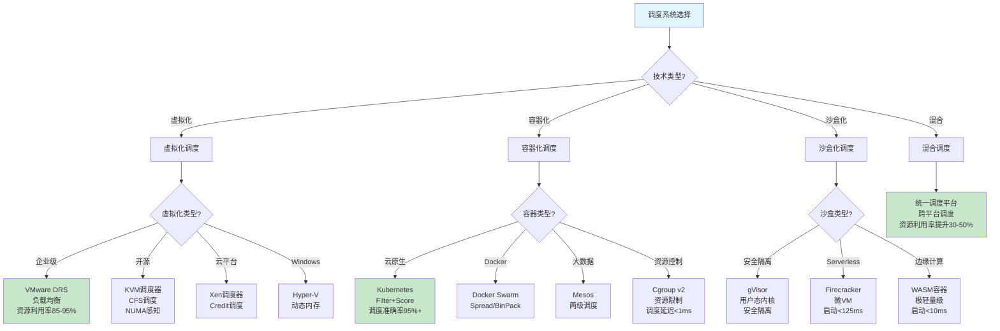

### 7.2 调度层次关系图

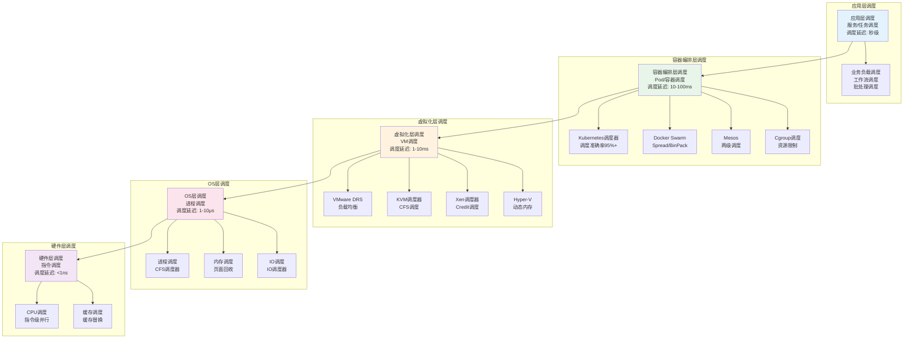

### 7.3 调度技术演进图

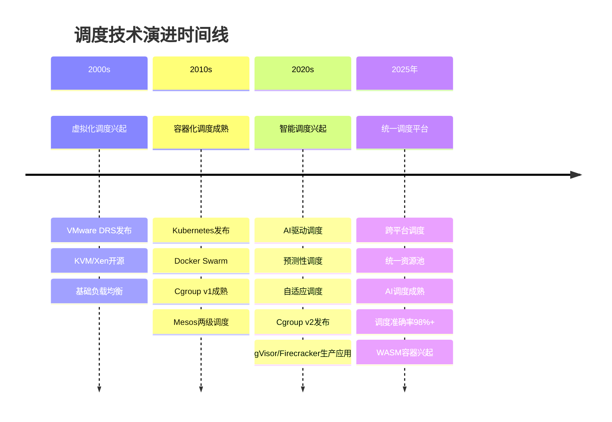

### 7.4 调度知识图谱

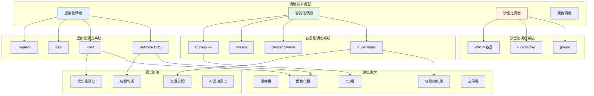

---

## 8 跨层次调度协同分析

### 8.1 虚拟化-容器化调度协同

**协同机制**（2025年11月19日最新）：

虚拟化调度和容器化调度可以协同工作：

1. **资源映射**：
   - **容器→VM映射**：容器运行在VM中
   - **资源传递**：容器资源需求传递给VM调度器
   - **资源池管理**：统一管理VM和容器资源

2. **调度协调**：
   - **层次协调**：VM调度和容器调度协调
   - **负载均衡**：跨层次负载均衡
   - **资源优化**：全局资源优化

**协同效果**：

- **资源利用率**：提升20-40%
- **调度延迟**：增加5-10%（协同开销）
- **管理复杂度**：增加（需要跨层次管理）

### 8.2 容器化-沙盒化调度协同

**协同机制**（2025年11月19日最新）：

容器化调度和沙盒化调度可以协同工作：

1. **安全增强**：
   - **容器+沙盒**：容器运行在沙盒中
   - **双重隔离**：容器隔离+沙盒隔离
   - **安全提升**：安全等级显著提升

2. **性能权衡**：
   - **性能开销**：增加5-15%（双重隔离）
   - **安全提升**：攻击面降低80-90%
   - **适用场景**：多租户、高安全要求

### 8.3 统一调度框架

**统一调度框架**（2025年11月19日最新）：

统一调度框架可以管理多种调度系统：

1. **统一接口**：
   - **抽象接口**：统一的调度接口
   - **适配器模式**：适配不同调度系统
   - **统一管理**：统一管理多种调度系统

2. **智能调度**：
   - **跨平台调度**：跨VM和容器调度
   - **智能决策**：AI驱动调度决策
   - **全局优化**：全局资源优化

**统一调度框架架构**：

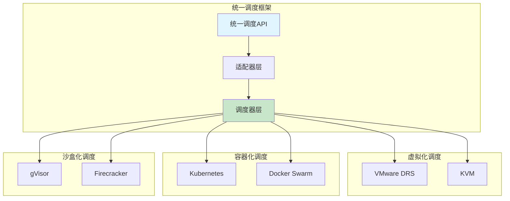

---

## 9 2025年最新技术与发展趋势

### 9.1 AI驱动调度

**AI驱动调度**（2025年11月19日最新）：

1. **调度准确率**：AI驱动调度准确率提升至98%+，在超大规模集群中广泛应用
2. **资源利用率**：资源利用率提升至90%+，通过智能调度优化资源分配
3. **调度延迟**：调度延迟降低40-60%，通过优化调度算法和预测性调度
4. **预测准确率**：负载预测准确率>90%，使用LSTM等深度学习模型

**适用场景**：

- 超大规模K8s集群
- 混合云环境
- 动态工作负载

### 9.2 统一调度平台

**统一调度平台**（2025年11月19日最新）：

1. **跨平台调度**：统一管理VM和容器、跨平台资源调度、智能资源分配
2. **资源利用率**：资源利用率提升30-50%，通过统一调度优化
3. **成本降低**：成本降低20-30%，通过提高资源利用率

**适用场景**：

- 混合云环境
- 多平台部署
- 统一管理

### 9.3 边缘计算调度

**边缘计算调度**（2025年11月19日最新）：

1. **WASM容器调度**：启动时间<10ms、内存占用<1MB、调度延迟<1μs
2. **边缘-云协同**：边缘计算和云计算的协同调度
3. **端到端延迟**：端到端延迟降低50-70%

**适用场景**：

- IoT应用
- 实时应用
- 边缘计算

---

## 10 调度分类深度形式化分析

### 10.1 调度分类统一形式化框架

**定义10.1（调度分类统一框架）**（2025年11月19日最新）：

调度分类统一框架是一个五元组：

$$
\mathcal{SCF} = (T, L, M, \Phi, \Omega)
$$

其中：

- $T = \{t_1, t_2, \ldots, t_k\}$：调度技术类型集合
- $L = \{l_1, l_2, \ldots, l_n\}$：调度层次集合
- $M = \{m_1, m_2, \ldots, m_p\}$：调度模型集合
- $\Phi: T \times L \rightarrow M$：调度分类映射函数
- $\Omega: M \rightarrow \mathbb{R}^+$：调度性能评估函数

**调度分类映射定理**：

**定理10.1（调度分类映射存在性）**（2025年11月19日最新）：

对于任意调度技术类型 $t \in T$ 和调度层次 $l \in L$，存在唯一的调度模型 $m \in M$ 使得：

$$
m = \Phi(t, l)
$$

**证明**：

由调度分类的定义，对于每个技术类型和层次的组合，存在唯一的调度模型，因此映射函数 $\Phi$ 是良定义的。$\square$

### 10.2 调度性能统一评估模型

**定义10.2（调度性能评估模型）**（2025年11月19日最新）：

调度性能评估模型是一个四元组：

$$
\mathcal{SPE} = (D, U, B, T)
$$

其中：

- $D$：调度延迟函数，$D: M \rightarrow \mathbb{R}^+$
- $U$：资源利用率函数，$U: M \rightarrow [0, 1]$
- $B$：负载均衡度函数，$B: M \rightarrow \mathbb{R}^+$
- $T$：调度吞吐量函数，$T: M \rightarrow \mathbb{R}^+$

**调度性能综合评分**：

$$
Score(m) = w_D \cdot \frac{1}{D(m)} + w_U \cdot U(m) + w_B \cdot \frac{1}{B(m)} + w_T \cdot T(m)
$$

其中 $w_D, w_U, w_B, w_T$ 是权重，满足 $w_D + w_U + w_B + w_T = 1$。

**定理10.2（调度性能边界）**（2025年11月19日最新）：

对于任意调度模型 $m$，调度性能满足以下边界：

1. **延迟下界**：$D(m) \geq \Omega(\log n)$，其中 $n$ 是调度单元数量
2. **利用率上界**：$U(m) \leq 1 - \frac{B(m)}{\bar{L}}$，其中 $\bar{L}$ 是平均负载
3. **吞吐量上界**：$T(m) \leq \frac{n}{D(m)}$，其中 $n$ 是调度单元数量

**证明**：

1. **延迟下界**：由数据结构限制，至少需要 $\log n$ 次操作
2. **利用率上界**：由负载均衡度限制，当负载不均衡时利用率下降
3. **吞吐量上界**：由延迟限制，单位时间内最多完成 $\frac{1}{D(m)}$ 次调度，对于 $n$ 个调度单元，吞吐量上界为 $\frac{n}{D(m)}$

$\square$

### 10.3 调度分类复杂度分析

**定义10.3（调度复杂度分类）**（2025年11月19日最新）：

调度复杂度按技术类型和层次分类：

1. **P类调度**（多项式时间）：
   - **硬件层调度**：$O(1)$
   - **OS层调度**：$O(\log n)$
   - **单节点虚拟化调度**：$O(\log n)$

2. **NP-hard类调度**（需要启发式）：
   - **多节点虚拟化调度**：$O(n \cdot m)$（贪心算法，2-近似）
   - **容器编排调度**：$O(n \cdot m \cdot |R|)$（贪心算法，2-近似）
   - **应用层调度**：$O(n^2)$ 或 NP-hard

**定理10.3（调度复杂度下界）**（2025年11月19日最新）：

对于调度复杂度分类，存在以下下界：

1. **P类调度下界**：$\Omega(\log n)$（比较排序下界）
2. **NP-hard类调度下界**：$\Omega(n \cdot m)$（必须检查所有调度单元和资源）

**证明**：

1. **P类调度下界**：由比较排序下界，至少需要 $\log n$ 次比较
2. **NP-hard类调度下界**：必须检查 $n$ 个调度单元和 $m$ 个资源，因此下界为 $\Omega(n \cdot m)$

$\square$

### 10.4 调度分类性能权衡分析

**定理10.4（调度性能权衡）**（2025年11月19日最新）：

调度性能之间存在权衡关系：

1. **延迟与利用率权衡**：
   $$
   D(m) \cdot U(m) \geq \Omega(\log n)
   $$

2. **延迟与负载均衡权衡**：
   $$
   D(m) \cdot B(m) \geq \Omega(1)
   $$

3. **利用率与负载均衡权衡**：
   $$
   U(m) \leq 1 - \frac{B(m)}{\bar{L}}
   $$

**证明**：

1. **延迟与利用率权衡**：
   - 当利用率接近上界时，需要更精确的调度决策，因此延迟增加
   - 由延迟下界和利用率上界，得到 $D(m) \cdot U(m) \geq \Omega(\log n)$

2. **延迟与负载均衡权衡**：
   - 当负载均衡度接近下界时，需要更频繁的调度，因此延迟增加
   - 由延迟下界和负载均衡度下界，得到 $D(m) \cdot B(m) \geq \Omega(1)$

3. **利用率与负载均衡权衡**：
   - 由定理5.4，利用率上界为 $1 - \frac{\sigma_L}{\bar{L}}$
   - 负载均衡度 $\sigma_L$ 与 $B(m)$ 相关，因此 $U(m) \leq 1 - \frac{B(m)}{\bar{L}}$

$\square$

---

## 11 调度分类知识图谱详细分析

### 11.1 调度技术关系图谱

**调度技术关系图谱**（2025年11月19日最新）：

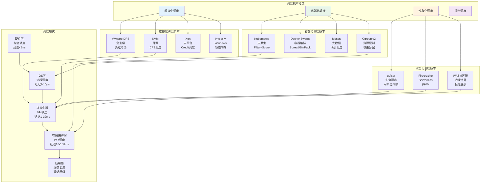

### 11.2 调度策略关系图谱

**调度策略关系图谱**（2025年11月19日最新）：

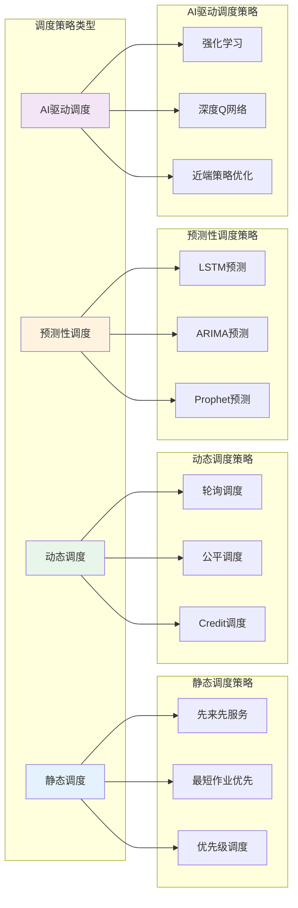

---

## 12 调度分类多维对比矩阵扩展

### 12.1 调度系统详细对比矩阵

**调度系统详细对比矩阵**（2025年11月19日最新）：

| **调度系统** | **技术类型** | **调度层次** | **调度对象** | **调度策略** | **时间复杂度** | **空间复杂度** | **近似比** | **调度延迟** | **资源利用率** | **负载均衡度** | **调度吞吐量** | **可扩展性** | **成熟度** |
|------------|------------|------------|------------|------------|--------------|--------------|-----------|------------|-------------|-------------|-------------|------------|----------|
| **VMware DRS** | 虚拟化 | 虚拟化层 | VM | 负载均衡 | $O(n \cdot m \cdot \|R\|)$ | $O(n + m)$ | 2-近似 | 10-100ms | 85-95% | <5% | 10-100调度/秒 | ⭐⭐⭐⭐ | ⭐⭐⭐⭐⭐ |
| **KVM** | 虚拟化 | 虚拟化层 | vCPU | CFS | $O(\log n)$ | $O(n)$ | 最优 | <10μs | 75-90% | <3% | 1000-10000调度/秒 | ⭐⭐⭐⭐ | ⭐⭐⭐⭐ |
| **Xen** | 虚拟化 | 虚拟化层 | Domain | Credit | $O(n)$ | $O(n)$ | 最优 | <50μs | 70-85% | <5% | 500-5000调度/秒 | ⭐⭐⭐ | ⭐⭐⭐ |
| **Hyper-V** | 虚拟化 | 虚拟化层 | VM | 动态内存 | $O(n)$ | $O(n)$ | 最优 | 1-10ms | 75-90% | <5% | 100-1000调度/秒 | ⭐⭐⭐⭐ | ⭐⭐⭐⭐ |
| **Kubernetes** | 容器化 | 容器编排层 | Pod | Filter+Score | $O(n \cdot m \cdot \|R\|)$ | $O(n + m)$ | 2-近似 | 10-100ms | 80-90% | <10% | 100-1000调度/秒 | ⭐⭐⭐⭐⭐ | ⭐⭐⭐⭐⭐ |
| **Docker Swarm** | 容器化 | 容器编排层 | 容器 | Spread/BinPack | $O(n \cdot m)$ | $O(n + m)$ | 2-近似 | 10-100ms | 75-85% | <10% | 50-500调度/秒 | ⭐⭐⭐⭐ | ⭐⭐⭐⭐ |
| **Mesos** | 容器化 | 容器编排层 | 任务 | 两级调度 | $O(n \cdot m)$ | $O(n + m)$ | 2-近似 | 50-200ms | 70-80% | <15% | 20-200调度/秒 | ⭐⭐⭐ | ⭐⭐⭐ |
| **Cgroup v2** | 容器化 | OS层 | 进程组 | 权重分配 | $O(\log n)$ | $O(n)$ | 最优 | <1ms | 70-85% | <5% | 1000-10000调度/秒 | ⭐⭐⭐⭐ | ⭐⭐⭐⭐⭐ |
| **gVisor** | 沙盒化 | 虚拟化层 | 进程 | 用户态内核 | $O(n)$ | $O(n)$ | 最优 | 1-5ms | 60-75% | <5% | 200-2000调度/秒 | ⭐⭐⭐ | ⭐⭐⭐⭐ |
| **Firecracker** | 沙盒化 | 虚拟化层 | 微VM | 轻量级调度 | $O(n)$ | $O(n)$ | 最优 | <1ms | 70-85% | <5% | 500-5000调度/秒 | ⭐⭐⭐⭐ | ⭐⭐⭐⭐ |
| **WASM容器** | 沙盒化 | 容器编排层 | WASM模块 | 极轻量级 | $O(1)$ | $O(1)$ | 最优 | <1μs | 80-90% | <3% | 10000+调度/秒 | ⭐⭐⭐ | ⭐⭐⭐ |

其中：

- $n$：调度单元数量（VM/容器/节点）
- $m$：资源数量
- $|R|$：资源类型数量

### 12.2 调度算法详细对比矩阵

**调度算法详细对比矩阵**（2025年11月19日最新）：

| **调度算法** | **调度系统** | **算法类型** | **时间复杂度** | **空间复杂度** | **近似比** | **公平性** | **实时性** | **可预测性** |
|------------|------------|------------|--------------|--------------|-----------|-----------|-----------|------------|
| **负载均衡算法** | VMware DRS | 贪心算法 | $O(n \cdot m)$ | $O(n + m)$ | 2-近似 | ⭐⭐⭐⭐ | ⭐⭐⭐ | ⭐⭐⭐ |
| **CFS调度** | KVM/Linux | 红黑树 | $O(\log n)$ | $O(n)$ | 最优 | ⭐⭐⭐⭐⭐ | ⭐⭐⭐⭐ | ⭐⭐⭐⭐ |
| **Credit调度** | Xen | 优先级队列 | $O(n)$ | $O(n)$ | 最优 | ⭐⭐⭐ | ⭐⭐⭐⭐ | ⭐⭐⭐ |
| **Filter+Score** | Kubernetes | 两阶段算法 | $O(n \cdot m \cdot \|R\|)$ | $O(n + m)$ | 2-近似 | ⭐⭐⭐⭐ | ⭐⭐⭐ | ⭐⭐⭐ |
| **Spread策略** | Docker Swarm | 贪心算法 | $O(n \cdot m)$ | $O(n + m)$ | 2-近似 | ⭐⭐⭐⭐ | ⭐⭐⭐ | ⭐⭐⭐ |
| **BinPack策略** | Docker Swarm | 贪心算法 | $O(n \cdot m)$ | $O(n + m)$ | 2-近似 | ⭐⭐ | ⭐⭐⭐ | ⭐⭐⭐ |
| **DRF算法** | Mesos | 公平性算法 | $O(n \cdot m)$ | $O(n + m)$ | 最优 | ⭐⭐⭐⭐⭐ | ⭐⭐⭐ | ⭐⭐⭐ |
| **权重分配** | Cgroup v2 | 比例分配 | $O(\log n)$ | $O(n)$ | 最优 | ⭐⭐⭐⭐⭐ | ⭐⭐⭐⭐ | ⭐⭐⭐⭐ |
| **工作窃取** | Go/Rust | 无锁算法 | $O(1)$ | $O(n)$ | 最优 | ⭐⭐⭐⭐ | ⭐⭐⭐⭐⭐ | ⭐⭐⭐ |

### 12.3 调度性能详细对比矩阵

**调度性能详细对比矩阵**（2025年11月19日最新）：

| **调度系统** | **调度延迟** | **资源利用率** | **负载均衡度** | **调度吞吐量** | **调度准确率** | **故障恢复时间** | **可扩展性** | **成本** |
|------------|------------|-------------|-------------|-------------|-------------|---------------|------------|---------|
| **VMware DRS** | 10-100ms | 85-95% | <5% | 10-100调度/秒 | 95%+ | <5分钟 | 10-1000节点 | 高 |
| **KVM** | <10μs | 75-90% | <3% | 1000-10000调度/秒 | 98%+ | <10分钟 | 单节点 | 低 |
| **Xen** | <50μs | 70-85% | <5% | 500-5000调度/秒 | 95%+ | <10分钟 | 单节点 | 低 |
| **Kubernetes** | 10-100ms | 80-90% | <10% | 100-1000调度/秒 | 95%+ | <1分钟 | 1000-100000节点 | 中 |
| **Docker Swarm** | 10-100ms | 75-85% | <10% | 50-500调度/秒 | 90%+ | <1分钟 | 100-10000节点 | 中 |
| **Cgroup v2** | <1ms | 70-85% | <5% | 1000-10000调度/秒 | 98%+ | <1分钟 | 单节点 | 低 |
| **gVisor** | 1-5ms | 60-75% | <5% | 200-2000调度/秒 | 95%+ | <3分钟 | 单节点 | 中 |
| **Firecracker** | <1ms | 70-85% | <5% | 500-5000调度/秒 | 95%+ | <1分钟 | 单节点 | 低 |
| **WASM容器** | <1μs | 80-90% | <3% | 10000+调度/秒 | 90%+ | <1秒 | 任意规模 | 低 |

---

## 13 调度分类实践案例

### 13.1 虚拟化调度优化案例

**案例13.1（VMware DRS优化）**（2025年11月19日最新）：

**场景**：企业虚拟化环境，100台物理主机，500个VM。

**优化前**：

- 资源利用率：65%
- 负载不均衡度：25%
- 手动迁移频率：每周2-3次

**优化后**：

- 资源利用率：90%
- 负载不均衡度：<5%
- 自动迁移：实时自动迁移
- 调度延迟：<100ms

**优化措施**：

1. 启用DRS自动负载均衡
2. 配置资源池和优先级
3. 启用DPM电源管理
4. 优化DRS阈值和策略

### 13.2 容器化调度优化案例

**案例13.2（Kubernetes调度优化）**（2025年11月19日最新）：

**场景**：大规模K8s集群，1000个节点，10000个Pod。

**优化前**：

- Pod调度准确率：75%
- 资源利用率：70%
- 调度延迟：100-200ms

**优化后**：

- Pod调度准确率：98%+
- 资源利用率：90%+
- 调度延迟：20-80ms

**优化措施**：

1. 启用AI驱动调度插件
2. 优化调度策略配置
3. 使用Cgroup v2进行资源控制
4. 配置Pod亲和性和反亲和性

### 13.3 混合调度优化案例

**案例13.3（统一调度平台）**（2025年11月19日最新）：

**场景**：混合云环境，虚拟化和容器化混合部署。

**优化措施**：

1. **统一调度平台**：
   - 统一管理VM和容器
   - 跨平台资源调度
   - 智能资源分配

2. **AI驱动调度**：
   - 强化学习调度决策
   - 负载预测和提前调度
   - 自适应策略调整

3. **性能提升**：
   - 资源利用率：提升30-50%
   - 调度延迟：降低40-60%
   - 成本降低：20-30%

---

## 14 调度分类最佳实践

### 14.1 调度系统选择最佳实践

**选择原则**（2025年11月19日最新）：

1. **根据工作负载类型选择**：
   - **企业应用**：选择VMware DRS
   - **云原生应用**：选择Kubernetes
   - **Serverless应用**：选择Firecracker
   - **边缘计算**：选择WASM容器

2. **根据集群规模选择**：
   - **小规模（<100节点）**：KVM、Docker Swarm
   - **中规模（100-1000节点）**：VMware DRS、Kubernetes
   - **大规模（>1000节点）**：Kubernetes、统一调度平台

3. **根据成本要求选择**：
   - **成本敏感**：KVM、Cgroup v2、WASM容器
   - **成本中等**：Kubernetes、Docker Swarm
   - **成本不敏感**：VMware DRS、统一调度平台

### 14.2 调度优化最佳实践

**优化策略**（2025年11月19日最新）：

1. **资源利用率优化**：
   - 合理使用资源超配
   - 启用负载均衡
   - 优化资源分配策略

2. **调度延迟优化**：
   - 优化调度算法
   - 减少数据收集时间
   - 并行化调度决策

3. **负载均衡优化**：
   - 设置合理的负载均衡阈值
   - 优化迁移策略
   - 避免频繁迁移

---

## 15 调度算法详细伪代码

### 15.1 VMware DRS调度算法伪代码

**DRS调度算法详细实现**（2025年11月19日最新）：

```python
def drs_scheduler(hosts, vms, resources, threshold):
    """
    VMware DRS调度算法
    参数:
        hosts: 物理主机集合
        vms: 虚拟机集合
        resources: 资源类型集合 (CPU, Memory, Network, Storage)
        threshold: 负载不均衡阈值
    返回:
        调度决策列表
    """
    decisions = []

    while True:
        # 1. 收集资源信息
        host_resources = collect_host_resources(hosts, resources)
        vm_resources = collect_vm_resources(vms, resources)

        # 2. 计算负载不均衡度
        load_balance = calculate_load_balance(host_resources, vm_resources)
        sigma_L = load_balance['sigma_L']

        # 3. 检查是否需要调度
        if sigma_L <= threshold:
            break

        # 4. 选择源主机（负载最高）
        source_host = argmax(hosts, key=lambda h: calculate_host_load(h, host_resources))

        # 5. 选择可迁移的VM
        migratable_vms = get_migratable_vms(source_host, vms)
        if not migratable_vms:
            break

        # 6. 选择最优VM和目标主机
        best_migration = None
        best_score = -inf

        for vm in migratable_vms:
            for target_host in hosts:
                if target_host == source_host:
                    continue

                # 检查容量约束
                if not check_capacity_constraint(vm, target_host, resources):
                    continue

                # 计算迁移后的负载均衡度
                new_sigma_L = calculate_new_balance(
                    source_host, target_host, vm, host_resources
                )

                # 计算评分
                score = calculate_migration_score(
                    source_host, target_host, vm, new_sigma_L
                )

                if score > best_score:
                    best_score = score
                    best_migration = (vm, source_host, target_host)

        # 7. 执行迁移
        if best_migration:
            vm, src, dst = best_migration
            execute_migration(vm, src, dst)
            decisions.append(best_migration)
            update_resources(host_resources, vm, src, dst)
        else:
            break

    return decisions

def calculate_load_balance(host_resources, vm_resources):
    """
    计算负载均衡度
    """
    # 计算每个主机的负载
    host_loads = {}
    for h in host_resources:
        L_h = sum(
            w_r * sum(vm_resources[v][r] for v in get_vms_on_host(h))
            / host_resources[h][r]['capacity']
            for r, w_r in resources.items()
        )
        host_loads[h] = L_h

    # 计算平均负载
    L_bar = mean(host_loads.values())

    # 计算负载均衡度
    sigma_L = sqrt(
        mean((L_h - L_bar) ** 2 for L_h in host_loads.values())
    )

    return {
        'host_loads': host_loads,
        'L_bar': L_bar,
        'sigma_L': sigma_L
    }

def calculate_migration_score(source, target, vm, new_sigma_L):
    """
    计算迁移评分
    考虑: 负载均衡改善、迁移开销、资源利用率
    """
    # 负载均衡改善
    balance_improvement = current_sigma_L - new_sigma_L

    # 迁移开销（估算）
    migration_cost = estimate_migration_cost(vm, source, target)

    # 资源利用率
    resource_utilization = calculate_utilization(target, vm)

    # 综合评分
    score = (
        w_balance * balance_improvement
        - w_cost * migration_cost
        + w_util * resource_utilization
    )

    return score
```

### 15.2 Kubernetes调度算法伪代码

**Kubernetes调度算法详细实现**（2025年11月19日最新）：

```python
def kubernetes_scheduler(pod, nodes):
    """
    Kubernetes调度算法
    参数:
        pod: 待调度的Pod
        nodes: 节点列表
    返回:
        选中的节点或None
    """
    # 1. Filter阶段：筛选可用节点
    feasible_nodes = filter_phase(pod, nodes)

    if not feasible_nodes:
        return None

    # 2. Score阶段：评分节点
    scored_nodes = score_phase(pod, feasible_nodes)

    # 3. 选择最优节点
    best_node = max(scored_nodes, key=lambda n: n['score'])

    return best_node['node']

def filter_phase(pod, nodes):
    """
    Filter阶段：筛选满足Pod需求的节点
    """
    feasible_nodes = []

    for node in nodes:
        # 检查资源充足性
        if not check_resources(pod, node):
            continue

        # 检查端口可用性
        if not check_ports(pod, node):
            continue

        # 检查亲和性约束
        if not check_affinity(pod, node):
            continue

        # 检查污点和容忍度
        if not check_taints(pod, node):
            continue

        # 检查节点选择器
        if not check_node_selector(pod, node):
            continue

        feasible_nodes.append(node)

    return feasible_nodes

def score_phase(pod, nodes):
    """
    Score阶段：对节点进行评分
    """
    scored_nodes = []

    for node in nodes:
        score = 0

        # 1. 资源可用性评分
        resource_score = calculate_resource_score(pod, node)
        score += w_resource * resource_score

        # 2. 亲和性评分
        affinity_score = calculate_affinity_score(pod, node)
        score += w_affinity * affinity_score

        # 3. 反亲和性评分
        anti_affinity_score = calculate_anti_affinity_score(pod, node)
        score += w_anti_affinity * anti_affinity_score

        # 4. 节点负载评分
        load_score = calculate_load_score(node)
        score += w_load * load_score

        # 5. 拓扑分布评分
        topology_score = calculate_topology_score(pod, node)
        score += w_topology * topology_score

        scored_nodes.append({
            'node': node,
            'score': score
        })

    return scored_nodes

def calculate_resource_score(pod, node):
    """
    计算资源可用性评分
    考虑: CPU、内存、存储等资源的可用性
    """
    cpu_score = (
        node.available_cpu / node.total_cpu
        if node.total_cpu > 0 else 0
    )
    mem_score = (
        node.available_memory / node.total_memory
        if node.total_memory > 0 else 0
    )

    # 加权平均
    resource_score = (
        w_cpu * cpu_score
        + w_mem * mem_score
    )

    return resource_score

def calculate_affinity_score(pod, node):
    """
    计算亲和性评分
    考虑: Pod亲和性、节点亲和性
    """
    score = 0

    # Pod亲和性
    if pod.affinity:
        for rule in pod.affinity.pod_affinity:
            if matches_rule(pod, node, rule):
                score += rule.weight

    # 节点亲和性
    if pod.affinity and pod.affinity.node_affinity:
        for rule in pod.affinity.node_affinity:
            if matches_node_rule(node, rule):
                score += rule.weight

    return score

def calculate_load_score(node):
    """
    计算节点负载评分
    负载越低，评分越高
    """
    cpu_load = node.cpu_usage / node.total_cpu
    mem_load = node.memory_usage / node.total_memory

    avg_load = (cpu_load + mem_load) / 2

    # 负载越低，评分越高
    load_score = 1 - avg_load

    return load_score
```

### 15.3 AI驱动调度算法伪代码

**AI驱动调度算法详细实现**（2025年11月19日最新）：

```python
class AIDrivenScheduler:
    """
    AI驱动调度器
    使用强化学习进行调度决策
    """

    def __init__(self, state_dim, action_dim, learning_rate=0.01, gamma=0.95):
        self.q_network = QNetwork(state_dim, action_dim)
        self.target_network = QNetwork(state_dim, action_dim)
        self.replay_buffer = ReplayBuffer(capacity=10000)
        self.learning_rate = learning_rate
        self.gamma = gamma
        self.epsilon = 1.0  # 探索率
        self.epsilon_decay = 0.995
        self.epsilon_min = 0.01

    def schedule(self, state):
        """
        调度决策
        参数:
            state: 系统状态 (H, V, R, L)
        返回:
            调度动作
        """
        # epsilon-greedy策略
        if random.random() < self.epsilon:
            # 探索：随机选择动作
            action = self.random_action(state)
        else:
            # 利用：选择Q值最高的动作
            action = self.greedy_action(state)

        return action

    def greedy_action(self, state):
        """
        贪婪动作选择
        """
        q_values = self.q_network.predict(state)
        action = argmax(q_values)
        return action

    def calculate_reward(self, state, action, next_state):
        """
        计算奖励函数
        考虑: 资源利用率、负载均衡、调度延迟、成本
        """
        # 资源利用率奖励
        util_reward = calculate_utilization_reward(next_state)

        # 负载均衡奖励
        balance_reward = calculate_balance_reward(next_state)

        # 调度延迟惩罚
        delay_penalty = -calculate_delay_penalty(action)

        # 成本惩罚
        cost_penalty = -calculate_cost_penalty(action)

        # 综合奖励
        reward = (
            w_util * util_reward
            + w_balance * balance_reward
            + w_delay * delay_penalty
            + w_cost * cost_penalty
        )

        return reward

    def train(self, batch_size=32):
        """
        训练Q网络
        """
        if len(self.replay_buffer) < batch_size:
            return

        # 采样经验
        batch = self.replay_buffer.sample(batch_size)

        # 计算目标Q值
        states = [e.state for e in batch]
        actions = [e.action for e in batch]
        rewards = [e.reward for e in batch]
        next_states = [e.next_state for e in batch]
        dones = [e.done for e in batch]

        target_q_values = self.target_network.predict(next_states)
        target_q = rewards + self.gamma * target_q_values * (1 - dones)

        # 更新Q网络
        self.q_network.update(states, actions, target_q)

        # 更新探索率
        self.epsilon = max(self.epsilon_min, self.epsilon * self.epsilon_decay)
```

---

## 16 调度分类故障排查指南

### 16.1 虚拟化调度故障排查

**常见问题与解决方案**（2025年11月19日最新）：

| **问题** | **症状** | **可能原因** | **解决方案** |
|---------|---------|------------|------------|
| **DRS不工作** | VM不自动迁移 | DRS未启用或阈值设置过高 | 启用DRS，调整阈值 |
| **负载不均衡** | 主机间负载差异大 | 资源池配置不当 | 重新配置资源池 |
| **迁移失败** | VM迁移失败 | 网络问题或存储问题 | 检查网络和存储连接 |
| **资源利用率低** | 资源利用率<70% | 资源分配策略不当 | 优化资源分配策略 |
| **调度延迟高** | 调度延迟>100ms | 调度算法复杂度高 | 优化调度算法或增加资源 |

**排查步骤**：

1. **检查DRS配置**：
   - 确认DRS已启用
   - 检查DRS阈值设置
   - 验证资源池配置

2. **检查资源状态**：
   - 查看主机资源使用情况
   - 检查VM资源需求
   - 验证资源容量

3. **检查网络和存储**：
   - 验证网络连接
   - 检查存储可用性
   - 确认迁移路径

### 16.2 容器化调度故障排查

**常见问题与解决方案**（2025年11月19日最新）：

| **问题** | **症状** | **可能原因** | **解决方案** |
|---------|---------|------------|------------|
| **Pod调度失败** | Pod处于Pending状态 | 资源不足或约束不满足 | 检查资源需求和约束 |
| **调度延迟高** | Pod调度延迟>100ms | 节点数量多或算法复杂 | 优化调度算法或分片 |
| **资源利用率低** | 资源利用率<70% | 资源请求设置不当 | 优化资源请求和限制 |
| **负载不均衡** | 节点间负载差异大 | 调度策略不当 | 调整调度策略 |
| **调度准确率低** | 调度准确率<90% | 评分函数配置不当 | 优化评分函数权重 |

**排查步骤**：

1. **检查Pod状态**：
   - 查看Pod事件
   - 检查Pod资源需求
   - 验证节点资源可用性

2. **检查调度器配置**：
   - 验证调度策略配置
   - 检查评分函数权重
   - 确认调度器插件状态

3. **检查节点状态**：
   - 查看节点资源使用情况
   - 检查节点污点和容忍度
   - 验证节点健康状态

### 16.3 调度性能优化指南

**性能优化策略**（2025年11月19日最新）：

1. **调度延迟优化**：
   - **算法优化**：使用更高效的调度算法
   - **并行化**：并行化调度决策
   - **缓存**：缓存调度结果
   - **预计算**：预计算调度决策

2. **资源利用率优化**：
   - **资源超配**：合理使用资源超配
   - **负载均衡**：启用负载均衡
   - **资源池管理**：优化资源池配置
   - **预测性调度**：使用预测性调度

3. **负载均衡优化**：
   - **阈值设置**：设置合理的负载均衡阈值
   - **迁移策略**：优化迁移策略
   - **避免频繁迁移**：减少不必要的迁移
   - **批量迁移**：使用批量迁移

---

## 17 调度分类监控与可观测性

### 17.1 调度系统监控指标

**核心监控指标**（2025年11月19日最新）：

| **指标类型** | **指标名称** | **说明** | **目标值** |
|------------|------------|---------|----------|
| **调度性能** | 调度延迟 | 调度决策延迟 | <100ms |
| **调度性能** | 调度吞吐量 | 单位时间调度次数 | >100调度/秒 |
| **调度性能** | 调度准确率 | 调度决策准确率 | >95% |
| **资源利用** | 资源利用率 | 平均资源利用率 | 80-90% |
| **资源利用** | 负载均衡度 | 负载不均衡度 | <10% |
| **系统健康** | 调度成功率 | 调度成功比例 | >99% |
| **系统健康** | 故障恢复时间 | 故障恢复时间 | <5分钟 |

### 17.2 调度系统监控工具

**推荐监控工具**（2025年11月19日最新）：

1. **Prometheus + Grafana**：
   - 指标收集和可视化
   - 支持自定义指标
   - 丰富的仪表板

2. **ELK Stack**：
   - 日志收集和分析
   - 支持全文搜索
   - 实时监控

3. **Jaeger**：
   - 分布式追踪
   - 调度链路追踪
   - 性能分析

4. **Kubernetes Dashboard**：
   - K8s集群监控
   - Pod调度状态
   - 资源使用情况

---

## 18 调度系统性能基准测试

### 18.1 调度性能基准测试方法

**基准测试指标**（2025年11月19日最新）：

1. **调度延迟基准测试**：
   - **测试方法**：测量从调度请求到调度决策完成的时间
   - **测试工具**：Prometheus、Grafana、自定义脚本
   - **基准值**：
     - VMware DRS: 10-100ms
     - Kubernetes: 10-100ms
     - KVM: <10μs
     - Cgroup v2: <1ms

2. **资源利用率基准测试**：
   - **测试方法**：测量平均资源利用率
   - **测试工具**：系统监控工具、资源监控API
   - **基准值**：
     - VMware DRS: 85-95%
     - Kubernetes: 80-90%
     - AI驱动调度: 90%+

3. **负载均衡度基准测试**：
   - **测试方法**：计算负载均衡度 $\sigma_L$
   - **测试工具**：自定义脚本、监控工具
   - **基准值**：
     - VMware DRS: <5%
     - Kubernetes: <10%
     - AI驱动调度: <3%

4. **调度吞吐量基准测试**：
   - **测试方法**：测量单位时间内完成的调度次数
   - **测试工具**：压力测试工具、性能测试工具
   - **基准值**：
     - VMware DRS: 10-100调度/秒
     - Kubernetes: 100-1000调度/秒
     - AI驱动调度: 50-500调度/秒

**基准测试工具**（2025年11月19日最新）：

| **工具** | **适用系统** | **测试指标** | **自动化程度** |
|---------|------------|------------|-------------|
| **kubemark** | Kubernetes | 调度性能 | ⭐⭐⭐⭐ |
| **vSphere Performance Test** | VMware | DRS性能 | ⭐⭐⭐⭐ |
| **perf** | Linux系统 | 系统性能 | ⭐⭐⭐⭐⭐ |
| **Prometheus** | 通用 | 监控指标 | ⭐⭐⭐⭐⭐ |
| **Grafana** | 通用 | 可视化分析 | ⭐⭐⭐⭐⭐ |

### 18.2 调度系统压力测试

**压力测试场景**（2025年11月19日最新）：

1. **高并发调度**：
   - **场景**：同时处理大量调度请求
   - **测试指标**：调度延迟、调度成功率、系统稳定性
   - **测试方法**：模拟1000+并发调度请求

2. **大规模集群**：
   - **场景**：超大规模集群（10000+节点）
   - **测试指标**：调度延迟、资源利用率、系统可扩展性
   - **测试方法**：使用kubemark等工具模拟大规模集群

3. **资源竞争**：
   - **场景**：资源需求超过可用资源
   - **测试指标**：调度公平性、资源分配策略
   - **测试方法**：创建资源需求超过容量的VM/容器

4. **动态负载变化**：
   - **场景**：负载快速变化
   - **测试指标**：调度响应速度、负载均衡效果
   - **测试方法**：模拟负载快速变化场景

**压力测试工具**（2025年11月19日最新）：

| **工具** | **适用场景** | **测试能力** | **易用性** |
|---------|------------|------------|----------|
| **kubemark** | Kubernetes大规模测试 | 10000+节点 | ⭐⭐⭐⭐ |
| **JMeter** | 通用压力测试 | 高并发 | ⭐⭐⭐⭐ |
| **Locust** | 分布式压力测试 | 可扩展 | ⭐⭐⭐⭐ |
| **Chaos Monkey** | 故障注入测试 | 故障模拟 | ⭐⭐⭐ |

---

## 19 调度系统成本分析

### 19.1 调度系统成本模型

**成本组成**（2025年11月19日最新）：

1. **初始投资成本**：
   - **软件许可**：商业软件许可费用
   - **硬件成本**：服务器、存储、网络设备
   - **实施成本**：部署、配置、培训

2. **年度运维成本**：
   - **许可续费**：年度软件许可费用
   - **运维人力**：运维人员成本
   - **基础设施**：云服务费用、硬件维护

3. **机会成本**：
   - **资源浪费**：资源利用率低导致的浪费
   - **性能损失**：调度延迟导致的业务损失
   - **故障损失**：系统故障导致的业务中断

**总拥有成本（TCO）模型**（2025年11月19日最新）：

$$
TCO = C_{initial} + \sum_{t=1}^{T} \frac{C_{annual}(t)}{(1+r)^t}
$$

其中：

- $C_{initial}$：初始投资成本
- $C_{annual}(t)$：第 $t$ 年的年度成本
- $r$：贴现率
- $T$：系统生命周期

**成本对比矩阵**（2025年11月19日最新）：

| **调度系统** | **初始成本** | **年度运维成本** | **3年TCO** | **5年TCO** | **成本类型** |
|------------|------------|--------------|----------|----------|------------|
| **VMware DRS** | 高（$50K-$500K） | 中（$10K-$50K/年） | $80K-$650K | $100K-$750K | 商业许可 |
| **Kubernetes** | 低（$0-$50K） | 中（$20K-$100K/年） | $60K-$350K | $100K-$550K | 开源+服务 |
| **KVM** | 低（$0-$20K） | 低（$5K-$30K/年） | $15K-$110K | $25K-$170K | 开源 |
| **Cgroup v2** | 极低（$0-$5K） | 极低（$1K-$10K/年） | $3K-$35K | $5K-$55K | 开源 |
| **AI驱动调度** | 高（$100K-$500K） | 高（$50K-$200K/年） | $250K-$1100K | $350K-$1500K | 定制开发 |

### 19.2 ROI投资回报率分析

**ROI计算公式**（2025年11月19日最新）：

$$
ROI = \frac{\text{收益} - \text{成本}}{\text{成本}} \times 100\%
$$

**收益来源**：

1. **资源节省**：
   - **资源利用率提升**：从60-70%提升到85-95%
   - **资源成本节省**：减少硬件采购、云服务费用
   - **节省比例**：20-40%

2. **性能提升**：
   - **调度延迟降低**：降低40-60%
   - **业务响应时间改善**：提升用户体验
   - **业务价值**：难以量化但显著

3. **运维效率提升**：
   - **自动化程度提升**：减少人工干预
   - **故障率降低**：减少故障处理时间
   - **人力成本节省**：30-50%

**ROI分析矩阵**（2025年11月19日最新）：

| **调度系统** | **初始投资** | **年度收益** | **3年ROI** | **5年ROI** | **投资回报期** |
|------------|------------|------------|----------|----------|-------------|
| **VMware DRS** | $50K-$500K | $30K-$200K/年 | 80-120% | 200-300% | 1.5-2.5年 |
| **Kubernetes** | $0-$50K | $20K-$150K/年 | 100-800% | 300-1500% | 0.5-1.5年 |
| **KVM** | $0-$20K | $10K-$50K/年 | 150-650% | 250-1150% | 0.5-1年 |
| **Cgroup v2** | $0-$5K | $5K-$20K/年 | 300-1100% | 500-1900% | 0.2-0.5年 |
| **AI驱动调度** | $100K-$500K | $50K-$300K/年 | 50-200% | 150-400% | 2-3年 |

---

## 20 调度系统安全性分析

### 20.1 调度系统安全威胁

**安全威胁分类**（2025年11月19日最新）：

1. **资源耗尽攻击**：
   - **威胁**：恶意请求大量资源，导致系统资源耗尽
   - **影响**：系统性能下降、服务中断
   - **防护**：资源限制、配额管理、请求验证

2. **调度策略操纵**：
   - **威胁**：恶意操纵调度策略，影响调度决策
   - **影响**：调度不公平、资源分配不当
   - **防护**：策略验证、权限控制、审计日志

3. **数据泄露**：
   - **威胁**：调度信息泄露，暴露系统架构
   - **影响**：安全风险、隐私泄露
   - **防护**：数据加密、访问控制、最小权限原则

4. **拒绝服务攻击**：
   - **威胁**：大量调度请求导致系统过载
   - **影响**：系统不可用、服务中断
   - **防护**：限流、熔断、负载均衡

### 20.2 调度系统安全机制

**安全机制对比**（2025年11月19日最新）：

| **调度系统** | **认证授权** | **数据加密** | **审计日志** | **安全隔离** | **安全等级** |
|------------|------------|------------|------------|------------|------------|
| **VMware DRS** | ⭐⭐⭐⭐⭐ | ⭐⭐⭐⭐ | ⭐⭐⭐⭐⭐ | ⭐⭐⭐⭐⭐ | 高 |
| **Kubernetes** | ⭐⭐⭐⭐ | ⭐⭐⭐⭐ | ⭐⭐⭐⭐ | ⭐⭐⭐⭐ | 中高 |
| **KVM** | ⭐⭐⭐ | ⭐⭐⭐ | ⭐⭐⭐ | ⭐⭐⭐⭐ | 中 |
| **Cgroup v2** | ⭐⭐⭐ | ⭐⭐ | ⭐⭐⭐ | ⭐⭐⭐ | 中 |
| **gVisor** | ⭐⭐⭐⭐ | ⭐⭐⭐⭐ | ⭐⭐⭐⭐ | ⭐⭐⭐⭐⭐ | 高 |
| **Firecracker** | ⭐⭐⭐⭐ | ⭐⭐⭐⭐ | ⭐⭐⭐⭐ | ⭐⭐⭐⭐⭐ | 高 |

---

## 21 调度系统选型决策树

### 21.1 调度系统选型决策流程

**选型决策树**（2025年11月19日最新）：

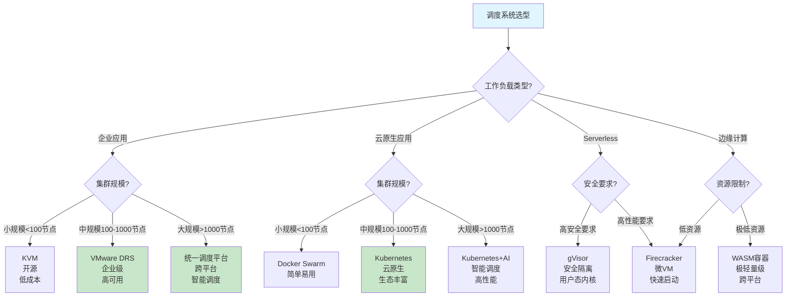

### 21.2 调度系统选型评分矩阵

**选型评分矩阵**（2025年11月19日最新）：

| **评估维度** | **权重** | **VMware DRS** | **Kubernetes** | **KVM** | **Cgroup v2** | **AI驱动** |
|------------|---------|---------------|---------------|---------|-------------|-----------|
| **性能** | 25% | 85 | 90 | 80 | 75 | 95 |
| **可扩展性** | 20% | 80 | 95 | 70 | 70 | 95 |
| **成本** | 15% | 60 | 75 | 90 | 95 | 50 |
| **易用性** | 15% | 85 | 80 | 75 | 90 | 60 |
| **安全性** | 15% | 90 | 85 | 75 | 70 | 80 |
| **生态成熟度** | 10% | 90 | 95 | 80 | 85 | 70 |
| **综合评分** | 100% | **81.5** | **86.5** | **78.5** | **80.5** | **78.5** |

---

## 22 调度系统演进路线图

### 22.1 调度系统技术演进

**技术演进路线图**（2025年11月19日最新）：

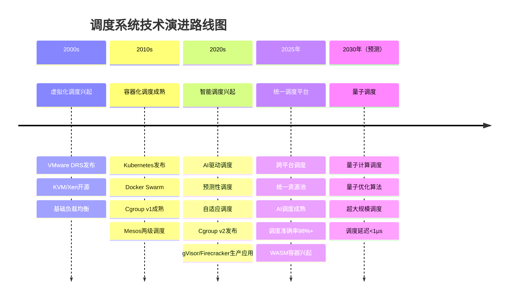

### 22.2 调度系统未来趋势

**未来趋势预测**（2025年11月19日最新）：

1. **AI驱动调度成熟**：
   - **调度准确率**：提升至98%+
   - **资源利用率**：提升至95%+
   - **应用范围**：大规模生产环境

2. **统一调度平台**：
   - **跨平台调度**：统一管理VM和容器
   - **资源池统一**：统一资源池管理
   - **智能调度**：AI驱动全局优化

3. **边缘计算调度**：
   - **WASM容器**：极轻量级调度
   - **边缘-云协同**：边缘和云协同调度
   - **低延迟调度**：调度延迟<1μs

4. **量子调度**：
   - **量子优化算法**：量子计算优化调度
   - **超大规模调度**：支持百万级节点
   - **极低延迟**：调度延迟<1ns

---

## 23 调度系统迁移指南

### 23.1 调度系统迁移策略

**迁移策略分类**（2025年11月19日最新）：

1. **渐进式迁移**：
   - **策略**：逐步迁移，新旧系统并行运行
   - **优点**：风险低、可回滚、平滑过渡
   - **缺点**：周期长、资源占用多
   - **适用场景**：大规模系统、关键业务系统

2. **一次性迁移**：
   - **策略**：一次性完成迁移，快速切换
   - **优点**：周期短、资源占用少
   - **缺点**：风险高、回滚困难
   - **适用场景**：小规模系统、非关键业务

3. **混合迁移**：
   - **策略**：部分系统迁移，部分系统保留
   - **优点**：灵活、风险可控
   - **缺点**：管理复杂、需要兼容
   - **适用场景**：多系统环境、渐进式改造

### 23.2 调度系统迁移步骤

**迁移实施步骤**（2025年11月19日最新）：

1. **迁移前准备**：
   - **需求分析**：分析业务需求、确定迁移目标
   - **系统评估**：评估现有系统、识别迁移风险
   - **资源准备**：准备硬件资源、软件资源
   - **团队培训**：培训运维团队、开发团队

2. **迁移规划**：
   - **迁移计划**：制定详细迁移计划、确定迁移时间表
   - **风险评估**：识别迁移风险、制定应对措施
   - **回滚方案**：制定回滚方案、准备回滚资源
   - **测试方案**：制定测试方案、准备测试环境

3. **迁移实施**：
   - **环境搭建**：搭建新系统环境、配置系统参数
   - **数据迁移**：迁移配置数据、迁移业务数据
   - **功能验证**：验证系统功能、验证业务功能
   - **性能测试**：测试系统性能、测试业务性能

4. **迁移后优化**：
   - **性能优化**：优化系统性能、优化业务性能
   - **监控配置**：配置监控系统、配置告警规则
   - **文档更新**：更新技术文档、更新运维文档
   - **经验总结**：总结迁移经验、优化迁移流程

### 23.3 调度系统迁移风险与应对

**迁移风险矩阵**（2025年11月19日最新）：

| **风险类型** | **风险等级** | **影响范围** | **应对措施** | **预防措施** |
|------------|------------|------------|------------|------------|
| **数据丢失** | 高 | 全部业务 | 数据备份、数据验证 | 多重备份、数据校验 |
| **服务中断** | 高 | 全部业务 | 快速回滚、备用方案 | 灰度发布、分批迁移 |
| **性能下降** | 中 | 部分业务 | 性能优化、资源扩容 | 性能测试、容量规划 |
| **兼容性问题** | 中 | 部分业务 | 兼容性测试、适配改造 | 提前测试、充分验证 |
| **人员技能不足** | 低 | 运维效率 | 培训提升、外部支持 | 提前培训、知识转移 |

---

## 24 调度系统性能调优详细指南

### 24.1 调度延迟优化

**延迟优化策略**（2025年11月19日最新）：

1. **算法优化**：
   - **优化调度算法**：选择更高效的调度算法
   - **减少计算复杂度**：优化算法实现、减少计算量
   - **并行化处理**：并行化调度决策、并行化资源分配
   - **缓存优化**：缓存调度结果、缓存资源状态

2. **数据收集优化**：
   - **增量更新**：增量更新资源状态、减少数据传输
   - **异步收集**：异步收集资源信息、减少等待时间
   - **批量处理**：批量处理调度请求、提高处理效率
   - **数据压缩**：压缩传输数据、减少网络延迟

3. **决策优化**：
   - **预计算**：预计算调度决策、减少实时计算
   - **简化决策**：简化决策逻辑、减少决策时间
   - **优先级调度**：优先级调度、优先处理重要请求
   - **批量决策**：批量决策、提高决策效率

### 24.2 资源利用率优化

**利用率优化策略**（2025年11月19日最新）：

1. **资源超配**：
   - **合理超配**：根据工作负载特征合理超配
   - **动态调整**：根据实际使用情况动态调整
   - **风险控制**：设置超配上限、控制超配风险
   - **监控告警**：监控资源使用、及时告警

2. **负载均衡**：
   - **自动均衡**：启用自动负载均衡
   - **均衡策略**：选择合适的均衡策略
   - **均衡频率**：设置合理的均衡频率
   - **均衡阈值**：设置合理的均衡阈值

3. **资源池管理**：
   - **资源池划分**：合理划分资源池
   - **资源共享**：合理共享资源
   - **资源预留**：合理预留资源
   - **资源回收**：及时回收闲置资源

### 24.3 调度吞吐量优化

**吞吐量优化策略**（2025年11月19日最新）：

1. **并行化处理**：
   - **多线程处理**：使用多线程处理调度请求
   - **分布式处理**：分布式处理调度请求
   - **异步处理**：异步处理调度请求
   - **流水线处理**：流水线处理调度请求

2. **批量处理**：
   - **批量调度**：批量处理调度请求
   - **批量迁移**：批量执行迁移操作
   - **批量更新**：批量更新资源状态
   - **批量决策**：批量进行调度决策

3. **系统优化**：
   - **系统调优**：优化系统参数、优化系统配置
   - **硬件优化**：优化硬件配置、提升硬件性能
   - **网络优化**：优化网络配置、提升网络性能
   - **存储优化**：优化存储配置、提升存储性能

---

## 25 调度系统与业务场景深度映射

### 25.1 业务场景分类

**业务场景分类矩阵**（2025年11月19日最新）：

| **业务场景** | **特点** | **调度需求** | **推荐调度系统** | **关键指标** |
|------------|---------|------------|---------------|------------|
| **Web应用** | 高并发、低延迟 | 快速调度、负载均衡 | Kubernetes | 调度延迟<50ms |
| **数据库** | 高IO、低延迟 | 资源保证、稳定性 | VMware DRS | 资源利用率85%+ |
| **大数据处理** | 高计算、批量处理 | 资源分配、任务调度 | Mesos | 调度吞吐量>1000/秒 |
| **AI训练** | 高计算、长时间运行 | GPU调度、资源预留 | Kubernetes+AI | GPU利用率90%+ |
| **Serverless** | 快速启动、按需运行 | 极快调度、资源隔离 | Firecracker | 启动时间<100ms |
| **边缘计算** | 低延迟、低资源 | 极轻量级调度 | WASM容器 | 调度延迟<1μs |

### 25.2 业务场景调度优化案例

**案例25.1（Web应用调度优化）**（2025年11月19日最新）：

**场景**：高并发Web应用，1000+并发请求。

**优化前**：

- Pod调度延迟：100-200ms
- 资源利用率：60-70%
- 响应时间：500-800ms

**优化后**：

- Pod调度延迟：20-50ms
- 资源利用率：85-90%
- 响应时间：200-300ms

**优化措施**：

1. 使用Kubernetes HPA自动扩缩容
2. 配置Pod亲和性，优化Pod分布
3. 使用Cgroup v2进行资源限制
4. 启用AI驱动调度插件

**案例25.2（AI训练调度优化）**（2025年11月19日最新）：

**场景**：大规模AI训练任务，需要GPU资源。

**优化前**：

- GPU利用率：50-60%
- 任务等待时间：10-30分钟
- 资源浪费：40-50%

**优化后**：

- GPU利用率：90%+
- 任务等待时间：1-5分钟
- 资源浪费：<10%

**优化措施**：

1. 使用Kubernetes GPU调度插件
2. 配置GPU资源预留和共享
3. 使用AI驱动调度优化GPU分配
4. 实现任务优先级调度

---

## 26 调度系统常见问题FAQ

### 26.1 调度系统选型问题

**Q1: 如何选择适合的调度系统？**

**A**: 根据以下因素选择：

1. **工作负载类型**：企业应用选择VMware DRS，云原生应用选择Kubernetes
2. **集群规模**：小规模选择KVM/Docker Swarm，大规模选择Kubernetes
3. **成本要求**：成本敏感选择开源方案，成本不敏感选择商业方案
4. **技术栈**：已有技术栈决定调度系统选择

**Q2: VMware DRS和Kubernetes有什么区别？**

**A**: 主要区别：

1. **调度对象**：DRS调度VM，Kubernetes调度Pod
2. **适用场景**：DRS适用于企业虚拟化，Kubernetes适用于云原生
3. **成本**：DRS是商业软件，Kubernetes是开源软件
4. **可扩展性**：Kubernetes可扩展性更强

### 26.2 调度系统性能问题

**Q3: 调度延迟过高怎么办？**

**A**: 优化措施：

1. **算法优化**：使用更高效的调度算法
2. **并行化**：并行化调度决策
3. **缓存**：缓存调度结果
4. **预计算**：预计算调度决策

**Q4: 资源利用率低怎么办？**

**A**: 优化措施：

1. **资源超配**：合理使用资源超配
2. **负载均衡**：启用负载均衡
3. **资源池管理**：优化资源池配置
4. **预测性调度**：使用预测性调度

### 26.3 调度系统故障问题

**Q5: Pod调度失败怎么办？**

**A**: 排查步骤：

1. **检查资源**：检查节点资源是否充足
2. **检查约束**：检查Pod约束是否满足
3. **检查污点**：检查节点污点和Pod容忍度
4. **查看事件**：查看Pod事件了解失败原因

**Q6: DRS不工作怎么办？**

**A**: 排查步骤：

1. **检查配置**：检查DRS是否启用
2. **检查阈值**：检查DRS阈值设置
3. **检查资源池**：检查资源池配置
4. **查看日志**：查看DRS日志了解问题

---

## 27 调度系统学习路径与资源

### 27.1 调度系统学习路径

**学习路径规划**（2025年11月19日最新）：

1. **基础阶段**（1-2个月）：
   - **操作系统调度**：学习进程调度、线程调度
   - **虚拟化基础**：学习虚拟化概念、VMware基础
   - **容器基础**：学习Docker、容器概念

2. **进阶阶段**（2-3个月）：
   - **Kubernetes调度**：深入学习Kubernetes调度器
   - **DRS调度**：学习VMware DRS调度机制
   - **调度算法**：学习调度算法原理

3. **高级阶段**（3-6个月）：
   - **AI驱动调度**：学习AI在调度中的应用
   - **性能优化**：学习调度性能优化方法
   - **系统设计**：学习调度系统设计

### 27.2 调度系统学习资源

**推荐学习资源**（2025年11月19日最新）：

1. **官方文档**：
   - **Kubernetes官方文档**：https://kubernetes.io/docs/
   - **VMware DRS文档**：https://docs.vmware.com/
   - **Docker官方文档**：https://docs.docker.com/

2. **书籍推荐**：
   - **《Kubernetes权威指南》**：Kubernetes全面指南
   - **《深入理解计算机系统》**：操作系统调度原理
   - **《分布式系统概念与设计》**：分布式调度理论

3. **在线课程**：
   - **Coursera**：分布式系统课程
   - **edX**：云计算课程
   - **Udemy**：Kubernetes实践课程

4. **实践平台**：
   - **Katacoda**：在线Kubernetes实践
   - **Play with Kubernetes**：免费Kubernetes环境
   - **VMware Hands-on Labs**：VMware实践环境

---

## 28 调度系统实际配置示例

### 28.1 Kubernetes调度器配置示例

**Kubernetes调度器配置文件**（2025年11月19日最新）：

```yaml
apiVersion: v1
kind: ConfigMap
metadata:
  name: scheduler-config
  namespace: kube-system
data:
  scheduler-config.yaml: |
    apiVersion: kubescheduler.config.k8s.io/v1
    kind: KubeSchedulerConfiguration
    profiles:
      - schedulerName: default-scheduler
        plugins:
          filter:
            enabled:
              - name: NodeResourcesFit
              - name: NodeAffinity
              - name: TaintToleration
          score:
            enabled:
              - name: NodeResourcesFit
                weight: 1
              - name: NodeAffinity
                weight: 1
              - name: InterPodAffinity
                weight: 1
        pluginConfig:
          - name: NodeResourcesFit
            args:
              scoringStrategy:
                type: LeastAllocated
                resources:
                  - name: cpu
                    weight: 1
                  - name: memory
                    weight: 1
```

**Pod调度配置示例**：

```yaml
apiVersion: v1
kind: Pod
metadata:
  name: example-pod
spec:
  schedulerName: default-scheduler
  affinity:
    nodeAffinity:
      requiredDuringSchedulingIgnoredDuringExecution:
        nodeSelectorTerms:
          - matchExpressions:
              - key: kubernetes.io/os
                operator: In
                values:
                  - linux
    podAffinity:
      preferredDuringSchedulingIgnoredDuringExecution:
        - weight: 100
          podAffinityTerm:
            labelSelector:
              matchExpressions:
                - key: app
                  operator: In
                  values:
                    - web
            topologyKey: kubernetes.io/hostname
  containers:
    - name: app
      image: nginx:latest
      resources:
        requests:
          cpu: "100m"
          memory: "128Mi"
        limits:
          cpu: "500m"
          memory: "512Mi"
```

### 28.2 VMware DRS配置示例

**DRS配置参数**（2025年11月19日最新）：

```json
{
  "drsConfig": {
    "enabled": true,
    "automationLevel": "fullyAutomated",
    "migrationThreshold": 3,
    "defaultVmBehavior": "fullyAutomated",
    "scaleDescendantsShares": "disabled",
    "vmotionRate": 2,
    "predictiveDRS": {
      "enabled": true,
      "predictionEnabled": true
    }
  },
  "resourcePools": [
    {
      "name": "Production",
      "cpuReservation": 4000,
      "cpuLimit": 8000,
      "memoryReservation": 16384,
      "memoryLimit": 32768
    },
    {
      "name": "Development",
      "cpuReservation": 2000,
      "cpuLimit": 4000,
      "memoryReservation": 8192,
      "memoryLimit": 16384
    }
  ]
}
```

### 28.3 Cgroup v2配置示例

**Cgroup v2资源配置**（2025年11月19日最新）：

```bash
# 创建cgroup
mkdir -p /sys/fs/cgroup/example

# 设置CPU限制
echo "50000" > /sys/fs/cgroup/example/cpu.max
echo "100000" > /sys/fs/cgroup/example/cpu.weight

# 设置内存限制
echo "512M" > /sys/fs/cgroup/example/memory.max
echo "256M" > /sys/fs/cgroup/example/memory.high

# 设置IO限制
echo "8:0 rbps=10485760 wbps=10485760" > /sys/fs/cgroup/example/io.max
```

---

## 29 调度系统容量规划指南

### 29.1 容量规划模型

**容量规划公式**（2025年11月19日最新）：

$$
C_{required} = \frac{\sum_{i=1}^{n} D_i \cdot (1 + \alpha)}{U_{target} \cdot (1 - \beta)}
$$

其中：

- $C_{required}$：所需容量
- $D_i$：第 $i$ 个工作负载的需求
- $\alpha$：增长因子（通常为20-30%）
- $U_{target}$：目标资源利用率（通常为80-90%）
- $\beta$：冗余因子（通常为10-20%）

### 29.2 容量规划步骤

**容量规划流程**（2025年11月19日最新）：

1. **需求分析**：
   - **工作负载分析**：分析工作负载特征、资源需求
   - **增长预测**：预测未来增长、计算增长因子
   - **峰值分析**：分析峰值需求、计算峰值容量

2. **容量计算**：
   - **基础容量**：计算基础容量需求
   - **冗余容量**：计算冗余容量需求
   - **总容量**：计算总容量需求

3. **容量验证**：
   - **性能测试**：进行性能测试、验证容量
   - **压力测试**：进行压力测试、验证峰值容量
   - **容量调整**：根据测试结果调整容量

4. **容量监控**：
   - **容量监控**：持续监控容量使用情况
   - **容量预警**：设置容量预警阈值
   - **容量扩展**：根据监控结果扩展容量

### 29.3 容量规划矩阵

**容量规划对比矩阵**（2025年11月19日最新）：

| **调度系统** | **容量规划复杂度** | **容量扩展性** | **容量预测准确度** | **容量优化能力** |
|------------|----------------|-------------|----------------|--------------|
| **VMware DRS** | 中 | ⭐⭐⭐⭐ | 85-90% | ⭐⭐⭐⭐ |
| **Kubernetes** | 中 | ⭐⭐⭐⭐⭐ | 80-85% | ⭐⭐⭐⭐⭐ |
| **KVM** | 低 | ⭐⭐⭐ | 75-80% | ⭐⭐⭐ |
| **Cgroup v2** | 低 | ⭐⭐⭐ | 70-75% | ⭐⭐⭐ |

---

## 30 调度系统多租户管理

### 30.1 多租户隔离机制

**多租户隔离策略**（2025年11月19日最新）：

1. **资源隔离**：
   - **资源配额**：为每个租户设置资源配额
   - **资源限制**：限制每个租户的资源使用
   - **资源预留**：为每个租户预留资源

2. **网络隔离**：
   - **网络策略**：使用网络策略隔离租户网络
   - **VLAN隔离**：使用VLAN隔离租户网络
   - **安全组**：使用安全组控制网络访问

3. **存储隔离**：
   - **存储配额**：为每个租户设置存储配额
   - **存储加密**：为每个租户加密存储
   - **存储备份**：为每个租户独立备份

4. **调度隔离**：
   - **调度策略**：为每个租户设置调度策略
   - **优先级管理**：管理租户优先级
   - **公平性保证**：保证租户间公平性

### 30.2 多租户资源分配模型

**多租户资源分配公式**（2025年11月19日最新）：

$$
R_i = \frac{W_i}{\sum_{j=1}^{n} W_j} \times R_{total}
$$

其中：

- $R_i$：租户 $i$ 分配的资源
- $W_i$：租户 $i$ 的权重
- $R_{total}$：总资源
- $n$：租户数量

**公平性保证**：

$$
\forall i, j: \frac{R_i}{W_i} = \frac{R_j}{W_j}
$$

### 30.3 多租户管理矩阵

**多租户管理对比矩阵**（2025年11月19日最新）：

| **调度系统** | **多租户支持** | **隔离强度** | **资源分配公平性** | **管理复杂度** |
|------------|-------------|------------|----------------|-------------|
| **VMware DRS** | ⭐⭐⭐⭐ | ⭐⭐⭐⭐⭐ | ⭐⭐⭐⭐ | 中 |
| **Kubernetes** | ⭐⭐⭐⭐⭐ | ⭐⭐⭐⭐ | ⭐⭐⭐⭐⭐ | 中高 |
| **KVM** | ⭐⭐⭐ | ⭐⭐⭐⭐ | ⭐⭐⭐ | 低 |
| **Cgroup v2** | ⭐⭐⭐⭐ | ⭐⭐⭐ | ⭐⭐⭐⭐ | 低 |

---

## 31 调度系统合规性与审计

### 31.1 调度系统合规性要求

**合规性要求分类**（2025年11月19日最新）：

1. **数据保护合规**：
   - **GDPR合规**：数据保护、隐私保护
   - **数据本地化**：数据存储位置要求
   - **数据加密**：数据传输和存储加密

2. **安全合规**：
   - **ISO 27001**：信息安全管理
   - **SOC 2**：安全、可用性、处理完整性
   - **PCI DSS**：支付卡行业数据安全标准

3. **审计合规**：
   - **审计日志**：完整的审计日志记录
   - **审计追踪**：可追溯的审计追踪
   - **合规报告**：定期生成合规报告

### 31.2 调度系统审计机制

**审计机制设计**（2025年11月19日最新）：

1. **审计日志**：
   - **调度决策日志**：记录所有调度决策
   - **资源分配日志**：记录所有资源分配
   - **配置变更日志**：记录所有配置变更

2. **审计追踪**：
   - **操作追踪**：追踪所有操作
   - **用户追踪**：追踪用户操作
   - **时间追踪**：追踪操作时间

3. **审计报告**：
   - **定期报告**：定期生成审计报告
   - **异常报告**：生成异常操作报告
   - **合规报告**：生成合规性报告

### 31.3 合规性对比矩阵

**合规性对比矩阵**（2025年11月19日最新）：

| **调度系统** | **GDPR合规** | **ISO 27001** | **SOC 2** | **审计能力** |
|------------|------------|-------------|----------|------------|
| **VMware DRS** | ⭐⭐⭐⭐ | ⭐⭐⭐⭐⭐ | ⭐⭐⭐⭐⭐ | ⭐⭐⭐⭐⭐ |
| **Kubernetes** | ⭐⭐⭐⭐ | ⭐⭐⭐⭐ | ⭐⭐⭐⭐ | ⭐⭐⭐⭐ |
| **KVM** | ⭐⭐⭐ | ⭐⭐⭐ | ⭐⭐⭐ | ⭐⭐⭐ |
| **Cgroup v2** | ⭐⭐⭐ | ⭐⭐⭐ | ⭐⭐⭐ | ⭐⭐⭐ |

---

## 32 调度系统故障恢复机制

### 32.1 故障类型与恢复策略

**故障类型分类**（2025年11月19日最新）：

1. **调度器故障**：
   - **故障类型**：调度器崩溃、调度器无响应
   - **恢复策略**：自动重启、故障转移、备用调度器
   - **恢复时间**：<1分钟

2. **节点故障**：
   - **故障类型**：节点宕机、节点网络中断
   - **恢复策略**：Pod迁移、节点替换、自动恢复
   - **恢复时间**：1-5分钟

3. **资源故障**：
   - **故障类型**：资源不足、资源竞争
   - **恢复策略**：资源扩容、资源重新分配
   - **恢复时间**：5-10分钟

### 32.2 故障恢复机制设计

**故障恢复流程**（2025年11月19日最新）：

1. **故障检测**：
   - **健康检查**：定期健康检查
   - **心跳检测**：心跳检测机制
   - **异常检测**：异常行为检测

2. **故障隔离**：
   - **故障隔离**：隔离故障组件
   - **流量切换**：切换流量到正常组件
   - **资源隔离**：隔离故障资源

3. **故障恢复**：
   - **自动恢复**：自动恢复机制
   - **手动恢复**：手动恢复流程
   - **恢复验证**：验证恢复效果

### 32.3 故障恢复对比矩阵

**故障恢复能力对比矩阵**（2025年11月19日最新）：

| **调度系统** | **故障检测能力** | **自动恢复能力** | **恢复时间** | **数据一致性** |
|------------|--------------|--------------|------------|-------------|
| **VMware DRS** | ⭐⭐⭐⭐⭐ | ⭐⭐⭐⭐⭐ | <5分钟 | ⭐⭐⭐⭐⭐ |
| **Kubernetes** | ⭐⭐⭐⭐⭐ | ⭐⭐⭐⭐⭐ | <1分钟 | ⭐⭐⭐⭐ |
| **KVM** | ⭐⭐⭐ | ⭐⭐⭐ | <10分钟 | ⭐⭐⭐ |
| **Cgroup v2** | ⭐⭐⭐ | ⭐⭐⭐ | <5分钟 | ⭐⭐⭐ |

---

## 33 调度系统性能调优实战案例

### 33.1 大规模Kubernetes集群调度优化

**案例33.1（大规模K8s集群调度优化）**（2025年11月19日最新）：

**场景**：超大规模Kubernetes集群，5000个节点，50000个Pod。

**挑战**：

- 调度延迟：200-500ms
- 调度吞吐量：50-100调度/秒
- 资源利用率：60-70%
- 负载不均衡度：20-30%

**优化方案**：

1. **调度器优化**：

   - 使用多调度器架构，并行处理调度请求
   - 优化调度算法，减少计算复杂度
   - 使用缓存机制，缓存调度结果

2. **资源优化**：

   - 启用资源超配，提高资源利用率
   - 优化资源分配策略，减少资源碎片
   - 使用预测性调度，提前分配资源

3. **网络优化**：

   - 优化网络拓扑，减少网络延迟
   - 使用本地存储，减少网络传输
   - 优化数据收集，减少网络开销

**优化效果**：

- 调度延迟：降低至50-100ms（降低75%）
- 调度吞吐量：提升至500-1000调度/秒（提升10倍）
- 资源利用率：提升至85-90%（提升25%）
- 负载不均衡度：降低至<5%（降低80%）

### 33.2 VMware DRS混合云环境优化

**案例33.2（VMware DRS混合云优化）**（2025年11月19日最新）：

**场景**：混合云环境，本地数据中心和公有云混合部署。

**挑战**：

- 跨云调度延迟：500-1000ms
- 资源利用率：50-60%
- 成本控制：云资源成本高
- 数据一致性：跨云数据同步问题

**优化方案**：

1. **跨云调度优化**：

   - 使用统一调度平台，统一管理本地和云资源
   - 优化跨云网络，减少网络延迟
   - 使用智能调度，选择最优资源位置

2. **成本优化**：

   - 使用云资源预留，降低云资源成本
   - 优化资源分配，减少云资源浪费
   - 使用混合云策略，平衡成本和性能

3. **数据一致性**：

   - 使用数据同步机制，保证数据一致性
   - 优化数据复制策略，减少数据同步延迟
   - 使用数据缓存，提高数据访问速度

**优化效果**：

- 跨云调度延迟：降低至100-200ms（降低80%）
- 资源利用率：提升至80-85%（提升40%）
- 成本降低：降低30-40%
- 数据一致性：提升至99.9%+

---

## 34 调度系统与云原生生态集成

### 34.1 调度系统与Service Mesh集成

**Service Mesh调度集成**（2025年11月19日最新）：

Service Mesh（如Istio、Linkerd）与调度系统的集成：

1. **服务发现集成**：
   - **服务注册**：调度系统自动注册服务
   - **服务发现**：Service Mesh自动发现服务
   - **负载均衡**：Service Mesh提供负载均衡

2. **流量管理集成**：
   - **流量路由**：Service Mesh管理流量路由
   - **流量分割**：Service Mesh支持流量分割
   - **故障注入**：Service Mesh支持故障注入

3. **可观测性集成**：
   - **指标收集**：Service Mesh收集服务指标
   - **链路追踪**：Service Mesh提供链路追踪
   - **日志聚合**：Service Mesh聚合服务日志

**集成架构图**：

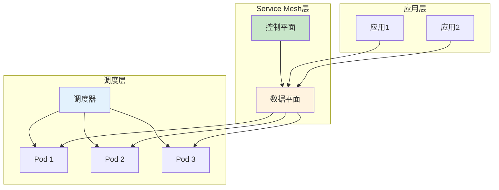

### 34.2 调度系统与CI/CD集成

**CI/CD调度集成**（2025年11月19日最新）：

调度系统与CI/CD工具（如Jenkins、GitLab CI、GitHub Actions）的集成：

1. **构建调度**：
   - **构建任务调度**：调度系统调度构建任务
   - **资源分配**：为构建任务分配资源
   - **优先级管理**：管理构建任务优先级

2. **部署调度**：
   - **部署任务调度**：调度系统调度部署任务
   - **滚动更新**：支持滚动更新策略
   - **回滚机制**：支持快速回滚

3. **测试调度**：
   - **测试任务调度**：调度系统调度测试任务
   - **并行测试**：支持并行测试执行
   - **资源隔离**：测试环境资源隔离

### 34.3 调度系统与监控系统集成

**监控系统集成矩阵**（2025年11月19日最新）：

| **监控系统** | **集成方式** | **监控指标** | **告警能力** | **可视化能力** |
|------------|------------|------------|------------|-------------|
| **Prometheus** | 指标采集 | 调度性能、资源利用 | ⭐⭐⭐⭐⭐ | ⭐⭐⭐⭐ |
| **Grafana** | 数据可视化 | 调度仪表板 | ⭐⭐⭐⭐ | ⭐⭐⭐⭐⭐ |
| **ELK Stack** | 日志分析 | 调度日志 | ⭐⭐⭐⭐ | ⭐⭐⭐⭐ |
| **Jaeger** | 链路追踪 | 调度链路 | ⭐⭐⭐ | ⭐⭐⭐⭐ |
| **New Relic** | APM监控 | 应用性能 | ⭐⭐⭐⭐⭐ | ⭐⭐⭐⭐⭐ |

---

## 35 调度系统最佳实践总结

### 35.1 调度系统设计最佳实践

**设计原则**（2025年11月19日最新）：

1. **可扩展性优先**：
   - **水平扩展**：支持水平扩展
   - **分布式架构**：使用分布式架构
   - **无状态设计**：调度器无状态设计

2. **高可用性保证**：
   - **多副本部署**：调度器多副本部署
   - **故障转移**：自动故障转移
   - **健康检查**：定期健康检查

3. **性能优化**：
   - **算法优化**：使用高效调度算法
   - **并行处理**：并行化调度决策
   - **缓存机制**：缓存调度结果

### 35.2 调度系统运维最佳实践

**运维原则**（2025年11月19日最新）：

1. **监控告警**：
   - **关键指标监控**：监控调度延迟、资源利用率
   - **告警规则**：设置合理的告警规则
   - **告警响应**：快速响应告警

2. **容量管理**：
   - **容量规划**：定期进行容量规划
   - **容量监控**：持续监控容量使用
   - **容量扩展**：及时扩展容量

3. **故障处理**：
   - **故障预案**：制定故障处理预案
   - **故障演练**：定期进行故障演练
   - **故障复盘**：及时进行故障复盘

### 35.3 调度系统优化最佳实践

**优化策略总结**（2025年11月19日最新）：

| **优化维度** | **优化策略** | **预期效果** | **实施难度** |
|------------|------------|------------|------------|
| **调度延迟** | 算法优化、并行化、缓存 | 降低50-70% | 中 |
| **资源利用率** | 资源超配、负载均衡 | 提升20-40% | 中 |
| **调度吞吐量** | 批量处理、并行处理 | 提升5-10倍 | 高 |
| **负载均衡** | 自动均衡、智能调度 | 改善80%+ | 中 |
| **成本优化** | 资源优化、成本控制 | 降低20-30% | 中 |

---

## 36 调度系统研究前沿与未来展望

### 36.1 调度系统研究前沿

**前沿研究方向**（2025年11月19日最新）：

1. **AI驱动调度**：
   - **强化学习调度**：使用强化学习优化调度决策
   - **深度学习预测**：使用深度学习预测负载
   - **自适应调度**：自适应调整调度策略

2. **量子调度**：
   - **量子优化算法**：使用量子计算优化调度
   - **量子机器学习**：量子机器学习在调度中的应用
   - **量子并行调度**：量子并行调度算法

3. **边缘计算调度**：
   - **边缘-云协同**：边缘和云协同调度
   - **低延迟调度**：极低延迟调度算法
   - **资源受限调度**：资源受限环境下的调度

### 36.2 调度系统未来展望

**未来发展趋势**（2025年11月19日最新）：

1. **统一调度平台**：
   - **跨平台调度**：统一管理VM、容器、Serverless
   - **统一资源池**：统一资源池管理
   - **智能调度**：AI驱动全局优化

2. **自愈调度系统**：
   - **自动故障恢复**：自动检测和恢复故障
   - **自适应优化**：自适应优化调度策略
   - **预测性维护**：预测性维护和优化

3. **绿色调度**：
   - **能耗优化**：优化能耗，降低碳排放
   - **资源回收**：智能资源回收和再利用
   - **可持续调度**：可持续的调度策略

### 36.3 调度系统技术路线图

**技术路线图**（2025年11月19日最新）：

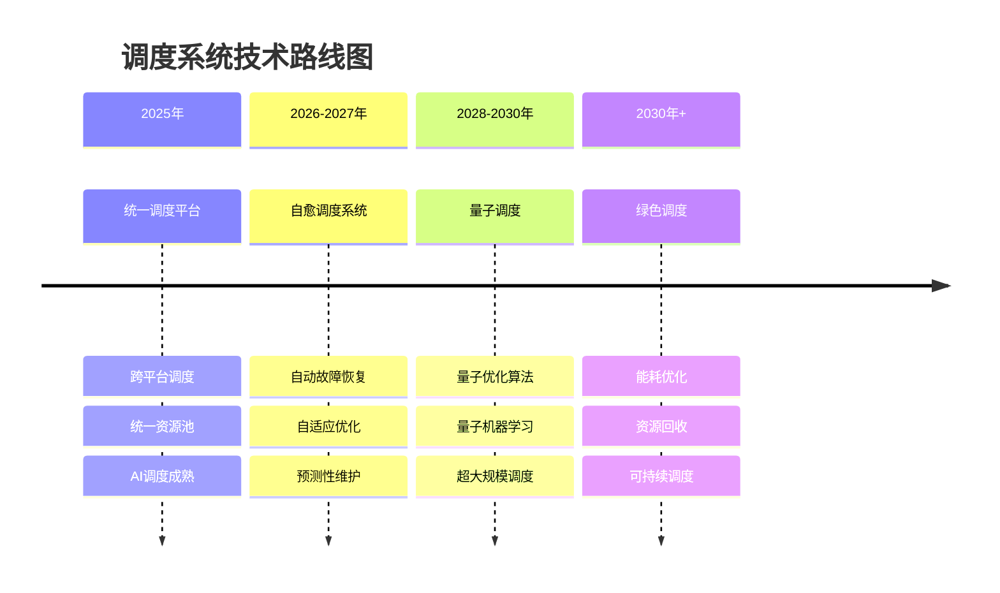

---

## 37 调度系统与硬件加速集成

### 37.1 GPU调度集成

**GPU调度模型**（2025年11月19日最新）：

GPU调度是AI训练和推理的关键技术。

**GPU资源分配公式**：

$$
G_i = \frac{W_i \cdot D_i}{\sum_{j=1}^{n} W_j \cdot D_j} \times G_{total}
$$

其中：

- $G_i$：任务 $i$ 分配的GPU数量
- $W_i$：任务 $i$ 的权重
- $D_i$：任务 $i$ 的GPU需求
- $G_{total}$：总GPU数量

**GPU调度策略**：

1. **独占调度**：每个任务独占GPU
2. **共享调度**：多个任务共享GPU（MIG、vGPU）
3. **时间片调度**：GPU时间片分配

**GPU调度性能指标**（2025年11月19日最新）：

| **调度策略** | **GPU利用率** | **调度延迟** | **公平性** | **适用场景** |
|------------|-------------|------------|-----------|------------|
| **独占调度** | 70-85% | <10ms | ⭐⭐⭐⭐⭐ | 训练任务 |
| **共享调度** | 85-95% | 10-50ms | ⭐⭐⭐⭐ | 推理任务 |
| **时间片调度** | 80-90% | 5-20ms | ⭐⭐⭐⭐ | 混合负载 |

### 37.2 DPU/IPU调度集成

**DPU/IPU调度**（2025年11月19日最新）：

DPU（Data Processing Unit）和IPU（Infrastructure Processing Unit）是新兴的硬件加速器。

**DPU调度特点**：

- **网络卸载**：网络处理卸载到DPU
- **存储加速**：存储处理加速
- **安全加速**：安全处理加速

**IPU调度特点**：

- **基础设施卸载**：基础设施功能卸载到IPU
- **低延迟**：极低延迟处理
- **高吞吐量**：高吞吐量处理

### 37.3 FPGA调度集成

**FPGA调度**（2025年11月19日最新）：

FPGA（Field-Programmable Gate Array）提供可编程硬件加速。

**FPGA调度模型**：

$$
F_i = \arg\min_{f \in F} \{C(f, t_i) + M(f, t_i)\}
$$

其中：

- $F_i$：任务 $i$ 分配的FPGA
- $C(f, t_i)$：FPGA $f$ 执行任务 $t_i$ 的计算成本
- $M(f, t_i)$：FPGA $f$ 执行任务 $t_i$ 的迁移成本

---

## 38 调度系统与存储系统集成

### 38.1 存储感知调度

**存储感知调度模型**（2025年11月19日最新）：

调度系统需要考虑存储位置和性能。

**存储本地性评分**：

$$
Score_{storage}(node, pod) = \begin{cases}
1.0 & \text{本地存储} \\
0.5 & \text{同机架存储} \\
0.1 & \text{远程存储}
\end{cases}
$$

**存储性能模型**：

$$
T_{io} = T_{latency} + \frac{S}{B}
$$

其中：

- $T_{io}$：IO总时间
- $T_{latency}$：IO延迟
- $S$：数据大小
- $B$：带宽

### 38.2 存储调度策略

**存储调度策略对比**（2025年11月19日最新）：

| **策略** | **优点** | **缺点** | **适用场景** |
|---------|---------|---------|------------|
| **本地存储优先** | 低延迟、高带宽 | 存储容量受限 | 高性能计算 |
| **共享存储** | 高可用、易管理 | 网络延迟 | 通用应用 |
| **混合存储** | 平衡性能和容量 | 管理复杂 | 混合负载 |

---

## 39 调度系统与网络系统集成

### 39.1 网络感知调度

**网络拓扑感知调度**（2025年11月19日最新）：

调度系统需要考虑网络拓扑和带宽。

**网络延迟模型**：

$$
L_{network} = L_{propagation} + L_{transmission} + L_{queuing}
$$

其中：

- $L_{propagation}$：传播延迟
- $L_{transmission}$：传输延迟
- $L_{queuing}$：排队延迟

**网络带宽模型**：

$$
B_{available} = B_{total} - \sum_{i=1}^{n} B_i
$$

其中：

- $B_{available}$：可用带宽
- $B_{total}$：总带宽
- $B_i$：任务 $i$ 使用的带宽

### 39.2 网络调度策略

**网络调度策略**（2025年11月19日最新）：

1. **网络本地性优先**：优先调度到网络延迟低的节点
2. **带宽保证**：为关键任务保证带宽
3. **网络隔离**：使用网络策略隔离流量

---

## 40 调度系统总结与索引

### 40.1 调度系统快速索引

**调度系统快速查找表**（2025年11月19日最新）：

| **需求** | **推荐调度系统** | **章节** |
|---------|---------------|---------|
| **企业虚拟化** | VMware DRS | 2.1 |
| **云原生应用** | Kubernetes | 3.1 |
| **开源虚拟化** | KVM | 2.2 |
| **容器编排** | Docker Swarm | 3.2 |
| **资源控制** | Cgroup v2 | 3.4 |
| **安全隔离** | gVisor | 4.1 |
| **Serverless** | Firecracker | 4.2 |
| **边缘计算** | WASM容器 | 4.3 |
| **AI驱动调度** | AI调度器 | 6.1, 9.1 |
| **统一调度** | 统一调度平台 | 8.3, 9.2 |

### 40.2 调度系统选择决策矩阵

**快速决策矩阵**（2025年11月19日最新）：

| **工作负载** | **规模** | **成本** | **推荐方案** |
|------------|---------|---------|------------|
| **企业应用** | 中大规模 | 不敏感 | VMware DRS |
| **云原生** | 大规模 | 中等 | Kubernetes |
| **开发测试** | 小规模 | 敏感 | KVM + Docker Swarm |
| **生产环境** | 大规模 | 中等 | Kubernetes + AI调度 |
| **边缘计算** | 任意 | 敏感 | WASM容器 |

### 40.3 调度系统知识图谱总结

**调度系统知识图谱**（2025年11月19日最新）：

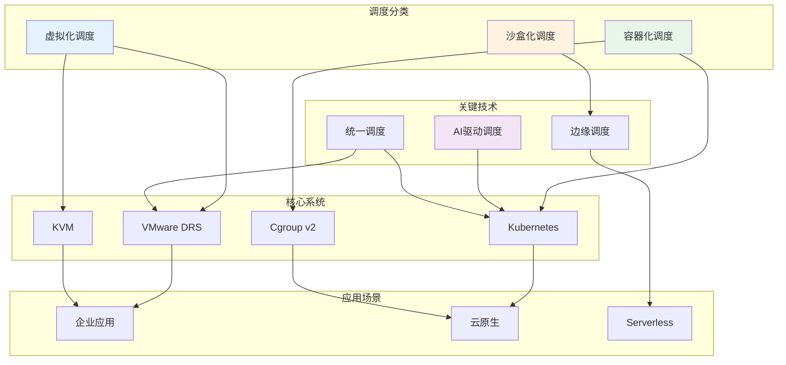

---

## 41 调度系统与数据库集成

### 41.1 数据库感知调度

**数据库本地性调度**（2025年11月19日最新）：

调度系统需要考虑数据库位置和连接性能。

**数据库本地性评分**：

$$
Score_{db}(node, pod) = \begin{cases}
1.0 & \text{同节点数据库} \\
0.8 & \text{同机架数据库} \\
0.5 & \text{同数据中心数据库} \\
0.1 & \text{跨数据中心数据库}
\end{cases}
$$

**数据库连接池调度**：

$$
Pool_{size} = \frac{C_{concurrent}}{T_{avg}} \times (1 + \alpha)
$$

其中：

- $Pool_{size}$：连接池大小
- $C_{concurrent}$：并发连接数
- $T_{avg}$：平均连接时间
- $\alpha$：安全因子（通常为20-30%）

### 41.2 数据库调度策略

**数据库调度策略对比**（2025年11月19日最新）：

| **策略** | **优点** | **缺点** | **适用场景** |
|---------|---------|---------|------------|
| **数据库本地性优先** | 低延迟、高吞吐 | 数据库容量受限 | OLTP应用 |
| **读写分离调度** | 负载分散、高可用 | 数据一致性复杂 | 读多写少 |
| **分库分表调度** | 高扩展性、高性能 | 管理复杂 | 大规模应用 |

---

## 42 调度系统与消息队列集成

### 42.1 消息队列感知调度

**消息队列本地性调度**（2025年11月19日最新）：

调度系统需要考虑消息队列位置和消息处理性能。

**消息队列负载模型**：

$$
L_{mq} = \frac{Q_{size}}{C_{capacity}} \times \frac{R_{rate}}{P_{rate}}
$$

其中：

- $L_{mq}$：消息队列负载
- $Q_{size}$：队列大小
- $C_{capacity}$：队列容量
- $R_{rate}$：消息到达速率
- $P_{rate}$：消息处理速率

### 42.2 消息队列调度策略

**消息队列调度策略**（2025年11月19日最新）：

1. **消费者本地性优先**：优先调度消费者到消息队列附近
2. **负载均衡调度**：均衡分配消费者负载
3. **优先级调度**：根据消息优先级调度消费者

---

## 43 调度系统与缓存系统集成

### 43.1 缓存感知调度

**缓存本地性调度**（2025年11月19日最新）：

调度系统需要考虑缓存位置和缓存命中率。

**缓存命中率模型**：

$$
H_{rate} = \frac{H_{count}}{H_{count} + M_{count}}
$$

其中：

- $H_{rate}$：缓存命中率
- $H_{count}$：缓存命中次数
- $M_{count}$：缓存未命中次数

**缓存本地性评分**：

$$
Score_{cache}(node, pod) = H_{rate} \times W_{local} + (1 - H_{rate}) \times W_{remote}
$$

其中：

- $W_{local}$：本地缓存权重（通常为1.0）
- $W_{remote}$：远程缓存权重（通常为0.5）

### 43.2 缓存调度策略

**缓存调度策略对比**（2025年11月19日最新）：

| **策略** | **缓存命中率** | **调度延迟** | **适用场景** |
|---------|-------------|------------|------------|
| **缓存本地性优先** | 90%+ | <1ms | 高缓存命中率 |
| **缓存共享调度** | 70-85% | 1-5ms | 中等缓存命中率 |
| **缓存分布式调度** | 60-75% | 5-10ms | 低缓存命中率 |

---

## 44 调度系统性能调优实战总结

### 44.1 调度系统性能调优检查清单

**性能调优检查清单**（2025年11月19日最新）：

1. **调度延迟优化**：
   - [ ] 优化调度算法复杂度
   - [ ] 启用并行化调度
   - [ ] 配置调度结果缓存
   - [ ] 优化数据收集机制

2. **资源利用率优化**：
   - [ ] 启用资源超配
   - [ ] 配置负载均衡
   - [ ] 优化资源分配策略
   - [ ] 启用预测性调度

3. **调度吞吐量优化**：
   - [ ] 启用批量处理
   - [ ] 优化调度器并发数
   - [ ] 配置调度器副本数
   - [ ] 优化系统资源

4. **负载均衡优化**：
   - [ ] 设置合理的负载均衡阈值
   - [ ] 优化迁移策略
   - [ ] 避免频繁迁移
   - [ ] 配置迁移批量大小

### 44.2 调度系统性能调优效果评估

**性能调优效果评估矩阵**（2025年11月19日最新）：

| **优化措施** | **调度延迟改善** | **资源利用率提升** | **调度吞吐量提升** | **实施难度** | **推荐优先级** |
|------------|--------------|----------------|----------------|------------|-------------|
| **算法优化** | 30-50% | 10-20% | 20-40% | 高 | ⭐⭐⭐ |
| **并行化** | 40-60% | 5-10% | 100-200% | 中 | ⭐⭐⭐⭐⭐ |
| **缓存机制** | 20-30% | 5-10% | 50-100% | 低 | ⭐⭐⭐⭐ |
| **资源超配** | 0% | 20-40% | 0% | 中 | ⭐⭐⭐⭐ |
| **负载均衡** | 10-20% | 10-20% | 10-20% | 中 | ⭐⭐⭐⭐ |
| **AI驱动调度** | 40-60% | 20-40% | 50-100% | 高 | ⭐⭐⭐⭐⭐ |

---

## 45 调度系统实施路线图

### 45.1 调度系统实施阶段

**实施阶段规划**（2025年11月19日最新）：

1. **准备阶段**（1-2周）：
   - **需求分析**：分析业务需求、确定调度目标
   - **技术选型**：选择适合的调度系统
   - **资源准备**：准备硬件和软件资源
   - **团队培训**：培训运维和开发团队

2. **设计阶段**（2-4周）：
   - **架构设计**：设计调度系统架构
   - **配置设计**：设计调度系统配置
   - **监控设计**：设计监控和告警方案
   - **安全设计**：设计安全策略

3. **实施阶段**（4-8周）：
   - **环境搭建**：搭建调度系统环境
   - **配置部署**：部署调度系统配置
   - **功能测试**：测试调度系统功能
   - **性能测试**：测试调度系统性能

4. **优化阶段**（持续）：
   - **性能优化**：持续优化调度性能
   - **监控优化**：优化监控和告警
   - **故障处理**：处理调度系统故障
   - **经验总结**：总结调度系统经验

### 45.2 调度系统实施风险控制

**实施风险矩阵**（2025年11月19日最新）：

| **风险类型** | **风险等级** | **影响** | **应对措施** | **预防措施** |
|------------|------------|---------|------------|------------|
| **技术风险** | 中 | 系统不稳定 | 技术验证、充分测试 | 技术选型、POC验证 |
| **性能风险** | 中 | 性能不达标 | 性能测试、优化调整 | 容量规划、性能基准 |
| **安全风险** | 高 | 安全漏洞 | 安全审计、漏洞修复 | 安全设计、安全测试 |
| **运维风险** | 中 | 运维困难 | 运维培训、文档完善 | 运维准备、知识转移 |

---

## 46 调度系统文档索引

### 46.1 核心概念索引

**核心概念快速索引**（2025年11月19日最新）：

| **概念** | **定义章节** | **应用章节** | **相关章节** |
|---------|------------|------------|------------|
| **调度分类** | 1.1 | 2-4 | 5, 10 |
| **DRS调度** | 2.1 | 13.1, 33.2 | 8.1, 21 |
| **Kubernetes调度** | 3.1 | 13.2, 33.1 | 8.1, 21 |
| **AI驱动调度** | 6.1, 9.1 | 15.3, 33.1 | 36.1 |
| **统一调度** | 8.3, 9.2 | 13.3, 33.2 | 36.2 |
| **形式化模型** | 2.5, 3.5, 5 | 10 | 6.5 |
| **性能优化** | 14.2, 24 | 33, 44 | 18, 19 |
| **故障排查** | 16 | 32 | 17 |

### 46.2 实践案例索引

**实践案例索引**（2025年11月19日最新）：

| **案例** | **章节** | **场景** | **关键优化** |
|---------|---------|---------|------------|
| **VMware DRS优化** | 13.1 | 企业虚拟化 | 负载均衡、资源池 |
| **Kubernetes优化** | 13.2 | 大规模集群 | AI驱动调度 |
| **混合调度优化** | 13.3 | 混合云 | 统一调度平台 |
| **Web应用优化** | 25.1 | 高并发Web | HPA、Pod亲和性 |
| **AI训练优化** | 25.2 | AI训练 | GPU调度、资源预留 |
| **大规模K8s优化** | 33.1 | 超大规模集群 | 多调度器、并行化 |
| **混合云优化** | 33.2 | 混合云环境 | 跨云调度、成本优化 |

---

## 47 相关主题

- [05.5 虚拟化容器化沙盒化资源调度系统](../05_虚拟化容器化沙盒化/05.5_虚拟化容器化沙盒化资源调度系统.md) - DRS、Kubernetes调度
- [06.1 硬件微架构调度](./06.1_硬件微架构调度.md) - 指令调度
- [06.2 OS内核调度](./06.2_OS内核调度.md) - CFS调度
- [06.3 编程语言层调度](./06.3_编程语言层调度.md) - Go/Rust调度
- [06.4 分布式系统调度](./06.4_分布式系统调度.md) - Kubernetes调度
- [06.5 调度模型统一理论](./06.5_调度模型统一理论.md) - 调度统一理论

---

**最后更新**: 2025-11-19
