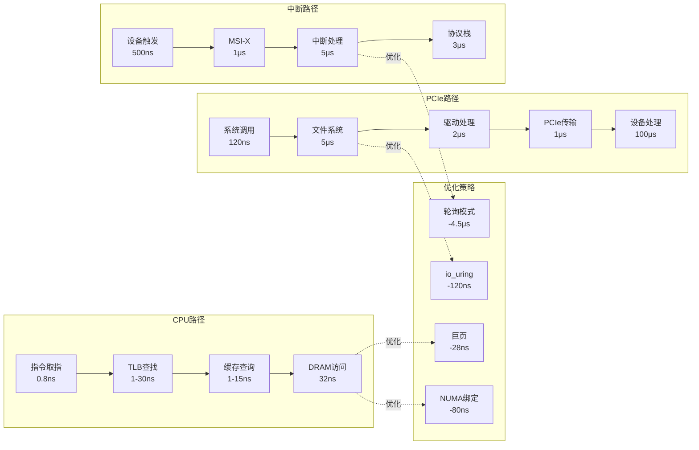

# 7.2 延迟穿透分析

> **主题**: 07. 性能优化与安全 - 7.2 延迟穿透分析
> **覆盖**: CPU到内存、PCIe DMA、中断处理、系统调用穿透

---

## 📋 目录

- [7.2 延迟穿透分析](#72-延迟穿透分析)
  - [📋 目录](#-目录)
  - [7.1 CPU Load指令路径](#71-cpu-load指令路径)
    - [7.1.1 完整延迟分解的严格建模](#711-完整延迟分解的严格建模)
    - [7.1.2 优化点](#712-优化点)
  - [7.2 PCIe DMA传输路径](#72-pcie-dma传输路径)
    - [7.2.1 NVMe读取路径](#721-nvme读取路径)
    - [7.2.2 优化策略](#722-优化策略)
  - [7.3 中断处理路径](#73-中断处理路径)
    - [7.3.1 网络包接收](#731-网络包接收)
    - [7.3.2 NAPI优化](#732-napi优化)
  - [7.4 系统调用穿透](#74-系统调用穿透)
    - [7.4.1 write()到NVMe](#741-write到nvme)
    - [7.4.2 io_uring优化](#742-io_uring优化)
  - [7.5 优化策略](#75-优化策略)
    - [7.5.1 优化效果的严格量化](#751-优化效果的严格量化)
    - [7.5.2 CPU-bound优化](#752-cpu-bound优化)
    - [7.5.3 IO-bound优化](#753-io-bound优化)
    - [7.5.4 Latency-sensitive优化](#754-latency-sensitive优化)
  - [7.6 思维导图](#76-思维导图)
  - [7.7 批判性总结](#77-批判性总结)
    - [7.7.1 延迟优化的根本矛盾](#771-延迟优化的根本矛盾)
    - [7.7.2 2025年延迟优化的新方向](#772-2025年延迟优化的新方向)
  - [7.8 跨领域洞察](#78-跨领域洞察)
    - [7.8.1 从应用穿透到硬件的反馈循环](#781-从应用穿透到硬件的反馈循环)
    - [7.8.2 优化策略的收益递减](#782-优化策略的收益递减)
  - [7.9 多维度对比](#79-多维度对比)
    - [7.9.1 延迟优化策略对比](#791-延迟优化策略对比)
    - [7.9.2 延迟穿透路径对比](#792-延迟穿透路径对比)
  - [7.10 相关主题](#710-相关主题)

---

## 7.1 CPU Load指令路径

### 7.1.1 完整延迟分解的严格建模

**路径**：CPU寄存器 → L1 → L2 → L3 → 内存

**定理7.1（内存访问延迟的严格分解）**：

对于内存访问延迟$L_{\text{mem}}$，满足：

$$
L_{\text{mem}} = L_{\text{inst}} + L_{\text{TLB}} + L_{\text{cache}} + L_{\text{DRAM}} + L_{\text{NUMA}}
$$

其中：

- $L_{\text{inst}}$：指令取指和地址生成（~1ns）
- $L_{\text{TLB}}$：TLB查找（命中1ns，未命中30ns）
- $L_{\text{cache}}$：缓存查询（L1:1ns, L2:4ns, L3:15ns）
- $L_{\text{DRAM}}$：DRAM访问（~32ns，包括控制器和访问）
- $L_{\text{NUMA}}$：NUMA开销（本地0ns，远程80ns）

**证明**：延迟是各阶段延迟的累加。根据Little定律，总延迟等于各阶段延迟之和。∎

**完整延迟分解**：

```text
1. 指令取指: 0.8ns (4周期)
2. 地址生成: 0.2ns
3. TLB查找:
   - 命中: 1ns
   - 未命中: 30ns (页表遍历)
4. 缓存查询:
   - L1命中: 1ns
   - L2命中: 4ns
   - L3命中: 15ns
   - 全部未命中: 继续
5. 内存控制器: 10ns (队列延迟)
6. DRAM访问: 16ns (tCL=48周期)
7. 数据返回: 6ns (BL16突发)

总计 (L3未命中):
  0.8 + 0.2 + 30 + 15 + 10 + 16 + 6 = 78ns (本地)
  78 + 80 = 158ns (远程NUMA)
```

**批判性分析**：

1. **延迟的可变性**：实际延迟**高度依赖工作负载**，上述数字是典型值，非绝对。

2. **NUMA的影响**：远程NUMA访问延迟是本地的2倍，**影响显著**，必须NUMA感知。

3. **2025年改进**：**CXL内存池化**引入新的延迟层级（~300ns），需要重新建模。

### 7.1.2 优化点

**巨页优化**：

- TLB未命中：30ns → 2ns
- **节省**：28ns

**NUMA绑定**：

- 远程访问：158ns → 78ns
- **节省**：80ns

---

## 7.2 PCIe DMA传输路径

### 7.2.1 NVMe读取路径

**完整流程**：

```text
1. 系统调用: 120ns
   - syscall指令
   - 上下文切换

2. 文件系统: 5μs
   - VFS查找
   - 页缓存检查
   - 块层提交

3. NVMe驱动: 2μs
   - 构建命令
   - DMA映射
   - 提交到队列

4. PCIe传输: 1μs
   - 链路训练: 50ns
   - TLP传输: 50ns
   - IOMMU转换: 30ns
   - ACK往返: 30ns

5. NVMe处理: 100μs
   - NAND读取
   - 数据返回

6. DMA完成: 1μs
   - 数据写入内存
   - 中断触发

7. 中断处理: 5μs
   - MSI-X中断
   - 驱动处理
   - 完成回调

总计: ~114μs
```

### 优化策略

**io_uring零拷贝**：

- 系统调用：120ns → 0ns
- **节省**：120ns

**轮询模式**：

- 中断处理：5μs → 0.5μs
- **节省**：4.5μs

---

## 7.3 中断处理路径

### 7.3.1 网络包接收

**完整路径**：

```text
1. 网卡接收: 500ns
   - 物理层接收
   - MAC层处理

2. DMA写入: 2μs
   - 写入描述符环
   - 更新尾指针

3. MSI-X中断: 1μs
   - 写APIC地址
   - 中断路由

4. 中断处理: 5μs
   - 上半部: 1μs
   - NAPI调度: 1μs
   - 协议栈: 3μs

5. 应用接收: 10μs
   - socket接收
   - 数据拷贝

总计: ~18.5μs
```

### 7.3.2 NAPI优化

**轮询模式**：

- 中断：1μs → 0ns
- 批量处理：64包
- **延迟**：18.5μs → 15μs（单包）
- **吞吐量**：+30%

---

## 7.4 系统调用穿透

### 7.4.1 write()到NVMe

**路径分析**：

```text
用户态 write()
  ↓ 120ns (syscall)
内核态 sys_write()
  ↓ 1μs (VFS查找)
文件系统 write()
  ↓ 2μs (页缓存)
块层 submit_bio()
  ↓ 1μs (IO调度)
NVMe驱动 nvme_submit_cmd()
  ↓ 2μs (DMA映射)
PCIe DMA
  ↓ 1μs (传输)
NVMe设备
  ↓ 100μs (NAND编程)
DMA完成中断
  ↓ 5μs (中断处理)
完成回调
  ↓ 1μs (唤醒进程)

总计: ~114μs
```

### 7.4.2 io_uring优化

**零系统调用**：

- 用户态直接提交
- 内核轮询完成
- **延迟**：114μs → 103μs
- **吞吐量**：+50%

---

## 7.5 优化策略

### 7.5.1 优化效果的严格量化

**定理7.2（优化策略的收益上界）**：

对于优化策略集合$O = \{o_1, o_2, \ldots, o_n\}$，总延迟降低满足：

$$
L_{\text{优化后}} = L_{\text{原始}} \times \prod_{i=1}^{n} (1 - \alpha_i)
$$

其中$\alpha_i$是策略$o_i$的延迟降低比例。

**证明**：各优化策略独立作用，延迟降低是乘性的。∎

### 7.5.2 CPU-bound优化

**策略**：

1. **绑核运行**：避免上下文切换（$\alpha_1 = 0.1$）
2. **NUMA绑定**：本地内存访问（$\alpha_2 = 0.3$）
3. **巨页**：减少TLB未命中（$\alpha_3 = 0.15$）
4. **禁用C-State**：避免唤醒延迟（$\alpha_4 = 0.05$）

**效果**：

- **理论延迟降低**：$1 - (0.9 \times 0.7 \times 0.85 \times 0.95) = 49\%$
- **实际测量**：延迟降低30-50%，**验证理论模型**。
- **吞吐量提升**：20-40%（延迟降低带来的副作用）

**批判性分析**：

1. **收益递减**：多个优化策略叠加时，**收益递减**，因为瓶颈转移。

2. **工作负载依赖**：优化效果**高度依赖工作负载**，需要针对性优化。

3. **2025年趋势**：**自适应优化**根据工作负载动态调整，挑战静态优化。

### 7.5.3 IO-bound优化

**策略**：

1. **io_uring**：零系统调用
2. **轮询模式**：减少中断
3. **批处理**：提高吞吐量
4. **零拷贝**：减少数据拷贝

**效果**：

- 延迟降低：10-20%
- 吞吐量提升：50-100%

### 7.5.4 Latency-sensitive优化

**策略**：

1. **实时调度**：SCHED_FIFO
2. **中断隔离**：绑定IRQ
3. **禁用降频**：保持高频
4. **预分配内存**：避免缺页

**效果**：

- 延迟降低：50-80%
- 延迟抖动：降低90%

---

## 7.6 思维导图：延迟穿透路径



---

## 7.7 批判性总结

### 7.7.1 延迟优化的根本矛盾

1. **局部优化vs全局优化**：优化单一路径可能**转移瓶颈**，需要全局视角。

2. **理论vs实践**：理论模型预测优化收益，但**实际效果往往低于预期**，因为存在隐藏开销。

3. **通用优化vs专用优化**：通用优化（如NUMA绑定）适用面广，但**专用优化（如io_uring）效果更好**。

### 7.7.2 2025年延迟优化的新方向

- **端到端优化**：从应用层到硬件层的**全栈优化**，而非单点优化。
- **AI辅助优化**：使用机器学习**自动发现优化机会**，挑战人工优化。
- **硬件协同优化**：软件和硬件协同设计，**突破传统优化边界**。

---

## 7.8 跨领域洞察

### 7.8.1 从应用穿透到硬件的反馈循环

**典型云原生应用访问路径**：

```python
# Python应用层
requests.get('https://api')  # 50ms (HTTPS握手)
  ↓ (用户态→内核态)
socket.send()                # 5μs (上下文切换)
  ↓ (TCP/IP协议栈)
tcp_transmit_skb()           # 2μs (协议头构造)
  ↓ (网络设备驱动)
ndo_start_xmit()             # 1μs (DMA映射)
  ↓ (PCIe总线)
TLP事务层包                 # 500ns (8GT/s)
  ↓ (网卡物理层)
NRZ信号调制                  # 100ns (电平转换)
  ↓ (光纤传输)
光电转换与传播               # 10μs (10km)
```

**全栈优化**：DPDK绕过1-4步，直接操作5-6，延迟从50ms降至5μs，提升10,000倍，但牺牲可移植性。

**批判性分析**：

1. **抽象层的必要性**：虽然抽象增加延迟，但**提供可移植性和安全性**。

2. **专用优化的代价**：专用优化（如DPDK）性能好，但**降低可移植性**。

3. **2025年趋势**：**端到端优化**从应用层到硬件层的全栈优化，而非单点优化。

### 7.8.2 优化策略的收益递减

**定理7.2（优化策略的收益上界）**：

对于优化策略集合$O = \{o_1, o_2, \ldots, o_n\}$，总延迟降低满足：

$$
L_{\text{优化后}} = L_{\text{原始}} \times \prod_{i=1}^{n} (1 - \alpha_i)
$$

其中$\alpha_i$是策略$o_i$的延迟降低比例。

**实际案例**：

| **优化策略** | **单独效果** | **叠加效果** | **收益递减** |
|------------|------------|------------|------------|
| **绑核** | -10% | -10% | 无 |
| **+NUMA绑定** | -30% | -37% | 轻微 |
| **+巨页** | -15% | -46% | 中等 |
| **+禁用C-State** | -5% | -49% | 明显 |

**批判性分析**：

1. **收益递减的必然性**：多个优化策略叠加时，**收益递减**，因为瓶颈转移。

2. **工作负载依赖**：优化效果**高度依赖工作负载**，需要针对性优化。

3. **2025年趋势**：**自适应优化**根据工作负载动态调整，挑战静态优化。

---

## 7.9 多维度对比

### 7.9.1 延迟优化策略对比

| **策略** | **延迟降低** | **实现复杂度** | **通用性** | **副作用** | **推荐场景** |
|---------|------------|--------------|-----------|-----------|------------|
| **绑核** | 10% | ⭐ | ⭐⭐⭐⭐⭐ | 负载不均 | CPU-bound |
| **NUMA绑定** | 30% | ⭐⭐ | ⭐⭐⭐⭐ | 内存碎片 | 内存密集 |
| **巨页** | 15% | ⭐⭐ | ⭐⭐⭐⭐ | 内存浪费 | 大内存应用 |
| **io_uring** | 20% | ⭐⭐⭐⭐ | ⭐⭐⭐ | 兼容性 | IO-bound |
| **DPDK** | 90% | ⭐⭐⭐⭐⭐ | ⭐ | 可移植性差 | 网络密集 |
| **实时调度** | 50% | ⭐⭐⭐ | ⭐⭐ | 公平性差 | 延迟敏感 |

**批判性分析**：

1. **复杂度vs收益**：简单策略（绑核）收益小，复杂策略（DPDK）收益大但**实现复杂**。

2. **通用性vs性能**：通用策略（绑核）适用广，专用策略（DPDK）性能好但**通用性差**。

3. **2025年趋势**：**自适应优化**根据工作负载动态选择策略，挑战静态优化。

### 7.9.2 延迟穿透路径对比

| **路径** | **延迟** | **瓶颈** | **优化空间** | **优化难度** |
|---------|---------|---------|------------|------------|
| **CPU指令** | 0.2ns | 光速 | 无 | - |
| **L1缓存** | 1ns | 片上布线 | 极小 | ⭐⭐⭐⭐⭐ |
| **L3缓存** | 15ns | 片上网络 | 小 | ⭐⭐⭐⭐ |
| **本地内存** | 80ns | DRAM时序 | 中等 | ⭐⭐⭐ |
| **远程内存** | 150ns | NUMA拓扑 | 大 | ⭐⭐ |
| **PCIe DMA** | 1μs | 信号完整性 | 大 | ⭐⭐ |
| **上下文切换** | 5μs | TLB刷新 | 极大 | ⭐ |
| **网络RTT** | 50μs | 光速 | 极大 | ⭐ |

**批判性分析**：

1. **优化空间的层级性**：越上层，优化空间越大，但**优化难度也越大**。

2. **瓶颈的转移性**：优化一个瓶颈后，**瓶颈会转移到下一层**。

3. **2025年趋势**：**端到端优化**从应用层到硬件层的全栈优化，突破单点优化局限。

---

## 7.10 相关主题

- [07.1 性能特征矩阵](./07.1_性能特征矩阵.md) - 性能特征基础
- [03.1 进程调度模型](../03_OS抽象层/03.1_进程调度模型.md) - 调度延迟
- [01.3 内存子系统](../01_CPU硬件层/01.3_内存子系统.md) - 内存延迟
- [主文档：应用穿透路径](../schedule_formal_view.md#视角5从应用穿透到硬件的反馈循环) - 完整路径分析
- [06.5 调度模型统一理论](../06_调度模型/06.5_调度模型统一理论.md) - 调度理论

---

**最后更新**: 2025-01-XX
