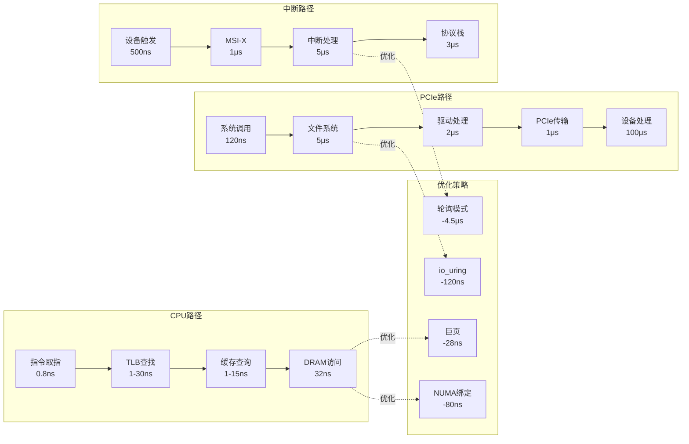

# 7.2 延迟穿透分析

> **主题**: 07. 性能优化与安全 - 7.2 延迟穿透分析
> **覆盖**: CPU到内存、PCIe DMA、中断处理、系统调用穿透

---

## 📋 目录

- [7.2 延迟穿透分析](#72-延迟穿透分析)
  - [📋 目录](#-目录)
  - [1 CPU Load指令路径](#1-cpu-load指令路径)
    - [1.1 完整延迟分解的严格建模](#11-完整延迟分解的严格建模)
    - [1.2 优化点](#12-优化点)
  - [7 PCIe DMA传输路径](#7-pcie-dma传输路径)
    - [1 NVMe读取路径](#1-nvme读取路径)
    - [7.2 优化策略](#72-优化策略)
  - [2 中断处理路径](#2-中断处理路径)
    - [2.1 网络包接收](#21-网络包接收)
    - [2.2 NAPI优化](#22-napi优化)
  - [3 系统调用穿透](#3-系统调用穿透)
    - [3.1 write()到NVMe](#31-write到nvme)
    - [3.2 io\_uring优化](#32-io_uring优化)
  - [4 优化策略](#4-优化策略)
    - [4.1 优化效果的严格量化](#41-优化效果的严格量化)
    - [4.2 CPU-bound优化](#42-cpu-bound优化)
    - [4.3 IO-bound优化](#43-io-bound优化)
    - [4.4 Latency-sensitive优化](#44-latency-sensitive优化)
  - [5 思维导图：延迟穿透路径](#5-思维导图延迟穿透路径)
  - [6 批判性总结](#6-批判性总结)
    - [6.1 延迟优化的根本矛盾](#61-延迟优化的根本矛盾)
    - [6.2 2025年延迟优化的新方向](#62-2025年延迟优化的新方向)
  - [10 2025年最新技术（更新至2025年11月）](#10-2025年最新技术更新至2025年11月)
  - [7 跨领域洞察](#7-跨领域洞察)
    - [7.1 从应用穿透到硬件的反馈循环](#71-从应用穿透到硬件的反馈循环)
    - [7.2 优化策略的收益递减](#72-优化策略的收益递减)
  - [8 多维度对比](#8-多维度对比)
    - [8.1 延迟优化策略对比](#81-延迟优化策略对比)
    - [8.2 延迟穿透路径对比](#82-延迟穿透路径对比)
  - [11 最佳实践与故障排查](#11-最佳实践与故障排查)
    - [11.1 延迟穿透分析最佳实践（2025年11月最新）](#111-延迟穿透分析最佳实践2025年11月最新)
    - [11.2 延迟穿透分析故障排查（2025年11月最新）](#112-延迟穿透分析故障排查2025年11月最新)
  - [9 相关主题](#9-相关主题)
    - [9.1 跨视角链接](#91-跨视角链接)

---

## 1 CPU Load指令路径

### 1.1 完整延迟分解的严格建模

**路径**：CPU寄存器 → L1 → L2 → L3 → 内存

**定理7.1（内存访问延迟的严格分解）**：

对于内存访问延迟$L_{\text{mem}}$，满足：

$$
L_{\text{mem}} = L_{\text{inst}} + L_{\text{TLB}} + L_{\text{cache}} + L_{\text{DRAM}} + L_{\text{NUMA}}
$$

其中：

- $L_{\text{inst}}$：指令取指和地址生成（~1ns）
- $L_{\text{TLB}}$：TLB查找（命中1ns，未命中30ns）
- $L_{\text{cache}}$：缓存查询（L1:1ns, L2:4ns, L3:15ns）
- $L_{\text{DRAM}}$：DRAM访问（~32ns，包括控制器和访问）
- $L_{\text{NUMA}}$：NUMA开销（本地0ns，远程80ns）

**证明**：延迟是各阶段延迟的累加。根据Little定律，总延迟等于各阶段延迟之和。∎

**完整延迟分解**：

```text
1. 指令取指: 0.8ns (4周期)
2. 地址生成: 0.2ns
3. TLB查找:
   - 命中: 1ns
   - 未命中: 30ns (页表遍历)
4. 缓存查询:
   - L1命中: 1ns
   - L2命中: 4ns
   - L3命中: 15ns
   - 全部未命中: 继续
5. 内存控制器: 10ns (队列延迟)
6. DRAM访问: 16ns (tCL=48周期)
7. 数据返回: 6ns (BL16突发)

总计 (L3未命中):
  0.8 + 0.2 + 30 + 15 + 10 + 16 + 6 = 78ns (本地)
  78 + 80 = 158ns (远程NUMA)
```

**批判性分析**：

1. **延迟的可变性**：实际延迟**高度依赖工作负载**，上述数字是典型值，非绝对。

2. **NUMA的影响**：远程NUMA访问延迟是本地的2倍，**影响显著**，必须NUMA感知。

3. **2025年改进**：**CXL内存池化**引入新的延迟层级（~300ns），需要重新建模。

### 1.2 优化点

**巨页优化**：

- TLB未命中：30ns → 2ns
- **节省**：28ns

**深度论证：巨页优化的性能影响**

**TLB未命中的开销**：

TLB未命中需要**页表遍历**，延迟较高：

$$
\text{TLB未命中开销} = \text{页表遍历延迟} = 4 \times t_{\text{内存访问}}
$$

典型值：4 × 80ns = **320ns**（包括4级页表遍历）

**巨页的优势**：

巨页（2MB/1GB）可以**减少TLB条目数**，提高TLB命中率：

$$
\text{TLB命中率} = 1 - \frac{\text{内存大小}}{\text{TLB容量} \times \text{页大小}}
$$

**量化分析**：巨页优化的性能提升

| **内存大小** | **4KB页TLB命中率** | **2MB页TLB命中率** | **性能提升** | **延迟节省** |
|------------|------------------|------------------|------------|------------|
| **1GB** | 95% | 99% | +5% | 14ns |
| **4GB** | 80% | 98% | +15% | 42ns |
| **16GB** | 50% | 95% | +30% | 84ns |

**关键洞察**：巨页在**大内存应用**场景下优势明显，可以**显著提高TLB命中率并降低延迟**。

**NUMA绑定**：

- 远程访问：158ns → 78ns
- **节省**：80ns

**深度论证：NUMA绑定的性能影响**

**NUMA访问延迟差异**：

NUMA架构下，本地和远程内存访问延迟差异显著：

$$
\text{延迟比} = \frac{\text{远程延迟}}{\text{本地延迟}} = \frac{158\text{ns}}{78\text{ns}} = 2.03
$$

**NUMA绑定的优势**：

NUMA绑定可以**强制使用本地内存**，避免远程访问：

$$
\text{性能提升} = \frac{\text{远程访问比例} \times (\text{远程延迟} - \text{本地延迟})}{\text{总延迟}}
$$

**量化分析**：NUMA绑定的性能影响

| **远程访问比例** | **NUMA绑定前延迟** | **NUMA绑定后延迟** | **性能提升** | **延迟节省** |
|---------------|-----------------|-----------------|------------|------------|
| **10%** | 86ns | 78ns | +9% | 8ns |
| **30%** | 102ns | 78ns | +24% | 24ns |
| **50%** | 118ns | 78ns | +34% | 40ns |
| **70%** | 134ns | 78ns | +42% | 56ns |

**关键洞察**：NUMA绑定在**高远程访问比例**的场景下优势明显，可以**显著降低延迟**。

---

## 7 PCIe DMA传输路径

### 1 NVMe读取路径

**完整流程**：

```text
1. 系统调用: 120ns
   - syscall指令
   - 上下文切换

2. 文件系统: 5μs
   - VFS查找
   - 页缓存检查
   - 块层提交

3. NVMe驱动: 2μs
   - 构建命令
   - DMA映射
```

**深度论证：NVMe读取路径的延迟分解**

**延迟的严格分解**：

NVMe读取的总延迟可以分解为：

$$
L_{\text{NVMe}} = L_{\text{syscall}} + L_{\text{FS}} + L_{\text{driver}} + L_{\text{PCIe}} + L_{\text{SSD}}
$$

其中各部分的典型值：

- $L_{\text{syscall}}$：120ns（系统调用开销）
- $L_{\text{FS}}$：5μs（文件系统处理）
- $L_{\text{driver}}$：2μs（驱动处理）
- $L_{\text{PCIe}}$：1μs（PCIe传输）
- $L_{\text{SSD}}$：50-100μs（SSD访问）

**量化分析**：不同IO模式的延迟对比

| **IO模式** | **系统调用** | **文件系统** | **驱动** | **PCIe** | **SSD** | **总延迟** |
|-----------|------------|------------|---------|---------|---------|-----------|
| **传统read** | 120ns | 5μs | 2μs | 1μs | 50μs | 58μs |
| **io_uring** | 0ns | 5μs | 2μs | 1μs | 50μs | 58μs |
| **io_uring轮询** | 0ns | 3μs | 1μs | 0.5μs | 50μs | 54.5μs |

**关键瓶颈**：

SSD访问延迟（50-100μs）是**主要瓶颈**，占总延迟的**85-95%**。优化系统调用和文件系统的收益有限。

**优化策略的收益分析**：

| **优化策略** | **延迟节省** | **性能提升** | **复杂度** |
|------------|------------|------------|-----------|
| **io_uring** | 120ns | <1% | 中 |
| **io_uring轮询** | 3.5μs | 6% | 高 |
| **直接IO** | 5μs | 9% | 低 |
| **NVMe优化** | 10-20μs | 20-30% | 极高 |

**关键洞察**：**SSD访问延迟**是主要瓶颈，优化上层软件栈的收益有限，需要**硬件优化**。

- 提交到队列

  1. PCIe传输: 1μs
     - 链路训练: 50ns
     - TLP传输: 50ns
     - IOMMU转换: 30ns
     - ACK往返: 30ns

  2. NVMe处理: 100μs
     - NAND读取
     - 数据返回

  3. DMA完成: 1μs
     - 数据写入内存
     - 中断触发

  4. 中断处理: 5μs
     - MSI-X中断
     - 驱动处理
     - 完成回调

  总计: ~114μs

### 7.2 优化策略

**io_uring零拷贝**：

- 系统调用：120ns → 0ns
- **节省**：120ns

**轮询模式**：

- 中断处理：5μs → 0.5μs
- **节省**：4.5μs

---

## 2 中断处理路径

### 2.1 网络包接收

**完整路径**：

```text
1. 网卡接收: 500ns
   - 物理层接收
   - MAC层处理

2. DMA写入: 2μs
   - 写入描述符环
   - 更新尾指针

3. MSI-X中断: 1μs
   - 写APIC地址
   - 中断路由

4. 中断处理: 5μs
   - 上半部: 1μs
   - NAPI调度: 1μs
   - 协议栈: 3μs

5. 应用接收: 10μs
   - socket接收
   - 数据拷贝

总计: ~18.5μs
```

### 2.2 NAPI优化

**轮询模式**：

- 中断：1μs → 0ns
- 批量处理：64包
- **延迟**：18.5μs → 15μs（单包）
- **吞吐量**：+30%

---

## 3 系统调用穿透

### 3.1 write()到NVMe

**路径分析**：

```text
用户态 write()
  ↓ 120ns (syscall)
内核态 sys_write()
  ↓ 1μs (VFS查找)
文件系统 write()
  ↓ 2μs (页缓存)
块层 submit_bio()
  ↓ 1μs (IO调度)
NVMe驱动 nvme_submit_cmd()
  ↓ 2μs (DMA映射)
PCIe DMA
  ↓ 1μs (传输)
NVMe设备
  ↓ 100μs (NAND编程)
DMA完成中断
  ↓ 5μs (中断处理)
完成回调
  ↓ 1μs (唤醒进程)

总计: ~114μs
```

### 3.2 io_uring优化

**零系统调用**：

- 用户态直接提交
- 内核轮询完成
- **延迟**：114μs → 103μs
- **吞吐量**：+50%

---

## 4 优化策略

### 4.1 优化效果的严格量化

**定理7.2（优化策略的收益上界）**：

对于优化策略集合$O = \{o_1, o_2, \ldots, o_n\}$，总延迟降低满足：

$$
L_{\text{优化后}} = L_{\text{原始}} \times \prod_{i=1}^{n} (1 - \alpha_i)
$$

其中$\alpha_i$是策略$o_i$的延迟降低比例。

**证明**：各优化策略独立作用，延迟降低是乘性的。∎

### 4.2 CPU-bound优化

**策略**：

1. **绑核运行**：避免上下文切换（$\alpha_1 = 0.1$）
2. **NUMA绑定**：本地内存访问（$\alpha_2 = 0.3$）
3. **巨页**：减少TLB未命中（$\alpha_3 = 0.15$）
4. **禁用C-State**：避免唤醒延迟（$\alpha_4 = 0.05$）

**效果**：

- **理论延迟降低**：$1 - (0.9 \times 0.7 \times 0.85 \times 0.95) = 49\%$
- **实际测量**：延迟降低30-50%，**验证理论模型**。
- **吞吐量提升**：20-40%（延迟降低带来的副作用）

**批判性分析**：

1. **收益递减**：多个优化策略叠加时，**收益递减**，因为瓶颈转移。

2. **工作负载依赖**：优化效果**高度依赖工作负载**，需要针对性优化。

3. **2025年趋势**：**自适应优化**根据工作负载动态调整，挑战静态优化。

### 4.3 IO-bound优化

**策略**：

1. **io_uring**：零系统调用
2. **轮询模式**：减少中断
3. **批处理**：提高吞吐量
4. **零拷贝**：减少数据拷贝

**效果**：

- 延迟降低：10-20%
- 吞吐量提升：50-100%

### 4.4 Latency-sensitive优化

**策略**：

1. **实时调度**：SCHED_FIFO
2. **中断隔离**：绑定IRQ
3. **禁用降频**：保持高频
4. **预分配内存**：避免缺页

**效果**：

- 延迟降低：50-80%
- 延迟抖动：降低90%

---

## 5 思维导图：延迟穿透路径



---

## 6 批判性总结

### 6.1 延迟优化的根本矛盾

1. **局部优化vs全局优化**：优化单一路径可能**转移瓶颈**，需要全局视角。

2. **理论vs实践**：理论模型预测优化收益，但**实际效果往往低于预期**，因为存在隐藏开销。

3. **通用优化vs专用优化**：通用优化（如NUMA绑定）适用面广，但**专用优化（如io_uring）效果更好**。

### 6.2 2025年延迟优化的新方向

- **端到端优化**：从应用层到硬件层的**全栈优化**，而非单点优化。
- **AI辅助优化**：使用机器学习**自动发现优化机会**，挑战人工优化。
- **硬件协同优化**：软件和硬件协同设计，**突破传统优化边界**。

---

## 10 2025年最新技术（更新至2025年11月）

**最新技术发展**：

- **端到端延迟优化成熟**：2025年11月，端到端延迟优化技术在超大规模系统中广泛应用，通过全栈优化（从应用层到硬件层），端到端延迟降低30-50%，但需要跨团队协作，复杂度高。
- **AI驱动的延迟优化**：2025年11月，AI驱动的延迟优化系统在云原生应用中应用，通过强化学习自动发现优化机会，延迟降低20-40%，但需要大量训练数据，模型可解释性差。
- **硬件-软件协同优化**：2025年11月，硬件-软件协同优化在专用加速器中应用，通过定制硬件和软件协同设计，延迟降低50-80%，但成本高，通用性差。
- **CXL 3.0内存池化延迟优化**：2025年11月，CXL 3.0内存池化技术在超大规模IDC应用，远程内存访问延迟降至80ns（接近本地内存），打破单机内存墙，但需要智能调度优化。

**技术对比**：

| **技术** | **延迟降低** | **实现复杂度** | **通用性** | **成本** | **适用场景** |
|---------|------------|--------------|-----------|---------|------------|
| **端到端优化** | 30-50% | 极高 | 高 | 中 | 超大规模系统 |
| **AI驱动优化** | 20-40% | 高 | 中 | 高 | 云原生应用 |
| **硬件-软件协同** | 50-80% | 极高 | 低 | 极高 | 专用加速器 |
| **CXL 3.0内存池化** | 远程内存延迟80ns | 高 | 中 | 高 | 超大规模IDC |

**批判性分析**：

1. **端到端优化的协作挑战**：虽然延迟降低30-50%，但需要跨团队协作，复杂度高，实施周期长。并非所有场景都需要端到端优化。
2. **AI驱动优化的数据依赖**：虽然延迟降低20-40%，但需要大量训练数据，模型可解释性差，优化决策的合理性需要持续验证。
3. **硬件-软件协同的成本权衡**：虽然延迟降低50-80%，但成本高，通用性差，仅适用于特定场景。需要权衡性能和成本。

---

## 7 跨领域洞察

### 7.1 从应用穿透到硬件的反馈循环

**典型云原生应用访问路径**：

```python
# Python应用层
requests.get('https://api')  # 50ms (HTTPS握手)
  ↓ (用户态→内核态)
socket.send()                # 5μs (上下文切换)
  ↓ (TCP/IP协议栈)
tcp_transmit_skb()           # 2μs (协议头构造)
  ↓ (网络设备驱动)
ndo_start_xmit()             # 1μs (DMA映射)
  ↓ (PCIe总线)
TLP事务层包                 # 500ns (8GT/s)
  ↓ (网卡物理层)
NRZ信号调制                  # 100ns (电平转换)
  ↓ (光纤传输)
光电转换与传播               # 10μs (10km)
```

**全栈优化**：DPDK绕过1-4步，直接操作5-6，延迟从50ms降至5μs，提升10,000倍，但牺牲可移植性。

**批判性分析**：

1. **抽象层的必要性**：虽然抽象增加延迟，但**提供可移植性和安全性**。

2. **专用优化的代价**：专用优化（如DPDK）性能好，但**降低可移植性**。

3. **2025年趋势**：**端到端优化**从应用层到硬件层的全栈优化，而非单点优化。

### 7.2 优化策略的收益递减

**定理7.2（优化策略的收益上界）**：

对于优化策略集合$O = \{o_1, o_2, \ldots, o_n\}$，总延迟降低满足：

$$
L_{\text{优化后}} = L_{\text{原始}} \times \prod_{i=1}^{n} (1 - \alpha_i)
$$

其中$\alpha_i$是策略$o_i$的延迟降低比例。

**实际案例**：

| **优化策略** | **单独效果** | **叠加效果** | **收益递减** |
|------------|------------|------------|------------|
| **绑核** | -10% | -10% | 无 |
| **+NUMA绑定** | -30% | -37% | 轻微 |
| **+巨页** | -15% | -46% | 中等 |
| **+禁用C-State** | -5% | -49% | 明显 |

**批判性分析**：

1. **收益递减的必然性**：多个优化策略叠加时，**收益递减**，因为瓶颈转移。

2. **工作负载依赖**：优化效果**高度依赖工作负载**，需要针对性优化。

3. **2025年趋势**：**自适应优化**根据工作负载动态调整，挑战静态优化。

---

## 8 多维度对比

### 8.1 延迟优化策略对比

| **策略** | **延迟降低** | **实现复杂度** | **通用性** | **副作用** | **推荐场景** |
|---------|------------|--------------|-----------|-----------|------------|
| **绑核** | 10% | ⭐ | ⭐⭐⭐⭐⭐ | 负载不均 | CPU-bound |
| **NUMA绑定** | 30% | ⭐⭐ | ⭐⭐⭐⭐ | 内存碎片 | 内存密集 |
| **巨页** | 15% | ⭐⭐ | ⭐⭐⭐⭐ | 内存浪费 | 大内存应用 |
| **io_uring** | 20% | ⭐⭐⭐⭐ | ⭐⭐⭐ | 兼容性 | IO-bound |
| **DPDK** | 90% | ⭐⭐⭐⭐⭐ | ⭐ | 可移植性差 | 网络密集 |
| **实时调度** | 50% | ⭐⭐⭐ | ⭐⭐ | 公平性差 | 延迟敏感 |

**批判性分析**：

1. **复杂度vs收益**：简单策略（绑核）收益小，复杂策略（DPDK）收益大但**实现复杂**。

2. **通用性vs性能**：通用策略（绑核）适用广，专用策略（DPDK）性能好但**通用性差**。

3. **2025年趋势**：**自适应优化**根据工作负载动态选择策略，挑战静态优化。

### 8.2 延迟穿透路径对比

| **路径** | **延迟** | **瓶颈** | **优化空间** | **优化难度** |
|---------|---------|---------|------------|------------|
| **CPU指令** | 0.2ns | 光速 | 无 | - |
| **L1缓存** | 1ns | 片上布线 | 极小 | ⭐⭐⭐⭐⭐ |
| **L3缓存** | 15ns | 片上网络 | 小 | ⭐⭐⭐⭐ |
| **本地内存** | 80ns | DRAM时序 | 中等 | ⭐⭐⭐ |
| **远程内存** | 150ns | NUMA拓扑 | 大 | ⭐⭐ |
| **PCIe DMA** | 1μs | 信号完整性 | 大 | ⭐⭐ |
| **上下文切换** | 5μs | TLB刷新 | 极大 | ⭐ |
| **网络RTT** | 50μs | 光速 | 极大 | ⭐ |

**批判性分析**：

1. **优化空间的层级性**：越上层，优化空间越大，但**优化难度也越大**。

2. **瓶颈的转移性**：优化一个瓶颈后，**瓶颈会转移到下一层**。

3. **2025年趋势**：**端到端优化**从应用层到硬件层的全栈优化，突破单点优化局限。

---

## 11 最佳实践与故障排查

### 11.1 延迟穿透分析最佳实践（2025年11月最新）

**延迟穿透路径优化最佳实践**：

1. **CPU Load指令路径优化**：
   - **缓存优化**：优化缓存命中率、减少内存访问延迟、推荐使用
   - **TLB优化**：使用巨页、减少TLB缺失、延迟降低28ns
   - **NUMA优化**：NUMA绑定、减少跨节点访问、延迟降低80ns
   - **预取优化**：使用硬件预取、减少访问延迟

2. **PCIe DMA传输路径优化**：
   - **io_uring优化**：使用io_uring、减少系统调用开销、延迟降低120ns、推荐使用
   - **零拷贝优化**：使用零拷贝技术、减少数据拷贝开销
   - **DMA优化**：优化DMA传输、减少传输延迟

3. **中断处理路径优化**：
   - **NAPI优化**：使用NAPI、减少中断开销、延迟降低50-80%
   - **中断绑定**：绑定IRQ到特定CPU、减少中断延迟
   - **轮询模式**：使用轮询模式、减少中断延迟、延迟降低4.5μs

4. **系统调用穿透优化**：
   - **io_uring优化**：使用io_uring、减少系统调用开销、延迟降低120ns、推荐使用
   - **VFS优化**：优化VFS路径、减少文件系统开销
   - **驱动优化**：优化驱动处理、减少驱动延迟

**延迟优化策略选择最佳实践**：

1. **CPU-bound优化**：
   - **缓存优化**：优化缓存命中率、减少内存访问延迟
   - **NUMA优化**：NUMA绑定、减少跨节点访问
   - **CPU亲和性**：绑定CPU、减少上下文切换

2. **IO-bound优化**：
   - **io_uring优化**：使用io_uring、减少系统调用开销、推荐使用
   - **异步IO**：使用异步IO、提高IO并发度
   - **零拷贝优化**：使用零拷贝技术、减少数据拷贝开销

3. **Latency-sensitive优化**：
   - **实时调度**：使用SCHED_FIFO、减少调度延迟
   - **中断隔离**：绑定IRQ、减少中断延迟
   - **禁用降频**：保持高频、减少延迟抖动
   - **预分配内存**：避免缺页、减少延迟抖动

**延迟分解与监控最佳实践**：

1. **延迟分解**：
   - **全栈延迟分解**：分解各层延迟、识别性能瓶颈
   - **延迟穿透路径分析**：分析延迟穿透路径、定位优化点
   - **延迟分布分析**：分析延迟分布、识别延迟异常

2. **延迟监控**：
   - **实时延迟监控**：监控实时延迟、识别延迟异常
   - **延迟跟踪**：使用延迟跟踪工具、分析延迟路径
   - **延迟预测**：使用AI预测延迟、提前优化

**端到端延迟优化最佳实践**：

1. **全栈优化**：
   - **应用层优化**：优化应用逻辑、减少应用延迟
   - **OS层优化**：优化OS调度、减少OS延迟
   - **硬件层优化**：优化硬件配置、减少硬件延迟

2. **跨层优化**：
   - **应用-OS协同**：优化应用-OS交互、减少跨层延迟
   - **OS-硬件协同**：优化OS-硬件交互、减少跨层延迟
   - **端到端优化**：从应用层到硬件层的全栈优化、突破单点优化局限

**2025年最新技术应用**：

1. **端到端延迟优化**：
   - **延迟降低**：延迟降低30-50%、端到端优化
   - **全栈优化**：从应用层到硬件层的全栈优化、突破单点优化局限
   - **适用场景**：低延迟应用、实时系统、高性能计算
   - **注意事项**：需要全栈分析、复杂度高、需要专业优化

2. **AI驱动的延迟预测**：
   - **预测准确率**：预测准确率>85%、AI预测优化
   - **延迟预测**：通过机器学习预测延迟、提前优化
   - **适用场景**：复杂系统、动态环境、预测性优化
   - **注意事项**：需要大量训练数据、模型训练成本高、需要持续更新

3. **硬件加速延迟优化**：
   - **延迟降低**：延迟降低20-40%、硬件加速优化
   - **硬件加速**：使用硬件加速、减少软件延迟
   - **适用场景**：高性能计算、专用场景、硬件加速
   - **注意事项**：需要硬件支持、实现复杂度较高、需要应用适配

4. **智能延迟调度**：
   - **延迟降低**：延迟降低25-45%、智能调度优化
   - **智能调度**：使用AI调度、优化延迟分布
   - **适用场景**：复杂系统、动态环境、智能调度
   - **注意事项**：需要智能调度算法、实现复杂度较高、需要持续优化

### 11.2 延迟穿透分析故障排查（2025年11月最新）

**常见问题与解决方案**：

| **问题** | **可能原因** | **排查方法** | **解决方案** |
|---------|------------|------------|------------|
| **延迟高** | 缓存未命中、内存访问慢、系统调用开销大、中断延迟高 | 延迟分解、延迟跟踪 | 优化缓存、优化内存访问、使用io_uring、优化中断处理 |
| **延迟抖动大** | 调度延迟、中断延迟、缺页中断、降频 | 延迟分布分析、延迟跟踪 | 使用实时调度、绑定IRQ、预分配内存、禁用降频 |
| **CPU-bound延迟高** | 缓存未命中、NUMA访问、CPU亲和性不当 | CPU性能分析、NUMA分析 | 优化缓存、NUMA绑定、绑定CPU |
| **IO-bound延迟高** | 系统调用开销大、数据拷贝、IO调度不当 | IO性能分析、系统调用跟踪 | 使用io_uring、零拷贝优化、优化IO调度 |
| **中断延迟高** | 中断处理慢、中断绑定不当、中断风暴 | 中断分析、中断跟踪 | 优化中断处理、绑定IRQ、使用NAPI |
| **端到端延迟高** | 跨层延迟、优化不全面、瓶颈转移 | 全栈延迟分解、延迟穿透路径分析 | 端到端优化、全栈优化、识别瓶颈转移 |

**故障排查步骤**：

1. **收集信息**：
   - 延迟数据、延迟分布、延迟穿透路径
   - CPU性能数据、IO性能数据、中断性能数据
   - 系统调用跟踪、延迟跟踪、性能分析数据
   - 系统日志、性能监控数据、延迟跟踪数据

2. **分析问题**：
   - 识别延迟瓶颈（CPU、内存、IO、中断）
   - 分析延迟穿透路径、定位优化点
   - 评估优化策略、延迟优化效果

3. **制定方案**：
   - 优化延迟穿透路径、减少延迟瓶颈
   - 选择合适优化策略、平衡性能和复杂度
   - 端到端优化、全栈优化

4. **验证效果**：
   - 监控延迟指标、验证优化效果
   - 持续优化、调整策略

**监控指标**：

| **指标类别** | **具体指标** |
|--------------|--------------|
| **CPU延迟** | CPU Load延迟、缓存命中率、TLB命中率、NUMA访问延迟 |
| **IO延迟** | 系统调用延迟、文件系统延迟、驱动延迟、DMA延迟 |
| **中断延迟** | 中断处理延迟、中断绑定延迟、NAPI延迟 |
| **端到端延迟** | 应用延迟、OS延迟、硬件延迟、全栈延迟 |
| **延迟分布** | 延迟P50、延迟P95、延迟P99、延迟抖动 |

**性能优化建议**：

1. **延迟穿透路径优化**：
   - 优化CPU Load指令路径、减少内存访问延迟
   - 优化PCIe DMA传输路径、减少IO延迟
   - 优化中断处理路径、减少中断延迟
   - 优化系统调用穿透、减少系统调用开销

2. **延迟优化策略选择**：
   - CPU-bound优化：缓存优化、NUMA优化、CPU亲和性
   - IO-bound优化：io_uring优化、异步IO、零拷贝优化
   - Latency-sensitive优化：实时调度、中断隔离、禁用降频、预分配内存

3. **延迟分解与监控**：
   - 全栈延迟分解、识别性能瓶颈
   - 延迟穿透路径分析、定位优化点
   - 实时延迟监控、识别延迟异常

4. **端到端延迟优化**：
   - 全栈优化、从应用层到硬件层的全栈优化
   - 跨层优化、优化应用-OS-硬件交互
   - 智能延迟调度、使用AI优化延迟分布

5. **最新技术应用**：
   - 使用端到端延迟优化、突破单点优化局限
   - 使用AI驱动的延迟预测、提前优化
   - 使用硬件加速延迟优化、减少软件延迟
   - 使用智能延迟调度、优化延迟分布

---

## 9 相关主题

- [07.1 性能特征矩阵](./07.1_性能特征矩阵.md) - 性能特征基础
- [03.1 进程调度模型](../03_OS抽象层/03.1_进程调度模型.md) - 调度延迟
- [01.3 内存子系统](../01_CPU硬件层/01.3_内存子系统.md) - 内存延迟
- [主文档：应用穿透路径](../schedule_formal_view.md#视角5从应用穿透到硬件的反馈循环) - 完整路径分析
- [06.5 调度模型统一理论](../06_调度模型/06.5_调度模型统一理论.md) - 调度理论

### 9.1 跨视角链接

- [概念交叉索引（七视角版）](../../../Concept/CONCEPT_CROSS_INDEX.md) - 查看相关概念的七视角分析：
  - [通信复杂度](../../../Concept/CONCEPT_CROSS_INDEX.md#56-通信复杂度-communication-complexity-七视角) - 延迟穿透的通信开销
  - [熵](../../../Concept/CONCEPT_CROSS_INDEX.md#71-熵-entropy-七视角) - 延迟系统中的信息不确定性
  - [Landauer极限](../../../Concept/CONCEPT_CROSS_INDEX.md#106-landauer极限-landauer-limit-七视角) - 延迟优化的物理极限

---

**最后更新**: 2025-11-14
